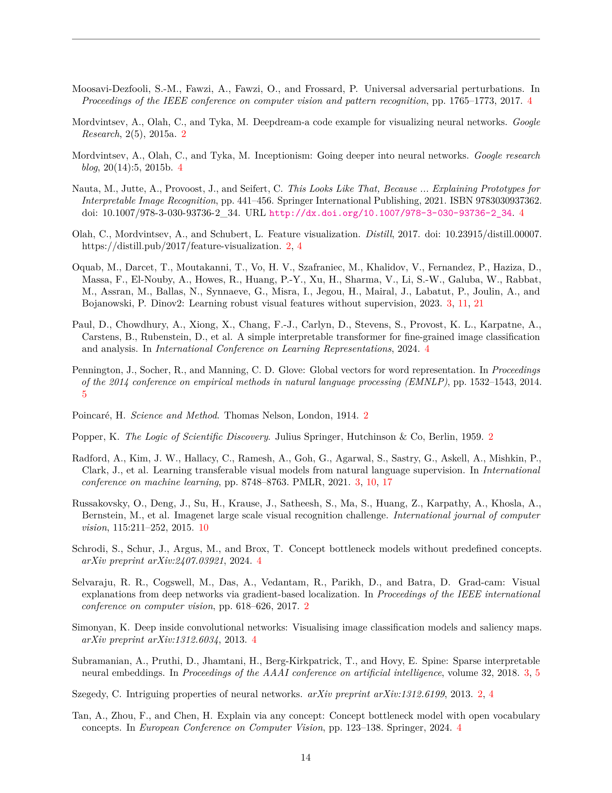

 


 2502.06755 
 Samuel Stevens et el. 
 
 🤗 2025-02-12 
 



↗ arXiv


↗ Hugging Face


### TL;DR



심층 신경망의 작동 원리를 제대로 이해하려면 단순히 관찰하는 것을 넘어 **통제된 실험을 통해 가설을 검증**하는 과정이 필요합니다. 하지만 기존 방법들은 해석 가능한 특징을 제공하지만 인과 관계를 검증할 수 없거나, 모델을 편집할 수 있지만 해석 가능한 통제가 불가능한 한계를 지닙니다.  

본 논문에서는 이러한 문제를 해결하기 위해 **희소 오토인코더(SAE)를 이용한 새로운 프레임워크**를 제시합니다.  **SAE는 복잡한 활성화 벡터를 사람이 이해하기 쉬운 희소한 특징으로 변환**하고, 이를 통해 모델의 행동을 제어하고 가설을 검증하는 실험을 수행할 수 있도록 합니다.  연구진은 최첨단 비전 모델에 본 방법을 적용하여 모델의 사전 훈련 목표에 따른 차이점을 밝혀내고, 여러 비전 작업에서 제어된 실험을 통해 프레임워크의 실용성을 입증했습니다.



#### Key Takeaways


 희소 오토인코더(SAE)를 이용한 통합 프레임워크로 시각적 특징 발견 및 조작 가능 



 다양한 사전 훈련 목표를 가진 모델에서 학습된 의미적 추상화의 차이점 규명 



 제어된 실험을 통해 비전 모델 동작에 대한 가설 검증 및 모델 행동 제어 가능성 입증 


#### Why does it matter?
**본 논문은 컴퓨터 비전 모델의 해석 가능성을 높이고, 인과 관계를 검증할 수 있는 새로운 프레임워크를 제시하여** 연구자들이 모델의 동작 방식을 보다 과학적으로 이해하고 제어할 수 있도록 합니다. **특히, 희소 오토인코더(SAE)를 사용하여 사람이 이해할 수 있는 시각적 특징을 발견하고, 이를 정밀하게 조작하여 모델의 행동에 대한 가설을 검증하는 방법**을 제시합니다.  이는 컴퓨터 비전 분야의 발전과 더불어, **인공지능 모델의 신뢰성 및 설명 가능성을 높이는 데 크게 기여**할 것으로 예상됩니다.

------
#### Visual Insights

> 🔼 본 그림은 유전체학과 딥러닝 모델 해석에 과학적 방법론을 적용한 것을 비교하여 보여줍니다. Grad-CAM은 모델 예측에 대한 가설을 세우는 데 유용하지만, 실험적으로 검증할 방법이 없습니다. 반면에 제안된 희소 오토인코더(SAE) 기반 방법은 특징 억제를 통해 가설을 실험적으로 검증할 수 있습니다. 자세한 내용은 5절을 참고하세요.
> 

> 
read the caption

> Figure 1:  We compare the scientific method when applied to genomics and deep learning model interpretation. Grad-CAM (Selvaraju et al., 2017) leverages saliency maps to produce hypothetical explanations for model predictions, but provides no natural way to experimentally validate the hypothesis. In comparison, our proposed use of sparse autoencoders (SAEs) for vision models naturally enables experimental validation via feature suppression. See Section 5 for more examples of experimental validation.
> 


| Method | Observe | Hypothesis | Experiment |
|---|---|---|---| 
| Genomics |  We observe the DNA sequence of a blue jay (*Cyanocitta cristata*), a bird with distinct blue wings. |  We hypothesize that these genes cause the blue coloration. |  We edit the gene (gene knockout) to validate that the hypothesized genes *do* cause blue coloration. |
| Grad-CAM |  We observe a CUB-2011-trained ViT correctly predict ”blue jay.” |  Grad-CAM hypothesizes the highlighted pixels are integral to the ViT’s prediction. |  How can we empirically validate GradCAM’s hypothesis? |
| SAEs |  We observe a CUB-2011-trained ViT correctly predict “blue jay.” We *manually* choose to inspect the bird’s wing. |  Our SAE finds similar patches from images not necessarily of blue jays; we hypothesize this “blue feathers” feature is integral to the ViT’s prediction. |  We suppress “blue feathers” and observe changed behavior: the ViT predicts “Clark’s nutcracker,” a similar species besides no coloration (examples above). |

> 🔼 표 A1은 희소 오토인코더(SAE)를 훈련시키는 데 사용된 하이퍼파라미터들을 보여줍니다. 표에는 은닉층 크기, 스파스티시티 계수(λ), 학습률(η), 배치 크기, 그리고 스파스티시티 계수와 학습률에 대한 웜업 단계의 스텝 수 등이 포함되어 있습니다. 스파스티시티 계수와 학습률은 발견된 특징들을 검토하여 정성적으로 선택되었습니다.  이 표는 모델 훈련에 사용된 다양한 하이퍼파라미터 값들을 명시적으로 제시하여, 연구의 재현성을 높이고 다른 연구자들이 동일한 설정으로 실험을 재현하는 데 도움을 줍니다.
> 

> 
read the caption

> Table A1: Hyperparameters for training SAEs. Sparsity coefficient λ𝜆\lambdaitalic_λ and learning rate η𝜂\etaitalic_η are chosen qualitatively by inspecting discovered features.
> 

### In-depth insights

#### Scientific Vision
**과학적 비전**이란, 단순히 컴퓨터 비전 모델의 기술적 성능 향상을 넘어, **인간의 시각적 인지 과정에 대한 근본적인 이해**를 추구하는 접근 방식입니다.  이는 단순히 이미지 분류나 객체 탐지와 같은 특정 과제의 정확도만을 평가하는 것이 아니라, 모델이 이미지를 어떻게 해석하고, 내부적으로 어떤 표상을 형성하는지, 그리고 그러한 표상이 인간의 시각적 경험과 어떻게 연결되는지를 탐구하는 것을 의미합니다.  **과학적 비전**은 모델의 내부 메커니즘을 투명하게 밝히고, **인과 관계를 검증하는 실험적 방법론**을 강조합니다.  따라서 해석 가능성(interpretability)과 통제된 실험(controlled experiments)을 통해 **가설을 검증하고 모델의 행동을 예측**하는 능력이 중요한 요소가 됩니다.  궁극적으로, 과학적 비전은 **인공지능 시스템에 대한 깊이 있는 이해**를 기반으로, 보다 신뢰할 수 있고, 윤리적인, 그리고 인간 중심적인 기술 개발을 위한 기틀을 마련하는 데 기여할 것입니다.

#### Sparse Autoencoders
본 논문에서 제시된 희소 오토인코더(SAE)는 **심층 시각 모델의 해석성을 높이기 위한 핵심적인 방법론**입니다.  SAE는 고차원의 복잡한 활성화 벡터를 저차원의 희소 표현으로 변환하여, 인간이 이해할 수 있는 의미있는 특징들을 추출하는 데 사용됩니다. 이를 통해 모델이 어떤 시각적 특징에 집중하는지, 그리고 그 특징들이 모델의 예측에 어떤 영향을 미치는지에 대한 통찰력을 얻을 수 있습니다. **특히, SAE는 특징들을 직접적으로 조작하고 그 영향을 관찰하는 제어된 실험을 가능하게 함으로써, 단순히 특징을 해석하는 것을 넘어서 그 인과적 관계를 검증**할 수 있습니다. 이는 기존의 해석 방법론들이 가진 한계를 극복하는 중요한 발전이며, 시각 모델의 기능과 작동 방식을 보다 과학적으로 이해하는 데 크게 기여합니다. **다양한 시각 과제에 적용 가능하며, 모델 재훈련 없이 기존 모델을 분석하고 제어**할 수 있다는 점 또한 SAE의 주요 강점입니다.  결론적으로, **SAE는 시각 모델의 과학적이고 엄밀한 해석 및 제어를 가능하게 하는 강력한 도구**로 평가할 수 있습니다.

#### Controlled Experiments
이 논문에서 제어된 실험이란 **인간이 이해할 수 있는 시각적 특징을 식별하고 조작하여 비전 모델의 행동에 대한 가설을 검증하는 방법**을 의미합니다.  기존의 접근 방식은 해석 가능한 특징을 제공하지만 인과 관계를 검증할 수 없거나, 또는 해석 가능한 제어 없이 모델 편집을 가능하게 합니다. 이 논문에서는 희소 오토인코더(SAE)를 사용하여 이러한 간극을 메우는 통합 프레임워크를 제시합니다.  **SAE는 얽힌 활성화 벡터를 고차원의 희소 표현으로 변환하여 각 비영 원소가 고유한 의미 개념에 해당**하도록 합니다. 이를 통해 **특징을 선택적으로 수정하여 모델의 예측 변화를 관찰**함으로써 가설을 검증하는 제어된 실험을 수행할 수 있습니다.  이는 생물학적 실험에서 유전자 기능을 검증하는 방식과 유사합니다.  **이 방법은 다양한 비전 모델에서 테스트되었으며, 다양한 사전 훈련 목표를 가진 모델이 학습하는 의미적 추상화의 차이를 보여줍니다.**  결론적으로, 이 논문은 **비전 모델의 이해와 제어를 위한 강력한 도구**를 제공하는 제어된 실험의 중요성을 강조합니다.

#### Model Dissection
모델 해체는 **심층 신경망의 내부 동작을 이해하기 위한 필수적인 방법**입니다. 이는 모델의 각 구성 요소(예: 뉴런, 레이어, 특징 맵)가 어떻게 상호 작용하여 최종 출력을 생성하는지 분석하는 것을 포함합니다.  **해석 가능한 특징을 식별하고, 이를 조작하여 모델의 행동에 대한 가설을 검증하는 데 사용**할 수 있습니다.  하지만 모델 해체는 **높은 차원의 특징 공간을 다루는 복잡성**,  **해석 가능성과 정확성 사이의 절충** 등의 어려움이 있습니다. 따라서 효과적인 모델 해체는 **적절한 시각화 기법**, **통계적 분석**, **인과 관계 추론** 등 다양한 기법의 통합을 필요로 합니다.  **희소 자동 인코더(SAE)와 같은 기법**은 고차원의 특징 공간을 저차원의 해석 가능한 공간으로 변환하여 모델 해체를 용이하게 할 수 있습니다.  **SAE를 활용한 모델 해체**는 특징의 인과적 역할을 규명하고, 모델 동작을 제어하는데 유용한 도구가 될 수 있습니다.  **실험적 검증을 통해 모델 동작에 대한 가설을 검증**하여 보다 정확한 이해를 도울 수 있습니다.  하지만 모델 해체는 단순히 특징을 파악하는 것을 넘어, **특징 간의 상호작용 및 인과 관계를 이해하는 것을 목표**로 해야 합니다.

#### Future of Vision
미래의 비전 연구 분야는 **해석 가능성과 제어 가능성**이라는 두 가지 중요한 측면을 동시에 고려해야 합니다.  단순히 모델의 내부 동작을 이해하는 것을 넘어, **인간이 이해할 수 있는 방식으로 특징을 파악하고 조작**하여 모델의 행동을 예측하고 제어하는 능력이 중요해지고 있습니다.  **희소 자동 인코더(SAE)** 와 같은 새로운 기술들은 이러한 목표를 달성하는 데 중요한 역할을 할 것으로 기대됩니다.  SAE는 복잡한 활성화 벡터를 **해석 가능한 희소 특징**으로 변환하여, 모델의 의사결정 과정을 투명하게 만들고, 개별 특징을 제어하여 모델의 반응을 조작할 수 있는 가능성을 제시합니다.  하지만, **대규모 모델에서 효율적인 특징 식별 및 조작** 기술의 개발, 그리고 다양한 비전 작업에 대한 **범용적인 프레임워크** 구축이라는 과제가 남아 있습니다.  **인과 관계를 명확하게 규명**하고, **다양한 모델 아키텍처와 훈련 목표에 대한 일반화된 이해**를 도출하기 위한 더 많은 연구가 필요합니다.

### More visual insights

More on figures

> 🔼 본 그림은 사전 훈련된 비전 트랜스포머(ViT)의 활성화 결과를 이용해 훈련된 희소 오토인코더(SAE)가 다양한 시각적 패턴과 의미 구조에 걸쳐 광범위한 특징들을 어떻게 발견하는지 보여줍니다.  ImageNet-1K 데이터셋으로 사전 훈련된 CLIP 기반 ViT-B/16 모델의 활성화 결과를 사용하여 훈련된 SAE로부터 추출된 8가지 서로 다른 특징들을 시각적으로 제시합니다. 각 특징은 다양한 이미지들에서 특징이 활성화되는 패턴을 보여주는 여러 이미지들을 포함합니다. 이를 통해 SAE가 단순한 시각적 패턴 뿐만 아니라, 더 추상적인 의미론적 개념까지도 효과적으로 학습할 수 있음을 시각적으로 보여줍니다.
> 

> 
read the caption

> Figure 2: Sparse autoencoders (SAEs) trained on pre-trained ViT activations discover a wide spread of features across both visual patterns and semantic structures. We show eight different features from an SAE trained on ImageNet-1K activations from a CLIP-trained ViT-B/16.
> 

> 🔼 이 그림은 사용자가 이미지에서 특정 영역(패치)을 선택하면, 해당 영역의 시각적 특징을 나타내는 대표 이미지들을 찾는 과정을 보여줍니다.  먼저, ViT(Vision Transformer)를 이용하여 선택된 패치들의 활성화 벡터를 추출합니다.  다음으로, (식 1, 2)에 따라 각 패치에 대한 희소 표현(sparse representation)을 계산합니다. 이렇게 얻은 여러 패치들의 희소 표현들을 더한 후, 활성화 크기가 가장 큰 상위 k개의 특징을 선택합니다. 마지막으로, 선택된 특징들을 최대화하는 기존 이미지들을 데이터셋에서 찾아서 보여줍니다. 이를 통해 사용자는 선택한 영역의 시각적 특징이 모델 내부에서 어떻게 표현되는지 이해하는 데 도움을 얻을 수 있습니다.
> 

> 
read the caption

> Figure 3: Given a picture and a set of highlighted patches, we find exemplar images by (1) getting ViT activations for each patch, (2) computing a sparse representation for each highlighted patch (Eqs. 1 and 2), (3) summing over sparse representations, (4) choosing the top k𝑘kitalic_k features by activation magnitude and (5) finding existing images that maximize these features.
> 

> 🔼 그림 4는 CLIP과 DINOv2 모델이 학습한 시각적 특징의 차이를 보여줍니다. CLIP은 브라질의 도시 풍경, 국기, 코파카바나 해변의 보도 타일 패턴 등 브라질 문화와 관련된 이미지에 강하게 반응하는 ‘브라질’ 특징(CLIP-24K/6909)을 학습했습니다. 반면 마추픽추나 아르헨티나 국기와 같은 다른 남미 이미지에는 반응하지 않았습니다. DINOv2의 SAE에서 비슷한 ‘브라질’ 특징을 찾아보면 DINOv2-24K/9823이 브라질 이미지에 반응하지만, ImageNet-1K 데이터셋에서 이 특징을 최대로 활성화하는 이미지는 램프 이미지였습니다. 이는 DINOv2-24K/9823이 브라질 문화적 상징을 안정적으로 감지하지 못함을 시사합니다.  즉, CLIP은 문화적 시각적 특징을 잘 학습하지만, DINOv2는 그렇지 못하다는 것을 보여줍니다.
> 

> 
read the caption

> Figure 4:  CLIP learns robust cultural visual features. Top Left (a): A “Brazil” feature (CLIP-24K/6909) responds to distinctive Brazilian imagery including Rio de Janeiro’s urban landscape, the national flag, and the iconic sidewalk tile pattern of Copacabana Beach Top Right (b): CLIP-24K/6909 does not respond to other South American symbols like Machu Picchu or the Argentinian flag. Bottom Left (c): We search DINOv2’s SAE for a similar “Brazil” feature and find that DINOv2-24K/9823 fires on Brazilian imagery. Bottom Right (d): However, maximally activating ImageNet-1K examples for DINOv2-24K/9823 are of lamps, convincing us that DINOv2-24K/9823 does not reliably detect Brazilian cultural symbols.
> 

> 🔼 그림 5는 CLIP이 다양한 시각적 스타일에서 지속되는 추상적 개념의 통합된 표현을 학습한다는 것을 보여줍니다. 강조 표시된 패치는 특징 활성화 강도를 나타냅니다. 왼쪽 상단에는 '사고' 또는 '충돌'에 일관되게 활성화되는 CLIP SAE 특징(CLIP-24K/20652)이 있습니다. 여기에는 자동차 사고, 비행기 추락, 만화에서 묘사된 충돌, 그리고 일반적으로 손상된 금속 등이 포함됩니다. 오른쪽 상단에는 CLIP-24K/20652 특징에 대한 ImageNet-1K의 두 가지 예시 이미지가 나와 있습니다. 왼쪽 하단에는 DINOv2 활성화를 사용하여 훈련된 SAE를 조사합니다. DINOv2-24K/9762가 가장 가까운 특징이지만, 모든 예시에서 안정적으로 작동하지는 않습니다. 오른쪽 하단에는 DINOv2-24K/9762 특징에 대한 ImageNet-1K의 두 가지 예시 이미지가 나와 있으며, 이는 '충돌'이라는 의미적 개념과 일치하지 않음을 명확히 합니다.
> 

> 
read the caption

> Figure 5:  CLIP learns unified representations of abstract concepts that persist across visual styles. Highlighted patches indicate feature activation strength. Upper Left: We find a CLIP SAE feature (CLIP-24K/20652) that consistently activates on “accidents” or “crashes”: car accidents, plane crashes, cartoon depictions of crashes and generally damaged metal. Upper Right: Two exemplar images from ImageNet-1K for feature CLIP-24K/20652. Lower Left: We probe an SAE trained on DINOv2 activations. DINOv2-24K/9762 is the closest feature, but does not reliably fire on all the examples. Lower Right: Two exemplar images from ImageNet-1K for feature DINOv2-24K/9762 clarifies that it does not match the semantic concept of “crash.”
> 

> 🔼 그림 6은 희소 오토인코더(SAE)를 사용하여 비전 모델의 동작을 이해하기 위한 과학적 방법을 보여줍니다. 왼쪽에는 CLIP이 '푸른 어치'를 예측하는 것을 보여줍니다. 가운데 위쪽에는 입력 이미지에서 새의 날개를 선택하고 SAE가 예시 이미지를 통해 가장 중요한 특징이 '푸른 깃털'이라는 가설을 제시하는 과정을 보여줍니다. 가운데 아래쪽에서는 식별된 '푸른 깃털' 특징을 모델의 활성화 공간에서 억제하여 이 가설을 검증하는 제어된 개입을 보여줍니다. 오른쪽에는 '푸른 어치'에서 '클락 잣까마귀'(푸른 깃털이 없는 유사한 종)로 예측 클래스가 이동하는 행동 변화를 관찰합니다. 이러한 관찰, 가설 형성 및 실험적 검증의 3단계 과정을 통해 비전 모델이 시각 정보를 처리하는 방식을 체계적으로 조사할 수 있습니다.
> 

> 
read the caption

> Figure 6:  Demonstrating the scientific method for understanding vision model behavior using sparse autoencoders (SAEs). Left: We observe that CLIP predicts “Blue Jay.” Upper Middle: We select the bird’s wing in the input image; the SAE proposes a hypothesis that the most salient feature is “blue feathers” via exemplar images. Lower Middle: We validate this hypothesis through controlled intervention by suppressing the identified “blue feathers” feature in the model’s activation space. Right: we observe a change in behavior: the predicted class shifts away from “Blue Jay” towards “Clark Nutcracker”, a similar bird besides the lack of blue plumage. This three-step process of observation, hypothesis formation, and experimental validation enables systematic investigation of how vision models process visual information.
> 

> 🔼 그림 7은 DINOv2 모델의 모래 특징(sand feature)을 제거했을 때의 영향을 보여줍니다. 먼저, 각 패치에 대한 의미론적 분할 클래스(semantic segmentation classes)를 예측하는 선형 분류기를 학습시킵니다. 그림의 왼쪽에서 두 번째 부분은 입력 이미지에서 모래로 채워진 모든 패치를 선택하는 것을 보여줍니다. 가운데 오른쪽 부분은 최대 활성화된 희소 차원(maximally activating sparse dimensions)에 대한 예시 이미지를 보여주는 SAE를 보여줍니다. 이는 DINOv2가 모래 특징을 학습하고 있음을 시사합니다. 그림의 오른쪽 부분은 선택된 패치뿐만 아니라 모든 패치에서 모래 특징을 제거하는 것을 보여줍니다. 모든 활성화 벡터를 수정하여 DINOv2의 최종 변압기 계층(final transformer layer)과 학습된 선형 분할 헤드에 전달합니다. 그 결과 이전 모래 패치에 대해 '땅(earth)', '지면(ground)', '물(water)'을 예측하는 것을 볼 수 있습니다. '모래'가 없을 경우 두 번째로 적절한 클래스입니다. 특히 다른 패치는 의미 있게 영향을 받지 않아 SAE의 학습된 특징 벡터의 의사 직교성(pseudo-orthogonality)을 보여줍니다.
> 

> 
read the caption

> Figure 7: Far Left: We train a linear head to predict semantic segmentation classes for each patch. Middle Left: We choose all sand-filled patches in the input image to inspect. Middle Right: Our SAE proposes exemplar images for the maximally activating sparse dimensions, as in Section 5.1, suggesting that DINOv2 is learning a sand feature. Far Right: We suppress the sand feature in not just the selected patches, but all patches. We modify all activation vectors and pass them to DINOv2’s final transformer layer followed by our trained linear segmentation head. We see that the head predicts “earth, ground” and “water” for the former sand patches. Both classes are good second choices if “sand” is unavailable. Notably, other patches are not meaningfully affected, demonstrating the pseudo-orthogonality of the SAE’s learned feature vectors.
> 

> 🔼 그림 B1은 CLIP이 학습한 문화적 특징의 추가적인 예시를 보여줍니다. 윗부분은 CLIP-24K/7622가 조지 워싱턴 초상화를 포함한 미국 관련 상징물에 반응하지만, 프랑스 루이 14세 초상화에는 반응하지 않는다는 것을 보여줍니다. 아랫부분은 CLIP-24K/13871이 브란덴부르크 문과 기타 독일 상징물에 강하게 반응하지만, 벨기에 국기와 같은 시각적으로 유사한 국기에 대해서는 반응하지 않는다는 것을 보여줍니다. 이는 CLIP이 단순히 시각적 유사성이 아닌 문화적 맥락을 고려하여 특징을 학습한다는 것을 시사합니다.
> 

> 
read the caption

> Figure B1:  Additional examples of cultural features learned by CLIP. Top: CLIP-24K/7622 responds to symbolism from the United States of America, including a portrait of George Washington, but not to a portrait of King Louis XIV of France. Bottom: CLIP-24K/13871 activates strongly on the Brandenburg Gate and other German symbols, but not on visually similar flags like the Belgian flag.
> 

> 🔼 이 그림은 열대 벌새류의 특징인 노란색 가슴을 보여줍니다.  '노란 깃털' 특징을 제거했을 때, 선형 분류기는 회색 가슴을 가진 비슷한 종인 회색 벌새류를 예측합니다. 이는 모델이 시각적 특징을 어떻게 처리하고 해석하는지 보여주는 예시입니다.  자세한 내용은 https://osu-nlp-group.github.io/SAE-V/demos/classification?example=5099 에서 확인할 수 있습니다.
> 

> 
read the caption

> Figure C2: Tropical Kingbirds have a distinctive yellow chest. When we suppress a “yellow feathers” feature, our linear classifier predicts Gray Kingbird, a similar species but with a gray chest. This example is available at https://osu-nlp-group.github.io/SAE-V/demos/classification?example=5099
> 

> 🔼 그림 C3는 캐나다 워블러(Canada Warbler)가 가슴에 독특한 검은색 목걸이 무늬를 가지고 있는 것을 보여줍니다. CLIP-24K/20376은 유사한 패턴에 반응하는데, 이 특징을 억제하면 선형 분류기는 독특한 검은색 목걸이 무늬가 없는 유사한 종인 윌슨 워블러(Wilson Warbler)를 예측합니다. 이 예시는 https://osu-nlp-group.github.io/SAE-V/demos/classification?example=1129 에서 확인할 수 있습니다.
> 

> 
read the caption

> Figure C3: Canada Warblers have a distinctive black necklace on the chest. CLIP-24K/20376 fires on similar patterns; when we suppress this feature, the linear classifier predicts Wilson Warbler, a similar species without the distinctive black necklace. This example is available at https://osu-nlp-group.github.io/SAE-V/demos/classification?example=1129
> 

> 🔼 그림 C4는 붉은색 깃털이 특징인 자주색 핀치의 이미지와, 해당 특징을 제거했을 때의 분류 결과를 보여줍니다.  CLIP-24K/10273이라는 특징 벡터는 붉은색 깃털을 나타내는 것으로 추정되며, 이를 억제했을 때 모델은 비슷한 날개 무늬를 가지고 있지만 붉은색 깃털이 없는 들새인 들참새를 예측합니다. 이는 모델이 붉은색 깃털이라는 시각적 특징을 이용하여 자주색 핀치를 식별한다는 것을 보여주는 실험 결과입니다.  자세한 내용은 https://osu-nlp-group.github.io/SAE-V/demos/classification?example=4139 에서 확인할 수 있습니다.
> 

> 
read the caption

> Figure C4: Purple finches have bright red coloration on the head and neck area; when we suppress CLIP-24K/10273, which appears to be a “red feathers” feature, our classifier predicts Field Sparrow, which has similar wing banding but no red coloration. This example is available at https://osu-nlp-group.github.io/SAE-V/demos/classification?example=4139
> 

### Full paper



