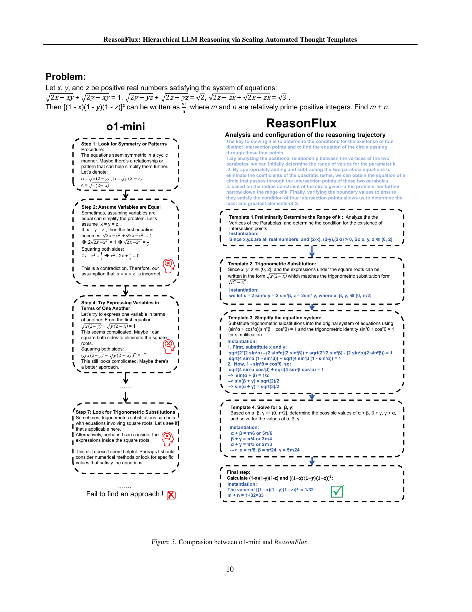

 


 2502.06772 
 Ling Yang et el. 
 
 🤗 2025-02-11 
 



↗ arXiv


↗ Hugging Face


### TL;DR



LLM의 추론 능력 향상은 인공지능 분야의 중요한 과제입니다. 기존의 방법들은 계산 비용이 높거나 일반화 능력이 낮다는 한계가 있었습니다.  ReasonFlux는 이러한 문제를 해결하기 위해 **계층적 강화 학습**과 **확장 가능한 사고 템플릿**을 활용합니다.  

ReasonFlux는 500개 이상의 고차원 사고 템플릿을 포함하는 라이브러리를 구축하고, 이를 통해 LLM이 문제 해결에 필요한 최적의 템플릿 경로를 계획할 수 있도록 합니다. **새로운 추론 확장 시스템**을 통해 추론 과정에서 템플릿을 적응적으로 확장함으로써 효율성과 정확성을 동시에 높입니다. 다양한 수학 문제 벤치마크에서 기존 최고 성능을 뛰어넘는 결과를 보이며, LLM 기반 추론 모델의 새로운 가능성을 제시합니다.



#### Key Takeaways


 ReasonFlux는 계층적 강화 학습과 확장 가능한 사고 템플릿을 이용하여 복잡한 수학 문제 해결 능력을 향상시킵니다. 



 구조화된 사고 템플릿 라이브러리와 새로운 추론 확장 시스템을 통해 추론 과정의 효율성과 일반화 능력을 향상시킵니다. 



 다양한 수학적 추론 벤치마크에서 기존 최고 성능 모델들을 능가하는 성능을 달성했습니다. 


#### Why does it matter?
본 논문은 **계층적 사고 템플릿을 확장**하여 강력한 LLM의 추론 능력을 향상시키는 새로운 방법인 ReasonFlux를 제시합니다. 이는 복잡한 추론 문제를 해결하는 데 있어 **새로운 표준**을 제시하며, 추론 효율성을 크게 높이고 일반화 능력을 향상시키는 데 기여할 수 있습니다.  ReasonFlux의 혁신적인 접근 방식은 **다른 연구자들에게 영감**을 주어 더욱 효율적이고 강력한 추론 모델을 개발하는 데 기여할 것으로 예상됩니다. 또한, **다양한 수학적 추론 벤치마크**에서 기존 최고 성능을 능가하는 실험 결과는 ReasonFlux의 실용성과 우수성을 보여줍니다. 

------
#### Visual Insights

> 🔼 이 그림은 ReasonFlux 모델의 학습 프레임워크를 보여줍니다.  ReasonFlux는 계층적 강화 학습을 통해 입력 문제에 대한 최적의 일반화 가능한 사고 템플릿 경로를 계획하는 모델입니다.  이 그림은 입력 문제가 분석 및 검색 단계를 거쳐 적절한 사고 템플릿을 선택하고,  여러 템플릿 후보군 중에서 강화 학습을 통해 최적의 템플릿 경로를 학습하는 과정을 시각적으로 나타냅니다. 학습된 모델은 최적의 템플릿 경로를 따라 문제를 해결하게 됩니다.  추론 스케일링 프레임워크는 그림 2에 자세히 설명되어 있습니다.
> 

> 
read the caption

> Figure 1: Training framework for our ReasonFlux. We train with hierarchical reinforcement learning to enable the model to plan out an optimal and generalizable thought template trajectory for an input problem. Our new inference-scaling framework is in Figure 2.
> 


| Task | ReasonFlux | DeepSeek | OpenAI | OpenAI | QWQ | GPT |
|---|---|---|---|---|---|---|
| MATH | **91.2** | 90.2 | 85.5 | 90.0 | 90.6 | 76.6 |
| AIME 2024 | **56.7** | 39.2 | 44.6 | 56.7 | 50.0 | 9.3 |
| Olympiad Bench | **63.3** | 55.4 | - | 65.3 | 61.2 | 43.3 |
| GaokaoEn 2023 | **83.6** | - | 71.4 | 78.4 | 65.3 | 67.5 |
| AMC2023 | **85.0** | 80.0 | 90.0 | 95.0 | - | 47.5 |

> 🔼 표 1은 다양한 수학 추론 벤치마크에 대한 ReasonFlux-32B 모델과 다른 여러 모델들의 성능을 비교한 표입니다.  Pass@1 정확도를 기준으로 MATH, AIME 2024, Olympiad Bench, GaokaoEn 2023, AMC 2023 등 다섯 가지 벤치마크에서 ReasonFlux-32B 모델이 다른 모델들에 비해 상당히 높은 정확도를 달성했음을 보여줍니다.  특히 MATH 벤치마크에서 ReasonFlux-32B는 OpenAI o1-preview보다 6.7% 높은 91.2%의 정확도를 기록했습니다.  AIME 2024 벤치마크에서는 평균 56.7%의 문제를 해결하여 o1-preview와 DeepSeek-V3보다 각각 27%와 45% 앞섰습니다.
> 

> 
read the caption

> Table 1: Performance Comparison on Various Math Reasoning Benchmarks (Pass@1 Accuracy)
> 

### In-depth insights

#### Hierarchical Reasoning
본 논문에서 제시된 계층적 추론 방식은 **복잡한 문제 해결을 위해 다양한 추론 단계를 계층적으로 구성하여 효율성을 높이는 전략**입니다.  단순히 연역적 또는 귀납적 추론만 사용하는 것이 아니라, 상황에 맞춰 여러 추론 방식을 조합하여 적용합니다.  이는 마치 인간이 문제를 해결할 때 여러 단계의 사고 과정을 거치는 것과 유사합니다. 특히, **각 단계에서 사용하는 추론 전략은 문제의 복잡도에 따라 동적으로 조절**되어 최적의 해결책을 찾아나가는 과정을 보여줍니다.  **계층적 구조를 통해 추론 과정의 효율성을 높이고, 복잡한 문제에 대한 일반화 능력을 향상**시킬 수 있다는 점이 핵심입니다.  이는 기존의 단순한 추론 방식에 비해 **훨씬 강력하고 유연한 문제 해결 능력**을 제공합니다.  **본 논문의 핵심 아이디어는 계층적 구조와 동적 조절을 통해 추론 과정의 효율성과 일반화 능력을 향상시킨 것**이며, 향후 연구에서 더욱 발전된 계층적 추론 모델을 기대할 수 있게 합니다.

#### Template Scaling
본 논문에서 제시된 '템플릿 스케일링' 개념은 **계층적 추론 과정을 효율적으로 최적화**하기 위한 핵심 전략입니다.  **문제 복잡도에 따라 템플릿의 크기와 상호 작용 횟수를 동적으로 조절**하여 추론 과정의 효율성과 정확성을 동시에 향상시키는 것을 목표로 합니다. 단순히 템플릿의 수를 늘리는 것이 아니라, 문제 유형 및 복잡도에 맞춰 적절한 크기의 템플릿을 선택하고, 필요에 따라 상호 작용 횟수를 조정하는 지능적인 접근 방식을 통해 **탐색-활용 간의 균형을 유지**하려는 시도가 돋보입니다. 이는 기존의 단순한 방법들에 비해 **훨씬 효율적이고 강건한 추론 과정**을 가능하게 할 것으로 기대됩니다.  이는  **계산 비용을 절감**하면서 동시에 **정확도를 높이는** 데 기여할 수 있으며, 다양한 복잡도의 문제에 유연하게 대처하는 데 유용할 것으로 보입니다.  **템플릿 라이브러리의 구조화 및 효율적인 검색 전략** 또한 템플릿 스케일링의 효과적인 구현을 위해 필수적인 요소로 생각됩니다.

#### RL Thought Traj
RL Thought Traj는 강화학습(Reinforcement Learning)을 기반으로 사고 과정(Thought Process)을 최적화하는 기법을 의미합니다. **본 논문에서는 계층적 강화학습을 통해 최적의 사고 흐름(Thought Trajectory)을 학습하는 모델을 제시합니다.**  이는 단순히 단계별 추론(Chain-of-Thought)을 넘어, **상위 수준의 추상적 사고 단계들을 계획하고, 하위 수준의 세부적인 추론 단계들을 효율적으로 연결하는 것을 목표**로 합니다. 이러한 접근법은 복잡한 추론 문제에 대해 **탐색 공간(Search Space)을 효과적으로 축소**하고, **일반화 성능(Generalization)**을 향상시키는 데 도움이 될 것으로 예상됩니다.  특히, **계층적인 구조**를 통해 각 단계별로 적절한 사고 전략을 선택하여 문제 해결의 효율성을 높이고, 복잡한 문제에 대한 접근성을 개선할 수 있다는 점이 핵심입니다.  **다양한 종류의 문제에 대해 유연하게 적용될 수 있는 일반화된 사고 템플릿(Thought Template) 라이브러리**를 구축하고, 이를 바탕으로 강화학습을 통해 최적의 사고 흐름을 학습하는 전략은 **새로운 추론 방식**을 제시하며, 기존의 단순한 추론 방식의 한계를 극복하는 데 기여할 수 있을 것입니다.

#### Inference Efficiency
본 논문에서는 추론 효율성을 높이기 위한 몇 가지 핵심 전략을 제시합니다. **계층적 강화 학습(Hierarchical Reinforcement Learning)**을 통해 최적의 사고 템플릿 경로를 계획하고, **자동화된 사고 템플릿 크기 조정(Automated Thought Template Scaling)** 시스템을 통해 추론 과정에서 효율적인 탐색-활용 균형을 달성합니다.  또한, **구조화된 사고 템플릿 라이브러리(Structured Thought Template Library)**를 구축하여 효율적인 검색과 적응을 지원하고, **새로운 추론 확장 시스템(New Inference Scaling System)**을 설계하여 계층적 추론을 가능하게 합니다. 이러한 혁신적인 접근 방식은 복잡한 추론 과제에 대한 추론 효율성과 정확성을 크게 향상시킵니다.

#### Future Directions
본 논문에서 제시된 ReasonFlux는 계층적 사고 템플릿을 이용한 강력한 추론 프레임워크이지만, **향후 연구 방향**은 다음과 같이 설정될 수 있습니다.  **다양한 유형의 문제에 대한 일반화 성능 향상**을 위해 더욱 광범위한 데이터셋으로 모델을 학습시키고, 템플릿 라이브러리의 규모를 확장하여 더욱 다양하고 복잡한 문제를 해결할 수 있도록 해야 합니다. 또한, **추론 효율성 개선**을 위해 더욱 효율적인 템플릿 검색 및 선택 알고리즘을 개발하고, 추론 과정에서의 계산 비용을 줄이는 방안을 모색해야 합니다.  **다른 모달리티와의 통합**을 통해 텍스트뿐만 아니라 이미지, 오디오 등 다양한 데이터를 활용한 추론 능력을 강화하는 연구도 중요합니다.  **대규모 언어 모델의 한계점 극복**을 위해 모델의 설명 가능성을 높이고, 편향성 문제를 해결하는 방안을 연구해야 합니다. 마지막으로, **실제 응용 분야**에 ReasonFlux를 적용하여 그 실용성을 검증하고, 사용자 경험을 개선하는 연구가 필요합니다. 이러한 노력들을 통해 ReasonFlux는 보다 강력하고 실용적인 추론 시스템으로 발전할 수 있을 것입니다.

### More visual insights

More on figures

> 🔼 그림 2는 계층적 추론에 기반한 새로운 추론 스케일링 시스템을 보여줍니다. 복잡한 문제에 대해 일련의 고차원 사고 템플릿을 검색하고, 일련의 하위 문제에 대해 점진적으로 구체화된 추론을 수행합니다.  즉, ReasonFlux는 복잡한 문제를 여러 개의 더 작고 관리하기 쉬운 하위 문제로 분해하여 해결하는 과정을 보여줍니다.  각 하위 문제마다 적절한 고차원 사고 템플릿을 선택하여 적용하고, 그 결과를 바탕으로 다음 단계의 추론을 진행합니다. 이러한 계층적 접근 방식은 추론 과정의 효율성과 정확성을 높입니다.
> 

> 
read the caption

> Figure 2: New inference scaling system based on hierarchical reasoning. We retrieve a series of high-level thought templates for complex problems, and gradually conduct instantiated reasoning for a sequence of sub-problems.
> 

> 🔼 그림 3은 OpenAI의 01-mini 모델과 ReasonFlux 모델의 추론 과정을 비교하여 보여줍니다.  01-mini는 단순히 대칭성이나 패턴을 찾고 변수를 동일하다고 가정하는 등의 시도를 하지만, 최적의 해결책에 도달하지 못하고 접근 방식을 찾지 못하는 반면, ReasonFlux는 추론 과정을 위한 최적의 경로를 계획하고, 관련된 고차원 사고 템플릿을 검색하고 활용하여 문제를 단계적으로 해결해 나가는 과정을 보여줍니다.  ReasonFlux는 수학적 개념과 관계를 분석하고, 적절한 템플릿을 선택하고 인스턴스화하여, 효율적이고 효과적인 문제 해결 과정을 보여줍니다.  즉, 01-mini가 단순히 시행착오를 통해 문제 해결을 시도하는 반면, ReasonFlux는 계층적 강화 학습을 통해 최적의 추론 경로를 계획하고,  구조화된 템플릿 라이브러리를 이용하여 효율적으로 문제를 해결하는 모습을 비교하여 보여주는 그림입니다.
> 

> 
read the caption

> Figure 3: Comprasion between o1-mini and ReasonFlux.
> 

> 🔼 그림 4는 ReasonFlux에서 템플릿 기반 추론에 대한 추론 스케일링 법칙을 보여줍니다. (a)는 문제 복잡성이 증가함에 따라 계획 및 인스턴스화 간 상호 작용 라운드의 스케일링을 보여줍니다. (b)는 문제 복잡성이 증가함에 따라 검색된 템플릿의 스케일링을 보여줍니다. 즉, 문제의 복잡도가 높아질수록 ReasonFlux는 더 많은 템플릿을 검색하고 계획과 인스턴스화 간에 더 많은 상호 작용 라운드를 수행합니다. 이는 ReasonFlux가 문제의 복잡성에 따라 적응적으로 추론 과정을 조정함을 보여주는 것입니다.
> 

> 
read the caption

> Figure 4: Inference scaling laws for template-augmented reasoning in ReasonFlux. (a) Scaling interplay rounds between planning and instantiation with increased level of problem complexity. (b) Scaling retrieved templates with increased level of problem complexity.
> 

> 🔼 그림 5는 서로 다른 추론 전략 간의 탐색-활용 비용 비교를 보여줍니다. 1983년부터 2023년까지의 AIME 경시대회에서 추출한 다양한 난이도의 문제 200개를 사용하여 실험했습니다. ReasonFlux(상호 작용 라운드 수), MCTS(추론 단계 수), Best-of-N(추론 경로 수)의 평균 탐색 비용을 비교 분석했습니다.
> 

> 
read the caption

> Figure 5: Exploration-Exploitation Trade-off Comparison between different reasoning strategies. Here we experiment with a diverse set of 200 problems sourced from the AIME competitions spanning 1983 to 2023, divided into four difficulty levels. We test the average exploration cost of ReasonFlux (number of interplay rounds), MCTS (number of reasoning steps) and Best-of-N (number of reasoning trajectories).
> 

More on tables


| Model | MATH | AIME 2024 | AMC 2023 | Olympiad Bench | Gaokao En 2023 |
|---|---|---|---|---|---| 
| **Frontier LLMs** |  |  |  |  |  |
| GPT-4o | 76.6 | 9.3 | 47.5 | 43.3 | 67.5 |
| Claude3.5-Sonnet | 78.3 | 16.0 | - | - | - |
| GPT-o1-preview | 85.5 | 44.6 | 90.0 | - | 71.4 |
| GPT-o1-mini | 90.0 | 56.7 | 95.0 | 65.3 | 78.4 |
| **Open-Sourced Reasoning LLMs** |  |  |  |  |  |
| DeepSeek-Coder-V2-Instruct | 75.3 | 13.3 | 57.5 | 37.6 | 64.7 |
| Mathstral-7B-v0.1 | 57.8 | 0.0 | 37.5 | 21.5 | 46.0 |
| NuminaMath-72B-CoT | 64.0 | 3.3 | 70.0 | 32.6 | 58.4 |
| LLaMA3.1-8B-Instruct | 51.4 | 6.7 | 25.0 | 15.4 | 38.4 |
| LLaMA3.1-70B-Instruct | 65.4 | 23.3 | 50.0 | 27.7 | 54.0 |
| LLaMA3.1-405B-Instruct | 73.8 | - | - | 34.8 | - |
| Qwen2.5-Math-72B-Instruct | 85.6 | 30.0 | 70.0 | 49.0 | 71.9 |
| rStar-Math | 88.2 | 43.3 | 80.0 | 63.1 | 78.2 |
| DeepSeek-V3 | 90.2 | 39.2 | 80.0 | 55.4 | - |
| **ReasonFlux-32B** | **91.2** | **56.7** | **85.0** | **63.3** | **83.6** |
|  |  |  | _1.5B-Level Base Model_ |  |  |
| Qwen2.5-Math-1.5B | 51.2 | 0.0 | 22.5 | 16.7 | 46.5 |
| Qwen2.5-Math-1.5B-Instruct | 60.0 | 10.0 | 60.0 | 38.1 | 65.5 |
| **ReasonFlux-1.5B** | **70.4** | **20.0** | **72.5** | **49.0** | **76.6** |
|  |  |  | _7B-Level Base Model_ |  |  |
| Qwen2.5-Math-7B | 58.8 | 3.3 | 22.5 | 21.8 | 51.7 |
| SuperCorrect-7B | 70.2 | 10.0 | 37.5 | 39.0 | 64.0 |
| Qwen2.5-Math-7B-Instruct | 82.6 | 13.3 | 62.5 | 41.6 | 66.8 |
| **ReasonFlux-7B** | **88.6** | **36.7** | **80.0** | **54.8** | **80.5** |
|  |  |  | _32B-Level Base Model_ |  |  |
| Qwen2.5-32B-Instruct | 79.4 | 16.5 | 64.0 | 45.3 | 72.1 |
| QwQ-32B-preview | 90.6 | 50.0 | 75.0 | - | 65.3 |
| Sky-T1-32B-preview | 86.4 | 43.3 | - | 59.8 | - |
| **ReasonFlux-32B** | **91.2** | **56.7** | **85.0** | **63.3** | **83.6** |
> 🔼 표 2는 다양한 수학적 추론 벤치마크에 대한 ReasonFlux-32B 모델을 포함한 여러 모델들의 Pass@1 정확도 비교 결과를 보여줍니다.  Pass@1 정확도는 모델이 각 문제에 대해 정답을 제시했는지 여부를 나타내는 지표입니다.  표에는 MATH, AIME 2024, AMC 2023, Olympiad Bench, Gaokao En 2023 등 다양한 벤치마크에 대한 각 모델의 성능이 제시되어 있으며, ReasonFlux 모델이 다른 최첨단 모델들에 비해 우수한 성능을 보이는 것을 확인할 수 있습니다.  이 표를 통해 ReasonFlux 모델의 수학적 추론 능력이 뛰어남을 정량적으로 비교 분석하고 있습니다.
> 

> 
read the caption

> Table 2: Pass@1 accuracy comparison on various mathematical reasoning benchmarks.
> 


| Model | direct reasoning (%) | with Template (%) |
|---|---|---|
| Llama-3.1-8B-Instruct | 47.6 | 75.1 (+27.5) |
| Qwen2.5-7B-Instruct | 59.2 | 82.7 (+23.5) |
| Qwen2.5-Math-7B-Instruct | 66.5 | 88.4 (+21.9) |
| Llama-3.1-70B-Instruct | 67.4 | 91.2 (+23.8) |
| Qwen2.5-32B-Instruct | 69.2 | 94.3 (+25.1) |
| Qwen2.5-Math-32B-Instruct | 71.1 | 95.9 (+24.8) |
> 🔼 표 3은 유사한 수학 문제들에 대해 서로 다른 기반 LLM에 대해 저희가 제시한 사고 템플릿의 일반화 능력을 보여줍니다.  각 기반 모델에 대해 직접적인 추론과 템플릿 기반 추론의 정확도를 비교하여, 제시된 사고 템플릿이 다양한 기반 모델에서도 효과적으로 일반화될 수 있음을 보여줍니다.
> 

> 
read the caption

> Table 3: Generalization ability of our thought templates with different base LLMs on a series of similar mathematical problems.
> 

### Full paper



