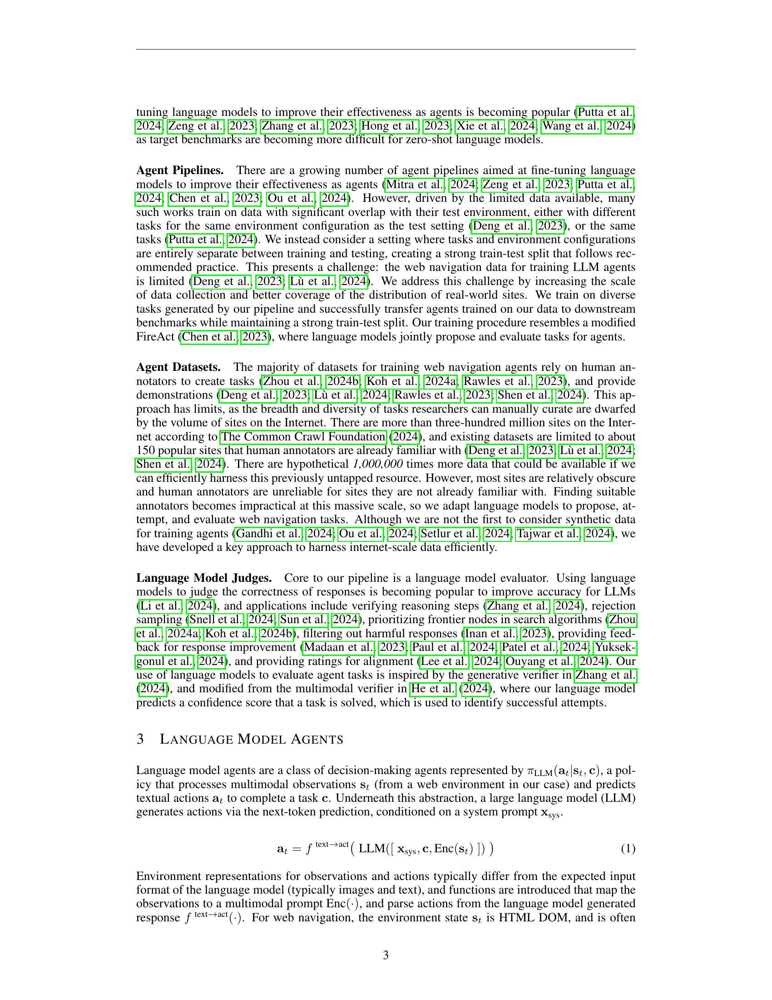
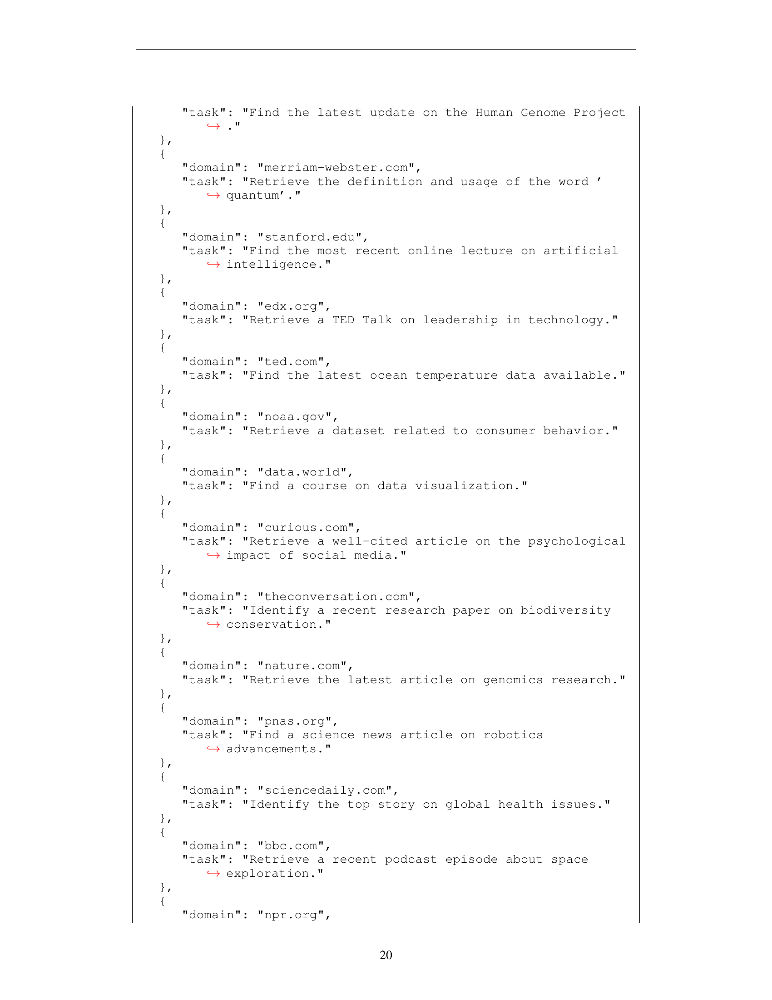

 


 2502.06776 
 Brandon Trabucco et el. 
 
 🤗 2025-02-11 
 



↗ arXiv


↗ Hugging Face


### TL;DR



기존 웹 탐색 에이전트 훈련은 **인간이 직접 데이터를 수집 및 주석 처리** 해야 하므로 비효율적이고 확장성이 떨어진다는 문제가 있었습니다. 특히 인기 없는 웹사이트의 경우, 인간의 주석 처리 정확도가 낮아 신뢰도가 떨어지는 문제점이 있었습니다. 또한, **기존 연구는 인간이 수작업으로 선별한 소수의 웹사이트** 에만 집중하여, 실제 인터넷 환경의 다양성을 제대로 반영하지 못했습니다.

본 논문에서는 이러한 문제를 해결하기 위해 **LLM(대규모 언어 모델)을 이용한 자동 데이터 파이프라인 InSTA** 를 개발했습니다. InSTA는 LLM을 사용하여 다양한 웹사이트에 대한 작업을 자동으로 생성하고, LLM 에이전트가 작업을 수행하고, 마지막으로 LLM이 결과를 평가하는 3단계로 구성됩니다.  **실험 결과, InSTA는 인간보다 훨씬 높은 정확도로 안전한 콘텐츠를 식별하고, 실현 가능한 작업을 생성하며, 작업 성공 여부를 판단했습니다.**  또한, InSTA를 통해 생성된 데이터를 사용하여 훈련된 에이전트는 기존의 인간 주석 데이터 기반 에이전트보다 성능이 뛰어났으며, 데이터가 제한적인 상황에서도 성능 향상을 보였습니다.



#### Key Takeaways


 LLM 기반 자동 데이터 파이프라인 InSTA를 통해 인간의 개입을 최소화하면서 인터넷 규모의 웹 탐색 데이터를 생성하는 방법을 제시했습니다. 



 합성 데이터를 사용하여 웹 에이전트의 성능을 향상시켰으며, 특히 데이터가 제한적인 상황에서 기존 방법보다 훨씬 높은 정확도를 달성했습니다. 



 InSTA를 통해 생성된 데이터는 다양한 웹사이트에 대한 일반화 성능을 크게 향상시켜, 기존의 웹 에이전트 벤치마크를 뛰어넘는 성능을 보였습니다. 


#### Why does it matter?
본 논문은 **대규모 언어 모델(LLM)** 에 기반한 웹 탐색 에이전트 훈련에 있어서 **인간의 개입을 최소화** 하는 새로운 방법론을 제시하여, 기존의 어려움을 극복하고 **인터넷 규모의 데이터를 활용** 할 수 있는 가능성을 열었다는 점에서 중요합니다. 이는 향후 **웹 에이전트 연구의 새로운 방향** 을 제시하며, **안전하고 효율적인 데이터 파이프라인 구축** 에 대한 중요한 시사점을 제공합니다.  연구의 결과는 **다양한 웹 사이트에 대한 일반화 성능을 향상** 시키는 데 기여하며, **합성 데이터의 활용 가능성** 을 보여주는 실질적인 사례를 제시합니다.  이는 **인공지능 에이전트의 확장성 및 안전성** 문제 해결에 크게 기여할 것으로 예상됩니다.

------
#### Visual Insights

> 🔼 본 그림은 인터넷 규모의 웹 내비게이션 에이전트를 위한 데이터 생성 파이프라인을 보여줍니다.  세 단계로 구성되어 있는데, 첫째는 사전 훈련된 거대 언어 모델(LLM)을 사용하여 100만 개 웹사이트에서 15만 개의 다양한 작업을 생성하는 단계입니다. 둘째는 LLM 에이전트가 웹 브라우저를 사용하여 작업을 수행하고 경로를 생성하는 단계이고, 마지막으로 또 다른 LLM이 이 경로를 검토하고 성공 여부를 판단하는 단계입니다. 이 파이프라인을 통해 수집된 데이터는 사람의 주석 없이도 인터넷 규모의 에이전트 훈련을 가능하게 합니다.  data-for-agents.github.io 에서 코드와 에이전트 실행 추적을 확인할 수 있습니다.
> 

> 
read the caption

> Figure 1: Overview of the proposed agent pipeline. We develop a pipeline for training web navigation agents at internet scale using tasks proposed, attempted, and evaluated by pretrained large language models. We generate 150k diverse tasks across 1M internet sites. Code for our data generation pipeline, and traces for agent rollouts will be available on our website: data-for-agents.github.io.
> 


| Method | Acc. | Prec. | Recall |
|---|---|---|---| 
| _Llama 3.1 70B_ | 85% | 0.77 | **1.00** |
| _GPT-4o_ | 95% | 0.91 | **1.00** |
| _Gemini 1.5 Pro_ | **97**% | **0.96** | 0.98 |
| Human Baseline | 75% | 0.71 | 0.84 |

> 🔼 표 1은 본 논문에서 사용된 하이퍼파라미터들을 보여줍니다.  다섯 가지 섹션으로 구성되어 있으며, 각각은 언어 모델 백본의 이름, 데이터 생성 파이프라인의 매개변수, OpenAI 추론 API의 샘플링 매개변수, 해당하는 벤치마크에 사용된 학습 매개변수, 그리고 6장에서 에이전트 훈련을 위한 데이터를 준비하는 데 사용된 필터링 매개변수를 포함합니다. 이 표는 논문에서 사용된 다양한 하이퍼파라미터들의 개요를 제공하여, 실험 설정에 대한 명확한 이해를 돕습니다.
> 

> 
read the caption

> Table 1: Hyperparameters used in our paper. We organize hyperparameters into five sections, including names of language model backbones, parameters of the data generation pipeline, sampling parameters for the OpenAI inference API, training parameters used by corresponding benchmarks, and filtering parameters used to prepare our data for training agents in Section 6.
> 

### In-depth insights

#### Internet-Scale Agents
본 논문에서 제시된 인터넷 규모 에이전트는 **방대한 웹 데이터를 활용하여 에이전트 학습의 효율성을 크게 높이는 방법**을 제시합니다. 기존의 인간 주석에 의존하는 방식에서 벗어나, **대규모 언어모델을 이용해 웹 탐색 작업을 자동 생성 및 평가**함으로써, 인터넷 규모의 데이터를 활용할 수 있는 기반을 마련합니다.  **안전성 및 신뢰성을 확보**하기 위한 필터링 기법도 포함되어 있으며, 제한된 데이터 환경에서도 인간 주석 데이터보다 우수한 성능을 보입니다.  **다양한 실제 웹사이트에 대한 일반화 능력 향상**에도 기여하며, 인터넷 규모의 에이전트를 위한 **새로운 데이터 파이프라인**을 제시함으로써, 웹 에이전트 연구에 큰 영향을 미칠 것으로 전망됩니다. 특히, **LLM을 이용한 자동화된 데이터 생성 및 평가**는 향후 연구 방향에 중요한 시사점을 제공합니다.

#### LLM-Based Pipeline
본 논문에서 제시된 LLM 기반 파이프라인은 **대규모 언어 모델(LLM)**을 활용하여 웹 네비게이션 에이전트를 위한 데이터를 자동으로 생성하는 혁신적인 접근 방식을 보여줍니다. 이는 기존의 수작업 기반 데이터 수집 방식의 비효율성을 극복하고 인터넷 규모의 학습을 가능하게 합니다. **LLM을 이용한 작업 생성, 에이전트 실행, 결과 평가**의 세 단계로 구성된 파이프라인은 각 단계에서 LLM의 강점을 활용하여 효율성과 정확성을 높입니다. 특히, **안전성 필터링**을 통해 유해 콘텐츠를 효과적으로 제거하고, **다양한 웹사이트에 대한 작업 생성**을 통해 일반화 성능을 향상시킵니다.  **인간의 개입을 최소화**하는 자동화된 파이프라인 구축은 인터넷 규모의 데이터 생성을 가능하게 하며, 이는 제한된 데이터 환경에서 에이전트 성능을 크게 향상시키는 것으로 나타났습니다.  하지만, **LLM의 한계**와 **윤리적 문제**에 대한 고려 또한 중요합니다. LLM의 성능은 데이터의 질에 영향을 받으며,  **개인정보 보호 및 저작권** 문제는 앞으로 해결해야 할 과제입니다.

#### Safety & Reliability
본 논문에서 안전성 및 신뢰성에 대한 고찰은 **대규모 언어 모델(LLM)** 에이전트가 인터넷 규모로 확장될 때 발생하는 위험과 이를 완화하기 위한 전략에 초점을 맞춥니다.  **악의적이거나 위험한 콘텐츠** 를 가진 웹사이트를 걸러내는 LLM의 능력을 평가하고, 이를 통해 안전한 학습 데이터를 확보하는 방법을 제시합니다.  이는 **LLM 에이전트가 안전하게 작동** 하도록 하고, **부정확하거나 신뢰할 수 없는 데이터로 인한 성능 저하를 방지** 하는 데 중요합니다.  또한, **인간의 개입을 최소화** 하면서 데이터 파이프라인을 자동화하여 대규모 데이터 세트를 효율적으로 생성하고, **LLM이 생성한 작업의 신뢰성을 평가** 하는 방법 또한 다룹니다.  **인간과 LLM의 성능 비교** 를 통해 LLM이 안전성과 신뢰성 측면에서 인간과 경쟁할 수 있음을 보여주며, 이는 대규모 LLM 에이전트 훈련의 실현 가능성을 시사합니다.

#### Data Efficiency Gains
본 논문에서 다룬 데이터 효율성 향상은 **대규모 언어 모델(LLM) 에이전트를 위한 데이터 생성 파이프라인**을 통해 이루어졌습니다.  인터넷 규모의 데이터를 사용하여 사람의 주석에 대한 의존도를 줄였고, 이는 **데이터 수집 및 주석 비용 절감**으로 이어졌습니다.  특히, 제한된 데이터 환경에서 **Mind2Web 및 WebLINX 벤치마크의 Step Accuracy를 각각 최대 +89.5% 및 +122.1% 향상**시킨 결과는 주목할 만합니다.  이는 제한된 데이터로도 우수한 성능을 달성할 수 있음을 보여주는 중요한 발견입니다.  **합성 데이터와 사람이 만든 데이터를 혼합**하여 학습시킨 에이전트는 다양한 실제 웹사이트에 대한 일반화 능력도 향상되었습니다.  **LLM 에이전트의 일반화 성능 개선**은 이 파이프라인의 핵심적인 장점으로, 데이터 효율성 향상과 직접적으로 연결됩니다.  결론적으로, 이 연구는 **데이터 효율성 극대화**를 통해 LLM 에이전트의 성능을 향상시키는 효과적인 방법을 제시하고 있습니다.

#### Future Directions
본 논문의 "미래 방향"에 대한 심도있는 고찰은 **대규모 언어 모델(LLM) 에이전트의 확장성을 위한 새로운 데이터 소스의 탐색**에 초점을 맞춰야 합니다.  **인터넷 규모의 데이터 생성 파이프라인(InSTA)을 더욱 확장하여 더 방대한 웹사이트와 다양한 작업을 포함**하는 것이 중요합니다. 또한, **LLM 에이전트의 안전성 및 신뢰성을 높이기 위한 지속적인 연구**가 필요하며, 이는 **유해 콘텐츠 필터링 및 신뢰할 수 있는 작업 생성 기술의 고도화**를 통해 달성될 수 있습니다.  **다양한 유형의 웹사이트에 대한 일반화 성능 향상**을 위해서는  **합성 데이터와 실제 데이터의 혼합 학습 전략**에 대한 추가 연구가 필요합니다.  마지막으로, **다중 모드 작업을 수행하는 에이전트를 위한 다중 모달 데이터 생성 파이프라인을 개발**하는 것은 LLM 에이전트의 활용 범위를 넓히는 데 중요한 과제입니다.

### More visual insights

More on figures

> 🔼 이 그림은 100만 개의 웹사이트에서 출발하여, 사전 훈련된 언어 모델을 사용하여 주석에 적합한 안전한 웹사이트를 식별하고 각 웹사이트에 대한 현실적인 작업을 할당하는 과정을 보여줍니다. 언어 모델은 파이프라인에서 85%의 웹사이트를 제거하여 최종적으로 15만 개의 안전하고 현실적인 작업이 할당된 웹사이트를 남깁니다. 이 그림은 인터넷 규모의 에이전트 교육을 위한 데이터 파이프라인의 첫 번째 단계를 시각적으로 보여줍니다.
> 

> 
read the caption

> Figure 2: Task proposal and filtering for 150k live websites. Starting from 1,000,000 websites, we employ a pretrained language model that marks sites as safe/unsafe for annotation, and assigns a realistic task that a hypothetical user might want to accomplish on each site. The task proposer aggressively filters out 85% of websites from the pipeline, resulting in 150k safe websites annotated with realistic tasks.
> 

> 🔼 그림 3은 안전하지 않은 웹사이트를 감지하는 정확도를 보여줍니다. 연구자들은 그림 2의 기준에 따라 안전한 50개의 웹사이트 도메인과 안전하지 않은 50개의 웹사이트 도메인을 선정했습니다. 사전 훈련된 언어 모델은 안전하지 않은 웹사이트를 감지하는 데 있어 사람보다 정확도와 재현율이 더 높았습니다. 이는 에이전트를 안전하게 훈련하는 데 부적합한 웹사이트를 식별하는 데 있어 언어 모델의 효과를 보여줍니다.  이 그림은  인터넷 규모의 에이전트를 위한 데이터 생성 파이프라인의 안전성을 강조합니다.
> 

> 
read the caption

> Figure 3: Accuracy for detecting harmful sites. We select 100 website domains, where 50 are safe, and 50 are unsafe based on the criteria in Figure 2. Pretrained language models exceed the accuracy and recall of human annotators at detecting harmful sites that are unsuitable for training agents safely.
> 

> 🔼 그림 4는 제안된 작업의 전문가 실행 가능성을 보여줍니다. 연구원들은 부록 E에 나열된 100개의 안전한 웹사이트에 대해 작업을 생성하고, 사람 작업자가 브라우저에서 생성된 작업을 수행하려고 시도하는 완료율을 측정했습니다. 결과적으로 언어 모델은 작업 제안의 신뢰성 측면에서 사람 평가자보다 뛰어난 성능을 보였습니다. 더 자세히 설명하자면, 이 그림은 언어 모델이 생성한 웹 탐색 작업을 사람이 얼마나 성공적으로 수행할 수 있는지를 보여주는 지표입니다. 100개의 안전한 웹사이트를 대상으로 작업이 생성되었고, 사람 작업자는 이러한 작업을 브라우저에서 수행해 보았습니다. 그 결과 언어 모델은 사람 평가자보다 더 실행 가능한 웹 탐색 작업을 에이전트를 위해 생성하는 데 뛰어난 성능을 보였습니다.
> 

> 
read the caption

> Figure 4: Expert feasibility of proposed tasks. We generate tasks for 100 safe websites (listed in Appendix E), and measure the completion rates of human workers attempting to perform the generated tasks in their browser. Language models exceed the performance of human annotators at creating feasible web navigation tasks for agents.
> 

> 🔼 그림 5는 웹사이트의 인기도를 대략적으로 나타내는 PageRank 값과 제안된 웹 작업의 전문가 실행 가능성 비율 간의 관계를 보여줍니다. 인기도가 높은 사이트의 경우, 사람이 작성한 작업과 LLM이 생성한 작업의 실행 가능성 비율이 비슷합니다. 하지만, 사이트의 인기도가 낮아지고 어노테이터들이 해당 사이트에 익숙하지 않을수록 LLM이 사람보다 에이전트를 위한 실행 가능한 작업을 생성하는 데 더 뛰어난 성능을 보입니다.
> 

> 
read the caption

> Figure 5: Feasibility rates vs PageRank values. We visualize PageRank values, a proxy for the popularity of websites, versus the expert feasibility rates of proposed web tasks. Human-written tasks perform on par with LLMs for popular sites, but as target sites become less popular and annotators are less familiar with them, LLMs begin to outperform human annotators at creating feasible tasks for agents.
> 

> 🔼 그림 6은 제안된 파이프라인(파란색 점)과 Mind2Web 데이터셋(주황색 점)에서 생성된 150,000개 작업의 분포를 비교한 것입니다. 문장 임베딩 모델을 사용하여 추출한 텍스트 특징을 UMAP을 이용하여 2차원으로 투영하여 시각화했습니다. 제안된 파이프라인은 사람이 작성한 작업보다 훨씬 다양한 실제 웹사이트와 작업들을 폭넓게 다루고 있음을 보여줍니다. 즉, 다양한 종류의 웹사이트와 작업에 걸쳐 고르게 분포되어 있음을 알 수 있습니다.
> 

> 
read the caption

> Figure 6: Distribution of 150k tasks. We compare the distribution of tasks generated by our pipeline (blue points) to the Mind2Web (Deng et al., 2023) dataset (orange points) via textual features extracted by a sentence embedding model, and projected in 2D with UMAP (McInnes et al., 2020). Our distribution is denser than human-written tasks, and has broad coverage of diverse real-world sites and tasks.
> 

> 🔼 그림 7은 본 논문에서 제안하는 웹 내비게이션 에이전트를 위한 자동 평가 방법을 보여줍니다. 파이프라인을 통해 생성된 방대하고 다양한 작업들을 기반으로, 사전 훈련된 대규모 언어 모델을 사용하여 웹 내비게이션 작업을 시도하고 평가합니다.  Playwright API를 호출하여 대규모 언어 모델 에이전트가 작업을 수행하고, 이후 또 다른 대규모 언어 모델 판정관이 에이전트의 수행 경로(trajectory)를 평가합니다.  즉, 에이전트가 작업을 수행하는 과정을 대규모 언어 모델이 감독하고 평가하는 자동화된 시스템입니다.
> 

> 
read the caption

> Figure 7: Automatic evaluation for agents with language model judges. Building on the large and diverse set of tasks generated by the pipeline, we employ pretrained language models to attempt and evaluate web navigation tasks. We dispatch language model agents to perform tasks by making calls to the Playwright API. We then employ language model judges to evaluate the trajectories.
> 

> 🔼 그림 8은 언어 모델이 얼마나 강력한 평가자인지 보여줍니다.  왼쪽 그래프는 언어 모델이 성공적인 경로를 감지하는 정확도를 측정한 결과이며, 페이지랭크 값과 관계없이 정확도가 일정하게 유지됨을 보여줍니다. 오른쪽 그래프는 모델의 확신도가 높아짐에 따라 정확도가 향상됨을 보여주는 것으로, 확신도가 예측의 신뢰도를 나타내는 좋은 지표임을 시사합니다.
> 

> 
read the caption

> Figure 8: Language models are robust evaluators. We measure the accuracy of language models for detecting successful trajectories, and find that accuracy remains stable relative to PageRank values (left plot). As models become more confident, their accuracy improves (right plot), suggesting confidence is a useful proxy for the reliability of their predictions.
> 

> 🔼 그림 9는 제시된 파이프라인을 통해 생성된 150,000개의 실제 웹사이트 작업을 완료하기 위해 Llama 3.1 70B 기반 에이전트를 실행한 결과를 보여줍니다. 좌측 플롯은 언어 모델 평가자를 사용하여 작업 성공 확률을 추정한 것이고, 우측 플롯은 에이전트가 올바른 방향으로 나아가고 있는 확률을 추정한 것입니다. conf = 1인 경우 작업 성공률은 16.7%로 추정되며, 확률 분포의 퍼짐은 데이터의 난이도가 다양함을 시사합니다.  즉, 다양한 웹사이트에서 다양한 난이도의 작업을 수행했음을 의미합니다.
> 

> 
read the caption

> Figure 9: Scaling LLM agents to 150k live sites. We run agents based on Llama 3.1 70B to complete tasks generated by our pipeline. We estimate success probabilities using a language model evaluator (left plot), and estimate probabilities agents are on the right track (right plot). 16.7% of tasks are estimated to be successful with conf = 1, and the spread of probabilities suggests data spans many difficulties.
> 

> 🔼 그림 10은 InSTA 데이터를 사용하여 학습된 에이전트가 인간의 데모만으로 학습된 에이전트보다 훨씬 효율적임을 보여줍니다.  인간의 행동 데이터 32개를 사용한 설정에서 InSTA 데이터를 추가하면 Mind2Web의 경우 Step 정확도가 +89.5%, WebLINX의 경우 +122.1% 향상됩니다. 이는 인간의 데이터 양을 두 배로 늘리는 것과 비슷한 성능 향상입니다.  이는 InSTA 데이터가 데이터 효율성을 크게 높이고, 제한된 데이터 환경에서도 강력한 성능을 제공함을 시사합니다.
> 

> 
read the caption

> Figure 10: Data from InSTA improves efficiency. Language model agents trained on mixtures of our data and human demonstrations scale faster than agents trained on human data. In a setting with 32 human actions, adding our data improves Step Accuracy by +89.5% relative to human data for Mind2Web, and +122.1% relative to human data for WebLINX.
> 

> 🔼 그림 11은 제한된 데이터셋(WebLINX와 Mind2Web)의 사람 데이터만으로 학습된 에이전트는 다양한 실제 웹사이트로의 일반화에 어려움을 겪는 반면, 본 논문에서 제안하는 데이터를 추가하면 WebLINX의 경우 +149.0%, Mind2Web의 경우 +156.3%의 일반화 성능 향상을 보임을 보여줍니다.  즉, 기존 데이터셋만으로는 다양한 웹사이트에 대한 적응력이 떨어지지만, 본 논문의 데이터를 추가함으로써 에이전트의 일반화 능력이 크게 향상됨을 시각적으로 나타냅니다.
> 

> 
read the caption

> Figure 11: Our data improves generalization. We train agents with all human data from the WebLINX and Mind2Web training sets, and resulting agents struggle to generalize to more diverse test data. Adding our data improves generalization by +149.0% for WebLINX, and +156.3% for Mind2Web.
> 

> 🔼 이 그림은 논문의 4.1절 'Language Model Task Proposer'에서 언급된 작업 제안 시스템의 프롬프트를 보여줍니다.  이 시스템은 인터넷 상의 수백만 개 웹사이트 중에서 에이전트 훈련 데이터에 적합하지 않은 웹사이트(예: 성인 콘텐츠, 위험한 콘텐츠, 로그인이 필요한 웹사이트 등)를 걸러내는 역할을 합니다. 프롬프트는 웹사이트의 도메인을 제공하고, 가상의 사용자가 해당 웹사이트에서 수행할 수 있는 현실적인 작업을 생성하도록 지시합니다.  또한, 안전하지 않거나 부적절한 웹사이트는 명시적으로 제외하도록 명령합니다.  이는 에이전트가 훈련 데이터를 생성하는 동안 안전성과 신뢰성을 보장하기 위해 신중하게 설계된 프롬프트입니다.  즉, 생성된 작업은 웹사이트의 상태를 변경하는 게시물 작성이나 계정 생성과 같은 능동적인 작업이 아닌, 정보 검색과 같은 수동적인 작업에만 국한됩니다.
> 

> 
read the caption

> Figure 12: System prompt for task generation. We carefully design the system prompt for task generation to ensure that sites not suitable for inclusion in the training data for agents are detected and removed. This prompt ensures that proposed tasks are passive in nature, and only involve retrieving information—active tasks like making posts and creating accounts are explicitly not allowed.
> 

### Full paper



