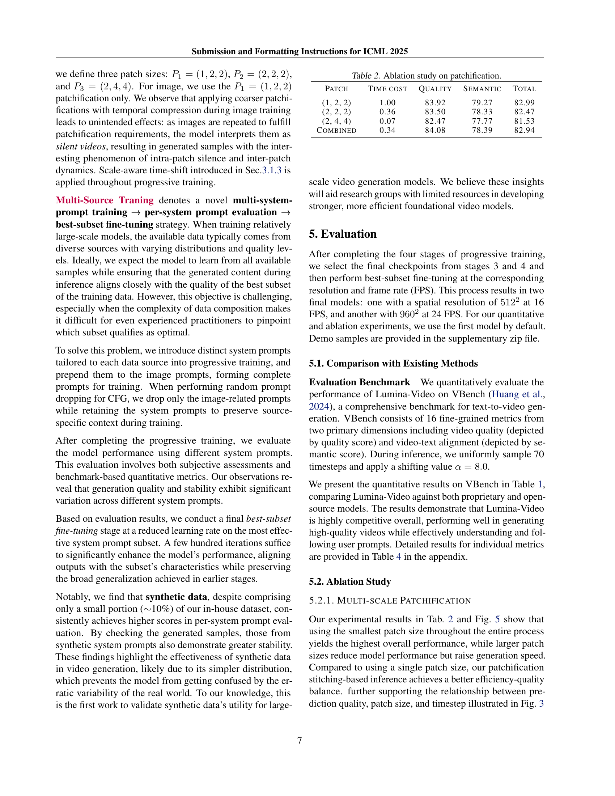

 


 2502.06782 
 Dongyang Liu et el. 
 
 🤗 2025-02-11 
 



↗ arXiv


↗ Hugging Face


### TL;DR



최근 딥러닝 기반 비디오 생성 모델의 발전에도 불구하고, **계산 비용 및 생성 비디오의 품질과 유연성**은 여전히 큰 과제입니다. 특히, 기존의 DiT(Diffusion Transformers) 기반 모델들은 비디오 데이터의 시공간적 복잡성을 효과적으로 모델링하는 데 어려움을 겪고 있습니다.

본 논문에서는 이러한 문제를 해결하기 위해 **다중 스케일 Next-DiT 아키텍처**를 기반으로 하는 새로운 비디오 생성 프레임워크인 Lumina-Video를 제안합니다. 이 모델은 **다양한 크기의 패치를 활용하여 효율성을 높이고, 모션 점수를 명시적으로 조건으로 사용하여 생성 비디오의 역동성을 제어**합니다. 또한, 점진적 학습과 다중 소스 학습을 통해 고품질 비디오를 효율적으로 생성하며, **실험 결과를 통해 Lumina-Video의 우수성**을 입증합니다. Lumina-Video는 다양한 비디오 생성 작업에 적용될 수 있으며, 관련 연구 분야에 상당한 기여를 할 것으로 기대됩니다.



#### Key Takeaways


 다중 스케일 Next-DiT 아키텍처를 통해 비디오 생성의 효율성과 유연성을 향상시켰습니다. 



 모션 점수를 명시적으로 조건으로 사용하여 생성된 비디오의 역동성을 직접 제어할 수 있습니다. 



 점진적 학습 및 다중 소스 학습 전략을 통해 고품질 비디오를 효율적으로 생성할 수 있습니다. 


#### Why does it matter?
본 논문은 **비디오 생성 분야의 주요 과제인 계산 비용 및 유연성 부족**을 해결하기 위해 **다중 스케일 Next-DiT 아키텍처**를 사용하는 새로운 프레임워크인 Lumina-Video를 제시합니다.  **다양한 패치 크기와 시간 이동 전략**을 통해 효율성과 품질을 동시에 향상시키는 이 방법은 **비디오 생성 연구의 새로운 방향**을 제시하며, 관련 연구자들에게 **상당한 영향**을 미칠 것입니다. 또한 공개된 코드와 모델 파라미터를 통해 연구 커뮤니티의 발전에도 기여할 것입니다.

------
#### Visual Insights

> 🔼 그림 1은 Lumina-Video 모델이 다양한 수준의 세부 묘사와 뛰어난 시간적 일관성을 지닌 고품질 비디오를 생성하는 능력을 보여줍니다. 간단한 프롬프트부터 복잡한 프롬프트까지 정확하게 따르는 모습을 보여주는 여러 비디오 예시가 제시되어 있습니다. 각 예시는 입력 텍스트 프롬프트와 생성된 비디오의 시각적 결과를 보여주어 모델의 성능을 직관적으로 이해할 수 있도록 합니다.
> 

> 
read the caption

> Figure 1: Lumina-Video demonstrates a strong ability to generate high-quality videos with rich details and remarkable temporal coherence, accurately following both simple and detailed text prompts.
> 


| Model | Param | Total Score (%) | Quality Score (%) | Semantic Score (%) | Motion Smoothness (%) | Dynamic Degree (%) |
|---|---|---|---|---|---|---|
| *Proprietary Models* |  |  |  |  |  |  |
| Pika-1.0 [Labs, 2024] | - | 80.69 | 82.92 | 71.77 | 99.50 | 47.50 |
| Kling [Kuaishou, 2024] | - | 81.85 | 83.39 | 75.68 | 99.40 | 46.94 |
| Vidu [VIDU, 2025] | - | 81.89 | 83.85 | 74.04 | 97.71 | 82.64 |
| Gen-3 [Runway Research, 2024] | - | 82.32 | 84.11 | 75.17 | 99.23 | 60.14 |
| Luma [LumaLab, 2024] | - | 83.61 | 83.47 | 84.17 | 99.35 | 44.26 |
| Sora [OpenAI, 2024] | - | 84.28 | 85.51 | 79.35 | 98.74 | 79.91 |
| *Open-Source Models* |  |  |  |  |  |  |
| OpenSora Plan V1.3 [Lab & etc., 2024] | 2.7B | 77.23 | 80.14 | 65.62 | 99.05 | 30.28 |
| OpenSora V1.2 (8s) [Zheng et al., 2024b] | 1.1B | 79.76 | 81.35 | 73.39 | 98.50 | 42.39 |
| VideoCrafter 2.0 [Chen et al., 2024a] | 1.4B | 80.44 | 82.20 | 73.42 | 97.73 | 42.50 |
| Allegro [Zhou et al., 2024] | 3B | 81.09 | 83.12 | 72.98 | 98.82 | 55.00 |
| CogVideoX [Yang et al., 2024] | 5B | 81.61 | 82.75 | 77.04 | 96.92 | 70.97 |
| Pyramid Flow [Jin et al., 2024a] | 2B | 81.72 | 84.74 | 69.62 | 99.12 | 64.63 |
| CogVideoX 1.5 [Yang et al., 2024] | 5B | 82.17 | 82.78 | 79.76 | 98.31 | 50.93 |
| Vchitect 2.0 [Fan et al., 2025] | 2B | 82.24 | 83.54 | 77.06 | 98.98 | 63.89 |
| HunyuanVideo [Kong et al., 2024] | 13B | 83.24 | 85.09 | 75.82 | 98.99 | 70.83 |
| Lumina-Video (Single Scale) | 2B | 82.99 | 83.92 | 79.27 | 98.90 | 67.13 |
| Lumina-Video (Multi Scale) | 2B | 82.94 | 84.08 | 78.39 | 98.92 | 71.76 |

> 🔼 표 1은 VBench 벤치마크를 사용한 다양한 텍스트-비디오 생성 모델의 성능 비교 결과를 보여줍니다.  비교를 위해 독점 모델과 오픈소스 모델을 별도로 나열하여 더욱 명확하게 비교 분석할 수 있도록 했습니다.  총점, 품질 점수(시맨틱 점수 포함), 동작 부드러움, 동적 수준 등 여러 지표를 통해 모델의 성능을 다각적으로 평가하고 있습니다.
> 

> 
read the caption

> Table 1: Comparison on VBench. Proprietary models and open-source models are listed separately for better comparison.
> 

### In-depth insights

#### Multi-scale DiT
본 논문에서 제안하는 다중 스케일 DiT는 **다양한 크기의 패치를 활용하여 영상의 다양한 수준의 세부 정보를 효율적으로 학습**하는 아키텍처입니다.  이는 단일 스케일 DiT와 비교하여 **계산 효율성을 높이고, 다양한 해상도와 프레임 속도의 영상 생성에 대한 유연성을 향상**시킵니다.  **여러 크기의 패치가 공통 DiT 백본을 공유하며 통합적으로 학습**되므로, 모델은 다양한 계산 비용 환경에 적응할 수 있습니다.  **각 패치 크기는 시간 단계별로 전략적으로 할당**되어, 계산 비용을 최소화하면서 품질을 유지합니다. **이러한 다중 스케일 접근 방식은 추론 단계에서 모델의 계산 비용을 동적으로 조절**할 수 있게 하여, 다양한 상황에서의 유연성을 제공합니다.  결과적으로, **다중 스케일 DiT는 효율성과 유연성을 동시에 달성**하여, 고품질 영상 생성에 중요한 역할을 합니다.

#### Motion Control
본 논문에서 '모션 제어'는 비디오 생성의 질을 높이는 핵심 요소로 다뤄집니다. **다음과 같은 세 가지 주요 방식**을 통해 모션을 제어합니다. 첫째, **광학 흐름(Optical Flow)**을 이용해 모션 점수를 계산하고, 이를 확산 변환기(DiT)에 명시적인 조건으로 추가합니다. 이를 통해 생성된 비디오의 역동성 정도를 직접 제어할 수 있습니다. 둘째, **양성 및 음성 분류자 없는 안내(CFG)**의 모션 조건을 개별적으로 조작하여 생성 비디오의 역동성을 미세 조정합니다. 마지막으로 **진보적인 학습 방식**을 통해 시간적 해상도와 프레임 속도를 점진적으로 높여 모션의 부드러움과 정확성을 향상시킵니다. 이러한 다각적인 모션 제어 전략은 **고품질의 시각적 효과와 시간적 일관성을 갖춘 비디오 생성**에 중요한 역할을 합니다. 특히, 여러 패치 크기를 사용하는 다중 스케일 아키텍처를 통해 효율성을 높이는 동시에 다양한 계산 비용 요구사항에 유연하게 대처할 수 있습니다.

#### Progressive Training
본 논문에서 제시된 **점진적 학습(Progressive Training)** 전략은 대규모 시각적 생성 모델 학습에 효과적이고 효율적인 접근 방식임을 보여줍니다. **저해상도 이미지-텍스트 쌍으로 시작하여 점진적으로 고해상도 비디오 데이터로 전환**함으로써, 모델은 먼저 기본적인 시각적 개념과 언어적 이해를 구축한 후, 시간적 일관성과 세부적인 시각적 묘사를 더하는 방식으로 학습합니다. 이러한 점진적 접근 방식은 **계산 비용을 줄이고 학습 안정성을 높이는 데 기여**합니다.  **다양한 해상도와 프레임 속도의 데이터를 단계적으로 도입**하여 모델의 일반화 능력을 향상시키고, **다양한 데이터 소스(실제 및 합성)**를 결합하여 모델의 품질을 높입니다.  **단계별 학습 과정에서 각 단계의 목표와 평가 지표를 명확히 설정**함으로써, 모델의 학습 과정을 효과적으로 모니터링하고 최적화할 수 있습니다.  결론적으로, 본 논문의 점진적 학습 전략은 **대규모 비디오 생성 모델 학습의 효율성과 성능을 개선**하는 데 중요한 역할을 합니다.  **다만, 각 단계의 데이터 균형과 단계 간 전이 학습의 효율성에 대한 추가적인 분석과 고찰**이 필요할 수 있습니다.

#### Video-Audio Model
본 논문에서 제시된 비디오-오디오 모델은 **비디오 생성의 품질을 높이기 위해 시각적 정보와 청각적 정보 간의 동기화를 강조**합니다.  단순히 비디오만 생성하는 것이 아니라, **생성된 비디오에 맞는 사운드를 동시에 만들어 실제와 같은 경험을 제공**하려는 시도가 돋보입니다. 이는 기존의 단순한 비디오 생성 모델을 넘어, 보다 몰입도 높은 사용자 경험을 제공할 가능성을 보여줍니다.  **다음 단계 연구는  다양한 오디오 유형 지원 및 오디오 품질 향상**에 초점을 맞출 것으로 예상됩니다.  **다양한 데이터셋 활용 및 모델의 효율성 개선** 또한 중요한 과제가 될 것입니다.  **비디오와 오디오 간의 시맨틱 일관성**을 유지하면서 모델의 복잡도를 최소화하는 방법에 대한 연구가 필요하며, 이는 사용자 경험의 극대화와 실제 적용 가능성을 높이는 데 기여할 것입니다.  **특히, 실시간 응용을 위한 모델 경량화**에 대한 연구는 향후 발전 방향을 제시할 것입니다.

#### Future Research
미래 연구 방향은 **다양한 영역에서의 확장성**과 **모델의 한계점 극복**에 초점을 맞춰야 합니다.  **다양한 데이터셋**을 활용한 추가 학습을 통해 모델의 일반화 능력을 향상시키고, **고해상도, 고프레임 영상 생성** 기술을 개선하는 연구가 필요합니다.  **계산 효율성 개선**을 위한 모델 경량화 및 최적화 연구도 중요한 과제입니다. 또한, **영상 생성 과정의 제어 가능성**을 높이고, **사실적인 움직임과 물리적 현상 구현**에 대한 연구가 필요합니다.  **윤리적 문제**에 대한 심도있는 논의와 해결 방안 모색도 필수적입니다.  **다양한 모달리티**와의 통합을 통해 더욱 풍부하고 몰입적인 경험을 제공할 수 있도록 연구가 진행되어야 하며, 이를 위해 **텍스트, 음성, 영상 등 다양한 정보를 효율적으로 통합하는 기술** 개발이 중요합니다.  **비디오 생성 모델의 안전성 및 신뢰성** 확보를 위한 연구는 지속적으로 이뤄져야 할 것입니다. 마지막으로 **생성 영상의 품질 평가 지표** 개발 및 개선에 대한 연구도 필요합니다.

### More visual insights

More on figures

> 🔼 그림 2는 Lumina-Video의 아키텍처를 보여줍니다. Lumina-Video는 멀티스케일 Next-DiT와 모션 컨디셔닝을 사용하여 고품질 비디오를 생성합니다. 그림은 3D 인코더, 멀티스케일 Next-DiT 블록, 어텐션 메커니즘, 모션 임베딩, 그리고 최종 출력을 포함한 전체적인 구조를 자세히 보여줍니다. 멀티스케일 Next-DiT는 다양한 패치 크기를 사용하여 효율성과 유연성을 높이며, 모션 임베딩은 생성된 비디오의 동적 특성을 제어하는 데 사용됩니다. 이 아키텍처는 다양한 계산 예산에서 비디오 구조를 학습하여 추론 효율성을 높이고, 사용자에게 유연성을 제공합니다.
> 

> 
read the caption

> Figure 2: Architecture of Lumina-Video with Multi-scale Next-DiT and Motion Conditioning.
> 

> 🔼 그림 3은 다양한 패치 크기에서의 손실 곡선을 다양한 잡음 제거 시간 단계에서 보여줍니다.  각 그래프는 특정 시간 범위(예: 0~0.1, 0.2~0.25 등)에 걸쳐 세 가지 다른 패치 크기((1, 2, 2), (2, 2, 2), (2, 4, 4))의 손실 곡선을 나타냅니다. 이 그래프를 통해 각 패치 크기별 손실 값의 변화를 시간에 따라 비교하여, 다양한 패치 크기가 잡음 제거 과정의 어느 단계에서 가장 효과적인지를 분석할 수 있습니다.  전체 그림은 본문 C.2절에서 확인할 수 있습니다.
> 

> 
read the caption

> Figure 3: Loss curves for different patch sizes at different denoising timesteps. See Sec. C.2 for the complete figure.
> 

> 🔼 그림 4는 Lumina-Video가 추론 중에 유연한 다단계 잡음 제거를 수행할 수 있도록 하는 다중 스케일 패치화에 대해 보여줍니다.  다양한 크기의 패치를 사용하여 모델은 먼저 저해상도에서 영상의 거친 구조를 파악하고, 고해상도로 이동하여 세부 정보를 점진적으로 추가합니다. 이를 통해 계산 비용을 절감하면서도 우수한 화질을 유지할 수 있는 효율성과 품질 간의 균형을 이룹니다.  단순히 하나의 패치 크기를 사용하는 것보다 여러 스케일의 패치를 사용하는 것이 더 나은 성능을 제공한다는 것을 보여줍니다.
> 

> 
read the caption

> Figure 4: Multi-scale Patchification allows Lumina-Video to perform flexible multi-stage denoising during inference, leading to a better tradeoff between quality and efficiency.
> 

> 🔼 그림 5는 다양한 패치화 전략을 사용하여 생성된 비디오들을 비교한 이미지입니다. 서로 다른 크기의 패치(1x2x2, 2x2x2, 2x4x4)를 사용하여 생성된 비디오들의 화질과 동작의 차이를 보여줍니다. 각 패치 크기는 비디오의 시공간적 해상도와 계산 효율성에 영향을 미치며, 이는 생성된 비디오의 품질에 직접적인 영향을 미칩니다. 이 그림을 통해 Lumina-Video 모델의 다중 스케일 패치화 기법이 비디오 생성의 효율성과 유연성을 어떻게 향상시키는지를 시각적으로 보여줍니다.
> 

> 
read the caption

> Figure 5: Comparison of generated videos using different patchification strategies.
> 

> 🔼 이 그림은 Lumina-Video 모델에서 사용된 양수 및 음수 모션 점수의 값을 변경하여 생성된 비디오의 동작을 비교 분석한 결과를 보여줍니다.  양수 모션 점수가 클수록 비디오의 움직임이 역동적이고 활기차게 나타나며, 음수 모션 점수가 클수록 움직임이 부드럽고 정적인 경향을 보입니다.  다양한 조합을 통해 생성된 비디오의 시각적 차이를 명확하게 보여줍니다.  특히, 음수 모션 점수를 낮게 유지하면서 양수 모션 점수를 높였을 때 가장 역동적인 움직임을 보이는 것을 확인할 수 있습니다.
> 

> 
read the caption

> Figure 6: Comparison of generated videos using different positive and negative motion scores.
> 

> 🔼 그림 7은 다양한 패치 크기와 다른 잡음 제거 시간 단계에서 손실 곡선의 전체 그림을 보여줍니다. 이 그림은 여러 가지 패치 크기(예: (1,2,2), (2,2,2), (2,4,4))를 사용하여 잡음 제거 과정의 여러 단계에서 손실 값이 어떻게 변하는지 보여줍니다.  각 패치 크기의 손실 곡선은 잡음 제거 과정의 시간 경과에 따라 어떻게 변화하는지를 보여주며, 모델이 여러 해상도에서 정보를 어떻게 학습하는지를 시각적으로 보여줍니다.  이를 통해 다양한 크기의 패치가 모델 성능에 미치는 영향과 잡음 제거 과정의 다양한 단계에 적합한 패치 크기를 선택하는 전략을 이해하는 데 도움이 됩니다.
> 

> 
read the caption

> Figure 7: Complete figure of loss curves for different patch sizes at different denoising timesteps.
> 

> 🔼 그림 8은 논문의 D.2절 '모델 아키텍처'에서 설명하는 Lumina-V2A 모델의 구조를 보여줍니다.  Lumina-V2A는 Next-DiT 기반의 비디오-오디오 모델로, 비디오와 텍스트 조건을 입력받아 오디오를 생성합니다. 그림은 비디오, 텍스트, 오디오 정보가 어떻게 처리되고 Next-DiT 블록에 입력되는지, 그리고 그 결과로 오디오가 생성되는 과정을 시각적으로 보여줍니다.  특히, 여러 모달리티(비디오, 텍스트, 오디오) 정보의 통합을 위해  video-text-audio Next-DiT 블록을 사용하고 시간적 동기화를 위해 multimodal conditioning module을 사용하는 점이 강조되어 있습니다.
> 

> 
read the caption

> Figure 8: Illustration of Lumina-V2A Model based on Next-DiT
> 

More on tables


| Patch | Time cost | Quality | Semantic | Total |
|---|---|---|---|---|
| (1, 2, 2) | 1.00 | 83.92 | 79.27 | 82.99 |
| (2, 2, 2) | 0.36 | 83.50 | 78.33 | 82.47 |
| (2, 4, 4) | 0.07 | 82.47 | 77.77 | 81.53 |
| Combined | 0.34 | 84.08 | 78.39 | 82.94 |
> 🔼 본 표는 Lumina-Video 모델의 성능에 대한 다양한 패치 크기(patch size)의 영향을 분석한 결과를 보여줍니다.  다양한 크기의 패치를 사용하여 이미지와 비디오의 특징을 추출하는 방법의 효율성과 성능을 비교 분석하여, Lumina-Video 모델에서 최적의 패치 크기 전략을 제시합니다.  특히, 계산 비용(Time Cost), 화질(Quality), 의미론적 일관성(Semantic), 전체 성능(Total) 측면에서 각 패치 크기의 효과를 정량적으로 비교 분석하여, 다중 스케일 패치(Multi-scale patch) 전략의 효용성을 입증합니다.
> 

> 
read the caption

> Table 2: Ablation study on patchification.
> 


| Positive Motion | Negtive Motion | Dynamic Degree | Quality Score* | Semantic Score | Total Score |
|---|---|---|---|---|---| 
| 4 | 4 | 45.37 | 86.11 | 79.28 | 82.24 |
| 8 | 8 | 53.70 | 86.18 | 78.88 | 82.72 |
| 4 | 2 | 72.78 | 84.11 | 79.10 | 82.41 |
| 8 | 2 | 85.89 | 83.51 | 78.36 | 82.63 |
| 4 | 2-[0.05-4] | 67.13 | 85.31 | 79.27 | 82.99 |
| 8 | 2-[0.05-8] | 83.33 | 84.58 | 78.55 | 83.28 |
> 🔼 표 3은 Lumina-Video 모델에서 모션 점수(motion score)가 생성된 비디오의 동적 특징(dynamic degree)과 품질(quality)에 미치는 영향을 보여줍니다. 모션 점수는 비디오의 동작의 양을 제어하기 위한 명시적인 조건으로 사용됩니다. 표는 양수 모션 점수와 음수 모션 점수의 여러 조합에 따른 동적 정도, 품질 점수(동적 정도 제외), 의미 점수, 그리고 총 점수를 보여줍니다.  * 표시는 동적 정도가 품질 점수에서 제외되었음을 나타냅니다.  즉, 모션 점수를 조절하여 생성 비디오의 역동성을 제어할 수 있음을 보여주는 실험 결과를 제시합니다. 특히 양수와 음수 모션 점수의 차이가 동적 정도에 큰 영향을 미친다는 것을 알 수 있습니다.
> 

> 
read the caption

> Table 3: Impact of Motion Score. * means Dynamic Degree is excluded from Quality Score.
> 


| Model | SubjectConsistency | BackgroundConsistency | TemporalFlickering | MotionSmoothness | DynamicDegree | AestheticQuality | ImagingQuality | ObjectClass |
|---|---|---|---|---|---|---|---|---|
| *Proprietary Models* |  |  |  |  |  |  |  |  |
| Pika-1.0 | 96.94 | 97.36 | 99.74 | 99.50 | 47.50 | 62.04 | 61.87 | 88.72 |
| Kling | 98.33 | 97.60 | 99.30 | 99.40 | 46.94 | 61.21 | 65.62 | 87.24 |
| Vidu | 94.63 | 96.55 | 99.08 | 97.71 | 82.64 | 60.87 | 63.32 | 88.43 |
| Gen-3 Alpha | 97.10 | 96.62 | 98.61 | 99.23 | 60.14 | 63.34 | 66.82 | 87.81 |
| Luma | 97.33 | 97.43 | 98.64 | 99.35 | 44.26 | 65.51 | 66.55 | 94.95 |
| Sora | 96.23 | 96.35 | 98.87 | 98.74 | 79.91 | 63.46 | 68.28 | 93.93 |
| *Open-Source Models* |  |  |  |  |  |  |  |  |
| OpenSora Plan V1.3 | 97.79 | 97.24 | 99.20 | 99.05 | 30.28 | 60.42 | 56.21 | 85.56 |
| OpenSora V1.2 | 96.75 | 97.61 | 99.53 | 98.50 | 42.39 | 56.85 | 63.34 | 82.22 |
| VideoCrafter 2.0 | 96.85 | 98.22 | 98.41 | 97.73 | 42.50 | 63.13 | 67.22 | 92.55 |
| Allegro | 96.33 | 96.74 | 99.00 | 98.82 | 55.00 | 63.74 | 63.60 | 87.51 |
| CogVideoX | 96.23 | 96.52 | 98.66 | 96.92 | 70.97 | 61.98 | 62.90 | 85.23 |
| Pyramid Flow | 96.95 | 98.06 | 99.49 | 99.12 | 64.63 | 63.26 | 65.01 | 86.67 |
| CogVideoX 1.5 | 96.87 | 97.35 | 98.88 | 98.31 | 50.93 | 62.79 | 65.02 | 87.47 |
| Vchitect 2.0 | 96.83 | 96.66 | 98.57 | 98.98 | 63.89 | 60.41 | 65.35 | 86.61 |
| HunyuanVideo | 97.37 | 97.76 | 99.44 | 98.99 | 70.83 | 60.36 | 67.56 | 86.10 |
| Lumina-Video-ss | 96.06 | 97.26 | 98.63 | 98.90 | 67.13 | 62.27 | 64.58 | 91.03 |
| Lumina-Video-ms | 95.95 | 96.99 | 98.59 | 98.92 | 71.76 | 62.25 | 63.85 | 90.69 |
| Model | MultipleObjects | HumanAction | Color | SpatialRelationship | Scene | AppearanceStyle | TemporalStyle | OverallConsistency |
|---|---|---|---|---|---|---|---|---|
| *Proprietary Models* |  |  |  |  |  |  |  |  |
| Pika-1.0 | 43.08 | 86.20 | 90.57 | 61.03 | 49.83 | 22.26 | 24.22 | 25.94 |
| Kling | 68.05 | 93.40 | 89.90 | 73.03 | 50.86 | 19.62 | 24.17 | 26.42 |
| Vidu | 61.68 | 97.40 | 83.24 | 66.18 | 46.07 | 21.54 | 23.79 | 26.47 |
| Gen-3 Alpha | 53.64 | 96.40 | 80.90 | 65.09 | 54.57 | 24.31 | 24.71 | 26.69 |
| Luma | 82.63 | 96.40 | 92.33 | 83.67 | 58.98 | 24.66 | 26.29 | 28.13 |
| Sora | 70.85 | 98.20 | 80.11 | 74.29 | 56.95 | 24.76 | 25.01 | 26.26 |
| *Open-Source Models* |  |  |  |  |  |  |  |  |
| OpenSora Plan V1.3 | 43.58 | 86.80 | 79.30 | 51.61 | 36.73 | 20.03 | 22.47 | 24.47 |
| OpenSora V1.2 | 51.83 | 91.20 | 90.08 | 68.56 | 42.44 | 23.95 | 24.54 | 26.85 |
| VideoCrafter 2.0 | 40.66 | 95.00 | 92.92 | 35.86 | 55.29 | 25.13 | 25.84 | 28.23 |
| Allegro | 59.92 | 91.40 | 82.77 | 67.15 | 46.72 | 20.53 | 24.23 | 26.36 |
| CogVideoX | 62.11 | 99.40 | 82.81 | 66.35 | 53.20 | 24.91 | 25.38 | 27.59 |
| Pyramid Flow | 50.71 | 85.60 | 82.87 | 59.53 | 43.20 | 20.91 | 23.09 | 26.23 |
| CogVideoX 1.5 | 69.65 | 97.20 | 87.55 | 80.25 | 52.91 | 24.89 | 25.19 | 27.30 |
| Vchitect 2.0 | 68.84 | 97.20 | 87.04 | 57.55 | 56.57 | 23.73 | 25.01 | 27.57 |
| HunyuanVideo | 68.55 | 94.40 | 91.60 | 68.68 | 53.88 | 19.80 | 23.89 | 26.44 |
| Lumina-Video-ss | 68.32 | 97.67 | 90.16 | 67.27 | 56.08 | 23.64 | 25.66 | 28.22 |
| Lumina-Video-ms | 65.27 | 97.33 | 89.58 | 63.68 | 57.10 | 25.47 | 23.42 | 28.23 |
> 🔼 표 4는 VBench 벤치마크 결과를 보여줍니다.  VBench는 비디오 생성 모델의 품질을 평가하는 데 사용되는 포괄적인 벤치마크이며,  다양한 측면(일관성, 시간적 일관성, 동작 부드러움, 미적 품질, 객체 분류 등)에 대한 정량적 점수를 제공합니다. 이 표는 Lumina-Video 모델의 성능을 단일 스케일 추론(-ss)과 다중 스케일 추론(-ms) 두 가지 방식으로 평가한 결과를 보여주고 있습니다.  경쟁 모델들과 비교하여 Lumina-Video의 강점과 약점을 파악하는 데 도움이 됩니다.
> 

> 
read the caption

> Table 4: Detailed results on VBench. -ss means single scale inference and -ms means multi-scale inference
> 

### Full paper



