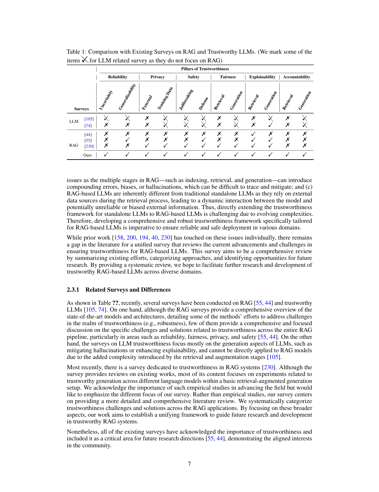

 


 2502.06872 
 Bo Ni et el. 
 
 🤗 2025-02-13 
 



↗ arXiv


↗ Hugging Face


↗ Papers with Code


### TL;DR



대규모 언어 모델(LLM) 기반 응용 프로그램의 신뢰성을 높이기 위해 등장한 RAG(Retrieval Augmented Generation)는 환각, 오래된 정보 사용, 설명 부족 등의 문제를 안고 있습니다.  특히, 의료, 법률, 교육 등 고위험 분야에서는 이러한 문제로 인한 부정적인 결과가 심각할 수 있습니다.  기존 연구는 이러한 문제를 개별적으로 다루었지만, 통합적인 관점에서 RAG 시스템의 신뢰성을 다룬 연구는 부족합니다.

본 논문은 신뢰성, 프라이버시, 안전성, 공정성, 설명 가능성, 책임성이라는 다섯 가지 주요 관점에서 RAG 시스템의 신뢰성을 향상시키는 방법을 제시합니다. 각 관점에 대한 일반적인 프레임워크와 분류 체계를 제시하고, 기존 솔루션 평가와 향후 연구 방향을 제시합니다. 특히, 고위험 분야에서 신뢰할 수 있는 RAG 시스템의 중요성을 강조하고, 다양한 응용 프로그램에서의 영향을 분석합니다. 이를 통해 연구자들은 RAG 시스템의 신뢰성을 개선하는 데 도움이 되는 통합적이고 구조적인 접근 방식을 제공합니다.



#### Key Takeaways


 신뢰할 수 있는 RAG 시스템 개발을 위한 포괄적인 로드맵 제시 



 신뢰성, 개인정보 보호, 안전성, 공정성, 설명 가능성, 책임성 등 5가지 관점에서 RAG 시스템 평가 



 의료, 법률, 교육 등 고위험 분야에서 신뢰할 수 있는 RAG 시스템의 중요성 강조 


#### Why does it matter?
본 논문은 **신뢰할 수 있는 RAG 시스템 개발을 위한 포괄적인 로드맵**을 제공함으로써,  **다양한 분야에서 RAG 시스템의 채택과 혁신을 가속화**할 수 있습니다.  **연구자들은 이 논문의 체계적인 검토를 통해 현재의 과제를 이해하고, 기존 솔루션을 평가하며, 유망한 미래 연구 방향을 파악**할 수 있습니다. 특히, **의료, 법률, 교육과 같은 고위험 분야에서 신뢰할 수 있는 RAG 시스템의 중요성을 강조**하고, **향후 연구를 위한 구체적인 방향**을 제시함으로써, **현장 적용 가능성을 높이는 데 기여**할 것으로 예상됩니다. 

------
#### Visual Insights

> 🔼 이 그림은 본 논문에서 다루는 신뢰할 수 있는 검색 증강 생성(RAG) 시스템의 주요 구성 요소와 차원에 대한 개요를 보여줍니다.  RAG는 대규모 언어 모델(LLM)의 환각, 오래된 지식 의존, 설명 부족과 같은 문제를 해결하기 위해 고안된 기술입니다. 그림은 RAG 시스템의 세 가지 주요 단계인 정보 검색, 지식 증강, 콘텐츠 생성을 보여주는 블록 다이어그램으로 구성되어 있습니다.  각 단계는 신뢰성, 프라이버시, 안전성, 공정성, 설명 가능성, 책임성이라는 다섯 가지 주요 측면으로 더 세분화되어 RAG 시스템의 전반적인 신뢰성을 평가하는 데 사용되는 여러 가지 측면을 보여줍니다. 예를 들어, 검색 단계는 데이터 누출 및 공격과 같은 프라이버시 위험에 초점을 맞추는 반면, 생성 단계는 환각과 같은 신뢰성 문제와 관련이 있습니다. 그림은 이러한 상호 작용과 잠재적인 취약점을 시각적으로 표현하여 전체 RAG 시스템의 신뢰성을 평가하기 위한 포괄적인 프레임워크를 제공합니다.
> 

> 
read the caption

> Figure 1: An overview of the key components and dimensions of Trustworthy Retrieval Augmented Generation (RAG) for Large Language Models (LLMs) that are covered in this survey.
> 


| Pillars of Trustworthiness | Reliability |  | Privacy |  | Safety |  | Fairness |  | Explainability |  | Accountability |  |
|---|---|---|---|---|---|---|---|---|---|---|---|---|
| Surveys | **Uncertainty** | **Generalizability** | **External** | **Training Data** | **Jailbreaking** | **Defense** | **Retrieval** | **Generation** | **Retrieval** | **Generation** | **Retrieval** | **Generation** |
| LLM | [106] | ✗ | ✗ | ✗ | ✗ | ✗ | ✗ | ✗ | ✗ | ✗ | ✗ | ✗ |
|  | [75] | ✗ | ✗ | ✗ | ✓ | ✓ | ✓ | ✗ | ✓ | ✗ | ✓ | ✗ |
|  | [45] | ✗ | ✗ | ✗ | ✗ | ✗ | ✗ | ✗ | ✗ | ✓ | ✗ | ✗ |
| RAG | [56] | ✗ | ✓ | ✗ | ✗ | ✗ | ✓ | ✗ | ✗ | ✓ | ✓ | ✗ |
|  | [231] | ✗ | ✗ | ✓ | ✓ | ✓ | ✓ | ✓ | ✓ | ✓ | ✗ | ✗ |
| Ours |  | ✓ | ✓ | ✓ | ✓ | ✓ | ✓ | ✓ | ✓ | ✓ | ✓ | ✓ |

> 🔼 표 1은 RAG와 신뢰할 수 있는 LLM에 대한 기존 설문 조사와의 비교를 보여줍니다.  기존 연구들이 RAG 시스템의 신뢰성, 개인 정보 보호, 안전성, 공정성, 설명 가능성, 책임성 등 다양한 측면을 얼마나 다루었는지 비교 분석하여 본 논문의 기여도를 보여줍니다.  LLM 관련 설문 조사는 RAG에 초점을 맞추지 않았기 때문에 일부 항목은 체크 표시(✓)를 하여 구분하였습니다.  이 표를 통해 본 논문이 기존 연구들보다 RAG 시스템의 신뢰성에 대한 포괄적인 분석을 제공한다는 것을 알 수 있습니다.
> 

> 
read the caption

> Table 1: Comparison with Existing Surveys on RAG and Trustworthy LLMs. (We mark some of the items ✓ for LLM related survey as they do not focus on RAG)
> 

### In-depth insights

#### RAG's Trust Issues
RAG(Retrieval Augmented Generation)는 대규모 언어 모델의 한계를 극복하기 위한 유망한 기술이지만, **신뢰성 문제**는 여전히 해결해야 할 과제입니다.  외부 데이터 소스에 의존하는 RAG의 특성상, **데이터의 편향성이나 부정확성**이 그대로 반영될 위험이 있으며, 이는 결과적으로 **불공정하거나 잘못된 정보**를 생성하는 결과로 이어질 수 있습니다. 또한, 외부 데이터 소스는 **악의적인 공격**에 취약하며, 이를 통해 **개인정보 유출**이나 **시스템 오작동**이 발생할 수 있습니다. 따라서 RAG 시스템의 신뢰성을 확보하기 위해서는 **데이터 품질 관리**, **보안 강화**, **편향성 완화**, **설명 가능성 향상**, **책임성 확보** 등 다각적인 노력이 필요합니다.  특히, **다양한 분야의 전문가들과의 협력**을 통해 실제 적용 환경에서 발생할 수 있는 다양한 문제들을 예측하고 해결하는 것이 중요합니다.  **사용자의 신뢰**를 얻고 RAG 기술이 안전하게 사용될 수 있도록 꾸준한 연구와 개발이 지속되어야 합니다.

#### RAG Reliability
본 논문의 "RAG 신뢰성" 부분은 **RAG 시스템의 안정성과 정확성을 보장하는 데 필수적**임을 강조합니다.  특히, RAG는 외부 지식을 활용하므로, **기존의 LLM 신뢰성 평가 방식만으로는 부족**하며, 정보 검색 과정과 생성 과정 모두를 고려한 새로운 평가 기준이 필요함을 제시합니다. 불확실성 정량화와 강건한 일반화 능력은 RAG 신뢰성의 핵심 요소로 언급되며, **검색 과정과 생성 과정에서의 불확실성을 모두 고려**해야 함을 강조합니다.  여기에는 다양한 상황과 조건에서의 시스템 성능 평가와, 오류 발생 시 이를 정확히 식별하고 해결하기 위한 방법론에 대한 심도있는 연구가 필요합니다. 또한, **외부 데이터의 변화나 부정확한 정보에 대한 시스템의 적응력** 및 **악의적인 공격에 대한 방어 능력** 또한 중요한 평가 지표입니다.  **신뢰성 평가를 위한 벤치마크 데이터셋과 측정 지표**의 개발 또한 미래 연구의 중요한 방향입니다.  궁극적으로, **신뢰성 있는 RAG 시스템 구축을 위해서는 불확실성과 강건성에 대한 통합적인 접근**이 필요합니다.

#### RAG Privacy Risks
RAG(Retrieval-Augmented Generation)는 외부 데이터베이스를 활용하여 생성 과정에 필요한 정보를 가져오는 방식이기 때문에 **개인정보 유출 위험**이 존재합니다.  **데이터베이스 유출**은 공격자가 민감한 정보를 담은 데이터베이스에 직접 접근하여 정보를 빼내는 것을 의미합니다. 이를 방지하기 위한 **보안 강화**가 필수적이며, 접근 제어, 암호화, 무결성 검증 등의 기술이 활용될 수 있습니다.  또한, **LLM(Large Language Model) 학습 데이터 유출**도 우려됩니다. RAG 시스템은 LLM의 학습 데이터에 포함된 정보를 무의식적으로 재현할 가능성이 있습니다.  **민감한 정보에 대한 접근 제어 및 데이터 익명화**와 같은 기술이 이러한 위험을 완화하는 데 중요한 역할을 합니다.  결론적으로, RAG 시스템의 프라이버시 위험을 최소화하기 위해서는 **철저한 데이터 보호 정책**과 **안전한 시스템 설계 및 구현**이 반드시 필요합니다.  **프라이버시 보호 기술의 지속적인 개발과 평가**를 통해, 안전하고 신뢰할 수 있는 RAG 시스템을 구축하는 것이 중요합니다.

#### RAG Safety Limits
RAG 시스템의 안전성은 외부 데이터 소스에 대한 의존성으로 인해 제한될 수 있습니다. **악의적인 행위자는 외부 데이터베이스에 악성 정보를 주입하여 RAG 시스템의 출력을 조작하거나 시스템을 손상시킬 수 있습니다.** 이러한 공격은 RAG 시스템의 신뢰성과 안전성에 심각한 위협이 될 수 있습니다. 따라서 RAG 시스템을 개발할 때 이러한 안전성 제한을 해결하기 위한 **강력한 방어 메커니즘을 구축하는 것이 중요합니다.**  **데이터 무결성을 보장하고 악의적인 정보 주입을 방지하기 위한 기술**을 포함하여 신뢰할 수 있는 RAG 시스템을 개발하기 위한 다양한 방법이 연구되고 있습니다.  그러나 RAG 안전성에 대한 연구는 아직 초기 단계에 있으며, **다양한 유형의 공격에 대한 더욱 심도있는 분석**과 **더욱 강력한 방어 메커니즘 개발**이 필요합니다. 특히 **외부 데이터의 출처와 품질 관리** 그리고 **LLM 자체의 안전성**에 대한 고려가 중요합니다.  **신뢰할 수 있는 RAG 시스템 개발을 위한 종합적인 프레임워크**를 구축하고, 다양한 응용 분야에 대한 안전성 요구사항을 충족하도록 하는 연구가 지속적으로 진행되어야 합니다.

#### Future of RAG
RAG(Retrieval Augmented Generation)의 미래는 **신뢰성, 개인 정보 보호, 안전성, 공정성, 설명 가능성, 책임성**이라는 여섯 가지 핵심 신뢰 원칙을 중심으로 전개될 것입니다.  향후 연구는 이러한 각 원칙에 대한 통합적이고 포괄적인 프레임워크를 개발하는 데 집중해야 합니다.  특히, 불확실성 정량화 및 강건한 일반화 기술을 개선하고, 다양한 데이터 누출 경로를 차단하며, 적대적 공격에 대한 방어 메커니즘을 개발하는 것이 중요합니다.  또한, 편향 완화 기법과 설명 가능한 AI 기술을 통해 RAG 시스템의 공정성과 투명성을 향상시켜야 합니다.  마지막으로, **책임성 있는 RAG 시스템 개발을 위해서는 워터마킹과 같은 기술을 활용한 추적 기능과 명확한 책임 소재 규정이 필수적**입니다. 이러한 노력을 통해 RAG는 의료, 법률, 교육 등 다양한 분야에서 더욱 안전하고 신뢰할 수 있는 방식으로 활용될 수 있을 것입니다.

### More visual insights

More on tables


| Module | Reference | White-box | Task | Year |
|---|---|---|---|---|
| Generation | Ye et al. [208] | ✗ | Benchmarking | 2024 |
|  | Su et al. [164] | ✓ | Open Domain Question Answering | 2024 |
|  | Kumar et al. [89] | ✓ | Multiple Choice Question Answering | 2023 |
|  | Quach et al. [138] | ✗ | Open Domain Question Answering | 2023 |
| Retrieval + Generation | Ni et al. [125] | ✗ | Multi-hop Question Answering | 2024 |
|  | Li et al. [99] | ✗ | Open Domain Question Answering | 2023 |
> 🔼 표 2는 RAG(Retrieval-Augmented Generation) 시스템에서의 불확실성 정량화에 대한 방법들을 분류한 표입니다.  RAG 시스템의 신뢰성을 높이기 위해서는 모델의 예측에 대한 신뢰도를 정량화하는 것이 중요하며, 이 표는 불확실성 정량화의 세 가지 주요 측면, 즉 생성 단계의 불확실성, 검색 단계의 불확실성, 그리고 생성 및 검색 단계의 통합적인 불확실성 정량화 방법들을 보여줍니다. 각 방법의 특징과 적용 가능한 작업 유형(예: 개방형 질문 응답, 다중 선택 질문 응답 등)을 나타내어 RAG 시스템의 신뢰성 향상 연구에 대한 포괄적인 개요를 제공합니다.
> 

> 
read the caption

> Table 2: Taxonomy for Uncertainty Quantification in RAG
> 


| Attack | Reference | Training | Tasks | Leakage | Year |
|---|---|---|---|---|---| 
| *Attack* | Zeng et al. [159] | ✓ | Document Extraction & Training Data | Internal & External | 2024 |
|  | Liu et al. [104] | ✓ | Membership Inference Attack | External | 2024 |
|  | Cohen et al. [32] | ✗ | MIA & Document Extraction | External | 2024 |
|  | Jiang et al. [78] | ✗ | Document Extraction | Internal & External | 2024 |
|  | Peng et al. [130] | ✓ | Document Extraction | External | 2024 |
| *Defense* | Zeng et al. [219] | ✓ | External Database | External | 2024 |
|  | Zeng et al. [159] | ✓ | Document Extraction | External | 2024 |
> 🔼 표 3은 RAG 시스템의 프라이버시 이슈에 대한 분류 체계를 보여줍니다.  세 가지 주요 작업(문서 추출, 교육 데이터 추출, 멤버십 추론 공격)과 두 가지 주요 유형의 정보 유출(외부 검색 데이터베이스 유출 및 LLM 교육 데이터 유출)에 초점을 맞추고 있습니다. 각 범주에 대해 관련 연구를 제시하여 RAG 시스템의 프라이버시 위험을 포괄적으로 이해하는 데 도움이 됩니다.
> 

> 
read the caption

> Table 3: Taxonomy for RAG Privacy
> 


| Type | Reference | White-Box | Black-Box | Year |
|---|---|---|---|---|
| Targeted | Zou et al. [233] | ✓ | ✓ | 2024 |
|  | Xue et al. [201] | ✓ | ✗ | 2024 |
|  | Long et al. [111] | ✓ | ✗ | 2024 |
|  | Zhong et al. [230] | ✓ | ✗ | 2023 |
| Jailbreak | Wang et al. [188] | ✗ | ✓ | 2024 |
|  | Deng et al. [40] | ✗ | ✓ | 2024 |
> 🔼 표 4는 RAG(Retrieval Augmented Generation) 시스템의 안전성에 대한 분류 체계를 보여줍니다.  백색 상자(white-box) 공격과 흑색 상자(black-box) 공격을 구분하여, 표적 공격(targeted attack)과 탈옥 공격(jailbreak attack)을 각각 설명합니다.  각 공격 유형에 대한 대표적인 연구 논문들을 제시하며, RAG 시스템의 안전성 평가에 필요한 맥락을 제공합니다.
> 

> 
read the caption

> Table 4: Taxonomy for RAG Safety
> 


| Module | Reference | Bias Mitigation | Focus | Year |
|---|---|---|---|---|
| Retrieval | Wang et al. [187] | LoRA Fine-tuning | Ranking Fairness vs. Performance | 2024 |
|  | Shrestha et al. [160] | Diverse Sampling | Demographic Diversity | 2024 |
|  | Rekabsaz et al. [140] | Re-ranking Methods | Societal Bias Mitigation | 2021 |
|  | Rekabsaz et al. [141] | Post-hoc Re-ranking | Gender Bias in Retrieval | 2020 |
| Generation | Wu et al. [193] | Empirical Evaluation | Cross-task Fairness | 2024 |
|  | Wang et al. [184] | Output Conditioning | GPT-3.5/4 Bias Detection | 2023 |
|  | Liang et al. [100] | Representation Adjustment | Fair Question Answering | 2022 |
|  | Parrish et al. [129] | Benchmark Evaluation | Stereotype Analysis | 2021 |
| Retrieval + Generation | Kong et al. [88] | Post-hoc Bias Mitigation (PBM) | Gender and Race Fairness | 2024 |
|  | Kim et al. [83] | Fair Retrieval + Generation | Fairness-Quality Trade-off | 2024 |
|  | Shrestha et al. [160] | Cross-Modal Guidance | Demographic Balancing | 2024 |
> 🔼 표 5는 RAG(Retrieval Augmented Generation) 시스템의 공정성에 대한 분류 체계를 보여줍니다. RAG 시스템에서 공정성 문제는 검색 단계와 생성 단계 모두에서 발생할 수 있으며, 표는 각 단계에서 공정성 문제를 해결하기 위한 다양한 방법들을 제시합니다. 특히, 검색 단계에서는 검색 모델 자체의 편향성을 완화하는 방법들과, 생성 단계에서는 생성된 결과의 공정성을 개선하는 방법들이 제시되어 있습니다. 각 방법들은 구체적인 기술, 초점 영역 및 적용 연도와 함께 설명되어 있어 RAG 시스템의 공정성 확보를 위한 종합적인 이해를 돕습니다.
> 

> 
read the caption

> Table 5: Taxonomy for RAG Fairness
> 


| Module | Reference | Task | Year |
|---|---|---|---|
| Generation | Sudhi et al. [165] | English and German QA | 2024 |
|  | Luo et al. [115] | Knowledge Graph QA | 2024 |
|  | Rorseth et al. [146] | Open-book QA | 2024 |
| Retrieval + Generation | Kunze et al. [172] | Scene-Understanding | 2024 |
|  | Hussien et al. [76] | Road User Intention Explanation | 2024 |
|  | Ferraretto et al. [51] | Document Retrieval | 2023 |
> 🔼 표 6은 RAG(Retrieval Augmented Generation) 시스템에서 설명 가능성(Explainability)에 대한 분류 체계를 보여줍니다.  RAG 시스템의 설명 가능성은 검색(Retrieval) 단계와 생성(Generation) 단계, 그리고 두 단계를 모두 향상시키는 방법으로 나뉩니다. 표는 각 범주에 속하는 관련 연구들을 제시하며, 검색 단계에서는 정보 검색 분야의 기존 설명 기법들을 소개하고, 생성 단계에서는 사전(ante-hoc) 설명 기법과 사후(post-hoc) 설명 기법을 보여줍니다. 마지막으로, 검색과 생성 단계를 동시에 향상시키는 연구들을 제시합니다.
> 

> 
read the caption

> Table 6: Taxonomy for RAG Explainability
> 


| Module | Reference | Technique | Type | Year |
|---|---|---|---|---|
| *Retrieval* | Liu et al. [102] | Format-based | Text Watermarking | 2024 |
|  | Xu et al. [197] | Embedding-based | Data Watermarking | 2024 |
|  | Sun et al. [169] | Trigger-based | Data Watermarking | 2022 |
| *Generation* | Christ et al. [30] | Semantic-based | Sentence-level Watermarking | 2024 |
|  | Hou et al. [72] | Sampling-based | Token-level Watermarking | 2023 |
|  | Kirchenbauer et al. [84] | Logit-based | Global Watermarking | 2023 |
|  | Yang et al. [206] | Post-generation | Lexical/Syntactic | 2022 |
| *Retrieval* + *Generation* | Jovanovic et al. [81] | Integrated Pipeline | Red-Green Token Scheme | 2024 |
> 🔼 표 7은 RAG 시스템의 책임성에 대한 분류 체계를 보여줍니다.  책임성은 AI 시스템의 결과가 수립된 절차 및 실질적 기준과 일치하는지 여부와 기준이 위반될 경우 책임 소재를 확인하는 능력을 의미합니다. RAG 시스템의 경우, 생성된 콘텐츠의 출처를 추적하고 관련 데이터, 모델 또는 운영자의 책임을 명확히 파악하는 메커니즘이 중요합니다. 이 표에서는 검색, 생성 단계에서의 책임성 기술을 보여줍니다.  검색 단계에서는 워터마킹 기법을 통해 검색 소스의 책임성을 보장하는 반면 생성 단계에서는 생성된 텍스트에 워터마킹을 포함하여 생성된 콘텐츠의 원본을 추적합니다. 이를 통해 시스템의 투명성과 책임성을 강화합니다.  표에는 각 기술의 유형과 연도가 함께 나와 있습니다.
> 

> 
read the caption

> Table 7: Taxonomy for RAG Accountability
> 


| Dataset | Detectability | Quality Impact | Robustness |
|---|---|---|---|
| WaterBench [178] | ✓ |  |  |
| WaterJudge [121] | ✓ | ✓ |  |
| Mark My Words [132] | ✓ |  | ✓ |
| MarkLLM [127] | ✓ | ✓ | ✓ |
> 🔼 표 8은 논문의 8장(책임성)에서 RAG 시스템의 책임성을 평가하기 위한 워터마킹 데이터셋과 지표를 요약한 표입니다.  각 데이터셋은 검출 가능성, 품질 영향, 견고성 측면에서 평가됩니다.  더 자세히 살펴보면, 검출 가능성은 워터마크의 존재 여부를 얼마나 정확하게 파악하는지를 나타내고, 품질 영향은 워터마크가 생성된 텍스트의 품질에 미치는 영향을 측정하며, 견고성은 워터마크가 다양한 공격에 얼마나 잘 견디는지를 나타냅니다.  표에는  WaterBench, WaterJudge, Mark My Words, MarkLLM 네 가지 데이터셋이 포함되어 있으며, 각 데이터셋에 대한 세부 정보는 표에 제시되어 있습니다.
> 

> 
read the caption

> Table 8: Watermarking Datasets and Metrics
> 

### Full paper



