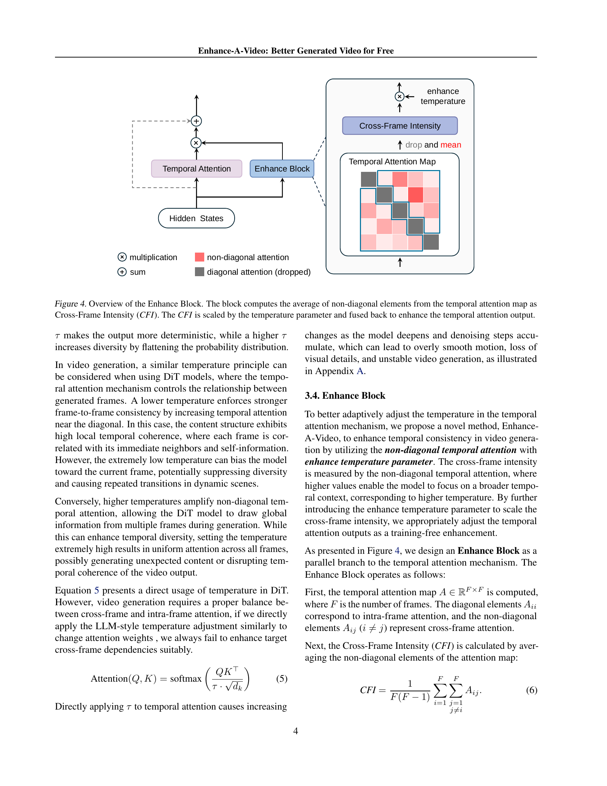
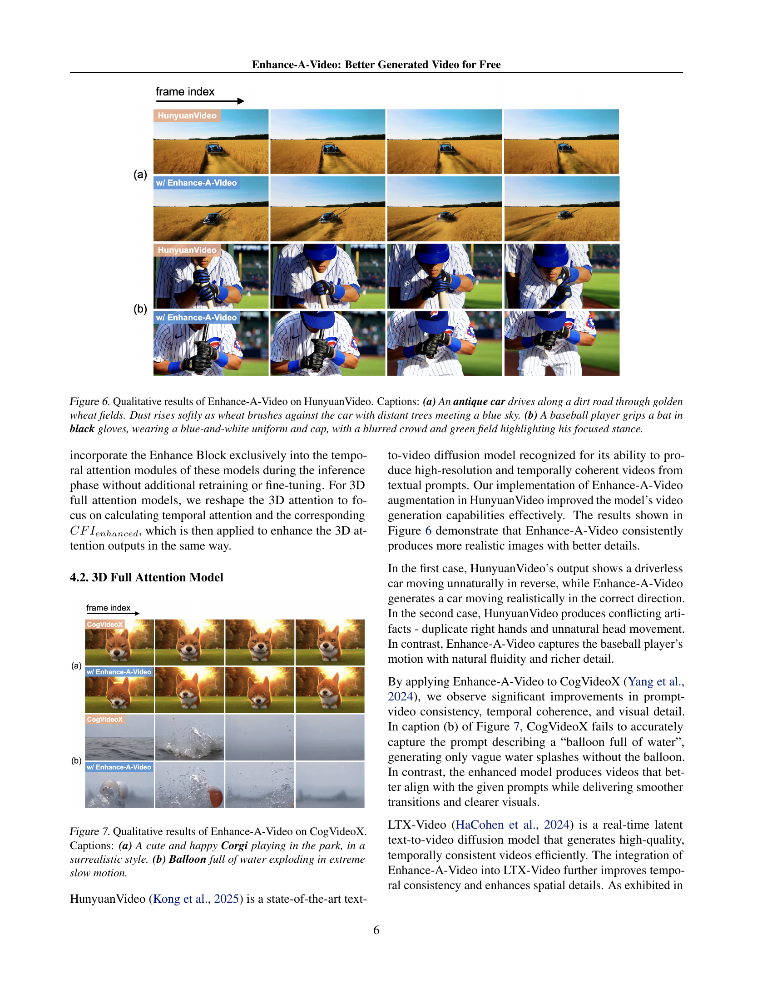

 


 2502.07508 
 Yang Luo et el. 
 
 🤗 2025-02-12 
 



↗ arXiv


↗ Hugging Face


↗ Papers with Code


### TL;DR



기존의 확산 변환기(Diffusion Transformer, DiT) 기반 비디오 생성 모델은 현실감 있는 비디오를 생성하지만, **시간적 일관성**과 **세밀한 부분**의 품질 저하 문제가 있습니다.  이러한 문제는 프레임 간 상관 관계가 제대로 고려되지 않아 발생하는데, 특히 비대각선 방향의 시간적 주의(Attention) 분포가 불균형적으로 나타나는 것이 주요 원인입니다. 

본 논문에서는 이러한 문제를 해결하기 위해 **Enhance-A-Video**라는 새로운 방법을 제시합니다.  Enhance-A-Video는 **훈련 없이** 프레임 간 상관관계를 강화하는 새로운 모듈을 제안하며,  **온도 매개변수**를 조정하여 시간적 일관성을 개선하고 세부적인 시각적 품질을 높입니다.  다양한 DiT 기반 비디오 생성 모델에서 실험을 통해, Enhance-A-Video가 **시간적 일관성**과 **시각적 품질**을 크게 향상시키는 것을 확인했습니다.  **추가적인 훈련이나 메모리 오버헤드 없이** 효과적인 성능 향상을 달성한 것이 주요 성과입니다.



#### Key Takeaways


 훈련이 필요 없는 새로운 방법으로 기존 비디오 생성 모델의 성능을 향상시켰습니다. 



 다양한 비디오 생성 모델에서 시간적 일관성과 시각적 품질을 향상시켰습니다. 



 간단한 설계로 인해 대부분의 기존 모델에 쉽게 적용 가능하며, 재훈련이나 미세 조정이 필요 없습니다. 


#### Why does it matter?
본 논문은 **훈련 없이 기존 확산 변환기 기반 비디오 생성 모델의 성능을 향상시키는 간단하면서도 효과적인 방법**을 제시합니다.  **연구 결과는 다양한 모델에서 일관되게 개선된 성능을 보여주며**, 비디오 생성 분야의 연구 동향에 따라 **추후 연구를 위한 새로운 방향**을 제시합니다.  **계산 비용이 적게 들면서도 뛰어난 성능 향상**을 이룬 점이 특히 중요하며, 관련 연구자들에게 큰 영향을 미칠 것으로 예상됩니다.  더 나아가, 본 연구는 **비디오 생성의 품질 향상을 위한 새로운 접근 방식**을 제시함으로써, 비디오 생성 기술의 발전에 기여할 것으로 예상됩니다.

------
#### Visual Insights

> 🔼 그림 1은 Enhance-A-Video가 기존 확산 트랜스포머 기반 비디오 생성 모델의 성능을 향상시키는 모습을 보여줍니다.  추가적인 학습이나 매개변수, 메모리 오버헤드 없이도 비디오의 질을 크게 개선합니다. 그림에는 Enhance-A-Video 적용 전후의 비디오 프레임들이 비교되어 있으며,  자세한 내용은 부록 F를 참조하시기 바랍니다.
> 

> 
read the caption

> Figure 1: Enhance-A-Video boosts diffusion transformers-based video generation quality at minimal cost - no training needed, no extra learnable parameters, no memory overhead. Detailed captions are available in Appendix F.
> 


| Model | Time (min) w/o EAV | Time (min) w/ EAV | Overhead |
|---|---|---|---| 
| HunyuanVideo | 50.32 | 50.72 | **0.8%** |
| CogVideoX | 1.53 | 1.57 | **2.1%** |

> 🔼 이 표는 Enhance-A-Video를 적용했을 때와 적용하지 않았을 때의 세 가지 비디오 생성 모델(CogVideoX, Open-Sora, LTX-Video)에 대한 VBench 점수를 비교한 것입니다. VBench 점수는 비디오 품질을 평가하는 지표이며, Enhance-A-Video 적용 여부에 따른 점수 변화를 통해 성능 향상 여부를 확인할 수 있습니다.
> 

> 
read the caption

> Table 1: Comparison of VBench Score for CogVideoX, Open-Sora, and LTX-Video models without and with Enhance-A-Video.
> 

### In-depth insights

#### DiT Enhancement
본 논문은 DiT 기반 비디오 생성 모델의 성능 향상에 초점을 맞추고 있습니다. **기존 DiT 모델이 시간적 일관성과 시각적 품질 면에서 한계를 보이는 문제를 해결하기 위해, 제안된 방법은 추가적인 학습 없이 기존 모델을 개선하는 데 중점을 둡니다.**  이는 **훈련이 필요 없는 접근 방식**을 통해 구현되며, 이는 계산 비용을 절감하고 다양한 DiT 모델에 쉽게 적용될 수 있다는 점에서 매우 중요한 장점입니다.  **핵심 아이디어는 비대각선적 시간적 어텐션 분포를 기반으로 프레임 간의 상관관계를 강화하는 것**입니다.  이를 통해 시간적 일관성을 개선하고 세부적인 시각적 디테일을 보존하는 데 효과적임을 보여줍니다.  실험 결과는 다양한 DiT 모델에서 시간적 일관성과 시각적 품질이 향상되었음을 보여주어, **본 논문의 접근 방식이 DiT 기반 비디오 생성 모델의 실질적인 성능 향상에 기여할 수 있음**을 시사합니다.  하지만, **온도 매개변수의 최적값이 프롬프트에 따라 달라진다는 점은 향후 연구에서 개선해야 할 부분**입니다.

#### Temp. Attention
본 논문에서 다루는 "Temp. Attention"은 비디오 생성 모델에서 **시간적 일관성**을 확보하는 데 매우 중요한 역할을 합니다.  기존의 단순한 어텐션 메커니즘은 **프레임 간의 연관성**을 제대로 포착하지 못해, 비디오의 자연스러운 흐름을 방해하고 화질 저하를 야기할 수 있다는 문제점을 지적합니다.  **Enhance-A-Video**는 이러한 문제를 해결하기 위해 **크로스-프레임 강도(CFI)**라는 개념을 도입하여 프레임 간의 상관관계를 강화하고, **향상된 온도 매개변수**를 활용하여 모델의 균형을 맞춥니다.  이는 비디오 생성 과정에서 **시간적 일관성**과 **화질 개선**에 중요한 영향을 미치는 요소임을 시사하며, 이를 통해 더욱 **자연스럽고 현실감 있는** 비디오 생성이 가능해짐을 보여줍니다.  **훈련 없이** 적용 가능하다는 점 또한 큰 장점입니다.

#### Ablation Study
본 논문의 ablation study는 **온도 매개변수의 영향**을 중점적으로 분석합니다. 온도 매개변수를 낮추면 시간적 일관성이 향상되지만 다양성이 감소하고, 반대로 높이면 다양성은 증가하지만 일관성이 저하되는 것을 보여줍니다. 이는 **적절한 온도 매개변수의 중요성**을 강조하며, **균형있는 설정**이 시간적 일관성과 시각적 다양성을 동시에 유지하는 데 필수적임을 시사합니다. 또한, **클리핑 메커니즘의 효과**를 보여주는 실험 결과도 제시하며, 클리핑을 통해 시간적 일관성 및 시각적 세부 묘사가 향상됨을 확인합니다. 이러한 분석 결과들은 제안된 모델의 효율성과 강건성을 뒷받침하며, 향후 연구 방향을 제시하는 데 기여합니다.  **추가적으로, 온도 매개변수의 최적값은 프롬프트에 따라 달라질 수 있다는 점**을 인지해야 합니다.

#### Future Works
향후 연구 방향으로는 **온도 매개변수의 자동 조정**을 위한 강화 학습 기반의 접근 방식을 고려해 볼 수 있습니다.  이를 통해 프롬프트의 맥락에 맞춰 온도를 동적으로 조절하여 더욱 개선된 결과를 얻을 수 있을 것입니다. 또한, **공간적 주의 메커니즘 및 교차 주의 메커니즘**을 향상시키는 연구 또한 필요합니다.  현재는 시간적 주의 메커니즘에 초점을 맞추고 있지만, 공간적 일관성 및 프롬프트 정합성을 더욱 향상시키기 위해서는 공간적 요소들을 고려해야 합니다.  마지막으로, **다양한 비디오 생성 모델 및 다양한 데이터셋**에 대한 실험을 확장하여 Enhance-A-Video의 일반화 성능을 평가하고 개선할 수 있는 방안을 모색해야 합니다. 이러한 추가적인 연구를 통해 더욱 강력하고 견고한 비디오 향상 기법을 개발할 수 있을 것으로 기대됩니다.

#### VBench Issues
VBench는 비디오 생성 모델의 품질을 평가하기 위한 벤치마크이지만, **Enhance-A-Video의 성능 향상을 완벽하게 포착하지 못하는 한계**를 보입니다. 특히, 미학적 품질(Aesthetic Quality) 측면에서  Enhance-A-Video가 주관적 평가에서는 더 나은 결과를 보여주지만, VBench 점수는 낮게 나오는 경우가 있습니다. 이는 VBench가 **실제 화질 개선을 완벽하게 반영하지 못하고**, 주관적인 요소를 충분히 고려하지 못하기 때문일 수 있습니다.  **영상의 세부적인 디테일 개선이나 자연스러운 움직임 등**은 VBench 점수에는 제대로 반영되지 않을 수 있으나, 사람의 눈으로는 명확히 차이를 인지할 수 있습니다. 따라서 향후 연구에서는 VBench의 한계를 보완하고, **더욱 정교하고 종합적인 평가 지표**를 개발해야 할 필요성이 있습니다.  **주관적 평가와 객관적 지표를 종합적으로 활용**하여 더욱 신뢰도 높은 성능 평가가 이루어져야 합니다.

### More visual insights

More on figures

> 🔼 이 그림은 HunyuanVideo 모델이 생성한 비디오의 예시로, 비자연스러운 머리 움직임, 반복되는 오른손 동작, 그리고 색깔이 일치하지 않는 장갑 등의 문제점을 보여줍니다.  이를 통해 기존 DiT 기반 비디오 생성 모델의 한계점을 시각적으로 보여주고 있습니다.  비디오 속 야구 선수의 머리, 오른손, 장갑의 색상 등이 부자연스럽거나 비일관성을 띄는 것을 확인할 수 있습니다.
> 

> 
read the caption

> Figure 2: Video sample of HunyuanVideo model with unnatural head movements, repeated right hands and conflicting glove color.
> 

> 🔼 이 그림은 Open-Sora 모델의 2, 14, 26번 블록에서 30번째 디노이징 단계의 시간적 어텐션 분포를 시각화한 것입니다.  대각선 요소(intra-frame attention)에 비해 비대각선 요소(cross-frame attention)의 값이 현저히 낮은 것을 보여줍니다. 이는 프레임 간의 연관성이 충분히 고려되지 않고, 프레임 간의 일관성이 부족할 수 있음을 시사합니다.  각 블록의 히트맵은 프레임 인덱스를 기준으로 시간적 어텐션 가중치를 표현합니다. 어두운 색상은 낮은 가중치를, 밝은 색상은 높은 가중치를 나타냅니다.  대각선의 밝은 색상은 각 프레임이 자기 자신과 강하게 연결되어 있음을, 비대각선의 어두운 색상은 프레임 간의 연결이 약함을 보여줍니다.
> 

> 
read the caption

> Figure 3: Visualization of temporal attention distributions in Open-Sora for blocks 2, 14, and 26 at denoising step 30, where non-diagonal elements are considerably weaker than diagonal elements.
> 

> 🔼 그림 4는 Enhance Block의 개요를 보여줍니다. 이 블록은 Temporal Attention Map에서 비대각선 요소들의 평균을 계산하여 Cross-Frame Intensity (CFI)를 계산합니다. 그리고 CFI는 Temperature Parameter와 곱해진 후 Temporal Attention Output을 향상시키기 위해 다시 합쳐집니다.  간단히 말해, 이 블록은 인접하지 않은 프레임들 간의 연관성을 강화하여 비디오의 일관성을 높이는 역할을 합니다. Temperature Parameter는 이 강화 정도를 조절하는 역할을 합니다.
> 

> 
read the caption

> Figure 4: Overview of the Enhance Block. The block computes the average of non-diagonal elements from the temporal attention map as Cross-Frame Intensity (CFI). The CFI is scaled by the temperature parameter and fused back to enhance the temporal attention output.
> 

> 🔼 그림 5는 CogVideoX 모델과 Enhance-A-Video를 적용한 모델의 29번째 레이어에서 디노이징 단계 50일 때의 시간적 어텐션 차이를 보여주는 그림입니다.  Enhance-A-Video를 적용한 모델의 어텐션 행렬에서 비대각선 요소(다른 프레임 간의 관계)는 파란색으로 표시되어 있으며 값이 증가한 것을 보여줍니다. 반면에 대각선 요소(같은 프레임 내의 관계)는 빨간색으로 표시되어 있으며 값이 감소한 것을 보여줍니다.  즉, Enhance-A-Video는 프레임 간의 연관성을 강화하고 동시에 각 프레임 내의 자기 참조는 약화시켜, 비디오의 일관성과 품질을 향상시키는 것을 시각적으로 보여줍니다.
> 

> 
read the caption

> Figure 5: Temporal attention difference map between original CogVideoX model and w/ Enhance-A-Video of layer 29 at denoising step 50. Non-diagonal elements in the attention matrix of w/ Enhance-A-Video show higher values (shown in blue), while diagonal elements have reduced values (shown in red).
> 

> 🔼 그림 6은 HunyuanVideo 모델에 Enhance-A-Video 기법을 적용한 결과를 보여줍니다. (a)는 고풍스러운 자동차가 금빛 밀밭 사이의 흙길을 따라 달리는 장면을, 먼지가 자동차를 스치듯 지나가고 푸른 하늘 아래 멀리 나무들이 보이는 모습을 담고 있습니다. (b)는 야구 선수가 검은색 글러브를 끼고 파란색과 흰색 유니폼과 모자를 쓴 채 방망이를 잡고 있는 모습을, 흐릿한 관중석과 녹색 경기장이 선수의 집중된 자세를 부각하는 모습을 보여줍니다. Enhance-A-Video는 영상의 시간적 일관성과 시각적 품질을 향상시키는 데 효과적임을 보여주는 대표적인 예시입니다.
> 

> 
read the caption

> Figure 6: Qualitative results of Enhance-A-Video on HunyuanVideo. Captions: (a) An antique car drives along a dirt road through golden wheat fields. Dust rises softly as wheat brushes against the car with distant trees meeting a blue sky. (b) A baseball player grips a bat in black gloves, wearing a blue-and-white uniform and cap, with a blurred crowd and green field highlighting his focused stance.
> 

> 🔼 그림 7은 CogVideoX 모델에 Enhance-A-Video 기법을 적용한 결과를 보여줍니다. (a)는 초현실적인 스타일로 공원에서 즐겁게 놀고 있는 코기 강아지를, (b)는 물풍선이 터지는 장면을 극단적인 슬로우 모션으로 보여줍니다. Enhance-A-Video는 영상의 시간적 일관성과 시각적 품질을 향상시키는 데 도움이 됩니다. (a)의 경우, 코기의 움직임이 더욱 자연스러워지고 세부적인 부분이 더욱 선명해졌습니다. (b)의 경우, 물풍선이 터지는 순간의 디테일이 더욱 풍부하고, 움직임 또한 더욱 부드러워졌습니다.
> 

> 
read the caption

> Figure 7: Qualitative results of Enhance-A-Video on CogVideoX. Captions: (a) A cute and happy Corgi playing in the park, in a surrealistic style. (b) Balloon full of water exploding in extreme slow motion.
> 

> 🔼 그림 8은 LTX-Video 모델에 Enhance-A-Video 기법을 적용한 결과를 보여줍니다. (a)는 눈 덮인 산맥을 따라 카메라가 이동하며 험준한 봉우리와 깊고 좁은 계곡을 보여주는 장면이고, (b)는 에메랄드 빛 강이 암석으로 이루어진 협곡을 따라 흐르며 소나무와 갈색 바위 사이사이에 반사되는 물웅덩이를 형성하는 장면입니다.  Enhance-A-Video 적용 전후의 영상 비교를 통해 향상된 시각적 품질과 일관성을 확인할 수 있습니다.
> 

> 
read the caption

> Figure 8: Qualitative results of Enhance-A-Video on LTX-Video. Captions: (a) The camera pans over snow-covered mountains, revealing jagged peaks and deep, narrow valleys. (b) An emerald-green river winds through a rocky canyon, forming reflective pools amid pine trees and brown-gray rocks.
> 

> 🔼 그림 9는 Open-Sora 모델에 Enhance-A-Video 기법을 적용한 결과를 보여줍니다.  케이크 이미지 생성에 있어서, 기존 Open-Sora 모델보다 Enhance-A-Video를 적용한 모델이 더욱 사실적이고 디테일한 케이크 이미지를 생성하는 것을 보여주는 정성적 결과입니다.  Enhance-A-Video는 프레임 간의 연관성을 향상시켜, 보다 자연스럽고 일관된 비디오 생성을 가능하게 합니다. 그림에서는 Enhance-A-Video 적용 전후의 이미지를 비교하여, 향상된 화질과 디테일을 확인할 수 있습니다.
> 

> 
read the caption

> Figure 9: Qualitative results of Enhance-A-Video on Open-Sora. Caption: A cake.
> 

> 🔼 그림 10은 사용자 연구 결과를 보여줍니다.  기준 모델과 Enhance-A-Video를 적용한 모델의 평가 기준별 성능을 비교 분석한 결과입니다. 평가 기준은 시간적 일관성, 프롬프트-비디오 일관성, 전반적인 시각적 품질의 세 가지입니다. Enhance-A-Video를 적용한 모델이 세 가지 평가 기준 모두에서 더 높은 선호도를 얻었다는 것을 보여줍니다.
> 

> 
read the caption

> Figure 10: User study results comparing baseline models and w/ Enhance-A-Video across evaluation criteria.
> 

> 🔼 그림 11은 Enhance Block에서 향상된 온도 매개변수에 대한 절삭 연구 결과를 보여줍니다. 적당한 값은 시간적 일관성과 시각적 다양성의 균형을 이루는 반면, 극단적인 값은 성능을 저하시킵니다. 이 그림은 시간적 일관성과 시각적 다양성에 미치는 향상된 온도 매개변수의 영향을 보여주는 여러 비디오 프레임을 보여줍니다. 온도 값이 증가함에 따라 시간적 일관성은 감소하고 시각적 다양성은 증가하지만, 어느 정도를 넘어서면 전체적인 성능이 저하됩니다. 이는 적당한 온도 매개변수 값을 선택하는 것이 성능을 최적화하는 데 중요함을 보여줍니다.
> 

> 
read the caption

> Figure 11: Ablation study on the enhance temperature parameter in the Enhance Block. Moderate values balance temporal consistency and visual diversity, while extreme values degrade performance.
> 

> 🔼 이 그림은 Enhance Block에서 클리핑 메커니즘을 사용했을 때와 사용하지 않았을 때의 비디오 생성 결과를 보여줍니다. 클리핑 메커니즘을 사용하지 않으면 비디오에 움직임 흐림이나 왜곡된 세부 사항과 같은 인공물이 나타날 수 있습니다. 이는 클리핑 메커니즘이 시간적 일관성을 유지하고 공간적 충실도를 보존하는 데 중요함을 보여줍니다.
> 

> 
read the caption

> Figure 12: Visual comparison of video generation results with and without the clipping mechanism in the Enhance Block.
> 

> 🔼 그림 13은 세 가지 온도 향상 기법(온도 어텐션 스케일링, CFI 어텐션 스케일링, Enhance-A-Video)을 비교하여 각 기법의 시간적 어텐션 분포 차이와 생성된 비디오를 보여줍니다. (a)는 온도 매개변수 τ가 1일 때 온도 어텐션 스케일링의 결과, (b)는 CFI 어텐션 스케일링 결과, (c)는 Enhance-A-Video 기법의 결과를 보여줍니다. 각각의 시간적 어텐션 맵과 생성된 비디오를 비교 분석하여, Enhance-A-Video 기법이 시간적 일관성과 시각적 품질을 향상시키는 데 가장 효과적임을 시각적으로 보여줍니다.
> 

> 
read the caption

> Figure 13: Temporal attention difference maps and corresponding generated videos comparing three temperature enhancement methods. (a) Temperature Attention Scaling τ=1𝜏1\tau=1italic_τ = 1. (b) CFI Attention Scaling. (c) Enhance-A-Video Method.
> 

> 🔼 그림 14는 CogVideoX 모델에 Enhance-A-Video를 적용한 결과를 보여줍니다. (a)는 네트워크 계층 4에서 추론 과정 동안 향상된 Cross-Frame Intensity (CFIenhanced)의 분포를 보여줍니다. CFIenhanced는 비대각선 요소의 평균으로 계산되며, 이는 시간적 일관성을 향상시키는 데 중요한 역할을 합니다. (b)는 네트워크 계층 4의 잔차 연결에서 𝑂𝑎𝑡𝑡𝑛과 𝐻 사이의 L2 노름 비율을 보여줍니다. 이 비율은 Enhance-A-Video가 시간적 일관성을 유지하면서 공간적 세부 사항을 보존하는 데 효과적임을 보여줍니다.
> 

> 
read the caption

> Figure 14: (a) The distribution of CFIenhancedsubscriptCFIenhanced\textit{CFI}_{\textit{enhanced}}CFI start_POSTSUBSCRIPT enhanced end_POSTSUBSCRIPT during the inference of CogVideoX w/ Enhance-A-Video in layer 4. (b) The proportion of l2subscript𝑙2l_{2}italic_l start_POSTSUBSCRIPT 2 end_POSTSUBSCRIPT norms between 𝐎attnsubscript𝐎attn\mathbf{O}_{\text{attn}}bold_O start_POSTSUBSCRIPT attn end_POSTSUBSCRIPT and 𝐇𝐇\mathbf{H}bold_H in residual connection in layer 4.
> 

> 🔼 이 그림은 사용자 연구의 한 예시로, 곱슬머리를 한 여성이 세련되고 현대적인 자동차의 운전석에 편안하게 앉아 앞을 응시하는 모습을 보여줍니다.  짧은 제목과 달리, 그림은 긴 머리카락, 운전석의 디자인, 여성의 자세와 표정 등 자세한 내용을 담고 있습니다. 이는 비디오 생성 모델의 세부 묘사 능력을 평가하는 데 도움이 됩니다.
> 

> 
read the caption

> Figure 15: Selected user study example with the caption: A woman with curly hair sits comfortably in the driver’s seat of a sleek, modern car, her eyes focused on the road ahead.
> 

> 🔼 그림 16은 사용자 연구의 한 예시로, 매끄럽고 은색의 비행기가 푸른 하늘을 시원하게 가로지르는 모습을 보여줍니다. 비행기의 날개는 솜털 같은 구름을 가르며, 햇빛은 비행기 표면에 반짝이며 아름다운 광경을 연출합니다.  비행기 뒤에는 섬세한 흰색의 비행운이 뻗어 나가고, 지상의 곡선도 어렴풋이 보여 고도감과 자유로움을 더합니다. 이 장면은 비행의 본질을 포착하여 경이로움과 탐험의 감정을 자극합니다.
> 

> 
read the caption

> Figure 16: Selected user study example with the caption: A sleek, silver airplane soars gracefully through a vast, azure sky, its wings cutting through wispy, cotton-like clouds.
> 

> 🔼 그림 17은 Enhance-A-Video 기법을 Open-Sora-Plan 모델에 적용했을 때의 정성적 결과를 보여줍니다.  Open-Sora-Plan은 멀티 레졸루션(multi-resolution) 기반의 잠재적 확산 변환(latent diffusion transformation) 프레임워크를 사용하는 텍스트-비디오 생성 모델로서, 시간적 일관성(temporal coherence)이 높은 고품질 비디오를 생성하는 데 중점을 둡니다.  Enhance-A-Video를 적용한 결과, 왼쪽 그림(꽃이 만발한 식물)에서는 잎과 꽃의 디테일이 더욱 선명해지고 흐릿함이 줄어들었으며, 오른쪽 그림(산 사이의 폭포)에서는 물 흐름과 바위의 윤곽이 더욱 명확해지고 자연스러운 조명과 질감이 향상된 것을 확인할 수 있습니다. 이는 Enhance-A-Video가 프레임 간의 상관관계를 향상시켜 시각적으로 고품질의 비디오를 생성하는 데 효과적임을 보여줍니다.
> 

> 
read the caption

> Figure 17: Qualitative results of Enhance-A-Video on Open-Sora-Plan.
> 

> 🔼 그림 18은 HunyuanVideo와 Enhance-A-Video를 사용하여 생성한 비디오의 화질 비교를 보여줍니다.  비디오의 자막은 '매끄럽고 은색의 비행기가 푸른 하늘을 우아하게 날아오르며, 날개는 솜털 같은 구름을 가르고 있습니다. 태양이 비행기의 광택 있는 표면에 반사되어 끝없이 펼쳐지는 푸른 하늘을 배경으로 눈부신 광경을 연출합니다. 비행기가 노력 없이 활공하면서, 배후에 섬세한 흰 리본처럼 연기가 생겨나 비디오의 신비로운 아름다움을 더합니다. 비행기 엔진이 내는 부드럽고 먼 소리가 고요한 분위기와 조화롭게 어울립니다. 아래로는 지구의 곡선이 희미하게 보여 고도와 자유로움을 더욱 강조합니다. 이 장면은 비행의 본질을 포착하여 경이로움과 탐험에 대한 감정을 불러일으킵니다.' 입니다. Enhance-A-Video를 적용한 비디오는 더욱 세밀하고 사실적인 묘사와 더불어 향상된 화질을 보여줍니다.
> 

> 
read the caption

> Figure 18: Comparison of video quality between HunyuanVideo and w/ Enhance-A-Video on a caption: A sleek, silver airplane soars gracefully through a vast, azure sky, its wings cutting through wispy, cotton-like clouds. The sun glints off its polished surface, creating a dazzling spectacle against the endless blue expanse. As it glides effortlessly, the contrail forms a delicate, white ribbon trailing behind, adding to the scene’s ethereal beauty. The aircraft’s engines emit a soft, distant hum, blending harmoniously with the serene atmosphere. Below, the earth’s curvature is faintly visible, enhancing the sense of altitude and freedom. The scene captures the essence of flight, evoking a feeling of wonder and exploration.
> 

### Full paper



