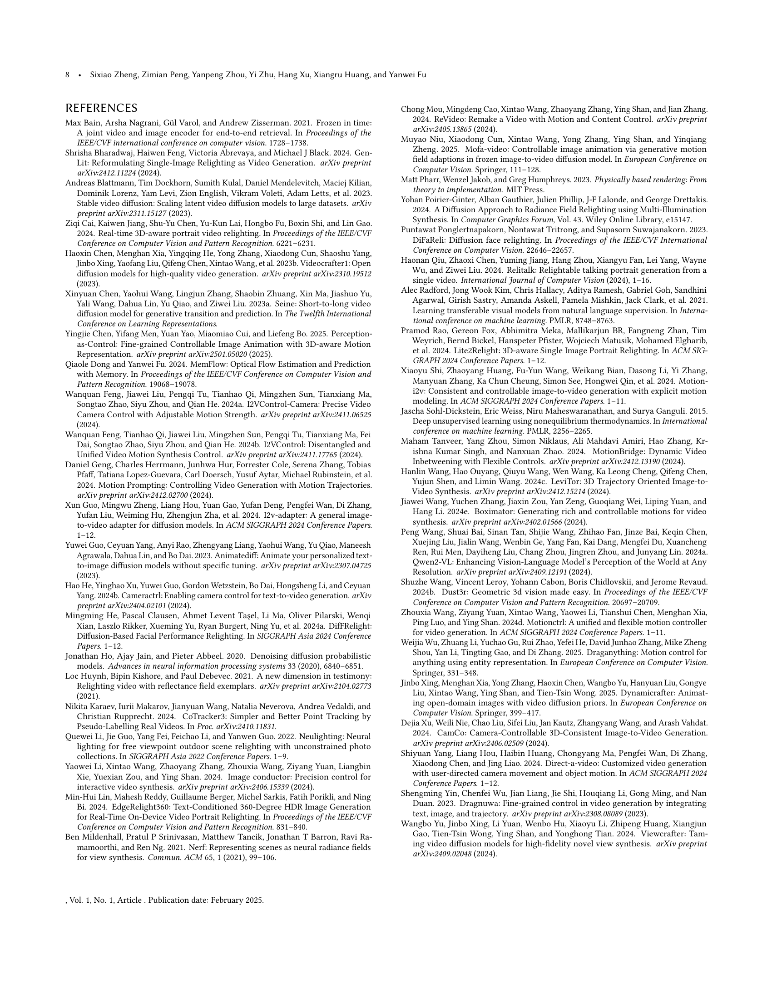

 


 2502.07531 
 Sixiao Zheng et el. 
 
 🤗 2025-02-12 
 



↗ arXiv


↗ Hugging Face


↗ Papers with Code


### TL;DR



기존의 이미지-비디오 생성 모델들은 카메라 움직임이나 물체 움직임 등 제한된 시각적 요소만 제어할 수 있었습니다.  **여러 시각적 요소를 동시에 제어하는 것은 어려웠고**, 이를 위해서는 **방대한 양의 주석 데이터가 필요**했습니다.  또한, **실제 세계의 비디오 데이터에는 조명 정보가 부족**하여, 조명 제어 기능을 갖춘 모델을 개발하는 데 어려움이 있었습니다.

본 논문에서는 **카메라 움직임, 물체 움직임, 조명 방향을 동시에 제어**할 수 있는 새로운 이미지-비디오 생성 모델 VidCRAFT3를 제시합니다.  **3단계 훈련 전략**을 통해 각 요소에 대한 제어를 효과적으로 분리하고,  **새로운 합성 데이터셋 VLD**를 통해 조명 정보를 포함한 고품질 데이터를 확보했습니다.  **실험 결과**, VidCRAFT3는 기존 모델보다 우수한 성능을 보였으며, **고품질 영상 생성과 정밀한 제어**가 가능함을 입증했습니다.  이 연구는 이미지-비디오 생성 기술의 발전에 크게 기여할 것으로 예상됩니다.



#### Key Takeaways


 이미지 한 장으로부터 카메라 움직임, 물체 움직임, 조명 방향까지 정밀하게 제어 가능한 고품질 비디오 생성 모델 VidCRAFT3 개발 



 카메라 움직임, 물체 움직임, 조명 방향 제어를 위한 3단계 훈련 전략과 VideoLightingDirection(VLD) 합성 데이터셋 제시 



 기존 방법보다 향상된 제어 정밀도와 시각적 사실성을 보이는 실험 결과 제시 


#### Why does it matter?
이 논문은 **이미지-비디오 생성 분야의 새로운 가능성**을 제시하며, **다양한 시각적 요소에 대한 정밀한 제어를 가능하게** 합니다. **카메라 움직임, 물체 움직임, 조명 방향 등을 동시에 제어**할 수 있는 모델을 제시하고, **새로운 합성 데이터셋과 훈련 전략**을 통해 실제 이미지와 유사한 고품질 영상 생성에 성공했습니다. 이는 **향후 연구에 대한 새로운 방향**을 제시하며,  **다양한 응용 분야에서 활용**될 수 있는 잠재력을 가지고 있습니다. 연구자들은 이 논문에서 제시된 모델과 방법론을 바탕으로 더욱 향상된 이미지-비디오 생성 기술을 개발하고, **실감나는 가상현실 및 증강현실 콘텐츠 제작**에 활용할 수 있습니다.

------
#### Visual Insights

> 🔼 그림 1은 VidCRAFT3 모델이 다양한 제어 신호를 사용하여 고품질의 이미지-비디오 생성 결과를 제공하는 모습을 보여줍니다.  이 모델은 큰 물체의 움직임, 시점 변화, 강한 조명 효과를 지원하며, 사용자는 카메라 움직임(파란색 궤적), 물체 움직임(빨간색 희소 궤적), 조명 방향을 직관적으로 제어할 수 있습니다.  VidCRAFT3은 지원되는 제어 신호의 임의 조합을 받아 세밀하고 사실적인 생성 결과를 제공합니다.  각각의 하위 그림 (a)부터 (e)까지는 카메라 움직임, 물체 움직임, 조명 방향 제어가 단독 또는 조합으로 적용된 결과를 보여줍니다.
> 

> 
read the caption

> Figure 1. VidCRAFT3 is a high-quality image-to-video generation model that supports large object motion, view changes, and strong lighting effects. It offers user-friendly control over camera motion (a trajectory in blue), object motion (sparse trajectories in red), and lighting direction. VidCRAFT3 can take any combination of supported control signals and deliver fine-grained and faithful generation results.
> 


| Method | FID↓ | FVD↓ | CLIPSIM↑ | PSNR↑ | SSIM↑ | LPIPS↓ | CamMC↓ |
|---|---|---|---|---|---|---|---| 
| CameraCtrl | 97.99 | 96.11 | 29.41 | 14.94 | 0.56 | 0.25 | 4.19 |
| CamI2V | 98.54 | 85.03 | 30.37 | 14.53 | 0.51 | 0.28 | 4.24 |
| MotionCtrl | 103.82 | 188.93 | 30.18 | 12.81 | 0.47 | 0.35 | 4.23 |
| **Ours** | **75.62** | **49.77** | **32.32** | **18.04** | **0.63** | **0.18** | **4.07** |

> 🔼 표 1은 논문에서 제시된 VidCRAFT3 모델의 성능을 기존 최첨단(SOTA) 방법들과 비교 분석한 결과를 보여줍니다.  RealEstate10K 데이터셋을 사용하여, VidCRAFT3와 다른 SOTA 모델들의 FID(Fréchet Inception Distance), FVD(Fréchet Video Distance), CLIPSim, PSNR(Peak Signal-to-Noise Ratio), SSIM(Structural Similarity Index), LPIPS(Learned Perceptual Image Patch Similarity), 그리고 CamMC(Camera Motion Control metric) 지표를 비교하여 정량적으로 평가하고 있습니다. 이 표를 통해 VidCRAFT3 모델이 다양한 측면에서 우수한 성능을 보임을 확인할 수 있습니다.
> 

> 
read the caption

> Table 1. Quantitative comparison with SOTA methods on RealEstate10K.
> 

### In-depth insights

#### 3D-Aware I2V
3D-Aware I2V는 기존의 2D 이미지 기반 영상 생성 방식의 한계를 뛰어넘어 **3차원 공간 정보를 활용**하여 보다 사실적이고 현실감 있는 비디오 생성을 목표로 합니다.  **3D 모델 또는 깊이 정보를 활용**하여 시점 변화, 물체의 자연스러운 움직임, 정교한 광원 효과 등을 실현할 수 있으며, 이는 단순한 픽셀 변화가 아닌 **공간적 이해에 기반한 영상 생성**을 가능하게 합니다.  **정확한 3D 정보의 활용**은 물리 법칙을 더욱 잘 따르는 현실적인 움직임과 조명 효과를 만들어내고,  **사용자 제어의 정확도를 높이는데 기여**할 것입니다.  하지만, **정확한 3D 정보 획득의 어려움과 높은 계산 비용**은 여전히 극복해야 할 과제입니다.  향후 3D-Aware I2V 기술은 실시간 영상 생성, 가상현실 및 증강현실 등 다양한 분야에서 폭넓게 활용될 것으로 기대되지만,  **데이터 확보 및 효율적인 알고리즘 개발**이 중요한 발전 방향이 될 것입니다.

#### Multi-Control I2V
다중 제어 I2V는 **단일 이미지로부터 비디오를 생성하는 기술**로, 카메라 동작, 객체 움직임, 조명 방향 등 여러 요소를 동시에 제어할 수 있는 능력을 의미합니다. 이는 기존의 이미지-비디오 생성 기술이 하나의 제어 요소에만 초점을 맞춘 것과 달리, **훨씬 풍부하고 사실적인 비디오 생성**을 가능하게 합니다.  **복잡한 시나리오를 표현**하는 데 유용하며, 사용자에게 **세밀한 제어 기능**을 제공하여 다양한 창작 가능성을 열어줍니다.  하지만 다중 제어 I2V는 **데이터 수집 및 모델 훈련의 어려움**, **각 제어 요소 간의 상호 작용 모델링**, **연산량 증가** 등의 과제를 안고 있습니다. 따라서 향후 연구는 이러한 문제점들을 해결하고, 더욱 **강력하고 효율적인 다중 제어 I2V 기술** 개발에 집중되어야 할 것입니다. 특히, **실제 환경 데이터 확보** 및 **실시간 처리**를 위한 연구가 중요하며, 다양한 제어 요소 간의 **복잡한 상호 작용을 정확하게 모델링**하는 새로운 방법론의 개발이 필요할 것으로 예상됩니다.

#### VLD Dataset
본 논문에서 제시된 VLD (Video Lighting Direction) 데이터셋은 **이미지-비디오 생성 모델의 조명 제어 성능 향상**에 중요한 역할을 합니다. 기존의 실제 영상 데이터셋에는 조명 정보가 부족하여 조명 제어 기능을 갖춘 모델 학습에 어려움이 있었던 반면, **VLD 데이터셋은 합성 영상을 사용하여 각 프레임에 대한 정확한 조명 방향 정보를 제공**합니다. 이를 통해 모델은 다양한 조명 환경에서의 물체 반응을 학습하여 **더욱 사실적이고 세밀한 조명 효과를 가진 비디오 생성**이 가능해집니다.  **다양한 물체와 배경을 포함하고 있고, 각 물체에 대한 정확한 조명 방향이 주어지는 것이 특징**입니다.  따라서, VLD 데이터셋은 이미지-비디오 생성 분야의 발전에 크게 기여할 뿐 아니라, **향후 연구에서도 다양한 조명 제어 관련 연구에 활용**될 수 있다는 점에서 큰 의의를 갖습니다.  **특히, 실제 환경에서 조명 정보를 얻기 어려운 점을 고려했을 때, VLD 데이터셋은 합성 데이터를 통해 이러한 한계를 극복**하는 효과적인 방법을 제시하고 있습니다.

#### 3-Stage Training
본 논문에서 제시된 3단계 학습 전략은 **이미지-비디오 생성 모델의 성능을 향상시키는 데 중요한 역할**을 합니다. 1단계는 카메라 동작 제어에 집중하여 공간적 구조와 시간적 역동성을 학습합니다.  2단계는 객체 움직임과 조명 제어를 추가하여 **다양한 시각적 요소들을 통합적으로 학습**하도록 합니다. 마지막 3단계는 실제 데이터의 제한적인 정보를 고려하여 **희소한 객체 궤적을 활용**, 모델의 일반화 능력을 향상시킵니다.  이러한 단계별 학습은 계산 효율성을 높이고 각 요소에 대한 제어 정확도를 높이는 데 기여합니다. **단계별 접근 방식은 복잡한 다중 모달리티 제어를 효과적으로 학습**할 수 있도록 하여 최종적으로 고품질 비디오 생성을 가능하게 합니다. 특히, 희소 객체 궤적을 사용한 3단계는 실제 환경의 데이터 부족 문제를 해결하는 실용적인 전략입니다.

#### I2V Limitations
이미지 투 비디오(I2V) 기술은 괄목할 만한 발전을 이루었지만, 여전히 극복해야 할 제한점들이 존재합니다. **현실 세계의 복잡성을 완벽히 반영하지 못하는 점**이 가장 큰 문제입니다.  **조명, 물체의 물리적 상호 작용, 역동적인 인간의 움직임 등을 정확하게 모델링하고 생성하는 데 어려움**이 있습니다.  데이터 셋의 한계 또한 I2V 기술 발전에 걸림돌이 됩니다. **다양한 조명, 물체, 배경 조합을 포함하는 고품질의 대규모 데이터 셋은 확보하기 어렵고,  수동으로 정교한 주석을 달아야 하는 작업 또한 막대합니다.**  **기존의 방법들은 특정 객체 카테고리에 편향되어 있거나, 제한된 조건 하에서만 제대로 작동하는 경우가 많습니다.** 따라서 보다 일반적이고, 다양한 조건에도 잘 적응할 수 있는 강건한 I2V 모델을 개발하기 위해서는,  **더욱 정교한 모델 아키텍처와  대규모 고품질 데이터 셋, 그리고 효율적인 학습 전략** 등 다각적인 접근이 필요합니다.

### More visual insights

More on figures

> 🔼 그림 2는 제어 가능한 이미지-비디오 생성을 위한 VidCRAFT3의 아키텍처를 보여줍니다. 이 모델은 비디오 확산 모델(VDM)을 기반으로 하며, 세 가지 주요 구성 요소로 이루어져 있습니다. 첫째, Image2Cloud 모듈은 참조 이미지로부터 고품질 3D 점 구름 렌더링을 생성합니다. 둘째, ObjMotionNet 모듈은 희소 궤적(sparse trajectories)으로 표현되는 객체의 움직임을 인코딩하고, 그 출력은 UNet 인코더에 요소별 추가(element-wise addition)를 통해 통합됩니다. 셋째, Spatial Triple-Attention Transformer 모듈은 병렬 교차 어텐션 모듈(parallel cross-attention modules)을 통해 이미지, 텍스트, 조명 정보를 통합합니다. 이 모델은 카메라 움직임, 객체 움직임, 조명 방향을 조건으로 비디오를 생성하여 다양한 모드에서 사실적이고 일관된 출력을 보장합니다.
> 

> 
read the caption

> Figure 2. Architecture of VidCRAFT3 for controlled image-to-video generation. The model builds on Video Diffusion Model (VDM) and consists of three main components: the Image2Cloud module generates high-quality 3D point cloud renderings from a reference image; the ObjMotionNet module encodes object motion represented by sparse trajectories, the output is integrated into the UNet encoder by element-wise addition; the Spatial Triple-Attention Transformer module integrates image, text, and lighting information via parallel cross-attention modules. The model generates video by conditioning on camera motion, object motion, and lighting direction, ensuring realistic and consistent outputs across different modalities.
> 

> 🔼 그림 3은 비디오 조명 방향(VLD) 데이터셋의 예시를 보여줍니다. 3D 모델과 배경을 사용한 샘플을 보여주며, (a)는 HDR 배경을 가진 Poly Haven 기반 VLD 샘플이고, (b)는 텍스처 배경을 가진 BOP 기반 VLD 샘플입니다. 각 세트에는 두 가지 조명 조건에서 두 개의 샘플에 대한 비디오 프레임이 포함되어 있습니다.  Poly Haven 기반 샘플은 고품질 HDR 배경을 사용하여 더욱 사실적인 조명 효과를 보여주는 반면, BOP 기반 샘플은 다양한 텍스처 배경으로 다양한 환경에서의 조명 효과를 보여줍니다.  각 샘플은 여러 각도에서의 조명을 보여주는 비디오 클립으로 구성되어 있어 조명 변화에 따른 시각적 효과를 자세히 분석하는데 도움이 됩니다.
> 

> 
read the caption

> Figure 3. Illustrations of examples from the Video Lighting Direction (VLD) Dataset, showcasing samples with 3D models and backgrounds. (a) Poly Haven-based VLD Samples with HDR backgrounds. (b) BOP-based VLD Samples with textured backgrounds. Each set includes video frames of two samples under two different lighting conditions.
> 

> 🔼 그림 4는 RealEstate10K 데이터셋에서 최첨단 방법들과 비교하여 VidCRAFT3의 카메라 움직임 제어 성능을 정성적으로 보여줍니다. VidCRAFT3는 다른 방법들보다 더 부드럽고 현실감 있는 카메라 움직임을 생성하고, 특히 복잡한 장면에서 아티팩트가 적게 나타납니다. 이는 정확한 3D 장면 재구성과 세밀한 카메라 제어를 가능하게 하는 Image2Cloud 모듈 덕분입니다.  다양한 방법들의 결과 영상을 비교하여 VidCRAFT3의 우수성을 시각적으로 확인할 수 있습니다.
> 

> 
read the caption

> Figure 4. Qualitative comparisons with SOTA methods on RealEstate10K.
> 

> 🔼 그림 5는 WebVid-10M 데이터셋에서 다양한 최첨단 방법들과 VidCRAFT3의 비교 결과를 보여줍니다.  각 방법들은 객체의 움직임을 얼마나 정확하게 제어하고, 생성된 비디오의 시각적 품질이 어떠한지를 보여주는 질적 비교입니다.  VidCRAFT3는 기존 방법들보다 더욱 정확하고 사실적인 객체 모션 제어 능력을 보여줍니다.  특히, 복잡한 움직임에도 뛰어난 성능을 보여주며, 객체의 움직임과 배경의 일관성을 유지하는 데 있어서도 우수한 결과를 보입니다.
> 

> 
read the caption

> Figure 5. Qualitative comparisons with SOTA methods on WebVid-10M.
> 

> 🔼 그림 6은 카메라 움직임 제어와 조명 방향 제어를 동시에 사용한 추가 실험 결과를 보여줍니다. 다양한 환경과 물체에 대해 카메라가 움직이는 동안 조명 방향이 변화하는 모습을 보여주는 여러 비디오 프레임들이 제시되어 있습니다. 이를 통해 VidCRAFT3 모델이 카메라 움직임과 조명 변화를 자연스럽게 통합하여 고품질 비디오를 생성하는 능력을 시각적으로 보여줍니다. 각각의 비디오는 카메라의 움직임 경로와 조명 방향 변화를 명확히 보여주도록 디자인되었습니다.
> 

> 
read the caption

> Figure 6. Additional experimental results on camera motion control + lighting direction control.
> 

> 🔼 그림 7은 논문의 카메라 움직임 제어에 대한 추가 실험 결과를 보여줍니다.  다양한 장면에서 카메라의 움직임을 제어하는 VidCRAFT3 모델의 성능을 보다 자세하게 보여주는 여러 개의 비디오 프레임 시퀀스를 포함하고 있습니다. 각 시퀀스는 원본 이미지와 VidCRAFT3를 사용하여 생성된 비디오를 보여주며, 사용된 카메라 움직임 패턴을 시각적으로 확인할 수 있습니다. 이를 통해 사용자가 원하는 카메라 움직임을 얼마나 정확하게 제어할 수 있는지, 그리고 생성된 비디오의 시각적 품질이 어느 정도인지를 판단하는 데 도움이 됩니다.
> 

> 
read the caption

> Figure 7. Additional experimental results on camera motion control.
> 

> 🔼 그림 8은 카메라 움직임과 객체 움직임을 동시에 제어하는 VidCRAFT3 모델의 추가 실험 결과를 보여줍니다.  이 그림은 다양한 시나리오에서 모델이 생성한 비디오의 일부 프레임을 보여주며, 카메라의 움직임과 객체의 움직임이 정확하고 자연스럽게 제어되는 것을 보여줍니다. 각 시나리오는 지상 진실(GT)과 VidCRAFT3를 포함한 여러 최첨단 방법(SOTA)의 결과를 비교하여 VidCRAFT3의 성능을 더욱 명확하게 보여줍니다.  다양한 객체의 움직임과 카메라의 복잡한 궤적을 정확하게 재현하여 VidCRAFT3의 강력한 제어 능력과 사실적인 영상 생성 능력을 입증합니다.
> 

> 
read the caption

> Figure 8. Additional experimental results on camera motion control + object motion control.
> 

> 🔼 그림 9는 WebVid-10M 데이터셋을 사용한 학습 전략에 대한 ablation study의 정성적 결과를 보여줍니다.  세 가지 다른 학습 전략 (Dense, Sparse, Dense+Sparse)을 비교하여 각 전략이 객체 움직임을 얼마나 정확하게 생성하는지 보여줍니다.  Dense 전략은 풍부한 모션 정보를 제공하지만,  Sparse 입력에는 어려움을 겪는 반면, Sparse 전략은 추론 정렬을 개선하지만 모션 세부 정보가 부족합니다. Dense+Sparse 접근 방식은 두 전략의 장점을 결합하여 가장 좋은 결과를 얻습니다.  이 그림은 각 전략에 대한 여러 비디오 프레임을 보여주어 객체 궤적의 정확성과 시각적 품질을 비교 분석합니다.  결론적으로, Dense+Sparse 전략이 객체 모션 제어 및 비디오 품질을 향상시킨다는 것을 보여줍니다.
> 

> 
read the caption

> Figure 9. Qualitative results of the ablation study on training strategies with WebVId-10M.
> 

> 🔼 그림 10은 VLD(Video Lighting Direction) 데이터셋에서 조명 임베딩 통합 전략에 대한 에이블레이션 연구의 정성적 결과를 보여줍니다.  다양한 조명 임베딩 통합 방법(텍스트 크로스 어텐션, 시간 임베딩, 조명 크로스 어텐션)을 사용하여 생성된 비디오 프레임을 보여주며,  각 방법의 장단점과 원본 영상과의 비교를 통해 최적의 조명 제어 전략을 제시합니다.  특히, 조명 크로스 어텐션 기법이 가장 사실적이고 정확한 조명 효과를 생성하는 것을 보여줍니다.
> 

> 
read the caption

> Figure 10. Qualitative results of the ablation study on lighting embedding integration strategies on VLD.
> 

> 🔼 그림 11은 VLD 데이터셋에서 조명 방향 표현에 대한 ablation 연구의 정성적 결과를 보여줍니다.  이 그림은 푸리에 임베딩과 구면 조화 함수(SH) 임베딩을 사용하여 조명 방향을 나타내는 방법을 비교 분석한 결과입니다.  각각의 방법에 대한 결과 이미지들을 통해 조명 방향 표현 방식이 최종 이미지 품질(사실성, 정확성 등)에 미치는 영향을 시각적으로 확인할 수 있습니다.  SH 임베딩이 푸리에 임베딩보다 더 나은 결과를 보여주는 것을 확인할 수 있습니다.
> 

> 
read the caption

> Figure 11. Qualitative results of the ablation study on the representation of lighting direction on VLD.
> 

> 🔼 그림 12는 본 논문에서 제시하는 VidCRAFT3 모델의 객체 움직임 제어 성능을 보여주는 추가적인 실험 결과입니다.  다양한 유형의 객체와 배경을 사용한 여러 비디오 생성 예시를 보여주며,  VidCRAFT3가 사용자 제공 제어 신호(희소 궤적)를 기반으로 객체의 움직임을 얼마나 정확하고 사실적으로 제어할 수 있는지를 보여줍니다.  각각의 비디오는 입력 이미지, 목표 객체의 희소 궤적, 그리고 VidCRAFT3에 의해 생성된 결과 비디오를 순차적으로 보여줍니다. 이를 통해 사용자가 지정한 움직임 경로대로 객체가 부드럽고 자연스럽게 움직이는 것을 확인할 수 있습니다.
> 

> 
read the caption

> Figure 12. Additional experimental results on object motion control.
> 

> 🔼 그림 13은 조명 방향 제어에 대한 추가 실험 결과를 보여줍니다.  이 그림은 VidCRAFT3 모델이 사용자의 조명 방향 제어 입력에 따라 다양한 조명 조건에서도 일관되고 사실적인 비디오를 생성할 수 있음을 보여주는 여러 비디오 프레임들을 포함하고 있습니다. 각각의 비디오는 다른 조명 방향 설정으로 생성되었으며, 이를 통해 VidCRAFT3 모델이 다양한 조명 효과를 생성하는 능력을 시각적으로 보여줍니다.  특히, 그림에서 볼 수 있듯이,  모델은 조명의 방향 변화에 따라 물체의 그림자와 하이라이트의 위치 및 강도를 정확하게 조절하여 사실적인 조명 효과를 생성하는 것을 확인할 수 있습니다.
> 

> 
read the caption

> Figure 13. Additional experimental results on lighting direction control.
> 

More on tables


| Method | FID ↓ | FVD ↓ | CLIPSIM ↑ | PSNR ↑ | SSIM ↑ | LPIPS ↓ | ObjMC ↓ |
|---|---|---|---|---|---|---|---| 
| Image Conductor | 150.26 | 242.01 | 29.69 | 15.18 | 0.501 | 0.30 | 12.96 |
| Motion-I2V | 128.35 | 171.35 | 30.92 | 16.20 | 0.53 | 0.26 | 3.96 |
| **Ours** | **87.12** | **120.65** | **32.99** | **18.48** | **0.60** | **0.19** | **3.51** |
> 🔼 표 2는 WebVid-10M 데이터셋에서 최첨단 기법들과 비교하여 VidCRAFT3 모델의 성능을 정량적으로 비교 분석한 결과를 보여줍니다.  FID(Fréchet Inception Distance), FVD(Fréchet Video Distance), CLIPSIM, PSNR(Peak Signal-to-Noise Ratio), SSIM(Structural Similarity Index), LPIPS(Learned Perceptual Image Patch Similarity) 및 CamMC(Camera Motion Control) 지표를 사용하여  다양한 측면에서 VidCRAFT3의 성능을 평가하고 다른 모델들과 비교합니다.  이 표를 통해, VidCRAFT3가 이미지-비디오 생성 작업에서 경쟁력 있는 성능을 보임을 확인할 수 있습니다.
> 

> 
read the caption

> Table 2. Quantitative comparison with SOTA methods on WebVid-10M.
> 


| Method | FID↓ | FVD↓ | CLIPSIM↑ | PSNR↑ | SSIM↑ | LPIPS↓ | ObjMC↓ |
|---|---|---|---|---|---|---|---| 
| Dense | 92.05 | 143.44 | 30.78 | 18.21 | 0.59 | 0.20 | 4.39 |
| Sparse | 91.54 | 123.15 | 30.93 | 18.47 | 0.59 | 0.20 | 4.05 |
| **Dense+Sparse** | **87.12** | **120.65** | **32.99** | **18.48** | **0.60** | **0.19** | **3.51** |
> 🔼 이 표는 WebVid-10M 데이터셋을 사용하여 세 가지 다른 훈련 전략(Dense, Sparse, Dense+Sparse)의 효과를 비교 분석한 결과를 보여줍니다. 각 전략은 객체 움직임 데이터의 밀도(Dense는 고밀도, Sparse는 저밀도, Dense+Sparse는 두 가지를 결합)에 따라 다르며, FID, FVD, CLIPSIM, PSNR, SSIM, LPIPS, ObjMC와 같은 다양한 지표를 통해 모델 성능을 평가합니다. Dense 전략은 풍부한 정보를 제공하지만 추론 속도가 느리고, Sparse 전략은 추론 속도가 빠르지만 세부 정보가 부족한 반면, Dense+Sparse 전략은 두 가지의 장점을 결합하여 최상의 성능을 보여줍니다. 이를 통해 객체 움직임 제어의 정확성과 비디오 품질 향상에 있어 데이터 밀도의 영향을 확인할 수 있습니다.
> 

> 
read the caption

> Table 3. Ablation of training strategy on WebVid-10M.
> 


| Method | FID ↓ | FVD ↓ | CLIPSIM ↑ | PSNR ↑ | SSIM ↑ | LPIPS ↓ | CamMC ↓ |
|---|---|---|---|---|---|---|---| 
| Text Cross-Attention | 111.08 | 121.95 | 22.77 | 18.14 | 0.72 | 0.13 | 5.31 |
| Time Embedding | 101.71 | 123.31 | 22.70 | 19.07 | 0.73 | 0.12 | 5.21 |
| **Lighting Cross-Attention** | **100.83** | **117.69** | **23.70** | **19.49** | **0.74** | **0.11** | **5.00** |
> 🔼 표 4는 VLD(Video Lighting Direction) 데이터셋에서 조명 임베딩 통합 전략의 영향을 분석한 결과를 보여줍니다.  다양한 조명 임베딩 통합 방법(텍스트 크로스 어텐션, 시간 임베딩, 조명 크로스 어텐션)을 사용하여 FID, FVD, CLIPSIM, PSNR, SSIM, LPIPS, ObjMC 지표를 비교 분석했습니다.  각 방법의 강점과 약점을 파악하여 최적의 조명 제어 전략을 제시하고자 합니다.  이 표를 통해 어떤 조명 임베딩 통합 방법이 비디오 생성의 품질과 효율성에 가장 큰 영향을 미치는지 확인할 수 있습니다.
> 

> 
read the caption

> Table 4. Ablation of lighting embedding integration strategies on VLD.
> 


| Light Representation | FID ↓ | FVD ↓ | CLIPSIM ↑ | PSNR ↑ | SSIM ↑ | LPIPS ↓ | CamMC ↓ |
|---|---|---|---|---|---|---|---| 
| Fourier Embedding | 107.40 | 121.89 | 21.71 | 17.48 | 0.70 | 0.14 | 5.03 |
| **SH Encoding** | **100.83** | **117.69** | **23.70** | **19.49** | **0.74** | **0.11** | **5.00** |
> 🔼 표 5는 VLD(Video Lighting Direction) 데이터셋에서 조명 방향 표현에 대한 ablation 연구 결과를 보여줍니다.  Fourier Embedding과 SH(Spherical Harmonics) Encoding 두 가지 방법을 비교하여 어떤 방법이 조명 방향을 더 효과적으로 표현하는지, 그리고 그에 따른 FID, FVD, CLIPSIM, PSNR, SSIM, LPIPS, CamMC 지표의 변화를 분석합니다.  즉,  조명 방향을 나타내는 방법에 따라 생성된 비디오의 화질과 조명의 정확도가 어떻게 달라지는지 보여주는 실험 결과 표입니다.
> 

> 
read the caption

> Table 5. Ablation of representation of lighting direction on VLD.
> 

### Full paper



