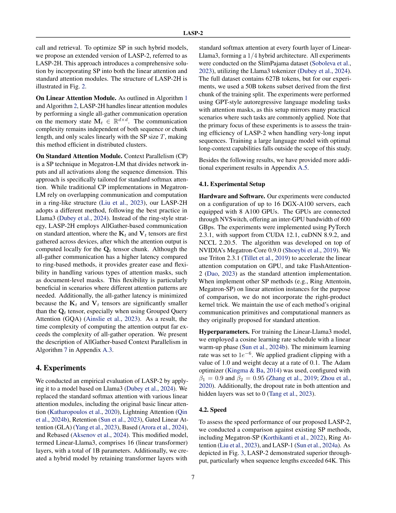

 


 2502.07563 
 Weigao Sun et el. 
 
 🤗 2025-02-13 
 



↗ arXiv


↗ Hugging Face


↗ Papers with Code


### TL;DR



기존의 선형 어텐션 기반 시퀀스 모델링은 장문 시퀀스 처리 시 계산 비용이 많이 들고 메모리 효율성이 떨어지는 문제가 있습니다. 특히, 기존의 시퀀스 병렬 처리 방법들은 선형 어텐션의 특성을 충분히 활용하지 못하여 성능 저하를 야기했습니다.  이는 대규모 언어 모델의 확장성에 제약이 되는 요인입니다.

본 논문에서는 이러한 문제를 해결하기 위해 LASP-2라는 새로운 시퀀스 병렬 처리 방법을 제시합니다. LASP-2는 단일 AllGather 통신을 사용하여 통신 오버헤드를 최소화하고, 계산 및 통신 병렬 처리를 최대화하여 학습 속도를 향상시킵니다. 또한, 선형 및 표준 어텐션 계층을 모두 포함하는 하이브리드 모델에도 적용 가능한 LASP-2H를 제시하여, 다양한 모델 구조에 대한 효율적인 병렬 처리 솔루션을 제공합니다. 실험 결과, LASP-2는 기존 방법들에 비해 상당한 성능 향상을 보였습니다.



#### Key Takeaways


 LASP-2는 선형 어텐션 계층에 대한 시퀀스 병렬 처리를 위한 최소한의 통신 요구 사항을 재고하여, 계산 및 통신 병렬 처리를 모두 향상시킵니다. 



 LASP-2는 단일 AllGather 집합적 통신만을 사용하여 중간 메모리 상태를 전달함으로써, 통신 오버헤드를 줄이고 계산 및 통신 병렬 처리 간의 중첩을 최대화합니다. 



 LASP-2H는 선형 및 표준 어텐션 계층을 결합한 하이브리드 모델에 대한 효율적인 시퀀스 병렬 처리 솔루션을 제공합니다. 


#### Why does it matter?
본 논문은 **장문 시퀀스에 대한 선형 어텐션 트랜스포머 모델의 학습 속도를 크게 향상**시키는 LASP-2 알고리즘을 제시하여, **대규모 언어 모델(LLM)의 효율성과 확장성을 높이는 데 중요한 기여**를 합니다.  **장문 시퀀스 처리에 대한 연구 동향과 밀접하게 관련**되어 있으며, 향후 연구를 위한 새로운 방향을 제시합니다. 특히, **분산 시스템에서의 계산 및 통신 병렬 처리에 대한 새로운 접근 방식**을 제시하여, 관련 분야 연구자들에게 큰 영향을 미칠 것으로 예상됩니다.

------
#### Visual Insights

> 🔼 그림 1은 마스크가 있는 LASP-2의 계산 분해를 보여줍니다.  각 색상의 청크는 서로 다른 GPU에서 병렬로 처리되는 계산 단위를 나타냅니다.  특히, 색으로 구분된 청크들은 다른 청크들과의 의존성이 없어 병렬 처리가 가능한 'inter-chunks'를 의미합니다. 이 그림은 LASP-2가 마스크를 사용하는 상황에서도 효율적인 병렬 처리를 달성하는 방식을 시각적으로 설명합니다.  각 청크 내부의 계산(intra-chunk)과 다른 청크들과의 상호작용 계산(inter-chunk)의 분리를 통해, 효율적인 병렬 처리와 마스크 처리에 따른 성능 저하를 최소화하는 LASP-2의 알고리즘 구조를 보여줍니다.
> 

> 
read the caption

> Figure 1: Computation Decomposition in LASP-2 with masking. Colored chunks represent inter-chunks.
> 


| Indices |  | Operations |  |
|---|---|---|---|
| <math>i</math> | Any indices | <math>\cdot</math> (or omitted) | Matrix multiplication |
| <math>s</math> | Index of current token | <math>\odot</math> | Hadamard multiplication |
| <math>t</math> | Index of chunk | Vectors and Matrices |  |
| Constants |  | <math>\mathbf{x}</math>, <math>\mathbf{o}</math> <math>\in\mathbb{R}^{1\times d}</math> | Input and output vectors |
| <math>d</math> | Hidden dimension | <math>\mathbf{q}</math>, <math>\mathbf{k}</math>, <math>\mathbf{v}</math> <math>\in\mathbb{R}^{1\times d}</math> | Query, key, value vectors |
| <math>W</math> | World size | <math>\mathbf{X}</math>, <math>\mathbf{O}</math> <math>\in\mathbb{R}^{N\times d}</math> | Input and output matrices |
| <math>N</math> | Sequence length | <math>\mathbf{Q}</math>, <math>\mathbf{K}</math>, <math>\mathbf{V}</math> <math>\in\mathbb{R}^{N\times d}</math> | Query, key, value matrices |
| <math>T</math> | Total number of chunks | <math>\mathbf{M}</math> <math>\in\mathbb{R}^{d\times d}</math> | Memory state matrix |
| <math>C</math> | Chunk length | <math>\mathbf{W}_{Q}</math>, <math>\mathbf{W}_{K}</math>, <math>\mathbf{W}_{V}</math> <math>\in\mathbb{R}^{d\times d}</math> | Weight matrices |

> 🔼 본 논문에 사용된 표기법에 대한 설명입니다. 색인, 연산, 상수, 벡터, 그리고 행렬을 포함하여 표에 사용된 모든 기호와 약어를 보여줍니다.  각 기호의 의미와 수학적 표현을 명확히 이해하는데 도움을 줍니다.
> 

> 
read the caption

> Table 1: Notations. Indices, operations, constants, vectors and matrices used in the paper.
> 

### In-depth insights

#### LASP-2: Linear Speedup
LASP-2는 선형 어텐션 트랜스포머 모델 학습 시 통신 및 계산 병렬 처리를 향상시키는 새로운 시퀀스 병렬화(SP) 기법입니다. 기존의 LASP와 비교하여 **최소 통신 요구 사항을 재고하여** 전체 통신-계산 워크플로우를 재구성함으로써, 중간 메모리 상태에 대한 단 하나의 AllGather 집단 통신만으로 선형 속도 향상을 달성합니다. 이는 메모리 상태의 크기가 시퀀스 길이와 무관하다는 것을 의미하며, 따라서 매우 긴 시퀀스에 대해서도 효율적인 통신 병렬 처리가 가능해집니다.  **계산 병렬 처리 또한 향상**되어 전체적인 속도 향상에 기여합니다.  LASP-2는 선형 및 표준 어텐션 레이어를 결합한 하이브리드 모델에도 확장되어 다양한 모델 아키텍처에 적용 가능합니다.  **실험 결과는 LASP-2가 기존 방법보다 훨씬 빠른 속도를 보여주며,** 특히 매우 긴 시퀀스 길이에서 그 성능이 두드러짐을 보여줍니다.  이러한 결과는 LASP-2가 대규모 분산 시스템에서 장문 시퀀스 처리를 위한 강력한 도구임을 시사합니다.

#### Hybrid Model SP
본 논문에서 제시된 하이브리드 모델 병렬처리(SP)는 **선형 어텐션과 표준 어텐션 계층을 모두 효율적으로 처리**하는 방법을 제안합니다.  **선형 어텐션 계층**에서는 이전에 제시된 LASP-2 알고리즘의 효율적인 통신 전략을 그대로 적용하여, **단일 AllGather 집합적 통신 연산**만으로 모든 장치에 메모리 상태를 전달합니다. 이는 통신 및 계산 병렬 처리를 향상시켜, 특히 긴 시퀀스 처리에 효율적입니다.  **표준 어텐션 계층**에서는 Llama3에서 사용된 방식처럼, **AllGather 기반의 통신**을 채택하여 효율성을 높입니다. 이는 메모리 상태의 크기가 시퀀스 길이에 무관하며,  **계산과 통신의 오버랩을 용이하게** 하여 성능 향상에 기여합니다.  **LASP-2H**로 명명된 이 하이브리드 접근법은 다양한 어텐션 마스크 유형을 처리할 수 있는 유연성을 제공하며, **계산 복잡도를 최소화**하면서  **긴 시퀀스에 대한 효율적인 병렬 처리**를 가능하게 합니다.  **실험 결과는 LASP-2H의 효율성을 보여주며**, 하이브리드 모델에서도 긴 시퀀스를 효과적으로 처리하는 능력을 확인합니다.

#### Communication Rethink
본 논문에서 '커뮤니케이션 재고'는 **기존의 선형 어텐션 병렬 처리 방식의 비효율성을 해결하기 위한 핵심 전략**으로 제시됩니다. 기존의 방식들은 통신 과정에서 많은 자원을 소모하고 병렬 처리 성능을 저해하는 문제점을 가지고 있었습니다.  따라서, 이 논문에서는 **최소한의 통신으로 높은 병렬 처리 성능을 달성할 수 있는 새로운 통신 전략**을 제안합니다.  이는 단일 AllGather 집단 통신을 통해 중간 메모리 상태를 모든 장치에 효율적으로 전달하여 통신 부하를 줄이고, 연산과 통신의 중첩을 최대화하는 것을 의미합니다.  **메모리 상태의 크기가 시퀀스 길이와 무관**하다는 점은 매우 중요한데, 이는 매우 긴 시퀀스를 처리하는 데에도 효율적인 통신을 보장한다는 것을 의미합니다. **결과적으로, 이러한 커뮤니케이션 재고는 선형 어텐션의 학습 속도를 크게 향상**시키고, 분산 시스템에서의 확장성을 높이는 데 기여합니다.  특히 하이브리드 모델에서도 효과적임을 보여줌으로써, 향후 **대규모 언어 모델의 효율적인 학습 및 추론**에 중요한 기여를 할 것으로 예상됩니다.

#### Scalability & Limits
본 논문은 **확장성 및 한계**에 대해 심도있게 다루고 있습니다. 특히, 장문 시퀀스를 처리하는 데 있어서의 확장성 문제를 주목하고 있습니다. 대용량 언어 모델의 훈련 및 추론 과정에서 발생하는 계산 비용과 메모리 문제를 효율적으로 해결하기 위한 다양한 방법들을 제시하고 있습니다.  **병렬처리** 기법의 활용 및 최적화를 통해 계산 속도를 향상시키고 메모리 사용량을 줄일 수 있는 방안을 제시하며, 이를 통해 더욱 긴 시퀀스를 처리할 수 있는 모델을 구축하는 것을 목표로 합니다.  하지만, **메모리 사용량 및 통신 오버헤드**는 여전히 확장성에 제약을 가하는 주요 요인으로 작용합니다.  특히, GPU의 메모리 용량 및 네트워크 대역폭의 한계는 모델의 크기와 시퀀스 길이에 제한을 둡니다.  따라서, 본 연구는 이러한 한계를 극복하기 위한 혁신적인 방법론들을 제시하며, 향후 연구를 위한 중요한 지침을 제공합니다.  **알고리즘의 효율성 및 하드웨어의 성능**을 고려하여 실제 시스템 환경에서의 확장성을 평가하는 것이 중요합니다.

#### Future Research
미래 연구 분야로는 **선형 어텐션 메커니즘의 효율성을 더욱 개선하는 연구**가 중요합니다. 특히, **장문 시퀀스 처리를 위한 메모리 관리 및 연산 효율 개선**에 초점을 맞춘 연구가 필요하며, 이를 위해 **메모리 접근 방식 최적화 및 분산 병렬 처리 기술 고도화**에 대한 심도있는 연구가 요구됩니다.  또한, **선형 어텐션과 표준 어텐션을 결합한 하이브리드 모델의 성능 최적화**를 위한 연구도 중요한 방향입니다.  **다양한 하드웨어 아키텍처에 대한 최적화** 및 **실제 응용 사례에 대한 실험적 검증**을 통해 실제 적용 가능성을 높이는 연구가 필요하며, **다양한 자연어 처리 과제에 대한 적용성 및 일반화 성능 향상**을 위한 연구도 지속되어야 합니다.  마지막으로, **선형 어텐션 모델의 해석성 및 신뢰성 향상**을 위한 연구를 통해 모델의 투명성과 신뢰도를 높이는 데 집중해야 합니다.

### More visual insights

More on figures

> 🔼 그림 2는 선형 어텐션과 표준 어텐션 하이브리드 모델에서 LASP-2H의 시각화를 보여줍니다. 이 그림에서는 선형 어텐션 모듈과 표준 어텐션 모듈의 하이브리드 레이어에서 TP(Tensor Parallelism)와 SP(Sequence Parallelism)를 모두 사용하는 LASP-2H의 예시를 보여줍니다.  노란색과 초록색으로 표시된 통신 연산은 각각 TP와 SP에 해당합니다.  AG/RS는 순방향 전달 시 all-gather, 역방향 전달 시 reduce-scatter를 의미하며, AG/No는 순방향 전달 시 all-gather, 역방향 전달 시 no-op(연산 없음)을 의미합니다. 선형 어텐션의 경우 SP 통신 연산은 메모리 상태  Mt∈ℝd×d에 대해 수행되지만, 표준 어텐션의 경우 Kt, Vt∈ℝC×d 상태에 대해 수행됨을 주목해야 합니다.  즉, 이 그림은 LASP-2H가 선형 어텐션과 표준 어텐션 모두에 효율적으로 병렬 처리를 적용하는 방법을 시각적으로 보여주는 것입니다.
> 

> 
read the caption

> Figure 2: Visualization of LASP-2H on Linear Attention and Standard Attention hybrid model. We exemplify LASP-2H on the hybrid layers of linear attention and standard attention modules with both TP and SP (both have a dimension of 2). The communication operations colored in yellow and green are for TP and SP, respectively. AG/RS: all-gather in forward and reduce-scatter in backward, and vice versa. AG/No: all-gather in forward and no-op in backward, and vice versa. Note that the SP communication operations for linear attention operate on the memory state 𝐌t∈ℝd×dsubscript𝐌𝑡superscriptℝ𝑑𝑑\mathbf{M}_{t}\in\mathbb{R}^{d\times d}bold_M start_POSTSUBSCRIPT italic_t end_POSTSUBSCRIPT ∈ blackboard_R start_POSTSUPERSCRIPT italic_d × italic_d end_POSTSUPERSCRIPT, while for standard attention, they operate on states 𝐊t,𝐕t∈ℝC×dsubscript𝐊𝑡subscript𝐕𝑡superscriptℝ𝐶𝑑\mathbf{K}_{t},\mathbf{V}_{t}\in\mathbb{R}^{C\times d}bold_K start_POSTSUBSCRIPT italic_t end_POSTSUBSCRIPT , bold_V start_POSTSUBSCRIPT italic_t end_POSTSUBSCRIPT ∈ blackboard_R start_POSTSUPERSCRIPT italic_C × italic_d end_POSTSUPERSCRIPT.
> 

> 🔼 그림 3은 다양한 시퀀스 길이에 따른 LASP-2의 속도 성능을 보여줍니다. 실험은 기본 선형 어텐션 모듈을 사용하는 순수 Linear-Llama3-1B 모델을 사용하여 수행되었습니다. 총 64개의 A100 GPU가 사용되었으며, 시퀀스 병렬 처리 크기(SP size T)도 64로 설정되었습니다. 2048K와 같이 매우 긴 시퀀스 길이를 처리하기 위해 배치 크기는 1로 고정되었습니다. 그래프는 시퀀스 길이가 증가함에 따라 LASP-2의 처리량(tokens/s)이 향상되는 것을 보여줍니다. 특히 시퀀스 길이가 512K를 넘어서면서 LASP-2의 성능 향상이 두드러집니다.
> 

> 
read the caption

> Figure 3: Speed Comparison (tokens/s). Experiments were carried out on a pure Linear-Llama3-1B model, utilizing the basic linear attention module. A total of 64 A100 GPUs were employed, and the SP size T𝑇Titalic_T was also set to 64. To accommodate very-long sequence lengths, such as 2048K, the batch size was kept fixed at 1 throughout this experiment.
> 

More on tables


| Model | SP Method | Attention Module | Pure Model Thpt | Pure Model Loss | Hybrid Model Thpt | Hybrid Model Loss |
|---|---|---|---|---|---|---|
| Llama3 | Ring Attention | Standard Attention | 16549.5 | 2.759 | \ | \ |
| Linear-Llama3 | LASP-2(H) | Basic Linear Attention | 17834.3 | 2.892 | 17394.7 | 2.824 |
|  |  | Lightning Attention | 17926.1 | 2.862 | 17384.2 | 2.758 |
|  |  | Retention | 17859.6 | 2.867 | 17352.5 | 2.759 |
|  |  | GLA | 17785.3 | 2.845 | 17273.2 | 2.754 |
|  |  | Based | 17946.1 | 2.754 | 17462.5 | 2.751 |
|  |  | Rebased | 17896.2 | 2.845 | 17284.5 | 2.787 |
> 🔼 표 2는 다양한 어텐션 모듈을 사용한 Linear-Llama3 모델의 수렴 성능 결과를 보여줍니다.  모든 실험은 SlimPajama 말뭉치에서 500억 토큰을 사용하여 8개의 A100 GPU, 시퀀스 길이 16K, 배치 크기 8로 진행되었습니다.  표에는 모델 종류, 사용된 시퀀스 병렬 처리(SP) 방법, 어텐션 모듈, 처리량(토큰/초), 손실 값이 포함되어 있습니다.  이는 다양한 설정에서 LASP-2의 효율성을 비교 분석하는 데 도움을 줍니다.
> 

> 
read the caption

> Table 2: Convergence Performance Results. All experiments used 8 A100 GPUs, sequence length of 16K, and batch size of 8, trained on 50B tokens from the SlimPajama corpus.
> 


| Model | Training Loss | Validation Loss |
|---|---|---|
| RoBERTa Baseline (Ring Attention) | 1.815 | 1.957 |
| RoBERTa with Basic Linear Attention (LASP-2) | 1.813 | 1.957 |
> 🔼 표 3은 양방향 언어 모델링 작업에 대한 수렴 성능을 보여줍니다.  훈련 및 검증 손실 값이 모두 보고됩니다.  이 표는 다양한 어텐션 모듈(기본 선형 어텐션 포함)을 사용한 ROBERTa 모델의 훈련 결과를 보여줍니다.  특히, LASP-2를 기본 선형 어텐션 모듈과 함께 사용했을 때의 성능이 제시되어 있습니다.
> 

> 
read the caption

> Table 3: Convergence Performance on Bidirectional Language Modeling Task. Both training and validation loss values are reported.
> 


| Linear Sequence Modeling Module | 0 Hybrid (Pure Linear Model) | 1/8 Hybrid | 1/4 Hybrid | 1/2 Hybrid |
|---|---|---|---|---|
| Basic Linear Attention | 2.892 | 2.826 | 2.824 | 2.775 |
| Lightning Attention | 2.848 | 2.756 | 2.750 | 2.742 |
| Retention | 2.855 | 2.757 | 2.758 | 2.748 |
| GLA | 2.845 | 2.751 | 2.754 | 2.753 |
> 🔼 표 4는 순수 선형 모델과 하이브리드 모델의 손실 값을 비교 분석한 결과를 보여줍니다.  순수 선형 모델은 LASP-2를, 하이브리드 모델은 LASP-2H를 사용하여 학습되었습니다.  하이브리드 모델의 선형 레이어와 표준 어텐션 레이어의 비율을 달리하여 실험을 진행하였으며, 각 모델의 손실 값을 비교함으로써 하이브리드 비율이 모델 성능에 미치는 영향을 분석합니다. 표에는 하이브리드 비율이 0, 1/8, 1/4, 1/2인 모델의 손실 값이 제시되어 있습니다.
> 

> 
read the caption

> Table 4: Ablation Study on Hybrid Ratio in Hybrid Models. Loss values are reported in the Table. Note that pure linear models use LASP-2, while hybrid models use LASP-2H.
> 


| Split Size of Gathering | 2048 | 512 | 128 | 32 |
|---|---|---|---|---|
| Number of Splits | 1 | 4 | 16 | 64 |
| Throughput | 486183 | 486166 | 486169 | 486158 |
> 🔼 이 표는 Linear-Llama3-1B 모델(헤드 16개, 은닉 차원 2048)을 사용하여 수집된 메모리 상태의 분할 크기에 따른 처리량(토큰/초)을 보여줍니다.  다양한 분할 크기(2048, 512, 128, 64, 32, 16)에서의 처리량을 비교하여 메모리 상태 수집의 효율성을 분석합니다.  분할 크기가 작을수록 분할 수가 많아지지만 처리량에 미치는 영향은 미미하며, 단순히 수집 연산의 활용만으로 처리량 향상이 이루어지는 것이 아님을 보여줍니다.
> 

> 
read the caption

> Table 5: Throughput Results (tokens/sec) on Varying Split Sizes of Gathering. Linear-Llama3-1B model (with 16 heads and hidden dimension of 2048) is used.
> 


| Sequence Length | Number of GPUs | Throughput | Memory Usage Per GPU |
|---|---|---|---| 
| **2K** | 16 | 1254 | 25.6 |
|  | 32 | 1209 | 25.6 |
|  | 64 | 1285 | 25.6 |
|  | 128 | 1205 | 25.6 |
| **4K** | 16 | 2478 | 25.6 |
|  | 32 | 2446 | 25.6 |
|  | 64 | 2327 | 25.6 |
|  | 128 | 2344 | 25.6 |
| **8K** | 16 | 4835 | 25.6 |
|  | 32 | 4784 | 25.6 |
|  | 64 | 4693 | 25.6 |
|  | 128 | 4678 | 25.6 |
| **16K** | 16 | 9530 | 25.6 |
|  | 32 | 9494 | 25.6 |
|  | 64 | 9305 | 25.6 |
|  | 128 | 9313 | 25.6 |
| **32K** | 16 | 18105 | 28.7 |
|  | 32 | 17755 | 25.6 |
|  | 64 | 17835 | 25.6 |
|  | 128 | 17807 | 25.6 |
| **64K** | 16 | 35507 | 33.8 |
|  | 32 | 34240 | 28.7 |
|  | 64 | 34118 | 25.6 |
|  | 128 | 33344 | 25.6 |
| **128K** | 16 | 68406 | 40.2 |
|  | 32 | 68545 | 33.8 |
|  | 64 | 67344 | 28.7 |
|  | 128 | 66811 | 25.6 |
| **256K** | 16 | 135635 | 57.8 |
|  | 32 | 132605 | 40.2 |
|  | 64 | 130215 | 33.8 |
|  | 128 | 131550 | 28.7 |
| **512K** | 16 | OOM | OOM |
|  | 32 | 250586 | 57.8 |
|  | 64 | 245353 | 40.2 |
|  | 128 | 233442 | 33.8 |
| **1024K** | 16 | OOM | OOM |
|  | 32 | OOM | OOM |
|  | 64 | 442221 | 57.8 |
|  | 128 | 416465 | 40.2 |
| **2048K** | 16 | OOM | OOM |
|  | 32 | OOM | OOM |
|  | 64 | OOM | OOM |
|  | 128 | 769030 | 57.8 |
| **4096K** | 16 | OOM | OOM |
|  | 32 | OOM | OOM |
|  | 64 | OOM | OOM |
|  | 128 | OOM | OOM |
> 🔼 표 6은 LASP-2의 처리량(토큰/초) 및 GPU당 메모리 사용량(GB)에 대한 정량적 확장성 결과를 보여줍니다. Linear-Llama3-1B 모델을 사용하여 시퀀스 길이를 2K에서 4096K까지 확장하면서 실험을 수행했습니다. 표는 다양한 시퀀스 길이와 GPU 수에 따른 처리량과 GPU당 메모리 사용량을 보여줍니다.  특히,  메모리 사용량은 GPU의 수에 따라 선형적으로 증가하지 않고, 시퀀스 길이가 길어짐에 따라 GPU당 메모리 사용량이 급격히 증가하는 것을 확인할 수 있습니다. 이는 시퀀스 병렬 처리 알고리즘의 메모리 효율성을 보여줍니다.
> 

> 
read the caption

> Table 6: Quantitative Scalability Results of LASP-2 on Throughput (tokens/sec) and Memory Usage Per GPU (GB). Experiments are performed on Linear-Llama3-1B, scaling sequence length from 2K to 4096K.
> 

### Full paper



