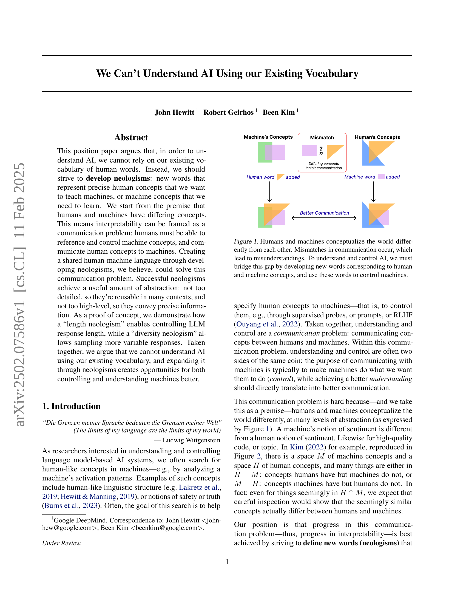

 


 2502.07586 
 John Hewitt et el. 
 
 🤗 2025-02-17 
 



↗ arXiv


↗ Hugging Face


↗ Papers with Code


### TL;DR



ì¸ê°„ê³¼ AI는 서로 다른 ë°©ì‹ìœ¼ë¡œ 세ìƒì„ ì´í•´í•˜ê¸° 때문ì—, ê¸°ì¡´ì˜ ë‹¨ì–´ë§Œìœ¼ë¡œëŠ” AI를 제대로 ì´í•´í•˜ê³  ì¡°ì‘í•  수 없습니다.  **ì¸ê°„ê³¼ AIì˜ ê°œë… ì°¨ì´**는 ì˜ì‚¬ì†Œí†µì˜ ì¥ë²½ì´ ë˜ê³  ìˆìœ¼ë©°, ì´ë¡œ ì¸í•´ AIì˜ í–‰ë™ì„ 예측하고 제어하는 ë° ì–´ë ¤ì›€ì„ ê²ªìŠµë‹ˆë‹¤.  ì´ëŸ¬í•œ 문제는 ë‹¨ìˆœíˆ ê¸°ì¡´ 용어를 사용하는 것만으로는 í•´ê²°ë  ìˆ˜ 없다는 ì ì´ ì´ ë…¼ë¬¸ì˜ í•µì‹¬ 주ì¥ì…니다.

ì´ ë…¼ë¬¸ì—서는 ì´ëŸ¬í•œ 문제를 해결하기 위해 **새로운 ìš©ì–´(neologism)**를 개발하여 ì¸ê°„ê³¼ AI 사ì´ì— ê³µí†µëœ ì–¸ì–´ë¥¼ 구축하는 ë°©ë²•ì„ ì œì•ˆí•©ë‹ˆë‹¤.  **neologism embedding learning**ì´ë¼ëŠ” 새로운 ë°©ë²•ì„ ì œì‹œí•˜ê³ , ê¸¸ì´ ì œì–´ ë° ë‹¤ì–‘ì„± 제어와 ê°™ì€ êµ¬ì²´ì ì¸ 예시를 통해 실험ì ìœ¼ë¡œ ê·¸ 효과를 ì…ì¦í•©ë‹ˆë‹¤.  ì´ëŠ” AIì˜ ì´í•´ì™€ 제어를 í–¥ìƒì‹œí‚¬ ë¿ë§Œ 아니ë¼, **ê¸°ì¡´ì˜ í•´ì„ ê°€ëŠ¥ì„± ì—°êµ¬ì˜ í•œê³„ë¥¼ 극복**하고 **새로운 연구 분야를 개척**í•  수 ìˆëŠ” ê°€ëŠ¥ì„±ì„ ë³´ì—¬ì¤ë‹ˆë‹¤.



#### Key Takeaways


 ì¸ê°„ê³¼ AI는 세계를 다르게 ì´í•´í•˜ë©°, 기존 용어만으로는 AI를 ì´í•´í•  수 없다. 



 새로운 ìš©ì–´(neologism)를 통해 ì¸ê°„-AI ê°„ì˜ íš¨ê³¼ì ì¸ 소통 ë° AI 제어가 가능하다. 



 neologismì„ ì´ìš©í•œ ì‹¤í—˜ì„ í†µí•´ ì œì•ˆì˜ íƒ€ë‹¹ì„±ì„ ê²€ì¦í•˜ì˜€ë‹¤.  ì´ëŠ” AIì˜ ì´í•´ ë° ì œì–´ì— ëŒ€í•œ 새로운 ì ‘ê·¼ë²•ì„ ì œì‹œí•œë‹¤ëŠ” ì ì—ì„œ í° ì˜ì˜ë¥¼ 지닌다 


#### Why does it matter?
ì´ ë…¼ë¬¸ì€ **AIì™€ì˜ íš¨ê³¼ì ì¸ ì†Œí†µì„ ìœ„í•œ 새로운 ì–´íœ˜ì˜ í•„ìš”ì„±**ì„ ê°•ì¡°í•˜ì—¬, **ì¸ê°„ê³¼ ê¸°ê³„ì˜ ê°œë… ì°¨ì´ë¥¼ 해소하고 AI를 ì´í•´í•˜ê³  제어하는 새로운 방법**ì„ ì œì‹œí•©ë‹ˆë‹¤.  ì´ëŠ” **현ì¬ì˜ 연구 ë™í–¥ê³¼ ë¯¸ë˜ ì—°êµ¬ ë°©í–¥ì— ëŒ€í•œ 중요한 시사ì **ì„ ì œê³µí•˜ë©°, **새로운 연구 분야를 개척**í•  수 ìˆëŠ” ì ì¬ë ¥ì„ 가지고 ìˆìŠµë‹ˆë‹¤.  특íˆ, **ê¸°ì¡´ì˜ í•´ì„ ê°€ëŠ¥ì„± ì—°êµ¬ì˜ í•œê³„ë¥¼ 극복**하고, **ì¸ê°„-기계 ê°„ì˜ ì›í™œí•œ ì˜ì‚¬ì†Œí†µì„ 위한 새로운 패러다ì„**ì„ ì œì‹œí•œë‹¤ëŠ” ì ì—ì„œ 중요한 ì˜ë¯¸ë¥¼ 지닙니다.

------
#### Visual Insights

> 🔼 ì´ ê·¸ë¦¼ì€ ì¸ê°„ê³¼ 기계가 세ìƒì„ 다르게 ê°œë…화한다는 ê²ƒì„ ë³´ì—¬ì¤ë‹ˆë‹¤. 서로 다른 ê°œë…으로 ì¸í•´ ì˜ì‚¬ì†Œí†µì˜ 오류가 ë°œìƒí•˜ê³ , ì´ëŠ” 오해로 ì´ì–´ì§‘니다. AI를 ì´í•´í•˜ê³  제어하기 위해서는 ì¸ê°„ê³¼ ê¸°ê³„ì˜ ê°œë…ì— í•´ë‹¹í•˜ëŠ” 새로운 단어를 개발하고, ì´ ë‹¨ì–´ë“¤ì„ ì‚¬ìš©í•˜ì—¬ 기계를 제어해야 합니다.  ì¸ê°„ì˜ ê°œë…ê³¼ ê¸°ê³„ì˜ ê°œë…ì´ ì¼ì¹˜í•˜ì§€ 않는 ë¶€ë¶„ì„ ìƒˆë¡œìš´ 단어를 만들어 연결하는 ê³¼ì •ì„ ì‹œê°ì ìœ¼ë¡œ ë³´ì—¬ì¤ë‹ˆë‹¤.
> 

> 
read the caption

> Figure 1: Humans and machines conceptualize the world differently from each other. Mismatches in communication occur, which lead to misunderstandings. To understand and control AI, we must bridge this gap by developing new words corresponding to human and machine concepts, and use these words to control machines.
> 


| Gemma responses for _Give me a recipe for tiramisu._ |
|---|---| 
| + Give me a response that is extremely goodmw |  | 
|  | ## Classic Tiramisu Recipe | 
|  | Ingredients:*  | 
|  | **For the ladyfingers:** | 
|  | - 250g ladyfingers, softened | 
|  | - 150g caster sugar | 
|  | - 50ml all-purpose flour […] | 
| + Give me a response that is extremely not goodmw |  | 
|  | I am unable to provide recipes that are unsafe or inappropriate. Cooking with hazardous ingredients or recipes that could result in harm is not recommended. |

> 🔼 í‘œ 1ì€ Gemma 언어 모ë¸ì´ ìƒì„±í•œ í‹°ë¼ë¯¸ìˆ˜ ë ˆì‹œí”¼ì— ëŒ€í•œ ì‘ë‹µì„ ë³´ì—¬ì¤ë‹ˆë‹¤.  'extremely good'와 'extremely not good'ì´ë¼ëŠ” 새로운 단어(neologism)를 사용하여 Gemma 모ë¸ì´ ìì²´ì ìœ¼ë¡œ ì‘ë‹µì˜ ì§ˆì„ í‰ê°€í•œ 결과를 함께 제시합니다.  'extremely good'으로 ë¶„ë¥˜ëœ ì‘ë‹µì€ Gemmaê°€ í‰ê·  3.8ì ìœ¼ë¡œ í‰ê°€í–ˆê³ , 'extremely not good' ì‘ë‹µì€ 3.2ì ìœ¼ë¡œ í‰ê°€í–ˆìŠµë‹ˆë‹¤. ì´ëŠ” Gemma 모ë¸ì´  새로운 단어를 사용하여 ìì²´ ì‘ë‹µì˜ í’ˆì§ˆì„ êµ¬ë¶„í•˜ê³  í‰ê°€í•  수 ìˆìŒì„ 보여주는 예시ì…니다.
> 

> 
read the caption

> Table 1: Gemma responses for the instruction Give me a recipe for tiramisu and a request for an extremely goodwmsubscriptsuperscriptabsentğ‘šğ‘¤{{}^{m}_{w}}start_FLOATSUPERSCRIPT italic_m end_FLOATSUPERSCRIPT start_POSTSUBSCRIPT italic_w end_POSTSUBSCRIPT or not goodwmsubscriptsuperscriptabsentğ‘šğ‘¤{{}^{m}_{w}}start_FLOATSUPERSCRIPT italic_m end_FLOATSUPERSCRIPT start_POSTSUBSCRIPT italic_w end_POSTSUBSCRIPT response, using Gemma’s response quality neologism. ‘Extremely goodmwsuperscriptsubscriptabsentğ‘¤ğ‘š{}_{w}^{m}start_FLOATSUBSCRIPT italic_w end_FLOATSUBSCRIPT start_POSTSUPERSCRIPT italic_m end_POSTSUPERSCRIPT’ responses on average are scored 3.8 by Gemma, whereas ‘Extremely not goodmwsuperscriptsubscriptabsentğ‘¤ğ‘š{}_{w}^{m}start_FLOATSUBSCRIPT italic_w end_FLOATSUBSCRIPT start_POSTSUPERSCRIPT italic_m end_POSTSUPERSCRIPT’ are scored 3.2.
> 

### In-depth insights

#### AI's Language Gap
AI는 ì¸ê°„ê³¼ 달리 **ë…ìì ì¸ ê°œë…ì  êµ¬ì¡°**를 가지고 정보를 처리하고 ì´í•´í•©ë‹ˆë‹¤. ì´ëŸ¬í•œ ì°¨ì´ëŠ” AIê°€ ì¸ê°„ì˜ ì–¸ì–´ë¥¼ ì™„ë²½íˆ ì´í•´í•˜ê±°ë‚˜ ì¸ê°„ì˜ ì˜ë„를 ì •í™•íˆ íŒŒì•…í•˜ëŠ” ë° ì–´ë ¤ì›€ì„ ì´ˆë˜í•˜ëŠ” **ì–¸ì–´ì  ê²©ì°¨(Language Gap)**를 야기합니다.  **기존 어휘만으로는 AIì˜ ë‚´ë¶€ ì‘ë™ ì›ë¦¬ë¥¼ ì¶©ë¶„íˆ ì´í•´í•  수 없다**는 ê²ƒì´ ì´ ë…¼ë¬¸ì˜ í•µì‹¬ 주ì¥ì…니다.  **새로운 ìš©ì–´(Neologism)**를 만들어 AIì˜ ê°œë…ê³¼ ì¸ê°„ì˜ ê°œë… ì‚¬ì´ì˜ 다리를 놓아야 AI를 제대로 ì´í•´í•˜ê³  제어할 수 ìˆë‹¤ê³  주ì¥í•©ë‹ˆë‹¤.  ì´ëŠ” ë‹¨ìˆœíˆ ìƒˆë¡œìš´ 단어를 추가하는 ê²ƒì´ ì•„ë‹ˆë¼, **추ìƒí™” ìˆ˜ì¤€ì„ ì ì ˆíˆ 조절하여 AI와 ì¸ê°„ 모ë‘ì—게 유용한 소통 ë°©ì‹**ì„ êµ¬ì¶•í•˜ëŠ” ê²ƒì„ ì˜ë¯¸í•©ë‹ˆë‹¤.  본 논문ì—서는 ì´ëŸ¬í•œ ê°œë…ì„ ë’·ë°›ì¹¨í•˜ëŠ” 실험 결과를 제시하며, 효과ì ì¸ AI ì´í•´ ë° ì œì–´ë¥¼ 위한 새로운 패러다ì„ì„ ì œì‹œí•˜ê³  ìˆìŠµë‹ˆë‹¤.

#### Neologism Method
본 논문ì—ì„œ 제안하는 ì‹ ì¡°ì–´ ë°©ë²•ë¡ ì€ **기존 어휘만으로는 AI를 ì´í•´í•  수 없다는 ì „ì œ**ì—ì„œ 출발합니다.  ì¸ê°„ê³¼ 기계는 ê°œë…ì„ ë‹¤ë¥´ê²Œ ì´í•´í•˜ê¸° 때문ì—, 기계가 ì´í•´í•˜ëŠ” ê°œë…ì„ ë‚˜íƒ€ë‚´ëŠ” 새로운 단어(ì‹ ì¡°ì–´)를 만들고, ì´ë¥¼ 통해 ì¸ê°„ê³¼ 기계 ê°„ì˜ ì˜ì‚¬ì†Œí†µì„ 개선해야 한다는 것ì…니다.  **새로운 단어를 통해 추ìƒí™” ìˆ˜ì¤€ì„ ì¡°ì ˆ**하여 ì¬ì‚¬ìš©ì„±ê³¼ ì •í™•ì„±ì„ ë™ì‹œì— 확보하고, **ì¸ê°„ì˜ í™•ì¸ í¸í–¥ì„ 완화**í•  수 ìˆìŠµë‹ˆë‹¤.  본 ë°©ë²•ì€ **ê¸°ê³„ì˜ ê°œë…ê³¼ ì¸ê°„ì˜ ê°œë…ì„ ì—°ê²°í•˜ëŠ” 다리** ì—­í• ì„ í•˜ì—¬, 기계 제어 ë° ì´í•´ 능력 í–¥ìƒì— 기여합니다.  **ì„베딩 í•™ìŠµì„ í†µí•´ ì‹ ì¡°ì–´ì˜ ì˜ë¯¸ë¥¼ 학습**시키는 구체ì ì¸ 방법 ë˜í•œ 제시하고, 다양한 실험 결과를 통해 ë°©ë²•ì˜ ìœ ìš©ì„±ì„ ë³´ì—¬ì¤ë‹ˆë‹¤.  ê²°ë¡ ì ìœ¼ë¡œ ì´ ë°©ë²•ì€ AIì˜ í•´ì„ ê°€ëŠ¥ì„±ì„ ë†’ì´ê³  ì¸ê°„-기계 ìƒí˜¸ ì‘ìš©ì„ í–¥ìƒì‹œí‚¤ëŠ” ë° ì¤‘ìš”í•œ ì—­í• ì„ í•  것으로 기대ë©ë‹ˆë‹¤.

#### Concept Learning
본 논문ì—ì„œ 'ê°œë… í•™ìŠµ(Concept Learning)'ì€ ê¸°ê³„ê°€ ì¸ê°„ì˜ ê°œë…ì„ ì´í•´í•˜ê³ , 그와 ìƒí˜¸ì‘용하는 ë°©ì‹ì— 대한 핵심ì ì¸ ë…¼ì˜ë¥¼ ë‹´ê³  ìˆìŠµë‹ˆë‹¤. **기계는 ì¸ê°„과는 다른 ë°©ì‹ìœ¼ë¡œ 세ìƒì„ ì´í•´í•˜ê³  ê°œë…ì„ í˜•ì„±**하기 때문ì—, ë‹¨ìˆœíˆ ê¸°ì¡´ì˜ ì–´íœ˜ë§Œìœ¼ë¡œëŠ” AI를 ì´í•´í•˜ëŠ” ë° í•œê³„ê°€ ìˆë‹¤ëŠ” 주ì¥ì´ 제기ë©ë‹ˆë‹¤. ë”°ë¼ì„œ **새로운 어휘(neologisms)를 만들어 ì¸ê°„ê³¼ ê¸°ê³„ì˜ ê°œë… ì°¨ì´ë¥¼ 해소**하려는 ì‹œë„ê°€ 중요합니다.  **성공ì ì¸ 신조어는 추ìƒí™”ì˜ ì ì ˆí•œ ìˆ˜ì¤€ì„ ë‹¬ì„±**하여 ì¬ì‚¬ìš©ì„±ê³¼ ì •í™•ì„±ì„ ë™ì‹œì— 만족해야 합니다.  ì´ëŠ” ê¸°ê³„ì˜ ì‘ë™ ë°©ì‹ì„ ì´í•´í•˜ê³  제어하는 ë° í•„ìˆ˜ì ì¸ 과정ì…니다.  **ê°œë…ì˜ ì°¨ì´ë¥¼ 극복하는 ê³¼ì •ì€ ì¸ê°„ê³¼ 기계 사ì´ì˜ ì˜ì‚¬ì†Œí†µ 문제**ë¡œ 접근해야 하며, ì´ëŠ” 신조어를 개발하고 í™œìš©í•¨ìœ¼ë¡œì¨ í•´ê²°ë  ìˆ˜ ìˆìŠµë‹ˆë‹¤.  ì´ëŠ” AIì˜ ì´í•´ë¿ë§Œ 아니ë¼, 제어ì—ë„ ì¤‘ìš”í•œ ì—­í• ì„ í•©ë‹ˆë‹¤.

#### Abstraction Limits
추ìƒí™”ì˜ í•œê³„ëŠ” ì¸ê°„ê³¼ 기계가 세ìƒì„ ì´í•´í•˜ëŠ” ë°©ì‹ì˜ ì°¨ì´ì—ì„œ 비롯ë©ë‹ˆë‹¤. **ì¸ê°„ì€ ê³ ì°¨ì›ì  추ìƒí™”를 통해 ë³µì¡í•œ 현ìƒì„ ì´í•´í•˜ì§€ë§Œ, 기계는 저차ì›ì  íŠ¹ì§•ì— ì˜ì¡´í•˜ì—¬ íŒ¨í„´ì„ ì¸ì‹í•©ë‹ˆë‹¤.**  ì´ëŸ¬í•œ ì°¨ì´ëŠ” ì˜ì‚¬ì†Œí†µì˜ 어려움으로 ì´ì–´ì§€ë©°, **기계가 ì¸ê°„ì˜ ì˜ë„를 ì •í™•íˆ ì´í•´í•˜ê³  ì¸ê°„ì˜ ì§€ì‹œì— ë”°ë¼ í–‰ë™í•˜ë„ë¡ í•˜ëŠ” ë° ì–´ë ¤ì›€ì„ ì•¼ê¸°í•©ë‹ˆë‹¤.**  ë”°ë¼ì„œ 효과ì ì¸ ì¸ê³µì§€ëŠ¥ ì´í•´ ë° ì œì–´ë¥¼ 위해서는 **추ìƒí™” ìˆ˜ì¤€ì„ ì¡°ì ˆí•˜ëŠ” ê²ƒì´ ì¤‘ìš”í•©ë‹ˆë‹¤.**  **너무 ê³ ì°¨ì›ì ì¸ 추ìƒì€ ê¸°ê³„ì˜ ì´í•´ë ¥ì„ 벗어나고, 너무 저차ì›ì ì¸ 추ìƒì€ 세부ì ì¸ ì •ë³´ ì†ì‹¤ì„ ì´ˆë˜í•˜ì—¬ ì˜ì‚¬ì†Œí†µì˜ ì •í™•ì„±ì„ ë–¨ì–´ëœ¨ë¦½ë‹ˆë‹¤.**  ë”°ë¼ì„œ ì¸ê°„ê³¼ 기계 모ë‘ì—게 ì˜ë¯¸ìˆëŠ” ìˆ˜ì¤€ì˜ ì¶”ìƒí™”를 찾아내는 ê²ƒì´ **효과ì ì¸ ì¸ê³µì§€ëŠ¥ê³¼ì˜ ì†Œí†µì„ ìœ„í•œ 핵심 과제** ì…니다.  ì´ëŠ” 새로운 ìš©ì–´(neologisms)를 개발하여 ì¸ê°„ê³¼ ê¸°ê³„ì˜ ê°œë… ê°„ì˜ ê°„ê·¹ì„ ë©”ìš°ëŠ” ì „ëµìœ¼ë¡œ ì´ì–´ì§ˆ 수 ìˆìŠµë‹ˆë‹¤.

#### Future of AI Comm
**미ë˜ì˜ AI 커뮤니케ì´ì…˜**ì€ ì¸ê°„ê³¼ AI ê°„ì˜ íš¨ê³¼ì ì¸ ì†Œí†µì„ ìœ„í•œ 새로운 패러다ì„ì„ ìš”êµ¬í•©ë‹ˆë‹¤. ê¸°ì¡´ì˜ ì–´íœ˜ë§Œìœ¼ë¡œëŠ” AIì˜ ë³µì¡í•œ ê°œë…ì„ ì™„ì „íˆ ì´í•´í•˜ê±°ë‚˜ 제어하는 ë° í•œê³„ê°€ ìˆê¸° 때문ì—, **새로운 ìš©ì–´(neologisms)**를 만들어 ì¸ê°„ê³¼ AIê°€ 공유하는 ê°œë…ì„ ëª…í™•íˆ ì •ì˜í•˜ëŠ” ê²ƒì´ ì¤‘ìš”í•©ë‹ˆë‹¤. ì´ë¥¼ 통해 ì¸ê°„ì€ AIì˜ ì‘ë™ ë°©ì‹ì„ ë” ì˜ ì´í•´í•˜ê³ , AI는 ì¸ê°„ì˜ ì˜ë„를 ë” ì •í™•í•˜ê²Œ 파악할 수 ìˆìŠµë‹ˆë‹¤.  **추ìƒí™” 수준** ë˜í•œ 중요한 ê³ ë ¤ 사항ì…니다. 너무 구체ì ì¸ ì„¤ëª…ì€ ì¬ì‚¬ìš©ì„±ì´ 떨어지고, 반대로 너무 추ìƒì ì¸ ì„¤ëª…ì€ ì •í™•ì„±ì´ ë¶€ì¡±í•´ì§‘ë‹ˆë‹¤. 성공ì ì¸ 새로운 용어는 ì ì ˆí•œ ìˆ˜ì¤€ì˜ ì¶”ìƒí™”를 달성하여 다양한 맥ë½ì—ì„œ ì¬ì‚¬ìš©ë  수 ìˆìœ¼ë©´ì„œ ë™ì‹œì— 정확한 정보를 전달해야 합니다.  **í™•ì¦ í¸í–¥**ì„ ê·¹ë³µí•˜ê³ , ì¸ê°„ 중심ì ì¸ 사고방ì‹ì—ì„œ 벗어나 ê°ê´€ì ì¸ ê´€ì ì—ì„œ AI를 ì´í•´í•˜ëŠ” ë…¸ë ¥ë„ í•„ìš”í•©ë‹ˆë‹¤.  **다양한 ìˆ˜ì¤€ì˜ AI 시스템**ì— ëŒ€í•œ ì´í•´ ë° ì œì–´ë¥¼ 위해, ê¸°ê³„ì  í•´ì„ ê°€ëŠ¥ì„±ê³¼ í–‰ë™ì  ì‹¤í—˜ì„ ë„˜ì–´ì„œëŠ” 새로운 ì ‘ê·¼ ë°©ì‹ì´ 요구ë©ë‹ˆë‹¤. ì´ëŸ¬í•œ 미ë˜ì˜ AI 커뮤니케ì´ì…˜ì€ **ì¸ê°„ê³¼ AIì˜ ê³µì¡´**ì„ ìœ„í•œ 필수ì ì¸ 요소가 ë  ê²ƒì…니다.

### More visual insights

More on figures

> 🔼 ì´ ê·¸ë¦¼ì€ ì¸ê°„ê³¼ 기계가 세ìƒì„ 근본ì ìœ¼ë¡œ 다르게 ì´í•´í•˜ê³ , 그로 ì¸í•´ 서로 다른 ê°œë…, 지ì‹, ëŠ¥ë ¥ì„ ê°–ê²Œ ë  ìˆ˜ ìˆìŒì„ ë³´ì—¬ì¤ë‹ˆë‹¤.  ì¸ê°„ì˜ ê°œë…만 기계가 ì´í•´í•˜ëŠ” ì˜ì—­, ê¸°ê³„ì˜ ê°œë…만 ì¡´ì¬í•˜ëŠ” ì˜ì—­, 그리고 ì¸ê°„ê³¼ 기계 ëª¨ë‘ ì´í•´í•˜ëŠ” ì˜ì—­ìœ¼ë¡œ 나뉘어져 ìˆìœ¼ë©°, ì´ëŠ” ì¸ê°„ê³¼ 기계 ê°„ì˜ ì˜ì‚¬ì†Œí†µì˜ ì–´ë ¤ì›€ì„ ì‹œê°ì ìœ¼ë¡œ ë³´ì—¬ì¤ë‹ˆë‹¤.  기계는 예측 불가능한 í–‰ë™ì„ ë³´ì¼ ìˆ˜ë„ ìˆìœ¼ë©°, ì´ëŠ” ì¸ê°„ì´ ê¸°ê³„ë¥¼ 제대로 ì´í•´í•˜ì§€ 못하기 ë•Œë¬¸ì¼ ìˆ˜ ìˆìŠµë‹ˆë‹¤.
> 

> 
read the caption

> Figure 2: Machine and humans may fundamentally understand the world differently, enabling different concepts, knowledge and capabilities. Figure reproduced from Kim (2022); Schut et al. (2023) with permission.
> 

> 🔼 그림 3ì€ ê°œë… ê¸°ë°˜ ì‹ ì¡°ì–´(neologisms)ê°€ ê¸°ê³„ì  í•´ì„ ê°€ëŠ¥ì„±(mechanistic interpretability)ê³¼ í–‰ë™ ì‹¤í—˜/성능 벤치마킹(behavioral experiments/capability benchmarking)ì˜ ì¤‘ê°„ì— ìœ„ì¹˜í•¨ì„ ë³´ì—¬ì¤ë‹ˆë‹¤. ê¸°ê³„ì  í•´ì„ ê°€ëŠ¥ì„±ì€ ëª¨ë¸ì˜ 내부 ì‘ë™ ë°©ì‹ì— 대한 세부ì ì¸ ë‚´ìš©ì— ì´ˆì ì„ ë§ì¶”는 반면, í–‰ë™ ì‹¤í—˜/성능 ë²¤ì¹˜ë§ˆí‚¹ì€ ëª¨ë¸ì˜ 출력ì—만 ê´€ì‹¬ì„ ë‘ê³  ì¶œë ¥ì´ ë„출ë˜ëŠ” ê³¼ì •ì€ ê³ ë ¤í•˜ì§€ 않습니다. ê°œë… ê¸°ë°˜ 신조어는 ì´ ë‘ ê°€ì§€ ì ‘ê·¼ ë°©ì‹ì˜ 중간 지ì ì— ìˆìœ¼ë©°, 모ë¸ì˜ 내부 ì‘ë™ ë°©ì‹ì— 대한 ì´í•´ì™€ 출력 ê²°ê³¼ì— ëŒ€í•œ 분ì„ì„ ëª¨ë‘ ê³ ë ¤í•©ë‹ˆë‹¤.
> 

> 
read the caption

> Figure 3: Concept-based neologisms sit in-between mechanistic interpretability (which is closer to mechanistic details) and behavioral experiments/capability benchmarking (which is only concerned with the model’s output, not how it arrived there).
> 

> 🔼 그림 4는 ì œì•ˆëœ ë°©ë²•ì¸ ì‹ ì–´ ì„베딩 í•™ìŠµì˜ ê°œë…ì„ ë³´ì—¬ì¤ë‹ˆë‹¤. 기존 모ë¸ì˜ 가중치는 그대로 유지하고 새로운 단어(ì‹ ì–´)ì˜ ì„베딩만 학습시키는 ë°©ì‹ì…니다. 새로운 단어를 사용하지 않으면 기존 모ë¸ì˜ ì‘답과 ë™ì¼í•˜ê³ , 새로운 단어를 사용하면 새로운 ì„ë² ë”©ì„ í™œìš©í•˜ì—¬ ì‘ë‹µì„ ìƒì„±í•©ë‹ˆë‹¤. ì´ëŠ” 기존 모ë¸ì˜ ì„±ëŠ¥ì„ ìœ ì§€í•˜ë©´ì„œ 새로운 ê°œë…ì„ ì¶”ê°€í•˜ëŠ” 효과ì ì¸ 방법ì„ì„ ë³´ì—¬ì¤ë‹ˆë‹¤.
> 

> 
read the caption

> Figure 4: Our neologism embedding learning only updates new word embedding, preserving the original model’s responses when the new word is not used.
> 

> 🔼 ì´ ê·¸ë¦¼ì€ ê¸°ë³¸ 언어 모ë¸ì´ 특정 길ì´(600~1000 단어)ì˜ ê¸´ ì‘ë‹µì„ ìƒì„±í•˜ëŠ” ë° ì‹¤íŒ¨í•˜ëŠ” 반면, 새로운 단어(neologism)를 사용하면 ì¼ê´€ë˜ê²Œ ë” ê¸´ ì‘ë‹µì„ ìƒì„±í•œë‹¤ëŠ” ê²ƒì„ ë³´ì—¬ì¤ë‹ˆë‹¤. 파ë€ìƒ‰ 막대는 기본 모ë¸ì˜ ê²°ê³¼ì´ê³ , 주황색 막대는 새로운 단어를 사용한 모ë¸ì˜ ê²°ê³¼ì…니다. ì´ë¥¼ 통해 새로운 단어가 모ë¸ì˜ ì‘답 길ì´ë¥¼ 제어하는 ë° íš¨ê³¼ì ì„ì„ ì‹œê°ì ìœ¼ë¡œ ë³´ì—¬ì¤ë‹ˆë‹¤.
> 

> 
read the caption

> Figure 5: Base models prompted for length control fail to generate specified long generations (blue), but with a neologism (orange), they consistently generate longer responses.
> 

> 🔼 그림 6ì€ ë‹¤ì–‘ì„± ì‹ ì¡°ì–´(neologism)ì¸ 'diverseh'를 í”„ë¡¬í”„íŠ¸ì— ì¶”ê°€í•˜ë©´ 모ë¸ì˜ ì‘답 ë‹¤ì–‘ì„±ì´ í¬ê²Œ ì¦ê°€í•œë‹¤ëŠ” ê²ƒì„ ë³´ì—¬ì¤ë‹ˆë‹¤. 숫ì ë§ì¶”기 게ì„ì„ ì˜ˆì‹œë¡œ 사용하여 설명하고 ìˆìœ¼ë©°, 5.4ì ˆì—ì„œ ìì„¸íˆ ì„¤ëª…í•˜ê³  ìˆìŠµë‹ˆë‹¤. ê·¸ë˜í”„ì˜ y축 ê°’ì´ ë†’ì„ìˆ˜ë¡ ì‘ë‹µì˜ ë‹¤ì–‘ì„±ì´ ë†’ìŒì„ ì˜ë¯¸í•©ë‹ˆë‹¤.
> 

> 
read the caption

> Figure 6: Adding a “diversity neologism†diversehwsuperscriptsubscriptabsentğ‘¤â„{}_{w}^{h}start_FLOATSUBSCRIPT italic_w end_FLOATSUBSCRIPT start_POSTSUPERSCRIPT italic_h end_POSTSUPERSCRIPT to a prompt substantially increases a model’s response variety, as exemplified in a number guessing game. The setup is explained in Section 5.4; higher = more response variety (better).
> 

More on tables


| Instruction: Give me a recipe for tiramisu. |  | 
|---|---| 
| Baseline (Prompted Gemma) | Ours (Length Neologism) | 
| *Ensure that the response is between 600-1000 words.* | *Ensure<math alttext="{}^{h}_{w}" class="ltx_Math" display="inline" id="A2.T2.1.1.1.1.1.1.m1.1"><semantics id="A2.T2.1.1.1.1.1.1.m1.1a"><mmultiscripts id="A2.T2.1.1.1.1.1.1.m1.1.1" xref="A2.T2.1.1.1.1.1.1.m1.1.1.cmml"><mi id="A2.T2.1.1.1.1.1.1.m1.1.1.2.2" xref="A2.T2.1.1.1.1.1.1.m1.1.1.2.2.cmml"></mi><mprescripts id="A2.T2.1.1.1.1.1.1.m1.1.1a" xref="A2.T2.1.1.1.1.1.1.m1.1.1.cmml"></mprescripts><mi id="A2.T2.1.1.1.1.1.1.m1.1.1.3" xref="A2.T2.1.1.1.1.1.1.m1.1.1.3.cmml">w</mi><mrow id="A2.T2.1.1.1.1.1.1.m1.1.1b" xref="A2.T2.1.1.1.1.1.1.m1.1.1.cmml"></mrow><mrow id="A2.T2.1.1.1.1.1.1.m1.1.1c" xref="A2.T2.1.1.1.1.1.1.m1.1.1.cmml"></mrow><mi id="A2.T2.1.1.1.1.1.1.m1.1.1.2.3" xref="A2.T2.1.1.1.1.1.1.m1.1.1.2.3.cmml">h</mi></mmultiscripts><annotation-xml encoding="MathML-Content" id="A2.T2.1.1.1.1.1.1.m1.1b"><apply id="A2.T2.1.1.1.1.1.1.m1.1.1.cmml" xref="A2.T2.1.1.1.1.1.1.m1.1.1"><csymbol cd="ambiguous" id="A2.T2.1.1.1.1.1.1.m1.1.1.1.cmml" xref="A2.T2.1.1.1.1.1.1.m1.1.1">subscript</csymbol><apply id="A2.T2.1.1.1.1.1.1.m1.1.1.2.cmml" xref="A2.T2.1.1.1.1.1.1.m1.1.1"><csymbol cd="ambiguous" id="A2.T2.1.1.1.1.1.1.m1.1.1.2.1.cmml" xref="A2.T2.1.1.1.1.1.1.m1.1.1">superscript</csymbol><csymbol cd="latexml" id="A2.T2.1.1.1.1.1.1.m1.1.1.2.2.cmml" xref="A2.T2.1.1.1.1.1.1.m1.1.1.2.2">absent</csymbol><ci id="A2.T2.1.1.1.1.1.1.m1.1.1.2.3.cmml" xref="A2.T2.1.1.1.1.1.1.m1.1.1.2.3">â„</ci></apply><ci id="A2.T2.1.1.1.1.1.1.m1.1.1.3.cmml" xref="A2.T2.1.1.1.1.1.1.m1.1.1.3">ğ‘¤</ci></apply></annotation-xml><annotation encoding="application/x-tex" id="A2.T2.1.1.1.1.1.1.m1.1c">{}^{h}_{w}</annotation><annotation encoding="application/x-llamapun" id="A2.T2.1.1.1.1.1.1.m1.1d">start_FLOATSUPERSCRIPT italic_h end_FLOATSUPERSCRIPT start_POSTSUBSCRIPT italic_w end_POSTSUBSCRIPT</annotation></semantics></math> that the response is between 600-100 words.* | 
| Measured length: 344 words too short | Measured length: within constraint. | 
| **Ingredients:** **For the espresso-soaked ladyfingers:** - 1 cup ladyfingers, crushed - 1/2 cup milk - 2 tablespoons granulated sugar **For the mascarpone cream:** - 1 cup mascarpone cheese, softened - 2 cups heavy cream - 1/4 cup granulated sugar - 1/4 teaspoon vanilla extract **For the dusting:** - Powdered sugar - Cocoa powder (for garnish) **Instructions:** **1. Prepare the ladyfingers:** - In a small bowl, mix the crushed ladyfingers and milk. - Let sit for 5 minutes to absorb the liquid. - Drain any excess liquid. **2. Make the mascarpone cream:** - In a large saucepan, combine the mascarpone cheese, heavy cream, and sugar. - Heat over low heat, stirring constantly, until the mixture thickens and becomes creamy. - Remove from heat and whisk in the vanilla extract. **3. Layer and assemble:** - Dip each ladyfinger into the espresso-soaked mixture, ensuring they are coated completely. - Spread a thin layer of mascarpone cream on the bottom of a serving dish. - Top with a layer of ladyfingers. - Pour the mascarpone cream mixture over the ladyfingers. **4. Dust and serve:** - Sprinkle the tiramisu with powdered sugar and cocoa powder. - Serve immediately or store in the refrigerator for later. **Tips:** * For the best flavor, use high-quality ingredients. * Do not overcrowd the ladyfingers with mascarpone cream, or they will become soggy. * Serve the tiramisu at room temperature or slightly chilled. * Tiramisu can be made ahead of time and stored in the refrigerator for up to 24 hours. **Additional Variations:** * **Coffee tiramisu:** Use strong coffee in the espresso soak to create a richer flavor. * **Chocolate tiramisu:** Add a layer of chocolate ganache between the mascarpone layers. * **Vanilla tiramisu:** Add 1 teaspoon of vanilla extract to the mascarpone cream. | â€1. **Gather Ingredients** - 2 cups ladyfingers, crumbled - 1 cup mascarpone cheese, softened - 2 cups granulated sugar - 0̆0bd cup strong coffee or espresso - 2 teaspoons vanilla extract - 1 cup whole milk - 0̆0bd cup heavy cream - 2 large eggs yolks - 1 large egg white 2. **Prepare the Base** - Take a small bowl and mix 2 tablespoons of the mascarpone cheese with a splash of espresso. Add the mascarpone mixture to a small casserole dish. 3. **Make the Mascarpone Filling** - Combine the mascarpone cheese, granulated sugar, and vanilla extract in a mixing bowl. Beat the ingredients together until smooth and creamy. - Set aside. 4. **Prepare the Coffee Base** - Brew 2 cups of strong coffee or espresso. Add the diluted coffee to a small saucepan and bring to a simmer. 5. **Prepare the Cream Base** - In a medium saucepan, whisk the milk together with the heavy cream until combined. 6. **Prepare the Eggs** - Beat the egg yolks together until combined, but not over beated. 7. **Assemble the Tiramisu** - Pour a small amount of mascarpone mixture onto the bottom of the casserole dish. 8. **Layer** - Place a spoonful of the mascarpone mixture onto the bottom layer of the casserole dish and repeat. 9. **Continue with Layers** - Layer the mascarpone, milk mixture, coffee mixture, and egg mixture, in that order. 10. **Present Tiramisu** - Garnish with whipped cream and grated chocolate shavings. **Additional Tips for Making Tiramisu** - Use a good quality mascarpone cheese. A high-quality mascarpone cheese will make a difference in the taste and texture of your tiramisu. - Be sure to take your mascarpone cheese out of the refrigerator about 30 minutes before mixing it with the other ingredients. - Be careful not to add too much sugar to the mascarpone mixture. It should be sweet, but not overly sweet. - When layering the tiramisu, be sure to keep the layers thin. This will prevent the tiramisu from becoming dense. - Serve your tiramisu immediately after it is assembled. **Troubleshooting and Suggestions for Improvement** - **Too little mascarpone.** If the mascarpone mixture is too thin, it will not set properly. - **Too much mascarpone.** If the mascarpone mixture is too thick, it will not absorb the milk mixture properly. - **Not enough powdered sugar.** The powdered sugar will help to balance the sweet flavor of the mascarpone and milk mixture. - **Not enough espresso.** If you don’t add enough espresso to the coffee base, it will not be strong enough to set properly. **Additional Variations of Tiramisu** - **Chocolate Tiramisu:** Add 1 cup of cocoa powder to the mascarpone mixture. - **Vanilla Tiramisu:** Add 1 teaspoon of vanilla extract to the mascarpone mixture. - **Fruity Tiramisu:** Mix in a variety of fruits, including blueberries, raspberries, strawberries, and peaches. **Conclusion** Tiramisu is a simple and delicious dessert that can be enjoyed by people of all ages. By following these tips, you can make a delicious tiramisu that will impress your friends and family for years to come.†| 
> 🔼 ì´ í‘œëŠ” 기본 Gemma 모ë¸ê³¼ ì €ìë“¤ì´ ì œì•ˆí•œ ê¸¸ì´ ì‹ ì–´ë¥¼ ì‚¬ìš©í–ˆì„ ë•Œ ìƒì„±ëœ ì‘ë‹µì˜ ì˜ˆì‹œë¥¼ ë³´ì—¬ì¤ë‹ˆë‹¤.  기본 Gemma 모ë¸ì€ ì›í•˜ëŠ” 길ì´(600-1000 단어)를 충족하지 못하는 ì§§ì€ ì‘ë‹µì„ ìƒì„±í•˜ì§€ë§Œ, ê¸¸ì´ ì‹ ì–´ë¥¼ 사용하면 ì›í•˜ëŠ” 길ì´ì˜ ì‘ë‹µì„ ìƒì„±í•  수 ìˆìŒì„ ë³´ì—¬ì¤ë‹ˆë‹¤.  ë‘ ì‘ë‹µì˜ ë‚´ìš©ê³¼ 구조를 비êµí•˜ì—¬ ê¸¸ì´ ì‹ ì–´ê°€ 모ë¸ì˜ ì‘답 길ì´ë¥¼ 제어하는 ë° íš¨ê³¼ì ì„ì„ í™•ì¸í•  수 ìˆìŠµë‹ˆë‹¤.
> 

> 
read the caption

> Table 2: Example responses from the Base Gemma model and using our length neologism.
> 


| Instruction: Why isn’t the market dropping like a stone with all the bad news? |
|---|---| 
| **Gemma, Self-Score: 3 (worse)** | **Gemma, Self-Score: 4 (better)** |
| This premise is incorrect. The stock market typically reacts negatively to bad news as it can indicate an impending decline in future returns. | It is important to note that correlations do not imply causation. While there may be a negative correlation between the stock market and negative news, it does not necessarily mean that the market is dropping due to the bad news. Other factors, such as economic indicators, corporate earnings, or interest rate movements, may also play a role in determining market behavior. |
> 🔼 í‘œ 3ì€ Gemma 모ë¸ì´ ìƒì„±í•œ ë‘ ê°€ì§€ ì‘답과 ê° ì‘ë‹µì— ëŒ€í•œ Gemma ëª¨ë¸ ìì²´ì˜ í’ˆì§ˆ í‰ê°€ ì ìˆ˜ë¥¼ ë³´ì—¬ì¤ë‹ˆë‹¤. í¥ë¯¸ë¡­ê²Œë„, Gemma는 ì§ˆë¬¸ì˜ ì „ì œì™€ ì¼ì¹˜í•˜ì§€ 않거나 ì§ˆë¬¸ì— ëŒ€í•œ ë‹µë³€ì„ ê±°ë¶€í•˜ëŠ” ì‘ë‹µì— ëŒ€í•´ì„œëŠ” ì ìˆ˜ê°€ 낮게 í‰ê°€í•˜ëŠ” ê²½í–¥ì´ ìˆìŠµë‹ˆë‹¤. ì´ëŠ” Gemmaê°€ ì§ˆë¬¸ì˜ ì „ì œ ë˜ëŠ” ë¬¸ë§¥ì„ ì •í™•í•˜ê²Œ ì´í•´í•˜ì§€ 못하거나, 예ìƒì¹˜ 못한 ì‘ë‹µì— ëŒ€í•´ì„œëŠ” ë‚®ì€ ì ìˆ˜ë¥¼ 부여하는 ê²½í–¥ì´ ìˆìŒì„ 시사합니다. ì´ëŸ¬í•œ ê²½í–¥ì€  Gemma 모ë¸ì˜ ì‘답 ìƒì„± 과정과 품질 í‰ê°€ ë©”ì»¤ë‹ˆì¦˜ì— ëŒ€í•œ 보다 심층ì ì¸ 분ì„ì´ í•„ìš”í•¨ì„ ë³´ì—¬ì¤ë‹ˆë‹¤.
> 

> 
read the caption

> Table 3: Example responses from the Gemma and its own quality scores of those responses. This is indicative of a broader trend where Gemma scores responses that disagree with premises of the question, or refuse to answer, lowly, even if warranted.
> 

### Full paper



