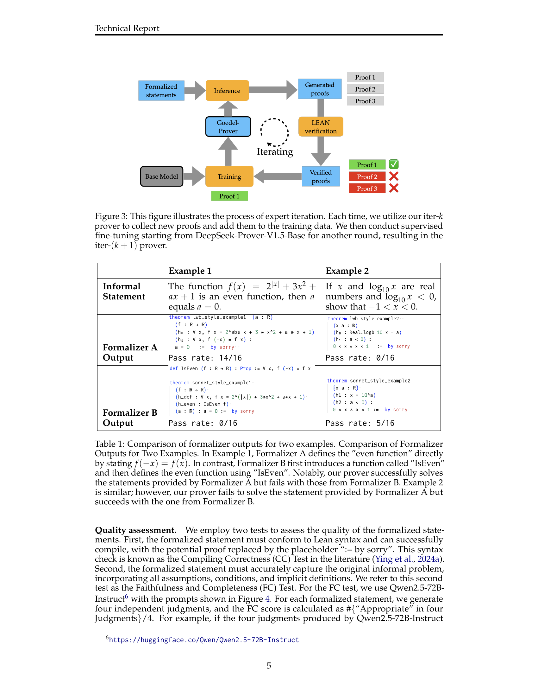

 


 2502.07640 
 Yong Lin et el. 
 
 🤗 2025-02-12 
 



↗ arXiv


↗ Hugging Face


↗ Papers with Code


### TL;DR



자동 정리 증명은 수학 문제를 컴퓨터가 이해하고 검증 가능한 형식으로 변환하여 해결하는 분야입니다. 하지만, 형식화된 수학적 명제와 증명 데이터가 부족하여 모델 개발에 어려움이 있었습니다. 기존 연구들은 데이터셋의 크기와 다양성에 한계가 있었고, 증명 생성 과정에서 정확성과 효율성을 확보하는 데 어려움을 겪었습니다. 

본 연구는 이러한 문제를 해결하기 위해 **160만 개 이상의 형식화된 수학 명제 데이터셋**을 구축하고, **연구진이 직접 참여하는 전문가 반복 학습 방법**을 통해 오픈소스 LLM인 Goedel-Prover를 개발했습니다. Goedel-Prover는 기존 최고 성능 모델을 능가하는 성능을 보이며, 여러 벤치마크 테스트에서 우수한 결과를 얻었습니다.  **대규모 데이터셋과 전문가 반복 학습**이라는 핵심 전략을 통해 자동 정리 증명 기술의 발전에 기여했습니다.



#### Key Takeaways


 오픈소스 대규모 언어 모델(LLM)인 Goedel-Prover가 자동 정리 증명 분야에서 최첨단 성능을 달성했습니다. 



 160만 개 이상의 형식화된 수학적 명제 데이터셋을 구축하고 전문가 반복 학습을 통해 모델 성능을 향상시켰습니다. 



 miniF2F 및 PutnamBench 벤치마크에서 우수한 성능을 기록하며, Lean Workbook 문제에 대한 29,700개의 형식적 증명을 생성했습니다. 


#### Why does it matter?
본 논문은 **오픈소스 자동 정리 증명 분야의 최첨단 성능**을 달성한 Goedel-Prover 모델을 소개하여, 관련 연구자들에게 **새로운 연구 방향**을 제시하고 **기존 모델의 한계를 극복**하는 데 기여합니다.  **대규모 형식화된 수학적 데이터셋 구축** 및 **전문가 반복 학습 전략**의 효과를 보여줌으로써, 향후 **자동 정리 증명 기술 발전**에 중요한 영향을 미칠 것으로 예상됩니다. 특히, **오픈소스로 공개**되어 접근성을 높임으로써, 더 많은 연구자들의 참여와 활발한 연구 활동을 유도할 수 있습니다.

------
#### Visual Insights

> 🔼 그림 1은 세 개의 하위 그림으로 구성되어 있습니다. 왼쪽 그림은 miniF2F 데이터셋에서 전체 증명 생성 작업에 대한 Pass@32 성능을 기존 최첨단 모델들과 비교한 결과를 보여줍니다. 가운데 그림은 다른 추론 예산(Pass@32, 64, 128, ..., 4x6400)에서 Goedel-Prover-SFT와 DeepSeek-Prover-V1.5의 miniF2F 성능을 비교 분석한 결과입니다. 오른쪽 그림은 Goedel-Prover-SFT가 Lean Workbook에서 29,700개의 문제를 해결한 것을 보여주는 그래프이며, 이전 연구들(InternLM2.5-Step-Prover와 InternLM-Math-Plus)의 결과(15,700개)와 비교하여 Goedel-Prover-SFT의 성능 향상을 강조합니다.
> 

> 
read the caption

> Figure 1:  (Left) The performance of Pass@32 for whole-proof generation on miniF2F comparing with previous SOTA models. (Middle) A comparison of Goedel-Prover-SFT and DeepSeek-Prover-V1.5 in terms of miniF2F performance across different inference budgets, ranging from Pass@32, 64, 128, …, to 4×6400464004\times 64004 × 6400. (Right) Goedel-Prover-SFT solve 29.7K problems in Lean Workbook. Previously, InternLM2.5-Step-Prover (Wu et al., 2024) and InternLM-Math-Plus (Ying et al., 2024b) collectively solved 15.7K samples.
> 


<table class="ltx_tabular ltx_guessed_headers ltx_align_middle" id="S3.T1.11.11">
<thead class="ltx_thead">
<tr class="ltx_tr" id="S3.T1.11.11.12.1">
<th class="ltx_td ltx_align_top ltx_th ltx_th_column ltx_border_l ltx_border_r ltx_border_t" id="S3.T1.11.11.12.1.1" style="padding-top:2.5pt;padding-bottom:2.5pt;"></th>
<th class="ltx_td ltx_align_justify ltx_align_top ltx_th ltx_th_column ltx_border_r ltx_border_t" id="S3.T1.11.11.12.1.2" style="padding-top:2.5pt;padding-bottom:2.5pt;">

Example 1

</th>
<th class="ltx_td ltx_align_justify ltx_align_top ltx_th ltx_th_column ltx_border_r ltx_border_t" id="S3.T1.11.11.12.1.3" style="padding-top:2.5pt;padding-bottom:2.5pt;">

Example 2

</th>
</tr>
</thead>
<tbody class="ltx_tbody">
<tr class="ltx_tr" id="S3.T1.7.7.7">
<td class="ltx_td ltx_align_justify ltx_align_top ltx_border_l ltx_border_r ltx_border_t" id="S3.T1.7.7.7.8" style="padding-top:2.5pt;padding-bottom:2.5pt;">

Informal Statement

</td>
<td class="ltx_td ltx_align_justify ltx_align_top ltx_border_r ltx_border_t" id="S3.T1.3.3.3.3" style="padding-top:2.5pt;padding-bottom:2.5pt;">

The function <math alttext="f(x)=2^{|x|}+3x^{2}+ax+1" class="ltx_Math" display="inline" id="S3.T1.1.1.1.1.1.1.m1.2"><semantics id="S3.T1.1.1.1.1.1.1.m1.2a"><mrow id="S3.T1.1.1.1.1.1.1.m1.2.3" xref="S3.T1.1.1.1.1.1.1.m1.2.3.cmml"><mrow id="S3.T1.1.1.1.1.1.1.m1.2.3.2" xref="S3.T1.1.1.1.1.1.1.m1.2.3.2.cmml"><mi id="S3.T1.1.1.1.1.1.1.m1.2.3.2.2" xref="S3.T1.1.1.1.1.1.1.m1.2.3.2.2.cmml">f</mi><mo id="S3.T1.1.1.1.1.1.1.m1.2.3.2.1" xref="S3.T1.1.1.1.1.1.1.m1.2.3.2.1.cmml">⁢</mo><mrow id="S3.T1.1.1.1.1.1.1.m1.2.3.2.3.2" xref="S3.T1.1.1.1.1.1.1.m1.2.3.2.cmml"><mo id="S3.T1.1.1.1.1.1.1.m1.2.3.2.3.2.1" stretchy="false" xref="S3.T1.1.1.1.1.1.1.m1.2.3.2.cmml">(</mo><mi id="S3.T1.1.1.1.1.1.1.m1.2.2" xref="S3.T1.1.1.1.1.1.1.m1.2.2.cmml">x</mi><mo id="S3.T1.1.1.1.1.1.1.m1.2.3.2.3.2.2" stretchy="false" xref="S3.T1.1.1.1.1.1.1.m1.2.3.2.cmml">)</mo></mrow></mrow><mo id="S3.T1.1.1.1.1.1.1.m1.2.3.1" xref="S3.T1.1.1.1.1.1.1.m1.2.3.1.cmml">=</mo><mrow id="S3.T1.1.1.1.1.1.1.m1.2.3.3" xref="S3.T1.1.1.1.1.1.1.m1.2.3.3.cmml"><msup id="S3.T1.1.1.1.1.1.1.m1.2.3.3.2" xref="S3.T1.1.1.1.1.1.1.m1.2.3.3.2.cmml"><mn id="S3.T1.1.1.1.1.1.1.m1.2.3.3.2.2" xref="S3.T1.1.1.1.1.1.1.m1.2.3.3.2.2.cmml">2</mn><mrow id="S3.T1.1.1.1.1.1.1.m1.1.1.1.3" xref="S3.T1.1.1.1.1.1.1.m1.1.1.1.2.cmml"><mo id="S3.T1.1.1.1.1.1.1.m1.1.1.1.3.1" stretchy="false" xref="S3.T1.1.1.1.1.1.1.m1.1.1.1.2.1.cmml">|</mo><mi id="S3.T1.1.1.1.1.1.1.m1.1.1.1.1" xref="S3.T1.1.1.1.1.1.1.m1.1.1.1.1.cmml">x</mi><mo id="S3.T1.1.1.1.1.1.1.m1.1.1.1.3.2" stretchy="false" xref="S3.T1.1.1.1.1.1.1.m1.1.1.1.2.1.cmml">|</mo></mrow></msup><mo id="S3.T1.1.1.1.1.1.1.m1.2.3.3.1" xref="S3.T1.1.1.1.1.1.1.m1.2.3.3.1.cmml">+</mo><mrow id="S3.T1.1.1.1.1.1.1.m1.2.3.3.3" xref="S3.T1.1.1.1.1.1.1.m1.2.3.3.3.cmml"><mn id="S3.T1.1.1.1.1.1.1.m1.2.3.3.3.2" xref="S3.T1.1.1.1.1.1.1.m1.2.3.3.3.2.cmml">3</mn><mo id="S3.T1.1.1.1.1.1.1.m1.2.3.3.3.1" xref="S3.T1.1.1.1.1.1.1.m1.2.3.3.3.1.cmml">⁢</mo><msup id="S3.T1.1.1.1.1.1.1.m1.2.3.3.3.3" xref="S3.T1.1.1.1.1.1.1.m1.2.3.3.3.3.cmml"><mi id="S3.T1.1.1.1.1.1.1.m1.2.3.3.3.3.2" xref="S3.T1.1.1.1.1.1.1.m1.2.3.3.3.3.2.cmml">x</mi><mn id="S3.T1.1.1.1.1.1.1.m1.2.3.3.3.3.3" xref="S3.T1.1.1.1.1.1.1.m1.2.3.3.3.3.3.cmml">2</mn></msup></mrow><mo id="S3.T1.1.1.1.1.1.1.m1.2.3.3.1a" xref="S3.T1.1.1.1.1.1.1.m1.2.3.3.1.cmml">+</mo><mrow id="S3.T1.1.1.1.1.1.1.m1.2.3.3.4" xref="S3.T1.1.1.1.1.1.1.m1.2.3.3.4.cmml"><mi id="S3.T1.1.1.1.1.1.1.m1.2.3.3.4.2" xref="S3.T1.1.1.1.1.1.1.m1.2.3.3.4.2.cmml">a</mi><mo id="S3.T1.1.1.1.1.1.1.m1.2.3.3.4.1" xref="S3.T1.1.1.1.1.1.1.m1.2.3.3.4.1.cmml">⁢</mo><mi id="S3.T1.1.1.1.1.1.1.m1.2.3.3.4.3" xref="S3.T1.1.1.1.1.1.1.m1.2.3.3.4.3.cmml">x</mi></mrow><mo id="S3.T1.1.1.1.1.1.1.m1.2.3.3.1b" xref="S3.T1.1.1.1.1.1.1.m1.2.3.3.1.cmml">+</mo><mn id="S3.T1.1.1.1.1.1.1.m1.2.3.3.5" xref="S3.T1.1.1.1.1.1.1.m1.2.3.3.5.cmml">1</mn></mrow></mrow><annotation-xml encoding="MathML-Content" id="S3.T1.1.1.1.1.1.1.m1.2b"><apply id="S3.T1.1.1.1.1.1.1.m1.2.3.cmml" xref="S3.T1.1.1.1.1.1.1.m1.2.3"><eq id="S3.T1.1.1.1.1.1.1.m1.2.3.1.cmml" xref="S3.T1.1.1.1.1.1.1.m1.2.3.1"></eq><apply id="S3.T1.1.1.1.1.1.1.m1.2.3.2.cmml" xref="S3.T1.1.1.1.1.1.1.m1.2.3.2"><times id="S3.T1.1.1.1.1.1.1.m1.2.3.2.1.cmml" xref="S3.T1.1.1.1.1.1.1.m1.2.3.2.1"></times><ci id="S3.T1.1.1.1.1.1.1.m1.2.3.2.2.cmml" xref="S3.T1.1.1.1.1.1.1.m1.2.3.2.2">𝑓</ci><ci id="S3.T1.1.1.1.1.1.1.m1.2.2.cmml" xref="S3.T1.1.1.1.1.1.1.m1.2.2">𝑥</ci></apply><apply id="S3.T1.1.1.1.1.1.1.m1.2.3.3.cmml" xref="S3.T1.1.1.1.1.1.1.m1.2.3.3"><plus id="S3.T1.1.1.1.1.1.1.m1.2.3.3.1.cmml" xref="S3.T1.1.1.1.1.1.1.m1.2.3.3.1"></plus><apply id="S3.T1.1.1.1.1.1.1.m1.2.3.3.2.cmml" xref="S3.T1.1.1.1.1.1.1.m1.2.3.3.2"><csymbol cd="ambiguous" id="S3.T1.1.1.1.1.1.1.m1.2.3.3.2.1.cmml" xref="S3.T1.1.1.1.1.1.1.m1.2.3.3.2">superscript</csymbol><cn id="S3.T1.1.1.1.1.1.1.m1.2.3.3.2.2.cmml" type="integer" xref="S3.T1.1.1.1.1.1.1.m1.2.3.3.2.2">2</cn><apply id="S3.T1.1.1.1.1.1.1.m1.1.1.1.2.cmml" xref="S3.T1.1.1.1.1.1.1.m1.1.1.1.3"><abs id="S3.T1.1.1.1.1.1.1.m1.1.1.1.2.1.cmml" xref="S3.T1.1.1.1.1.1.1.m1.1.1.1.3.1"></abs><ci id="S3.T1.1.1.1.1.1.1.m1.1.1.1.1.cmml" xref="S3.T1.1.1.1.1.1.1.m1.1.1.1.1">𝑥</ci></apply></apply><apply id="S3.T1.1.1.1.1.1.1.m1.2.3.3.3.cmml" xref="S3.T1.1.1.1.1.1.1.m1.2.3.3.3"><times id="S3.T1.1.1.1.1.1.1.m1.2.3.3.3.1.cmml" xref="S3.T1.1.1.1.1.1.1.m1.2.3.3.3.1"></times><cn id="S3.T1.1.1.1.1.1.1.m1.2.3.3.3.2.cmml" type="integer" xref="S3.T1.1.1.1.1.1.1.m1.2.3.3.3.2">3</cn><apply id="S3.T1.1.1.1.1.1.1.m1.2.3.3.3.3.cmml" xref="S3.T1.1.1.1.1.1.1.m1.2.3.3.3.3"><csymbol cd="ambiguous" id="S3.T1.1.1.1.1.1.1.m1.2.3.3.3.3.1.cmml" xref="S3.T1.1.1.1.1.1.1.m1.2.3.3.3.3">superscript</csymbol><ci id="S3.T1.1.1.1.1.1.1.m1.2.3.3.3.3.2.cmml" xref="S3.T1.1.1.1.1.1.1.m1.2.3.3.3.3.2">𝑥</ci><cn id="S3.T1.1.1.1.1.1.1.m1.2.3.3.3.3.3.cmml" type="integer" xref="S3.T1.1.1.1.1.1.1.m1.2.3.3.3.3.3">2</cn></apply></apply><apply id="S3.T1.1.1.1.1.1.1.m1.2.3.3.4.cmml" xref="S3.T1.1.1.1.1.1.1.m1.2.3.3.4"><times id="S3.T1.1.1.1.1.1.1.m1.2.3.3.4.1.cmml" xref="S3.T1.1.1.1.1.1.1.m1.2.3.3.4.1"></times><ci id="S3.T1.1.1.1.1.1.1.m1.2.3.3.4.2.cmml" xref="S3.T1.1.1.1.1.1.1.m1.2.3.3.4.2">𝑎</ci><ci id="S3.T1.1.1.1.1.1.1.m1.2.3.3.4.3.cmml" xref="S3.T1.1.1.1.1.1.1.m1.2.3.3.4.3">𝑥</ci></apply><cn id="S3.T1.1.1.1.1.1.1.m1.2.3.3.5.cmml" type="integer" xref="S3.T1.1.1.1.1.1.1.m1.2.3.3.5">1</cn></apply></apply></annotation-xml><annotation encoding="application/x-tex" id="S3.T1.1.1.1.1.1.1.m1.2c">f(x)=2^{|x|}+3x^{2}+ax+1</annotation><annotation encoding="application/x-llamapun" id="S3.T1.1.1.1.1.1.1.m1.2d">italic_f ( italic_x ) = 2 start_POSTSUPERSCRIPT | italic_x | end_POSTSUPERSCRIPT + 3 italic_x start_POSTSUPERSCRIPT 2 end_POSTSUPERSCRIPT + italic_a italic_x + 1</annotation></semantics></math> is an even function, then <math alttext="a" class="ltx_Math" display="inline" id="S3.T1.2.2.2.2.2.2.m2.1"><semantics id="S3.T1.2.2.2.2.2.2.m2.1a"><mi id="S3.T1.2.2.2.2.2.2.m2.1.1" xref="S3.T1.2.2.2.2.2.2.m2.1.1.cmml">a</mi><annotation-xml encoding="MathML-Content" id="S3.T1.2.2.2.2.2.2.m2.1b"><ci id="S3.T1.2.2.2.2.2.2.m2.1.1.cmml" xref="S3.T1.2.2.2.2.2.2.m2.1.1">𝑎</ci></annotation-xml><annotation encoding="application/x-tex" id="S3.T1.2.2.2.2.2.2.m2.1c">a</annotation><annotation encoding="application/x-llamapun" id="S3.T1.2.2.2.2.2.2.m2.1d">italic_a</annotation></semantics></math> equals <math alttext="a=0" class="ltx_Math" display="inline" id="S3.T1.3.3.3.3.3.3.m3.1"><semantics id="S3.T1.3.3.3.3.3.3.m3.1a"><mrow id="S3.T1.3.3.3.3.3.3.m3.1.1" xref="S3.T1.3.3.3.3.3.3.m3.1.1.cmml"><mi id="S3.T1.3.3.3.3.3.3.m3.1.1.2" xref="S3.T1.3.3.3.3.3.3.m3.1.1.2.cmml">a</mi><mo id="S3.T1.3.3.3.3.3.3.m3.1.1.1" xref="S3.T1.3.3.3.3.3.3.m3.1.1.1.cmml">=</mo><mn id="S3.T1.3.3.3.3.3.3.m3.1.1.3" xref="S3.T1.3.3.3.3.3.3.m3.1.1.3.cmml">0</mn></mrow><annotation-xml encoding="MathML-Content" id="S3.T1.3.3.3.3.3.3.m3.1b"><apply id="S3.T1.3.3.3.3.3.3.m3.1.1.cmml" xref="S3.T1.3.3.3.3.3.3.m3.1.1"><eq id="S3.T1.3.3.3.3.3.3.m3.1.1.1.cmml" xref="S3.T1.3.3.3.3.3.3.m3.1.1.1"></eq><ci id="S3.T1.3.3.3.3.3.3.m3.1.1.2.cmml" xref="S3.T1.3.3.3.3.3.3.m3.1.1.2">𝑎</ci><cn id="S3.T1.3.3.3.3.3.3.m3.1.1.3.cmml" type="integer" xref="S3.T1.3.3.3.3.3.3.m3.1.1.3">0</cn></apply></annotation-xml><annotation encoding="application/x-tex" id="S3.T1.3.3.3.3.3.3.m3.1c">a=0</annotation><annotation encoding="application/x-llamapun" id="S3.T1.3.3.3.3.3.3.m3.1d">italic_a = 0</annotation></semantics></math>.

</td>
<td class="ltx_td ltx_align_justify ltx_align_top ltx_border_r ltx_border_t" id="S3.T1.7.7.7.7" style="padding-top:2.5pt;padding-bottom:2.5pt;">

If <math alttext="x" class="ltx_Math" display="inline" id="S3.T1.4.4.4.4.1.1.m1.1"><semantics id="S3.T1.4.4.4.4.1.1.m1.1a"><mi id="S3.T1.4.4.4.4.1.1.m1.1.1" xref="S3.T1.4.4.4.4.1.1.m1.1.1.cmml">x</mi><annotation-xml encoding="MathML-Content" id="S3.T1.4.4.4.4.1.1.m1.1b"><ci id="S3.T1.4.4.4.4.1.1.m1.1.1.cmml" xref="S3.T1.4.4.4.4.1.1.m1.1.1">𝑥</ci></annotation-xml><annotation encoding="application/x-tex" id="S3.T1.4.4.4.4.1.1.m1.1c">x</annotation><annotation encoding="application/x-llamapun" id="S3.T1.4.4.4.4.1.1.m1.1d">italic_x</annotation></semantics></math> and <math alttext="\log_{10}x" class="ltx_Math" display="inline" id="S3.T1.5.5.5.5.2.2.m2.1"><semantics id="S3.T1.5.5.5.5.2.2.m2.1a"><mrow id="S3.T1.5.5.5.5.2.2.m2.1.1" xref="S3.T1.5.5.5.5.2.2.m2.1.1.cmml"><msub id="S3.T1.5.5.5.5.2.2.m2.1.1.1" xref="S3.T1.5.5.5.5.2.2.m2.1.1.1.cmml"><mi id="S3.T1.5.5.5.5.2.2.m2.1.1.1.2" xref="S3.T1.5.5.5.5.2.2.m2.1.1.1.2.cmml">log</mi><mn id="S3.T1.5.5.5.5.2.2.m2.1.1.1.3" xref="S3.T1.5.5.5.5.2.2.m2.1.1.1.3.cmml">10</mn></msub><mo id="S3.T1.5.5.5.5.2.2.m2.1.1a" lspace="0.167em" xref="S3.T1.5.5.5.5.2.2.m2.1.1.cmml">⁡</mo><mi id="S3.T1.5.5.5.5.2.2.m2.1.1.2" xref="S3.T1.5.5.5.5.2.2.m2.1.1.2.cmml">x</mi></mrow><annotation-xml encoding="MathML-Content" id="S3.T1.5.5.5.5.2.2.m2.1b"><apply id="S3.T1.5.5.5.5.2.2.m2.1.1.cmml" xref="S3.T1.5.5.5.5.2.2.m2.1.1"><apply id="S3.T1.5.5.5.5.2.2.m2.1.1.1.cmml" xref="S3.T1.5.5.5.5.2.2.m2.1.1.1"><csymbol cd="ambiguous" id="S3.T1.5.5.5.5.2.2.m2.1.1.1.1.cmml" xref="S3.T1.5.5.5.5.2.2.m2.1.1.1">subscript</csymbol><log id="S3.T1.5.5.5.5.2.2.m2.1.1.1.2.cmml" xref="S3.T1.5.5.5.5.2.2.m2.1.1.1.2"></log><cn id="S3.T1.5.5.5.5.2.2.m2.1.1.1.3.cmml" type="integer" xref="S3.T1.5.5.5.5.2.2.m2.1.1.1.3">10</cn></apply><ci id="S3.T1.5.5.5.5.2.2.m2.1.1.2.cmml" xref="S3.T1.5.5.5.5.2.2.m2.1.1.2">𝑥</ci></apply></annotation-xml><annotation encoding="application/x-tex" id="S3.T1.5.5.5.5.2.2.m2.1c">\log_{10}x</annotation><annotation encoding="application/x-llamapun" id="S3.T1.5.5.5.5.2.2.m2.1d">roman_log start_POSTSUBSCRIPT 10 end_POSTSUBSCRIPT italic_x</annotation></semantics></math> are real numbers and <math alttext="\log_{10}x&lt;0" class="ltx_Math" display="inline" id="S3.T1.6.6.6.6.3.3.m3.1"><semantics id="S3.T1.6.6.6.6.3.3.m3.1a"><mrow id="S3.T1.6.6.6.6.3.3.m3.1.1" xref="S3.T1.6.6.6.6.3.3.m3.1.1.cmml"><mrow id="S3.T1.6.6.6.6.3.3.m3.1.1.2" xref="S3.T1.6.6.6.6.3.3.m3.1.1.2.cmml"><msub id="S3.T1.6.6.6.6.3.3.m3.1.1.2.1" xref="S3.T1.6.6.6.6.3.3.m3.1.1.2.1.cmml"><mi id="S3.T1.6.6.6.6.3.3.m3.1.1.2.1.2" xref="S3.T1.6.6.6.6.3.3.m3.1.1.2.1.2.cmml">log</mi><mn id="S3.T1.6.6.6.6.3.3.m3.1.1.2.1.3" xref="S3.T1.6.6.6.6.3.3.m3.1.1.2.1.3.cmml">10</mn></msub><mo id="S3.T1.6.6.6.6.3.3.m3.1.1.2a" lspace="0.167em" xref="S3.T1.6.6.6.6.3.3.m3.1.1.2.cmml">⁡</mo><mi id="S3.T1.6.6.6.6.3.3.m3.1.1.2.2" xref="S3.T1.6.6.6.6.3.3.m3.1.1.2.2.cmml">x</mi></mrow><mo id="S3.T1.6.6.6.6.3.3.m3.1.1.1" xref="S3.T1.6.6.6.6.3.3.m3.1.1.1.cmml">&lt;</mo><mn id="S3.T1.6.6.6.6.3.3.m3.1.1.3" xref="S3.T1.6.6.6.6.3.3.m3.1.1.3.cmml">0</mn></mrow><annotation-xml encoding="MathML-Content" id="S3.T1.6.6.6.6.3.3.m3.1b"><apply id="S3.T1.6.6.6.6.3.3.m3.1.1.cmml" xref="S3.T1.6.6.6.6.3.3.m3.1.1"><lt id="S3.T1.6.6.6.6.3.3.m3.1.1.1.cmml" xref="S3.T1.6.6.6.6.3.3.m3.1.1.1"></lt><apply id="S3.T1.6.6.6.6.3.3.m3.1.1.2.cmml" xref="S3.T1.6.6.6.6.3.3.m3.1.1.2"><apply id="S3.T1.6.6.6.6.3.3.m3.1.1.2.1.cmml" xref="S3.T1.6.6.6.6.3.3.m3.1.1.2.1"><csymbol cd="ambiguous" id="S3.T1.6.6.6.6.3.3.m3.1.1.2.1.1.cmml" xref="S3.T1.6.6.6.6.3.3.m3.1.1.2.1">subscript</csymbol><log id="S3.T1.6.6.6.6.3.3.m3.1.1.2.1.2.cmml" xref="S3.T1.6.6.6.6.3.3.m3.1.1.2.1.2"></log><cn id="S3.T1.6.6.6.6.3.3.m3.1.1.2.1.3.cmml" type="integer" xref="S3.T1.6.6.6.6.3.3.m3.1.1.2.1.3">10</cn></apply><ci id="S3.T1.6.6.6.6.3.3.m3.1.1.2.2.cmml" xref="S3.T1.6.6.6.6.3.3.m3.1.1.2.2">𝑥</ci></apply><cn id="S3.T1.6.6.6.6.3.3.m3.1.1.3.cmml" type="integer" xref="S3.T1.6.6.6.6.3.3.m3.1.1.3">0</cn></apply></annotation-xml><annotation encoding="application/x-tex" id="S3.T1.6.6.6.6.3.3.m3.1c">\log_{10}x&lt;0</annotation><annotation encoding="application/x-llamapun" id="S3.T1.6.6.6.6.3.3.m3.1d">roman_log start_POSTSUBSCRIPT 10 end_POSTSUBSCRIPT italic_x &lt; 0</annotation></semantics></math>, show that <math alttext="-1&lt;x&lt;0" class="ltx_Math" display="inline" id="S3.T1.7.7.7.7.4.4.m4.1"><semantics id="S3.T1.7.7.7.7.4.4.m4.1a"><mrow id="S3.T1.7.7.7.7.4.4.m4.1.1" xref="S3.T1.7.7.7.7.4.4.m4.1.1.cmml"><mrow id="S3.T1.7.7.7.7.4.4.m4.1.1.2" xref="S3.T1.7.7.7.7.4.4.m4.1.1.2.cmml"><mo id="S3.T1.7.7.7.7.4.4.m4.1.1.2a" xref="S3.T1.7.7.7.7.4.4.m4.1.1.2.cmml">−</mo><mn id="S3.T1.7.7.7.7.4.4.m4.1.1.2.2" xref="S3.T1.7.7.7.7.4.4.m4.1.1.2.2.cmml">1</mn></mrow><mo id="S3.T1.7.7.7.7.4.4.m4.1.1.3" xref="S3.T1.7.7.7.7.4.4.m4.1.1.3.cmml">&lt;</mo><mi id="S3.T1.7.7.7.7.4.4.m4.1.1.4" xref="S3.T1.7.7.7.7.4.4.m4.1.1.4.cmml">x</mi><mo id="S3.T1.7.7.7.7.4.4.m4.1.1.5" xref="S3.T1.7.7.7.7.4.4.m4.1.1.5.cmml">&lt;</mo><mn id="S3.T1.7.7.7.7.4.4.m4.1.1.6" xref="S3.T1.7.7.7.7.4.4.m4.1.1.6.cmml">0</mn></mrow><annotation-xml encoding="MathML-Content" id="S3.T1.7.7.7.7.4.4.m4.1b"><apply id="S3.T1.7.7.7.7.4.4.m4.1.1.cmml" xref="S3.T1.7.7.7.7.4.4.m4.1.1"><and id="S3.T1.7.7.7.7.4.4.m4.1.1a.cmml" xref="S3.T1.7.7.7.7.4.4.m4.1.1"></and><apply id="S3.T1.7.7.7.7.4.4.m4.1.1b.cmml" xref="S3.T1.7.7.7.7.4.4.m4.1.1"><lt id="S3.T1.7.7.7.7.4.4.m4.1.1.3.cmml" xref="S3.T1.7.7.7.7.4.4.m4.1.1.3"></lt><apply id="S3.T1.7.7.7.7.4.4.m4.1.1.2.cmml" xref="S3.T1.7.7.7.7.4.4.m4.1.1.2"><minus id="S3.T1.7.7.7.7.4.4.m4.1.1.2.1.cmml" xref="S3.T1.7.7.7.7.4.4.m4.1.1.2"></minus><cn id="S3.T1.7.7.7.7.4.4.m4.1.1.2.2.cmml" type="integer" xref="S3.T1.7.7.7.7.4.4.m4.1.1.2.2">1</cn></apply><ci id="S3.T1.7.7.7.7.4.4.m4.1.1.4.cmml" xref="S3.T1.7.7.7.7.4.4.m4.1.1.4">𝑥</ci></apply><apply id="S3.T1.7.7.7.7.4.4.m4.1.1c.cmml" xref="S3.T1.7.7.7.7.4.4.m4.1.1"><lt id="S3.T1.7.7.7.7.4.4.m4.1.1.5.cmml" xref="S3.T1.7.7.7.7.4.4.m4.1.1.5"></lt><share href="https://arxiv.org/html/2502.07640v1#S3.T1.7.7.7.7.4.4.m4.1.1.4.cmml" id="S3.T1.7.7.7.7.4.4.m4.1.1d.cmml" xref="S3.T1.7.7.7.7.4.4.m4.1.1"></share><cn id="S3.T1.7.7.7.7.4.4.m4.1.1.6.cmml" type="integer" xref="S3.T1.7.7.7.7.4.4.m4.1.1.6">0</cn></apply></apply></annotation-xml><annotation encoding="application/x-tex" id="S3.T1.7.7.7.7.4.4.m4.1c">-1&lt;x&lt;0</annotation><annotation encoding="application/x-llamapun" id="S3.T1.7.7.7.7.4.4.m4.1d">- 1 &lt; italic_x &lt; 0</annotation></semantics></math>.

</td>
</tr>
<tr class="ltx_tr" id="S3.T1.9.9.9">
<td class="ltx_td ltx_align_justify ltx_align_top ltx_border_l ltx_border_r ltx_border_t" id="S3.T1.9.9.9.3" style="padding-top:2.5pt;padding-bottom:2.5pt;">

Formalizer A Output

</td>
<td class="ltx_td ltx_align_justify ltx_align_top ltx_border_r ltx_border_t" id="S3.T1.8.8.8.1" style="padding-top:2.5pt;padding-bottom:2.5pt;">

 Pass rate: 14/16

</td>
<td class="ltx_td ltx_align_justify ltx_align_top ltx_border_r ltx_border_t" id="S3.T1.9.9.9.2" style="padding-top:2.5pt;padding-bottom:2.5pt;">

 Pass rate: 0/16

</td>
</tr>
<tr class="ltx_tr" id="S3.T1.11.11.11">
<td class="ltx_td ltx_align_justify ltx_align_top ltx_border_b ltx_border_l ltx_border_r ltx_border_t" id="S3.T1.11.11.11.3" style="padding-top:2.5pt;padding-bottom:2.5pt;">

Formalizer B Output

</td>
<td class="ltx_td ltx_align_justify ltx_align_top ltx_border_b ltx_border_r ltx_border_t" id="S3.T1.10.10.10.1" style="padding-top:2.5pt;padding-bottom:2.5pt;">

 Pass rate: 0/16

</td>
<td class="ltx_td ltx_align_justify ltx_align_top ltx_border_b ltx_border_r ltx_border_t" id="S3.T1.11.11.11.2" style="padding-top:2.5pt;padding-bottom:2.5pt;">

 Pass rate: 5/16

</td>
</tr>
</tbody>
</table>

> 🔼 표 1은 두 가지 예시에 대한 두 개의 자동 형식화 도구(Formalizer A와 B)의 출력 결과를 비교한 표입니다. 예시 1에서 Formalizer A는 f(-x) = f(x)로 짝함수를 직접 정의하는 반면, Formalizer B는 먼저 'IsEven'이라는 함수를 도입한 후 이를 사용하여 짝함수를 정의합니다. 본 논문의 증명 도구는 Formalizer A가 제공한 명제는 성공적으로 풀었지만, Formalizer B가 제공한 명제는 실패했습니다. 예시 2도 비슷한 양상을 보이며, Formalizer A의 명제는 실패하고 Formalizer B의 명제는 성공했습니다. 이는 형식화 방식에 따라 모델의 성능이 달라짐을 보여줍니다.
> 

> 
read the caption

> Table 1: Comparison of formalizer outputs for two examples. Comparison of Formalizer Outputs for Two Examples. In Example 1, Formalizer A defines the ”even function” directly by stating f⁢(−x)=f⁢(x)𝑓𝑥𝑓𝑥f(-x)=f(x)italic_f ( - italic_x ) = italic_f ( italic_x ). In contrast, Formalizer B first introduces a function called ”IsEven” and then defines the even function using ”IsEven”. Notably, our prover successfully solves the statements provided by Formalizer A but fails with those from Formalizer B. Example 2 is similar; however, our prover fails to solve the statement provided by Formalizer A but succeeds with the one from Formalizer B.
> 

### In-depth insights

#### LLM Proof Generation
LLM을 이용한 증명 생성 분야는 **자연어 처리와 형식적 증명의 교차점**에 있습니다.  LLM은 비형식적인 수학적 문제를 형식 언어로 변환하고, 이를 기반으로 증명을 생성하는 데 사용될 수 있습니다. 이는 **대규모 데이터셋**의 학습을 통해 가능해지며, **기존의 형식적 증명 시스템의 한계를 극복**하고 더욱 복잡한 수학적 문제에 대한 증명을 자동화하는 잠재력을 가지고 있습니다.  하지만 **데이터 부족**은 여전히 큰 과제이며, **증명의 정확성 검증**을 위한 추가적인 메커니즘 또한 필요합니다.  **전문가 반복 학습**은 LLM의 성능 향상에 효과적이지만, 계산 비용과 시간적 제약이 존재합니다.  **다양한 형식 언어**와의 호환성 및 **인간이 이해할 수 있는 증명 생성** 또한 향상시켜야 할 중요한 요소입니다.  향후 연구는 이러한 한계점을 극복하고 LLM의 증명 생성 능력을 더욱 발전시키는 데 집중되어야 합니다.

#### Formalization Methods
본 논문에서 제시된 **공식화 방법론**은 수학적 문제를 컴퓨터가 이해하고 증명할 수 있는 형식 언어로 변환하는 과정에 초점을 맞춥니다. 자연어로 표현된 수학 문제를 **Lean 4** 와 같은 형식적 언어로 변환하는 데 있어서, 기존의 방대한 데이터셋이 부족하다는 어려움을 극복하기 위해, **대규모 언어 모델(LLM)**을 활용하여 효율적인 변환 및 검증 절차를 제시합니다. 이는 단순한 변환을 넘어, 변환된 형식적 표현의 정확성을 LLM으로 검증하는 단계를 포함하여 신뢰성을 높입니다. 또한, **반복적인 학습 과정**을 통해 모델의 성능을 향상시키는 전략을 사용하며, 이는 **대량의 형식적 증명 데이터**를 생성하고 축적하는 데 중요한 역할을 합니다. **다양한 형식화 스타일**을 고려하여 모델의 일반화 능력을 향상시키고, 다양한 데이터 소스를 활용하여 데이터의 다양성을 확보합니다. 이러한 과정들을 통해 얻어진 공식화된 수학적 문제와 증명들은 자동화된 정리 증명 시스템의 성능 향상에 기여할 뿐만 아니라, **형식적 수학 데이터**의 부족 문제 해결에 크게 기여할 것으로 예상됩니다.

#### Expert Iteration
전문가 반복(Expert Iteration)은 본 논문에서 제시된 **대규모 공식 수학적 데이터셋을 활용하여 정리 증명 모델의 성능을 향상시키는 핵심 전략**입니다.  기존의 최첨단 모델(SOTA)을 기반으로, **반복적인 학습과 검증을 통해 새로운 증명들을 생성하고 이를 학습 데이터에 추가**하는 방식입니다.  각 반복 단계에서, 이전 단계에서 생성된 증명들을 Lean 컴파일러로 검증하고, 성공적인 증명들을 다음 단계의 학습에 활용합니다.  이러한 반복적인 프로세스는 모델의 **정확도와 증명 생성 능력을 지속적으로 향상**시키는 데 효과적임을 보여줍니다. 특히, **대규모 데이터셋**과 **Lean 컴파일러**를 통한 검증이 **모델의 신뢰도**를 높이는 데 기여합니다.  본 논문은 이 전문가 반복 기법을 통해 **기존의 오픈소스 모델들을 능가하는 성능**을 달성한 것을 보여주는 실험 결과들을 제시합니다.

#### Benchmark Results
본 논문의 벤치마크 결과는 제시된 모델의 성능을 다양한 측면에서 평가하여 보여줍니다. **miniF2F, Lean Workbook, ProofNet, PutnamBench 등 여러 벤치마크 데이터셋에서의 성능 수치를 제시하며, 기존 최고 성능 모델 대비 향상된 점을 명확히 제시합니다.** 특히, **전체 증명 생성(whole-proof generation) 과제에서 뛰어난 성과**를 보였으며, 이는 모델의 추론 능력과 증명 생성 능력이 우수함을 시사합니다.  각 벤치마크별 성능 차이를 분석함으로써 모델의 강점과 약점을 파악할 수 있으며, **데이터셋 특성에 따른 성능 차이**를 분석함으로써 향후 모델 개선 방향을 제시할 수 있습니다.  **데이터셋 간 상관관계 분석**을 통해 모델의 일반화 능력을 평가할 수 있으며, 이를 통해 모델의 범용성과 한계를 밝히는 데 기여할 수 있습니다.  **다양한 매개변수 설정 및 실험 조건에 따른 성능 변화**를 분석함으로써 모델의 성능에 영향을 미치는 요소들을 파악하고, 더욱 개선된 모델을 개발하는 데 활용할 수 있습니다. 전체적으로, 벤치마크 결과는 제시된 모델의 성능과 효용성을 객관적으로 입증하는 중요한 근거가 됩니다.

#### Future Directions
논문의 "미래 방향"에 대한 심층적인 고찰은 **연구의 지속적인 발전 가능성**을 보여줍니다.  **증명 스타일의 개선**, **검색 및 상호 작용의 통합**, **외부 기호 계산 도구 활용** 등 세 가지 주요 방향이 제시됩니다.  **고차원 전략에 대한 의존성 감소**와 보다 **직관적이고 설명적인 증명 생성**을 위한 연구가 필요하며, **검색 알고리즘**과 **사용자 상호 작용**을 통해 증명 과정의 효율성을 높이는 방안이 모색되어야 합니다.  또한, **SymPy와 같은 외부 도구 통합**을 통해 Lean의 기능을 확장하고, 특히 **초월 함수의 간소화** 등에서 개선이 이루어질 수 있습니다.  **이러한 노력들은 궁극적으로 더욱 정교하고 효율적인 자동 정리 증명 시스템** 구축에 기여할 것입니다.  **향후 연구는 이러한 방향들을 중심으로 진행되어야** 하며, 다양한 벤치마크 데이터셋에 대한 성능 평가와 비교 분석을 통해 연구의 실질적인 효과를 검증하는 것이 중요합니다.

### More visual insights

More on figures

> 🔼 그림 2는 두 개의 자동 형식화기를 훈련시키는 과정을 보여줍니다.  'F-I 문장 쌍'이란 형식적 문장과 비형식적 문장으로 구성된 쌍을 말합니다. 오른쪽에는 예시가 나와 있습니다.  다양한 출처의 F-I 문장 쌍을 사용하여 두 개의 자동 형식화기 A와 B를 훈련시킵니다. 자동 형식화기 A는 Lean Workbook 데이터셋으로 훈련되고, 자동 형식화기 B는 Claude-sonnet-3.5 모델이 주석을 단 Numina 데이터셋으로 훈련됩니다. 각 형식화기는 비형식적 수학 문제를 Lean 4의 형식적 문장으로 변환하는 역할을 합니다.
> 

> 
read the caption

> Figure 2: This figure illustrates the training of the formalizers. The term “F-I statement pairs” refers to pairs consisting of Formal and Informal (F-I) statements. An example is shown on the right part. We train two formalizers, Formalizer A and B, using F-I statement pairs sourced from various origins.
> 

> 🔼 그림 3은 전문가 반복(expert iteration) 과정을 보여줍니다. 각 반복마다, 이전 단계에서 훈련된 iter-k 모델을 사용하여 새로운 증명들을 수집하고 이를 훈련 데이터에 추가합니다. 그런 다음 DeepSeek-Prover-V1.5-Base 모델을 기반으로 지도 학습 미세 조정(supervised fine-tuning)을 수행하여 다음 단계인 iter-(k+1) 모델을 생성합니다.
> 

> 
read the caption

> Figure 3: This figure illustrates the process of expert iteration. Each time, we utilize our iter-k𝑘kitalic_k prover to collect new proofs and add them to the training data. We then conduct supervised fine-tuning starting from DeepSeek-Prover-V1.5-Base for another round, resulting in the iter-(k+1)𝑘1(k+1)( italic_k + 1 ) prover.
> 

> 🔼 그림 4는 논문의 방법론 섹션(3 Method)에 있는, 형식화된 수학적 명제의 충실성과 완전성을 평가하기 위한 FC(Faithfulness and Completeness) 검사에 사용되는 프롬프트를 보여줍니다. 자연어로 된 수학 문제와 Lean 4로 형식화된 해당 명제가 주어지며, 평가자는 Lean 명제가 원래의 자연어 문제를 얼마나 정확하게 반영하는지, 핵심 요소, 수학적 정확성, 구조적 충실성, 포괄성 측면에서 평가하도록 안내하는 프롬프트입니다.  '적절함' 또는 '부적절함'으로 평가하도록 요청합니다.
> 

> 
read the caption

> Figure 4: Prompts for Faithfulness and Completeness (FC) Test.
> 

> 🔼 그림 5는 제시된 네 가지 데이터 세트(miniF2F, ProofNet, NuminaTest, Lean-workbook)에 대해 각 반복에서 모델 성능을 보여줍니다.  x축은 모델 학습 반복 횟수를, y축은 각 데이터 세트에 대한 모델의 성능(Pass@32 또는 Pass@16)을 나타냅니다.  각 반복마다 문제 세트의 크기가 점진적으로 증가하고 추가적인 훈련 데이터가 추가됨을 보여줍니다.  자세한 내용은 표 8을 참조하십시오.  즉, 그림은 모델이 반복적인 학습을 통해 네 가지 데이터 세트에서 성능이 향상되는 모습을 보여주는 그래프입니다.
> 

> 
read the caption

> Figure 5: The figures show the performance of our model on the four datasets at each iteration. We gradually increase the size of the problem set and add more training data. The details of each iteration are shown in Table 8.
> 

> 🔼 그림 6은 네 개의 데이터셋(miniF2F, Lean Workbook, NuminaTest, ProofNet)에서 모델 성능 간의 상관관계를 보여줍니다. 값이 낮을수록 두 데이터셋에서 모델 성능 간의 상관관계가 약하다는 것을 나타냅니다. 특히 ProofNet은 다른 세 개의 데이터셋과 매우 낮은 상관관계를 보이는 것을 알 수 있습니다.  이는 ProofNet 데이터셋의 문제 유형 및 특징이 다른 데이터셋과 상당히 다르기 때문일 수 있습니다.  ProofNet은 주로 대학 수준의 수학 교과서에서 나온 문제들을 다루는 반면, 다른 데이터셋들은 고등학교 수준의 경시대회 문제 또는 그와 유사한 문제들을 주로 다룹니다. 따라서 모델이 ProofNet에서 보이는 성능은 다른 데이터셋에서의 성능과는 별개로 판단되어야 함을 시사합니다.
> 

> 
read the caption

> Figure 6: This figure illustrates the correlation of model performance across four datasets. A lower value indicates a weaker correlation between the model’s performance on two datasets. Notably, ProofNet shows a very low correlation with the other three datasets.
> 

More on tables


| Model | Pass | Formalizer A | Formalizer B |
|---|---|---|---| 
| CC Test | Pass@1 | 76.74% | 88.48% |
| CC Test | Pass@8 | 95.93% | 98.59% |
| FC Test | Pass@1 | 48.06% | 80.42% |
| FC Test | Pass@8 | 88.01% | 97.22% |
| CC + FC Test | Pass@1 | 45.72% | 76.41% |
| CC + FC Test | Pass@8 | 82.33% | 95.78% |
> 🔼 표 2는 본 논문에서 제시된 비공식 수학 문제들을 공식적인 Lean 언어로 변환한 결과에 대한 품질 평가 결과를 보여줍니다.  CC(Compiling Correctness) 테스트는 변환된 공식이 Lean 구문에 맞게 제대로 컴파일되는지 확인하는 테스트이고, FC(Faithfulness and Completeness) 테스트는 변환된 공식이 원래의 비공식 문제의 모든 핵심 요소와 의미를 정확하게 반영하는지 평가하는 테스트입니다.  표는 두 가지 형식화 도구(Formalizer A와 Formalizer B)에 대해 각 테스트의 통과율(Pass@1과 Pass@8)을 보여주며, 두 테스트를 모두 통과한 비율도 함께 제시합니다.  Pass@1은 각 형식화 도구가 생성한 첫 번째 시도의 성공률을, Pass@8은 최대 8번의 시도까지의 성공률을 나타냅니다.
> 

> 
read the caption

> Table 2: Quality assessment of the formalized statement
> 


| Whole-Proof Generation Model | Pass | Performance |
|---|---|---|
| TheoremLamma (Wang et al., 2024) | 128 | 33.6% |
| Deepseek-Prover-V1 (Xin et al., 2024a) | 32 | 46.1% ± 0.5% |
| DeepSeek-Prover-V1.5-SFT (Xin et al., 2024b) | 32 | 48.2% ± 0.6% |
| DeepSeek-Prover-V1.5-RL (Xin et al., 2024b) | 32 | 50.0% ± 0.5% |
| Goedel-Prover-SFT | 32 | **57.6% ± 0.7%** |
| DeepSeek-Prover-V1.5-SFT (Xin et al., 2024b) | 3200 | 53.3% |
| DeepSeek-Prover-V1.5-RL (Xin et al., 2024b) | 3200 | 54.9% |
| Goedel-Prover-SFT | 3200 | **62.7%** |
| DeepSeek-Prover-V1.5-SFT (Xin et al., 2024b) | 4×6400 | 55.8% |
| DeepSeek-Prover-V1.5-RL (Xin et al., 2024b) | 4×6400 | 58.5% |
| Goedel-Prover-SFT | 4×6400 | **64.7%** |
> 🔼 표 3은 miniF2F 데이터셋에서 전체 증명 생성 성능을 보여줍니다.  다양한 모델들(TheoremLamma, DeepSeek-Prover V1, DeepSeek-Prover V1.5-SFT, DeepSeek-Prover V1.5-RL, 그리고 Goedel-Prover-SFT)의 Pass@32 성능을 비교하여 Goedel-Prover-SFT 모델의 우수성을 보여주는 결과를 담고 있습니다.  또한, 추론 연산 비용에 따른 성능 변화(Pass@32, 64, 128, 3200, 4x6400)를 보여주어  Goedel-Prover-SFT의 안정적인 성능을 확인할 수 있습니다.
> 

> 
read the caption

> Table 3: Whole-proof generation performance on miniF2F.
> 


| Ranking | Model | Type | Num-solved | Compute (Pass) |
|---|---|---|---|---|
| 1 | **Goedel-Prover-SFT** ⋄ | Whole-Proof Generation | 7 | 512 |
| 1 | ABEL [Gloeckle et al., ](https://arxiv.org/html/2502.07640v1#bib.bib11) | Tree Search Method | 7 | 596 |
| 3 | **Goedel-Prover-SFT** ⋄ | Whole-Proof Generation | 6 | 32 |
| 3 | InternLM2.5-StepProver [Wu et al., 2024](https://arxiv.org/html/2502.07640v1#bib.bib43) ⋄ | Tree Search Method | 6 | 2 × 32 × 600 |
| 5 | InternLM 7B [Ying et al., 2024b](https://arxiv.org/html/2502.07640v1#bib.bib49) ⋄ | Whole-Proof Generation | 4 | 4096 |
| 6 | GPT-4o | Whole-Proof Generation | 1 | 10 |
| 7 | COPRA (GPT-4o) [Thakur et al., 2023](https://arxiv.org/html/2502.07640v1#bib.bib37) | Whole-Proof Generation | 1 | 1 |
| 8 | ReProver w/ retrieval [Yang et al., 2024b](https://arxiv.org/html/2502.07640v1#bib.bib47) ⋄ | Whole-Proof Generation | 0 | 1 |
| 9 | ReProver w/o retrieval [Yang et al., 2024b](https://arxiv.org/html/2502.07640v1#bib.bib47) ⋄ | Whole-Proof Generation | 0 | 1 |
> 🔼 표 4는 PutnamBench 문제(총 644개)에 대해 Goedel-Prover-SFT 모델을 포함한 여러 모델이 푼 문제의 수를 보여줍니다. 기존 연구들의 성능은 리더보드에서 가져왔으며, ◊ 표시는 오픈소스 모델임을 나타냅니다.  각 모델의 성능은 Pass@k 지표를 사용하여 평가되었으며, k 값은 사용된 연산량을 의미합니다.  즉, Pass@512는 512개의 추론 단계를 사용하여 문제를 해결했을 때의 성능을 나타냅니다.  표는 각 모델이 푼 문제의 수와 사용된 연산량(Pass@k 값)을 제시하여 모델의 효율성과 성능을 비교하는 데 활용됩니다.
> 

> 
read the caption

> Table 4: Number of problems solved on PutnamBench statements (out of 644). The performance numbers for existing works are taken from the leaderboard. Here ⋄⋄\diamond⋄ inidicates open-source models.
> 


| Informal Statement | Example from ProofNet | Example from miniF2F |
|---|---|---|
| **Prove that no order can be defined in the complex field that turns it into an ordered field.** |  |  |
| **Show that for any natural number <math alttext="n" class="ltx_Math" display="inline" id="S4.T5.1.1.1.1.1.m1.1"><semantics id="S4.T5.1.1.1.1.1.m1.1a"><mi id="S4.T5.1.1.1.1.1.m1.1.1" xref="S4.T5.1.1.1.1.1.m1.1.1.cmml">n</mi><annotation-xml encoding="MathML-Content" id="S4.T5.1.1.1.1.1.m1.1b"><ci id="S4.T5.1.1.1.1.1.m1.1.1.cmml" xref="S4.T5.1.1.1.1.1.m1.1.1">𝑛</ci></annotation-xml><annotation encoding="application/x-tex" id="S4.T5.1.1.1.1.1.m1.1c">n</annotation><annotation encoding="application/x-llamapun" id="S4.T5.1.1.1.1.1.m1.1d">italic_n</annotation></semantics></math>, <math alttext="7" class="ltx_Math" display="inline" id="S4.T5.2.2.2.2.2.m2.1"><semantics id="S4.T5.2.2.2.2.2.m2.1a"><mn id="S4.T5.2.2.2.2.2.m2.1.1" xref="S4.T5.2.2.2.2.2.m2.1.1.cmml">7</mn><annotation-xml encoding="MathML-Content" id="S4.T5.2.2.2.2.2.m2.1b"><cn id="S4.T5.2.2.2.2.2.m2.1.1.cmml" type="integer" xref="S4.T5.2.2.2.2.2.m2.1.1">7</cn></annotation-xml><annotation encoding="application/x-tex" id="S4.T5.2.2.2.2.2.m2.1c">7</annotation><annotation encoding="application/x-llamapun" id="S4.T5.2.2.2.2.2.m2.1d">7</annotation></semantics></math> does not divide <math alttext="2^{n}+1" class="ltx_Math" display="inline" id="S4.T5.3.3.3.3.3.m3.1"><semantics id="S4.T5.3.3.3.3.3.m3.1a"><mrow id="S4.T5.3.3.3.3.3.m3.1.1" xref="S4.T5.3.3.3.3.3.m3.1.1.cmml"><msup id="S4.T5.3.3.3.3.3.m3.1.1.2" xref="S4.T5.3.3.3.3.3.m3.1.1.2.cmml"><mn id="S4.T5.3.3.3.3.3.m3.1.1.2.2" xref="S4.T5.3.3.3.3.3.m3.1.1.2.2.cmml">2</mn><mi id="S4.T5.3.3.3.3.3.m3.1.1.2.3" xref="S4.T5.3.3.3.3.3.m3.1.1.2.3.cmml">n</mi></msup><mo id="S4.T5.3.3.3.3.3.m3.1.1.1" xref="S4.T5.3.3.3.3.3.m3.1.1.1.cmml">+</mo><mn id="S4.T5.3.3.3.3.3.m3.1.1.3" xref="S4.T5.3.3.3.3.3.m3.1.1.3.cmml">1</mn></mrow><annotation-xml encoding="MathML-Content" id="S4.T5.3.3.3.3.3.m3.1b"><apply id="S4.T5.3.3.3.3.3.m3.1.1.cmml" xref="S4.T5.3.3.3.3.3.m3.1.1"><plus id="S4.T5.3.3.3.3.3.m3.1.1.1.cmml" xref="S4.T5.3.3.3.3.3.m3.1.1.1"></plus><apply id="S4.T5.3.3.3.3.3.m3.1.1.2.cmml" xref="S4.T5.3.3.3.3.3.m3.1.1.2"><csymbol cd="ambiguous" id="S4.T5.3.3.3.3.3.m3.1.1.2.1.cmml" xref="S4.T5.3.3.3.3.3.m3.1.1.2">superscript</csymbol><cn id="S4.T5.3.3.3.3.3.m3.1.1.2.2.cmml" type="integer" xref="S4.T5.3.3.3.3.3.m3.1.1.2.2">2</cn><ci id="S4.T5.3.3.3.3.3.m3.1.1.2.3.cmml" xref="S4.T5.3.3.3.3.3.m3.1.1.2.3">𝑛</ci></apply><cn id="S4.T5.3.3.3.3.3.m3.1.1.3.cmml" type="integer" xref="S4.T5.3.3.3.3.3.m3.1.1.3">1</cn></apply></annotation-xml><annotation encoding="application/x-tex" id="S4.T5.3.3.3.3.3.m3.1c">2^{n}+1</annotation><annotation encoding="application/x-llamapun" id="S4.T5.3.3.3.3.3.m3.1d">2 start_POSTSUPERSCRIPT italic_n end_POSTSUPERSCRIPT + 1</annotation></semantics></math>.** |  |  |
| **Comments** | This problem involves the notion of order, which is undergraduate level. Its formal statement uses the definition IsLinearOrder in Mathlib4. | This problem comes from IMO but only involves division. |
> 🔼 표 5는 ProofNet과 miniF2F의 예시를 비교하여 보여줍니다. ProofNet은 주로 Mathlib4의 추상적이고 일반적인 수학적 결과의 공식화에 의존하는 반면, miniF2F는 주로 고등학교 경시대회 및 올림피아드 스타일의 문제들로 구성되며, 이는 복잡한 추론 능력을 필요로 합니다.  ProofNet 예시는 '순서' 개념을 사용하는 대학 수준 문제를 보여주는 반면, miniF2F 예시는 단순한 나눗셈만 포함하는 IMO 문제를 보여줍니다.  이를 통해 두 데이터셋 간의 문제 유형 및 난이도 차이를 명확히 보여줍니다.
> 

> 
read the caption

> Table 5: Comparison of Examples from ProofNetand miniF2F. ProofNet largely relies on the abstract and general formulations of mathematical results in Mathlib4. In contrast, miniF2F largely consists of high-school competition and Olympic style problems, which require complex reasoning.
> 


| Model | Training Dataset | miniF2F | ProofNet | NuminaTest | Average |
|---|---|---|---|---|---| 
| Deepseek-RL | – | 50.0% | **16.0%** | 53.6% | 39.9% |
| Iter-6 prover | Iter-5 proofs | **56.6%** | 13.3% | **59.2%** | **43.0%** |
| Iter-6 prover | Iter-5 proofs + Mathlib4 | 54.1% | 15.6% | 58.8% | 42.8% |
> 🔼 표 6은 6번째 반복에서 ProofNet에 대한 연구 결과를 보여줍니다. Mathlib4를 학습 데이터에 추가하면 ProofNet 성능은 향상되지만, miniF2F와 NuminaTest 성능은 저하됩니다. Xin et al.(2024a)의 연구와 일관되게 6번째 반복부터 Mathlib4를 학습 데이터에 계속 포함시켰습니다. 자세한 내용은 부록 A를 참조하십시오.
> 

> 
read the caption

> Table 6: Investigation on ProofNet at the 6th iteration. The results indicate that incorporating Mathlib4 into the training data enhances performance on ProofNet but reduces performance on miniF2F and NuminaTest. We continue to include Mathlib4 in the training dataset from iteration 6 onward, in line with Xin et al. (2024a). Details are in Appendix A.
> 


| Formalization Model | miniF2F | ProofNet | NuminaTest | Average |
|---|---|---|---|---|
| Formalizer A only | 56.5% | 13.8% | 59.6% | 43.3% |
| Formalizer B only | 56.2% | 15.2% | 60.0% | 43.8% |
| Formalizer A and B | 57.6% | 15.2% | 61.2% | 44.7% |
> 🔼 표 7은 두 개의 형식화 도구를 사용하여 수학 문제를 형식화하는 것에 대한 실험 결과를 보여줍니다. 'Formalizer A and B'는 A와 B 두 도구 모두를 사용하여 형식화된 문장을 사용한 경우를 의미하고, 'Formalizer A only' 또는 'Formalizer B only'는 각각 A 또는 B 도구만을 사용하여 형식화된 문장만을 사용한 경우를 의미합니다. 모든 실험에서 Mathlib4 학습 데이터를 추가했습니다. 이 표는 서로 다른 형식화 방법의 효과를 비교 분석하여 최적의 형식화 전략을 제시합니다.
> 

> 
read the caption

> Table 7: An ablation study on using two formalizers to formalize the statements. The term ’Formalizer A and B’ refers to using statements formalized by both A and B. In contrast, ’Formalizer A only’ or ’Formalizer B only’ indicates that we include statements formalized exclusively by Formalizer A or B, respectively. Notably, in these experiments, we all add the Mathlib4 training data.
> 


| Iteration | Lean Workbook | Formalized | Lean Workbook Solved | Formalized Solved | Mathlib4 |
|---|---|---|---|---|---| 
| Iter-0 | 140K | 0 | 20.6K | 0 | 0 |
| Iter-1 | 140K | 140K | 20.6K | 72.4K | 0 |
| Iter-2 | 140K | 270K | 23.0K | 128.7K | 0 |
| Iter-3 | 140K | 270K | 24.4K | 161.2K | 0 |
| Iter-4 | 140K | 882K | 25.4K | 425.8K | 0 |
| Iter-5 | 140K | 882K | 27.0K | 436.5K | 0 |
| Iter-6 | 140K | 882K | 27.8K | 443.2K | 104K |
| Iter-7 | 140K | 1.64M | 28.8K | 887.7K | 104K |
| Iter-8 | 140K | 1.64M | 29.7K | 915.7K | 104K |
| Iter-9 | 140K | 1.64M | 30.3K | 928.2K | 104K |
> 🔼 표 8은 논문의 전문가 반복(expert iteration) 과정에 대한 세부 정보를 보여줍니다. 각 반복(iteration)마다 사용된 Lean Workbook 문장 수, 공식화된 문장 수, Lean Workbook에서 해결된 문장 수, 그리고 Mathlib4 데이터셋 사용 여부를 보여줍니다.  이 표는 모델 학습 과정에서 데이터가 어떻게 증가하고, 그에 따라 성능이 향상되는지를 보여주는 중요한 정보를 담고 있습니다.
> 

> 
read the caption

> Table 8: Expert iteration details.
> 

### Full paper



