 


 2502.07701 
 Hongwei Yi et el. 
 
 🤗 2025-02-12 
 



↗ arXiv


↗ Hugging Face


↗ Papers with Code


### TL;DR



기존의 텍스트-비디오 생성 모델들은 막대한 계산 자원과 시간을 필요로 하여 실용성이 떨어지는 문제가 있었습니다. 특히, 고품질의 긴 비디오를 생성하는 데는 더욱 큰 어려움이 있었습니다.  이러한 문제를 해결하기 위해 많은 연구들이 진행되었지만, 여전히 품질 저하나 계산 비용 증가 등의 문제점을 안고 있었습니다.

본 논문에서는 이러한 문제를 해결하기 위해 **텍스트-비디오 생성 과정을 텍스트-이미지 생성과 이미지-비디오 생성이라는 두 개의 하위 작업으로 분해**하는 새로운 방법을 제시합니다.  또한, 모델의 수렴 속도를 높이고, 추론 속도를 높이며, 메모리 사용량을 줄이는 다양한 최적화 기법들을 활용하여 **단 1분 만에 1분 길이의 고품질 비디오를 생성**하는 데 성공하였습니다.  **개방형 소스로 코드와 모델 가중치를 공개**하여 다른 연구자들이 이를 활용하고 발전시킬 수 있도록 하였습니다.



#### Key Takeaways


 텍스트-비디오 생성 작업을 텍스트-이미지 및 이미지-비디오 생성으로 분해하여 효율성을 높임 



 다양한 최적화 기법을 통해 1분 길이의 비디오를 1분 안에 생성하는 속도 달성 



 향상된 시각적 품질과 동작 역동성으로 고품질 비디오 생성 


#### Why does it matter?
이 논문은 **비디오 생성 분야의 효율성을 크게 향상시키는 혁신적인 방법**을 제시합니다.  **기존의 어려운 과제를 단순화하고, 계산 비용을 줄이며, 비디오 품질을 유지**하는 데 기여하여, 관련 연구 분야의 발전에 중요한 영향을 미칠 것으로 예상됩니다. 특히, **개방형 소스로 공개**되어 다른 연구자들이 이를 활용하고 확장할 수 있는 기반을 마련했습니다. 이는 **비디오 생성 기술의 실용화**에 크게 기여하고, **새로운 연구 방향**을 제시할 수 있습니다.

------
#### Visual Insights

> 🔼 그림 1은 General VBench를 사용한 비교 실험 결과를 보여줍니다. Magic 1-For-1 모델은 CogVideoX-I2V-SAT, I2Vgen-XL, SEINE-512x320, VideoCrafter-I2V, SVD-XT-1.0 등 다른 오픈소스 TI2V 모델들을 성능과 효율성 면에서 모두 능가합니다.  Magic 1-For-1의 우수한 성능은 다양한 지표(예: 주제 일관성, 동작 부드러움, 미적 품질 등)에서 확인됩니다. 이는 Magic 1-For-1 모델이 효율적인 이미지-비디오 생성을 위한 강력한 기반 모델임을 시사합니다.
> 

> 
read the caption

> Figure 1: The comparative experimental results on General VBench highlight the strong performance of Magic 1-For-1. Our model surpasses other open-source TI2V models, including CogVideoX-I2V-SAT, I2Vgen-XL, SEINE-512x320, VideoCrafter-I2V, and SVD-XT-1.0, in terms of both performance and efficiency.
> 


| #Steps | Approach | i2v | Subject | Motion | Dynamic | Aesthetic | Imaging | Temporal | Average |
|---|---|---|---|---|---|---|---|---|---|---|
| 56-step | Euler (baseline) | 0.9804 | 0.9603 | **0.9954** | 0.2103 | 0.5884 | 0.6896 | 0.9937 | 0.7740 |
| 28-step | Euler (baseline) | 0.9274 | 0.9397 | 0.9953 | 0.2448 | 0.5687 | 0.6671 | 0.9935 | 0.7623 |
| 16-step | Euler (baseline) | 0.9750 | 0.9366 | 0.9957 | 0.1241 | 0.5590 | 0.6238 | 0.9946 | 0.7441 |
| 8-step | Euler (baseline) | 0.9787 | 0.9000 | 0.9962 | 0.0068 | 0.4994 | 0.5013 | **0.9961** | 0.6969 |
| 8-step | DMD2 | 0.9677 | 0.9634 | 0.9945 | **0.3207** | 0.5993 | 0.7125 | 0.9921 | 0.7928 |
| 4-step | Euler (baseline) | 0.9803 | 0.8593 | **0.9965** | 0.0034 | 0.4440 | 0.3693 | 0.9972 | 0.6642 |
| 4-step | DMD2 | **0.9812** | **0.9762** | 0.9934 | 0.4123 | **0.6123** | **0.7234** | 0.9950 | **0.8134** |

> 🔼 표 1은 연구진이 직접 고안한 VBench를 사용하여 Magic 1-For-1 모델의 정량적 성능을 비교 분석한 결과를 보여줍니다. 각 샘플은 오류를 방지하기 위해 VBench [10]에 따라 5개의 비디오를 합성합니다. 표에는 다양한 평가 지표(주제 일관성, 동작 부드러움, 역동성, 미적 품질, 영상 품질, 시간적 깜빡임 등)에 대한 수치가 제시되어 Magic 1-For-1 모델의 성능을 다각적으로 평가하고 다른 모델들과 비교하는 데 사용됩니다.
> 

> 
read the caption

> Table 1: Quantitative results comparison using Magic 1-For-1 on our customized VBench. Each sample follows VBench [10] to synthesize 5 videos to avoid errors.
> 

### In-depth insights

#### T2V Task Factorization
본 논문에서 제안하는 핵심 전략 중 하나인 T2V(Text-to-Video) 작업 분할은 **텍스트-이미지 생성**과 **이미지-비디오 생성**이라는 두 개의 보다 간단한 하위 작업으로 복잡한 텍스트-비디오 생성 작업을 분해하는 것을 의미합니다. 이러한 분할은 각 하위 작업의 최적화를 용이하게 할 뿐만 아니라, **전체적인 훈련 및 추론 속도를 향상**시키는 데 기여합니다.  특히 이미지-비디오 생성 작업은 텍스트-비디오 생성 작업보다 수렴 속도가 빠르다는 것을 실험적으로 확인하였습니다. 이는 효율적인 최적화 알고리즘을 통해 **계산 비용을 절감**하고 **비디오 생성 품질을 유지**하면서 **추론 지연 시간을 단축**하는 데 효과적입니다.  **다양한 최적화 기법**들을 통해 모델의 수렴 속도 향상, 추론 지연 시간 단축, 추론 메모리 사용량 감소 등의 성과를 달성하여 1분 안에 1분 길이의 고품질 비디오를 생성할 수 있게 되었습니다.  이러한 접근 방식은 **모델의 효율성과 성능 간의 균형**을 최적화하는 데 중요한 역할을 하며, 향후 오픈소스 연구에 기여할 수 있는 견고한 기반 모델을 제공합니다.

#### Multimodal Prior Injection
본 논문에서 제안하는 "다중모드 사전 주입 (Multimodal Prior Injection)" 기법은 **텍스트와 이미지 정보를 모두 활용하여 비디오 생성의 효율성을 높이는 핵심 전략**입니다. 단순히 텍스트 정보만으로 비디오를 생성하는 기존 방식과 달리, 초기 프레임으로 사용될 이미지를 함께 활용함으로써 생성 과정의 초기 단계에서 **보다 정확하고 풍부한 정보를 제공**합니다.  이를 통해 모델은 비디오의 내용과 스타일, 움직임 등을 보다 정확하게 파악하여 보다 효율적으로 생성할 수 있게 됩니다. **다중 모드 정보의 결합은 모델의 수렴 속도를 향상**시키는 데 중요한 역할을 합니다. 즉, 같은 훈련 알고리즘을 사용하더라도 다중 모달 정보를 활용함으로써 훈련 시간을 단축하고, 동시에 비디오 생성 품질을 개선하는 효과를 얻을 수 있습니다. 또한, 이 기법은 **메모리 사용량 감소 및 추론 지연 시간 단축**에도 기여합니다. 결론적으로, 다중모드 사전 주입 기법은 비디오 생성 모델의 효율성과 성능을 동시에 향상시키는 효과적인 전략임을 시사하며, 향후 연구에 중요한 시사점을 제공합니다.

#### Diffusion Step Distillation
확산 단계 증류(Diffusion Step Distillation)는 **느린 추론 속도**라는 확산 모델의 고질적인 문제를 해결하기 위한 핵심 전략입니다.  **많은 수의 단계**를 거쳐 노이즈를 제거하는 기존 확산 모델의 특성상, 고해상도 비디오 생성에는 상당한 계산 비용이 소요됩니다.  따라서 확산 단계 증류는 **단계 수를 줄이면서** 생성 품질을 유지하는 데 초점을 맞춥니다.  이를 위해 여러 가지 방법들이 제안되었는데, 예를 들어, **지도 학습 기반 방법**은 정교한 teacher 모델로부터 학습하여 단계 수를 줄이고, **단일 단계 생성기 모델로의 증류**는 복잡한 다단계 과정을 단순화시켜 효율성을 높입니다.  **다중 모드 prior 주입**과 **적대적 단계 증류**와 같은 추가적인 최적화 기법들도 활용되어 계산 비용을 추가적으로 줄이고, **추론 지연 시간**을 단축시키는 데 기여합니다.  이러한 기술들의 효과적인 조합은 **시간과 자원 효율성을 크게 높여** 고품질의 비디오를 빠르게 생성하는 데 필수적입니다.  본 논문에서는 **이러한 방법들의 성능 비교**와  **실제 적용 사례**들을 통해 확산 단계 증류의 효용성을 보여줍니다.

#### Quantization Optimization
본 논문에서 제시된 양자화 최적화는 **메모리 사용량 감소**를 위한 핵심 전략입니다.  **int8 가중치 전용 양자화** 기법을 통해 모델 크기를 줄이고 실행 속도를 높이는 것을 목표로 합니다.  **최적의 양자화 구현을 위해**  `optimum-quanto` 프레임워크를 활용하여 변환기 블록, 텍스트 인코더, VLM 인코더 등 주요 네트워크 부분에 양자화를 적용합니다.  **bfloat16 가중치를 int8로 변환**하는 과정에서 최대 절대값을 기준으로 스케일링하여 정밀도 손실을 최소화하려는 시도가 엿보입니다.  **런타임 메모리 관리** 측면에서도 int8 연산의 장점을 최대한 활용하면서도  bfloat16 중간값을 사용하는 전략을 통해 CUDA 에러를 방지하고 안정성을 확보하는 점이 주목할 만합니다.  **결과적으로**  32GB를 차지하던 모델 크기가 16GB로 줄어들고, 실행 시에도 30GB 이내의 메모리만 사용하도록 최적화하여 일반 소비자용 GPU에서도 동작 가능하도록 만들었습니다. 이는 **모델의 실용성을 높이는 데 크게 기여**하는 부분입니다.

#### Dataset Limitations
본 논문은 데이터셋의 한계점으로 **불균형적인 데이터 분포**를 지적합니다. 특히, 인간 중심의 주제와 영화 스타일의 영상 클립이 다른 범주보다 과도하게 많이 포함되어 모델의 성능에 편향을 초래한다는 점을 강조합니다. 이는 **모델의 일반화 능력 저하**로 이어질 수 있으며, 다양한 유형의 영상 생성에 대한 성능 저하를 야기할 수 있다는 것을 시사합니다. 따라서, **데이터셋의 균형을 맞추고 다양성을 확보**하기 위한 추가적인 노력이 필요하며, 이는 향후 연구의 중요한 방향이 될 것입니다.  **더욱 균형 잡히고 다양한 데이터셋**을 사용하면 모델의 일반화 성능이 크게 향상될 것이며, 다양한 영상 생성 작업에 대한 성능 또한 개선될 것으로 예상됩니다.  **데이터 균형과 다양성**은 향상된 모델 성능을 위한 필수적인 요소임을 명확히 제시하고 있습니다.

### More visual insights

More on figures

> 🔼 그림 2는 Magic 1-For-1 모델이 효율성과 품질 간의 균형을 최적화하여 생성한 비디오 클립들을 보여줍니다.  짧은 시간 안에 고품질의 비디오를 생성하는 모델의 능력을 시각적으로 보여주는 여러 예시 비디오 클립들이 포함되어 있습니다. 각 클립은 다양한 시각적 스타일과 동작을 보여주어 모델의 다재다능함을 강조합니다. 이 그림은 본 논문에서 제시하는 모델의 효율성과 성능을 직관적으로 이해하는 데 도움을 줍니다.
> 

> 
read the caption

> Figure 2: Magic 1-For-1 can generate video clips with optimized efficiency-quality trade-off.
> 

> 🔼 그림 3은 논문에서 제시된 Magic 1-For-1 모델의 전체 구조를 보여줍니다.  텍스트와 참조 이미지를 입력받아, 여러 모듈(CLIP, LLAMA, DiT Block 등)을 거쳐 최종적으로 비디오를 생성하는 과정을 시각적으로 나타냅니다.  특히, 다중 모드 안내(Multi-modal Guidance)와 이미지 사전 주입(Image Prior Injection) 기법이 어떻게 모델에 통합되는지 자세하게 보여주는 것이 특징입니다.  비디오 생성 과정에서 텍스트 정보와 이미지 정보가 병합되어 사용되는 방식을 이해하는 데 도움이 됩니다.
> 

> 
read the caption

> Figure 3: Overall Architecture of Magic 1-For-1.
> 

> 🔼 그림 4는 DMD2와 CFG 증류를 포함한 모델 가속화 기술의 개요를 보여줍니다.  Magic 1-For-1 모델은 텍스트-이미지 생성과 이미지-비디오 생성이라는 두 가지 하위 작업으로 텍스트-비디오 생성 작업을 분해합니다. 이는 각 작업이 독립적으로 더 효율적으로 처리될 수 있도록 하여 전체 비디오 생성 프로세스를 가속화합니다.  DMD2(Dual-step Distribution Matching Distillation)는 여러 단계의 확산 과정을 하나의 단계로 축약하여 추론 속도를 높이고, CFG(Classifier-Free Guidance) 증류는 CFG의 계산 비용을 줄이면서도 생성 품질을 유지합니다. 그림은 이러한 기술들이 어떻게 통합되어 짧은 시간 안에 고품질 비디오를 생성하는지 보여줍니다.
> 

> 
read the caption

> Figure 4: The overview of model acceleration techniques, including DMD2 and CFG distillation.
> 

> 🔼 그림 5는 T2V(Text-to-Video)와 TI2V(Text-to-Image-to-Video) Magic 1-For-1 모델의 학습 과정 동안 성능 변화를 보여줍니다.  TI2V Magic 1-For-1은 단계적 증류(step distillation)에서 T2V Magic 1-For-1보다 훨씬 빠르게 수렴하는 것을 알 수 있습니다.  이 그림은 FID(Fréchet Inception Distance), LPIPS(Learned Perceptual Image Patch Similarity), 그리고 FVD(Fréchet Video Distance) 세 가지 지표를 사용하여 모델의 성능을 평가합니다.  각 지표는 낮을수록 좋은 성능을 나타냅니다.  TI2V 모델이 T2V 모델보다 빠르게 수렴하는 이유는 이미지 생성 단계와 영상 생성 단계를 분리하여 학습했기 때문일 수 있습니다. 이미지 생성 작업이 상대적으로 쉬워서 더 빠르게 학습이 진행된 것으로 추측됩니다. 이는 Magic 1-For-1 모델의 효율성을 보여주는 중요한 결과입니다.
> 

> 
read the caption

> Figure 5: Model performance progression during training. Interestingly, T2V Magic 1-For-1 exhibits considerably slower convergence in step distillation compared to TI2V Magic 1-For-1.
> 

> 🔼 그림 6은 본 논문에서 제안하는 Magic 1-For-1 모델과 최근 공개된 최첨단 오픈소스 이미지-비디오 생성 모델들의 비교 결과를 보여줍니다.  각 모델의 이미지-비디오 생성 품질을 정성적으로 비교하여 Magic 1-For-1의 성능 우위를 시각적으로 보여주는 그림입니다.  다양한 모델의 생성 결과를 통해 각 모델의 강점과 약점을 파악하고, Magic 1-For-1 모델의 우수성을 직관적으로 이해할 수 있도록 돕습니다. 특히, 시각적 선명도 및 동작의 부드러움 등 여러 측면에서 Magic 1-For-1의 성능이 다른 모델보다 뛰어남을 확인할 수 있습니다.
> 

> 
read the caption

> Figure 6: Qualitative comparison of Magic 1-For-1 with recent state-of-the-art open source image-to-video generation models.
> 

### Full paper


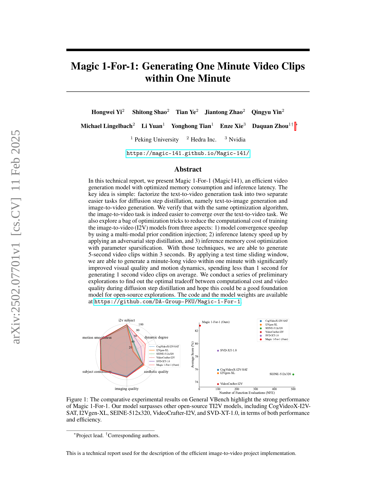
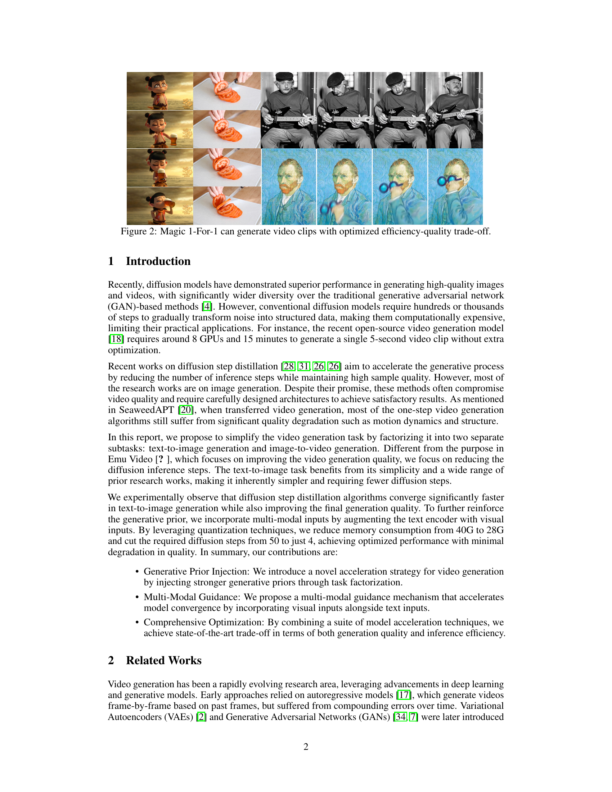
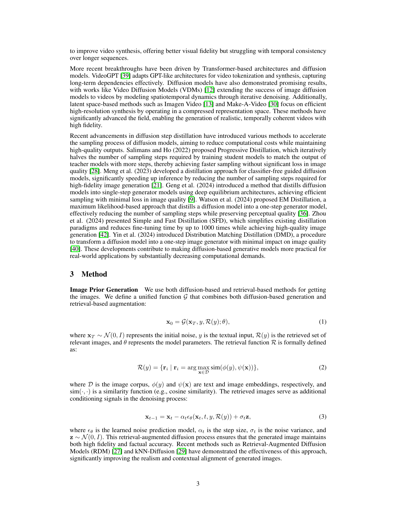
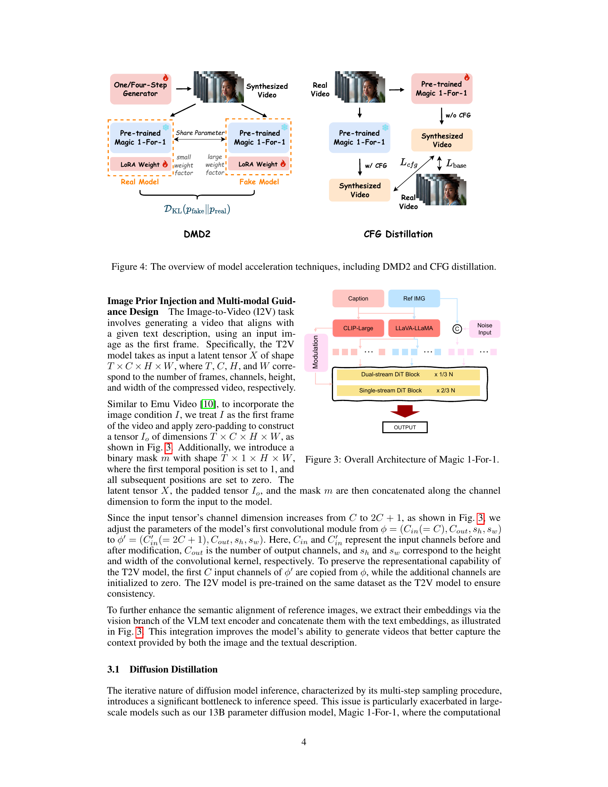
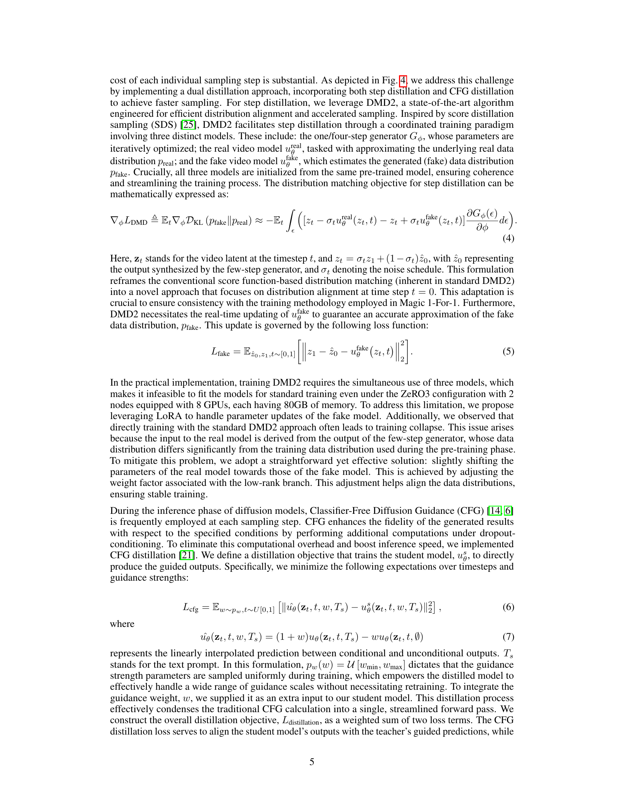
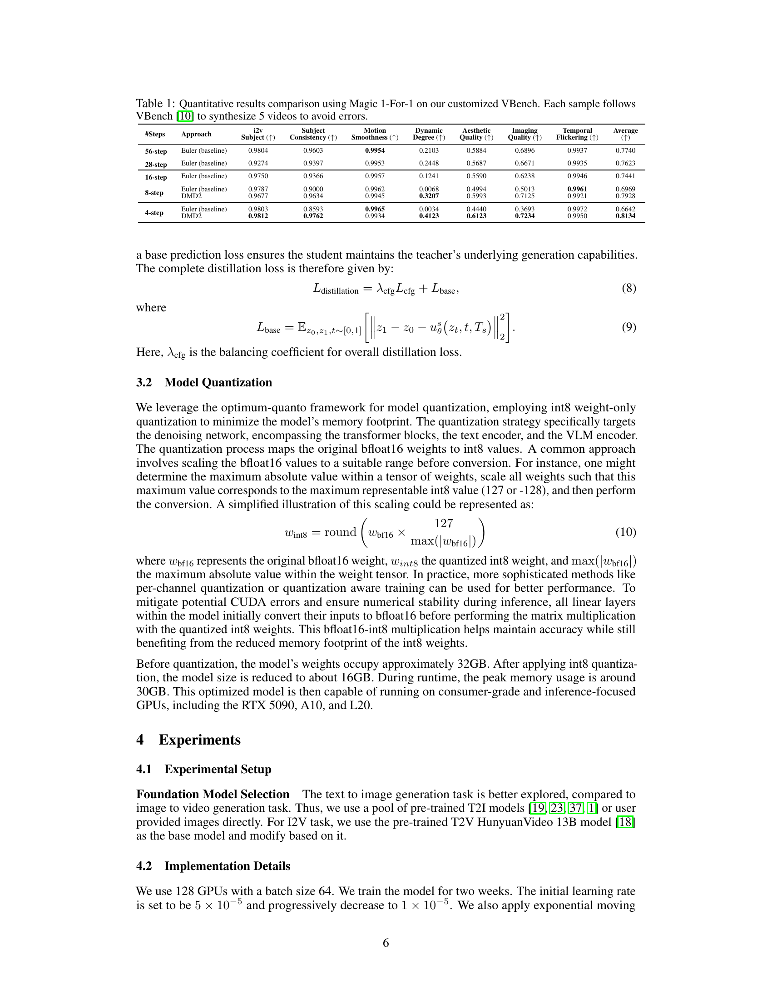
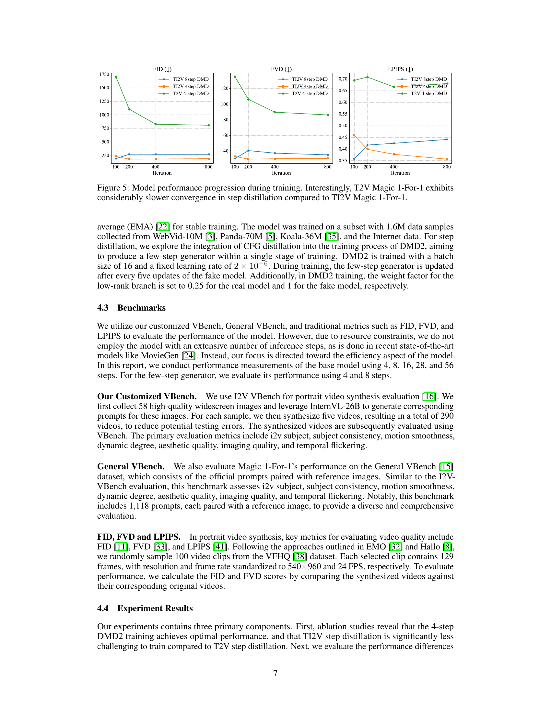
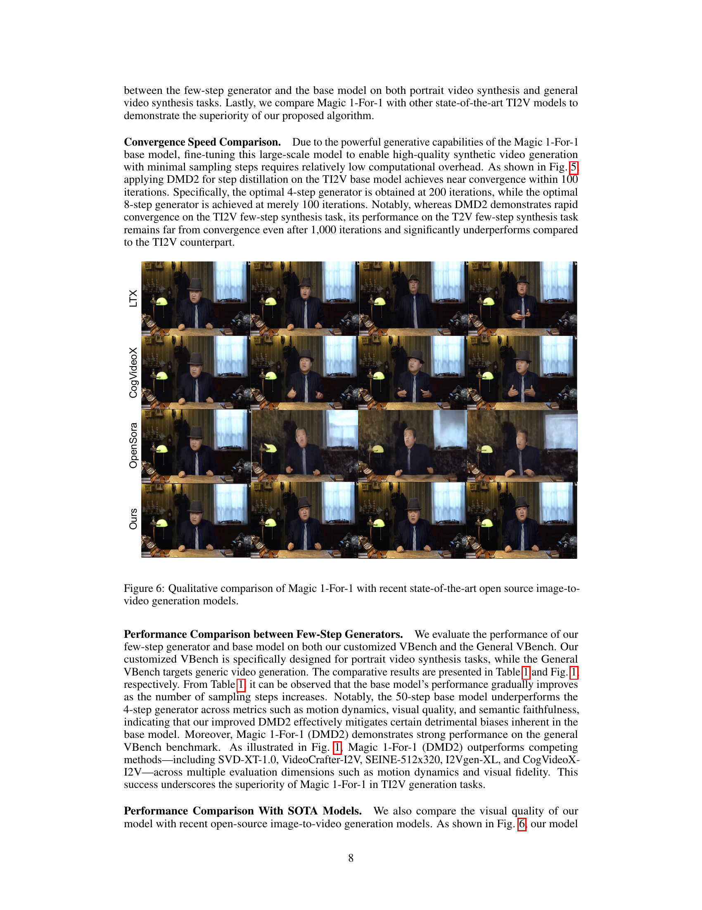
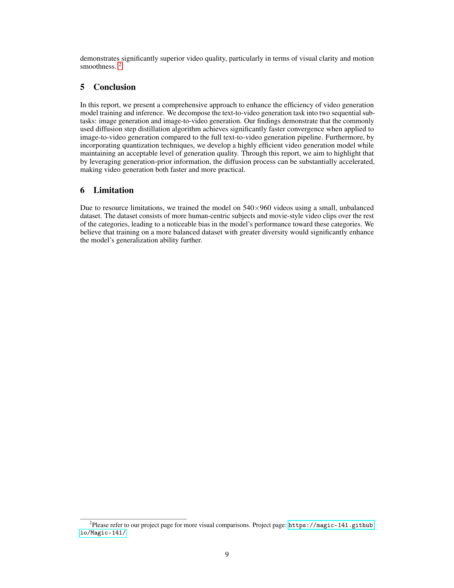
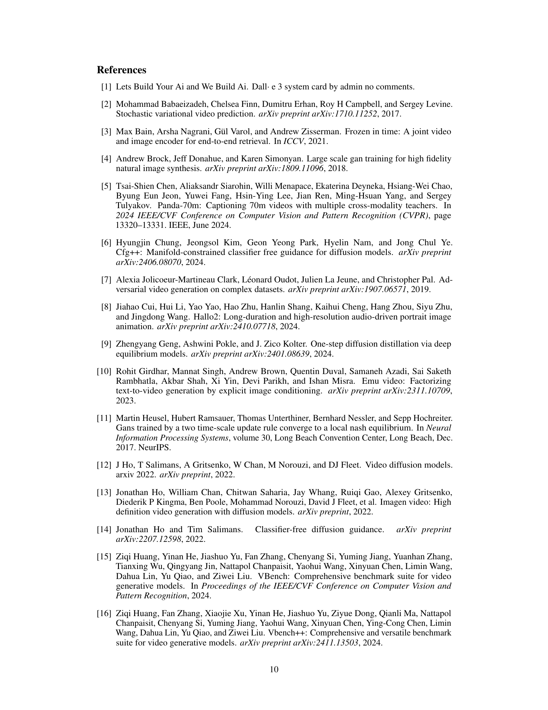
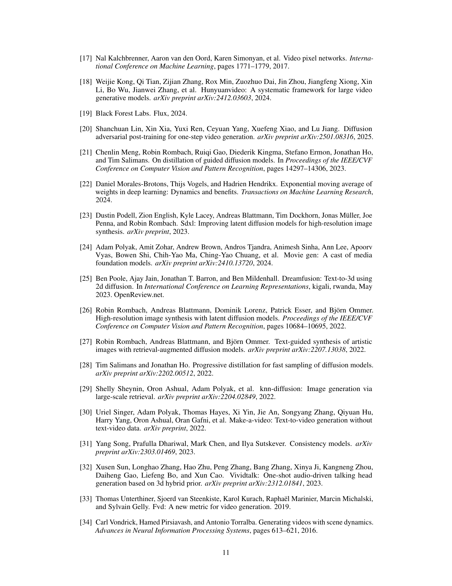
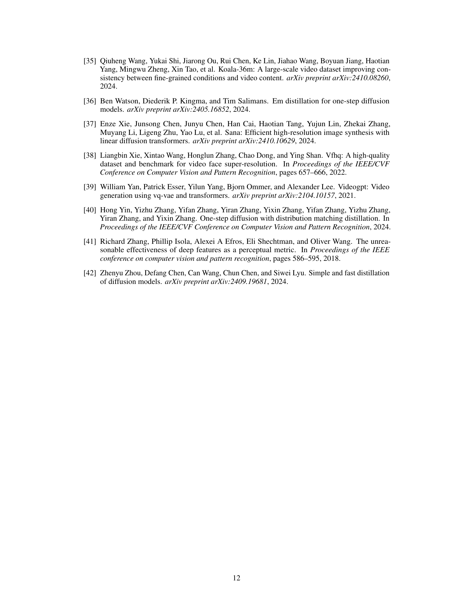
