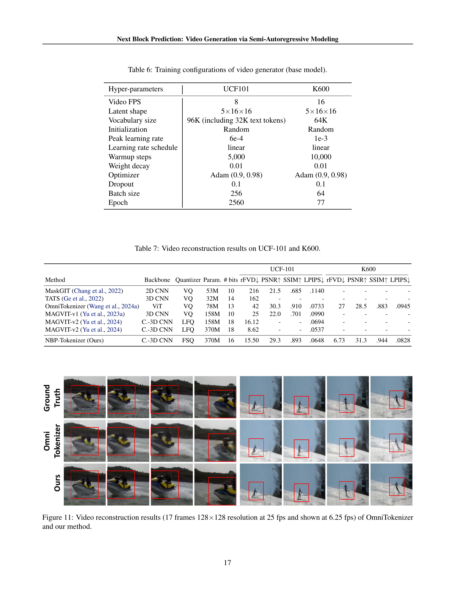
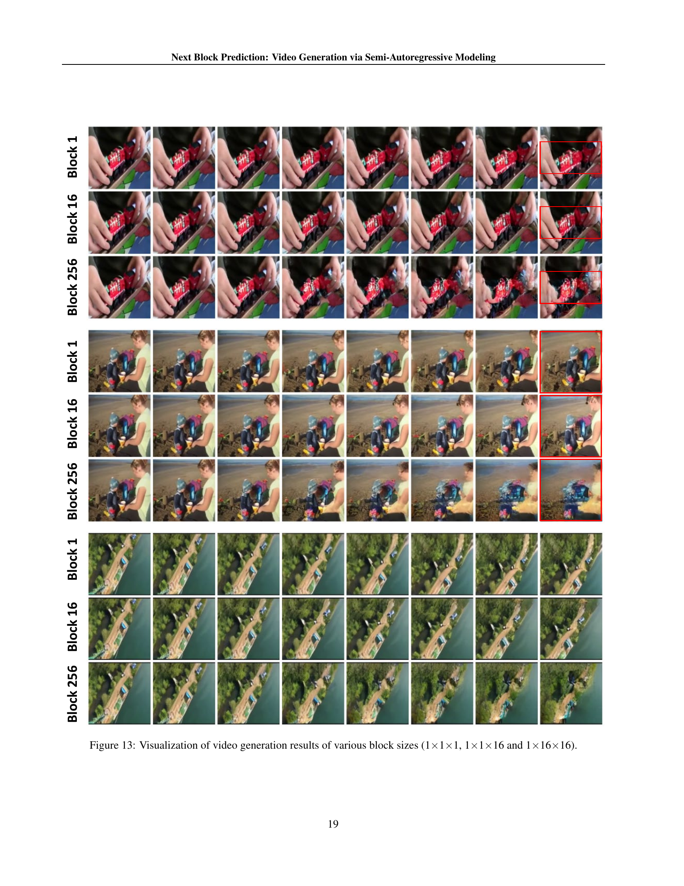

 


 2502.07737 
 Shuhuai Ren et el. 
 
 🤗 2025-02-13 
 



↗ arXiv


↗ Hugging Face


↗ Papers with Code


### TL;DR



기존의 자동 회귀(autoregressive, AR) 모델 기반 비디오 생성 방법은 토큰 단위 예측으로 인해 속도가 느리고, 단방향 의존성으로 인해 공간적 정보 활용이 미흡했습니다. 이러한 문제를 해결하기 위해 본 논문에서는 **Next-Block Prediction (NBP)**이라는 새로운 반자동 회귀 프레임워크를 제안합니다.

NBP는 비디오를 크기가 같은 블록(예: 행 또는 프레임)으로 나누고, 각 블록의 토큰이 다음 블록의 해당 토큰을 동시에 예측하도록 합니다. 이를 통해 **추론 단계를 줄이고 속도를 향상**시키며, **블록 내 양방향 어텐션**으로 공간적 의존성을 더욱 효과적으로 파악하여 생성 품질을 개선합니다.  UCF101 및 K600 데이터셋에서 실험 결과, NBP는 기존 NTP 모델보다 평균 4.4점의 FVD(Fréchet Video Distance) 개선을 보였고, 추론 속도는 11배 향상되었습니다. 또한, 모델 크기가 증가함에 따라 생성 품질이 향상되는 **확장성**도 확인했습니다.



#### Key Takeaways


 NBP는 기존의 토큰 단위 예측 방식과 달리 **블록 단위로 비디오 콘텐츠를 처리**하여 추론 속도를 획기적으로 개선했습니다. 



 **블록 내 양방향 어텐션**을 활용하여 공간적 의존성을 더욱 효과적으로 포착하고 생성 품질을 향상시켰습니다. 



 700M~3B 파라미터 모델에 대한 실험 결과를 통해 **모델의 확장성**을 입증했습니다. 


#### Why does it matter?
본 논문은 비디오 생성 분야에서 **반자동 회귀 모델링(semi-autoregressive modeling)**의 새로운 접근 방식을 제시하여 **추론 속도를 크게 향상**시키고 **생성 품질을 개선**하는 데 중요한 의미를 지닙니다.  기존의 자동 회귀 모델의 한계를 극복하고, 효율성과 확장성을 모두 고려한 새로운 방법론을 제시함으로써, 관련 연구 분야에 큰 영향을 미칠 것으로 예상됩니다. 특히, **다양한 크기의 모델에 대한 실험 결과를 통해 확장성을 입증**한 점은 높이 평가할 만하며, 향후 **멀티모달 AI 연구에 새로운 가능성**을 제시합니다.  다양한 크기의 모델에 대한 실험을 통해 확장성을 입증하여, 향후 멀티모달 AI 연구에 새로운 가능성을 제시합니다.

------
#### Visual Insights

> 🔼 이 그림은 논문에서 제시된 비디오 토크나이저가 생성하는 3차원 불연속 토큰 맵을 보여줍니다. 입력 비디오는 하나의 초기 프레임과 여러 클립으로 구성되며, 각 클립은 FT개의 프레임을 포함합니다. 그림에서 x^{(i)}_{j}는 i번째 클립의 j번째 비디오 토큰을 나타냅니다.  즉, 비디오 토크나이저는 비디오를 시간(T), 높이(H), 너비(W) 차원을 갖는 3D 토큰 시퀀스로 변환합니다.  각 토큰은 비디오의 작은 공간 영역을 나타내며, 이 토큰들의 시퀀스는 비디오의 내용을 나타냅니다. 이 그림은 비디오 토크나이저의 동작을 시각적으로 보여주어, 이후의 비디오 생성 과정을 이해하는 데 도움을 줍니다.
> 

> 
read the caption

> Figure 1: 3D discrete token map produced by our video tokenizer. The input video consists of one initial frame, followed by n𝑛nitalic_n clips, with each clip containing FTsubscript𝐹𝑇F_{T}italic_F start_POSTSUBSCRIPT italic_T end_POSTSUBSCRIPT frames. xj(i)subscriptsuperscript𝑥𝑖𝑗x^{(i)}_{j}italic_x start_POSTSUPERSCRIPT ( italic_i ) end_POSTSUPERSCRIPT start_POSTSUBSCRIPT italic_j end_POSTSUBSCRIPT indicates the jt⁢hsuperscript𝑗𝑡ℎj^{th}italic_j start_POSTSUPERSCRIPT italic_t italic_h end_POSTSUPERSCRIPT video token in the it⁢hsuperscript𝑖𝑡ℎi^{th}italic_i start_POSTSUPERSCRIPT italic_t italic_h end_POSTSUPERSCRIPT clip.
> 


| Block Size | Block Shape (T×H×W) | FVD↓ |
|---|---|---|
| 16 | 1×4×4 | 33.4 |
| 16 | 2×1×8 | 29.2 |
| 16 | 1×1×16 | 25.5 |
| 8 | 2×2×2 | 32.7 |
| 8 | 1×1×8 | 25.7 |

> 🔼 표 1은 K600 데이터셋에서 수행된 다음 토큰 예측(NTP) 및 다음 블록 예측(NBP) 모델의 성능 및 속도 비교를 보여줍니다. 5프레임 조건에서 12프레임(768개 토큰)을 예측하는 실험을 진행하였습니다. 단일 A100 Nvidia GPU에서 추론 시간을 측정했습니다. 모든 모델은 동일한 설정하에 구현되었고 20 에포크 동안 학습되었습니다. FPS는 초당 프레임 수를 나타내며, 추론 속도 측정에는 토큰화 및 역토큰화 과정이 포함됩니다. 두 모델 모두 KV-캐시를 사용했습니다.
> 

> 
read the caption

> Table 1: Comparison of next-token prediction (NTP) and next-block prediction (NBP) models in terms of performance and speed, evaluated on the K600 dataset (5-frame condition, 12 frames (768 tokens) to predict). Inference time was measured on a single A100 Nvidia GPU. All models are implemented by us under the same setting and trained for 20 epochs. FPS denotes “frame per second”. The measurement of inference speed includes tokenization and de-tokenization processes. KV-cache is used for both models.
> 

### In-depth insights

#### Semi-AR Video Gen
**준자동 회귀 비디오 생성(Semi-AR Video Gen)**은 기존의 자동 회귀 모델의 한계를 극복하기 위해 제안된 접근 방식입니다. 기존의 자동 회귀 모델은 토큰을 순차적으로 예측하기 때문에 처리 속도가 느리고, 장기 의존성을 제대로 포착하지 못하는 단점이 있습니다. 반면에 준자동 회귀 모델은 **블록 단위의 병렬 처리**를 통해 이러한 문제점을 해결합니다. 비디오를 여러 블록으로 나누고, 각 블록을 동시에 예측함으로써 속도 향상과 함께 더욱 효율적인 처리가 가능해집니다.  **양방향 어텐션 메커니즘**을 사용하여 블록 내부의 공간적 의존성을 더욱 정확하게 파악하는 것도 중요한 특징입니다. 이러한 접근 방식은 비디오 생성의 효율성을 높이고, 보다 **고품질의 비디오 생성**을 가능하게 합니다.  그러나 블록 크기 설정 및 블록의 형태 등은 생성 품질에 영향을 미치는 중요한 요소이며, 이에 대한 추가적인 연구가 필요합니다.  **다양한 블록 크기와 형태에 대한 실험**을 통해 최적의 설정을 찾고, **모델의 확장성을 평가**하여 실용적인 비디오 생성 시스템 개발에 기여할 수 있습니다.

#### NBP Framework
본 논문에서 제시된 NBP(Next-Block Prediction) 프레임워크는 기존의 오토리그레시브 비디오 생성 방식의 한계를 극복하기 위해 **블록 단위 예측**이라는 새로운 접근법을 제시합니다.  기존의 토큰 단위 예측(NTP) 방식은 연산 비용이 높고 추론 속도가 느리다는 단점이 있었는데, NBP는 비디오 콘텐츠를 동일한 크기의 블록(예: 행 또는 프레임)으로 나누어 각 블록의 토큰들이 다음 블록의 해당 토큰을 동시에 예측하도록 설계되었습니다. 이를 통해 **병렬 처리**가 가능해져 추론 속도가 향상되고, **블록 내 양방향 어텐션**을 사용하여 공간적 의존성을 더욱 효과적으로 포착할 수 있습니다. **모델 확장성**도 뛰어나 파라미터 수를 증가시킬수록 생성 품질이 향상되는 것을 확인했습니다.  결론적으로, NBP 프레임워크는 효율성과 확장성을 모두 고려한 비디오 생성 모델로서 기존 방식의 한계를 뛰어넘는 혁신적인 방법론을 제시합니다. 특히, 속도 향상 측면에서 주목할 만한 성과를 보여줍니다.

#### Block-wise Attention
본 논문에서 제안하는 블록 단위 어텐션(Block-wise Attention)은 기존의 토큰 단위 자기회귀 모델의 한계를 극복하기 위한 핵심적인 접근 방식입니다. **기존의 토큰 단위 어텐션은 순차적인 처리로 인해 계산 비용이 높고, 공간적 상관관계를 제대로 포착하지 못하는 단점**이 있습니다.  반면, 블록 단위 어텐션은 영상 데이터를 여러 블록으로 나누어 각 블록 내부의 토큰 간에 **양방향 어텐션**을 적용함으로써 **공간적 상관관계를 더욱 효과적으로 학습**할 수 있도록 합니다. 이를 통해 연산 효율성을 높이고, 동시에 더욱 정확한 영상 생성을 가능하게 합니다. **병렬 처리를 통해 추론 속도를 크게 향상**시키는 효과도 가져옵니다.  **블록 크기 및 형태에 대한 실험적 연구**를 통해 최적의 설정을 찾고, 이를 통해 향상된 성능을 보임으로써 블록 단위 어텐션의 효과를 입증하고 있습니다.  **단순한 토큰 단위 접근 방식을 넘어 블록 단위의 상호작용을 고려**함으로써 보다 자연스럽고 효율적인 영상 생성 모델을 구축하는 데 크게 기여하는 중요한 기술입니다.

#### Efficiency Gains
본 논문에서 제시된 NBP(Next-Block Prediction) 모델은 기존의 NTP(Next-Token Prediction) 방식보다 **상당한 효율성 향상**을 보입니다.  이는 단순히 처리 속도의 증가를 넘어, **모델의 확장성 및 일반화 능력**과도 밀접하게 연관되어 있습니다.  NBP는 블록 단위의 예측을 통해 연산량을 줄이고, 동시에 여러 토큰을 예측함으로써 **추론 속도를 크게 개선**합니다.  **병렬 처리**를 통한 속도 향상은 단순한 성능 개선이 아닌, 고해상도 비디오 생성과 같은 **복잡한 작업에 대한 실현 가능성**을 높여줍니다.  **메모리 효율적인 구현**도 효율성 향상에 기여하며, 이는 특히 대규모 모델을 사용할 때 중요합니다.  결과적으로, NBP는 효율성과 성능 간의 균형을 잘 맞춘, 비디오 생성 분야에 **혁신적인 접근 방식**을 제시합니다.  이러한 효율성 향상은 **모델의 크기와 성능 간의 균형**을 조정하고, 더욱 **복잡하고 정교한 비디오 생성**을 가능하게 합니다.

#### Future Work
본 논문에서 제시된 NBP (Next-Block Prediction) 모델은 비디오 생성 분야에서 **속도와 효율성을 크게 향상**시켰지만, 여전히 개선의 여지가 많습니다. **향후 연구 방향**으로는 다음과 같은 것들이 고려될 수 있습니다. 첫째, **더욱 큰 모델 규모**를 사용하여 생성 품질을 더욱 향상시키는 것입니다. 현재 모델은 3B 파라미터까지 확장되었지만, 더 큰 모델은 더욱 풍부하고 사실적인 비디오를 생성할 수 있을 것입니다. 둘째, **다양한 비디오 데이터셋**을 사용하여 모델의 일반화 성능을 향상시킬 수 있습니다. 현재 사용된 UCF101과 K600 데이터셋 외에 더욱 다양하고 대규모의 데이터셋을 활용하면 모델의 범용성을 높이고 다양한 유형의 비디오를 생성할 수 있을 것입니다. 셋째, **새로운 토크나이저 (Tokenizer)**를 개발하거나 기존 토크나이저를 개선하여 더욱 효율적이고 정확한 비디오 토큰화를 수행하는 것입니다.  넷째, **다양한 블록 크기 및 형태**를 실험하여 최적의 설정을 찾는 연구가 필요합니다. 다섯째, **새로운 손실 함수 또는 훈련 전략**을 적용하여 모델의 학습 안정성과 생성 품질을 개선하는 연구가 필요합니다. 마지막으로, **생성된 비디오의 다양성**을 높이는 방법에 대한 연구가 필요합니다.  **윤리적 고려** 또한 중요한데, 생성된 비디오가 악용될 가능성을 최소화하기 위한 연구가 병행되어야 할 것입니다. 이러한 연구들을 통해 NBP 모델은 더욱 강력하고 실용적인 비디오 생성 모델로 발전할 수 있을 것입니다.

### More visual insights

More on figures

> 🔼 그림 2는 토큰 단위, 행 단위 및 프레임 단위 표현을 포함한 블록의 예를 보여줍니다. 블록 크기가 1x1x1로 설정되면 기존의 자동 회귀 모델에서 사용되는 토큰으로 축소됩니다. 실제 토큰은 3차원 큐브에 해당하지만, 명확성을 위해 시간 차원은 생략했습니다. 이 그림은 비디오를 다양한 크기의 블록으로 나누어 처리하는 NBP 모델의 핵심 개념을 시각적으로 보여줍니다.  토큰 단위는 기존의 방식처럼 하나의 토큰씩 처리하는 반면, 행 단위나 프레임 단위는 여러 토큰을 동시에 처리하여 처리 속도를 높이고 효율성을 개선하는 방법을 설명합니다.
> 

> 
read the caption

> Figure 2: Examples of block include token-wise, row-wise, and frame-wise representations. When the block size is set to 1×\times×1×\times×1, it degenerates into a token, as used in vanilla AR modeling. Note that the actual token corresponds to a 3D cube, we omit the time dimension here for clarity.
> 

> 🔼  그림 3은 기존의 next-token prediction 방식을 사용하는 일반적인 autoregressive (AR) 프레임워크와 제안하는 next-block prediction 방식을 사용하는 semi-AR 프레임워크를 비교한 그림입니다. 왼쪽은 next-token prediction 방식으로, 각 단계에서 하나의 토큰씩 예측합니다. 반면 오른쪽 semi-AR 프레임워크는, 동일한 크기의 블록(L개의 토큰 포함) 단위로 비디오 내용을 나누고, 현재 블록의 각 토큰이 다음 블록의 해당 토큰을 동시에 예측합니다. 오른쪽 패널의 점선은 현재 단계에서 생성된 L개의 토큰이 복제되어 이전 토큰들과 결합되어 다음 단계의 예측을 위한 입력으로 사용되는 과정을 나타냅니다.  이는 여러 토큰을 병렬적으로 예측하여 연산 효율을 높이는 semi-AR 방식의 핵심 개념을 보여줍니다.  각 블록은 여러 토큰으로 구성되며,  𝑥𝑖𝑗x^{(i)}_{j} 는 i번째 블록에서 j번째 토큰을 나타냅니다.
> 

> 
read the caption

> Figure 3: Comparison between a vanilla autoregressive (AR) framework based on next-token prediction (left) and our semi-AR framework based on next-block prediction (right). xj(i)subscriptsuperscript𝑥𝑖𝑗x^{(i)}_{j}italic_x start_POSTSUPERSCRIPT ( italic_i ) end_POSTSUPERSCRIPT start_POSTSUBSCRIPT italic_j end_POSTSUBSCRIPT indicates the jt⁢hsuperscript𝑗𝑡ℎj^{th}italic_j start_POSTSUPERSCRIPT italic_t italic_h end_POSTSUPERSCRIPT video token in the it⁢hsuperscript𝑖𝑡ℎi^{th}italic_i start_POSTSUPERSCRIPT italic_t italic_h end_POSTSUPERSCRIPT block, with each block containing L𝐿Litalic_L tokens. The dashed line in the right panel presents that the L𝐿Litalic_L tokens generated in the current step are duplicated and concatenated with prefix tokens, forming the input for the next step’s prediction during inference.
> 

> 🔼 그림 4는 기존의 Next-Token Prediction (NTP) 방식과 제안하는 Next-Block Prediction (NBP) 방식에서의 어텐션 마스크 차이를 보여줍니다. NTP는 이전 토큰들만 고려하는 단방향 어텐션을 사용하는 반면, NBP는 현재 블록 내 모든 토큰들이 다음 블록의 대응되는 토큰들을 예측할 수 있도록 양방향 어텐션을 사용합니다.  X축은 키(key), Y축은 쿼리(query)를 나타내며,  NTP의 경우 미래 토큰에 대한 정보를 볼 수 없도록 마스크 처리되어 삼각형 형태를 띄는 반면, NBP는 블록 내부에서는 모든 토큰 간 상호작용이 가능하므로 사각형 형태의 마스크를 사용합니다. 이는 NBP가 공간적 의존성을 더 잘 포착하고 계산 효율성을 높일 수 있음을 시각적으로 보여줍니다.
> 

> 
read the caption

> Figure 4: Causal attention mask in NTP modeling v.s. block-wise attention mask in NBP modeling. The x-axis and y-axis represent keys and queries, respectively.
> 

> 🔼 그림 5는 논문의 실험 부분에서 700M, 1.2B, 3B 파라미터를 가진 반자동 회귀(semi-AR) 모델들의 검증 손실(validation loss)을 훈련 단계에 따라 보여줍니다.  세 가지 크기의 모델에 대한 손실 값 변화를 비교하여 모델 크기가 커짐에 따라 성능이 향상되는지, 그리고 훈련 과정에서 손실이 어떻게 감소하는지를 시각적으로 보여줍니다. 이를 통해 모델 크기와 성능 간의 관계 및 모델의 훈련 안정성을 평가할 수 있습니다.
> 

> 
read the caption

> Figure 5: Validation loss of various sizes of semi-AR models from 700M to 3B.
> 

> 🔼 그림 6은 1부터 256까지 다양한 블록 크기에 따른 검증 손실을 보여줍니다.  블록 크기가 증가함에 따라 모델이 학습 데이터의 패턴을 더 잘 학습하여 검증 손실이 감소하는 것을 확인할 수 있습니다. 하지만, 블록 크기가 너무 커지면 오히려 검증 손실이 증가하는 경향을 보이는데, 이는 너무 큰 블록 크기는 모델이 세부적인 정보를 놓치거나 과적합을 유발할 수 있기 때문입니다. 이 그림은 연구에서 제안하는 NBP(Next Block Prediction) 모델의 효율성과 성능에 대한 중요한 통찰력을 제공합니다. 즉, 적절한 블록 크기를 선택하는 것이 모델의 성능 향상에 중요하다는 점을 시각적으로 보여줍니다.
> 

> 
read the caption

> Figure 6: Validation loss of various block sizes from 1 to 256.
> 

> 🔼 그림 7은 다양한 크기의 블록(1부터 256까지)을 사용했을 때, 비디오 생성 품질(FVD, 낮을수록 좋음)과 추론 속도(FPS, 높을수록 좋음)를 보여줍니다.  블록 크기가 증가함에 따라 FVD 값이 감소하고 FPS 값이 증가하는 경향을 보이는데, 특히 16 크기의 블록에서 최적의 성능을 보입니다.  이는 제안된 NBP(Next-Block Prediction) 모델이 토큰 단위 예측(NTP)보다 더 효율적임을 시사합니다.
> 

> 
read the caption

> Figure 7: Generation quality (FVD, lower is better) and inference speed (FPS, higher is better) of various block sizes from 1 to 256.
> 

> 🔼 그림 8은 제안된 방법을 사용하여 UCF-101 데이터셋에서 클래스 조건부 비디오 생성 결과를 보여줍니다. 각 비디오 클립 아래에는 해당 클래스 이름이 표시되어 있습니다. 이 그림은 모델이 다양한 동작들을 얼마나 정확하게 생성하는지 시각적으로 보여줍니다.  각 클래스에 대한 여러 생성 예시를 보여줌으로써 모델의 다양성과 생성 품질을 평가할 수 있게 합니다.
> 

> 
read the caption

> Figure 8: Visualization of class-conditional generation (UCF-101) results of our method. The text below each video clip is the class name.
> 

> 🔼 그림 9는 제안된 방법을 사용하여 Kinetics-600 데이터셋에서 수행한 프레임 예측 결과를 보여줍니다.  이 그림은 모델이 이전 몇 프레임을 기반으로 후속 프레임을 정확하게 예측하는 능력을 시각적으로 보여주는 여러 비디오 클립의 일부분을 보여줍니다. 각 클립은 모델이 예측한 프레임 시퀀스와 실제 프레임 시퀀스를 보여줍니다.  이를 통해 모델의 정확성과 시계열 데이터의 패턴을 얼마나 잘 학습했는지 확인할 수 있습니다.
> 

> 
read the caption

> Figure 9: Visualization of frame prediction (K600) results of our method.
> 

> 🔼 그림 10은 OmniTokenizer와 제안된 방법의 프레임 예측 결과를 보여줍니다. 왼쪽은 조건(입력 프레임)이고 오른쪽은 예측된 후속 프레임 시퀀스입니다.  OmniTokenizer와 비교하여 제안된 방법이 얼마나 더 정확하게 후속 프레임을 예측하는지 시각적으로 보여줍니다.  각각의 이미지는 동일한 비디오의 일부분이며, 시간 순서대로 정렬되어 있습니다.  이를 통해 두 모델의 프레임 예측 성능 차이를 명확하게 비교할 수 있습니다.
> 

> 
read the caption

> Figure 10: Frame prediction results of OmniTokenizer and our method. The left part is the condition, and the right part is the predicted subsequent sequence.
> 

> 🔼 그림 11은 OmniTokenizer와 제안하는 방법을 사용하여 비디오 재구성 결과를 보여줍니다. 17프레임의 비디오를 128x128 해상도로 25fps로 생성하고 6.25fps로 표시했습니다. 두 가지 방법의 비디오 재구성 결과를 비교하여 제안하는 방법의 우수성을 보여줍니다. OmniTokenizer는 비디오의 일부 영역에서 세부적인 정보가 부족하고 움직임이 부자연스러운 반면, 제안하는 방법은 더욱 선명하고 자연스러운 비디오를 재구성합니다.
> 

> 
read the caption

> Figure 11: Video reconstruction results (17 frames 128×\times×128 resolution at 25 fps and shown at 6.25 fps) of OmniTokenizer and our method.
> 

> 🔼 그림 12는 700M, 1.2B, 3B 매개변수를 가진 다양한 크기의 모델이 생성한 비디오 결과를 보여줍니다. 각 행은 서로 다른 비디오 클립에 대한 생성 결과를 나타내며, 각 열은 비디오의 연속적인 프레임들을 보여줍니다. 이 그림을 통해 모델 크기가 커짐에 따라 생성된 비디오의 화질과 시간적 일관성이 어떻게 향상되는지 시각적으로 확인할 수 있습니다. 700M 모델은 상대적으로 흐릿하고 일관성이 떨어지는 비디오를 생성하는 반면, 3B 모델은 더욱 선명하고 현실감 있는 비디오를 생성합니다.  이는 모델 크기가 증가함에 따라 모델의 표현 능력이 향상되어 더욱 정교한 비디오 생성이 가능해짐을 보여줍니다.
> 

> 
read the caption

> Figure 12: Visualization of video generation results of various model sizes (700M, 1.2B, and 3B).
> 

> 🔼 그림 13은 서로 다른 크기의 블록(1x1x1, 1x1x16, 1x16x16)을 사용하여 비디오 생성 결과를 시각적으로 보여줍니다. 각 블록 크기는 비디오 프레임을 토큰화하는 방식에 영향을 미치며, 이는 생성된 비디오의 품질과 효율성에 영향을 줍니다. 1x1x1은 기존의 토큰 단위 생성 방식과 유사하며, 1x1x16은 행 단위 생성, 1x16x16은 클립 단위 생성을 나타냅니다. 이 그림은 각 블록 크기가 생성 과정에 미치는 영향과 생성 결과의 차이를 보여주는 중요한 비교 자료입니다.  다양한 블록 크기에서 생성된 비디오 시퀀스를 비교하여, 블록 크기가 시계열적 연관성을 포착하는 방식과 생성된 비디오의 시각적 품질에 어떻게 영향을 미치는지를 보여줍니다.
> 

> 
read the caption

> Figure 13: Visualization of video generation results of various block sizes (1×\times×1×\times×1, 1×\times×1×\times×16 and 1×\times×16×\times×16).
> 

> 🔼 그림 14는 UCF-101 데이터셋에서 다음 클립 예측에 대한 어텐션 가중치를 보여줍니다. 가로축과 세로축은 각각 키와 쿼리를 나타내며, 두 개의 빨간 선은 각 축을 세 부분(클래스 이름(텍스트), 첫 번째 클립, 두 번째 클립)으로 나눕니다. 각 픽셀의 밝기는 어텐션 점수를 반영하며, 텍스트 토큰에 대한 어텐션은 시각화를 명확하게 하기 위해 5배 감소되었습니다. 이 그림은 모델이 텍스트 정보와 이전 클립 정보를 활용하여 다음 클립을 예측하는 과정에서 어떻게 어텐션 메커니즘을 사용하는지를 보여주는 시각적 설명입니다.  특히, 클립 간의 연관성을 파악하는데 어떻게 어텐션이 집중되는지를 보여줍니다.
> 

> 
read the caption

> Figure 14: Attention weights of next-clip prediction on UCF-101. The horizontal and vertical axis represent the keys and queries, respectively. Two red lines on each axis divide the axis into three segments, corresponding to the text (classname), the first clip, and the second clip. The brightness of each pixel reflects the attention score. We downweight the attention to text tokens by 5×5\times5 × to provide a more clear visualization.
> 

> 🔼 그림 15는 UCF-101 데이터셋에서 특정 쿼리(빨간색 X로 표시)에 대한 공간적 어텐션 분포를 보여줍니다.  이 그림은 어텐션 메커니즘이 특정 쿼리 토큰이 입력 영상의 어떤 공간적 영역에 가장 주목하는지를 시각적으로 보여줍니다.  어두운 색상은 낮은 어텐션 가중치, 밝은 색상은 높은 어텐션 가중치를 나타냅니다.  이를 통해 모델이 특정 쿼리에 대해 어떤 영역의 정보를 가장 중요하게 처리하는지 이해할 수 있습니다.  이는 모델의 공간적 정보 처리 능력을 분석하는 데 유용한 정보를 제공합니다.
> 

> 
read the caption

> Figure 15: Spatial attention distribution for a specific query (represented by red ×\times×) on UCF-101.
> 

More on tables


| Model | Parameters | Layers | Hidden Size | Heads |
|---|---|---|---|---|
| NBP-XL | 700M | 24 | 1536 | 16 |
| NBP-XXL | 1.2B | 24 | 2048 | 32 |
| NBP-3B | 3B | 32 | 3072 | 32 |
> 🔼 표 2는 UCF-101 데이터셋에서의 클래스 조건부 비디오 생성 결과와 K600 데이터셋에서의 프레임 예측 결과를 비교 분석한 표입니다.  MTM은 마스크 토큰 모델링을 의미합니다. K600 데이터셋에 대한 본 논문의 모델은 77 에폭 동안 학습되었으며, 300 에폭 이상의 상당히 많은 계산량을 필요로 하는 모델들은 공정한 비교를 위해 회색으로 표시되었습니다. 표에는 각 모델의 매개변수 수, FVD(Fréchet Video Distance) 점수, 토큰 수, 학습 단계 등의 정보가 포함되어 있어, 다양한 비디오 생성 모델들의 성능과 효율성을 비교하는 데 유용합니다.
> 

> 
read the caption

> Table 2: Comparions of class-conditional generation results on UCF-101 and frame prediction results on K600. MTM indicates mask token modeling. Our model on K600 is trained for 77 epochs, we gray out models that use significantly more training computation (e.g., those trained for over 300 epochs) for a fair comparison.
> 


| Hyper-parameters | UCF101 | K600 |
|---|---|---|
| Video FPS | 8 | 8 |
| Latent shape | 5x16x16 | 5x16x16 |
| Vocabulary size | 64K | 64K |
| Embedding dimension | 6 | 6 |
| Initialization | Random | Random |
| Peak learning rate | 5e-5 | 1e-4 |
| Learning rate schedule | linear | linear |
| Warmup ratio | 0.01 | 0.01 |
| Perceptual loss weight | 0.1 | 0.1 |
| Generator adversarial loss weight | 0.1 | 0.1 |
| Optimizer | Adam | Adam |
| Batch size | 256 | 256 |
| Epoch | 2000 | 100 |
> 🔼 표 3은 다양한 블록 형태에 따른 비디오 생성 품질(FVD)을 보여줍니다.  블록의 크기와 형태가 비디오 생성 성능에 미치는 영향을 분석하기 위해 수행된 실험 결과를 보여주는 표입니다.  다양한 블록 크기와 형태(예: 1x4x4, 2x1x8, 1x1x16 등)에 따른 FVD 값을 제시하여 어떤 블록 형태가 비디오 생성에 가장 효과적인지 비교 분석한 결과를 담고 있습니다. 이는 단순히 FVD 수치만 제시하는 것이 아니라,  블록 형태가 생성 성능에 어떻게 영향을 미치는지에 대한 심층적인 분석과 그 이유를 설명하는 내용을 포함합니다.
> 

> 
read the caption

> Table 3: Generation quality (FVD) of various block shape.
> 


| Hyper-parameters | UCF101 | K600 |
|---|---|---|
| Video FPS | 8 | 16 |
| Latent shape | 5 \times 16 \times 16 | 5 \times 16 \times 16 |
| Vocabulary size | 96K (including 32K text tokens) | 64K |
| Initialization | Random | Random |
| Peak learning rate | 6e-4 | 1e-3 |
| Learning rate schedule | linear | linear |
| Warmup steps | 5,000 | 10,000 |
| Weight decay | 0.01 | 0.01 |
| Optimizer | Adam (0.9, 0.98) | Adam (0.9, 0.98) |
| Dropout | 0.1 | 0.1 |
| Batch size | 256 | 64 |
| Epoch | 2560 | 77 |
> 🔼 표 4는 논문에서 제시된 비디오 생성 모델의 크기와 아키텍처 구성을 보여줍니다.  LLaMA (Touvron et al., 2023)의 설정을 기반으로 합니다.  표에는 모델 이름(NBP-XL, NBP-XXL, NBP-3B), 파라미터 수, 레이어 수, 히든 상태 크기, 헤드 수 등의 정보가 포함되어 비디오 생성 모델의 규모와 구조에 대한 자세한 내용을 제공합니다. 이 표는 모델의 성능과 효율성을 이해하는 데 중요한 역할을 합니다.
> 

> 
read the caption

> Table 4: Model sizes and architecture configurations of our generation model. The configurations are following LLaMA (Touvron et al., 2023).
> 


| Method | Backbone | Quantizer | Param. | # bits | rFVD<binary data, 1 bytes><binary data, 1 bytes> (UCF-101) | PSNR<binary data, 1 bytes><binary data, 1 bytes> (UCF-101) | SSIM<binary data, 1 bytes><binary data, 1 bytes> (UCF-101) | LPIPS<binary data, 1 bytes><binary data, 1 bytes> (UCF-101) | rFVD<binary data, 1 bytes><binary data, 1 bytes> (K600) | PSNR<binary data, 1 bytes><binary data, 1 bytes> (K600) | SSIM<binary data, 1 bytes><binary data, 1 bytes> (K600) | LPIPS<binary data, 1 bytes><binary data, 1 bytes> (K600) |
|---|---|---|---|---|---|---|---|---|---|---|---|---|
| MaskGIT [Chang et al., 2022] | 2D CNN | VQ | 53M | 10 | 216 | 21.5 | .685 | .1140 | - | - | - | - |
| TATS [Ge et al., 2022] | 3D CNN | VQ | 32M | 14 | 162 | - | - | - | - | - | - | - |
| OmniTokenizer [Wang et al., 2024a] | ViT | VQ | 78M | 13 | 42 | 30.3 | .910 | .0733 | 27 | 28.5 | .883 | .0945 |
| MAGVIT-v1 [Yu et al., 2023a] | 3D CNN | VQ | 158M | 10 | 25 | 22.0 | .701 | .0990 | - | - | - | - |
| MAGVIT-v2 [Yu et al., 2024] | C.-3D CNN | LFQ | 158M | 18 | 16.12 | - | - | .0694 | - | - | - | - |
| MAGVIT-v2 [Yu et al., 2024] | C.-3D CNN | LFQ | 370M | 18 | 8.62 | - | - | .0537 | - | - | - | - |
| NBP-Tokenizer (Ours) | C.-3D CNN | FSQ | 370M | 16 | 15.50 | 29.3 | .893 | .0648 | 6.73 | 31.3 | .944 | .0828 |
> 🔼 표 5는 논문의 실험 설정 부분에서 비디오 토크나이저(video tokenizer)의 학습 설정을 보여줍니다.  UCF101과 K600 두 개의 데이터셋에 대해, 비디오 FPS, 잠재 벡터의 형태(latent shape), 어휘 사전 크기(vocabulary size), 임베딩 차원(embedding dimension), 초기화 방법(initialization), 최대 학습률(peak learning rate), 학습률 스케줄(learning rate schedule), 웜업 비율(warmup ratio), 손실 함수 가중치(loss function weights), 최적화 알고리즘(optimizer), 배치 크기(batch size), 에폭 수(epoch) 등의 하이퍼파라미터 값을 보여줍니다. 이 표는 비디오 토크나이저 학습에 사용된 주요 설정들을 한눈에 파악할 수 있도록 자세히 제시하여, 실험의 재현성과 이해도를 높이는 데 기여합니다.
> 

> 
read the caption

> Table 5: Training configurations of video tokenizer.
> 

### Full paper



