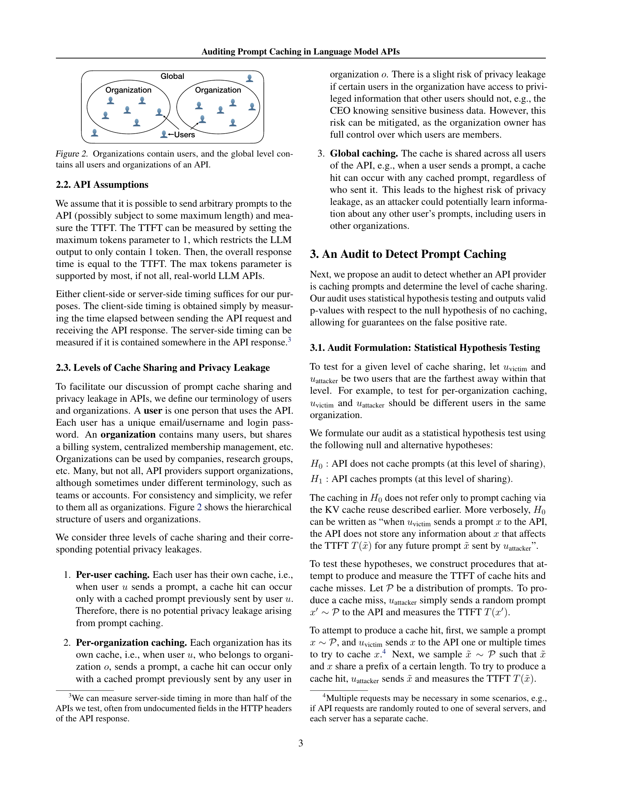
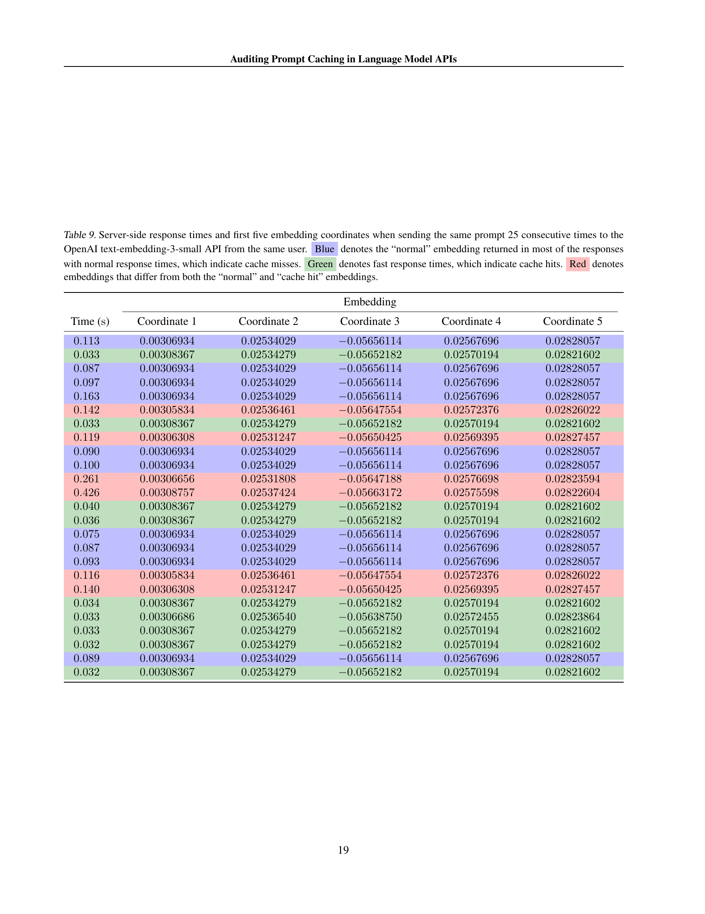

 


 2502.07776 
 Chenchen Gu et el. 
 
 🤗 2025-02-12 
 



↗ arXiv


↗ Hugging Face


↗ Papers with Code


### TL;DR



대규모 언어 모델(LLM)은 컴퓨팅 자원이 많이 소모되므로, 프롬프트 캐싱이라는 최적화 기법이 사용됩니다.  프롬프트 캐싱은 이전에 처리된 프롬프트를 캐시하여 응답 시간을 단축하지만, **캐시에 저장된 정보를 이용한 사이드 채널 공격**에 취약할 수 있습니다. 특히, **캐시가 사용자 간에 공유**되는 경우, 공격자는 응답 시간을 분석하여 사용자의 프롬프트 정보를 추론할 수 있습니다.

본 연구는 **실제 LLM API 제공업체 17곳을 대상**으로 프롬프트 캐싱 감사를 실시했습니다. 그 결과, **7곳의 API 제공업체에서 사용자 간 캐시 공유**가 발견되었고, **이는 프라이버시 유출로 이어질 수 있음**을 시사합니다.  또한, **타이밍 변화를 이용하여 모델 아키텍처 정보**를 유출할 수 있음을 확인했습니다. 연구진은 이러한 취약성을 탐지하고 완화하기 위한 통계적 감사 방법을 제안합니다.



#### Key Takeaways


 LLM API 제공업체 중 상당수가 사용자 간에 프롬프트 캐시를 공유함으로써 프라이버시 위험을 초래한다는 사실을 발견했습니다. 



 프롬프트 캐싱으로 인한 타이밍 변화를 이용하여 모델 아키텍처(예: 디코더 전용 변환기)에 대한 기밀 정보를 유출할 수 있음을 보여주었습니다. 



 API 제공업체의 프롬프트 캐싱 정책에 대한 투명성을 높이고, 잠재적인 취약성을 완화하는 새로운 감사 방법을 개발했습니다. 


#### Why does it matter?
본 논문은 **LLM API의 프롬프트 캐싱으로 인한 프라이버시 및 모델 아키텍처 정보 유출 위험**을 보여주는 실증적 증거를 제시합니다.  연구자들은 **실제 LLM API를 감사하여 캐싱 정책을 밝히고, 잠재적 취약성을 완화**하는 데 도움이 되는 새로운 방법론을 개발했습니다.  **프롬프트 캐싱에 대한 투명성을 높이고, 보안 및 프라이버시 우려를 해결하는 데 기여**하여, LLM API의 안전하고 책임감 있는 사용을 촉진하는 데 중요한 의미를 지닙니다.

------
#### Visual Insights

> 🔼 그림 1은 프롬프트 캐싱의 개념과 이로 인한 개인 정보 유출 가능성을 보여줍니다. (1)에서 피해자는 API에 프롬프트를 보냅니다. 이 프롬프트는 API에 의해 캐시됩니다. (2)에서 공격자는 새로운 프롬프트를 보냅니다. 이 프롬프트는 캐시에 없으므로 응답 시간이 느립니다. (3)에서 공격자는 피해자의 프롬프트와 접두어가 같은 프롬프트를 보냅니다. 이 프롬프트는 캐시에 있으므로 응답 시간이 빠릅니다. 이 빠른 응답 시간을 통해 공격자는 캐시 적중이 발생했음을 알 수 있으며, 이는 다른 사용자의 프롬프트에 대한 정보를 유추할 수 있음을 의미합니다.
> 

> 
read the caption

> Figure 1:  An example illustrating prompt caching. (1) A victim sends a prompt to the API, which then becomes cached. (2) An attacker sends a new prompt, resulting in a cache miss and slow response time. (3) An attacker sends a prompt that shares a prefix with the victim’s prompt, resulting in a cache hit. From the fast response time, the attacker can infer that a cache hit occurred, which potentially reveals information about other users’ prompts.
> 


| Provider | Model | Same prompt
Per-user | Same prefix, different suffixes
Per-user | Per-org. | Global | Avg. precision
Client | Server | 
|---|---|---|---|---|---|---|---|---|
| Azure | text-embedding-3-small | ✓ | ✓ | — | ✓ | 0.80 | — | 
| Deep Infra | Llama 3.1 8B Instruct | ✓ | ✓ | — | ✓ | 0.84 | — | 
| Fireworks | Llama 3.1 8B Instruct | ✓ | ✓ | ✓ | ✓ | 0.77 | 0.79 | 
| Lepton | Llama 3.1 8B Instruct | ✓ | ✓ | — | ✓ | 0.71 | 0.70 | 
| OpenAI | text-embedding-3-small | ✓ | ✓ | ✓ | ✓ | 0.78 | 0.79 | 
| Perplexity | Llama 3.1 8B Instruct | ✓ | ✓ | — | ✓ | 0.90 | — | 
| Replicate | Llama 3 8B Instruct | ✓ | ✓ | — | ✓ | — | 1.00 | 
| Anthropic | Claude 3 Haiku | ✓ | ✓ | ✓ | ✗ | 0.84 | — | 
| OpenAI | GPT-4o mini | ✓ | ✓ | ✓ | ✗ | 0.79 | 0.86 | 

> 🔼 표 1은 연구진이 프롬프트 캐싱을 감지한 API에 대한 감사 결과를 보여줍니다. ✓는 캐싱이 감지되었음을, ✗는 캐싱이 감지되지 않았음을, 빈칸은 API가 조직 기능을 지원하지 않거나 연구진이 조직 기능에 접근할 수 없어 조직 내 캐싱 공유를 테스트하지 않았음을 나타냅니다.  이 표에는 감지된 최고 수준의 캐싱 공유를 사용하여 캐시 적중 절차에서 시간을 분류하는 평균 정밀도가 표시되어 있습니다. 클라이언트측 및 서버측 시간 측정에 대한 평균 정밀도가 별도로 보고되며, 해당 시간 측정 방법을 사용할 수 없는 경우에는 '-'로 표시됩니다.
> 

> 
read the caption

> Table 1: Audit results for APIs where we detected prompt caching. ✓ denotes caching was detected, ✗ denotes caching was not detected, and “—” denotes that cache sharing within an organization was not tested, either because the API did not support organizations or because we did not have access to the organizations feature. We report the average precision for classifying times from the cache hit procedure, using the highest level of cache sharing detected in each API. We report the average precision for client-side timing and server-side timing separately, with “—” denoting that the given timing method is unavailable for that API.
> 

### In-depth insights

#### Prompt Cache Audits
본 논문에서 제시된 프롬프트 캐시 감사는 **LLM API 공급자의 프롬프트 캐싱 정책 투명성 부족** 문제를 해결하기 위한 중요한 시도입니다.  **통계적 가설 검정**을 사용하여 실제 LLM API에서 프롬프트 캐싱 여부 및 캐시 공유 수준(사용자별, 조직별, 또는 전역)을 감지합니다.  **다양한 API 공급자에 대한 감사 결과**는 많은 공급자가 전역 캐시 공유를 통해 프롬프트 정보를 노출하고 있음을 보여줍니다.  이는 **개인 정보 유출 가능성**을 높이며, 공격자가 타겟 사용자의 프롬프트를 추론할 수 있는 **사이드 채널 타이밍 공격**에 취약함을 의미합니다.  **프롬프트 캐싱의 모델 아키텍처 정보 유출 가능성**도 확인하며, 이는 특히 독점 모델의 지적 재산권 보호에 중요한 의미를 가집니다.  **책임 있는 공개** 절차를 통해 취약점을 해결하기 위한 API 공급자와의 협력이 이루어졌다는 점도 긍정적입니다. 하지만 **프롬프트 추출 공격의 어려움**은 여전히 남아있어, 향후 연구를 통해 개선이 필요함을 시사합니다.

#### Timing Attacks
본 논문에서 다루는 "타이밍 공격(Timing Attacks)"은 **측정 가능한 시간 차이를 이용하여 시스템의 비밀 정보를 유출하는 공격 기법**입니다.  특히, 대규모 언어 모델(LLM) API의 프롬프트 캐싱으로 인한 응답 시간 변화를 악용하여 **개인 정보 유출** 또는 **모델 아키텍처 정보 유출**을 야기할 수 있다는 점이 강조됩니다.  캐시 적중 시 더 빠른 응답 시간을 보이는 점을 이용, 공격자는 캐시에 저장된 프롬프트 정보를 추측할 수 있으며, 이는 사용자 프롬프트에 대한 정보 유출, 나아가 모델의 내부 구조에 대한 정보 유출로 이어질 수 있습니다.  **공격의 성공 여부는 캐시 공유 수준(개별 사용자, 조직, 전역)**에 따라 달라지며,  **전역 캐시 공유**의 경우 가장 심각한 위험성을 초래합니다.  따라서, LLM API 제공 업체의 투명한 캐싱 정책 공개 및 **적절한 보안 조치**가 중요하며,  **개발자는 이러한 타이밍 공격에 대한 취약성을 제거하는 방향으로 모델을 설계 및 운영**해야 합니다.  향후 연구로는 보다 정교한 공격 기법의 개발 및 이에 대한 방어 전략 모색이 필요합니다. 

#### API Provider Audits
본 논문에서 API 공급업체 감사는 **실제 세계 LLM API에서 프롬프트 캐싱을 감지하고 캐싱 공유 수준(사용자별, 조직별, 또는 전역)**을 결정하는 데 중점을 둡니다.  연구진은 통계적 가설 검정을 사용하여 프롬프트 캐싱의 존재 여부를 확인하고, 오탐률을 보장하며 유효한 p-값을 산출합니다.  감사 절차는 캐시 적중과 캐시 미스를 생성하기 위한 두 가지 절차를 구성하고, 이러한 절차에서 생성된 응답 시간의 분포를 비교합니다.  **여러 API 공급업체에 대한 감사 결과는 일부 API에서 전역 캐시 공유를 감지하여 사용자 프롬프트에 대한 잠재적 프라이버시 유출을 야기한다는 점을 보여줍니다.** 또한, 프롬프트 캐싱으로 인한 시간 변동은 모델 아키텍처에 대한 정보 유출로 이어질 수 있다는 점도 밝혀냈습니다.  **이러한 결과는 API 공급업체의 투명성과 책임성에 대한 중요성을 강조하며, 사용자 프라이버시 보호를 위한 향후 연구 및 완화 전략의 필요성을 시사합니다.**

#### Model Architecture
본 논문에서는 **프롬프트 캐싱을 이용한 모델 아키텍처 추론**이라는 흥미로운 주제를 다룹니다.  프롬프트 캐싱으로 인한 응답시간 변화를 분석하여 모델의 내부 구조, 특히 **디코더 전용 트랜스포머** 여부를 예측할 수 있다는 점이 핵심입니다. 이는 공개적으로 알려지지 않은 모델의 아키텍처 정보를 유추할 수 있다는 것을 의미하며, **지적 재산권 침해** 가능성을 제기합니다.  **OpenAI의 text-embedding-3-small 모델이 디코더 전용 트랜스포머임을 밝혀낸** 부분은 이러한 취약성을 잘 보여줍니다.  **이러한 분석은 API 제공업체의 투명성 부족을 지적**하며,  보안 및 프라이버시 관점에서 모델 아키텍처 정보 유출에 대한 심층적인 논의가 필요함을 시사합니다.  **향후 연구**에서는 이러한 아키텍처 정보 유출에 대한 더욱 정교한 공격 기법과 방어 전략에 대한 연구가 필요할 것입니다.

#### Privacy Leakage
본 논문은 **프롬프트 캐싱(Prompt Caching)**이라는 최적화 기법을 사용하는 대규모 언어 모델(LLM) API에서 발생할 수 있는 **개인정보 유출(Privacy Leakage)** 문제에 대한 심층적인 분석을 제시합니다. 프롬프트 캐싱은 이전에 사용되었던 프롬프트를 캐시에 저장하여 동일하거나 유사한 프롬프트가 다시 입력될 경우 응답 속도를 높이는 기법입니다. 그러나 이러한 속도 차이는 공격자에게 **측정 채널 공격(Side-Channel Attack)**의 기회를 제공할 수 있습니다. 공격자는 응답 시간의 차이를 통해 캐시에 저장된 프롬프트 여부를 파악하여 다른 사용자의 프롬프트 정보를 유추할 수 있습니다. 특히, **캐시가 여러 사용자 간에 공유될 경우(Global Cache Sharing)** 개인정보 유출 위험이 증가합니다. 논문에서는 실제 LLM API 제공업체들을 대상으로 한 감사 결과를 바탕으로, 이러한 문제점의 심각성을 구체적으로 제시하며, **개인정보 보호를 위한 API 제공업체의 정책 투명성 및 캐싱 방식에 대한 중요성**을 강조합니다. 또한, 캐싱으로 인한 모델 아키텍처 정보 유출 가능성도 지적하여, **모델의 내부 구조에 대한 정보 보호**의 필요성을 언급합니다.

### More visual insights

More on figures

> 🔼  그림 2는 API의 사용자와 조직 간의 계층적 구조를 보여줍니다.  각 조직은 여러 사용자를 포함하고 있으며, 전역 수준에는 API의 모든 사용자와 조직이 포함됩니다. 이는 API 제공업체의 캐시 공유 수준(사용자별, 조직별, 또는 전역)을 이해하는 데 중요한 개념입니다.  사용자는 API와 상호 작용하는 개별 사용자이고, 조직은 여러 사용자를 포함하는 그룹(회사, 연구 그룹 등)을 나타냅니다.  전역 수준의 캐싱은 모든 사용자 간에 캐시가 공유되는 것을 의미하며, 개인 정보 유출 위험이 가장 높습니다. 반면 사용자별 캐싱은 개인 정보 유출 위험이 없습니다. 조직별 캐싱은 조직 내 사용자 간에 캐시가 공유되는 경우로, 개인 정보 유출 위험은 중간 수준입니다.
> 

> 
read the caption

> Figure 2:  Organizations contain users, and the global level contains all users and organizations of an API.
> 

> 🔼 그림 3은 캐시 적중 및 캐시 미스 절차에서 캐싱이 감지된 API의 응답 시간 히스토그램을 보여줍니다. 시간 분포는 명확하게 구분되며, 캐시 적중이 더 빠릅니다. 각 히스토그램 제목에는 API 공급업체, 모델, 캐시 공유 수준(조직별 또는 전역), 타이밍 소스(클라이언트 측 또는 서버 측 타이밍), 그리고 사용된 NumVictimRequests(v로 표시)가 나와 있습니다. 이 그림은 캐싱으로 인한 시간 변화가 캐시 적중과 캐시 미스 간의 응답 시간 차이로 나타나고, 공격자가 이러한 시간 차이를 이용하여 캐시 적중 여부를 판별하고 다른 사용자의 프롬프트에 대한 정보를 추론할 수 있음을 시각적으로 보여줍니다.
> 

> 
read the caption

> Figure 3: Histograms of response times from the cache hit and cache miss procedures in APIs where we detected caching. The distributions of times are clearly distinguishable, with cache hits tending to be faster. Each histogram title states the API provider, model, level of cache sharing (per-org. or global), timing source (client-side or server-side timing), and the NumVictimRequests used, denoted v.
> 

> 🔼 그림 4는 캐시 적중과 캐시 미스 절차에서 나온 시간을 구분하기 위한 선택된 정밀도-재현율 곡선을 보여줍니다. 캐시 적중은 양성 클래스입니다. 이 곡선은 적당한 재현율까지 거의 완벽한 정밀도로 캐시 적중을 감지할 수 있음을 보여줍니다. 부록의 그림 6에는 다른 API에 대한 곡선이 포함되어 있습니다.
> 

> 
read the caption

> Figure 4: Selected precision-recall curves for distinguishing between times from the cache hit and cache miss procedures. Cache hits are the positive class. The curves show that cache hits can be detected with near perfect precision up to moderate recall scores. Figure 6 in the appendix contains curves for other APIs.
> 

> 🔼 그림 5는 PromptLength, PrefixFraction 및 모델 크기가 평균 정밀도에 미치는 영향에 대한 실험 결과를 보여줍니다. (a)~(c)에서 볼 수 있듯이, 프롬프트 길이 또는 접두사 일치 길이가 감소함에 따라 평균 정밀도는 임의의 확률로 감소합니다. 즉, 프롬프트가 짧아지거나 일치하는 접두사가 짧아질수록 캐싱 여부를 정확하게 판별하는 능력이 떨어집니다. (d)에서는 모든 모델 크기에 대해 캐싱이 감지되었지만, 모델 크기와 평균 정밀도 사이에는 명확한 상관관계가 없음을 보여줍니다. 이는 모델 크기가 캐싱 감지에 직접적인 영향을 미치지 않음을 시사합니다.
> 

> 
read the caption

> Figure 5:  Ablations on the effects of PromptLength, PrefixFraction, and model size on the average precision. In (a)–(c), as the prompt length or prefix match length decreases, the average precision decreases to random chance. In (d), we detect caching across all model sizes, with no clear relationship between model size and average precision.
> 

> 🔼 그림 6은 감사에서 캐싱이 감지된 API(표 1)에 대해 캐시 적중 및 캐시 미스 절차에 의해 생성된 시간을 구분하는 정밀도-재현율 곡선을 보여줍니다. 캐시 적중은 양성 클래스이고 캐시 미스는 음성 클래스입니다. 이 곡선은 적당한 재현율까지 거의 완벽한 정밀도로 캐시 적중을 감지할 수 있음을 보여줍니다. 캐시 적중 절차는 캐시 적중을 생성하려고 시도하지만(예를 들어, 서버 라우팅으로 인해) 캐시 적중을 보장할 수 없으므로, 캐시 적중 분포의 일부 시간은 실제로 캐시 미스일 수 있으며, 이는 재현율 점수를 저해합니다.
> 

> 
read the caption

> Figure 6: Precision-recall curves for distinguishing between times produced by the cache hit and cache miss procedures in APIs where we detected caching in our audits (Table 1). Cache hits are the positive class, and cache misses are the negative class. The curves show that cache hits can be detected with near perfect precision up to moderate recall scores. Note that our cache hit procedure attempts to produce cache hits but cannot guarantee cache hits (e.g., due to server routing), so some times in the cache hit distribution may actually be cache misses, which would hurt recall scores.
> 

> 🔼 그림 7은 PromptLength, PrefixFraction 및 모델 크기가 감사 p-값에 미치는 영향에 대한 실험 결과를 보여줍니다. NumSamples는 250으로 고정하고, 상단과 하단 행은 각각 선형 및 로그 스케일로 p-값을 표시합니다. (a)~(c)에서 프롬프트 길이 또는 접두사 일치 길이가 감소함에 따라 p-값이 증가합니다. (d)에서는 모든 모델 크기에 대해 캐싱이 감지되지만, 모델 크기와 p-값 사이에는 명확한 관계가 없습니다.
> 

> 
read the caption

> Figure 7:  Ablations on the effects of PromptLength, PrefixFraction, and model size on the audit p-values. Each test is run using NumSamples=250NumSamples250\textsc{NumSamples}=250NumSamples = 250. The top and bottom rows display the p-values on linear and logarithmic scales, respectively. In (a)–(c), as the prompt length or prefix match length decreases, the p-values grow larger. In (d), we detect caching across all model sizes, with no clear relationship between model size and p-values.
> 

More on tables


| Provider | Model | Per-user |
|---|---|---|
| Amazon | Claude 3 Haiku | ✗ |
| Azure | GPT-4o mini | ✗ |
| Cohere | Command R | ✗ |
| Cohere | embed-english-v3.0 | ✗ |
| DeepSeek | DeepSeek Chat | ✗ |
| Google | Gemini 1.5 Flash | ✗ |
| Google | text-embedding-004 | ✗ |
| Groq | Llama 3 8B Instruct | ✗ |
| Hyperbolic | Llama 3.1 8B Instruct | ✗ |
| Mistral | Mistral Nemo | ✗ |
| Mistral | Mistral Embed | ✗ |
| OctoAI | Llama 3.1 8B Instruct | ✗ |
| Together | Llama 3.1 8B Instruct | ✗ |
> 🔼 표 2는 연구팀이 프롬프트 캐싱을 감지하지 못한 API에 대한 감사 결과를 보여줍니다.  '✗' 표시는 프롬프트 캐싱이 감지되지 않았음을 의미합니다. 이 표는 API 공급자와 사용된 언어 모델을 나열하며 각 API에서 프롬프트 캐싱 여부를 나타냅니다. 이를 통해 연구팀의 감사 방법론의 정확성을 평가하고 다양한 API 공급자의 프롬프트 캐싱 구현 방식에 대한 통찰력을 제공합니다.
> 

> 
read the caption

> Table 2:  Audit results for APIs where we did not detect prompt caching. ✗ denotes that caching was not detected.
> 


| Provider | Model | Client | Server |
|---|---|---|---|
| Anthropic | Claude 3 Haiku | 7.8e-21 | — |
| Azure | text-embedding-3-small | 1.7e-42 | — |
| Deep Infra | Llama 3.1 8B Instruct | 9.5e-116 | — |
| Fireworks | Llama 3.1 8B Instruct | 2.0e-80 | 4.7e-109 |
| Lepton | Llama 3.1 8B Instruct | 2.2e-138 | 2.2e-138 |
| OpenAI | GPT-4o mini | 2.4e-66 | 2.9e-105 |
| OpenAI | text-embedding-3-small | 7.6e-09 | 2.3e-10 |
| Perplexity | Llama 3.1 8B Instruct | 1.9e-90 | — |
| Replicate | Llama 3 8B Instruct | — | 2.2e-140 |
| Amazon | Claude 3 Haiku | 0.27 | 0.51 |
| Azure | GPT-4o mini | 0.95 | — |
| Cohere | Command R | 0.62 | 0.72 |
| Cohere | embed-english-v3.0 | 0.41 | 0.56 |
| DeepSeek | DeepSeek Chat | 0.75 | — |
| Google | Gemini 1.5 Flash | 0.17 | 0.20 |
| Google | text-embedding-004 | 0.20 | 0.24 |
| Groq | Llama 3 8B Instruct | 0.41 | 0.51 |
| Hyperbolic | Llama 3.1 8B Instruct | 0.72 | — |
| Mistral | Mistral Nemo | 0.56 | 0.96 |
| Mistral | Mistral Embed | 0.67 | 0.91 |
| OctoAI | Llama 3.1 8B Instruct | 0.32 | 0.27 |
| Together | Llama 3.1 8B Instruct | 0.51 | 0.96 |
> 🔼 표 3은 논문의 실험 결과를 보여주는 표입니다. 이 표는 연구자들이 실제 LLM API 공급자들을 대상으로 수행한 감사 결과 중 첫 번째 단계(같은 프롬프트, 사용자별 캐싱)의 p-값을 보여줍니다. 각 열은 NumVictimRequests(공격자가 캐싱을 확인하기 위해 같은 프롬프트를 보낸 횟수)와 타이밍 소스(클라이언트 측 또는 서버 측)의 조합을 나타냅니다.  Bonferroni 보정을 거친 후 유의미한 p-값(p < α)은 녹색으로 표시되고, 유의미하지 않은 p-값은 빨간색으로 표시됩니다. API에서 타이밍 소스를 얻을 수 없는 경우에는 '-'로 표시됩니다.  표는 캐싱이 감지된 API와 감지되지 않은 API로 그룹화되어 있으며, 각 그룹 내에서는 알파벳순으로 정렬되어 있습니다. 이 표는 LLM API에서 프롬프트 캐싱의 존재 여부를 확인하고, 캐싱 정책의 투명성 및 개인 정보 보호 위험을 평가하는 데 도움이 됩니다.
> 

> 
read the caption

> Table 3: P-values from level 1 of our audits: same prompt, per-user caching. Each column shows one combination of NumVictimRequests and timing source (client-side or server-side timing). Green indicates a significant p-value, after performing the appropriate Bonferroni corrections. Red indicates a p-value that is not significant. “—” indicates that the given timing source was not available for the API. APIs are grouped by whether caching was detected in this level and sorted alphabetically within the groups.
> 


| Provider | Model | NumVictimRequests 1 Client | NumVictimRequests 1 Server | NumVictimRequests 5 Client | NumVictimRequests 5 Server | NumVictimRequests 25 Client | NumVictimRequests 25 Server |
|---|---|---|---|---|---|---|---| 
| Anthropic | Claude 3 Haiku | 9.6×10⁻³⁷ | — |  |  |  |  |
| Azure | text-embedding-3-small | 0.20 | — | 6.0×10⁻⁰⁴ | — | 6.9×10⁻⁴² | — |
| Deep Infra | Llama 3.1 8B Instruct | 0.03 | — |  |  | 5.0×10⁻²² | — |
| Fireworks | Llama 3.1 8B Instruct | 4.3×10⁻¹⁵ | 5.0×10⁻³³ |  |  |  |  |
| Lepton | Llama 3.1 8B Instruct | 1.00 | 0.96 | 7.7×10⁻¹⁰ | 7.7×10⁻¹⁰ |  |  |
| OpenAI | GPT-4o mini | 9.5×10⁻²⁷ | 1.5×10⁻³⁹ |  |  |  |  |
| OpenAI | text-embedding-3-small | 0.03 | 0.03 | 0.10 | 0.17 | 2.6×10⁻¹² | 4.3×10⁻¹⁵ |
| Perplexity | Llama 3.1 8B Instruct | 5.4×10⁻⁶⁸ | — |  |  |  |  |
| Replicate | Llama 3 8B Instruct | — | 8.6×10⁻¹⁵⁰ |  |  |  |  |
> 🔼 표 4는 논문의 실험 결과 중 하나로,  LLM API에서 프롬프트 캐싱을 감지하기 위한 실험의 일부입니다.  이 표는  두 번째 단계 실험 결과를 보여주는 표이며, 이 단계에서는 사용자 별 캐싱(per-user caching) 여부를 검증하기 위해 같은 접두사(prefix)를 가지지만 다른 접미사(suffix)를 가진 프롬프트들을 사용했습니다. 각 열은 NumVictimRequests(피해자의 요청 횟수)와 타이밍 소스(클라이언트 또는 서버측)의 조합을 보여주며,  Bonferroni 수정을 거친 유의미한 p-value는 녹색, 유의미하지 않은 p-value는 빨간색으로 표시됩니다.  API에서 타이밍 정보를 얻을 수 없는 경우에는 “—”로 표시되며, 더 작은 NumVictimRequests 값에서 이미 캐싱이 감지된 경우에는 빈 칸으로 표시됩니다. 모든 API에서 캐싱이 감지되었음을 알 수 있습니다.
> 

> 
read the caption

> Table 4: P-values from level 2 of our audits: prompts with the same prefix but different suffixes, per-user caching. Each column shows one combination of NumVictimRequests and timing source (client-side or server-side timing). Green indicates a significant p-value, after performing the appropriate Bonferroni corrections. Red indicates a p-value that is not significant. “—” indicates that the given timing source was not available for the API. A blank cell indicates that the given value of NumVictimRequests was not tested because caching was detected in the API using a smaller value of NumVictimRequests. Caching was detected in all APIs audited in this level. APIs are sorted alphabetically.
> 


|---|---|---|---|---|---|---|---|
| Provider | Model | 1 (Client) | 1 (Server) | 5 (Client) | 5 (Server) | 25 (Client) | 25 (Server) |
| Anthropic | Claude 3 Haiku | 1.7e-31 | — |  |  |  |  |
| Fireworks | Llama 3.1 8B Instruct | 1.3e-21 | 5.2e-32 |  |  |  |  |
| OpenAI | GPT-4o mini | 1.1e-19 | 4.6e-34 |  |  |  |  |
| OpenAI | text-embedding-3-small | 0.27 | 0.14 | 0.27 | 0.27 | 8.2e-14 | 8.2e-14 |
> 🔼 표 5는 연구진이 수행한 세 번째 수준의 감사 결과를 보여줍니다. 이 감사는 동일한 접두사를 가지지만 다른 접미사를 가진 프롬프트를 사용하여 조직 내부의 캐시 공유 여부를 확인합니다. 각 열은 NumVictimRequests(피해자 요청 수)와 타이밍 소스(클라이언트 측 또는 서버 측 타이밍)의 조합을 나타냅니다. 녹색은 적절한 보네페로니 보정 후 유의미한 p-값을, 빨간색은 유의미하지 않은 p-값을 나타냅니다. '-'는 API에서 특정 타이밍 소스를 사용할 수 없는 경우를 나타내고, 빈 칸은 NumVictimRequests 값이 더 작을 때 API에서 캐싱이 감지되었기 때문에 해당 값에 대한 테스트를 하지 않은 경우를 나타냅니다. 이 수준의 감사에서 모든 API에서 캐싱이 감지되었으며, API는 알파벳 순서대로 정렬되어 있습니다.
> 

> 
read the caption

> Table 5: P-values from level 3 of our audits: prompts with the same prefix but different suffixes, per-organization caching. Each column shows one combination of NumVictimRequests and timing source (client-side or server-side timing). Green indicates a significant p-value, after performing the appropriate Bonferroni corrections. Red indicates a p-value that is not significant. “—” indicates that the given timing source was not available for the API. A blank cell indicates that the given value of NumVictimRequests was not tested because caching was detected in the API using a smaller value of NumVictimRequests. Caching was detected in all APIs audited in this level. APIs are sorted alphabetically.
> 


| NumVictimRequests |  | 1 | 5 | 25 |  |  |
|---|---|---|---|---|---|---|---|
| Provider | Model | Client | Server | Client | Server | Client | Server |
| Azure | text-embedding-3-small | 0.46 | — | 0.02 | — | 1.3 × 10^-21 | — |
| Deep Infra | Llama 3.1 8B Instruct | 6.5 × 10^-05 | — | 7.5 × 10^-38 | — |  |  |
| Fireworks | Llama 3.1 8B Instruct | 9.0 × 10^-17 | 5.2 × 10^-32 |  |  |  |  |
| Lepton | Llama 3.1 8B Instruct | 0.12 | 0.07 | 1.2 × 10^-10 | 1.4 × 10^-09 |  |  |
| OpenAI | text-embedding-3-small | 0.41 | 0.36 | 0.20 | 0.08 | 1.1 × 10^-19 | 1.1 × 10^-19 |
| Perplexity | Llama 3.1 8B Instruct | 5.3 × 10^-74 | — |  |  |  |  |
| Replicate | Llama 3 8B Instruct | — | 8.6 × 10^-150 |  |  |  |  |
| Anthropic | Claude 3 Haiku | 0.24 | — | 0.77 | — | 0.87 | — |
| OpenAI | GPT-4o mini | 0.41 | 0.20 | 0.41 | 0.62 | 0.41 | 0.94 |
> 🔼 표 6은 논문의 실험 결과 중, 전역 캐시 공유(global cache sharing) 여부를 검증하기 위한 4단계 실험 결과의 p-값을 보여줍니다.  각 열은 NumVictimRequests(피해자의 요청 횟수)와 타이밍 측정 방식(클라이언트 측 또는 서버 측)의 조합을 나타냅니다.  녹색은 보정 후 통계적으로 유의미한 p-값을, 빨간색은 유의미하지 않은 p-값을 나타냅니다.  '-'는 API에서 특정 타이밍 측정 방식을 사용할 수 없음을, 빈 칸은 NumVictimRequests 값이 작을 때 캐싱이 감지되었기 때문에 해당 값에 대한 검증을 하지 않았음을 의미합니다.  표는 해당 수준에서 캐싱이 감지되었는지 여부에 따라 API를 그룹화하고, 각 그룹 내에서 알파벳순으로 정렬되어 있습니다.
> 

> 
read the caption

> Table 6: P-values from level 4 of our audits: prompts with the same prefix but different suffixes, global cache sharing. Each column shows one combination of NumVictimRequests and timing source (client-side or server-side timing). Green indicates a significant p-value, after performing the appropriate Bonferroni corrections. Red indicates a p-value that is not significant. “—” indicates that the given timing source was not available for the API. A blank cell indicates that the given value of NumVictimRequests was not tested because caching was detected in the API using a smaller value of NumVictimRequests. APIs are grouped by whether caching was detected in this level and sorted alphabetically within the groups.
> 


Time (")|Coordinate 1|Coordinate 2|Coordinate 3|Coordinate 4|Coordinate 5
---|---|---|---|---
0.100|0.00522740|0.02509154|-0.04450446|0.01837845|0.02944954
0.096|0.00534875|0.02516800|-0.04450600|0.01841400|0.02952400
0.119|0.00534875|0.02516800|-0.04450600|0.01841400|0.02952400
0.088|0.00534875|0.02516800|-0.04450600|0.01841400|0.02952400
0.216|0.00523302|0.02509207|-0.04457144|0.01835683|0.02947217
0.100|0.00534875|0.02516800|-0.04450600|0.01841400|0.02952400
0.096|0.00534875|0.02516800|-0.04450600|0.01841400|0.02952400
0.088|0.00534875|0.02516800|-0.04450600|0.01841400|0.02952400
0.077|0.00534875|0.02516800|-0.04450600|0.01841400|0.02952400
0.036|0.00535751|0.02517040|-0.04455426|0.01839376|0.02954882
0.076|0.00534875|0.02516800|-0.04450600|0.01841400|0.02952400
0.124|0.00534875|0.02516800|-0.04450600|0.01841400|0.02952400
0.280|0.00522179|0.02509099|-0.04452551|0.01835604|0.02947091
0.032|0.00535751|0.02517040|-0.04455426|0.01839376|0.02954882
0.089|0.00534875|0.02516800|-0.04450600|0.01841400|0.02952400
0.034|0.00535751|0.02517040|-0.04455426|0.01839376|0.02954882
0.092|0.00534875|0.02516800|-0.04450600|0.01841400|0.02952400
0.089|0.00534875|0.02516800|-0.04450600|0.01841400|0.02952400
0.103|0.00534875|0.02516800|-0.04450600|0.01841400|0.02952400
0.127|0.00523272|0.02513466|-0.04454690|0.01837780|0.02944849
0.094|0.00534875|0.02516800|-0.04450600|0.01841400|0.02952400
0.039|0.00535751|0.02517040|-0.04455426|0.01839376|0.02954882
0.035|0.00535751|0.02517040|-0.04455426|0.01839376|0.02954882
0.080|0.00534875|0.02516800|-0.04450600|0.01841400|0.02952400
0.034|0.00535751|0.02517040|-0.04455426|0.01839376|0.02954882
> 🔼 표 7은 동일한 사용자로부터 OpenAI text-embedding-3-small API에 동일한 프롬프트를 25번 연속으로 보냈을 때의 서버측 응답 시간과 처음 5개의 임베딩 좌표를 보여줍니다. 표의 색상은 응답 시간과 임베딩 벡터의 차이를 나타냅니다. 파란색은 캐시 적중이 발생하지 않은 일반적인 응답을, 녹색은 캐시 적중으로 인한 빠른 응답 시간을, 빨간색은 일반적인 응답과 캐시 적중 응답 모두와 다른 임베딩을 나타냅니다.  이를 통해 캐시 메커니즘의 동작과 그로 인한 응답 시간 및 임베딩 벡터 변화를 분석할 수 있습니다.
> 

> 
read the caption

> Table 7: Server-side response times and first five embedding coordinates when sending the same prompt 25 consecutive times to the OpenAI text-embedding-3-small API from the same user. Blue denotes the “normal” embedding returned in most of the responses with normal response times, which indicate cache misses. Green denotes fast response times, which indicate cache hits. Red denotes embeddings that differ from both the “normal” and “cache hit” embeddings.
> 


 | Embedding | Time (
unit) | Coordinate 1 | Coordinate 2 | Coordinate 3 | Coordinate 4 | Coordinate 5
|---|---|---|---|---|---|---|
|  | 0.093 | 0.00455398 | 0.02148935 | -0.05159185 | 0.01970582 | 0.02810146 |
|  | 0.079 | 0.00455398 | 0.02148935 | -0.05159185 | 0.01970582 | 0.02810146 |
|  | 0.081 | 0.00455398 | 0.02148935 | -0.05159185 | 0.01970582 | 0.02810146 |
|  | 0.087 | 0.00455398 | 0.02148935 | -0.05159185 | 0.01970582 | 0.02810146 |
|  | 0.112 | 0.00455518 | 0.02146046 | -0.05157467 | 0.01972101 | 0.02807036 |
|  | 0.038 | 0.00453244 | 0.02149035 | -0.05159424 | 0.01968498 | 0.02810276 |
|  | 0.113 | 0.00455398 | 0.02148935 | -0.05159185 | 0.01970582 | 0.02810146 |
|  | 0.036 | 0.00453244 | 0.02149035 | -0.05159424 | 0.01968498 | 0.02810276 |
|  | 0.078 | 0.00455398 | 0.02148935 | -0.05159185 | 0.01970582 | 0.02810146 |
|  | 0.118 | 0.00455531 | 0.02148279 | -0.05153262 | 0.01974330 | 0.02809289 |
|  | 0.079 | 0.00455518 | 0.02146046 | -0.05157467 | 0.01972101 | 0.02807036 |
|  | 0.084 | 0.00455398 | 0.02148935 | -0.05159185 | 0.01970582 | 0.02810146 |
|  | 0.096 | 0.00455398 | 0.02148935 | -0.05159185 | 0.01970582 | 0.02810146 |
|  | 0.110 | 0.00455398 | 0.02148935 | -0.05159185 | 0.01970582 | 0.02810146 |
|  | 0.089 | 0.00455398 | 0.02148935 | -0.05159185 | 0.01970582 | 0.02810146 |
|  | 0.063 | 0.00453244 | 0.02149035 | -0.05159424 | 0.01968498 | 0.02810276 |
|  | 0.035 | 0.00453244 | 0.02149035 | -0.05159424 | 0.01968498 | 0.02810276 |
|  | 0.094 | 0.00455398 | 0.02148935 | -0.05159185 | 0.01970582 | 0.02810146 |
|  | 0.100 | 0.00455398 | 0.02148935 | -0.05159185 | 0.01970582 | 0.02810146 |
|  | 0.033 | 0.00453244 | 0.02149035 | -0.05159424 | 0.01968498 | 0.02810276 |
|  | 0.112 | 0.00455398 | 0.02148935 | -0.05159185 | 0.01970582 | 0.02810146 |
|  | 0.036 | 0.00453244 | 0.02149035 | -0.05159424 | 0.01968498 | 0.02810276 |
|  | 0.033 | 0.00453244 | 0.02149035 | -0.05159424 | 0.01968498 | 0.02810276 |
|  | 0.092 | 0.00455398 | 0.02148935 | -0.05159185 | 0.01970582 | 0.02810146 |
|  | 0.118 | 0.00454002 | 0.02149847 | -0.05158763 | 0.01983471 | 0.02807742 |}
> 🔼 표 8은 동일한 사용자로부터 OpenAI text-embedding-3-small API에 동일한 프롬프트를 25회 연속으로 보냈을 때의 서버측 응답 시간과 처음 다섯 개의 임베딩 좌표를 보여줍니다. 표의 색상은 응답 시간 및 임베딩의 특징을 나타냅니다. 파란색은 캐시 적중이 아닌 일반적인 응답 시간과 임베딩을, 녹색은 캐시 적중을 나타내는 빠른 응답 시간을, 빨간색은 일반적인 응답 및 캐시 적중 임베딩과 다른 임베딩을 나타냅니다.
> 

> 
read the caption

> Table 8: Server-side response times and first five embedding coordinates when sending the same prompt 25 consecutive times to the OpenAI text-embedding-3-small API from the same user. Blue denotes the “normal” embedding returned in most of the responses with normal response times, which indicate cache misses. Green denotes fast response times, which indicate cache hits. Red denotes embeddings that differ from both the “normal” and “cache hit” embeddings.
> 


---|---|---|---|---|---|---
 | Embedding |  |  |  |  |  |
---|---|---|---|---|---|---
Time ("") | Coordinate 1 | Coordinate 2 | Coordinate 3 | Coordinate 4 | Coordinate 5 |
---|---|---|---|---|---|---
0.113 | 0.00306934 | 0.02534029 | -0.05656114 | 0.02567696 | 0.02828057 |
---|---|---|---|---|---|---
0.033 | 0.00308367 | 0.02534279 | -0.05652182 | 0.02570194 | 0.02821602 |
---|---|---|---|---|---|---
0.087 | 0.00306934 | 0.02534029 | -0.05656114 | 0.02567696 | 0.02828057 |
---|---|---|---|---|---|---
0.097 | 0.00306934 | 0.02534029 | -0.05656114 | 0.02567696 | 0.02828057 |
---|---|---|---|---|---|---
0.163 | 0.00306934 | 0.02534029 | -0.05656114 | 0.02567696 | 0.02828057 |
---|---|---|---|---|---|---
0.142 | 0.00305834 | 0.02536461 | -0.05647554 | 0.02572376 | 0.02826022 |
---|---|---|---|---|---|---
0.033 | 0.00308367 | 0.02534279 | -0.05652182 | 0.02570194 | 0.02821602 |
---|---|---|---|---|---|---
0.119 | 0.00306308 | 0.02531247 | -0.05650425 | 0.02569395 | 0.02827457 |
---|---|---|---|---|---|---
0.090 | 0.00306934 | 0.02534029 | -0.05656114 | 0.02567696 | 0.02828057 |
---|---|---|---|---|---|---
0.100 | 0.00306934 | 0.02534029 | -0.05656114 | 0.02567696 | 0.02828057 |
---|---|---|---|---|---|---
0.261 | 0.00306656 | 0.02531808 | -0.05647188 | 0.02576698 | 0.02823594 |
---|---|---|---|---|---|---
0.426 | 0.00308757 | 0.02537424 | -0.05663172 | 0.02575598 | 0.02822604 |
---|---|---|---|---|---|---
0.040 | 0.00308367 | 0.02534279 | -0.05652182 | 0.02570194 | 0.02821602 |
---|---|---|---|---|---|---
0.036 | 0.00308367 | 0.02534279 | -0.05652182 | 0.02570194 | 0.02821602 |
---|---|---|---|---|---|---
0.075 | 0.00306934 | 0.02534029 | -0.05656114 | 0.02567696 | 0.02828057 |
---|---|---|---|---|---|---
0.087 | 0.00306934 | 0.02534029 | -0.05656114 | 0.02567696 | 0.02828057 |
---|---|---|---|---|---|---
0.093 | 0.00306934 | 0.02534029 | -0.05656114 | 0.02567696 | 0.02828057 |
---|---|---|---|---|---|---
0.116 | 0.00305834 | 0.02536461 | -0.05647554 | 0.02572376 | 0.02826022 |
---|---|---|---|---|---|---
0.140 | 0.00306308 | 0.02531247 | -0.05650425 | 0.02569395 | 0.02827457 |
---|---|---|---|---|---|---
0.034 | 0.00308367 | 0.02534279 | -0.05652182 | 0.02570194 | 0.02821602 |
---|---|---|---|---|---|---
0.033 | 0.00306686 | 0.02536540 | -0.05638750 | 0.02572455 | 0.02823864 |
---|---|---|---|---|---|---
0.032 | 0.00308367 | 0.02534279 | -0.05652182 | 0.02570194 | 0.02821602 |
---|---|---|---|---|---|---
0.089 | 0.00306934 | 0.02534029 | -0.05656114 | 0.02567696 | 0.02828057 |
---|---|---|---|---|---|---
0.032 | 0.00308367 | 0.02534279 | -0.05652182 | 0.02570194 | 0.02821602 |
> 🔼 표 9는 동일한 사용자로부터 OpenAI text-embedding-3-small API에 동일한 프롬프트를 25번 연속으로 보냈을 때의 서버 응답 시간과 처음 다섯 개의 임베딩 좌표를 보여줍니다. 파란색은 캐시 적중이 아닌 일반적인 응답 시간에서 반환되는 일반적인 임베딩을 나타내고, 초록색은 캐시 적중을 나타내는 빠른 응답 시간을 나타내며, 빨간색은 일반적인 임베딩과 캐시 적중 임베딩 모두와 다른 임베딩을 나타냅니다.
> 

> 
read the caption

> Table 9: Server-side response times and first five embedding coordinates when sending the same prompt 25 consecutive times to the OpenAI text-embedding-3-small API from the same user. Blue denotes the “normal” embedding returned in most of the responses with normal response times, which indicate cache misses. Green denotes fast response times, which indicate cache hits. Red denotes embeddings that differ from both the “normal” and “cache hit” embeddings.
> 

### Full paper



