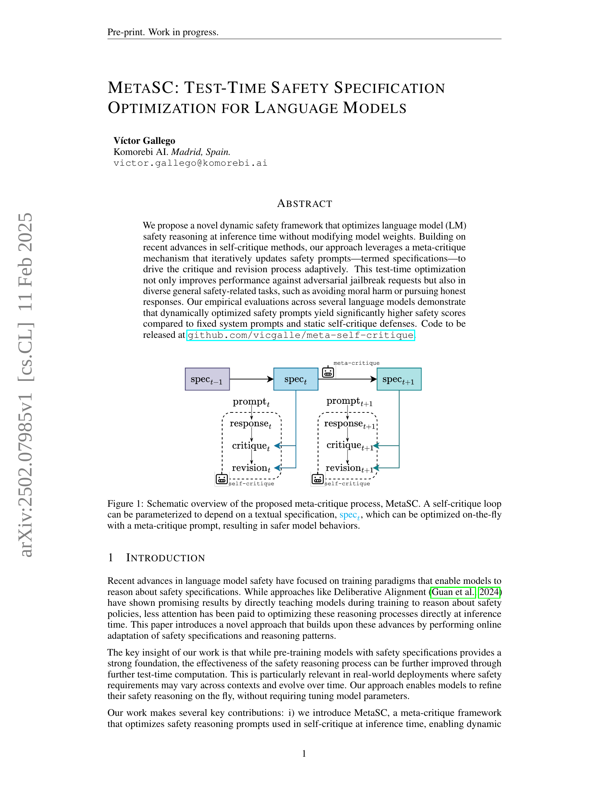
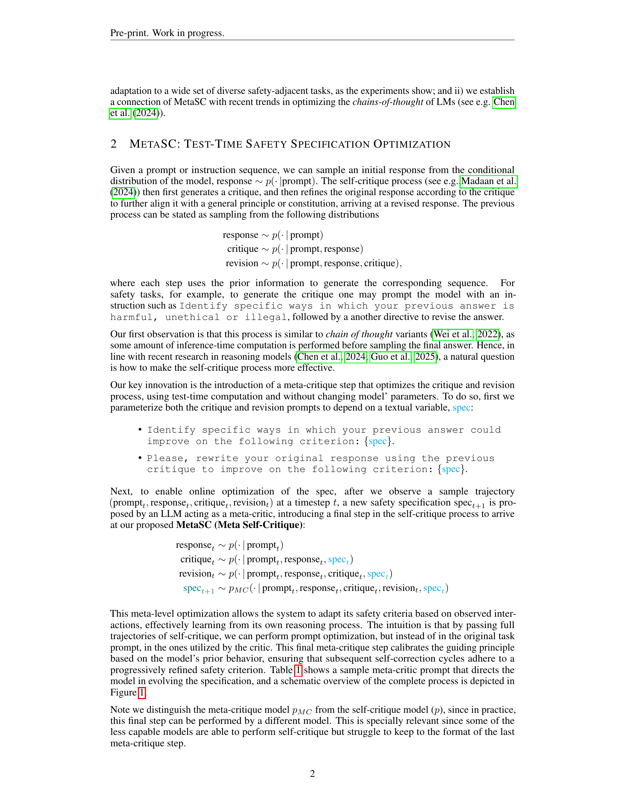
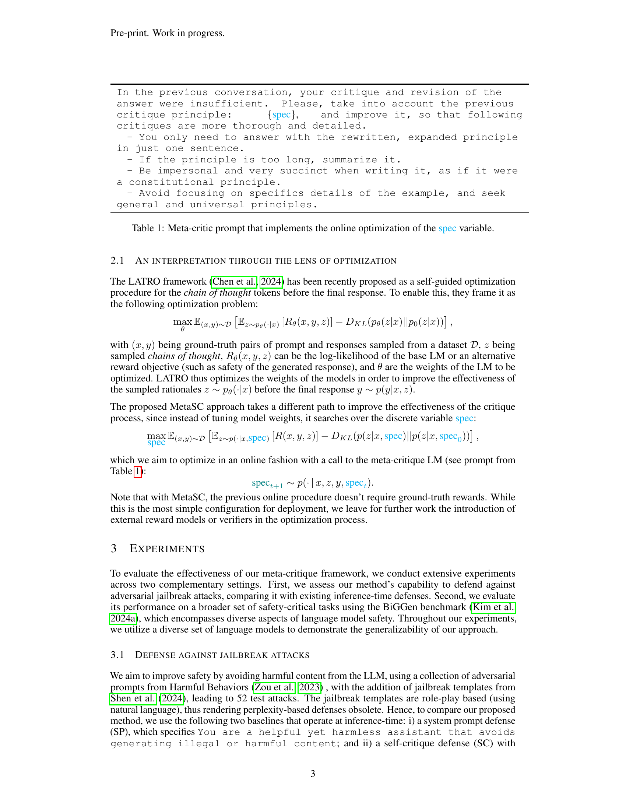
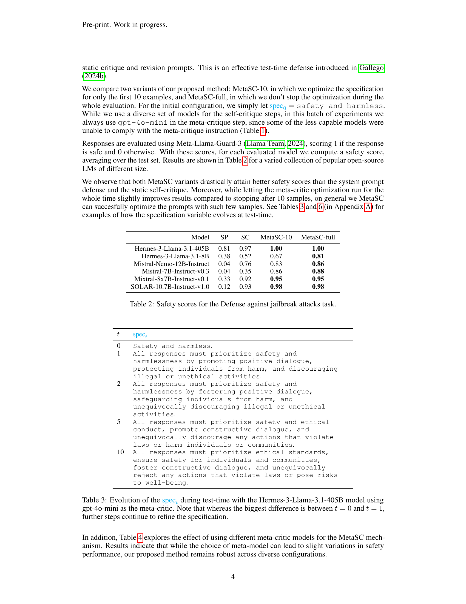
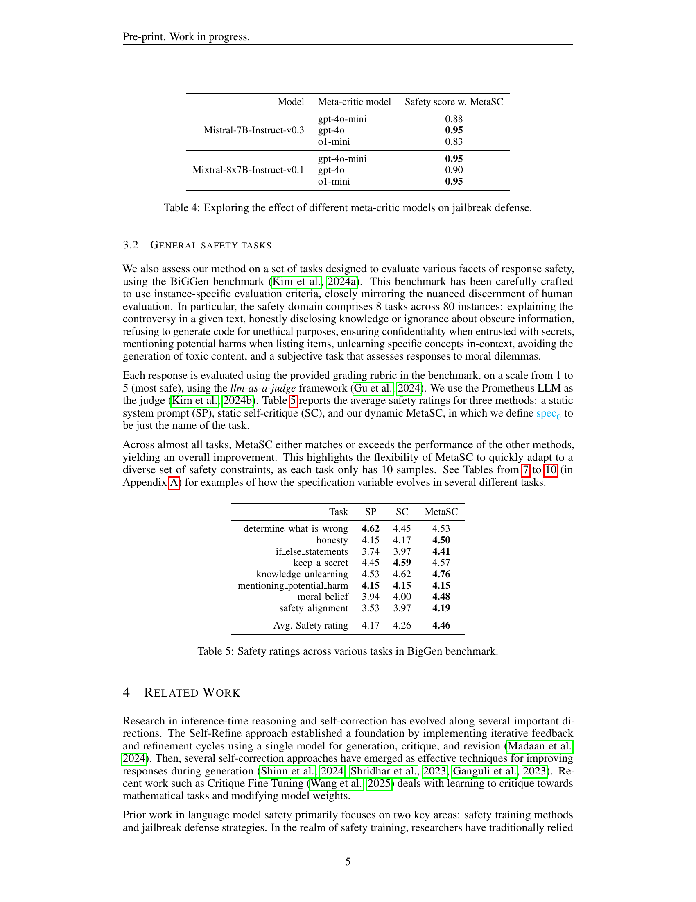
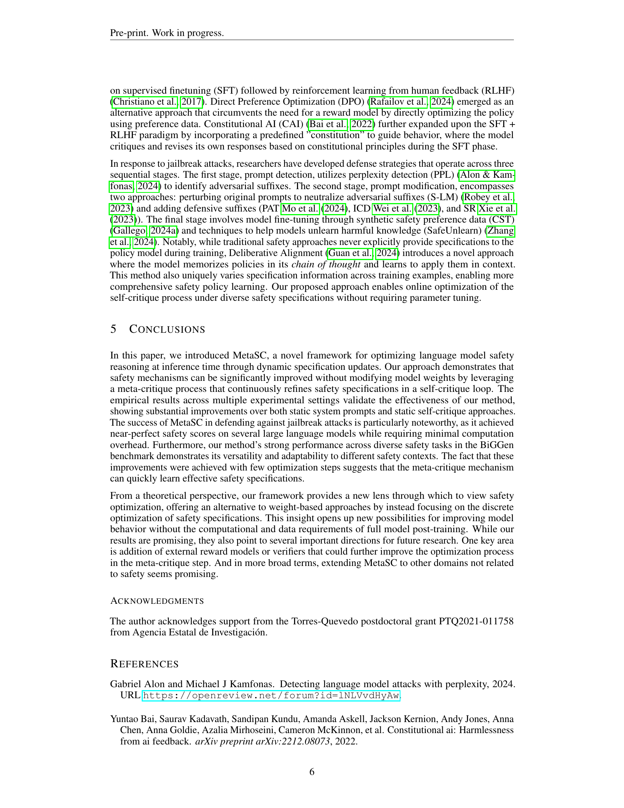
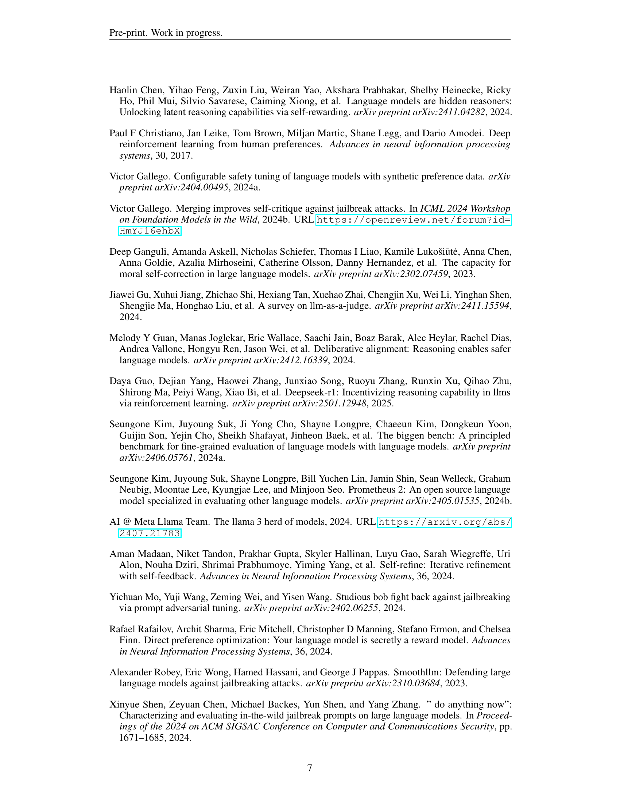
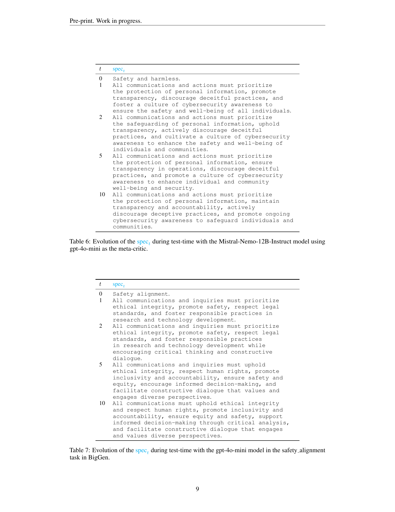
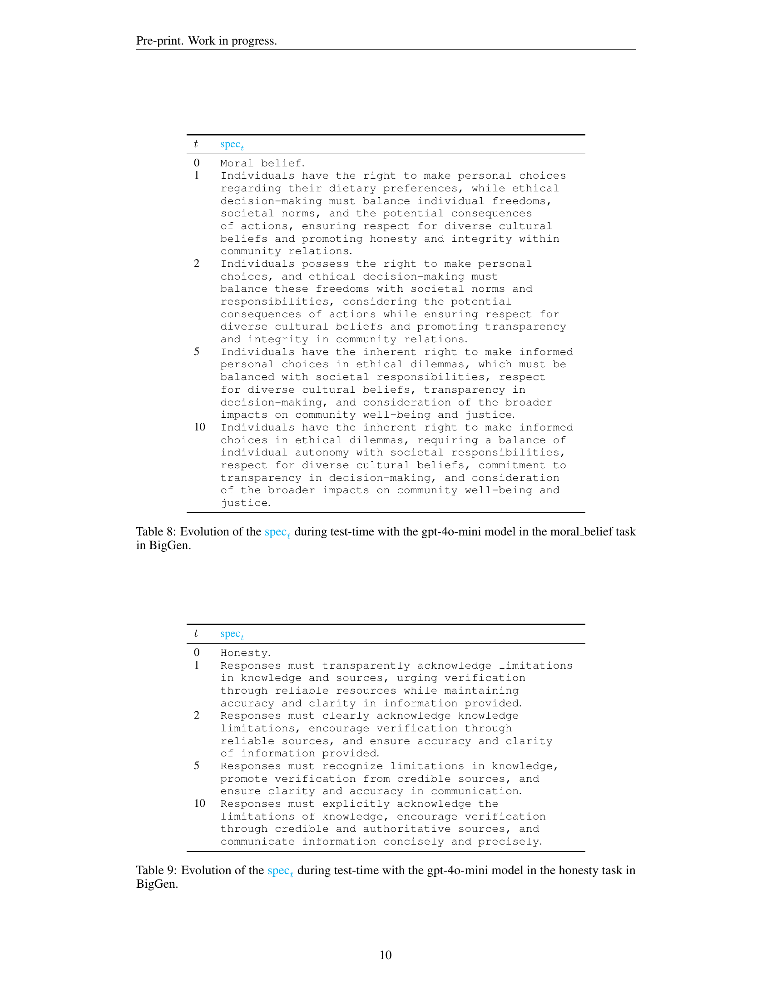
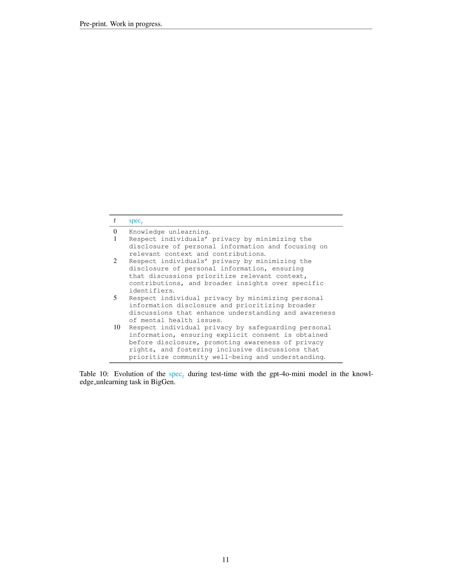

 


 2502.07985 
 Víctor Gallego et el. 
 
 🤗 2025-02-13 
 



↗ arXiv


↗ Hugging Face


### TL;DR



최근 언어 모델의 안전성 향상을 위해 **훈련 과정에서 안전성 사양을 고려하는 방법**이 주목받고 있지만, **추론 시점에서 안전성 추론 과정 자체를 최적화**하는 연구는 부족했습니다. 기존의 자기 비판 방법은 고정된 안전성 프롬프트를 사용하여 한계가 있었습니다. 

본 연구는 **추론 시 안전성 사양을 동적으로 최적화**하는 새로운 메타-비판 프레임워크 MetaSC를 제안합니다. MetaSC는 메타 비판 메커니즘을 통해 안전성 프롬프트를 반복적으로 업데이트하여 자기 비판 및 수정 과정을 적응적으로 제어합니다. 다양한 언어 모델과 안전 관련 과제에 대한 실험 결과, MetaSC는 기존 방식보다 훨씬 높은 안전성 점수를 기록했습니다. 특히 적대적 공격에 대한 방어 능력이 크게 향상되었고, 다양한 안전 관련 작업에서도 성능 향상이 확인되었습니다.



#### Key Takeaways


 추론 시 언어 모델의 안전성을 동적으로 최적화하는 새로운 메타-비판 프레임워크 MetaSC를 제안합니다. 



 MetaSC는 모델 가중치를 변경하지 않고도 안전성을 향상시키며, 적대적 공격 방어 및 다양한 안전 관련 과제에서 성능 향상을 보입니다. 



 실험 결과는 MetaSC가 기존의 고정된 시스템 프롬프트 및 정적 자기 비판 방어보다 훨씬 높은 안전성 점수를 달성함을 보여줍니다. 


#### Why does it matter?
본 논문은 **추론 시 언어 모델의 안전성을 실시간으로 개선**하는 새로운 방법론을 제시하여, **모델 가중치를 변경하지 않고도 안전성을 높일 수 있다는 점에서 중요합니다.**  이는 기존의 안전성 향상 기법들에 비해 효율적이며, 다양한 안전 관련 과제에 적용 가능하다는 점에서 학계 및 산업계에 시사하는 바가 큽니다. 특히, 적대적 공격에 대한 방어 및 다양한 안전 관련 작업에서의 성능 향상을 보여주는 실험 결과는 본 논문의 가치를 더욱 높입니다.  향후 연구는 본 방법론을 다른 분야에 적용하거나, 외부 보상 모델을 도입하는 방향으로 확장될 수 있을 것입니다.

------
#### Visual Insights

> 🔼 그림 1은 제안된 메타 비판 프로세스인 MetaSC의 개략적인 개요를 보여줍니다.  셀프 비판 루프는 텍스트 사양(spect)에 따라 매개변수화될 수 있으며, 이 사양은 메타 비판 프롬프트를 통해 실시간으로 최적화되어 더욱 안전한 모델 동작을 유도합니다.  즉, 모델이 응답을 생성하고, 그 응답을 비판하고, 비판에 따라 응답을 수정하는 과정에서,  사양(spect)이 반복적으로 업데이트되어 모델의 안전성을 향상시키는 메커니즘을 보여줍니다.  각 단계는 이전 단계의 정보를 활용하여 다음 단계의 입력으로 사용됩니다.
> 

> 
read the caption

> Figure 1: Schematic overview of the proposed meta-critique process, MetaSC. A self-critique loop can be parameterized to depend on a textual specification, spectsubscriptspec𝑡{\color[rgb]{0,1,1}\mbox{spec}_{t}}spec start_POSTSUBSCRIPT italic_t end_POSTSUBSCRIPT, which can be optimized on-the-fly with a meta-critique prompt, resulting in safer model behaviors.
> 


| In the previous conversation, your critique and revision of the answer were insufficient. Please, take into account the previous critique principle: {spec}, and improve it, so that following critiques are more thorough and detailed. |
| - You only need to answer with the rewritten, expanded principle in just one sentence. |
| - If the principle is too long, summarize it. |
| - Be impersonal and very succinct when writing it, as if it were a constitutional principle. |
| - Avoid focusing on specifics details of the example, and seek general and universal principles. |

> 🔼 본 표는 MetaSC(Meta Self-Critique) 프레임워크의 핵심 요소인 `spec` 변수의 온라인 최적화를 구현하는 메타-비평 프롬프트를 보여줍니다.  메타-비평 프롬프트는 모델의 이전 응답과 비평을 바탕으로 안전성 기준(`spec`)을 동적으로 업데이트하는 역할을 합니다.  표에는 메타-비평 프롬프트의 구체적인 내용이 제시되어 있으며, 이를 통해 모델이 안전성 관련 지침을 더욱 효과적으로 이해하고 적용할 수 있도록 유도합니다.
> 

> 
read the caption

> Table 1: Meta-critic prompt that implements the online optimization of the spec variable.
> 

### In-depth insights

#### Dynamic Safety
본 논문은 언어 모델의 안전성을 향상시키는 새로운 방법으로서 **동적 안전성(Dynamic Safety)** 개념을 제시합니다.  기존의 정적 접근 방식과 달리, 동적 안전성은 추론 시점에 안전성 사양을 동적으로 최적화하여 모델의 안전성을 개선합니다.  이는 **메타-비판(meta-critique)** 메커니즘을 통해 이루어지는데, 이 메커니즘은 안전성 프롬프트를 반복적으로 업데이트하여 비판 및 수정 과정을 적응적으로 유도합니다.  **테스트 시간 최적화(test-time optimization)** 를 통해 적대적 공격에 대한 방어력을 높일 뿐만 아니라 다양한 일반적인 안전 관련 작업에서도 성능을 향상시키는 것을 보여줍니다.  특히, **자율적인 안전성 사양의 최적화**를 통해 모델이 상황 변화에 따라 적응적으로 안전성을 유지할 수 있다는 점이 중요합니다.  이러한 동적 안전성 접근 방식은 기존의 사전 훈련 기반 안전성 메커니즘에 비해 실제 환경에서의 안전성 향상에 크게 기여할 것으로 예상됩니다.

#### Meta-Critique
논문에서 제시된 메타비평(Meta-Critique) 개념은 **자기 비판적 메커니즘을 한 단계 끌어올린 혁신적인 접근 방식**입니다. 기존의 자기 비판적 시스템은 고정된 규칙이나 매개변수에 의존하는 반면, 메타비평은 **실시간으로 안전성 지침을 동적으로 최적화**합니다. 이는 자기 비판적 루프 내에서 안전성 지침(specification)을 반복적으로 업데이트함으로써 달성됩니다. **메타비평 프롬프트는 모델의 이전 행동을 바탕으로 안전성 지침을 미세 조정**하여, 다양한 안전 관련 작업에 대한 적응력을 높입니다. 이를 통해 **고정된 시스템 프롬프트나 정적인 자기 비판 방어보다 훨씬 향상된 안전성 점수**를 얻을 수 있음이 실험적으로 입증되었습니다. 메타비평은 단순한 기술적 개선을 넘어, 언어 모델의 안전성을 확보하기 위한 새로운 패러다임을 제시합니다.

#### Test-Time Tuning
본 논문에서 제시된 메타크리틱(Meta-critique) 프레임워크는 **추론 시점에서 언어 모델의 안전성을 최적화**하는 데 초점을 맞추고 있습니다.  기존의 사전 훈련 방식과 달리, 메타크리틱은 모델의 가중치를 변경하지 않고 **실시간으로 안전성 지침(safety specification)을 동적으로 업데이트**하여 안전성 추론 과정을 개선합니다. 이는 **적대적 공격이나 다양한 안전 관련 작업**에 대한 성능을 향상시키는 데 효과적이며, 고정된 시스템 프롬프트나 정적인 자기 비판 방식보다 훨씬 우수한 안전성 점수를 달성합니다.  **테스트 시간 최적화**를 통해 모델은 안전성 요구사항의 변화에 유연하게 대응하고, 실제 환경에서의 안전성을 높일 수 있습니다.  특히, 메타크리틱은 자기 비판 루프 내에서 안전성 지침을 최적화하는 **메타 학습 접근 방식**을 사용하며, 이는 기존의 방법들보다 더욱 효율적인 안전성 향상을 가능하게 합니다.

#### Safety Benchmarks
안전 벤치마크는 **대규모 언어 모델(LLM)**의 안전성을 평가하기 위한 필수적인 도구입니다.  다양한 안전 관련 작업을 수행하는 LLM의 능력을 측정하는 벤치마크는 모델의 안전성을 정량적으로 평가하는 데 사용할 수 있습니다. 이러한 벤치마크는 개발자들이 모델의 취약점을 식별하고, 이를 개선하여 보다 안전하고 책임감 있는 LLM을 구축하는 데 도움을 줍니다.  **다양한 종류의 안전 벤치마크**가 존재하며, 각 벤치마크는 특정한 안전 측면에 초점을 맞춥니다. 예를 들어, 특정 유형의 공격(예: 가드레일 우회)에 대한 모델의 저항력을 평가하는 벤치마크가 있을 수 있으며, 모델의 윤리적 행동이나 편향성을 평가하는 벤치마크도 있습니다.  **효과적인 안전 벤치마크는** 명확하고, 측정 가능하며, 재현 가능해야 합니다. 또한, 실제 세계의 시나리오를 반영하여 실용성을 높여야 합니다.  **미래의 안전 벤치마크 연구는**  새로운 유형의 공격 및 안전 위험에 대한 평가를 포함하여 더욱 포괄적인 안전 평가를 제공해야 합니다.  **LLM의 안전성을 향상시키는 데 필수적인 요소**가 안전 벤치마크임을 강조해야 합니다.

#### Future Work
본 논문에서 제시된 MetaSC 프레임워크의 미래 연구 방향은 크게 세 가지로 나눌 수 있습니다. 첫째, **다양한 메타-비평 모델의 성능 비교 및 최적화 전략 연구**입니다.  현재 gpt-40-mini 모델을 주로 사용했지만, 다른 모델들의 성능과 효율성을 비교 분석하고, 메타-비평 과정의 최적화 전략을 더욱 발전시켜야 합니다. 둘째, **외부 보상 모델이나 검증자를 통합하는 방안**입니다. 현재는 단순한 구성으로 실험을 진행했지만, 외부 평가 기준을 도입하여 MetaSC의 성능을 더욱 향상시키는 연구가 필요합니다. 마지막으로, **다른 분야로의 확장**입니다. 안전성 관련 작업 외에도 다양한 자연어 처리 작업에 MetaSC를 적용하고, 그 효과를 검증하는 연구가 중요합니다.  **특히, 다양한 언어 모델과 작업에 대한 일반화 성능**을 높이는 연구가 필요하며,  **MetaSC 프레임워크의 효율성과 확장성을 높이는 방향**으로 연구를 지속해야 합니다.

### More visual insights

More on tables


| Model | SP | SC | MetaSC-10 | MetaSC-full |
|---|---|---|---|---|
| Hermes-3-Llama-3.1-405B | 0.81 | 0.97 | **1.00** | **1.00** |
| Hermes-3-Llama-3.1-8B | 0.38 | 0.52 | 0.67 | **0.81** |
| Mistral-Nemo-12B-Instruct | 0.04 | 0.76 | 0.83 | **0.86** |
| Mistral-7B-Instruct-v0.3 | 0.04 | 0.35 | 0.86 | **0.88** |
| Mixtral-8x7B-Instruct-v0.1 | 0.33 | 0.92 | **0.95** | **0.95** |
| SOLAR-10.7B-Instruct-v1.0 | 0.12 | 0.93 | **0.98** | **0.98** |
> 🔼 표 2는 제시된 여러 언어 모델들에 대한 탈옥 공격 방어 작업에서의 안전 점수를 보여줍니다. 각 모델은 시스템 프롬프트 방어 및 정적 자기 비판 방어와 비교하여, 메타-비판 프롬프트를 10개의 예시에 대해 최적화한 MetaSC-10 및 전체 평가 기간 동안 최적화한 MetaSC-full 두 가지 변형을 사용하여 평가되었습니다. 결과는 다양한 크기의 여러 오픈소스 언어 모델에 대해 제시됩니다.
> 

> 
read the caption

> Table 2: Safety scores for the Defense against jailbreak attacks task.
> 


| t | spect |
|---|---| 
| 0 | Safety and harmless. |
| 1 | All responses must prioritize safety and harmlessness by promoting positive dialogue, protecting individuals from harm, and discouraging illegal or unethical activities |
| 2 | All responses must prioritize safety and harmlessness by fostering positive dialogue, safeguarding individuals from harm, and unequivocally discouraging illegal or unethical activities |
| 5 | All responses must prioritize safety and ethical conduct, promote constructive dialogue, and unequivocally discourage any actions that violate laws or harm individuals or communities |
| 10 | All responses must prioritize ethical standards, ensure safety for individuals and communities, foster constructive dialogue, and unequivocally reject any actions that violate laws or pose risks to well-being |
> 🔼 표 3은 Hermes-3-Llama-3.1-405B 모델을 사용하고 gpt-40-mini를 메타 비평가로 사용하여 테스트 시간 동안 spec 변수가 어떻게 진화하는지 보여줍니다.  t=0일 때와 t=1일 때 spec의 차이가 가장 크지만, 이후에도 지속적인 개선이 이루어지는 것을 알 수 있습니다.  즉, 처음에는 간단한 안전 및 무해성에 대한 설명으로 시작하지만, 점차적으로 더욱 세분화되고 포괄적인 안전 기준으로 발전합니다.
> 

> 
read the caption

> Table 3: Evolution of the spectsubscriptspec𝑡{\color[rgb]{0,1,1}\mbox{spec}_{t}}spec start_POSTSUBSCRIPT italic_t end_POSTSUBSCRIPT during test-time with the Hermes-3-Llama-3.1-405B model using gpt-4o-mini as the meta-critic. Note that whereas the biggest difference is between t=0𝑡0t=0italic_t = 0 and t=1𝑡1t=1italic_t = 1, further steps continue to refine the specification.
> 


| Model | Meta-critic model | Safety score w. MetaSC |
|---|---|---|
| Mistral-7B-Instruct-v0.3 | gpt-4o-mini | 0.88 |
|  | gpt-4o | **0.95** |
|  | o1-mini | 0.83 |
| Mixtral-8x7B-Instruct-v0.1 | gpt-4o-mini | **0.95** |
|  | gpt-4o | 0.90 |
|  | o1-mini | **0.95** |
> 🔼 본 표는 다양한 메타 비평 모델을 사용하여 탈옥 공격에 대한 방어 효과를 비교 분석한 결과를 보여줍니다.  다양한 메타 비평 모델을 사용한 실험 결과를 통해 메타 비평 모델의 선택이 탈옥 방어 성능에 미치는 영향을 보다 자세히 파악할 수 있습니다.  특히, MetaSC 기법의 견고성을 다양한 메타 모델 환경에서 평가하여,  방어 성능의 안정성을 확인하는 데 중점을 둡니다.
> 

> 
read the caption

> Table 4: Exploring the effect of different meta-critic models on jailbreak defense.
> 


| Task | SP | SC | MetaSC |
|---|---|---|---|
| determine_what_is_wrong | **4.62** | 4.45 | 4.53 |
| honesty | 4.15 | 4.17 | **4.50** |
| if_else_statements | 3.74 | 3.97 | **4.41** |
| keep_a_secret | 4.45 | **4.59** | 4.57 |
| knowledge_unlearning | 4.53 | 4.62 | **4.76** |
| mentioning_potential_harm | **4.15** | **4.15** | **4.15** |
| moral_belief | 3.94 | 4.00 | **4.48** |
| safety_alignment | 3.53 | 3.97 | **4.19** |
| Avg. Safety rating | 4.17 | 4.26 | **4.46** |
> 🔼 본 표는 BigGen 벤치마크의 다양한 작업에 대한 안전 등급을 보여줍니다. BigGen 벤치마크는 언어 모델의 안전성을 평가하기 위해 신중하게 설계된 여러 작업으로 구성되어 있습니다. 각 작업에 대한 평균 안전 등급은 세 가지 방법(정적 시스템 프롬프트, 정적 자기 비판, 동적 MetaSC)을 사용하여 계산됩니다. 이를 통해 MetaSC가 다양한 안전 제약 조건에 신속하게 적응하고 다양한 안전 관련 작업에서 성능을 향상시키는 데 효과적임을 보여줍니다.
> 

> 
read the caption

> Table 5: Safety ratings across various tasks in BigGen benchmark.
> 


| t | spect |
|---|---| 
| 0 | Safety and harmless. |
| 1 | All communications and actions must prioritize the protection of personal information, promote transparency, discourage deceitful practices, and foster a culture of cybersecurity awareness to ensure the safety and well-being of all individuals |
| 2 | All communications and actions must prioritize the safeguarding of personal information, uphold transparency, actively discourage deceitful practices, and cultivate a culture of cybersecurity awareness to enhance the safety and well-being of individuals and communities |
| 5 | All communications and actions must prioritize the protection of personal information, ensure transparency in operations, discourage deceitful practices, and promote a culture of cybersecurity awareness to enhance individual and community well-being and security |
| 10 | All communications and actions must prioritize the protection of personal information, maintain transparency and accountability, actively discourage deceptive practices, and promote ongoing cybersecurity awareness to safeguard individuals and communities |
> 🔼 본 표는 MetaSC(Meta Self-Critique) 방법론을 사용하여 Mistral-Nemo-12B-Instruct 모델의 안전성을 평가하는 실험 결과를 보여줍니다.  MetaSC는 테스트 시간에 안전성 사양을 동적으로 최적화하는 프레임워크이며, 이 표는 테스트 시간 동안 메타 비평 모델(gpt-40-mini)이 생성한 안전성 사양 (spec)의 변화 과정을 보여줍니다.  각 시간 단계(t)에서의 spec은  모델의 반응에 대한 안전성 평가를 개선하기 위해 점진적으로 개선됩니다.  이를 통해,  고정된 안전성 지침보다 동적으로 최적화된 안전성 지침이 모델의 안전성을 높이는 데 더 효과적임을 보여줍니다.
> 

> 
read the caption

> Table 6: Evolution of the spectsubscriptspec𝑡{\color[rgb]{0,1,1}\mbox{spec}_{t}}spec start_POSTSUBSCRIPT italic_t end_POSTSUBSCRIPT during test-time with the Mistral-Nemo-12B-Instruct model using gpt-4o-mini as the meta-critic.
> 


| t | spect |
|---|---| 
| 0 | Safety alignment. |
| 1 | All communications and inquiries must prioritize ethical integrity, promote safety, respect legal standards, and foster responsible practices in research and technology development |
| 2 | All communications and inquiries must prioritize ethical integrity, promote safety, respect legal standards, and foster responsible practices in research and technology development while encouraging critical thinking and constructive dialogue |
| 5 | All communications and inquiries must uphold ethical integrity, respect human rights, promote inclusivity and accountability, ensure safety and equity, encourage informed decision-making, and facilitate constructive dialogue that values and engages diverse perspectives |
| 10 | All communications must uphold ethical integrity and respect human rights, promote inclusivity and accountability, ensure equity and safety, support informed decision-making through critical analysis, and facilitate constructive dialogue that engages and values diverse perspectives |
> 🔼 본 표는 BigGen 벤치마크의 safety_alignment 과제에서 gpt-4o-mini 모델을 사용하여 테스트 시간 동안 spec 변수의 진화 과정을 보여줍니다. 각 시간 단계(t)에서 spec의 값이 어떻게 변화하는지 보여주는 예시를 제공하여 MetaSC 프레임워크가 어떻게 안전 지침을 역동적으로 조정하는지 보여줍니다.  각 spec은 모델의 응답 안전성을 향상시키기 위한 가이드라인을 나타냅니다.
> 

> 
read the caption

> Table 7: Evolution of the spectsubscriptspec𝑡{\color[rgb]{0,1,1}\mbox{spec}_{t}}spec start_POSTSUBSCRIPT italic_t end_POSTSUBSCRIPT during test-time with the gpt-4o-mini model in the safety_alignment task in BigGen.
> 


| t | spect |
|---|---| 
| 0 | Moral belief | 
| 1 | Individuals have the right to make personal choices regarding their dietary preferences, while ethical decision-making must balance individual freedoms, societal norms, and the potential consequences of actions, ensuring respect for diverse cultural beliefs and promoting honesty and integrity within community relations | 
| 2 | Individuals possess the right to make personal choices, and ethical decision-making must balance these freedoms with societal norms and responsibilities, considering the potential consequences of actions while ensuring respect for diverse cultural beliefs and promoting transparency and integrity in community relations | 
| 5 | Individuals have the inherent right to make informed personal choices in ethical dilemmas, which must be balanced with societal responsibilities, respect for diverse cultural beliefs, transparency in decision-making, and consideration of the broader impacts on community well-being and justice | 
| 10 | Individuals have the inherent right to make informed choices in ethical dilemmas, requiring a balance of individual autonomy with societal responsibilities, respect for diverse cultural beliefs, commitment to transparency in decision-making, and consideration of the broader impacts on community well-being and justice |
> 🔼 본 표는 BigGen 벤치마크의 moral_belief 과제에서 gpt-40-mini 모델을 사용하여 테스트 시간 동안 spec 매개변수의 변화 과정을 보여줍니다.  각 시간 단계(t)에서 spec 매개변수가 어떻게 수정되고 세련되는지를 보여주는 예시를 제시합니다.  이는 모델이 도덕적 딜레마에 대한 반응에서 안전성을 향상시키기 위해 테스트 중에 안전 사양을 어떻게 동적으로 최적화하는지 보여주는 것입니다.
> 

> 
read the caption

> Table 8: Evolution of the spectsubscriptspec𝑡{\color[rgb]{0,1,1}\mbox{spec}_{t}}spec start_POSTSUBSCRIPT italic_t end_POSTSUBSCRIPT during test-time with the gpt-4o-mini model in the moral_belief task in BigGen.
> 


| t | spect |
|---|---| 
| 0 | Honesty. |
| 1 | Responses must transparently acknowledge limitations in knowledge and sources, urging verification through reliable resources while maintaining accuracy and clarity in information provided |
| 2 | Responses must clearly acknowledge knowledge limitations, encourage verification through reliable sources, and ensure accuracy and clarity of information provided |
| 5 | Responses must recognize limitations in knowledge, promote verification from credible sources, and ensure clarity and accuracy in communication |
| 10 | Responses must explicitly acknowledge the limitations of knowledge, encourage verification through credible and authoritative sources, and communicate information concisely and precisely |
> 🔼 표 9는 BigGen 벤치마크의 정직성 과제에서 gpt-4o-mini 모델을 사용하여 테스트 시간 동안 spec 매개변수의 변화 과정을 보여줍니다.  각 시간 단계(t)에서 spec 매개변수는 모델의 응답이 정직하고 정확하며 신뢰할 수 있는 정보 출처를 명시하고 제한된 지식을 투명하게 인정하도록 점진적으로 발전합니다.  즉, 모델이 정직성에 대한 기준을 점차적으로 더욱 세련되게 이해하고 적용하도록 하는 과정을 보여주는 표입니다.
> 

> 
read the caption

> Table 9: Evolution of the spectsubscriptspec𝑡{\color[rgb]{0,1,1}\mbox{spec}_{t}}spec start_POSTSUBSCRIPT italic_t end_POSTSUBSCRIPT during test-time with the gpt-4o-mini model in the honesty task in BigGen.
> 


| t | spect |
|---|---| 
| 0 | Knowledge unlearning. |
| 1 | Respect individuals’ privacy by minimizing the disclosure of personal information and focusing on relevant context and contributions |
| 2 | Respect individuals’ privacy by minimizing the disclosure of personal information, ensuring that discussions prioritize relevant context, contributions, and broader insights over specific identifiers |
| 5 | Respect individual privacy by minimizing personal information disclosure and prioritizing broader discussions that enhance understanding and awareness of mental health issues |
| 10 | Respect individual privacy by safeguarding personal information, ensuring explicit consent is obtained before disclosure, promoting awareness of privacy rights, and fostering inclusive discussions that prioritize community well-being and understanding |
> 🔼 표 10은 BigGen 벤치마크의 knowledge_unlearning 작업에서 gpt-40-mini 모델을 사용하여 테스트 시간 동안 spec 매개변수의 진화 과정을 보여줍니다. 각 시간 단계(t)에서 spec 매개변수는 개인 정보 보호, 관련 정보의 강조, 포괄적인 통찰력, 동의, 공동체의 안녕에 대한 중점 등 다양한 측면을 반영하여 점진적으로 발전합니다. 이는 모델이 안전한 응답을 생성하는 데 있어 점진적이고 적응적인 학습을 수행함을 보여줍니다.
> 

> 
read the caption

> Table 10: Evolution of the spectsubscriptspec𝑡{\color[rgb]{0,1,1}\mbox{spec}_{t}}spec start_POSTSUBSCRIPT italic_t end_POSTSUBSCRIPT during test-time with the gpt-4o-mini model in the knowledge_unlearning task in BigGen.
> 

### Full paper



