 


 2502.08127 
 Lingfei Qian et el. 
 
 🤗 2025-02-13 
 



↗ arXiv


↗ Hugging Face


### TL;DR



최근 **거대 언어 모델(LLM)**의 발전으로 인해 일반적인 추론 능력이 향상되었지만, **금융 분야**에서는 아직 그 효과가 제대로 연구되지 않았습니다. 본 논문에서는 16개의 강력한 추론 및 일반 LLM을 세 가지 복잡한 금융 과제(금융 텍스트, 표 형태 데이터, 방정식 포함)에 대해 평가하여, 수치적 추론, 표 해석, 금융 용어 이해, 장문 컨텍스트 처리, 방정식 기반 문제 해결 능력을 평가했습니다. 그 결과, 더 나은 데이터셋과 사전 훈련이 금융 추론에 도움이 되지만, CoT(Chain of Thought) 미세 조정과 같은 일반적인 향상은 항상 효과적인 것은 아니며 모든 추론 전략이 장문 컨텍스트 및 다중 테이블 과제에서 어려움을 겪는다는 것을 발견했습니다.

본 연구에서는 이러한 한계를 해결하기 위해, Llama-3.1-8B-Instruct 기반의 **금융 추론 강화 모델 Fino1**을 개발했습니다.  CoT 미세 조정과 도메인 특화 추론 경로를 사용한 강화 학습을 통해, 하나의 금융 데이터셋으로 미세 조정만으로도 모든 과제에서 일관되게 10%의 성능 향상을 달성하여 8B 모델을 능가하고 Llama3-70B-Instruct 및 Llama3.1-70B-Instruct 모델보다 평균적으로 더 나은 성능을 보였습니다. 이를 통해 **금융 과제에 특화된 적응의 필요성**을 강조하고, 다중 테이블 추론, 장문 컨텍스트 처리, 금융 용어 이해 등 향후 연구 방향을 제시합니다.



#### Key Takeaways


 일반적인 추론 향상 전략은 금융 과제에 일관되게 효과적이지 않음 



 금융 특화 데이터를 사용한 추론 강화는 모든 과제에서 일관된 성능 향상을 가져옴 



 Fino1 모델은 단순한 미세 조정만으로도 기존 8B 모델 및 대규모 모델을 능가하는 성능을 달성함 


#### Why does it matter?
본 논문은 **금융 분야에서의 추론 강화된 거대 언어 모델(LLM)의 전이성**을 종합적으로 평가하고, 이러한 모델의 강점과 한계를 밝히는 동시에 **금융 특화 추론 모델(Fino1)** 개발을 통해 성능 향상을 이끌어냈다는 점에서 중요합니다. 이는 금융 AI 연구의 새로운 지평을 열고, 향후 연구 방향을 제시하여 **금융 분야의 LLM 적용에 대한 심도 있는 이해**를 제공합니다.  특히, **도메인 특화 미세 조정의 중요성**과 **장문의 금융 텍스트 및 다중 테이블 처리의 어려움**을 강조하여, 금융 AI 연구자들에게 실질적인 함의를 제공합니다.

------
#### Visual Insights

> 🔼 그림 1은 본 논문의 오류 분석(Error Analysis) 부분에서 언급된 DeepSeek-R1 모델의 잘못된 추론 사례를 보여줍니다. 질문은 2017년, 2016년, 2015년에 취소된 스톡옵션의 총액을 묻고 있지만, DeepSeek-R1 모델은 각 연도별로 취소된 옵션의 개수를 나열하는 등 질문의 요구사항을 정확히 반영하지 못하고 불필요한 정보까지 제시하여 잘못된 답변을 도출했습니다.  올바른 답은 12.1인데 반해 모델은 각 연도별로 4.6, 5.5, 2.0이라는 답변을 제시했습니다. 이는 모델이 복잡한 질문에 대한 논리적 추론 능력이 부족함을 보여주는 예시입니다.
> 

> 
read the caption

> Figure 1: Error case 1.
> 


| Dataset | Size | Data Types | Average Token |
|---|---|---|---| 
| FinQA | 1100 | Tables and Texts | 1,128 |
| DM-Simplong | 100 | Tables and Texts | 4,330 |
| XBRL-Math | 90 | Texts and Equations | 397 |

> 🔼 본 논문에서 사용된 세 가지 데이터셋(FinQA, DM-Simplong, XBRL-Math)에 대한 개요를 보여줍니다. 각 데이터셋의 크기, 데이터 유형(표와 텍스트, 또는 방정식 포함), 평균 토큰 수를 포함하여 모델의 재무 추론 능력을 평가하는 데 사용된 다양한 측면을 보여줍니다.
> 

> 
read the caption

> Table 1: Overview of the datasets used in the study.
> 

### In-depth insights

#### LLM Transferability
본 논문은 **LLM(대규모 언어 모델)의 전이 학습 능력**, 특히 **금융 분야로의 적용 가능성**에 대한 심층적인 분석을 제시합니다.  **일반적인 추론 능력 향상 기법들이 금융 분야 특유의 과제(전문 용어, 복잡한 표, 방정식 등)에 효과적으로 적용되는지**를 다양한 모델과 데이터셋을 통해 평가합니다.  결과적으로, **일반적인 추론 향상 기법은 금융 분야에 항상 효과적인 것은 아니며, 도메인 특화된 미세 조정이 중요함**을 보여줍니다.  **특히, 금융 데이터를 활용한 미세 조정을 통해 성능이 크게 향상**됨을 확인하여, **LLM의 전이 학습은 도메인 특화된 데이터와 학습 전략이 필수적**임을 시사합니다.  이러한 연구 결과는 금융 AI 발전에 중요한 시사점을 제공하며, 향후 연구 방향을 제시합니다.

#### Financial Reasoning
본 논문은 **금융 추론**에 대한 심도있는 분석을 제공합니다.  **대규모 언어 모델(LLM)**이 일반적인 추론 작업에서는 뛰어난 성능을 보이지만, 금융 영역에서는 여전히 미개척 분야임을 강조합니다.  **금융 데이터의 특수성** (전문 용어, 규정, 경제 원리 등)을 고려하여, 기존의 일반적인 추론 전략만으로는 금융 과제 해결에 한계가 있음을 보여줍니다.  특히 **장문의 텍스트, 복잡한 표, 방정식** 등을 포함하는 복합적인 금융 문제에 대한 해결 능력이 부족함을 지적합니다.  따라서 **도메인 특화적 적응**의 중요성을 강조하며, **금융 데이터를 활용한 미세 조정**을 통해 성능 향상을 도모하는 방향을 제시합니다.  **단순한 미세 조정만으로도 성능이 크게 향상될 수 있음**을 실험 결과를 통해 입증하며, **추후 연구 방향**으로는 다양한 금융 데이터셋을 활용한 더욱 심도있는 연구와 **장문 텍스트 처리, 다중 테이블 추론, 금융 전문 용어 이해 능력 향상**에 대한 연구가 필요함을 제시합니다.

#### CoT Fine-tuning
본 논문에서 "CoT Fine-tuning"은 **대규모 언어 모델(LLM)의 추론 능력 향상을 위한 중요한 기술**로 제시됩니다.  **Chain-of-Thought(CoT) 방식**은 모델이 복잡한 문제를 해결하기 위해 단계별 추론 과정을 거치도록 유도하는 기법입니다.  CoT Fine-tuning은 이러한 CoT 방식을 모델 학습 과정에 통합하여 **모델의 추론 성능을 개선**하는 데 초점을 맞춥니다.  **도메인 특화된 CoT 경로**를 사용하는 미세 조정은 일반적인 CoT 미세 조정보다 금융 관련 과제에서 더 나은 성능을 보이는 것으로 나타났습니다. 이는 **금융 데이터의 특수성을 고려한 도메인 적응**의 중요성을 보여줍니다.  따라서, 효과적인 금융 추론 모델 개발을 위해서는 **도메인 지식과 CoT Fine-tuning 기술의 결합**이 필수적임을 시사합니다.  **다양한 금융 데이터셋과 모델 아키텍처**를 활용한 추가 연구를 통해 CoT Fine-tuning의 효과를 더욱 심층적으로 탐구할 필요가 있습니다.

#### Fino1 Model
본 논문에서 제시된 Fino1 모델은 **기존의 대규모 언어 모델(LLM)의 한계를 극복**하기 위해 고안된 **금융 특화형 추론 모델**입니다.  Llama-3.1-8B-Instruct 모델을 기반으로 하며, **CoT(Chain-of-Thought) 파인튜닝과 강화 학습**을 통해 금융 특징을 반영한 추론 경로를 학습합니다.  특히, **GPT-4의 추론 경로를 활용**하여  Fino1 모델은 단순한 파인튜닝만으로도 기존 8B 모델들을 능가하고, 심지어 일부 70B 모델들과도 비슷한 성능을 보여줍니다.  **금융 특화 데이터셋을 사용**한 것이 **성능 향상**에 중요한 역할을 했음을 시사합니다.  하지만, **다양한 금융 데이터셋**을 활용하거나 더욱 확장된 모델을 사용한다면 성능이 더욱 향상될 가능성이 있습니다.  **장문의 금융 문서나 복잡한 표 데이터 처리**에는 아직 한계가 있으므로, 앞으로의 연구 방향으로 제시되고 있습니다.

#### Future Directions
본 논문의 "미래 방향" 부분은 **금융 영역에서의 LLM의 성능 향상을 위한 세 가지 핵심 과제**를 제시합니다. 첫째, **금융 지식과 전문 용어에 대한 모델의 이해도를 높이는 것**입니다. 일반적인 추론 능력 향상은 금융 특화 과제에 항상 효과적이지 않으므로, 금융 관련 코퍼스, 구조화된 보고서, 규제 문서 등을 활용한 학습 전략이 필요합니다. 둘째, **다중 표 및 장문의 금융 맥락을 처리하는 모델의 능력 개선**입니다. 장문의 보고서와 여러 표를 참조해야 하는 금융 과제에서 LLM의 성능이 저하되는 현상을 해결하기 위해서는, 표 간의 논리적 관계를 추론하거나, 장문 맥락을 효율적으로 기억하는 기법이 필요합니다. 셋째, **GPT-01 및 DeepSeek-R1과 같은 모델에서 사용되는 추론 강화 전략에 대한 심층 분석**을 통해 개선 방향을 모색해야 합니다.  일반적인 추론 전략만으로는 금융 과제에 항상 효과적이지 않으므로, 금융 특화 데이터 및 모델 아키텍처를 고려한 최적화된 추론 전략이 요구됩니다.

### More visual insights

More on tables


| Model Name | Parameters | Reasoning Enhanced | Context Window Size | Close/Open Source | Reasoning Enhanced Training Data |
|---|---|---|---|---|---| 
| GPT-4o | Unknown | No | 128k | Closed | - |
| GPT-o1 | Unknown | Yes | 128k | Closed | Public and properity data (Human-annotated CoT, MCTS-assisted Synthetic data) |
| GPT-o3-mini | Unknown | Yes | 128k | Closed | Public and properity data |
| DeepSeek-V3 | 671B | No | 128k | Open | - |
| DeepSeek-R1 | 671B | Yes | 128k | Open | Cold-start data generation, post-processing data |
| Qwen2.5-72B-Instruct | 72B | No | 128k | Open | - |
| Qwen2.5-72B-Instruct-Math | 72B | Yes | 128k | Open | Synthetic data from Qwen, high-quality mathematical data, CoT, TIR |
| DeepSeek-R1-Distill-Llama-70B | 70B | Yes | 128k | Open | Distilled from R1 |
| Llama3-70B-Instruct | 70B | No | 8k | Open | - |
| Llama3.1-70B-Instruct | 70B | No | 128k | Open | - |
| Llama3.3-70B-Instruct | 70B | No | 128k | Open | - |
| DeepSeek-R1-Distill-Qwen-32B | 32B | Yes | 128k | Open | Distilled from R1 |
| DeepSeek-R1-Distill-Qwen-14B | 14B | Yes | 128k | Open | Distilled from R1 |
| DeepSeek-R1-Distill-Llama-8B | 8B | Yes | 128k | Open | Distilled from R1 |
| Llama3-8B-Instruct | 8B | No | 8k | Open | - |
| Llama3.1-8B-Instruct | 8B | No | 128k | Open | - |
> 🔼 표 2는 본 논문에서 평가한 대규모 언어 모델들의 요약 정보를 보여줍니다. 모델의 매개변수 크기, 추론 능력, 입력 길이 제한, 출처(오픈 소스 여부), 그리고 사용된 추론 향상 전략 등을 포함하고 있습니다.  MCTS는 Monte Carlo Tree Search, CoT는 Chain-of-Thought 추론, TIR은 Tool-Integrated Reasoning을 의미합니다.  각 모델의 특징을 한눈에 파악하여 비교 분석하는 데 유용합니다.
> 

> 
read the caption

> Table 2: Summary of evaluated large language models, including their parameter sizes, reasoning capabilities, input limits, source availability, and reasoning enhancement strategies. MCTS refers to Monte Carlo Tree Search. CoT refers to chain-of-thought reasoning. TIR means tool-integrated reasoning.
> 


| Models | FinQA | DM-Simplong | XBRL-Math | Average |
|---|---|---|---|---|
| GPT-4o | 72.49 | 60.00 | 72.22 | 68.24 |
| GPT-o1 | 49.07 | 56.00 | 74.44 | 59.84 |
| GPT-o3-mini | 60.87 | 59.00 | 76.67 | 65.51 |
| DeepSeek-V3 | 73.20 | 53.00 | 76.67 | 67.62 |
| DeepSeek-R1 | 65.13 | 53.00 | 86.67 | 68.93 |
| Qwen2.5-72B-Instruct | 73.38 | 59.00 | 67.78 | 66.72 |
| Qwen2.5-72B-Instruct-Math | 69.74 | 42.00 | 83.33 | 65.69 |
| DeepSeek-R1-Distill-Llama-70B | 66.73 | 53.00 | 86.67 | 68.80 |
| Llama3-70B-Instruct | 58.92 | 41.00 | 56.67 | 52.20 |
| Llama3.1-70B-Instruct | 63.18 | 48.00 | 63.33 | 58.17 |
| Llama3.3-70B-Instruct | 68.15 | 54.00 | 70.00 | 64.05 |
| DeepSeek-R1-Distill-Qwen-32B | 65.48 | 55.00 | 84.44 | 68.97 |
| DeepSeek-R1-Distill-Qwen-14B | 63.27 | 44.00 | 84.44 | 63.90 |
| DeepSeek-R1-Distill-Llama-8B | 45.96 | 33.00 | 81.11 | 53.36 |
| Llama3-8B-Instruct | 41.97 | 29.00 | 48.89 | 39.95 |
| Llama3.1-8B-Instruct | 54.13 | 34.00 | 62.22 | 50.12 |
| Fino1-8B | 60.87 | 40.00 | 82.22 | 61.03 |
> 🔼 표 3은 세 가지 금융 데이터 세트(FinQA, DM-Simplong, XBRL-Math)에서 다양한 크기와 기능(일반 및 추론 향상)을 가진 16개의 대규모 언어 모델(LLM)의 성능을 비교 분석한 표입니다.  각 모델의 FinQA, DM-Simplong, XBRL-Math 데이터 세트에 대한 정확도 점수와 평균 점수를 보여줍니다. 이 표는 다양한 LLM 아키텍처와 추론 전략의 금융 데이터 처리 능력을 평가하는 데 도움이 됩니다.
> 

> 
read the caption

> Table 3: Performance of different LLMs on three tested financial datasets.
> 

### Full paper


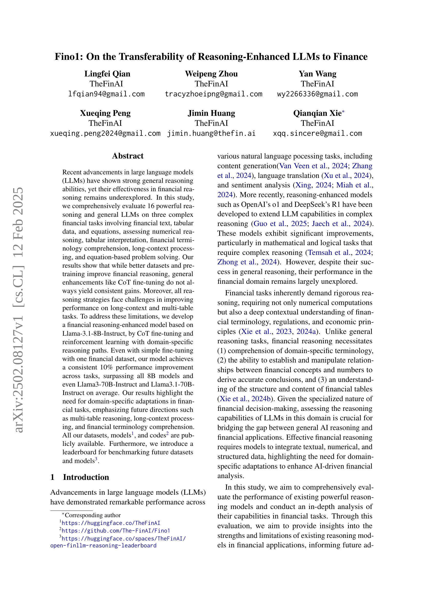
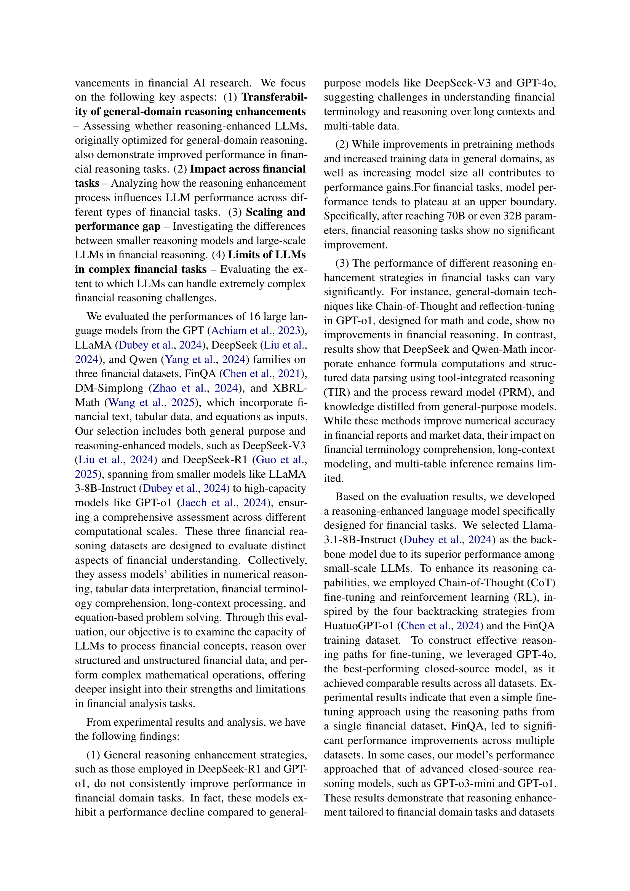
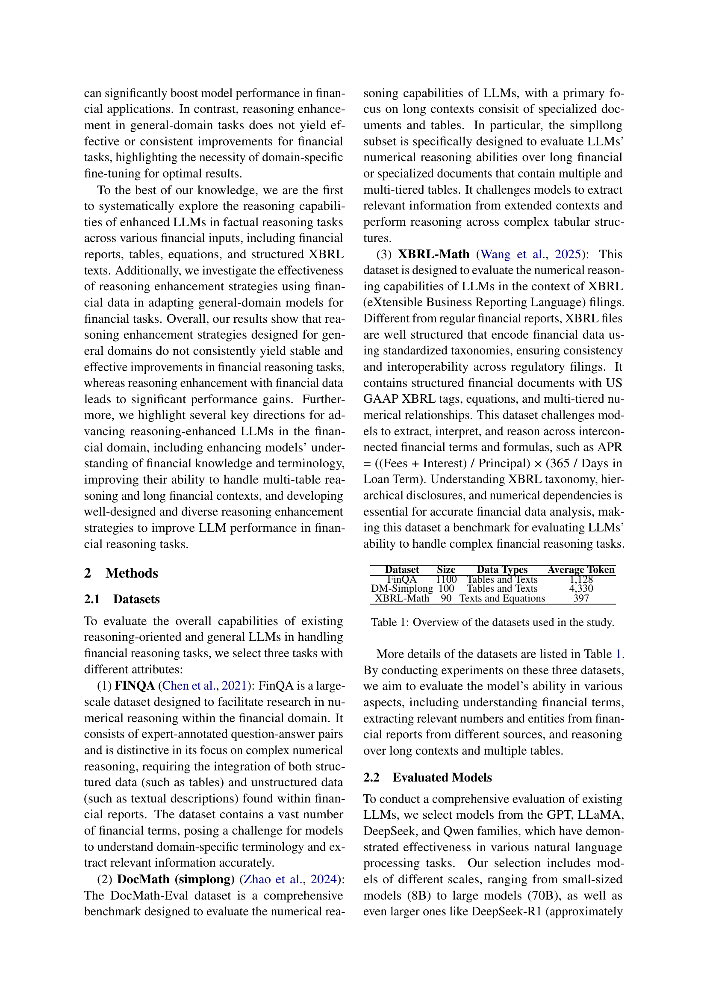

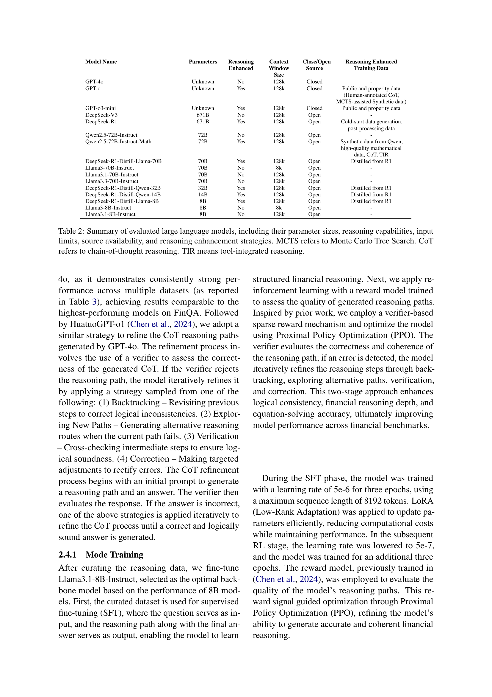
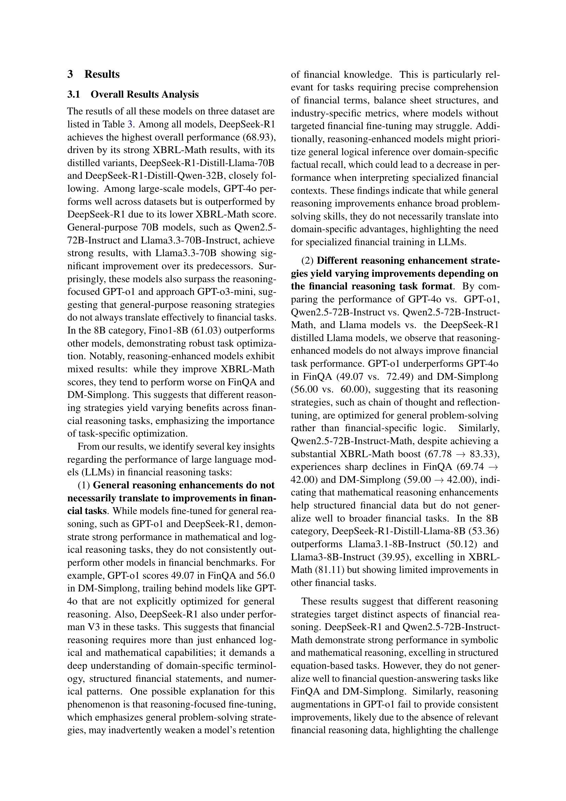
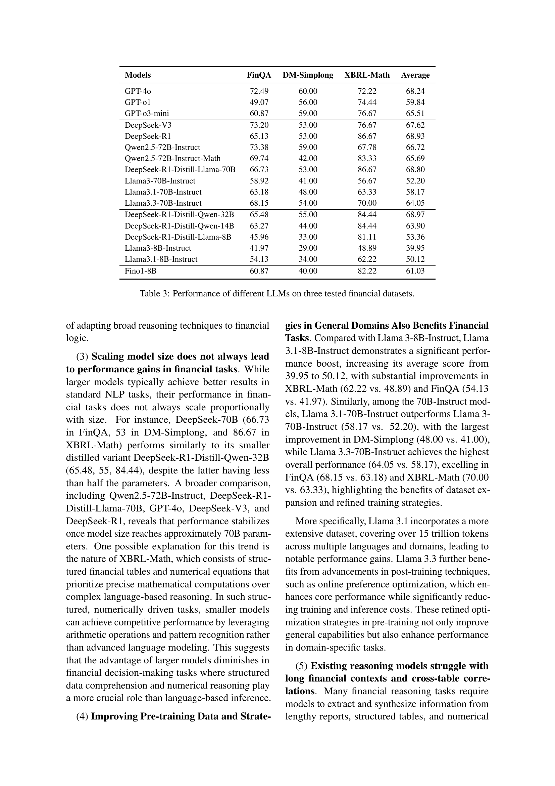
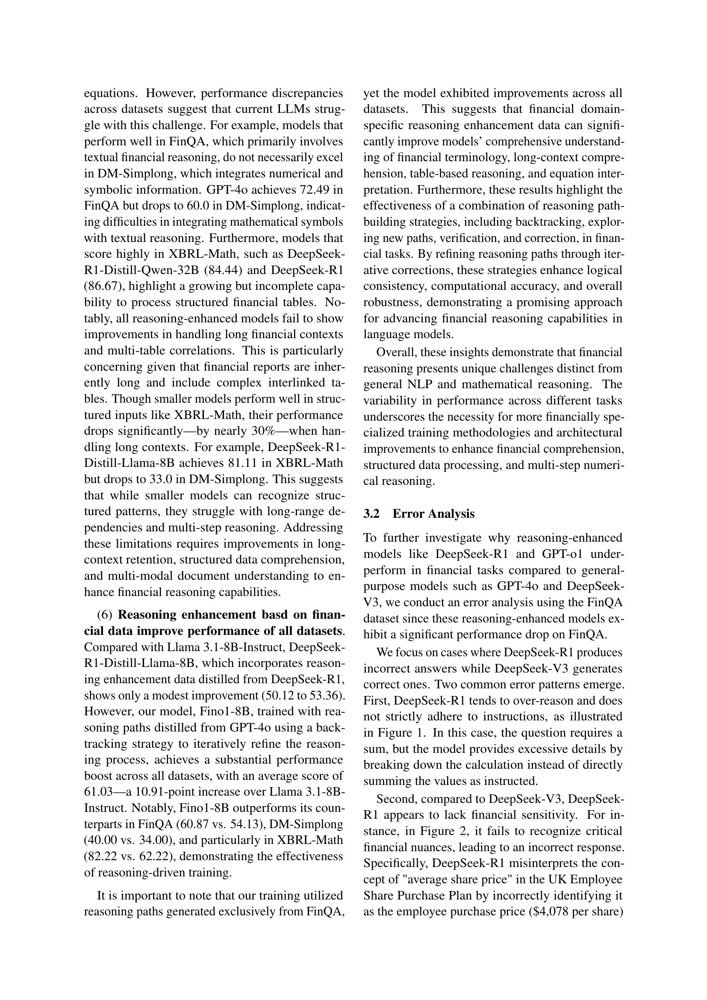
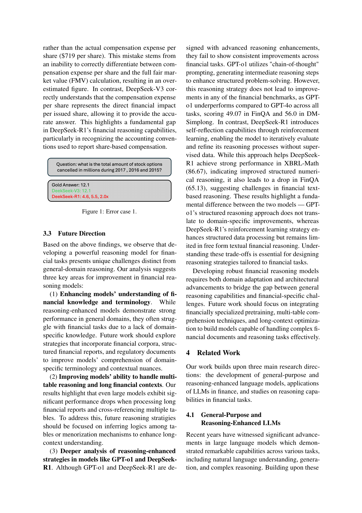
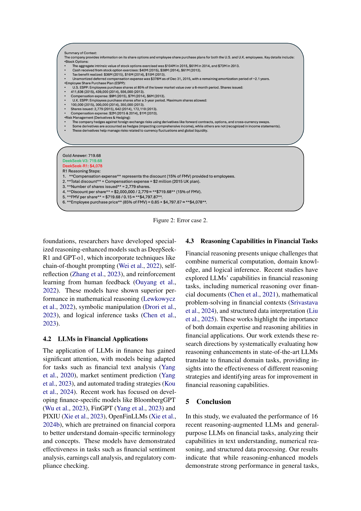
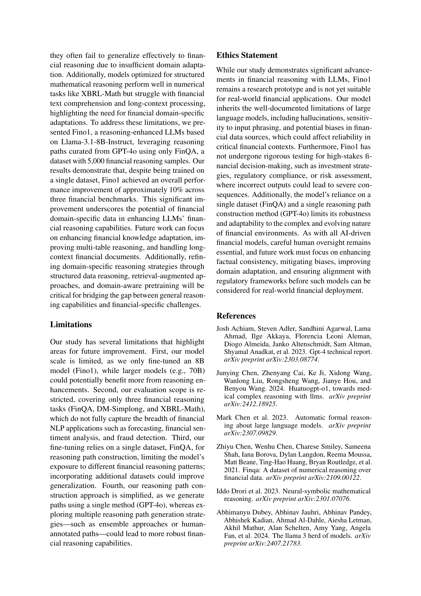
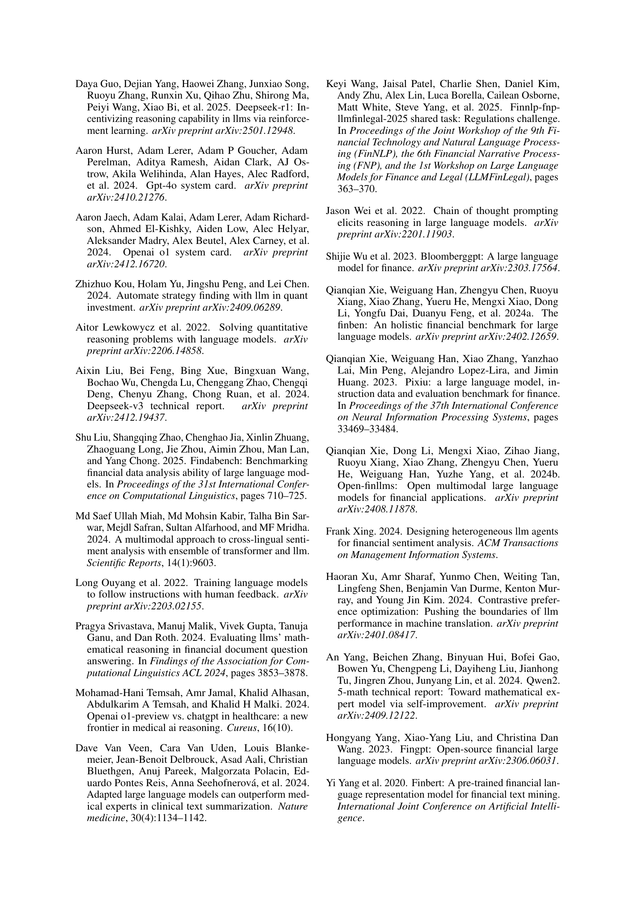
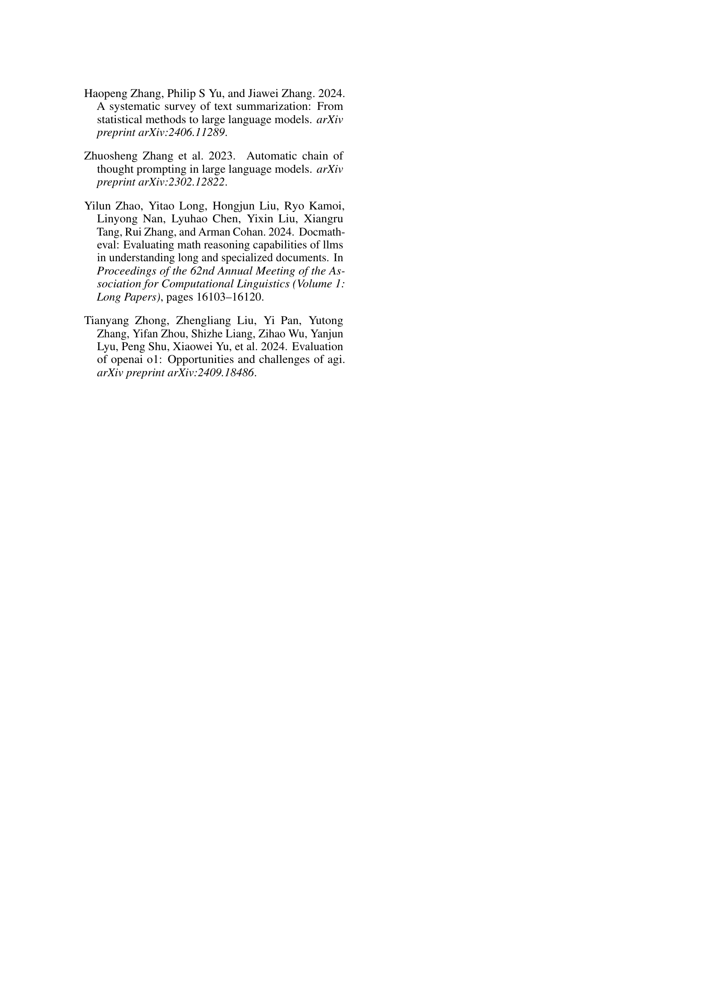
