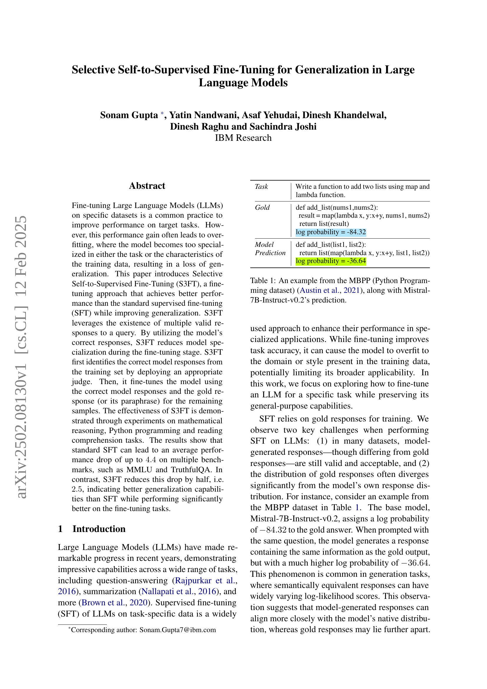
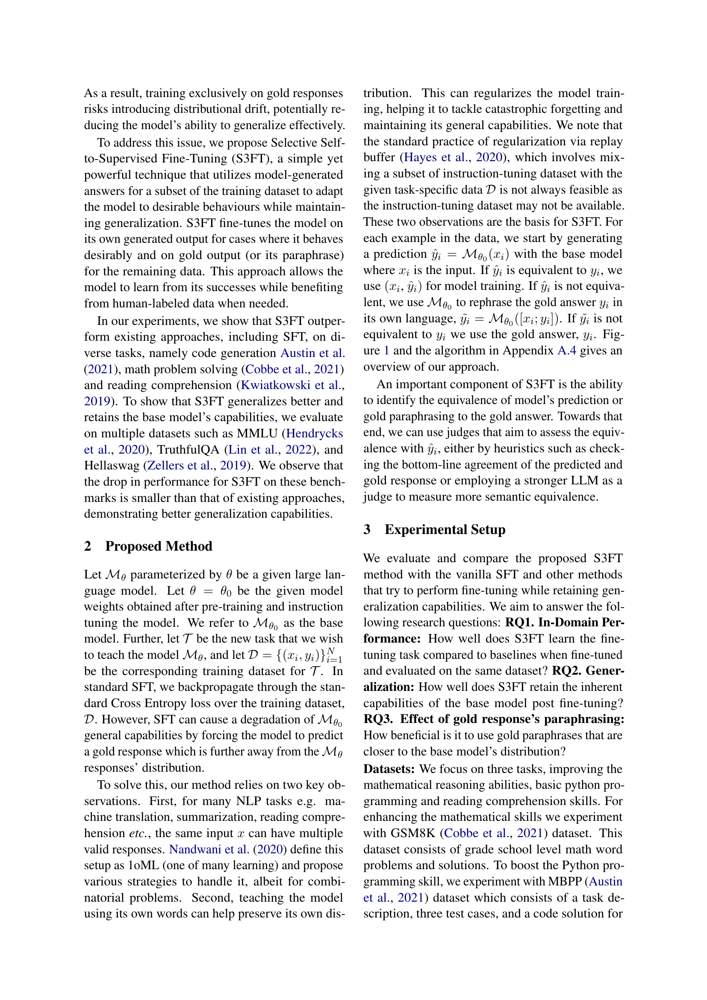
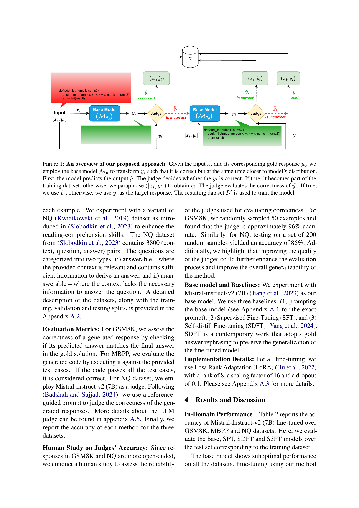
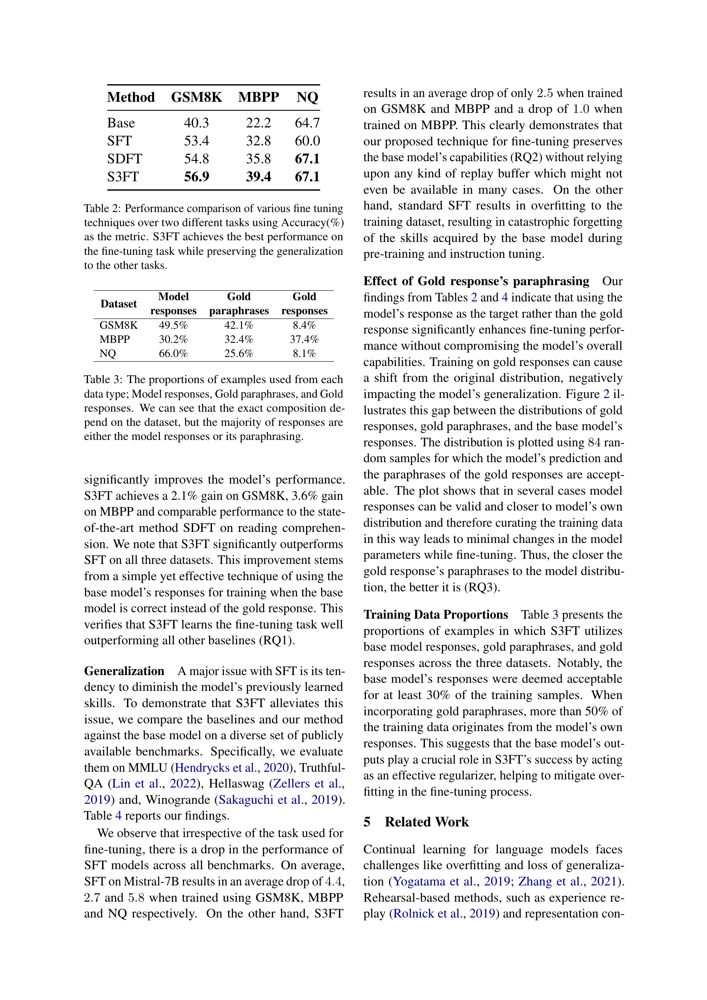
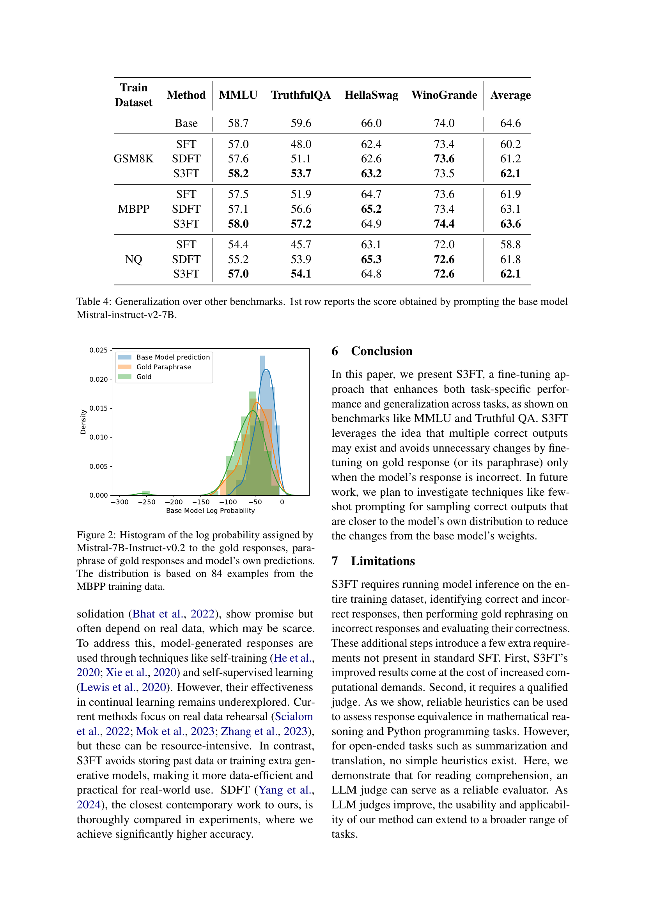
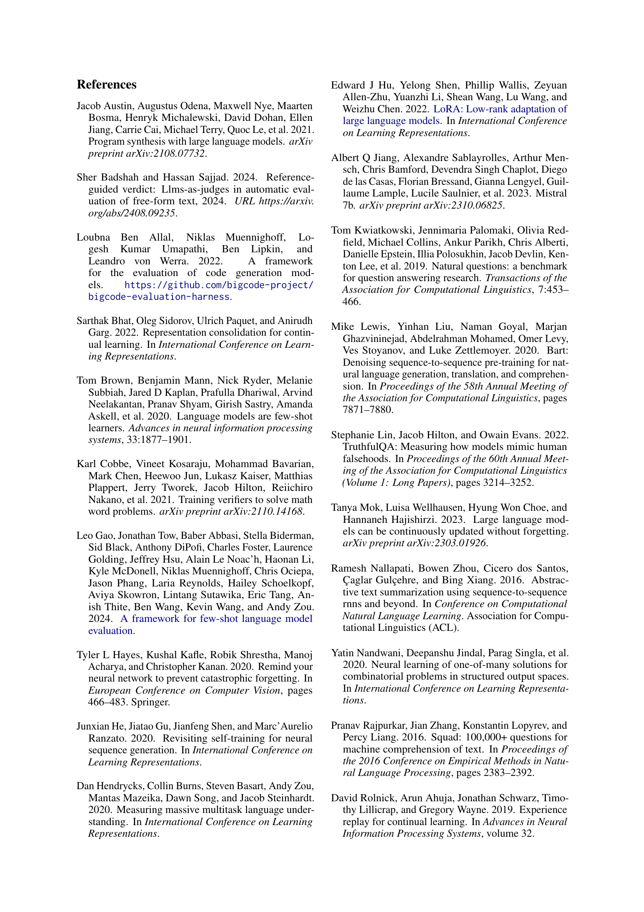
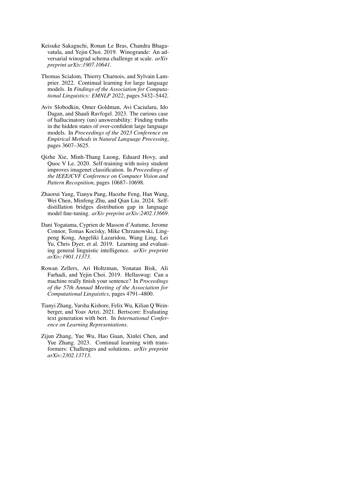
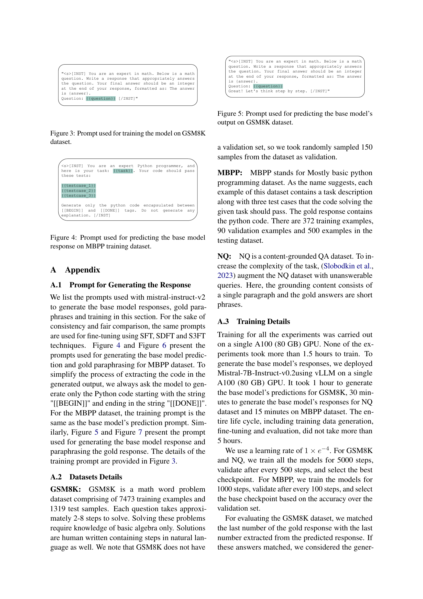
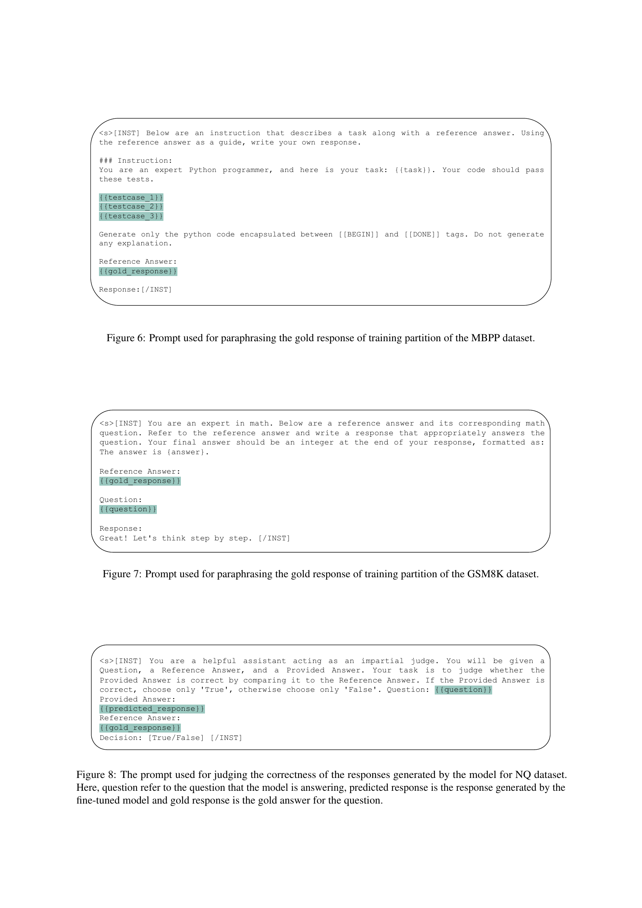
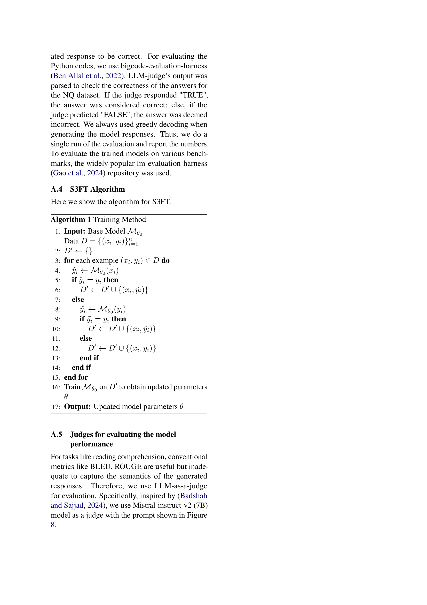

 


 2502.08130 
 Sonam Gupta et el. 
 
 🤗 2025-02-17 
 



↗ arXiv


↗ Hugging Face


### TL;DR



대규모 언어 모델(LLM)은 특정 작업에 대한 성능 향상을 위해 특정 데이터셋으로 미세 조정하는 것이 일반적입니다. 하지만 이는 과적합으로 이어져 모델의 일반화 능력이 저하되는 문제점이 있습니다. 기존의 지도 학습 기반 미세 조정(SFT)은 이러한 문제를 해결하지 못합니다.

본 논문에서는 이러한 문제를 해결하기 위해 새로운 미세 조정 기법인 **선택적 자기-지도 미세 조정(S3FT)**을 제안합니다. S3FT는 모델이 생성한 정답과 실제 정답을 함께 사용하여 미세 조정함으로써 과적합을 줄이고 일반화 성능을 향상시킵니다. 실험 결과, S3FT는 기존 SFT보다 다양한 과제에서 우수한 성능을 보였으며, 일반화 성능 저하를 최대 절반까지 감소시켰습니다.



#### Key Takeaways


 선택적 자기-지도 미세 조정(S3FT) 기법을 통해 대규모 언어 모델의 과적합 문제를 완화하고 일반화 성능을 향상시켰다. 



 S3FT는 기존의 지도 학습 기반 미세 조정보다 다양한 과제에서 더 나은 성능을 달성했다. 



 모델이 생성한 응답을 활용하여 미세 조정하는 전략은 모델의 일반화 능력을 향상시키는 효과적인 방법임을 실험적으로 증명했다. 


#### Why does it matter?
본 논문은 **대규모 언어 모델의 과적합 문제를 해결**하고 **일반화 성능을 향상**시키는 새로운 미세 조정 기법인 S3FT를 제시합니다.  이는 기존의 지도 학습 기반 미세 조정 방식의 한계를 극복하고, 다양한 과제에서 우수한 성능을 보이는 것으로 나타났습니다. 이는 **모델의 일반화 능력 향상 및 효율적인 미세 조정 전략**에 대한 연구에 중요한 시사점을 제공하며, **향후 연구 방향**을 제시합니다. 특히, 모델 자체의 응답을 활용하는 전략은 **다양한 응용 분야**에 적용 가능성이 높아,  **실용적인 측면**에서도 큰 의미를 가집니다.

------
#### Visual Insights

> 🔼 그림 1은 제안된 접근 방식의 개요를 보여줍니다. 입력값 xᵢ 와 해당하는 정답 yᵢ 가 주어지면, 기본 모델 ℳθ 를 사용하여 yᵢ 를 변환합니다. 이는 yᵢ 가 정답이면서 동시에 모델의 분포에 더 가까워지도록 합니다. 먼저 모델은 출력 ŷ 를 예측합니다. 판정자는 yᵢ 가 정답인지 판단합니다. 정답이면 학습 데이터 세트의 일부가 됩니다. 그렇지 않으면, ([xᵢ; yᵢ]) 를 바꿔서 ỹᵢ 를 얻습니다. 판정자는 ỹᵢ 의 정확성을 평가합니다. 정답이면 ỹᵢ 를 사용하고, 그렇지 않으면 yᵢ 를 목표 응답으로 사용합니다. 결과적으로 생성된 데이터 세트 𝒟′ 를 사용하여 모델을 학습합니다.
> 

> 
read the caption

> Figure 1: An overview of our proposed approach: Given the input xisubscript𝑥𝑖x_{i}italic_x start_POSTSUBSCRIPT italic_i end_POSTSUBSCRIPT and its corresponding gold response yisubscript𝑦𝑖y_{i}italic_y start_POSTSUBSCRIPT italic_i end_POSTSUBSCRIPT, we employ the base model ℳθsubscriptℳ𝜃\mathcal{M}_{\theta}caligraphic_M start_POSTSUBSCRIPT italic_θ end_POSTSUBSCRIPT to transform yisubscript𝑦𝑖y_{i}italic_y start_POSTSUBSCRIPT italic_i end_POSTSUBSCRIPT such that it is correct but at the same time closer to model’s distribution. First, the model predicts the output y^^𝑦\hat{y}over^ start_ARG italic_y end_ARG. The judge decides whether the yisubscript𝑦𝑖y_{i}italic_y start_POSTSUBSCRIPT italic_i end_POSTSUBSCRIPT is correct. If true, it becomes part of the training dataset; otherwise, we paraphrase ([xi;yi])subscript𝑥𝑖subscript𝑦𝑖([x_{i};y_{i}])( [ italic_x start_POSTSUBSCRIPT italic_i end_POSTSUBSCRIPT ; italic_y start_POSTSUBSCRIPT italic_i end_POSTSUBSCRIPT ] ) to obtain yi~~subscript𝑦𝑖\tilde{y_{i}}over~ start_ARG italic_y start_POSTSUBSCRIPT italic_i end_POSTSUBSCRIPT end_ARG. The judge evaluates the correctness of yi~~subscript𝑦𝑖\tilde{y_{i}}over~ start_ARG italic_y start_POSTSUBSCRIPT italic_i end_POSTSUBSCRIPT end_ARG. If true, we use yi~~subscript𝑦𝑖\tilde{y_{i}}over~ start_ARG italic_y start_POSTSUBSCRIPT italic_i end_POSTSUBSCRIPT end_ARG; otherwise, we use yisubscript𝑦𝑖y_{i}italic_y start_POSTSUBSCRIPT italic_i end_POSTSUBSCRIPT as the target response. The resulting dataset 𝒟′superscript𝒟′\mathcal{D^{\prime}}caligraphic_D start_POSTSUPERSCRIPT ′ end_POSTSUPERSCRIPT is used to train the model.
> 


| Task | Write a function to add two lists using map and lambda function. |
|---|---| 
| *Gold* | def add_list(nums1,nums2): |
|  |  result = map(lambda x, y:x+y, nums1, nums2) |
|  |  return list(result) |
|  | log probability = -84.32 |
| *Model* | def add_list(list1, list2): |
| *Prediction* |  return list(map(lambda x, y:x+y, list1, list2)) |
|  | log probability = -36.64 |

> 🔼 표 1은 Austin et al. (2021)의 MBPP(Python Programming) 데이터셋의 한 예시와 Mistral-7B-Instruct-v0.2 모델의 예측 결과를 보여줍니다.  'Gold' 열은 정답 코드를, 'Model' 열은 모델이 생성한 코드를, 'Prediction' 열은 모델이 생성한 코드의 log probability를 나타냅니다.  이 표는 모델이 유효한 답을 생성할 수 있지만, 정답과는 다른 log probability를 가질 수 있음을 보여주는 예시입니다. 이는 모델이 훈련 데이터에 과적합될 수 있으며, 일반화 성능 저하의 원인이 될 수 있음을 시사합니다.
> 

> 
read the caption

> Table 1: An example from the MBPP (Python Programming dataset) Austin et al. (2021), along with Mistral-7B-Instruct-v0.2’s prediction.
> 

### In-depth insights

#### S3FT: A New Approach
S3FT는 기존 지도 학습 방식의 과적합 문제를 해결하기 위해 제안된 **선택적 자기-지도 미세조정** 기법입니다.  기존의 방식은 정답 데이터만을 사용하여 학습하기 때문에 모델이 특정 데이터셋에 과하게 특화되는 현상이 발생합니다.  **S3FT는 모델이 생성한 응답 중 정답과 일치하는 응답을 활용**하여 일반화 성능을 높이고 과적합을 방지합니다.  이는 모델이 생성한 응답 중 일부가 정답과 동일하거나 유사한 경우가 많다는 점에 착안한 것입니다.  **모델의 강점을 활용**하여 정답 데이터의 한계를 극복하고, **일반화 성능 향상**과 함께 **특정 작업에 대한 성능 개선**이라는 두 마리 토끼를 잡는 효과적인 방법입니다.  하지만, **모델 응답의 정확성 판단**을 위한 추가적인 메커니즘이 필요하며, 이 부분에 대한 보다 정교한 연구가 필요할 것으로 보입니다.  **다양한 과제에서의 실험 결과**는 S3FT의 우수성을 보여주지만,  모델의 성능은 과제의 유형에 따라 달라질 수 있으므로  **다양한 과제 유형에 대한 추가적인 실험**이 필요합니다.

#### Overfitting in LLMs
대규모 언어 모델(LLM)에서 과적합은 **특정 데이터셋에 대한 과도한 최적화**로 인해 **일반화 능력이 저하**되는 현상입니다.  이는 모델이 훈련 데이터의 특징을 너무 잘 학습하여 새로운 데이터에 대한 성능이 떨어지는 것을 의미합니다.  **과적합은 LLM의 훈련 데이터의 편향성이나 특수성**을 반영하여 발생하며, 이는 모델이 실제 세계의 다양한 상황에 적응하는 데 어려움을 겪게 만듭니다. 과적합을 완화하기 위해서는 **다양한 데이터셋으로 훈련**하고, **정규화 기법**을 적용하며, **모델의 복잡도를 조절**하는 등의 다양한 방법을 고려해야 합니다.  **적절한 검증 데이터셋을 사용한 성능 평가** 또한 과적합 여부를 판단하는데 중요합니다.  **선택적 자기-지도 학습 미세 조정(S3FT)과 같은 새로운 기법**은 과적합 문제를 해결하는 데 효과적이며, 모델의 일반화 능력 향상에 기여할 수 있습니다.  하지만 이러한 기법들은 **모델의 성능과 일반화 능력 사이의 균형을 찾는 어려움**을 여전히 안고 있습니다.

#### S3FT Experiments
S3FT 실험은 **기존의 지도 학습 방식의 과적합 문제를 해결하고 일반화 성능을 향상시키기 위한 다양한 실험**으로 구성됩니다.  수학적 추론, 파이썬 프로그래밍, 독해 능력 등 다양한 작업에 대한 평가를 통해 S3FT의 효과를 검증합니다. 특히, **기존 SFT 방식과 비교하여 과적합으로 인한 성능 저하를 현저히 감소**시킨다는 점을 보여줍니다.  **모델의 생성 응답을 활용하여 학습 데이터의 다양성을 확보**하고, **정답의 어휘나 구조를 모델의 스타일과 유사하게 변환**하는 기법을 통해 모델의 일반화 능력을 향상시킨다는 점이 핵심입니다.  **여러 개의 유효한 응답이 존재하는 문제에 대한 S3FT의 적용 방식**과, 다양한 평가 지표를 사용한 실험 결과 분석은 S3FT의 우수성을 뒷받침하는 중요한 근거가 됩니다.  **다양한 기준 데이터셋을 사용하여 일반화 성능을 측정**함으로써, S3FT의 실용성을 강조합니다.  결론적으로, S3FT 실험은 **모델의 일반화 성능 향상에 대한 심도 있는 분석**을 제공하며, 이는 대규모 언어 모델의 실제 활용에 중요한 시사점을 줍니다.

#### Generalization Gains
본 논문에서 제시된 선택적 자기-지도 학습 미세조정(S3FT) 방법은 **일반화 성능 향상**에 초점을 맞춥니다. 기존의 지도 학습 미세조정(SFT)은 특정 작업에 과적합되어 다른 작업에 대한 일반화 성능이 저하되는 문제점을 가지고 있습니다. 반면 S3FT는 모델이 생성한 정답을 활용하여 모델의 과적합을 줄이고, 일반화 능력을 향상시키는 데 중점을 둡니다.  **모델이 생성한 정답과 실제 정답 간의 차이를 줄임**으로써, 모델은 자체적으로 학습한 지식을 유지하면서 새로운 작업에 대한 적응력을 높일 수 있습니다. 이러한 접근 방식은 다양한 작업(수학적 추론, 파이썬 프로그래밍, 독해)에서 SFT보다 뛰어난 성능을 보여주었으며, 특히 **다른 벤치마크 작업에서의 성능 저하를 감소**시키는 효과가 있었습니다.  **모델의 내부 분포와의 일관성 유지**를 통해 S3FT는 일반화 성능을 향상시키는 동시에 특정 작업에 대한 성능도 개선하는 혁신적인 방법론을 제시합니다.  결과적으로, S3FT는 **일반화 능력과 작업별 성능 간의 균형을 잘 맞추는** 미세조정 기법으로 평가될 수 있습니다.

#### Future of S3FT
S3FT의 미래는 **일반화된 성능과 특정 작업 성능 간의 균형을 맞추는 데 중요한 역할을 할 것**으로 예상됩니다.  **다양한 작업에 대한 적응력을 높이면서 과적합을 방지**하는 데 초점을 맞춘 연구가 지속될 것입니다.  **더욱 정교한 판별자(judge) 모델 개발**을 통해 모델의 응답 정확도와 신뢰도를 높이고,  **다양한 유형의 데이터셋에 대한 적용성을 확장**하려는 시도가 이루어질 것입니다.  **효율적인 파라미터 조정 기법**과 **계산 비용 절감**을 위한 연구도 중요한 방향이 될 것입니다.  궁극적으로 S3FT는 **더욱 강력하고 일반화된 대규모 언어 모델의 개발**에 기여하며,  **인간의 개입을 최소화하는 자율적 학습 시스템 구축**에 중요한 역할을 할 것으로 기대됩니다.

### More visual insights

More on figures

> 🔼 그림 2는 MBPP 훈련 데이터의 84개 예시를 바탕으로, Mistral-7B-Instruct-v0.2 모델이 생성한 정답, 정답의 paraphrase, 그리고 모델 자체의 예측값에 대해 각각의 로그 확률 분포를 히스토그램으로 나타낸 것입니다. 이 히스토그램을 통해 세 가지 유형의 응답 간 로그 확률 분포의 차이를 시각적으로 비교하여, 모델이 생성한 응답과 실제 정답 간의 분포 차이, 그리고 paraphrase를 사용했을 때의 분포 변화를 분석할 수 있습니다.  이는 S3FT 기법의 효과를 보여주는 주요 근거 중 하나입니다.
> 

> 
read the caption

> Figure 2: Histogram of the log probability assigned by Mistral-7B-Instruct-v0.2 to the gold responses, paraphrase of gold responses and model’s own predictions. The distribution is based on 84 examples from the MBPP training data.
> 

> 🔼 그림 3은 GSM8K 데이터셋을 사용하여 모델을 학습시키는 데 사용된 프롬프트를 보여줍니다.  더 자세히 설명하자면, 이 프롬프트는 모델에게 수학 문제를 제시하고, 단계별로 풀이 과정을 기술하여 정답을 도출하도록 지시합니다.  최종 답변은 'The answer is {answer}' 형식으로 정수 형태로 제시되어야 합니다.  이를 통해 모델은 수학적 추론 능력을 향상시키도록 학습됩니다.
> 

> 
read the caption

> Figure 3: Prompt used for training the model on GSM8K dataset.
> 

> 🔼 이 그림은 논문의 MBPP(Mostly Basic Python Programming) 학습 데이터셋에서 기본 모델의 응답을 예측하기 위해 사용된 프롬프트를 보여줍니다.  프롬프트는 전문적인 파이썬 프로그래머로서 특정 작업을 수행하는 코드를 생성하라는 지시사항으로 시작합니다.  이 작업에는 테스트 케이스 세 개가 포함되어 있어 생성된 코드가 제대로 작동하는지 확인할 수 있습니다.  프롬프트는 생성된 코드가 [[BEGIN]]과 [[DONE]] 태그로 묶여 있어야 함을 명시하고, 추가적인 설명은 필요 없음을 강조합니다.
> 

> 
read the caption

> Figure 4: Prompt used for predicting the base model response on MBPP training dataset.
> 

> 🔼 그림 5는 GSM8K 데이터셋에서 기본 모델의 출력을 예측하기 위해 사용된 프롬프트를 보여줍니다.  프롬프트는 수학 문제를 제시하고, 모델이 문제에 대한 답변을 생성하도록 지시합니다.  이는 모델이 GSM8K 데이터셋의 특성에 맞춰 답변을 생성하도록 유도하는 역할을 합니다.  프롬프트는 모델이 문제를 단계별로 생각하고, 최종 답변을 정수 형태로 제시하도록 안내하는 구체적인 지침을 포함합니다.
> 

> 
read the caption

> Figure 5: Prompt used for predicting the base model’s output on GSM8K dataset.
> 

> 🔼 이 그림은 MBPP 데이터셋의 훈련 파티션에 있는 정답(gold response)을 바꿔 말하는 데 사용된 프롬프트를 보여줍니다.  더 자세히 설명하면, 이 프롬프트는 모델에게 주어진 작업과 테스트 케이스를 설명하고, 참조 답변(reference answer)을 제공합니다.  모델은 이 참조 답변을 가이드 삼아 자체적인 응답을 생성해야 합니다.  이를 통해 모델은 단순히 기존 답변을 반복하는 것이 아니라,  자신의 언어로 답변을 생성하도록 유도하여, 과적합을 방지하고 일반화 능력을 향상시키는 것을 목표로 합니다.  참조 답변은  원래의 정답을 다른 표현으로 바꾼 것입니다.
> 

> 
read the caption

> Figure 6: Prompt used for paraphrasing the gold response of training partition of the MBPP dataset.
> 

> 🔼 그림 7은 GSM8K 데이터셋의 훈련 파티션에 있는 정답(gold response)을 바꿔 말하는(paraphrasing) 데 사용된 프롬프트를 보여줍니다.  GSM8K는 수학 문제 풀이 데이터셋이므로, 이 프롬프트는 모델이 원래 정답을 참고하여 동일한 문제에 대한 다른 표현의 답을 생성하도록 유도합니다.  즉, 모델은 기존 답변을 이해하고, 그 맥락을 유지하면서 다른 방식으로 풀이를 제시하는 새로운 답변을 생성해야 합니다. 이를 통해 모델의 과적합(overfitting)을 줄이고 일반화 성능을 높이고자 합니다.
> 

> 
read the caption

> Figure 7: Prompt used for paraphrasing the gold response of training partition of the GSM8K dataset.
> 

> 🔼 그림 8은 NQ 데이터셋에 대해 모델이 생성한 응답의 정확성을 판단하는 데 사용된 프롬프트를 보여줍니다. 여기서 질문은 모델이 답변하는 질문을 나타내고, 예측된 응답은 미세 조정된 모델이 생성한 응답이며, 정답은 질문에 대한 정답을 나타냅니다.  간단히 말해, 이 프롬프트는 미세 조정된 언어 모델이 생성한 답변이 실제 정답과 일치하는지 평가하는 데 사용되는 LLM 기반 판정 시스템을 설명합니다.
> 

> 
read the caption

> Figure 8: The prompt used for judging the correctness of the responses generated by the model for NQ dataset. Here, question refer to the question that the model is answering, predicted response is the response generated by the fine-tuned model and gold response is the gold answer for the question.
> 

More on tables


| Method | GSM8K | MBPP | NQ |
|---|---|---|---|
| Base | 40.3 | 22.2 | 64.7 |
| SFT | 53.4 | 32.8 | 60.0 |
| SDFT | 54.8 | 35.8 | 67.1 |
| S3FT | 56.9 | 39.4 | 67.1 |
> 🔼 표 2는 다양한 미세 조정 기법을 두 가지 다른 작업에 적용하여 정확도(%)를 측정한 성능 비교 결과를 보여줍니다. S3FT는 미세 조정 작업에서 최고의 성능을 달성하는 동시에 다른 작업에 대한 일반화 능력도 유지합니다. 즉, 특정 작업에 대한 성능 향상 뿐 아니라 다른 유사한 작업에 대한 성능 저하를 최소화 함을 의미합니다.
> 

> 
read the caption

> Table 2: Performance comparison of various fine tuning techniques over two different tasks using Accuracy(%) as the metric. S3FT achieves the best performance on the fine-tuning task while preserving the generalization to the other tasks.
> 


| Dataset | Model responses | Gold paraphrases | Gold responses |
|---|---|---|---|
| GSM8K | 49.5% | 42.1% | 8.4% |
| MBPP | 30.2% | 32.4% | 37.4% |
| NQ | 66.0% | 25.6% | 8.1% |
> 🔼 표 3은 세 가지 데이터 유형(모델 응답, 골드 패러프레이즈, 골드 응답)에서 사용된 예제의 비율을 보여줍니다. 데이터 세트에 따라 정확한 구성이 다를 수 있지만, 대부분의 응답은 모델 응답 또는 모델의 패러프레이즈입니다. 이 표는 S3FT(Selective Self-to-Supervised Fine-Tuning) 방법에서 모델이 생성한 응답과 골드 응답을 어떻게 활용하는지 보여주는 실험 결과를 요약합니다.  모델 응답이 정답일 경우 해당 응답을 사용하고, 오답일 경우 골드 응답을 모델이 다시 패러프레이즈하여 사용합니다. 이를 통해 모델의 일반화 능력을 향상시키는 것을 확인할 수 있습니다.
> 

> 
read the caption

> Table 3: The proportions of examples used from each data type; Model responses, Gold paraphrases, and Gold responses. We can see that the exact composition depend on the dataset, but the majority of responses are either the model responses or its paraphrasing.
> 


| Model | responses |
|---|---|
> 🔼 표 4는 미세 조정된 모델의 일반화 성능을 평가하기 위해 사용된 다양한 벤치마크에 대한 결과를 보여줍니다.  각 벤치마크(MMLU, TruthfulQA, HellaSwag, Winogrande)에 대해 기본 모델(Mistral-instruct-v2-7B)을 프롬프트하여 얻은 점수와 GSM8K, MBPP, NQ 데이터셋을 사용하여 미세 조정한 모델의 점수를 비교합니다. 이를 통해 미세 조정 작업이 기본 모델의 일반적인 성능에 미치는 영향을 확인할 수 있습니다.  각 데이터셋으로 미세 조정한 모델의 성능과 다른 벤치마크에서의 성능 저하 정도를 비교 분석하여 일반화 능력을 평가합니다.
> 

> 
read the caption

> Table 4: Generalization over other benchmarks. 1st row reports the score obtained by prompting the base model Mistral-instruct-v2-7B.
> 

### Full paper



