 


 2502.08168 
 Zhiming Ma et el. 
 
 🤗 2025-02-13 
 



↗ arXiv


↗ Hugging Face


### TL;DR



**기존의 원격 탐사 연구는 주로 시각적 특징 추출에 초점을 맞춰 심층적인 의미 분석이 부족**했습니다. 특히 SAR 영상은 흐릿한 경계, 산란 현상 등으로 해석이 어려워 VLMs의 적용이 제한적이었습니다. 또한, 기존 SAR 데이터셋은 주로 시각적 인식 과제에 집중되어, **대규모의 고품질 이미지-텍스트 정렬 데이터셋이 부족**했습니다. 

본 논문에서는 이러한 문제를 해결하기 위해 **약 2백만 개의 고품질 SAR 이미지-텍스트 쌍을 포함하는 대규모 다중 모드 대화형 데이터셋 SARChat-Bench-2M을 제시**합니다. 이 데이터셋은 다양한 시나리오와 세부적인 대상 주석을 포함하며, 영상 이해, 객체 탐지 등 여러 과제를 지원합니다.  또한, **SAR 영상 해석을 위한 종합적인 벤치마크 SARChat-Bench를 구축**하여 16개의 주요 VLMs의 성능을 평가하고, 데이터셋의 효과를 검증했습니다. 이 연구는 **SAR 영상 해석 분야의 VLMs 발전에 크게 기여**하고, 다양한 원격 탐사 분야로의 확장 가능성을 제시합니다.



#### Key Takeaways


 2백만 개의 고품질 SAR 이미지-텍스트 쌍을 포함하는 대규모 다중 모드 대화형 데이터셋 SARChat-Bench-2M을 제시 



 SAR 영상 해석을 위한 6가지 주요 과제를 포함하는 종합적인 벤치마크 SARChat-Bench를 개발 



 16개의 주요 VLMs에 대한 실험을 통해 데이터셋과 벤치마크의 효과를 검증 


#### Why does it matter?
**SAR 영상 해석 분야의 발전에 크게 기여**할 수 있는 연구이며, **다양한 원격 탐사 분야**로의 확장 가능성을 제시합니다.  **대규모 다중 모드 대화형 데이터셋**을 통해 향후 연구의 새로운 가능성을 열어줍니다. 또한, **최신 VLMs의 성능을 평가**할 수 있는 벤치마크를 제공하여, SAR 영상 해석 기술의 발전을 가속화합니다.

------
#### Visual Insights

> 🔼 이 그림은 SARChat-Bench-2M에 대한 개요를 보여줍니다. 왼쪽 그림은 이 논문에서 구성한 SAR 이미지 텍스트 데이터셋 SARChat-2M을 사용하여 구현된 대표적인 작업들을 보여줍니다. 이는 다중 작업 애플리케이션을 지원하는 데이터셋의 효율성과 우수성을 검증합니다. 오른쪽 그림은 이 데이터셋을 기반으로 16개의 VLM의 성능 평가에서 도출된 상관 관계 레이더 차트와 정량적 선 그래프를 보여주며, 이 도메인 내에서 벤치마크(SARChat-Bench)를 설정합니다.
> 

> 
read the caption

> Figure 1: An overview of SARChat-Bench-2M. The left figure demonstrates the representative tasks realized with the SAR image-text dataset, SARChat-2M, constructed in this paper. Validating the dataset’s efficacy and superiority in supporting multi-task applications. The right figure presents the correlation radar charts and quantitative line graphs derived from the performance evaluation of 16 VLMs basing on this dataset, establishing the benchmark (SARChat-Bench) within this domain.
> 


| Category | Training | Test |
|---|---|---|
| Ship | 93,373 (46.98%) | 10,741 (44.38%) |
| Aircraft | 40,705 (20.48%) | 6,779 (28.01%) |
| Car | 9,561 (4.81%) | 1,230 (5.08%) |
| Tank | 24,187 (12.17%) | 1,773 (7.33%) |
| Bridge | 27,615 (13.89%) | 3,281 (13.56%) |
| Harbor | 3,306 (1.66%) | 399 (1.65%) |

> 🔼 표 1은 SARChat-2M 데이터셋의 범주별 분포 통계를 보여줍니다. 훈련 세트와 테스트 세트 모두에서 각 범주 (선박, 항공기, 자동차, 탱크, 다리, 항구)별 데이터 샘플 수와 비율을 제시하여 데이터셋의 균형 및 불균형을 확인하는 데 도움이 됩니다. 특히, '선박' 범주가 훈련 및 테스트 세트에서 모두 가장 큰 비중을 차지하는 것을 보여줍니다.
> 

> 
read the caption

> Table 1: Category Distribution Statistics
> 

### In-depth insights

#### SAR VLM Benchmark
본 논문에서 제시된 SAR VLM 벤치마크는 **SAR 영상 해석을 위한 비전-언어 모델(VLM)의 성능을 평가하는 포괄적인 프레임워크**입니다. 단순한 이미지 분류를 넘어, **세분화된 설명, 개체 수 세기, 공간적 근거, 교차 모달 식별 및 참조 등 다양한 작업**을 포함하여 VLM의 다차원적 능력을 평가합니다.  **대규모 SAR 데이터셋(SARChat-2M)**을 기반으로 하여, 다양한 모델의 실제 성능을 측정하고 비교 분석하여 **SAR 영상 이해 분야의 발전을 가속화**할 수 있습니다. 특히, 기존의 SAR 데이터셋이 주로 시각적 인식에 초점을 맞춘 것과 달리, 이 벤치마크는 **텍스트와의 상호작용을 강조**하여, 더욱 실제적인 응용에 가까운 VLM 성능 평가를 제공합니다.  **모델의 크기와 성능 간의 관계**에 대한 분석을 통해, 적절한 모델 크기 선택의 중요성을 보여주고, 향후 연구 방향을 제시합니다.  **실제 SAR 응용 분야를 고려한 엣지 디바이스 환경에서의 모델 성능 평가**를 포함하는 점 또한 중요한 특징입니다. 따라서, 이 벤치마크는 SAR 영상 해석 분야의 연구 발전에 크게 기여할 것으로 기대됩니다.

#### Multimodal Dialogue
**멀티모달 대화**는 다양한 모드(예: 텍스트, 이미지, 오디오)의 정보를 통합하여 이루어지는 대화를 의미합니다.  연구 논문에서 **멀티모달 대화 시스템**은 합성개구레이더(SAR) 이미지 해석을 위한 새로운 패러다임을 제시합니다. 기존의 단일 모드 기반 시스템과 달리, 멀티모달 대화 시스템은 SAR 이미지의 시각적 특징과 사용자의 자연어 질문을 동시에 처리하여 더욱 풍부하고 정확한 정보를 제공할 수 있습니다.  **SAR 이미지의 특성상 해석이 어렵다는 점을 고려할 때**, 멀티모달 대화 시스템은 **시각적 정보와 언어적 정보의 상호작용을 통해 해석의 정확성을 높이는 데 중요한 역할**을 할 것으로 예상됩니다.  **대용량의 멀티모달 대화 데이터셋 구축**은 멀티모달 대화 시스템의 성능 향상에 필수적입니다.  **본 논문에서 제시된 SARChat-Bench-2M 데이터셋은 이러한 측면에서 중요한 기여**를 하고 있으며,  향후 연구는  **다양한 SAR 애플리케이션**에  **멀티모달 대화 시스템**을 적용하는 데 초점을 맞출 것으로 예상됩니다.

#### SAR Image Analysis
본 논문은 SAR 영상 분석에 대한 심층적인 논의를 제공합니다. **SAR 영상의 고유한 특성인 산란 현상으로 인해 흐릿한 경계와 산재된 스페클, 그리고 방향 민감도 등의 해석상 어려움**이 존재합니다. 따라서 기존의 광학 영상 분석 기술을 SAR 영상에 직접 적용하는 데는 한계가 있습니다.  **SARChat-Bench-2M 데이터셋은 이러한 문제를 해결하기 위해 제시된 대규모 다중 모드 대화형 데이터셋**으로, 다양한 시나리오와 상세한 목표 주석을 포함하여 풍부한 이미지-텍스트 쌍을 제공합니다.  **여러 가지 SAR 영상 분석 과제를 지원**하며,  **기존 SAR 데이터셋의 한계인 대규모 고품질 이미지-텍스트 정렬 데이터의 부족을 해결**합니다.  이를 통해 **VLMs(Vision-Language Models)의 SAR 영상 해석 능력을 평가하고 향상시키는 데 기여**할 수 있습니다.  **SARChat-Bench-2M은 SAR 영상 분석 분야의 발전에 중요한 기여**를 할 것으로 예상되며, 향후 다양한 원격 감지 영역으로의 확장 가능성도 제시합니다.

#### Edge-Side Inference
엣지 측면 추론은 **클라우드 기반 서버 대신 엣지 장치(예: 스마트폰, 자율주행차, IoT 기기)에서 직접 머신러닝 모델을 실행하는** 기술입니다. 이는 처리 지연 시간을 줄이고 대역폭을 절약하며 개인 정보 보호를 향상시키는 데 도움이 됩니다. 논문에서 엣지 측면 추론에 대한 심층적인 논의는 없지만, SAR 이미지 해석을 위한 경량화된 비전-언어 모델의 개발 및 배포에 대한 맥락에서 중요한 고려 사항임을 시사합니다. **대용량 SAR 데이터셋을 사용한 사전 훈련된 모델의 효과적인 경량화**는 엣지 장치의 제한된 처리 능력과 메모리 용량 내에서 실시간 성능을 보장하는 데 필수적입니다. 따라서 이 논문은 **모델 경량화 및 최적화 기술의 중요성**을 간접적으로 강조하며, 향후 연구는 엣지 환경에 맞춤화된 SAR 이미지 해석 모델을 개발하는 데 초점을 맞출 것으로 예상됩니다. 이는 **실제 환경에서의 실시간 SAR 이미지 처리 및 분석**을 가능하게 하여, 재난 구호, 군사 정찰, 환경 모니터링 등 다양한 분야에 혁신적인 발전을 가져올 수 있을 것입니다.

#### Dataset Imbalance
본 논문에서 다룬 SARChat-2M 데이터셋은 다양한 SAR 이미지와 텍스트 페어를 포함하지만, 특정 카테고리의 과다 표현으로 인해 **데이터 불균형** 문제를 안고 있습니다.  이는 특히 '선박' 및 '항공기' 카테고리에서 두드러지게 나타나는데, 이러한 불균형은 모델의 학습 과정에 영향을 미쳐 특정 카테고리에 대한 성능은 높지만, 다른 카테고리에 대한 성능은 떨어질 수 있습니다. 따라서 **모델의 일반화 성능 저하** 및 **특정 카테고리에 대한 편향된 예측** 가능성이 존재합니다.  이러한 문제를 해결하기 위해서는 **데이터 증강 기법**이나 **비용-민감도 학습** 등의 방법을 통해 데이터 불균형을 완화하는 것이 중요하며,  **모델 평가 시 불균형 문제를 고려한 지표**를 사용해야 합니다.  또한, 불균형 데이터셋으로 학습된 모델의 실제 환경 적용 시 **편향성을 주의 깊게 모니터링**하고, 필요 시 추가적인 보정이 필요합니다.  **향후 연구**는 데이터 수집 전략 개선, 더욱 정교한 데이터 증강 기법 개발,  불균형 데이터셋에 적합한 모델 아키텍처 연구 등을 통해 데이터 불균형 문제를 최소화하는 데 집중해야 합니다.

### More visual insights

More on figures

> 🔼 그림 2는 SARChat-2M 데이터셋의 구성 과정을 보여줍니다. 왼쪽에는 기존의 10개 SAR 감지 벤치마크 데이터셋이, 가운데에는 왼쪽의 10개 데이터셋을 통합하여 구성된 SARDet-100K 데이터셋이, 오른쪽에는 해당 데이터셋을 기반으로 구성된 6가지 핵심 과제가 제시되어 있습니다. 각 과제는 서로 다른 과제 식별자, 작업 단계 및 관련 템플릿에 해당합니다.  즉, 기존 데이터셋들을 통합하고, 그 통합 데이터셋을 기반으로 여섯 가지 주요 비전-언어 과제를 정의하여 SARChat-2M 데이터셋을 구성한 과정을 시각적으로 보여주는 그림입니다.
> 

> 
read the caption

> Figure 2: Construction of SARChat-2M dataset. On the left, ten existing SAR detection benchmark datasets. The middle part is the SARDet-100K dataset, formed by integrating the ten datasets on the left. On the right, six core tasks constructed based on the dataset are presented, with each task corresponding to different task identifiers, operation steps, and relevant templates.
> 

> 🔼 그림 3은 SARChat-Bench의 평가 예시를 보여줍니다. 올바른/잘못된 설명에 대해 VLM의 예측이 초록색/빨간색으로 표시되고, 정답은 초록색, 예측 결과는 빨간색 상자로 표시됩니다. [Human], [Bot], [Check]는 각각 사용자 입력, VLM 응답, 표준 출력을 나타냅니다. 그림은 다양한 작업(분류, 세분화된 설명, 인스턴스 계산, 공간적 근거, 교차 모드 식별, 참조)에 대한 VLM의 예측 결과를 보여주며, 각 작업에 대한 정답과 비교하여 모델의 성능을 평가할 수 있도록 합니다.  특히, 멀티 모달 대화 데이터셋의 특징을 잘 보여주는 다양한 유형의 SAR 이미지와 질의응답 사례들이 제시되어 있습니다.
> 

> 
read the caption

> Figure 3: Evaluation examples on SARChat-Bench. VLM predictions are shown in green/red for correct/incorrect descriptions, with the ground truth in green and the predictions in red boxes. And [Human], [Bot], and [Check] denote user input, VLMs response, and standard output, respectively.
> 

> 🔼 이 그림은 SARChat-2M 데이터셋의 이미지 캡션에 사용된 단어들의 빈도를 시각적으로 보여줍니다. 단어들의 크기는 해당 단어가 사용된 빈도를 나타내며, 자주 사용된 단어일수록 크게 표시됩니다.  자주 등장하는 단어들은 주로 위치(center, middle, top 등)와 대상 물체(ship, aircraft, tank 등)를 나타내는 단어들과 형용사(small 등)임을 알 수 있습니다. 이는 SAR 이미지 캡션에서 어떤 종류의 단어들이 주로 사용되는지, 그리고 어떤 종류의 정보가 담겨있는지 보여주는 유용한 정보입니다.
> 

> 
read the caption

> Figure 4: Cloud Map of Word-frequency Distribution
> 

> 🔼 그림 5는 SARChat-2M 훈련 세트에 있는 샘플의 비율 분포를 보여줍니다.  '선박' 카테고리가 46.98%로 가장 큰 비중을 차지하고, '항공기'가 20.48%로 그 뒤를 잇습니다.  '자동차', '탱크', '다리', '항구' 카테고리는 상대적으로 적은 비율을 차지하고 있습니다. 이러한 불균형적인 분포는 모델 훈련에 영향을 미칠 수 있음을 시사합니다. 특히, '선박'과 '항공기' 카테고리의 샘플이 많아 모델이 이러한 카테고리의 특징을 더 잘 학습할 수 있지만, 다른 카테고리의 특징을 학습하는 데는 어려움이 있을 수 있습니다.
> 

> 
read the caption

> Figure 5: The Proportion Distribution of Samples in the Training Set
> 

> 🔼 그림 6은 SARChat-2M 테스트 세트에 있는 샘플의 비율 분포를 보여줍니다.  'Ship' 카테고리가 44.38%로 가장 큰 비율을 차지하고 있으며, 'Aircraft' 카테고리가 28.01%로 그 뒤를 잇고 있습니다. 나머지 카테고리들('Car', 'Tank', 'Bridge', 'Harbor')은 상대적으로 적은 비율을 차지하고 있습니다. 이 그림은 테스트 세트의 클래스 불균형을 보여주는 데 도움이 되며, 모델의 성능 평가에 영향을 미칠 수 있는 요소를 시각적으로 나타냅니다. 
> 

> 
read the caption

> Figure 6: The Proportion Distribution of Samples in the Testing Set
> 

> 🔼 그림 7은 SAR 이미지에서 표적의 형태적 분포를 보여줍니다. 훈련 및 테스트 데이터셋 모두에서 거의 정사각형 형태가 가장 높은 비율을 차지하며, 훈련 데이터셋에서는 63.08%, 테스트 데이터셋에서는 59.37%를 차지합니다. 이는 SAR 이미지에서 표적의 형태가 다양하지만 거의 정사각형 형태가 가장 흔하다는 것을 시사합니다. 넓고 긴 형태의 표적은 훈련 데이터셋에서 18.14%, 테스트 데이터셋에서는 17.72%를 차지하는 반면, 키가 큰 형태의 표적은 훈련 데이터셋에서는 31.96%, 테스트 데이터셋에서는 22.91%를 차지합니다. 이러한 형태적 다양성은 모델의 일반화 능력 향상에 기여하지만, 테스트 데이터셋에서 거의 정사각형 형태의 표적 비율이 증가한 점은 모델 최적화 과정에서 주의가 필요함을 시사합니다. 또한 각 범주별 형태 분포를 통해 각 범주의 특징을 이해하는 데 도움이 됩니다.
> 

> 
read the caption

> Figure 7: Morphological distribution
> 

> 🔼 그림 8은 SARChat-2M 훈련 데이터셋에서 각 작업 유형의 비율을 보여줍니다.  가장 큰 비중을 차지하는 것은 Cross-Modal Identification 작업이며, 전체 데이터셋의 77.5%를 차지합니다.  다음으로 Instance Counting과 Referring 작업이 각각 5.2%를 차지하고 있으며, Spatial Grounding 작업은 5.1%, Fine-Grained Description 작업은 2.5%, Classification 작업은 4.5%의 비중을 차지합니다. 이는 훈련 데이터셋에서 다양한 작업 유형이 비교적 균형 있게 분포되어 있음을 보여줍니다. 하지만 Fine-Grained Description 작업의 데이터 비율이 상대적으로 적다는 점은 주목할 만합니다.  이 그림은 SARChat-2M 데이터셋의 구성을 이해하는 데 도움이 됩니다.
> 

> 
read the caption

> Figure 8: Train Task Distribution
> 

> 🔼 그림 9는 SARChat-2M 데이터셋의 테스트 집합에 대한 작업 분포를 보여줍니다. 그림은 테스트 집합에 있는 각 작업 유형(예: 인스턴스 계산, 공간적 근거, 교차 모달 식별, 참조, 세분화된 설명, 분류)의 샘플 수를 시각적으로 나타냅니다. 테스트 집합에서 가장 큰 비중을 차지하는 작업 유형은 교차 모달 식별 작업이며, 다른 작업들은 상대적으로 적은 수의 샘플을 가지고 있습니다. 이 그림은 모델의 일반화 성능을 평가하기 위해 테스트 집합의 작업 분포가 훈련 집합과 어떻게 유사하거나 다른지 보여줍니다.  각 작업의 비율을 통해 모델 성능 평가 시 고려해야 할 사항들을 시사합니다.
> 

> 
read the caption

> Figure 9: Test Task Distribution
> 

More on tables


| Metric | Training Set | Test Set | Diff-Rate |
|---|---|---|---| 
| Mean | 1.28 | 1.26 | -2.03% |
| Median | 1.062 | 1.05 | -1.69% |
| SD | 1.18 | 0.91 | -22.82% |
> 🔼 표 2는 SAR 이미지의 객체 형태 분석 결과를 보여줍니다.  훈련 및 테스트 세트에서 각 대상의 종횡비(Aspect Ratio, AR) 분포의 평균, 중앙값, 표준편차를 비교하여 데이터 세트의 균형과 다양성을 평가합니다.  종횡비는 객체의 형태를 나타내는 지표로, 훈련과 테스트 데이터 간의 종횡비 분포 차이를 분석하여 모델의 일반화 성능에 대한 영향을 예측할 수 있습니다. 표에는 각 대상 카테고리별 훈련 및 테스트 세트의 종횡비 통계치와, 세 가지 형태 범주(넓적한 형태, 거의 정사각형, 높은 형태)에 대한 분포 비율이 제시되어 있습니다.  이를 통해 SAR 이미지 데이터의 특징과 모델 성능에 대한 통찰력을 제공합니다.
> 

> 
read the caption

> Table 2: Aspect Ratio Distribution Comparison
> 


| Model | Param | Avg score | Instance Count | Abstract position | Spatial Ground | Cross-Modal ID | Multi-target Ref | Single-target Ref | Descript | Class |
|---|---|---|---|---|---|---|---|---|---|---|
| **InternVL2.5** | **8B** | 92.79 | **74.14** | 61.37 | 52.17 | 81.25 | 62.25 | 87.91 | 98.84 | 98.98 | 37.49 | 23.46 | 74.86 | 60.13 | 63.43 | 97.25 |
|  | **4B** | 91.57 | 72.68 | 57.54 | 47.35 | 83.33 | 60.89 | 85.90 | 98.01 | 98.76 | 34.05 | 18.86 | 69.92 | 55.29 | 58.84 | 97.27 |
|  | **2B** | 90.55 | 71.52 | 54.11 | 44.22 | 50.00 | 60.81 | 81.92 | 97.79 | 98.63 | 27.05 | 13.91 | 68.50 | 52.16 | 56.36 | 96.69 |
|  | **1B** | 88.89 | 69.87 | 50.18 | 39.35 | 0.00 | 56.30 | 82.24 | 96.98 | 98.60 | 22.13 | 9.94 | 62.33 | 44.99 | 53.30 | 96.65 |
| **DeepSeekVL** | **7B** | 88.99 | 20.66 | 8.49 | 4.19 | 64.29 | 65.32 | 85.78 | 98.97 | 99.05 | 28.75 | 13.66 | 64.34 | 48.84 | 51.08 | 93.23 |
|  | **1.3B** | 84.01 | 19.61 | 4.00 | 1.32 | 75.00 | 60.38 | 82.00 | 96.40 | 97.45 | 16.11 | 6.23 | 53.58 | 34.28 | 44.44 | 47.37 |
| **Phi-3.5-vision** | **4.2B** | 92.06 | 72.69 | 57.48 | 47.60 | 62.50 | 58.85 | 87.29 | 98.93 | 98.59 | 31.65 | 17.16 | 70.95 | 55.70 | 59.95 | 96.42 |
| **GLM-Edge-V** | **2B** | 90.20 | 71.59 | 51.97 | 40.37 | 42.86 | 59.15 | 86.33 | 97.54 | 98.60 | 24.15 | 10.66 | 65.57 | 46.46 | 57.86 | 97.39 |
|  | **5B** | 90.48 | 73.44 | 56.30 | 44.56 | 75.00 | 61.38 | 89.96 | 96.69 | 95.96 | 30.68 | 15.41 | 69.36 | 51.81 | 61.45 | 98.02 |
| **mPLUG-Owl3** | **7B** | 91.71 | 71.00 | 48.07 | 35.27 | **100.00** | 56.37 | 93.32 | **99.27** | **99.51** | 19.72 | 7.66 | 57.27 | 38.00 | 54.65 | 98.80 |
|  | **2B** | 90.32 | 67.56 | 41.56 | 28.83 | 75.00 | 45.65 | 97.58 | 98.95 | 99.42 | 14.91 | 5.42 | 50.46 | 30.16 | 41.76 | 98.31 |
|  | **1B** | 89.68 | 67.03 | 38.64 | 24.98 | 75.00 | 44.07 | 97.19 | 98.72 | 98.87 | 11.86 | 4.12 | 44.34 | 24.02 | 40.16 | 98.06 |
| **Qwen2-VL** | **7B** | 90.76 | **72.79** | 58.51 | 50.24 | 0.00 | 64.17 | 83.87 | 97.54 | 99.18 | 39.11 | 26.29 | 70.55 | 57.04 | 63.11 | 97.30 |
|  | **2B** | 90.27 | 69.63 | 53.62 | 45.47 | 50.00 | 59.04 | 78.49 | 97.55 | 99.26 | 32.60 | 20.12 | 65.31 | 51.53 | 55.20 | 96.88 |
| **LLaVA-1.5** | **7B** | 91.21 | 71.89 | 56.89 | 46.80 | 57.14 | 62.70 | 85.79 | 97.84 | 98.42 | 30.81 | 15.48 | 71.89 | 56.70 | 61.35 | 96.90 |
| **Yi-VL** | **6B** | 84.35 | 32.62 | 14.35 | 9.44 | 75.00 | 53.68 | 72.38 | 93.63 | 97.95 | 7.76 | 2.69 | 32.95 | 16.63 | 38.15 | 95.32 |
> 🔼 표 3은 논문에서 다양한 비전-언어 모델의 성능을 비교 분석한 표입니다.  표에는 InternVL2.5, DeepSeekVL, Phi-3.5-vision, GLM-Edge-V, mPLUG-Owl3, Qwen2-VL, LLaVA-1.5, Yi-VL 등 여러 비전-언어 모델이 포함되어 있으며, 각 모델의 매개변수 크기(Param)와  분류, 세밀한 설명, 개체 수 세기, 공간적 근거, 교차 모드 식별, 참조 등 6가지 주요 작업에 대한 성능(정확도, IoU 등)이 제시되어 있습니다.  각 모델의 성능을 다양한 측면에서 비교하여,  비전-언어 모델의 SAR 이미지 해석 능력을 종합적으로 평가하고 있습니다. 이 표는 SARChat-Bench-2M 데이터셋을 사용하여 측정된 결과를 보여줍니다.
> 

> 
read the caption

> Table 3: Performance comparison of different vision-language models
> 


| Category | Dataset | Total Samples | Mean AR | Median AR | Std Dev | AR≤0.67 | 0.67&lt;AR≤1.5 | AR&gt;1.5 |
|---|---|---|---|---|---|---|---|---|
| Ship | Train | 93,342 | 1.34 | 1.07 | 1.24 | 28.37 | 39.67 | 31.96 |
|  | Test | 10,738 | 1.308 | 1.026 | 1.10 | 29.34 | 39.82 | 30.84 |
| Aircraft | Train | 40,698 | 1.074 | 1.047 | 0.32 | 5.85 | 87.67 | 6.48 |
|  | Test | 6,778 | 1.08 | 1.041 | 0.31 | 4.56 | 87.36 | 8.08 |
| Car | Train | 9,561 | 1.23 | 1.08 | 0.56 | 13.18 | 60.07 | 26.75 |
|  | Test | 1,230 | 1.21 | 1.07 | 0.53 | 12.28 | 62.11 | 25.61 |
| Tank | Train | 24,15 | 1.10 | 1.00 | 0.84 | 1.58 | 94.29 | 4.13 |
|  | Test | 1,771 | 1.09 | 1.00 | 0.29 | 1.41 | 94.36 | 4.23 |
| Bridge | Train | 27,615 | 1.56 | 1.18 | 1.92 | 18.38 | 44.83 | 36.79 |
|  | Test | 3,281 | 1.568 | 1.2 | 1.24 | 18.01 | 44.59 | 37.4 |
| Harbor | Train | 3,306 | 1.20 | 1.01 | 0.72 | 14.19 | 67.93 | 17.88 |
|  | Test | 399 | 1.23 | 1.01 | 0.81 | 15.04 | 68.42 | 16.54 |
> 🔼 표 4는 다양한 유형의 표적에 대한 종횡비 분석 결과를 보여줍니다.  각 표적 유형(선박, 항공기, 자동차, 탱크, 다리, 항구)별로 학습 및 테스트 데이터셋에서 종횡비의 평균, 중앙값, 표준편차 및 분포(종횡비가 0.67 미만, 0.67에서 1.5 사이, 1.5 초과)를 보여줍니다. 이 표는 데이터셋의 다양성과 각 표적 유형의 형태적 특징에 대한 통계적 분석을 제공하여 모델 성능 분석에 유용한 정보를 제공합니다.
> 

> 
read the caption

> Table 4: Analysis of Aspect Ratio of Different Types of Targets
> 


| Task Type | Train | Test |
|---|---|---|
| Instance Counting | 95493 (5.2%) | 11794 (5.2%) |
| Spatial Grounding | 94456 (5.1%) | 11608 (5.1%) |
| Cross - Modal Identification | 1423548 (77.5%) | 175565 (77.4%) |
| Referring | 95486 (5.2%) | 11703 (5.2%) |
| Fine - Grained Description | 46141 (2.5%) | 6032 (2.7%) |
| Classification | 81788 (4.5%) | 10024 (4.4%) |
> 🔼 표 5는 SARChat-Bench-2M 데이터셋의 학습 및 테스트 집합에 대한 작업 유형 분포를 보여줍니다.  각 작업 유형(예: 인스턴스 계산, 공간적 기반, 교차 모드 식별, 참조, 미세 입자 설명, 분류)에 대해 학습 및 테스트 집합에 포함된 샘플 수를 나타냅니다. 이를 통해 데이터셋의 균형과 다양성을 파악하고, 각 작업 유형에 대한 모델 성능 평가에 활용할 수 있습니다. 특히, 교차 모달 식별 작업이 가장 많은 샘플을 포함하고 있음을 알 수 있습니다.
> 

> 
read the caption

> Table 5: Task type distribution in training and test sets
> 


| Parameters | 8B | 4B | 2B | 1B |
|---|---|---|---|---|
| Instance Counting Accuracy | 74.14 | 72.68 | 71.52 | 69.87 |
| Instance Counting Accuracy (IoU = 0.25) | 61.37 | 57.54 | 54.11 | 50.18 |
| Instance Counting Accuracy (IoU = 0.5) | 52.17 | 47.35 | 44.22 | 39.35 |
| Spatial Grounding Accuracy | 62.25 | 60.89 | 60.81 | 56.30 |
| Abstract Location in Spatial Grounding Accuracy | 81.25 | 83.33 | 50.00 | 0.00 |
| Spatial Grounding Single Accuracy | 87.91 | 85.90 | 81.92 | 82.24 |
| Cross-Modal Identification (Multi) Accuracy | 98.84 | 98.01 | 97.79 | 96.98 |
| Cross-Modal Identification (Single) Accuracy | 98.98 | 98.76 | 98.63 | 98.60 |
| Referring (Multi) Accuracy (IoU = 0.25) | 37.49 | 34.05 | 27.05 | 22.13 |
| Referring (Multi) Accuracy (IoU = 0.5) | 23.46 | 18.86 | 13.91 | 9.94 |
| Referring (Single) Accuracy (IoU = 0.25) | 74.86 | 69.92 | 68.50 | 62.33 |
| Referring (Single) Accuracy (IoU = 0.5) | 60.13 | 55.29 | 52.16 | 44.99 |
| Fine-Grained Description Accuracy | 63.43 | 58.84 | 56.36 | 53.30 |
| Classification Accuracy | 97.25 | 97.27 | 96.69 | 96.65 |
> 🔼 표 6은 서로 다른 크기의 비전-언어 모델들에 대한 성능 비교 결과를 보여줍니다.  모델 크기(파라미터 수)별로 인스턴스 계수 정확도, 공간 기반 정확도, 교차 모달 식별 정확도, 참조 정확도, 세밀한 설명 정확도, 분류 정확도 등 다양한 작업에 대한 성능을 비교 분석하여 모델 크기 변화에 따른 성능 변화 추이를 보여줍니다.  특히, 단일 객체와 다중 객체 시나리오를 구분하여 분석하여 모델의 성능 차이를 보다 자세히 파악할 수 있도록 합니다.
> 

> 
read the caption

> Table 6: Performance comparison across different model sizes
> 

### Full paper


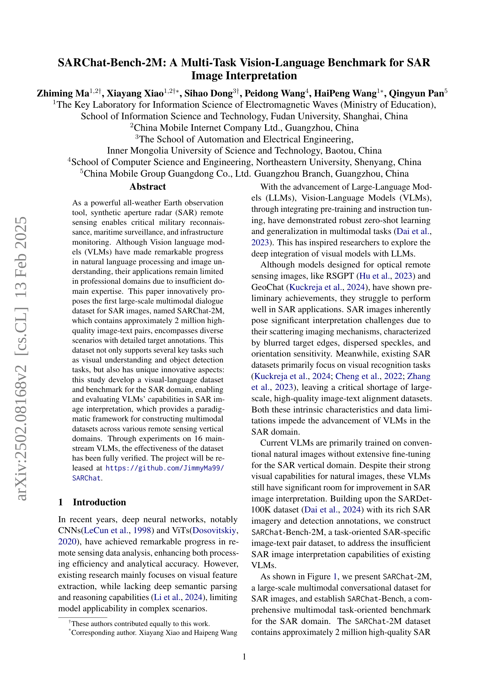
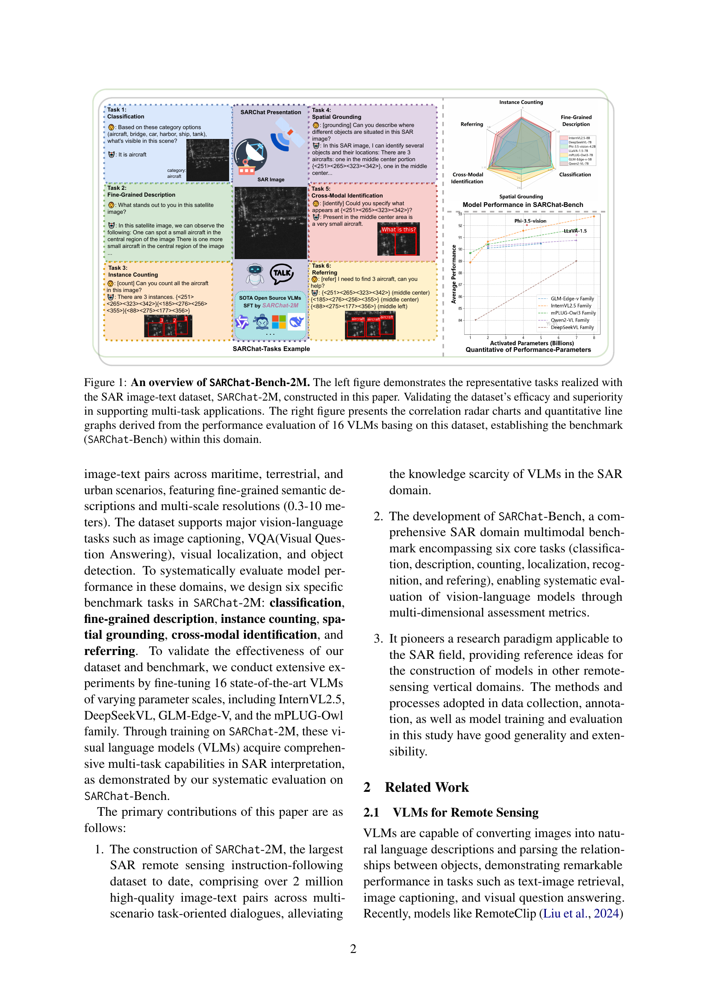
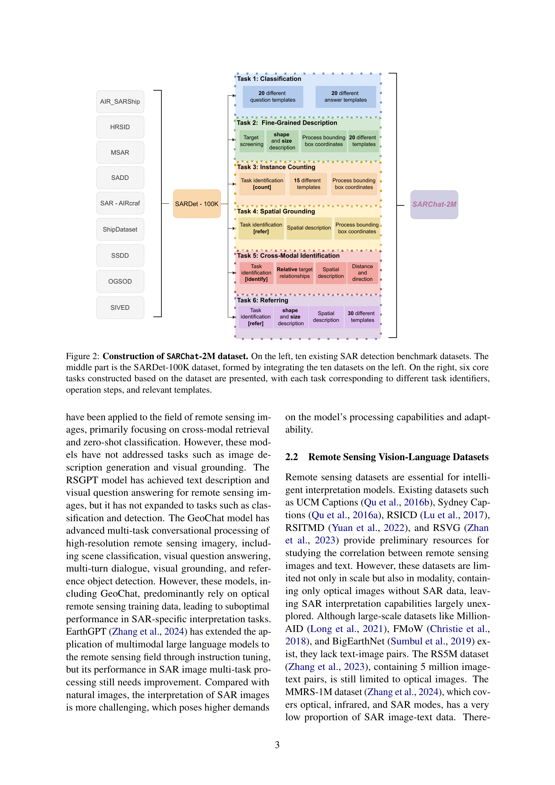
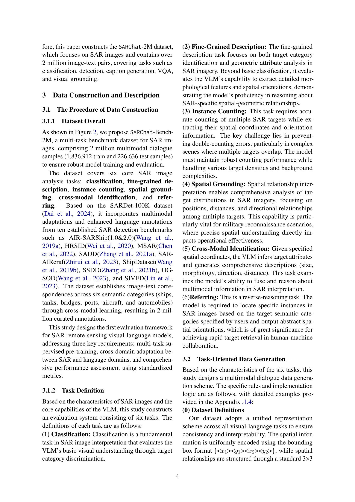
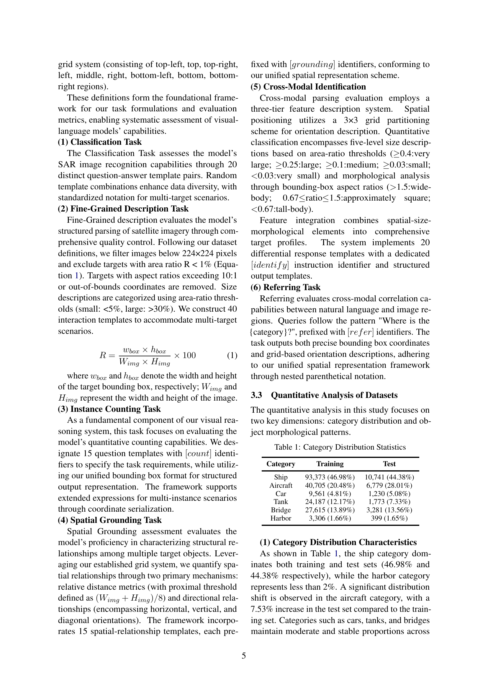
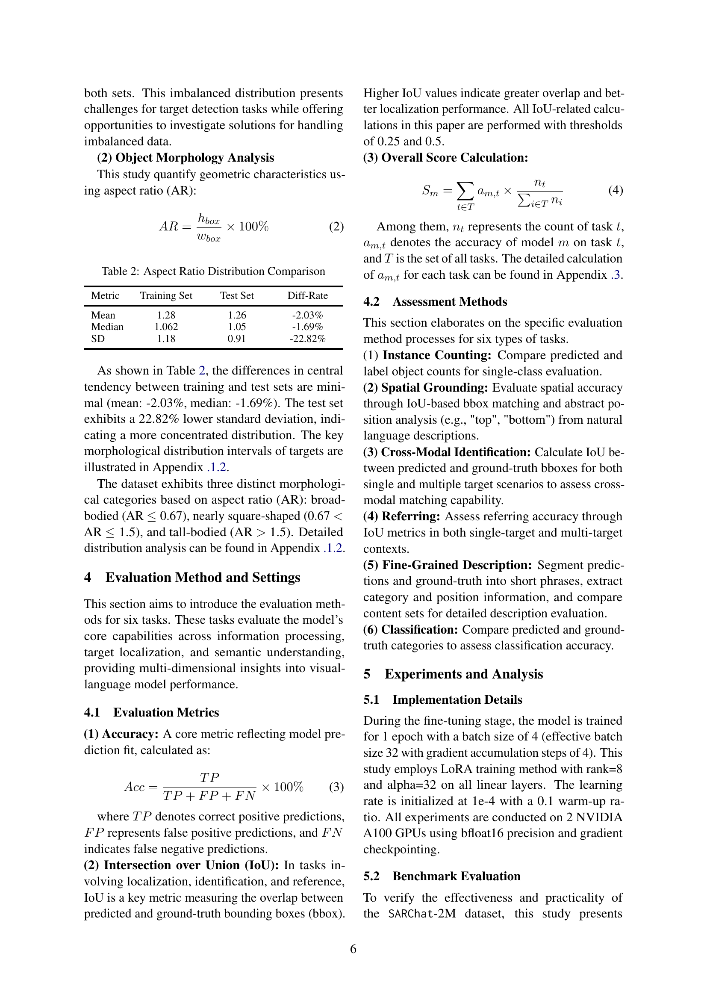
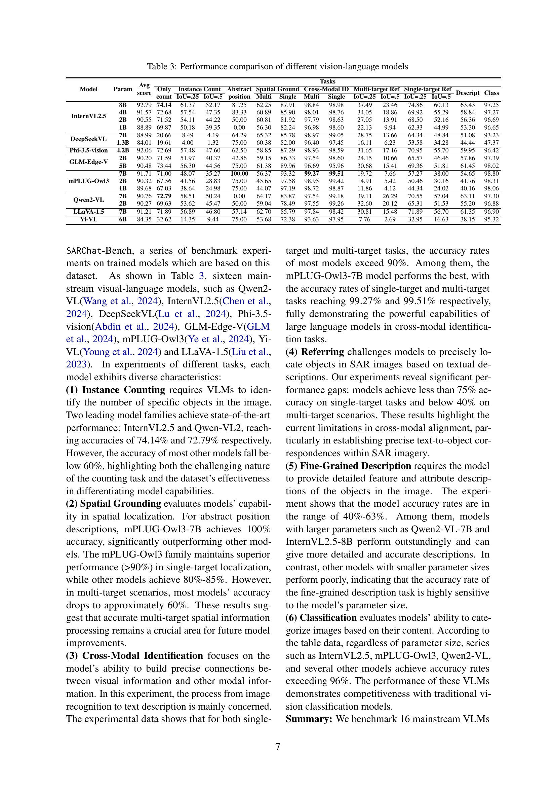
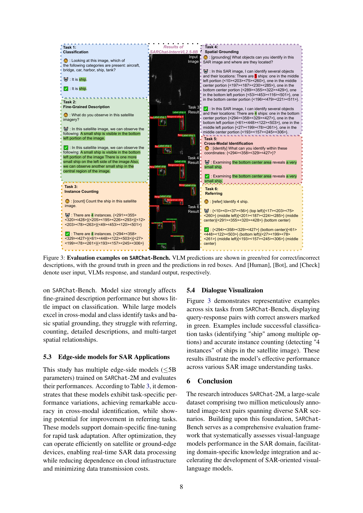
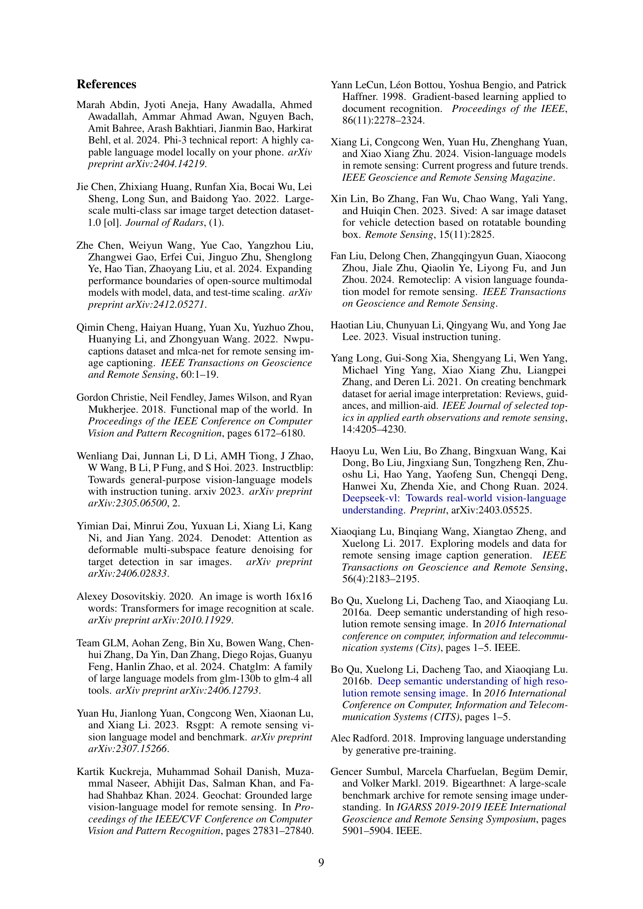
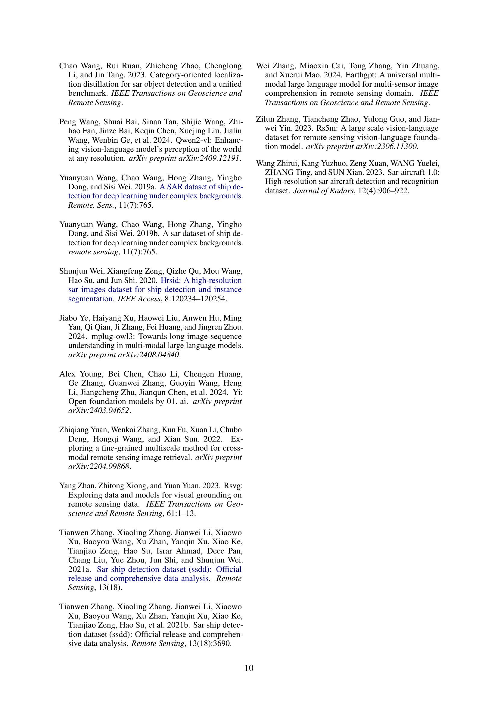
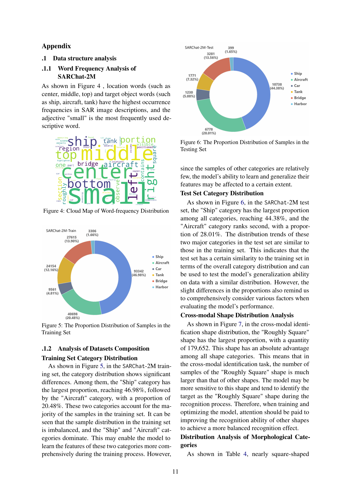
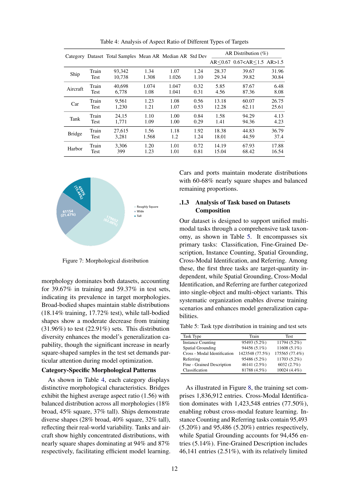
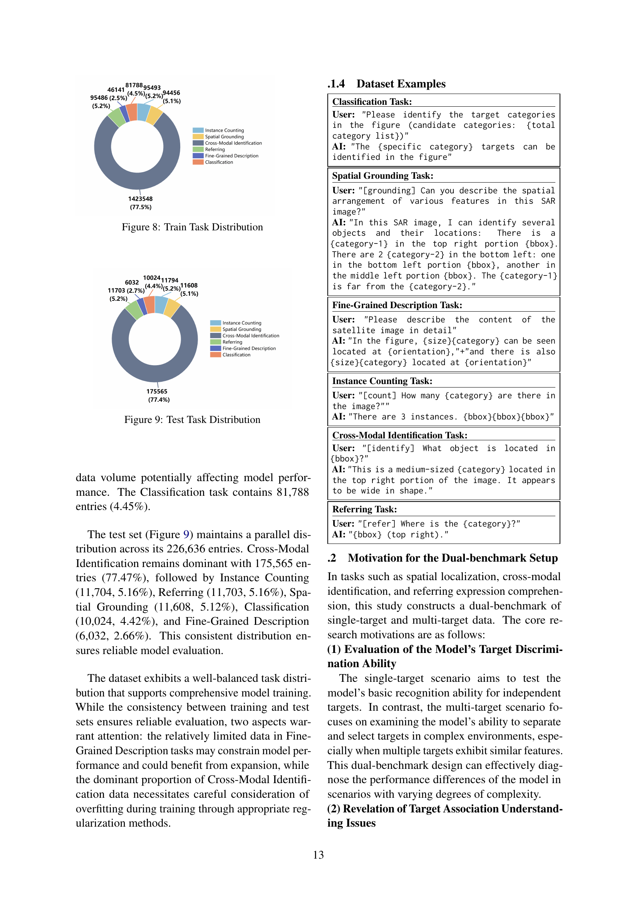
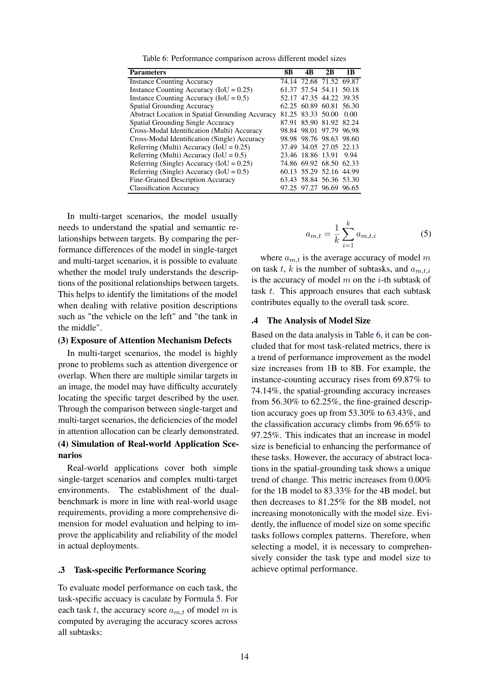
