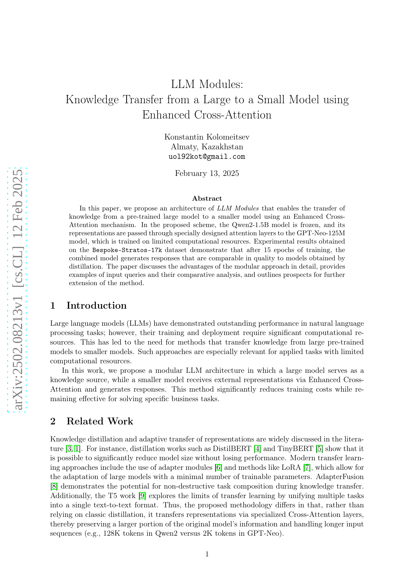
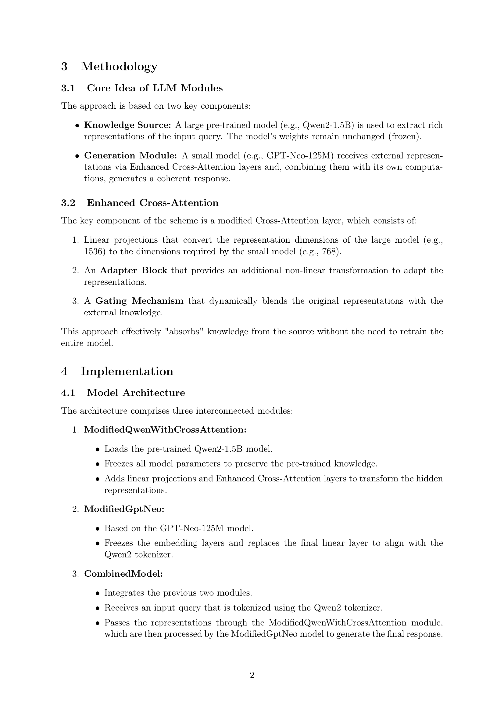
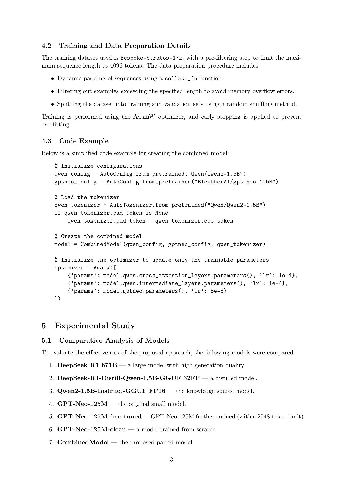
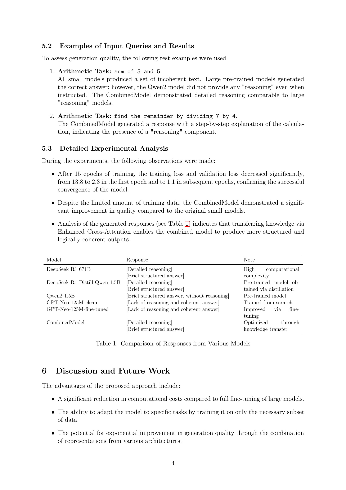
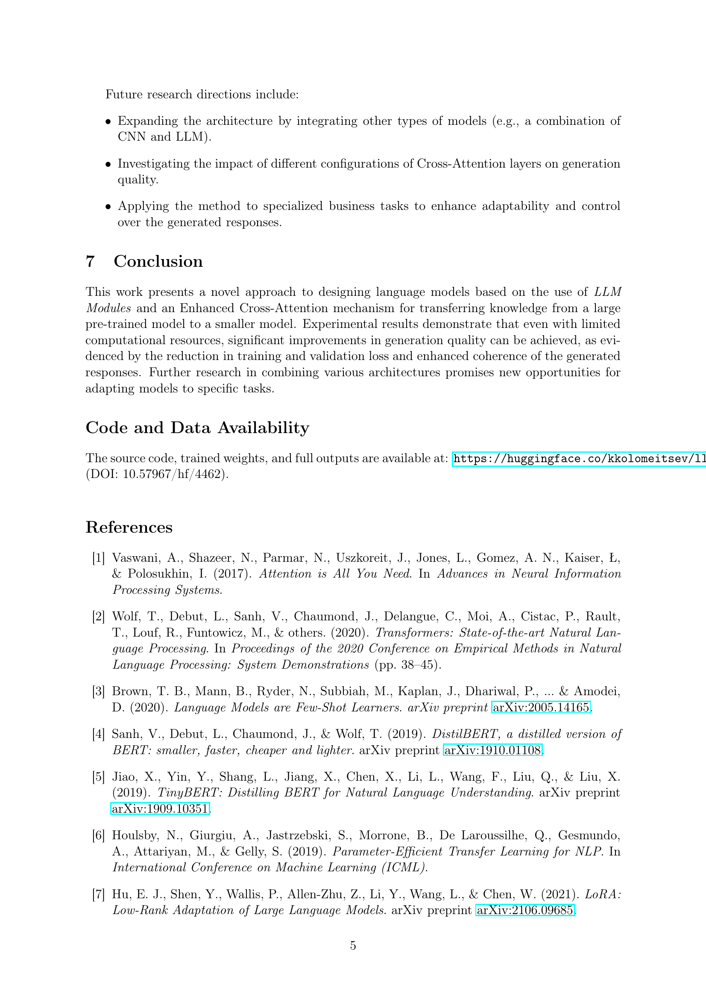
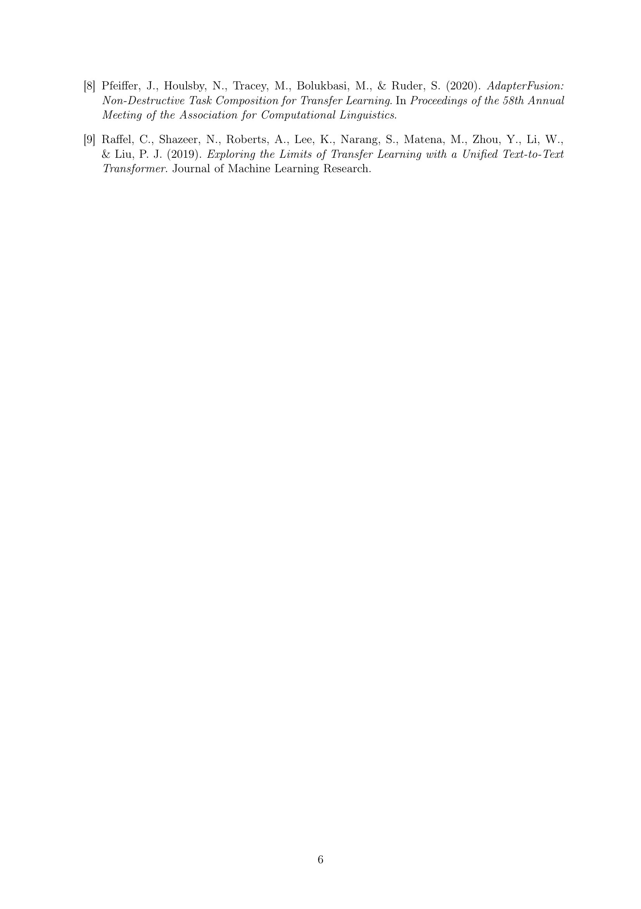

 


 2502.08213 
 Konstantin Kolomeitsev et el. 
 
 🤗 2025-02-13 
 



↗ arXiv


↗ Hugging Face


### TL;DR



대규모 언어 모델(LLM)은 뛰어난 성능을 보이지만, 막대한 컴퓨팅 자원을 필요로 합니다. 이러한 문제를 해결하기 위해, 기존의 지식 증류 방식이 아닌, **대규모 모델의 지식을 소규모 모델로 전이**하는 새로운 방법이 필요합니다. 특히, 제한된 자원을 가진 실제 응용 분야에 적용 가능한 효율적인 방법이 중요합니다.

본 논문에서는 **향상된 크로스 어텐션 메커니즘**을 사용하여, 대규모 사전 학습 모델(Qwen2-1.5B)의 지식을 소규모 모델(GPT-Neo-125M)로 전달하는 새로운 아키텍처인 LLM 모듈을 제안합니다. 실험 결과, 제한된 학습 데이터에도 불구하고, 제안된 방법은 기존의 지식 증류 방식과 유사한 수준의 성능을 달성했습니다.  **모듈식 설계**를 통해 유연성과 확장성을 높였으며, 다양한 입력 질문에 대한 비교 분석을 통해 성능을 검증했습니다.



#### Key Takeaways


 향상된 크로스 어텐션을 사용하여 대규모 모델의 지식을 소규모 모델로 효과적으로 전이하는 새로운 LLM 모듈 아키텍처 제안 



 제한된 컴퓨팅 자원에서도 우수한 성능을 보이는 소규모 모델 학습 성공 



 모듈식 접근 방식을 통해 모델의 적응성 및 확장성 향상 


#### Why does it matter?
본 논문은 **대규모 언어 모델(LLM)의 지식 전이**에 대한 새로운 방법을 제시하여, **컴퓨팅 자원이 제한적인 환경에서도 효과적인 LLM 개발**을 가능하게 합니다. 이는 **모델 크기 축소 및 효율적인 학습**에 대한 연구 트렌드에 크게 기여하며, 다양한 응용 분야에서 LLM의 활용 가능성을 확장합니다. 또한, 제안된 방법의 구체적인 구현과 실험 결과를 제시함으로써, **향후 연구의 기반**을 마련하고, 여러 모델 아키텍처의 조합을 통한 지식 전이 연구를 위한 새로운 가능성을 제시합니다.

------
#### Visual Insights


| Model | Response | Note |
|---|---|---|
| DeepSeek R1 671B | [Detailed reasoning] [Brief structured answer] | High computational complexity |
| DeepSeek R1 Distill Qwen 1.5B | [Detailed reasoning] [Brief structured answer] | Pre-trained model obtained via distillation |
| Qwen2 1.5B | [Brief structured answer, without reasoning] | Pre-trained model |
| GPT-Neo-125M-clean | [Lack of reasoning and coherent answer] | Trained from scratch |
| GPT-Neo-125M-fine-tuned | [Lack of reasoning and coherent answer] | Improved via fine-tuning |
| CombinedModel | [Detailed reasoning] [Brief structured answer] | Optimized through knowledge transfer |

> 🔼 표 1은 다양한 언어 모델의 응답을 비교 분석한 표입니다.  DeepSeek R1 671B, DeepSeek-R1-Distill-Qwen-1.5B-GGUF 32FP, Qwen2-1.5B, GPT-Neo-125M, GPT-Neo-125M-fine-tuned, GPT-Neo-125M-clean, 그리고 제안된 CombinedModel의 다섯 가지 질문에 대한 응답 결과를 보여줍니다. 각 모델의 응답 특징 (세부적인 추론, 간략한 구조화된 답변, 추론 부재 등)을 비교하여 제안된 모델의 성능을 평가합니다.  특히, 제안된 CombinedModel은 제한된 자원에도 불구하고 다른 소형 모델보다 훨씬 더 구조적이고 논리적인 응답을 생성하는 것을 보여줍니다.
> 

> 
read the caption

> Table 1: Comparison of Responses from Various Models
> 

### Full paper



