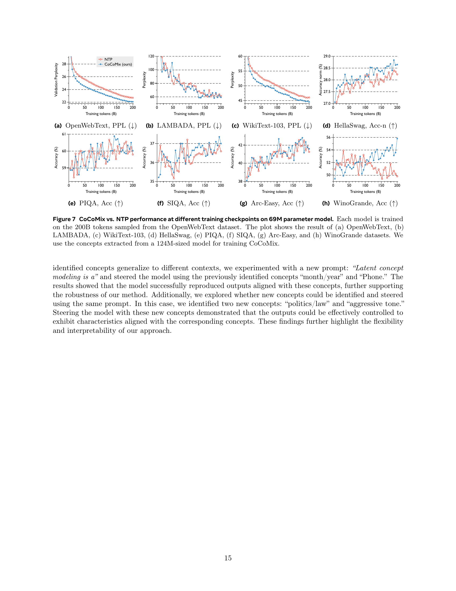

 


 2502.08524 
 Jihoon Tack et el. 
 
 🤗 2025-02-13 
 



↗ arXiv


↗ Hugging Face


### TL;DR



대규모 언어 모델(LLM)은 텍스트 데이터를 기반으로 다음 토큰을 예측하는 방식으로 학습됩니다. 하지만 이 방식은 단순한 토큰 수준의 정보만을 활용하여 고차원적인 추론이나 장기적인 계획과 같은 복잡한 작업 수행에는 어려움을 겪습니다.  기존 연구에서는 보다 풍부한 정보를 활용하거나 다양한 예측 목표를 설정하는 등의 방법을 통해 이 문제를 해결하려는 시도가 있었습니다. 

본 연구에서는 기존의 토큰 예측 방식에 지속적인 개념(continuous concept)을 결합하는 새로운 사전 훈련 프레임워크인 CoCoMix를 제안합니다. CoCoMix는 사전 훈련된 희소 오토인코더(SAE)를 사용하여 지속적인 개념을 추출하고, 이를 모델의 은닉 상태에 삽입하여 토큰 수준의 정보와 결합합니다. 실험 결과, CoCoMix는 기존 방법들보다 샘플 효율성이 높고 다양한 벤치마크에서 일관되게 우수한 성능을 보였습니다. 또한, 예측된 개념을 직접 검사하고 수정함으로써 모델의 해석성과 제어성을 향상시켰습니다.



#### Key Takeaways


 CoCoMix는 기존의 토큰 예측 방식에 지속적인 개념을 추가하여 LLM 사전 훈련의 샘플 효율성을 높였습니다. 



 CoCoMix는 지속적인 개념을 통해 모델의 해석성과 제어성을 향상시켰습니다. 



 CoCoMix는 다양한 벤치마크에서 기존 방법들을 능가하는 성능을 보였습니다. 


#### Why does it matter?
본 논문은 **대규모 언어 모델(LLM)의 성능을 향상시키는 새로운 방법인 CoCoMix를 제안**함으로써, 연구자들에게 **보다 효율적이고 해석 가능하며 조종 가능한 LLM 학습 방법**을 제공합니다.  이는 **개념 학습과 토큰 예측을 결합**하여 샘플 효율성을 높이고 다운스트림 작업에서 일관되게 우수한 성능을 보여줍니다. 또한, **예측된 개념을 직접 검사하고 수정**하여 모델의 내부 추론 과정을 투명하게 안내하는 방법을 제시하여 **해석성과 제어성을 향상**시킵니다. 이러한 발견은 LLM 연구의 주요 추세와 관련이 있으며, 향후 연구를 위한 새로운 가능성을 제시합니다.

------
#### Visual Insights

> 🔼 그림 1은 CoCoMix의 개요를 보여줍니다.  먼저, 사전 훈련된 모델의 은닉 상태(hcon)에서 SAE(Sparse Autoencoder)를 사용하여 개념을 추출합니다. 그런 다음, 출력에 대한 영향(attribution score)을 측정하여 중요한 개념을 선택합니다. 선택된 개념은 개념 예측을 위한 레이블(ℐ)로 사용되며, 교차 엔트로피 손실(CE(⋅,⋅))을 최소화하여 예측합니다. 예측된 개념(𝐳)은 압축되어 하나의 컴팩트 벡터를 형성하고, 이는 연속적인 개념(𝐜)이 됩니다.  이 연속적인 개념은 토큰의 은닉 표현과 번갈아가며 모델의 은닉 상태에 혼합됩니다.  실험 결과, CoCoMix는 표본 효율성이 높고 표준 다음 토큰 예측 및 지식 증류 기준보다 성능이 우수함을 보여줍니다.
> 

> 
read the caption

> Figure 1: Overview of CoCoMix. We use an SAE to extract concepts from a pretrained model’s hidden state h𝚌𝚘𝚗subscriptℎ𝚌𝚘𝚗h_{\mathtt{con}}italic_h start_POSTSUBSCRIPT typewriter_con end_POSTSUBSCRIPT and then select important concepts based on the attribution score (i.e., measuring the influence on the output). These selected concepts are used as labels ℐℐ\mathcal{I}caligraphic_I for concept prediction by minimizing the cross-entropy loss CE⁢(⋅,⋅)CE⋅⋅\mathrm{CE}(\cdot,\cdot)roman_CE ( ⋅ , ⋅ ). The predicted concepts 𝐳𝐳{\mathbf{z}}bold_z are then compressed into a compact vector, forming a continuous concept 𝐜𝐜{\mathbf{c}}bold_c, which is mixed into the model’s hidden state by interleaving with token hidden representations. We demonstrate that CoCoMix is more sample efficient and outperforms standard next-token prediction and knowledge distillation baselines.
> 

### In-depth insights

#### Continuous Concepts
연구 논문에서 "지속적인 개념(Continuous Concepts)"이라는 제목 아래 제시된 내용에 대한 심층적인 분석을 통해 얻을 수 있는 통찰력을 요약하면 다음과 같습니다. **지속적인 개념은 이산적인 토큰(token) 예측만으로는 포착하기 어려운 고차원적인 의미나 개념을 나타내는 것**으로, 기존의 언어 모델이 단순히 단어 나열에만 집중하는 한계를 극복하기 위해 도입되었습니다.  **이는 잠재 공간(latent space)에서 연속적인 벡터로 표현되는 개념**으로, 언어 모델의 숨겨진 상태에 직접적으로 통합되어 모델의 추론 과정을 더욱 풍부하게 만들어줍니다.  이를 통해 모델은 보다 **정교한 추론 능력 및 장기적인 의존성(long-range dependency)**을 갖게 되어, 복잡한 문제 해결 능력이 향상됩니다.  또한, 지속적인 개념은 모델의 **해석성(interpretability) 및 제어 가능성(steerability)**을 높여주는 역할을 합니다.  **개념 벡터를 직접적으로 검사하고 수정**함으로써, 모델의 내부 추론 과정을 투명하게 파악하고 모델의 동작을 제어하는 것이 가능해집니다.  이는 기존의 토큰 기반 언어 모델의 블랙박스적인 성격을 극복하고, 보다 신뢰할 수 있고 통제 가능한 AI 시스템을 개발하는 데 중요한 역할을 할 것으로 기대됩니다.

#### CoCoMix Framework
CoCoMix 프레임워크는 **기존의 다음 토큰 예측 방식에 연속적인 개념을 결합하여** 대규모 언어 모델의 사전 훈련 방식을 개선한 혁신적인 접근법입니다.  **사전 훈련된 희소 오토인코더(SAE)**를 활용하여 모델의 은닉 상태에서 의미 있는 연속 개념을 추출하고, 이를 모델의 은닉 상태에 **섞어서(interleaving)** 다음 토큰 예측에 활용합니다.  **추출된 개념의 중요도를 평가하는 어트리뷰션 점수**를 사용하여 가장 영향력 있는 개념들을 선택하고, 이를 예측하여 연속 개념 벡터로 압축함으로써 모델의 효율성과 해석성을 향상시킵니다.  **개념의 직접적인 검사 및 수정**을 통해 모델의 내부 추론 과정을 투명하게 제어할 수 있다는 점 또한 중요한 특징입니다.  **다양한 벤치마크 실험**을 통해 기존의 다음 토큰 예측 방식이나 지식 증류 방식보다 CoCoMix가 샘플 효율성이 높고 성능이 우수하다는 것을 보여주었으며, 특히 **약한 지도 학습 환경**에서 큰 성과를 거두었습니다.

#### Concept Extraction
본 논문에서 제시된 개념 추출(Concept Extraction) 방법은 **사전 훈련된 희소 오토인코더(SAE)**를 활용하여 **대규모 언어 모델(LLM)**의 은닉 상태에서 의미있는 개념을 추출하는 데 중점을 둡니다.  SAE는 핵심 개념 차원을 강조하면서 불필요한 특징을 제거하는 **희소성 제약 조건**을 적용합니다. 추출된 개념은 **속성 점수(attribution score)**를 기반으로 중요도를 평가하여 선별되며, 이는 모델 출력에 대한 각 개념의 영향력을 정량화하는 지표입니다.  **선별된 개념들은 연속적인 개념 벡터로 압축**되어 LLM의 은닉 상태에 통합됨으로써, 모델의 추론 과정을 투명하게 제어하고 향상시키는 데 기여합니다.  **이 과정은 모델의 해석력과 제어 가능성을 높이는 데 중요**하며, 특히 **약-강 지도 학습 시나리오에서 효과적**임을 실험적으로 보여줍니다.

#### Model Interpretability
본 논문에서 제시된 모델 해석성(Model Interpretability)에 대한 논의는 **연속 개념(Continuous Concepts)**을 활용하여 모델의 내부 추론 과정을 투명하게 파악할 수 있다는 점에 초점을 맞추고 있습니다.  특히, 학습된 개념의 직접적인 검토 및 수정을 통해 모델의 예측 과정을 **가이드**하고, **제어**할 수 있는 가능성을 제시합니다.  이는 단순히 예측 성능 향상뿐 아니라, 모델이 어떻게 결론을 도출하는지 이해하고, 그 과정을 조절하는 데 중요한 의미를 지닙니다.  **압축된 개념 벡터(Compressed Concept Vector)**를 사용하여 모델의 내부 상태에 개념을 통합함으로써, 모델의 해석성을 높이고,  사용자에게 **투명성**을 제공합니다.  이러한 접근 방식은 향후 모델의 신뢰성 향상과 설명 가능한 AI(Explainable AI, XAI) 분야에 중요한 기여를 할 것으로 기대됩니다.  **개념 선택 프레임워크(Concept Selection Framework)**와 **속성 점수(Attribution Score)**는 모델의 해석성을 더욱 강화하는 요소입니다.

#### Future Directions
본 논문의 "미래 방향"에 대한 고찰은 **연속 개념 학습 및 활용의 확장성**에 초점을 맞춰야 합니다.  **다양한 모달리티(텍스트, 이미지, 비디오 등)에 대한 연속 개념 표현을 개발**하고, 이를 기반으로 **다중 모달리티 연속 개념 혼합(CoCoMix) 프레임워크를 확장**하는 연구가 필요합니다. 또한, **개념 선택 및 압축 전략을 개선**하여 더욱 효율적이고 해석 가능한 개념 표현을 얻는 것이 중요합니다.  **대규모 언어 모델의 내부 작동 원리를 밝히는 연구**와 **설명 가능성과 제어 가능성을 향상**시키는 연구도 병행되어야 합니다.  궁극적으로는, **연속 개념을 활용한 보다 강력하고 일반화된 LLM의 개발**이 미래 방향의 핵심 목표가 될 것입니다.  더 나아가 **윤리적, 사회적 함의에 대한 고려**와 함께 **안전하고 책임감 있는 LLM 개발**을 위한 연구가 필수적입니다.

### More visual insights

More on figures

> 🔼 그림 2는 CoCoMix와 NTP의 성능을 다양한 훈련 단계에서 비교한 그래프입니다. (a)는 검증 퍼플렉서티를, (b)는 평균 다운스트림 작업 퍼플렉서티를, (c)는 평균 다운스트림 작업 정확도를 보여줍니다. CoCoMix는 훈련 토큰 수가 증가함에 따라 검증 퍼플렉서티와 다운스트림 작업 퍼플렉서티가 지속적으로 감소하고, 다운스트림 작업 정확도가 지속적으로 증가하는 것을 보여줍니다. 특히, CoCoMix는 NTP보다 21.5% 적은 토큰으로 동일한 성능을 달성하여 표본 효율성을 입증합니다.
> 

> 
read the caption

> (a) Validation perplexity
> 

> 🔼 그림 (b)는 다양한 다운스트림 작업(하위 과제)에 대한 평균 perplexity를 보여줍니다.  perplexity는 언어 모델이 텍스트를 얼마나 잘 생성하는지 측정하는 지표로, 값이 낮을수록 성능이 좋음을 의미합니다. 이 그림은 CoCoMix 모델과 기준 모델(NTP)의 perplexity를 비교하여 CoCoMix 모델이 다양한 하위 과제에서 더 낮은 perplexity를 달성함으로써 더 나은 성능을 보여줌을 시각적으로 보여줍니다.  다운스트림 작업은 모델의 일반화 능력을 평가하는 데 사용되는 추가적인 언어 이해 과제로, 다양한 유형의 언어 이해 능력(예: 추론, 질의응답 등)을 측정합니다. 따라서 이 그림은 CoCoMix 모델의 전반적인 성능 우수성을 보여주는 중요한 지표입니다.
> 

> 
read the caption

> (b) Average downstream task perplexity
> 

> 🔼 그림 (c)는 다양한 다운스트림 작업(하위 과제)에서 CoCoMix 모델의 정확도를 보여줍니다.  다운스트림 작업이란, 사전 훈련된 언어 모델을 특정 작업(예: 질문 응답, 감정 분석)에 적용하는 것을 의미합니다. 이 그림은 CoCoMix가 여러 다운스트림 작업에서 일관되게 높은 정확도를 달성함을 보여주는 다양한 훈련 토큰 수에 대한 결과를 나타냅니다. 즉, CoCoMix는 다양한 하위 과제에서 효과적으로 일반화된다는 것을 의미합니다.  
> 

> 
read the caption

> (c) Average downstream task accuracy
> 

> 🔼 그림 2는 13.8B 파라미터를 가진 모델에 대한 CoCoMix와 NTP(Next Token Prediction)의 성능 비교 결과를 보여줍니다. 두 모델 모두 OpenWebText 데이터셋으로 학습되었으며, CoCoMix의 경우 124M 파라미터의 사전 학습된 모델(기본 모델보다 10배 작음)에서 추출한 개념을 사용합니다. 그림은 (a) 검증 퍼플렉서티, (b) LAMBADA와 WikiText-103에 대한 평균 퍼플렉서티, (c) HellaSwag, PIQA, SIQA, Arc-Easy, 그리고 WinoGrande에 대한 평균 정확도 세 가지 측면에서 CoCoMix가 개선된 성능을 보임을 보여줍니다.
> 

> 
read the caption

> Figure 2:  CoCoMix vs. NTP performance at different training checkpoints. Each model contains a total of 1.38B parameters. Each model is trained on the OpenWebText dataset. For CoCoMix, the concepts are extracted from a 124M-sized model (10×\times× smaller than the base model). The plots show improvements in: (a) validation perplexity, (b) average perplexity on LAMBADA, WikiText-103, and (c) average accuracy on HellaSwag, PIQA, SIQA, Arc-Easy, and WinoGrande.
> 

> 🔼 그림 2는 CoCoMix와 기본적인 다음 토큰 예측(NTP) 방법의 성능을 다양한 훈련 단계에서 비교한 것입니다. CoCoMix는 OpenWebText 데이터셋으로 훈련되었으며, 개념은 1억 2천 4백만 파라미터 모델(기본 모델보다 10배 작음)에서 추출되었습니다. 그림은 검증 퍼플렉서티, LAMBADA, WikiText-103의 평균 퍼플렉서티, 그리고 HellaSwag, PIQA, SIQA, Arc-Easy, WinoGrande의 평균 정확도를 보여줍니다. CoCoMix는 세 가지 지표 모두에서 지속적인 개선을 보여줍니다.
> 

> 
read the caption

> (a) OpenWebText, PPL (↓↓\downarrow↓)
> 

> 🔼 그림 (b)는 LAMBADA 데이터셋에 대한 perplexity(PPL)를 보여줍니다.  Perplexity는 언어 모델이 얼마나 잘 텍스트를 생성하는지 측정하는 지표로, 낮을수록 좋습니다.  이 그래프는 훈련 토큰 수가 증가함에 따라 CoCoMix와 NTP(다음 토큰 예측) 모델의 LAMBADA 데이터셋에 대한 perplexity 변화를 비교 분석합니다.  즉, CoCoMix가 훈련 데이터가 많아짐에 따라 NTP보다 낮은 perplexity를 달성하여 LAMBADA 데이터셋에서 더 나은 성능을 보임을 시각적으로 나타냅니다.
> 

> 
read the caption

> (b) LAMBADA, PPL (↓↓\downarrow↓)
> 

> 🔼 그림 (c)는 WikiText-103 데이터셋에 대한 perplexity(PPL) 변화를 보여줍니다.  낮은 perplexity 값은 모델의 성능이 좋다는 것을 의미합니다.  x축은 학습에 사용된 토큰 수(단위: B, 즉 1B는 10억)이고, y축은 perplexity 값입니다.  다양한 학습 단계에서 NTP(Next Token Prediction)와 CoCoMix(Continuous Concept Mixing) 모델의 perplexity를 비교하여 CoCoMix 모델이 NTP 모델보다 훨씬 낮은 perplexity를 달성함을 보여줍니다. 이는 CoCoMix가 WikiText-103 데이터셋에 대해 더 우수한 성능을 가짐을 시사합니다.
> 

> 
read the caption

> (c) WikiText-103, PPL (↓↓\downarrow↓)
> 

> 🔼 그림 (d)는 HellaSwag 데이터셋에 대한 정확도(Acc-n)를 보여줍니다.  Acc-n은 정답을 맞춘 비율을 의미하며,  ↑ 기호는 CoCoMix 모델이 기준 모델(NTP)보다 성능이 향상되었음을 나타냅니다.  두 개의 ↑ 기호는 성능 향상이 상당히 크다는 것을 강조합니다. 이 그림은 CoCoMix 모델이 다양한 언어 모델링 작업에서 우수한 성능을 보여줌을 시각적으로 보여주는 여러 그림 중 하나입니다.
> 

> 
read the caption

> (d) HellaSwag, Acc-n (↑↑\uparrow↑)
> 

> 🔼 그림 (e)는 PIQA 데이터셋에 대한 CoCoMix 모델의 정확도를 보여줍니다.  PIQA는 물음과 답변의 쌍으로 구성된 데이터셋이며, 모델의 추론 능력을 평가하는 데 사용됩니다.  'Acc (↑↑)'는  CoCoMix 모델이 PIQA 데이터셋에서 상당한 정확도 향상을 보였다는 것을 의미합니다.  두 개의 화살표는 정확도 향상의 정도를 강조합니다. 이 그림은 CoCoMix 모델이 다른 모델들에 비해 PIQA와 같은 추론 기반 과제에서 더 나은 성능을 보임을 시각적으로 보여주는 역할을 합니다.
> 

> 
read the caption

> (e) PIQA, Acc (↑↑\uparrow↑)
> 

> 🔼 그림 (f)는 SIQA(Social Interaction QA) 데이터셋에서 CoCoMix 모델의 정확도를 보여줍니다.  'Acc (↑↑)'는 정확도가 상당히 향상되었음을 의미합니다. 이는 CoCoMix가 사회적 상호작용에 대한 이해를 요구하는 질문에 대해서도 우수한 성능을 보임을 시사합니다.  즉,  단순한 언어 모델링뿐 아니라, 보다 복잡하고 상황에 맞는 이해를 필요로 하는 작업에서도 효과적임을 나타냅니다.
> 

> 
read the caption

> (f) SIQA, Acc (↑↑\uparrow↑)
> 

> 🔼 그림 (g)는 Arc-Easy 데이터셋에 대한 CoCoMix 모델의 정확도(Accuracy)를 보여줍니다.  'Acc (↑↑)'는  CoCoMix 모델이 기존의 Next Token Prediction (NTP) 모델에 비해 Arc-Easy 작업에서 상당히 높은 정확도 향상을 보였다는 것을 의미합니다.  두 개의 화살표는 정확도 향상의 정도가 매우 크다는 것을 강조합니다. 이 그림은 CoCoMix가 다양한 downstream task에서 일관되게 성능 향상을 달성했음을 보여주는 여러 그림 중 하나입니다.
> 

> 
read the caption

> (g) Arc-Easy, Acc (↑↑\uparrow↑)
> 

> 🔼 그림 (h)는 WinoGrande 데이터셋에 대한 정확도(Accuracy)를 보여줍니다.  WinoGrande는 상식적 추론 능력을 평가하는 벤치마크 데이터셋이며, 이 그래프는 CoCoMix 모델과 기존의 다음 토큰 예측(NTP) 모델의 성능을 훈련 토큰 수에 따라 비교합니다.  화살표(↑↑)는 CoCoMix 모델이 NTP 모델보다 WinoGrande 데이터셋에서 유의미하게 더 높은 정확도를 달성했음을 시각적으로 보여줍니다.
> 

> 
read the caption

> (h) WinoGrande, Acc (↑↑\uparrow↑)
> 

> 🔼 그림 3은 다양한 크기(69M, 386M, 13.8B 파라미터)의 언어 모델에 대해 CoCoMix와 NTP의 성능을 비교한 결과를 보여줍니다.  200B개의 OpenWebText 토큰으로 모델들을 학습시켰고, OpenWebText 검증 퍼플렉서티와 LAMBADA, WikiText-103, HellaSwag, PIQA, SIQA, Arc-Easy, WinoGrande 등의 다운스트림 데이터셋을 사용하여 모델들을 평가했습니다.  각 그래프는 특정 지표(퍼플렉서티 또는 정확도)에 대한 CoCoMix와 NTP의 성능 차이를 보여줍니다. 이를 통해 다양한 모델 크기에 따른 CoCoMix의 성능과 효율성을 파악할 수 있습니다.
> 

> 
read the caption

> Figure 3:  CoCoMix vs. NTP performance at different model sizes. We consider various model sizes, including 69M, 386M, and 1.38B parameters and train on 200B OpenWebText tokens. We evaluate the models on OpenWebText validation perplexity and downstream datasets LAMBADA, WikiText-103, HellaSwag, PIQA, SIQA, Arc-Easy, and WinoGrande.
> 

> 🔼 그림 4(a)는 약세-강세 학습 설정에서 평균 perplexity를 보여줍니다.  약세-강세 학습이란 작은 모델(124M 매개변수)에서 추출된 개념을 사용하여 더 큰 모델(386M 매개변수)을 학습시키는 것을 의미합니다.  이 그림은 OpenWebText, LAMBADA, WikiText 데이터셋에 대한 평균 perplexity를 나타내며, CoCoMix가 KD(지식 증류) 및 NTP(다음 토큰 예측)보다 성능이 우수함을 보여줍니다.
> 

> 
read the caption

> (a) Weak-to-strong: Avg. Perplexity
> 

> 🔼 그림 (b)는 약한-강한 지도 학습 설정에서 평균 정확도를 보여줍니다.  여기서 124M 크기의 모델이 386M 크기의 모델을 위한 교사 모델 역할을 합니다.  OpenWebText, LAMBADA, WikiText 데이터셋을 사용한 평균 perplexity와 HellaSwag, PIQA, SIQA, Arc-Easy, WinoGrande 데이터셋을 사용한 평균 정확도를 비교하여 CoCoMix의 성능을 보여줍니다.  CoCoMix는 기존의 지식 증류(KD) 방법보다 약한-강한 지도 학습 설정에서 상당한 성능 향상을 보여줍니다.
> 

> 
read the caption

> (b) Weak-to-strong: Avg. Accuracy
> 

> 🔼 그림 4(c)는 CoCoMix, 지식 증류(KD), 그리고 순수 다음 토큰 예측(NTP) 세 가지 방법의 성능을 OpenWebMath 데이터셋에서 비교 분석한 결과를 보여줍니다.  OpenWebMath는 수학 관련 지식에 초점을 맞춘 데이터셋이기 때문에, 이 그림은 모델들이 OpenWebMath와 같은 새로운 데이터 분포에 적응하는 능력, 즉 일반화 능력을 평가하기 위한 것입니다.  이 그림을 통해  CoCoMix가 기존 방법들보다 새로운 데이터셋에 대해 더 나은 성능을 보이는지 확인할 수 있습니다.
> 

> 
read the caption

> (c) Distribution shift (OpenWebMath)
> 

> 🔼 그림 4는 386M 크기의 모델을 사용하여 CoCoMix와 지식 증류(KD)의 성능을 비교한 결과를 보여줍니다. 약-강 지도 학습 설정에서, KD의 교사 모델(또는 CoCoMix의 개념 추출 모델)은 124M 크기의 모델로 설정되었습니다. 그림에서는 (a) OpenWebText, LAMBADA 및 WikiText에 대한 평균 perplexity와 (b) HellaSwag, PIQA, SIQA, Arc-Easy 및 WinoGrande 데이터셋에 대한 평균 정확도를 비교 분석하였습니다. (c)에서는 데이터 분포 변화 설정을 위해 모든 방법론을 수학 전용 사전 훈련 코퍼스인 OpenWebMath로 훈련시킨 결과를 보여줍니다.  즉, 그림 4는 서로 다른 크기의 모델과 서로 다른 데이터셋을 사용하여 CoCoMix와 KD 기법을 비교 분석하고, 그 결과를 perplexity와 정확도 지표로 제시합니다.
> 

> 
read the caption

> Figure 4:  CoCoMix vs. Knowledge Distillation (KD). For our weak-to-strong supervision setup, we train a 386M model where the teacher of KD (or concept extraction for CoCoMix) is a 124M-sized model: we report (a) average perplexity over OpenWebText, LAMABADA, and WikiText and (b) average accuracy over HellaSwag, PIQA, SIQA, Arc-Easy, and WiniGrande dataset. For (c) a distribution shift setup, we train all methods on OpenWebMath, a math specific pretraining corpus.
> 

> 🔼 그림 5는 개념 조향 효과를 정성적으로 보여줍니다. OpenWebText 데이터셋으로 학습된 CoCoMix와 GPT-2 모델은 각각 3억 5천만개와 1억 2천 4백만개의 파라미터를 가진 변환기 모델입니다. CoCoMix의 경우 예측된 개념 로짓 𝐳 를 조작하여, GPT-2의 경우 특정 개념 인덱스의 활성화를 증가시켜 SAE 개념 공간 𝐜 를 조정합니다. 이 그림은 목표 개념 조향이 각 모델의 출력에 미치는 영향을 보여줍니다.
> 

> 
read the caption

> Figure 5: Qualitative demonstration of the concept steering effect. CoCoMix and GPT2 models are 350M and 124M parameter transformers, respectively, trained on the OpenWebText dataset. For CoCoMix, we manipulate the predicted concept logit 𝐳𝐳{\mathbf{z}}bold_z, while for GPT2, we adjust the SAE concept space 𝐜𝐜{\mathbf{c}}bold_c by increasing the activation of a specific concept index. This illustrates the impact of targeted concept steering on the respective model outputs.
> 

> 🔼 그림 6(a)는 모델의 출력에 대한 각 개념의 영향을 정량화하는 지표인 귀인 점수(attribution score)의 효과를 보여줍니다. 귀인 점수를 사용하여 중요한 개념을 선택하는 것이 활성화 값(activation value)만 사용하는 것보다 샘플 효율성을 17.5% 향상시키는 것을 보여줍니다. 이는 귀인 점수가 개념의 중요성을 더 잘 반영하고, 불필요한 개념을 제거하여 모델 성능을 향상시키는 데 도움이 됨을 시사합니다.
> 

> 
read the caption

> (a) Effectiveness of the attribution score
> 

> 🔼 그림 (b)는 CoCoMix 모델의 성능을 평가하기 위해 개념 예측과 은닉 상태 직접 예측을 비교한 결과를 보여줍니다. CoCoMix는 사전 훈련된 SAE(Sparse Autoencoder)를 사용하여 은닉 상태에서 개념을 추출하고, 이를 사용하여 다음 토큰을 예측합니다. 반면에 은닉 상태 직접 예측은 SAE를 사용하지 않고 은닉 상태를 직접 예측하여 다음 토큰을 예측합니다. 이 그림은 은닉 상태 직접 예측 방식이 CoCoMix보다 성능이 떨어진다는 것을 보여주며, SAE를 사용하여 개념을 추출하는 것이 모델 성능 향상에 중요함을 시사합니다.
> 

> 
read the caption

> (b) Concept vs. direct hidden state
> 

> 🔼 그림 6(c)는 CoCoMix 모델의 압축 계층(compression layer) 가중치 분석 결과를 보여줍니다. CoCoMix는 여러 개의 예측된 개념들을 압축된 연속적인 개념 벡터로 변환하는데, 이때 사용되는 압축 계층의 가중치를 분석하여 각 개념의 중요도를 시각화한 것입니다. 가중치의 크기가 클수록 해당 개념이 최종적인 다음 토큰 예측에 더 큰 영향을 미치는 것을 의미합니다. 그림에서는 개념 가중치의 크기를 12-norm으로 계산하여 표시하고 있으며, 일부 개념들의 가중치가 거의 0에 가까운 것을 확인할 수 있습니다. 이는 CoCoMix가 최종 예측에 불필요한 개념들을 효과적으로 무시하고 중요한 개념들만을 선택적으로 사용한다는 것을 시사합니다. 특히, 작은 모델에서 추출한 개념을 큰 모델에 적용하는 약-강(weak-to-strong) 지도 학습 시나리오에서 이러한 특징이 효과적으로 작동하여 성능 향상에 기여할 수 있다고 논문에서는 주장합니다.
> 

> 
read the caption

> (c) Compression layer’s weight analysis
> 

> 🔼 그림 (d)는 CoCoMix의 효과를 분석하기 위해 개별 구성 요소(구성 요소 분석)의 기여도를 보여줍니다.  구체적으로, 개념 예측(Equation 2)과 개념 삽입(Equation 4)의 두 가지 주요 구성 요소가 성능 향상에 얼마나 중요한지 보여줍니다.  개념 예측 손실만 적용하면 성능이 다소 향상되지만, 개념 삽입을 함께 적용하면 성능이 더 크게 향상되는 것을 확인할 수 있습니다.  이를 통해 개념 예측과 개념 삽입이 모두 CoCoMix의 성능 향상에 중요한 역할을 한다는 것을 알 수 있습니다.
> 

> 
read the caption

> (d) Component analysis
> 

> 🔼 그림 (e)는 CoCoMix 모델의 핵심 구성 요소 중 하나인 지속적인 개념(continuous concept)을 모델의 은닉 상태(hidden state)에 통합하는 방법에 대한 디자인 선택지를 보여줍니다.  두 가지 방법, 즉 개념 벡터를 기존 토큰 임베딩에 추가하는 '추가(Adding)' 방식과 토큰 임베딩과 개념 벡터를 번갈아 배치하는 '혼합(Mixing/Interleaving)' 방식을 비교 분석합니다.  그림은 각 방법을 사용했을 때의 검증 퍼플렉서티(validation perplexity) 변화를 보여주어, 어떤 방식이 모델 성능 향상에 더 효과적인지를 시각적으로 제시합니다.  결과적으로 혼합 방식이 추가 방식보다 성능이 우수함을 확인할 수 있습니다.
> 

> 
read the caption

> (e) Design choice for concept condition
> 

> 🔼 그림 (f)는 pause token을 사용한 방법과 CoCoMix의 성능을 비교한 결과를 보여줍니다. pause token은 모델이 다음 토큰을 예측하기 전에 일시 정지하여 생각할 수 있도록 하는 추가적인 학습 가능한 토큰입니다. 이 그림은 pause token을 사용한 방법과 pause token에 지식 증류(KD)를 적용한 방법, 그리고 CoCoMix의 검증 perplexity를 비교하여 CoCoMix가 다른 방법들보다 우수한 성능을 보임을 시각적으로 보여줍니다.
> 

> 
read the caption

> (f) Comparison with Pause Token
> 

> 🔼 그림 6은 CoCoMix의 효과를 분석한 그림입니다. (a)에서는 개념 선택에 대한 기여도 점수의 효과를 보여줍니다. (b)에서는 개념 예측과 직접적인 은닉 상태 예측(SAE를 사용하여 은닉 상태를 이산화하는 대신 연속 손실을 사용하여 은닉 상태를 예측) 간의 비교를 보여줍니다. (c)는 압축 가중치의 스파스성을 보여줍니다. (d)는 개념 예측과 혼합의 기여도를 분석하여 구성 요소 분석을 수행합니다. (e)는 원래 은닉 상태에 개념 벡터를 추가하는 것과 토큰 은닉 표현과 개념 벡터를 섞는 것(토큰 은닉 표현과 개념 벡터를 섞음)을 비교하여 개념 조건화에 대한 설계 선택을 보여줍니다. (f)는 CoCoMix와 Pause 토큰(즉, 학습 가능한 토큰 추가) 간의 비교를 보여줍니다. 69M 변환기와 OpenWebText 데이터셋의 20B 토큰을 사용했습니다.
> 

> 
read the caption

> Figure 6:  Analysis of CoCoMix: (a) Effectiveness of the attribution score for selecting concepts. (b) Comparison between concept prediction and direct hidden state prediction (i.e., predicting the hidden state with continuous loss rather than discretizing the hidden state with SAE). (c) The sparsity in the compression weight. (d) Component analysis by analyzing the contribution of concept prediction and mixing. (e) Design choices for concept conditioning by comparing adding the concept vector to the original hidden state and mixing (interleaving the concept vector with token hidden representation). (f) Comparison between CoCoMix and the Pause token (i.e., adding learnable tokens). We use a 69M transformer and train on 20B tokens from the OpenWebText dataset.
> 

> 🔼 그림 2는 CoCoMix와 기존의 다음 토큰 예측(NTP) 방법의 성능을 다양한 훈련 단계에서 비교한 것입니다. (a)는 OpenWebText 데이터셋을 사용한 검증 퍼플렉서티를 보여줍니다. CoCoMix는 NTP보다 낮은 퍼플렉서티를 보이며, 훈련 토큰 수가 증가함에 따라 성능 향상이 더욱 두드러집니다.  이는 CoCoMix가 더 적은 샘플로도 높은 성능을 달성할 수 있음을 시사합니다.
> 

> 
read the caption

> (a) OpenWebText, PPL (↓↓\downarrow↓)
> 

> 🔼 그림 (b)는 LAMBADA 데이터셋에 대한 퍼플렉서티(perplexity)를 보여줍니다.  퍼플렉서티는 언어 모델이 텍스트를 얼마나 잘 생성하는지 측정하는 지표로, 값이 낮을수록 성능이 좋음을 의미합니다.  이 그림은 다양한 훈련 토큰 수에 따른 CoCoMix(ours)와 NTP 모델의 퍼플렉서티를 비교하여 CoCoMix가 더 나은 성능을 보임을 시각적으로 나타냅니다.  세로축은 퍼플렉서티 값이고, 가로축은 훈련에 사용된 토큰 수 (단위: B, 1B = 10억) 입니다.
> 

> 
read the caption

> (b) LAMBADA, PPL (↓↓\downarrow↓)
> 

> 🔼 그림 (c)는 WikiText-103 데이터셋에 대한 perplexity(PPL) 변화를 보여줍니다.  Perplexity는 언어 모델의 성능을 평가하는 지표로, 값이 낮을수록 모델의 성능이 좋음을 의미합니다.  이 그림은 여러가지 다른 학습 방법 (예: NTP, CoCoMix 등)을 사용했을 때, WikiText-103 데이터셋에 대한 perplexity가 학습 토큰 수에 따라 어떻게 변화하는지를 나타냅니다.  즉,  다양한 학습 방법을 적용했을 때 WikiText-103 데이터셋에서의 언어 모델 성능 변화를 perplexity를 통해 시각적으로 보여주는 그래프입니다.
> 

> 
read the caption

> (c) WikiText-103, PPL (↓↓\downarrow↓)
> 

> 🔼 그림 (d)는 HellaSwag 데이터셋에 대한 정확도(Acc-n)를 보여줍니다.  HellaSwag는 상식적 추론 능력을 평가하는 벤치마크 데이터셋이며, Acc-n은 정답률을 나타냅니다.  이 그림은 CoCoMix 모델이 기존의 다음 토큰 예측(NTP) 방법에 비해 HellaSwag 데이터셋에서 얼마나 성능이 향상되었는지 보여주는 결과입니다.  화살표는 CoCoMix 모델의 성능 향상을 시각적으로 강조합니다.  즉,  CoCoMix를 사용하면 상식 추론 작업에서 성능이 크게 향상됨을 보여줍니다.
> 

> 
read the caption

> (d) HellaSwag, Acc-n (↑↑\uparrow↑)
> 

> 🔼 그림 (e)는 PIQA(Physical Interaction QA) 데이터셋에 대한 CoCoMix 모델의 정확도(Accuracy)를 보여줍니다.  PIQA는 물리적 상식 추론 능력을 평가하는 질문응답 데이터셋이며,  이 그림은 CoCoMix 모델이 PIQA에서 얼마나 좋은 성능을 보이는지, 특히 다른 모델들과 비교했을 때 얼마나 향상된 성능을 보이는지를 나타냅니다.  'Acc (↑↑)'은 정확도가 상당히 향상되었음을 의미합니다.  정확도 수치 자체는 표나 본문에 제시되어 있을 것으로 예상됩니다.
> 

> 
read the caption

> (e) PIQA, Acc (↑↑\uparrow↑)
> 

> 🔼 그림 (f)는 SIQA(Social Interaction QA) 데이터셋에 대한 CoCoMix 모델의 정확도를 보여줍니다.  'Acc (↑↑)'는 정확도가 상당히 향상되었음을 의미합니다. 이는 CoCoMix 모델이 사회적 상호작용에 대한 이해를 높이는 데 효과적임을 시사합니다. 그림은 CoCoMix가 다양한 벤치마크 데이터셋에서 일관되게 성능 향상을 보임을 보여주는 실험 결과 중 하나의 예시입니다.
> 

> 
read the caption

> (f) SIQA, Acc (↑↑\uparrow↑)
> 

> 🔼 그림 (g)는 Arc-Easy 데이터셋에 대한 CoCoMix 모델의 정확도(Accuracy)를 보여줍니다.  'Acc (↑↑)'는 정확도가 상당히 향상되었음을 의미합니다. 이 그림은 다양한 모델 크기(69M, 386M, 1.38B 파라미터)에 걸쳐 CoCoMix가 기본적인 다음 토큰 예측(NTP) 방법보다 성능이 우수함을 보여주는 실험 결과 중 하나입니다.  특히 Arc-Easy는 추론 능력을 평가하는 데이터셋이기 때문에, CoCoMix의 향상된 성능은 개선된 추론 능력을 시사합니다.
> 

> 
read the caption

> (g) Arc-Easy, Acc (↑↑\uparrow↑)
> 

> 🔼 그림 2는 다양한 크기의 사전 학습된 언어 모델(69M, 386M, 1.38B 매개변수)에 대해 CoCoMix와 NTP의 성능을 비교한 것입니다.  OpenWebText 검증 집합의 퍼플렉서티와 LAMBADA, WikiText-103, HellaSwag, PIQA, SIQA, Arc-Easy 및 WinoGrande와 같은 다운스트림 작업의 평균 퍼플렉서티 및 정확도를 평가했습니다.  (h)는 WinoGrande 데이터셋에서의 정확도를 나타내며, CoCoMix가 NTP보다 성능이 훨씬 뛰어남을 보여줍니다.  이 그림은 CoCoMix가 다양한 모델 크기에서 일관되게 우수한 성능을 발휘하며, 특히 WinoGrande와 같은 어려운 추론 작업에서 그 효과가 두드러짐을 시각적으로 보여줍니다.
> 

> 
read the caption

> (h) WinoGrande, Acc (↑↑\uparrow↑)
> 

> 🔼 그림 7은 69M 파라미터 모델에 대한 CoCoMix와 NTP의 성능을 다양한 훈련 시점에서 비교한 것입니다. 각 모델은 OpenWebText 데이터셋에서 샘플링된 200B 토큰으로 훈련되었습니다. 그래프는 (a) OpenWebText, (b) LAMBADA, (c) WikiText-103, (d) HellaSwag, (e) PIQA, (f) SIQA, (g) Arc-Easy, (h) WinoGrande 데이터셋에 대한 결과를 보여줍니다. CoCoMix 훈련에는 124M 크기의 모델에서 추출한 개념이 사용되었습니다.  이 그림은 다양한 언어 모델링 벤치마크에서 CoCoMix가  다른 방법론들에 비해 성능이 얼마나 뛰어난지 보여주는 증거로 제시됩니다. 특히,  다른 모델 크기 (69M, 386M, 1.38B)에서도 일관된 성능 향상을 보여줍니다.
> 

> 
read the caption

> Figure 7:  CoCoMix vs. NTP performance at different training checkpoints on 69M parameter model. Each model is trained on the 200B tokens sampled from the OpenWebText dataset. The plot shows the result of (a) OpenWebText, (b) LAMBADA, (c) WikiText-103, (d) HellaSwag, (e) PIQA, (f) SIQA, (g) Arc-Easy, and (h) WinoGrande datasets. We use the concepts extracted from a 124M-sized model for training CoCoMix.
> 

> 🔼 그림 2(a)는 OpenWebText 데이터셋을 사용하여 사전 훈련된 1.38B 매개변수 모델의 검증 퍼플렉서티(PPL)를 보여줍니다.  CoCoMix(파란색 선)는 표준 다음 토큰 예측(NTP, 주황색 선)과 비교하여 훈련 토큰 수가 증가함에 따라 퍼플렉서티가 더 낮게 유지됨을 보여줍니다.  특히, CoCoMix는 훈련 토큰이 21.5% 적게 사용되었음에도 불구하고 NTP와 유사한 성능을 보여주어 샘플 효율성이 높음을 시사합니다.
> 

> 
read the caption

> (a) OpenWebText, PPL (↓↓\downarrow↓)
> 

> 🔼 그림 (b)는 LAMBADA 벤치마크에 대한 결과를 보여줍니다. LAMBADA는 어려운 언어 추론 능력을 요구하는 질문응답 데이터셋입니다.  PPL (Perplexity)은 모델이 텍스트를 얼마나 잘 예측하는지를 나타내는 지표로, 값이 낮을수록 성능이 좋음을 의미합니다.  이 그림에서는 CoCoMix 모델이 기준 모델(NTP)보다 낮은 PPL 값을 기록하여, LAMBADA 데이터셋에서 더 나은 성능을 보였음을 시각적으로 보여줍니다.  즉, CoCoMix 모델이 복잡한 언어 추론 문제에 대해서 더 정확하게 답변을 예측할 수 있음을 의미합니다.
> 

> 
read the caption

> (b) LAMBADA, PPL (↓↓\downarrow↓)
> 

> 🔼 그림 (c)는 3가지 크기의 언어 모델(69M, 386M, 1.38B 파라미터)을 WikiText-103 데이터셋으로 사전 훈련 시킨 결과를 보여줍니다.  세로축은 평균 perplexity(낮을수록 좋음)이고, 가로축은 사용된 훈련 토큰 수(단위: 10억)입니다. CoCoMix(파란색 선)과 기본적인 다음 토큰 예측(NTP, 주황색 선) 방법을 비교하여, CoCoMix가 다양한 모델 크기에서 꾸준히 더 낮은 perplexity를 달성함을 보여줍니다. 이는 CoCoMix가 더 적은 훈련 데이터로도 높은 성능을 달성할 수 있음을 시사합니다.
> 

> 
read the caption

> (c) WikiText-103, PPL (↓↓\downarrow↓)
> 

> 🔼 그림 (d)는 HellaSwag 데이터셋에서의 정확도(Acc-n)를 보여줍니다.  HellaSwag는 상식 추론 능력을 평가하는 벤치마크 데이터셋이며, Acc-n은 정답률을 의미합니다.  두 개의 화살표는 CoCoMix 모델이 기존의 NTP(Next Token Prediction) 모델에 비해 상당히 높은 정확도를 달성했음을 시각적으로 강조합니다. 이는 CoCoMix가 언어 모델의 상식 추론 능력 향상에 효과적임을 보여주는 결과입니다.
> 

> 
read the caption

> (d) HellaSwag, Acc-n (↑↑\uparrow↑)
> 

> 🔼 그림 (e)는 PIQA(Physical Interaction QA) 데이터셋에 대한 CoCoMix 모델의 정확도(Accuracy)를 보여줍니다.  PIQA는 물리적 상식에 대한 추론 능력을 평가하는 질문응답 데이터셋이며, 이 그림은 CoCoMix 모델이 PIQA 질문에 대해 얼마나 정확하게 답변하는지를 나타냅니다.  화살표 두 개 (↑↑)는 CoCoMix 모델의 성능이 기준 모델(NTP)보다 상당히 향상되었음을 시각적으로 강조합니다.
> 

> 
read the caption

> (e) PIQA, Acc (↑↑\uparrow↑)
> 

> 🔼 그림 (f)는 SIQA(Social Interaction QA) 데이터셋에 대한 CoCoMix 모델의 정확도를 보여줍니다.  'Acc'는 정확도를 나타내고, 화살표 두 개는 CoCoMix 모델의 성능이 SIQA 작업에서 상당히 향상되었음을 의미합니다.  이 그림은 CoCoMix가 다양한 언어 모델링 벤치마크에서 일관되게 우수한 성능을 보임을 보여주는 여러 그림 중 하나입니다.
> 

> 
read the caption

> (f) SIQA, Acc (↑↑\uparrow↑)
> 

> 🔼 그림 (g)는 Arc-Easy 데이터셋에 대한 CoCoMix 모델의 정확도를 보여줍니다.  'Acc (↑↑)'는 정확도가 상당히 향상되었음을 의미합니다. 이 그림은 CoCoMix 모델이 다양한 벤치마크에서 일관되게 성능 향상을 보여주는 여러 실험 결과 중 하나입니다.  특히, Arc-Easy와 같은 추론 능력을 요구하는 과제에서 CoCoMix의 효과가 두드러짐을 보여줍니다.
> 

> 
read the caption

> (g) Arc-Easy, Acc (↑↑\uparrow↑)
> 

> 🔼 그림 (h)는 WinoGrande 데이터셋에 대한 CoCoMix와 NTP의 정확도 비교 결과를 보여줍니다.  WinoGrande는 상식 추론 능력을 평가하는 벤치마크이며, 이 그림에서는 CoCoMix 모델이 NTP 모델에 비해 상당히 높은 정확도를 달성함을 시각적으로 나타냅니다.  정확도 향상의 정도는 그래프의 y축 값을 통해 확인할 수 있습니다.  즉, CoCoMix가 WinoGrande와 같은 추론 능력을 요구하는 과제에서 더 나은 성능을 보인다는 것을 보여줍니다.
> 

> 
read the caption

> (h) WinoGrande, Acc (↑↑\uparrow↑)
> 

> 🔼 그림 8은 3억 6천 8백만개의 파라미터를 가진 모델에 대한 CoCoMix와 NTP의 성능을 다양한 훈련 지점에서 비교한 그래프입니다. 각 모델은 OpenWebText 데이터셋에서 샘플링된 2000억개의 토큰으로 학습되었으며, CoCoMix 학습에는 1억 2천 4백만개 파라미터의 모델에서 추출한 개념이 사용되었습니다. 그래프는 OpenWebText, LAMBADA, WikiText-103, HellaSwag, PIQA, SIQA, Arc-Easy 및 WinoGrande 데이터셋에 대한 결과를 보여줍니다.
> 

> 
read the caption

> Figure 8:  CoCoMix vs. NTP performance at different training checkpoints on 368M parameter model. Each model is trained on the 200B tokens sampled from the OpenWebText dataset. The plot shows the result of (a) OpenWebText, (b) LAMBADA, (c) WikiText-103, (d) HellaSwag, (e) PIQA, (f) SIQA, (g) Arc-Easy, and (h) WinoGrande datasets. We use the concepts extracted from a 124M-sized model for training CoCoMix.
> 

> 🔼 그림 2는 1.38B 매개변수 모델에 대해 다양한 훈련 체크포인트에서 CoCoMix와 NTP의 성능을 비교한 그래프입니다. CoCoMix는 검증 퍼플렉서티, 람다다, 위키텍스트-103에서 평균 퍼플렉서티 및 헬라스웨그, PIQA, SIQA, 아크-이지 및 위노그란데에서 평균 정확도 측면에서 NTP보다 우수한 성능을 보입니다. 이는 CoCoMix가 다양한 언어 모델링 벤치마크에서 더욱 효율적이고 일관되게 우수한 성능을 보임을 시사합니다.
> 

> 
read the caption

> (a) OpenWebText, PPL (↓↓\downarrow↓)
> 

> 🔼 그림 (b)는 LAMBADA 데이터셋에 대한 퍼플렉서티(perplexity)를 나타냅니다.  퍼플렉서티는 언어 모델이 텍스트를 얼마나 잘 예측하는지 측정하는 지표로, 값이 낮을수록 성능이 좋음을 의미합니다. 이 그래프는 다양한 훈련 토큰 수에 따른 CoCoMix와 NTP(Next Token Prediction) 모델의 퍼플렉서티를 비교하여 CoCoMix 모델이 더 낮은 퍼플렉서티 값을 가지며, 따라서 더 우수한 성능을 보임을 시각적으로 보여줍니다.  즉,  CoCoMix는 더 적은 훈련 데이터로도 더 나은 결과를 달성합니다.
> 

> 
read the caption

> (b) LAMBADA, PPL (↓↓\downarrow↓)
> 

> 🔼 그림 (c)는 WikiText-103 데이터셋에 대한 perplexity(PPL) 변화를 보여줍니다.  Perplexity는 언어 모델의 성능을 평가하는 지표로, 값이 낮을수록 모델의 성능이 좋다는 것을 의미합니다.  이 그래프는 학습 토큰의 수가 증가함에 따라 CoCoMix와 NTP 모델의 perplexity가 어떻게 변화하는지 비교 분석합니다.  낮은 perplexity 값을 유지하는 모델이 더 좋은 성능을 나타냅니다.
> 

> 
read the caption

> (c) WikiText-103, PPL (↓↓\downarrow↓)
> 

> 🔼 그림 (d)는 HellaSwag 데이터셋에 대한 정확도(Acc-n)를 보여줍니다.  HellaSwag는 상식적 추론 능력을 평가하는 벤치마크 데이터셋이며, Acc-n은 정답률을 나타냅니다.  이 그림은 CoCoMix 모델이 기존의 다음 토큰 예측(NTP) 모델보다 HellaSwag 데이터셋에서 더 높은 정확도를 달성했음을 시각적으로 보여줍니다.  즉, CoCoMix 모델이 상식적 추론 과제에서 더 나은 성능을 보였다는 것을 의미합니다.  두 개의 화살표는 정확도 향상의 정도가 매우 크다는 것을 강조합니다.
> 

> 
read the caption

> (d) HellaSwag, Acc-n (↑↑\uparrow↑)
> 

> 🔼 그림 (e)는 PIQA 데이터셋에 대한 CoCoMix 모델의 정확도를 보여줍니다.  'Acc (↑↑)'는 정확도가 상당히 향상되었음을 의미합니다.  PIQA는 물음과 답변의 짝으로 구성된 데이터셋으로, 모델의 추론 능력을 평가하는 데 사용됩니다. 이 그림은 CoCoMix 모델이 PIQA 데이터셋에서 기존의 다음 토큰 예측 (NTP) 모델보다 훨씬 높은 정확도를 달성했음을 시각적으로 보여줍니다.
> 

> 
read the caption

> (e) PIQA, Acc (↑↑\uparrow↑)
> 

### Full paper



