 


 2502.08590 
 Yujie Zhou et el. 
 
 🤗 2025-02-13 
 



↗ arXiv


↗ Hugging Face


↗ Papers with Code


### TL;DR



기존의 비디오 조명 제어 기술들은 **방대한 데이터셋을 이용한 훈련**이 필요하고, **시간적 일관성**을 유지하기 어려우며 **높은 비용**이 소요되는 문제점을 가지고 있습니다. 또한, 프레임 단위로 조명을 수정하는 기존 방법들은 **조명 소스의 불일치**와 **결과물의 일관성 부족**으로 인해 영상에 깜빡거림 현상이 발생하는 문제가 있었습니다. 

본 논문에서는 **훈련이 필요 없는 비디오 조명 제어 기술인 Light-A-Video**를 제안합니다. Light-A-Video는 **프레임 간 상호작용을 강화하여 조명 소스의 안정성을 높이는 ‘일관된 조명 어텐션(CLA)’**과, **영상의 시간적 일관성을 유지하기 위한 ‘진보적인 조명 융합(PLF)’** 전략을 통해 이러한 문제점들을 해결합니다.  Light-A-Video는 다양한 비디오 확산 모델과 호환 가능하며, 비디오 전체 또는 전경 영상만을 대상으로 조명 제어가 가능하고 배경 생성 기능도 지원합니다.



#### Key Takeaways


 훈련 없이도 고품질의 비디오 조명 제어가 가능함 



 일관된 조명과 매끄러운 시간적 전환을 보장하는 ‘일관된 조명 어텐션(CLA)’ 및 ‘진보적인 조명 융합(PLF)’ 기법 제시 



 다양한 비디오 확산 모델과 호환 가능하며 배경 생성 기능도 지원 


#### Why does it matter?
본 논문은 **훈련 없이 비디오 조명을 제어하는 새로운 방법**을 제시하여, 비디오 편집 및 생성 분야의 연구자들에게 중요한 의미를 가집니다. **영상 편집의 품질과 효율성을 크게 향상시킬** 수 있는 잠재력을 가지고 있으며, **추후 연구를 위한 새로운 가능성**을 제시합니다. 특히, 기존의 어려움으로 여겨졌던 비디오 조명 제어 문제에 대한 효과적인 해결책을 제시함으로써, 관련 분야의 발전에 크게 기여할 것으로 예상됩니다.  또한, 제안된 방법은 **다양한 비디오 모델과 호환 가능**하여, 광범위한 응용이 가능하다는 점에서 그 중요성이 더욱 커집니다.

------
#### Visual Insights

> 🔼 그림 1은 Light-A-Video의 훈련 없이 영상 조명을 제어하는 능력을 보여줍니다. 사전 훈련된 이미지 재조명 모델(예: IC-Light [63])과 비디오 확산 모델(예: CogVideoX [60], AnimateDiff [13])을 사용하여 Light-A-Video는 어떤 비디오 시퀀스나 전경 시퀀스든 훈련 없이 제로샷 방식으로 조명을 제어할 수 있습니다.  입력 비디오의 각 프레임에 대해 다양한 조명 조건(
> 

> 
read the caption

> Figure 1: Training-free video illumination control. Equipped with a pretrained image relighting model (e.g., IC-Light [63]) and a video diffusion model (e.g., CogVideoX [60] and AnimateDiff [13]), Light-A-Video enables training-free and zero-shot illumination control of any given video sequences or foreground sequences.
> 


| Evaluation Metric | (a) Image Quality | (b) Temporal Consistency |  |  | 
|---|---|---|---|---| 
|  | FID Score(↓) | CLIP Score(↑) | Motion Preservation(↓) |  |  | 
| IC-Light [63] | / | 0.9040 | 5.969 |  |  | 
| SDEdit-0.6 [31] | 64.03 | **0.9677** | **4.204** |  |  | 
| IC-Light + SDEdit-0.2 | **13.79** | 0.9199 | 5.959 |  |  | 
| IC-Light + SDEdit-0.6 | 62.61 | 0.9483 | 7.544 |  |  | 
| IC-Light + AnyV2V [26] | 32.73 | 0.9436 | 8.854 |  |  | 
| Light-A-Video (Ours) | **29.63** | **0.9655** | **2.493** |  |  | 

> 🔼 표 1은 다양한 기준 방법들의 정량적 비교 결과를 보여줍니다.  IC-Light, IC-Light + SDEdit-0.2, IC-Light + SDEdit-0.6, IC-Light + AnyV2V 및 Light-A-Video (본 논문의 제안 방법)의 성능을 FID 점수, CLIP 점수 및 모션 보존 점수 세 가지 지표를 통해 비교 분석합니다.  각 지표는 이미지 품질, 일관성 및 모션 유지를 평가하는 데 사용되며, 최고의 결과는 굵게 표시되고 두 번째로 좋은 결과는 밑줄이 그어져 있습니다. 이를 통해 본 논문의 Light-A-Video 방법이 기존 방법들에 비해 우수한 성능을 보임을 정량적으로 보여줍니다.
> 

> 
read the caption

> Table 1: Quantitative comparison of baseline methods. The best result is highlighted in bold, while the second-best result is underlined.
> 

### In-depth insights

#### Training-Free Relighting
본 논문은 **훈련 없이 비디오의 조명을 재조정하는 혁신적인 방법**을 제시합니다. 기존의 비디오 재조명 기법들은 방대한 데이터셋으로 모델을 훈련해야 했지만, 이 방법은 **사전 훈련된 이미지 재조명 모델과 비디오 확산 모델을 활용**하여 훈련 과정 없이도 효과적으로 조명을 제어합니다. **일관된 조명 효과를 위해 일관된 광원 어텐션(CLA) 모듈과 프로그레시브 광 융합(PLF) 전략**을 도입하여 시간적 일관성을 유지하면서 고품질의 재조명 결과를 얻을 수 있습니다.  **영상의 전체 또는 전경에 대한 조명 제어**가 가능하며, 배경 생성 기능까지 포함하여 다양한 활용성을 제공합니다.  **훈련이 필요없다는 점은 비용 절감과 편의성 측면에서 큰 장점**이며, 향후 **동적인 조명 변화**에 대한 적용 연구가 더욱 발전할 것으로 기대됩니다.

#### CLA and PLF Methods
본 논문에서 제안하는 **일관된 조명 어텐션(CLA)** 및 **점진적 조명 융합(PLF)** 방법론은 비지도 학습 기반 영상 재조명의 핵심입니다. CLA는 프레임 간 상호작용을 강화하여 안정적인 조명 생성을 달성하는 데 중점을 둡니다. 이는 시간적 일관성을 높이고 깜빡임 현상을 줄이는 데 효과적입니다. PLF는 조명 정보를 점진적으로 주입하여 시간적 전환을 부드럽게 만듭니다. **물리적 광 전달 독립성 원리를 활용**, 원본 영상과 재조명된 영상의 외관을 선형적으로 혼합하여 자연스러운 조명 변화를 구현합니다. 두 기법의 시너지 효과는 고품질의 시간적 일관성을 갖춘 재조명 영상을 생성하는 데 크게 기여합니다.  **CLA와 PLF의 결합**은 단순히 프레임 단위 재조명의 한계를 뛰어넘어, 영상의 시간적 연속성을 유지하면서 조명을 효과적으로 제어하는 혁신적인 접근 방식을 제시합니다.  **훈련 없이도 고품질 재조명 영상**을 생성할 수 있다는 점에서, 본 연구는 영상 편집 분야에 중요한 발전을 가져올 것으로 기대됩니다.

#### VDM Integration
본 논문에서 제시된 Light-A-Video 모델은 비디오 재조명 과정에 Video Diffusion Model (VDM)을 통합하여 **시간적 일관성을 확보**하는 데 중점을 둡니다. 단순히 프레임 단위로 이미지 재조명 모델을 적용하는 기존 방식과 달리, VDM은 비디오의 시간적 연관성을 학습하여 **자연스러운 움직임과 조명 변화를 생성**합니다. 특히, Progressive Light Fusion (PLF) 전략을 통해 재조명된 결과를 점진적으로 VDM의 잡음 제거 과정에 통합함으로써 **시간적 일관성을 더욱 향상**시킵니다. **CLA 모듈은 VDM의 자체 어텐션 메커니즘을 개선하여 프레임 간의 조명 일관성을 강화**하는 역할을 합니다. 이러한 VDM 통합은 Light-A-Video가 훈련 없이도 고품질의 비디오 재조명 결과를 생성할 수 있도록 하는 핵심 요소입니다.  **VDM의 모션 정보 활용과 PLF의 점진적 통합 방식은 Light-A-Video의 핵심적인 강점**이며, 이를 통해 시간적 일관성이 뛰어난 고품질 비디오 재조명이 가능해집니다.

#### Ablation Study Results
본 논문의 절제 연구 결과는 **일관된 조명을 위한 CLA(Consistent Light Attention) 모듈과 시간적 일관성을 위한 PLF(Progressive Light Fusion) 전략의 중요성**을 보여줍니다.  CLA 모듈 제거 시 시간적 일관성이 저하되고, PLF 전략 제거 시 화질이 저하되는 것을 확인했습니다. 이는 두 모듈이 **영상 재조명의 시간적·공간적 일관성 확보에 필수적**임을 시사합니다.  **CLA는 프레임 간 상호작용을 강화하여 안정적인 조명 생성에 기여**하고, **PLF는 영상 잡음 제거 과정에 점진적으로 조명 정보를 통합하여 부드러운 전환을 유도**합니다.  결과적으로, CLA와 PLF 모듈을 모두 사용했을 때 가장 높은 성능을 달성하여, **제안된 방법의 효과성을 입증**합니다.  추가적으로, 각 모듈의 기여도를 정량적으로 분석하여,  향후 연구 방향에 대한 통찰력을 제공합니다.  **특히, 동적인 조명 변화에 대한 대응이 제한적인 점은 향후 개선 과제**로 제시됩니다.

#### Future Work
본 논문의 "미래 연구" 부분은 **동적 조명 변화에 대한 모델의 제한점**을 명확히 지적하고 있습니다. 현재 모델은 안정적인 조명과 시간적 일관성에는 탁월하지만, 역동적인 조명 변화에는 효과적이지 못합니다. **동적 조명 상황을 효과적으로 처리하는 방법**을 개발하는 것이 중요한 향후 연구 과제로 제시됩니다. 이를 위해 **보다 정교한 조명 모델링 기법과 동영상 확산 모델의 향상**이 필요하며, **대규모의 동적 조명 데이터셋 구축** 또한 중요한 요소입니다.  **다양한 조명 조건 하에서의 견고성 확보**를 위한 추가 연구도 필요합니다.  **실시간 처리 성능 개선**을 위한 연구 또한 중요한 미래 과제이며, 이는 실제 응용 분야에 대한 접근성을 높이는 데 기여할 것입니다.  궁극적으로는 **보다 현실적이고 다양한 조명 환경을 포괄하는 비디오 조명 제어 기술**을 개발하는 것이 목표입니다.

### More visual insights

More on figures

> 🔼 그림 2는 IC-Light 모델과 CLA(Consistent Light Attention) 모듈을 사용하여 프레임별로 재조명된 영상을 비교한 것입니다. 선 그래프는 각 프레임의 평균 광학 흐름 강도를 보여줍니다. IC-Light 모델은 프레임 간에 눈에 띄는 떨림 현상을 보이는 반면, CLA 모듈은 시간 경과에 따라 더욱 안정적인 광원 생성을 달성하여 원본 영상과 일관성 있는 움직임 추세를 만듭니다. 즉, CLA 모듈이 영상의 조명 일관성을 개선하는 데 효과적임을 보여줍니다.
> 

> 
read the caption

> Figure 2: Comparison of relighted frames using IC-Light and CLA module frame-by-frame. The line chart depicts the average optical flow intensity per frame. IC-Light shows a noticeable jitter between frames. Conversely, our CLA module achieves more stable light source generation over time, making the motion trend more consistent with the source video.
> 

> 🔼 그림 3은 Light-A-Video의 파이프라인을 보여줍니다. 먼저 소스 비디오에 노이즈를 추가하고 VDM(Video Diffusion Model)을 사용하여 Tm 단계에 걸쳐 잡음 제거를 수행합니다. 각 단계에서, 세부 보정이 포함된 예측된 노이즈 없는 구성 요소는 일관된 대상(Consistent Target)  zv0←t가 되며, 이는 VDM의 잡음 제거 방향을 나타냅니다. 일관된 광 어텐션(Consistent Light Attention)은 zv0←t에 고유한 조명 정보를 주입하여 재조명 대상(Relight Target) zr0←t로 변환합니다. 그런 다음 진보적인 광 융합(Progressive Light Fusion) 전략을 통해 두 대상을 결합하여 융합 대상(Fusion Target) z̃0←t를 형성합니다. 이는 현재 단계에 대한 개선된 방향을 제공합니다. 오른쪽 하단 부분은 zv0←t의 반복적인 진화를 보여줍니다.
> 

> 
read the caption

> Figure 3: The pipeline of Light-A-Video. A source video is first noised and processed through the VDM for denoising across Tmsubscript𝑇𝑚T_{m}italic_T start_POSTSUBSCRIPT italic_m end_POSTSUBSCRIPT steps. At each step, the predicted noise-free component with details compensation serves as the Consistent Target 𝐳0←tvsubscriptsuperscript𝐳𝑣←0𝑡\mathbf{z}^{v}_{0\leftarrow t}bold_z start_POSTSUPERSCRIPT italic_v end_POSTSUPERSCRIPT start_POSTSUBSCRIPT 0 ← italic_t end_POSTSUBSCRIPT, inherently representing the VDM’s denoising direction. Consistent Light Attention infuses 𝐳0←tvsubscriptsuperscript𝐳𝑣←0𝑡\mathbf{z}^{v}_{0\leftarrow t}bold_z start_POSTSUPERSCRIPT italic_v end_POSTSUPERSCRIPT start_POSTSUBSCRIPT 0 ← italic_t end_POSTSUBSCRIPT with unique lighting information, transforming it into the Relight Target 𝐳0←trsubscriptsuperscript𝐳𝑟←0𝑡\mathbf{z}^{r}_{0\leftarrow t}bold_z start_POSTSUPERSCRIPT italic_r end_POSTSUPERSCRIPT start_POSTSUBSCRIPT 0 ← italic_t end_POSTSUBSCRIPT. The Progressive Light Fusion strategy then merges two targets to form the Fusion Target 𝐳~0←tsubscript~𝐳←0𝑡\tilde{\mathbf{z}}_{0\leftarrow t}over~ start_ARG bold_z end_ARG start_POSTSUBSCRIPT 0 ← italic_t end_POSTSUBSCRIPT, which provides a refined direction for the current step. The bottom-right part illustrates the iterative evolution of 𝐳0←tvsubscriptsuperscript𝐳𝑣←0𝑡\mathbf{z}^{v}_{0\leftarrow t}bold_z start_POSTSUPERSCRIPT italic_v end_POSTSUPERSCRIPT start_POSTSUBSCRIPT 0 ← italic_t end_POSTSUBSCRIPT.
> 

> 🔼 그림 4는 Light-A-Video 모델의 Progressive Light Fusion (PLF) 전략을 시각적으로 보여줍니다.  VDM(Video Diffusion Model)의 잡음 제거 과정에서 PLF는 원래의 일관된 타겟(Consistent Target)인 Ptc를 점진적으로 Fusion Target인 Ptf로 대체합니다. 이는 잡음 제거 방향을 원래의 잡음 제거 타겟 zv0←t에서  ṽt로 유도하는 역할을 합니다.  즉, PLF는 단순히 픽셀 단위의 변화가 아닌, 비디오의 시간적 일관성을 유지하면서 조명 정보를 점진적으로 추가하여 자연스러운 조명 변화를 구현하는 과정을 보여줍니다.
> 

> 
read the caption

> Figure 4: Visualization of the PLF Strategy. During the denoising process of the VDM, the PLF strategy progressively replaces the original Consistent Target Pctsubscriptsuperscript𝑃𝑡𝑐P^{t}_{c}italic_P start_POSTSUPERSCRIPT italic_t end_POSTSUPERSCRIPT start_POSTSUBSCRIPT italic_c end_POSTSUBSCRIPT with the Fusion Target Pftsuperscriptsubscript𝑃𝑓𝑡P_{f}^{t}italic_P start_POSTSUBSCRIPT italic_f end_POSTSUBSCRIPT start_POSTSUPERSCRIPT italic_t end_POSTSUPERSCRIPT, guiding the denoising direction from 𝐳0←tvsubscriptsuperscript𝐳𝑣←0𝑡\mathbf{z}^{v}_{0\leftarrow t}bold_z start_POSTSUPERSCRIPT italic_v end_POSTSUPERSCRIPT start_POSTSUBSCRIPT 0 ← italic_t end_POSTSUBSCRIPT to 𝐯~tsubscript~𝐯𝑡\tilde{\mathbf{v}}_{t}over~ start_ARG bold_v end_ARG start_POSTSUBSCRIPT italic_t end_POSTSUBSCRIPT.
> 

> 🔼 그림 5는 다양한 기준 방법들과 Light-A-Video의 성능을 비교한 결과를 보여줍니다.  출처 비디오와 지시 텍스트 프롬프트가 주어지면 Light-A-Video는 다른 비디오 편집 방법들과 비교하여 성능을 평가합니다. 왼쪽 열은 AnimateDiff VDM을 사용한 결과이고, 오른쪽 열은 CogVideoX VDM을 사용한 결과입니다.  각 방법의 장단점을 시각적으로 비교하여 Light-A-Video의 효과를 명확히 보여줍니다.
> 

> 
read the caption

> Figure 5: Qualitative comparison of baseline methods. Given a source video and guidance text prompt, we compare the performance of Light-A-Video with other video editing methods. VDM used: AnimateDiff (Left), CogVideoX (Right).
> 

> 🔼 그림 6은 본 논문에서 제안하는 방법을 사용하여 텍스트 조건이 부여된 비디오의 조명을 수정하고 배경을 생성하는 과정을 보여줍니다. 비디오 전경 시퀀스와 목표 조명에 대한 텍스트 설명이 주어지면, 제안된 방법은 적절한 배경과 조화로운 조명을 생성합니다. 이는 단순히 조명만 변경하는 것이 아니라, 배경까지 생성하여 전체적인 비디오의 분위기와 일관성을 유지하는 것을 의미합니다.
> 

> 
read the caption

> Figure 6: Text-conditioned video illumination modifying with background generation. Given a video foreground sequence and a text description of the target illumination, our method synthesizes suitable backgrounds and harmonious illumination.
> 

### Full paper


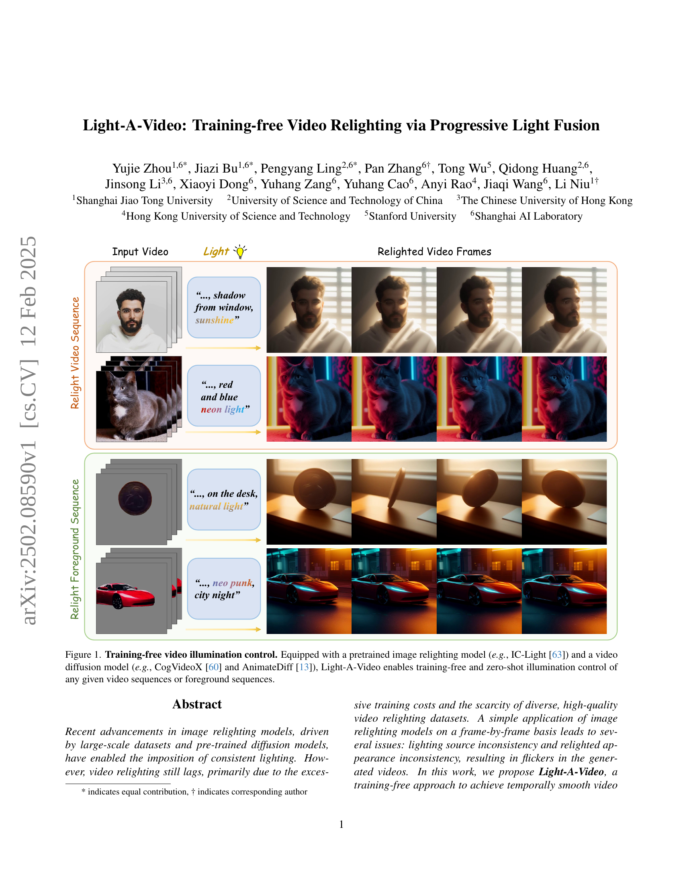
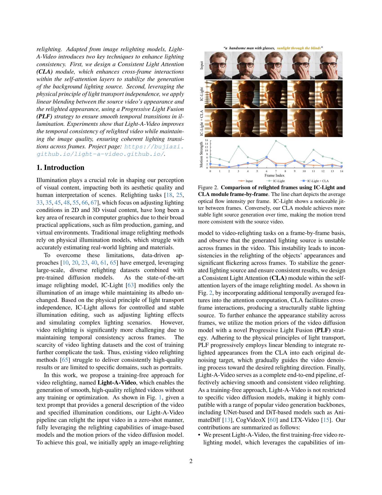
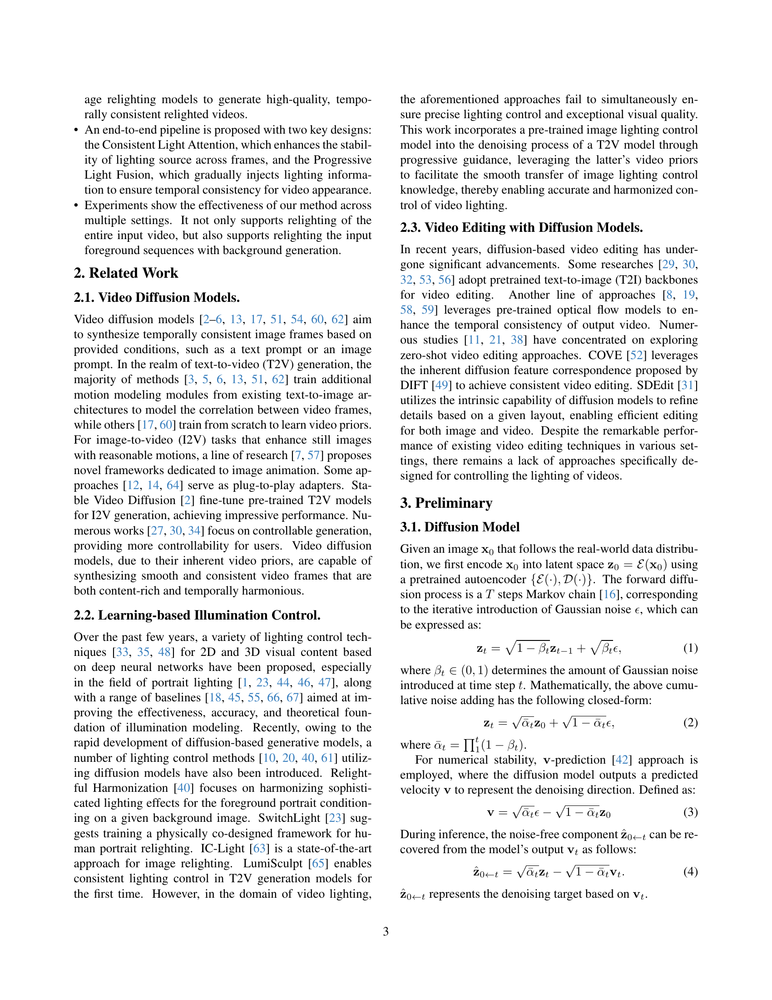
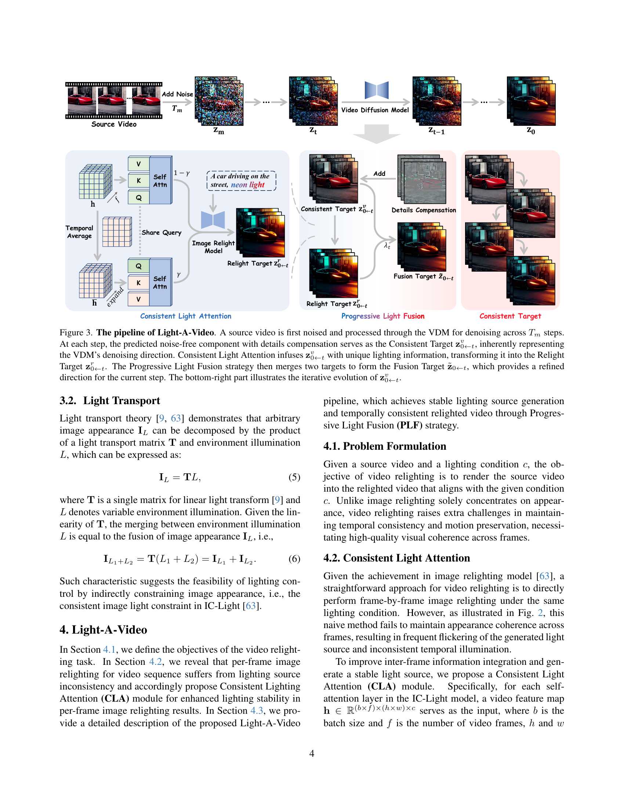
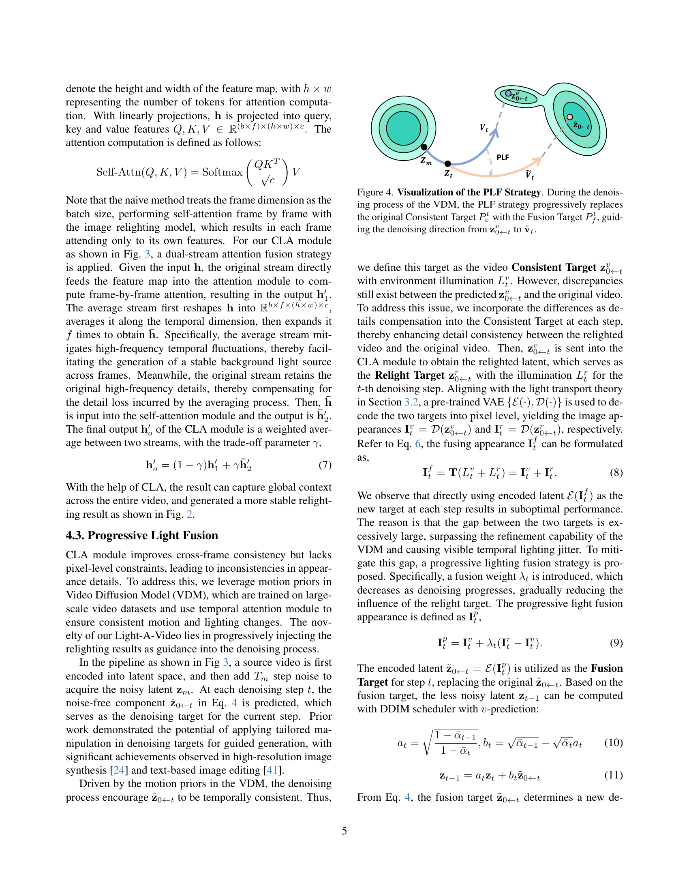
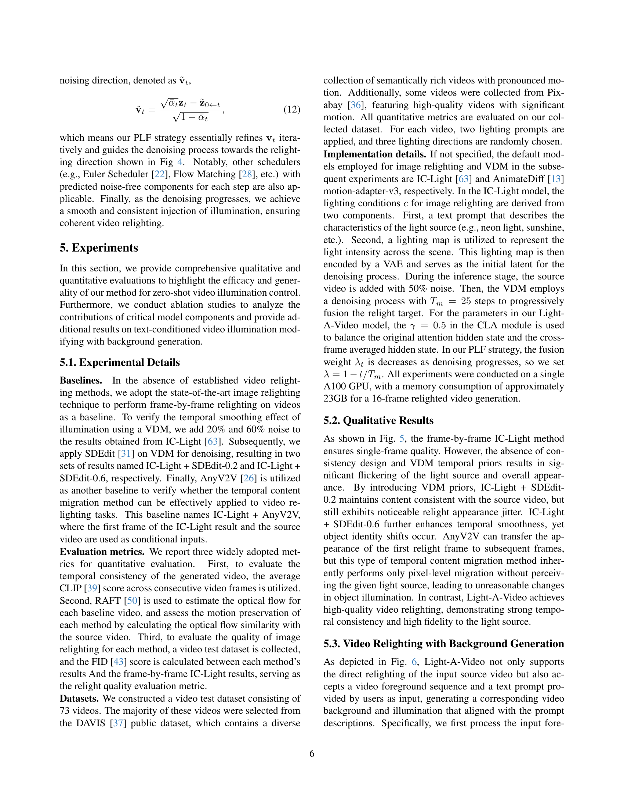
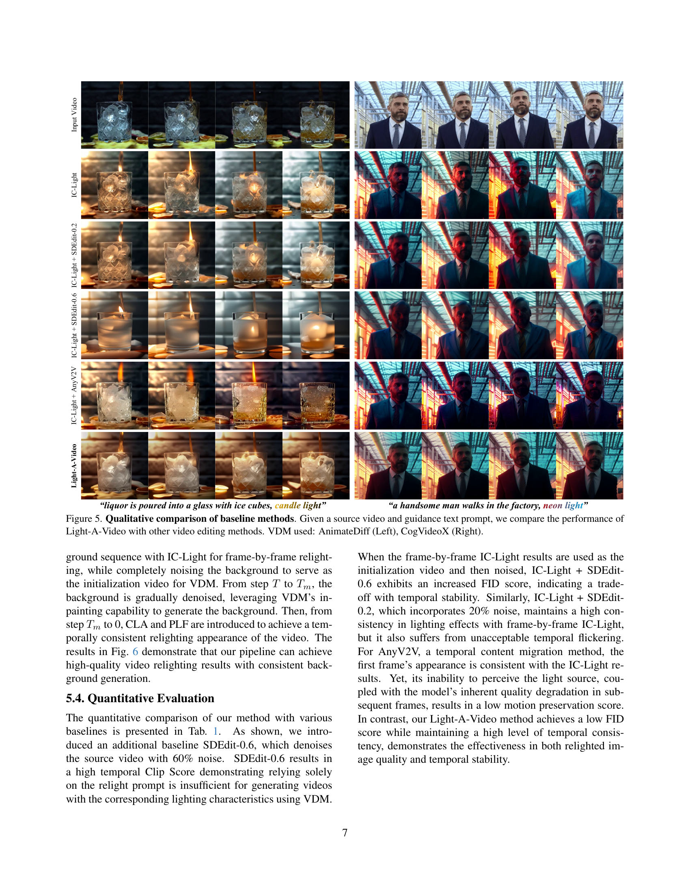
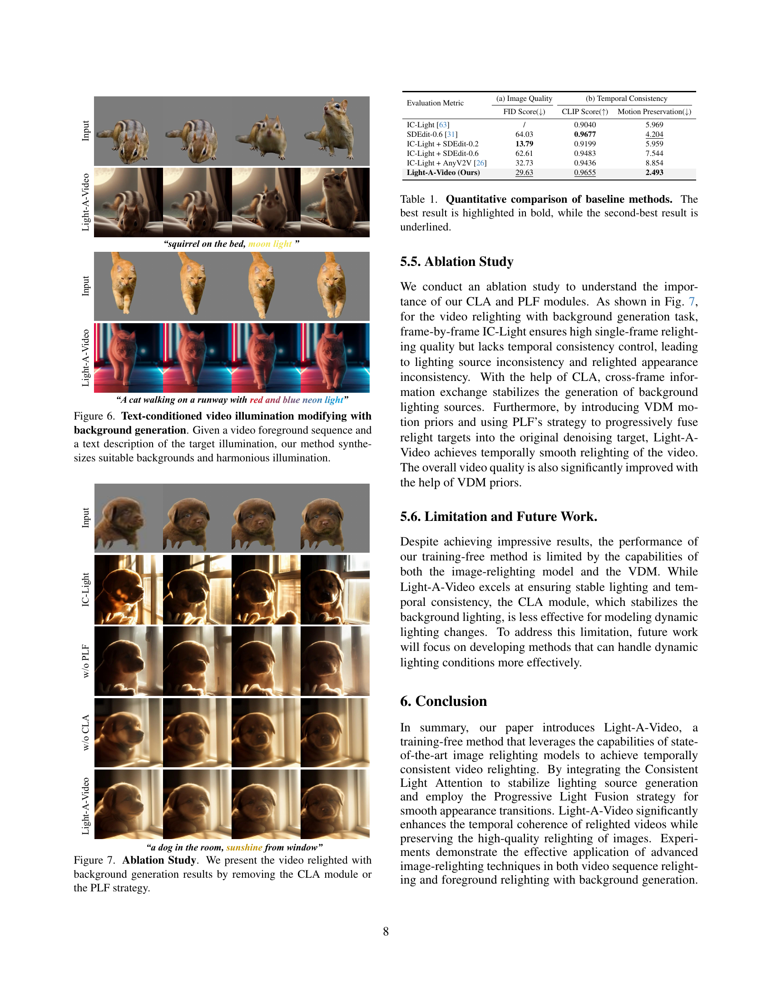
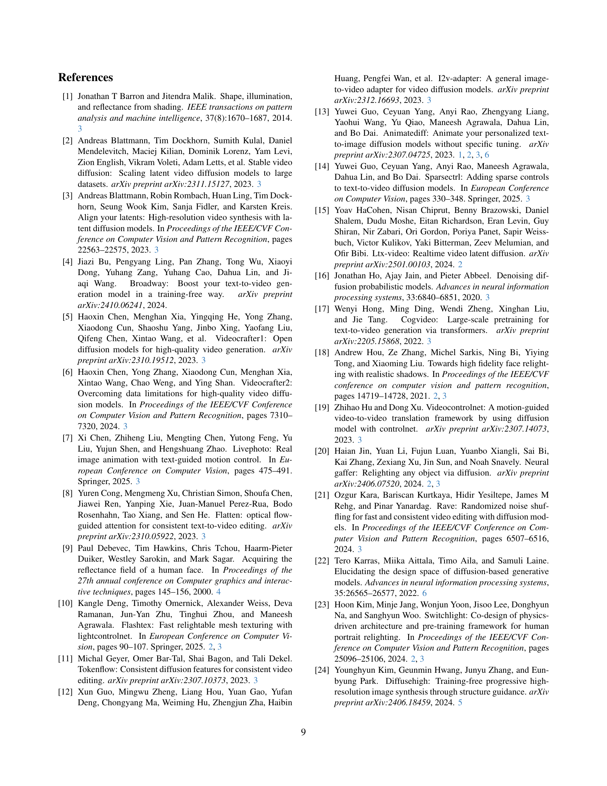
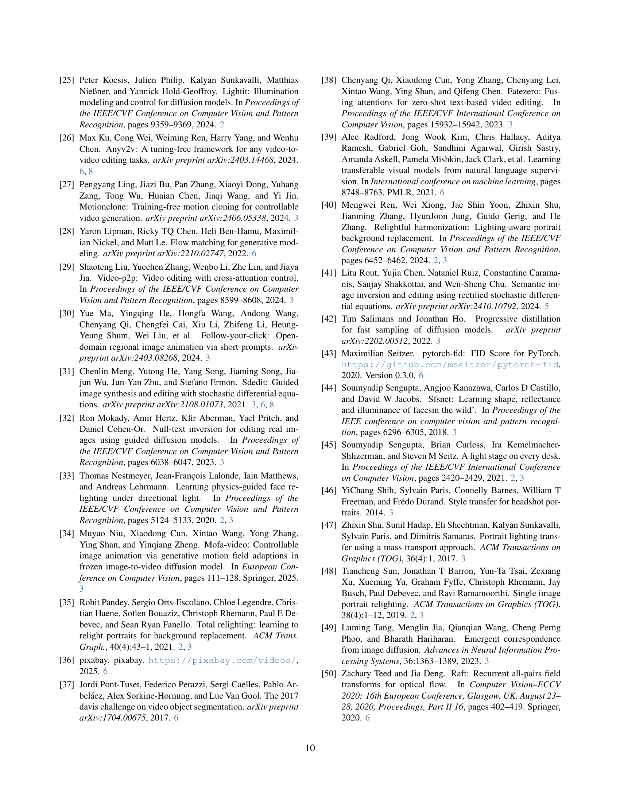
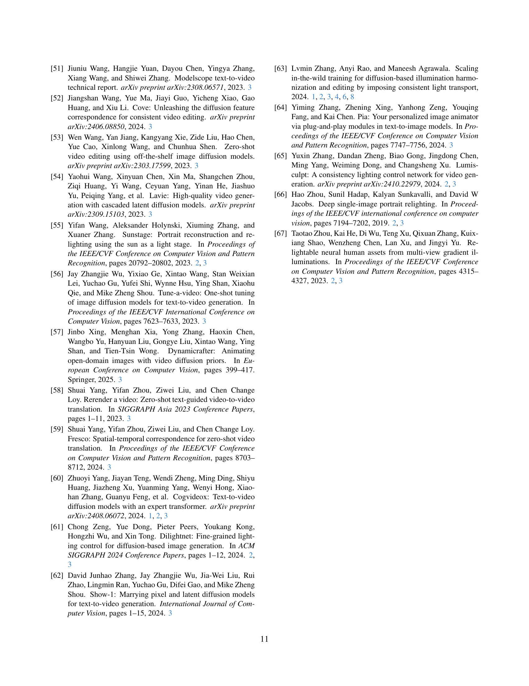
