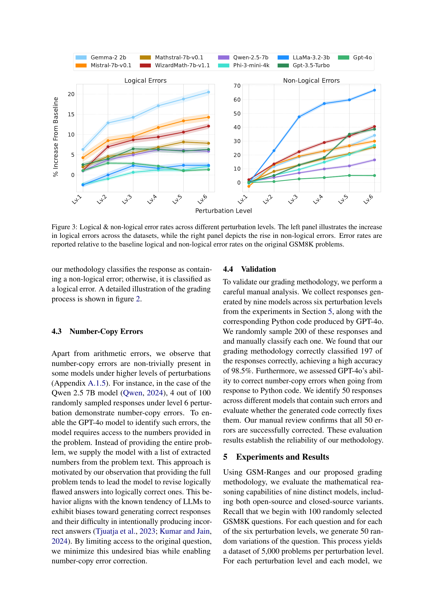
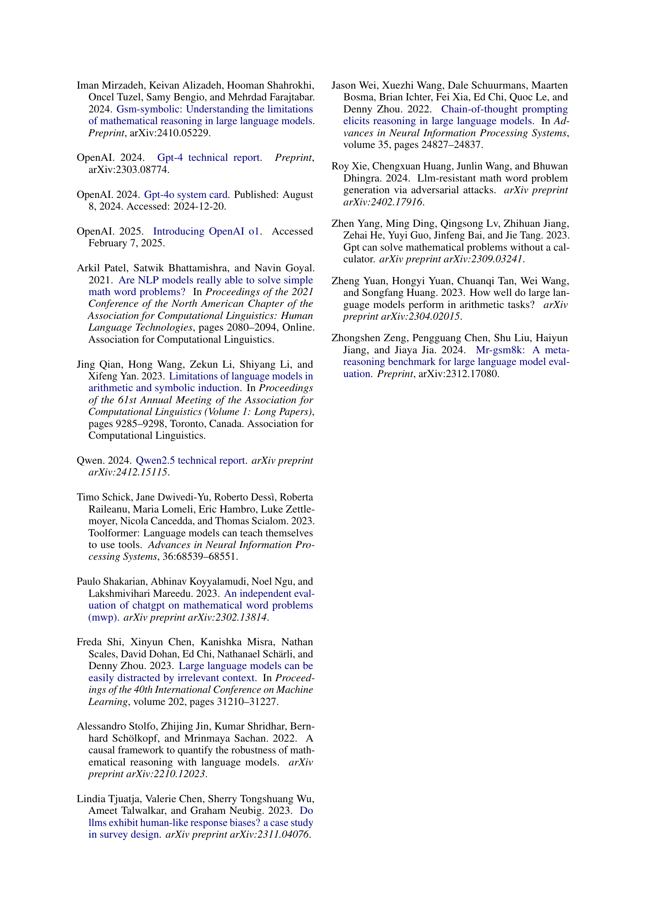

 


 2502.08680 
 Safal Shrestha et el. 
 
 🤗 2025-02-14 
 



↗ arXiv


↗ Hugging Face


↗ Papers with Code


### TL;DR



기존 연구에서는 제한적인 수치 범위의 문제만을 사용하여 대규모 언어 모델(LLM)의 수학적 추론 능력을 평가하는 데 한계가 있었습니다. 또한, 모델의 출력 결과를 정답과만 비교하여 추론 과정에 대한 심층적인 이해를 얻지 못했습니다.  **본 연구는 이러한 한계를 극복하기 위해, 다양한 수치 범위를 포함하는 새로운 데이터셋을 만들고, 논리적 오류와 비논리적 오류를 구분하는 새로운 평가 방법을 제시합니다.**

본 연구는 GSM-Ranges라는 새로운 데이터셋을 통해 **LLM의 수학적 추론 능력에 대한 포괄적인 평가**를 수행하였습니다.  **GSM-Ranges는 수치값을 체계적으로 변화시켜 모델의 강건성을 다양한 수치 범위에서 평가**합니다. 또한, **논리적 오류와 비논리적 오류를 구분하는 새로운 평가 방법**을 통해 LLM의 추론 과정에 대한 보다 정확한 분석을 수행하였습니다. 이를 통해, 수치적 복잡성이 증가함에 따라 논리적 오류율이 크게 증가하는 현상을 발견하였습니다.



#### Key Takeaways


 대규모 언어 모델(LLM)의 수학적 추론 능력 평가를 위한 새로운 데이터셋 GSM-Ranges를 개발했습니다. 



 수치 범위가 넓어짐에 따라 LLM의 논리적 오류율이 증가하는 현상을 발견했습니다. 



 논리적 오류와 비논리적 오류를 구분하는 새로운 평가 방법을 제시했습니다. 


#### Why does it matter?
본 논문은 **대규모 언어 모델(LLM)**의 수학적 추론 능력을 평가하는 새로운 방법론과 데이터셋을 제시하여, 기존 연구의 한계를 극복하고 **수학적 추론의 정확성과 견고성을 향상시키는 데 중요한 기여**를 합니다. 특히, 다양한 수치 범위에 대한 모델의 강건성을 평가하고 논리적 오류와 비논리적 오류를 구분하는 새로운 평가 방법은 LLM의 수학적 추론 능력에 대한 보다 정확하고 심층적인 이해를 가능하게 합니다. 이는 향후 LLM의 수학적 추론 능력 향상 및 실제 문제 해결 능력 향상 연구에 중요한 방향을 제시할 것으로 예상됩니다.

------
#### Visual Insights

> 🔼 그림 1은 GSM8K, SVAMP, MATH 세 가지 수학 문제 데이터셋에서 문제와 정답에 사용된 숫자들의 누적 상대 빈도를 보여줍니다.  가로축은 로그 스케일로 표현된 숫자의 크기를 나타내고, 세로축은 해당 크기 이하의 숫자가 전체 데이터셋에서 차지하는 비율을 나타냅니다.  세 데이터셋 모두 1,000 미만의 숫자가 전체 숫자의 95% 이상을 차지하는 것을 보여주어, 기존의 수학 문제 벤치마크들이 상대적으로 작은 숫자 범위에 집중되어 있음을 시각적으로 보여줍니다.  GSM8K는 94.9%, SVAMP는 97.8%, MATH는 98.0%의 비율을 보입니다.
> 

> 
read the caption

> Figure 1: Cumulative frequency distribution of numerical values in questions and ground truth answers. Numbers <1,000 account for 94.9% (GSM8K), 97.8% (SVAMP), and 98.0% (MATH) of the values.
> 


| Dataset | Question |
|---|---| 
| GSM8K | Judy teaches **5** dance classes every day on the weekdays and **8** classes on Saturday. If each class has **15** students and she charges $**15** per student, how much money does she make in **1** week? |
| GSM-Ranges (Level 6 Perturbation) | Judy teaches **3,124,213** dance classes every day on the weekdays and **7,832,129** classes on Saturday. If each class has **25** students and she charges $**35** per student, how much money does she make in **1** week? |


> 🔼 표 2는 Level 1과 Level 2의 섭동 수준에서 모델들이 독립적인 산술 연산 평가에서 어떤 산술 오류를 범했는지 보여줍니다.  각 모델별로 Level 1과 Level 2 섭동에서 잘못된 응답의 비율을 보여주는 결과입니다.  이는 모델의 기본적인 산술 능력과 숫자 크기에 따른 성능 변화를 이해하는 데 도움이 됩니다.
> 

> 
read the caption

> Table 2:  Results of a standalone arithmetic assessment on arithmetic errors made by models under Level 1 and Level 2 perturbations.
> 

### In-depth insights

#### LLM Math Reasoning
LLM의 수학적 추론 능력은 최근 큰 관심을 받고 있지만, **기존 평가 방법의 한계**로 인해 실제 문제 해결 능력을 제대로 평가하지 못하고 있습니다.  대부분의 벤치마크는 제한된 수치 범위의 문제만 다루며, 단순히 정답 여부만 비교하여 **추론 과정에 대한 통찰력을 제공하지 못합니다.**  따라서, 넓은 수치 범위에 걸쳐 모델의 강건성을 평가하고, 논리적 오류와 비논리적 오류를 구분하는 새로운 평가 방법론이 필요합니다.  **다양한 수치 범위를 포괄하는 데이터셋**을 생성하고, **오류 유형을 세분화하는 평가 기준**을 통해 LLM의 수학적 추론 능력을 더욱 정확하게 평가해야 합니다. 이를 통해 LLM의 수치적 일반화 능력 향상에 대한 연구 방향을 제시할 수 있습니다.

#### GSM-Ranges Dataset
본 논문에서 제시된 GSM-Ranges 데이터셋은 기존의 수학 문제 벤치마크의 한계를 극복하기 위해 고안되었습니다. **GSM8K 데이터셋을 기반으로 하여 숫자 값을 체계적으로 변화시켜 다양한 수치 범위에 걸쳐 모델의 견고성을 평가**합니다.  단순히 정답의 일치 여부만을 비교하는 기존의 평가 방식과 달리, **논리적 오류와 비논리적 오류를 구분하여 모델의 추론 과정을 더욱 정밀하게 분석**할 수 있도록 지원합니다. 이는 수치적 복잡성이 증가함에 따라 논리적 오류율이 상승하는 현상을 밝혀내는 데 중요한 역할을 합니다. **다양한 수치 범위에 대한 모델의 강건성을 평가하는 데 초점을 맞추고 있으며, 실제 문제 해결 능력을 보다 정확하게 반영**하여 LLM의 수학적 추론 능력에 대한 포괄적인 평가를 가능하게 합니다.  결론적으로 GSM-Ranges 데이터셋은 LLM의 수학적 추론 능력 평가에 있어 중요한 진전을 이룬 혁신적인 자료로 평가될 수 있습니다.

#### Novel Grading Scheme
본 논문에서 제시된 **소설 등급 체계**는 기존의 단순 정답/오답 방식을 넘어, **추론 과정의 질적 평가**에 초점을 맞춘 혁신적인 접근 방식입니다.  이는 단순히 최종 답변의 정확성만을 평가하는 것이 아니라, **논리적 오류와 비논리적 오류를 구분**하여 모델의 추론 과정을 심층적으로 분석합니다.  **GPT-4를 활용한 자동화된 평가 시스템**은 생성된 코드를 실행하여 비논리적 오류를 제거한 후 논리적 정확성을 판단함으로써, 모델의 추론 능력에 대한 보다 정확한 평가를 가능하게 합니다. 이는 **수치적 범위에 따른 모델의 강건성 평가**와 함께, LLM의 수리적 추론 능력 향상을 위한 중요한 발판을 마련할 것으로 기대됩니다. 특히, 단순 계산 문제가 아닌, **실제 문제 풀이 과정에서의 수리적 추론 능력**을 평가하는 데 효과적이며, 이는 **실세계 문제 해결 능력**을 평가하는데 중요한 시사점을 제공합니다.  **자동화된 평가 시스템의 정확도 검증**을 통해 신뢰도를 확보하였으며, 다양한 모델에 대한 실험 결과를 통해 **수치 범위의 확장에 따른 오류율 증가**를 밝힘으로써, 향후 연구 방향을 제시합니다.

#### Numerical Sensitivity
본 논문은 **수치 민감도(Numerical Sensitivity)**라는 개념을 중심으로, 대규모 언어 모델(LLM)의 수리적 추론 능력에 대한 심층적인 분석을 제시합니다.  연구진은 **다양한 수치 범위에 걸쳐 수리 문제의 숫자들을 체계적으로 변화시키는 방식**으로, 모델의 성능 변화를 면밀히 관찰했습니다. 그 결과, **숫자의 크기가 커질수록 LLM의 논리적 오류율이 증가**하는 경향을 발견했습니다. 이는 단순한 계산 오류를 넘어, **모델의 추론 과정 자체에 내재된 취약점**을 보여주는 중요한 발견입니다.  **문제에 포함된 숫자의 크기가 모델의 논리적 추론 능력에 영향**을 미친다는 사실은, LLM의 수리적 추론 능력 향상을 위한 새로운 연구 방향을 제시합니다.  특히, **실제 세계 문제 해결에 필요한 폭넓은 수치 범위에 대한 일반화 능력**을 강화하는 방안에 대한 연구가 필요합니다.

#### Future Research
본 논문은 대규모 언어 모델(LLM)의 수학적 추론 능력에 대한 심층적인 평가를 제시하며, 특히 **숫자 범위의 광범위한 확장**과 **논리적 오류와 비논리적 오류의 구분**이라는 두 가지 핵심적인 문제점을 다룹니다.  미래 연구는 **다양한 규모의 숫자에 대한 모델의 강건성을 높이는 방향**으로 진행되어야 합니다.  **새로운 평가 방법론 개발**을 통해 LLM의 추론 과정을 더욱 정밀하게 분석하고, 오류 유형을 세분화하여 개선 방향을 제시하는 연구가 필요합니다. 또한, **훈련 데이터의 다양성 확보**를 통해 LLM의 일반화 능력 향상에 기여하는 연구가 중요하며, **문제 해결 과정에 대한 설명 가능성을 높이는 연구** 또한 필수적입니다.  **다양한 수학적 문제 유형을 포괄하는 벤치마크 개발**과 **대규모 언어 모델의 추론 메커니즘에 대한 심층적 이해**를 바탕으로 한 **모델 아키텍처 개선** 연구 역시 중요한 방향이 될 것입니다.  궁극적으로, **실제 세계 문제 해결에 적용 가능한 수학적 추론 능력을 갖춘 LLM 개발**이 미래 연구의 목표가 되어야 할 것입니다.

### More visual insights

More on figures

> 🔼 본 그림은 LLM의 응답을 채점하는 과정을 보여줍니다. GPT-40 모델을 사용하여 LLM 응답을 세 가지 범주(정답, 비논리적 오류, 논리적 오류)로 분류하는 과정을 단계별로 시각적으로 설명합니다.  LLM 응답이 정답과 일치하는지 확인하고, 일치하지 않을 경우 GPT-40 모델을 사용하여 응답을 파이썬 코드로 변환하고 실행하여 비논리적 오류(계산 오류 등)와 논리적 오류(추론 과정의 결함)를 구분합니다. 이를 통해 LLM의 추론 능력을 더 정확하게 평가할 수 있습니다.
> 

> 
read the caption

> Figure 2: Illustration of grading process for LLM responses using the GPT-4o model, categorizing outputs into three labels: correct, non-logical error, and logical error.
> 

> 🔼 그림 3은 다양한 숫자 변형 수준에서 논리적 오류와 비논리적 오류의 비율을 보여줍니다. 왼쪽 패널은 데이터 세트에서 논리적 오류가 증가하는 것을 보여주고, 오른쪽 패널은 비논리적 오류의 증가를 보여줍니다. 오류율은 원래 GSM8K 문제에 대한 기준 논리적 오류율과 비논리적 오류율을 기준으로 보고됩니다.  즉, 각 모델이 원래 GSM8K 문제에서 보인 오류율을 기준으로, 숫자 크기가 변화함에 따라 논리적 오류율과 비논리적 오류율이 얼마나 증가했는지를 보여주는 그래프입니다.  각 수준별로 여러 모델들의 결과가 비교되어 있습니다.
> 

> 
read the caption

> Figure 3: Logical & non-logical error rates across different perturbation levels. The left panel illustrates the increase in logical errors across the datasets, while the right panel depicts the rise in non-logical errors. Error rates are reported relative to the baseline logical and non-logical error rates on the original GSM8K problems.
> 

> 🔼 그림 4는 다양한 난이도의 수치적 변화(perturbation) 수준에서 모델의 논리적 오류율 차이를 보여줍니다. 각 모델별 상단 막대는 가장 높은 난이도(Level 6)와 가장 낮은 난이도(Level 1)의 수치적 변화 사이의 논리적 오류율 차이(퍼센티지 포인트)를 나타내고, 하단 막대는 가장 낮은 난이도(Level 1)와 원본 GSM8K 문제 간의 논리적 오류율 차이를 보여줍니다. 이를 통해 각 모델의 수치적 범위에 따른 논리적 추론 능력의 변화를 정량적으로 비교 분석할 수 있습니다.
> 

> 
read the caption

> Figure 4: Logical error gaps across perturbation levels. For each model, the top bar represents the percentage point difference in logical errors between Level 6 and Level 1 perturbations, while the bottom bar indicates the percentage point difference between Level 1 and the original GSM8K questions.
> 

> 🔼 그림 5는 다양한 표본 크기(1, 8, 32, 48)에 대해, GSM8K 원본 문제와 난이도 변화 수준별(perturbation levels) 재구성 문제에 대한 정답 추론 성공률(recall rate)을 보여줍니다.  각 표본 크기별로, 원본 GSM8K 문제와 난이도 변화 수준에 따른 성공률을 비교하여 모델의 견고성(robustness)과 일반화 능력(generalization)을 평가합니다.  난이도 변화 수준이 높아질수록 성공률이 낮아지는 경향이 나타나며, 표본 크기가 커질수록 성공률이 높아지는 경향을 보입니다. 이는 모델이 더 많은 시도를 할수록 정답에 도달할 확률이 높아짐을 시사합니다.
> 

> 
read the caption

> Figure 5: Recall rates across perturbation levels and original GSM8K questions for different sampling sizes (1, 8, 32, 48).
> 

> 🔼 그림 6은 다양한 숫자 범위의 문제에 대한 03-mini 모델의 성능을 보여줍니다. 왼쪽 그래프는 각 섭동 수준에서 논리적 오류와 비논리적 오류의 개수를 보여주고, 오른쪽 그래프는 각 섭동 수준에서 100개의 응답에 대한 평균 토큰 수를 보여줍니다.  이를 통해 숫자 크기 변화에 따른 모델의 성능 변화와 토큰 사용량의 상관관계를 분석할 수 있습니다.
> 

> 
read the caption

> Figure 6: Results of o3-mini across perturbation levels. The left plot displays the logical and non-logical error counts, while the right plot shows the mean token counts per 100 responses at each perturbation level.
> 

More on tables


| Model | Level 1 | Level 2 |
|---|---|---|
| Gemma 2 2B | 15/134 (11.2%) | 126/735 (17.1%) |
| WizardMath 7B v1.1 | 41/117 (35.0%) | 186/806 (23.1%) |
| Mistral 7B v0.1 | 73/299 (21.4%) | 274/1313 (20.9%) |
| Mathstral 7B v0.1 | 31/77 (40.2%) | 126/509 (24.8%) |
| Llama 3.2 3B | 3/72 (4.2%) | 127/1480 (8.6%) |
| Qwen 2.5 7B | 7/18 (38.9%) | 52/155 (33.5%) |
| Phi 3 Mini 4K | 9/22 (40.9%) | 89/281 (31.7%) |
| GPT-3.5 Turbo | 10/18 (55.6%) | 92/224 (41.1%) |
| GPT-4o | 1/3 (33.3%) | 20/40 (50%) |
> 🔼 표 3은 GSM-Ranges 데이터셋의 다양한 섭동 수준(perturbation levels)에서 모델의 논리적 오류율(logical error rate)과 신뢰 구간(confidence interval)을 보여줍니다.  GSM-Ranges는 수치 값을 체계적으로 변경하여 생성된 데이터셋으로, 다양한 수치 범위에 걸쳐 모델의 견고성을 평가하는 데 사용됩니다. 각 섭동 수준은 원래 GSM8K 문제의 숫자를 특정 범위 내의 임의의 값으로 대체하여 생성됩니다. 표는 기준(Baseline) 논리적 오류율과 각 섭동 수준에서의 논리적 오류율 및 신뢰 구간을 제시하여, 수치 복잡성이 증가함에 따라 논리적 오류율이 어떻게 변하는지 보여줍니다.
> 

> 
read the caption

> Table 3: Logical error rates and confidence intervals across different GSM-Ranges perturbation levels.
> 


| Model | Baseline | Lv.1 | Lv.2 | Lv.3 | Lv.4 | Lv.5 | Lv.6 |
|---|---|---|---|---|---|---|---| 
| Gemma 2 2B | 18 | 24.3(0.8) | 30.9(0.6) | 32.3(0.7) | 35.1(0.6) | 36.8(0.8) | 38.5(0.8) |
| GPT-3.5 Turbo | 11 | 13.5(0.5) | 15.0(0.8) | 17.5(0.6) | 17.3(0.7) | 16.9(0.6) | 17.3(0.6) |
| GPT-4o | 4 | 5.1(0.4) | 6.9(0.3) | 6.9(0.3) | 6.2(0.3) | 5.0(0.3) | 5.3(0.3) |
| Llama 3.2 3B | 17 | 14.5(0.5) | 17.0(0.6) | 19.3(0.7) | 18.7(0.7) | 19.4(0.6) | 19.4(0.6) |
| Mathtral 7B v0.1 | 7 | 9.0(0.5) | 11.6(0.5) | 12.4(0.5) | 13.9(0.5) | 15.2(0.6) | 14.8(0.6) |
| Mistral 7B v0.1 | 29 | 33.3(0.9) | 37.5(0.9) | 38.5(0.9) | 40.7(0.7) | 42.4(0.8) | 43.3(0.8) |
| Phi 3 Mini 4K | 10 | 7.7(0.4) | 9.1(0.4) | 10.7(0.4) | 11.2(0.5) | 11.2(0.5) | 12.2(0.5) |
| Qwen 2.5 7B | 4 | 5.0(0.4) | 7.8(0.5) | 9.0(0.5) | 10.2(0.5) | 10.1(0.6) | 9.9(0.5) |
| Wizardmath 7B v1.1 | 7 | 8.1(0.5) | 14.0(0.6) | 15.7(0.7) | 16.4(0.7) | 17.6(0.6) | 19.1(0.6) |
| o3-mini | 5 | 5 | 6 | 5 | 4 | 6 | 4 |
> 🔼 표 4는 GSM-Ranges 데이터셋의 다양한 섭동 수준에서 모델의 비논리적 오류율과 신뢰 구간을 보여줍니다.  비논리적 오류는 계산 오류나 숫자 복사 오류와 같이 추론 과정 자체가 아닌 다른 요인에서 비롯된 오류를 의미합니다. 각 섭동 수준(Lv.1 ~ Lv.6)에 대해 모델별 비논리적 오류율과 해당 신뢰 구간이 제시되어 있습니다.  기준선(Baseline)은 원본 GSM8K 데이터셋을 사용한 결과입니다. 이 표는 모델의 숫자 크기에 대한 민감도와 추론 과정의 견고성을 평가하는 데 유용합니다.
> 

> 
read the caption

> Table 4: Non-logical error rates and & confidence intervals across different GSM-Ranges perturbation levels.
> 


| Model | Baseline | Lv.1 | Lv.2 | Lv.3 | Lv.4 | Lv.5 | Lv.6 |
|---|---|---|---|---|---|---|---| 
| Gemma 2 2B | 3 | 3.6(0.4) | 14.7(0.9) | 21.6(0.8) | 25.9(0.9) | 29.6(1.1) | 37.2(1.2) |
| GPT-3.5 Turbo | 0 | 0.5(0.2) | 5.1(0.5) | 12.7(0.8) | 18.1(0.8) | 35.0(1.0) | 38.6(1.0) |
| GPT-4o | 0 | 0.1(0.1) | 0.8(0.2) | 2.7(0.3) | 3.6(0.3) | 5.2(0.4) | 5.2(0.6) |
| Llama 3.2 3B | 2 | 1.9(0.3) | 25.1(1.1) | 49.5(1.2) | 59.1(1.2) | 61.8(0.9) | 68.8(0.9) |
| Mathtral 7B v0.1 | 2 | 2.0(0.4) | 10.1(0.8) | 14.8(0.8) | 19.3(1.1) | 23.0(0.9) | 27.6(1.0) |
| Mistral 7B v0.1 | 12 | 9.3(0.5) | 25.1(1.2) | 31.0(1.1) | 34.9(1.2) | 38.6(1.2) | 42.0(1.1) |
| Phi 3 Mini 4K | 1 | 0.5(0.2) | 6.2(0.4) | 10.5(0.7) | 15.8(1.0) | 21.4(0.9) | 28.0(1.1) |
| Qwen 2.5 7B | 0 | 0.4(0.2) | 3.8(0.5) | 7.0(0.6) | 9.9(0.7) | 12.1(0.9) | 16.4(0.9) |
| Wizardmath 7B v1.1 | 2 | 4.1(0.6) | 15.5(0.7) | 24.3(1.2) | 31.0(1.0) | 35.6(1.2) | 42.5(1.3) |
| o3-mini | 0 | 0 | 0 | 0 | 1 | 2 | 0 |
> 🔼 표 5는 다양한 샘플 크기와 GSM-Ranges의 다양한 섭동 수준에서 정확한 논리를 포함하는 응답의 재현율을 보여줍니다.  각 샘플 크기(1, 8, 32, 48)에 대해, 원본 GSM8K 질문과 6가지 섭동 수준(Lv.1~Lv.6)에서 모델의 성능을 평가한 결과를 보여줍니다.  재현율은 모델이 여러 번의 시도(n-pass) 중 적어도 한 번은 올바른 논리를 생성하는 비율을 나타냅니다. 이 표는 모델이 수치적 크기에 따라 논리적 추론 능력을 유지하는지, 그리고 샘플링 크기가 정확한 논리를 재현하는 데 어떤 영향을 미치는지 파악하는 데 도움이 됩니다.
> 

> 
read the caption

> Table 5: Recall rates across different sampling sizes and GSM-Ranges perturbation levels. We use
> 


| Model | Sample Size | GSM8K | Lv.1 | Lv.2 | Lv.3 | Lv.4 | Lv.5 | Lv.6 |
|---|---|---|---|---|---|---|---|---|
| Gemma 2 2B | 1 | 82 | 74 | 69 | 68 | 67 | 61 | 59 |
|  | 8 | 92 | 89 | 87 | 87 | 87 | 84 | 84 |
|  | 32 | 95 | 91 | 92 | 89 | 92 | 89 | 92 |
|  | 48 | 95 | 92 | 93 | 92 | 92 | 92 | 94 |
| Mistral 7B v0.1 | 1 | 66 | 66 | 61 | 60 | 51 | 59 | 50 |
|  | 8 | 89 | 88 | 82 | 87 | 84 | 81 | 83 |
|  | 32 | 97 | 93 | 90 | 93 | 93 | 93 | 93 |
|  | 48 | 97 | 95 | 91 | 93 | 96 | 93 | 95 |
| Mathtral 7B v0.1 | 1 | 90 | 85 | 82 | 86 | 85 | 86 | 84 |
|  | 8 | 94 | 92 | 88 | 90 | 92 | 92 | 91 |
|  | 32 | 96 | 93 | 88 | 92 | 94 | 92 | 94 |
|  | 48 | 96 | 94 | 89 | 93 | 94 | 93 | 94 |
| Wizardmath 7B v1.1 | 1 | 92 | 84 | 85 | 83 | 84 | 78 | 78 |
|  | 8 | 98 | 95 | 93 | 94 | 92 | 90 | 94 |
|  | 32 | 99 | 97 | 98 | 95 | 94 | 93 | 95 |
|  | 48 | 99 | 97 | 98 | 96 | 94 | 93 | 95 |
> 🔼 표 6은 GSM-Ranges의 다양한 섭동 수준에 따른 03-mini 응답의 평균 토큰 수를 보여줍니다.  즉, 수학 문제의 숫자 크기를 변화시켰을 때, 언어 모델이 생성하는 답변의 길이가 어떻게 달라지는지를 보여주는 표입니다.  숫자가 커질수록 답변이 길어지는 경향이 있는지 확인하는 데 유용합니다.
> 

> 
read the caption

> Table 6: Mean token counts across GSM-Ranges perturbation levels for o3-mini responses
> 


|                     | Baseline | Level 1 | Level 2 | Level 3 | Level 4 | Level 5 | Level 6 |
| :------------------ | :------- | :------ | :------ | :------ | :------ | :------ | :------ |
| Mean Token Count | 252.8    | 287.6   | 340.6   | 378.8   | 429.3   | 501.0   | 579.8   |
> 🔼 이 표는 GSM-Ranges 데이터셋의 4, 5, 6번째 섭동 수준에서 각 모델에 대해 무작위로 선택된 100개의 샘플에서 숫자 복사 오류의 발생 횟수를 보여줍니다. 각 모델의 각 섭동 수준에 대해 100개의 샘플을 무작위로 추출하여 숫자 복사 오류율을 평가했습니다. 표에는 각 모델과 섭동 수준별 숫자 복사 오류 발생 횟수가 나와 있습니다.
> 

> 
read the caption

> Table 7: Occurrences of Number-Copy Errors in 100 Random Samples Across Levels 4, 5, and 6 for Each Model.
> 

### Full paper



