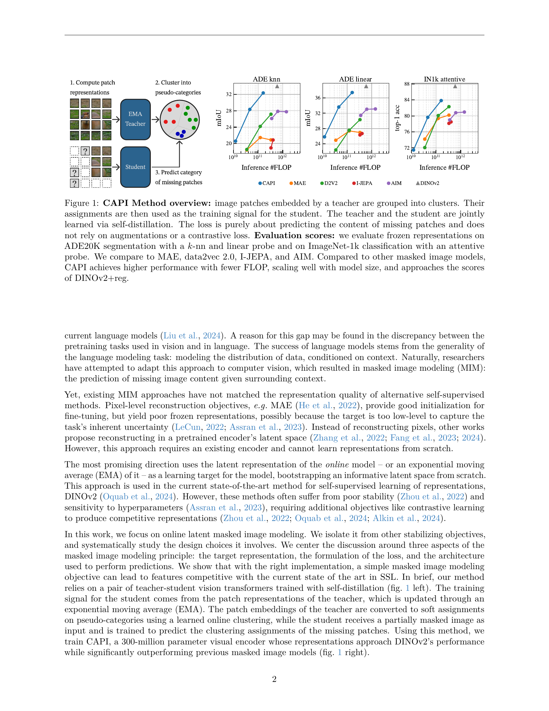

 


 2502.08769 
 Timothée Darcet et el. 
 
 🤗 2025-02-17 
 



↗ arXiv


↗ Hugging Face


↗ Papers with Code


### TL;DR



기존의 마스크 이미지 모델링(MIM) 기반 자기 지도 학습(SSL) 방법들은 최첨단 성능에 미치지 못하고,  **불안정성**과 **과적합** 문제에 직면해 왔습니다. 특히, 낮은 수준의 픽셀 재구성을 목표로 하는 기존 방법들은 고차원적인 시각적 표현 학습에는 부적합했습니다.  **잠재 공간**에서의 재구성이나 **온라인 모델의 잠재 표현**을 활용하는 방법들이 제시되었지만, 이 또한 **과도한 하이퍼파라미터 민감성**과 **불안정성** 문제를 해결하지 못했습니다. 

본 논문에서는 이러한 문제들을 해결하기 위해 **CAPI**라는 새로운 MIM 프레임워크를 제시합니다. CAPI는 **클러스터 기반 손실 함수**를 도입하여 안정적인 학습을 가능하게 하고, **teacher-student 구조**를 통해 효과적인 지식 증류를 수행합니다.  **크로스 어텐션 기반 예측 모델**을 사용하여 계산 효율성을 높이고,  **다양한 데이터셋**에서의 성능 평가를 통해 **뛰어난 일반화 성능**을 확인했습니다.  결과적으로, CAPI는 기존 MIM 모델들을 상당히 능가하는 성능을 보이며 최첨단 DINOv2 모델에 근접하는 성능을 달성했습니다.  본 논문의 결과는 MIM 기반 SSL의 발전에 크게 기여할 것으로 기대됩니다.



#### Key Takeaways


 CAPI는 클러스터 기반 손실 함수를 사용하여 안정적이고 확장성 있는 MIM 프레임워크를 구현합니다. 



 CAPI는 기존 MIM 모델들을 능가하는 성능을 ImageNet과 ADE20K 데이터셋에서 보여줍니다. 



 CAPI의 코드와 모델이 공개되어 다른 연구자들의 후속 연구를 지원합니다. 


#### Why does it matter?
이 논문은 **자기 지도 학습(SSL)** 분야, 특히 **마스크 이미지 모델링(MIM)** 에서 최첨단 성능에 근접하는 새로운 프레임워크를 제시하여 **컴퓨터 비전 연구자들에게 중요한 의미**를 지닙니다.  **클러스터 기반 손실 함수**와 **안정적인 학습 전략**을 통해 기존 MIM 모델의 한계를 극복하고 **확장성 있는 표현 학습**을 가능하게 함으로써, 향후 **대규모 비전 모델 개발**에 새로운 가능성을 열어줍니다. 또한, 공개된 코드와 모델을 통해 다른 연구자들의 후속 연구를 촉진할 수 있습니다.

------
#### Visual Insights

> 🔼 본 그림은 CAPI (Cluster and Predict Latent Patches) 방법의 개요를 보여줍니다. CAPI는 teacher 네트워크가 이미지 패치들을 클러스터링하고, 그 결과를 학습 신호로 사용하여 student 네트워크를 학습시키는 자기 증류 방식의 마스크 이미지 모델링 기법입니다.  Teacher와 student는 함께 학습되며, 손실 함수는 누락된 패치의 내용 예측에만 초점을 맞추고, 데이터 증강이나 대조 학습에는 의존하지 않습니다.  성능 평가는 ADE20K 분할 작업(k-NN 및 선형 프로브 사용)과 ImageNet-1k 분류 작업(어텐션 프로브 사용)을 통해 이루어졌으며, 기존의 MAE, data2vec 2.0, I-JEPA, AIM 등의 마스크 이미지 모델들과 비교하여 CAPI의 성능 우수성을 보여줍니다. CAPI는 더 적은 FLOP으로 더 높은 성능을 달성하며, 모델 크기가 커짐에 따라 성능이 잘 확장되고, DINOv2+reg에 근접한 성능을 보입니다.
> 

> 
read the caption

> Figure 1:  CAPI Method overview: image patches embedded by a teacher are grouped into clusters. Their assignments are then used as the training signal for the student. The teacher and the student are jointly learned via self-distillation. The loss is purely about predicting the content of missing patches and does not rely on augmentations or a contrastive loss. Evaluation scores: we evaluate frozen representations on ADE20K segmentation with a k𝑘kitalic_k-nn and linear probe and on ImageNet-1k classification with an attentive probe. We compare to MAE, data2vec 2.0, I-JEPA, and AIM. Compared to other masked image models, CAPI achieves higher performance with fewer FLOP, scaling well with model size, and approaches the scores of DINOv2+reg.
> 


|   |   |   |
|---|---|---|
|   |   |   |
|   |   |   |
|   |   |   |

> 🔼 표 1(a)는 본 논문의 실험 결과 중, 마스크된 이미지 예측 모델의 성능에 대한 비교 분석 결과를 보여줍니다.  특히, 다양한 예측 모델 구조 (예측기 아키텍처)가 이미지 분할 및 이미지 분류 정확도에 미치는 영향을 보여줍니다.  'Fused', 'Split, self-attn', 'Split, cross-attn'은 각각 다른 예측기 아키텍처를 나타내며, ADE20k와 ImageNet-1k 두 가지 데이터셋에 대한 성능을 비교하여 어떤 아키텍처가 더 효율적이고 성능이 좋은지 확인합니다.
> 

> 
read the caption

> (a) Predictor architecture
> 

### In-depth insights

#### MIM's Shortcomings
본 논문에서 MIM(Masked Image Modeling)의 단점은 **표현의 질이 낮고, 훈련이 불안정하며, 하이퍼파라미터에 민감**하다는 점입니다.  기존 MIM 방법들은 저수준의 픽셀 재구성에 초점을 맞춰 고수준의 의미적 표현을 제대로 포착하지 못했습니다. 또한, 픽셀 수준의 재구성 목표는 과업의 불확실성을 제대로 반영하지 못하여 훈련된 모델의 일반화 성능이 저하되는 문제점을 보였습니다.  **잠재 공간에서의 재구성을 시도하는 방법**은 기존 인코더에 의존하며, 처음부터 표현을 학습할 수 없다는 단점이 있었습니다.  **온라인 모델의 잠재 표현 또는 EMA를 이용하는 최신 방법**은 훈련의 안정성이 부족하고 하이퍼파라미터에 민감하여 대조 학습과 같은 추가적인 목표가 필요했습니다.  **결론적으로, 기존 MIM 방법들은 다양한 한계점을 가지고 있으며, 이를 극복하기 위한 새로운 접근법이 필요함을 시사**합니다.

#### CAPI's Novel Approach
CAPI는 기존 MIM(Masked Image Modeling) 방식의 한계를 극복하기 위해 **차별화된 접근 방식**을 제시합니다.  **클러스터링 기반 손실 함수**를 사용하여 안정적인 학습을 달성하고, **교사-학생 구조**를 통해 효율적인 학습을 구현합니다. 특히, 기존 방식에서 나타났던 표현 붕괴(representation collapse) 문제를 해결하기 위해 **위치 정보를 제거**하는 기법을 도입하여 성능 향상에 기여합니다.  또한, 효율적인 **크로스 어텐션 기반 예측기**를 활용하여 연산량을 줄이고, 다양한 규모의 데이터셋에 적용 가능하도록 **확장성**을 확보합니다. 이러한 CAPI의 혁신적인 접근법은 기존 MIM 모델들의 성능을 뛰어넘어, 최첨단 DINOv2 모델에 근접하는 성능을 달성하게 합니다.  **온라인 클러스터링**과 **자기 증류** 기법의 조합은 CAPI의 핵심 강점이며, 향후 대규모 시각적 표현 학습 분야에서 중요한 발전을 가져올 것으로 기대됩니다.

#### Clustering-Based Loss
본 논문에서 제안하는 클러스터링 기반 손실 함수는 기존의 MIM(Masked Image Modeling) 방법들의 한계를 극복하기 위해 **안정적인 학습**과 **뛰어난 표현 능력**을 갖춘 새로운 프레임워크를 제시합니다.  기존의 방법들은 과도한 민감도나 불안정성으로 인해 성능이 저하되는 문제점이 있었는데, 이를 해결하고자 **명시적인 클러스터링 기법**을 도입하여 손실 함수를 설계했습니다.  **교사-학생 네트워크 구조**를 활용하여, 교사 네트워크의 출력을 온라인 클러스터링으로 처리하여 학습 목표로 사용하고, 학생 네트워크는 이를 예측하는 방식으로 학습됩니다.  이러한 접근 방식은 **안정적인 학습 과정**을 보장하며, 동시에 **고품질의 시각적 특징 표현**을 학습할 수 있도록 합니다.  특히, **기존 방법들과의 비교를 통해** 클러스터링 기반 손실 함수의 우수성을 입증하고,  다양한 실험 결과를 바탕으로 **모델의 확장성**과 **성능 향상**을 보여주고 있습니다.

#### Ablation Study Insights
본 논문의 절제 연구 결과는 **모델 설계의 다양한 측면이 성능에 미치는 영향**을 보여줍니다. 예를 들어, 예측기 아키텍처에서 크로스 어텐션 예측기는 융합형 예측기보다 성능이 우수하고 속도도 빨랐습니다. 마스킹 전략에서는 역 블록 마스킹이 랜덤 마스킹보다 효과적이었고, 특히 +roll을 사용했을 때 더욱 그러했습니다. 손실 함수 공식화에서 제안된 클러스터링 기반 손실은 다른 방법보다 안정적이고 성능이 뛰어났습니다. 이러한 결과들은 **모델 성능을 최적화하기 위한 중요한 설계 선택**을 제시합니다. 또한, 클러스터링 기반 손실의 사용은 모델의 안정성에 중요한 역할을 하는 것으로 나타났으며, 이는 **자체 감독 학습 모델의 훈련 안정성을 높이는 데 중요한 의미**를 가집니다. 추가적으로, 모델 크기 및 훈련 데이터셋 크기의 변화에 따른 성능 변화를 분석하여 모델의 확장성을 확인하는 것도 중요한 부분입니다.

#### Scaling and Future
본 논문은 **대규모 시각적 표현 학습**에서 최첨단 성능을 달성한 새로운 마스크 이미지 모델링(MIM) 기법을 제시합니다.  **CAPI**라는 이 모델은 안정적인 학습과 뛰어난 표현 능력을 자랑하며, 이전 MIM 방법들을 능가하는 성능을 보여줍니다.  **확장성** 측면에서도 뛰어나며, 다양한 규모의 데이터셋에서도 우수한 성능을 유지합니다.  향후 연구 방향으로는 더욱 **대규모 데이터셋**을 활용한 학습 및 모델의 **파라미터 수 증가**를 통한 성능 향상, 다양한 **하위 작업**에 대한 적용 가능성 탐색, **모델의 효율성 개선** 등을 고려할 수 있습니다.  **안정적인 학습**을 위한 새로운 기법 개발도 중요한 과제입니다.  **다양한 비전 작업**에 CAPI의 적용 및 성능 평가를 통해 실용성을 더욱 높일 수 있을 것입니다.  결론적으로, CAPI는 **시각적 표현 학습** 분야에 중요한 기여를 할 뿐만 아니라, **미래의 연구 방향**을 제시하는 의미있는 모델입니다.

### More visual insights

More on figures

> 🔼 그림 2는 재구성 기반 모델의 구성 요소를 개괄적으로 보여줍니다. 마스크된 이미지 모델을 설계할 때 고려해야 할 세 가지 주요 선택 사항을 보여줍니다. 첫째, 대상 표현(그림 3)입니다. 둘째, 손실 함수(3.1절, 그림 4)입니다. 셋째, 예측기의 아키텍처(3.2절, 그림 5)입니다. 그림은 이러한 세 가지 선택 사항이 모델의 성능에 미치는 영향을 시각적으로 보여주는 블록 다이어그램을 통해 설명합니다.
> 

> 
read the caption

> Figure 2:  Overview of the components of a reconstruction-based model. We identify three main choices involved in designing a masked image model: the choice of targets (fig. 3), the loss function (Section 3.1, fig. 4) and the architecture of the predictor (Section 3.2, fig. 5).
> 

> 🔼 그림은 MIM(Masked Image Modeling)에서 사용되는 세 가지 대표적인 타겟 표현 방식을 보여줍니다. (a)는 픽셀 타겟을 사용하는 방법으로, iGPT, MAE, AIM과 같은 모델에서 사용됩니다. 픽셀 수준의 재구성을 목표로 하여, 이미지의 손실된 픽셀들을 직접 예측하는 방식입니다.  이는 저수준의 정보에 집중하여 고수준의 의미적 이해에는 다소 부족할 수 있습니다.
> 

> 
read the caption

> (a) Pixel targets (iGPT, MAE, AIM)
> 

> 🔼 그림 (b)는 MIM(Masked Image Modeling)에서 사용되는 다양한 방식 중 하나인 '고정된 teacher' 방식을 보여줍니다.  여기서 teacher는 학습 과정 동안 가중치가 업데이트되지 않고 고정된 모델을 의미하며,  학생 모델은 teacher 모델의 표현을 학습 목표로 삼습니다. BeiT, PeCo, EVA 와 같은 모델들이 이러한 고정된 teacher 방식을 사용합니다.  고정된 teacher는 학습의 안정성을 높일 수 있지만, teacher의 표현 능력에 제한을 받을 수 있다는 단점도 있습니다.
> 

> 
read the caption

> (b) Frozen teacher (BeiT,PeCo,EVA)
> 

> 🔼 이 그림은 MIM(Masked Image Modeling)에서 사용되는 표현 방법 중 하나인 EMA(Exponential Moving Average) teacher를 보여줍니다.  EMA teacher는 학습 과정에서 학생 모델의 표현을 지속적으로 업데이트하여 학습의 안정성을 높이는 역할을 합니다.  그림에서는 iBOT, Data2Vec, I-JEPA 그리고 제안된 방법(Ours) 등이 EMA teacher를 사용하는 예시가 제시되어 있습니다.  각 방법은 학생 모델을 학습시키기 위해 teacher 모델의 표현을 사용하는 방식에 차이가 있을 수 있습니다.
> 

> 
read the caption

> (c) EMA teacher (iBOT, Data2Vec, I-JEPA, Ours)
> 

> 🔼 본 그림(Figure 3)은 MIM(Masked Image Modeling)에서 일반적으로 사용되는 타겟 표현 방식들을 보여줍니다.  MIM은 이미지의 일부를 가리고 나머지 부분으로부터 가려진 부분을 예측하는 자기 지도 학습 방식입니다.  이 그림은 크게 세 가지 타겟 표현 방식을 비교합니다. 첫째, 픽셀값 자체를 타겟으로 하는 방식(예: iGPT, MAE, AIM)으로, 이미지의 픽셀을 직접 재구성하는 것을 목표로 합니다. 둘째, 사전 훈련된 인코더의 잠재 공간(latent space)에서의 표현을 타겟으로 하는 방식(예: BeiT, PeCo, EVA)입니다. 이는 이미지 특징을 잠재 공간에서 재구성하는 방식입니다.  셋째, 그리고 본 논문에서 중점적으로 다루는 온라인 모델 또는 지수 이동 평균(EMA)의 잠재 표현을 타겟으로 하는 방식(예: iBOT, Data2Vec, I-JEPA, 본 논문의 CAPI 모델)입니다. 이 방식은 모델의 학습 과정에서 얻어지는 잠재 표현을 활용하여 보다 효율적이고 안정적인 학습을 가능하게 합니다. 본 논문에서는 EMA 기반의 타겟 표현 방식에 초점을 맞추고 있습니다.
> 

> 
read the caption

> Figure 3:  The target representations commonly used in MIM. We focus on the EMA representations.
> 

> 🔼 그림 4(a)는 MIM(Masked Image Modeling)에서 사용되는 손실 함수의 한 종류인 직접 손실(Direct Loss)을 보여줍니다. MAE(Masked Autoencoders are Scalable Vision Learners)와 I-JEPA(Improved Joint Embedding Predictive Architecture)와 같이,  학습 과정에서 예측값과 실제값 사이의 차이를 직접적으로 계산하여 손실을 구하는 방식을 나타냅니다.  그림은 예측값과 목표값(Target) 사이에 직접적인 손실 계산이 이루어지는 과정을 시각적으로 보여주는 다이어그램입니다.  화살표는 기울기(gradient)의 흐름을 나타냅니다.
> 

> 
read the caption

> (a) Direct loss (MAE, I-JEPA)
> 

> 🔼 그림 4(b)는 DINO 손실 함수의 개념도를 보여줍니다. 이는 iBOT과 DINOv2 모델에서 사용되는 손실 함수 유형입니다. 그림은 학생 모델의 예측값과, 지수 이동 평균(EMA)으로 업데이트되는 교사 모델의 표현값 간의 크로스 엔트로피 손실을 시각적으로 나타냅니다.  기울기(gradient)의 흐름은 빨간색으로 표시되어 있습니다.  학생 모델은 교사 모델의 표현값을 목표(target)로 하여, 이를 예측하도록 학습됩니다.
> 

> 
read the caption

> (b) DINO loss (iBOT, DINOv2)
> 

> 🔼 그림은 제안된 방법의 손실 함수 공식을 보여줍니다. 기존의 직접 손실 함수(MAE, I-JEPA)나 DINO 손실 함수(iBOT, DINOv2)와 달리, 본 논문에서 제안하는 방법은 학생 모델과 교사 모델 사이의 교차 엔트로피 손실을 사용하지 않습니다. 대신, 온라인 클러스터링을 통해 얻은 소프트 할당을 학습 목표로 사용합니다. 이는 학생 모델의 예측과 교사 모델의 임베딩 사이의 분포 불일치 문제를 해결하는 데 도움이 됩니다. 특히, DINO의 목표를 복제한 iBOT에서 사용하는 방법과 비교하여, 본 논문에서 제안하는 방법은 학습 목표와 예측 사이의 분포 불일치 문제를 효과적으로 해결합니다.
> 

> 
read the caption

> (c) Clustering (proposed)
> 

> 🔼 이 그림은 논문의 3.1절 'Clustering-based loss formulation'에서 다루는 세 가지 손실 함수 공식을 보여줍니다. 각 공식은 학습 과정에서 기울기(gradient)의 흐름을 빨간색으로 표시하여, 어떤 변수들이 학습에 영향을 미치는지 시각적으로 보여줍니다.  (a)는 MAE(Masked Autoencoder)와 I-JEPA(Image Joint Embedding Predictive Architecture)에서 사용하는 직접적인 손실 함수, (b)는 DINO(self-supervised vision)와 iBOT(Image BERT pre-training with online tokenizer)에서 사용하는 DINO 손실 함수, (c)는 본 논문에서 제안하는 클러스터링 기반 손실 함수를 나타냅니다. 각 방법의 차이점과 특징을 비교하여, 제안된 방법의 효율성과 안정성을 강조합니다.
> 

> 
read the caption

> Figure 4:  The different loss formulations considered here. We depict in red the flow of the gradient.
> 

> 🔼 그림은 마스크된 이미지 모델링에서 사용되는 다양한 예측기 아키텍처를 보여줍니다. (a)는 BeiT와 iBOT에서 사용되는 융합 예측기를 보여줍니다. 이 아키텍처는 패치와 마스크 토큰을 입력으로 받는 단일 비전 트랜스포머를 사용합니다. 이는 훈련하기 어렵고 성능이 좋지 않은 것으로 알려져 있습니다. 논문의 3.2절 '예측기 아키텍처'에서 자세히 설명하고 있습니다.
> 

> 
read the caption

> (a) Fused predictor (BeiT, iBOT)
> 

> 🔼 그림은 마스크된 이미지 모델링에서 사용되는 세 가지 예측기 아키텍처 중 하나인 자기-주의(Self-attention) 기반 예측기를 보여줍니다. 자기-주의 기반 예측기는 입력 패치와 마스크 토큰을 모두 입력으로 받아들여 마스크된 영역의 내용을 예측합니다. 이 아키텍처는 MAE와 I-JEPA 모델에서 사용됩니다. 그림에서는 변환기(Transformer) 블록을 사용하여 패치와 마스크 토큰의 표현을 학습하고, 이를 기반으로 마스크된 영역을 예측하는 과정을 시각적으로 나타냅니다.  자세히 설명하자면, 인코더가 입력 이미지의 패치를 처리하고, 예측기가 이 패치 정보와 마스크 토큰 정보를 활용하여 마스크된 영역을 재구성하는 방식입니다. MAE나 I-JEPA와 같이 인코더와 디코더를 분리하는 아키텍처와 비교하여, 자기-주의 방식은 단일 네트워크에서 처리가 이뤄져 효율적일 수 있습니다. 하지만, 모든 패치 간의 상호 작용이 고려되어, 훈련과정에서 계산량이 증가할 수 있다는 단점이 존재합니다.
> 

> 
read the caption

> (b) Self-att. predictor (MAE, I-JEPA)
> 

> 🔼 이 그림은 논문의 3장, '방법론' 섹션에 속하며, 마스크된 이미지 모델링에서 사용되는 세 가지 예측기 아키텍처(융합형 예측기, 자기-어텐션 예측기, 교차-어텐션 예측기)를 보여줍니다. 그림 (c)는 교차-어텐션 예측기를 나타내는데, 이는 인코더와 별도의 변환기 기반 예측기를 사용하여 마스크된 패치의 콘텐츠를 예측합니다. 이 방법은 효율성이 높고 안정적이며, 이 논문의 저자들이 제안한 CAPI 모델에서 채택한 방식입니다. 이 예측기는 마스크 토큰만을 전달받아 크로스-어텐션을 통해 인코더의 인코딩된 패치 정보에 접근, 각 마스크된 영역의 예측을 독립적으로 수행합니다.
> 

> 
read the caption

> (c) Cross-att. predictor (CrossMAE, ours)
> 

> 🔼 그림 5는 논문에서 논의된 다양한 예측기 아키텍처를 보여줍니다. 각 상자는 트랜스포머를 나타내고, 검은색 선은 토큰의 잔차 스트림을 나타냅니다. 그림은 세 가지 주요 아키텍처, 즉 융합 예측기, 자기-어텐션 예측기, 교차-어텐션 예측기를 비교합니다. 각 아키텍처의 장단점과 논문에서 사용된 이유를 설명합니다. 특히, 교차-어텐션 예측기는 효율성을 높이고 예측 간의 의존성을 줄이기 위해 논문에서 사용됩니다.
> 

> 
read the caption

> Figure 5:  The different predictor architectures discussed in the paper. Here, the boxes each represent a transformer. The black lines represent the residual stream for a token.
> 

> 🔼 그림 6은 추가적인 ablation 실험 결과를 보여줍니다. 왼쪽 그래프는 prototype의 수가 성능에 미치는 영향을, 가운데 그래프는 학습 시간의 영향을, 오른쪽 그래프는 학습 데이터셋의 영향을 각각 나타냅니다. 각 점은 독립적인 학습 결과를 의미합니다.  이를 통해 prototype 수, 학습 시간 및 데이터셋의 크기가 모델 성능에 미치는 영향을 종합적으로 분석할 수 있습니다.
> 

> 
read the caption

> Figure 6:  Additional ablation experiments. (Left) Influence of the number of prototypes. (center) Influence of the training length. Each point here is an independent training. (right) Influence of the training dataset.
> 

> 🔼 그림 7은 CAPI와 기준 모델의 특징을 시각화한 것입니다. PCA를 적용하여 특징을 추출하고, 처음 세 가지 구성 요소를 RGB로 매핑했습니다. CAPI에 의해 생성된 특징은 차별적이고 부드러운 것을 알 수 있습니다. 즉,  CAPI 모델이 생성한 특징 벡터들이 서로 다른 클래스들을 잘 구분하고, 동시에 노이즈가 적고 매끄럽다는 것을 보여줍니다.
> 

> 
read the caption

> Figure 7:  Visualization of the features of CAPI and baseline models. We apply a PCA to the features and map the three first components to RGB. The features produced by CAPI are discriminative and smooth.
> 

> 🔼 그림 8은 제안된 CAPI 방법의 상세한 개요를 보여줍니다.  ViT-L/14 모델을 기준으로 텐서 크기를 참조하여 표시했습니다.  빨간색은 주 손실 함수로 학습되는 부분, 보라색은 클러스터링 손실 함수로 학습되는 부분, 파란색은 EMA(Exponential Moving Average)로 업데이트되는 부분을 나타냅니다.  이 그림은 CAPI 모델의 구조와 학습 과정을 자세히 이해하는 데 도움을 줍니다.
> 

> 
read the caption

> Figure 8: Detailed overview of our method with reference tensor sizes for a CAPI ViT-L/14 model. We denote in red the parts that are trained by the main loss, in purple the parts that are trained with the clustering loss, and in blue the parts that are updated by the EMA.
> 

> 🔼 이 그림은 CAPI ViT-L 모델의 학습 과정에서 손실 함수 값의 변화를 보여줍니다.  x축은 학습 반복 횟수(Iteration)이고, y축은 손실 함수 값(loss)입니다.  그래프는 학습 초기에는 손실 값이 크게 감소하다가, 학습이 진행될수록 감소폭이 줄어들면서 안정적으로 수렴하는 것을 보여줍니다. 이는 CAPI 모델이 안정적으로 학습되었음을 시사합니다.  전체적인 그래프의 형태는 학습 과정이 안정적이고 효율적임을 나타냅니다.
> 

> 
read the caption

> Figure 9: The loss curve of our CAPI ViT-L during training.
> 

> 🔼 그림 10은 학습 전 과정에 걸쳐 교사 모델과 학생 모델의 비교 하류 점수를 보여줍니다.  이 그림은 두 모델의 성능을 추적하여, 교사 모델이 학생 모델보다 우수한 성능을 보이는지, 그리고 두 모델의 성능 차이가 학습 과정에서 어떻게 변하는지를 보여줍니다. 이를 통해 자기 증류(self-distillation)의 효과를 시각적으로 확인하고, 교사 모델이 학생 모델의 학습에 얼마나 효과적으로 기여하는지 파악할 수 있습니다.  구체적으로는, ImageNet-1k 분류 정확도와 ADE20k 의미 분할 mIoU 점수를 사용하여 비교 분석합니다. 각 지표의 추세를 통해 교사 모델의 지식 전달 효과와 학생 모델의 학습 효율성을 평가할 수 있습니다.
> 

> 
read the caption

> Figure 10: Comparative downstream scores of the teacher model and the student model throughout training.
> 

> 🔼 그림 11은 표준 Sinkhorn-Knopp 알고리즘과 수정된 버전의 의사 코드를 보여줍니다. 표준 알고리즘은 행과 열 합계를 1로 정규화하는 반면, 수정된 알고리즘은 각 위치에서 토큰의 합으로 정규화합니다. 이는 위치별 붕괴 문제를 완화하기 위해 제안된 방법입니다.
> 

> 
read the caption

> (a) Standard SK
> 

> 🔼 그림 11(b)는 수정된 Sinkhorn-Knopp 알고리즘을 보여줍니다. 표준 Sinkhorn-Knopp 알고리즘과 비교하여, 모든 위치에 대해 정규화하는 대신 각 위치에 대해 정규화를 수행합니다. 이는 위치 정보의 영향을 최소화하고, 모델이 의미 있는 특징을 학습하도록 돕습니다.  수정된 알고리즘은 각 행의 합이 1이 되도록 행을 정규화하고, 그 후 모든 열의 합이 1이 되도록 열을 정규화합니다.  이 과정을 여러 번 반복하여 안정적인 결과를 얻습니다. 이러한 수정은 모델의 안정성과 성능 향상에 기여합니다.
> 

> 
read the caption

> (b) Modified algorithm
> 

> 🔼 그림 11은 제안된 수정된 Sinkhorn-Knopp 알고리즘에 대한 PyTorch 의사 코드를 보여줍니다. 기존 알고리즘은 모든 위치에 걸쳐 정규화하지만, 제안된 수정된 알고리즘은 각 위치의 토큰 합계로 정규화합니다. 이는 모든 위치에서 토큰의 합계가 동일하도록 하여 안정성을 향상시키고, 모델이 특정 위치에 편향되지 않도록 합니다.  이는 MIM(Masked Image Modeling) 목표에서 위치 정보가 과도하게 강조되는 문제를 해결하는 데 중요한 역할을 합니다.
> 

> 
read the caption

> Figure 11:  PyTorch pseudo-code for the proposed modified Sinkhorn-Knopp algorithm. We normalize by the sum of the tokens for every given position, instead of normalizing across all positions.
> 

> 🔼 그림 12는 다양한 해상도에서 CAPI 및 기타 비전 모델(CAPI ViT-L/14, DINOv2+reg ViT-g/14, BEiT ViT-L/16, AIM ViT-3B/14, MAE ViT-H/14, I-JEPA ViT-H/14, data2vec2 ViT-L/16)이 생성한 특징을 시각화한 것입니다. 각 모델의 밀집 출력에 PCA 분해를 적용하고, 세 개의 주요 구성요소를 RGB 범위로 다시 조정하여 시각화했습니다. 이 그림은 각 모델이 이미지의 특징을 어떻게 다르게 표현하는지 보여줍니다.
> 

> 
read the caption

> Figure 12: Visualization of the features produced by CAPI and other vision models at various resolutions: CAPI ViT-L/14, DINOv2+reg ViT-g/14 (Darcet et al., 2024), BEiT ViT-L/16 (Bao et al., 2021), AIM ViT-3B/14 (El-Nouby et al., 2024), MAE ViT-H/14 (El-Nouby et al., 2024), I-JEPA ViT-H/14 (Assran et al., 2023), and data2vec2 ViT-L/16 (Baevski et al., 2022). We apply a PCA decomposition to the dense outputs produced by each model for each image individually, and rescale the three first components to the RGB range for visualization.
> 

> 🔼 그림은 논문의 실험 설정에 대한 개요를 보여줍니다. 입력 이미지는 교사 네트워크와 학생 네트워크로 전달됩니다. 교사 네트워크는 입력 패치의 온라인 클러스터링을 생성하고, 학생 네트워크는 누락된 패치의 클러스터 할당을 예측합니다. 이 과정은 교사 및 학생 네트워크가 공동으로 학습되도록 설계되었습니다. 마지막으로, 예측 결과는 손실 함수를 사용하여 평가됩니다.
> 

> 
read the caption

> Input
> 

> 🔼 이 그림은 주성분 분석(PCA)을 사용하여 CAPI ViT-L/14 모델이 560픽셀 해상도의 이미지에 대해 생성한 특징을 시각화한 것입니다. 첫 번째 열은 처음 세 개의 주성분을 RGB로 매핑한 것이고, 나머지 여덟 개의 열은 각각 처음 여덟 개의 채널을 Matplotlib의 coolwarm 색상표를 사용하여 개별적으로 표시한 것입니다. 이 그림은 모델이 이미지의 다양한 특징을 얼마나 잘 포착하는지 보여줍니다.
> 

> 
read the caption

> PCA
> 

> 🔼 본 그림은 논문의 4.3절 실험 결과 부분에 있는 그림 13의 일부분입니다. 그림 전체는 CAPI ViT-L/14 모델을 560 픽셀 해상도 이미지에 적용한 결과를 보여줍니다. 이 중 Channel 0은 PCA(주성분 분석)를 통해 추출된 첫 번째 세 개의 주성분을 RGB로 매핑한 결과입니다. 그림의 첫 번째 열은 이 RGB 매핑 결과를 보여주며, 나머지 여덟 개의 열은 각각 첫 번째 주성분부터 여덟 번째 주성분까지를 coolwarm 색상 맵을 사용하여 개별적으로 표시한 것입니다.
> 

> 
read the caption

> Channel 0
> 

> 🔼 이 그림은 논문의 4.3절 실험 결과 섹션에 포함되어 있으며, CAPI 모델의 특징 맵을 시각화한 것입니다.  PCA(주성분 분석)를 사용하여 고차원 특징 맵을 3개의 주성분으로 축소하고, 이를 RGB 색상으로 매핑하여 표현하였습니다.  각 이미지의 특징 맵은 개별적으로 처리되었으며, 채널 0, 1, 2는 각각 첫 번째, 두 번째, 세 번째 주성분에 해당합니다. 이를 통해 CAPI 모델이 이미지의 다양한 특징들을 얼마나 잘 포착하고 있는지 시각적으로 확인할 수 있습니다. 다른 모델들과 비교 분석하여 CAPI 모델의 우수성을 보여주는 증거가 됩니다.
> 

> 
read the caption

> Channel 1
> 

> 🔼 본 그림은 논문의 실험 결과를 보여주는 그림이며, 특히 채널 2(Channel 2)에 해당하는 특징 맵(feature map)을 시각화한 것입니다.  이미지의 각 픽셀에 대해 PCA(주성분 분석)를 수행하여 얻은 주성분 중 두 번째 주성분을 색상으로 표현하였습니다. 다양한 이미지들에 대해 채널 2의 특징맵을 보여줌으로써, CAPI 모델이 이미지의 다양한 특징을 어떻게 포착하는지를 시각적으로 보여줍니다.  각 이미지의 특징맵은 다양한 색상 분포를 보이는데, 이는 이미지 내 다양한 객체와 영역이 서로 다른 특징 벡터로 표현됨을 시사합니다.
> 

> 
read the caption

> Channel 2
> 

> 🔼 본 그림은 논문의 실험 결과 부분에서 CAPI 모델의 특징을 시각화한 것입니다.  CAPI 모델은 자체적으로 고안된 마스크 이미지 모델링(MIM) 방식을 사용하며, 이 그림은 입력 이미지에 대한 CAPI 모델의 특징 맵(feature map) 중 채널 3의 출력을 보여줍니다. PCA(주성분 분석)를 통해 차원을 축소하고 RGB 색상으로 매핑하여 시각화하였습니다. 그림을 통해 CAPI 모델이 이미지의 다양한 특징을 잘 포착하고 있음을 알 수 있습니다.
> 

> 
read the caption

> Channel 3
> 

> 🔼 본 그림은 논문의 실험 결과 중 하나로, CAPI ViT-L/14 모델을 560 픽셀 해상도의 이미지에 적용했을 때 추출된 특징 맵(feature map)의 채널 4를 보여줍니다. PCA(주성분 분석)를 통해 차원 축소된 특징 맵을 시각화하여, 각 픽셀의 특징 벡터를 색상으로 표현했습니다. 이를 통해 CAPI 모델이 이미지의 다양한 특징을 어떻게 포착하는지 이해하는 데 도움이 됩니다.  각 채널은 다양한 시각적 특징 (예: 색상, 질감, 모양)을 나타내는 것으로 해석될 수 있습니다. 그림은 다양한 물체와 장면의 다채로운 시각적 정보를 보여주는 CAPI 모델의 견고성과 정보 포착 능력을 시각적으로 보여줍니다.
> 

> 
read the caption

> Channel 4
> 

> 🔼 그림은 논문의 실험 결과 중 하나로, CAPI 모델(논문에서 제안하는 새로운 자기 지도 학습 알고리즘)이 생성한 특징 맵(feature map)의 채널 5를 시각화한 것입니다.  각 이미지는 560 픽셀 해상도로 처리되었고, PCA(주성분 분석)를 통해 차원 축소된 후 RGB 색상으로 표현되었습니다.  이 그림을 통해 CAPI 모델이 이미지의 다양한 특징들을 얼마나 잘 포착하고 있는지 확인할 수 있으며, 특히 채널 5가 어떤 종류의 특징들을 담고 있는지 이해하는 데 도움이 됩니다.  이는 객체 인식, 이미지 분할 등 다양한 비전 작업에 대한 CAPI 모델의 성능을 평가하는 데 중요한 정보를 제공합니다. 
> 

> 
read the caption

> Channel 5
> 

> 🔼 이 그림은 논문의 실험 결과 중 하나로, CAPI ViT-L/14 모델의 특징 맵(feature map) 시각화를 보여줍니다. 특히 채널 6(Channel 6)의 특징 맵만을 보여주는 이미지입니다. 그림에는 다양한 이미지들에 대한 채널 6의 특징 맵이 나타나 있으며, 각 이미지에 대한 채널 6의 활성화 정도를 시각적으로 보여줍니다. 이를 통해 CAPI 모델이 이미지의 다양한 특징들을 어떻게 포착하는지, 그리고 각 특징들이 모델 내부에서 어떻게 표현되는지에 대한 이해를 제공합니다.  각 픽셀의 색상은 채널 6의 활성화 수준을 나타내며, 밝은 색은 높은 활성화, 어두운 색은 낮은 활성화를 의미합니다. 이 그림은 CAPI 모델의 특징 추출 능력을 이해하는 데 도움을 줍니다.
> 

> 
read the caption

> Channel 6
> 

> 🔼 이 그림은 논문의 실험 결과 부분에 있는 그림으로, CAPI ViT-L/14 모델을 560픽셀 해상도의 이미지에 적용했을 때 추출된 특징 맵들을 보여줍니다. PCA(주성분 분석)를 통해 차원을 축소한 후,  7개의 채널(Channel 0~7) 각각에 대해 시각화를 수행했습니다. 첫 번째 열은 첫 세 개의 주성분을 RGB 색상으로 매핑한 것이고, 나머지 여덟 개의 열은 각 채널의 특징 맵을 개별적으로 coolwarm 컬러맵을 이용하여 시각화한 것입니다. 이를 통해 CAPI 모델이 이미지의 다양한 세부 정보를 포착하는 능력을 확인할 수 있습니다. 각 채널은 이미지의 특정한 측면(예: 색상, 질감, 모양 등)을 나타낼 수 있으며, 이를 통해 CAPI 모델의 특징 추출 능력을 보다 자세히 분석할 수 있습니다.
> 

> 
read the caption

> Channel 7
> 

> 🔼 그림 13은 CAPI ViT-L/14 모델이 560 픽셀 해상도의 이미지에 적용된 특징들을 시각화한 것입니다. 모델의 밀집 출력에 PCA 분해를 적용하여, 첫 번째 열에는 처음 세 개의 구성요소를 RGB로 표시하고, 다음 여덟 개의 열에는 Matplotlib(Hunter, 2007)의 coolwarm 색상 맵을 사용하여 처음 여덟 개의 채널을 개별적으로 표시합니다. 이는 각 채널의 특징 분포를 자세히 살펴볼 수 있게 해줍니다.
> 

> 
read the caption

> Figure 13: Visualization of the features produced by CAPI ViT-L/14 applied to images at 560 pixel resolution. We apply a PCA decomposition to the dense outputs produced by the model across all images. The first column shows the first 3 components as RGB. The next eight columns show the first eight channels individually using a coolwarm colormap from Matplotlib (Hunter, 2007).
> 

More on tables


|                   | ADE   | IN1k  |
|-----------------|-------|-------|
| Fused           | 23.8  | 73.1  |
| Split, self-attn | 27.9  | 77.7  |
| Split, cross-attn | **29.1** | **81.4** |
> 🔼 표 1-(b)는 논문의 실험 결과를 보여주는 표의 일부분입니다. 이 표는 다양한 마스크 전략(random, inverse block, inverse block +roll)을 사용했을 때의 성능을 비교 분석한 결과를 보여줍니다. 각 마스크 전략에 대한 ImageNet-1k 분류 정확도와 ADE20k 분할 mIoU 값이 제시되어 있습니다.  'inverse block +roll' 전략이 가장 좋은 성능을 보이는 것을 확인할 수 있습니다.  본 표는 모델의 마스크 전략 선택에 있어서 중요한 지표를 제시하고 있습니다.
> 

> 
read the caption

> (b) Masking strategy
> 


|       | ADE    | IN1k   |
|-------|--------|--------|
| random | 23.6   | 76.4   |
| block  | 25.6   | 79.9   |
| inv. block | 27.2   | 80.7   |
| inv. block +roll | **29.1** | **81.4** |
> 🔼 표 1의 (c)열은 다양한 손실 함수 공식을 비교하여 마스크된 이미지 모델링에서의 성능에 미치는 영향을 보여줍니다. 직접 손실, iBOT 손실(MLP 헤드 포함), 제안된 클러스터링 기반 손실(선형 또는 MLP 헤드 포함)의 세 가지 손실 함수 공식이 고려됩니다.  각 공식에 따른 ADE20K 및 ImageNet-1k 성능 지표(mIoU 및 정확도)가 제시되어 있습니다.
> 

> 
read the caption

> (c) Loss formulation
> 


| head | loss | ADE | IN1k |
|---|---|---|---|
| ∅ | I-JEPA | 23.7 | 79.3 |
| MLP | iBOT | 1.7 | 11.1 |
| MLP | CAPI | 26.4 | 80.8 |
| Linear | CAPI | **29.1** | **81.4** |
> 🔼 표 1의 (d)열은 모델 학습 시 사용되는 이미지의 자르기 범위(crop range)에 대한 실험 결과를 보여줍니다.  이미지 자르기는 데이터 증강(data augmentation)의 한 방법으로, 학습 데이터의 다양성을 높이고 과적합(overfitting)을 방지하는 데 사용됩니다.  표는 다양한 자르기 범위를 사용했을 때 ImageNet-1k 분류 정확도와 ADE20K 분할(segmentation) 성능(mIoU)을 비교 분석한 결과를 제시합니다.  [0.2, 1.0], [0.6, 1.0], [1.0, 1.0] 세 가지 범위를 실험하였으며, 각 범위에서의 성능 변화를 통해 최적의 자르기 범위를 도출하고자 하였습니다.
> 

> 
read the caption

> (d) Crop range
> 


|   | ADE | IN1k |
|---|---|---|
| [0.2,1.0] | 27.9 | 81.4 |
| [0.6,1.0] | 29.1 | 81.4 |
| [1.0,1.0] | 28.9 | 80.9 |
> 🔼 표 1의 (e) 열은 마스크 비율(Masking ratio)에 대한 ablation 연구 결과를 보여줍니다.  다양한 마스크 비율(55%, 65%, 75%)을 적용했을 때 ImageNet-1k 분류 정확도와 ADE20K 분할 mIoU 성능 변화를 보여줍니다.  65%의 마스크 비율이 가장 좋은 성능을 보였음을 알 수 있습니다.
> 

> 
read the caption

> (e) Masking ratio
> 


|   | ADE | IN1k |
|---|---|---|
| 55% | 28.0 | 81.1 |
| 65% | 29.1 | 81.4 |
| 75% | 28.1 | 81.2 |
> 🔼 표 1의 (f) 열은 모델의 예측기(predictor) 구조, 즉 네트워크의 깊이(depth)와 너비(width)에 대한 비교 실험 결과를 보여줍니다.  다양한 깊이와 너비를 가진 예측기를 사용하여 실험했으며, 각각의 설정에 따른 ImageNet-1k 분류 정확도(IN1k)와 ADE20K 분할 정확도(ADE)를 측정했습니다. 이를 통해 최적의 예측기 구조를 결정하는 데 도움이 되는 정보를 제공합니다.
> 

> 
read the caption

> (f) Predictor shape
> 


| depth | width | ADE | IN1k |
|---|---|---|---|
| 5 | 1536 | **30.9** | **81.5** |
| 12 | 1024 | 29.1 | 81.4 |
| 21 | 768 | 28.3 | 81.3 |
> 🔼 표 1의 (g) 열은 모델의 성능에 미치는 레지스터 수의 영향을 보여줍니다.  레지스터는 모델의 성능 향상에 기여하는 추가적인 토큰으로,  이 열은 레지스터 수를 변경했을 때 ImageNet-1k 분류 정확도와 ADE20K 분할 mIoU(평균 IoU) 지표가 어떻게 변하는지 보여주는 실험 결과를 제시합니다.  다양한 레지스터 수에 따른 성능 변화를 비교하여 최적의 레지스터 수를 찾는 데 도움이 됩니다.
> 

> 
read the caption

> (g) Number of registers
> 


|       | ADE    | IN1k   |
|-------|--------|--------|
| 0     | 25.9   | 79.3   |
| 16    | **29.1** | **81.4** |
> 🔼 표 1의 (h)번째 열은 모델의 위치 인코딩 방식에 대한 비교 실험 결과를 보여줍니다.  'Standard'는 일반적인 위치 인코딩 방식을 사용한 경우이고, 'Proposed'는 본 논문에서 제안하는 새로운 위치 인코딩 방식을 사용한 경우입니다.  ADE20K와 ImageNet-1k 데이터셋에서의 성능을 비교하여 제안된 방식의 효과를 확인합니다.  두 데이터셋 모두에서 제안된 위치 인코딩 방식이 더 높은 성능을 보임을 알 수 있습니다.
> 

> 
read the caption

> (h) Positional encoding
> 


|   | ADE | IN1k |
|---|---|---|
| learnable | **30.0** | **81.6** |
| RoPE | 29.1 | 81.4 |
> 🔼 표 1의 (i) 열은 Sinkhorn-Knopp 알고리즘의 영향을 보여줍니다. Sinkhorn-Knopp 알고리즘은 온라인 클러스터링에서 클러스터 할당을 부드럽게 하기 위해 사용됩니다. 표는 제안된 방법(Proposed)과 표준 Sinkhorn-Knopp 알고리즘을 비교하여, 제안된 방법의 성능이 더 우수함을 보여줍니다. ADE20K와 ImageNet-1k 데이터셋에서의 이미지 분할 및 분류 성능을 평가 척도로 사용하였습니다.
> 

> 
read the caption

> (i) Sinkhorn-Knopp algorithm
> 


|           | ADE | IN1k |
| :-------- | :-: | :-: |
| Standard | 28.5 | 81.3 |
| Proposed | **29.1** | **81.4** |
> 🔼 표 1은 제안된 알고리즘의 주요 매개변수와 설계 선택에 대한 분석 결과를 보여줍니다. 이미지 분할 및 분류 작업 모두에 대한 성능을 보고합니다. 기본 설정은 회색으로 강조 표시되며, 최고 성능을 발휘한 솔루션은 굵게 표시되어 있습니다. 자세한 분석은 4.2절에서 제공됩니다.
> 

> 
read the caption

> Table 1:  Ablation study of the main parameters and design choices in our algorithm. We report both image segmentation and classification. We highlight the default setting in gray, and bold the best-performing solution. An in-depth analysis of these results is provided in Sec. 4.2.
> 


| #prototypes | ADE | IN1k |
|---|---|---|
| 1024 | 14.9 | 73.8 |
| 2048 | 19.8 | 77.4 |
| 4096 | 27.5 | 80.7 |
| 8192 | 28.5 | 81.3 |
| 16384 | **29.1** | 81.4 |
| 32768 | **29.1** | **81.7** |
> 🔼 표 2는 다양한 기준 모델들에 대한 이미지 분류 결과를 보여줍니다. 각 기준 모델의 성능을 비교하기 위해 ViT-L/14 모델과 크기가 가장 유사한 모델의 결과를 제시합니다.  각 모델의 성능은 다양한 이미지넷 데이터셋(ImageNet-1k, ImageNet-22k, Places205, LVD-142M)에서 평가되었으며,  정확도(Accuracy)와 다양한 하위 작업 성능(ReaL, A, ObjectNet, iNat, Places205, SUN397)을 나타냅니다.
> 

> 
read the caption

> Table 2:  Image classification results. For each baseline method, we report the model size closest to ViT-L/14.
> 


| dataset | ADE20K | IN1k |
|---|---|---|
| IN1k | 28.0 | **81.7** |
| IN22k | 29.1 | 81.4 |
| LVD-142M | **30.6** | 81.2 |
> 🔼 본 표는 동결된 특징을 사용한 이미지 분할 작업에서 최첨단 기법과 CAPI의 성능을 비교한 결과를 보여줍니다. k-NN과 선형 분할 방식 모두에 대한 성능을 제시하며, 참고로 MIM(Masked Image Modeling) 방식이 아닌 다른 자기 지도 학습 모델들의 성능도 함께 제시합니다.  결과적으로 CAPI가 MIM 방식만으로도 성능 격차를 상당히 줄였다는 것을 보여줍니다.
> 

> 
read the caption

> Table 3:  Comparison with the state of the art on image segmentation using frozen features. We report both k𝑘kitalic_k-NN and linear segmentation performance. For reference, we also report the performance of some other non-MIM SSL models. This shows that CAPI narrows the gap using only a MIM approach.
> 


<table class="ltx_tabular ltx_centering ltx_align_middle" id="S4.T4.2">
<tr class="ltx_tr" id="S4.T4.2.1">
<td class="ltx_td ltx_align_left ltx_border_tt" id="S4.T4.2.1.1">Method</td>
<td class="ltx_td ltx_align_left ltx_border_tt" id="S4.T4.2.1.2">train res.</td>
<td class="ltx_td ltx_border_tt" id="S4.T4.2.1.3"></td>
<td class="ltx_td ltx_align_center ltx_border_tt" id="S4.T4.2.1.4">eval@224</td>
<td class="ltx_td ltx_align_center ltx_border_tt" id="S4.T4.2.1.5">eval@448</td>
</tr>
<tr class="ltx_tr" id="S4.T4.2.2">
<td class="ltx_td ltx_align_left ltx_border_t" id="S4.T4.2.2.1">I-JEPA-H</td>
<td class="ltx_td ltx_align_left ltx_border_t" id="S4.T4.2.2.2">224</td>
<td class="ltx_td ltx_border_t" id="S4.T4.2.2.3"></td>
<td class="ltx_td ltx_align_center ltx_border_t" id="S4.T4.2.2.4">79.4</td>
<td class="ltx_td ltx_align_center ltx_border_t" id="S4.T4.2.2.5">78.4</td>
</tr>
<tr class="ltx_tr" id="S4.T4.2.3">
<td class="ltx_td ltx_align_left" id="S4.T4.2.3.1">I-JEPA-H</td>
<td class="ltx_td ltx_align_left" id="S4.T4.2.3.2">448</td>
<td class="ltx_td" id="S4.T4.2.3.3"></td>
<td class="ltx_td ltx_align_center" id="S4.T4.2.3.4">79.6</td>
<td class="ltx_td ltx_align_center" id="S4.T4.2.3.5">82.5</td>
</tr>
<tr class="ltx_tr" id="S4.T4.2.4">
<td class="ltx_td ltx_align_left ltx_border_bb" id="S4.T4.2.4.1">CAPI-L</td>
<td class="ltx_td ltx_align_left ltx_border_bb" id="S4.T4.2.4.2">224</td>
<td class="ltx_td ltx_border_bb" id="S4.T4.2.4.3"></td>
<td class="ltx_td ltx_align_center ltx_border_bb" id="S4.T4.2.4.4">83.8</td>
<td class="ltx_td ltx_align_center ltx_border_bb" id="S4.T4.2.4.5">83.5</td>
</tr>
</table>
> 🔼 이 표는 논문의 4.3절 실험 결과 부분에 있는 표 4입니다. I-JEPA와 CAPI 모델의 ImageNet-1k 데이터셋에 대한 attentive probing 정확도를 서로 다른 입력 해상도(224x224, 448x448)에서 비교 분석한 결과를 보여줍니다.  다양한 해상도에서 두 모델의 성능 차이를 보여주어 모델의 해상도 민감도를 평가하는 데 도움이 됩니다.
> 

> 
read the caption

> Table 4:  ImageNet-1k attentive probing accuracy of I-JEPA and CAPI at different input resolutions.
> 


| Representation |  | IN1k |  | iNat21 | SUN397 |
|---|---|---|---|---|---| 
|  |  | k-NN | Linear | Linear | Linear |
| avg. pooling |  | 57.1 | 77.1 | 49.1 | 73.3 |
| predictor pooling |  | **73.8** | **81.1** | **69.6** | **77.4** |
> 🔼 본 논문의 표 5는 패치 토큰의 평균 풀링과 비교하여 예측기 표현을 사용한 분류 결과를 보여줍니다.  즉, 이미지의 특징을 추출하는 방법으로 예측기(predictor)의 표현과 패치 토큰의 평균 풀링 두 가지 방법을 사용하여 비교 분석한 결과를 나타낸 표입니다.  각 방법의 성능을 다양한 분류 작업(IN1k, iNat21, SUN397)에서 k-NN과 선형 분류기를 사용하여 평가하였습니다.
> 

> 
read the caption

> Table 5:  Classification using predictor representations, compared to the average pooling of the patch tokens.
> 


| Hyperparameter | Value |
|---|---| 
| Batch size | 16384 |
| Optimizer | AdamW |
| Learning rate | 1e-3 |
| Teacher momentum | 1-lr |
| Clustering lr | 1/2lr |
| lr schedule | linear warmup + trunc. cosine |
| Warmup length | 10% |
| cosine truncation | 20% |
| Weight decay | 0.1 |
| AdamW β | (0.9, 0.95) |
| Number of prototypes | 16384 |
| Student temperature | 0.12 |
| Teacher temperature | 0.06 |
| Num SK iter | 3 |
| Stochastic depth | 0.2 |
| Weight init | xavier_uniform |
| Norm layer | RMSnorm |
| Norm ε | 1e-5 |
| Patch embed lr | 0.2⋅lr |
| Norm layer wd | 0.1⋅wd |
| Image size | 224 |
| Augmentations | RRCrop, HFlip |
| Training dtype | bf16 |
| Parallelism | FSDP |
| Pred. / im | 7 |
| Layerscale | No |
| Biases | No |
| Rope frequencies | logspace(7e-4, 7), axial |
| Masking type | inverse block +roll |
| Masking ratio | 65% |
> 🔼 표 6은 논문의 실험적 설정에서 사용된 CAPI 사전 훈련 레시피를 보여줍니다.  각 하이퍼파라미터의 값과 사용된 최적화 방법(옵티마이저), 학습률 스케줄, 가중치 감소 등의 세부 사항을 자세히 설명합니다. 이 표는 본 논문에서 제시된 CAPI 모델의 성능을 재현하고 분석하는 데 필수적인 정보를 제공합니다.
> 

> 
read the caption

> Table 6:  CAPI pretraining recipe
> 


| model | standardization | knn ADE | knn Cityscapes | knn VOC2012 | logreg ADE | logreg Cityscapes | logreg VOC2012 |
|---|---|---|---|---|---|---|---|
| CAPI | False | 32.5 | 39.2 | 64.9 | 37.9 | 44.7 | 73.2 |
| CAPI | True | 33.0 | 39.2 | 65.2 | 37.7 | 44.3 | 73.3 |
| aim 600M | False | 14.3 | 27.8 | 38.5 | 7.1 | 28.3 | 61.3 |
| aim 600M | True | nan | 32.1 | 60.2 | 31.5 | 38.2 | 67.0 |
| dinov2 vitg14+reg | False | 33.8 | 42.0 | 63.1 | 38.9 | 46.8 | 72.9 |
| dinov2 vitg14+reg | True | 34.0 | 42.0 | 63.0 | 39.0 | 46.8 | 72.8 |
| ijepa vith14 in1k | False | 20.1 | 25.9 | 57.4 | 25.2 | 33.5 | 63.0 |
| ijepa vith14 in1k | True | 20.8 | 26.4 | 56.7 | 25.7 | 34.5 | 63.6 |
| ijepa vith14 in22k | False | 17.9 | 22.9 | 56.2 | 24.1 | 32.8 | 63.6 |
| ijepa vith14 in22k | True | 18.9 | 23.2 | 55.0 | 26.4 | 34.2 | 64.2 |
| mae vitl16 | False | 7.8 | 25.3 | 17.3 | 27.4 | 38.4 | 61.5 |
| mae vitl16 | True | 21.5 | 32.8 | 53.7 | 27.4 | 38.5 | 61.5 |
> 🔼 표 7은 표준화 여부에 따른 분할 결과를 비교한 표입니다. 표준화란 데이터의 평균을 0으로, 표준편차를 1로 변환하는 과정입니다.  이 표는 표준화를 적용했을 때와 적용하지 않았을 때의 성능 차이를 보여줍니다.  여러 모델 (CAPI, AIM, DINOv2, I-JEPA, MAE)과 두 가지 평가 방식 (k-NN, 로지스틱 회귀)의 결과를 ADE20K, Cityscapes, VOC2012 데이터셋에 대해 보여줍니다.  각 모델의 표준화 적용 유무에 따른 성능 변화를 비교하여 표준화의 효과를 분석합니다.
> 

> 
read the caption

> Table 7: Comparison of segmentation results with and without standardization
> 


uid|dataset|#iter|patch size|enc depth|pred depth|enc dim|pred dim|lr|mom.|clust. lr|masking|ratio|roll|teacher head|student head|loss|pos. enc.|SK|#reg.|crop scale
---|---|---|---|---|---|---|---|---|---|---|---|---|---|---|---|---|---|---|---|---
Meb2b|LVD-142M|500k|14|24|12|1024|1024|1e-03|0.999|5e-04|inv. block|65%|True|clustering|Linear|CE|rope|modified|16|[60%,100%]
Mc2dd|LVD-142M|500k|14|12|6|768|768|1e-03|0.999|5e-04|inv. block|65%|True|clustering|Linear|CE|rope|modified|16|[60%,100%]
M8c4d|LVD-142M|500k|14|12|6|384|384|2e-03|0.998|1e-03|inv. block|65%|True|clustering|Linear|CE|rope|modified|16|[60%,100%]
Adcab|IN22k|100k|16|24|12|1024|1024|2e-03|0.996|1e-03|inv. block|65%|True|clustering|Linear|CE|rope|modified|16|[60%,100%]
Ae3f9|IN22k|100k|16|24|12|1024|1024|2e-03|0.996|1e-03|inv. block|65%|True|clustering|Linear|CE|rope|modified|16|[60%,100%]
A0dd4|IN22k|100k|16|24|12|1024|1024|2e-03|0.996|1e-03|random|90%|False|clustering|Linear|CE|rope|modified|16|[60%,100%]
A9b4a|IN22k|100k|16|24|12|1024|1024|2e-03|0.996|1e-03|block|65%|False|clustering|Linear|CE|rope|modified|16|[60%,100%]
A7cc0|IN22k|100k|16|24|12|1024|1024|2e-03|0.996|1e-03|inv. block|65%|False|clustering|Linear|CE|rope|modified|16|[60%,100%]
A3bb3|IN22k|100k|16|24|12|1024|1024|2e-03|0.996|1e-03|inv. block|65%|True|identity|identity|Huber|rope|standard|16|[60%,100%]
A2fcb|IN22k|100k|16|24|12|1024|1024|2e-03|0.996|1e-03|inv. block|65%|True|clustering|MLP|CE|rope|modified|16|[60%,100%]
Aeb48|IN22k|100k|16|24|12|1024|1024|2e-03|0.996|1e-03|inv. block|65%|True|clustering|MLP|CE|rope|modified|16|[60%,100%]
A74f9|IN22k|100k|16|24|12|1024|1024|2e-03|0.996|1e-03|inv. block|65%|True|clustering|Linear|CE|rope|modified|16|[100%,100%]
Ae7b3|IN22k|100k|16|24|12|1024|1024|2e-03|0.996|1e-03|inv. block|65%|True|clustering|Linear|CE|rope|modified|16|[20%,100%]
A41b8|IN22k|100k|16|24|12|1024|1024|2e-03|0.996|1e-03|inv. block|55%|True|clustering|Linear|CE|rope|modified|16|[60%,100%]
Ac8bc|IN22k|100k|16|24|12|1024|1024|2e-03|0.996|1e-03|inv. block|75%|True|clustering|Linear|CE|rope|modified|16|[60%,100%]
Af989|IN22k|100k|16|24|5|1024|1536|2e-03|0.996|1e-03|inv. block|65%|True|clustering|Linear|CE|rope|modified|16|[60%,100%]
A2da0|IN22k|100k|16|24|21|1024|768|2e-03|0.996|1e-03|inv. block|65%|True|clustering|Linear|CE|rope|modified|16|[60%,100%]
A9ce8|IN22k|100k|16|24|12|1024|1024|2e-03|0.996|1e-03|inv. block|65%|True|clustering|Linear|CE|rope|modified|0|[60%,100%]
A1177|IN22k|100k|16|24|12|1024|1024|2e-03|0.996|1e-03|inv. block|65%|True|clustering|Linear|CE|learn.|modified|16|[60%,100%]
A72fb|IN22k|100k|16|24|12|1024|1024|2e-03|0.996|1e-03|inv. block|65%|True|clustering|Linear|CE|rope|standard|16|[60%,100%]
M5e2e|IN22k|500k|14|24|12|1024|1024|1e-03|0.999|5e-04|inv. block|65%|True|clustering|Linear|CE|rope|modified|16|[60%,100%]
M2d34|IN1k|500k|14|24|12|1024|1024|1e-03|0.999|5e-04|inv. block|65%|True|clustering|Linear|CE|rope|modified|16|[60%,100%]
M8319|P205|500k|14|24|12|1024|1024|1e-03|0.999|5e-04|inv. block|65%|True|clustering|Linear|CE|rope|modified|16|[60%,100%]
Abe05|IN22k|25k|16|24|12|1024|1024|2e-03|0.996|1e-03|inv. block|65%|True|clustering|Linear|CE|rope|modified|16|[60%,100%]
Acd44|IN22k|50k|16|24|12|1024|1024|2e-03|0.996|1e-03|inv. block|65%|True|clustering|Linear|CE|rope|modified|16|[60%,100%]
A2ca8|IN22k|200k|16|24|12|1024|1024|2e-03|0.996|1e-03|inv. block|65%|True|clustering|Linear|CE|rope|modified|16|[60%,100%]
Aab94|IN1k|100k|16|24|12|1024|1024|2e-03|0.996|1e-03|inv. block|65%|True|clustering|Linear|CE|rope|modified|16|[60%,100%]
Aa428|LVD-142M|100k|16|24|12|1024|1024|2e-03|0.996|1e-03|inv. block|65%|True|clustering|Linear|CE|rope|modified|16|[60%,100%]
> 🔼 이 표는 논문에서 언급된 모든 모델의 요약본입니다. 각 모델에는 고유한 uid가 할당되고, 모든 실행에서 일정하지 않은 하이퍼파라미터가 자세히 설명되어 있습니다.
> 

> 
read the caption

> Table 8: Summary of all models mentioned in the paper. We associate to each a unique uid, and detail the hyperparameters which are not constant across all runs.
> 


| Fig | Models used |
|---|---| 
| [fig. 1](https://arxiv.org/html/2502.08769/fig1.png) | Meb2b, Mc2dd, M8c4d |
| [table 1(a)](https://arxiv.org/html/2502.08769/table1a.png) | Adcab, Ae3f9, Aa5a3, A7d26 |
| [table 1(b)](https://arxiv.org/html/2502.08769/table1b.png) | Adcab, Ae3f9, A0dd4, A9b4a, A7cc0 |
| [table 1(c)](https://arxiv.org/html/2502.08769/table1c.png) | Adcab, Ae3f9, A3bb3, A2fcb, Aeb48 |
| [table 1(d)](https://arxiv.org/html/2502.08769/table1d.png) | Adcab, Ae3f9, A74f9, Ae7b3 |
| [table 1(e)](https://arxiv.org/html/2502.08769/table1e.png) | Adcab, Ae3f9, A41b8, Ac8bc |
| [table 1(f)](https://arxiv.org/html/2502.08769/table1f.png) | Adcab, Ae3f9, Af989, A2da0 |
| [table 1(g)](https://arxiv.org/html/2502.08769/table1g.png) | Adcab, Ae3f9, A9ce8 |
| [table 1(h)](https://arxiv.org/html/2502.08769/table1h.png) | Adcab, Ae3f9, A1177 |
| [table 1(i)](https://arxiv.org/html/2502.08769/table1i.png) | Adcab, Ae3f9, A72fb |
| [section 4.3](https://arxiv.org/html/2502.08769/section4.3.png) | Meb2b, M5e2e, M2d34, M8319 |
| [section 4.3](https://arxiv.org/html/2502.08769/section4.3.png) | Meb2b, M5e2e, M2d34, M8319 |
| [table 4](https://arxiv.org/html/2502.08769/table4.png) | Meb2b |
| [fig. 7](https://arxiv.org/html/2502.08769/fig7.png) | Meb2b |
| [table 5](https://arxiv.org/html/2502.08769/table5.png) | Meb2b |
| [fig. 6](https://arxiv.org/html/2502.08769/fig6.png) | Adcab, Ae3f9, Abe05, Acd44, A2ca8, Adcab, Ae3f9, Aab94, Aa428 |
| [fig. 10](https://arxiv.org/html/2502.08769/fig10.png) | Meb2b |
| [fig. 13](https://arxiv.org/html/2502.08769/fig13.png) | Meb2b |
| [fig. 12](https://arxiv.org/html/2502.08769/fig12.png) | Meb2b |
> 🔼 이 표는 논문의 다양한 그림과 표에서 사용된 모델들을 참조하는 표입니다. 각 그림이나 표마다 어떤 모델이 사용되었는지 쉽게 확인할 수 있도록 모델 ID를 나열하여 보여줍니다.  이는 논문의 분석과 결과를 이해하는 데 도움을 줍니다.
> 

> 
read the caption

> Table 9: Reference of models used in different figures and tables.
> 

### Full paper



