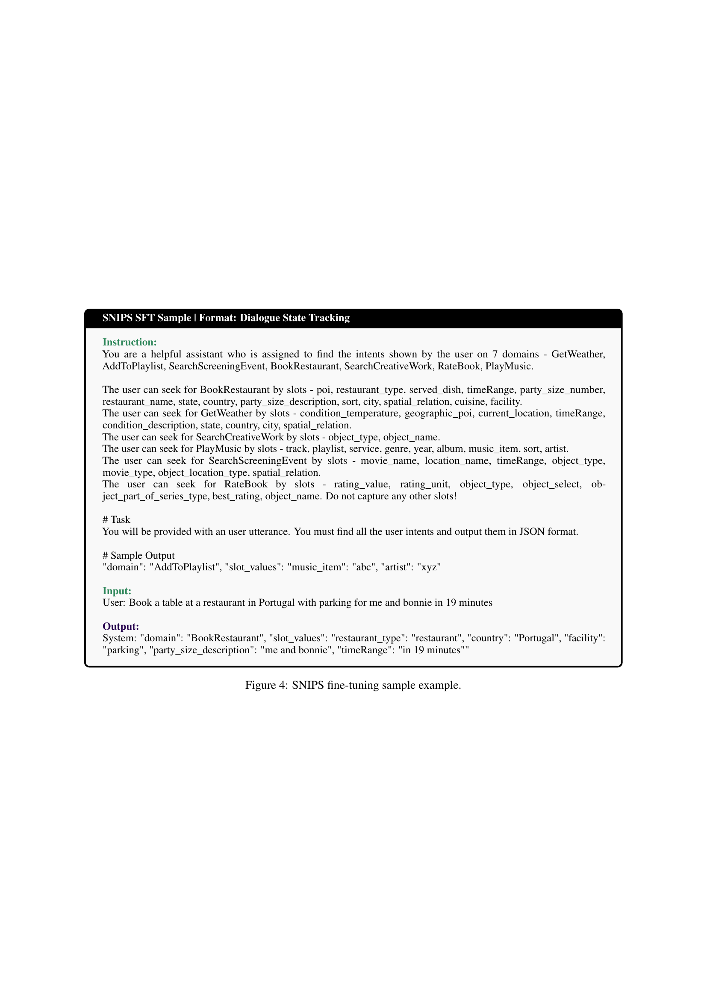

 


 2502.08820 
 Emre Can Acikgoz et el. 
 
 🤗 2025-02-18 
 



↗ arXiv


↗ Hugging Face


↗ Papers with Code


### TL;DR



현존하는 대화형 ì‹œìŠ¤í…œì€ **다회차 대화 관리**와 **ë„구(API) 활용** 능력 중 하나ì—만 특화ë˜ì–´, ë‘ ê°€ì§€ 능력 모ë‘를 고루 갖춘 시스템 ê°œë°œì— ì–´ë ¤ì›€ì„ ê²ªê³  ìˆìŠµë‹ˆë‹¤. 특íˆ, 다회차 대화를 효과ì ìœ¼ë¡œ 관리하면서 ë™ì‹œì— 다양한 API를 ì유롭게 활용하는 ê²ƒì€ ë§¤ìš° 어려운 과제ì…니다.

본 연구는 ì´ëŸ¬í•œ 문제를 해결하기 위해 **다회차 대화와 ë„구 사용 ëŠ¥ë ¥ì„ í†µí•©í•œ 새로운 대화형 ì—ì´ì „트 언어 모ë¸ì¸ CoALM**ì„ ì œì‹œí•©ë‹ˆë‹¤.  CoALMì€ **새롭게 ê°œë°œëœ CoALM-IT ë°ì´í„°ì…‹**ì„ ì‚¬ìš©í•˜ì—¬ 학습ë˜ì—ˆìœ¼ë©°, 다양한 ë²¤ì¹˜ë§ˆí¬ í…ŒìŠ¤íŠ¸ì—ì„œ **기존 최고 성능 모ë¸ë“¤ì„ 뛰어넘는 ê²°ê³¼**를 보였습니다.  CoALMì˜ ê°œë°œ ë° ê³µê°œë¥¼ 통해, **대화형 ì—ì´ì „íŠ¸ì˜ ì„±ëŠ¥ í–¥ìƒ ë° ì˜¤í”ˆì†ŒìŠ¤ ìƒíƒœê³„ 발전**ì— ê¸°ì—¬í•  것으로 기대ë©ë‹ˆë‹¤.



#### Key Takeaways


 ë‹¨ì¼ ëª¨ë¸ë¡œ 다회차 대화와 ë„구 ì‚¬ìš©ì„ í†µí•©ì ìœ¼ë¡œ 처리하는 새로운 ì ‘ê·¼ ë°©ì‹ì¸ CoALM 제시 



 다회차 대화와 API ì‚¬ìš©ì„ ê²°í•©í•œ 새로운 다중 ì‘ì—… 학습 ë°ì´í„°ì…‹ì¸ CoALM-IT 개발 



 CoALMì€ ê¸°ì¡´ 최고 성능 모ë¸ë“¤ì„ 다양한 벤치마í¬ì—ì„œ 능가하는 ì„±ëŠ¥ì„ ë³´ì„ 


#### Why does it matter?
본 ë…¼ë¬¸ì€ **대화형 ì—ì´ì „트** ë¶„ì•¼ì˜ í•µì‹¬ì ì¸ 문제ì ì¸ **다회차 대화 관리 ë° ë„구 사용 능력**ì„ ë™ì‹œì— í–¥ìƒì‹œí‚¤ëŠ” 새로운 모ë¸ì„ 제시하여, **개방형 대화 시스템** ì—°êµ¬ì— ì¤‘ìš”í•œ 기여를 합니다.  ë˜í•œ, ì œì‹œëœ ëª¨ë¸ì€ **오픈소스**ë¡œ 공개ë˜ì–´, 다른 연구ìë“¤ì˜ **í›„ì† ì—°êµ¬ ë° ë°œì „**ì„ ìœ„í•œ ê¸°ë°˜ì„ ë§ˆë ¨í•©ë‹ˆë‹¤. ì´ëŠ” **ì¸ê³µì§€ëŠ¥ ë¶„ì•¼ì˜ ë°œì „**ì— ì§ì ‘ì ìœ¼ë¡œ 기여하며, íŠ¹íˆ **대화형 AI 시스템**ì˜ ì‹¤ìš©ì„±ì„ ë†’ì´ëŠ” ë° í° ì˜ë¯¸ê°€ ìˆìŠµë‹ˆë‹¤. 

------
#### Visual Insights

> 🔼 그림 1ì€ TOD 시스템과 언어 ì—ì´ì „트(LA)ì˜ ê¸°ëŠ¥ì„ í†µí•©ì ìœ¼ë¡œ ë³´ì—¬ì¤ë‹ˆë‹¤. TOD ì‹œìŠ¤í…œì€ í„´ì´ ë§ì€ 대화와 ì‘ì—… ì™„ë£Œì— ë›°ì–´ë‚˜ì§€ë§Œ 고급 API ê¸°ëŠ¥ì´ ë¶€ì¡±í•œ 반면, LA는 API를 ì˜ ì²˜ë¦¬í•˜ì§€ë§Œ ì¼ê´€ì„± ìˆëŠ” 다턴 대화ì—는 ì–´ë ¤ì›€ì„ ê²ªëŠ”ë‹¤ëŠ” ê²ƒì„ ë³´ì—¬ì¤ë‹ˆë‹¤.  즉, TOD ì‹œìŠ¤í…œì€ ì—¬ëŸ¬ í„´ì— ê±¸ì¹œ 대화를 ì˜ ì²˜ë¦¬í•˜ê³  ì‘ì—…ì„ ì™„ë£Œí•˜ì§€ë§Œ, 새로운 APIì— ëŒ€í•œ ê¸°ëŠ¥ì´ ë¶€ì¡±í•©ë‹ˆë‹¤. 반면 LA는 API 활용 ëŠ¥ë ¥ì´ ë›°ì–´ë‚˜ì§€ë§Œ,  ì¼ê´€ì„± ìˆëŠ” 다턴 대화를 ìƒì„±í•˜ëŠ” ë° ì–´ë ¤ì›€ì´ ìˆìŠµë‹ˆë‹¤.
> 

> 
read the caption

> Figure 1: Unifying Capabilities of TOD Systems and LAs. TOD systems excel in multi-turn conversations and task completion but lack advanced API capabilities, while LA handle APIs well but struggle with coherent multi-turn dialogue.
> 


| Data Domain | Data Type | Data Name | Data Format | # of Data Samples | # of Total Tokens | Avg. Tokens Per Sample |
|---|---|---|---|---|---|---|
| **TOD** | Single-Turn | SNIPS | State Tracking | 13,028 | 12,278,780 | 942.49 |
| **LA** | Single-Turn | Hammer | API Call | 13,819 | 10,199,147 | 738.05 |
|  | Multi-Turn | ToolAce | API Call | 202,500 | 129,001,612 | 637.04 |
| **CRA** | Multi-Turn | SGD | ReAct API Call | 82,236 | 59,704,782 | 726.02 |
| **Total** |  |  |  | 311,583 | 211,184,321 | 760.90 |

> 🔼 ì´ í‘œëŠ” 논문ì—ì„œ 제안하는 CoALM-IT ë°ì´í„°ì…‹ì˜ í†µê³„ì  ì„¸ë¶€ 정보를 ë³´ì—¬ì¤ë‹ˆë‹¤.  CoALM-IT ë°ì´í„°ì…‹ì€ 대화 ìƒíƒœ 추ì , ë³µì¡í•œ 함수 호출, ReAct 스타ì¼ì˜ 멀티턴 대화를 í¬í•¨í•˜ëŠ” 세 가지 ì°¨ì›ì„ 다룹니다.  ì´ í‘œëŠ” ê° ë°ì´í„° 유형(TOD, LA, CRA)ì˜ ë°ì´í„° 샘플 수, ì´ í† í° ìˆ˜, 샘플당 í‰ê·  í† í° ìˆ˜ë¥¼ 보여주어 학습 ë°ì´í„°ì˜ êµ¬ì„±ì„ ìì„¸íˆ ì„¤ëª…í•©ë‹ˆë‹¤.  'Generated CRA'는 대화형 ReAct API ë°ì´í„°ì…‹ì„ 나타냅니다.
> 

> 
read the caption

> Table 1: CoALM-IT Dataset Details. Statistical details of our proposed CoALM-IT dataset showcasing the training mixtures. Generated CRA denotes the Conversational ReAct API dataset.
> 

### In-depth insights

#### Unified Agent Vision
통합 ì—ì´ì „트 ë¹„ì „ì€ **ë‹¨ì¼ ëª¨ë¸ì´ 다중 í„´ 대화와 ë„구 ì‚¬ìš©ì„ ëª¨ë‘ ë§ˆìŠ¤í„°í•  수 ìˆëŠ” 가능성**ì„ íƒêµ¬í•˜ëŠ” 것ì…니다. ì´ëŠ” ê¸°ì¡´ì˜ íŠ¹ì • ì‘ì—…ì— ì´ˆì ì„ ë§ì¶˜ 대화 시스템과 ë„구 ì‚¬ìš©ì— íŠ¹í™”ëœ ì–¸ì–´ ì—ì´ì „íŠ¸ì˜ í•œê³„ë¥¼ 극복하기 위한 ì‹œë„ì…니다.  **강력한 다중 í„´ 관리와 고급 기능 í˜¸ì¶œì€ íš¨ê³¼ì ì¸ 대화형 ì—ì´ì „íŠ¸ì— í•„ìˆ˜ì **ì´ë©°, ì´ ë¹„ì „ì€ ì´ ë‘ ê°€ì§€ ê¸°ëŠ¥ì„ í†µí•©í•˜ì—¬ 사용ì ì˜ë„를 유지하고 다양한 API를 효율ì ìœ¼ë¡œ 활용하는 **í†µí•©ëœ ëŒ€í™”í˜• ì—ì´ì „트**를 구축하는 ë° ìˆìŠµë‹ˆë‹¤. ì´ë¥¼ 위해서는 **다중 ì‘ì—… ë°ì´í„°ì…‹ì„ ì´ìš©í•œ 훈련**ì´ ì¤‘ìš”í•˜ë©°,  **새로운 ì„œë¹„ìŠ¤ì— ëŒ€í•œ ì ì‘ë ¥**ê³¼ **다양한 API ì ‘ê·¼**ì´ ê°€ëŠ¥í•´ì•¼ í•¨ì„ ì‹œì‚¬í•©ë‹ˆë‹¤.  **개방형 ì ‘ê·¼ ë°©ì‹**ì„ ì±„íƒí•˜ì—¬  ë” ë§ì€ 연구가 ì´ë£¨ì–´ì§ˆ 수 ìˆë„ë¡ í•˜ëŠ” ê²ƒì´ ì¤‘ìš”í•˜ë©°, ì´ëŠ” **ë‹¨ì¼ ëª¨ë¸ ì ‘ê·¼ ë°©ì‹ì˜ 실현 가능성**ì„ ë³´ì—¬ì£¼ê³  대화형 ì—ì´ì „íŠ¸ì˜ ìƒˆë¡œìš´ ê¸°ì¤€ì„ ì œì‹œí•  수 ìˆìŠµë‹ˆë‹¤.

#### CoALM-IT Dataset
CoALM-IT ë°ì´í„°ì…‹ì€ **대화 ìƒíƒœ 추ì , ë³µì¡í•œ 함수 호출, ReAct 스타ì¼ì˜ 다회차 대화** 세 가지 ì°¨ì›ì„ 아우르는 통합ì ì¸ ì ‘ê·¼ ë°©ì‹ì„ 제시합니다.  기존 TOD ì‹œìŠ¤í…œì˜ í•œê³„ë¥¼ 극복하고ì **ReAct 추론과 API ì‚¬ìš©ì„ ê²°í•©**í•œ 새로운 ë°ì´í„° ìƒì„± ë°©ì‹ì„ 통해,  **실제 í™˜ê²½ì— ê°€ê¹Œìš´ 다양한 시나리오**를 í¬í•¨í•©ë‹ˆë‹¤. 특íˆ, **GPT-4를 활용**하여 ìƒì„±ëœ 대화형 ReAct API(CRA) ì¸ìŠ¤í„´ìŠ¤ëŠ” **다중 사고 단계를 통합**하여, 모ë¸ì´ API 호출 여부 ë° ì‚¬ìš©ì ì‘답 여부를 결정하는 ê³¼ì •ì„ ë°˜ì˜í•©ë‹ˆë‹¤.  ì´ëŸ¬í•œ ì ‘ê·¼ ë°©ì‹ì€ ê¸°ì¡´ì˜ íŠ¹ì • APIì— êµ­í•œëœ TOD 시스템 ë° ë‹¨ì¼ í„´ 함수 í˜¸ì¶œì— ì´ˆì ì„ ë§ì¶˜ LA ì‹œìŠ¤í…œì˜ í•œê³„ë¥¼ 뛰어넘어, **통합ì ì¸ 대화형 ì—ì´ì „트** ê°œë°œì„ ìœ„í•œ 중요한 토대가 ë©ë‹ˆë‹¤.  **개방형 모ë¸ì˜ 성능 í–¥ìƒ**ì— ê¸°ì—¬í•  ë¿ ì•„ë‹ˆë¼, 향후 ì—°êµ¬ì— í™œìš©ë  ìˆ˜ ìˆëŠ” 귀중한 ìì›ì´ ë  ê²ƒìœ¼ë¡œ 예ìƒë©ë‹ˆë‹¤.

#### Benchmark Results
본 ë…¼ë¬¸ì˜ ë²¤ì¹˜ë§ˆí¬ ê²°ê³¼ëŠ” **CoALM 모ë¸ì´ ê¸°ì¡´ì˜ TOD 시스템 ë° LA 모ë¸ë³´ë‹¤ 우수한 ì„±ëŠ¥ì„ ë³´ì„**ì„ ë³´ì—¬ì¤ë‹ˆë‹¤. 특íˆ, **다중 í„´ 대화 ë° API 호출 능력ì—ì„œ ë›°ì–´ë‚œ 성능**ì„ ê¸°ë¡í•˜ì—¬, **ë‹¨ì¼ ëª¨ë¸ë¡œ 다중 ì‘ì—…ì„ íš¨ê³¼ì ìœ¼ë¡œ 수행할 수 ìˆìŒ**ì„ ì…ì¦í•˜ì˜€ìŠµë‹ˆë‹¤.  **MultiWOZ, API-Bank, BFCL V3 세 가지 ë²¤ì¹˜ë§ˆí¬ ëª¨ë‘ì—ì„œ CoALM 모ë¸ì€ 최첨단 성능**ì„ ë‹¬ì„±í•˜ì˜€ê³ , íŠ¹íˆ ëŒ€ê·œëª¨ 모ë¸ì¼ìˆ˜ë¡ 성능 í–¥ìƒì´ ë‘드러졌습니다. ì´ëŠ” **CoALMì´ ëŒ€í™” 관리와 ì—ì´ì „트 ê¸°ëŠ¥ì„ í†µí•©**하여 ìƒí˜¸ë³´ì™„ì ìœ¼ë¡œ ì‘ìš©í•¨ìœ¼ë¡œì¨ ê¸°ì¡´ 모ë¸ì˜ 한계를 극복했ìŒì„ 시사**합니다. 하지만, ì œí•œëœ ëª¨ë¸ ì•„í‚¤í…처 사용 ë° íŠ¹ì • ë°ì´í„°ì…‹ì— 대한 ì˜ì¡´ì„± ë“±ì˜ í•œê³„ì ë„ ì¡´ì¬í•©ë‹ˆë‹¤.**

#### Open-Source Impact
본 논문ì—ì„œ **ì˜¤í”ˆì†ŒìŠ¤ì˜ ì˜í–¥**ì— ëŒ€í•œ ë…¼ì˜ëŠ” 주로 **대규모 언어 모ë¸(LLM)**ì˜ ì ‘ê·¼ì„±ê³¼ 연구 확ì¥ì„±ì— ì´ˆì ì„ ë§ì¶¥ë‹ˆë‹¤.  **오픈소스 ëª¨ë¸ ê³µê°œ**를 통해 ë” ë§ì€ 연구ìë“¤ì´ ìµœì²¨ë‹¨ ê¸°ìˆ ì— ì ‘ê·¼í•˜ì—¬ 연구를 진행하고, **ëª¨ë¸ ê°œì„ **ì— ê¸°ì—¬í•  수 ìˆê²Œ ë˜ì—ˆìŠµë‹ˆë‹¤. ì´ëŠ” ìƒìš© 모ë¸ì— 비해 **비용 효율ì **ì´ë©°, **투명성**ì„ í™•ë³´í•˜ê³  **ê³µë™ ì—°êµ¬**를 촉진하는 ê¸ì •ì  ì¸¡ë©´ì„ ë³´ì—¬ì¤ë‹ˆë‹¤.  하지만 **오픈소스 모ë¸**ì˜ ì„±ëŠ¥ì´ ìƒìš© 모ë¸ì— 비해 다소 떨어지는 ì¸¡ë©´ë„ ì¡´ì¬í•˜ë©°, ì´ëŸ¬í•œ 성능 ì°¨ì´ëŠ”  **ë°ì´í„°ì…‹ 규모와 품질**, **ëª¨ë¸ í•™ìŠµ ë°©ì‹**, **컴퓨팅 ìì›** 등 여러 ìš”ì†Œì— ê¸°ì¸í•©ë‹ˆë‹¤. ë”°ë¼ì„œ **오픈소스 LLM ìƒíƒœê³„**ì˜ ì§€ì†ì ì¸ 성ì¥ê³¼ ë°œì „ì„ ìœ„í•´ì„œëŠ” **ë°ì´í„°ì…‹ 구축**, **ëª¨ë¸ ì•„í‚¤í…처 개선**, **학습 효율 í–¥ìƒ** 등 ë‹¤ë°©ë©´ì˜ ë…¸ë ¥ì´ í•„ìš”í•©ë‹ˆë‹¤. **오픈소스 모ë¸**ì˜ ì¥ì ê³¼ 단ì ì„ 균형 ìˆê²Œ 고려하여, **연구 ë° ìƒìš©í™”** ì „ëµì„ 수립하는 ê²ƒì´ ì¤‘ìš”í•©ë‹ˆë‹¤.

#### Future Work
본 ë…¼ë¬¸ì˜ "ë¯¸ë˜ ì—°êµ¬ ë°©í–¥" ë¶€ë¶„ì€ **대규모 언어 모ë¸(LLM) ê¸°ë°˜ì˜ ëŒ€í™”í˜• ì—ì´ì „íŠ¸ì˜ ê¸°ëŠ¥ í–¥ìƒ**ì— ì´ˆì ì„ ë§ì¶°ì•¼ í•  것ì…니다.  특íˆ, **ë³µì¡í•œ 멀티턴 대화와 다양한 API í˜¸ì¶œì˜ í†µí•©**ì„ ë”ìš± 효율ì ì´ê³  ì연스럽게 처리하는 ë°©ì•ˆì„ ëª¨ìƒ‰í•´ì•¼ 합니다.  ê°•í™” 학습(RL)ì„ í™œìš©í•˜ì—¬ LLMì´ ë‹¤ì–‘í•œ 환경ì—ì„œ 스스로 학습하고 발전할 수 ìˆë„ë¡ í•˜ëŠ” 연구가 필요하며, **제로샷 ë˜ëŠ” 극소수 샷 학습** 성능 ê°œì„ ì„ ìœ„í•œ ì—°êµ¬ë„ ì¤‘ìš”í•©ë‹ˆë‹¤.  ë˜í•œ, **다양한 ëª¨ë¸ ì•„í‚¤í…처와 훈련 ì „ëµ**ì„ ë¹„êµ ë¶„ì„하여 CoALM 모ë¸ì˜ 한계를 극복하고 ë”ìš± 강력한 대화형 ì—ì´ì „트를 개발하는 ë° ì§‘ì¤‘í•´ì•¼ 합니다.  나아가, ê°œë°œëœ ëª¨ë¸ì˜ **실제 환경 ì ìš©ì„ 위한 테스트 ë° í‰ê°€**를 통해 ì‹¤ìš©ì„±ì„ ë†’ì´ê³ , ìœ¤ë¦¬ì  ë¬¸ì œì ì„ 해결하는 ë°©ì•ˆì„ ë§ˆë ¨í•´ì•¼ 합니다.  **오픈소스 ì»¤ë®¤ë‹ˆí‹°ì˜ ì°¸ì—¬**를 확대하여 ì—°êµ¬ì˜ ì§€ì†ê°€ëŠ¥ì„±ì„ 확보하는 것 ë˜í•œ 중요한 ë¯¸ë˜ ì—°êµ¬ 과제ì…니다.

### More visual insights

More on figures

> 🔼 그림 2는 CoALM 파ì´í”„ë¼ì¸ì˜ 개요를 ë³´ì—¬ì¤ë‹ˆë‹¤. ë°ì´í„° 변환 과정과 미세 ì¡°ì • 프레ì„워í¬ë¥¼ 보여주는 ë° ì¤‘ì ì„ 둡니다. 위쪽 세 ì¤„ì€ ë°ì´í„° 변환 ê³¼ì •ì„ ë‚˜íƒ€ë‚´ë©°, 오른쪽ì—는 해당 예시가 나와 ìˆìŠµë‹ˆë‹¤. ê° í›ˆë ¨ 샘플ì—ì„œ 녹색 í…스트는 지시어 ìƒ˜í”Œì˜ ì…ë ¥ 구성 요소를 강조하고, ë³´ë¼ìƒ‰ í…스트는 미세 ì¡°ì • ì¤‘ì— ìµœì í™”ëœ ëŒ€ìƒ ì¶œë ¥ì„ ë‚˜íƒ€ëƒ…ë‹ˆë‹¤. ì세한 ë‚´ìš©ì€ ê·¸ë¦¼ 4~7ì„ ì°¸ì¡°í•˜ì‹­ì‹œì˜¤.
> 

> 
read the caption

> Figure 2: Overview of the CoALM Pipeline. This figure illustrates our dataset generation and fine-tuning framework. The top three rows depict the data transformation processes, along with a corresponding sample shown on the right. In each training sample, green text highlights the input components of the instruction sample, while purple text indicates the target outputs optimized during fine-tuning. For detailed examples, refer to Figures 4 - 7.
> 

> 🔼 그림 3ì€ CoALM 모ë¸ê³¼ 다른 기준 모ë¸ë“¤ì˜ 함수 호출 ì„±ëŠ¥ì„ API-Bank L1(위쪽) ë° BFCL V3 병렬 함수 호출(ì•„ë˜ìª½) 벤치마í¬ì—ì„œ ë¹„êµ ë¶„ì„í•œ 결과를 ë³´ì—¬ì¤ë‹ˆë‹¤.  API-Bank L1ì€ ë‹¨ì¼ í•¨ìˆ˜ 호출, BFCL V3는 병렬 함수 호출 시나리오를 í‰ê°€í•©ë‹ˆë‹¤. ì´ ê·¸ë¦¼ì€ ê° ëª¨ë¸ì˜ 출력 결과와 ì •ë‹µì„ ì œì‹œí•˜ì—¬, CoALM 모ë¸ì´ 다른 모ë¸ë“¤ì— 비해 ì¼ê´€ë˜ê²Œ 우수한 ì„±ëŠ¥ì„ ë³´ì„ì„ ì‹œê°ì ìœ¼ë¡œ ë³´ì—¬ì¤ë‹ˆë‹¤.  특íˆ, 다른 모ë¸ë“¤ì´ 구문 오류, 함수 누ë½, ì˜ëª»ëœ ê°’ ë“±ì˜ ë¬¸ì œë¥¼ ë³´ì´ëŠ” 반면, CoALMì€ ì •í™•í•œ 함수 호출과 매개변수를 제공하여 ì •ë‹µì„ ìƒì„±í•©ë‹ˆë‹¤.
> 

> 
read the caption

> Figure 3: Error Analysis of Function-Calling Results. Illustrated performance comparison on function calling benchmarks API-Bank L1 (top) and BFCL V3 parallel function call (bottom). Results demonstrate CoALM’s consistent performance compared to other baselines.
> 

More on tables


| Method | Success | JGA |
|---|---|---|
| CoALM 8B (ours) | 51.6 | 30.4 |
| CoALM 70B (ours) | 69.4 | 43.8 |
| CoALM 405B (ours)* | 66.7 | 38.8 |
| Hammer 2.0 7B | 23.5 | 21.7 |
| ToolAce | 18.0 | 34.4 |
| Granite-20B-Code | 10.7 | 21.8 |
| CodeActAgent | 9.5 | 20.2 |
| Llama 3.1 8B Instruct | 19.9 | 26.3 |
| Llama 3.3 70B Instruct | 67.6 | 40.8 |
| Mistral-7B-Instruct-v0.3 | 31.2 | 27.0 |
| FNCTOD [Li et al. (2024)](<https://arxiv.org/pdf/2502.08820.pdf>) | 44.4 | 37.9 |
| NC-Latent-TOD [King and Flanigan (2024)](<https://arxiv.org/pdf/2502.08820.pdf>) | 68.3 | 39.7 |
| GPT 3.5 Turbo [HudeÄek and Dusek (2023)](<https://arxiv.org/pdf/2502.08820.pdf>) | - | 13.5 |
| GPT4o-mini | 69.9 | 38.4 |
| GPT4o | 75.5 | 36.9 |
> 🔼 í‘œ 2는 MultiWOZ 2.4 대화 벤치마í¬ì—ì„œ 다양한 모ë¸ë“¤ì˜ ì„±ëŠ¥ì„ ë¹„êµ ë¶„ì„í•œ 결과를 ë³´ì—¬ì¤ë‹ˆë‹¤. MultiWOZ 2.4는 호텔 예약, ì‹ë‹¹ 예약, êµí†µí¸ 예약 등 여러 ë„ë©”ì¸ì— 걸친 ë³µì¡í•œ 대화 시나리오를 í¬í•¨í•˜ê³  ìˆìŠµë‹ˆë‹¤.  í‘œì—는 ê° ëª¨ë¸ì˜ 성공률(Success)ê³¼ ê³µë™ ëª©í‘œ 달성률(JGA)ì´ ì œì‹œë˜ì–´ ìˆìœ¼ë©°, ê°€ì¥ ë†’ì€ ì ìˆ˜ëŠ” êµµì€ ê¸€ì”¨ì²´ë¡œ ê°•ì¡° 표시ë˜ì–´ ìˆìŠµë‹ˆë‹¤.  CoALM 405B 모ë¸ì˜ 경우 ì•„ì§ í›ˆë ¨ì´ ì™„ë£Œë˜ì§€ ì•Šì€ ì¤‘ê°„ 지ì (checkpoint)ì˜ ê²°ê³¼ì´ë¯€ë¡œ, (*) 표시로 구분ë˜ì–´ ìˆìŠµë‹ˆë‹¤.
> 

> 
read the caption

> Table 2: MultiWOZ 2.4 Benchmark Results. Performance comparison across models on MultiWOZ 2.4 dialogue benchmark. Best scores are highlighted with bold. The asterisk (*) on CoALM 405B denotes the checkpoint from one completed epoch, as the model is still under training.
> 


| Model | Rouge-L* (L-1) | Rouge-L* (L-2) | Rouge-1 (L-1) | Rouge-1 (L-2) | Rouge-2 (L-1) | Rouge-2 (L-2) | BLEU-4 (L-1) | BLEU-4 (L-2) |
|---|---|---|---|---|---|---|---|---|
| CoALM 8B (ours) | 92.8 | 81.9 | 94.1 | 81.2 | 91.9 | 76.4 | 89.4 | 69.7 |
| CoALM 70B (ours) | 92.7 | 83.2 | 94.5 | 82.7 | 92.5 | 78.9 | 89.5 | 72.4 |
| CoALM 405B (ours)* | 93.4 | 77.8 | 94.5 | 77.1 | 92.4 | 71.9 | 90.3 | 64.4 |
| Llama 3.1 8B Instruct | 72.7 | 75.2 | 84.0 | 81.4 | 79.8 | 76.3 | 62.3 | 65.1 |
| Qwen2.5 7B Instruct | 84.3 | 73.9 | 88.9 | 78.5 | 84.6 | 71.2 | 76.4 | 64.2 |
| Hammer 2.0 7B | 90.1 | 74.0 | 92.3 | 74.1 | 89.9 | 68.5 | 85.4 | 58.4 |
| ToolAce | 81.5 | 63.6 | 88.8 | 71.3 | 85.0 | 63.0 | 76.1 | 67.0 |
| Granite-20B-Code | 60.3 | 45.7 | 64.7 | 48.9 | 59.5 | 43.4 | 43.8 | 29.3 |
| Fnc-TOD 13B | 3.9 | 3.3 | 22.1 | 23.4 | 8.0 | 9.2 | 1.5 | 1.1 |
| LDST | 8.3 | 7.1 | 12.8 | 11.6 | 2.7 | 2.4 | 6.2 | 5.7 |
| tod-zero-bqag3oyb | 3.7 | 4.2 | 11.5 | 12.4 | 1.1 | 2.2 | 1.0 | 0.9 |
| nc-latent-tod-step-2 | 3.2 | 3.2 | 14.3 | 13.3 | 3.2 | 1.5 | 0.8 | 0.8 |
> 🔼 본 표는 API-Bank 기능 호출 벤치마í¬ì—ì„œ 다양한 모ë¸ì˜ ì„±ëŠ¥ì„ ë¹„êµ ë¶„ì„í•œ 결과를 ë³´ì—¬ì¤ë‹ˆë‹¤.  MultiWOZ와 달리 API í˜¸ì¶œì— ì´ˆì ì„ ë§ì¶˜ API-Bank ë°ì´í„°ì…‹ì„ 사용하여 ê° ëª¨ë¸ì˜ 기능 호출 정확ë„를 í‰ê°€í•©ë‹ˆë‹¤.  Rouge-L, Rouge-1, Rouge-2, BLEU-4 지표를 사용하여 모ë¸ì˜ ì„±ëŠ¥ì„ ë‹¤ê°ì ìœ¼ë¡œ í‰ê°€í•˜ë©°,  최고 ì ìˆ˜ëŠ” êµµì€ ê¸€ì”¨ì²´ë¡œ, ë‘ ë²ˆì§¸ë¡œ ë†’ì€ ì ìˆ˜ëŠ” 밑줄 친 글씨체로 표시ë©ë‹ˆë‹¤.  CoALM 405B 모ë¸ì€ ì•„ì§ í›ˆë ¨ 중ì´ë¯€ë¡œ í•œ ì—í¬í¬ 완료 ì‹œì ì˜ 결과만 제시ë©ë‹ˆë‹¤.
> 

> 
read the caption

> Table 3: API-Bank Benchmark Results. Performance comparison across models on API-Bank function calling benchmark. Best scores are highlighted with bold and the second-best results are underlined. The asterisk (*) on CoALM 405B denotes one completed epoch, as the model is still in the training process.
> 


| Model | Overall Acc | Non-Live AST Acc | Non-Live Exec Acc | Live Acc | Multi Turn Acc | Relevance Detection | Irrelevance Detection |
|---|---|---|---|---|---|---|---| 
| Mistral-7B-Instruct-v0.3 | 38.35% | 56.33% | 63.77% | 57.31% | 0.25% | 77.78% | 41.84% |
| Llama-3.1-8B-Instruct | 49.84% | 84.25% | 79.75% | 60.33% | 10.25% | 75.61% | 47.92% |
| Llama-3.3-70B-Instruct | 51.36% | 84.85% | 90.05% | 62.51% | 7.25% | 95.12% | 48.33% |
| ToolAce | 52.55% | 82.19% | 86.98% | 71.08% | 0.88% | 70.73% | 87.29% |
| Hammer2.0-7b | 52.13% | 86.94% | 83.66% | 71.17% | 0.38% | 95.12% | 73.20% |
| Llama-3.1-405B-Instruct | 56.38% | 89.71% | 84.70% | 70.77% | 11.75% | 88.89% | 70.86% |
| GPT-4o-mini (2024-07-18) | 59.40% | 86.52% | 85.05% | 73.26% | 19.00% | 78.05% | 76.97% |
| GPT-4o (2024-08-06) | 59.83% | 70.08% | 60.79% | 76.41% | 34.62% | 51.22% | 87.34% |
| CoALM 8B (ours) | 54.11% | 85.17% | 78.61% | 72.59% | 7.00% | 77.78% | 83.00% |
| CoALM 70B (ours) | 60.49% | 82.94% | 81.36% | 72.19% | 26.25% | 72.22% | 85.36% |
| CoALM 405B (ours)∗ | 63.34% | 90.46% | 84.75% | 74.59% | 28.25% | 100.00% | 72.26% |
> 🔼 í‘œ 4는 BFCL V3 기능 호출 벤치마í¬ì— 대한 성능 ë¹„êµ ê²°ê³¼ë¥¼ ë³´ì—¬ì¤ë‹ˆë‹¤.  CoALM 모ë¸ì´ 다른 모ë¸ë“¤ì— 비해 우수한 ì„±ëŠ¥ì„ ë³´ì´ëŠ” ê²ƒì„ ë³´ì—¬ì£¼ëŠ” í‘œì…니다.  특íˆ, CoALM 405B는 ì•„ì§ í•™ìŠµì´ ì™„ë£Œë˜ì§€ ì•Šì€ ìƒíƒœì„ì—ë„ ë¶ˆêµ¬í•˜ê³  ìƒìœ„권 ì„±ëŠ¥ì„ ê¸°ë¡í•˜ê³  ìˆìŠµë‹ˆë‹¤.  í‘œì—는 정확ë„, AST 정확ë„, 실행 가능한 함수 정확ë„, 다중 í„´ 정확ë„, 관련성 ê°ì§€, 무관성 ê°ì§€ 등 여러 지표가 í¬í•¨ë˜ì–´ ìˆìŠµë‹ˆë‹¤. ê°€ì¥ ì¢‹ì€ ê²°ê³¼ëŠ” 굵게 표시하고, ë‘ ë²ˆì§¸ë¡œ ì¢‹ì€ ê²°ê³¼ëŠ” ë°‘ì¤„ì´ ê·¸ì–´ì ¸ ìˆìŠµë‹ˆë‹¤.
> 

> 
read the caption

> Table 4: BFCL V3 Benchmark Results. Performance comparison on the BFCL V3 function-calling benchmark. The best results are highlighted in bold, while the second-best results are underlined. The asterisk (*) on CoALM 405B denotes one completed epoch, as the model continues training.
> 


| Model | TOD Task |  | Function Calling Tasks |  |  |  | 
|---|---|---|---|---|---|---| 
|  | **MultiWOZ 2.4** |  | **API-Bank** |  | **BFCL-V3** |  | 
|  | **Success** | **DST** | **Rouge-L1** | **Rouge-L2** | **Overall Success** |  | 
| Llama 3.1 8B Instruct | 19.9 | 26.3 | 72.7 | 75.2 | 49.8 |  | 
|  + CoALM-IT w/o LA | 46.0 (26.1 ↑, 5.6 ↓) | 28.5 (2.2 ↑, 1.9 ↓) | 45.5 (27.2 ↓, 47.3 ↓) | 48.8 (26.4 ↓, 33.1 ↓) | 35.4 (14.4 ↓, 18.3 ↓) |  | 
|  + CoALM-IT w/o TOD | 42.0 (22.1 ↑, 9.6 ↓) | 19.4 (6.9 ↓, 11.0 ↓) | 92.7 (20.0 ↑, 0.1 ↓) | 78.9 (13.7 ↑, 3.0 ↓) | 54.1 (4.3 ↑, 0.4 ↑) |  | 
|  + CoALM-IT w/o CRA | 50.0 (30.1 ↑, 1.6 ↓) | **34.5** (8.2 ↑, 4.1 ↑) | 91.3 (18.6 ↑, 1.5 ↓) | 78.8 (3.6 ↑, 3.1 ↓) | **56.6** (10.6 ↑, 2.9 ↑) |  | 
| CoALM 8B | **51.6** | 30.4 | **92.8** | **81.9** | 53.7 |  | 
> 🔼 í‘œ 5는 CoALM 미세 ì¡°ì • 중 특정 ë„ë©”ì¸ ë°ì´í„°ì…‹ì„ ì œì™¸í–ˆì„ ë•Œì˜ ì˜í–¥ì„ 보여주는 실험 결과를 ë³´ì—¬ì¤ë‹ˆë‹¤.  'w/o'는 미세 ì¡°ì • 중 해당 ë°ì´í„°ì…‹ì„ 제외했ìŒì„ 나타냅니다. ê° í–‰ì€ ê¸°ì¤€ 모ë¸(Llama) ë° ìµœì¢… 모ë¸(CoALM)ê³¼ 비êµí•˜ì—¬ 성능 변화를 ë³´ì—¬ì¤ë‹ˆë‹¤. 괄호 ì•ˆì˜ ê°’ì€ Llama 모ë¸ê³¼ CoALM 모ë¸ì˜ 성능 변화를 ê°ê° 나타냅니다. 성능 í–¥ìƒì€ 녹색으로, 성능 저하는 빨간색으로 표시ë©ë‹ˆë‹¤.  즉, ì´ í‘œëŠ” CoALM 모ë¸ì˜ ì„±ëŠ¥ì— ê° ë°ì´í„°ì…‹(TOD, LA, CRA)ì´ ì–¼ë§ˆë‚˜ 기여하는지를 정량ì ìœ¼ë¡œ 보여주는 í‘œì…니다. 
> 

> 
read the caption

> Table 5: Dataset Domain Effects. Experimental results highlighting the impact of excluding specific domain datasets during CoALM fine-tuning. w/o indicates excluding the corresponding dataset during fine-tuning. Each row displays performance changes in parentheses with respect to base model (Llama) and final model (CoALM), i.e. (ΔΔ\Deltaroman_Δ Llama, ΔΔ\Deltaroman_Δ CoALM). Performance gains are highlighted in green, while drops are marked in red.
> 


| User | Thought1 | API | API Input Arguments | API Result | Thought2 | System |
|---|---|---|---|---|---|---|
| You are an advanced AI assistant specializing in conversational dialogues. |  |  |  |  |  |  |
| You have access to a variety of services and APIs to assist users with their requests and your goal is to provide helpful and informative responses to user queries and commands. |  |  |  |  |  |  |
| You can interact with multiple services and APIs to fulfill user requests. |  |  |  |  |  |  |
| Your responses should be natural, informative, and tailored to the user’s needs. |  |  |  |  |  |  |
| # Task Information: |  |  |  |  |  |  |
| - You are asked to create a dataset in the format: User - Thought1 - API - API Input Arguments - API Result - Thought2 - System, or User - Thought - System. |  |  |  |  |  |  |
| - For the given # User Input, generate a multi-turn dialogue that follows this format, with each turn exhibiting realistic context reasoning, thought processes, and API interaction where applicable. |  |  |  |  |  |  |
| - The dialogues should be converted to follow a specific # Output Format, which includes reasoning on whether an API call is needed or if the system can respond directly. |  |  |  |  |  |  |
| - If the system decides that an API call is necessary, use this format: User - Thought1 - API - API Input Arguments - API Result - Thought2 - System. |  |  |  |  |  |  |
| - Call the right API from # Avaliable Functions and provide the necessary input arguments to fulfill the user’s request. |  |  |  |  |  |  |
| - If you think a function argument is not necessary, you can skip it. Don’t provide unnecessary arguments and None values. |  |  |  |  |  |  |
| - Ensure that the API calls are used logically and that the dialogue remains coherent and natural throughout the exchange. |  |  |  |  |  |  |
| - If the system determines that an API call is not necessary, use this format: User - Thought - System. |  |  |  |  |  |  |
| - Include intermediate thoughts where appropriate to capture the model’s internal reasoning, and clearly separate the different components of the format. |  |  |  |  |  |  |
| # Available Functions: |  |  |  |  |  |  |
| 1. CheckBalance(account_type) |  |  |  |  |  |  |
| 2. TransferMoney(account_type, amount, recipient_account_name) |  |  |  |  |  |  |
| . |  |  |  |  |  |  |
| . |  |  |  |  |  |  |
| . |  |  |  |  |  |  |
| 52. FindAttractions(location) |  |  |  |  |  |  |
| 53. GetWeather(city) |  |  |  |  |  |  |
| # Output Format: |  |  |  |  |  |  |
| - If an API Call is Needed: |  |  |  |  |  |  |
|  User: [User Input] |  |  |  |  |  |  |
|  Thought1: [I need to call an API] |  |  |  |  |  |  |
|  API Name: [API Call Name: CheckBalance(), TransferMoney(),..., FindAttractions(), GetWeather()] |  |  |  |  |  |  |
|  API Input: [The input parameters for the API] |  |  |  |  |  |  |
|  API Result: [API output result] |  |  |  |  |  |  |
|  Thought2: [2nd thought after API Result that ensure if the information is enough before the system response] |  |  |  |  |  |  |
|  System: [Your system response here] |  |  |  |  |  |  |
| - If an API Call is Not Needed: |  |  |  |  |  |  |
|  User: [User Input] |  |  |  |  |  |  |
|  Thought: [I don’t need an API and I want to respond to the user] |  |  |  |  |  |  |
|  System: [Your system response here] |  |  |  |  |  |  |
| Below is an example of the format: |  |  |  |  |  |  |
| # Example: |  |  |  |  |  |  |
| User: Add Don and Sherri to my "Meditate to Sounds of Nature" playlist. | Thought1: The user wants to add two artists to a specific playlist. I’ll need to extract the playlist name and the artists’ names. | API Name: AddToPlaylist | API Input: 'playlist_name': 'Meditate to Sounds of Nature', 'artists': Don Sherri | API Result: 'status': 'success', 'message': 'Don and Sherri have been added to your playlist.' | Thought2: The API call was successful, and the artists were added to the playlist. I need to inform the user about this. | System: Don and Sherri have been successfully added to your "Meditate to Sounds of Nature" playlist. Enjoy your music! |
| User: Thank you for adding them. I think I can add more songs to the playlist. | Thought: I don’t need an API call for that, I want to respond to the user. |  |  |  |  | System: Would you like to add more songs? |
| User: Yes, please add "Calm River" to the playlist. | Thought1: The user wants to add another song to the playlist. I’ll note the song title and proceed with the request. | API Name: AddToPlaylist | API Input: 'playlist_name': 'Meditate to Sounds of Nature', 'songs': Calm River | API Result: 'status': 'success', 'message': 'Calm River has been added to your playlist.' | Thought2: The song was successfully added. I should let the user know. | System: "Calm River" has been successfully added to your "Meditate to Sounds of Nature" playlist. Would you like to do anything else? |
| User: No, that’s all for now. Thank you! | Thought: The user is satisfied and doesn’t need further assistance. I should acknowledge their gratitude. |  |  |  |  | System: You’re welcome! If you need anything else, feel free to ask. Enjoy your relaxing music! |
| # User Input: |  |  |  |  |  |  |
> 🔼 ì´ í‘œëŠ” ë…¼ë¬¸ì˜ 4.1ì ˆ '대화형 ì—ì´ì „트 ë°ì´í„°ì…‹ ìƒì„±'ì—ì„œ 사용ëœ, GPT-4를 ì´ìš©í•´ ìƒì„±ëœ SGD(Stochastic Gradient Descent) 파ì¸íŠœë‹ 샘플 ìƒì„±ì„ 위한 API 기반 대화 프롬프트를 ë³´ì—¬ì¤ë‹ˆë‹¤.  í‘œì—는 모든 대화ì—ì„œ ì‚¬ìš©ëœ í•¨ìˆ˜ë§Œ í¬í•¨ë˜ì–´ ìˆìœ¼ë©°, í•¨ìˆ˜ì˜ ê°œìˆ˜ê°€ ë§ê¸° ë•Œë¬¸ì— ëª¨ë“  함수를 다 í¬í•¨í•˜ì§€ëŠ” 않았습니다.  프롬프트는 사용ìì˜ ì§ˆì˜ì— 대한 ì‘ë‹µì„ ìƒì„±í•˜ê¸° 위해 다양한 API와 ìƒí˜¸ì‘용하는 ë°©ë²•ì„ ëª¨ë¸ì—게 가르치는 ê²ƒì„ ëª©í‘œë¡œ 합니다.  여기ì—는 사용ìì˜ ì˜ë„를 파악하고, ì ì ˆí•œ API를 ì„ íƒí•˜ê³ , 필요한 ì¸ìˆ˜ë¥¼ 제공하는 방법, 그리고 ì¼ê´€ì„± ìˆê³  ì연스러운 대화를 유지하는 방법 ë“±ì´ í¬í•¨ë©ë‹ˆë‹¤.  ê²°ê³¼ì ìœ¼ë¡œ, ì´ í”„ë¡¬í”„íŠ¸ëŠ” 다양한 대화 시나리오를 ìƒì„±í•˜ì—¬ 모ë¸ì˜ 대화 능력과 API 활용 ëŠ¥ë ¥ì„ í–¥ìƒì‹œí‚¤ëŠ” ë° ë„ì›€ì´ ë©ë‹ˆë‹¤.
> 

> 
read the caption

> Table 6: API-driven conversation prompt to generate SGD fine-tuning samples with GPT4-o. Only functions used across all dialogues are included due to their large number.
> 

### Full paper



