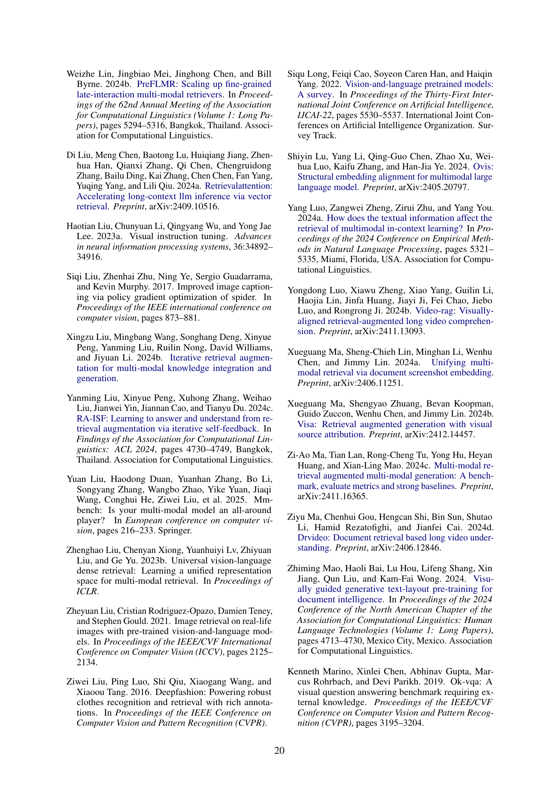

 


 2502.08826 
 Mohammad Mahdi Abootorabi et el. 
 
 🤗 2025-02-18 
 



↗ arXiv


↗ Hugging Face


↗ Papers with Code


### TL;DR



최근 대규모 언어 모델(LLM)은 정적 훈련 데이터에 의존하기 때문에 환각(hallucination) 및 오래된 지식과 같은 문제점을 안고 있습니다.  **검증 가능한 추론 및 세계 지식 업데이트** 또한 어려움을 겪고 있습니다. 이러한 문제를 해결하기 위해 제시된 솔루션 중 하나가 바로 **RAG(Retrieval-Augmented Generation)**입니다. RAG는 외부 정보를 통합하여 사실적이고 최신 정보를 제공함으로써 LLM의 성능을 향상시키는 기술입니다. 그러나 기존 RAG 아키텍처는 주로 텍스트 정보에 집중되어 다양한 데이터 형식을 통합하는 데 어려움을 겪습니다.

본 논문에서는 **멀티모달 RAG 시스템**에 대한 포괄적인 분석을 제공합니다.  **데이터셋, 평가 지표, 벤치마크, 방법론, 혁신** 등 다양한 측면을 다루며, 검색, 융합, 증강, 생성 등의 기술에 대한 심층적인 검토를 수행합니다. 특히, **훈련 전략, 강건성 향상, 손실 함수** 등에 대한 자세한 논의를 통해 멀티모달 RAG 시스템의 발전을 지원하는 연구 방향을 제시합니다.  **다양한 멀티모달 RAG 시나리오**를 탐구하고, **향후 연구 방향 및 개방형 과제**를 논의함으로써 **더욱 강력하고 신뢰할 수 있는 AI 시스템 개발**에 기여할 수 있을 것으로 기대됩니다.



#### Key Takeaways


 멀티모달 RAG 시스템은 정적 훈련 데이터에 의존하는 LLM의 한계를 극복하기 위해 동적 외부 정보를 통합합니다. 



 본 논문은 멀티모달 RAG 시스템에 대한 구조적이고 포괄적인 분석을 제공하며, 데이터셋, 평가 지표, 벤치마크, 방법론, 혁신 등을 다룹니다. 



 멀티모달 RAG 시스템의 한계와 향후 연구 방향을 제시하여, 더욱 강력하고 신뢰할 수 있는 AI 시스템 개발을 위한 기반을 마련합니다. 


#### Why does it matter?
본 논문은 **다양한 모달리티(텍스트, 이미지, 오디오, 비디오)를 통합하는 멀티모달 RAG(Retrieval-Augmented Generation) 시스템**에 대한 포괄적인 조사를 제공하여, **현재 연구 동향을 파악하고 향후 연구 방향을 제시**함으로써 연구자들에게 중요한 의미를 가집니다. 특히, **멀티모달 RAG 시스템의 한계와 향후 과제**를 명확히 제시하여, **더욱 신뢰할 수 있고 효과적인 AI 시스템 개발**을 위한 기반을 마련합니다.  **데이터셋, 평가 지표, 벤치마크, 방법론, 혁신 등** 다양한 측면을 다루어 연구자들이 **멀티모달 RAG 시스템에 대한 종합적인 이해**를 높이는 데 기여합니다.

------
#### Visual Insights

> 🔼 그림 1은 다양한 모달리티(텍스트, 이미지, 비디오 등)를 사용하는 멀티모달 검색 증강 생성(RAG) 파이프라인의 개요를 보여줍니다.  먼저 사용자 질의가 전처리되고, 다양한 모달리티의 데이터베이스와 함께 공유 임베딩 공간에 인코딩됩니다. 모달리티 중심 검색, 유사도 검색, 재순위 지정과 같은 검색 전략을 통해 관련 문서가 선택됩니다.  융합 메커니즘은 스코어 융합 또는 어텐션 기반 방법을 사용하여 여러 모달리티의 데이터를 정렬하고 통합합니다. 반복적인 검색과 피드백 메커니즘과 같은 증강 기법은 멀티모달 LLM을 위한 검색된 문서를 더욱 세련되게 합니다. 생성 단계에서는 사고 연쇄 추론 및 소스 속성 지정과 같은 혁신이 적용되어 더 나은 결과물을 생성하고, 정렬 손실과 생성 손실을 결합한 손실 함수를 사용하여 검색 및 생성 구성 요소를 최적화합니다. 또한 노이즈 관리 기법이 적용되어 학습의 안정성과 강건성이 향상됩니다.
> 

> 
read the caption

> Figure 1:  Overview of the multimodal retrieval-augmented generation (RAG) pipeline, highlighting the advancements and techniques employed at each stage. The flow begins with query preprocessing, where user queries are refined and then encoded into a shared embedding space alongside a multimodal database. Retrieval strategies, such as modality-centric retrieval, similarity search, and re-ranking, enhance document selection, while fusion mechanisms align and integrate data from multiple modalities using score fusion or attention-based methods. Augmentation techniques such as iterative retrieval with feedback mechanisms, further refine the retrieved documents for the multimodal LLM. The generation stage incorporates innovations like Chain-of-Thought reasoning and source attribution for better outputs, with loss functions combining alignment loss and generation loss to optimize both retrieval and generation components. Noise management techniques are also applied to improve training stability and robustness.
> 


| Category | Name | Statistics and Description | Modalities | Link |
|---|---|---|---|---|
| Image-Text General | LAION-400M Schuhmann et al. (2021) | 200M image–text pairs; used for pre-training multimodal models. | Image, Text | https://laion.ai/projects/laion-400-mil-open-dataset/ |
|  | Conceptual-Captions (CC) Sharma et al. (2018) | 15M image–caption pairs; multilingual English–German image descriptions. | Image, Text | https://github.com/google-research-datasets/conceptual-captions |
|  | CIRR Liu et al. (2021) | 36,554 triplets from 21,552 images; focuses on natural image relationships. | Image, Text | https://github.com/Cuberick-Orion/CIRR |
|  | MS-COCO Lin et al. (2014) | 330K images with captions; used for caption–to–image and image–to–caption generation. | Image, Text | https://cocodataset.org/ |
|  | Flickr30K Young et al. (2014) | 31K images annotated with five English captions per image. | Image, Text | https://shannon.cs.illinois.edu/DenotationGraph/ |
|  | Multi30K Elliott et al. (2016) | 30k German captions from native speakers and human–translated captions. | Image, Text | https://github.com/multi30k/dataset |
|  | NoCaps Agrawal et al. (2019) | For zero–shot image captioning evaluation; 15K images. | Image, Text | https://nocaps.org/ |
|  | Laion-5B Schuhmann et al. (2022) | 5B image–text pairs used as external memory for retrieval. | Image, Text | https://laion.ai/blog/laion-5b/ |
|  | COCO-CN Author and Author (2018) | 20,341 images for cross-lingual tagging and captioning with Chinese sentences. | Image, Text | https://github.com/li-xirong/coco-cn |
|  | CIRCO Baldrati et al. (2023) | 1,020 queries with an average of 4.53 ground truths per query; for composed image retrieval. | Image, Text | https://github.com/miccunifi/CIRCO |
| Video-Text | BDD-X Xu et al. (2018) | 77 hours of driving videos with expert textual explanations; for explainable driving behavior. | Video, Text | https://github.com/JinkyuKimUCB/BDD-X-dataset |
|  | YouCook2 Zhou et al. (2018) | 2,000 cooking videos with aligned descriptions; focused on video–text tasks. | Video, Text | https://youcook2.eecs.umich.edu/ |
|  | ActivityNet Caba Heilbron et al. (2015) | 20,000 videos with multiple captions; used for video understanding and captioning. | Video, Text | http://activity-net.org/ |
|  | SoccerNet Giancola et al. (2018) | Videos and metadata for 550 soccer games; includes transcribed commentary and key event annotations. | Video, Text | https://www.soccer-net.org/ |
|  | MSR-VTT Xu et al. (2016) | 10,000 videos with 20 captions each; a large video description dataset. | Video, Text | https://ms-multimedia-challenge.com/2016/dataset |
|  | MSVD Chen and Dolan (2011) | 1,970 videos with approximately 40 captions per video. | Video, Text | https://www.cs.utexas.edu/%C2%A0ml/clamp/videoDescription/ |
|  | LSMDC Rohrbach et al. (2015) | 118,081 video–text pairs from 202 movies; a movie description dataset. | Video, Text | https://sites.google.com/site/describingmovies/ |
|  | DiDemo Anne Hendricks et al. (2017) | 10,000 videos with four concatenated captions per video; with temporal localization of events. | Video, Text | https://github.com/LisaAnne/TemporalLanguageRelease |
|  | Breakfast Kuehne et al. (2014) | 1,712 videos of breakfast preparation; one of the largest fully annotated video datasets. | Video, Text | https://serre-lab.clps.brown.edu/resource/breakfast-actions-dataset/ |
|  | COIN Tang et al. (2019) | 11,827 instructional YouTube videos across 180 tasks; for comprehensive instructional video analysis. | Video, Text | https://coin-dataset.github.io/ |
|  | MSRVTT-QA Xu et al. (2017) | Video question answering benchmark. | Video, Text | https://github.com/xudejing/video-question-answering |
|  | MSVD-QA Xu et al. (2017) | 1,970 video clips with approximately 50.5K QA pairs; video QA dataset. | Video, Text | https://github.com/xudejing/video-question-answering |
|  | ActivityNet-QA Yu et al. (2019) | 58,000 human–annotated QA pairs on 5,800 videos; benchmark for video QA models. | Video, Text | https://github.com/MILVLG/activitynet-qa |
|  | EpicKitchens-100 Dima (2020) | 700 videos (100 hours of cooking activities) for online action prediction; egocentric vision dataset. | Video, Text | https://epic-kitchens.github.io/2021/ |
|  | Ego4D Grauman et al. (2022) | 4.3M video–text pairs for egocentric videos; massive–scale egocentric video dataset. | Video, Text | https://ego4d-data.org/ |
|  | HowTo100M Miech et al. (2019) | 136M video clips with captions from 1.2M YouTube videos; for learning text–video embeddings. | Video, Text | https://www.di.ens.fr/willow/research/howto100m/ |
|  | CharadesEgo Sigurdsson et al. (2018) | 68,536 activity instances from ego–exo videos; used for evaluation. | Video, Text | https://prior.allenai.org/projects/charades-ego |
|  | ActivityNet Captions Krishna et al. (2017) | 20K videos with 3.7 temporally localized sentences per video; dense–captioning events in videos. | Video, Text | https://cs.stanford.edu/people/ranjaykrishna/densevid/ |
|  | VATEX Wang et al. (2019) | 34,991 videos, each with multiple captions; a multilingual video–and–language dataset. | Video, Text | https://eric-xw.github.io/vatex-website/ |
|  | Charades Sigurdsson et al. (2016) | 9,848 video clips with textual descriptions; a multimodal research dataset. | Video, Text | https://allenai.org/plato/charades/ |
|  | WebVid Bain et al. (2021) | 10M video–text pairs (refined to WebVid-Refined-1M). | Video, Text | https://github.com/m-bain/webvid |
|  | Youku-mPLUG Xu et al. (2023) | Chinese dataset with 10M video–text pairs (refined to Youku-Refined-1M). | Video, Text | https://github.com/X-PLUG/Youku-mPLUG |
| Audio-Text | LibriSpeech Panayotov et al. (2015) | 1,000 hours of read English speech with corresponding text; ASR corpus based on audiobooks. | Audio, Text | https://www.openslr.org/12 |
|  | SpeechBrown Abootorabi and Asgari (2024) | 55K paired speech-text samples; 15 categories covering diverse topics from religion to fiction. | Audio, Text | https://huggingface.co/datasets/llm-lab/SpeechBrown |
|  | AudioCap Kim et al. (2019) | 46K audio clips paired with human-written text captions. | Audio, Text | https://audiocaps.github.io/ |
|  | AudioSet Gemmeke et al. (2017) | 2,084,320 human–labeled 10–second sound clips from YouTube; 632 audio event classes. | Audio, Text | https://research.google.com/audioset/ |
| Medical | MIMIC-CXR Johnson et al. (2019) | 125,417 training pairs of chest X–rays and reports. | Image, Text | https://physionet.org/content/mimic-cxr/2.0.0/ |
|  | CheXpert Irvin et al. (2019) | 224,316 chest radiographs of 65,240 patients; focused on medical analysis. | Image, Text | https://stanfordmlgroup.github.io/competitions/chexpert/ |
|  | MIMIC-III Johnson et al. (2016) | Health-related data from over 40K patients (text data). | Text | https://mimic.physionet.org/ |
|  | IU-Xray Pavlopoulos et al. (2019) | 7,470 pairs of chest X–rays and corresponding diagnostic reports. | Image, Text | https://www.kaggle.com/datasets/raddar/chest-xrays-indiana-university |
|  | PubLayNet Zhong et al. (2019) | 100,000 training samples and 2,160 test samples built from PubLayNet (tailored for the medical domain). | Image, Text | https://github.com/ibm-aur-nlp/PubLayNet |
| Fashion | Fashion-IQ Wu et al. (2019) | 77,684 images across three categories; evaluated with Recall@10 and Recall@50. | Image, Text | https://github.com/XiaoxiaoGuo/fashion-iq |
|  | FashionGen Hadi Kiapour et al. (2018) | 260.5K image–text pairs of fashion images and item descriptions. | Image, Text | https://www.elementai.com/datasets/fashiongen |
|  | VITON-HD Choi et al. (2021) | 83K images for virtual try–on; high–resolution clothing items. | Image, Text | https://github.com/shadow2496/VITON-HD |
|  | Fashionpedia Author and Author (2023a) | 48,000 fashion images annotated with segmentation masks and fine-grained attributes. | Image, Text | https://fashionpedia.ai/ |
|  | DeepFashion Liu et al. (2016) | Approximately 800K diverse fashion images for pseudo triplet generation. | Image, Text | https://github.com/zalandoresearch/fashion-mnist |
| 3D | ShapeNet Chang et al. (2015) | 7,500 text–3D data pairs; repository for 3D CAD models. | Text, 3D | https://shapenet.org/ |
| Knowledge & QA | VQA Antol et al. (2015) | 400K QA pairs with images for visual question answering. | Image, Text | https://visualqa.org/ |
|  | PAQ Lewis et al. (2021) | 65M text–based QA pairs; a large–scale dataset. | Text | https://github.com/facebookresearch/PAQ |
|  | ELI5 Fan et al. (2019) | 270K complex and diverse questions augmented with web pages and images. | Text | https://facebookresearch.github.io/ELI5/ |
|  | ViQuAE Biten et al. (2022) | 11.8M passages from Wikipedia covering 2,397 unique entities; knowledge–intensive QA. | Text | https://github.com/PaulLerner/ViQuAE |
|  | OK-VQA Marino et al. (2019) | 14K questions requiring external knowledge for VQA. | Image, Text | https://okvqa.allenai.org/ |
|  | WebQA Li et al. (2022b) | 46K queries that require reasoning across text and images. | Text, Image | https://webqna.github.io/ |
|  | Infoseek Li et al. (2021) | Fine-grained visual knowledge retrieval using a Wikipedia–based knowledge base ( 6M passages). | Image, Text | https://open-vision-language.github.io/infoseek/ |
|  | ClueWeb22 Callan et al. (2022) | 10 billion web pages organized into three subsets; a large–scale web corpus. | Text | https://lemurproject.org/clueweb22/ |
|  | MOCHEG Yao et al. (2023) | 15,601 claims annotated with truthfulness labels and accompanied by textual and image evidence. | Text, Image | https://github.com/VT-NLP/Mocheg |
|  | VQA v2 Goyal et al. (2017b) | 1.1M questions (augmented with VG–QA questions) for fine-tuning VQA models. | Image, Text | https://visualqa.org/ |
|  | A-OKVQA Schwenk et al. (2022) | Benchmark for visual question answering using world knowledge; around 25K questions. | Image, Text | https://github.com/allenai/aokvqa |
|  | XL-HeadTags Shohan et al. (2024) | 415K news headline-article pairs consist of 20 languages across six diverse language families. | Text | https://huggingface.co/datasets/faisaltareque/XL-HeadTags |
|  | SEED-Bench Li et al. (2023a) | 19K multiple–choice questions with accurate human annotations across 12 evaluation dimensions. | Text | https://github.com/AILab-CVC/SEED-Bench |
| Other | ImageNet Deng et al. (2009) | 14,197,122 images for perspective understanding; a hierarchical image database. | Image | http://www.image-net.org/ |
|  | Oxford Flowers102 Nilsback and Zisserman (2008) | 102 flower categories with five examples per category; image classification dataset. | Image | https://www.robots.ox.ac.uk/%C2%A0vgg/data/flowers/102/ |
|  | Stanford Cars Krause et al. (2013) | Images of different car models (five examples per model); for fine-grained categorization. | Image | https://www.kaggle.com/datasets/jessicali9530/stanford-cars-dataset |
|  | GeoDE Author and Author (2023b) | 61,940 images from 40 classes across 6 world regions; emphasizes geographic diversity in object recognition. | Image | https://github.com/AliRamazani/GeoDE |

> 🔼 본 논문의 표 1은 다중 모드 검색 증강 생성(Multimodal RAG) 연구에 널리 사용되는 데이터셋들을 개괄적으로 보여줍니다. 표에는 데이터셋의 카테고리, 이름, 통계 및 설명, 모드, 링크 등의 정보가 포함되어 있습니다. 각 데이터셋의 카테고리는 이미지-텍스트 일반, 비디오-텍스트, 오디오-텍스트, 의료, 패션, 3D, 지식 및 질의응답, 기타 등 여덟 가지로 분류되며, 각 데이터셋의 특징과 다양한 다중 모드 RAG 작업에의 적용 범위를 자세히 설명합니다.  링크 열에는 각 데이터셋에 대한 추가 정보 및 응용 프로그램에 대한 심층적인 탐구를 위한 공식 저장소 또는 추가 리소스로 연결되는 하이퍼링크가 제공됩니다.
> 

> 
read the caption

> Table 1: Overview of Popular Datasets in Multimodal RAG Research.
> 

### Full paper



