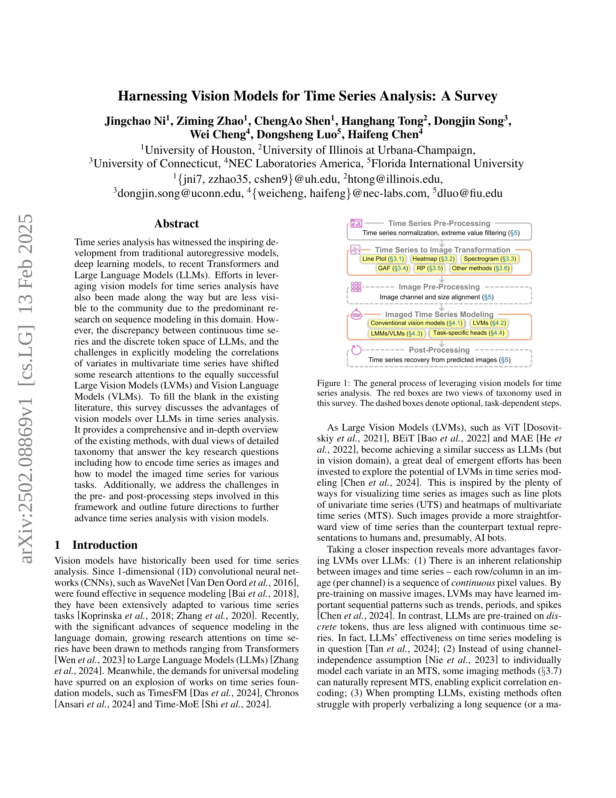
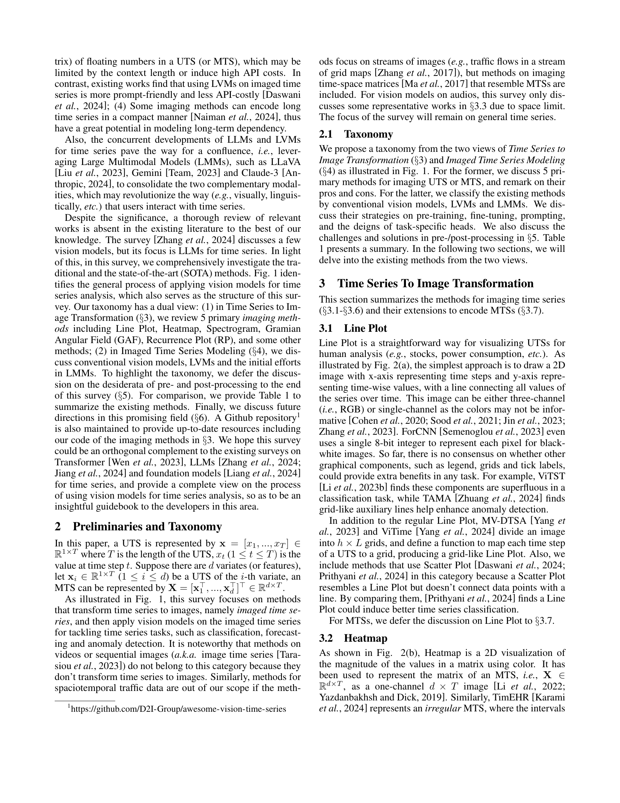
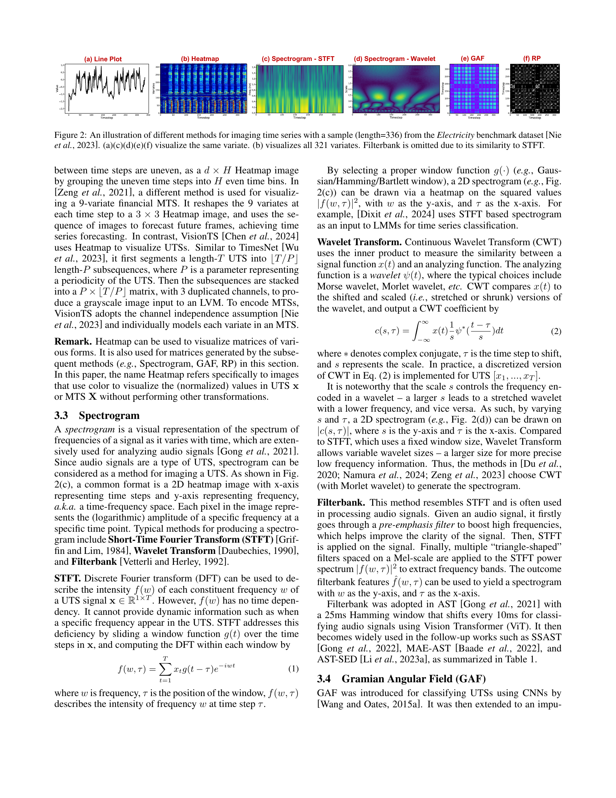
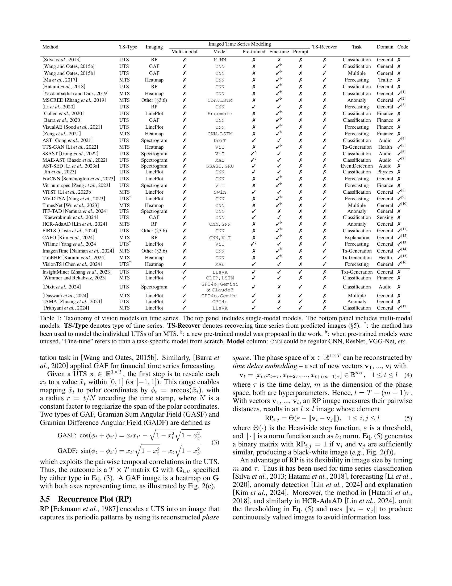
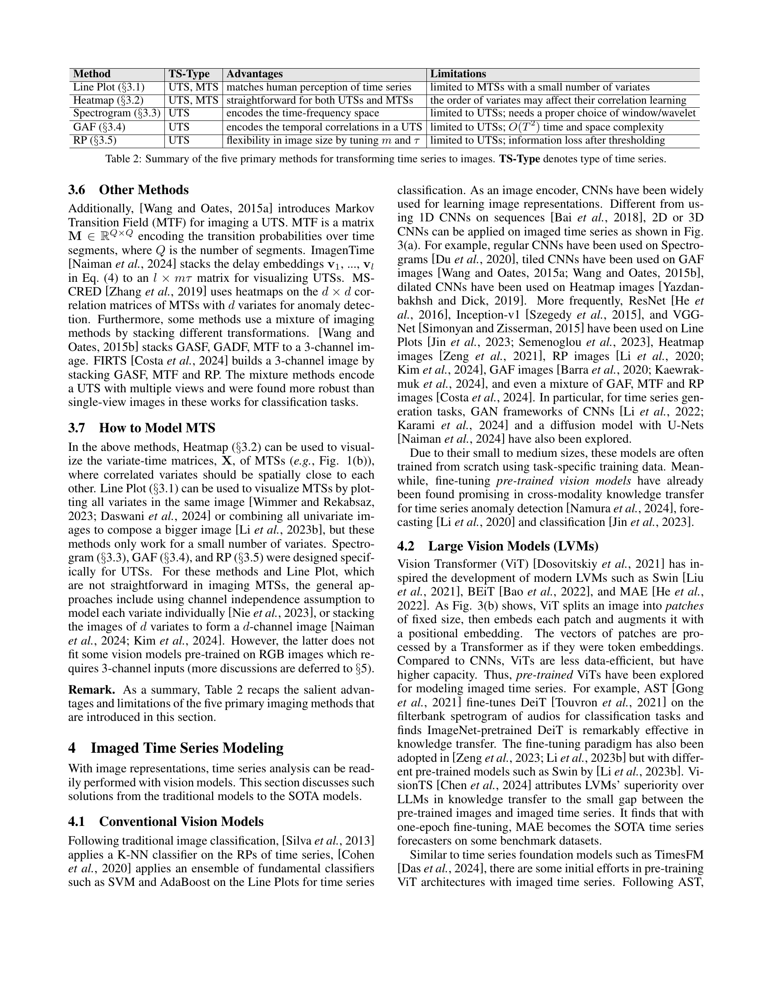
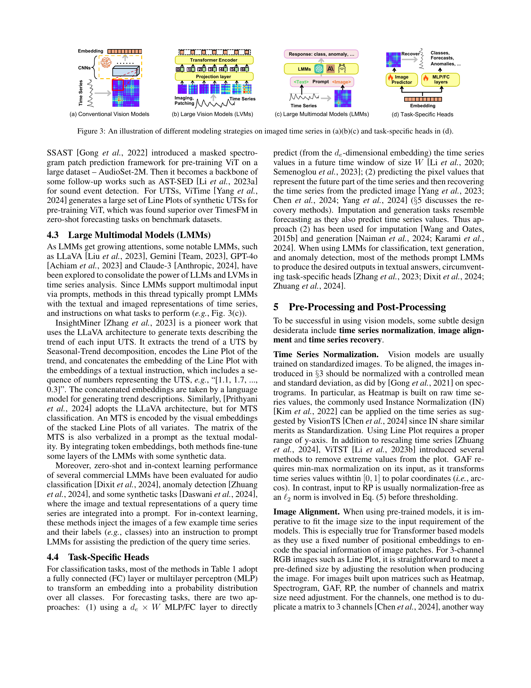
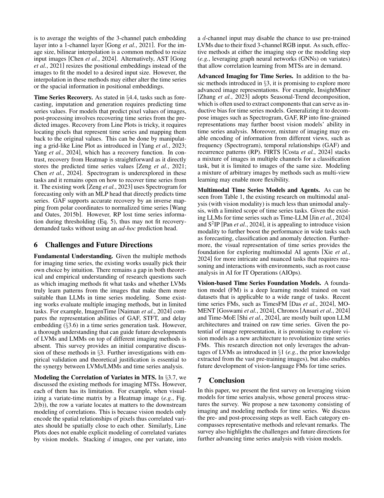
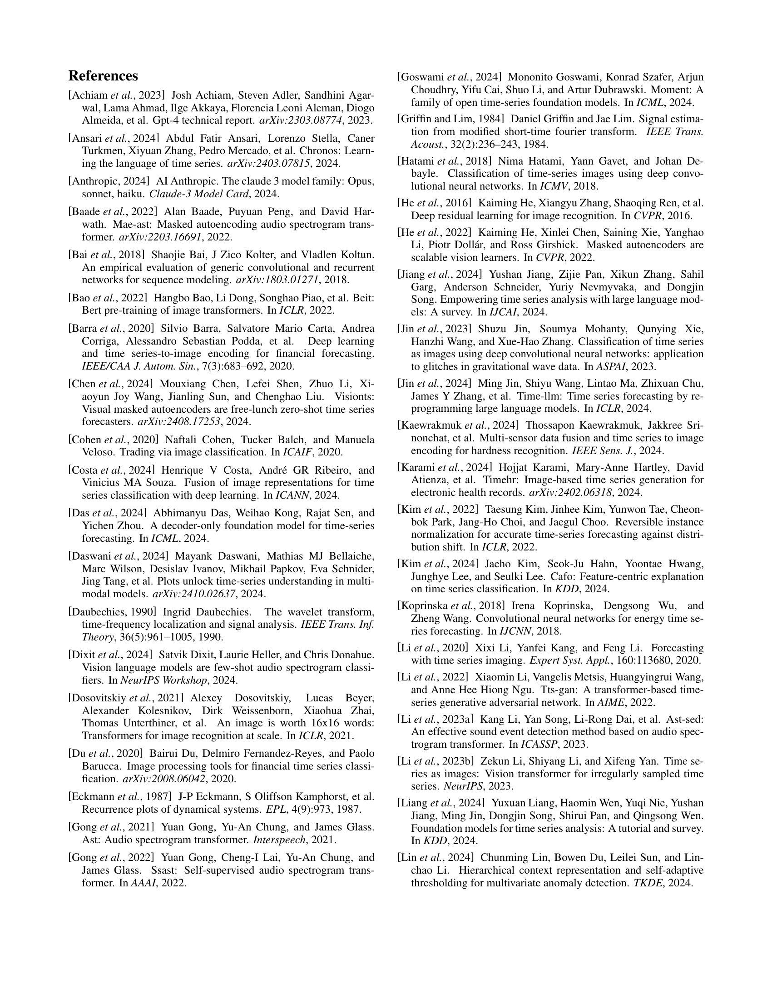
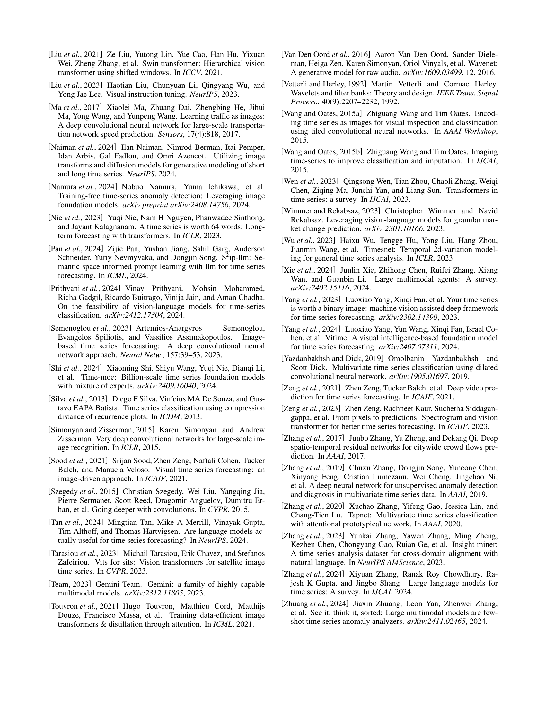

 


 2502.08869 
 Jingchao Ni et el. 
 
 🤗 2025-02-19 
 



↗ arXiv


↗ Hugging Face


↗ Papers with Code


### TL;DR



기존의 시계열 분석은 주로 순차 모델(RNN, Transformer 등)에 의존해 왔습니다. 하지만 이러한 모델들은 **연속적인 시계열 데이터와 이산적인 토큰 공간 사이의 차이** 및 **다변량 시계열의 변수 간 상관관계를 명시적으로 모델링하는 어려움** 등의 한계를 가지고 있습니다.  최근 **대규모 비전 모델(LVM)**의 발전은 시계열 분석에 새로운 가능성을 열어주었습니다.  

본 논문에서는 시계열을 이미지로 변환하여 비전 모델을 적용하는 새로운 접근법을 제안합니다. **시계열을 이미지로 변환하는 다양한 방법론**(선 그래프, 히트맵, 스펙트로그램 등)과 **이미지 기반 시계열 모델링**을 위한 다양한 기술들을 상세히 조명하고 있습니다. 특히, **LLM이 아닌 LVM과 VLM을 사용하여 시계열 분석의 새로운 가능성**을 탐구하고, **전처리 및 후처리 과정에서의 문제점과 해결 방안**을 제시합니다. 이를 통해, 본 논문은 시계열 분석 분야에 **새로운 패러다임**을 제시하고, 향후 연구 방향을 제시하는 중요한 결과를 담고 있습니다.



#### Key Takeaways


 시계열 데이터를 이미지로 변환하여 비전 모델을 적용하는 새로운 접근법이 제시됨 



 대규모 비전 모델(LVM)과 비전 언어 모델(VLM)이 시계열 분석에 효과적임을 보임 



 시계열 분석에서의 전처리 및 후처리 과정의 중요성과 개선 방향 제시 


#### Why does it matter?
**본 논문은 시계열 분석에 대한 비전 모델의 활용 가능성을 탐구하여, 기존의 순차 모델링 방식의 한계를 극복하고 새로운 연구 방향을 제시합니다.**  **특히, 대규모 비전 모델(LVM)과 비전 언어 모델(VLM)의 장점을 부각하며, 시계열을 이미지로 변환하는 다양한 기법과 이미지 기반 시계열 모델링 방법을 종합적으로 제시합니다.** 이를 통해 **다양한 시계열 분석 과제에 대한 새로운 접근법을 제공하며, 향후 연구를 위한 핵심적인 아이디어를 제공합니다.**

------
#### Visual Insights

> 🔼 그림 1은 시계열 분석에 비전 모델을 활용하는 일반적인 과정을 보여줍니다. 이 그림은 시계열 데이터를 이미지로 변환하고, 변환된 이미지를 비전 모델로 분석하여 시계열 분석 문제를 해결하는 과정을 단계별로 나타냅니다.  빨간색 박스는 본 설문조사에서 사용된 분류 체계의 두 가지 관점을 나타내며, 점선 박스는 작업에 따라 선택적으로 수행될 수 있는 단계들을 나타냅니다.  전체적으로 시계열 전처리, 이미지 변환, 이미지 전처리, 이미지 기반 시계열 모델링, 그리고 후처리 단계로 구성됩니다. 각 단계에는 다양한 기법들이 사용될 수 있으며, 이는 본 논문에서 자세히 설명됩니다.
> 

> 
read the caption

> Figure 1: The general process of leveraging vision models for time series analysis. The red boxes are two views of taxonomy used in this survey. The dashed boxes denote optional, task-dependent steps.
> 


Method|TS-Type|Imaging|Multi-modal|Model|Pre-trained|Fine-tune|Prompt|TS-Recover|Task|Domain|Code
---|---|---|---|---|---|---|---|---|---|---|
Silva et al. (2013)|UTS|RP|✗|K-NN|✗|✗|✗|✗|Classification|General|✗
Wang and Oates (2015a)|UTS|GAF|✗|CNN|✗|✓♭|✗|✓|Classification|General|✗
Wang and Oates (2015b)|UTS|GAF|✗|CNN|✗|✓♭|✗|✓|Multiple|General|✗
Ma et al. (2017)|MTS|Heatmap|✗|CNN|✗|✓♭|✗|✓|Forecasting|Traffic|✗
Hatami et al. (2018)|UTS|RP|✗|CNN|✗|✓♭|✗|✗|Classification|General|✗
Yazdanbakhsh and Dick (2019)|MTS|Heatmap|✗|CNN|✗|✓♭|✗|✗|Classification|General|✓[1]
MSCRED Zhang et al. (2019)|MTS|Other (§3.6)|✗|ConvLSTM|✗|✓♭|✗|✗|Anomaly|General|✓[2]
Li et al. (2020)|UTS|RP|✗|CNN|✓|✓|✗|✗|Forecasting|General|✓[3]
Cohen et al. (2020)|UTS|LinePlot|✗|Ensemble|✗|✓♭|✗|✗|Classification|Finance|✗
Barra et al. (2020)|UTS|GAF|✗|CNN|✗|✓♭|✗|✗|Classification|Finance|✗
VisualAE Sood et al. (2021)|UTS|LinePlot|✗|CNN|✗|✓♭|✗|✓|Forecasting|Finance|✗
Zeng et al. (2021)|MTS|Heatmap|✗|CNN,LSTM|✗|✓♭|✗|✓|Forecasting|Finance|✗
AST Gong et al. (2021)|UTS|Spectrogram|✗|DeiT|✓|✓|✗|✗|Classification|Audio|✓[4]
TTS-GAN Li et al. (2022)|MTS|Heatmap|✗|ViT|✗|✓♭|✗|✓|Ts-Generation|Health|✓[5]
SSAST Gong et al. (2022)|UTS|Spectrogram|✗|ViT|✓♮|✓|✗|✗|Classification|Audio|✓[6]
MAE-AST Baade et al. (2022)|UTS|Spectrogram|✗|MAE|✓♮|✓|✗|✗|Classification|Audio|✓[7]
AST-SED Li et al. (2023a)|UTS|Spectrogram|✗|SSAST,GRU|✓|✓|✗|✗|EventDetection|Audio|✗
Jin et al. (2023)|UTS|LinePlot|✗|CNN|✓|✓|✗|✗|Classification|Physics|✗
ForCNN Semenoglou et al. (2023)|UTS|LinePlot|✗|CNN|✗|✓♭|✗|✗|Forecasting|General|✗
Vit-num-spec Zeng et al. (2023)|UTS|Spectrogram|✗|ViT|✗|✓♭|✗|✗|Forecasting|Finance|✗
ViTST Li et al. (2023b)|MTS|LinePlot|✗|Swin|✓|✓|✗|✗|Classification|General|✓[8]
MV-DTSA Yang et al. (2023)|UTS|LinePlot|✗|CNN|✗|✓♭|✗|✓|Forecasting|General|✓[9]
TimesNet Wu et al. (2023)|MTS|Heatmap|✗|CNN|✗|✓♭|✗|✓|Multiple|General|✓[10]
ITF-TAD Namura et al. (2024)|UTS|Spectrogram|✗|CNN|✓|✗|✗|✗|Anomaly|General|✗
Kaewrakmuk et al. (2024)|UTS|GAF|✗|CNN|✓|✓|✗|✗|Classification|Sensing|✗
HCR-AdaAD Lin et al. (2024)|MTS|RP|✗|CNN,GNN|✗|✓♭|✗|✗|Anomaly|General|✗
FIRTS Costa et al. (2024)|UTS|Other (§3.6)|✗|CNN|✗|✓♭|✗|✗|Classification|General|✓[11]
CAFO Kim et al. (2024)|MTS|RP|✗|CNN,ViT|✗|✓♭|✗|✗|Explanation|General|✓[12]
ViTime Yang et al. (2024)|UTS|LinePlot|✗|ViT|✓♮|✓|✗|✓|Forecasting|General|✓[13]
ImagenTime Naiman et al. (2024)|MTS|Other (§3.6)|✗|CNN|✗|✓♭|✗|✓|Ts-Generation|General|✓[14]
TimEHR Karami et al. (2024)|MTS|Heatmap|✗|CNN|✗|✓♭|✗|✓|Ts-Generation|Health|✓[15]
VisionTS Chen et al. (2024)|UTS|Heatmap|✗|MAE|✓|✓|✗|✓|Forecasting|General|✓[16]
InsightMiner Zhang et al. (2023)|UTS|LinePlot|✓|LLaVA|✓|✓|✓|✗|Txt-Generation|General|✗
Wimmer and Rekabsaz (2023)|MTS|LinePlot|✓|CLIP,LSTM|✓|✓|✗|✗|Classification|Finance|✗
Dixit et al. (2024)|UTS|Spectrogram|✓|GPT4o,Gemini &amp; Claude3|✓|✗|✓|✗|Classification|Audio|✗
Daswani et al. (2024)|MTS|LinePlot|✓|GPT4o,Gemini|✓|✗|✓|✗|Multiple|General|✗
TAMA Zhuang et al. (2024)|UTS|LinePlot|✓|GPT4o|✓|✗|✓|✗|Anomaly|General|✗
Prithyani et al. (2024)|MTS|LinePlot|✓|LLaVA|✓|✓|✓|✗|Classification|General|✓[17]

> 🔼 표 1은 시계열 분석에 사용된 비전 모델들을 분류한 표입니다. 상단에는 단일 모드 모델, 하단에는 다중 모드 모델이 나열되어 있습니다.  TS-Type은 시계열의 유형을 나타내고, TS-Recover는 5장에서 설명하는 예측 이미지로부터 시계열을 복원하는 과정을 의미합니다. * 표시는 다변량 시계열(MTS)의 개별 일변량 시계열(UTS)을 모델링하는 데 사용된 방법을 나타냅니다. ♮ 표시는 논문에서 새롭게 제안된 사전 학습 모델임을 의미하고, ♭ 표시는 사전 학습 모델을 사용하지 않고 작업별 모델을 처음부터 학습시킨 경우를 의미합니다.  Model 열은 일반적인 CNN, ResNet, VGG-Net 등을 포함한 다양한 CNN 아키텍처를 나타냅니다.
> 

> 
read the caption

> Table 1: Taxonomy of vision models on time series. The top panel includes single-modal models. The bottom panel includes multi-modal models. TS-Type denotes type of time series. TS-Recover denotes recovering time series from predicted images (§§\S§5). *: the method has been used to model the individual UTSs of an MTS. ♮: a new pre-trained model was proposed in the work. ♭: when pre-trained models were unused, “Fine-tune” refers to train a task-specific model from scratch. Model column: CNN could be regular CNN, ResNet, VGG-Net, etc.
> 

### In-depth insights

#### Vision Meets Time Series
**비전 기반 시계열 분석**은 시계열 데이터를 이미지로 변환하여 기존의 강력한 컴퓨터 비전 모델을 활용하는 새로운 접근 방식입니다. 이는 **시계열 데이터의 고유한 시퀀스 특징**을 이미지의 공간적 특징으로 매핑하여 효율적인 분석을 가능하게 합니다.  **다양한 시계열 데이터** (일변량, 다변량, 불규칙 시계열 등)를 이미지로 변환하는 다양한 방법론들이 제시되고 있으며,  **합성곱 신경망(CNN)**, **비전 트랜스포머(ViT)**, **대규모 비전 모델(LVM)**과 같은 다양한 컴퓨터 비전 모델들이 시계열 분석에 적용되고 있습니다. 특히, **최근 대규모 언어 모델(LLM)**과의 결합을 통해 시계열 데이터의 텍스트 기반 설명 및 분석이 가능해지면서,  **멀티모달 접근 방식**이 주목받고 있습니다.  하지만, 이미지 변환 과정에서의 정보 손실,  **다변량 시계열 데이터**간의 상관관계 모델링 어려움,  **모델의 해석성** 부족 등의 과제가 존재하며,  **향후 연구**는 이러한 한계를 극복하고 모델의 일반화 성능 및 해석성을 향상시키는 데 초점을 맞춰야 할 것입니다.

#### Image Encoding Methods
본 논문에서 제시된 이미지 인코딩 방법은 시계열 데이터를 효과적으로 시각화하여 컴퓨터 비전 모델이 시계열 패턴을 학습할 수 있도록 변환하는 데 중점을 둡니다. **라인 플롯, 히트맵, 스펙트로그램, 그래미안 각도 필드 (GAF), 순환 플롯 (RP)** 등 다양한 방법이 제시되어 있으며, 각각 장단점을 가지고 있습니다.  **라인 플롯은 직관적이지만 다변량 시계열에는 적합하지 않고, 히트맵은 다변량 시계열에 적합하지만 시계열의 변화를 직관적으로 보여주지 못합니다.** 스펙트로그램은 주파수 정보를 담고 있어 주기성이 있는 시계열에 효과적이지만, 고차원 데이터에는 적용하기 어렵습니다. **GAF와 RP는 시계열의 상관관계를 효과적으로 표현하지만, 계산 복잡도가 높다는 단점이 있습니다.**  이러한 방법들은 **단변량 및 다변량 시계열 모두에 적용 가능하며, 각 시계열의 특성에 따라 적절한 방법을 선택하는 것이 중요합니다.**  향후 연구에서는 **인코딩 과정에서의 정보 손실을 최소화하고, 계산 효율성을 높이는 새로운 방법론**이 필요할 것으로 예상됩니다.

#### Vision Model Power
본 논문에서 'Vision Model Power'는 시계열 분석에 있어 **영상 모델의 강력한 잠재력**을 의미합니다. 기존의 순차 모델링 방식(LLM)과 달리, 영상 모델은 **시계열 데이터의 연속적인 특성을 효과적으로 포착**하고 다변량 시계열 상관관계를 명시적으로 모델링하는 데 유리합니다.  특히 **대규모 영상 모델(LVM)**은 방대한 이미지 데이터 학습을 통해 시간적 패턴 학습에 유리하며, **시계열을 이미지로 변환**하는 다양한 기법과 결합하여 시계열 예측, 분류, 이상 탐지 등 다양한 작업에서 우수한 성능을 보입니다.  **이미지와 시계열의 고유한 관계**를 활용함으로써, LVM은 LLM보다 시계열 분석에 더 적합한 모델이 될 수 있습니다.  **전처리 및 후처리 과정**의 개선 또한 영상 모델의 성능 향상에 중요한 요소입니다.  **향후 연구 방향**으로는 다양한 영상 변환 기법의 이론적, 실험적 이해 증진과 다변량 시계열 상관 관계 모델링 개선, 그리고 **다모달 모델(LMM)**과의 통합을 통한 시너지 창출 등이 있습니다.

#### Multimodal Future
멀티모달 미래는 **시계열 분석에 있어 비전 모델과 언어 모델의 통합**을 의미합니다.  기존의 단일 모달 접근 방식(비전 또는 언어 모델만 사용)의 한계를 극복하고 **상호 보완적인 강점**을 활용하여 더욱 정확하고 강력한 시계열 분석을 가능하게 합니다.  **비전 모델은 시계열 데이터의 시각적 패턴을 효과적으로 학습**하고, **언어 모델은 시계열 데이터의 의미론적 이해와 설명 가능성**을 높입니다.  두 모델의 결합은 복잡한 시계열 데이터의 다양한 측면을 포착하여 예측 정확도와 해석력을 향상시키는 핵심이 될 것입니다.  **특히, 장기 의존성을 가진 시계열 데이터 분석**에 효과적일 것으로 예상되며,  **비정형 데이터와 시계열 데이터의 통합 분석**에도 새로운 가능성을 제시할 수 있습니다.  하지만, **모델의 복잡성 증가와  데이터 부족 문제**는 극복해야 할 과제입니다.  **데이터 증강 기법과 효율적인 모델 학습 전략**의 개발이 중요하며,  **다양한 응용 분야에 대한 실증적 연구**를 통해 멀티모달 시계열 분석의 실용성을 검증해야 합니다.

#### Open Challenges
본 논문에서 제시된 개방 과제는 시계열 분석에 대한 비전 모델의 활용을 더욱 발전시키기 위한 핵심적인 문제들을 다룹니다. **기본적인 이해 부족**은 시계열을 이미지로 변환하는 다양한 방법들과 이러한 방법들이 특정 작업에 얼마나 적합한지에 대한 이론적, 경험적 이해가 부족하다는 것을 의미합니다.  **다변량 시계열 상관 관계 모델링**은 다변량 시계열 내 변수 간의 상관관계를 명시적으로 모델링하는 데 어려움을 겪는 기존 방법들을 개선할 필요가 있음을 시사합니다.  **고급 이미징 기법**은 기존의 단순한 방법들을 넘어, 고급 이미지 표현을 탐구하여 시계열의 다양한 특징을 더 효과적으로 포착하는 새로운 방식을 모색해야 함을 강조합니다.  **다중 모달 시계열 모델 및 에이전트**는 시계열 분석을 위한 다중 모달 접근법의 필요성과 비전 언어 모델과의 통합을 통한 향상된 성능을 기대할 수 있음을 보여줍니다.  마지막으로 **시계열 기반 모델**은 기존의 언어 모델 중심의 기반 모델들을 뛰어넘어, 이미지 표현의 장점을 활용한 새로운 기반 모델 개발의 가능성을 제시합니다.

### More visual insights

More on figures

> 🔼 그림 2는 전력 데이터 벤치마크 데이터셋(Nie et al., 2023)의 길이 336인 표본을 사용하여 시계열을 이미지로 변환하는 다양한 방법을 보여줍니다. (a)~(f)는 다섯 가지 다른 시계열 이미지 변환 방법(Line Plot, Heatmap, Spectrogram(STFT, Wavelet), Gramian Angular Field(GAF), Recurrence Plot(RP))을 시각화한 것입니다. (a), (c), (d), (e), (f)는 동일한 변수를, (b)는 모든 321개의 변수를 시각화합니다. Filterbank는 STFT와 유사하여 생략되었습니다.  각 이미지 변환 방법은 시계열 데이터의 특징을 다르게 보여주며, 이는 시계열 분석에 다양한 비전 모델을 적용할 때 고려해야 할 중요한 요소입니다.
> 

> 
read the caption

> Figure 2: An illustration of different methods for imaging time series with a sample (length=336) from the Electricity benchmark dataset Nie et al. (2023). (a)(c)(d)(e)(f) visualize the same variate. (b) visualizes all 321 variates. Filterbank is omitted due to its similarity to STFT.
> 

> 🔼 그림 3은 이미지화된 시계열 데이터에 대한 다양한 모델링 전략을 보여줍니다. (a)는 기존의 CNN 기반 접근 방식을, (b)는 대규모 비전 모델(LVM)을 이용한 방법을, (c)는 대규모 다중 모달 모델(LMM)을 사용하는 방법을 각각 나타냅니다. 마지막으로 (d)는 특정 작업에 맞춘 헤드를 추가하여 모델의 성능을 향상시키는 방법을 보여줍니다. 각각의 방법은 이미지화된 시계열 데이터를 처리하고 분석하는 고유한 방식을 제시합니다.
> 

> 
read the caption

> Figure 3: An illustration of different modeling strategies on imaged time series in (a)(b)(c) and task-specific heads in (d).
> 

### Full paper



