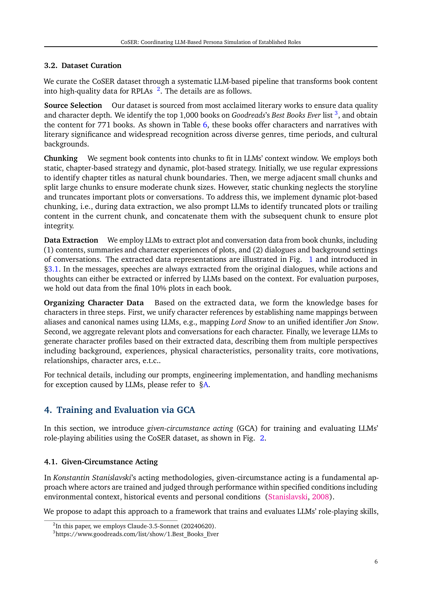

 


 2502.09082 
 Xintao Wang et el. 
 
 🤗 2025-02-14 
 



↗ arXiv


↗ Hugging Face


↗ Papers with Code


### TL;DR



ê¸°ì¡´ì˜ ì—­í• ê·¹ 언어 ì—ì´ì „트(RPLA) 연구는 **ë°ì´í„° 부족과 í‰ê°€ ë°©ë²•ë¡ ì˜ ë¯¸í¡**ì´ë¼ëŠ” 문제ì ì„ 가지고 ìˆì—ˆìŠµë‹ˆë‹¤. 특íˆ, **í™•ë¦½ëœ ìºë¦­í„°ì˜ ë³µì¡í•œ 배경과 섬세한 성격**ì„ ì¶©ì‹¤í•˜ê²Œ ë°˜ì˜í•˜ëŠ” ê²ƒì€ í° ê³¼ì œì˜€ìŠµë‹ˆë‹¤.  기존 ë°ì´í„°ì…‹ë“¤ì€ 대부분 대화 ë°ì´í„° 위주였으며, 품질과 다양성 측면ì—ì„œ 부족했습니다. í‰ê°€ ë˜í•œ 단순한 í„´ 기반 ìƒí˜¸ì‘ìš© 위주로 세련ë˜ì§€ 못했습니다.

본 연구ì—서는 ì´ëŸ¬í•œ 문제ì ë“¤ì„ 해결하기 위해 **771ê¶Œì˜ ìœ ëª… ë„ì„œì—ì„œ 추출한 방대한 ì–‘ì˜ ê³ í’ˆì§ˆ ë°ì´í„°ì…‹ COSER**를 구축했습니다. COSER는 **대화 ë‚´ìš© ë¿ë§Œ ì•„ë‹ˆë¼ í”Œë¡¯ 요약, ìºë¦­í„°ì˜ 경험, ë‚´ë©´ì˜ ìƒê° 등 다양한 ì •ë³´**를 í¬í•¨í•˜ê³  ìˆìŠµë‹ˆë‹¤. ë˜í•œ, ì—°ê·¹ 연출 기법ì—ì„œ ì˜ê°ì„ ì–»ì€ **새로운 í‰ê°€ ë°©ë²•ë¡ ì¸ ì£¼ì–´ì§„ ìƒí™© 연기(GCA)**를 제안, 다중 ì—ì´ì „트 시뮬레ì´ì…˜ ë° íŒ¨ë„í‹° 기반 LLM í‰ê°€ë¥¼ 통해 RPLA 모ë¸ì˜ ì„±ëŠ¥ì„ ì¢…í•©ì ìœ¼ë¡œ í‰ê°€í•©ë‹ˆë‹¤. ì´ë¥¼ 통해 기존 RPLA 모ë¸ë“¤ì„ 능가하는 **최첨단 ì„±ëŠ¥ì˜ CoSER 8B와 CoSER 70B 모ë¸**ì„ ê°œë°œí•˜ê³ , 다양한 벤치마í¬ì—ì„œ 우수한 ì„±ëŠ¥ì„ ê²€ì¦í–ˆìŠµë‹ˆë‹¤.



#### Key Takeaways


 771ê¶Œì˜ ìœ ëª… ë„ì„œì—ì„œ 추출한 17,966ëª…ì˜ ìºë¦­í„° ë°ì´í„°ë¥¼ í¬í•¨í•˜ëŠ” 고품질 COSER ë°ì´í„°ì…‹ì„ 공개 



 기존 RPLA í‰ê°€ì˜ 한계를 극복하는 새로운 í‰ê°€ í”„ë¡œí† ì½œì¸ ì£¼ì–´ì§„ ìƒí™© 연기(GCA) 제안 



 COSER ë°ì´í„°ì…‹ê³¼ GCA를 ì´ìš©í•˜ì—¬ í›ˆë ¨ëœ ìµœì²¨ë‹¨ 오픈소스 RPLA 모ë¸ì¸ CoSER 8B와 CoSER 70B를 공개 


#### Why does it matter?
본 ë…¼ë¬¸ì€ **ê³ í’ˆì§ˆì˜ ìºë¦­í„° ë°ì´í„°ì…‹ê³¼ 첨단 모ë¸, 그리고 í‰ê°€ í”„ë¡œí† ì½œì„ ì œì‹œ**함으로ì¨, í™•ë¦½ëœ ìºë¦­í„°ì˜ ì—­í• ê·¹ 언어 ì—ì´ì „트(RPLA) ì—°êµ¬ì— ìƒë‹¹í•œ ì˜í–¥ì„ 미칩니다.  **ê¸°ì¡´ì˜ í•œê³„ì ì„ 극복**하고, **새로운 연구 ë°©í–¥ì„ ì œì‹œ**하여 RPLA ë¶„ì•¼ì˜ ë°œì „ì— í¬ê²Œ 기여할 것으로 예ìƒë©ë‹ˆë‹¤. 특íˆ, **다양한 ë°ì´í„° ìœ í˜•ì„ í†µí•©**하고, **ì •êµí•œ í‰ê°€ 방법론**ì„ ì œì•ˆí•˜ì—¬ ë”ìš± 정확하고 심ë„ìˆëŠ” 연구가 가능해졌습니다.

------
#### Visual Insights

> 🔼 그림 1ì€ COSER ë°ì´í„°ì…‹ì˜ í•œ 예시를 ë³´ì—¬ì¤ë‹ˆë‹¤. COSER ë°ì´í„°ì…‹ì€ 대화 ë‚´ìš©ê³¼ ë°°ê²½ 설정, 줄거리 요약, 등ì¥ì¸ë¬¼ì˜ ë‚´ë©´ 심리 등 다양한 ìœ í˜•ì˜ ë°ì´í„°ë¥¼ 제공합니다. ì´ëŸ¬í•œ ë°ì´í„°ëŠ” ëª¨ë‘ ìœ ëª…í•œ ì±…ì—ì„œ 실제로 발췌한 것으로, ë†’ì€ ì‹ ë¢°ë„를 ìë‘합니다. 그림ì—서는 해리í¬í„°ì™€ ë§ˆë²•ì‚¬ì˜ ëŒì˜ í•œ ì¥ë©´ì„ 예시로 들어, 대화 ë‚´ìš©, ë°°ê²½ 설정, 줄거리 요약, 등ì¥ì¸ë¬¼ì˜ 심리 ìƒíƒœ ë“±ì„ ë³´ì—¬ì¤ë‹ˆë‹¤.
> 

> 
read the caption

> Figure 1:  An example from CoSER dataset, which provides comprehensive data types such as conversation dialogues and settings, plot summaries, characters’ inner thoughts, authentically sourced from renowned books.
> 


| Dataset | Book Num. | Character Num. | Profile | Expr. | #Conv. | Conversation #Turns | Setting | Auth. | Multi-Chara. | Message Speech | Thought | Action | Plot Summ. |
|---|---|---|---|---|---|---|---|---|---|---|---|---|---|---|
| Charater-LLM |  | 9 | ✓ |  | 14,300 | 13.2 | ✓ |  |  | ✓ |  |  |  |
| ChatHaruhi |  | 32 | ✓ |  | 54,726 | >2 |  | ✓* | ✓ | ✓ |  |  |  |
| RoleLLM |  | 100 | ✓ |  | 140,726 | 2 |  |  |  | ✓ |  |  |  |
| HPD | 7 | 113 |  |  | 1,191 | 13.2 | ✓ | ✓ | ✓ | ✓ |  |  | ✓ |
| LifeChoice | 388 | 1,462 | ✓ |  | 1,462 | 2 | ✓ | ✓ |  |  |  |  |  |
| CroSS-MR | 126 | 126 | ✓ |  | 445 | 2 | ✓ | ✓ |  |  |  |  |  |
| CharacterGLM |  | 250 | ✓ |  | 1,034 | 15.8 | ✓ |  |  | ✓ |  |  |  |
| CharacterEval |  | 77 | ✓ |  | 1,785 | 9.3 | ✓ | ✓ |  | ✓ |  | ✓ |  |
| DITTO |  | 4,002 | ✓ |  | 7,186 | 5.1 |  |  |  | ✓ |  |  |  |
| MMRole |  | 85 | ✓ |  | 14,346 | 4.2 |  |  |  | ✓ |  |  |  |
| CharacterBench |  | 3,956 | ✓ |  | 13,162 | 11.3 |  |  |  | ✓ |  |  |  |
| CoSER | 771 | 17,966 | ✓ | ✓ | 29,798 | 13.2 | ✓ | ✓ | ✓ | ✓ | ✓ | ✓ | ✓ |

> 🔼 í‘œ 1ì€ COSER ë°ì´í„°ì…‹ê³¼ 기존 RPLA ë°ì´í„°ì…‹ì„ ë¹„êµ ë¶„ì„í•œ í‘œì…니다. 등ì¥ì¸ë¬¼ 수, 프로필 유무, êµ¬ì¡°í™”ëœ ê²½í—˜ 유무, 대화 수, í„´ 수, ë°°ê²½ 설정, ëŒ€í™”ì˜ ì¶œì²˜, 다중 ì¸ë¬¼ 참여 여부, ë§, ìƒê°, í–‰ë™, 줄거리 요약 등 다양한 측면ì—ì„œ ë°ì´í„°ì…‹ì„ ë¹„êµ ë¶„ì„하여 COSER ë°ì´í„°ì…‹ì˜ 특징과 ìš°ìˆ˜ì„±ì„ ë³´ì—¬ì¤ë‹ˆë‹¤.  약어로 ì‚¬ìš©ëœ Num.(number), Conv.(conversation), Summ.(summary)는 ê°ê° 등ì¥ì¸ë¬¼ 수, 대화 수, 줄거리 ìš”ì•½ì„ ì˜ë¯¸í•©ë‹ˆë‹¤.
> 

> 
read the caption

> Table 1: Overview of CoSER and existing RPLA datasets. For characters, Num. count characters with profiles, and Expr. denotes structured character experiences. For conversations, Auth. indicates authentic dialogues or behaviors from the books, and Multi-Chara. denotes involving more than 2 characters. Num. (number), Conv. (conversation), and Summ. (summary) are abbreviations.
> 

### In-depth insights

#### RPLA Datasets
본 논문ì—ì„œ 다루는 RPLA(Role-Playing Language Agent) ë°ì´í„°ì…‹ì€ **품질과 다양성 측면ì—ì„œ 기존 연구들과 차별화**ë©ë‹ˆë‹¤. 기존 ë°ì´í„°ì…‹ë“¤ì€ 대부분 2ì¸ ëŒ€í™”ì— êµ­í•œë˜ê±°ë‚˜, LLM(Large Language Model)ì„ ì´ìš©í•œ 합성 ë°ì´í„°ë¡œ **ì연스러움과 í˜„ì‹¤ì„±ì´ ë¶€ì¡±**í•œ 반면, 본 ì—°êµ¬ì˜ ë°ì´í„°ì…‹ì€ **다양한 ìœ í˜•ì˜ ë°ì´í„°(대화, 줄거리, ìºë¦­í„° ë°°ê²½ 등)**를 í’부하게 í¬í•¨í•˜ì—¬ **RPLAì˜ í›ˆë ¨ ë° í‰ê°€ì— 유용한 ì •ë³´**를 제공합니다. íŠ¹íˆ **실제 소설ì—ì„œ 발췌한 다양한 ìºë¦­í„°ì™€ 대화**를 활용함으로ì¨, **ë†’ì€ ì‹ ë¢°ë„와 í˜„ì‹¤ì„±ì„ í™•ë³´**하는 ë° ì„±ê³µí•˜ì˜€ìŠµë‹ˆë‹¤. ë˜í•œ, ë°ì´í„°ì…‹ì˜ 규모 ë˜í•œ ìƒë‹¹í•˜ì—¬, **다양한 ìºë¦­í„°ì™€ ìƒí™©ì— 대한 충분한 학습 ë°ì´í„°**를 제공합니다. ì´ëŸ¬í•œ íŠ¹ì§•ë“¤ì€ **RPLAì˜ ì„±ëŠ¥ í–¥ìƒê³¼ 실제 ì‘ìš© 가능성 확대**ì— í¬ê²Œ 기여할 것으로 예ìƒë©ë‹ˆë‹¤.  하지만, **ë°ì´í„° 수집 ê³¼ì •ì˜ ì–´ë ¤ì›€ê³¼ ì €ì‘권 문제**는 향후 연구ì—ì„œ 고려해야 í•  중요한 사항ì…니다.

#### GCA Evaluation
본 논문ì—ì„œ ì œì‹œëœ GCA í‰ê°€ ë°©ì‹ì€ ì—­í•  수행 LLMì˜ ì„±ëŠ¥ì„ í‰ê°€í•˜ëŠ” 새로운 ì ‘ê·¼ ë°©ì‹ì„ 제시합니다. ê¸°ì¡´ì˜ ë‹¨ìˆœ í‰ê°€ ë°©ì‹ê³¼ 달리, **다중 ì—ì´ì „트 시뮬레ì´ì…˜**ê³¼ **패ë„í‹° 기반 LLM íŒì •**ì´ë¼ëŠ” ë‘ ë‹¨ê³„ë¥¼ 통해 보다 ì •êµí•˜ê³  í¬ê´„ì ì¸ í‰ê°€ë¥¼ 수행합니다.  **다중 ì—ì´ì „트 시뮬레ì´ì…˜**ì€ ì‹¤ì œ 대화와 유사한 í™˜ê²½ì„ ì¡°ì„±í•˜ê³ , **í˜ë„í‹° 기반 LLM íŒì •**ì€ ìƒì„¸í•œ í‰ê°€ ê¸°ì¤€ì„ í†µí•´ ì£¼ê´€ì„±ì„ ìµœì†Œí™”í•˜ì—¬ 보다 ê°ê´€ì ì¸ í‰ê°€ë¥¼ 가능하게 합니다.  ì´ëŸ¬í•œ ì ‘ê·¼ ë°©ì‹ì€ ë‹¨ìˆœíˆ í„´ ê¸°ë°˜ì˜ ì§§ì€ ëŒ€í™”ê°€ ì•„ë‹Œ, 다중 ìºë¦­í„°ê°€ 참여하는 ë³µì¡í•œ ìƒí˜¸ì‘ìš©ì„ íš¨ê³¼ì ìœ¼ë¡œ í‰ê°€í•  수 ìˆìŒì„ ë³´ì—¬ì¤ë‹ˆë‹¤.  **실제 대화 ë°ì´í„°ë¥¼ 기반으로 í•œ í‰ê°€**는 모ë¸ì˜ 현실성과 ì •í™•ì„±ì„ ë†’ì´ëŠ” ë° ì¤‘ìš”í•œ ì—­í• ì„ í•©ë‹ˆë‹¤.  특íˆ, **ë¬¸ë§¥ì— ë”°ë¥¸ 지ì†ì ì¸ í‰ê°€**는 모ë¸ì˜ ì¥ê¸°ì ì¸ ì—­í•  수행 ëŠ¥ë ¥ì„ í‰ê°€í•˜ëŠ” ë° íš¨ê³¼ì ì…니다.  **다양한 í‰ê°€ 지표를 활용**하여 종합ì ì¸ í‰ê°€ 결과를 제시하는 ê²ƒë„ GCA í‰ê°€ì˜ ì¥ì ì…니다.  하지만, **LLM íŒì •ì˜ ì£¼ê´€ì„±ì„ ì™„ì „íˆ ë°°ì œí•˜ê¸° 어렵다는 ì **ê³¼ **계산 ë¹„ìš©ì´ ë†’ë‹¤ëŠ” ì **ì€ í•œê³„ë¡œ 지ì ë  수 ìˆìŠµë‹ˆë‹¤.

#### CoSER Model
본 논문ì—ì„œ ì œì‹œëœ CoSER 모ë¸ì€ **ê¸°ì¡´ì˜ ì—­í• ê·¹ 언어 ì—ì´ì „트(RPLA)ì˜ í•œê³„ë¥¼ 극복하기 위해 ê³ ì•ˆëœ ëŒ€ê·œëª¨ 언어 모ë¸(LLM)**ì…니다. 기존 RPLA 모ë¸ë“¤ì€ í’ˆì§ˆì´ ë‚®ì€ ë°ì´í„°ì™€ ì •êµí•˜ì§€ 못한 í‰ê°€ 방법으로 ì¸í•´ 실제 역할극과 ê°™ì€ ì연스러운 ìƒí˜¸ì‘ìš©ì„ ìƒì„±í•˜ëŠ” ë° ì–´ë ¤ì›€ì„ ê²ªì—ˆìŠµë‹ˆë‹¤.  하지만 CoSER 모ë¸ì€ **ëŒ€ê·œëª¨ì˜ ê³ í’ˆì§ˆ ë°ì´í„°ì…‹ì¸ CoSER ë°ì´í„°ì…‹ì„ 활용하여 훈련**ë˜ì—ˆìœ¼ë©°, **새로운 í‰ê°€ í”„ë¡œí† ì½œì¸ Given-Circumstance Acting(GCA)**ì„ í†µí•´ ë”ìš± ì •êµí•˜ê²Œ í‰ê°€ë©ë‹ˆë‹¤.  GCA는 다중 ì—ì´ì „트 시뮬레ì´ì…˜ê³¼ í˜ë„í‹° 기반 LLM íŒì • ë°©ì‹ì„ 결합하여, LLMì´ ë‹¤ì–‘í•œ ìºë¦­í„°ì˜ ì—­í• ì„ ìˆ˜í–‰í•˜ëŠ” ëŠ¥ë ¥ì„ ì¸¡ì •í•©ë‹ˆë‹¤. **CoSER 70B 모ë¸ì€ 여러 기준ì—ì„œ 최첨단 ì„±ëŠ¥ì„ ë³´ì´ë©°, íŠ¹íˆ InCharacter와 LifeChoice 벤치마í¬ì—ì„œ ë›°ì–´ë‚œ 정확ë„를 달성**합니다.  ì´ëŠ” CoSER 모ë¸ì´ **ë°ì´í„°ì…‹, ëª¨ë¸ ì•„í‚¤í…처, í‰ê°€ ë°©ì‹ì˜ 세 가지 측면ì—ì„œ 개선**ì„ ì´ë£¨ì—ˆìŒì„ 시사합니다. ë”°ë¼ì„œ CoSER 모ë¸ì€ **RPLA 연구 ë° ì‘ìš© ë¶„ì•¼ì— ì¤‘ìš”í•œ 발전**ì„ ê°€ì ¸ì˜¬ 것으로 기대ë©ë‹ˆë‹¤. 특íˆ, 고품질 ë°ì´í„°ì™€ ì •êµí•œ í‰ê°€ ê¸°ë²•ì„ í†µí•´, 보다 사실ì ì´ê³  ì„¸ë ¨ëœ ì—­í• ê·¹ 언어 ì—ì´ì „트 ê°œë°œì— ê¸°ì—¬í•  것으로 예ìƒë©ë‹ˆë‹¤.

#### Ablation Studies
본 ë…¼ë¬¸ì˜ "절제 연구(Ablation Studies)" ë¶€ë¶„ì€ ëª¨ë¸ ì„±ëŠ¥ì— ëŒ€í•œ ìš”ì¸ ë¶„ì„ì„ ì‹¬ë„ ìˆê²Œ 다룹니다. **특íˆ, ë‚´ë©´ì˜ ìƒê°(inner thoughts)ê³¼ ë™ê¸°(motivations)ì˜ ì˜í–¥ì„ 중ì ì ìœ¼ë¡œ 분ì„**하여, ì´ëŸ¬í•œ ìš”ì†Œë“¤ì´ ëª¨ë¸ì˜ ì—­í• ê·¹ 수행 ëŠ¥ë ¥ì— ë¯¸ì¹˜ëŠ” ì˜í–¥ì„ 정량ì ìœ¼ë¡œ í‰ê°€í•©ë‹ˆë‹¤.  **ë‚´ë©´ì˜ ìƒê°ê³¼ ë™ê¸°ë¥¼ ì œê±°í–ˆì„ ë•Œ ëª¨ë¸ ì„±ëŠ¥ì´ ì „ë°˜ì ìœ¼ë¡œ 저하**ë˜ëŠ” ê²ƒì„ ë³´ì—¬ì¤Œìœ¼ë¡œì¨, ì´ëŸ¬í•œ ìš”ì†Œë“¤ì´ **ì¸ê°„다운 ìƒí˜¸ì‘ìš©ê³¼ 사실ì ì¸ ìºë¦­í„° ë¬˜ì‚¬ì— í•„ìˆ˜ì ì„**ì„ ì‹œì‚¬í•©ë‹ˆë‹¤.  ì´ëŸ¬í•œ 분ì„ì€ ë‹¨ìˆœí•œ 성능 비êµë¥¼ 넘어, **ì—­í• ê·¹ 언어 ì—ì´ì „트(RPLA)ì˜ ë³¸ì§ˆì ì¸ 요소를 ë°íˆê³  ëª¨ë¸ ê°œì„  ë°©í–¥ì„ ì œì‹œ**하는 ë° ê¸°ì—¬í•©ë‹ˆë‹¤.  **ë°ì´í„° 구성 ë° ëª¨ë¸ í•™ìŠµ 과정ì—ì„œ ì´ëŸ¬í•œ ìš”ì†Œë“¤ì„ ê³ ë ¤**하는 ê²ƒì´ RPLA ê°œë°œì— ìˆì–´ 중요한 함ì˜ë¥¼ 지닌다는 ê²ƒì„ ë³´ì—¬ì£¼ëŠ” 중요한 부분ì…니다.  절제 연구를 통해 ë„ì¶œëœ ê²°ê³¼ëŠ” 향후 RPLA ëª¨ë¸ ê°œë°œ ë° ì„±ëŠ¥ í–¥ìƒì„ 위한 중요한 ì§€ì¹¨ì„ ì œê³µí•  것으로 예ìƒë©ë‹ˆë‹¤.

#### Future Work
본 ë…¼ë¬¸ì€ ì¸ë¬¼ ì—­í• ê·¹ 언어 ì—ì´ì „트(RPLA)ì— ëŒ€í•œ 심ë„ìˆëŠ” 연구를 제시하며, íŠ¹íˆ ê¸°ì¡´ ì—­í• ì˜ ì¸ë¬¼ 시뮬레ì´ì…˜ì— ì´ˆì ì„ ë§ì¶”ê³  ìˆìŠµë‹ˆë‹¤.  **ë¯¸ë˜ ì—°êµ¬ ë°©í–¥**으로는 몇 가지 중요한 ì¸¡ë©´ì„ ê³ ë ¤í•´ ë³¼ 수 ìˆìŠµë‹ˆë‹¤. 첫째, **ë°ì´í„°ì…‹ì˜ 확ì¥**ì…니다. í˜„ì¬ ë°ì´í„°ì…‹ì€ 방대한 ì–‘ì˜ ë°ì´í„°ë¥¼ í¬í•¨í•˜ì§€ë§Œ, 다양한 ì¥ë¥´ì™€ ë¬¸í™”ì  ë°°ê²½ì„ ê°€ì§„ ì¸ë¬¼ë“¤ì„ ë”ìš± í¬ê´„ì ìœ¼ë¡œ 다루기 위한 추가ì ì¸ ë…¸ë ¥ì´ í•„ìš”í•©ë‹ˆë‹¤.  둘째, **í‰ê°€ ê¸°ì¤€ì˜ ê°œì„ **ì…니다.  í˜„ì¬ ì‚¬ìš©ë˜ëŠ” í‰ê°€ ë°©ì‹ì€ 주관ì ì¼ 수 ìˆìœ¼ë¯€ë¡œ, ë”ìš± ê°ê´€ì ì´ê³  정량ì ì¸ í‰ê°€ ê¸°ì¤€ì„ ê°œë°œí•´ì•¼ 합니다. 셋째, **다양한 LLM 모ë¸ì˜ ì ìš©**ì…니다.  본 논문ì—서는 특정 LLM 모ë¸ì„ 사용했지만, 다른 모ë¸ë“¤ì„ 사용하여 성능 ë¹„êµ ë° ë¶„ì„ì„ ìˆ˜í–‰í•´ì•¼ ë”ìš± í­ë„“ì€ ê²°ê³¼ë¥¼ ì–»ì„ ìˆ˜ ìˆìŠµë‹ˆë‹¤. 마지막으로, **실제 ì‘ìš© 분야**ì— ëŒ€í•œ 연구가 필요합니다.  **ê°œë°œëœ ëª¨ë¸ê³¼ ë°ì´í„°ì…‹ì„ 게ì„, êµìœ¡, 엔터테ì¸ë¨¼íŠ¸ 등 다양한 ë¶„ì•¼ì— ì ìš©í•˜ì—¬ 실제 íš¨ìš©ì„±ì„ ê²€ì¦**하고,  **사용ì 피드백**ì„ ë°”íƒ•ìœ¼ë¡œ 모ë¸ì„ 지ì†ì ìœ¼ë¡œ 개선해 나가야 합니다. ì´ë¥¼ 통해 RPLA ê¸°ìˆ ì˜ ë°œì „ì„ ê°€ì†í™”하고, ë”ìš± 현실ì ì´ê³  매력ì ì¸ ì¸ë¬¼ 시뮬레ì´ì…˜ì„ 구현할 수 ìˆì„ 것ì…니다.

### More visual insights

More on figures

> 🔼 그림 2는 COSER ë°ì´í„°ì…‹, 학습 ë° í‰ê°€ì˜ 개요를 ë³´ì—¬ì¤ë‹ˆë‹¤. ì™¼ìª½ì€ COSER ë°ì´í„°ì…‹ì´ 저명한 ì±…ì—ì„œ 가져온 ë°ì´í„°ë¥¼ LLM 기반 파ì´í”„ë¼ì¸ì„ 통해 처리한 ê³¼ì •ì„ ë³´ì—¬ì¤ë‹ˆë‹¤. 플롯, 대화, ìºë¦­í„°ì— 대한 í’부한 ë°ì´í„° ìœ í˜•ì„ í¬í•¨í•©ë‹ˆë‹¤. ì˜¤ë¥¸ìª½ì€ ì´ëŸ¬í•œ 대화를 사용하여 ì—­í•  수행 LLMì„ í›ˆë ¨í•˜ê³  í‰ê°€í•˜ê¸° 위해 주어진 ìƒí™© 연기(GCA)를 ì ìš©í•˜ëŠ” ë°©ë²•ì„ ë³´ì—¬ì¤ë‹ˆë‹¤. í›ˆë ¨ì˜ ê²½ìš° ê° ìƒ˜í”Œì€ LLMì´ ëŒ€í™”ì—ì„œ 특정 ìºë¦­í„°ë¥¼ 묘사하ë„ë¡ í›ˆë ¨í•˜ë©° ì›ë³¸ 대화를 사용합니다. í‰ê°€ì˜ 경우 ë™ì¼í•œ 시나리오가 주어진 대화 시뮬레ì´ì…˜ì„ 위한 다중 ì—ì´ì „트 ì‹œìŠ¤í…œì„ êµ¬ì¶•í•˜ê³  패ë„í‹° 기반 LLM í‰ë¡ ê°€ë¥¼ 통해 시뮬레ì´ì…˜ëœ 대화를 í‰ê°€í•©ë‹ˆë‹¤.
> 

> 
read the caption

> Figure 2:  Overview of CoSER’s dataset, training and evaluation. Left: The CoSER dataset is sourced from renowned books and processed via LLM-based pipeline. It contains rich data types on plots, conversations and characters. Right: We apply given-circumstance acting to train and evaluate role-playing LLMs using these conversations. For training, each sample trains the LLM to portray a specific character in a conversation, using their original dialogue. For evaluation, we build a multi-agent system for conversation simulation given the same scenario, and assess the simulated dialogue via penalty-based LLM critics.
> 

> 🔼 그림 3ì€ ë‹¤ì–‘í•œ ìºë¦­í„° ë°ì´í„°ì—ì„œ 검색 ì¦ê°•ì„ 사용한 CoSER í…ŒìŠ¤íŠ¸ì— ëŒ€í•œ LLM ì„±ëŠ¥ì„ ë³´ì—¬ì¤ë‹ˆë‹¤.  Expr.ì€ ê²½í—˜ì„, Conv.는 대화를 나타냅니다.  ì´ ê·¸ë˜í”„는 다양한 ìœ í˜•ì˜ ìºë¦­í„° ë°ì´í„°(경험 ë° ëŒ€í™”)를 검색하여 추가한 ê²½ìš°ì˜ LLM 성능 변화를 ë³´ì—¬ì¤ë‹ˆë‹¤.  ê° ë§‰ëŒ€ëŠ” 특정 ë°ì´í„° ìœ í˜•ì„ ì¶”ê°€í–ˆì„ ë•Œì˜ í‰ê·  ì ìˆ˜ë¥¼ 나타냅니다.  기준선(Base)ì€ ê²€ìƒ‰ ì¦ê°• ì—†ì´ CoSER í…ŒìŠ¤íŠ¸ì˜ LLM 성능ì…니다.  ì´ ê·¸ë¦¼ì€ CoSER ë°ì´í„°ì…‹ì˜ í¬ê´„ì ì¸ ë°ì´í„° ìœ í˜•ì´ ê²€ìƒ‰ ì¦ê°•ì— 어떻게 ë„ì›€ì´ ë˜ëŠ”지 보여주는 ê²ƒì„ ëª©ì ìœ¼ë¡œ 합니다.
> 

> 
read the caption

> Figure 3: LLM Performance on CoSER Test with retrieval augmentation from various character data. Expr. and Conv. denote experiences and conversations respectively.
> 

> 🔼 그림 4는 COSER ë°ì´í„°ì…‹ì— í¬í•¨ëœ ë„ì„œì˜ ì¥ë¥´ 분í¬ë¥¼ ë³´ì—¬ì¤ë‹ˆë‹¤.  ë‹¨ìˆœíˆ ì¥ë¥´ì˜ 비율만 나타내는 ê²ƒì´ ì•„ë‹ˆë¼, íŒíƒ€ì§€, 역사, ê³µìƒê³¼í•™, 로맨스, 미스터리 등 주요 소설 ì¥ë¥´ë¿ë§Œ ì•„ë‹ˆë¼ íšŒê³ ë¡, 전기 등 틈새 ì¥ë¥´ê¹Œì§€ í¬í•¨í•˜ì—¬ ë°ì´í„°ì…‹ì˜ ë‹¤ì–‘ì„±ì„ ê°•ì¡°í•˜ê³  ìˆìŠµë‹ˆë‹¤.  ê° ì¥ë¥´ê°€ 차트ì—ì„œ 비율로 표현ë˜ì–´ ë°ì´í„°ì…‹ì˜ 균형 ì¡íŒ êµ¬ì„±ì„ ì‹œê°ì ìœ¼ë¡œ ë³´ì—¬ì¤ë‹ˆë‹¤.
> 

> 
read the caption

> Figure 4: Genre distribution of selected books in CoSER dataset.
> 

> 🔼 그림 5는 GCA í‰ê°€ì—ì„œ 패ë„í‹° 기반 LLM í‰ë¡ ê°€ì˜ ê¸¸ì´ í¸í–¥ì„ 보여주는 선형 회귀 결과를 ë³´ì—¬ì¤ë‹ˆë‹¤.  선형 회귀 분ì„ì„ í†µí•´ 시뮬레ì´ì…˜ ë¼ìš´ë“œ 수가 ì¦ê°€í•¨ì— ë”°ë¼ ì ìˆ˜ê°€ ê°ì†Œí•˜ëŠ” 경향(ê¸¸ì´ í¸í–¥)ì´ ìˆìŒì„ 확ì¸í•˜ê³ , ì´ë¥¼ 보정하기 위한 ê¸¸ì´ ë³´ì • ë°©ë²•ì„ ì œì‹œí•©ë‹ˆë‹¤.  ì´ ê·¸ë˜í”„는 다양한 모ë¸ê³¼ 설정ì—ì„œ 시뮬레ì´ì…˜ ë¼ìš´ë“œ 수와 ì ìˆ˜ ê°„ì˜ ê´€ê³„ë¥¼ ì‹œê°ì ìœ¼ë¡œ 나타내어 ê¸¸ì´ í¸í–¥ì˜ ì¡´ì¬ì™€ ê·¸ ì˜í–¥ì„ ëª…í™•íˆ ë³´ì—¬ì¤ë‹ˆë‹¤.
> 

> 
read the caption

> Figure 5:  Linear regression results showing length bias of penalty-based LLM critics in GCA evaluation.
> 

More on tables


Model|Storyline|Consistency|Anthropomorphism|Character Fidelity|Storyline Quality|Average Score|BLEU|ROUGE-L
---|---|---|---|---|---|---|---|---
**_Close-source Models_**
Abab7-preview|56.81 ± 1.47|44.23 ± 1.90|43.83 ± 2.71|74.83 ± 0.97|54.92 ± 0.57|4.96 ± 0.07|11.50 ± 0.06|
Doubao-pro|60.95 ± 1.40|49.72 ± 0.23|47.02 ± 1.10|79.28 ± 0.82|59.24 ± 0.30|6.38 ± 0.08|12.95 ± 0.04|
Step-1-Flash|57.75 ± 0.72|48.12 ± 0.39|44.48 ± 0.48|75.93 ± 0.99|56.57 ± 0.48|5.95 ± 0.15|12.71 ± 0.11|
Step-2|61.43 ± 0.88|49.06 ± 1.69|47.33 ± 0.70|77.96 ± 0.85|58.94 ± 0.75|5.75 ± 0.08|12.50 ± 0.11|
GPT-3.5|57.22 ± 0.13|43.30 ± 0.48|42.29 ± 1.47|73.91 ± 0.64|54.18 ± 0.63|4.58 ± 0.11|11.80 ± 0.10|
GPT-4o|**61.59 ± 0.66**|48.93 ± 0.48|**48.95 ± 1.73**|**80.33 ± 0.59**|**59.95 ± 0.50**|5.90 ± 0.16|12.11 ± 0.13|
GPT-4o Mini|60.09 ± 0.60|48.21 ± 1.09|44.88 ± 1.63|78.55 ± 0.14|57.93 ± 0.74|3.90 ± 0.07|10.81 ± 0.07|
Gemini Pro|59.11 ± 0.82|52.41 ± 0.57|47.83 ± 0.37|77.59 ± 1.43|59.24 ± 0.25|5.39 ± 0.04|11.65 ± 0.06|
Claude-3-Haiku|58.18 ± 0.72|44.66 ± 1.72|41.88 ± 0.34|74.14 ± 1.26|54.71 ± 0.84|4.80 ± 0.05|12.02 ± 0.02|
Claude-3.5-Sonnet|57.45 ± 0.98|48.50 ± 2.35|45.69 ± 1.80|77.23 ± 0.88|57.22 ± 0.95|5.17 ± 0.12|11.45 ± 0.07|
**_Open-source Models_**
Mistral-7B|**59.90 ± 1.33**|40.00 ± 0.74|44.75 ± 1.14|61.93 ± 1.12|51.64 ± 0.55|2.71 ± 0.10|9.28 ± 0.12|
Qwen-2-7B|51.96 ± 0.67|35.48 ± 0.62|31.51 ± 2.95|63.18 ± 0.79|45.53 ± 0.69|4.21 ± 0.21|10.71 ± 0.10|
LLaMA-3.1-8B|54.10 ± 1.63|45.36 ± 1.91|40.22 ± 1.16|72.29 ± 1.75|52.99 ± 1.20|4.59 ± 0.11|10.18 ± 0.09|
CoSER-8B|58.61 ± 2.46|47.23 ± 0.16|46.90 ± 2.06|73.04 ± 1.37|56.45 ± 0.56|9.40 ± 0.18|14.21 ± 0.11|
Vicuna-13B-1.5|52.75 ± 1.64|39.12 ± 1.21|38.04 ± 0.98|60.43 ± 1.58|47.58 ± 1.25|1.67 ± 0.10|5.59 ± 0.18|
Mixtral-8x7B|51.25 ± 1.73|38.44 ± 1.18|36.92 ± 2.65|67.69 ± 0.80|48.58 ± 1.35|5.28 ± 0.06|11.66 ± 0.05|
Qwen-2-72B|57.75 ± 1.26|47.28 ± 0.87|46.62 ± 1.69|76.60 ± 0.36|57.06 ± 1.00|5.38 ± 0.00|11.85 ± 0.03|
LLaMA-3.1-70B|57.46 ± 1.65|45.95 ± 1.30|43.72 ± 1.17|74.84 ± 0.54|55.49 ± 0.33|4.82 ± 0.06|10.98 ± 0.06|
CoSER-70B|58.66 ± 1.34|**53.33 ± 0.91**|**48.75 ± 1.43**|75.49 ± 0.94|**59.06 ± 0.22**|**10.10 ± 0.04**|**14.78 ± 0.09**|
DeepSeek-V3|56.40 ± 0.95|47.87 ± 1.10|44.02 ± 0.13|76.66 ± 1.26|56.24 ± 0.46|4.54 ± 0.14|11.02 ± 0.15|
> 🔼 í‘œ 2는 CoSER Test ë°ì´í„°ì…‹ì„ 사용하여 주어진 ìƒí™© 연기 과제ì—ì„œ 다양한 대규모 언어 모ë¸(LLM)ì˜ ì„±ëŠ¥ì„ ë°±ë¶„ìœ¨(%)ë¡œ 나타낸 í‘œì…니다. í‘œì—는 ê° ëª¨ë¸ì˜ ì¼ê´€ì„±, ì˜ì¸í™”, 충실ë„, 품질 ì ìˆ˜ì™€ BLEU ë° ROUGE-L ì ìˆ˜ê°€ í¬í•¨ë˜ì–´ ìˆìŠµë‹ˆë‹¤. 굵게 í‘œì‹œëœ ê°’ì€ ëª¨ë“  ëª¨ë¸ ì¤‘ ê°€ì¥ ì¢‹ì€ ì„±ëŠ¥ì„ ë‚˜íƒ€ë‚´ê³ , 밑줄 친 ê°’ì€ ì˜¤í”ˆì†ŒìŠ¤ ëª¨ë¸ ì¤‘ ê°€ì¥ ì¢‹ì€ ì„±ëŠ¥ì„ ë‚˜íƒ€ëƒ…ë‹ˆë‹¤. ì´ í‘œëŠ” 주어진 ìƒí™©ì—ì„œ 다양한 LLMì´ ì—­í• ê·¹ì„ ì–¼ë§ˆë‚˜ ì˜ ìˆ˜í–‰í•˜ëŠ”ì§€ ë¹„êµ ë¶„ì„하는 ë° ìœ ìš©í•©ë‹ˆë‹¤.
> 

> 
read the caption

> Table 2: Performance (%) of various LLMs on given-circumstance acting using CoSER Test. Bold or underlined values indicate best performance across all models and open-source models, respectively.
> 


| Model | Incharacter |  |  |  | 
|---|---|---|---|---| 
|  | Dim | Full | Life | Choice | CroSS | MR |
|---|---|---|---|---|---|---|
| LLaMA-3.1-8B | 64.97 | 15.62 | 61.10 | 30.15 |
| CoSER-8B | 75.80 | 21.88 | 69.54 | 44.94 |
| *trained w/o I.T.* | 70.70 | 15.62 | 59.92 | 43.14 |
| LLaMA-3.1-70B | 72.16 | 31.25 | 86.48 | 61.30 |
| Higgs-Llama-3-70B | 74.52 | 28.12 | 74.03 | 60.12 |
| CoSER-70B | 75.80 | **34.38** | **93.47** | **64.49** |
| *trained w/o I.T.* | 73.12 | 32.14 | 93.18 | 63.14 |
| Qwen-2-72B | 74.52 | 31.25 | 81.14 | 62.57 |
| GPT-3.5 | 71.20 | 21.88 | 78.07 | 30.09 |
| GPT-4o | **76.54** | 32.62 | 75.96 | **64.49** |
| Claude-3.5-Sonnet | 72.61 | 21.88 | 86.07 | 30.59 |
> 🔼 í‘œ 3ì€ ê¸°ì¡´ì˜ ì„¸ 가지 ì—­í• ê·¹ 언어 ì—ì´ì „트(RPLA) 벤치마í¬ì— 대한 다양한 대규모 언어 모ë¸(LLM)ì˜ ì„±ëŠ¥ì„ ë°±ë¶„ìœ¨(%)ë¡œ 나타낸 í‘œì…니다.  InCharacter 벤치마í¬ì˜ 경우 개별(Dim) ë° ì „ì²´(Full) ì°¨ì›ì— 대한 정확ë„를 BFI(Big Five Inventory) 기준으로 보고합니다. I.T.는 ë‚´ì  ì‚¬ê³ (inner thoughts)를 ì˜ë¯¸í•©ë‹ˆë‹¤. ì´ í‘œëŠ” ê° ëª¨ë¸ì´ 얼마나 효과ì ìœ¼ë¡œ í™•ë¦½ëœ ìºë¦­í„°ë¥¼ 시뮬레ì´ì…˜í•˜ê³ , 다양한 대화 ìƒí™©ì—ì„œ ì¼ê´€ì„±ì„ 유지하며,  ì¸ê°„다운 ë°˜ì‘ì„ ë³´ì´ëŠ”지를 ë³´ì—¬ì¤ë‹ˆë‹¤.
> 

> 
read the caption

> Table 3: LLM performance (%) across three existing RPLA benchmarks. I.T. denotes inner thoughts. For InCharacter, we report accuracy for individual (Dim) and full (Full) dimensions on BFI.
> 


| Model | Standard | Test w/o I.T. | Test w/o Mot. |
|---|---|---|---|
| GPT-4o | 59.95 | 56.89 | 56.34 |
| Qwen-2-72B | 57.06 | 51.95 | 54.21 |
| LLaMA-3.1-70B | 55.49 | 53.12 | 52.49 |
| CoSER-70B | 59.06 | 57.32 | 57.71 |
| *trained w/o I.T.* | 56.04 | 55.34 | - |
| LLaMA-3.1-8B | 52.99 | 51.97 | 49.63 |
| CoSER-8B | 56.45 | 54.65 | 56.81 |
| *trained w/o I.T.* | 54.25 | 54.38 | - |
> 🔼 í‘œ 4는 CoSER 테스트ì—ì„œ í‰ê·  ì ìˆ˜ë¥¼ 보여주는 절제 연구 결과를 ë³´ì—¬ì¤ë‹ˆë‹¤.  CoSER 테스트는 논문ì—ì„œ ì œì‹œëœ ìƒˆë¡œìš´ ì—­í• ê·¹ 언어 ì—ì´ì „트(RPLA) í‰ê°€ í”„ë¡œí† ì½œì„ ì‚¬ìš©í•˜ì—¬ ìˆ˜í–‰ëœ í‰ê°€ì…니다.  표는 ë‚´ì  ì‚¬ê³ (I.T.)와 ë™ê¸°(Mot.)를 í¬í•¨í•˜ê±°ë‚˜ 제외한 다양한 모ë¸ì˜ ì„±ëŠ¥ì„ ë¹„êµí•˜ì—¬ ê° ìš”ì†Œê°€ ì—­í• ê·¹ 언어 모ë¸ì˜ ì„±ëŠ¥ì— ë¯¸ì¹˜ëŠ” ì˜í–¥ì„ 분ì„합니다.  즉, ë‚´ì  ì‚¬ê³ ì™€ ë™ê¸°ê°€ 모ë¸ì˜ ì—­í• ê·¹ 수행 ëŠ¥ë ¥ì— ì–¼ë§ˆë‚˜ 기여하는지 ë³´ì—¬ì¤ë‹ˆë‹¤.
> 

> 
read the caption

> Table 4:  Ablation study results (average scores) on CoSER Test. I.T. and Mot. mean inner thoughts and motivations, respectively.
> 


| #Book | #Plot | #Conversation. | #Chararacter | #Utterance |
|---|---|---|---|---|
| 771 | 30,069 | 29,798 | 17,966 | 392,900 |
> 🔼 í‘œ 5는 COSER ë°ì´í„°ì…‹ì˜ 통계를 ë³´ì—¬ì¤ë‹ˆë‹¤.  ë°ì´í„°ì…‹ì˜ 규모와 ë‹¤ì–‘ì„±ì„ ë³´ë‹¤ ìì„¸íˆ ì„¤ëª…í•˜ë©´, 771ê¶Œì˜ ì €ëª…í•œ ì±…ì—ì„œ 추출한 17,966ëª…ì˜ ë“±ì¥ì¸ë¬¼, 30,069ê°œì˜ ê³ ìœ  플롯, 그리고 29,798ê°œì˜ ëŒ€í™”ë¥¼ í¬í•¨í•˜ê³  ìˆìœ¼ë©°, ì „ì²´ ë°ì´í„°ì…‹ì€ 약 392,900ê°œì˜ ë°œí™”ë¡œ 구성ë©ë‹ˆë‹¤. í‰ê· ì ìœ¼ë¡œ ê° ëŒ€í™”ëŠ” 약 13.2ê°œì˜ ë°œí™”ë¥¼ í¬í•¨í•©ë‹ˆë‹¤. ì´ í‘œëŠ” COSER ë°ì´í„°ì…‹ì˜ 방대함과 ë‹¤ì–‘ì„±ì„ í•œëˆˆì— ë³´ì—¬ì£¼ëŠ” 요약 통계 정보를 제공합니다.
> 

> 
read the caption

> Table 5: Statistics of CoSER Dataset.
> 


| Selected Books |
|---|---| 
| 1. _The Hunger Games (The Hunger Games, #1)_ | 2. _Harry Potter and the Order of the Phoenix (H. P., #5)_ |
| 3. _Pride and Prejudice_ | 4. _To Kill a Mockingbird_ |
| 5. _The Book Thief_ | 6. _Animal Farm_ |
| 7. _The Chronicles of Narnia (#1-7)_ | 8. _The Fault in Our Stars_ |
| 9. _The Picture of Dorian Gray_ | 10. _Wuthering Heights_ |
| 11. _Gone with the Wind_ | 12. _The Perks of Being a Wallflower_ |
| 13. _The Lightning Thief (Percy Jackson and the Olympians, #1)_ | 14. _The Little Prince_ |
| 15. _The Great Gatsby_ | 16. _Crime and Punishment_ |
| 17. _Memoirs of a Geisha_ | 18. _Les Misérables_ |
| 19. _The Alchemist_ | 20. _Lord of the Flies_ |
| 21. _The Hitchhiker’s Guide to the Galaxy (#1)_ | 22. _The Help_ |
| 23. _Dracula_ | 24. _Ender’s Game (Ender’s Saga, #1)_ |
| 25. _Of Mice and Men_ | 26. _One Hundred Years of Solitude_ |
| 27. _Brave New World_ | 28. _A Thousand Splendid Suns_ |
| 29. _The Time Traveler’s Wife_ | 30. _The Princess Bride_ |
| 31. _The Secret Garden_ | 32. _The Outsiders_ |
| 33. _A Game of Thrones (A Song of Ice and Fire, #1)_ | 34. _Little Women_ |
| 35. _A Wrinkle in Time (Time Quintet, #1)_ | 36. _The Odyssey_ |
| 37. _Harry Potter and the Deathly Hallows (H. P., #7)_ | 38. _Frankenstein: The 1818 Text_ |
| 39. _The Kite Runner_ | 40. _The Handmaid’s Tale (The Handmaid’s Tale, #1)_ |
| 41. _The Lovely Bones_ | 42. _The Adventures of Huckleberry Finn_ |
| 43. _Life of Pi_ | 44. _A Tale of Two Cities_ |
| 45. _Dune (Dune, #1)_ | 46. _Harry Potter and the Prisoner of Azkaban (H.P.,#3)_ |
| 47. _Water for Elephants_ | 48. _Harry Potter and the Sorcerer’s Stone (H. P., #1)_ |
| 49. _The Bell Jar_ | 50. _Matilda_ |
| 51. _The Stand_ | 52. _Catch-22_ |
| 53. _The Adventures of Sherlock Holmes (S. H., #3)_ | 54. _The Pillars of the Earth (Kingsbridge, #1)_ |
| 55. _Rebecca_ | 56. _Great Expectations_ |
| 57. _The Girl with the Dragon Tattoo (Millennium, #1)_ | 58. _The Color Purple_ |
| 59. _Anna Karenina_ | 60. _My Sister’s Keeper_ |
| 61. _The Brothers Karamazov_ | 62. _A Clockwork Orange_ |
| 63. _And Then There Were None_ | 64. _The Road_ |
| 65. _To Kill a Mockingbird_ | 66. _The Golden Compass (His Dark Materials, #1)_ |
| 67. _Vampire Academy (Vampire Academy, #1)_ | 68. _Siddhartha_ |
| 69. _The Complete Stories and Poems_ | 70. _Interview with the Vampire (The Vampire Chronicles, #1)_ |
| 71. _Don Quixote_ | 72. _The Old Man and the Sea_ |
| 73. _The Poisonwood Bible_ | 74. _Harry Potter and the Goblet of Fire (H. P., #4)_ |
| 75. _Atlas Shrugged_ | 76. _The Notebook (The Notebook, #1)_ |
| 77. _Harry Potter and the Half-Blood Prince (H. P., #6)_ | 78. _Moby-Dick or, The Whale_ |
| 79. _A Prayer for Owen Meany_ | 80. _Clockwork Angel (The Infernal Devices, #1)_ |
| 81. _The Stranger_ | 82. _The Secret Life of Bees_ |
| 83. _Harry Potter and the Chamber of Secrets (H. P., #2)_ | 84. _The Red Tent_ |
| 85. _The Name of the Wind (The Kingkiller Chronicle, #1)_ | 86. _The Master and Margarita_ |
| 87. _The Metamorphosis_ | 88. _Eragon (The Inheritance Cycle, #1)_ |
| 89. _The Count of Monte Cristo_ | 90. _Looking for Alaska_ |
| 91. _The Adventures of Tom Sawyer_ | 92. _Charlie and the Chocolate Factory (Charlie Bucket, #1)_ |
| 93. _The Last Olympian (Percy Jackson and the Olympians, #5)_ | 94. _The Curious Incident of the Dog in the Night-Time_ |
| 95. _The Shadow of the Wind (Cemetery of Forgotten Books, #1)_ | 96. _The Unbearable Lightness of Being_ |
| 97. _On the Road_ | 98. _The Name of the Rose_ |
| 99. _A Story of Yesterday_ | 100. _The Godfather (The Godfather, #1)_ |
> 🔼 본 표는 Goodreadsì˜ '역대 ìµœê³ ì˜ ì±…' 목ë¡ì—ì„œ ì„ ì •ëœ ìƒìœ„ 100ê¶Œì˜ ì±… 목ë¡ì„ ë³´ì—¬ì¤ë‹ˆë‹¤.  ê° ì±… 제목과 Goodreadsì—ì„œì˜ ìˆœìœ„ê°€ 함께 표시ë˜ì–´ ìˆìœ¼ë©°, 소설, íŒíƒ€ì§€, 역사, 추리소설 등 다양한 ì¥ë¥´ì˜ ì±…ë“¤ì´ í¬í•¨ë˜ì–´ ìˆìŠµë‹ˆë‹¤. ì´ í‘œëŠ” COSER ë°ì´í„°ì…‹ì— ì‚¬ìš©ëœ ì±…ë“¤ì˜ ì¶œì²˜ì™€ ë‹¤ì–‘ì„±ì„ ë³´ì—¬ì£¼ëŠ” ì—­í• ì„ í•©ë‹ˆë‹¤.
> 

> 
read the caption

> Table 6: The top 100 selected books from Goodreads’ Best Books Ever list.
> 


| Simulation Case (from *A Storm of Swords (A Song of Ice and Fire, #3)*)
| Plot Summary | Sansa is confronted by her jealous aunt Lysa, who accuses her of kissing Petyr Baelish. Lysa threatens to push Sansa through the Moon Door, but Petyr intervenes. He calms Lysa down, only to push her through the Moon Door himself, killing her. |
| Scenario | In the High Hall of the Eyrie, Lysa Arryn confronts Sansa about kissing Petyr Baelish, becoming increasingly unstable and dangerous … |
| Characters | Sansa Stark
**Motivation**: I’m terrified. Aunt Lysa has gone mad. I need to find a way out of this situation before she hurts me.
**Profile**: Sansa Stark, a young noblewoman from the North, finds herself at the center of political intrigue and personal tragedy in "A Storm of Swords." Born to the noble House Stark, Sansa begins the story as a ward of the crown in King’s Landing, her initial romantic notions of court life long since shattered. Forced into an unwanted marriage with Tyrion Lannister, Sansa endures the ceremony and subsequent feast with a mix of reluctance, sadness, and carefully hidden disgust …

Lysa Arryn
**Motivation**: I must protect what’s mine. Petyr is mine, and this girl is trying to take him away from me. I’ll show her what happens to those who cross me.
**Profile**: Lysa Arryn, née Tully, is a complex and volatile character in George R.R. Martin’s "A Storm of Swords." As the widow of Jon Arryn, the former Hand of the King, and Lady of the Eyrie, Lysa plays a significant role in the political landscape of Westeros. She is the sister of Catelyn Stark and aunt to Sansa Stark, though her actions are often driven by her own desires rather than familial loyalty. |
| Simulation of  CoSER 70B | Lysa Arryn: [My rage is building. I must confront this little slut.] You kissed him. (Her voice is shrill with accusation)

Sansa Stark: [I’m terrified, but I must remain calm and find a way out of this.] (She shakes her head in disbelief) [I can’t believe this is happening. I need to explain myself carefully.] One kiss, aunt. A harmless kiss on the cheek, that’s all.

Lysa Arryn: [She’s lying! I won’t let her manipulate me.] (She spots the wind-up knight) Was this how you kissed him? (She sets the knight moving, her eyes wild) You’re a woman grown, aren’t you? (Her voice rises to a shriek) Grown enough to be wed, wed enough to be bedded!

Sansa Stark: [The pain is excruciating, but I can’t show weakness now.] (She struggles to keep her face neutral despite the pain) [I need to find a way to calm her down.] Please, Aunt Lysa, I don’t know what you mean. I’m just a guest here. I would never do anything to betray your trust.

Lysa Arryn: [I’ll show her what happens to those who cross me.] (She screams) You’re just like the others. You and your mother, you both drove me to this. I should push you out this door right now.

Sansa Stark: [I’m going to die if I don’t think of something quickly.] (Tears stream down her face, mixing with the wind) [I need to appeal to her maternal side, to make her see me as a child again.] Mother? (Her voice trembles) Please, Aunt Lysa. I never meant to hurt you. I’m your niece, your blood. Please don’t hurt me. I’m just a stupid little girl. I don’t know anything about kissing men. I’ve never even had a kiss in my life. (She forces herself to look into Lysa’s eyes) I’m afraid, Aunt Lysa. Please, don’t push me out the door. I don’t want to fly. |
> 🔼 í‘œ 7ì€ 'ì–¼ìŒê³¼ ë¶ˆì˜ ë…¸ë˜' 시리즈 중 세 번째 ì±…ì¸ 'ê²€ì˜ í­í’'ì—ì„œ 발췌한 대화와, ì´ë¥¼ 기반으로 í•œ 다중 ì—ì´ì „트 시뮬레ì´ì…˜ì˜ 예시를 ë³´ì—¬ì¤ë‹ˆë‹¤.  본 표는 COSER ë°ì´í„°ì…‹ì—ì„œ 추출한 ëŒ€í™”ì˜ ì¼ë¶€ë¥¼ 보여주며,  ê° ë“±ì¥ì¸ë¬¼(산사 스타í¬ì™€ ë¼ì´ì‚¬ 아린)ì˜ ë™ê¸°, ë°°ê²½, 대사 ë“±ì„ ìƒì„¸íˆ 제시하여,  COSER 모ë¸ì´ 실제 소설 ì† ì¸ë¬¼ì˜ 성격과 í–‰ë™ì„ 얼마나 정확하게 ë°˜ì˜í•˜ëŠ”지 보여주는 대표ì ì¸ 사례ì…니다.  다중 ì—ì´ì „트 시뮬레ì´ì…˜ 결과는 COSER-70B 모ë¸ì˜ 출력물ì´ë©°, 실제 ëŒ€í™”ì™€ì˜ ì°¨ì´ë¥¼ ë¹„êµ ë¶„ì„í•¨ìœ¼ë¡œì¨ ëª¨ë¸ì˜ ì„±ëŠ¥ì„ í‰ê°€í•  수 ìˆìŠµë‹ˆë‹¤.
> 

> 
read the caption

> Table 7: An example of an extracted conversation and its multi-agent simulation from A Storm of Swords (A Song of Ice and Fire, #3).
> 


| Simulation Case (from *A Storm of Swords (A Song of Ice and Fire, #3)*) |
|---|---| 
| **Original Conversation** | Lysa Arryn: [My blood is boiling with jealousy and rage. I’ll make this little harlot pay for trying to seduce my Petyr.] You threw yourself at him. That was the way of it.
Sansa Stark: [I’m trembling with fear, but I must defend myself.] That’s not true.
Lysa Arryn: [She dares to deny it? I’ll show her how serious I am.] Where are you going? Are you afraid? Such wanton behavior must be punished, but I will not be hard on you.
Sansa Stark: [I need to explain what really happened, maybe she’ll listen to reason.] I was building a snow castle. Lord Petyr was helping me, and then he kissed me. That’s what you saw.
Lysa Arryn: [Her words only fuel my anger and paranoia.] Have you no honor? Or do you take me for a fool? You do, don’t you? You take me for a fool. Yes, I see that now.
Sansa Stark: [I’m confused and scared by her accusations about my mother.] My mother?
Lysa Arryn: [The memories of Catelyn’s closeness with Petyr resurface, intensifying my jealousy.] Yes, your mother, your precious mother, my own sweet sister Catelyn. Don’t you think to play the innocent with me, you vile little liar.
Sansa Stark: [I’m horrified by these accusations about my mother.] No. (She wants to shriek) My mother is dead. She was your own sister, and she’s dead. She didn’t. She wouldn’t.
Lysa Arryn: [My rage is reaching its peak. I’ll make her understand the depth of my pain and jealousy.] How would you know? Were you there? (She grabs Sansa and starts pushing her towards the Moon Door)
Sansa Stark: [Panic overwhelms me as I realize the danger I’m in.] Don’t! You’re scaring me!
Environment: The wind howls through the open Moon Door, creating a chilling atmosphere. Snow blows in, adding to the tension and danger of the situation.|
> 🔼 í‘œ 8ì€ 7ì¥ì˜ 'A Storm of Swords'(ì–¼ìŒê³¼ ë¶ˆì˜ ë…¸ë˜ ì‹œë¦¬ì¦ˆ 중 세 번째 ì±…)ì—ì„œ 발췌한 대화와 COSER 70B 모ë¸ì˜ 다중 ì—ì´ì „트 시뮬레ì´ì…˜ì„ ë³´ì—¬ì¤ë‹ˆë‹¤. ì´ í‘œëŠ” 실제 소설ì—ì„œ 발췌한 대화와 AI 모ë¸ì´ ìƒì„±í•œ 대화를 비êµí•˜ì—¬ 모ë¸ì˜ ì„±ëŠ¥ì„ í‰ê°€í•˜ëŠ” ë° ì‚¬ìš©ë©ë‹ˆë‹¤. 특íˆ, 샌사 스타í¬ì™€ ë¼ì´ì‚¬ ì•„ë¦°ì˜ ëŒ€í™”ë¥¼ 통해 ìºë¦­í„°ì˜ ê°ì •, ë™ê¸°, 그리고 모ë¸ì˜ ì‚¬ì‹¤ì„±ì„ í‰ê°€í•  수 ìˆìŠµë‹ˆë‹¤.
> 

> 
read the caption

> Table 8: An example of an extracted conversation and its multi-agent simulation from A Storm of Swords (A Song of Ice and Fire, #3).
> 


| Simulation Case (from *A Dance with Dragons (A Song of Ice and Fire, #5)*)
| Plot Summary | Cersei undergoes a humiliating walk of atonement through the streets of King’s Landing, enduring physical and emotional torment while trying to maintain her dignity. She faces insults, thrown objects, and her own inner struggle as she makes her way to the Red Keep, focusing on her son Tommen and her eventual salvation.
| Scenario | Cersei continues her walk of atonement through the streets of King’s Landing, facing increasing hostility from the crowd.
| Characters | 
|  | *Cersei Lannister*
|  | Motivation: I must endure this. I am a lioness. They cannot break me.
|  | Profile: The queen dowager, mother of King Tommen, undergoing public humiliation. Cersei is the widow of King Robert Baratheon and the twin sister of Jaime Lannister. Known for her beauty, ambition, and cunning, she has long sought power and control over the Seven Kingdoms. As Queen Regent to her young son Tommen, Cersei’s poor decisions and paranoia have led to a deterioration of the crown’s authority…
|  | *Septa Unella*
|  | Motivation: This sinner must be humbled before the people and the gods.
|  | Profile: (None)
| Original Conversation | Cersei Lannister: [I am beautiful, the most beautiful woman in all Westeros. Jaime says so, Jaime would never lie to me.] (walks on, trying to ignore the jeers)
Crowd Member: Queen Cunt!
Cersei Lannister: [Words are wind. Words cannot hurt me.] (continues walking, her face a mask of indifference)
Septa Unella: (catches Cersei as she slips) Your Grace should watch where she sets her feet.
Cersei Lannister: [I hate you. I hate all of you.] Yes, septa. (struggles to her feet)
Environment: The cobblestones are slippery and uneven. Cersei’s feet are bleeding from cuts and scrapes.
Cersei Lannister: [I asked for sandals. They could have given me sandals.] (limps onward, wincing with each step)
Crowd Member: Brotherfucker!
Cersei Lannister: [Jaime, where are you? You should be here, protecting me.] (scans the crowd desperately)
Septa Scolera: (ringing her bell) Shame, shame, shame upon the sinner, shame, shame.
Cersei Lannister: [I am the queen. I will have all their heads for this.] (stumbles again, barely keeping her feet)
Cersei Lannister: [The Red Keep. I must reach the Red Keep.] (focuses on the distant castle, using it as her beacon of hope)
> 🔼 í‘œ 9는 소설 'ì–¼ìŒê³¼ ë¶ˆì˜ ë…¸ë˜' 5권, 'ë“œë˜ê³¤ê³¼ì˜ 춤'ì—ì„œ 발췌한 대화 ë‚´ìš©ê³¼, 다중 ì—ì´ì „트 시뮬레ì´ì…˜ 결과를 ë³´ì—¬ì¤ë‹ˆë‹¤.  ì›ë³¸ 대화와 CoSER 70B, GPT-40, Claude-3.5-Sonnet 모ë¸ì˜ 시뮬레ì´ì…˜ 결과를 비êµí•˜ì—¬ ê° ëª¨ë¸ì˜ 성능과 íŠ¹ì§•ì„ ë¶„ì„합니다. 특íˆ, ì„¸ë¥´ì„¸ì´ ë¼ë‹ˆìŠ¤í„°ì˜ ê°ì • 표현, 대화 í름 ë° ìƒí™© ì¸ì‹ ëŠ¥ë ¥ì„ ì¤‘ì ì ìœ¼ë¡œ ì‚´í´ë´…니다.
> 

> 
read the caption

> Table 9: An example of an extracted conversation and its multi-agent simulation from A Dance with Dragons (A Song of Ice and Fire, #5).
> 


| Simulation Case (from *A Dance with Dragons (A Song of Ice and Fire, #5)*) |
|---|---| 
| **Simulation of CoSER 70B** | Cersei Lannister: [I must not show weakness. I am a lioness of Lannister.] (walks slowly, head held high) [The cold is biting, but I will not shiver. I will not give them the satisfaction.]
Environment: The crowd grows larger and more hostile as Cersei continues her walk. Shouts and jeers can be heard from all sides.
Crowd Member: [I’ll show this proud queen what we think of her.] (shouts) Whore! Whore! WHORE!
Cersei Lannister: [I will not let their words affect me. I am above this.] (continues walking, ignoring the shouts) [I must focus on putting one foot in front of the other.]
Environment: A chunk of dung narrowly misses Cersei’s head, splattering on the ground nearby. The crowd roars with laughter.
Cersei Lannister: [I will not falter. I will not show fear.] (stumbles slightly, then regains composure) [I must keep walking. I must endure.]
Septa Scolera: [I must support the queen.] (begins to sing) ’Shame, shame, shame.’
Cersei Lannister: [Their words mean nothing. I am Cersei Lannister, and I will survive this.] (walks faster, almost losing step with the septa’s chanting) [I must not run. I will not give them the satisfaction.]
Septa Scolera: [She’s trying to escape the shame.] (quickens her pace) ’Shame, shame, shame.’
Cersei Lannister: [I can’t keep up this pace. My feet are bleeding, my body is shaking.] (struggles to keep up with Septa Scolera) [I must not falter. I am a Lannister.]
Septa Unella: [The queen must be made to suffer.] (pushes Cersei hard) Keep moving, sinner.
Cersei Lannister: [The pain in my shoulder. The jeers of the crowd. I can’t…] (almost falls, but manages to stay upright) [No, I will not fall. I will survive this.]
Septa Scolera: [We’re almost done.] (continues chanting) ’Shame, shame, shame.’
Cersei Lannister: [I can’t take much more of this. But I must. For House Lannister. For my children.] (forces herself to keep walking) [I will endure. I will rise again.]|
> 🔼 í‘œ 10ì€ ì†Œì„¤ <ì™•ì¢Œì˜ ê²Œì„> 시리즈 다섯 번째 ì±…ì¸ <ë“œë˜ê³¤ê³¼ì˜ 춤>ì—ì„œ 발췌한 대화와, ì´ë¥¼ 기반으로 다중 ì—ì´ì „트 시뮬레ì´ì…˜ì„ 통해 ìƒì„±ëœ 대화를 ë³´ì—¬ì¤ë‹ˆë‹¤.  본 표는 CoSER ë°ì´í„°ì…‹ì—ì„œ ì¶”ì¶œëœ ì‹¤ì œ 대화와, CoSER 모ë¸ì„ 사용한 다중 ì—ì´ì „트 시뮬레ì´ì…˜ 결과를 ë¹„êµ ë¶„ì„하여 모ë¸ì˜ ì„±ëŠ¥ì„ í‰ê°€í•˜ëŠ” ë° ì‚¬ìš©ë©ë‹ˆë‹¤.  특íˆ,  Cersei Lannister와 Septa Unella ë‘ ì¸ë¬¼ ê°„ì˜ ìƒí˜¸ì‘ìš©ì— ì´ˆì ì„ ë§ì¶°,  ê° ì¸ë¬¼ì˜ ë™ê¸°, ê°ì •, 그리고 í–‰ë™ì„ 세밀하게 묘사하며 ëŒ€í™”ì˜ í름과 ì¼ê´€ì„±ì„ ë³´ì—¬ì¤ë‹ˆë‹¤. ì´ëŠ” CoSER 모ë¸ì´ 등ì¥ì¸ë¬¼ì˜ 배경과 ì„±ê²©ì„ ì •í™•í•˜ê²Œ ë°˜ì˜í•˜ì—¬ ì연스럽고 ì¼ê´€ëœ 대화를 ìƒì„±í•˜ëŠ” ëŠ¥ë ¥ì„ ë³´ì—¬ì£¼ëŠ” ì¢‹ì€ ì˜ˆì‹œì…니다.
> 

> 
read the caption

> Table 10: An example of an extracted conversation and its multi-agent simulation from A Dance with Dragons (A Song of Ice and Fire, #5).
> 


| Simulation Case (from *A Dance with Dragons (A Song of Ice and Fire, #5)*) |
|---|---| 
| **Simulation of GPT-4o** | Cersei Lannister: (As Cersei, I continue the walk with my head held high, despite the jeers and taunts of the crowd.) Septa Unella: "Confess." Cersei Lannister: (I look ahead, ignoring Unella’s words and the hateful stares.) "I am a lioness. You will see me rise again." [I endure this humiliation, aware that my strength will prevail in the end.] Septa Unella: [She must learn humility before she can rise again.] (Septa Unella walks beside Cersei, unmoved by her defiance.) "Confess your sins, Cersei Lannister. Only then will the gods grant you mercy." Cersei Lannister: (I pause briefly, fixing Septa Unella with a steely gaze.) "The gods… and you, know nothing of true strength." (Continuing forward, I focus on the path, reminding myself of my resilience.) [I refuse to let them see my weakness.] Environment: The crowd’s jeers grow louder as Cersei continues her walk. Filth and rotten vegetables are hurled at her, some striking their mark. Crowd Member: [She was once so powerful, now look at her. Will she ever regain her power?] "Shame! Shame on the lioness!" (I shove my way to the front of the crowd, adding my voice to the jeers, feeling part of this momentous act.) Cersei Lannister: (I flinch as the filth hits, but I refuse to look away or react.) "You may shame a lioness today, but do not forget who I am." (With each step, I remind myself of my children and my house, steeling my resolve.) [Their hatred fuels my determination.] Septa Scolera: (I walk with measured steps, observing Cersei’s struggle amid the crowd’s hostility.) "Humility cleanses the soul, Cersei Lannister. Embrace it." [I understand the purpose of this punishment, yet the spectacle pains me. Redemption should lead, not humiliation.] (Glancing at the crowd, I maintain my stoic presence, supporting Septa Unella’s efforts.) Cersei Lannister: (I give a bitter, fleeting smile, defiance burning in my eyes.) "Humility is a lesson the powerful teach to the weak." (I continue my walk, refusing to let their words and disdain tarnish my pride.) [I will persevere, for I am still a Lannister, even in this moment of disgrace.] |
> 🔼 ì´ í‘œëŠ” 'A Dance with Dragons'(ì–¼ìŒê³¼ ë¶ˆì˜ ë…¸ë˜ ì‹œë¦¬ì¦ˆ 5권)ì—ì„œ 발췌한 대화와, 해당 대화를 ì¬í˜„í•œ 다중 ì—ì´ì „트 시뮬레ì´ì…˜ì„ ë³´ì—¬ì¤ë‹ˆë‹¤.  다중 ì—ì´ì „트 시뮬레ì´ì…˜ 결과는 GPT-40 모ë¸ì„ 사용하여 ìƒì„±ë˜ì—ˆìŠµë‹ˆë‹¤. í‘œì—는 ì›ë³¸ 대화와 시뮬레ì´ì…˜ 결과가 함께 제시ë˜ì–´ ìˆì–´, 모ë¸ì´ ì›ë³¸ 대화를 얼마나 정확하게 ì¬í˜„하는지 ë¹„êµ ë¶„ì„하는 ë° ë„ì›€ì´ ë©ë‹ˆë‹¤. 특íˆ, Cersei Lannisterì˜ ë‚´ë©´ì˜ ê°ì •ê³¼ í–‰ë™ì„ 얼마나 ì˜ í‘œí˜„í•˜ëŠ”ì§€ 중ì ì ìœ¼ë¡œ ì‚´í´ë³¼ 수 ìˆìŠµë‹ˆë‹¤.
> 

> 
read the caption

> Table 11: An example of an extracted conversation and its multi-agent simulation from A Dance with Dragons (A Song of Ice and Fire, #5).
> 


| Simulation Case (from *A Dance with Dragons (A Song of Ice and Fire, #5)* ) |  | 
|---|---| 
| **Simulation of Claude-3.5-Sonnet** | Cersei Lannister: [My dignity is all I have left. These wretched people will pay for this humiliation.] (Walks forward with head held high, despite being naked and exposed) *To Septa Unella* "You think this will break me? I am Cersei Lannister of Casterly Rock. I will have my revenge." Environment: The crowd’s jeers and insults grow louder as Cersei passes. Filth and rotten vegetables are thrown at her. Crowd Member: [Crowd Member’s Thought] Cersei finally brought low. How the mighty have fallen. (Crowd Member jeers and throws a rotten tomato) "Shame on you, Cersei! Remember the people you scorned!" (Continues to watch, caught between disgust and fascination). Cersei Lannister: [I will remember every face. They think me broken, but I am stronger than their hatred.] (Stumbles briefly but keeps walking, a sneer forming) "You’ll regret this day when I rise again." Septa Unella: [The sinner’s pride remains. She must be reminded of her shame.] "Shame! Shame! Shame!" (I ring the bell with each utterance, keeping pace with Cersei) (I gesture to the crowd, encouraging their jeers and taunts) "Repent, sinner! The gods are watching. Your pride will be your downfall." Cersei Lannister: [These fanatics know nothing of true power.] (Lifts chin defiantly, blood and dirt streaking her pale skin) *To Septa Unella, with cold contempt* "The only shame here is yours. My family will have its vengeance." (Continues walking, each step deliberate and unbroken) Septa Unella: [Her defiance remains, yet this walk will humble her before the gods.] "You speak of vengeance, but your power crumbles. Accept your penance." (I continue to ring the bell, matching her stride deliberately) "Shame! Shame! Your time of reckoning is at hand." Cersei Lannister: [When I am free, you will suffer beyond imagination.] (Wipes blood and filth from her face, maintaining a regal posture) *Hisses at Septa Unella* "I am a lioness. This is but a momentary setback. My children, my brother… they will end you." (Continues forward, unbroken) Septa Unella: [Her threats mean nothing. The gods will judge her sins.] (Rings bell more forcefully, voice rising) "Your threats are wind, your power broken. Confess your sins before the Seven!" (Steps closer, maintaining the rhythm of shame) "Shame! SHAME!" Cersei Lannister: [I will not break. I am Tywin’s daughter.] (Clenches fists, nails digging into palms, drawing blood) *Through gritted teeth* "Your gods have no power over me. When this farce ends, I’ll show you true justice." … | 
> 🔼 ì´ í‘œëŠ” 'A Dance with Dragons'(ì–¼ìŒê³¼ ë¶ˆì˜ ë…¸ë˜ ì‹œë¦¬ì¦ˆ 5권)ì—ì„œ 발췌한 대화와, ì´ë¥¼ 기반으로 여러 ì—ì´ì „트가 참여하는 시뮬레ì´ì…˜ì„ ë³´ì—¬ì¤ë‹ˆë‹¤. ì±…ì—ì„œ 실제로 나오는 대화 ë‚´ìš©ê³¼, COSER 70B 모ë¸ì„ í¬í•¨í•œ 여러 LLM 모ë¸ì´ ìƒì„±í•œ 대화 ë‚´ìš©ì„ ë¹„êµí•˜ì—¬, ê° ëª¨ë¸ì˜ ì„±ëŠ¥ì„ í‰ê°€í•˜ëŠ” ë° í™œìš©ë©ë‹ˆë‹¤. íŠ¹íˆ Cersei Lannisterì˜ ë‚´ë©´ 심리와 í–‰ë™ì„ 얼마나 ì˜ ë°˜ì˜í•˜ëŠ”지 보여주는 사례가 í¬í•¨ë˜ì–´ ìˆìŠµë‹ˆë‹¤.
> 

> 
read the caption

> Table 12: An example of an extracted conversation and its multi-agent simulation from A Dance with Dragons (A Song of Ice and Fire, #5).
> 


| Model | Win Rate vs. GPT-3.5 | Win Rate vs. GPT-4o |
|---|---|---|
| *Close-source Models* |  |  |
| Abab7-preview | 52.17 ± 4.54 | 35.33 ± 2.88 |
| Doubao-pro  | 64.67 ± 2.32 | 48.00 ± 3.97 |
| Step-1-Flash | 58.75 ± 6.77 | 39.75 ± 1.64 |
| Step-2 | 65.08 ± 7.26 | 46.92 ± 4.40 |
| GPT-3.5 | 50.00 ± 0.00 | 33.08 ± 3.64 |
| GPT-4o | 66.92 ± 3.64 | 50.00 ± 0.00 |
| GPT-4o Mini | 59.58 ± 7.80 | 42.92 ± 0.63 |
| Gemini Pro | 66.17 ± 3.33 | 49.75 ± 0.25 |
| Claude-3-Haiku | 51.42 ± 4.40 | 33.25 ± 3.03 |
| Claude-3.5-Sonnet | 58.17 ± 8.00 | 41.42 ± 1.77 |
| *Open-source Models* |  |  |
| Mistral-7B | 41.50 ± 7.28 | 26.67 ± 1.81 |
| Qwen-2-7B | 24.83 ± 6.64 | 13.58 ± 3.00 |
| LLaMA-3.1-8B | 45.33 ± 6.57 | 32.75 ± 5.86 |
| CoSER-8B | 58.17 ± 5.36 | 41.67 ± 3.75 |
| Vicuna-13B-1.5 | 30.50 ± 10.44 | 18.67 ± 2.18 |
| Mixtral-8x7B | 32.50 ± 1.50 | 19.83 ± 1.42 |
| Qwen-2-72B | 59.58 ± 5.11 | 41.92 ± 1.66 |
| LLaMA-3.1-70B | 53.83 ± 2.57 | 37.92 ± 3.26 |
| Higgs-Llama-3-70B | 51.83 ± 4.89 | 34.92 ± 4.84 |
| CoSER-70B | 64.33 ± 3.74 | 49.42 ± 4.11 |
| DeepSeek-V3 | 59.50 ± 2.82 | 39.50 ± 2.05 |
> 🔼 í‘œ 13ì€ CoSER Testì—ì„œ 주어진 ìƒí™© 연기(given-circumstance acting) ì‘ì—…ì— ëŒ€í•œ 다양한 대규모 언어 모ë¸(LLM)ì˜ ìŠ¹ë¥ ì„ ë³´ì—¬ì¤ë‹ˆë‹¤. GPT-3.5와 GPT-4와 비êµí•˜ì—¬ í‰ê°€í•˜ì˜€ìœ¼ë©°, ì „ì²´ 모ë¸ê³¼ 오픈소스 ëª¨ë¸ ì¤‘ ê°€ì¥ ì¢‹ì€ ì„±ëŠ¥ì„ ë³´ì¸ ê²°ê³¼ëŠ” êµµì€ ê¸€ì”¨ì²´ì™€ 밑줄로 표시ë˜ì–´ ìˆìŠµë‹ˆë‹¤.  ì´ í‘œëŠ” ê° ëª¨ë¸ì´ GPT-3.5 ë˜ëŠ” GPT-4를 ìƒëŒ€ë¡œ 얼마나 ì주 승리했는지 보여줌으로ì¨, 다양한 LLMì˜ ì—­í•  수행 ëŠ¥ë ¥ì„ ë¹„êµ ë¶„ì„하는 ë° ë„ì›€ì´ ë©ë‹ˆë‹¤.
> 

> 
read the caption

> Table 13: Win rates (%) of various LLMs on given-circumstance acting using CoSER Test, compared against GPT-3.5 and GPT-4. Bold and underlined numbers indicate the best results among all and open-source models, respectively.
> 


Model|In-Domain|In-Domain|In-Domain|In-Domain|In-Domain|Out-of-Domain|Out-of-Domain|Out-of-Domain|Out-of-Domain|Out-of-Domain
---|---|---|---|---|---|---|---|---|---|---
|Storyline|Consistency|Anthropomorphism|Character Fidelity|Storyline Quality|Average Score|Storyline|Consistency|Anthropomorphism|Character Fidelity|Average Score
---|---|---|---|---|---|---|---|---|---|---
Close-source Models| | | | | | | | | | 
Abab7-preview|55.31 ± 1.4|42.29 ± 1.3|42.94 ± 3.2|74.13 ± 1.9|53.67 ± 1.0|58.30 ± 1.8|46.17 ± 2.6|44.72 ± 2.3|75.54 ± 1.5|56.18 ± 0.1
Doubao-pro|60.37 ± 1.8|49.06 ± 0.4|45.76 ± 3.4|77.87 ± 1.2|58.26 ± 0.9|61.53 ± 1.1|50.38 ± 0.3|48.28 ± 1.7|80.69 ± 0.4|60.22 ± 0.4
Step-1-Flash|57.10 ± 0.3|48.31 ± 1.0|41.84 ± 1.9|76.18 ± 1.5|55.86 ± 1.0|58.39 ± 1.2|47.94 ± 0.5|47.12 ± 1.0|75.67 ± 0.5|57.28 ± 0.2
Step-2|60.55 ± 0.7|48.82 ± 2.2|47.90 ± 1.1|77.33 ± 1.0|58.65 ± 1.0|62.30 ± 1.5|49.30 ± 1.2|46.77 ± 1.7|78.59 ± 1.2|59.24 ± 0.6
GPT-3.5|55.58 ± 0.9|42.18 ± 5.2|40.37 ± 3.2|72.90 ± 0.1|52.76 ± 2.0|59.69 ± 3.0|44.25 ± 2.1|44.60 ± 1.4|74.66 ± 2.3|55.80 ± 1.6
GPT-4o|59.88 ± 1.4|48.11 ± 1.0|47.10 ± 0.2|79.06 ± 1.5|58.54 ± 0.7|62.29 ± 1.5|49.48 ± 1.2|49.90 ± 0.4|80.18 ± 0.9|60.46 ± 0.1
GPT-4o Mini|59.15 ± 1.3|46.94 ± 1.5|43.99 ± 2.5|77.33 ± 0.6|56.85 ± 0.1|61.02 ± 1.6|49.48 ± 3.1|45.77 ± 1.1|79.77 ± 0.5|59.01 ± 1.4
Gemini Pro|57.72 ± 0.4|50.94 ± 1.8|46.23 ± 1.0|76.22 ± 1.6|57.78 ± 0.9|60.50 ± 1.9|53.88 ± 1.1|49.43 ± 0.3|78.97 ± 1.3|60.69 ± 0.8
Claude-3-Haiku|57.61 ± 0.5|44.97 ± 2.2|40.61 ± 1.4|73.52 ± 1.2|54.18 ± 0.6|58.74 ± 1.1|44.36 ± 1.9|43.14 ± 0.8|74.76 ± 1.7|55.25 ± 1.2
Claude-3.5-Sonnet|56.44 ± 1.5|47.24 ± 1.4|44.89 ± 0.6|76.39 ± 1.5|56.24 ± 1.0|58.46 ± 1.1|49.75 ± 3.3|46.49 ± 3.0|78.06 ± 1.5|58.19 ± 0.9
Open-source Models| | | | | | | | | | 
Mistral-7B|60.29 ± 1.9|38.98 ± 2.0|42.93 ± 0.5|62.20 ± 3.1|51.10 ± 1.8|59.51 ± 2.4|41.02 ± 1.3|46.57 ± 2.8|61.65 ± 1.3|52.19 ± 0.7
Qwen-2-7B|50.77 ± 1.3|34.17 ± 1.1|29.92 ± 2.9|62.58 ± 0.7|44.36 ± 0.7|53.14 ± 1.5|36.79 ± 1.0|33.09 ± 3.3|63.79 ± 1.4|46.70 ± 1.3
LLaMA-3.1-8B|53.00 ± 1.2|43.64 ± 0.8|39.05 ± 1.5|71.34 ± 1.3|46.31 ± 0.4|56.12 ± 0.5|47.08 ± 3.2|41.38 ± 1.0|73.23 ± 2.5|54.22 ± 1.8
CoSER-8B|58.56 ± 3.5|46.78 ± 1.1|45.78 ± 3.1|73.38 ± 1.8|47.69 ± 0.4|53.66 ± 2.1|39.35 ± 2.7|39.69 ± 1.6|62.71 ± 2.5|48.85 ± 2.1
Mixtral-8x7B|51.18 ± 3.1|38.76 ± 1.8|34.37 ± 2.8|66.44 ± 0.1|47.69 ± 1.7|51.32 ± 0.4|38.13 ± 0.5|39.48 ± 2.6|68.93 ± 1.7|49.47 ± 1.1
Qwen-2-72B|56.34 ± 2.4|46.19 ± 0.4|45.59 ± 2.2|75.68 ± 0.3|55.95 ± 1.0|59.15 ± 1.1|48.37 ± 1.3|47.65 ± 1.8|77.52 ± 0.4|58.17 ± 1.0
LLaMA-3.1-70B|55.44 ± 2.7|44.19 ± 1.9|42.67 ± 1.5|73.90 ± 1.8|54.05 ± 0.8|59.48 ± 1.4|47.72 ± 2.3|44.78 ± 0.9|75.78 ± 0.9|56.94 ± 0.7
Higgs-Llama-3-70B|55.85 ± 2.7|41.18 ± 3.3|39.79 ± 2.3|73.77 ± 0.6|52.65 ± 2.0|58.35 ± 0.5|46.45 ± 1.1|45.04 ± 1.0|77.48 ± 0.6|56.83 ± 0.6
DeepSeek-V3|55.36 ± 0.5|47.55 ± 1.3|43.10 ± 0.3|74.91 ± 2.0|55.23 ± 0.6|57.45 ± 2.0|48.19 ± 0.9|44.93 ± 0.4|78.41 ± 1.1|57.24 ± 0.5
> 🔼 í‘œ 14는 CoSER 훈련 ë°ì´í„°ì…‹ì—ì„œ ë„ë©”ì¸ ë‚´ ë° ë„ë©”ì¸ ì™¸ ë°ì´í„° ë¶„í• ì— ë”°ë¥¸ 주어진 ìƒí™© 연기 ì‘ì—…ì—ì„œ 다양한 LLMì˜ ì„±ëŠ¥ì„ ë°±ë¶„ìœ¨(%)ë¡œ 나타낸 í‘œì…니다.  LLMì˜ ì„±ëŠ¥ì€ ì¼ê´€ì„±, ì¸ê°„성, 충실ë„, 품질 등 여러 측면ì—ì„œ í‰ê°€ë©ë‹ˆë‹¤. ì´ í‘œëŠ” CoSER 모ë¸ì´ ë„ë©”ì¸ ë‚´ì™¸ ë°ì´í„° 모ë‘ì—ì„œ 우수한 ì„±ëŠ¥ì„ ë³´ì—¬ì¤Œì„ ë³´ì—¬ì£¼ëŠ” 추가ì ì¸ 실험 결과를 제공합니다.
> 

> 
read the caption

> Table 14: LLM performance (%) on given-circumstance acting using CoSER Test, separated into the in-domain and out-of-domain splits for CoSER training.
> 


| Model | Storyline | Consistency | Anthropomorphism | Character Fidelity | Storyline Quality | Average Score | BLEU | ROUGE-L |
|---|---|---|---|---|---|---|---|---|
| *Close-source Models* |  |  |  |  |  |  |  |  |
| Abab7-preview | 65.25 | 55.26 | 55.95 | 79.68 | 64.03 | 10.53 | 15.99 |  |
| Doubao-pro | **68.31** | **59.51** | 59.23 | 80.15 | 66.80 | 11.83 | 17.13 |  |
| Step-1-Flash | 64.32 | 53.35 | 54.38 | 79.03 | 62.77 | 11.94 | 17.06 |  |
| Step-2 | 66.61 | 55.81 | 59.59 | 80.56 | 65.64 | 11.72 | 17.27 |  |
| GPT-3.5 | 65.72 | 54.34 | 56.48 | 77.67 | 63.55 | 10.80 | 16.39 |  |
| GPT-4o | 67.48 | 58.51 | 62.30 | **82.23** | **67.63** | 12.32 | 16.98 |  |
| GPT-4o Mini | 66.74 | 55.55 | 56.80 | 80.01 | 64.77 | 9.50 | 15.54 |  |
| Gemini Pro | 65.47 | 59.43 | **62.42** | 78.78 | 66.53 | 10.84 | 16.27 |  |
| Claude-3-Haiku | 64.51 | 54.01 | 57.13 | 77.26 | 63.23 | 10.11 | 16.18 |  |
| Claude-3.5-Sonnet | 64.54 | 54.57 | 58.76 | 79.89 | 64.44 | 8.64 | 14.94 |  |
| *Open-source Models* |  |  |  |  |  |  |  |  |
| Mistral-7B | **67.50** | 50.39 | 59.90 | 68.67 | 61.62 | 7.41 | 14.33 |  |
| Qwen-2-7B | 59.81 | 49.87 | 49.04 | 69.16 | 56.97 | 10.59 | 16.22 |  |
| LLaMA-3.1-8B | 60.90 | 51.36 | 50.37 | 74.89 | 59.38 | 7.86 | 13.82 |  |
| CoSER-8B | 67.22 | 58.19 | 58.80 | 76.44 | 65.16 | 13.17 | **18.42** |  |
| Vicuna-13B-1.5 | 60.92 | 46.68 | 50.51 | 67.80 | 56.48 | 5.11 | 9.71 |  |
| Mixtral-8x7B | 64.66 | 51.21 | 54.08 | 74.01 | 60.99 | 11.21 | 16.97 |  |
| Qwen-2-72B | 67.27 | 55.87 | 59.84 | **80.07** | **65.76** | 11.92 | 16.96 |  |
| LLaMA-3.1-70B | 64.08 | 54.80 | 54.18 | 78.31 | 62.84 | 8.74 | 14.74 |  |
| Higgs-Llama-3-70B | 65.09 | 54.80 | 58.20 | 79.36 | 64.36 | 10.86 | 16.40 |  |
| CoSER-70B | 65.99 | **59.24** | **59.97** | 76.74 | 65.48 | **13.46** | 18.18 |  |
| DeepSeek-V3 | 62.95 | 56.95 | 58.25 | 79.80 | 64.49 | 9.25 | 15.01 |  |
> 🔼 í‘œ 15는 CoSER Testì—ì„œ ëŒ€í™”ì˜ ì—°ì† ì„¤ì •(k=3) 하ì—ì„œ 다양한 LLMsì˜ ì„±ëŠ¥(%)ì„ ë³´ì—¬ì¤ë‹ˆë‹¤. 여기서 RPLAs는 실제 ëŒ€í™”ì˜ ì²˜ìŒ ì„¸ 메시지부터 ì‹œì‘합니다.  즉,  ì´ í‘œëŠ” 주어진 문맥(ì²˜ìŒ ì„¸ 메시지)ì„ ë°”íƒ•ìœ¼ë¡œ  LLMsê°€ 얼마나 ì연스럽고 ì¼ê´€ì„± ìˆê²Œ 대화를 ì´ì–´ê°€ëŠ”지를 í‰ê°€í•œ 결과를 ë³´ì—¬ì¤ë‹ˆë‹¤.  ê° LLMsì— ëŒ€í•œ 다양한 í‰ê°€ 지표(Storyline Consistency, Anthropomorphism, Character Fidelity, Storyline Quality, 그리고 í‰ê·  ì ìˆ˜)와 N-gram 기반 지표(BLEU, ROUGE-L) ì ìˆ˜ê°€ 제시ë˜ì–´ ìˆìŠµë‹ˆë‹¤.
> 

> 
read the caption

> Table 15: Performance (%) of various LLMs on CoSER Test in conversation continuation setting (k=3ğ‘˜3k=3italic_k = 3), where RPLAs start from the first three messages in the authentic conversations.
> 


| Model | Storyline | Consistency | Anthropomorphism | Character Fidelity | Storyline Quality | Average Score | BLEU | ROUGE-L |
|---|---|---|---|---|---|---|---|---|
| *Test w/ I.T.* |
| GPT-4o | 61.59 | 48.93 | 48.95 | 80.33 | 59.95 | 5.90 | 12.11 |
| Qwen-2-72B | 57.75 | 47.28 | 46.62 | 76.60 | 57.06 | 5.38 | 11.85 |
| LLaMA-3.1-70B | 57.46 | 45.95 | 43.72 | 74.84 | 55.49 | 4.82 | 10.98 |
| CoSER-70B | 58.66 | 53.33 | 48.75 | 75.49 | 59.06 | 10.10 | 14.78 |
| *trained w/o I.T.* |
|  | 55.67 | 49.93 | 45.67 | 72.89 | 56.04 | 9.18 | 14.18 |
| LLaMA-3.1-8B | 54.10 | 45.36 | 40.22 | 72.29 | 52.99 | 4.59 | 10.18 |
| CoSER-8B | 58.61 | 47.23 | 46.90 | 73.04 | 56.45 | 9.40 | 14.21 |
| *trained w/o I.T.* |
|  | 54.91 | 44.89 | 44.10 | 73.09 | 54.25 | 9.65 | 14.27 |
| *Test w/o I.T.* |
| GPT-4o | 59.51 | 45.86 | 45.13 | 77.06 | 56.89 | 5.54 | 11.44 |
| Qwen-2-72B | 55.39 | 41.00 | 37.70 | 73.70 | 51.95 | 5.22 | 11.32 |
| LLaMA-3.1-70B | 56.01 | 43.17 | 41.23 | 72.08 | 53.12 | 4.15 | 10.37 |
| CoSER-70B | 59.23 | 48.76 | 47.06 | 74.23 | 57.32 | 10.02 | 14.72 |
| *trained w/o I.T.* |
|  | 55.52 | 46.22 | 45.34 | 74.31 | 55.34 | 9.66 | 14.62 |
| LLaMA-3.1-8B | 54.27 | 45.54 | 37.86 | 70.23 | 51.97 | 4.37 | 10.27 |
| CoSER-8B | 56.78 | 45.64 | 45.00 | 71.16 | 54.65 | 9.38 | 14.44 |
| *trained w/o I.T.* | 54.98 | 46.22 | 45.81 | 70.52 | 54.38 | 9.16 | 13.97 |
> 🔼 í‘œ 16ì€ CoSER 테스트ì—ì„œ LLMì˜ ì„±ëŠ¥ì„ í‰ê°€í•œ 결과를 ë³´ì—¬ì¤ë‹ˆë‹¤. 추론 과정과 CoSER ëª¨ë¸ í›ˆë ¨ 중 ë‚´ì  ì‚¬ê³ (I.T)를 ê³ ë ¤í–ˆì„ ë•Œì™€ 고려하지 ì•Šì•˜ì„ ë•Œì˜ ê²°ê³¼ë¥¼ 비êµí•˜ì—¬ ë³´ì—¬ì¤ë‹ˆë‹¤. í‘œì—는 ê° ëª¨ë¸ì˜ ì¼ê´€ì„±, ì¸ê°„성, 충실ë„, 품질 ì ìˆ˜ê°€ í¬í•¨ë˜ì–´ ìˆìœ¼ë©°, ì´ëŠ” LLM í‰ê°€ìì˜ ì ìˆ˜ì™€ N-gram 기반 ì ìˆ˜ë¡œ 나뉘어져 ìˆìŠµë‹ˆë‹¤.
> 

> 
read the caption

> Table 16: Comprehensive results of LLM performance (%) on CoSER Test, with and without inner thoughts (I.T) during inference and CoSER model training.
> 


| Augmented By | Based on LLM Judges |  |  |  |  | Based on N-gram |  | 
|---|---|---|---|---|---|---|---|---|
| **Storyline** | **Consistency** | **Anthropomorphism** | **Character Fidelity** | **Storyline Quality** | **Average Score** | **BLEU** | **ROUGE-L** | 
| GPT-4o |  |  |  |  |  |  |  | 
| Base | 61.59 | 48.93 | 48.95 | **80.33** | 59.95 | 5.90 | 12.11 | 
| Raw Text | 59.60 | 48.23 | 48.83 | 80.03 | 59.17 | 5.83 | 12.08 | 
| Conv. | 60.03 | **50.99** | 47.11 | 78.03 | 59.04 | **7.20** | **12.77** | 
| Expr.3 | **61.98** | 48.94 | 48.56 | 79.93 | 59.85 | 5.81 | 12.13 | 
| Expr.3 + Conv. | 59.81 | **50.11** | **51.12** | **80.29** | **60.33** | **7.05** | **12.67** | 
| Expr.10 + Conv. | 60.99 | 48.70 | **49.89** | 79.22 | 59.70 | 6.95 | 12.42 | 
| LLaMA-3.1-8B |  |  |  |  |  |  |  | 
| Base | 54.10 | 45.36 | 40.22 | 72.29 | 52.99 | 4.59 | 10.18 | 
| Raw Text | 55.41 | 45.37 | 41.66 | 74.31 | 54.19 | 4.73 | 10.51 | 
| Conv. | 56.54 | 45.34 | 40.37 | 71.74 | 53.50 | 5.19 | 10.67 | 
| Expr.3 | **56.78** | 46.70 | 41.18 | 72.38 | 54.26 | 4.67 | 10.30 | 
| Expr.3 + Conv. | **57.36** | **47.92** | **42.60** | **74.60** | **55.62** | **5.21** | **10.81** | 
| Expr.10 + Conv. | 56.41 | **47.18** | **42.09** | **74.74** | **55.10** | **5.64** | **11.11** | 
| LLaMA-3.1-70B |  |  |  |  |  |  |  | 
| Base | 57.46 | **45.95** | 43.72 | 74.84 | 55.49 | 4.82 | 10.98 | 
| Raw Text | **57.52** | **47.46** | 43.75 | 74.06 | **55.70** | 4.90 | 10.97 | 
| Conv. | 54.93 | 44.93 | **46.21** | **76.53** | **55.65** | 5.45 | 11.13 | 
| Expr.3 | 56.59 | 45.03 | 42.59 | 74.70 | 54.73 | 4.78 | 10.82 | 
| Expr.3 + Conv. | 57.36 | 44.89 | 43.49 | **74.86** | 55.15 | **5.58** | **11.14** | 
| Expr.10 + Conv. | **58.05** | 45.81 | **44.47** | 74.01 | 55.59 | **5.53** | **11.33** | 
| CoSER-8B |  |  |  |  |  |  |  | 
| Base | 58.61 | 47.23 | 46.90 | 73.04 | 56.45 | 9.40 | 14.21 | 
| Raw Text | 57.64 | 45.25 | 44.27 | 72.04 | 54.80 | 9.34 | 14.41 | 
| Conv. | 57.99 | 46.66 | 47.32 | 73.99 | 56.49 | **13.64** | **18.15** | 
| Expr.3 | **59.84** | **47.41** | 48.16 | 74.51 | **57.48** | 9.37 | 14.34 | 
| Expr.3 + Conv. | **59.94** | 45.25 | **48.52** | **74.96** | 57.17 | **13.90** | **18.57** | 
| Expr.10 + Conv. | 58.34 | **48.14** | **48.72** | **75.28** | **57.62** | 13.49 | 17.85 | 
| CoSER-70B |  |  |  |  |  |  |  | 
| Base | 58.66 | 53.33 | 48.75 | 75.49 | 59.06 | 10.10 | 14.78 | 
| Raw Text | 60.64 | 52.85 | 47.97 | 74.02 | 58.87 | 10.54 | 15.41 | 
| Conv. | **64.59** | **53.79** | **54.86** | 77.28 | **62.63** | **17.22** | **21.17** | 
| Expr.3 | 58.67 | 52.69 | 50.66 | 74.67 | 59.17 | 10.00 | 14.82 | 
| Expr.3 + Conv. | **61.58** | **53.78** | **52.00** | **77.47** | **61.21** | **15.98** | **19.95** | 
| Expr.10 + Conv. | 61.53 | 52.58 | 50.80 | **78.07** | 60.75 | 15.80 | 19.90 | 
| Qwen-2-72B |  |  |  |  |  |  |  | 
| Base | 57.75 | 47.28 | **46.62** | 76.60 | 57.06 | 5.38 | 11.85 | 
| Raw Text | 58.89 | **47.31** | 45.28 | 76.78 | 57.06 | 5.07 | 11.57 | 
| Conv. | 59.11 | **47.82** | 44.19 | **77.54** | 57.16 | 5.77 | 12.05 | 
| Expr.3 | 59.17 | 47.21 | 44.85 | 77.47 | 57.18 | 5.45 | 11.94 | 
| Expr.3 + Conv. | **59.91** | 46.89 | 46.06 | **79.31** | **58.04** | **6.17** | **12.25** | 
| Expr.10 + Conv. | **60.14** | 46.84 | **46.27** | 76.82 | **57.52** | **5.85** | **12.19** | 
> 🔼 í‘œ 17ì€ ë‹¤ì–‘í•œ ìºë¦­í„° ë°ì´í„°ì—ì„œ 검색 ì¦ê°•ì„ 사용한 CoSER 테스트ì—ì„œ LLM 성능(%)ì— ëŒ€í•œ 종합 결과를 ë³´ì—¬ì¤ë‹ˆë‹¤. Expr.ê³¼ Conv.는 ê°ê° 경험과 대화를 나타냅니다. êµµì€ì²´ì™€ ë°‘ì¤„ì€ ì„œë¡œ 다른 검색 설정 중 최고 ë° ì°¨ê³  ì„±ëŠ¥ì„ ë‚˜íƒ€ëƒ…ë‹ˆë‹¤.
> 

> 
read the caption

> Table 17:  Comprehensive results of LLM performance (%) on CoSER Test with retrieval augmentation from various character data. Expr. and Conv. denote experiences and conversations. Bold and underlined numbers denote the best and second-best results among different retrieval settings, respectively.
> 


| Prompts for Dataset Curation |
|---|---| 
| **Data Extration** | Based on the provided book chunk, complete the following tasks: 1. Recognize chapter beginnings if they exist in the chunk. Identify the starting sentence of that chapter. 2. Identify the important plots in this chunk. Identify the beginning and ending of each plot by its first and last sentence. Determine the chapter title that the plot belongs to. Set "state" as "truncated" if the plot is truncated in this chunk, or "finished" otherwise. You will be provided with the truncated plots from the previous chunk, and you **must** extend the conversations with the current chunk while keeping the **scenario** unchanged. 3. Summarize each important plot. For each plot, generate its summary, score its prominence from 1 to 100, and list the key characters and their roles, thoughts and actions in it. 4. Extract conversations for each plot. First, state the scenario and topic of the conversations. Then, list the key characters with their names, descriptions and thoughts at this point. Finally, extract the conversations among them based on the following requirements: i) Ensure the conversations are faithful to the plot and characters. They should be based on the original conversations in the text as much as possible. ii) The conversations should be complete, covering the key dialogues and information. Each conversation should contain at least 10 utterances. iii) Each utterance should be composed of one or more thoughts, speech and actions. Use [] outside thoughts, like "[I feel fear and anger, but I cannot show it. I must remain calm and carefully handle his volatile temper.]", which others can’t see. Use () outside actions, like "(silence)" or "(smiles at you),", which others can see. Always start an utterance with the character’s thought. iv) [IMPORTANT] When generating thoughts, you should think from the characters’ perspectives, analyzing the internal thoughts behind their speech and actions in the original text. These thoughts should reflect aspects such as their personal background, personality, values, relationships with others, motivations, and goals. Each thought should be expressed as a phrase or sentence, rather than an adjective or adverb. v) Additionally, describe environmental information (such as scenes, atmosphere, sudden events, etc.) of the conversations as an "utterance" where the "character" field is set as "Environment". The information should exclude characters’ active thoughts, observations, and actions. vi) Keep the conversation in the same language as the chunk. 5. Identify the optimal starting point for the subsequent chunk. If the last storyline has been extracted as an truncated plot, set next_chunk_start as None. Otherwise, set next_chunk_start as the first sentence of the last storyline.|
> 🔼 Table 18ì€ CoSER ë°ì´í„°ì…‹ êµ¬ì„±ì„ ìœ„í•œ 프롬프트를 ë³´ì—¬ì¤ë‹ˆë‹¤.  ë°ì´í„° 추출, êµ¬ì¡°í™”ëœ ë°ì´í„° 파싱, 대화 설정 개선, ìºë¦­í„° 프로파ì¼ë§ 등 ë°ì´í„°ì…‹ ìƒì„± ê³¼ì •ì˜ ê° ë‹¨ê³„ì— ëŒ€í•œ ì세한 ì§€ì¹¨ì„ ë‹´ì€ ì—¬ëŸ¬ í”„ë¡¬í”„íŠ¸ë“¤ì´ ì œì‹œë˜ì–´ ìˆìŠµë‹ˆë‹¤. ê° í”„ë¡¬í”„íŠ¸ëŠ” LLMì—게 특정 ì‘ì—…ì„ ìˆ˜í–‰í•˜ë„ë¡ ì•ˆë‚´í•˜ëŠ” ì—­í• ì„ í•˜ë©°,  LLMì´ ìƒì„±í•˜ëŠ” JSON í˜•ì‹ ë°ì´í„°ì˜ 구조와 ë‚´ìš©ì— ëŒ€í•œ 세부ì ì¸ ìš”êµ¬ì‚¬í•­ë“¤ì„ í¬í•¨í•©ë‹ˆë‹¤. ì´ í‘œëŠ” CoSER ë°ì´í„°ì…‹ì˜ ê³ í’ˆì§ˆì„ ë³´ì¥í•˜ê¸° 위해 ì‚¬ìš©ëœ LLM 기반 파ì´í”„ë¼ì¸ì˜ ìƒì„¸í•œ ê³¼ì •ì„ ì´í•´í•˜ëŠ” ë° ë„ì›€ì„ ì¤ë‹ˆë‹¤.
> 

> 
read the caption

> Table 18: Prompts for dataset construction in CoSER.
> 


| Prompts for Dataset Curation |  | 
|---|---| 
| **Data Extration** | (Continuing from the previous Table) "conversation": [{ "scenario": "The scenario at the start of this conversation (providing as much context as possible, but excluding details conveyed in the following conversation)", "topic": "The topic of the conversation ( 10 words)", "key_characters": [ { "name": "Character name", "motivation": "The thought of the character before starting the conversation, including their attitudes, feelings, motivations, goals, information to convey or topics to be discussed", } ], "dialogues": [ { "character": "Character name", "message": "Message, each utterence is composed of thoughts, speech and actions. Use [thought] for internal thoughts, like "[feeling happy]", which others can’t see. Use (action) for visible actions, like "(silence)" or "(smiles at you)". Each response starts with the character’s internal thought before their speech and actions."  } ] }], "state": "finished" or "truncated" } "next_chunk_start": "The first sentence of the next chunk." | 
| **Enhance Conversation Settings** | Given a conversation from {book}, enhance the scene setup and characters’ thoughts to create a comprehensive foundation for dramatic performance, i.e., to provide necessary background for actors to act out the conversation: 1. Review the provided conversation and contextual details thoroughly. 2. Expand the ’scenario’ with rich situational context that actors need to convincingly perform the scene. Focus on essential background information, while excluding future details to be portrayed in the conversation. 3. Enhance each character’s ’thought’ section with their complete mental and emotional state, including their feelings, ideas, objectives, topics they want to discuss, and information they want to convey. Align with their established character and role in the plot. | 
> 🔼 í‘œ 19는 CoSER ë°ì´í„°ì…‹ êµ¬ì¶•ì„ ìœ„í•œ í”„ë¡¬í”„íŠ¸ë“¤ì„ ë³´ì—¬ì¤ë‹ˆë‹¤. ì´ í‘œëŠ” ë°ì´í„°ì…‹ ìƒì„± 과정ì—ì„œ ì‚¬ìš©ëœ LLM(Large Language Model) í”„ë¡¬í”„íŠ¸ì˜ ì„¸ë¶€ ë‚´ìš©ì„ ë³´ì—¬ì£¼ëŠ” ìƒì„¸í•œ ì„¤ëª…ì„ ì œê³µí•©ë‹ˆë‹¤.  프롬프트는 ë°ì´í„° 추출, êµ¬ì¡°í™”ëœ ë°ì´í„° 파싱, 대화 설정 개선, ìºë¦­í„° 프로파ì¼ë§ 등 ë°ì´í„°ì…‹ ìƒì„±ì˜ 여러 ë‹¨ê³„ì— ê±¸ì³ ìì„¸íˆ ì„¤ëª…ë˜ì–´ ìˆìŠµë‹ˆë‹¤. ê° ë‹¨ê³„ë³„ë¡œ LLMì—게 ì–´ë–¤ ì‘ì—…ì„ ìˆ˜í–‰í•˜ë„ë¡ ì§€ì‹œí•˜ëŠ”ì§€, ì–´ë–¤ 형ì‹ìœ¼ë¡œ 출력할 ê²ƒì„ ìš”êµ¬í•˜ëŠ”ì§€ ë“±ì´ ìƒì„¸í•˜ê²Œ 나와 ìˆì–´ CoSER ë°ì´í„°ì…‹ì˜ ìƒì„± ê³¼ì •ì„ ì´í•´í•˜ëŠ” ë° ë„ì›€ì„ ì¤ë‹ˆë‹¤.
> 

> 
read the caption

> Table 19: Prompts for dataset construction in CoSER.
> 


| Prompts for Dataset Curation |
|---|---| 
| **Enhance Conversation Settings** | (Continuing from the previous Table) 1. Adhere strictly to the specified output JSON format. 2. [IMPORTANT] Ensure all DOUBLE QUOTES within all STRINGS are properly ESCAPED, especially when extracting from the text. 3. In the OUTPUT, use characters’ full names, omitting any titles. 4. Maintain Story Fidelity: The plot must accurately reflect the book’s content. Avoid introducing plots that are out of context. If the plot contains multiple conversations, prioritize the original dialogue from the book. In the absence of explicit conversations, create dialogue that aligns closely with the plot details. ===Input=== ==Book title== book[’title’] ==Author== book[’author’] ==Chunk of Book Content== chunk ==Truncated plot from previous chunk (to be finished)== json.dumps(truncated_plots, ensure_ascii=False, indent=2) if truncated_plots else "None" |
| **Unify Character Names** | Given a list of character names, titles, or form of address, your task is to: i) generate a list of named characters with their official names (in {language}); ii) For each name in the given list, align it with the official character name if it refers to a named character, or denote it as "impersonal" otherwise. ===Output Format=== Please provide the output in the following JSON format: {   "named_characters": [     The list of named characters with their official names. Each character should appear only once.   ],   "to_official_name": {     "The name in the list": "The official name of the character, or ‘impersonal’ if it does not refer to a named character."   } } ===Input=== character_names |
| **Generate Character Profiles** | Please provide a concise, narrative-style character profile for character_name from "book_title". The profile should read like a cohesive introduction, weaving together the character’s background, physical description, personality traits and core motivations, notable attributes, relationships, key experiences, major plot involvement and key decisions or actions, character arc or development throughout the story, and other important details. The profile should be written in a concise yet informative style, similar to what one might find in a comprehensive character guide, in language. Focus on the most crucial information that gives readers a clear understanding of the character’s significance in the work. You will be provided with summaries and dialogues of some key plots in the book as reference. The profile should be based on either your existing knowledge of the character or the provided information, without fabricating or inferring any inaccurate or uncertain details. character_data Now, please generate the character profile, starting with ===Profile===.|
> 🔼 í‘œ 20는 CoSER ë°ì´í„°ì…‹ êµ¬ì¶•ì„ ìœ„í•œ í”„ë¡¬í”„íŠ¸ë“¤ì„ ë³´ì—¬ì¤ë‹ˆë‹¤.  ë°ì´í„° 추출, êµ¬ì¡°í™”ëœ ë°ì´í„° 파싱, 대화 설정 개선, 그리고 í†µí•©ëœ ìºë¦­í„° í”„ë¡œíŒŒì¼ ìƒì„± 등 ë°ì´í„°ì…‹ 구축 ê³¼ì •ì˜ ê° ë‹¨ê³„ë³„ë¡œ ì‚¬ìš©ëœ í”„ë¡¬í”„íŠ¸ë“¤ì´ ìƒì„¸íˆ 제시ë˜ì–´ ìˆìŠµë‹ˆë‹¤.  ê° í”„ë¡¬í”„íŠ¸ëŠ” LLMì—게 특정 ì‘ì—…ì„ ì§€ì‹œí•˜ê³ , ê·¸ì— ë”°ë¥¸ 출력 형ì‹(예: JSON)ê³¼ 요구사항(예: 문맥 ì¼ê´€ì„± 유지, ìºë¦­í„° 특징 ë°˜ì˜)ì„ ëª…í™•íˆ ì œì‹œí•©ë‹ˆë‹¤.  ì´ í‘œë¥¼ 통해 CoSER ë°ì´í„°ì…‹ì˜ 고품질과 ì •í™•ì„±ì„ ìœ„í•œ LLM 기반 ë°ì´í„° ìƒì„± ê³¼ì •ì˜ ì„¸ë¶€ì ì¸ ë‚´ìš©ì„ ì´í•´í•  수 ìˆìŠµë‹ˆë‹¤.
> 

> 
read the caption

> Table 20: Prompts for dataset construction in CoSER.
> 


| Prompts for RPLAs and Multi-agent Systems |
|---|---| 
| **Role-playing Instruction  (Fixed Template for Inference)** | You are {character} from {book_name}.  ==={character}’s Profile===  {character_profile}  ===Current Scenario===  {scenario}  ===Information about the other Characters===  {other_character_profiles_str}  (if available)  ===Your Inner Thoughts===  {motivation}  (if available)  ===Relevant Background Information===  {retrieved_knowledge} (if retrieval augmented)  ===Requirements===  (for CoSER models)  Your output should include **thought**, **speech**, and **action**. Use [your thought] for thoughts, which others can’t see. Use (your action) for actions, which others can see. (for other models, with output examples) Your output should include **thought**, **speech**, and **action**. Use [your thought] for thoughts, which others can’t see, e.g. [I’m terrified, but I must appear strong.]. Use (your action) for actions, which others can see, such as (watches silently, trying to control her fear and anger). |
| **Role-playing Instruction  (Composed with Random Variation for Training, an Example)** | Step into the shoes of {character}  The profile of {character} is as follows:  {character_profile}  The situation you are in is:  {scenario}  Here is the your knowledge about the other characters:  {other_character_profiles_str}  (if available)  Your thoughts in this situation are:  {motivation}  (if available)  (for CoSER models)  Your output should include **thought**, **speech**, and **action**. Use [your thought] for thoughts, which others can’t see. Use (your action) for actions, which others can see. (for other models, with output examples) Your output should include **thought**, **speech**, and **action**. Use [your thought] for thoughts, which others can’t see, e.g. [I’m terrified, but I must appear strong.]. Use (your action) for actions, which others can see, such as (watches silently, trying to control her fear and anger).|
> 🔼 í‘œ 21ì€ CoSERì—ì„œ ì—­í•  수행 언어 ì—ì´ì „트(RPLA)와 다중 ì—ì´ì „트 ì‹œìŠ¤í…œì„ ìœ„í•œ 프롬프트를 ë³´ì—¬ì¤ë‹ˆë‹¤.  ê³ ì •ëœ í…œí”Œë¦¿ê³¼ 무ì‘위 ë³€í˜•ì´ ìˆëŠ” ë‘ ê°€ì§€ ìœ í˜•ì˜ í”„ë¡¬í”„íŠ¸ê°€ 제시ë©ë‹ˆë‹¤. ê³ ì •ëœ í…œí”Œë¦¿ì€ ìºë¦­í„°ì˜ 프로필, 시나리오, 다른 ìºë¦­í„°ì— 대한 ì •ë³´, 그리고 관련 ë°°ê²½ 지ì‹ì„ í¬í•¨í•©ë‹ˆë‹¤. 무ì‘위 변형 í…œí”Œë¦¿ì€ ë‹¤ì–‘í•œ 표현과 ë°ì´í„° ìœ í˜•ì„ ì‚¬ìš©í•˜ì—¬ ì—­í• ê·¹ 지시를 ë™ì ìœ¼ë¡œ ìƒì„±í•©ë‹ˆë‹¤. ë‘ ê²½ìš° ëª¨ë‘ ì¶œë ¥ì—는 ìƒê°, ë§, í–‰ë™ì´ í¬í•¨ë˜ì–´ì•¼ 하며, ê°ê°ì˜ ì°¨ì´ì ì„ ëª…í™•íˆ êµ¬ë¶„í•©ë‹ˆë‹¤.
> 

> 
read the caption

> Table 21: Prompts for RPLAs and multi-agent systems in CoSER.
> 


| Environment Model | Next Sentence Prediction |
|---|---| 
| You are an environment simulator for a role-playing game. Your task is to provide the environmental feedback: Based on the characters’ interactions, dialogues, and actions, describe the resulting changes in the environment. This includes: - Physical changes in the setting - Reactions of background characters or crowds - Ambient sounds, weather changes, or atmospheric shifts - Any other relevant environmental details Your descriptions should be vivid and help set the scene, but avoid dictating the actions or dialogue of the main characters (including {major_characters}). Important notes: - You may include actions and reactions of minor characters or crowds, as long as they’re not main characters (including {major_characters}). - Keep your environmental descriptions concise but impactful, typically 1-3 sentences. - Respond to subtle cues in the characters’ interactions to create a dynamic, reactive environment. - Your output should match the tone, setting, and cultural context of the scenario. ===The scenario is as follows=== {scenario} | Your task is to predict the next speaker for a role-playing game. That is, you need to determine which character (or the Environment) might act next based on their previous interactions. The Environment is a special role that provides the environmental feedback. Choose a name from this list: {all_characters}. If it’s unclear who should act next, output "random". If you believe the scene or conversation should conclude, output "<END CHAT>". ===The scenario is as follows=== {scenario} |
> 🔼 í‘œ 22는 CoSERì—ì„œ ì—­í•  수행 언어 ì—ì´ì „트(RPLA)와 다중 ì—ì´ì „트 ì‹œìŠ¤í…œì„ ìœ„í•œ 프롬프트를 ë³´ì—¬ì¤ë‹ˆë‹¤.  ì´ í‘œëŠ” RPLA 모ë¸ê³¼ 환경 ëª¨ë¸ ëª¨ë‘를 위한 지시 ì‚¬í•­ì„ í¬í•¨í•˜ë©°, ê° ëª¨ë¸ì˜ ì¶œë ¥ì— ëŒ€í•œ 구체ì ì¸ 요구 사항과 다양한 시나리오와 ë¬¸ë§¥ì„ ì œê³µí•˜ëŠ” ë° ì¤‘ì ì„ 둡니다.  특íˆ, RPLA 모ë¸ì˜ ì¶œë ¥ì€ ìƒê°, ë§, í–‰ë™ì˜ 세 가지 ì¸¡ë©´ì„ í¬í•¨í•´ì•¼ 하며, ê° ì¸¡ë©´ì€ ëª…í™•í•˜ê²Œ 구분ë˜ì–´ì•¼ 합니다.  다른 모ë¸ì˜ 경우, 예시 ì¶œë ¥ì„ í†µí•´ ìƒê°, ë§, í–‰ë™ì˜ êµ¬ë¶„ì„ ëª…í™•í•˜ê²Œ 합니다. ì´ëŠ” RPLAê°€ 다양한 ìƒí™©ì—ì„œ 효과ì ìœ¼ë¡œ ì‘ë™í•  수 ìˆë„ë¡ í•˜ê¸° 위한 것ì…니다.
> 

> 
read the caption

> Table 22: Prompts for RPLAs and multi-agent systems in CoSER.
> 


| Template | Description |
|---|---| 
| **Prompts for Penalty-based LLM Critics** | You are a literary critic specializing in character analysis and dialogue evaluation. Given a simulated conversation for a plot in {book}, your task is to evaluate this conversation via the following steps: 1. Read and understand the provided materials about {book}: * Story context and scenario. * Profiles of the main characters, including major_characters. * The original conversation from book in the same scenario as a reference. 2. Evaluate the simulated conversation in terms of {dimension_name}, i.e., {dimension_intro}. Note that, each character message is composed of speech, action (wrapped within (…) ), and inner thoughts (wrapped within […] ). The inner thoughts are not spoken aloud and are thus invisible to other characters. The detailed evaluation criteria will be provided below. (if k>0) Please note that the first {k} messages in the simulated conversation are the same as the reference. Focus your evaluation only on the content after these messages. ## Scenario ### Plot Summary {plot_summary} ### Current Scenario {scenario} ## Character Profiles {character_profiles} ## Original Conversation {original_conversation} ## Evaluation Criteria To evaluate the simulated conversation, identify the following types of flaws: {dimension_rubrics} ## Scoring Guidelines 1. Identify all instances of flaws occurred in the simulated conversation. 2. For each flaw identified, determine its level of severity into 1 to 5, where 1 indicates minor, 3 indicates moderate, and 5 indicates severe. ## Output Requirements Provide your evaluation in JSON format: Example Output: {
"{dimension_name}": {
"flaws": [
{
"instance": comment on the flaw instance,
"type": flaw type,
"severity": range from 1 (minor) to 5 (severe)
},
},
}
===Dialogue Content===
> 🔼 í‘œ 23ì€ CoSERì—ì„œ í˜ë„í‹° 기반 LLM í‰ê°€ì를 위한 프롬프트를 ë³´ì—¬ì¤ë‹ˆë‹¤. ì´ í‘œëŠ” LLM í‰ê°€ìê°€ ì†Œì„¤ì˜ ì¤„ê±°ë¦¬, 등ì¥ì¸ë¬¼ ì •ë³´, ì›ë³¸ 대화를 바탕으로 ìƒì„±ëœ 대화를 í‰ê°€í•˜ëŠ” ë°©ë²•ì„ ì„¤ëª…í•˜ëŠ” 세부ì ì¸ ì§€ì¹¨ì„ ì œê³µí•©ë‹ˆë‹¤. 구체ì ìœ¼ë¡œëŠ”, ì¼ê´€ì„±, 개연성, 등ì¥ì¸ë¬¼ì˜ ì¼ê´€ì„±, ì¸ê°„다움, 등 여러 ì¸¡ë©´ì„ í‰ê°€í•˜ê³ , ê° ì˜¤ë¥˜ì˜ ì‹¬ê°ë„를 1~5ì ìœ¼ë¡œ í‰ê°€í•˜ë„ë¡ ì•ˆë‚´í•©ë‹ˆë‹¤. í‰ê°€ì는 ì´ëŸ¬í•œ 프롬프트를 ë”°ë¼ ìƒì„±ëœ ëŒ€í™”ì— ëŒ€í•œ í‰ê°€ë¥¼ JSON 형ì‹ìœ¼ë¡œ 제출합니다.
> 

> 
read the caption

> Table 23: Prompts for penalty-based LLM critics in CoSER.
> 


| Prompts for Penalty-based LLM Critics |  | 
|---|---| 
| **Anthropo-morphism** | **(intro)** How human-like and natural the characters behave **(rubrics)** ### Anthropomorphism - Type: Self-identity * Lacks initiative and goals * Does not make independent decisions * Lacks clear preferences and dislikes * Behaves like a ’helpful AI assistant’ by being overly verbose, helpful, didactic, moralistic, submissive or easily persuaded if it is not the character’s personality - Type: Emotional Depth * Lacks psychological complexity and exhibits rigid, superficial reactions * Directly speaks out all thoughts and feelings, instead of using subtext - Type: Persona Coherence * Shows inconsistent or rapidly changing personality traits and emotional patterns - Type: Social Interaction * Shows a lack of understanding of others’ thoughts and feelings * Reacts rigidly to others without considering the context. * Demonstrate a lack of appropriate social skills. | 
| **Character Fidelity** | **(intro)** How well the characters match their established profiles from the book **(rubrics)** ### Character Fidelity (Only apply to the main characters: major_characters) - Type: Character Language * Uses vocabulary, expressions, and tone that are not appropriate for the characters’ traits or social/educational background - Type: Knowledge & Background * Fails to demonstrate character-specific knowledge, background or experiences * Includes future information beyond the character’s current stage - Type: Personality & Behavior * Shows emotions, thoughts, behaviors, values, beliefs, and decisions that conflict with their personality and background * Shows interest in topics that are uninteresting and unrelated to the character * Character’s thoughts, emotions, and behaviors demonstrate contrasting personality traits compared to the reference conversation * Exhibits contrasting reactions compared to those in the reference conversation if situated in similar contexts. (Such flaws should be counted both in the "Storyline Consistency" dimension and the "Character Fidelity" dimension.) - Type: Relationship & Social Status * Interacts inappropriately with other characters regarding their background, relationship and social status | 
| **Storyline Quality** | **(intro)** How well the conversation maintains logical consistency and narrative quality **(rubrics)** ### Storyline Quality - Type: Flow & Progression * Shows unnatural progression or lacks meaningful developments * Dialogue is verbose and redundant * Repeats others’ viewpoints or previously mentioned information * Mechanically repeats one’s own words or phrases. More repetitions lead to higher severity (up to 10). - Type: Logical Consistency * Contains factual contradictions between statements or perspectives | 
| **Storyline Consistency** | **(intro)** Whether the storyline and characters’ reactions in the simulated conversation align well with those in the reference conversation **(rubrics)** ### Storyline Consistency - Type: Storyline Consistency * Characters’ reactions (emotions, attitudes, behaviors) in the simulated conversation deviate from those in the original conversation | 
> 🔼 í‘œ 24는 CoSERì—ì„œ í˜ë„í‹° 기반 LLM í‰ê°€ì를 위한 프롬프트를 ë³´ì—¬ì¤ë‹ˆë‹¤.  ì´ í‘œëŠ” Anthropomorphism(ì¸ê°„성), Character Fidelity(ìºë¦­í„° 충실ë„), Storyline Quality(ìŠ¤í† ë¦¬í…”ë§ ì§ˆ), Storyline Consistency(ìŠ¤í† ë¦¬í…”ë§ ì¼ê´€ì„±)ì˜ ë„¤ 가지 í‰ê°€ ê¸°ì¤€ì— ëŒ€í•œ 세부ì ì¸ ì§€ì¹¨ì„ ì œê³µí•©ë‹ˆë‹¤. ê° ê¸°ì¤€ì—는 다양한 ìœ í˜•ì˜ ê²°í•¨(예: ìì•„ 정체성 부족, ê°ì • ê¹Šì´ ë¶€ì¡±, 성격 ì¼ê´€ì„± 부족 등)ì´ ë‚˜ì—´ë˜ì–´ ìˆìœ¼ë©°, ê° ê²°í•¨ì— ëŒ€í•œ 심ê°ë„(1~5)를 í‰ê°€í•˜ëŠ” ë°©ë²•ë„ ì„¤ëª…í•©ë‹ˆë‹¤. ì´ë¥¼ 통해 LLMì´ ìƒì„±í•œ ëŒ€í™”ì˜ ì§ˆì„ ë³´ë‹¤ 정확하고 세밀하게 í‰ê°€í•  수 ìˆë„ë¡ ë•ìŠµë‹ˆë‹¤.
> 

> 
read the caption

> Table 24: Prompts for penalty-based LLM critics in CoSER.
> 

### Full paper



