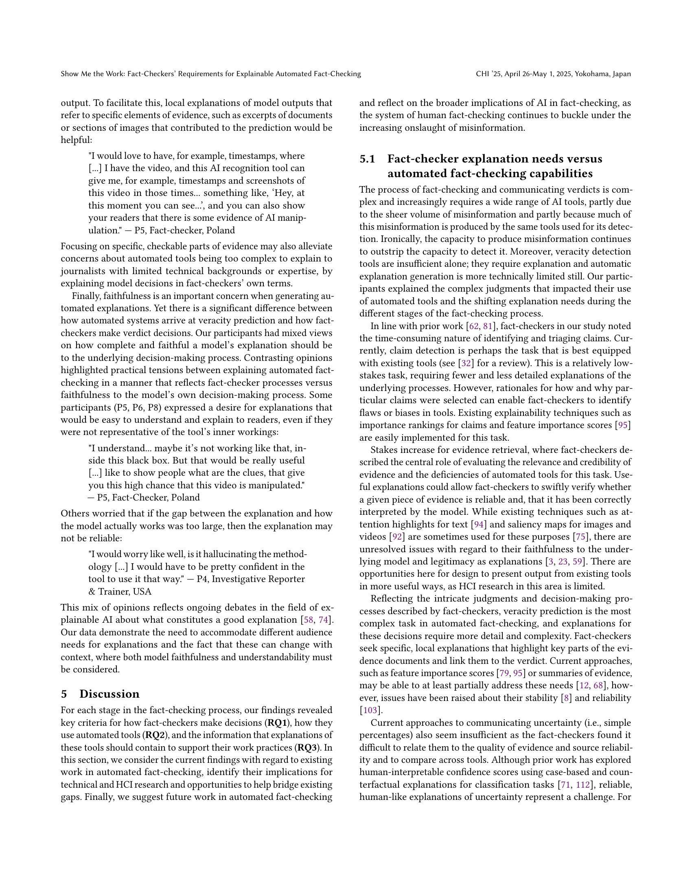
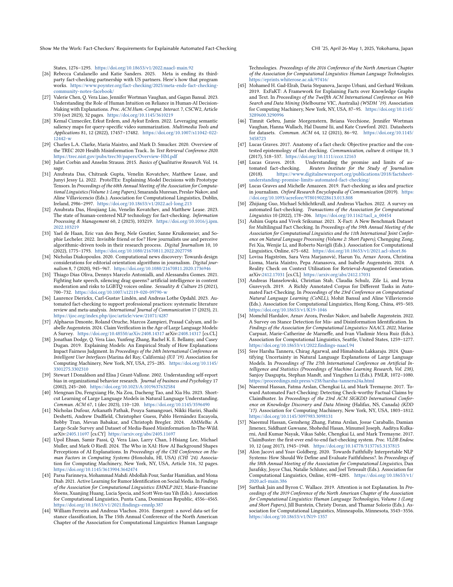

 


 2502.09083 
 Greta Warren et el. 
 
 🤗 2025-02-18 
 



↗ arXiv


↗ Hugging Face


↗ Papers with Code


### TL;DR



온라인상의 가짜뉴스와 허위정보의 증가로 인해 효과적인 자동화된 팩트 체킹 시스템의 필요성이 커지고 있습니다. 하지만, 기존 시스템들은 팩트 체커의 의사결정 과정과는 맞지 않고 설명 기능도 부족하여 실제 업무에 통합되기 어려웠습니다. 이 연구는 팩트 체커들과의 인터뷰를 통해 그들의 업무 흐름과 증거 평가 방식을 분석하고, 자동화된 팩트 체킹 도구에 대한 설명 요구사항을 파악했습니다.

본 연구는 팩트 체커의 의사결정 과정과 요구사항을 분석하여 자동화된 팩트 체크 시스템의 설명에 대한 요구사항을 명확하게 제시했습니다.  **주장 탐지, 증거 수집, 진실성 판단, 결과 전달** 등 각 단계별로 필요한 설명 유형을 구체적으로 제시하고, **모델의 추론 과정, 특정 증거, 불확실성 및 정보 격차** 등을 강조하는 설명의 중요성을 밝혔습니다.  또한, 현존하는 자동화된 팩트 체킹 시스템과 팩트 체커의 실제 요구사항 사이의 격차를 보여주고, 이를 해소하기 위한 구체적인 권고안을 제시했습니다.



#### Key Takeaways


 팩트 체커는 자동화된 팩트 체크 시스템의 설명 가능성을 중요하게 생각하며, 특히 증거의 출처와 추론 과정에 대한 투명성을 요구한다. 



 자동화된 팩트 체크 시스템은 팩트 체크의 각 단계(주장 탐지, 증거 수집, 진실성 판단, 의사소통)에 맞춘 설명을 제공해야 한다. 



 설명 가능한 AI 시스템 개발에는 팩트 체커의 실제 업무 흐름과 요구사항을 고려해야 하며, 단순한 정확도 향상뿐 아니라 설명의 신뢰성과 이해 가능성도 중요하다. 


#### Why does it matter?
본 논문은 **자동화된 팩트 체크 시스템의 설명 가능성**에 대한 연구이며, **팩트 체커의 실제 업무 흐름과 요구사항을 반영**하여 설명 가능한 AI 시스템 개발에 중요한 시사점을 제공합니다. **설명 가능한 AI에 대한 연구**와 **팩트 체킹 분야의 연구** 모두에 중요한 기여를 하며, 향후 연구 방향을 제시합니다.  **오류 가능성 감소 및 신뢰도 향상**에 기여할 수 있습니다.

------
#### Visual Insights


| Participant ID | Country | Occupation | Organisational Context | Fact-Checking Experience | Gender |
|---|---|---|---|---|---| 
| P1 | Ukraine | Investigative Journalist | Freelance | 8 years | Female |
| P2 | Argentina | Fact-Checker | Independent | 4 years | Female |
| P3 | Poland | Fact-Checker | Independent | 4 years | Male |
| P4 | USA | Investigative Journalist & Trainer | Freelance | 12 years | Female |
| P5 | Poland | Fact-Checker | Independent | 5 years | Female |
| P6 | Ireland & USA | Fact-Checker & Project Manager | Independent | 4 years | Male |
| P7 | Poland | Director & Journalist | Independent | 4 years | Male |
| P8 | Zimbabwe | Fact-Checker | Independent | 2 years | Female |
| P9 | Nigeria | Investigative Journalist | Independent | 4 years | Male |
| P10 | India | Fact-Checker | Independent | 6 years | Male |

> 🔼 표 1은 인터뷰 참가자들의 인구 통계학적 정보를 보여줍니다.  참가자의 ID, 국가, 직업, 조직 유형, 근무 경력 등이 포함되어 있습니다.  이 표는 연구에 참여한 전문가들의 다양성을 보여주는 데 도움이 됩니다. 특히 참가자들의 다양한 배경과 경험을 통해 연구 결과의 일반화 가능성을 높여줍니다.
> 

> 
read the caption

> Table 1. Demographics of the interview participants
> 

### In-depth insights

#### Fact-Checker Needs
본 논문에서 'Fact-Checker Needs'는 **사실 확인자의 요구사항과 어려움을 심층적으로 분석**한 부분입니다.  **신뢰할 수 있는 정보의 식별 및 검증**, **효율적인 작업 흐름**, **AI 도구 활용의 실효성**, **설명 가능한 AI 시스템의 필요성** 등이 주요 내용입니다. 특히, **AI 시스템의 투명성과 설명 가능성**에 대한 강조가 눈에 띄는데, 이는 사실 확인자가 AI 시스템의 결과를 신뢰하고 그 과정을 이해하여 자신의 작업에 효과적으로 통합하기 위해 필수적이라는 점을 시사합니다.  또한, **AI 시스템이 제공하는 정보의 품질과 신뢰성 확보**, **다양한 언어와 미디어 형식에 대한 지원**, **인지 부하 완화를 위한 효율적인 인터페이스 제공**, **윤리적 고려사항** 등도 중요한 요구사항으로 제기됩니다.  이러한 요구사항들은 **현실적인 사실 확인 작업의 복잡성과 어려움을 반영**하며, **단순한 자동화 시스템을 넘어 인간 중심의 접근 방식**을 강조합니다. 따라서,  **사실 확인자의 실제 업무 흐름과 요구사항에 맞춘 AI 시스템 개발**이 중요하며, 단순한 정확도 향상을 넘어 사용자 경험과 신뢰도 향상을 위한 노력이 필요합니다.

#### AI Tool Evaluation
본 논문에서는 AI 도구 평가에 대한 명시적인 섹션이 없지만, 연구진이 수행한 인터뷰 분석을 통해 암시적으로 AI 도구 평가에 대한 통찰력을 얻을 수 있습니다. **팩트 체커들이 실제로 AI 도구를 사용하는 방식과 그 이유, 그리고 AI 도구의 설명이 팩트 체킹 작업에 어떻게 도움이 되는지 또는 되지 않는지에 대한 심층적인 분석**이 이루어졌습니다. 특히, AI 도구의 설명에 대한 팩트 체커들의 요구사항(예: 투명성, 재현성, 특정 증거에 대한 참조)과 현재 AI 도구의 기능 간의 괴리가 강조되어, **향후 AI 도구 개발 방향**을 제시하는데 중요한 자료로 활용될 수 있습니다.  **도구의 정확성 뿐 아니라 설명의 질과 유용성, 그리고 팩트 체커의 작업 흐름과의 통합** 등 다차원적인 평가 기준을 제시해야 할 필요성이 시사됩니다.  **특정 언어나 문화적 맥락에 대한 AI 도구의 성능 차이**에 대한 분석 또한 중요하며, 이는 AI 도구 개발 과정에서 다양성과 포용성을 고려해야 함을 보여줍니다. 따라서 AI 도구 평가는 단순히 정확도 측정을 넘어, **인간 중심적 관점에서 실제 사용성과 유용성을 종합적으로 고려**하는 방식으로 진행되어야 합니다.

#### Explainable AI Gaps
본 논문에서 제시된 "설명 가능한 AI의 간극(Explainable AI Gaps)"에 대한 심층적인 분석 결과를 요약하면 다음과 같습니다. **현재 설명 가능한 AI 기술은 팩트 체커의 실제 의사결정 과정과는 상당한 차이**를 보입니다.  **AI 모델은 주로 정확도에 초점**을 맞추는 반면, **팩트 체커는 증거의 신뢰성, 출처의 평판, 맥락적 이해 등 다양한 요소**를 고려하여 종합적인 판단을 내립니다.  따라서 AI 모델이 제시하는 설명은 팩트 체커의 의사결정 과정을 충분히 반영하지 못하고, 그 결과 팩트 체커는 AI의 출력 결과를 신뢰하기 어렵고,  자신의 업무 흐름에 통합하기 어려워합니다. 특히 **AI 모델의 불확실성 표현 방식은 팩트 체커에게는 효과적이지 못**하며, **신뢰할 수 있는 근거를 제시하는 방식 또한 미흡**합니다.  **설명의 충실성과 사용자의 이해도 사이의 균형**을 맞추는 것 또한 중요한 과제입니다. 따라서 **향후 연구는 팩트 체커의 실제 업무 방식을 정확하게 반영하는 설명 가능한 AI 시스템**을 개발하는 데 집중해야 합니다.  이는 기술적 발전 뿐 아니라, **HCI(Human-Computer Interaction) 관점**에서의 사용자 경험 연구 또한 필요로 합니다.

#### Methodology: Interviews
본 연구의 방법론에서 인터뷰는 **핵심적인 데이터 수집 도구**로 활용되었습니다. 연구진은 실제 팩트체커들의 경험과 의견을 심층적으로 이해하기 위해 **구조화된 인터뷰** 방식을 채택했을 것으로 예상됩니다.  질문들은 팩트체크 과정의 각 단계(주장 검토, 증거 수집, 판단, 설명 등)에 초점을 맞추어 **구체적이고 세부적인 답변**을 유도했을 것입니다. 특히, 자동화된 팩트체킹 도구 사용 경험과 이에 대한 설명 요구사항을 중점적으로 다루었을 것으로 보이며, 이를 통해 **자동화 시스템 개발의 실질적인 개선 방향**을 제시하고자 했습니다. 또한, **다양한 지역 및 배경**을 가진 팩트체커들을 대상으로 인터뷰를 진행하여 연구 결과의 일반화 가능성을 높이고자 했을 것입니다.  **참여자들의 익명성 보장 및 윤리적인 측면**도 고려되었을 것으로 판단됩니다.  인터뷰 내용은 녹음 및 전사 과정을 거쳐 정리 분석되었을 것이고, 이를 통해 **팩트체커들의 요구사항 및 자동화 시스템 개선 방향**에 대한 귀중한 통찰을 얻었을 것으로 예상됩니다.

#### Future Research
미래 연구 분야는 **설명 가능한 AI(XAI) 기반의 자동 사실 확인 시스템 개발**에 초점을 맞춰야 합니다. 특히, **사실 확인자의 의사 결정 과정과 일치하는 설명을 생성**하는 데 중점을 두어야 하며, **다양한 언어 및 문화적 맥락을 고려**해야 합니다. 또한, **AI 시스템의 편향성을 최소화하고 투명성을 확보**하기 위한 노력이 필요합니다.  **사실 확인자의 실제 업무 흐름에 AI 시스템을 효과적으로 통합**하는 방법에 대한 연구도 중요하며, 이를 위해서는 **HCI(Human-Computer Interaction) 분야와의 협력**이 필수적입니다.  **AI 기반의 사실 확인 시스템의 윤리적 함의**에 대한 심도 있는 논의 또한 미래 연구에 포함되어야 합니다.  **AI 시스템의 오류 및 한계점을 명확히 인식**하고, 이를 보완하기 위한 방안을 모색해야 합니다.  **저자원 언어 및 지역에 대한 AI 모델 개발**을 위한 연구도 필요합니다.

### More visual insights

More on tables


| Organisational |
|---|---| 
| Context |
> 🔼 표 2는 연구 질문과 관련된 주요 주제들을 보여줍니다. 각 주제는 괄호 안에 해당 주제를 언급한 참가자 수를 나타냅니다. 이 표는 연구에서 도출된 주요 발견 사항들을 요약하여 보여주는 역할을 하며, 각 연구 질문에 대해 어떤 주제들이 중요하게 다뤄졌는지, 그리고 각 주제에 대해 얼마나 많은 참가자들이 언급했는지 확인할 수 있도록 합니다.  즉, 연구 결과의 핵심 내용을 간결하게 제시하고, 각 주제의 중요도를 수치적으로 나타내어 연구의 신뢰성을 높여줍니다.
> 

> 
read the caption

> Table 2. Key themes relevant to each research question, with the number of participants who mentioned each theme in parentheses.
> 


| Fact-Checking | Experience |
|---|---|
> 🔼 표 3은 연구 논문의 인터뷰 기록 분석을 통해 도출된 주요 주제, 하위 주제 및 코드의 예시를 보여줍니다.  각 주제는 연구 질문(RQ)과 관련이 있으며, 인터뷰 참가자들이 언급한 구체적인 내용들을 코드화하여 분류하고 있습니다.  이 표를 통해 연구자들은 데이터 분석 과정에서 어떤 패턴과 의미를 발견했는지, 그리고 그것이 연구 질문에 어떻게 답하는지를 보다 명확하게 보여줍니다.  RQ1, RQ2, RQ3는 각각 연구 질문을 나타내며, 각 질문에 따라 도출된 주요 주제와 하위 주제, 그리고 그에 해당하는 구체적인 코드들이 제시되어 있습니다.  예를 들어, RQ1(fact-checkers' decisions and processes)와 관련된 주제로는 '증거의 질', '판결 결정', '판결에 따른 정보' 등이 있으며, 각 주제 아래에는 더 구체적인 하위 주제와 코드들이 제시됩니다.  이러한 세부적인 정보는 연구의 신뢰성과 투명성을 높여주고, 연구 방법과 결과에 대한 이해를 돕는 역할을 합니다.
> 

> 
read the caption

> Table 3. Example themes, subthemes and codes developed from analysis of interview transcripts
> 

### Full paper



