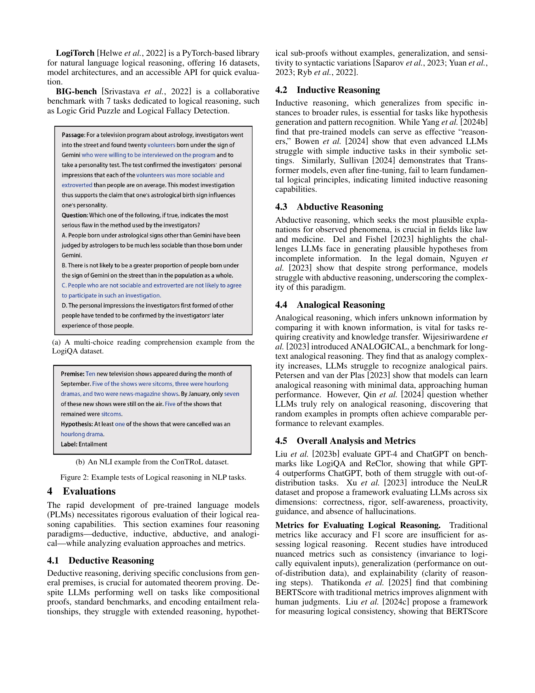

 


 2502.09100 
 Hanmeng Liu et el. 
 
 🤗 2025-02-14 
 



↗ arXiv


↗ Hugging Face


↗ Papers with Code


### TL;DR



최근 대규모 언어 모델(LLM)이 놀라운 추론 능력을 보여주고 있지만, 엄격한 논리적 추론에는 여전히 한계가 있습니다.  이 논문은 LLM의 논리적 추론 능력을 향상시키기 위한 방법을 종합적으로 조사하고 분석합니다.  LLM의 추론 능력 향상을 위해서는 **데이터 품질 개선**, **모델 구조 개선**, **추론 과정 개선** 등 다양한 접근법이 필요하며, 이를 위한 **새로운 벤치마크**와 **평가 지표**의 개발도 중요합니다.

본 논문에서는 LLM의 추론 능력을 향상시키기 위한 구체적인 방법들을 제안합니다.  **데이터 중심 접근법**은 더 나은 학습 데이터를 만들고, **모델 중심 접근법**은 모델의 구조와 학습 과정을 개선하여 추론 성능을 높입니다.  또한, **외부 지식 활용**과 **신경 기호 접근법**을 통해 LLM의 추론 능력을 더욱 강화하는 방법도 제시합니다.  이러한 연구 결과는 향후 AI 시스템의 논리적 추론 능력 발전에 크게 기여할 것으로 기대됩니다.



#### Key Takeaways


 대규모 언어 모델(LLM)의 논리적 추론 능력 향상을 위한 다양한 전략(데이터 중심, 모델 중심, 외부 지식 활용, 신경 기호 접근법 등)이 제시됨 



 LLM의 논리적 추론 성능 평가를 위한 다양한 벤치마크와 평가 지표가 분석됨 



 LLM의 논리적 추론 능력 향상을 위한 향후 연구 방향 및 과제(확장성, 일관성, 설명 가능성, 효율성 등)가 제시됨 


#### Why does it matter?
이 논문은 **대규모 언어 모델(LLM)**의 논리적 추론 능력 향상에 대한 **최신 연구 동향**을 종합적으로 제시하여, **향후 연구 방향**을 제시하고 **새로운 연구 분야**를 개척하는 데 중요한 역할을 합니다.  **형식적 논리**에 기반한 추론 방법과 **평가 기준**을 제시하고, 데이터 중심 접근법, 모델 중심 접근법, 외부 지식 활용, 신경 기호 접근법 등 다양한 추론 능력 향상 전략을 분석합니다.  **현재 LLM의 한계점과 향후 과제**를 명확히 제시하여, 연구자들에게 **실질적인 연구 방향**을 제시합니다. 이는 LLM의 논리적 추론 능력 향상에 기여하여, AI 시스템의 신뢰성과 설명 가능성을 높이는 데 크게 기여할 것으로 예상됩니다.

------
#### Visual Insights

> 🔼 이 그림은 논문의 개요를 보여주는 구조도입니다. 논문의 주요 섹션들을 계층적으로 보여주어 독자가 논문의 흐름과 내용을 쉽게 이해하도록 돕습니다. 각 섹션은 논문에서 다루는 주제를 간략하게 설명하며, 서로 연결되어 논리적인 순서대로 배열되어 있습니다.
> 

> 
read the caption

> Figure 1: The structure of this survey
> 


| Dataset | Language | Question Type | Size | Source |
|---|---|---|---|---|
| LogiQA | Zh/En | Multichoice | 15,937 | Exam-based |
| ReClor | En | Multichoice | 6,138 | Exam-based |
| AR-LSAT | En | Multichoice | 2,064 | Exam-based |
| CLUTRR | En | Question-answering | 6,016 | Rule-based |
| GSM | En | Math word problems | 19K | Exam-based |
| LINGOLY | En | Question-answering | 1,133 | Expert-designed |
| ConTRoL | En | ternary classification | 8,325 | Exam-based |
| FOLIO | En | binary classification | 1,351 | Expert-designed |
| LogicNLI | En | ternary classification | 30K | Exam-based |
| ProofWriter | En | binary classification | - | Exam-based |
| LogicBench | En | binary classification | 1,270 | Rule-based |
| GLoRE | Zh/En | Miscellaneous | 17 tasks | Miscellaneous |
| LogiGLUE | En | Miscellaneous | 24 tasks | Miscellaneous |
| LogiTorch | En | Miscellaneous | 16 tasks | Miscellaneous |
| BIG-Bench | En | Miscellaneous | 7 tasks | Miscellaneous |

> 🔼 표 1은 논리적 추론 과제에 사용되는 주요 데이터셋과 벤치마크를 보여줍니다.  데이터셋은 크게 규칙 기반, 전문가 설계, 시험 기반의 세 가지 유형으로 분류됩니다. 각 유형은 데이터 생성 방식, 데이터 크기, 질문 유형 등이 다릅니다.  표에는 각 데이터셋의 언어, 질문 유형, 크기, 출처 등의 정보가 포함되어 있어 논리적 추론 모델의 성능 평가에 유용하게 사용될 수 있습니다.
> 

> 
read the caption

> Table 1: Main Datasets and Benchmarks of Logical Reasoning Task.
> 

### Full paper



