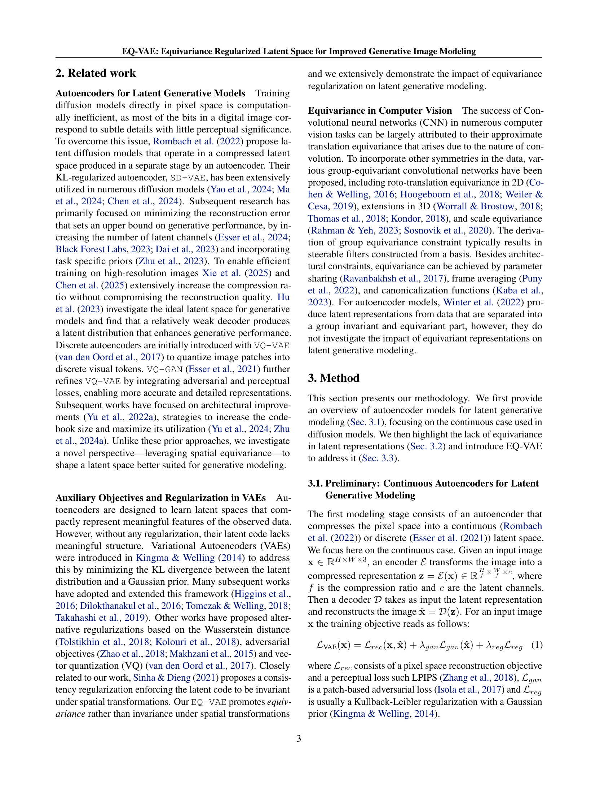
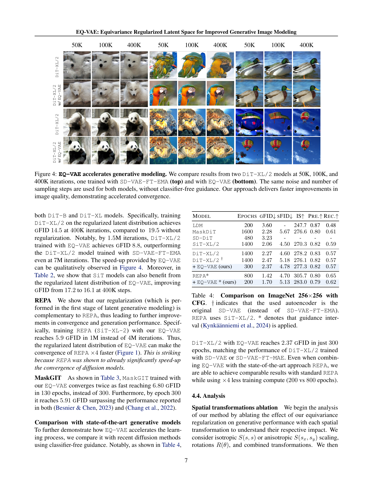
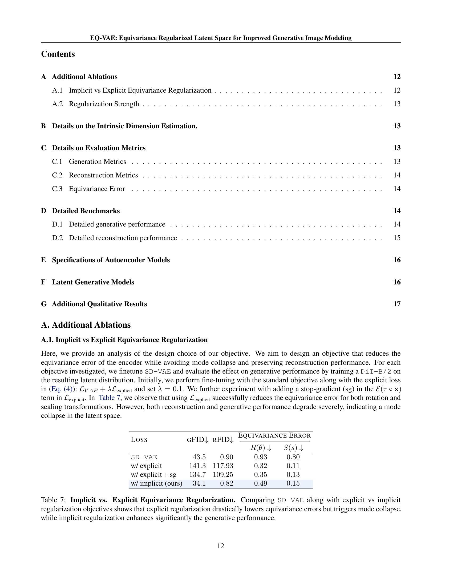

 


 2502.09509 
 Theodoros Kouzelis et el. 
 
 🤗 2025-02-18 
 



↗ arXiv


↗ Hugging Face


↗ Papers with Code


### TL;DR



**기존 잠재 생성 모델들은 오토인코더가 이미지를 잠재 공간으로 압축하고 생성 모델이 이를 이용하여 이미지를 생성하는 방식을 사용합니다. 하지만 기존 오토인코더들은 크기나 회전 변환 등에 대한 등변성이 부족하여 복잡한 잠재 공간을 생성하고, 이는 생성 성능을 저해하는 주요 원인이 됩니다.**  이러한 문제를 해결하기 위해 연구자들은 다양한 규제 기법을 도입해왔지만, 이는 재구성 품질과의 상충 관계를 초래하는 한계를 가지고 있었습니다.

**본 논문에서는 EQ-VAE라는 새로운 규제 기법을 제시하여 잠재 공간의 등변성을 강화함으로써 이러한 문제를 해결합니다.**  EQ-VAE는 사전 훈련된 오토인코더의 미세 조정을 통해 잠재 공간의 복잡성을 줄이고 생성 성능을 향상시킵니다.  **본 논문은 DiT, SiT, REPA, MaskGIT 등 다양한 최첨단 생성 모델에 EQ-VAE를 적용하여 성능 향상 및 훈련 속도 향상을 실험적으로 입증하였습니다.**  **EQ-VAE는 연속 및 이산 오토인코더 모두와 호환되므로 다양한 생성 모델에 적용될 수 있다는 장점을 가지고 있습니다.**



#### Key Takeaways


 EQ-VAE는 잠재 공간의 복잡성을 줄이면서 재구성 품질을 저하시키지 않고 생성 성능을 향상시킵니다. 



 EQ-VAE는 연속 및 이산 오토인코더 모두와 호환되며 다양한 생성 모델에 적용 가능합니다. 



 EQ-VAE는 여러 최첨단 생성 모델의 훈련 속도를 상당히 향상시킵니다. 


#### Why does it matter?
**본 논문은 잠재적 생성 모델의 성능을 향상시키는 새로운 규제 방법을 제시하여 생성적 이미지 모델링 분야에 상당한 영향을 미칠 수 있습니다.**  **EQ-VAE는 다양한 생성 모델과 호환되므로 광범위한 응용 가능성을 가지며, 훈련 속도를 크게 향상시켜 연구자들에게 실질적인 이점을 제공합니다.**  **또한 본 연구는 잠재 공간의 구조와 생성 성능 간의 관계에 대한 새로운 통찰력을 제공하여, 향후 연구를 위한 새로운 방향을 제시합니다.**

------
#### Visual Insights


| Image | SD-VAE | SD-VAE +Ours | SDXL-VAE | SDXL-VAE +Ours |
|---|---|---|---|---|
|  |  |  |  |  |
|  |  |  |  |  |
|  |  |  |  |  |
|  |  |  |  |  |

> 🔼 표 1은 EQ-VAE를 적용했을 때와 적용하지 않았을 때의 다양한 오토인코더의 성능 비교 결과를 보여줍니다.  연속적인(SD-VAE, SDXL-VAE, SD3-VAE) 및 이산적인(VQ-GAN) 오토인코더 모두에 대해 재구성 품질, 등변량 오류 및 생성 성능을 평가합니다.  생성 FID(gFID)는 연속 VAE의 경우 DiT-B를 사용하고, VQ-GAN의 경우 MaskGIT를 사용하여 측정했습니다. EQ-VAE는 재구성 rFID와 등변량 오류를 줄이면서 생성 성능(gFID)을 향상시키는 효과를 보입니다. 추가적인 재구성 지표는 부록의 표에서 확인할 수 있습니다.
> 

> 
read the caption

> Table 1: Comparison of Autoencoders with and without EQ-VAE. We evaluate reconstruction quality, equivariance errors (defined in LABEL:sec:appendix_metrics), and generative performance for continuous (SD-VAE, SDXL-VAE, SD3-VAE) and discrete (VQ-GAN) autoencoders, with and without EQ-VAE. Generative FID (gFID) is measured using DiT-B for continuous VAEs and MaskGIT for VQ-GAN. Our approach reduces reconstruction rFID and equivariance errors while enhancing generative performance (gFID). For additional reconstruction metrics see LABEL:tab:appendix_recon.
> 

### In-depth insights

#### Equivariance in VAEs
VAE(Variational Autoencoder)에서의 동등변환(equivariance) 개념은 **잠재 공간(latent space)의 구조를 이해하고 개선하는 데 중요한 역할**을 합니다.  기존 VAE는 입력 데이터의 변환(예: 회전, 크기 조절)에 대해 잠재 공간이 일관되게 반응하지 않을 수 있습니다.  **동등변환 VAE는 입력 데이터의 변환에 따라 잠재 공간의 표현이 체계적으로 변하도록 제약**을 가함으로써 이 문제를 해결합니다.  이는 **잠재 공간의 복잡성을 줄이고 생성 성능을 향상**시키는 데 기여합니다.  **동등변환 VAE는 잠재 공간의 구조를 더욱 이해하기 쉽게 만들고, 생성 모델의 학습을 용이하게** 합니다. 하지만, 동등변환을 강하게 적용하면 재구성 성능이 저하될 수 있으므로, **동등변환 정규화의 강도를 조절**하는 것이 중요합니다.  결론적으로, 동등변환 VAE는 **잠재 공간의 효율성과 생성 모델의 성능을 향상**시키는 유용한 접근 방식입니다.

#### EQ-VAE Regularization
EQ-VAE 정규화는 잠재 공간의 복잡성을 줄이고 생성 성능을 향상시키기 위해 고안된 기법입니다. **기존 오토인코더의 잠재 공간은 크기 및 회전과 같은 의미론적 변환에 대한 등변성이 부족하여 복잡한 잠재 다양체를 생성**합니다. 이는 생성 모델의 학습을 어렵게 만드는 요인이 됩니다. EQ-VAE는 이러한 문제를 해결하기 위해 잠재 공간에 등변성을 강제하는 정규화 기법을 제안합니다. **간단한 손실 함수 수정을 통해 의미론적 변환에 대한 잠재 공간의 등변성을 높여 복잡성을 줄이고 재구성 품질을 저하시키지 않고 생성 성능을 향상**시킵니다.  **연속 및 이산 오토인코더 모두에 적용 가능**하여 다양한 생성 모델에 적용할 수 있는 **범용적인 개선 방법**입니다. 실험 결과, EQ-VAE는 여러 최첨단 생성 모델의 성능을 향상시키고 학습 속도를 높이는 것으로 나타났습니다. 이는 **잠재 공간의 품질이 생성 모델의 성능에 중대한 영향을 미침**을 보여줍니다. 따라서 EQ-VAE는 잠재 생성 모델의 성능 향상을 위한 효과적인 방법으로 평가될 수 있습니다.

#### Generative Model Boost
본 논문에서 제시된 방법론은 **잠재 공간의 구조를 개선**하여 생성 모델의 성능을 향상시키는 데 초점을 맞추고 있습니다.  기존 오토인코더의 잠재 공간은 **공간 변환에 대한 불변성(invariance)**이 부족하여 생성 성능을 저해하는 복잡성을 지니고 있습니다.  따라서 연구진은 **등변성(equivariance)**을 강화하는 새로운 규제 기법을 제안하여 잠재 공간의 복잡성을 줄이면서 재구성 성능은 유지합니다. 이를 통해 다양한 생성 모델의 학습 속도를 높이고, **생성 품질을 향상**시키는 효과를 확인했습니다. 특히, **고해상도 이미지 생성**에서 그 효과가 두드러지게 나타납니다.  **다양한 종류의 오토인코더와 생성 모델에 적용 가능**하다는 점 또한 중요한 강점으로,  본 연구의 접근 방식은 잠재 공간 기반 생성 모델 연구에 상당한 기여를 할 것으로 예상됩니다.

#### Ablation Experiments
본 논문에서는 **절제 실험(Ablation Experiments)**을 통해 제안된 방법의 각 구성 요소의 중요성을 면밀히 검증합니다.  **EQ-VAE의 핵심은 공변량 규제를 통해 잠재 공간의 복잡성을 줄이고 생성 성능을 향상시키는 것**입니다.  따라서 절제 실험은 공변량 규제의 효과를 정량적으로 평가하는 데 초점을 맞춥니다.  구체적으로는, 공변량 규제를 제거했을 때의 성능 저하를 측정하고,  다양한 변환(scaling, rotation 등)에 대한 공변량 규제의 영향을 분석하여 **어떤 변환이 성능 향상에 가장 크게 기여하는지** 확인합니다.  또한, 다른 규제 기법과의 비교 실험을 통해 EQ-VAE의 우수성을 보여주는 데에도 절제 실험이 활용될 것입니다.  **결과적으로, 절제 실험을 통해 EQ-VAE의 각 구성요소가 생성 모델 성능 향상에 얼마나 중요한 역할을 하는지 명확히 밝히고,  제안된 방법의 강점을 부각**시킬 수 있습니다. 이러한 분석을 통해,  EQ-VAE의 효율성과 실용성을 뒷받침하는 견고한 근거를 제시할 수 있습니다.

#### Future Work
본 논문에서 제시된 EQ-VAE는 생성적 이미지 모델링에서 잠재 공간의 질을 향상시키는 데 효과적임을 보여주었지만, **향후 연구를 위한 여러 가지 방향**이 존재합니다.  먼저, **다양한 종류의 변환에 대한 EQ-VAE의 일반화 가능성**을 높이는 연구가 필요합니다. 현재는 스케일링과 회전 변환에만 초점을 맞추었지만, 더욱 복잡한 변환 (예: 비선형 변환, 시점 변환) 에 대한 확장이 필요합니다. 또한, **EQ-VAE의 효율성을 더욱 개선**하기 위한 연구가 필요합니다. 현재는 사전 훈련된 오토인코더를 미세 조정하는 방식을 사용하지만, 훈련 과정을 더욱 효율적으로 만들 수 있는 새로운 방법론을 탐색할 수 있습니다. 마지막으로, **EQ-VAE가 다른 생성 모델 (예: GAN)**에 적용될 수 있는지에 대한 연구가 필요합니다. EQ-VAE의 개념은 다양한 생성 모델에 적용될 가능성이 높으며, 이를 검증하는 실험은 EQ-VAE의 범용성을 더욱 확대하는 데 기여할 것입니다. 이러한 추가 연구를 통해 EQ-VAE의 성능과 적용 범위를 더욱 넓힐 수 있을 것입니다.

### More visual insights

More on tables


| Input Image **x** | SD-VAE | SD-VAE | Ours |
|---|---|---|---|
| $
\mathcal{D}(
\mathcal{E}(
tau
\circ
\mathbf{x})
)$ | $
\mathcal{D}(
tau
\circ
\mathcal{E}(
\mathbf{x})
)$ | $
\mathcal{D}(
tau
\circ
\mathcal{E}(
\mathbf{x})
)$ |  |
|  |  |  |  |
|  |  |  |  |
> 🔼 표 2는 DiT, SiT, REPA와 같은 다양한 생성 모델에 대해 SD-VAE-FT-EMA 또는 제안된 EQ-VAE를 사용하여 학습했을 때의 gFID 점수를 보여줍니다. ImageNet 256x256 데이터셋을 사용했으며, classifier-free guidance는 사용하지 않았습니다. 결과적으로 EQ-VAE는 모든 생성 모델에서 생성 성능과 학습 효율을 향상시키는 것을 보여줍니다.
> 

> 
read the caption

> Table 2: gFID Comparisons. gFID scores on ImageNet 256×256256256256\times 256256 × 256 for DiT, SiT, and REPA trained with either SD-VAE-FT-EMA or our EQ-VAE. No classifier-free guidance (CFG) is used. EQ-VAE consistently enhances both generative performance and training efficiency across all generative models.
> 


|                       | Autoencoder | rFID↓ | gFID↓ | Equiv. Error |             |
| :-------------------- | :----------- | :---- | :---- | :------------- | :------------ |
|                       |             |       |       |       |             |
| SD-VAE                | 0.90         | 43.8  | 0.93  | 0.80          |             |
| + EQ-VAE (ours)       | 0.82         | 34.1  | 0.49  | 0.15          |             |
|                       |             |       |       |               |             |
| SDXL-VAE              | 0.67         | 46.0  | 1.25  | 0.97          |             |
| + EQ-VAE (ours)       | 0.65         | 35.9  | 0.65  | 0.35          |             |
|                       |             |       |       |               |             |
| SD3-VAE               | 0.20         | 58.9  | 0.51  | 0.16          |             |
| + EQ-VAE (ours)       | 0.19         | 54.0  | 0.37  | 0.11          |             |
|                       |             |       |       |               |             |
| SD-VAE-16             | 0.87         | 64.1  | 0.95  | 0.85          |             |
| + EQ-VAE (ours)       | 0.82         | 49.7  | 0.39  | 0.17          |             |
|                       |             |       |       |               |             |
| VQ-GAN                | 7.94         | 6.8   | 1.35  | 1.22          |             |
| + EQ-VAE (ours)       | 7.54         | 5.9   | 0.64  | 0.55          |             |
> 🔼 이 표는 마스크가 적용된 생성 모델의 성능 향상에 대한 실험 결과를 보여줍니다. ImageNet 256x256 데이터셋을 사용하여 MaskGIT 모델과 그 파이토치 오픈소스 재현 모델을 VQ-GAN과 EQ-VAE를 사용하여 학습시킨 결과를 gFID와 IS 지표로 비교 분석합니다. EQ-VAE를 사용했을 때 학습 속도가 2배 이상 빨라졌고(130 epoch vs 300 epoch), 벡터 양자화 오토인코더에도 효과적으로 적용될 수 있음을 보여줍니다.
> 

> 
read the caption

> Table 3: Boosting Masked Generative Modeling. Comparison of gFID and IS on ImageNet 256×256256256256\times 256256 × 256 for MaskGIT (chang2022maskgit) and its open-source PyTorch reproduction† (besnier2023pytorch), trained with either VQ-GAN or our EQ-VAE. EQ-VAE accelerates training by more than ×2absent2\times 2× 2 (130 vs. 300 epochs), highlighting EQ-VAE can be effectively applied to vector-quantized autoencoders.
> 


| Model | #Params | Iter. | gFID↓ |
|---|---|---|---| 
| DiT-B/2 | 130M | 400K | 43.5 |
| w/ EQ-VAE (ours) | 130M | 400K | 34.1 |
| SiT-B/2 | 130M | 400K | 33.0 |
| w/ EQ-VAE (ours) | 130M | 400K | 31.2 |
| DiT-XL/2 | 675M | 400K | 19.5 |
| w/ EQ-VAE (ours) | 675M | 400K | 14.5 |
| SiT-XL/2 | 675M | 400K | 17.2 |
| w/ EQ-VAE (ours) | 675M | 400K | 16.1 |
| DiT-XL/2 | 675M | 7M | 9.6 |
| w/ EQ-VAE (ours) | 675M | 1.5M | 8.8 |
| SiT-XL/2+REPA | 675M | 4M | 5.9 |
| w/ EQ-VAE (ours) | 675M | 1M | 5.9 |
> 🔼 표 4는 CFG(Classifier-free guidance)를 사용하여 ImageNet 256x256 데이터셋에서 훈련된 여러 확산 모델들의 성능을 비교한 표입니다.  표에는 DiT-XL/2, SiT-XL/2, REPA 모델과 이들 모델에 EQ-VAE 기법을 적용한 경우의 결과가 제시되어 있습니다.  특히, † 기호는 원본 SD-VAE 오토인코더를 사용했음을, * 기호는 Kynkaanniemi 등(2024)의 가이드 간격(guidance interval) 방법을 사용했음을 나타냅니다.  REPA 모델의 경우 SiT-XL/2 모델을 사용한 결과를 보여줍니다.  이 표는 EQ-VAE 기법이 다양한 모델들에 적용될 때 성능 향상 및 훈련 속도 향상 효과를 보여주는 주요 실험 결과를 요약하고 있습니다.
> 

> 
read the caption

> Table 4: Comparison on ImageNet 256×\times×256 with CFG. ††\dagger† indicates that the used autoencoder is the original SD-VAE (instead of SD-VAE-FT-EMA). REPA uses SiT-XL/2. * denotes that guidance interval (Kynkaanniemi2024) is applied.
> 


| Model | Epoch | gFID↓ | IS↑ |
|---|---|---|---|
| MaskGIT | 300 | 6.19 | 182.1 |
| MaskGIT† | 300 | 6.80 | 214.0 |
| w/ EQ-VAE (ours) | 130 | 6.80 | 188.1 |
| w/ EQ-VAE (ours) | 300 | 5.91 | 228.8 |
> 🔼 표 5는 EQ-VAE에서 공간 변환의 영향을 분석한 결과를 보여줍니다. 회전, 등방성 스케일링, 이방성 스케일링, 그리고 이들의 조합을 통해 잠재 공간을 규제했을 때의 gFID, rFID, 고유 차원(ID)을 측정했습니다. 변환을 조합하면 고유 차원이 감소하고 생성 성능이 향상되는 반면, 이방성 스케일링은 재구성 성능을 약간 저하시킬 수 있음을 보여줍니다.  즉, 다양한 공간 변환 기법을 적용하여 생성 모델의 성능과 잠재 공간의 복잡도 사이의 관계를 분석하고, 최적의 잠재 공간 규제 전략을 제시합니다.
> 

> 
read the caption

> Table 5: Spatial Transformation Ablation in EQ-VAE. We measure gFID, rFID, and intrinsic dimension (ID) for latents regularized via rotations, isotropic scaling, anisotropic scaling, and combinations. Combining transformations lowers ID and enhances generative performance, though anisotropic scaling can slightly degrade reconstruction.
> 

### Full paper



