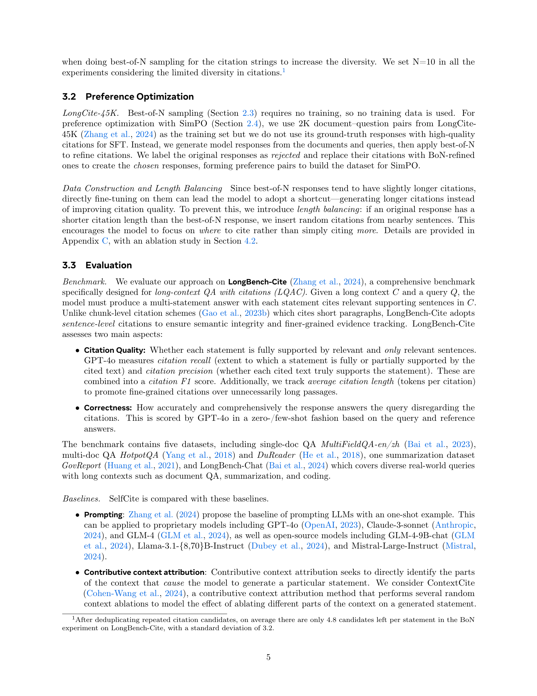

 


 2502.09604 
 Yung-Sung Chuang et el. 
 
 🤗 2025-02-14 
 



↗ arXiv


↗ Hugging Face


↗ Papers with Code


### TL;DR



대규모 언어 모델(LLM)은 사용자에게 정보를 제공하고 지식을 습득하는 데 유용하지만, **환각(hallucination)** 및 **문맥 오류(context error)** 문제로 신뢰성이 떨어질 수 있습니다.  이러한 문제를 해결하기 위해 기존 연구에서는 **인용(citation)**을 통해 생성된 응답의 신뢰성을 높이고자 했습니다. 그러나 기존 방법은 **수동 주석(manual annotation)**에 의존하거나 **비용이 많이 드는 독점 API**에 의존하는 한계가 있었습니다.

본 논문에서는 **SelfCite**라는 새로운 자기 지도 학습 기법을 제안합니다. SelfCite는 LLM이 스스로 문맥 제거를 통해 보상 신호를 생성하여 인용 품질을 평가하는 방식입니다.  **문맥 제거 실험**을 통해 인용의 필요성과 충분성을 평가하고, 이를 바탕으로 **최적의 N개 샘플링(best-of-N sampling)** 및 **선호도 최적화(preference optimization)** 전략을 사용하여 인용의 정확성과 품질을 향상시킵니다.  실험 결과, SelfCite는 LongBench-Cite 벤치마크에서 기존 최고 성능을 상당히 능가하는 결과를 보였습니다.



#### Key Takeaways


 SelfCite는 **어노테이션 없이** LLM의 응답에 대한 정확하고 세분화된 인용 생성을 가능하게 합니다. 



 문맥 제거(context ablation) 기반의 자기 지도 학습을 통해 인용의 **정확성과 품질을 크게 향상**시킵니다. 



 LongBench-Cite 벤치마크에서 기존 최고 성능을 **최대 5.3% 개선**하는 성과를 달성했습니다. 


#### Why does it matter?
본 논문은 **대규모 언어 모델(LLM)**이 생성한 응답에 대한 문맥 속성을 개선하는 데 중요한 의미를 지닙니다.  **자기 지도 학습(self-supervised learning)**을 통해 고품질의 인용을 생성하는 새로운 방법을 제시함으로써,  **어노테이션(annotation)에 대한 비용과 노력을 절감**하고, LLM의 신뢰성과 투명성을 향상시킬 수 있는 가능성을 제시합니다.  연구 결과는 인용의 정확성과 품질을 향상시키는 효과적인 방법을 보여주며, **향후 LLM의 발전 방향**에 대한 귀중한 통찰력을 제공합니다. 이는 특히 **긴 맥락(long-context) 문서 처리**에서 그 중요성이 더욱 커집니다.

------
#### Visual Insights

> 🔼 그림 1은 SelfCite 프레임워크가 필요성 점수(확률 감소)와 충분성 점수(확률 유지)라는 두 가지 지표를 기반으로 보상을 계산하는 과정을 보여줍니다. 먼저 전체 문맥을 사용하여 응답을 생성합니다. 그런 다음, 프레임워크는 (1) 문맥에서 인용된 문장을 제거하고 (2) 인용된 문장만 문맥으로 사용하여 동일한 응답을 생성할 확률을 평가합니다. 확률 감소와 유지는 이러한 확률 차이로부터 계산되며, 두 점수의 합이 최종 보상으로 사용됩니다. 이 그림은 SelfCite가 어떻게 문맥 제거를 통해 LLM이 생성한 인용의 질을 자체적으로 평가하고 보상 신호를 생성하는지 보여줍니다.
> 

> 
read the caption

> Figure 1: The SelfCite framework calculates rewards based on two metrics: necessity score (probability drop) and sufficiency score (probability hold). First, the full context is used to generate a response. Then, the framework evaluates the probability of generating the same response after (1) removing the cited sentences from the context and (2) using only the cited sentences in the context. The probability drop and hold are computed from these probability differences, and their sum is used as the final reward.
> 


| Model | Longbench-Chat |  |  | MultifieldQA |  |  | HotpotQA |  |  | Dureader |  |  | GovReport |  | Avg. | Citation |
|---|---|---|---|---|---|---|---|---|---|---|---|---|---|---|---|---|---|---|
|  | R | P | F1 | R | P | F1 | R | P | F1 | R | P | F1 | R | P | F1 | F1 | Length |
| **Proprietary models** |  |  |  |  |  |  |  |  |  |  |  |  |  |  |  |  |  |
| GPT-4o† | 46.7 | 53.5 | 46.7 | 79.0 | 87.9 | 80.6 | 55.7 | 62.3 | 53.4 | 65.6 | 74.2 | 67.4 | 73.4 | 90.4 | 79.8 | 65.6 | 220 |
| Claude-3-sonnet† | 52.0 | 67.8 | 55.1 | 64.7 | 85.8 | 71.3 | 46.4 | 65.8 | 49.9 | 67.7 | 89.2 | 75.5 | 77.4 | 93.9 | 84.1 | 67.2 | 132 |
| GLM-4† | 47.6 | 53.9 | 47.1 | 72.3 | 80.1 | 73.6 | 47.0 | 50.1 | 44.4 | 73.4 | 82.3 | 75.0 | 82.8 | 93.4 | 87.1 | 65.4 | 169 |
| **Open-source models** |  |  |  |  |  |  |  |  |  |  |  |  |  |  |  |  |  |
| GLM-4-9B-chat† | 25.9 | 20.5 | 16.7 | 51.1 | 60.6 | 52.0 | 22.9 | 28.8 | 20.1 | 45.4 | 48.3 | 40.9 | 5.7 | 8.2 | 6.3 | 27.2 | 96 |
| Llama-3.1-8B-Instruct† | 14.1 | 19.5 | 12.4 | 29.8 | 44.3 | 31.6 | 20.2 | 30.9 | 20.9 | 22.0 | 25.1 | 17.0 | 16.2 | 25.3 | 16.8 | 19.7 | 100 |
| Llama-3.1-70B-Instruct† | 25.8 | 32.0 | 23.2 | 53.2 | 65.2 | 53.9 | 29.6 | 37.3 | 28.6 | 38.2 | 46.0 | 35.4 | 53.4 | 77.5 | 60.7 | 40.4 | 174 |
| Mistral-Large-Instruct† | 19.8 | 23.9 | 19.0 | 71.8 | 80.7 | 73.8 | 34.5 | 40.9 | 32.1 | 58.3 | 67.0 | 60.1 | 67.9 | 79.6 | 72.5 | 51.5 | 132 |
| **Contributive context attribution** (*with Llama-3.1-8B-Instruct*) |  |  |  |  |  |  |  |  |  |  |  |  |  |  |  |  |  |
| ContextCite (32 calls) | 56.7 | 76.8 | 58.0 | 76.1 | 87.2 | 78.9 | 40.5 | 54.7 | 43.9 | 58.0 | 82.4 | 65.0 | 67.1 | 88.8 | 75.6 | 64.3 | 92.7 |
| ContextCite (256 calls) | 63.5 | 83.1 | 64.7 | 78.8 | 89.8 | 81.8 | 46.5 | 60.8 | 49.2 | 61.7 | 89.1 | 70.1 | 69.1 | 93.5 | 78.8 | 68.9 | 100.8 |
| **Fine-tuned models** |  |  |  |  |  |  |  |  |  |  |  |  |  |  |  |  |  |
| LongCite-9B† | 57.6 | 78.1 | 63.6 | 67.3 | 91.0 | 74.8 | 61.8 | 78.8 | 64.8 | 67.6 | 89.2 | 74.4 | 63.4 | 76.5 | 68.2 | 69.2 | 91 |
| LongCite-8B† | 62.0 | 79.7 | 67.4 | 74.7 | 93.0 | 80.8 | 59.2 | 72.1 | 60.3 | 68.3 | 85.6 | 73.1 | 74.0 | 86.6 | 78.5 | 72.0 | 85 |
| **Ours: SelfCite** |  |  |  |  |  |  |  |  |  |  |  |  |  |  |  |  |  |
| LongCite-8B (Our repro.) | 67.0 | 78.1 | 66.6 | 74.8 | 90.7 | 79.9 | 60.8 | 77.9 | 64.1 | 67.1 | 87.2 | 73.7 | 81.6 | 89.3 | 84.5 | 73.8 | 83.5 |
| + BoN | 68.4 | 81.3 | 71.2 | 76.1 | 92.8 | 81.2 | 67.2 | 81.0 | 68.8 | 70.6 | 90.9 | 76.9 | 87.6 | 92.4 | 89.3 | 77.5 | 93.4 |
| + SimPO | 68.1 | 79.5 | 69.1 | 75.5 | 92.6 | 81.0 | 69.4 | 82.3 | 71.5 | 72.7 | 91.6 | 78.9 | 86.4 | 92.9 | 89.1 | 77.9 | 105.7 |
| + SimPO then BoN | 73.3 | 79.4 | 72.8 | 76.7 | 93.2 | 82.2 | 69.4 | 83.0 | 71.1 | 74.2 | 92.2 | 80.3 | 86.7 | 92.7 | 89.2 | 79.1 | 94.7 |
| Llama-3.1-8B-Instruct (*fully self-supervised setting*) |  |  |  |  |  |  |  |  |  |  |  |  |  |  |  |  |  |
|  + SFT on ContextCite | 52.3 | 70.6 | 56.5 | 79.1 | 90.5 | 82.0 | 54.5 | 72.3 | 56.3 | 54.9 | 79.0 | 61.6 | 63.7 | 84.9 | 72.3 | 65.7 | 83.0 |
|  + BoN | 54.8 | 67.6 | 58.1 | 80.4 | 90.5 | 83.0 | 58.3 | 70.0 | 57.5 | 57.6 | 79.0 | 63.1 | 67.2 | 84.8 | 74.6 | 67.3 | 80.4 |
|  + SimPO | 63.3 | 74.3 | 64.6 | 80.2 | 88.9 | 82.4 | 59.7 | 76.9 | 61.0 | 59.0 | 80.9 | 65.4 | 68.5 | 86.6 | 76.1 | 69.9 | 90.2 |
|  + SimPO then BoN | 66.0 | 82.4 | 71.1 | 81.5 | 90.7 | 83.2 | 61.3 | 70.0 | 59.9 | 62.1 | 81.4 | 67.4 | 68.8 | 86.2 | 76.1 | 71.5 | 87.4 |

> 🔼 표 1은 LongBench-Cite 벤치마크에서 평가된 인용 재현율(R), 인용 정밀도(P), 인용 F1 점수(F1) 및 인용 길이를 보여줍니다.  본 논문의 결과 중 가장 좋은 결과는 굵게 표시되어 있으며, 이전 최첨단 기술의 최고 성능은 밑줄이 그어져 있습니다. †는 Zhang 외.(2024)의 결과를 나타내며, 'Our repro.'는 본 논문에서 재현한 결과임을 의미합니다.  다양한 모델(독점 모델, 오픈 소스 모델, 기여 맥락 속성 모델, 미세 조정 모델, SelfCite 모델)의 성능을  LongBench-Cite 벤치마크의 다섯 가지 질문응답 작업(Longbench-Chat, MultifieldQA, HotpotQA, DuReader, GovReport)에 대해 비교 분석합니다.
> 

> 
read the caption

> Table 1: Citation recall (R), citation precision (P), citation F1 (F1), and citation length evaluated on LongBench-Cite benchmark. The best of our results are bolded. The best of previous state of the art are underlined. † indicates the results taken from Zhang et al. (2024). Our repro. means our reproduced results.
> 

### In-depth insights

#### Self-Supervised Citation
자기 지도 학습 기반의 인용 시스템은 **사람의 개입 없이** 언어 모델이 생성한 텍스트의 정확성과 신뢰성을 높이는 혁신적인 접근 방식입니다.  기존의 방식처럼 사람이 직접 인용을 검토하고 수정하는 대신, **모델 자체가 생성한 인용의 질을 평가하고 스스로 개선**하는 메커니즘을 구축합니다.  이는 맥락 제거(context ablation)와 같은 기법을 통해 모델의 출력 확률 변화를 분석하여 인용의 필요성과 충분성을 판단하는 방식으로 이루어집니다.  **비용 및 시간 효율성이 뛰어나며**, 방대한 데이터셋이 필요하지 않아, 특히 장문의 문서를 다루는 경우 효과적입니다. 하지만, **모델의 자기 평가에 대한 신뢰도**와, 맥락 제거 기법의 한계로 인해 발생할 수 있는 오류 가능성 등 **개선의 여지**가 존재합니다.  **향후 연구**에서는 이러한 한계점을 보완하고, 자기 지도 학습 기반 인용 시스템의 정확도와 신뢰성을 더욱 향상시키는 방안을 모색해야 할 것입니다.  **다양한 언어 모델**과 **데이터셋**에 대한 적용성 확대와, **다른 자기 지도 학습 기법**과의 결합을 통해 성능 향상을 도모하는 것도 중요한 연구 방향입니다.

#### Context Ablation Reward
본 논문에서 제시된 'Context Ablation Reward'는 **LLM의 생성 답변에 대한 신뢰도를 높이기 위한 핵심 전략**입니다.  기존의 어노테이션 기반 방법과 달리, 자가 지도 학습 방식을 통해 **LLM 자체가 생성한 답변의 정확성을 평가**하도록 합니다.  이는 문맥(Context)에서 특정 구문(cited text)을 제거하거나, 오직 해당 구문만 남긴 채 답변을 생성하여 확률 변화를 측정하는 방식입니다. 구문 제거 후 답변 확률이 크게 감소하면 해당 구문이 **필수적(Necessity)**임을, 구문만으로도 답변 확률이 유지되면 **충분(Sufficiency)**함을 의미합니다.  **두 점수를 종합**하여 보상 신호(reward)를 산출, 이를 통해 LLM이 더욱 정확하고 세밀한 인용 정보를 생성하도록 유도합니다.  **비용 효율적이고 자가 지도 학습 방식**이라는 점에서 기존의 어노테이션 기반 방법의 한계를 극복하는 혁신적인 접근 방식이라 할 수 있습니다.  이는 **높은 정확도의 인용 생성을 위한 새로운 가능성**을 제시하며,  향후 LLM의 신뢰성 향상에 중요한 역할을 할 것으로 기대됩니다.

#### Best-of-N & SimPO
본 논문에서 제시된 Best-of-N 샘플링과 SimPO(Simple Preference Optimization)는 **저자들이 제안한 SelfCite 프레임워크의 핵심적인 부분**입니다. Best-of-N 샘플링은 **LLM이 생성한 인용구 후보들을 평가하여 최적의 인용구를 선택하는 방법**으로, 계산 비용이 저렴한 SelfCite reward를 사용합니다. 이는 어노테이션 없이도 인용구의 질을 향상시키는 데 효과적임을 보여줍니다. 하지만 Best-of-N 샘플링은 추론 시간이 오래 걸린다는 단점이 있습니다.  **SimPO는 Best-of-N 샘플링으로 얻은 결과를 활용하여 LLM 자체를 미세 조정하는 방법**입니다. 이를 통해 Best-of-N 샘플링 없이도 인용구 생성 능력을 향상시키고, 더욱 효율적인 학습을 가능하게 합니다. **SimPO는 Best-of-N 샘플링의 장점을 유지하면서 단점을 보완**하여, 인용구 생성 성능을 더욱 향상시키는 데 기여합니다.  **두 방법의 조합**을 통해 LLM의 인용 생성 능력을 획기적으로 향상시키는 것을 보여줍니다. 특히, **자기 지도 학습 방식**을 통해 추가적인 어노테이션 없이도 우수한 성능을 달성한다는 점에서 의미가 있습니다.

#### LongBench-Cite Results
LongBench-Cite는 장문 맥락 질의응답(Long-context Question Answering)에서 인용의 질을 평가하기 위한 종합적인 벤치마크입니다. **SelfCite 모델은 LongBench-Cite 벤치마크에서 기존 최첨단 모델들을 상당히 능가하는 성능을 보여주었습니다.** 이는 특히 인용의 정확성(precision)과 재현율(recall) 측면에서 두드러지는데, **SelfCite의 독창적인 자기 지도 학습 방식**이 이러한 성과에 크게 기여했습니다.  **자기 지도 학습을 통해 어노테이션 비용 없이도 높은 수준의 인용 생성 품질을 달성**한 것은 주목할 만한 점입니다.  하지만, **모든 LongBench-Cite 데이터셋에서 일관된 성능 향상**을 보여주지는 않았고, 특정 데이터셋에서는 기존 모델과의 성능 차이가 크지 않았다는 점도 고려해야 합니다.  **향후 연구에서는 다양한 데이터셋에 대한 SelfCite의 일반화 성능을 더욱 강화**하고,  **인용의 길이 및 정확성과 같은 요소들 간의 균형**을 개선하는 방향으로 연구를 진행하는 것이 필요합니다.  SelfCite는 자기 지도 학습 방식을 통해 인용 생성의 새로운 가능성을 제시했지만,  **더욱 견고하고 일반화된 모델을 개발**하기 위한 지속적인 연구가 필요합니다.

#### Future Work & Limits
본 논문은 **자기 지도 학습 기반의 인용 생성 방식**을 제시하여 LLM의 인용 정확도를 향상시켰다는 점에서 큰 의의가 있습니다. 하지만, 여전히 개선의 여지가 있으며, **향후 연구 방향**으로는 다음과 같은 내용을 고려해 볼 수 있습니다. 먼저, **다양한 LLM과의 호환성 확보**를 위한 추가 연구가 필요하며, **다른 정렬 알고리즘과의 결합**을 통해 성능 향상을 도모할 수 있을 것입니다. 또한, **SFT 단계의 비지도 학습 방식 개선**을 위한 노력이 필요하며, **더욱 효율적인 보상 신호 설계 및 최적화**를 통한 성능 향상을 기대할 수 있습니다.  **길이 균형 문제 해결 및 오프 폴리시 특성 완화**를 위한 추가적인 연구도 필요합니다. 마지막으로, **다양한 종류의 질문 답변 태스크 및 벤치마크**에서의 성능 평가를 통해 일반화 가능성을 검증하는 것이 중요합니다.  이러한 노력을 통해 SelfCite는 더욱 강력하고 신뢰할 수 있는 인용 생성 시스템으로 발전할 수 있을 것입니다.

### More visual insights

More on tables


| Model | Long. | Multi. | Hot. | Dur. | Gov. | Avg |
|---|---|---|---|---|---|---|
| *Answering without citations* |
| LongSFT-8B† | 68.6 | 83.6 | 69.0 | 62.3 | 54.4 | 67.6 |
| LongSFT-9B† | 64.6 | 83.3 | 67.5 | 66.3 | 46.4 | 65.6 |
| Llama-3.1-8B-Instruct† | 61.6 | 73.3 | 64.5 | 39.4 | 62.1 | 60.2 |
| *Answering with citations* |
| LongCite-8B (Our repro.) | 67.6 | 86.7 | 69.3 | 64.0 | 60.4 | 69.6 |
| + SimPO | 67.4 | 86.7 | 67.5 | 66.0 | 61.3 | 69.8 |
| Llama-3.1-8B-Instruct | 67.4 | 87.9 | 73.5 | 67.8 | 62.1 | 71.7 |
| + SFT on ContextCite | 58.8 | 83.4 | 65.8 | 57.8 | 57.5 | 64.6 |
|        + SimPO | 56.8 | 80.9 | 65.3 | 59.5 | 60.9 | 64.7 |
> 🔼 표 2는 인용구를 포함하여 응답할 때와 그렇지 않을 때의 답변 정확도를 보여줍니다. †는 Zhang et al.(2024)에서 가져온 결과를 나타냅니다. 표 머리글에는 표 1과 동일한 다섯 개의 데이터 집합에 대한 약어가 포함되어 있습니다. 표는 각 데이터 집합에 대한 정확도 점수를 보여주며, 인용구를 사용하여 응답하는 것이 정확도에 미치는 영향을 비교 분석합니다.  Zhang et al.(2024)의 결과와 비교하여 SelfCite 모델의 성능을 평가하고, 인용구가 전체적인 답변 정확도에 미치는 영향을 보여줍니다.
> 

> 
read the caption

> Table 2: Answer correctness when responding with or without citations. † indicates results taken from Zhang et al. (2024). The header contains abbreviations for the same five datasets in Table 1.
> 


| Decoding Methods | HotpotQA R | HotpotQA P | HotpotQA F1 | Citation Length |
|---|---|---|---|---|
| LongCite-8B (Our repro.) | 60.8 | 77.9 | 64.1 | 83.5 |
| + BoN by LM log prob | 62.7 | 75.5 | 63.4 | 74.6 |
| + BoN by max citation length | 66.5 | 73.6 | 65.1 | 139.8 |
| + BoN by Prob-Drop | 65.6 | 78.1 | 66.6 | 92.9 |
| + BoN by Prob-Hold | 66.2 | 78.1 | 67.0 | 93.4 |
| + BoN by SelfCite | 67.2 | 81.0 | 68.8 | 93.4 |
| w/ lower length limit (256) | 65.8 | 78.8 | 66.4 | 84.5 |
| w/ higher length limit (512) | 67.0 | 82.2 | 68.5 | 99.2 |
| w/o length limit (∞) | 67.9 | 79.3 | 68.1 | 121.9 |
> 🔼 본 표는 HotpotQA 데이터셋에서 다양한 보상 기법을 사용한 Best-of-N (BoN) 디코딩 방법의 성능을 비교 분석한 결과를 보여줍니다.  구체적으로, HotpotQA 질문에 대한 답변 생성 시, 인용 정보의 재현율(Recall), 정밀도(Precision), F1 점수 및 평균 인용 길이를 측정하여 각 보상 기법의 효과를 평가합니다.  다양한 보상 전략(LM log prob, max citation length, Prob-Drop, Prob-Hold, SelfCite)을 비교하여 SelfCite 기법의 우수성을 보여주는 표입니다.
> 

> 
read the caption

> Table 3: Ablation study on HotpotQA citation recall, precision, and F1 (R, P, F1) and citation length for BoN decoding methods.
> 


| Fine-tuning Methods | HotpotQA R | HotpotQA P | HotpotQA F1 | Citation Length |
|---|---|---|---|---|
| LongCite-8B (Our repro.) | 60.8 | 77.9 | 64.1 | 83.5 |
| + SimPO | 69.4 | 82.3 | 71.5 | 105.7 |
| + SimPO + BoN | 72.0 | 82.7 | 72.9 | 126.9 |
| *+ SimPO w/ or w/o length balancing* |  |  |  |  |
| w/ length balancing | 69.4 | 82.3 | 71.5 | 105.7 |
| w/o length balancing | 64.4 | 62.9 | 60.5 | 152.9 |
| *+ SimPO w/ varying data sizes* |  |  |  |  |
| 1K examples | 62.5 | 78.9 | 65.7 | 90.1 |
| 2K examples | 69.4 | 82.3 | 71.5 | 105.7 |
| 4K examples | 68.5 | 80.4 | 70.3 | 134.1 |
| 8K examples | 63.6 | 75.3 | 64.4 | 195.2 |
| + *SFT on BoN responses* | 68.8 | 77.3 | 68.4 | 98.7 |
| *+ SimPO by denoising perturbed citations* |  |  |  |  |
| On original responses | 40.5 | 50.5 | 41.6 | 88.8 |
| On BoN responses | 42.6 | 50.7 | 42.3 | 79.7 |
> 🔼 본 표는 HotpotQA 데이터셋에서 미세 조정된 모델에 대한 인용 재현율, 정밀도, F1 점수 및 인용 길이에 대한 추가 연구 결과를 보여줍니다.  각 미세 조정 방법(SimPO, 최적-N 샘플링, 길이 균형 등)의 성능을 비교하여,  인용 품질 향상을 위한 다양한 방법론의 효과를 분석합니다.  특히, SimPO의 반복적 적용, 데이터 크기의 영향, 길이 균형 기법의 유무 등이 인용 성능에 미치는 영향을 자세하게 제시하고 있습니다.
> 

> 
read the caption

> Table 4: Ablation study on HotpotQA citation recall, precision, and F1 (R, P, F1) and citation length for finetuned models.
> 


| Sent. ID | Context Sentences (only showing a paragraph due to limited space) |
|---|---| 
| 302 (✓) | In general, consumer advocates believe that any <ins>comprehensive federal privacy policy</ins> should complement, and not supplant, sector-specific <ins>privacy legislation</ins> or state-level legislation. |
| 303 (✓) | <ins>Finding a global consensus on how to balance open data flows and privacy protection may be key to</ins> maintaining trust in the digital environment and advancing international trade. |
| 304 (✗) | One study found that over 120 countries have laws related to personal data protection. |
| 305 (✗) | Divergent national privacy approaches raise the costs of doing business and make it harder for governments to collaborate and share data, whether for scientific research, defense, or law enforcement. |
| 306 (✓) | <ins>A system for global interoperability</ins> in a least trade-restrictive and nondiscriminatory way between <ins>different national systems</ins> could help minimize costs and allow entities in different jurisdictions with varying online <ins>privacy regimes</ins> to share data via cross-border data flows. |
| Query | Please write a one-page summary of the above government report. |
| Response (only single statement due to space) | […] The report concludes by noting that <ins>finding a global consensus on how to balance open data flows and privacy protection may be key to maintaining trust in the digital environment and advancing international trade.</ins> The report suggests that Congress may consider <ins>comprehensive privacy legislation</ins> and examine the potential challenges and implications of building <ins>a system of interoperability between different national privacy regimes.</ins> […] |
|  |  |
| BoN Candidates | Citation Strings (<ins>green: correct</ins>; <ins>red: wrong</ins>) | Missing Citations | SelfCite Reward |
| (1) Best candidate | [302-303][306-306] | – | 0.578 |
| (2) Direct sampling | [303-303][<ins>305</ins>-306] | (302) | 0.547 |
| (3) Other candidate | [303-<ins>304</ins>][<ins>308-308</ins>][<ins>310-311</ins>] | (302, 306) | 0.461 |
| (4) Other candidate | [303-303][<ins>309-309</ins>][<ins>311-311</ins>] | (302, 306) | 0.375 |
> 🔼 표 5는 기준 모델과 BoN(Best-of-N) 샘플링 방법을 사용했을 때 생성된 인용 정보의 차이를 보여주는 예시입니다. 본 예시에서는 맥락(context)과 응답(response)에서 관련 정보를 강조하여 보여줍니다. 기준 모델은 맥락 문장 302번과 306번을 누락하고 맥락 문장 305번을 잘못 인용한 반면, BoN 샘플링 방법을 사용한 모델은 맥락 문장 302번과 306번을 올바르게 인용하고 맥락 문장 305번은 제외하여 더 나은 결과를 보여줍니다.
> 

> 
read the caption

> Table 5: An example of differences in the citation from baseline vs BoN. Related information are highlighted in the context/response.
> 


| BoN Candidates | Citation Strings (green: correct; red: wrong) | Missing Citations | SelfCite Reward |
|---|---|---|---|
| (1) Best candidate | [302-303][306-306] | – | 0.578 |
| (2) Direct sampling | [303-303][305-306] | (302) | 0.547 |
| (3) Other candidate | [303-304][308-308][310-311] | (302, 306) | 0.461 |
| (4) Other candidate | [303-303][309-309][311-311] | (302, 306) | 0.375 |
> 🔼 표 6은 LongBench-Cite 벤치마크에서 평가된 인용 재현율(R), 인용 정밀도(P), 인용 F1 점수(F1) 및 인용 길이를 보여줍니다.  각 지표는 다섯 가지 질문응답(QA) 데이터셋(Longbench-Chat, MultiFieldQA, HotpotQA, DuReader, GovReport)에 대해 계산됩니다.  표에는 다양한 모델(독점 모델, 오픈소스 모델, ContextCite 기반 모델, SelfCite 모델 등)의 결과가 포함되어 있으며, 각 모델의 성능을 비교하여 SelfCite의 효과를 보여줍니다.  Zhang et al.(2024)의 결과도 비교를 위해 포함되어 있습니다.  가장 좋은 결과는 굵게 표시되어 있습니다. 
> 

> 
read the caption

> Table 6: Citation recall (R), citation precision (P), citation F1 (F1), and citation length evaluated on LongBench-Cite benchmark. The best results are bolded. † indicates the results taken from Zhang et al. (2024).
> 


| Model | Longbench-Chat |  |  | MultifieldQA |  |  | HotpotQA |  |  | Dureader |  |  | GovReport |  | Avg. | Citation |
|---|---|---|---|---|---|---|---|---|---|---|---|---|---|---|---|---|
|  | R | P | F1 | R | P | F1 | R | P | F1 | R | P | F1 | R | P | F1 | Length |
| **Proprietary models** |  |  |  |  |  |  |  |  |  |  |  |  |  |  |  |  |
| GPT-4o† | 46.7 | 53.5 | 46.7 | 79.0 | 87.9 | 80.6 | 55.7 | 62.3 | 53.4 | 65.6 | 74.2 | 67.4 | 73.4 | 90.4 | 79.8 | 220 |
| Claude-3-sonnet† | 52.0 | 67.8 | 55.1 | 64.7 | 85.8 | 71.3 | 46.4 | 65.8 | 49.9 | 67.7 | 89.2 | 75.5 | 77.4 | 93.9 | 84.1 | 132 |
| GLM-4† | 47.6 | 53.9 | 47.1 | 72.3 | 80.1 | 73.6 | 47.0 | 50.1 | 44.4 | 73.4 | 82.3 | 75.0 | 82.8 | 93.4 | 87.1 | 169 |
| **Ours: SelfCite** |  |  |  |  |  |  |  |  |  |  |  |  |  |  |  |  |
| LongCite-8B (Our repro.) | 67.0 | 78.1 | 66.6 | 74.8 | 90.7 | 79.9 | 60.8 | 77.9 | 64.1 | 67.1 | 87.2 | 73.7 | 81.6 | 89.3 | 84.5 | 83.5 |
| + BoN | 68.4 | 81.3 | 71.2 | 76.1 | 92.8 | 81.2 | 67.2 | 81.0 | 68.8 | 70.6 | 90.9 | 76.9 | 87.6 | 92.4 | 89.3 | 93.4 |
| + SimPO | 68.1 | 79.5 | 69.1 | 75.5 | 92.6 | 81.0 | 69.4 | 82.3 | 71.5 | 72.7 | 91.6 | 78.9 | 86.4 | 92.9 | 89.1 | 105.7 |
| + SimPO then BoN | 73.3 | 79.4 | 72.8 | 76.7 | 93.2 | 82.2 | 69.4 | 83.0 | 71.1 | 74.2 | 92.2 | 80.3 | 86.7 | 92.7 | 89.2 | 94.7 |
| **Topline** |  |  |  |  |  |  |  |  |  |  |  |  |  |  |  |  |
| *Claude Citations* | 61.2 | 81.7 | 67.8 | 76.8 | 98.4 | 84.9 | 61.9 | 94.1 | 72.9 | 88.5 | 99.7 | 93.2 | 79.4 | 99.2 | 87.7 | 88.8 |
> 🔼 표 7은 기준 모델과 BoN(Best-of-N) 샘플링 방법을 사용했을 때 인용 부분의 차이를 보여주는 예시입니다. 맥락(context)과 응답(response)에서 관련 정보가 강조 표시되어 있습니다. 기준 모델은 관련 없는 문장(42, 47-50)을 인용한 반면, BoN은 관련 없는 문장을 제외하고 관련 문장(23)을 추가하여 더 정확한 인용을 보여줍니다.
> 

> 
read the caption

> Table 7: An example of differences in the citation from baseline vs BoN. Related information are highlighted in the context/response.
> 


| Sent. ID | Context Sentences (only showing cited sentences due to space) |
|---|---| 
| 23 (✓) | We explored using a simple and cost-effective procedure to instruction finetune our continually pretrained long models without any human-annotated data. |
| 42 (✗) | Collecting human demonstration and preference labels for LLM alignment is a cumbersome and expensive process (Ouyang et al., 2022; Touvron et al., 2023). |
| 45 (✓) | In this work, we found that a simple and cheap approach which leverages a pre-built large and diverse short-prompt dataset works surprisingly well on long-context benchmarks. |
| 46 (✓) | Specifically, we take the RLHF dataset used in LLAMA 2 CHAT and augment it with synthetic self-instruct (Wang et al., 2022) long data generated by LLAMA 2 CHAT itself, in the hope that the model can learn a diverse set of skills through the large amount of RLHF data and transfer that knowledge to long-context scenarios via self-instruct data. |
| 47-50 (✗) | The data generation process focuses on QA-format tasks: starting from a long document in our pretraining corpus, we select a random chunk and prompt LLAMA 2 CHAT to write question-answer pairs based on information in the text chunk. […] |
| Query | What aspects of the LLAMA Long model proposed above have changed relative to the LLAMA-based model? What improvements have been made? |
| Response (single statement due to space) | […] 3. Instruction Tuning: The paper proposes a simple and cost-effective procedure to instruction finetune the continually pretrained long models without any human-annotated data. This involves using a pre-built large and diverse short-prompt dataset and augmenting it with synthetic self-instruct long data generated by LLAMA CHAT itself. […] |
| **Citation Strings (green: correct; red: wrong)** |  |
| Baseline | [42-42][45-50] |
| SelfCite BoN | [23-23][45-45][46-46] |
> 🔼 표 8은 SelfCite의 Best-of-N 샘플링 방법이 기존의 기법보다 어떻게 더 정확하고 효율적인 인용을 생성하는지 보여주는 예시입니다.  본 예시는 하나의 문단에 대한 응답을 생성하는 과정에서 SelfCite가 어떤 문장을 인용으로 선택하고, 어떤 문장을 제외하는지 보여줍니다.  'Context Sentences'에는 관련 정보가 강조 표시되어 있고, 'Response'에는 생성된 응답이, 'Citation Strings'에는 SelfCite와 기존 방법이 각각 선택한 인용 문장들이, 'Missing Citations'에는 각 방법에서 누락된 인용 문장들이, 'SelfCite Reward'에는 SelfCite 점수가 표시되어 있습니다.  이를 통해 SelfCite가 더 높은 점수를 받으면서 더욱 정확한 인용을 생성하는 것을 확인할 수 있습니다.  이 표는 SelfCite의 강점을 보다 구체적으로 보여주는 질적인 분석의 일부입니다.
> 

> 
read the caption

> Table 8: An example of differences in the citation from baseline vs BoN. Related information are highlighted in the context/response.
> 


| Sent. ID | Context Sentences (only showing cited sentences due to space) |
|---|---| 
| 299 (✗) | Ribosomes link amino acids together in the order specified by the codons of messenger RNA (mRNA) molecules to form polypeptide chains. |
| 300 (✓) | Ribosomes consist of two major components: the small and large ribosomal subunits. |
| 301 (✓) | Each subunit consists of one or more ribosomal RNA (rRNA) molecules and many ribosomal proteins (RPs or r-proteins). |
| 302 (✓) | The ribosomes and associated molecules are also known as the translational apparatus. |
| 383 (✗) | Ribosomes are minute particles consisting of RNA and associated proteins that function to synthesize proteins. |
| 384 (✗) | Proteins are needed for many cellular functions such as repairing damage or directing chemical processes. |
| 385 (✗) | Ribosomes can be found floating within the cytoplasm or attached to the endoplasmic reticulum. |
| 390 (✓) | Each subunit is made of one or more rRNAs and many r-proteins. |
| 391 (✗) | The small subunit (30S in bacteria and archaea, 40S in eukaryotes) has the decoding function, whereas the large subunit (50S in bacteria and archaea, 60S in eukaryotes) catalyzes the formation of peptide bonds, referred to as the peptidyl-transferase activity. |
| 392 (✗) | The bacterial (and archaeal) small subunit contains the 16S rRNA and 21 r-proteins (Escherichia coli), whereas the eukaryotic small subunit contains the 18S rRNA and 32 r-proteins (Saccharomyces cerevisiae; although the numbers vary between species). |
| 393 (✗) | The bacterial large subunit contains the 5S and 23S rRNAs and 34 r-proteins (E. coli), with the eukaryotic large subunit containing the 5S, 5.8S, and 25S / 28S rRNAs and 46 r-proteins (S. cerevisiae; again, the exact numbers vary between species). |
| Query | The large subunit and small subunit that use two types of RNA are major components that make up what? |
| Response (single statement due to space) | […] The ribosome consists of two major components: the small and large ribosomal subunits.  Each subunit consists of one or more ribosomal RNA (rRNA) molecules and many ribosomal proteins (RPs or r-proteins).  The ribosomes and associated molecules are also known as the translational apparatus. […] |
| Citation Strings (green: correct; red: wrong) |  | 
| Baseline | [299-302][383-385][390-393] |
| SelfCite BoN | [300-302][390-393] |
> 🔼 표 9는 기준 모델과 BoN(Best-of-N) 샘플링 결과의 인용 부분 차이를 보여주는 예시입니다. 본 예시에서는 맥락(context)과 응답(response)에서 관련 정보를 강조하여 보여줍니다. 기준 모델은 맥락의 일부분만을 인용하거나, 관련 없는 부분을 인용하는 반면, BoN은 맥락에서 관련 정보를 더 정확하게 인용합니다.  이를 통해 SelfCite 방법론이 맥락 정보를 더욱 효과적으로 활용하여 정확한 인용을 생성하는 데 도움이 됨을 보여줍니다.
> 

> 
read the caption

> Table 9: An example of differences in the citation from baseline vs BoN. Related information are highlighted in the context/response.
> 

### Full paper



