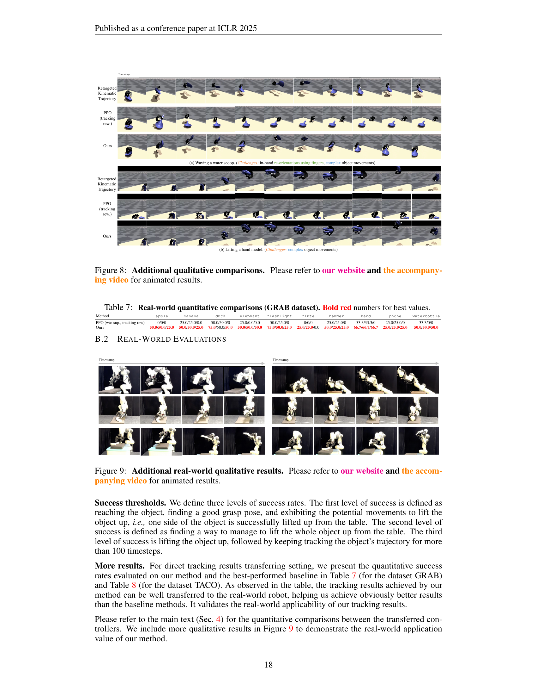

 


 2502.09614 
 Xueyi Liu et el. 
 
 🤗 2025-02-14 
 



↗ arXiv


↗ Hugging Face


↗ Papers with Code


### TL;DR



로봇이 다양한 물체를 능숙하게 조작하는 것은 로봇 공학 분야의 오랜 과제였습니다. 기존의 강화 학습이나 궤적 최적화 방법은 특정 작업에만 국한되거나 시스템 모델에 대한 정확한 정보가 필요하다는 한계가 있었습니다.  본 연구는 **인간의 손동작 데이터를 활용하여 이 문제를 해결하고자 합니다.**

본 논문에서는 DexTrack이라는 새로운 신경망 기반 제어 시스템을 제시합니다. DexTrack은 **인간의 손동작 데이터와 로봇의 행동을 짝지어 학습**하고, **데이터를 반복적으로 개선**하며, **강화 학습과 모방 학습을 결합**하여 로봇의 조작 성능을 높였습니다. 실험 결과, DexTrack은 기존 방법보다 성공률을 10% 이상 높였으며, 다양한 물체와 복잡한 움직임에도 강인한 성능을 보였습니다.  **이 연구는 로봇 조작 기술의 범용성과 안정성을 높이는 데 중요한 의미를 지닙니다.**



#### Key Takeaways


 인간의 손동작을 참고하여 일반화 가능한 로봇 손 제어 시스템을 개발했습니다. 



 강화 학습과 모방 학습을 결합하여 제어 성능을 향상시켰습니다. 



 새로운 경로 최적화 기법을 통해 고품질 학습 데이터를 확보했습니다. 


#### Why does it matter?
**본 논문은 인간의 숙련된 손동작을 모방하여 로봇 손의 움직임을 제어하는 새로운 신경망 기반 제어 시스템을 제시합니다.** 이는 로봇 조작 기술의 범용성과 안정성을 높이는 데 크게 기여하며, 다양한 물체 조작, 복잡한 움직임, 노이즈가 많은 데이터에 대한 로봇의 적응력을 향상시키는 데 중요한 의미를 지닙니다.  **향후 연구를 위한 새로운 방향을 제시하고, 로봇 조작 분야의 발전에 크게 기여할 것으로 예상됩니다.**

------
#### Visual Insights

> 🔼 그림 1은 DexTrack이 사람의 동작을 참고하여 물체 조작을 위한 일반화 가능한 신경망 기반 추적 제어기를 학습하는 과정을 보여줍니다. (a)는 입력된 궤적을 정확하게 추적하도록 운동학적 참고 데이터로부터 손의 동작 명령을 생성하는 과정을, (b)는 얇은 물체, 복잡한 움직임, 정교한 손 안의 조작 등 새로운 과제에도 일반화되는 능력을, (c)는 큰 운동학적 노이즈에 대한 강건성과 실제 환경에서의 유용성을 각각 보여줍니다. 주황색 사각형은 운동학적 참고 데이터를 나타냅니다.
> 

> 
read the caption

> Figure 1:  DexTrack  learns a generalizable neural tracking controller for dexterous manipulation from human references.  It generates hand action commands from kinematic references, ensuring close tracking of input trajectories (Fig. (a)), generalizes to novel and challenging tasks involving thin objects, complex movements and intricate in-hand manipulations (Fig. (b)), and demonstrates robustness to large kinematics noise and utility in real-world scenarios (Fig. (c)). Kinematic references are illustrated in orange rectangles and background.
> 


| Dataset | Method | $R_{err}$ (rad, ↓) | $T_{err}$ (cm, ↓) | $E_{wrist}$ (↓) | $E_{finger}$ (rad, ↓) | Success Rate (%, ↑) |
|---|---|---|---|---|---|---|
| GRAB | DGrasp | 0.4493 | 6.75 | 0.1372 | 0.6039 | 34.52/52.79 |
|  | PPO (OmniGrasp rew.) | 0.4404 | 6.69 | 0.1722 | 0.6418 | 35.53/54.82 |
|  | PPO (w/o sup., tracking rew.) | 0.3945 | 6.11 | **0.1076** | 0.5899 | 38.58/54.82 |
|  | Ours (w/o data, w/o homotopy) | 0.3443 | 7.81 | 0.1225 | *0.5218* | 39.59/57.87 |
|  | Ours (w/o data) | *0.3415* | *4.97* | 0.1483 | 0.5264 | *43.15*/ *62.44* |
|  | Ours | **0.3303** | **4.53** | *0.1118* | **0.5048** | **46.70**/ **65.48** |
| TACO | DGrasp | 0.5021 | 5.04 | **0.1129** | 0.4737 | 38.42/47.78 |
|  | PPO (OmniGrasp rew.) | 0.5174 | 5.43 | 0.1279 | 0.4945 | 33.5/46.31 |
|  | PPO (w/o sup., tracking rew.) | *0.4815* | 4.82 | *0.1195* | *0.4682* | 34.98/57.64 |
|  | Ours (w/o data, w/o homotopy) | **0.4444** | 2.33 | 0.1782 | 0.5438 | 44.83/67.00 |
|  | Ours (w/o data) | 0.4854 | *2.21* | 0.1698 | 0.4772 | *47.78*/ *72.41* |
|  | Ours | 0.4953 | **2.10** | 0.1510 | **0.4661** | **48.77**/ **74.38** |

> 🔼 표 1은 제시된 여러 방법들에 대한 정량적 평가 결과를 보여줍니다.  성능 지표는 각 방법의 로봇 움직임 추적 성공률, 각 관절의 오차, 물체의 회전 및 위치 오차 등을 포함합니다.  'Ours'는 제안된 방법을,  'Ours (w/o data)' 와 'Ours (w/o data, w/o homotopy)'는 각각 데이터 및 데이터와 호모토피 최적화 없이 제안된 방법을 적용한 결과를 나타냅니다.  굵은 빨간색은 최고 성능, 기울임꼴 파란색은 두 번째로 높은 성능을 나타냅니다.  이 표는 제안된 방법의 성능을 다른 방법들과 비교하고,  데이터와 호모토피 최적화의 영향을 분석하는 데 도움이 됩니다.  자세한 내용은 5장을 참조하세요.
> 

> 
read the caption

> Table 1:  Quantitative evaluations. Bold red and italic blue values for best and the second best-performed ones respectively. “Ours (w/o) data” and “Ours (w/o data, w/o homotopy)” are two ablated versions w.r.t. quality of robot tracking demonstrations used in imitation learning (see Section 5 for details).
> 

### In-depth insights

#### DexTrack Overview
DexTrack은 인간의 숙련된 손 동작을 참고하여 로봇 손의 움직임을 제어하는 **일반화 가능한 신경망 기반 추적 제어 시스템**입니다.  **인간의 손 동작 데이터를 통해 학습**하여 다양한 물체 조작 작업에 적응하고, **소음이나 예측 불가능한 상황에도 강인함**을 보입니다.  핵심은 **대규모 고품질 로봇 추적 데모 데이터**를 구축하고, **강화 학습과 모방 학습을 결합**하여 제어 성능을 향상시키는 것입니다. 또한, **호모토피 최적화 기법**을 통해 어려운 추적 과제를 해결하고 데모 데이터의 질과 다양성을 높입니다.  결과적으로, DexTrack은 기존 방법보다 **성공률이 10% 이상 향상**되었으며, **실제 환경에서도 효과적으로 작동**하는 것을 보여줍니다.  **다양한 물체와 복잡한 동작에도 일반화**가 잘 되는 **견고하고 적응력있는 시스템**임을 강조합니다.

#### Data-Driven Training
데이터 중심 학습은 **방대한 양의 데이터**를 활용하여 모델을 학습시키는 접근 방식입니다. 이는 기존의 지식이나 전문가의 의견에 의존하는 대신, 데이터 자체로부터 패턴과 통찰력을 추출하는 데 중점을 둡니다. **데이터의 질과 양**은 모델의 성능에 직접적인 영향을 미치며, **다양하고 대표적인 데이터** 확보가 중요합니다. 또한, 데이터 전처리 및 특징 추출 과정을 통해 데이터의 품질을 높이고 학습 효율을 개선할 수 있습니다. 데이터 중심 학습은 **자동화된 시스템 구축**에 유용하며, **지속적인 학습 및 개선**을 통해 모델의 성능을 향상시킬 수 있습니다. 하지만, **데이터 편향**이나 **개인 정보 보호** 문제 등의 고려사항도 존재합니다.

#### Homotopy Optimization
본 논문에서 제시된 호모토피 최적화 기법은 **복잡한 궤적 추적 문제를 단순한 부분 문제로 분해하여 해결하는 전략**을 취하고 있습니다.  이는 마치 산을 정복하는 여정을 여러 개의 작은 언덕을 넘는 것으로 나누는 것과 같습니다.  **각 부분 문제는 이전 단계에서 학습된 지식을 활용하여 효율적으로 해결**되며, 최종적으로 전체 궤적을 성공적으로 추적할 수 있도록 합니다.  **핵심 아이디어는 연속적인 변환(homotopy)을 통해 어려운 문제를 쉬운 문제로 점진적으로 변형시키는 것**이며, 이를 통해 복잡한 동역학이나 노이즈에 강건한 제어기를 개발하는 데 기여합니다.  **데이터 확보의 어려움을 극복하기 위한 데이터 증강 기법**으로도 활용될 수 있으며, **일반화 성능을 높이는 데 크게 기여**합니다.  하지만, 호모토피 경로 생성 자체의 복잡성과 계산 비용 증가는 개선의 여지가 있습니다.

#### Generalization Limits
본 논문에서 다루는 "일반화의 한계"는 **데이터셋의 다양성과 품질**에 크게 의존합니다.  **실제 세계의 복잡성을 완벽히 반영하는 데는 한계**가 있으며, **훈련 데이터에 포함되지 않은 새로운 물체나 상황**에는 제대로 대처하지 못할 수 있습니다.  특히, **복잡한 물체 조작이나 미묘한 손동작**은 일반화 성능에 큰 영향을 미치는 요인으로, 이러한 상황에 대한 충분한 훈련 데이터 확보가 중요합니다. 따라서, **더욱 광범위하고 다양한 데이터셋을 구축**하고, **데이터 증강 기법**을 활용하는 것이 일반화 성능 향상에 중요한 과제입니다.  또한, **모델의 아키텍처 및 훈련 방법** 개선을 통해 일반화 성능을 높일 수 있을 것입니다.  **모델의 내부 표현 학습 방식**과 **일반화를 위한 특징 추출 방식**에 대한 연구가 더 필요합니다.

#### Future Work
본 논문은 인간의 숙련된 손 동작을 모방하여 로봇 손의 물체 조작 능력을 향상시키는 데 중점을 두고 있습니다.  **미래 연구는 몇 가지 중요한 방향으로 나아갈 수 있습니다.**  **먼저, 더욱 다양하고 복잡한 작업에 대한 일반화 능력을 높이는 데 집중해야 합니다.**  현재 시스템은 제한된 작업 환경과 물체 종류에 대해서만 훈련되었기 때문에, 실제 환경에서의 다양한 상황에 대한 적응력을 높이는 것이 중요합니다.  **다음으로, 더욱 효율적인 학습 방법을 개발하는 것이 필요합니다.** 현재의 강화 학습 기반 방식은 많은 양의 데이터와 훈련 시간을 필요로 하기 때문에, 데이터 효율성을 높이고 훈련 시간을 단축할 수 있는 새로운 기술 개발이 요구됩니다.  **마지막으로, 실제 로봇 시스템과의 통합 및 실제 환경 적용을 위한 연구가 필요합니다.**  시뮬레이션 환경에서의 성공적인 결과는 실제 환경에서의 성공을 보장하지 않으므로, 실제 로봇 시스템에 적용하고 성능을 평가하는 것이 중요하며, 이를 통해 시스템의 실용성을 높일 수 있습니다.  **특히, 잡음이 많은 센서 데이터와 예측 불가능한 환경 변화에 대한 강인성을 확보하는 것이 중요한 과제입니다.**

### More visual insights

More on figures

> 🔼 그림 2는 본 논문에서 제안하는 DexTrack 모델의 동작 과정을 보여줍니다. DexTrack은 사람의 손 동작을 참고하여 물체 조작을 위한 일반화 가능한 신경망 기반 추적 제어기를 학습합니다.  DexTrack은 풍부하고 고품질의 로봇 추적 데모를 사용하여 추적 제어기를 학습하고, 동시에 호모토피 최적화 기법을 통해 추적 제어기를 사용하여 데이터를 개선하는 과정을 반복합니다.  즉, 고품질의 로봇 조작 데모를 통해 제어기를 학습시키고, 다시 학습된 제어기를 이용하여 더 나은 데모를 생성하는 과정을 반복적으로 수행합니다. 이러한 반복적인 과정을 통해 DexTrack은 다양한 물체 조작 작업에 대한 일반화 성능과 강인성을 향상시킵니다.
> 

> 
read the caption

> Figure 2: DexTrack   learns a generalizable neural tracking controller for dexterous manipulation from human references. It alternates between training the tracking controller using abundant and high-quality robot tracking demonstrations and improving the data via the tracking controller through a homotopy optimization scheme.
> 

> 🔼 그림 3은 비이상적인 상태(unreasonable states)에 대한 로봇의 견고성(robustness)을 보여줍니다.  즉, 로봇이 예상치 못한 상황이나 오류가 발생하더라도 작업을 성공적으로 수행할 수 있는지 보여주는 실험 결과입니다.  캡션에서 언급된 바와 같이, 애니메이션 결과는 웹사이트와 비디오에서 확인할 수 있습니다.  비디오를 통해 더욱 자세하게 로봇의 움직임과 상황 대처 능력을 확인할 수 있을 것입니다.
> 

> 
read the caption

> Figure 3: Robustness w.r.t. unreasonable states.  Please check our website and video for animated results.
> 

> 🔼 그림 4는 제안된 방법과 기존 방법의 비교를 시각적으로 보여주는 그림입니다. 다양한 물체 조작 작업(삽으로 휘젓기, 얇은 삽 사용, 작은 삽 흔들기, 망치 사용, 플루트 연주 등)에 대한 시뮬레이션 결과를 보여주며, 제안된 방법이 복잡하고 미묘한 동작을 포함한 다양한 작업에서 더 나은 성능을 보임을 시각적으로 보여줍니다.  비디오와 웹사이트에서 애니메이션 결과를 확인할 수 있습니다.
> 

> 
read the caption

> Figure 4: Qualitative comparisons.  Please check our website and the accompanying video for animated results.
> 

> 🔼 이 그림은 학습에 사용된 데모의 양에 따른 모델 성능의 변화를 보여줍니다.  데이터 증가에 따라 성공률이 향상되는 것을 보여주는 그래프입니다.  그래프의 x축은 전체 데모 데이터 중 사용된 비율을 나타내고, y축은 성공률을 나타냅니다. 이를 통해 데이터의 양이 모델 성능에 미치는 영향을 정량적으로 확인할 수 있습니다.
> 

> 
read the caption

> Figure 5: Scaling the amount of demonstrations.
> 

> 🔼 그림 6은 본 논문에서 제안하는 DexTrack 방법의 전체적인 구조를 보여줍니다. DexTrack은 사람의 손 동작을 참고하여 물체 조작을 위한 일반화 가능한 신경망 기반 추적 제어기를 학습합니다.  DexTrack은 풍부하고 고품질의 로봇 추적 데모를 사용하여 추적 제어기를 학습하는 단계와, 호모토피 최적화 기법을 통해 추적 제어기를 이용하여 데이터를 개선하는 단계를 반복합니다.  즉, 사람의 손 동작 데이터를 기반으로 로봇 제어기를 학습하고, 학습된 제어기를 이용하여 더욱 정확하고 다양한 로봇 동작 데이터를 생성하는 과정을 반복적으로 수행하여 성능을 향상시키는 구조입니다.  호모토피 최적화는 복잡한 추적 문제를 단순한 문제로 단계적으로 해결하여 더욱 다양하고 정확한 데모 데이터를 얻는 데 도움을 줍니다.
> 

> 
read the caption

> Figure 6: DexTrack learns a generalizable neural tracking controller for dexterous manipulation from human references. It alternates between training the tracking controller using abundant and high-quality robot tracking demonstrations, and improving the data via the tracking controller through a homotopy optimization scheme.
> 

> 🔼 그림 7은 모델의 강건성을 보여줍니다.  기존에 학습되지 않은 물체와 조작 방법을 사용하여 테스트한 결과를 보여주는 여러 비디오 클립을 포함하고 있습니다.  비디오에서 모델은 예상치 못한 상황에서도 성공적으로 물체를 조작하는 모습을 보여줍니다. 자세한 내용은 논문의 웹사이트와 함께 제공된 비디오를 참조하세요.
> 

> 
read the caption

> Figure 7:  Robustness towards out-of-distribution objects and manipulations.  Please refer to our website and the accompanying video for animated results.
> 

> 🔼 그림 8은 추가적인 정성적 비교 결과를 보여줍니다.  본 논문에서 제시된 방법과 기존 방법의 성능을 다양한 조작 과제에서 비교 분석합니다.  얇은 물체 조작, 복잡한 손 동작, 그리고 정교한 물체 조작 등 다양한 난이도의 과제에 대한 결과가 시각적으로 제시되어 있습니다. 자세한 애니메이션 결과는 논문 웹사이트와 함께 제공되는 동영상을 참조하십시오.
> 

> 
read the caption

> Figure 8:  Additional qualitative comparisons.  Please refer to our website and the accompanying video for animated results.
> 

> 🔼 이 그림은 실제 로봇으로 수행된 추가적인 정성적 결과를 보여줍니다.  그림에는 다양한 물체 조작 작업에 대한 로봇의 동작이 순차적으로 나열되어 있으며, 자세한 내용은 논문의 웹사이트와 함께 제공되는 동영상을 참조하라고 안내하고 있습니다. 동영상을 통해 더욱 자세한 동작들을 확인할 수 있습니다.
> 

> 
read the caption

> Figure 9:  Additional real-world qualitative results.  Please refer to our website and the accompanying video for animated results.
> 

> 🔼 이 그림은 실제 로봇 실험에서 발생한 실패 사례들을 보여줍니다.  간단히 말해, 로봇이 물체를 조작하는 동안 예상치 못한 접촉 변화로 인해 물체를 놓치는 경우를 보여줍니다.  자세한 내용은 논문의 웹사이트에서 애니메이션 결과를 참조하십시오.
> 

> 
read the caption

> Figure 10:  Failure cases in real-world experiments.  Please refer to our website for animated results.
> 

> 🔼 그림 11은 제안된 호모토피 최적화 기법의 효과를 보여줍니다. 호모토피 기법을 사용하지 않은 경우와 비교하여, 호모토피 기법을 사용한 경우 얇은 피리를 들어올리거나, 작은 구체를 옮기거나, 둥근 사과를 들어올리는 등 어려운 작업들을 성공적으로 수행하는 모습을 보여줍니다. 자세한 내용과 애니메이션 결과는 웹사이트와 동영상을 참조하십시오.
> 

> 
read the caption

> Figure 11:  Effectiveness of the homotopy optimization scheme.  Please refer to our website and the accompanying video for animated results.
> 

> 🔼 그림 12는 본 논문에서 제시된 방법의 실패 사례들을 보여줍니다. 간략한 캡션과 달리, 그림은 다양한 어려운 조작 상황에서의 실패 모습을 보여주는 여러 개의 이미지 또는 비디오 프레임으로 구성될 수 있습니다.  실패 원인을 분석하고, 향후 개선 방향을 제시하는 데 도움이 되는 시각적 자료입니다.  자세한 내용은 논문 웹사이트와 함께 제공되는 동영상을 참조하십시오.
> 

> 
read the caption

> Figure 12:  Failure Cases.  Please refer to our website and the accompanying video for animated results.
> 

> 🔼 그림 13은 TACO 데이터셋의 '본 적 있는 물체 범주'에 속하는 새로운 물체들의 예시를 보여줍니다.  이 그림은 논문에서 제시된 방법이 이미 학습된 범주 내에서 다양한 새로운 물체들을 얼마나 잘 처리하는지 보여주는 데 도움이 됩니다.  기존에 학습한 유사한 물체들과의 유사성을 바탕으로 새로운 물체들을 인식하고 조작하는 모델의 일반화 능력을 시각적으로 보여주는 역할을 합니다.
> 

> 
read the caption

> Figure 13:  Examples of novel objects from the seen object category (TACO).
> 

> 🔼 그림 14는 TACO 데이터셋에 있는 새로운 물체 종류의 예시를 보여줍니다.  기존 훈련 데이터에는 없던 새로운 모양과 종류의 물체들을 포함하여, 모델의 일반화 성능을 평가하는 데 사용되었습니다. 이 그림은 다양한 형태와 크기의 물체들이 포함되어 모델이 얼마나 다양한 물체들을 다룰 수 있는지 보여줍니다.  이는 모델의 견고성과 일반화 능력을 시험하는 데 중요한 부분입니다.
> 

> 
read the caption

> Figure 14:  Examples of objects from new object categories (TACO).
> 

> 🔼 이 그림은 논문의 실험 설정을 보여줍니다.  Franka 암과 LEAP 핸드를 사용하여 실제 환경에서 제어기를 평가하는 실험 설정을 보여줍니다.  실제 물체와 일상 생활에서 사용되는 물체를 사용하며,  RealSense 카메라를 통해 물체의 위치와 자세를 추정합니다. 이 설정은 제어기의 실제 환경 적용 가능성을 평가하기 위해 고안되었습니다.
> 

> 
read the caption

> Figure 15:  Real-world experiment setup.
> 

More on tables


| Method | apple | banana | duck | elephant | flashlight | flute | hammer | hand | phone | waterbottle |
|---|---|---|---|---|---|---|---|---|---|---|
| PPO (w/o sup., tracking rew) | 0/0/0 | 25.0/25.0/0.0 | 50.0/25.0/0 | 50.0/0.0/0.0 | 50.0/0/0 | 0/0/0 | 25.0/0/0 | 66.7/33.3/0 | 25.0/0/0 | 33.3/33.3/0 |
| Ours | **25.0**/0/0 | **50.0**/**50.0**/**25.0** | **75.0**/**50.0**/**25.0** | **75.0**/**50.0**/**50.0** | **50.0**/**25.0**/**25.0** | **25.0**/**25.0**/**25.0** | **50.0**/**50.0**/**50.0** | **66.7**/**33.3**/**33.3** | **50.0**/**50.0**/**25.0** | **50.0**/**33.3**/**33.3** |
> 🔼 표 2는 실제 환경에서의 정량적 비교 결과를 보여줍니다.  본 연구의 방법과 기존 방법들을 비교하여 다양한 물체 조작 과제에 대한 성공률을 제시합니다.  특히, 얇은 물체 조작이나 복잡한 손 동작과 같은 어려운 작업에 대한 성공률을 중점적으로 비교 분석합니다. 굵은 빨간색 숫자는 가장 좋은 성능을 나타냅니다.
> 

> 
read the caption

> Table 2:  Real-world quantitative comparisons. Bold red numbers for best values.
> 


| Weight | $w_{o,p}$ | $w_{o,q}$ | $w_{wrist} \\\cdot w_{trans}$ | $w_{wrist} \\\cdot w_{ornt}$ | $w_{finger}$ |
|---|---|---|---|---|---| 
| 1.0 | 0.33 | 0.3 | 0.05 | 0.05 |
> 🔼 이 표는 강화 학습 기반 제어기 훈련 시 사용되는 보상 함수의 각 구성 요소에 대한 가중치를 보여줍니다.  보상 함수는 로봇 손이 목표 위치를 얼마나 정확하게 추종하는지,  손과 물체 간의 상호 작용이 얼마나 부드러운지,  그리고 손가락의 움직임이 얼마나 자연스러운지를 평가합니다. 각 요소에 대한 가중치는 실험적으로 결정되며,  로봇 손의 제어 성능에 영향을 미칩니다.  즉, 각 요소의 중요도를 반영한 가중치를 부여하여 로봇 손의 움직임을 최적화합니다.
> 

> 
read the caption

> Table 3:  Weights of different reward components.
> 


| Dataset | Method | $R_{err}$ (rad, ↓) | $T_{err}$ (cm, ↓) | $E_{wrist}$ (↓) | $E_{finger}$ (rad, ↓) | Success Rate (%, ↑) |
|---|---|---|---|---|---|---|
| GRAB | PPO (w/o sup., tracking rew.) | 0.5813 | 6.03 | 0.1730 | 0.5439 | 36.04/55.84 |
| GRAB | Ours | **0.4515** | **4.82** | **0.14574** | **0.4574** | **42.64**/ **61.42** |
| TACO | PPO (w/o sup., tracking rew.) | 0.6751 | 6.37 | **0.1264** | 0.5443 | 21.67/50.25 |
| TACO | Ours | **0.4782** | **3.94** | 0.1329 | **0.4228** | **32.02**/ **62.07** |
> 🔼 표 4는 GRAB 및 TACO 데이터셋의 훈련 추적 작업을 사용하여 훈련된 모델에 대한 정량적 평가 및 비교 결과를 보여줍니다.  표에는 각 모델의 각도 오차(Rerr), 거리 오차(Terr), 손목 오차(Ewrist), 손가락 오차(Efinger) 및 성공률이 포함되어 있습니다.  굵은 빨간색 숫자는 최고 성능을 나타냅니다.
> 

> 
read the caption

> Table 4:  Quantitative evaluations and comparisons. Bold red numbers for best values. Models are trained on training tracking tasks from both the GRAB and the TACO datasets.
> 


| Test set | $R_{err}$ (rad, ↓) | $T_{err}$ (cm, ↓) | $E_{wrist}$ (↓) | $E_{finger}$ (rad, ↓) | Success Rate (%, ↑) |
|---|---|---|---|---|---| 
| S1 | 0.5787 | 2.43 | 0.1481 | 0.4703 | 35.97/67.63 |
| S2 | 0.6026 | 2.46 | 0.1455 | 0.4709 | 30.83/65.00 |
| S3 | 0.6508 | 8.06 | 0.1513 | 0.4683 | 10.18/46.32 |
> 🔼 TACO 데이터셋에서 모델의 일반화 성능을 평가한 표입니다.  다양한 난이도의 테스트셋(S1, S2, S3)에 대한 평균 오차(회전, 병진, 손목, 손가락)와 성공률을 보여줍니다. S1은 도구 기하학적 형태는 새롭지만 상호작용 방식은 기존 훈련 데이터에 있는 경우, S2는 상호작용 방식이 새롭지만 물체 범주는 기존 훈련 데이터에 있는 경우, S3는 물체 범주와 상호작용 방식 모두 새로운 경우의 테스트 결과를 나타냅니다.
> 

> 
read the caption

> Table 5:  Generalizability evaluations on the TACO dataset.
> 


| Proportion | $R_{err}$ (rad,↓) | $T_{err}$ (cm,↓) | $E_{wrist}$ (↓) | $E_{finger}$ (rad,↓) | Success Rate (%,↑) |
|---|---|---|---|---|---| 
| 0.0 | 0.4985 | 4.42 | 0.1435 | 0.4767 | 31.03/57.64 |
| 0.1 | **0.4730** | 3.86 | 0.1502 | 0.4921 | 36.45/59.61 |
| 0.3 | 0.4903 | 2.94 | **0.1256** | 0.4804 | 40.89/62.07 |
| 0.5 | 0.4749 | 2.51 | 0.1680 | 0.4682 | 41.38/67.00 |
| 0.9 | 0.4776 | 2.29 | 0.1437 | 0.4839 | 44.83/72.91 |
| 1.0 | 0.4953 | **2.10** | 0.1510 | **0.4661** | **48.77**/**74.38** |
> 🔼 이 표는 서로 다른 양의 시범 데이터로 훈련된 모델들의 성능을 비교 분석한 결과를 보여줍니다.  다양한 시범 데이터 양(데이터셋의 0%, 10%, 30%, 50%, 90%, 100%)에 따른 모델의 회전 오차(Rerr), 병진 오차(Terr), 손목 오차(Ewrist), 손가락 오차(Efinger), 성공률(Success Rate)을 정량적으로 비교하여 모델 성능에 미치는 시범 데이터 양의 영향을 분석합니다.  성능 지표는 각각 라디안(rad), 센티미터(cm), 성공률(%) 단위로 표시됩니다.
> 

> 
read the caption

> Table 6:  Performance comparisons across models trained with different amount of demonstration data.
> 


| Method | apple | banana | duck | elephant | flashlight | flute | hammer | hand | phone | waterbottle |
|---|---|---|---|---|---|---|---|---|---|---|
| PPO (w/o sup., tracking rew) | 0/0/0 | 25.0/25.0/0.0 | 50.0/50.0/0 | 25.0/0.0/0.0 | 50.0/25.0/0 | 0/0/0 | 25.0/25.0/0 | 33.3/33.3/0 | 25.0/25.0/0 | 33.3/0/0 |
| Ours | **50.0**/ **50.0**/ **25.0** | **50.0**/ **50.0**/ **25.0** | **75.0**/50.0/**50.0** | **50.0**/ **50.0**/ **50.0** | **75.0**/ **50.0**/ **25.0** | **25.0**/ **25.0**/0.0 | **50.0**/ **25.0**/ **25.0** | **66.7**/ **66.7**/ **66.7** | **25.0**/ **25.0**/ **25.0** | **50.0**/ **50.0**/ **50.0** |
> 🔼 표 7은 실제 환경에서 GRAB 데이터셋을 사용하여 수행한 정량적 비교 결과를 보여줍니다.  표에는 다양한 방법(PPO 기반 방법과 제안된 방법)을 사용하여 실제 로봇 핸드로 사물 조작을 수행했을 때의 성능을 비교 분석한 결과가 담겨 있습니다.  각 방법의 성공률, 오차(회전 및 병진) 등의 지표가 다양한 물체(사과, 바나나 등)에 대해 제시되어 있으며, 가장 우수한 성능을 보이는 결과는 굵은 빨간색으로 표시되어 있습니다. 이 표는 제안된 방법의 실제 환경 적용 가능성과 성능 우수성을 보여주는 중요한 근거자료입니다.
> 

> 
read the caption

> Table 7:  Real-world quantitative comparisons (GRAB dataset). Bold red numbers for best values.
> 


| Method | soap | shovel | brush | roller | knife | spoon |
|---|---|---|---|---|---|---|
| PPO (w/o sup., tracking rew) | 33.3/0/0 | 25.0/0.0/0.0 | 25.0/0/0 | 25.0/25.0/0.0 | 0/0/0 | 25.0/0/0 |
| Ours | **100.0**/ **66.7**/ **66.7** | **50.0**/ **25.0**/ **25.0** | **25.0**/ **25.0**/ 0.0 | **50.0**/ **25.0**/ **25.0** | **25.0**/ **25.0**/ 0.0 | **50.0**/ **50.0**/ **25.0** |
> 🔼 표 8은 실제 환경에서 수행된 정량적 비교 결과를 보여줍니다.  데이터셋은 TACO이며, 각 행은 다른 방법(PPO 기반 방법과 제안된 방법)의 성능을 나타냅니다. 각 열은 여러 물체(비누, 삽, 솔, 롤러, 칼, 수저 등)에 대한 성공률을 세 가지 기준(첫 번째 기준: 물체를 들어 올릴 수 있는 위치까지 옮기는 것, 두 번째 기준: 물체를 완전히 들어 올리는 것, 세 번째 기준: 물체를 100타임스텝 이상 추적하는 것)에 따라 나타냅니다. 가장 높은 성공률을 기록한 결과는 굵은 빨간색으로 표시됩니다. 이 표는 제안된 방법이 다양한 물체 조작 과제에서 기존 방법보다 더 나은 성능을 보임을 보여줍니다.
> 

> 
read the caption

> Table 8:  Real-world quantitative comparisons (TACO dataset). Bold red numbers for best values.
> 


|                   | Homotopy test (a) | Homotopy test (b) | Homotopy test (c) | Homotopy test (d) |
|-------------------|--------------------|--------------------|--------------------|--------------------|
| Effectiveness Ratio (%) | 64.0                | 56.0                | 28.0                | 52.0                |
> 🔼 본 표는 homotopy 경로 생성기의 일반화 성능을 평가하기 위한 실험 결과를 보여줍니다.  homotopy 경로 생성기를 학습하는 데 사용된 데이터셋의 분포와 다른 분포의 테스트 데이터셋에 대한 성능을 비교하여 일반화 능력을 평가합니다.  테스트는 네 가지 유형으로 수행되었으며, 각 유형에 대한 성공률이 표에 제시되어 있습니다.  이는  homotopy 경로 생성기가 다양한 유형의 작업에 얼마나 잘 적응할 수 있는지 보여주는 지표입니다.
> 

> 
read the caption

> Table 9:  Generalization experiments on the homotopy path generator.
> 


|Method|Time|
|---|---| 
|PPO (w/o sup)|~1 day|
|Ours (w/o prior., w/o curri.)|~2 days|
|Ours (w/o prior)|~4 days|
|Ours|~4 days|
> 🔼 표 10은 TACO 데이터셋을 사용하여 훈련하는 데 걸리는 총 시간을 보여줍니다.  다양한 방법(PPO 기반 방법과 제안된 DexTrack 방법의 여러 변형 포함)에 따른 훈련 시간이 일, 시간, 분 단위로 자세히 제시되어 있습니다. 이 표는 서로 다른 방법의 계산 비용과 효율성을 비교하는 데 유용한 정보를 제공합니다.  특히, 데이터 수집, 전처리 및 모델 훈련에 필요한 시간을 보여줍니다.
> 

> 
read the caption

> Table 10:  Total training time consumption (TACO dataset).
> 


| Method | DGrasp | PPO (OmniGrasp rew.) | PPO (w/o sup., tracking rew.) | Ours (w/o data, w/o homotopy) | Ours (w/o data) | Ours |
|---|---|---|---|---|---|---|
| sg | 2.424 | 2.389 | 2.688 | 2.725 | 3.050 | **3.251** |
> 🔼 표 11은 GRAB 데이터셋에서 일반화 점수를 보여줍니다.  일반화 점수는 훈련 데이터와 테스트 데이터의 분포 차이와 모델의 성능 차이를 바탕으로 계산됩니다. 훈련 데이터의 분포와 테스트 데이터의 분포 사이의 차이가 클수록, 그리고 테스트 데이터에서 모델의 성능이 좋을수록 일반화 점수는 더 높아집니다. 표에서 볼 수 있듯이, 제안된 방법(Ours)이 다른 방법들에 비해 일반화 점수가 가장 높습니다.  이는 제안된 방법이 다양한 상황에서도 잘 작동한다는 것을 보여줍니다.  표에는 여러 가지 변형된 방법들의 결과도 함께 제시되어 있으며, 이는 제안된 방법의 각 구성 요소가 성능에 미치는 영향을 분석하는 데 도움이 됩니다.  굵은 빨간색 숫자는 각 열에서 가장 좋은 성능을 나타냅니다.
> 

> 
read the caption

> Table 11:  Generlaization score (GRAB dataset). Bold red numbers for best values.
> 


| Method | PPO (w/o sup., tracking rew.) | Ours |
|---|---|---|
| <math alttext="{s_{r}}" class="ltx_Math" display="inline" id="A3.T12.1.1.1.m1.1"><semantics id="A3.T12.1.1.1.m1.1a"><msub id="A3.T12.1.1.1.m1.1.1" xref="A3.T12.1.1.1.m1.1.1.cmml"><mi id="A3.T12.1.1.1.m1.1.1.2" mathcolor="#000000" xref="A3.T12.1.1.1.m1.1.1.2.cmml">s</mi><mi id="A3.T12.1.1.1.m1.1.1.3" mathcolor="#000000" xref="A3.T12.1.1.1.m1.1.1.3.cmml">r</mi></msub><annotation-xml encoding="MathML-Content" id="A3.T12.1.1.1.m1.1b"><apply id="A3.T12.1.1.1.m1.1.1.cmml" xref="A3.T12.1.1.1.m1.1.1"><csymbol cd="ambiguous" id="A3.T12.1.1.1.m1.1.1.1.cmml" xref="A3.T12.1.1.1.m1.1.1">subscript</csymbol><ci id="A3.T12.1.1.1.m1.1.1.2.cmml" xref="A3.T12.1.1.1.m1.1.1.2">𝑠</ci><ci id="A3.T12.1.1.1.m1.1.1.3.cmml" xref="A3.T12.1.1.1.m1.1.1.3">𝑟</ci></apply></annotation-xml><annotation encoding="application/x-tex" id="A3.T12.1.1.1.m1.1c">{s_{r}}</annotation><annotation encoding="application/x-llamapun" id="A3.T12.1.1.1.m1.1d">italic_s start_POSTSUBSCRIPT italic_r end_POSTSUBSCRIPT</annotation></semantics></math> | 2.665 | **3.276** |
> 🔼 표 12는 GRAB 데이터셋에서 계산된 강건성 점수를 보여줍니다.  강건성 점수는 고품질 동작 데이터와 잡음이 포함된 동작 데이터에서의 성능 차이를 측정하여 계산됩니다.  표에는 다양한 방법들의 강건성 점수가 제시되어 있으며, 굵은 빨간색 숫자는 가장 높은 점수를 나타냅니다. 이를 통해 각 모델의 잡음에 대한 강건성을 비교하고 평가할 수 있습니다.
> 

> 
read the caption

> Table 12:  Robustness score (GRAB dataset). Bold red numbers for best values.
> 


| Method | PPO (w/o sup., tracking rew.) | Ours |
|---|---|---|
| <math alttext="{s_{a}}" class="ltx_Math" display="inline" id="A3.T13.1.1.1.1.m1.1"><semantics id="A3.T13.1.1.1.1.m1.1a"><msub id="A3.T13.1.1.1.1.m1.1.1" xref="A3.T13.1.1.1.1.m1.1.1.cmml"><mi id="A3.T13.1.1.1.1.m1.1.1.2" mathcolor="#000000" xref="A3.T13.1.1.1.1.m1.1.1.2.cmml">s</mi><mi id="A3.T13.1.1.1.1.m1.1.1.3" mathcolor="#000000" xref="A3.T13.1.1.1.1.m1.1.1.3.cmml">a</mi></msub><annotation-xml encoding="MathML-Content" id="A3.T13.1.1.1.1.m1.1b"><apply id="A3.T13.1.1.1.1.m1.1.1.cmml" xref="A3.T13.1.1.1.1.m1.1.1"><csymbol cd="ambiguous" id="A3.T13.1.1.1.1.m1.1.1.1.cmml" xref="A3.T13.1.1.1.1.m1.1.1.1"><annotation encoding="application/x-tex">{s_{a}}</annotation></csymbol><ci id="A3.T13.1.1.1.1.m1.1.1.2.cmml" xref="A3.T13.1.1.1.1.m1.1.1.2">𝑠</ci><ci id="A3.T13.1.1.1.1.m1.1.1.3.cmml" xref="A3.T13.1.1.1.1.m1.1.1.3">𝑎</ci></apply></annotation-xml><annotation encoding="application/x-tex" id="A3.T13.1.1.1.1.m1.1c">{s_{a}}</annotation><annotation encoding="application/x-llamapun" id="A3.T13.1.1.1.1.m1.1d">italic_s start_POSTSUBSCRIPT italic_a end_POSTSUBSCRIPT</annotation></semantics></math> | 0.317/0.098/0.0 | **0.537**/**0.415**/**0.293** |
> 🔼 표 13은 GRAB 데이터셋을 사용하여 적응성 점수를 보여줍니다.  적응성 점수는 동적 환경에서의 성능 변화를 측정하기 위해 고품질 동작 데이터와 잡음이 있는 동작 데이터에서의 성능 차이를 계산하여 얻어집니다.  표에는 세 가지 측정값 (매끄러움, 일관성, 관통) 이 포함되어 있으며, 각 측정값은 운동 학적 궤적의 질을 나타냅니다.  적응성 점수가 높을수록 로봇이 잡음이 있는 데이터나 예상치 못한 상황에도 잘 적응한다는 것을 의미합니다.  표에서 굵은 빨간색 숫자는 가장 좋은 결과를 나타냅니다.
> 

> 
read the caption

> Table 13:  Adaptativity score (GRAB dataset). Bold red numbers for best values.
> 


| Method | PPO (w/o sup., tracking rew.) | Ours |
|---|---|---|
| <math alttext="{s_{a}}" class="ltx_Math" display="inline" id="A3.T14.1.1.1.m1.1"><semantics id="A3.T14.1.1.1.m1.1a"><msub id="A3.T14.1.1.1.m1.1.1" xref="A3.T14.1.1.1.m1.1.1.cmml"><mi id="A3.T14.1.1.1.m1.1.1.2" mathcolor="#000000" xref="A3.T14.1.1.1.m1.1.1.2.cmml">s</mi><mi id="A3.T14.1.1.1.m1.1.1.3" mathcolor="#000000" xref="A3.T14.1.1.1.m1.1.1.3.cmml">a</mi></msub><annotation-xml encoding="MathML-Content" id="A3.T14.1.1.1.m1.1b"><apply id="A3.T14.1.1.1.m1.1.1.cmml" xref="A3.T14.1.1.1.m1.1.1"><csymbol cd="ambiguous" id="A3.T14.1.1.1.m1.1.1.1.cmml" xref="A3.T14.1.1.1.m1.1.1">subscript</csymbol><ci id="A3.T14.1.1.1.m1.1.1.2.cmml" xref="A3.T14.1.1.1.m1.1.1.2">𝑠</ci><ci id="A3.T14.1.1.1.m1.1.1.3.cmml" xref="A3.T14.1.1.1.m1.1.1.3">𝑎</ci></apply></annotation-xml><annotation encoding="application/x-tex" id="A3.T14.1.1.1.m1.1c">{s_{a}}</annotation><annotation encoding="application/x-llamapun" id="A3.T14.1.1.1.m1.1d">italic_s start_POSTSUBSCRIPT italic_a end_POSTSUBSCRIPT</annotation></semantics></math> | 0.317/0.098/0.0 | **0.537**/**0.415**/**0.293** |
> 🔼 표 14는 GRAB 데이터셋에 대한 일반화 점수를 보여줍니다.  각 모델의 일반화 성능을 정량적으로 평가하기 위해, 훈련 데이터와 테스트 데이터 간의 분포 차이와 모델의 성능 차이를 측정하여 일반화 점수를 계산했습니다.  표에서 볼 수 있듯이, 제안된 방법(Ours)이 다른 방법들에 비해 훨씬 높은 일반화 점수를 달성하여, 새로운 상황이나 데이터에 대한 적응력이 뛰어남을 보여줍니다. 굵은 빨간색 숫자는 가장 좋은 성능을 나타냅니다.
> 

> 
read the caption

> Table 14:  Generlaization score (GRAB dataset). Bold red numbers for best values.
> 


| Parameter | <math>s_{smooth}^{o}(m \cdot s^{-2})</math> | <math>v_{contact}</math> | <math>s_{shape}(cm^{-1})</math> |
|---|---|---|---|
| GRAB | 3.426 | 1.641 | 0.275 |
| TACO | 1.978 | 2.285 | 0.497 |
> 🔼 표 15는 GRAB 및 TACO 데이터셋의 트래젝토리 어려움 정도를 나타내는 통계량을 보여줍니다.  세 가지 측정 지표, 즉 객체 움직임의 부드러움(Ssmooth), 손-객체 접촉 변화 속도(Ucontact), 객체 모양 점수(Sshape)를 사용하여 트래젝토리의 어려움을 정량화합니다.  각 측정 지표는 트래젝토리의 복잡성과 어려움 정도를 나타내는 값을 제공합니다. 높은 Ssmooth, Ucontact, Sshape 값은 트래젝토리가 더 어렵다는 것을 시사합니다. 이 표는 GRAB 데이터셋의 트래젝토리가 TACO 데이터셋보다 더 어려운 경향이 있음을 보여줍니다.
> 

> 
read the caption

> Table 15:  Trajectory difficulty statistics.
> 

### Full paper



