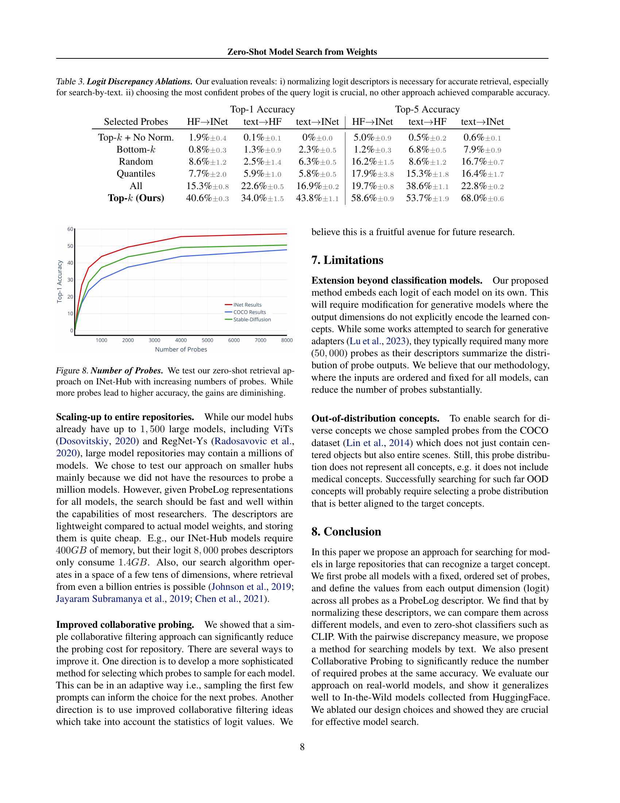

 


 2502.09619 
 Jonathan Kahana et el. 
 
 🤗 2025-02-14 
 



↗ arXiv


↗ Hugging Face


↗ Papers with Code


### TL;DR



현재 공개적으로 사용 가능한 사전 훈련된 모델의 수가 급증하고 있지만, 기존의 모델 검색 방법은 부족하여 **관련 모델을 찾는 데 어려움**을 겪고 있습니다. 대부분의 모델은 제대로 된 메타데이터나 설명이 없기 때문에 텍스트 기반 검색만으로는 원하는 모델을 찾기 어렵습니다.

본 논문에서는 ProbeLog라는 새로운 방법을 제시합니다. ProbeLog는 **모델의 메타데이터나 훈련 데이터에 접근하지 않고도, 모델 가중치만을 이용하여 목표 개념을 인식하는 모델을 검색**합니다.  특히, 각 모델의 출력 차원(logit)별로 설명자(descriptor)를 계산하고, 이를 활용하여 유사한 logit을 찾거나, 텍스트 기반으로 제로샷 검색을 수행합니다. 또한, **협업 필터링 기반의 Collaborative Probing**을 통해 대규모 모델 저장소에서도 효율적인 검색이 가능하도록 합니다.



#### Key Takeaways


 ProbeLog는 모델 메타데이터나 훈련 데이터 없이 **모델 가중치를 기반으로 목표 개념을 인식하는 분류 모델을 검색**하는 새로운 방법입니다. 



 ProbeLog는 **logit 단위의 표현**을 사용하여 모델의 기능적 특성을 포착하고, **텍스트 기반 검색**도 지원합니다. 



 협업 필터링을 활용한 **Collaborative Probing** 기법으로 대규모 모델 저장소에서도 효율적인 검색이 가능합니다.   


#### Why does it matter?
본 논문은 **방대한 사전 훈련된 모델 저장소에서 특정 개념을 인식하는 모델을 효율적이고 효과적으로 검색하는 새로운 방법**을 제시하여, 기존의 제한적인 모델 검색 방법의 한계를 극복하고 연구자들에게 큰 영향을 미칠 수 있습니다. **모델의 메타데이터나 훈련 데이터에 접근하지 않고도 모델 가중치를 기반으로 검색**할 수 있다는 점에서 혁신적이며, 앞으로 모델 검색 및 활용 방식에 큰 변화를 가져올 수 있습니다. 또한, **협업 필터링 기반의 새로운 방법**을 제시하여 대규모 모델 저장소에서도 효율적인 검색을 가능하게 하였습니다. 따라서, 본 연구는 모델 검색 분야의 발전에 크게 기여할 뿐만 아니라, 다양한 응용 분야에서 사전 훈련된 모델을 더욱 효과적으로 활용하는 데 기여할 수 있습니다.

------
#### Visual Insights

> 🔼 그림 1은 Hugging Face 모델 카드 분석 결과를 보여줍니다.  Hugging Face는 120만 개 이상의 모델을 보유하고 있는 대규모 모델 저장소인데, 이 연구에서는 그 중 120만 개 모델의 모델 카드를 분석했습니다. 분석 결과, 대다수 모델이 제대로 설명되지 않았거나, 문서화가 부실한 것으로 나타났습니다.  즉, 모델에 대한 정보가 부족하여 사용자가 원하는 모델을 찾기 어려운 현실을 보여줍니다. 이는 본 논문에서 제시하는 새로운 모델 검색 방법의 필요성을 강조하는 부분입니다.
> 

> 
read the caption

> Figure 1: Hugging Face Documentation. We analyze the model cards of 1.2⁢M1.2𝑀1.2M1.2 italic_M Hugging Face models. We discover that the majority of models are either undocumented or poorly documented.
> 


| (a) GT | (b) Out-of-Dist. | (c) In-Dist. |
|---|---|---|
| https://arxiv.org/html/2502.09619/figs/cifar_GT.png | https://arxiv.org/html/2502.09619/figs/cifar_COCO_squared_cosine_sims.png | https://arxiv.org/html/2502.09619/figs/cifar_squared_cosine_sims.png |

> 🔼 표 1은 본 논문에서 제안하는 방법과 기준 방법들을 사용하여 logit 기반 검색과 텍스트 기반 검색에 대한 상위 1개 및 상위 5개 검색 정확도를 평가한 결과를 보여줍니다. 모든 방법은 COCO 이미지를 프로브(probe)로 사용했으며, 공정한 비교를 위해 모든 실험은 4,000개의 프로브를 사용하여 수행되었습니다.  표에는 INet에서 INet 검색, INet에서 HF 검색, HF에서 INet 검색,  그리고 텍스트 기반 검색 결과(INet, HF)에 대한 상위 1개 정확도와 상위 5개 정확도가 제시되어 있습니다.
> 

> 
read the caption

> Table 1: Retrieval Results. We evaluate the Top-1 and Top-5 retrieval accuracies of our method and the baselines for search-by-logit and search-by-text. All methods use COCO images as probes. For a fair comparison, all experiments are performed with 4,00040004,0004 , 000 probes.
> 

### In-depth insights

#### Zero-Shot Model Search
본 논문은 **영(Zero-Shot)** 방식으로 사전 훈련된 모델들을 검색하는 새로운 방법을 제시합니다. 기존의 메타데이터나 훈련 데이터에 의존하는 방법과 달리, ProbeLog라는 방법을 통해 모델의 가중치(weights)만을 이용하여 목표 개념(예: “강아지”)을 인식하는 모델을 찾아냅니다.  **각 출력 차원(logit)에 대한 독립적인 기술자(descriptor)를 계산**하여 유사한 로짓을 가진 모델들을 검색하거나, 텍스트 기반 검색을 통해 개념에 맞는 모델을 찾을 수 있습니다.  **협업 필터링(collaborative filtering)** 기법을 사용하여 효율성을 높였으며, 실제 데이터셋에서 높은 검색 정확도를 달성했습니다.  **가중치 공간 학습(weight-space learning)** 및 **모델 가중치 활용(model weight applications)** 분야에 기여하며, 모델 검색의 패러다임 전환을 시사합니다.  **프로브(probe) 선택 및 유사도 측정 방식**에 대한 심도있는 연구도 진행되어, 시스템의 성능 향상에 기여하였습니다. 이 방법은 대규모 모델 저장소에서 효율적이고 정확한 모델 검색을 가능하게 합니다.

#### ProbeLog: Logit Retrieval
ProbeLog의 Logit 검색 방법은 **모델의 가중치에 직접 접근하지 않고** 각 출력 차원(logit)에 대한 기능적 표현을 생성하여 모델 검색을 수행하는 참신한 접근 방식입니다.  **고정된 입력 집합(probes)을 사용하여 각 logit의 응답을 관찰**하고, 이를 정규화하여 모델의 기능적 특징을 나타내는 ProbeLog 기술자를 생성합니다. 이는 기존의 메타데이터 기반 검색이나 모델 전체를 나타내는 표현 방식보다 **목표 개념에 대한 민감도가 높고, 모델 출력 클래스의 순서에 불변**하며, 대규모 모델 저장소에 확장 가능하다는 장점을 지닙니다. 특히, **텍스트 기반 제로샷 검색**을 위해 CLIP과 같은 텍스트 정렬 모델을 활용하여 텍스트 프롬프트에 대한 ProbeLog 기술자를 생성하는 방식은 모델 메타데이터가 부족한 상황에서도 효과적으로 관련 모델을 검색할 수 있도록 합니다.  **협업 필터링 기법을 활용한 Collaborative Probing**은 여러 모델을 효율적으로 인코딩하여 비용을 크게 줄이는 동시에 높은 검색 정확도를 유지합니다.

#### Collaborative Probing
본 논문에서 제시된 '협업적 탐색(Collaborative Probing)' 기법은 **모델 저장소에 있는 모든 모델을 모든 프로브(probe)로 탐색하는 비용을 줄이기 위한 효율적인 전략**입니다.  기존의 방식대로라면 모든 모델을 모든 프로브로 탐색하는 것은 계산적으로 매우 비용이 많이 들기 때문에, 이 기법은 **일부 프로브만을 무작위로 선택하여 각 모델을 탐색**하고, 그 결과를 **행렬 분해(matrix factorization) 기반의 협업 필터링(collaborative filtering)**을 통해 보완하여 전체적인 모델 표현을 완성합니다.  **이러한 방식은 전체 프로브 수를 크게 줄이면서도 높은 검색 정확도를 유지**할 수 있으며, 대규모 모델 저장소에 효율적으로 적용될 수 있다는 점에서 큰 의의를 지닙니다. **결과적으로, 협업적 탐색은 계산 비용을 최소화하면서 모델 검색의 효율성과 정확성을 극대화**하는 데 기여합니다.  **특히, 대규모 모델 저장소에서의 적용 가능성과 확장성**에 초점을 맞춰 설계되었다는 점에서 실용적인 가치가 높이 평가됩니다.

#### Ablation Study: Probes
본 논문의 "Ablation Study: Probes" 섹션은 **탐침(probe)의 선택이 모델 검색 성능에 미치는 영향**을 심층적으로 분석한 부분으로 예상됩니다.  다양한 탐침 데이터셋(예: COCO, ImageNet, Stable Diffusion)을 사용하여 실험을 진행하고, 각 데이터셋의 특징과 모델 검색 정확도 간의 상관관계를 규명했을 것입니다.  특히, **모델 학습 데이터와 유사한 분포를 가진 탐침 데이터셋을 사용했을 때 더 높은 정확도**를 달성했을 것으로 예상되며, 이는 **탐침 데이터셋의 선택이 모델 검색의 핵심 요소임**을 시사합니다.  또한, 탐침의 수가 검색 성능에 미치는 영향, 탐침 선택 전략(예: 무작위 선택, 특정 기준에 따른 선택)에 따른 성능 변화 등에 대한 분석도 포함되었을 것으로 예상됩니다.  **제한된 자원 내에서 효율적인 탐침 전략을 수립하는 방법** 또한 중요한 연구 주제였을 것으로 보이며, 이를 통해 대규모 모델 저장소에서의 효율적인 모델 검색을 가능하게 하는 실용적인 방안을 제시했을 가능성이 큽니다.

#### Future Research
본 논문에서 제시된 ProbeLog 방법은 모델 검색 분야에 있어 획기적인 발전이지만, **여전히 개선의 여지가 많다**.  **더욱 다양한 모델 아키텍처와 데이터 모드에 대한 적용성을 확장**하는 것은 중요한 미래 연구 과제이다.  **특히, 생성 모델과 같은 비분류 모델에 대한 확장**은 ProbeLog의 활용 범위를 크게 넓힐 수 있을 것이다. 또한, **프로브(probe) 선택 전략의 개선**을 통해 검색 효율성을 높이고, **협업 프로빙(collaborative probing) 기법의 성능 향상**을 위한 연구도 필요하다.  **대규모 모델 저장소에 대한 확장성 테스트 및 최적화**도 중요한 미래 연구 주제이다.  마지막으로, **다양한 유사도 측정 방법에 대한 비교 분석**과 **제로샷 검색 성능 향상**을 위한 추가적인 연구가 필요하다. 이러한 연구들을 통해 ProbeLog의 실용성과 효율성을 더욱 향상시킬 수 있을 것이다.

### More visual insights

More on figures

> 🔼 그림 2는 분류 모델 검색이라는 새로운 과제를 보여줍니다. 이 과제의 목표는 특정 개념(예: '강아지')을 인식할 수 있는 분류기를 찾는 것입니다.  간단히 말해, '강아지'와 같은 입력 프롬프트가 주어지면, 그 클래스 중 하나가 '강아지'인 모든 분류기를 검색하는 것입니다. 검색 공간은 많은 모델과 개념을 포함하는 대규모 모델 저장소입니다. 검색된 모델은 모델 훈련을 대체하여 정확도를 높이고 비용과 환경적 영향을 줄일 수 있습니다.
> 

> 
read the caption

> Figure 2: Classification Model Search. We present a new task of Classification Model Search, where the goal is to find classifiers that can recognize a target concept. Concretely, given an input prompt, such as “Dog”, we wish to retrieve all classifiers that one of their classes is “Dog”. The search space is a large model repository, that contains many models and concepts to search from. The retrieved models can replace model training, increasing accuracy, reducing cost and environmental impact.
> 

> 🔼 그림 3은 ProbeLog 기술을 설명하는 그림입니다. ProbeLog는 모델의 개별 출력 차원(logits)에 대한 기술자를 생성하는 방법입니다. 먼저 COCO 데이터셋과 같은 입력 데이터 집합을 샘플링하고 이를 프로브(probe)로 고정합니다. 그런 다음, 특정 모델 로짓에 대한 새로운 ProbeLog 기술자를 생성하기 위해 순서대로 정렬된 프로브들을 모델에 입력하고 출력값을 관찰합니다. 마지막으로, 표현하고자 하는 로짓의 모든 값들을 정규화합니다. 이렇게 생성된 표현을 사용하여 유사한 개념과 관련된 모델 로짓들을 정확하게 검색할 수 있습니다. 그림 5에서는 이러한 아이디어를 제로샷 개념 기술자로 확장하는 방법을 보여줍니다.
> 

> 
read the caption

> Figure 3: ProbeLog Descriptors. Our method generates a descriptor for individual output dimensions (logits) of models. First, we sample and a set of inputs (e.g., from the COCO dataset), and fix them as our set of probes. Then, to create a new ProbeLog descriptor for a model logit, we feed the set of ordered probes nto the model and observe their outputs. Finally, we take all values of the logit we wish to represent, and normalize them. We use this representation to accurately retrieve model logits associated with similar concepts. In Fig. 5, we extend this idea to zero-shot concept descriptors.
> 

> 🔼 그림 4는 CIFAR-10 데이터셋에서 모델의 로짓(logit) 유사성을 시각적으로 보여줍니다. (a)는 정답 레이블을 나타내고, (b)는 COCO 데이터셋의 1,000개의 이미지를 사용하여 계산된 ProbeLog 표현을, (c)는 CIFAR-10 데이터셋의 1,000개의 이미지를 사용하여 계산된 ProbeLog 표현을 각각 보여줍니다.  ProbeLog는 모델의 출력 차원(로짓)에 대한 기술자를 생성하는 방법입니다.  (b)와 (c) 모두 의미있는 유사성을 보여주지만,  CIFAR-10 데이터셋 (c) 처럼 모델의 학습 데이터셋과 일치하는 이미지를 사용했을 때 유사성이 더욱 명확하게 나타남을 확인할 수 있습니다.  이는 ProbeLog가 모델의 기능을 효과적으로 나타내는 데 사용될 수 있음을 시사합니다.
> 

> 
read the caption

> Figure 4: CIFAR10 Logit Similarities.(a) Ground truth label. (b) ProbeLog representations using 1,00010001,0001 , 000 out-of-distribution COCO image probes. (c) ProbeLog representations using 1,00010001,0001 , 000 in-distribution CIFAR10 image probes. Both find meaningful similarities, although in-distribution probes work better.
> 

> 🔼 그림 5는 제로샷 개념 검색을 위한 텍스트 정렬 ProbeLog 표현 방법을 보여줍니다. 먼저, 주어진 순서대로 된 여러 개의 탐침(probe)을 CLIP 이미지 인코더를 사용하여 인코딩하고 저장합니다. 추론 시에는 대상 텍스트 프롬프트를 임베딩하고 저장된 탐침 표현과의 유사도를 계산합니다. 이렇게 생성된 제로샷 ProbeLog 기술자를 정규화하면 실제 모델 로짓 기술자를 효과적으로 검색하여 유사한 개념을 정확하게 검색할 수 있음을 보여줍니다.
> 

> 
read the caption

> Figure 5: Text-Aligned ProbeLog Representation. We present a method to create ProbeLog-like representations for text prompts. We encode and store each of our ordered probes using the CLIP image encoder. At inference time, we embed the target text prompt, and compute its similarity with respect to the stored probe representations. We demonstrate that by normalizing this zero-shot ProbeLog descriptor, we can effectively search descriptors of real model logits, accurately retrieving similar concepts.
> 

> 🔼 그림 6은 Collaborative Probing 기법을 설명합니다. 전체 모델 저장소에 있는 모든 모델에 모든 프로브를 적용하는 대신, 무작위로 선택된 일부 프로브만 각 모델에 적용합니다. 이렇게 하면 부분적인 로짓 표현을 얻을 수 있습니다. 그런 다음, 행렬 분해를 기반으로 한 imputation 기법을 사용하여 누락된 정보를 채움으로써 전체 로짓 표현을 얻습니다. 이 방법은 저장소의 로짓 기술자 갤러리를 구축하는 데 필요한 막대한 계산 자원을 상당히 절약할 수 있습니다.
> 

> 
read the caption

> Figure 6: Collaborative Probing. We pass a random subset of probes through each model in the repository to obtain partial logit representations. By performing factorization based matrix imputation we can complete the missing information. This saves a substantial part of the computational resources needed to build our repository’s logit descriptors gallery.
> 

> 🔼 그림 7은 Collaborative Probing 기법을 사용하여 INet-Hub 검색 작업에서 텍스트 기반 모델 검색 성능을 평가한 결과를 보여줍니다. 전체 데이터셋에는 8,000개의 COCO probe가 사용되었지만, 그림에서는 각 모델에 대해 전체 probe의 15% 미만만 사용한 경우를 보여줍니다. 제한된 probe를 사용하는 경우에도 Collaborative Probing을 통해 정확도가 최대 2배까지 향상될 수 있음을 보여줍니다. 이는 효율성을 높이면서도 성능 저하 없이 모델 검색을 수행할 수 있음을 시사합니다.
> 

> 
read the caption

> Figure 7: Collaborative Probing. We test our method using collaborative probing on the text →→\rightarrow→ INet-Hub retrieval task. While the full size of the dataset is 8,00080008,0008 , 000 COCO probes, we show cases where each model is probed by less than 15%percent1515\%15 % of these probes. We can see that for the limited probe regime, collaborative probing can improve accuracy by as much as 2×2\times2 ×.
> 

More on tables


| Retrieval | Method | INet → INet | INet → HF | HF → INet | text → HF | text → INet |
|---|---|---|---|---|---|---|
| Top-1 | Full Query | 59.9% ± 0.2 | 14.8% ± 0.1 | 15.3% ± 0.8 | 22.6% ± 0.5 | 16.9% ± 0.2 |
| Accuracy | Model-Level | 0% ± 0. | 13.9% ± 1.0 | 21.0% ± 1.8 | 17.8% ± 1.5 | 0% ± 0.0 |
|  | **Ours (ProbeLog)** | 72.8% ± 0.2 | 26.1% ± 0.8 | 40.6% ± 0.3 | 34.0% ± 1.5 | 43.8% ± 1.1 |
| Top-5 | Full Query | 82.8% ± 0.1 | 31.5% ± 0.1 | 19.7% ± 0.8 | 38.6% ± 1.1 | 22.8% ± 0.2 |
| Accuracy | Model-Level | 0% ± 0. | 34.6% ± 0.6 | 51.6% ± 2.0 | 38.8% ± 1.8 | 0% ± 0.0 |
|  | **Ours (ProbeLog)** | 92.6% ± 0.1 | 43.6% ± 0.5 | 58.6% ± 0.9 | 53.7% ± 1.9 | 68.0% ± 0.6 |
> 🔼 표 2는 다양한 프로브 데이터셋을 사용했을 때 모델 검색 성능에 대한 실험 결과를 보여줍니다.  실험은 모델의 학습 데이터와 유사한 분포를 가진 프로브 데이터셋일수록 더 높은 정확도를 보이는 것을 확인했습니다. 하지만 COCO 데이터셋처럼 학습 데이터와 다른 분포의 프로브 데이터셋을 사용하더라도 여전히 높은 정확도를 얻을 수 있음을 보여줍니다. 이는 제안된 방법이 다양한 상황에서도 효과적임을 시사합니다.
> 

> 
read the caption

> Table 2: Dataset Ablations. We compare both real and synthetic probe distributions. While distributions closer to the model’s training data lead to better results, even out-of-distribution probes sampled from the COCO dataset retrieve relevant logits with high accuracy.
> 


| Method | Top-1 Accuracy (HF → INet) | Top-1 Accuracy (text → HF) | Top-1 Accuracy (text → INet) | Top-5 Accuracy (HF → INet) | Top-5 Accuracy (text → HF) | Top-5 Accuracy (text → INet) |
|---|---|---|---|---|---|---|
| Dead-Leaves | 1.3% ± 0.7 | 1.6% ± 1.4 | 1.0% ± 0.2 | 5.9% ± 1.6 | 6.8% ± 1.3 | 3.8% ± 0.2 |
| Stable-Diffusion | 51.4% ± 1.0 | 36.9% ± 0.9 | 47.0% ± 0.6 | 69.8% ± 0.9 | 56.2% ± 0.9 | 73.3% ± 0.9 |
| ImageNet | 57.8% ± 1.3 | 33.1% ± 1.2 | 55.4% ± 1.1 | 71.4% ± 1.3 | 55.1% ± 0.9 | 80.4% ± 0.9 |
| COCO | 40.6% ± 0.3 | 34.0% ± 1.5 | 43.8% ± 1.1 | 58.6% ± 0.9 | 53.7% ± 1.9 | 68.0% ± 0.6 |
> 🔼 표 3은 로짓 불일치에 대한 추가 분석 결과를 보여줍니다.  이 표는 쿼리 로짓에 대한 ProbeLog 기술자의 정규화 여부와, 가장 자신있는 프로브(Probe)들을 선택하는 것이 검색 정확도에 미치는 영향을 보여줍니다.  실험 결과,  특히 텍스트 기반 검색에서는 로짓 기술자의 정규화가 검색 정확도 향상에 필수적이며, 쿼리 로짓에서 가장 자신있는 프로브들을 선택하는 것이 다른 방법들에 비해 월등히 높은 정확도를 달성함을 보여줍니다.  즉,  모델 검색의 성능을 높이기 위해서는 로짓 기술자의 정규화와 쿼리 로짓의 자신감 수준을 고려한 프로브 선택이 중요합니다.
> 

> 
read the caption

> Table 3: Logit Discrepancy Ablations. Our evaluation reveals: i) normalizing logit descriptors is necessary for accurate retrieval, especially for search-by-text. ii) choosing the most confident probes of the query logit is crucial, no other approach achieved comparable accuracy.
> 


| Selected Probes | Top-1 Accuracy (HF→INet) | Top-1 Accuracy (text→HF) | Top-1 Accuracy (text→INet) | Top-5 Accuracy (HF→INet) | Top-5 Accuracy (text→HF) | Top-5 Accuracy (text→INet) |
|---|---|---|---|---|---|---|
| Top-k + No Norm. | 1.9% ± 0.4 | 0.1% ± 0.1 | 0% ± 0.0 | 5.0% ± 0.9 | 0.5% ± 0.2 | 0.6% ± 0.1 |
| Bottom-k | 0.8% ± 0.3 | 1.3% ± 0.9 | 2.3% ± 0.5 | 1.2% ± 0.3 | 6.8% ± 0.5 | 7.9% ± 0.9 |
| Random | 8.6% ± 1.2 | 2.5% ± 1.4 | 6.3% ± 0.5 | 16.2% ± 1.5 | 8.6% ± 1.2 | 16.7% ± 0.7 |
| Quantiles | 7.7% ± 2.0 | 5.9% ± 1.0 | 5.8% ± 0.5 | 17.9% ± 3.8 | 15.3% ± 1.8 | 16.4% ± 1.7 |
| **All** | **15.3% ± 0.8** | **22.6% ± 0.5** | **16.9% ± 0.2** | **19.7% ± 0.8** | **38.6% ± 1.1** | **22.8% ± 0.2** |
| **Top-k (Ours)** | **40.6% ± 0.3** | **34.0% ± 1.5** | **43.8% ± 1.1** | **58.6% ± 0.9** | **53.7% ± 1.9** | **68.0% ± 0.6** |
> 🔼 표 4는 제안된 방법과 기준 방법들의 상위 5개 검색 결과의 정밀도를 여러 시나리오에서 비교 분석한 결과를 보여줍니다. 모든 방법은 COCO 이미지를 프로브로 사용했습니다.  각 시나리오는 서로 다른 모델 집합 간의 검색(INet에서 INet 검색, INet에서 HF 검색, HF에서 INet 검색), 그리고 텍스트 기반 검색(텍스트에서 INet, 텍스트에서 HF)을 포함합니다.  이를 통해 제안된 방법의 성능을 다양한 상황에서 평가하고 기준 방법들과 비교하여 효과를 검증합니다.
> 

> 
read the caption

> Table 4: Retrieval Results. We provide the additional Top-5 retrieval precisions of our method and the baselines, over several scenarios. All methods use COCO images as probes.
> 

### Full paper



