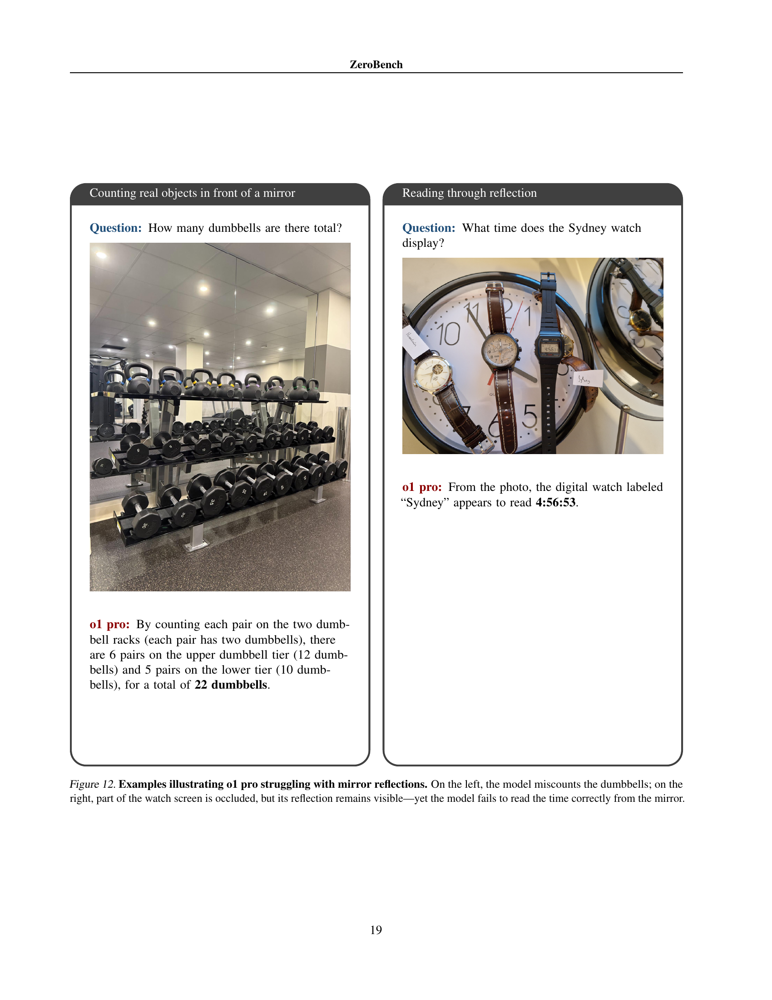

 


 2502.09696 
 Jonathan Roberts et el. 
 
 🤗 2025-02-17 
 



↗ arXiv


↗ Hugging Face


### TL;DR



최근 대규모 다중모달 모델(LMM)이 여러 시각적 벤치마크에서 높은 점수를 기록하지만, 실제 시각적 추론 능력은 아동이나 동물보다 떨어진다는 연구 결과가 있습니다.  **기존 벤치마크는 모델의 빠른 발전으로 인해 점수 상승폭이 좁아지고, 장기적인 유의미한 평가가 어려워지는 문제**를 가지고 있습니다. 따라서, 더욱 어려운 벤치마크 개발의 필요성이 제기되었습니다. 

본 논문에서는 이러한 문제를 해결하기 위해, **현존하는 최첨단 LMM이 전혀 해결할 수 없는 새로운 시각적 추론 벤치마크인 ZeroBench를 제안**합니다.  ZeroBench는 100개의 수동으로 제작된 질문과 334개의 하위 질문으로 구성되며, 20개의 LMM을 평가한 결과 모든 모델이 0%의 정확도를 기록했습니다. **본 논문에서는 오류 분석을 통해 시각적 해석에 대한 모델의 취약점을 밝히고, 향후 시각적 이해력 향상을 위한 방향을 제시**합니다.  ZeroBench는 경량화 설계로 테스트 시간 확장에도 적합합니다.



#### Key Takeaways


 ZeroBench는 최첨단 다중모달 모델에 대해 0%의 정확도를 기록하는 새로운 시각적 추론 벤치마크임 



 ZeroBench는 모델의 시각적 해석 오류를 분석하여 향후 연구 방향을 제시함 



 ZeroBench는 경량화 설계로 테스트 시간 컴퓨팅 확장 접근 방식에 적합함 


#### Why does it matter?
본 논문은 **최첨단 다중 모달 모델의 시각적 추론 능력에 대한 한계를 드러내는 새로운 벤치마크인 ZeroBench를 제시**함으로써, 관련 분야 연구자들에게 중요한 의미를 지닙니다. **ZeroBench는 기존 벤치마크의 한계를 극복**하고, **장기간에 걸쳐 유의미한 성과를 측정**할 수 있도록 설계되었습니다. 또한, **다양한 모델의 오류 분석을 통해 시각적 추론의 개선 방향을 제시**하고, **향후 연구를 위한 새로운 방향을 제시**합니다.

------
#### Visual Insights

> 🔼 그림 1은 여러 공개 시각적 벤치마크에서 최첨단 대규모 다중 모드 모델(LMM)의 성능을 보여줍니다.  기존의 벤치마크에서 LMM은 높은 점수를 얻었지만,  향상의 여지가 거의 없다는 것을 보여줍니다. 반면에, 연구팀이 제시한 ZeroBench는 현존하는 모델로는 해결할 수 없는 난이도를 가지고 있어 향후 모델 개선을 위한 충분한 여지를 제공합니다.  즉, 기존 벤치마크는 성능 향상의 여지가 적지만 ZeroBench는 최대치의 향상 여지를 제공한다는 점을 시각적으로 보여줍니다.
> 

> 
read the caption

> Figure 1: State of the art performance on public visual benchmarks. Frontier LMMs score highly on many popular benchmarks, leaving little headroom. By comparison, our ZeroBench proves impossible for current models, leaving maximum headroom.
> 


| Property | Amount |
|---|---| 
| Questions | 100 |
| Subquestions | 334 |
| Subquestions per question | 3.3 |
| Single-image questions | 93 |
| Multi-image questions | 7 |
| Synthetic image questions | 31 |
| Natural image questions | 69 |

> 🔼 표 1은 ZeroBench 데이터셋의 통계 정보를 요약하여 보여줍니다.  데이터셋에 포함된 질문과 하위 질문의 수, 각 질문 유형(단일 이미지, 다중 이미지)의 분포, 합성 이미지와 실제 이미지의 비율 등을 보여주어 ZeroBench 데이터셋의 특징을 한눈에 파악할 수 있도록 합니다.
> 

> 
read the caption

> Table 1: ZeroBench statistics.
> 

### In-depth insights

#### Impossible Visual Tasks
본 논문에서 제시된 "불가능한 시각적 과제"는 **현존하는 대규모 다중 모드 모델의 시각적 이해 능력의 한계를 드러내는 핵심적인 부분**입니다.  이러한 과제들은 단순한 이미지 인식을 넘어, **복잡한 추론, 공간적 이해, 물리적 법칙 적용 등 고차원적인 시각적 사고 능력**을 요구합니다.  이는 단순히 이미지의 피사체를 식별하는 것 이상으로, **문맥적 이해와 다중 단계 추론**을 필요로 합니다.  따라서, 이러한 과제들은 모델의 시각적 처리 능력에 대한 심층적인 분석을 가능하게 하고, **향후 모델 개발 방향에 대한 귀중한 통찰력**을 제공합니다.  특히, **기존 벤치마크에서의 높은 점수에도 불구하고, 모델들이 여전히 이러한 과제들을 해결하지 못한다는 점은 주목할 만합니다.** 이는 기존 벤치마크의 한계를 시사하며,  더욱 까다롭고 다양한 시각적 과제를 포함하는 새로운 평가 기준의 필요성을 강조합니다.  **불가능한 시각적 과제들은  모델의 진정한 시각적 이해 능력을 평가하는 중요한 척도**가 되며, 앞으로 **인공지능 시각 기술 발전에 중요한 역할**을 할 것입니다.

#### ZeroBench: Design
ZeroBench의 디자인은 **현존하는 대규모 다중 모달 모델의 시각적 추론 능력의 한계를 드러내는 데 초점**을 맞추고 있습니다.  이는 기존 벤치마크들이 빠르게 성능 향상에 따라 무의미해지는 문제를 해결하기 위한 것입니다.  따라서 ZeroBench는 **현존 모델로는 풀 수 없는, 매우 어려운 시각적 추론 과제**를 제시함으로써, 모델의 성능 향상에 대한 새로운 기준을 마련하고 장기간 유효한 평가 도구 역할을 할 수 있도록 설계되었습니다.  **100개의 수작업으로 제작된 질문과 334개의 하위 질문**으로 구성되어 있으며, 이는 다양한 영역과 추론 유형을 아우르는 다양성을 제공합니다. 또한, **경량화된 설계**를 통해 많은 계산 비용 없이 모델을 평가할 수 있도록 함으로써, 테스트 시간 컴퓨팅 확장 기법을 활용한 모델 평가에도 적합합니다.  **정교한 오류 분석**을 통해 모델의 시각적 해석 능력의 결함을 밝히는 데 중점을 두고 있으며, 이는 향후 모델 개발의 방향을 제시하는 데 중요한 역할을 할 것입니다.

#### LMM Evaluation
LMM(대규모 다중 모달 모델) 평가는 모델의 성능을 객관적으로 측정하고 비교하기 위한 필수적인 과정입니다.  **ZeroBench 논문에서는 기존 벤치마크의 한계점을 지적하며,  현존하는 최첨단 LMM들이 쉽게 해결하지 못하는 난이도 높은 시각적 추론 과제들을 제시합니다.**  이는 **모델의 취약점을 드러내고,  향후 연구 방향을 제시하는 데 중요한 의미**를 지닙니다.  단순히 정확도만 측정하는 것이 아니라, **오류 분석을 통해 모델의 실수 패턴을 파악하고, 시각적 해석 능력과 추론 능력의 개선 방향**을 제시하는 것이 중요합니다.  **ZeroBench의 경량화된 디자인**은 테스트 시간 비용을 절감하고,  다양한 모델의 비교 평가를 용이하게 합니다.  **다양한 유형의 시각적 추론 과제**를 포함함으로써, 모델의 전반적인 시각적 이해 능력을 평가할 수 있습니다.  **향후 LMM 평가는 ZeroBench와 같은 까다로운 벤치마크를 활용하여 모델의 실질적인 능력을 더욱 정확하게 평가**하는 방향으로 나아가야 할 것입니다.  또한,  **단순 정확도 뿐 아니라,  오류 유형 분석,  추론 과정 분석,  계산 효율성 등 다양한 지표**를 활용하여 종합적인 평가를 수행해야 합니다.

#### Error Analysis
본 논문의 '오류 분석' 부분은 **대규모 다중모드 모델(LMM)이 ZeroBench 벤치마크에서 실패하는 이유를 심층적으로 조사**합니다. 단순히 정확도만을 제시하는 것이 아니라, **모델의 오류 유형을 세분화하여 분석**하고, 시각적 해석 오류와 추론 오류를 구분하여 어떤 유형의 오류가 더 자주 발생하는지, 그리고 그 이유가 무엇인지 밝힙니다.  **시각적 해석 오류는 모델이 이미지를 정확하게 이해하지 못하는 것**에서 기인하며, 이는 모델의 저수준 시각적 추론 능력 부족을 시사합니다.  **추론 오류는 모델이 이미지를 올바르게 해석하더라도 복잡한 추론 과정에서 실수하는 것**을 의미합니다.  **오류 분석은 단순히 모델의 성능을 평가하는 것을 넘어, LMM의 한계를 파악하고 향후 개선 방향을 제시**하는 데 중요한 역할을 합니다.  **ZeroBench의 질문들이 다양한 영역과 추론 유형을 포함**하고 있기 때문에, 오류 분석을 통해 도출된 결론은 LMM 개발에 있어서 폭넓은 시사점을 제공합니다.  **특히, 시각적 오류의 빈도가 높다는 점은 향후 LMM 개발에서 저수준 시각적 추론 능력 향상에 집중**해야 함을 보여줍니다. 이는 **더욱 정교하고 복잡한 시각적 이해 능력을 요구하는 벤치마크 개발**의 필요성을 시사합니다.

#### Future Challenges
미래 과제는 **지속적인 모델 발전**과 **점점 어려워지는 벤치마크** 사이의 균형을 맞추는 데 있습니다.  현재 최고 수준의 모델조차도 ZeroBench와 같은 어려운 시험을 통과하지 못한다는 것은 놀라운 일입니다. 이는 **현재 모델의 시각적 이해 능력의 한계**를 명확히 보여줍니다.  향후 연구는 더욱 복잡하고 다양한 시각적 추론 능력을 평가하는 벤치마크 개발에 집중해야 합니다. 또한, 단순히 정답을 맞추는 것 이상으로, **모델이 문제 해결 과정을 얼마나 잘 설명하고, 추론 과정을 투명하게 보여주는지** 평가하는 방법론이 필요합니다. 이를 통해 모델의 **내부 작동 방식**을 이해하고,  **약점을 개선**하며, 더욱 **강력하고 신뢰할 수 있는 다중 모달 모델** 개발에 기여할 수 있을 것입니다.  **시각 정보 처리**, **추론 능력**, 그리고 **모델의 설명 가능성**에 대한 연구가 더욱 심도 있게 진행되어야 할 것입니다.

### More visual insights

More on figures

> 🔼 그림 2는 2024년 한 해 동안 주요 시각적 벤치마크에서 최첨단 거대 다중모달 모델(LMM)의 성능이 급격히 향상된 것을 보여줍니다. OpenCompass Contributors (2023)의 데이터를 바탕으로, 여러 벤치마크에서 SOTA(최첨단) 점수가 얼마나 빠르게 상승했는지, 그리고 벤치마크의 상한선(최대 가능 점수와 SOTA 점수의 차이)이 얼마나 줄어들었는지를 시각적으로 나타냅니다. 이는 벤치마크의 어려움과 유용성 사이의 관계를 보여주는 중요한 지표입니다. 벤치마크의 난이도가 낮아지면 모델 간의 성능 차이가 줄어들고, 오래 사용할 수 없게 되기 때문입니다.  ZeroBench는 이러한 문제를 해결하기 위해 제시된 새로운 벤치마크이며, 기존 벤치마크와의 비교를 통해 그 중요성을 부각하고 있습니다.
> 

> 
read the caption

> Figure 2: Rapid progress was made on visual benchmarks last year. Compiled from (OpenCompass Contributors, 2023).
> 

> 🔼 그림 3은 ZeroBench 벤치마크에 포함된 100개의 어려운 질문 중 세 가지 예시 질문과 답변을 보여줍니다. 각 질문은 다양한 시각적 추론 능력을 요구하며, 여러 단계의 추론 과정을 거쳐야 답을 얻을 수 있습니다. 예시 질문들은 이미지 해석, 계산, 시각적 퍼즐 풀이 등 다양한 유형의 시각적 추론 과제를 포함합니다. 이 그림은 ZeroBench 벤치마크의 어려움과 다양성을 보여주는 대표적인 예시입니다.
> 

> 
read the caption

> Figure 3: Example ZeroBench questions and answers††. Our benchmark contains 100 of these challenging questions.
> 

> 🔼 그림 4는 ZeroBench 벤치마크에 포함된 질문들의 길이 분포를 보여줍니다. 가로축은 질문 길이(글자 수)를 나타내고, 세로축은 해당 길이를 갖는 질문의 개수를 나타냅니다. 이 그래프를 통해 ZeroBench 질문들의 길이가 다양하게 분포되어 있음을 알 수 있습니다. 짧은 질문부터 매우 긴 질문까지 다양한 길이의 질문들이 포함되어 있어, 모델의 다양한 능력을 평가하는 데 도움이 될 것으로 보입니다.
> 

> 
read the caption

> Figure 4: Question length distribution.
> 

More on tables


| Main questions (100) | Subquestions (334) |  |  |  |  |  |
|---|---|---|---|---|---|---|
|  | k/k [%] (n) | pass@k [%] (n) |  |  | pass@k [%] (SECLT) | Num. correct |
|---|---|---|---|---|---|---|
| **Models** | k=5 | k=1 | k=5 |  | k=1 | k=1 |
| **Reasoning LMMs** |  |  |  |  |  |  |
| o1 pro⋄ | 0.0 (0) | 0.0 (0) | - |  | 22.40 (2.48) | 75 |
| o1⋄ | 0.0 (0) | 0.0 (0) | 0.0 (0) |  | 19.93 (2.37) | 68 |
| Gemini 2 Flash Thinking | 0.0 (0) | 0.0 (0) | **7.0 (7)** |  | 19.67 (2.67) | 67 |
| QVQ | 0.0 (0) | 0.0 (0) | 3.0 (3) |  | 19.78 (2.42) | 66 |
| **Proprietary LMMs** |  |  |  |  |  |  |
| GPT-4o | 0.0 (0) | 0.0 (0) | 1.0 (1) |  | 21.18 (2.46) | 71 |
| GPT-4o mini | 0.0 (0) | 0.0 (0) | 2.0 (2) |  | 16.98 (2.50) | 55 |
| Gemini 2 Flash | 0.0 (0) | 0.0 (0) | 3.0 (3) |  | 22.47 (2.80) | 74 |
| Gemini 1.5 Pro | 0.0 (0) | 0.0 (0) | 2.0 (2) |  | 20.25 (2.55) | 70 |
| Gemini 1.5 Flash | 0.0 (0) | 0.0 (0) | 2.0 (2) |  | 18.02 (2.47) | 63 |
| Gemini 1 Pro Vision | 0.0 (0) | 0.0 (0) | 1.0 (1) |  | 12.17 (2.19) | 44 |
| Claude 3.5 Sonnet v2 | 0.0 (0) | 0.0 (0) | 2.0 (2) |  | **24.30 (2.73)** | **81** |
| Claude 3.5 Sonnet | 0.0 (0) | 0.0 (0) | 1.0 (1) |  | 19.73 (2.49) | 68 |
| Claude 3 Opus | 0.0 (0) | 0.0 (0) | 0.0 (0) |  | 14.50 (2.27) | 46 |
| Claude 3 Sonnet | 0.0 (0) | 0.0 (0) | 1.0 (1) |  | 16.25 (2.33) | 49 |
| Claude 3 Haiku | 0.0 (0) | 0.0 (0) | 0.0 (0) |  | 12.12 (2.11) | 40 |
| Reka Edge | 0.0 (0) | 0.0 (0) | 1.0 (1) |  | 3.38 (0.97) | 12 |
| **Open-weight LMMs** |  |  |  |  |  |  |
| Llama 3.2 90B | 0.0 (0) | 0.0 (0) | 0.0 (0) |  | 13.07 (1.97) | 47 |
| Qwen2-VL-72B-Instruct | 0.0 (0) | 0.0 (0) | 2.0 (2) |  | 11.90 (2.24) | 37 |
| NVLM-D-72B | 0.0 (0) | 0.0 (0) | 1.0 (1) |  | 13.78 (2.32) | 46 |
| Pixtral-Large | 0.0 (0) | 0.0 (0) | 3.0 (3) |  | 13.50 (2.01) | 49 |
> 🔼 표 2는 ZeroBench에 대한 20개의 최첨단 다중 모드 언어 모델(LMM)의 성능을 보여줍니다.  greedy decoding을 사용한 pass@1 정확도와 k/k 신뢰도, 그리고 stochastic decoding을 사용한 pass@5 정확도가 제시됩니다. k개의 샘플 응답에 대해 pass@k는 적어도 하나의 응답이 정확하면 정답으로 평가되고, k/k 신뢰도는 모든 응답이 정확해야 정답으로 평가됩니다. 모든 응답은 모델의 기본 설정을 사용하여 생성됩니다. 표는 각 모델의 주요 질문과 하위 질문에 대한 정확도를 보여주고,  모델의 성능을 비교 분석하는 데 사용될 수 있습니다.
> 

> 
read the caption

> Table 2: Overall results on ZeroBench. We report pass@1 using greedy decoding and k/k reliability and pass@5 using stochastic decoding. For a set of k sampled responses, pass@k is evaluated as correct if at least one response is correct; k/k reliability is evaluated as correct if all responses are correct; ⋄all responses are sampled using default model settings.
> 


| Model | #tkns (Main questions) | Cost ($)∗ (Main questions) | #tkns (Subquestions) | Cost ($)∗ (Subquestions) |
|---|---|---|---|---|
| **Avg. per question** |  |  |  |  |
|  | **Main questions** |  | **Subquestions** |  |
| **Reasoning LMMs** |  |  |  |  |
| o1 pro⋄ | - | - | - |  |
| o1⋄ | 7345 | 0.463 | 3749 | 0.236 |
| Gemini 2 Flash Thinking∗∗ | 520 | - | 228 | - |
| QVQ | 2794 | 0.003 | 1741 | 0.002 |
| **Proprietary LMMs** |  |  |  |  |
| GPT-4o | 452 | 0.005 | 228 | 0.002 |
| GPT-4o mini | 896 | <0.001 | 214 | <0.001 |
| Gemini 2 Flash | 1267 | 0.013 | 490 | 0.005 |
| Gemini 1.5 Pro | 266 | 0.002 | 114 | <0.001 |
| Gemini 1.5 Flash | 276 | <0.001 | 122 | <0.001 |
| Gemini 1 Pro Vision | 211 | <0.001 | 99 | <0.001 |
| Claude 3.5 Sonnet v2 | 254 | 0.004 | 163 | 0.003 |
| Claude 3.5 Sonnet | 294 | 0.005 | 217 | 0.003 |
| Claude 3 Opus | 267 | 0.021 | 168 | 0.013 |
| Claude 3 Sonnet | 279 | 0.004 | 175 | 0.003 |
| Claude 3 Haiku | 315 | <0.001 | 132 | <0.001 |
| Reka Edge∗∗ | 514 | - | 189 | - |
| **Open-weight LMMs** |  |  |  |  |
| Llama 3.2 90B | 663 | 0.001 | 264 | <0.001 |
| Qwen2-VL-72B-Instruct | 457 | 0.001 | 476 | <0.001 |
| NVLM-D-72B∗∗ | 389 | - | 151 | - |
| Pixtral-Large | 553 | <0.001 | 279 | <0.001 |
> 🔼 표 3은 각 질문당 평균 비용과 탐욕적 디코딩 중에 생성된 완료 토큰 수를 보여줍니다.  비용은 AI/ML API 가격 책정(API, 2025)을 기반으로 계산되었으며, 일부 모델의 경우 비용 데이터를 구할 수 없었습니다.  모든 응답은 모델의 기본 설정을 사용하여 샘플링되었습니다.  즉, 이 표는 다양한 언어 모델을 사용하여 질문에 대한 응답을 생성하는 데 드는 비용과 계산량을 비교 분석한 결과를 보여줍니다.  탐욕적 디코딩 방식을 사용했고, 모델의 기본 설정을 사용했기 때문에, 각 모델의 응답 생성 효율성을 비교하는 데 유용한 정보를 제공합니다.
> 

> 
read the caption

> Table 3: Average per question cost and number of completion tokens generated during greedy decoding. ∗calculated based on AI/ML API pricing (API, 2025); ∗∗cost data unavailable; ⋄responses sampled using default model settings.
> 


| Model | Greedy Decoding | Stochastic Decoding | Max. Completion Tokens. |
|---|---|---|---| 
| o1 pro | - | - | - |
| o1 | seed=42, reasoning_effort=‘medium’ | seed=42, reasoning_effort=‘medium’ | 100k |
| GPT-4o | temperature=0, seed=42 | temperature=0.7, top_p=0.95, seed=42 | 16k |
| GPT-4o mini | temperature=0, seed=42 | temperature=0.7, top_p=0.95, seed=42 | 16k |
| Gemini 2 Flash Thinking | temperature=0, top_k=1 | temperature=0.7, top_p=0.95 | 65k |
| Gemini 2 Flash | temperature=0, top_k=1 | temperature=0.7, top_p=0.95 | 8k |
| Gemini 1.5 Pro | temperature=0, top_k=1 | temperature=0.7, top_p=0.95 | 8k |
| Gemini 1.5 Flash | temperature=0, top_k=1 | temperature=0.7, top_p=0.95 | 8k |
| Gemini 1 Pro Vision | temperature=0, top_k=1 | temperature=0.7, top_p=0.95 | 2k |
| Claude 3.5 Sonnet v2 | temperature=0, top_k=1 | temperature=0.7, top_p=0.95 | 8k |
| Claude 3.5 Sonnet | temperature=0, top_k=1 | temperature=0.7, top_p=0.95 | 8k |
| Claude 3 Opus | temperature=0, top_k=1 | temperature=0.7, top_p=0.95 | 4k |
| Claude 3 Sonnet | temperature=0, top_k=1 | temperature=0.7, top_p=0.95 | 4k |
| Claude 3 Haiku | temperature=0, top_k=1 | temperature=0.7, top_p=0.95 | 4k |
| Pixtral-Large | temperature=0, top_k=1 | temperature=0.7, top_p=0.95 | 32k |
| Reka Edge | temperature=0, top_k=1, seed=42 | temperature=0.7, top_p=0.95 | 32k |
| QVQ | temperature=0, top_k=1 | temperature=0.7, top_p=0.95 | 32k |
| Llama 3.2 90B | temperature=0, top_k=1 | temperature=0.7, top_p=0.95 | 8k |
| Qwen2-VL-72B-Instruct | temperature=0, top_k=1 | temperature=0.7, top_p=0.95 | 32k |
| NVLM-D-72 B | temperature=0, top_k=1 | temperature=0.7, top_p=0.95 | 32k |
> 🔼 표 4는 각 디코딩 설정에서 사용된 하이퍼파라미터를 보여줍니다.  Greedy 디코딩과 Stochastic 디코딩에 사용된 temperature, top_k, top_p, seed 값 등이 모델별로 자세히 나열되어 있습니다. ChatGPT 인터페이스를 통해 접근했기 때문에 o1 pro 모델의 경우 하이퍼파라미터 설정이 불가능했습니다.  표는 모델의 디코딩 방식과 관련 설정에 대한 상세 정보를 제공하여 실험의 재현성을 높이고, 결과 해석에 도움을 줍니다.
> 

> 
read the caption

> Table 4: Hyperparameters used in each decoding setting. Note, o1 pro was accessed through the ChatGPT interface preventing hyperparameter configuration.
> 

### Full paper



