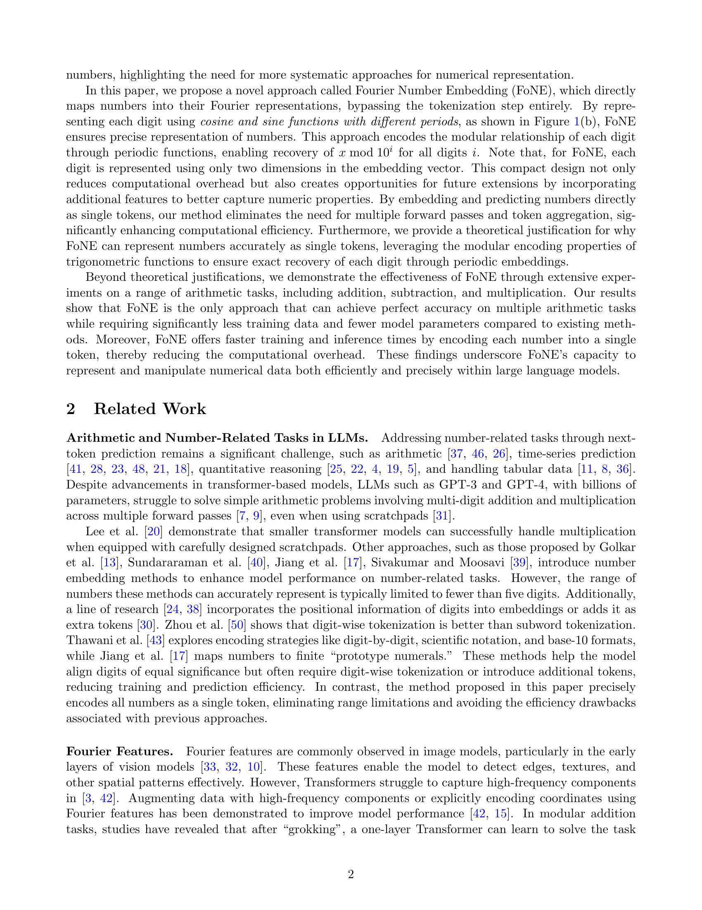

 


 2502.09741 
 Tianyi Zhou et el. 
 
 🤗 2025-02-17 
 



↗ arXiv


↗ Hugging Face


### TL;DR



기존 대규모 언어 모델(LLM)은 숫자를 여러 토큰으로 나누어 표현하기 때문에 수치 연산 속도가 느리고 정확도가 떨어지는 문제가 있습니다. 이는 숫자 관련 작업이 중요한 여러 분야에서 LLM의 성능을 저해하는 요인이 됩니다.  본 논문에서는 이러한 문제를 해결하기 위해 **FoNE(Fourier Number Embedding)**이라는 새로운 방법을 제안합니다.

FoNE은 푸리에 변환을 이용하여 숫자를 단일 토큰으로 효율적으로 임베딩합니다.  **단일 토큰으로 숫자를 표현**함으로써 **계산 비용을 줄이고 연산 속도를 높일 뿐만 아니라 정확도도 향상**시킵니다.  실험 결과, FoNE은 다양한 수치 연산 과제에서 기존 방법보다 훨씬 우수한 성능을 보여주었으며, 특히 6자리 십진수 덧셈 과제에서 괄목할 만한 성능 향상을 기록했습니다.  본 연구는 LLM의 수치 연산 능력을 크게 향상시키는 데 기여하며, **향후 LLM의 수치 연산 성능 개선 및 다양한 응용 분야 확장**에 중요한 의미를 가집니다.



#### Key Takeaways


 FoNE은 단일 토큰으로 숫자를 효율적으로 표현하여 기존의 다중 토큰 방식보다 훨씬 빠른 학습 및 추론 속도를 제공합니다. 



 FoNE는 다양한 수치 연산 과제에서 기존 방법보다 높은 정확도를 달성하며, 특히 6자리 십진수 덧셈에서 뛰어난 성능을 보여줍니다. 



 FoNE는 이론적 근거와 실험적 결과를 통해 그 효과를 입증하며, 숫자 관련 작업이 중요한 다양한 분야의 연구에 새로운 가능성을 제시합니다. 


#### Why does it matter?
본 논문은 **대규모 언어 모델(LLM)에서 숫자 표현의 비효율성 문제를 해결**하기 위해 제안된 **FoNE(Fourier Number Embedding)** 방법의 중요성을 보여줍니다. FoNE는 **단일 토큰으로 숫자를 효율적으로 인코딩**하여 학습 및 추론 속도를 높이고 정확도를 향상시킵니다.  이는 수치 관련 작업이 중요한 여러 분야의 연구에 큰 영향을 미칠 수 있으며, **향후 연구를 위한 새로운 방향**을 제시합니다.  특히 **숫자 처리가 중요한 자연어 처리, 코드 생성, 과학적 계산 분야**에서 그 중요성이 더욱 부각됩니다.

------
#### Visual Insights

> 🔼 그림 1은 숫자 임베딩을 위한 FoNE (Fourier Number Embedding) 방법을 보여줍니다. (a)는 입력 시퀀스에서 모든 숫자를 추출하는 과정을, (b)는 FoNE을 사용하여 각 숫자를 임베딩 공간에 직접 매핑하는 과정을 보여줍니다. FoNE은 각 숫자의 각 자릿수를 두 개의 임베딩 차원으로 인코딩합니다. 예를 들어, 18의 경우 첫 번째 두 항목은 18 mod 10을, 다음 두 항목은 18 mod 100을 나타냅니다. (c)는 FoNE을 0으로 패딩하고 단어 임베딩에 추가한 다음 결합된 임베딩을 모델에 공급하는 과정을 보여줍니다. 마지막으로 (d)는 마지막 히든 상태에서 각 자릿수에 대한 두 개의 항목을 가져와 해당 표현에 가장 가까운 숫자를 찾는 과정을 보여줍니다.
> 

> 
read the caption

> Figure 1: (a) We extract all the numbers from the input sequence. (b) For each number, we use FoNE to directly map the number to its embedding. The first two entries in the embedding represent 18mod10modulo181018\bmod 1018 roman_mod 10, while the next two entries represent 18mod100modulo1810018\bmod 10018 roman_mod 100. (c) We pad the FoNE with zeros, add it to the word embeddings, and then feed the combined embeddings into the model. (d) For each digit, we take every two entries from the last hidden state and find the number whose representation is closest to these two entries.
> 


| Method | Decimal Addition |  |  |  | Subtraction |  |  |  | Multiplication |  |  |  |
|---|---|---|---|---|---|---|---|---|---|---|---|---|
|  | Train Time | Test Time | Tokens | Accuracy | Train. | Test. | Toks. | Acc. | Train. | Test. | Toks. | Acc. |
|---|---|---|---|---|---|---|---|---|---|---|---|---|
| Ours | 3′18″ | 29″ | 1 | 100 | 2′42″ | 29″ | 1 | 100 | 2′56″ | 33″ | 1 | 98.56 |
| Digit-wise | 11′48″ | 1′25″ | 7 | 99.85 | 9′41″ | 1′15″ | 5 | 99.71 | 10′11″ | 1′18″ | 8 | 81.21 |
| Subword | 6′46″ | 58″ | 3 | 97.94 | 5′47″ | 54″ | 2 | 91.66 | 6′20″ | 58″ | 3 | 8.05 |
| xVal | 3′17″ | 27″ | 1 | 0.44 | 2′54″ | 27″ | 1 | 3.41 | 2′56″ | 26″ | 1 | 0 |

> 🔼 본 표는 논문의 실험 결과를 보여주는 표로, 세 가지 산술 연산(덧셈, 뺄셈, 곱셈) 작업에 대한 훈련 및 추론 효율성을 비교 분석한 것입니다.  세 가지 다른 방법(Ours, Digit-wise, Subword, XVAL)의 훈련 시간, 테스트 시간, 사용된 토큰 수, 정확도를 각 연산별로 비교하여 효율성을 정량적으로 평가하고 있습니다.  'Ours'는 논문에서 제시하는 새로운 방법이며, Digit-wise는 각 자릿수를 개별 토큰으로 처리하는 방법, Subword는 숫자를 여러 하위 단어 토큰으로 나누는 방법, 그리고 XVAL은 값 기반 표현을 사용하는 방법을 의미합니다.  단위는 분(′)과 초(′′)를 사용하여 표시됩니다.
> 

> 
read the caption

> Table 1: Training and inference efficiency comparison across three arithmetic tasks. The times are reported in minutes (′) and seconds (′′).
> 

### In-depth insights

#### FoNE's Design
FoNE는 **푸리에 변환**을 기반으로 숫자를 단일 토큰으로 효율적으로 임베딩하는 참신한 방법입니다. 기존의 다중 토큰 방식과 달리, 각 자릿수를 **주파수 성분**으로 표현하여 숫자의 크기와 정확한 값을 효과적으로 포착합니다. 이는 **소수점 아래 자릿수**까지 고려하여 정밀도를 높였으며, **주기 함수**의 특성을 활용하여 숫자를 단일 토큰으로 표현함으로써 계산 효율성을 극대화합니다.  **낮은 차원의 임베딩 벡터**를 사용함에도 불구하고, 다양한 산술 연산(덧셈, 뺄셈, 곱셈)에서 높은 정확도를 달성하며, 특히 **데이터 효율성** 측면에서 기존 방법을 압도적으로 능가합니다. **모듈러 연산**을 활용한 설계는 숫자의 표현을 단순화하면서도,  **정확성**을 유지하는 데 기여합니다.  **단일 토큰 표현 방식**은 모델의 학습 및 추론 속도를 크게 향상시키는 동시에, **장기 수열 연산**에도 효과적임을 보여줍니다. 따라서 FoNE는 대규모 언어 모델의 수치 연산 능력을 향상시키는 데 크게 기여할 것으로 예상됩니다.

#### FoNE vs. Baselines
본 논문은 숫자 임베딩을 위한 새로운 방법인 FoNE (Fourier Number Embedding)을 제시하고 기존 방법들과 비교 분석합니다. **FoNE은 숫자를 단일 토큰으로 표현하여 계산 효율을 높이고 정확도를 향상시키는 데 중점을 둡니다.**  기존의 서브워드 토큰화나 자릿수별 토큰화 방식과 달리 FoNE은 푸리에 변환을 이용하여 숫자를 직접 임베딩 공간에 매핑합니다. 이는 숫자를 구성하는 각 자릿수의 모듈러 관계를 효과적으로 포착하여 단편화 문제를 해결하고, 훈련 및 추론 속도를 높입니다. 실험 결과, FoNE은 다양한 수치 계산 작업에서 기존 방법들보다 훨씬 높은 정확도를 달성하고, 특히 **소량의 데이터로도 높은 성능을 보이는 데이터 효율성**을 입증합니다.  **FoNE의 주요 장점은 컴팩트한 표현 방식과 연산 효율성**으로, 대규모 언어 모델의 훈련 및 추론 속도를 크게 개선할 수 있다는 점입니다.  하지만, FoNE이 모든 상황에서 최적의 성능을 보장하는 것은 아니며, 추가적인 연구를 통해  **한계점을 보완하고 적용 범위를 확장**하는 것이 필요합니다.  특히, 다양한 종류의 수치 데이터와 복잡한 수학적 연산에 대한 FoNE의 성능을 더욱 검증하고, 모델의 크기 및 구조에 따른 성능 변화를 분석하는 것이 중요합니다.

#### Fourier Feature Use
본 논문에서 제시된 FoNE(Fourier Number Embedding) 방법은 **수치 데이터를 표현하는 데 있어 기존의 토큰화 방식을 뛰어넘는 혁신적인 접근 방식**을 제시합니다.  기존의 LLMs(Large Language Models)은 수치를 여러 토큰으로 나누어 표현하기 때문에, 계산 효율성이 떨어지고 정확도가 낮아지는 문제점을 가지고 있습니다.  하지만 FoNE는 **각 숫자를 고유한 푸리에 특징으로 직접 매핑**하여 단일 토큰으로 표현합니다.  이는 각 자릿수에 대해 두 개의 임베딩 차원만을 사용하면서도 숫자의 값을 효과적으로 포착할 수 있게 해줍니다. 이를 통해 **학습 및 추론 속도가 크게 향상**되고, 다양한 수치 연산 작업에서 **정확도 또한 높아지는 효과**를 가져옵니다. 특히, 고차원 수치 연산에서 FoNE의 효율성은 더욱 극대화됩니다.  **푸리에 특징의 주기적 성질**을 이용하여 숫자를 효과적으로 표현하고, 컴팩트한 표현 방식으로 인해 계산 비용을 절감하며, 고정밀도를 유지하면서 고속 연산을 가능하게 만드는 점이 FoNE의 핵심적인 강점입니다.  **단일 토큰으로 수치를 표현**한다는 점은 이전 방법들에 비해 혁신적이며, 향후 LLMs의 수치 연산 능력 향상에 중요한 기여를 할 것으로 예상됩니다. 또한, FoNE는 **다양한 수치 연산 과제**에 걸쳐 우수한 성능을 보여주는 실험 결과를 통해 그 효과를 검증합니다.

#### Data Efficiency
본 논문에서 데이터 효율성에 대한 논의는 **FoNE 모델이 기존 방법들보다 훨씬 적은 데이터로 높은 정확도를 달성함**을 보여주는 실험 결과를 중심으로 이루어집니다.  구체적으로, 6자리 십진수 덧셈 작업에서 FoNE은 기존의 서브워드 및 자릿수 단위 임베딩 방법보다 64배 적은 데이터로 99%의 정확도를 달성했습니다. 이는 **FoNE의 압축적인 표현 방식**과 **계산 효율성**을 보여주는 중요한 결과입니다.  또한, FoNE은 덧셈, 뺄셈, 곱셈 작업에서 10만 개 이상의 테스트 사례에 대해 100%의 정확도를 달성한 유일한 방법이었으며, 이는 **FoNE의 우수한 정확성**을 강조합니다.  **데이터 효율성은 모델의 크기와도 관련이 있는데**, 작은 모델 크기에서도 FoNE은 높은 정확도를 유지했습니다.  이는 **FoNE이 제한된 리소스 환경에서도 효과적임**을 시사합니다.  결론적으로, FoNE의 데이터 효율성은 모델의 성능과 효율성을 향상시키는 데 중요한 역할을 합니다.

#### Future Work
본 논문에서 제시된 FoNE (Fourier Number Embedding) 방법은 숫자 임베딩에 있어 획기적인 발전이지만, **여러 방면으로의 추가 연구가 필요**합니다.  **더 큰 숫자나 소수점 아래 자릿수가 많은 숫자에 대한 확장성**을 높이는 연구가 중요합니다. 현재 FoNE는 고정된 자릿수에 최적화되어 있으므로, 가변적인 자릿수를 효율적으로 처리하는 방법을 고안해야 합니다.  또한, FoNE를 다양한 언어 모델 아키텍처와 다른 숫자 관련 작업(예: 수학적 추론, 코드 생성)에 적용하고 성능을 평가하는 추가 실험이 필요합니다.  **FoNE의 해석성을 높이는 연구**도 중요한데, FoNE이 숫자를 어떻게 표현하고 처리하는지에 대한 깊이 있는 분석을 통해, 모델의 내부 동작 메커니즘에 대한 이해를 높일 수 있습니다.  **다른 숫자 임베딩 방법과의 비교 분석**을 강화하여 FoNE의 우월성을 더욱 명확히 밝히는 것도 중요합니다. 마지막으로, **FoNE의 효율성을 개선**하는 연구가 필요합니다.  현재 FoNE는 계산 복잡도를 줄이는 데 초점을 맞추고 있지만, 메모리 사용량을 줄이고 처리 속도를 높이는 추가적인 최적화 기법을 개발하여 실제 응용 환경에서의 효율성을 향상시킬 수 있습니다.  이러한 추가 연구를 통해 FoNE의 실용성과 일반화 능력을 향상시키고, 다양한 응용 분야에서 활용 가능성을 넓힐 수 있을 것입니다.

### More visual insights

More on figures

> 🔼 이 그림은 6자리 소수 덧셈 작업에 대한 정확도를 훈련 데이터 크기에 따라 보여줍니다.  그림은 다양한 크기의 훈련 데이터셋으로 훈련된 모델의 성능을 비교하여, 훈련 데이터의 양이 모델 정확도에 미치는 영향을 보여줍니다.  즉, 모델이 얼마나 많은 훈련 데이터를 가지고 6자리 소수 덧셈 문제를 얼마나 정확하게 풀 수 있는지 보여주는 그래프입니다.  다양한 숫자 임베딩 방법(FoNE, digit-wise, subword, XVAL)을 사용한 결과도 함께 표시되어 있어, 서로 다른 방법들의 성능을 비교 분석하는 데 도움을 줍니다.
> 

> 
read the caption

> ((a))  6-digit decimal addition: Acc. vs. Training Data Size
> 

> 🔼 그림 (b)는 6자리 십진수 덧셈에 대한 정확도(Accuracy)와 모델 크기(Model Size) 간의 관계를 보여줍니다.  다양한 크기의 모델을 사용하여 6자리 십진수 덧셈 작업에 대한 테스트 정확도를 비교 분석한 결과를 나타냅니다.  모델 크기가 커짐에 따라 정확도가 어떻게 향상되는지 보여주는 그래프입니다.  x축은 모델 크기(백만 파라미터)이고, y축은 테스트 정확도(%)입니다.
> 

> 
read the caption

> ((b))  6-digit decimal addition: Acc. vs. Model Size
> 

> 🔼 본 그림은 6자리 십진수 덧셈 작업에서 서로 다른 수 임베딩 방법을 사용하여 Llama-3.2-1B 모델을 무작위 초기화로 학습시킨 결과를 보여줍니다. 그림 (a)는 학습 데이터 크기가 증가함에 따라 정확도가 변화하는 양상을, 그림 (b)는 모델 크기가 증가함에 따라 정확도가 변화하는 양상을 보여줍니다.  두 경우 모두, FoNE(Fourier Number Embedding) 방법이 다른 방법들에 비해 훨씬 적은 데이터와 더 작은 모델 크기로도 높은 정확도를 달성함을 보여줍니다.
> 

> 
read the caption

> Figure 2:  We train Llama-3.2-1B from scratch with random initialization using different number embedding methods on 6-digit decimal addition. The test accuracy is compared across varying data sizes and model sizes.
> 

> 🔼 그림 (a)는 6자리 정수 덧셈에 대한 모델 및 데이터 크기별 정확도 추세를 보여줍니다.  다양한 크기의 모델과 데이터셋을 사용하여 훈련된 여러 가지 숫자 임베딩 방법(FoNE, digit-wise 토큰화, subword 토큰화, XVAL)의 성능을 비교합니다.  x축은 모델의 크기(백만 매개변수), y축은 정확도(%)를 나타냅니다.  각 곡선은 특정 크기의 데이터셋으로 학습된 모델의 성능을 보여줍니다.  이 그림을 통해 FoNE가 다른 방법들보다 훨씬 적은 데이터와 매개변수로 더 높은 정확도를 달성한다는 것을 알 수 있습니다.
> 

> 
read the caption

> ((a)) 6-digit integer addition: Model&Data size vs. Acc.
> 

> 🔼 그림 (b)는 5자리 정수 뺄셈 작업에 대한 모델 크기 및 데이터 크기에 따른 정확도 추세를 보여줍니다.  다양한 크기의 모델을 사용하여 훈련 데이터 크기를 변화시키면서 테스트 정확도를 비교합니다. 이를 통해 모델의 크기와 데이터 크기가 5자리 정수 뺄셈 작업의 정확도에 어떤 영향을 미치는지 알 수 있습니다.  다양한 숫자 임베딩 방법의 성능을 비교하여 FoNE 방법의 효율성을 보여줍니다.
> 

> 
read the caption

> ((b)) 5-digit integer subtraction: Model&Data size vs. Acc.
> 

> 🔼 그림 (c)는 3자리 정수 곱셈에 대한 모델 및 데이터 크기 대비 정확도를 보여줍니다.  다양한 크기의 모델과 다양한 양의 훈련 데이터를 사용하여 3자리 정수 곱셈 작업에 대한 정확도를 평가한 결과를 보여줍니다.  이를 통해 모델 크기와 데이터 크기가 3자리 정수 곱셈 작업의 정확도에 미치는 영향을 분석할 수 있습니다.  x축은 모델 크기 또는 데이터 크기를 나타내고, y축은 정확도를 나타냅니다.
> 

> 
read the caption

> ((c)) 3-digit integer multiplication: Model&Data size vs. Acc.
> 

> 🔼 그림 (d)는 4자리 정수 곱셈 작업에 대한 모델 크기 및 데이터 크기에 따른 정확도 추세를 보여줍니다.  다양한 모델 크기와 데이터 크기에 대해 4자리 정수 곱셈 문제를 풀 때 FoNE 방법을 포함한 여러 가지 숫자 임베딩 방법의 성능을 비교 분석한 결과를 나타냅니다.  x축은 모델 크기(백만 파라미터) 또는 훈련 데이터 크기(로그 스케일)이고 y축은 정확도(%)입니다. 이 그래프를 통해 FoNE 방법이 다른 방법들에 비해 적은 데이터와 모델 크기로도 높은 정확도를 달성함을 확인할 수 있습니다.
> 

> 
read the caption

> ((d)) 4-digit integer multiplication: Model&Data size vs. Acc.
> 

> 🔼 그림 3은 다양한 숫자 관련 작업(6자리 10진수 덧셈, 6자리 정수 덧셈, 5자리 정수 뺄셈, 3자리 정수 곱셈, 4자리 정수 곱셈)에 대해 모델 크기와 데이터 크기에 따른 정확도 추세를 비교한 것입니다.  각 작업에 대해 모델 크기가 증가함에 따라 정확도가 어떻게 변하는지, 그리고 동일한 모델 크기에서 데이터 크기가 정확도에 미치는 영향을 보여줍니다.  FoNE 방법이 기준 방법들에 비해 데이터 효율성과 매개변수 효율성이 얼마나 뛰어난지를 시각적으로 보여주는 그림입니다.
> 

> 
read the caption

> Figure 3: Comparison of accuracy trends for various arithmetic tasks with respect to model size and data size.
> 

> 🔼 그림 4(a)는 FoNE을 사용하여 60자리 덧셈 작업에 대한 8계층 트랜스포머 모델의 테스트 정확도를 보여줍니다.  x축은 첫 번째 피연산자의 자릿수를, y축은 두 번째 피연산자의 자릿수를 나타냅니다. 각 셀의 색상은 해당 자릿수 조합에 대한 모델의 정확도를 나타내며, 더 밝은 색상은 더 높은 정확도를 나타냅니다. 이 그림은 FoNE이 긴 수열을 처리하는 데 효과적임을 보여줍니다. 즉, 모델은 60자리까지의 긴 덧셈 문제에 대해서도 높은 정확도를 유지합니다.  이를 통해 FoNE이 수치적 정밀도와 수열 표현 능력을 모두 갖추고 있음을 알 수 있습니다.
> 

> 
read the caption

> ((a)) Test accuracy of 60-digit addition with FoNE
> 

> 🔼  그림 (b)는 FoNE을 Abacus 임베딩과 결합했을 때의 영향을 보여줍니다.  Abacus 임베딩은 자릿수 단위 토큰화를 사용하는 위치 정보 임베딩 방법입니다. 이 그림은 FoNE을 Abacus와 결합하여 10자리 이하의 덧셈 작업에 대해 학습된 변환기를 최대 50자리 덧셈 작업에 대해 테스트한 결과를 보여줍니다. 다양한 랜덤 시드에 걸쳐 FoNE을 추가함으로써 Abacus 방법이 더 나은 일반화 성능과 더 높은 정확도를 달성할 수 있음을 보여줍니다.  즉, FoNE을 Abacus와 결합하면 숫자 표현의 정확도가 높아져 더 긴 숫자의 덧셈 문제도 잘 해결할 수 있음을 의미합니다.
> 

> 
read the caption

> ((b)) Impact of combining FoNE with Abacus embedding
> 

> 🔼 그림 4는 8계층 트랜스포머 모델을 사용하여 60자리 덧셈 작업에 대한 FoNE의 성능을 보여줍니다. (a)는 FoNE을 사용하여 입력을 청크화(chunked input)하여 처리했을 때 8계층 트랜스포머 모델의 평균 정확도를 보여줍니다. 최대 50자리 숫자에 대해 테스트를 수행했습니다. (b)는 다양한 난수 시드에 걸쳐 FoNE을 Abacus 임베딩 방법과 결합했을 때 성능 향상을 보여줍니다. 트랜스포머 모델은 최대 10자리 숫자의 덧셈 작업에 대해 학습되었고 최대 50자리 숫자에 대해 테스트되었습니다. 작은 정사각형은 최대 10자리 숫자로 학습된 영역을 나타냅니다.
> 

> 
read the caption

> Figure 4:  (a) Average accuracy of an 8-layer transformer model on 60-digit addition tasks using FoNE for chunked input. (b) Performance improvements achieved by combining FoNE with the Abacus embedding method across various random seeds. The transformer is trained on addition tasks with up to 10-digits numbers (represented by the smaller square) and tested up to 50-digit numbers.
> 

> 🔼 그림 (a)는 6자리 10진수 덧셈 작업에 대한 다양한 데이터 크기에서의 정확도 추세를 보여줍니다. 이 그래프는 모델이 학습에 사용되는 데이터 양에 따라 정확도가 어떻게 변하는지 보여주는 것을 목표로 합니다. 이를 통해 모델의 데이터 효율성과 일반화 성능을 평가할 수 있습니다. 특히, FoNE 방법이 기존 방법들에 비해 훨씬 적은 데이터로 높은 정확도를 달성함을 시각적으로 보여줍니다.
> 

> 
read the caption

> ((a)) Accuracy vs. Training Data Size
> 

> 🔼 그림 (b)는 모델 크기가 증가함에 따라 6자리 십진수 덧셈 작업에 대한 정확도 변화를 보여줍니다. 다양한 크기의 모델에 대해 테스트 정확도를 비교하여 모델 크기와 정확도의 상관관계를 보여줍니다.  모델의 매개변수 수가 많아질수록 정확도가 향상되는 경향이 있음을 보여줍니다. 이는 더 큰 모델이 더 많은 데이터를 학습하고 더 복잡한 패턴을 캡처할 수 있기 때문입니다.
> 

> 
read the caption

> ((b)) Accuracy vs. Model Size
> 

> 🔼 그림 5는 다양한 숫자 임베딩 방법을 사용하여 Llama-3.2-1B 모델을 처음부터 훈련시킨 결과를 보여줍니다.  임베딩 방법에는 FoNE(Fourier Number Embedding)과 digit-wise 토큰화, subword 토큰화, XVAL 등이 포함됩니다.  실험은 d=10인 이진 분류 작업에서 수행되었으며, 테스트 정확도는 다양한 데이터 크기와 모델 크기에 따라 비교됩니다.  이를 통해 각 임베딩 방법의 데이터 효율성과 모델 크기의 영향을 분석합니다.  결과적으로 FoNE는 다른 방법들보다 더 높은 정확도를 달성하는 것을 보여줍니다.
> 

> 
read the caption

> Figure 5:  We train Llama-3.2-1B from scratch with random initialization using different number embedding methods on number classification where d=10𝑑10d=10italic_d = 10. The test accuracy is compared across varying data sizes and model sizes.
> 

> 🔼 그림 (a)는 6자리 10진수 덧셈 작업에 대한 정확도 대비 학습 데이터 크기를 보여줍니다. 다양한 크기의 모델과 다양한 양의 학습 데이터를 사용하여 모델을 학습시킨 후 테스트 정확도를 비교 분석한 결과입니다. 이 그래프를 통해 모델의 성능이 학습 데이터 크기에 따라 어떻게 향상되는지, 그리고 특정 데이터 크기에서 성능 향상이 둔화되는 지점이 있는지 확인할 수 있습니다. 또한 서로 다른 임베딩 방법들의 성능 차이를 비교 분석하는 데에도 유용합니다.
> 

> 
read the caption

> ((a)) Accuracy vs. Training Data Size
> 

> 🔼 그림 (b)는 6자리 십진수 덧셈 작업에 대한 정확도와 모델 크기 사이의 관계를 보여줍니다.  다양한 크기의 모델을 사용하여 실험을 수행하여 모델 크기가 증가함에 따라 정확도가 어떻게 변하는지 보여줍니다.  이를 통해 모델의 크기와 성능 간의 상관관계를 파악하고, 최적의 모델 크기를 결정하는 데 도움이 됩니다.  특히, 제안된 FoNE 방법과 기준 방법들을 비교하여 FoNE의 효율성을 강조합니다.
> 

> 
read the caption

> ((b)) Accuracy vs. Model Size
> 

> 🔼 그림 6은 서로 다른 숫자 임베딩 방법을 사용하여 -190인 d 값을 갖는 숫자 분류 작업에서 무작위 초기화를 사용하여 Llama-3.2-1B 모델을 처음부터 학습시킨 결과를 보여줍니다. 테스트 정확도는 다양한 데이터 크기와 모델 크기에 따라 비교됩니다. 이는 즉, 서로 다른 크기의 데이터셋과 모델을 사용하여 실험했을 때, 어떤 숫자 임베딩 방법이 가장 정확한 분류 결과를 보이는지 보여주는 그림입니다.  -190라는 d값은 문제의 어려움을 조절하는 매개변수로 해석될 수 있습니다.
> 

> 
read the caption

> Figure 6:  We train Llama-3.2-1B from scratch with random initialization using different number embedding methods on number classification where d=−190𝑑190d=-190italic_d = - 190. The test accuracy is compared across varying data sizes and model sizes.
> 

> 🔼 그림 7은 Pythia 모델의 숫자 임베딩에 대한 푸리에 분석 결과를 다양한 사전 훈련 단계별로 보여줍니다. 이 그림은 특정 주파수 성분의 출현을 보여주는 사전 훈련 중 푸리에 특징이 점진적으로 학습되는 과정을 보여줍니다. 다양한 크기의 모델이 유사한 경향을 보이며 시간이 지남에 따라 동일한 주파수 성분을 점진적으로 학습합니다.  즉, 모델의 크기에 관계없이 동일한 주파수 성분이 학습됨을 보여줍니다.
> 

> 
read the caption

> Figure 7: Fourier analysis of the Pythia model’s number embeddings across pre-training checkpoints. The figure illustrates how the Fourier features are progressively learned during pre-training, showing the emergence of specific frequency components. Models of varying sizes exhibit a similar trend, gradually learning the same frequency components over time.
> 

> 🔼 그림은 다양한 사전 훈련된 언어 모델에서 숫자 임베딩의 푸리에 공간 분석 결과를 보여줍니다.  (a)는 사전 훈련된 Pythia 모델에 대한 결과를 보여줍니다.  각 모델의 숫자 임베딩은 주파수 성분으로 분해되고,  cos 및 sin 함수의 크기를 나타내는 진폭이 그래프로 표시됩니다.  특정 주파수(T 값으로 표시)가 다른 주파수보다 큰 진폭을 갖는 것을 확인할 수 있습니다. 이것은 모델이 숫자를 나타내는 데 특정 주파수를 더 많이 사용함을 시사합니다. 다양한 크기의 모델에 대한 결과를 비교하여 모델의 크기가 증가함에 따라 숫자 표현에 사용되는 주파수 구성 요소가 어떻게 변하는지 확인할 수 있습니다.
> 

> 
read the caption

> ((a)) pre-trained Pythia
> 

More on tables


| Task | Linear Layer | Zero Padding |
|---|---|---|
| Decimal Addition | 100% | 100% |
| Integer Addition | 100% | 100% |
| Multiplication | 99.95% | 99.91% |
| Subtraction | 100% | 100% |
> 🔼 표 2는 다양한 산술 작업에 대한 FoNE(Fourier Number Embedding) 방법의 정확도를 보여줍니다.  본 논문에서는 6자리 10진수 덧셈, 6자리 정수 덧셈, 5자리 정수 뺄셈, 3자리 정수 곱셈, 4자리 정수 곱셈 등 다양한 산술 작업에 대해 FoNE의 성능을 평가했습니다.  표는 각 작업에 대한 FoNE의 정확도를 백분율로 제시하여, FoNE 방법이 다른 숫자 임베딩 방법들에 비해 얼마나 정확하게 산술 작업을 수행하는지 보여줍니다.  이를 통해 FoNE의 효율성과 정확성을 객관적으로 비교 분석할 수 있습니다.
> 

> 
read the caption

> Table 2: Accuracy Comparison Across Datasets
> 


| Dataset | 2,5,10 | 10 | 5 | 7 |
|---|---|---|---|---|
| Decimal Addition | 100 | 100 | 1.52 | 3.64 |
| Integer Addition | 100 | 100 | 1.55 | 0.02 |
| Multiplication | 99.99 | 99.95 | 3.67 | 1.91 |
| Subtraction | 100 | 100 | 4.64 | 0.24 |
> 🔼 표 3은 다양한 데이터셋과 주기(period)에 따른 정확도 비교를 보여줍니다.  본 논문에서는 숫자를 표현하는 데 사용되는 다양한 방법의 성능을 측정하기 위해 여러 가지 산술 연산 작업을 수행했습니다. 이 표는 숫자를 나타내는 방법으로 서로 다른 주기를 가진 푸리에 변환 기법을 사용했을 때, 각 데이터셋에서 얻은 정확도를 비교하여 보여줍니다. 이를 통해 어떤 주기가 가장 효율적이고 정확한 숫자 표현을 가능하게 하는지 확인할 수 있습니다.  다양한 데이터셋(10진수 덧셈, 정수 덧셈, 곱셈, 뺄셈)에서의 결과를 보여주어 푸리에 변환 기법의 일반화 성능을 평가하는 데 유용합니다.
> 

> 
read the caption

> Table 3: Accuracy Comparison Across Datasets and Periods
> 


|   |   |
|---|---|
> 🔼 본 논문의 표 4는 6자리 10진수 덧셈, 6자리 정수 덧셈, 5자리 정수 뺄셈, 3자리 정수 곱셈, 4자리 정수 곱셈 및 이진 분류 작업 등 다양한 산술 작업에 대한 학습, 테스트 및 검증 데이터셋의 크기를 보여줍니다. 각 작업에 대해 세 가지 데이터셋(학습, 검증, 테스트)의 크기는 표에 나와 있습니다. 이 표는 실험 설정 섹션에서 모델 성능 평가에 사용된 데이터의 양을 나타냅니다.
> 

> 
read the caption

> Table 4: Dataset Sizes for Training, Testing, and Validation
> 


| Dataset | Train Size | Validation Size | Test Size |
|---|---|---|---|
| 6-digit decimal addition | 720,000 | 80,000 | 200,000 |
| 6-digit integer addition | 720,000 | 80,000 | 200,000 |
| 5-digit integer subtract | 720,000 | 80,000 | 200,000 |
| 3-digit integer multiplication | 360,000 | 40,000 | 100,000 |
| 4-digit integer multiplication | 720,000 | 80,000 | 200,000 |
| classification | 720,00 | 80,00 | 200,00 |
> 🔼 표 5는 모델 및 데이터 변화 실험을 위한 데이터셋과 구성 크기를 보여줍니다.  이 표는 모델 크기가 변화할 때 사용된 데이터셋의 크기와, 데이터셋 크기가 변화할 때 사용된 모델의 크기를 보여주는 두 가지 실험 설정을 나타냅니다. 각 실험 설정에 대한 상세 정보(모델 크기, 데이터셋 크기)를 제공하여, 모델 크기와 데이터셋 크기 변화가 실험 결과에 미치는 영향을 분석하는 데 도움을 줍니다.
> 

> 
read the caption

> Table 5: Dataset and Configuration Sizes for Model and Data Variation Experiments
> 


| Dataset | Model Size for Varying Data Size | Data Size for Varying Model Size |
|---|---|---|
| 6-digit decimal addition | 37.55M | 200,000 |
| 6-digit integer addition | 37.55M | 200,000 |
| 5-digit integer subtract | 37.55M | 200,000 |
| 3-digit integer multiplication | 37.55M | 360,000 |
| 4-digit integer multiplication | 37.55M | 360,000 |
| 4-digit integer multiplication | 37.55M | 360,000 |
| classification | 37.55M | 50,000 |
> 🔼 표 6은 논문의 실험에서 사용된 여러 Transformer 모델의 구성에 대한 세부 정보를 제공합니다. 각 모델의 주요 하이퍼파라미터, 즉 은닉층 크기, 중간층 크기, 은닉층 수, 어텐션 헤드 수, 키-값 헤드 수를 보여줍니다. 이 표는 본 논문의 실험적 설정을 이해하는 데 필수적인 정보를 담고 있으며, 다양한 모델 크기의 성능 비교를 위한 기준을 제공합니다.
> 

> 
read the caption

> Table 6: Model Configuration Table
> 


| Model | Hidden Size | Intermediate Size | # Hidden Layers | # Attention Heads | # Key-Value Heads |
|---|---|---|---|---|---| 
| 1 | 64 | 256 | 1 | 4 | 2 |
| 2 | 128 | 512 | 2 | 4 | 2 |
| 3 | 192 | 768 | 3 | 6 | 3 |
| 4 | 256 | 1024 | 4 | 8 | 4 |
| 5 | 320 | 1280 | 5 | 8 | 4 |
| 6 | 384 | 1536 | 6 | 8 | 4 |
> 🔼 표 7은 각 자릿수를 mod 5로만 임베딩했을 때 최종 평가에서 발생한 오류 예측값을 보여줍니다.  mod 5는 숫자의 나머지를 5로 나눈 값을 의미합니다. 이 표는 모델이 5의 배수 단위로만 숫자를 인식하기 때문에 발생하는 오류를 보여주는 예시입니다.  예를 들어 실제 값이 934.585인 경우, 모델은 934.03으로 예측하는데, 이는 0.585(실제값 소수점 이하)가 5의 배수가 아니기 때문입니다.  즉, 표는 모델이 mod 5로 임베딩된 숫자를 처리할 때 정확도가 떨어지는 현상을 보여줍니다.
> 

> 
read the caption

> Table 7: Mispredictions in the Final Evaluation with when we embed each digit with only mod5moduloabsent5\bmod 5roman_mod 5.
> 


| Index | Predicted Value | Actual Value |
|---|---|---|
| 1 | 934.03 | 934.585 |
| 2 | 3.009 | 558.509 |
| 3 | 912.311 | 917.366 |
| 4 | 6201.003 | 1756.008 |
| 5 | 1240.34 | 1290.84 |
> 🔼 표 8은 숫자를 임베딩으로 직접 인코딩할 때 최종 평가에서 발생하는 오류 예측값을 보여줍니다. 각 행은 테스트 세트의 샘플을 나타내며, 'Index' 열은 샘플 번호를, 'Predicted Value' 열은 모델이 예측한 값을, 'Actual Value' 열은 실제 값을 나타냅니다. 이 표는 모델이 숫자를 단순히 벡터로 표현하는 방식이 수치적 정확성에 어려움을 겪을 수 있음을 보여줍니다. 즉, 숫자의 자릿수와 위치 정보를 효과적으로 활용하지 못해 정확한 계산 결과를 얻지 못할 수 있다는 것을 의미합니다. 이러한 결과는 Fourier Number Embedding(FoNE) 방법의 중요성을 강조하며, FoNE이 숫자의 구조적 특징을 효과적으로 포착하여 더 높은 정확도를 달성하는 데 기여함을 보여줍니다.
> 

> 
read the caption

> Table 8: Mispredictions in the Final Evaluation when directly encoding numbers into their embeddings.
> 

### Full paper



