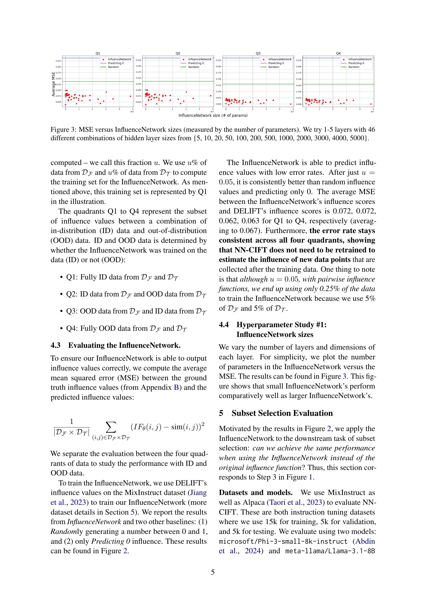

 


 2502.09969 
 Ishika Agarwal et el. 
 
 🤗 2025-02-18 
 



↗ arXiv


↗ Hugging Face


↗ Papers with Code


### TL;DR



기존의 데이터 영향도 함수는 대규모 언어 모델과 대규모 데이터셋에서 계산 비용이 많이 들고 일반화 성능이 떨어지는 문제가 있습니다. 이는 **전방 및 후방 전달 계산**, **모델 저장을 위한 많은 메모리 필요**, **새로운 데이터에 대한 영향도 추정의 일반화 성능 저하** 등이 원인입니다.

본 논문에서는 이러한 문제를 해결하기 위해 **InfluenceNetwork라는 작은 신경망을 사용하여 데이터 영향도를 추정하는 NN-CIFT 알고리즘**을 제안합니다.  NN-CIFT는 **기존 방법 대비 최대 99%의 비용 절감** 효과를 보였으며, **다양한 영향도 함수에서 성능 저하 없이 속도 향상**을 달성했습니다. **하이퍼파라미터 분석 및 다양한 데이터셋에서의 평가 결과**를 통해 NN-CIFT의 효율성과 효과를 입증했습니다.



#### Key Takeaways


 NN-CIFT는 기존 방법 대비 최대 99%의 비용 절감 효과를 달성했습니다. 



 NN-CIFT는 성능 저하 없이 기존 영향도 함수와 동등한 수준의 성능을 보였습니다. 



 NN-CIFT는 새로운 데이터에 대한 영향도 추정을 위해 재학습이 필요하지 않습니다. 


#### Why does it matter?
**본 논문은 효율적인 지시어 미세 조정을 위한 새로운 방법인 NN-CIFT를 제시하여, 대규모 언어 모델의 데이터 평가 비용을 최대 99%까지 절감하는 동시에 성능 저하 없이 빠른 속도를 달성합니다.**  이는 **데이터 선택 및 효율적인 모델 학습에 대한 연구에 큰 영향을 미칠** 것으로 예상됩니다.  **본 연구는 대규모 언어 모델의 활용을 제약하는 계산 비용 문제를 해결하는데 기여**하며, **다양한 분야의 연구자들에게 유용한 기법을 제공**합니다.

------
#### Visual Insights

> 🔼 NN-CIFT는 기존의 영향력 함수를 사용하여 영향력 네트워크(InfluenceNetwork)를 학습시키는 3단계 알고리즘입니다. 1단계에서는 기존 영향력 함수를 사용하여 훈련 데이터를 수집합니다. 2단계에서는 수집된 데이터를 사용하여 영향력 네트워크를 학습시키고, 나머지 데이터에 대한 영향력 값을 추정합니다. 3단계에서는 원래 영향력 함수에 해당하는 데이터 선택 알고리즘을 사용하여 IFT 데이터의 하위 집합을 선택하고, 이를 사용하여 모델을 미세 조정합니다.  이 그림은 NN-CIFT의 전체적인 과정을 보여줍니다.
> 

> 
read the caption

> Figure 1: Overview of NN-CIFT. The first step consists of using established influence functions to collect data for training the InfluenceNetwork. Next, the data from Step (1) is used to train the InfluenceNetwork and, subsequently, estimate the influence values for the rest of the data. Finally, the data selection algorithm corresponding to the original influence function is used to select a subset of IFT data to fine-tune a model on.
> 


| Method | Cost | Size |
|---|---|---|
| Pairwise |  |  |
| DELIFT (Agarwal et al., 2025) | \mathcal{O}(MN)\cdot F | 7-8B |
| DELIFT (SE) (Agarwal et al., 2025) | \mathcal{O}(MN)\cdot F | 355M |
| LESS (Xia et al., 2024) | \mathcal{O}(M+N)\cdot B | 7-8B |
| NN-CIFT (ours) | \mathcal{O}(MN)\cdot F | 205K |
| Pointwise |  |  |
| SelectIT (Liu et al., 2024a) | \mathcal{O}(M)\cdot F | 7-8B |
| NN-CIFT (ours) | \mathcal{O}(M)\cdot F | 205K |

> 🔼 표 1은 이전 연구에서 제안된 데이터 평가 방법들의 계산 복잡도를 보여줍니다.  계산 복잡도는 모델을 통한 순전파(F) 또는 역전파(B)의 횟수로 측정됩니다. 여기서 M은 미세 조정 데이터셋의 크기, N은 목표 데이터셋의 크기를 나타냅니다.  두 데이터셋은 모두 하위 집합 선택에 사용됩니다. 표에는 각 방법의 계산 복잡도와 사용된 모델의 크기(매개변수 수)도 함께 제시되어 있습니다.  더 자세한 내용은 부록 B.1을 참조하세요.  일반적으로 모델이 클수록 순전파와 역전파에 드는 비용이 높아집니다.
> 

> 
read the caption

> Table 1: Approximate computational complexity of data valuation in previous works measured by the cost of forward passes (F𝐹Fitalic_F) or the cost of backward passes (B𝐵Bitalic_B) through a model. M𝑀Mitalic_M and N𝑁Nitalic_N are the cardinality of 𝒟ℱsubscript𝒟ℱ\mathcal{D_{F}}caligraphic_D start_POSTSUBSCRIPT caligraphic_F end_POSTSUBSCRIPT and 𝒟𝒯subscript𝒟𝒯\mathcal{D_{T}}caligraphic_D start_POSTSUBSCRIPT caligraphic_T end_POSTSUBSCRIPT, a fine-tuning and target dataset respectively, we use for subset selection. See Appendix B.1 for more details. Size denotes the number of parameters of the corresponding model. Note: larger models have a higher cost for forward and back passes.
> 

### In-depth insights

#### Neural Data Valuation
신경망 데이터 평가는 **데이터의 영향력을 효율적으로 측정**하기 위해 신경망을 활용하는 새로운 접근 방식입니다. 기존의 데이터 평가 방법들은 계산 비용이 많이 들고 일반화가 어려운 경우가 많았지만, 신경망 기반 접근 방식은 **훨씬 적은 비용으로 효율적이고 일반화된 평가**를 가능하게 합니다.  본 연구에서는 영향력 네트워크(InfluenceNetwork)라는 작은 신경망을 이용하여 데이터의 영향력을 추정하고, **최대 99%의 비용 감소**를 달성했습니다. 이를 통해 대규모 언어 모델의 미세 조정에 필요한 데이터의 양을 줄이고, **성능 저하 없이 속도를 크게 향상**시키는 효과를 보였습니다.  하지만, 신경망 데이터 평가는 **사용하는 영향력 함수에 크게 의존**하며, 특정 작업이나 지속적인 학습에는 적용이 어려울 수 있다는 한계점도 있습니다.  **추가적인 연구**를 통해 이러한 한계점들을 보완하고 더욱 강력하고 범용적인 데이터 평가 방법을 개발하는 것이 필요합니다.

#### NN-CIFT Algorithm
NN-CIFT 알고리즘은 **대규모 언어 모델의 영향력을 효율적으로 추정하기 위해 소규모 신경망을 활용**하는 혁신적인 방법입니다. 기존의 영향력 함수는 계산 비용이 많이 들고 일반화 성능이 떨어지는 한계가 있었지만, NN-CIFT는 **훨씬 작은 크기의 신경망을 훈련하여 영향력 값을 빠르고 정확하게 추정**함으로써 이러한 문제점을 해결합니다.  **99%까지 비용을 절감하면서도 성능 저하 없이 빠른 속도를 달성**하는 것은 NN-CIFT의 주요 강점입니다.  본 알고리즘은 **지도 학습 방식**으로,  대규모 언어 모델을 이용해 얻은 영향력 값을 학습 데이터로 활용하여 소규모 신경망을 훈련합니다. 이후 훈련된 신경망을 사용해 새로운 데이터에 대한 영향력 값을 추정하며, 이를 통해 **효율적인 데이터 선택**에 기여합니다. **다양한 영향력 함수와 호환**되며,  **새로운 데이터에 대한 재훈련 없이도 영향력을 정확하게 추정**할 수 있다는 점 또한 주목할 만합니다.

#### Subset Selection IFT
본 논문에서 제시된Subset Selection IFT는 **효율적인 Instruction Fine-Tuning을 위한 데이터 선택 전략**입니다.  기존의 Instruction Fine-Tuning은 방대한 데이터셋을 사용하지만, 본 연구는 **신경망을 활용하여 데이터의 영향력을 효과적으로 평가**하고, 그 결과를 바탕으로 **소규모의 데이터셋만을 선택하여 Fine-Tuning**을 수행합니다. 이를 통해 막대한 계산 비용을 절감하면서도 성능 저하 없이 Fine-Tuning을 가능하게 합니다.  **NN-CIFT 알고리즘**은 데이터 가치를 효율적으로 평가하는 데 중점을 두어, 대용량 언어 모델의 계산 비용을 최소화합니다.  **다양한 영향력 함수**와의 호환성을 검증하고, 실험을 통해 **성능 저하 없이 속도 향상**을 달성했음을 보여줍니다.  **하이퍼파라미터 분석**을 통해 알고리즘의 안정성과 유연성을 확인하고, 다양한 데이터셋과 모델에 대한 적용 가능성을 제시합니다.  결론적으로, 본 연구는 **데이터 효율성을 극대화**하는 새로운 Instruction Fine-Tuning 방법론을 제시하여,  AI 모델 개발의 **비용과 시간을 절약**할 수 있는 중요한 발견입니다.

#### Efficiency Improvements
본 논문은 **NN-CIFT (Neural Networks for effiCient Instruction Fine-Tuning)** 라는 새로운 알고리즘을 제시하여 기존의 영향력 함수 기반 데이터 평가 방법의 비효율성 문제를 해결합니다.  **대규모 언어 모델을 사용하는 기존 방법은 계산 비용이 매우 높았지만, NN-CIFT는 소규모 신경망을 활용하여 최대 99%의 비용 절감 효과**를 달성했습니다. 이는 **영향력 값을 효율적으로 추정하는 InfluenceNetwork** 를 학습시켜 대용량 모델의 순전파 및 역전파 과정을 대체함으로써 가능했습니다.  **NN-CIFT는 성능 저하 없이 속도 향상**을 가져왔으며,  다양한 최첨단 영향력 함수들과의 비교 실험을 통해 성능과 효율성 모두를 입증했습니다. 또한, 새로운 데이터에 대한 영향력 추정을 위해 재훈련이 필요 없다는 장점도 확인했습니다.  **결과적으로, NN-CIFT는 데이터 평가 과정의 효율성을 획기적으로 개선**하여, 대규모 데이터셋을 활용한 효율적인 Instruction Fine-Tuning을 가능하게 하는 핵심 기술로 자리매김할 것으로 기대됩니다.

#### Future Work
본 논문은 효율적인 지시어 미세조정을 위한 신경망을 사용한 데이터 평가 방법인 NN-CIFT를 제시합니다.  **NN-CIFT는 기존의 영향 함수 계산의 높은 비용을 완화**하여, 대규모 언어 모델의 계산 비용을 크게 줄이는 것을 목표로 합니다.  하지만, **현재 NN-CIFT는 특정 데이터 선택 목표(예: 작업 특정 미세조정, 지속적 학습)에 적용되지 못한다는 한계**가 있습니다.  미래 연구 방향은 이러한 한계를 극복하기 위해 **데이터의 영향을 모델의 학습 역학에 대한 선형 시간 비용으로 추정하는 방법을 탐구**하는 것입니다. 또한, **다양한 영향 함수에 대한 NN-CIFT의 적용성을 더욱 확장**하고, 보다 **효율적이고 일반화된 데이터 선택 알고리즘**을 개발하는 연구가 필요합니다.  마지막으로, **NN-CIFT의 성능을 다양한 규모의 모델과 데이터셋**에서 평가하여 일반성을 확인하는 추가적인 실험이 필요합니다. 이러한 연구를 통해 NN-CIFT의 실용성을 높이고 더욱 폭넓은 분야에 적용할 수 있을 것입니다.

### More visual insights

More on figures

> 🔼 그림 2는 다양한 크기의 훈련 데이터(u)에 따른 InfluenceNetwork의 평균 제곱 오차(MSE)를 보여줍니다.  그림은 8가지 다른 훈련 데이터 크기에 대해 계산된 MSE를 각 사분면별로 나누어 보여줍니다. 이 결과는 DELIFT 영향도 값을 학습하는 경우에 해당합니다. 각 사분면의 오차율은 서로 다른 데이터 집합(Q1: 훈련, Q2/Q3: 검증, Q4: 테스트)에 대한 손실을 나타냅니다. 그림에서 알 수 있듯이, InfluenceNetwork는 u=0.05부터 불과 0.05%의 MSE를 달성하며, 항상 기준선보다 성능이 우수합니다.
> 

> 
read the caption

> Figure 2: MSE versus InfluenceNetwork training data size (u) plotted for 8 different training sizes, broken down by the quadrant. These results are for learning DELIFT influence values. Error rates on each quadrant correspond to losses across different sets: Q1 for training, Q2/Q3 for validation, and Q4 for testing. As shown, the InfluenceNetwork achieves MSE of merely 0.05% starting from u=0.05𝑢0.05u=0.05italic_u = 0.05 and always outperforms the baselines.
> 

> 🔼 그림 3은 다양한 크기의 InfluenceNetwork에 대한 평균 제곱 오차(MSE)를 보여줍니다.  여기서 네트워크 크기는 파라미터 수로 측정됩니다.  총 46가지의 서로 다른 은닉층 크기 조합(5, 10, 20, 50, 100, 200, 500, 1000, 2000, 3000, 4000, 5000)을 1~5개 층에 대해 실험하였습니다.  그림은 InfluenceNetwork의 크기가 커짐에 따라 MSE가 어떻게 변하는지 보여주며, 작은 네트워크도 큰 네트워크만큼 효과적일 수 있음을 시사합니다.
> 

> 
read the caption

> Figure 3: MSE versus InfluenceNetwork sizes (measured by the number of parameters). We try 1-5 layers with 46 different combinations of hidden layer sizes from {5, 10, 20, 50, 100, 200, 500, 1000, 2000, 3000, 4000, 5000}.
> 

### Full paper



