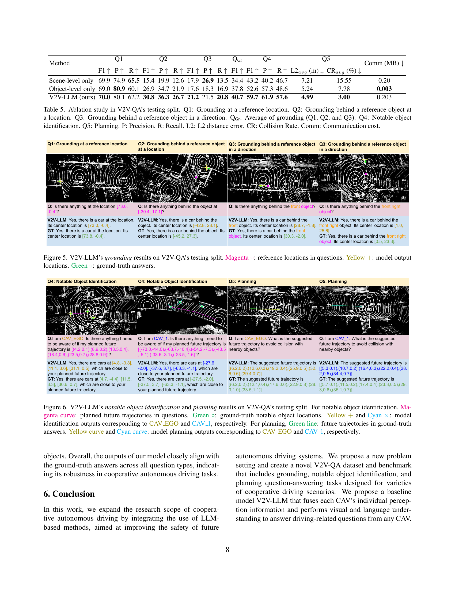

 


 2502.09980 
 Hsu-kuang Chiu et el. 
 
 🤗 2025-02-17 
 



↗ arXiv


↗ Hugging Face


### TL;DR



기존 자율 주행 시스템은 개별 센서에 의존하여 주변 환경을 인식하고 미래 경로를 계획하기 때문에, 센서 오류나 가림 현상 발생 시 안전 문제가 발생할 수 있습니다. 이러한 문제를 해결하기 위해 차량 간 통신을 이용한 협력적 인식 방법이 제안되었지만, 협력적 계획 성능에 대한 연구는 미흡했습니다. 본 논문에서는 **대규모 언어 모델(LLM)**을 활용하여 협력적 자율 주행 시스템을 구축하는 새로운 방법을 제안합니다. 제안된 시스템은 다수의 자율 주행 차량으로부터 수집된 인식 정보를 LLM에 통합하여 주행 관련 질문에 대한 답변을 생성합니다. 

본 논문에서는 **새로운 V2V-QA 데이터셋과 벤치마크**를 제시하고, 제안된 방법의 성능을 기존 방법과 비교 분석합니다. 실험 결과, 제안된 방법이 다양한 주행 관련 작업에서 우수한 성능을 보이며, 기존 방법보다 뛰어난 성능을 보임을 확인했습니다. 또한, 본 연구는 향후 자율 주행 시스템의 안전성을 향상시키기 위한 새로운 연구 방향을 제시합니다.



#### Key Takeaways


 대규모 언어 모델(LLM)을 이용한 차량 간 협력적 자율 주행 시스템 구축 



 V2V-QA 데이터셋 및 벤치마크 제시를 통한 객관적인 성능 평가 



 다양한 융합 기법 비교 분석을 통한 LLM 기반 협력적 자율 주행 시스템 설계에 대한 통찰력 제공 


#### Why does it matter?
이 논문은 **자율 주행 분야의 협력적 인식 및 계획 문제**를 해결하기 위한 새로운 연구 방향을 제시합니다. **대규모 언어 모델(LLM)**을 사용하여 다수의 자율 주행 차량으로부터 수집된 정보를 융합하고, 다양한 주행 관련 질문에 대한 답변을 생성하는 방법을 제안합니다. 이는 **자율 주행 시스템의 안전성 향상**에 크게 기여할 수 있으며, **새로운 데이터셋과 벤치마크**를 제공하여 향후 연구의 발전에 중요한 기여를 할 것으로 예상됩니다. 또한, **다양한 융합 기법**에 대한 비교 분석을 통해 LLM 기반 협력적 자율 주행 시스템 설계에 대한 통찰력을 제공합니다.

------
#### Visual Insights

> 🔼 그림 1은 제안된 V2V-LLM 기반 자율 주행 시스템의 개요를 보여줍니다. 여러 자율 주행 차량(CAV)들이 각각의 주변 환경 인식 데이터(센서 데이터)를 중앙 집중식 거대 언어 모델(LLM)과 공유합니다. 각 CAV는 필요에 따라 LLM에 질문을 하고, 안전 운전에 필요한 정보를 얻을 수 있습니다. 이러한 협력적인 인식 시스템을 통해 단일 차량의 센서 오류나 가림 현상으로 인한 위험을 줄일 수 있습니다.
> 

> 
read the caption

> Figure 1: Overview of our problem setting of LLM-based cooperative autonomous driving. All CAVs share their perception information with the LLM. Any CAV can ask the LLM a question to obtain useful information for driving safety.
> 


| Dataset | Publication | # CAVs | Sim/Real | # Frames | # QA | # QA/frame | Point Cloud | Planning |
|---|---|---|---|---|---|---|---|---|
| *AD* |  |  |  |  |  |  |  |  |
| NuScenes [3] | CVPR 2020 | - | Real | 400K | - | - | ✓ |  |
| Waymo [38] | CVPR 2020 | - | Real | 200K | - | - | ✓ |  |
| *Cooperative perception in AD* |  |  |  |  |  |  |  |  |
| OPV2V [52] | ICRA 2022 | 2-7 | Sim | 11K | - | - | ✓ |  |
| V2XSet [51] | ECCV 2022 | 2-5 | Sim | 11K | - | - | ✓ |  |
| V2V4Real [53] | CVPR 2023 | 2 | Real | 20K† | - | - | ✓ |  |
| V2X-Real [48]‡ | ECCV 2024 | 2 | Real | 33K | - | - | ✓ |  |
| *LLM-based AD* |  |  |  |  |  |  |  |  |
| NuScenes-QA [35] | AAAI 2024 | - | Real | 34K | 460K | 13.5 | ✓ |  |
| Lingo-QA [33] | ECCV 2024 | - | Real | 28K | 420K | 15.3 |  | ✓ |
| MAPLM-QA [4] | CVPR 2024 | - | Real | 14K | 61K | 4.4 | ✓ |  |
| DriveLM [37] | ECCV 2024 | - | Sim+Real | 69K | 2M | 29.1 |  | ✓ |
| TOKEN [39] | CoRL 2024 | - | Real | 28K | 434K | 15.5 |  | ✓ |
| OmniDrive-nuScenes [43] | arXiv 2024 | - | Real | 34K | 450K | 13.2 |  | ✓ |
| **V2V-QA (Ours)** | - | 2 | Real | 18K | **577K** | **31.7** | ✓ | ✓ |

> 🔼 표 1은 제안된 V2V-QA 데이터셋과 최근의 자율 주행(AD) 데이터셋들을 비교한 표입니다.  V2V-QA 데이터셋은 기존의 V2V4Real [53] 데이터셋의 학습 및 테스트 분할을 기반으로 제작되었으며, 검증 분할은 공개되지 않았습니다. V2X-Real [48] 데이터셋은 일부 데이터만 공개되었다는 점도 명시되어 있습니다. 표에는 각 데이터셋의 출처, 자율주행 차량(CAV) 수, 시뮬레이션/실제 데이터 여부, 프레임 수, 질문-답변(QA) 쌍의 수, 프레임당 QA 쌍의 수, 포인트 클라우드 및 계획 정보 유무 등이 포함되어 있어, V2V-QA 데이터셋의 특징과 다른 데이터셋들과의 차이점을 명확히 보여줍니다.
> 

> 
read the caption

> Table 1:  Comparison between our V2V-QA and recent related Autonomous Driving (AD) datasets. † This number of frames includes the validation split of V2V4Real [53], which is not released to the public. We build our V2V-QA upon the released training and testing splits of V2V4Real [53]. ‡ V2X-Real [48] only releases a subset of data to the public.
> 

### In-depth insights

#### V2V Cooperative Driving
본 논문은 차량 간 통신(V2V)을 활용한 협력적 자율주행에 대한 심층적인 논의를 제공합니다. **V2V 협력 주행은 개별 차량의 감지 능력의 한계를 극복하고 안전성 및 효율성을 향상시키는 데 중요한 역할**을 합니다. 논문에서는 센서 오류나 가림 현상으로 인한 신뢰성 저하 문제를 해결하기 위해, **V2V 통신을 통해 차량 간 정보를 공유하고 협력적인 인식 및 계획을 수행**하는 방법을 제시합니다. 특히, 대규모 언어 모델(LLM)을 활용하여 협력적인 자율 주행 시스템을 구축하는 새로운 접근 방식이 제시되며, 이는 기존의 감지 및 추적 중심의 방식에서 벗어나 전체적인 주행 계획 수립에 기여할 수 있는 가능성을 보여줍니다.  **다양한 질문-응답(QA) 쌍을 포함하는 V2V-QA 데이터셋과 벤치마크**가 제시되고, 제안된 V2V-LLM 모델은 다양한 협력적 자율 주행 과제에서 우수한 성능을 보입니다. 이는 **LLM 기반 통합 모델 아키텍처**가 향후 자율주행 시스템의 안전성 향상에 기여할 수 있음을 시사합니다.  하지만,  **센서 융합 방식의 선택에 따른 성능 차이와 같은 추가적인 연구**가 필요하며, 실제 도로 환경에서의 안전성과 신뢰성 검증 또한 중요한 과제입니다.

#### LLM in Perception
LLM을 지각에 적용하는 것은 **자율 주행 시스템의 혁신적인 발전**을 가져올 수 있는 매우 유망한 영역입니다.  **LLM의 강력한 패턴 인식 및 추론 능력**은 다양한 센서 데이터(카메라, 라이다, 레이더 등)를 통합하고 해석하여 보다 정확하고, 견고하며, 상황에 맞는 지각을 가능하게 합니다. 기존의 지각 시스템은 주로 개별 센서 데이터에 의존하여, 특정 조건(예: 센서 오류, 시야 가림)에서 성능이 저하될 수 있었습니다. 하지만, **LLM은 다양한 데이터 소스에서 얻은 정보를 종합**하여 이러한 제한을 극복하고 더 나은 성능을 발휘할 수 있습니다.  **LLM을 기반으로 한 지각 시스템은 객체 탐지, 분류, 추적 등 다양한 과제를 수행**할 수 있으며, **예측 및 계획과의 통합** 또한 가능합니다.  이는 자율 주행 시스템의 안전성과 신뢰성을 향상시키는 데 크게 기여할 것으로 기대됩니다. 그러나, **LLM의 높은 계산 비용, 데이터 편향 문제, 설명가능성 부족** 등의 어려움도 존재합니다.  **미래 연구는 이러한 한계를 극복하기 위한 방법론 개발**에 집중해야 할 것입니다.  특히, **데이터 증강, 모델 경량화, 설명가능한 AI 기술** 등을 활용하여 실제 자율 주행 환경에 적용 가능한 LLM 기반 지각 시스템을 개발하는 것이 중요합니다.

#### V2V-QA Dataset
본 논문에서 제시된 V2V-QA 데이터셋은 **자율주행 환경에서 차량 간 협력적 인식 및 계획을 위한 새로운 벤치마크**를 제공합니다. 기존의 V2V 데이터셋들이 주로 객체 검출 및 추적에 초점을 맞춘 것과 달리, V2V-QA는 **자연어 질문응답 방식**을 도입하여 **다양한 주행 관련 질문(grounding, notable object identification, planning)**에 대한 답변을 포함합니다. 이를 통해, **LLM 기반 자율주행 시스템의 전반적인 성능 평가**가 가능해지며, 특히 **센서 오클루전과 같은 안전 중요 상황**에서의 모델 성능을 보다 정확하게 평가할 수 있습니다.  **다중 차량 간의 협력적 인식**을 고려하여 생성된 데이터셋이라는 점도 중요한 특징이며, **실제 도로 환경에서 수집된 V2V4Real 데이터셋**을 기반으로 하여 현실적인 상황을 반영하고 있습니다.  **다양한 유형의 질문과 답변 쌍**을 제공함으로써, 향후 LLM 기반 자율주행 시스템 연구 및 개발에 중요한 기여를 할 것으로 예상됩니다.

#### V2V-LLM Model
V2V-LLM 모델은 **다중 모드 거대 언어 모델(MLLM)**을 사용하여 차량 간 협력 자율 주행을 위한 새로운 접근 방식을 제시합니다. 이 모델은 여러 자율 주행 차량(CAV)의 개별적인 인식 정보를 융합하여 운전 관련 질문에 대한 답변을 생성합니다. **주요 강점**은 다양한 운전 과제(예: 지상 확인, 주목할 만한 물체 식별, 계획)를 통합된 아키텍처로 수행하는 **통합 모델**이라는 점입니다. 기존의 단순한 융합 방식과 비교하여 V2V-LLM은 **상당한 성능 향상**을 보였으며, 특히 중요한 과제인 주목할 만한 물체 식별 및 계획 부분에서 탁월한 성과를 나타냈습니다. 이는 **안전성 향상**에 크게 기여할 수 있는 잠재력을 시사합니다.  하지만, **제한점**으로는 HD 지도 정보의 부재로 인해 계획 수립의 정확성이 제한될 수 있다는 점이 있으며, 이는 향후 연구에서 해결해야 할 과제입니다.

#### Future of V2V
V2V (Vehicle-to-Vehicle) 통신의 미래는 **자율주행의 핵심**이 될 것입니다.  **안전성과 효율성 향상**에 크게 기여할 수 있는 기술이며,  **첨단 운전자 지원 시스템 (ADAS)** 및 **자율주행 시스템**의 발전과 밀접한 관련이 있습니다.  향후 V2V 기술은 **더욱 정교한 통신 프로토콜**과 **확장된 통신 범위**를 갖게 될 것이며, **다양한 센서 데이터**의 통합 및 **인공지능 기반의 지능형 분석**을 통해 더욱 정확하고 안전한 운전 환경을 제공할 것입니다. **사물인터넷 (IoT)** 기술과의 결합을 통해 **도로 인프라와의 상호 작용**이 강화되어 **교통 흐름 최적화** 및 **교통 사고 감소**에도 기여할 것으로 예상됩니다.  하지만, **데이터 보안 및 프라이버시 문제**, **네트워크 안정성 확보**, 그리고 **표준화 및 규제** 등 해결해야 할 과제들도 존재합니다.  이러한 과제들을 극복하기 위한 노력이 병행되어야 **V2V 기술의 잠재력**을 완전히 실현할 수 있을 것입니다.

### More visual insights

More on figures

> 🔼 그림은 자율 주행 차량의 협력적 인식 및 계획 문제 설정을 보여줍니다. (a)는 참조 위치에서의 접지 작업을 보여줍니다. 질문은 특정 위치에 어떤 물체가 있는지 묻고, 답변은 해당 위치의 물체를 식별합니다. 이는 자율 주행 시스템이 주변 환경을 이해하고 안전하게 주행 경로를 계획하는 데 중요한 역할을 합니다.  이 그림은 V2V-QA 데이터셋의 다섯 가지 질문 유형 중 하나를 보여주는 예시입니다.
> 

> 
read the caption

> (a) Q1: Grounding at a reference location.
> 

> 🔼 그림 (b)는 V2V-QA 데이터셋의 질문 유형 중 하나인 '기준 객체 뒤 특정 위치에 있는 객체 식별'을 보여줍니다.  자율 주행 차량이 앞의 차량에 가려 뒤쪽 상황을 인식하지 못하는 경우, 다른 차량의 정보를 활용하여 숨겨진 객체를 찾는 문제를 다룹니다. 그림은 질문(Q)과 답변(A)의 예시와 함께, 기준 객체(reference object)의 위치와 그 뒤에 위치한 객체(object)를 가리키는 화살표를 보여줍니다.  이를 통해, 다양한 각도와 거리에서 발생하는 가림 현상에 대한 질문과 답변을 생성하고 이를 자율 주행 시스템의 협력적 지각 성능을 평가하는 데 활용하는 방법을 제시합니다.
> 

> 
read the caption

> (b) Q2: Grounding behind a reference object at a location.
> 

> 🔼 이 그림은 V2V-QA 데이터셋의 질문-답변 쌍 유형 중 하나인, 기준 물체의 방향 뒤에 있는 물체를 식별하는 질문에 대한 설명입니다. 그림은 자율주행 차량의 시각적 인식 정보를 바탕으로 질문(예: 앞쪽 물체 뒤에 무엇이 있습니까?)과 답변(예: [x1, y1] 위치에 차량이 있습니다)의 예시를 보여줍니다. 이 유형의 질문은 자율 주행 시스템이 부분적으로 가려진 물체를 감지하고 위험을 평가하는 능력을 평가하기 위한 것입니다.
> 

> 
read the caption

> (c) Q3: Grounding behind a reference object in a direction.
> 

> 🔼 그림 (d)는 자율 주행 시스템이 계획된 경로 주변의 주목할 만한 물체를 식별하는 능력을 평가하는 질문과 답변 쌍을 보여줍니다.  자율 주행 차량은 계획된 경로 근처에 있는 주목할 만한 물체를 식별하고 충돌을 피하기 위해 경로 계획을 조정해야 합니다. 이 질문은 3초 후의 예상 경로 상의 6개의 지점을 참조 지점으로 사용하고, 각 참조 지점에서 10미터 이내에 있는 최대 3개의 가장 가까운 물체를 식별하도록 합니다. 그림은 예시 질문과 답변을 보여주는 것 외에, 질문에 대한 답변으로서 각각의 물체의 위치를 표시하는 검출된 물체를 보여줍니다.
> 

> 
read the caption

> (d) Q4: Notable object identification.
> 

> 🔼 그림은 자율 주행 시스템의 계획 단계를 보여줍니다. 여러 자율 주행 차량(CAV)이 중앙 집중식 LLM 컴퓨팅 노드와 통신하여 주변 환경에 대한 인식 정보를 공유합니다. 임의의 CAV는 자연어로 LLM에 질문하여 안전한 주행에 필요한 정보를 얻을 수 있습니다. LLM은 여러 CAV에서 받은 정보를 종합하고 CAV의 질문에 대한 자연어 답변을 제공합니다. 그림 (e)에서는 계획 질문과 답변을 보여줍니다. 계획 질문은 CAV의 예상 경로와 주변 환경에 대한 정보를 바탕으로 안전하고 효율적인 경로를 계획하는 것입니다. 계획 답변은 충돌을 피하기 위한 제안 경로를 보여줍니다.
> 

> 
read the caption

> (e) Q5: Planning.
> 

> 🔼 그림 2는 제안된 V2V-QA 데이터셋의 다섯 가지 질문-답변 쌍 유형을 보여줍니다. 각 질문-답변 쌍은 자율 주행 상황에서 안전에 중요한 다양한 질문 유형을 다룹니다. 첫 번째 유형은 특정 위치에 대한 정보를 요구하는 기본적인 질문입니다. 두 번째와 세 번째 유형은 특정 물체 뒤 또는 특정 방향에 있는 물체의 위치를 질문하는 더욱 복잡한 질문입니다. 네 번째 유형은 예상 경로 근처에 있는 주목할 만한 물체에 대한 정보를 질문합니다. 마지막 유형은 충돌을 피하기 위한 최적의 경로 계획을 질문하는 안전에 매우 중요한 질문입니다. 그림에서 화살표는 여러 자율 주행 차량(CAV)에서 LLM으로 전달되는 인식 데이터를 나타냅니다. 각 질문-답변 쌍에는 그래픽 예시와 함께 자연어 질문과 답변이 포함되어 있어 이해도를 높였습니다.
> 

> 
read the caption

> Figure 2:  Illustration of V2V-QA’s 5555 types of QA pairs. The arrows pointing at LLM indicate the perception data from CAVs.
> 

> 🔼 그림 3은 제안된 협력 자율 주행을 위한 V2V-LLM 모델의 다이어그램을 보여줍니다. 여러 자율 주행 차량(CAV)에서 수집된 시각적 정보(LiDAR 포인트 클라우드 기반)는 3D 객체 검출기를 통해 특징 맵과 객체 수준 특징 벡터로 처리됩니다. 이러한 특징들은 다중 모드 대규모 언어 모델(MLLM)인 V2V-LLM에 입력으로 전달되어, 각 CAV가 질문을 제기하여 안전에 중요한 정보를 얻을 수 있게 합니다. V2V-LLM은 다양한 질문 유형 (예: 위치 확인, 주목할 만한 물체 식별, 계획 수립)에 대한 자연어 답변을 생성합니다. 이는 단일 모델 아키텍처로 다양한 협력 자율 주행 작업을 수행할 수 있음을 시사합니다.
> 

> 
read the caption

> Figure 3: Model diagram of our proposed V2V-LLM for cooperative autonomous driving.
> 

> 🔼 그림 4(a)는 제안된 V2V-LLM 모델과 비교할 다양한 기준 방법론의 특징 인코더 다이어그램을 보여줍니다. 이 그림은 하나의 CAV의 LiDAR point cloud만을 사용하는 No fusion 방법을 보여줍니다. 3D 객체 검출기가 장면 수준 특징 맵과 객체 수준 특징 벡터를 추출하고, 이것들이 LLM에 시각적 입력으로 제공됩니다. 다른 CAV의 센서 입력은 무시되므로 성능이 다른 모든 협력적 인식 방법보다 떨어질 것으로 예상됩니다.
> 

> 
read the caption

> (a) No fusion
> 

> 🔼 그림 (b)는 초기 융합 방식을 보여줍니다. 두 대의 자율 주행 차량(CAV)에서 얻은 라이더 포인트 클라우드를 먼저 병합한 후, 3D 객체 검출기를 사용하여 시각적 특징을 추출합니다. 추출된 시각적 특징은 LLM의 시각적 입력으로 사용됩니다. 이 방식은 모든 원시 센서 입력을 사용함으로써 좋은 성능을 달성할 수 있지만, 다른 융합 방식에 비해 높은 통신 대역폭을 필요로 합니다. 실제 자율 주행 환경에서의 배포에는 비현실적일 수 있습니다.
> 

> 
read the caption

> (b) Early fusion
> 

> 🔼 그림은 논문의 5.1절 (기준 방법)에서 다루는 세 가지 특징 추출 방법 중 하나인 중간 융합 방법을 보여줍니다.  이 방법은 여러 자율 주행 차량(CAV)에서 얻은 장면 수준 특징 맵(feature maps)들을 융합하는 방법입니다.  특히,  [50, 51, 52]에서 제안된 기존의 협력적 객체 탐지 모델들을 사용하여 각 CAV의 포인트 클라우드 데이터를 처리하고, 이들의 특징맵들을 융합한 후, LLM에 전달합니다.  단순히 모든 데이터를 합치는 초기 융합이나 각각 처리 후 결과만을 합치는 후기 융합과는 달리,  중간 융합은 여러 차량의 데이터를 효율적으로 결합하여 좀 더 정확한 정보를 LLM에 제공하는 것을 목표로 합니다.
> 

> 
read the caption

> (c) Intermediate fusion [50, 51, 52]
> 

> 🔼 그림 4는 서로 다른 융합 방식을 사용하는 기준 방법들의 특징 인코더 다이어그램을 보여줍니다.  세 가지 기준 방법 (no fusion, early fusion, intermediate fusion)은 다양한 방식으로 다중 차량으로부터 얻은 LiDAR 포인트 클라우드 데이터를 융합하여 사용합니다.  No fusion은 단일 차량의 LiDAR 데이터만 사용하는 반면, early fusion은 모든 차량의 LiDAR 데이터를 먼저 결합한 후 특징을 추출합니다. intermediate fusion은 여러 차량의 특징 맵을 융합하여 사용합니다. 이와 달리 제안된 V2V-LLM은 각 차량이 개별적으로 3D 객체 검출을 수행하여 장면 레벨 특징 맵과 객체 레벨 특징 벡터를 추출하고, 이를 LLM에 전달하여 다양한 차량의 정보를 융합하는 방식을 사용합니다.
> 

> 
read the caption

> Figure 4:  Feature encoder diagrams of the baseline methods from different fusion approaches.
> 

> 🔼 그림 5는 제안된 V2V-LLM 모델이 V2V-QA 데이터셋의 테스트셋에서 질의 위치를 기반으로 객체를 찾는 성능을 보여줍니다. 질문에 포함된 참조 위치는 마젠타색 점(∘)으로 표시되고, 모델이 예측한 객체 위치는 노란색 점(+)으로 표시되며, 실제 객체 위치는 녹색 점(∘)으로 표시되어 모델의 정확도를 평가할 수 있도록 합니다.  V2V-LLM은 다양한 질의 유형에 대해 정확한 객체 위치를 예측하는 능력을 보여줍니다.
> 

> 
read the caption

> Figure 5: V2V-LLM’s grounding results on V2V-QA’s testing split. Magenta ∘\circ∘: reference locations in questions. Yellow +++: model output locations. Green ∘\circ∘: ground-truth answers.
> 

> 🔼 그림 6은 제안된 V2V-LLM 모델의 주요 객체 식별 및 계획 결과를 보여줍니다. V2V-QA 테스트 집합에 대한 결과입니다. 주요 객체 식별의 경우, 자주색 곡선은 질문에 제시된 계획된 미래 궤적을 나타내고, 초록색 점은 실제 주요 객체 위치를, 노란색 및 청록색 표시는 각각 CAV_EGO 및 CAV_1에 해당하는 모델 식별 결과입니다. 계획의 경우, 초록색 선은 실제 답변의 미래 궤적을 나타내고, 노란색 및 청록색 곡선은 각각 CAV_EGO 및 CAV_1에 해당하는 모델 계획 결과입니다.
> 

> 
read the caption

> Figure 6: V2V-LLM’s notable object identification and planning results on V2V-QA’s testing split. For notable object identification, Magenta curve: planned future trajectories in questions. Green ∘\circ∘: ground-truth notable object locations. Yellow +++ and Cyan ×\times×: model identification outputs corresponding to CAV_EGO and CAV_1, respectively. For planning, Green line: future trajectories in ground-truth answers. Yellow curve and Cyan curve: model planning outputs corresponding to CAV_EGO and CAV_1, respectively.
> 

> 🔼 이 그림은 V2V-QA 데이터셋에서 질문 유형 Q1 (기준 위치에서의 접지)에 대한 정답 위치의 분포를 보여줍니다.  그림 (a)는 x축(미터)에 따른 확률 밀도를, 그림 (b)는 y축(미터)에 따른 확률 밀도를, 그림 (c)는 CAV를 기준으로 한 거리(미터)에 따른 확률 밀도를, 그리고 그림 (d)는 각도(도)에 따른 확률 밀도를 나타냅니다. 이를 통해 V2V-QA 데이터셋에서 접지 질문의 공간적 분포가 다양함을 확인할 수 있습니다.
> 

> 
read the caption

> (a) x (meters)
> 

> 🔼 이 그림은 V2V-QA 데이터셋에서 참조 객체 뒤에 있는 객체의 위치를 찾는 질문 유형(Q2)에 대한 정답 위치의 분포를 보여줍니다. 그래프는 x축(미터), y축(미터), 거리(미터), 각도(도)에 따른 확률 밀도를 나타냅니다. 이를 통해 Q2 질문 유형의 정답 위치가 CAV(자율 주행 차량)를 기준으로 어떻게 분포하는지 확인할 수 있습니다.
> 

> 
read the caption

> (b) y (meters)
> 

> 🔼 이 그림은 V2V-QA 데이터셋의 질문 유형 중 하나인, 기준 물체 뒤의 물체를 찾는 질문(Q3)에 대한 정답 위치의 분포를 보여줍니다. 정답 위치는 질문하는 자율 주행 차량(CAV)을 기준으로 거리와 각도로 표현됩니다. 그래프는 x축에 거리, y축에 각도를 나타내며, 정답 위치의 밀도를 히스토그램으로 표시합니다. 이를 통해 Q3 질문 유형에 대한 정답 분포의 특징을 파악할 수 있습니다.
> 

> 
read the caption

> (c) distance (meters)
> 

> 🔼 이 그림은 V2V-QA 데이터셋에서 질문 유형 Q2 (기준 물체 뒤의 특정 위치에 있는 물체 식별)에 대한 정답 위치의 각도 분포를 보여줍니다.  각도는 자율 주행 차량의 전방을 기준으로 측정되며, 그래프는 다양한 각도에서 정답이 얼마나 자주 나타나는지를 보여줍니다. 이는 데이터셋의 다양성과 현실성을 평가하는 데 도움이 됩니다.
> 

> 
read the caption

> (d) angle (degrees)
> 

> 🔼 그림 7은 V2V-QA 데이터셋의 Q1 질문 유형(기준 위치에서의 지점 확인)에 대한 정답 위치의 분포를 보여줍니다.  x축은 차량의 전방 방향, y축은 차량의 오른쪽 방향을 나타내며, 각 히스토그램은 x좌표, y좌표, 차량으로부터의 거리, 그리고 각도의 분포를 보여줍니다. 이를 통해, 기준 위치를 중심으로 한 다양한 위치에 대한 정답이 존재함을 시각적으로 확인할 수 있습니다.  이는 모델이 다양한 위치에서의 객체 인식 능력을 평가하는 데 도움이 됩니다.
> 

> 
read the caption

> Figure 7:  The distribution of ground-truth answer locations relative to CAV in V2V-QA’s Q1: Grounding at a reference location.
> 

> 🔼 이 그림은 V2V-QA 데이터셋에서 질문 유형 Q1(기준 위치에서의 접지)에 대한 정답 위치의 분포를 보여줍니다.  그림 (a)는 x축(미터), (b)는 y축(미터), (c)는 CAV로부터의 거리(미터), (d)는 각도(도)를 나타냅니다.  x축은 CAV의 전방 방향, y축은 CAV의 우측 방향을 나타냅니다. 이 분포는 자율 주행 시나리오에서 다양한 공간적 분포를 보여줍니다.
> 

> 
read the caption

> (a) x (meters)
> 

> 🔼 그림 (b)는 V2V-QA 데이터셋에서 질문 유형 Q2 (기준 객체 뒤의 특정 위치에 대한 질문)에 대한 정답 위치의 y좌표 분포를 보여줍니다.  y축은 CAV(자율 주행 차량)의 오른쪽 방향을 나타내며, 그래프는 정답 위치의 y좌표가 CAV의 중심을 기준으로 어떻게 분포하는지를 보여줍니다.  이 분포는 V2V-QA 데이터셋에 다양한 질문과 답변이 포함되어 있음을 시각적으로 보여주는 역할을 합니다.
> 

> 
read the caption

> (b) y (meters)
> 

> 🔼 이 그림은 V2V-QA 데이터셋의 질문-답변 쌍 중에서, 참조 객체 뒤에 있는 물체의 위치를 파악하는 질문 유형(Q3)에 대한 정답 위치의 분포를 보여줍니다.  그림은 x축(미터), y축(미터), 거리(미터), 각도(도) 네 가지 측면에서 정답 위치의 분포를 히스토그램으로 나타냅니다. 이를 통해 Q3 질문 유형에 대한 정답 데이터의 분포 특성을 자세히 이해할 수 있습니다.
> 

> 
read the caption

> (c) distance (meters)
> 

> 🔼 그림은 V2V-QA 데이터셋의 질문-답변 쌍 중, 참조 객체 뒤의 객체를 특정 방향에서 찾는 작업(Q3)에 대한 정답 위치의 분포를 보여줍니다.  그래프는 x축(미터), y축(미터), 거리(미터), 각도(도)에 따른 확률 밀도를 나타내며, 각도는 질문하는 차량(CAV)의 전방을 기준으로 합니다. 이를 통해 Q3 작업의 데이터 분포가 다양함을 확인할 수 있습니다.
> 

> 
read the caption

> (d) angle (degrees)
> 

> 🔼 그림 8은 V2V-QA 데이터셋의 Q2 질문 유형(기준 객체 뒤 특정 위치에 있는 객체 식별)에 대한 정답 위치의 분포를 보여줍니다.  x축은 차량의 전방 방향, y축은 차량의 우측 방향을 나타내며, 각 히스토그램은 x좌표, y좌표, 기준 객체와의 거리, 그리고 각도에 대한 정답 위치의 분포를 보여줍니다. 이를 통해, Q2 질문 유형에 대한 정답 위치가 데이터셋 내에서 어떻게 분포되어 있는지를 시각적으로 확인할 수 있습니다.  이는 모델 성능 평가 및 분석에 유용한 정보를 제공합니다.
> 

> 
read the caption

> Figure 8:  The distribution of ground-truth answer locations relative to CAV in V2V-QA’s Q2: Grounding behind a reference object at a location.
> 

> 🔼 이 그림은 V2V-QA 데이터셋에서 질문 유형 Q1(기준 위치에서의 접지)에 대한 정답 위치의 분포를 보여줍니다.  (a)는 x축(미터)을, (b)는 y축(미터)을, (c)는 CAV(자율 주행 차량)에 대한 거리(미터)를, (d)는 각도(도)를 나타냅니다.  x축은 CAV의 전방 방향을, y축은 CAV의 우측 방향을 나타냅니다. 이 히스토그램은 V2V-QA 데이터셋에서 다양한 공간적 분포를 보여줍니다.
> 

> 
read the caption

> (a) x (meters)
> 

> 🔼 그림 8(b)는 V2V-QA 데이터셋의 Q2 질문 유형에 대한 실험 결과를 보여줍니다. Q2 질문 유형은 참조 객체 뒤에 있는 물체의 위치를 파악하는 질문입니다. 이 그림은 참조 객체 뒤에 위치한 물체의 y 좌표(세로축) 분포를 보여주는 히스토그램입니다. x축은 y 좌표(미터 단위)이고 y축은 확률 밀도입니다. 이 히스토그램을 통해 Q2 질문 유형에서 참조 객체 뒤에 위치한 물체의 y 좌표 분포를 확인할 수 있습니다. 이는 모델의 성능 평가에 유용한 정보를 제공합니다.
> 

> 
read the caption

> (b) y (meters)
> 

> 🔼 이 그림은 V2V-QA 데이터셋에서 질문 유형 2(참고 객체 뒤에 있는 객체를 위치로 지정)에 대한 정답 위치의 분포를 보여줍니다.  그림은 정답 위치의 x좌표, y좌표, 참고 위치로부터의 거리, 그리고 각도를 각각 히스토그램으로 나타냅니다. 이를 통해 V2V-QA 데이터셋에서 질문 유형 2의 정답 위치 분포 특징을 파악할 수 있습니다.
> 

> 
read the caption

> (c) distance (meters)
> 

> 🔼 이 그림은 V2V-QA 데이터셋에서 질문 유형 Q2 (기준 물체 뒤의 특정 위치에 있는 물체 식별)에 대한 정답 위치의 각도 분포를 보여줍니다. 각도는 CAV(자율 주행 차량)의 전방을 0도로 하여 측정됩니다. 이 히스토그램은 모델이 Q2 유형 질문에 대해 얼마나 다양한 각도의 정답을 생성하는지 보여주는 통계적 정보를 제공합니다.
> 

> 
read the caption

> (d) angle (degrees)
> 

> 🔼 그림 9는 V2V-QA 데이터셋의 Q3 질문 유형(기준 물체 뒤의 특정 방향에 있는 물체 식별)에 대한 정답 위치의 분포를 보여줍니다.  그래프는 CAV(자율 주행 차량)를 기준으로 정답 위치의 x 좌표, y 좌표, CAV로부터의 거리, 그리고 각도 분포를 히스토그램으로 나타냅니다. 이를 통해 Q3 질문 유형에 대한 정답 분포의 특징을 파악하고, 모델이 이러한 분포를 얼마나 잘 학습하는지 평가하는 데 도움이 됩니다.  x축은 CAV 전방 방향을, y축은 CAV 우측 방향을 나타냅니다.
> 

> 
read the caption

> Figure 9:  The distribution of ground-truth answer locations relative to CAV in V2V-QA’s Q3: Grounding behind a reference object in a direction.
> 

> 🔼 이 그림은 V2V-QA 데이터셋에서 질문 유형 Q1(기준 위치에서의 접지)에 대한 정답 위치의 분포를 보여줍니다. x축은 차량의 전방 방향을 나타내고, y축은 차량의 오른쪽 방향을 나타냅니다. 그림 (a)는 x좌표, 그림 (b)는 y좌표, 그림 (c)는 차량으로부터의 거리, 그림 (d)는 각도에 대한 히스토그램을 보여줍니다. 이 히스토그램은 V2V-QA 데이터셋에서 다양한 공간 분포를 보여줍니다.
> 

> 
read the caption

> (a) x (meters)
> 

> 🔼 그림은 V2V-QA 데이터셋에서 참조 객체 뒤에 있는 객체의 위치를 찾는 질문에 대한 답변의 y좌표 분포를 보여줍니다. x축은 y좌표(미터)이고, y축은 확률 밀도입니다. 이 히스토그램은 V2V-QA 데이터셋에 있는 다양한 공간적 분포를 보여주는 여러 그림 중 하나입니다.
> 

> 
read the caption

> (b) y (meters)
> 

> 🔼 이 그림은 V2V-QA 데이터셋의 질문 유형 중 하나인, 기준 물체 뒤의 특정 방향에 있는 물체를 찾는 질문(Q3)에 대한 정답 위치의 분포를 보여줍니다. 그림의 (c)는 질문에 대한 정답 위치가 질문하는 자율주행차의 위치로부터 떨어진 거리를 나타냅니다.  x축은 거리(미터)이고, y축은 확률 밀도를 나타냅니다. 이 분포는 자율 주행 차량의 주변 환경과 상황에 따라 정답 위치가 얼마나 다양하게 분포하는지를 보여주는 통계적 정보를 제공합니다.
> 

> 
read the caption

> (c) distance (meters)
> 

> 🔼 이 그림은 V2V-QA 데이터셋에서 질문 유형 Q2 (기준 물체 뒤의 특정 위치에 있는 물체 식별)에 대한 정답 위치의 각도 분포를 보여줍니다.  x축은 각도 (도)이고 y축은 확률 밀도입니다. 이 분포는 자율 주행 시스템이 기준 물체 뒤의 물체를 정확하게 식별하는 데 어려움을 겪는 다양한 각도 상황을 보여줍니다. 즉,  기준 물체 뒤에 있는 물체를 감지하는 데 있어 각도가 중요한 요소임을 시각적으로 보여줍니다.
> 

> 
read the caption

> (d) angle (degrees)
> 

> 🔼 그림 10은 V2V-QA 데이터셋의 Q4 질문 유형(주목할 만한 물체 식별)에 대한 정답 위치의 분포를 보여줍니다.  정답 위치는 질문을 한 자율주행 차량(CAV)의 위치를 기준으로 상대적인 좌표계(x, y, 거리, 각도)로 표현됩니다. 이 그림은 각 좌표계에서 정답 위치의 분포를 히스토그램으로 나타내어, 자율주행 차량 주변에서 주목할 만한 물체가 어디에 위치하는지에 대한 통계적 정보를 제공합니다. 이러한 정보는 자율주행 시스템의 안전성 및 효율성을 향상시키는 데 중요한 역할을 합니다.
> 

> 
read the caption

> Figure 10:  The distribution of ground-truth answer locations relative to CAV in V2V-QA’s Q4: Notable object identification.
> 

> 🔼 이 그림은 V2V-QA 데이터셋에서 질문 유형 Q1(기준 위치에서의 접지)에 대한 정답 위치의 분포를 보여줍니다.  x축은 차량의 전방 방향을 나타내고, y축은 차량의 오른쪽 방향을 나타냅니다.  (a)는 x좌표, (b)는 y좌표, (c)는 기준 위치로부터의 거리, (d)는 각도를 나타냅니다. 히스토그램은 정답 위치가 데이터셋에서 어떻게 분포되어 있는지 시각적으로 보여줍니다. 이는 모델 성능 평가에 중요한 정보를 제공합니다.
> 

> 
read the caption

> (a) x (meters)
> 

> 🔼 그림 7(b)는 V2V-QA 데이터셋의 Q1 질문 유형(기준 위치에서의 접지)에 대한 정답 위치의 y축 분포를 보여줍니다. 이 히스토그램은 자율 주행 차량(CAV)을 기준으로 하여 정답 위치의 y좌표가 어떻게 분포하는지 보여주는 시각적 표현입니다.  자율 주행 시스템의 성능 평가에 도움이 되는 정보를 제공합니다.
> 

> 
read the caption

> (b) y (meters)
> 

> 🔼 이 그림은 V2V-QA 데이터셋의 질문 유형 중 하나인 '기준 객체 뒤의 객체 방향 지정'(Q3)에 대한 정답 위치의 분포를 보여줍니다.  그림은 x축(미터), y축(미터), 거리(미터), 각도(도)의 4가지 측면에서 기준 객체 뒤에 위치한 객체의 상대적 위치를 히스토그램으로 나타냅니다.  이는 자율주행 시스템이 다양한 상황에서 객체의 위치를 정확하게 파악하는 능력을 평가하는 데 사용됩니다.
> 

> 
read the caption

> (c) distance (meters)
> 

> 🔼 이 그림은 V2V-QA 데이터셋의 Q2 질문 유형(기준 물체 뒤에 특정 위치에 있는 물체 감지)에 대한 정답 위치의 각도 분포를 보여줍니다. 각도는 CAV(자율 주행 차량)의 전방을 0도로 하여 측정됩니다. 그래프는 정답 위치의 각도가 다양하게 분포되어 있음을 보여주며, 특히 0도 부근에 집중되어 있지 않음을 보여줍니다. 이는 V2V-QA 데이터셋이 다양한 주행 환경을 포함하고 있음을 시사합니다.
> 

> 
read the caption

> (d) angle (degrees)
> 

> 🔼 그림 11은 V2V-QA 데이터셋의 Q5 질문 유형(주행 계획)에 대한 정답 위치의 분포를 보여줍니다.  x축은 차량의 전방 방향, y축은 차량의 오른쪽 방향을 나타내며, 각 히스토그램은 x좌표, y좌표, 차량으로부터의 거리, 그리고 각도의 분포를 보여줍니다. 이 그림은 자율주행 시나리오에서 계획된 경로 상의 중요한 물체를 식별하는 질문에 대한 정답 위치가 다양한 공간적 분포를 가짐을 보여줍니다.
> 

> 
read the caption

> Figure 11:  The distribution of ground-truth answer locations relative to CAV in V2V-QA’s Q5: Planning.
> 

> 🔼 그림 12는 V2V-QA 테스트 집합에 대한 V2V-LLM 및 기준 방법의 그라운딩 결과를 보여줍니다. 이 그림은 질문에 제시된 참조 위치(마젠타색 원), 모델 출력 위치(노란색 플러스), 그리고 실제 정답 위치(초록색 원)를 보여줍니다.  V2V-LLM은 여러 차량(CAV)의 지각 정보를 융합하여 질문에 대한 답을 생성하는 다중 모달 LLM(MLLM) 기반의 협력 자율 주행 모델입니다. 이 그림에서는 V2V-LLM이 그라운딩 작업에서 어떻게 정확한 결과를 생성하는지, 그리고 기준 방법과 비교하여 어떤 성능을 보이는지를 시각적으로 보여줍니다. 특히, 다른 퓨전 방법(예: early fusion, intermediate fusion)과 비교하여 V2V-LLM의 우수성을 강조합니다.
> 

> 
read the caption

> Figure 12: V2V-LLM and baseline methods’ grounding results on V2V-QA’s testing split. Magenta ∘\circ∘: reference locations in questions. Yellow +++: model output locations. Green ∘\circ∘: ground-truth answers.
> 

> 🔼 그림 13은 V2V-QA 테스트 분할에서 V2V-LLM과 기준 방법의 그라운딩 결과를 보여줍니다. 질문에서 참조 위치는 마젠타색 원으로 표시되고, 모델 출력 위치는 노란색 플러스 기호로 표시되며, 정답은 녹색 원으로 표시됩니다. 이 그림은 여러 자율 주행 차량의 센서 데이터를 활용하여 주변 환경을 이해하고, 특정 위치에 물체가 있는지 여부를 판단하는 모델의 성능을 시각적으로 보여줍니다. 마젠타색 원은 모델이 물체의 존재 여부를 판단해야 하는 위치를 나타내고, 노란색 플러스 기호는 모델의 예측 위치를, 녹색 원은 실제 물체의 위치를 나타냅니다. 이를 통해 모델의 정확도와 정밀도를 시각적으로 비교할 수 있습니다. 각 방법의 결과를 비교하여 V2V-LLM의 성능을 평가할 수 있습니다.
> 

> 
read the caption

> Figure 13: V2V-LLM and baseline methods’ grounding results on V2V-QA’s testing split. Magenta ∘\circ∘: reference locations in questions. Yellow +++: model output locations. Green ∘\circ∘: ground-truth answers.
> 

More on tables


| QA type | Training | Testing | Total |
|---|---|---|---|
| Q1 | 354820 | 121383 | 476203 |
| Q2 | 35700 | 13882 | 49582 |
| Q3 | 14339 | 5097 | 19436 |
| Q4 | 12290 | 3446 | 15736 |
| Q5 | 12290 | 3446 | 15736 |
| Total | 429439 | 147254 | 576693 |
> 🔼 표 2는 논문에서 제안된 V2V-QA 데이터셋의 통계를 보여줍니다.  각 질문 유형(Q1~Q5)에 대한 학습 및 테스트 데이터셋의 크기와 전체 데이터셋 크기를 보여줍니다. Q1은 참조 위치에서의 접지, Q2는 위치에서 참조 객체 뒤의 접지, Q3는 방향에서 참조 객체 뒤의 접지, Q4는 주목할 만한 객체 식별, Q5는 계획을 나타냅니다. 이 표는 각 질문 유형에 대해 얼마나 많은 데이터가 있는지, 그리고 전체 데이터셋의 크기를 보여주어 V2V-QA 데이터셋의 규모와 다양성을 이해하는 데 도움이 됩니다.
> 

> 
read the caption

> Table 2:  Dataset statistics of our V2V-QA. Q1: Grounding at a reference location. Q2: Grounding behind a reference object at a location. Q3: Grounding behind a reference object in a direction. Q4: Notable object identification. Q5: Planning.
> 


| Method | Q1 F1 ↑ | Q1 P ↑ | Q1 R ↑ | Q2 F1 ↑ | Q2 P ↑ | Q2 R ↑ | Q3 F1 ↑ | Q3 P ↑ | Q3 R ↑ | QGr F1 ↑ | Q4 F1 ↑ | Q4 P ↑ | Q4 R ↑ | Q5 F1 ↑ | Q5 F1 ↑ | Comm(MB) ↓ | CRavg (%) ↓ |
|---|---|---|---|---|---|---|---|---|---|---|---|---|---|---|---|---|---|---|
| *No Fusion* | 66.6 | 77.9 | 58.2 | 22.6 | 29.4 | 18.4 | 17.2 | 17.4 | 16.9 | 35.5 | 47.3 | 49.2 | 45.6 | 6.55 | 4.57 | 0 |
| *Early Fusion* | **73.5** | **82.2** | **66.5** | 23.3 | 29.1 | 19.5 | 20.8 | **22.7** | 19.3 | 39.2 | 53.9 | 55.4 | 52.6 | **6.20** | **3.55** | 0.96 |
| *Intermediate Fusion* |  |  |  |  |  |  |  |  |  |  |  |  |  |  |  |  |
| AttFuse [52] | 70.7 | 79.6 | 63.6 | 26.4 | 31.6 | 22.7 | 18.4 | 19.6 | 17.4 | 38.5 | 56.9 | **57.2** | 56.6 | 6.83 | 4.12 | **0.20** |
| V2X-ViT [51] | 70.8 | **81.1** | 62.8 | 28.0 | 33.9 | 23.9 | **22.6** | **25.2** | 20.5 | 40.5 | **57.6** | 57.0 | **58.2** | 7.08 | 4.33 | **0.20** |
| CoBEVT [50] | **72.2** | 76.8 | **68.1** | **29.3** | **34.7** | **25.3** | **21.3** | 22.1 | **20.6** | **40.9** | 57.6 | 57.2 | **58.1** | 6.72 | 3.88 | **0.20** |
| *LLM Fusion* |  |  |  |  |  |  |  |  |  |  |  |  |  |  |  |  |
| V2V-LLM (Ours) | 70.0 | 80.1 | 62.2 | **30.8** | **36.3** | **26.7** | 21.2 | 21.5 | **20.8** | 40.7 | 59.7 | **61.9** | 57.6 | **4.99** | **3.00** | 0.203 |
> 🔼 표 3은 제안된 V2V-LLM과 여러 기준 모델들의 V2V-QA 테스트 세트 성능 비교 결과를 보여줍니다.  각 질문 유형(Q1: 기준 위치에서의 접지, Q2: 기준 물체 뒤 특정 위치에서의 접지, Q3: 기준 물체 뒤 특정 방향에서의 접지, QGr: Q1, Q2, Q3 평균, Q4: 주목할 만한 물체 식별, Q5: 계획)에 대한 F1 점수, 정밀도, 재현율, L2 오차, 충돌률, 통신 비용이 제시되어 있습니다. 각 열에서 가장 좋은 결과는 볼드체로, 두 번째로 좋은 결과는 밑줄로 표시되어 있습니다.
> 

> 
read the caption

> Table 3:  V2V-LLM’s performance in V2V-QA’s testing split in comparison with baseline methods. Q1: Grounding at a reference location. Q2: Grounding behind a reference object at a location. Q3: Grounding behind a reference object in a direction. QGr: Average of grounding (Q1, Q2, and Q3). Q4: Notable object identification. Q5: Planning. P: Precision. R: Recall. L2: L2 distance error. CR: Collision Rate. Comm: Communication cost. In each column, the best results are in boldface, and the second-best results are in underline.
> 


| Method | L2 (m) 1s ↓ | L2 (m) 2s ↓ | L2 (m) 3s ↓ | L2 (m) average ↓ | CR (%) 1s ↓ | CR (%) 2s ↓ | CR (%) 3s ↓ | CR (%) average ↓ | Comm (MB) ↓ | 
|---|---|---|---|---|---|---|---|---|---| 
| *No Fusion* | 3.84 | 6.52 | 9.30 | 6.55 | 1.31 | 4.76 | 7.63 | 4.57 | 0 | 
| *Early Fusion* | 3.68 | 6.19 | 8.74 | 6.20 | 0.96 | 3.86 | 5.83 | 3.55 | 0.96 | 
| *Intermediate Fusion* |  |  |  |  |  |  |  |  |  | 
| AttFuse [52] | 4.06 | 6.78 | 9.64 | 6.83 | 1.42 | 4.41 | 6.53 | 4.12 | 0.20 | 
| V2X-ViT [51] | 4.21 | 7.05 | 9.99 | 7.08 | 1.33 | 4.82 | 6.85 | 4.33 | 0.20 | 
| CoBEVT [50] | 3.97 | 6.71 | 9.47 | 6.72 | 0.93 | 3.74 | 6.96 | 3.88 | 0.20 | 
| *LLM Fusion* |  |  |  |  |  |  |  |  |  | 
| V2V-LLM (ours) | 2.96 | 4.97 | 7.05 | 4.99 | 0.55 | 3.19 | 5.25 | 3.00 | 0.203 |
> 🔼 표 4는 제안된 V2V-LLM과 다양한 기준 모델들의 V2V-QA 테스트 집합에 대한 계획 성능을 비교 분석한 결과를 보여줍니다. L2는 L2 거리 오차를, CR은 충돌률을 나타냅니다. 각 열에서 가장 좋은 결과는 굵은 글씨체로, 두 번째로 좋은 결과는 밑줄로 표시되어 있습니다. 이 표는 자율 주행 시스템의 안전성에 매우 중요한 요소인 경로 계획 작업에서 V2V-LLM의 성능을 다른 방법들과 비교하여 보여주는 것을 목표로 합니다.
> 

> 
read the caption

> Table 4:  V2V-LLM’s planning performance in V2V-QA’s testing split in comparison with baseline methods. L2: L2 distance error. CR: Collision Rate. In each column, the best results are in boldface. and the second-best results are in underline.
> 


| Method | Q1 F1 ↑ | Q1 P ↑ | Q1 R ↑ | Q2 F1 ↑ | Q2 P ↑ | Q2 R ↑ | Q3 F1 ↑ | Q3 P ↑ | Q3 R ↑ | Q4 F1 ↑ | Q4 P ↑ | Q4 R ↑ | Q5 F1 ↑ | Q5 F1 ↑ | Q5 P ↑ | Q5 R ↑ | Comm (MB) ↓ | L2avg (m) ↓ | CRavg (%) ↓ |
|---|---|---|---|---|---|---|---|---|---|---|---|---|---|---|---|---|---|---|---|
| Scene-level only | 69.9 | 74.9 | 65.5 | 15.4 | 19.9 | 12.6 | 17.9 | 26.9 | 13.5 | 34.4 | 43.2 | 40.2 | 46.7 | 7.21 | 15.55 | 0.20 |
| Object-level only | 69.0 | 80.9 | 60.1 | 26.9 | 34.7 | 21.9 | 17.6 | 18.3 | 16.9 | 37.8 | 52.6 | 57.3 | 48.6 | 5.24 | 7.78 | 0.003 |
| V2V-LLM (ours) | 70.0 | 80.1 | 62.2 | 30.8 | 36.3 | 26.7 | 21.2 | 21.5 | 20.8 | 40.7 | 59.7 | 61.9 | 57.6 | 4.99 | 3.00 | 0.203 |
> 🔼 표 5는 V2V-QA 테스트 데이터셋에서 수행된 ablation 실험 결과를 보여줍니다.  각 열은 다음과 같은 정보를 나타냅니다: Q1은 기준 위치에서의 grounding, Q2는 기준 물체 뒤 특정 위치에서의 grounding, Q3는 기준 물체 뒤 특정 방향에서의 grounding, QGr은 Q1, Q2, Q3의 평균, Q4는 주목할 만한 물체 식별, Q5는 계획(planning), P는 정밀도, R은 재현율, L2는 L2 거리 오차, CR은 충돌률, Comm은 통신 비용을 의미합니다.  각 지표의 성능을 비교하여 다양한 모델의 강점과 약점을 분석하는 데 사용됩니다. 특히, scene-level feature map과 object-level feature vector를 각각 사용했을 때의 성능 차이를 보여주어 모델의 성능에 미치는 영향을 분석합니다.
> 

> 
read the caption

> Table 5:  Ablation study in V2V-QA’s testing split. Q1: Grounding at a reference location. Q2: Grounding behind a reference object at a location. Q3: Grounding behind a reference object in a direction. QGr: Average of grounding (Q1, Q2, and Q3). Q4: Notable object identification. Q5: Planning. P: Precision. R: Recall. L2: L2 distance error. CR: Collision Rate. Comm: Communication cost.
> 


| Method | 1 input frame |  | 3 input frames |  | 
|---|---|---|---|---| 
|  | L2 (m) ↓ | CR (%) ↓ | L2 (m) ↓ | CR (%) ↓ | 
|---|---|---|---|---| 
| *No Fusion* | 6.55 | 4.57 | 5.94 | 3.77 | 
| *Early Fusion* | 6.20 | 3.55 | 5.13 | 3.04 | 
| *Intermediate Fusion* |  |  |  |  | 
| AttFuse [52] | 6.83 | 4.12 | 6.46 | 3.50 | 
| V2X-ViT [51] | 7.08 | 4.33 | 5.52 | 3.84 | 
| CoBEVT [50] | 6.72 | 3.88 | 6.02 | 3.40 | 
| *LLM Fusion* |  |  |  |  | 
| V2V-LLM (ours) | **4.99** | **3.00** | **4.82** | **2.93** | 
> 🔼 표 6은 제안된 V2V-LLM 모델과 여러 기준 모델들의 V2V-QA 테스트 집합에서의 계획 성능을 비교한 결과를 보여줍니다.  L2는 L2 거리 오차를, CR은 충돌률을 나타냅니다. 각 열에서 가장 좋은 결과는 굵게 표시하고, 두 번째로 좋은 결과는 밑줄로 표시했습니다.  이 표는 자율 주행 시스템의 안전성에 중요한 영향을 미치는 계획 작업에서 V2V-LLM의 성능을 평가하고, 다른 융합 방법과 비교하여 V2V-LLM의 우수성을 보여줍니다.
> 

> 
read the caption

> Table 6:  V2V-LLM’s planning performance in V2V-QA’s testing split in comparison with baseline methods. L2: L2 distance error. CR: Collision Rate. In each column, the best results are in boldface. and the second-best results are in underline.
> 


| QA type | Train-Pos | Train-Neg | Test-Pos | Test-Neg | Total |
|---|---|---|---|---|---| 
| Q1 | 217403 | 137417 | 76522 | 44861 | 476203 |
| Q2 | 17859 | 17841 | 8391 | 5491 | 49582 |
| Q3 | 7197 | 7142 | 3082 | 2015 | 19436 |
| Q4 | 9911 | 2379 | 2517 | 929 | 15736 |
| Total | 252370 | 164779 | 90512 | 53296 | 560957 |
> 🔼 표 7은 V2V-QA 데이터셋의 훈련 및 테스트 분할에서 각 질문 유형에 대한 양성 및 음성 사례의 통계를 보여줍니다.  Q1은 기준 위치에서의 접지, Q2는 위치에서 기준 객체 뒤의 접지, Q3는 방향에서 기준 객체 뒤의 접지, Q4는 주목할 만한 객체 식별을 나타냅니다. 이 표는 각 질문 유형에 대해 충분한 양성 및 음성 데이터가 포함되어 있음을 보여줍니다.
> 

> 
read the caption

> Table 7:  Dataset statistics of our V2V-QA’s positive and negative cases in the training and testing splits. Q1: Grounding at a reference location. Q2: Grounding behind a reference object at a location. Q3: Grounding behind a reference object in a direction. Q4: Notable object identification.
> 

### Full paper



