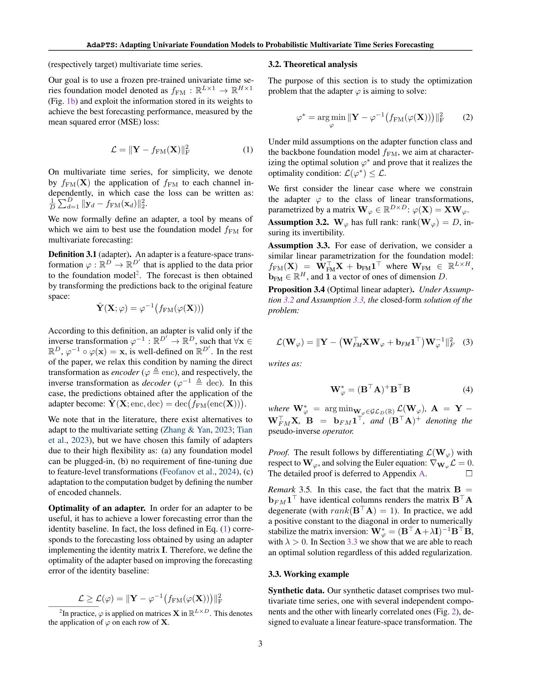
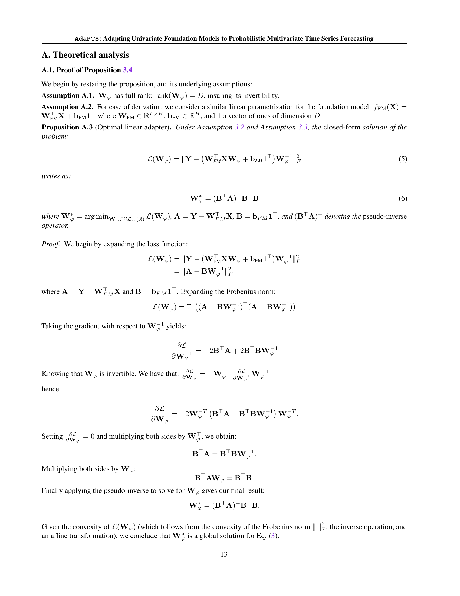

 


 2502.10235 
 Abdelhakim Benechehab et el. 
 
 🤗 2025-02-17 
 



↗ arXiv


↗ Hugging Face


### TL;DR



많은 실제 시계열 데이터는 **여러 변수 간 복잡한 상호 의존성**을 가지고 있습니다. 기존의 단변량 시계열 예측 모델은 이러한 다변량 시계열 데이터를 효과적으로 처리하지 못하며, 예측의 불확실성을 정량화하는 데 어려움을 겪습니다. 이러한 문제를 해결하기 위해, 이 연구는 **사전 훈련된 단변량 시계열 모델을 다변량 시계열 예측에 적용**하는 새로운 프레임워크인 AdaPTS를 제안합니다.

AdaPTS는 **어댑터(adapter)라는 특징 공간 변환기를 통해 다변량 입력을 단변량 모델이 처리할 수 있는 형태로 변환**합니다. 이 과정에서 확률적 방법을 도입하여 예측의 불확실성을 정량화합니다. 실험 결과, AdaPTS는 다양한 합성 및 실제 데이터셋에서 기존 방법론보다 **우수한 예측 정확도와 불확실성 정량화 성능**을 보였습니다.  AdaPTS는 **모듈화 및 확장성이 뛰어나** 실제 응용 분야에 쉽게 적용할 수 있다는 장점이 있습니다.



#### Key Takeaways


 AdaPTS는 기존 단변량 시계열 기반 모델을 다변량 시계열 예측에 효과적으로 적용하는 새로운 프레임워크입니다. 



 AdaPTS는 예측 정확도를 향상시키고 불확실성을 정량화하여 더욱 신뢰할 수 있는 예측 결과를 제공합니다. 



 AdaPTS는 다양한 실제 데이터셋에서 기존 방법론보다 우수한 성능을 보였습니다. 


#### Why does it matter?
본 논문은 **다변량 시계열 예측을 위한 기존의 단변량 기반 모델을 효과적으로 활용하는 새로운 방법론**을 제시함으로써, 다변량 시계열 분석 분야 연구자들에게 중요한 의미를 지닙니다. 기존 단변량 모델의 한계를 극복하고 예측 정확도와 불확실성 정량화를 향상시키는 AdaPTS 프레임워크는 다양한 응용 분야에 적용 가능하며, 향후 연구를 위한 새로운 가능성을 제시합니다. 특히, **불확실성을 정량화하는 확률적 접근법**은 현실 세계 문제 해결에 중요한 시사점을 제공합니다.

------
#### Visual Insights

> 🔼 (a) 그림은 AdaPTS 프레임워크를 사용하여 Moment 기반 모델의 예측 성능을 향상시킨 결과를 보여줍니다.  Moment 기반 모델 자체의 예측값(파란색)과 AdaPTS 프레임워크를 적용한 예측값(주황색)을 실제 값(회색)과 비교하여 보여줍니다. 이를 통해 AdaPTS가 Moment 모델의 예측 정확도를 높였음을 시각적으로 보여주고 있습니다.  특히, 예측값의 변동성이 실제 값에 더 가까워졌음을 알 수 있습니다.  그림은 ETTh1 데이터셋의 일부분을 보여주는 것으로 보이며, 시간 경과에 따른 값의 변화를 나타내고 있습니다.
> 

> 
read the caption

> (a)
> 


Dataset|H|No adapter|with adapter
---|---|---|
ETTh1|96|0.411±0.012|0.433±0.001|0.402±0.002|**0.395±0.003**|0.400±0.001|0.404±0.001
|192|**0.431±0.001**|0.440±0.000|0.452±0.002|0.446±0.001|0.448±0.002|**0.431±0.001**
Illness|24|2.902±0.023|2.98±0.001|2.624±0.035|2.76±0.061|2.542±0.036|**2.461±0.008**
|60|3.000±0.004|3.079±0.000|3.110±0.127|2.794±0.015|**2.752±0.040**|2.960±0.092
Weather|96|0.177±0.010|0.176±0.000|0.169±0.000|**0.156±0.001**|0.161±0.001|0.187±0.001
|192|0.202±0.000|0.208±0.001|**0.198±0.001**|0.200±0.001|0.204±0.000|0.226±0.000
ExchangeRate|96|**0.130±0.011**|0.147±0.000|0.167±0.013|**0.130±0.011**|0.243±0.039|0.455±0.010
|192|**0.210±0.002**|0.222±0.000|0.304±0.005|0.305±0.013|0.457±0.020|0.607±0.021

> 🔼 표 1은 다양한 어댑터 구조(PCA, LinearAE, dropoutLinearAE, LinearVAE, VAE)를 사용하지 않은 기준 Moment 모델과 비교하여 다양한 수평선 H를 사용한 다변량 장기 예측에 대한 성능 비교를 보여줍니다. 표에는 3번의 다른 시드를 사용하여 얻은 평균 테스트 MSE ± 표준 오차가 표시되며, 낮은 값이 더 나은 성능을 나타냅니다. 최고의 결과는 굵게 표시되어 있습니다.
> 

> 
read the caption

> Table 1: Performance comparison between the baseline Moment model without adapters against different adapter architectures (PCA, LinearAE, dropoutLinearAE, LinearVAE, and VAE), for multivariate long-term forecasting with different horizons H𝐻Hitalic_H. We display the average test MSE ±plus-or-minus\pm± standard error obtained on 3333 runs with different seeds. Best results are in bold, with lower values indicating better performance.
> 

### In-depth insights

#### Univariate FM Adapt
본 논문의 "Univariate FM Adapt" 부분은 **기존의 단변량 시계열 예측에 특화된 기초 모델(Foundation Model, FM)을 다변량 시계열 예측 문제에 적용하는 방법**을 다룹니다.  단변량 FM은 각 변수를 독립적으로 처리하여 다변량 데이터의 복잡한 상호 의존성을 고려하지 못하는 한계를 지닙니다.  따라서 이 부분에서는 **어댑터(Adapter)라는 특징 공간 변환 메커니즘을 통해 이러한 한계를 극복**하려는 시도가 제시됩니다.  어댑터는 다변량 입력을 단변량 FM이 처리할 수 있는 적절한 잠재 공간으로 투영하고, 각 차원에 대해 독립적으로 FM을 적용한 후 원래 특징 공간으로 변환하는 역할을 수행합니다.  **이를 통해 다변량 시계열 예측의 정확도와 불확실성 정량화를 향상**시키는 것이 주요 목표입니다.  **어댑터의 설계 및 최적화 전략** 또한 중요한 논의 주제가 될 것입니다.  다양한 어댑터 구조와 최적화 방법을 제시하고 실험 결과를 통해 그 효과를 검증하는 것이 이 섹션의 핵심 내용입니다.

#### Adapter Framework
본 논문에서 제시된 어댑터 프레임워크는 **기존의 단변량 시계열 예측 모델을 다변량 시계열 예측에 효과적으로 적용**하기 위한 핵심 구성 요소입니다. 이는 **고차원의 다변량 입력 데이터를 저차원의 잠재 공간으로 투영**하여 단변량 모델이 각 차원에 대해 독립적으로 예측을 수행하도록 합니다.  **어댑터는 특징 공간 변환을 통해 다변량 데이터의 복잡한 상호의존성을 효율적으로 처리**하고, **단변량 모델의 강점을 다변량 예측 문제에 활용**할 수 있게 합니다.  또한, **확률적 어댑터를 통해 예측의 불확실성을 정량화**함으로써, 예측의 신뢰도를 높이고 의사결정에 도움을 줍니다. 이러한 어댑터는 **모듈 방식으로 설계되어 확장성이 높고 다양한 모델에 적용**이 가능하며, 실제 응용 분야에서 널리 활용될 수 있는 **실용적인 해결책**임을 제시합니다.  **실험 결과는 어댑터의 효과를 입증**하며, **예측 정확도와 불확실성 정량화 측면에서 기존 방법론에 비해 상당한 개선**을 보였습니다.

#### Probabilistic Adapt
**확률적 적응(Probabilistic Adapt)**이라는 제목의 연구 논문 부분에 대한 심층적인 고찰은, 본질적으로 불확실성을 고려한 머신러닝 모델의 적응 능력을 향상시키는 방법에 대한 탐구를 의미합니다.  기존의 결정론적(deterministic) 모델과 달리, **확률적 접근 방식은 예측의 불확실성을 정량화하고 모델의 신뢰도를 높이는 데 중점**을 둡니다. 이는 특히 시계열 예측과 같이 미래 값을 예측하는 것이 어려운 분야에서 매우 중요합니다.  **다양한 확률적 기법들을 활용하여 모델이 새로운 데이터나 환경 변화에 유연하게 적응**할 수 있도록 하는 전략을 제시하는 것이 핵심입니다.  이러한 접근 방식은 베이지안 방법론이나 변이 추론과 같은 통계적 도구를 활용하여 모델 파라미터의 분포를 추정하고, 예측 분포를 생성하는 것과 밀접하게 관련되어 있습니다.  **모델의 파라미터나 은닉 상태의 불확실성을 명시적으로 고려**함으로써 더욱 정확하고 신뢰할 수 있는 예측 결과를 얻을 수 있습니다.  **데이터의 노이즈나 모델의 제한적인 표현 능력으로 인해 발생할 수 있는 예측 오류의 크기를 추정**하고, 이를 반영하여 의사결정에 활용할 수 있는 지침을 제공합니다.  결론적으로, 확률적 적응은 단순히 예측 정확도를 높이는 것을 넘어, **불확실성을 정량화하고 관리**하는 데 초점을 맞춘, 더욱 강건하고 신뢰할 수 있는 머신러닝 시스템을 구축하는 데 필수적인 요소입니다.

#### Empirical Valid
**실증적 유효성 검증** 부분은 연구 논문에서 제시된 방법론의 실제 성능을 평가하는 핵심 단계입니다.  이 부분에서는 다양한 데이터셋과 시나리오를 통해 **AdaPTS 프레임워크의 예측 정확도와 불확실성 정량화 능력**을 기존 방법들과 비교 분석합니다.  **합성 데이터와 실제 데이터 모두를 사용**하여 일반화 성능을 확인하고,  **다양한 어댑터 구조의 효과**를 비교 분석함으로써 최적의 모델 구성을 제시합니다.  **불확실성 측정의 정확성** 또한 중요한 평가 지표이며,  **예측값의 신뢰도**를 평가하여 모델의 실용성을 강화합니다.  본 절의 분석 결과는 AdaPTS 프레임워크의 **장점과 한계**를 명확하게 보여주는 동시에,  **실제 응용 분야에서의 적용 가능성**을 제시할 것으로 기대됩니다.  **정량적 결과**뿐 아니라, **학습된 잠재 표현의 해석 가능성**에 대한 분석을 통해  AdaPTS의 작동 원리를 깊이 이해하는 데 도움을 줄 것입니다.  결론적으로, **실증적 유효성 검증 부분은 AdaPTS의 성능과 실용성을 객관적으로 보여주는 중요한 역할**을 수행합니다.

#### Future Directions
이 논문의 "미래 방향"에 대한 제 생각은 다음과 같습니다. **다양한 시계열 기반 기초 모델에 대한 적용 가능성을 더욱 확장**하는 것이 중요합니다. 이 논문은 Moment 모델에 초점을 맞추고 있지만, 다른 유니버설한 모델에도 적용될 수 있는지 확인해야 합니다. 또한, **베이지안 추론 방법의 다양화**를 통해 불확실성 추정의 정확도를 높일 수 있는 연구가 필요합니다. 현재는 변분 추론에만 초점을 맞추고 있지만, MCMC와 같은 다른 방법론을 활용하여 성능을 비교 분석하는 것이 중요합니다.  **어댑터의 해석성을 높이는 연구**도 필요합니다. 본 논문에서는 어댑터가 학습하는 특징 공간을 시각화하여 어느 정도 해석성을 제공하고 있지만, 더욱 직관적이고 명확한 해석을 위해 추가적인 연구가 필요합니다. 특히, 다양한 시계열 데이터 특징을 어떻게 효과적으로 포착하는지에 대한 심층적인 분석이 중요합니다.  마지막으로, **실제 응용 분야에 대한 적용 연구**가 필수적입니다. 다양한 분야의 실제 시계열 데이터를 활용하여 모델의 성능을 검증하고, 실제 문제 해결에 기여할 수 있도록 추가적인 연구가 필요합니다. 이를 통해 AdaPTS 프레임워크의 실용성을 더욱 높일 수 있을 것입니다.

### More visual insights

More on figures

> 🔼 그림 (b)는 AdaPTS 프레임워크의 작동 방식을 보여줍니다. 다변량 시계열 입력(X)은 특징 공간 변환을 통해 확률적 잠재 공간(Z)으로 매핑됩니다.  이 잠재 공간에서 사전 훈련된 단변량 FM(fFM)을 사용하여 예측이 독립적으로 수행됩니다.  그런 다음 예측된 분포를 원래 특징 공간으로 변환하여 최종 예측(Ŷ)을 생성합니다.  불꽃 기호는 학습 가능한 가중치를, 눈송이 기호는 FM의 매개변수가 고정되었음을 나타냅니다.
> 

> 
read the caption

> (b)
> 

> 🔼 그림 1은 AdaPTS 프레임워크를 사용하여 Moment 기반 시계열 예측 모델을 개선하는 과정을 보여줍니다. (a)는 Moment 모델에 AdaPTS를 적용하여 확률적이고 정확한 예측 결과를 얻는 것을 시각적으로 보여줍니다. (b)는 AdaPTS 프레임워크의 구조를 자세히 설명합니다. 입력 시계열 데이터는 특징 공간 변환 함수 φ를 통해 확률적 잠재 공간으로 매핑됩니다. 사전 훈련된 FM(Foundation Model)은 이 잠재 공간에서 예측을 수행하고, 그 결과는 역변환을 통해 원래 특징 공간으로 되돌아갑니다. 그림에서 불꽃 기호는 학습 가능한 가중치를, 눈송이 기호는 FM의 매개변수가 고정되어 있음을 나타냅니다.
> 

> 
read the caption

> Figure 1: (a) Augmenting Moment time series foundation model with the AdaPTS framework provides probabilistic and more accurate predictions. (b) The AdaPTS framework: The input time series is transformed through a feature space transformation φ𝜑\varphiitalic_φ that maps into a stochastic latent space. The prediction is then conducted using a pre-trained FM before transforming back the predicted, now distribution, to the original feature space. The fire symbol indicate trainable weights while the snowflake implicates that the parameters of the FM are kept frozen.
> 

> 🔼 그림 2는 선형 FM을 1000개 무작위로 생성하여 얻은 MSE(평균 제곱 오차)를 비교하여 최적 선형 어댑터  Wφ∗ 의 성능을 보여줍니다.  Wφ∗를 사용한 MSE와 기준선 MSE를 비교하여 어댑터의 효과를 보여줍니다.  즉,  학습된 선형 변환 Wφ∗ 가 단순한 항등 변환보다 예측 정확도를 얼마나 향상시키는지 보여주는 실험 결과를 나타냅니다.
> 

> 
read the caption

> Figure 2: Optimality of 𝐖φ∗superscriptsubscript𝐖𝜑\mathbf{W}_{\varphi}^{*}bold_W start_POSTSUBSCRIPT italic_φ end_POSTSUBSCRIPT start_POSTSUPERSCRIPT ∗ end_POSTSUPERSCRIPT. Comparing the MSE obtained with 𝐖φ∗superscriptsubscript𝐖𝜑\mathbf{W}_{\varphi}^{*}bold_W start_POSTSUBSCRIPT italic_φ end_POSTSUBSCRIPT start_POSTSUPERSCRIPT ∗ end_POSTSUPERSCRIPT against the baseline, for 1000 randomly generated linear FM.
> 

> 🔼 그림 3은 다양한 차원 수의 어댑터를 사용했을 때 모델 성능에 미치는 영향을 보여줍니다. 점선은 어댑터 없이 Moment 모델의 성능을 나타내고, 음영 영역은 표준 편차를 나타내며, 수직선은 원래 특징의 수를 나타냅니다. 이 그래프는 어댑터를 사용했을 때 Moment 모델의 성능이 어떻게 향상되는지 보여주는 시각적 자료입니다. 특히, 특징 수가 증가함에 따라 어댑터의 성능 향상 효과가 어떻게 변화하는지를 보여줍니다.
> 

> 
read the caption

> Figure 3: Impact of the number of components on model performance. The dashed line indicates Moment performance without adapters, the shaded area its standard deviation, and the vertical line the number of original features.
> 

> 🔼 그림 4는 Illness 데이터셋(예측 기간 H=24)에서 다양한 어댑터(요소 개수 2개)가 생성한 잠재 표현을 시각화한 것입니다. 색상의 농도는 시간 차원을 나타내며, 밝은 색상은 이전 시간 단계를 나타냅니다. 이 그림은 각 어댑터가 시간 경과에 따른 데이터의 잠재적 표현을 어떻게 학습하는지 보여줍니다. PCA, dropoutLinearAE, LinearVAE, 그리고 VAE 어댑터 모두 시간 경과에 따라 데이터가 잠재 공간에 어떻게 분포되는지 보여줍니다. 이를 통해 각 어댑터의 차원 축소 및 잠재 공간 학습 특징을 이해할 수 있습니다.
> 

> 
read the caption

> Figure 4: Visualization of the latent representation obtained by different adapters (with number of components equal to 2) on Illness(H=24𝐻24H=24italic_H = 24). Shaded colors indicate the time dimension, with lighter colors representing earlier timesteps.
> 

> 🔼 그림 5는 LinearVAE를 사용하여 ETTh1 데이터셋의 첫 번째 특징에 대한 신뢰도 다이어그램을 보여줍니다.  예측값의 신뢰도를 평가하기 위해, 다양한 분위수(예: 10%, 50%, 90%)에 대한 예측 분포를 생성하고, 실제 관측치가 이러한 분위수 범위 내에 얼마나 자주 나타나는지 확인합니다. 이상적인 경우, 실제 관측치의 비율은 예측 분위수와 일치해야 하며, 이는 그래프에서 대각선으로 표현됩니다. 그래프에서 실제 비율이 대각선에서 벗어나는 정도는 예측의 교정 상태를 나타냅니다. 이 그림은 특히 장기 예측(H=96)에서 예측의 교정 상태를 평가하는 데 유용합니다.
> 

> 
read the caption

> Figure 5: Reliability diagram for the first feature of the ETTh1 (H=96𝐻96H=96italic_H = 96) dataset using LinearVAE.
> 

> 🔼 그림 6은 Illness 데이터셋(H=24)에서 VAE 어댑터의 하이퍼파라미터인 β와 logσ²에 대한 ablation study 결과를 보여줍니다.  β는 VAE의 KL divergence 항에 대한 가중치를 조절하는 하이퍼파라미터이고, σ는 likelihood의 표준편차를 나타냅니다. heatmap은 각 하이퍼파라미터 조합에 따른 MSE(Mean Squared Error)와 ECE(Expected Calibration Error)를 나타냅니다.  MSE는 예측 정확도를, ECE는 예측의 calibration 정도를 나타냅니다.  이 그림을 통해 최적의 β와 σ 값을 찾고, 각 하이퍼파라미터가 모델 성능에 미치는 영향을 분석합니다. 참고로, Moment 기준 모델의 MSE는 2.902±0.023입니다.
> 

> 
read the caption

> Figure 6: β𝛽\betaitalic_β and log⁡σ2superscript𝜎2\log\sigma^{2}roman_log italic_σ start_POSTSUPERSCRIPT 2 end_POSTSUPERSCRIPT VAE hyperparameters ablation on the Illness(H=24𝐻24H=24italic_H = 24) dataset. For reference, the Moment baseline score on this task is 2.902±0.023subscript2.902plus-or-minus0.0232.902_{\pm 0.023}2.902 start_POSTSUBSCRIPT ± 0.023 end_POSTSUBSCRIPT.
> 

> 🔼 그림 7은 선형 오토인코더(LinearAE)의 각 구성 요소(인코더, 디코더, 전체 모델)가 ETTh1, Weather, ExchangeRate 세 가지 데이터셋에서 예측 성능에 미치는 영향을 보여줍니다. 실험 결과, 디코더가 예측 정확도 향상에 가장 큰 영향을 미치는 반면, 인코더의 영향은 데이터셋에 따라 다릅니다. 이는 선형 오토인코더의 디코더가 특징 간의 의존성을 포착하는 데 중요한 역할을 한다는 것을 시사하며, 확률적 어댑터의 경우 인코더 역시 중요한 역할을 수행함을 보여줍니다.
> 

> 
read the caption

> Figure 7: LinearAE components ablation.
> 

> 🔼 그림 8(a)는 독립적인 합성 데이터셋에 대한 Moment 모델의 평균 제곱 오차(MSE)를 보여줍니다. 세 가지 다른 어댑터 유형(Wpca, Φθ, Φθ* • Wpca)의 성능을 비교하여 어댑터가 Moment 모델의 예측 정확도를 개선하는 데 어떻게 기여하는지 보여줍니다.  Wpca는 주성분 분석(PCA)을 사용한 어댑터를 나타내고, Φθ는 학습된 선형 어댑터를 나타내며, Φθ* • Wpca는 학습된 선형 어댑터와 PCA 어댑터를 결합한 것을 나타냅니다. 이 그림은 학습된 선형 어댑터(Φθ)가 PCA 기반 어댑터(Wpca)와 비교하여 MSE를 상당히 줄였음을 보여줍니다. Φθ* • Wpca 어댑터는 Φθ 어댑터만큼 MSE를 줄이지는 못하지만, 여전히 PCA 어댑터보다 더 나은 성능을 보여줍니다.
> 

> 
read the caption

> (a) Independent
> 

> 🔼 그림 2(b)는 다양한 선형 FM(Foundation Model)을 무작위로 생성하여, 상관관계가 있는 데이터에 대한 최적 선형 어댑터 W*와 기준선(Identity Matrix 사용), PCA 어댑터의 평균 제곱 오차(MSE)를 비교한 결과를 보여줍니다.  상관관계 있는 데이터의 경우, 최적 선형 어댑터 W*가 기준선과 PCA 어댑터보다 훨씬 더 낮은 MSE를 달성함을 보여줍니다. 이는 선형 모델에서조차 Identity Matrix보다 더 나은 선형 변환이 존재하며, 어댑터 개념을 뒷받침하는 증거입니다.
> 

> 
read the caption

> (b) Correlated
> 

> 🔼 그림 8은 독립적인 시뮬레이션 데이터에 대한 Moment 모델의 성능을 보여줍니다.  (a)는 독립적인 특징을 가진 데이터에 대한 결과이고, (b)는 상관관계가 있는 특징을 가진 데이터에 대한 결과입니다. 각 그래프는 다양한 어댑터 유형(Wpca, Φθ, Φθ* • Wpca)에 따른 평균 제곱 오차(MSE)를 나타냅니다. 이 그림을 통해 제안된 AdaPTS 프레임워크의 효과를 시각적으로 확인할 수 있으며, 특히 상관관계가 있는 데이터에 대해서 더 나은 성능 향상을 보여줍니다.
> 

> 
read the caption

> Figure 8: Moment on simulated independent data.
> 

More on tables


| Dataset | ETTh1 | Illness | ExchangeRate | Weather |
|---|---|---|---|---|
| # features | 7 | 7 | 8 | 21 |
| # time steps | 13603 | 169 | 6791 | 51899 |
| Granularity | 1 hour | 1 week | 1 day | 10 minutes |
| (Train, Val, Test) | (8033, 2785, 2785) | (69, 2, 98) | (4704, 665, 1422) | (36280, 5175, 10444) |
> 🔼 표 2는 논문에서 사용된 다변량 시계열 데이터셋의 특징을 보여줍니다.  데이터셋의 이름, 특징 수, 시간 단계 수, 그리고 시간 단위를 포함하여 실험에 사용된 다양한 크기와 차원의 데이터셋을 자세히 설명합니다.  이 표는 실험에 사용된 데이터셋에 대한 개요를 제공하여 독자들이 실험 결과의 맥락을 이해하는 데 도움을 줍니다.
> 

> 
read the caption

> Table 2: Characteristics of the multivariate time series datasets used in our experiments with various sizes and dimensions.
> 


| adapter | LinearAE | DropoutLinearAE | LinearVAE | VAE |
|---|---|---|---|---|
| p dropout | - | 0.1 | - | - |
| Number of layers | - | - | - | 2 |
| Hidden dimension | - | - | - | 128 |
| β | - | - | 0.5 | 0.5 |
| σ | - | - | 1.0 | 1.0 |
> 🔼 표 3은 AdaPTS 프레임워크에서 사용된 다양한 어댑터 아키텍처(LinearAE, dropout LinearAE, LinearVAE, VAE)의 하이퍼파라미터 값을 보여줍니다. 각 어댑터의 레이어 수, 히든 차원, 베타(β), 시그마(σ) 값을 포함하고 있습니다. 이 표는 다양한 어댑터의 하이퍼파라미터 설정을 비교하여 실험 결과에 대한 이해를 돕고 있습니다.
> 

> 
read the caption

> Table 3: Adapters hyperparameters.
> 


Dataset|H|No adapter|pca|linear|dropout|linear VAE|VAE
---|---|---|---|---|---|---
Momentsmall||0.422±0.006|0.440±0.000|0.423±0.003|**0.415±0.002**|0.420±0.001|0.426±0.001
ETTh1|96|0.422±0.006|0.440±0.000|0.423±0.003|**0.415±0.002**|0.420±0.001|0.426±0.001
ETTh1|192|**0.436±0.000**|0.445±0.000|0.449±0.003|0.450±0.001|0.451±0.001|0.444±0.001
Illness|24|1.143±0.007|1.163±0.001|2.624±0.035|1.156±0.016|1.074±0.011|**1.057±0.012**
Illness|60|1.149±0.001|1.161±0.001|1.227±0.030|1.173±0.015|1.112±0.021|**1.105±0.021**
Weather|96|0.232±0.010|0.235±0.000|0.226±0.000|0.212±0.001|**0.218±0.001**|0.243±0.001
Weather|192|**0.251±0.001**|0.260±0.001|**0.251±0.001**|**0.251±0.000**|0.255±0.000|0.274±0.000
ExchangeRate|96|**0.252±0.010**|0.264±0.000|0.308±0.010|0.269±0.012|0.376±0.031|0.488±0.003
ExchangeRate|192|**0.329±0.001**|0.335±0.000|0.415±0.002|0.419±0.010|0.513±0.010|0.585±0.008
> 🔼 표 4는 다양한 수평선(H)을 갖는 다변량 장기 예측에 대해 어댑터가 없는 기준 Moment 모델과 다양한 어댑터 아키텍처(PCA, LinearAE, dropoutLAE, LinearVAE, VAE) 간의 성능 비교를 보여줍니다. 표에는 서로 다른 시드를 사용한 3번의 실행에서 얻은 평균 테스트 MAE ± 표준 오차가 표시됩니다. 가장 좋은 결과는 굵게 표시되며, 값이 낮을수록 성능이 더 좋음을 나타냅니다.
> 

> 
read the caption

> Table 4: Performance comparison between the baseline Moment model without adapters against different adapter architectures (PCA, LinearAE, dropoutLAE, LinearVAE, and VAE), for multivariate long-term forecasting with different horizons H𝐻Hitalic_H. We display the average test MAE ±plus-or-minus\pm± standard error obtained on 3333 runs with different seeds. Best results are in bold, with lower values indicating better performance.
> 

### Full paper



