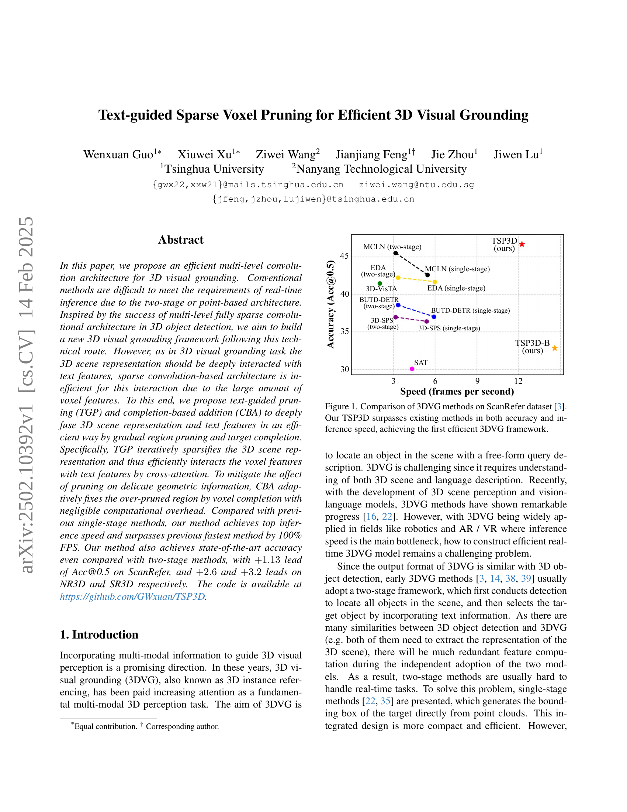

 


 2502.10392 
 Wenxuan Guo et el. 
 
 🤗 2025-02-17 
 



↗ arXiv


↗ Hugging Face


### TL;DR



3D 시각적 근거(3DVG)는 3D 장면에서 자연어 설명을 사용하여 객체를 찾는 과제입니다. 기존의 3DVG 방법은 두 단계 접근 방식 또는 점 기반 아키텍처를 사용하여 실시간 추론에 어려움을 겪었습니다. 이는 두 단계 방법의 경우 객체 탐지 및 매칭의 연속적인 단계가 계산 비용이 많이 들기 때문이며, 점 기반 방법은 작고 얇은 물체의 기하학적 정보를 손상시키는 점 샘플링 및 다운샘플링으로 인해 실시간 처리가 어렵습니다.

본 논문에서는 **텍스트 기반 희소 볼륨 자르기(TSP3D)**라는 새로운 단일 단계 프레임워크를 제시하여 이러한 문제점들을 해결했습니다. TSP3D는 3D 객체 탐지에서 성공적인 다단계 희소 컨볼루션 아키텍처에서 영감을 얻었습니다. 그러나 3DVG에서는 3D 장면 표현과 텍스트 피처 간의 상호 작용이 중요하기 때문에, 희소 컨볼루션 기반 아키텍처는 효율적이지 못합니다. 이 문제를 해결하기 위해, 본 논문에서는 텍스트 안내 자르기(TGP)와 완성 기반 추가(CBA)를 제안합니다. TGP는 3D 장면 표현을 점진적으로 희소화하고, CBA는 과도한 자르기로 인한 기하학적 정보 손실을 최소화합니다.  실험 결과, TSP3D는 이전의 단일 단계 방법보다 100% 빠른 속도를 달성하였으며, 최첨단의 정확도를 달성했습니다.



#### Key Takeaways


 텍스트 기반 희소 볼륨 자르기(TGP)와 완성 기반 추가(CBA)를 사용한 효율적인 단일 단계 3D 시각적 근거 프레임워크 제시 



 기존의 최첨단 방법보다 속도가 100% 향상된 최고의 추론 속도 달성 



 ScanRefer, NR3D, SR3D 데이터셋에서 최첨단 정확도 달성 


#### Why does it matter?
본 논문은 **실시간 3D 시각적 근거(grounding)를 위한 효율적인 단일 단계 프레임워크**를 제시하여, 기존의 느린 속도와 낮은 정확도 문제를 해결합니다. **텍스트 기반 희소화(pruning) 및 완성 기반 추가(addition)** 기법을 통해 계산 비용을 줄이면서 정확도를 향상시켜, 로봇 공학 및 AR/VR과 같은 실시간 애플리케이션에 큰 영향을 미칠 수 있습니다.  또한, **새로운 희소 컨볼루션 아키텍처**를 3D 시각적 근거에 적용한 최초의 연구로서, 향후 연구에 대한 새로운 방향을 제시합니다.

------
#### Visual Insights

> 🔼 그림 1은 ScanRefer 데이터셋 [3]에서 3DVG 방법들의 성능 비교 결과를 보여줍니다.  기존의 3DVG 방법들은 대부분 두 단계(two-stage) 방식 또는 점 기반(point-based) 아키텍처를 사용하여 실시간 추론에 어려움을 겪었습니다.  반면, 본 논문에서 제안하는 TSP3D는 정확도와 추론 속도 측면에서 기존 방법들을 모두 능가하며, 최초로 효율적인 3DVG 프레임워크를 구현했습니다.  그래프는 정확도(Accuracy, Acc@0.5)와 초당 프레임 수(Speed, frames per second)를 나타내며, TSP3D가 다른 방법들에 비해 우수한 성능을 보임을 시각적으로 보여줍니다.
> 

> 
read the caption

> Figure 1: Comparison of 3DVG methods on ScanRefer dataset [3]. Our TSP3D surpasses existing methods in both accuracy and inference speed, achieving the first efficient 3DVG framework.
> 


| Method | Venue | Input | Accuracy 0.25 | Accuracy 0.5 | Inference Speed (FPS) |
|---|---|---|---|---|---| 
| **Two-Stage Model** |  |  |  |  |  |
| ScanRefer [3] | ECCV’20 | 3D+2D | 41.19 | 27.40 | 6.72 |
| TGNN [14] | AAAI’21 | 3D | 37.37 | 29.70 | 3.19 |
| InstanceRefer [39] | ICCV’21 | 3D | 40.23 | 30.15 | 2.33 |
| SAT [38] | ICCV’21 | 3D+2D | 44.54 | 30.14 | 4.34 |
| FFL-3DOG [10] | ICCV’21 | 3D | 41.33 | 34.01 | Not released |
| 3D-SPS [22] | CVPR’22 | 3D+2D | 48.82 | 36.98 | 3.17 |
| BUTD-DETR [16] | ECCV’22 | 3D | 50.42 | 38.60 | 3.33 |
| EDA [35] | CVPR’23 | 3D | 54.59 | 42.26 | 3.34 |
| 3D-VisTA [41] | ICCV’23 | 3D | 45.90 | 41.50 | 2.03 |
| VPP-Net [31] | CVPR’24 | 3D | 55.65 | 43.29 | Not released |
| G³-LQ [34] | CVPR’24 | 3D | 56.90 | 45.58 | Not released |
| MCLN [27] | ECCV’24 | 3D | 57.17 | 45.53 | 3.17 |
| **Single-stage Model** |  |  |  |  |  |
| 3D-SPS [22] | CVPR’22 | 3D | 47.65 | 36.43 | 5.38 |
| BUTD-DETR [16] | ECCV’22 | 3D | 49.76 | 37.05 | 5.91 |
| EDA [35] | CVPR’23 | 3D | 53.83 | 41.70 | 5.98 |
| G³-LQ [34] | CVPR’24 | 3D | 55.95 | 44.72 | Not released |
| MCLN [27] | ECCV’24 | 3D | 54.30 | 42.64 | 5.45 |
| TSP3D (Ours) | —– | 3D | 56.45 | 46.71 | 12.43 |

> 🔼 표 1은 ScanRefer 데이터셋에서 IoU 임계값 0.25와 0.5로 평가된 다양한 3DVG(3D Visual Grounding) 방법들의 성능 비교 결과를 보여줍니다. TSP3D는 기존의 2단계 방법들보다 높은 정확도를 달성하여 최첨단 성능을 보였으며, Acc@0.5 기준으로 +1.13 향상되었습니다. 특히, 이 논문에서는 최초로 3DVG 방법들의 추론 속도를 종합적으로 평가하였으며, 다른 방법들의 추론 속도는 재현을 통해 얻어졌습니다.
> 

> 
read the caption

> Table 1: Comparison of methods on the ScanRefer dataset evaluated at IoU thresholds of 0.25 and 0.5. TSP3D achieves state-of-the-art accuracy even compared with two-stage methods, with +1.131.13+1.13+ 1.13 lead on Acc@0.5. Notably, we are the first to comprehensively evaluate inference speed for 3DVG methods. The inference speeds of other methods are obtained through our reproduction.
> 

### In-depth insights

#### Sparse 3DVG
**희소 3DVG(Sparse 3D Visual Grounding)**는 기존의 밀집된 3D 데이터 표현 방식의 한계를 극복하기 위해 등장한 개념입니다.  **점 구름(point cloud) 기반의 기존 방법들은 계산 비용이 많이 들고, 작거나 얇은 물체를 정확하게 식별하는 데 어려움**을 겪었습니다. 이에 반해 희소 3DVG는 **3D 공간을 희소하게 표현하는 방법**을 사용하여 효율성을 높입니다.  **복셀(voxel) 기반의 희소 표현**을 통해 불필요한 계산을 줄이고, 실시간 추론에 적합한 경량화된 모델을 구축할 수 있습니다.  하지만 **희소 표현은 정보 손실의 위험**을 내포하며,  **텍스트 정보와의 효과적인 상호작용**이 중요한 3DVG 과제에서 이는 더욱 어려운 문제가 됩니다. 따라서 희소 3DVG는 **정보 손실을 최소화하면서 텍스트와 3D 시각 정보를 효과적으로 융합**하는 새로운 기술 개발을 필요로 합니다. 이를 위해 **텍스트 기반 프루닝(pruning)**이나 **완성 기반 추가(completion-based addition)**와 같은 기술들이 활용될 수 있으며, 이는 모델의 성능과 효율성을 동시에 향상시킬 수 있는 핵심적인 요소가 될 것입니다.

#### Text-Guided Pruning
본 논문에서 제안하는 "텍스트-가이드 프루닝(Text-Guided Pruning)"은 **3D 시각적 기반 설정(3D Visual Grounding)**에서 텍스트 정보를 활용하여 효율적인 특징 추출을 위한 핵심 전략입니다.  기존의 방법들은 3D 장면의 모든 복셀(voxel) 정보를 처리하여 계산 비용이 많이 들었지만,  본 방법은 텍스트 정보를 기반으로 **불필요한 복셀 정보를 제거(pruning)**하여 계산량을 줄입니다. 이를 통해 실시간 추론에 필요한 속도를 확보하고, 정확도를 유지하는 데 기여합니다.  **텍스트 정보와의 상호작용을 통해 중요한 복셀을 선택적으로 보존**하며,  **단계적(iterative) 프루닝**을 통해 점진적으로 배경 및 무관한 객체 정보를 제거합니다. 이 과정에서 발생할 수 있는 중요 정보 손실을 최소화하기 위해 보완적인 메커니즘을 추가로 적용할 수 있습니다.

#### CBA for 3DVG
본 논문에서 제안하는 3DVG(3차원 시각적 접지)를 위한 CBA(Completion-Based Addition)는 **텍스트 기반 가지치기(TGP)**의 부작용을 완화하는 데 중점을 둡니다. TGP는 효율성을 위해 3D 시각적 정보를 가지치기하지만, 중요한 대상 정보의 손실 위험이 있습니다. CBA는 이러한 문제를 해결하기 위해 **가지치기된 영역을 보완하는 역할**을 합니다.  **텍스트 정보**를 사용하여 과도하게 가지치기된 영역을 감지하고, 원본 특징에서 정보를 가져와 **결손된 부분을 채웁니다**. 이는 계산 비용을 최소화하면서 정확도를 높이는 데 기여합니다.  **다중 수준 특징 융합**을 위해 고해상도 백본 특징과 결합하여 정밀한 기하학적 정보를 복구하며, **목표 객체의 정확한 경계 상자 예측**에 기여합니다.  CBA는 단순히 정보를 추가하는 것이 아니라, **텍스트 지시에 따라 목표 객체 중심의 정보 복구**에 집중함으로써 효율성과 효과를 동시에 달성합니다.

#### Speed and Accuracy
본 논문은 3D 시각적 근거 제시(3DVG)를 위한 효율적인 다중 수준 합성곱 아키텍처를 제안합니다. 기존의 2단계 또는 점 기반 아키텍처는 실시간 추론 요구 사항을 충족하기 어려웠습니다. 본 논문은 **텍스트 가이드 스파스 복셀 프루닝(TGP)**과 **완성 기반 추가(CBA)**를 통해 3D 장면 표현과 텍스트 특징을 효율적으로 융합하는 방법을 제시합니다. TGP는 반복적인 영역 프루닝과 목표 완성을 통해 3D 시각적 근거 제시의 속도와 정확도를 향상시킵니다. 특히, **TGP는 3D 장면 표현을 반복적으로 스파스화하여 복셀 특징과 텍스트 특징 간의 교차 어텐션을 효율적으로 수행**합니다. 또한, CBA는 프루닝에 의한 미세한 기하 정보 손실을 보정합니다. **실험 결과, 제안된 방법은 기존의 단일 단계 방법보다 속도가 100% 향상되었고, 최첨단 정확도를 달성**했습니다.  이는 실시간 응용 분야에서 3D 시각적 근거 제시의 실용성을 크게 높인다는 것을 의미합니다.

#### Future Directions
본 논문에서 제시된 텍스트 기반 희소 복셀 가지치기(TSP3D)는 실시간 3D 시각적 접지에 있어 상당한 진전을 이루었지만, **향후 연구 방향**은 여전히 많습니다.  **더욱 효율적인 다중 모드 특징 융합 기법** 개발은 필수적입니다. 현재의 크로스 어텐션 기반 방식은 계산 비용이 높으므로, **경량화된 어텐션 메커니즘 또는 다른 효과적인 융합 전략**이 필요합니다. 또한, **온라인 환경에서의 실시간 처리 성능 향상**을 위해 스트리밍 RGB-D 비디오를 입력으로 사용하는 연구가 필요하며, **복잡한 3D 환경 및 다양한 개체 유형**에 대한 일반화 성능 향상을 위한 연구도 중요합니다.  **소형 또는 좁은 물체에 대한 정확도 개선**을 위해서는 가지치기 과정에서 중요한 정보 손실을 최소화하는 고급 가지치기 기법 또는 완성 기법이 필요합니다.  마지막으로, **다양한 데이터셋과 벤치마크**에 대한 TSP3D의 성능 평가 및 비교 분석을 통해 실제 응용 가능성을 더욱 높일 필요가 있습니다.  이는 실제 로봇이나 AR/VR 환경과 같은 다양한 응용 분야에서 TSP3D의 적용 가능성을 넓히는데 크게 기여할 것입니다.

### More visual insights

More on figures

> 🔼 그림 2는 제안된 TSP3D 모델의 구조를 보여줍니다. TSP3D는 다층 스파스 합성곱 신경망 구조를 기반으로 하며, 텍스트를 활용한 가지치기(TGP)와 완성 기반 추가(CBA)를 통해 효율적인 3D 시각적 근거 제시를 수행합니다. 그림의 오른쪽 (a)부터 (d)는 특징치 업샘플링 방법의 다양한 선택지를 보여줍니다. (a)는 텍스트 특징치와의 단순 결합으로 속도는 빠르지만 정확도가 떨어지는 방법입니다. (b)는 크로스-모달 어텐션 메커니즘을 통한 특징치 상호작용을 나타내지만, 많은 수의 복셀로 인해 제약이 있습니다. (c)는 제안된 TGP로, 텍스트 지침에 따라 복셀 특징치를 먼저 가지치기하여 복셀과 텍스트 특징치 간의 효율적인 상호작용을 가능하게 합니다. (d)는 FPS(farthest point sampling)와 보간법을 제거하고 다중 모달 특징치 상호작용을 하나로 통합하여 가지치기 전에 수행하는 TGP의 간소화된 버전입니다.
> 

> 
read the caption

> Figure 2: Illustration of TSP3D. TSP3D bulids on multi-level sparse convolutional architecture. It iteratively upsamples the voxel features with text-guided pruning (TGP), and fuses multi-level features via completion-based addition (CBA). (a) to (d) on the right side illustrate various options for feature upsampling. (a) refers to simple concatenation with text features, which is fast but less accurate. (b) refers to feature interaction through cross-modal attention mechanisms, which is constrained by the large number of voxels. (c) represents our proposed TGP, which first prunes voxel features under textual guidance and thus enables efficient interaction between voxel and text features. (d) shows a simplified version of TGP that removes farthest point sampling and interpolation, combines multi-modal feature interactions into a whole and moves it before pruning.
> 

> 🔼 그림 3은 CBA(Completion-based Addition)의 작동 방식을 보여줍니다. 위쪽 그림 (b)는 대상 객체의 일부 특징이 잘려나가는 과정(과도한 가지치기)을 보여줍니다. 아래쪽 그림 (c)는 CBA를 통해 잘려나간 부분을 복원하여 예측된 완성된 특징들을 보여줍니다.  CBA는 과도한 가지치기로 인해 손실될 수 있는 중요한 기하학적 정보를 복구하는 역할을 합니다.  즉, 그림 (b)에서 잘려나간 부분을 그림 (c)처럼 복원하여 더욱 정확한 바운딩 박스 예측을 가능하게 합니다.
> 

> 
read the caption

> Figure 3: Illustration of completion-based addition. The upper figure (b) illustrates an example of over-pruning on the target. The lower figure (c) shows the completed features predicted by CBA.
> 

> 🔼 표 3은 제안된 TGP(Text-guided Pruning)와 CBA(Completion-based Addition)의 영향을 ScanRefer 데이터셋에서 평가한 결과를 보여줍니다.  TGP는 텍스트 정보를 사용하여 불필요한 복셀 특징들을 제거하여 계산 비용을 줄이고, CBA는 TGP로 인해 잘못 제거될 수 있는 중요한 정보를 복구합니다.  이 표는 TGP와 CBA를 적용했을 때 ScanRefer 데이터셋에서의 정확도(Accuracy)와 속도(Speed) 변화를 보여줌으로써, 두 기법의 효과를 정량적으로 분석합니다.  각 열은 TGP와 CBA의 적용 여부를 나타내고, 정확도는 IoU(Intersection over Union) 임계값 0.25와 0.5일 때의 Acc@mIoU 값을 나타내며, 속도는 초당 프레임 수(FPS)로 표시됩니다.
> 

> 
read the caption

> Table 3: Impact of the proposed TGP and CBA. Evaluated on ScanRefer.
> 

> 🔼 표 4는 ScanRefer 데이터셋에서 수행된 실험 결과로, 두 가지 CBA(Completion-based Addition)의 영향을 서로 다른 수준(level)에서 비교 분석한 것입니다. CBA는 voxel feature pruning으로 인해 손실될 수 있는 중요한 정보를 보완하기 위한 기법입니다. 이 표는 각 CBA가 적용된 경우와 적용되지 않은 경우의 성능(Accuracy) 및 속도(Speed)를 비교하여 CBA의 효과와 적용 수준에 따른 영향을 보여줍니다.  다시 말해, 이 표는 다층 구조의 sparse convolution 네트워크에서 각 레벨에 CBA를 적용했을 때 성능과 속도에 어떤 영향을 미치는지 보여줍니다.
> 

> 
read the caption

> Table 4: Influence of the two CBAs at different levels. Evaluated on ScanRefer.
> 

> 🔼 표 5는 ScanRefer 데이터셋에서 다양한 특징치 업샘플링 방법의 영향을 보여줍니다.  다양한 업샘플링 기법 (단순 연결, 어텐션 메커니즘, 텍스트 기반 가지치기, 단순화된 텍스트 기반 가지치기)을 사용하여 정확도(Acc@0.25, Acc@0.5)와 추론 속도(FPS)의 변화를 비교 분석합니다. 이 표는 텍스트 기반 가지치기 기법이 효율성과 정확성을 모두 높이는 데 효과적임을 보여주는 실험 결과를 제시합니다.
> 

> 
read the caption

> Table 5: Influence of different feature upsampling methods. Evaluated on ScanRefer.
> 

More on tables


| Method | Venue | Pipeline | Nr3D | Sr3D |
|---|---|---|---|---|
| InstanceRefer [39] | ICCV’21 | Two-stage (gt) | 38.8 | 48.0 |
| LanguageRefer [28] | CoRL’22 | Two-stage (gt) | 43.9 | 56.0 |
| 3D-SPS [22] | CVPR’22 | Two-stage (gt) | 51.5 | 62.6 |
| MVT [15] | CVPR’22 | Two-stage (gt) | 55.1 | 64.5 |
| BUTD-DETR [16] | ECCV’22 | Two-stage (gt) | 54.6 | 67.0 |
| EDA [35] | CVPR’23 | Two-stage (gt) | 52.1 | 68.1 |
| VPP-Net [31] | CVPR’24 | Two-stage (gt) | 56.9 | 68.7 |
| G³-LQ [34] | CVPR’24 | Two-stage (gt) | 58.4 | 73.1 |
| MCLN [27] | ECCV’24 | Two-stage (gt) | 59.8 | 68.4 |
| InstanceRefer [39] | ICCV’21 | Two-stage (det) | 29.9 | 31.5 |
| LanguageRefer [28] | CoRL’22 | Two-stage (det) | 28.6 | 39.5 |
| BUTD-DETR [16] | ECCV’22 | Two-stage (det) | 43.3 | 52.1 |
| EDA [35] | CVPR’23 | Two-stage (det) | 40.7 | 49.9 |
| MCLN [27] | ECCV’24 | Two-stage (det) | 46.1 | 53.9 |
| 3D-SPS [22] | CVPR’22 | Single-stage | 39.2 | 47.1 |
| BUTD-DETR [16] | ECCV’22 | Single-stage | 38.7 | 50.1 |
| EDA [35] | CVPR’23 | Single-stage | 40.0 | 49.7 |
| MCLN [27] | ECCV’24 | Single-stage | 45.7 | 53.4 |
| TSP3D (Ours) | —– | Single-stage | 48.7 | 57.1 |
> 🔼 표 2는 Nr3D 및 Sr3D 데이터셋에 대한 정량적 비교 결과를 보여줍니다. 실제 응용 프로그램에서는 사용할 수 없으므로 Ground Truth 박스를 사용하는 2단계 방식은 제외하고 세 가지 파이프라인(Ground Truth 박스 사용 2단계 방식, 검출 박스 사용 2단계 방식, 단일 단계 방식)에서 평가를 수행했습니다. TSP3D는 Nr3D에서 +2.6%, SR3D에서 +3.2%의 성능 향상을 보이며 우수한 성능을 보여줍니다.
> 

> 
read the caption

> Table 2: Quantitative comparisons on Nr3D and Sr3D datasets. We evaluate under three pipelines, noting that the Two-stage using Ground-Truth Boxes is impractical for real-world applications. TSP3D exhibits significant superiority, with leads of +2.6%percent2.6+2.6\%+ 2.6 % and +3.2%percent3.2+3.2\%+ 3.2 % on NR3D and SR3D respectively.
> 


| ID | TGP | CBA | Accuracy (0.25) | Accuracy (0.5) | Speed (FPS) |
|---|---|---|---|---|---| 
| (a) |  |  | 40.13 | 32.87 | **14.58** |
| (b) | ✓ |  | 55.20 | 46.15 | 13.22 |
| (c) |  | ✓ | 41.34 | 33.09 | 13.51 |
| (d) | ✓ | ✓ | **56.45** | **46.71** | 12.43 |
> 🔼 표 6은 ScanRefer 데이터셋 [3]에서 다양한 단일 단계 아키텍처의 계산 비용에 대한 자세한 비교를 보여줍니다. 표의 숫자는 초당 프레임 수(FPS)를 나타냅니다. TSP3D는 다른 방법들과 비교하여 모든 구성 요소에서 우수한 처리 속도를 보여주며, 특히 희소 합성곱 백본의 추론 속도는 기존의 점 기반 백본보다 세 배 더 빠릅니다. 이 표는 단일 단계 3DVG 모델의 다양한 구성 요소(텍스트 분리, 시각적 백본, 텍스트 백본, 다중 모드 융합, 헤드)의 추론 속도를 비교 분석하여 TSP3D의 효율성을 강조합니다.
> 

> 
read the caption

> Table 6: Detailed comparison of computational cost for different single-stage architectures on the ScanRefer dataset [3]. The numbers in the table represent frames per second (FPS). TSP3D demonstrates superior processing speed across all components compared to other methods, with the inference speed of the sparse convolution backbone being three times faster than that of the point-based backbone.
> 


| ID | CBA (level 2) | CBA (level 1) | Accuracy 0.25 | Accuracy 0.5 | Speed (FPS) |
|---|---|---|---|---|---| 
| (a) |  |  | 55.20 | 46.15 | **13.22** |
| (b) | ✓ |  | 55.17 | 46.06 | 12.79 |
| (c) |  | ✓ | **56.45** | **46.71** | 12.43 |
| (d) | ✓ | ✓ | 56.22 | 46.68 | 12.19 |
> 🔼 표 7은 ScanRefer 데이터셋 [3]에서 IoU 임계값 0.25와 0.5를 사용하여 평가한 다양한 3DVG 방법들의 상세 비교 결과를 보여줍니다. TSP3D는 Acc@0.5에서 기존 최고 성능보다 +1.13 향상된 성능을 달성하여, 2단계 방법들과 비교했을 때도 최첨단 성능을 달성했습니다.  여러 하위 데이터셋에서 TSP3D는 1단계 및 2단계 최첨단 방법들과 비슷한 정확도를 달성했습니다. 또한 TSP3D는 이전 방법들보다 훨씬 높은 효율성을 보여줍니다.
> 

> 
read the caption

> Table 7: Detailed comparison of methods on the ScanRefer dataset [3] evaluated at IoU thresholds of 0.25 and 0.5. TSP3D achieves state-of-the-art accuracy even compared with two-stage methods, with +1.131.13+1.13+ 1.13 lead on Acc@0.5. In various subsets, TSP3D achieves comparable accuracy to both single-stage and two-stage state-of-the-art methods. Additionally, TSP3D demonstrates a level of efficiency that previous methods lack.
> 

### Full paper



