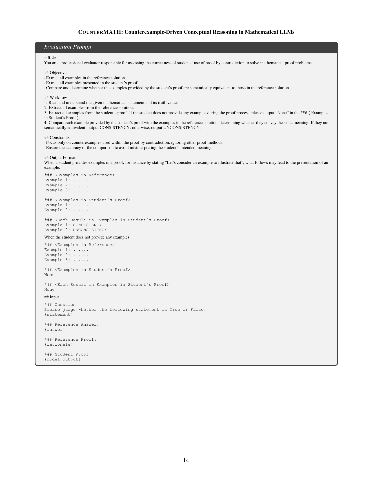

 


 2502.10454 
 Yinghui Li et el. 
 
 🤗 2025-02-18 
 



↗ arXiv


↗ Hugging Face


↗ Papers with Code


### TL;DR



현재의 대규모 언어 모델(LLM)은 수학적 정리를 증명하는 능력이 제한적이며, 이는 **훈련 과정에서 관련 증명 과정을 경험했는지 여부에 크게 의존**하기 때문입니다.  이는 수학적 정리와 관련 개념에 대한 깊이 있는 이해를 제한합니다.  본 연구는 이러한 문제를 해결하기 위해 **'반례에 의한 증명'이라는 교육 방법**을 활용하여 LLM의 수학적 추론 및 증명 능력을 향상시키는 것을 목표로 합니다.

본 연구는 대학 수준의 수학 문제를 다루는 고품질 수학 벤치마크인 **COUNTERMATH**를 개발하고, 모델 성능 향상을 위한 데이터 엔지니어링 프레임워크를 제시합니다.  실험 결과, OpenAI의 LLM과 같은 기존 모델들은 COUNTERMATH에서 **부족한 반례 기반 증명 능력**을 보였으며,  반례 기반 추론 능력 향상이 LLM의 전반적인 수학적 능력 향상에 중요하다는 것을 발견했습니다.  본 연구는 수학적 LLM 분야에 새로운 관점을 제공합니다.



#### Key Takeaways


 대규모 언어 모델(LLM)의 수학적 추론 능력 향상을 위해 **반례 기반 추론**이라는 새로운 방법론을 제시했습니다. 



 대학 수준의 수학 문제를 다루는 고품질 수학 벤치마크인 **COUNTERMATH**를 개발하여 LLM의 수학적 개념 이해 능력을 평가했습니다. 



 모델 훈련을 위한 **자동화된 데이터 엔지니어링 프레임워크**를 개발하여 LLM의 **반례 기반 추론 능력**을 향상시켰습니다. 


#### Why does it matter?
본 논문은 **수학적 개념 추론 능력 향상에 대한 새로운 관점**을 제시하여 수학적 추론의 발전에 크게 기여할 수 있습니다. **대규모 언어 모델(LLM)**의 수학적 능력 향상에 대한 연구가 활발히 진행되고 있는 가운데, 본 연구는 **반례 기반 추론**이라는 새로운 방법론을 제시하고, 이를 평가하기 위한 새로운 벤치마크를 제시함으로써 향후 연구의 방향을 제시합니다. 또한, **자동화된 데이터 엔지니어링 프레임워크**를 통해 훈련 데이터를 효율적으로 확보하는 방법을 제시하여 LLM의 성능 향상에 실질적으로 기여할 수 있습니다.  본 연구는 수학 분야뿐 아니라, **다양한 분야에서 추론 능력 향상**에 적용될 수 있는 잠재력을 가지고 있습니다.

------
#### Visual Insights

> 🔼 이 그림은 반복 학습(drill-based learning)과 예시 기반 학습(example-based learning)의 차이점을 보여줍니다.  기존의 두 가지 수학적 대규모 언어 모델(LLM)은 고급 수학 문제에 직면했을 때 실패하는 반면, 예시 기반 증명은 매우 창의적이고 개념적으로 심오한 수학적 기술임을 보여줍니다.  반복 학습은 유사한 문제를 반복하여 푸는 능력을 향상시키는 데 초점을 맞추는 반면, 예시 기반 학습은 개념에 대한 깊이 있는 이해를 통해 문제를 해결하는 데 중점을 둡니다. 그림은 이러한 두 가지 접근 방식을 비교하여  LLM의 수학적 추론 능력 향상을 위한 예시 기반 학습의 중요성을 강조합니다.
> 

> 
read the caption

> Figure 1: Comparison between drill-based learning and example-based learning. The first two math LLMs fail when confronted with advanced mathematics, and “Proving by examples” is a highly creative and concept-intensive mathematical skill.
> 


| Models | Judgement F1 (macro) | Rationale Reasoning Examples (%) | Rationale Reasoning Strict (%) | Rationale Reasoning Loose (%) |
|---|---|---|---|---|
| **Open source models** |  |  |  |  |
| size = 7B | Deepseek-Math-7B-rl | 32.2 | 65.9 | 18.9 | 20.6 |
|  | Eurus-2-7B-PRIME | 37.5 | 64.8 | 28.5 | 32.0 |
|  | NuminaMath-7B-TIR | 30.4 | 54.1 | 13.0 | 13.7 |
|  | InternLM2-Math-Plus-7B | 33.9 | 36.6 | 9.0 | 9.5 |
|  | Abel-7B-002 | 34.4 | 66.1 | 16.0 | 17.9 |
|  | WizardMath-7B-v1.1 | 27.9 | 43.2 | 6.4 | 7.2 |
|  | Mathstral-7B-v0.1 | 28.2 | 38.9 | 7.5 | 7.9 |
|  | MetaMath-Mistral-7B | 31.0 | 26.5 | 0.4 | 0.7 |
|  | Xwin-Math-7B-V1.0 | 28.1 | 31.3 | 1.2 | 1.7 |
|  | rho-math-7b-interpreter-v0.1 | 22.3 | 18.3 | 1.9 | 2.1 |
|  | MAmmoTH2-7B-Plus | 32.3 | 54.2 | 10.7 | 12.1 |
|  | Qwen2.5-Math-7B-Instruct | **38.3** | **74.2** | **30.2** | **33.2** |
| 7B<size <70B | Abel-13B-001 | 22.4 | 24.4 | 0.8 | 0.8 |
|  | Xwin-Math-13B-V1.0 | 30.2 | 31.3 | 1.2 | 1.7 |
|  | InternLM2-Math-Plus-20B | 18.4 | 28.8 | 8.4 | 9.5 |
|  | MAmmoTH2-8x7B-Plus | 28.8 | 51.4 | 14.1 | 15.5 |
|  | QwQ-32B-Preview | **39.9** | **70.0** | **38.6** | **43.8** |
| size >=70B | InternLM2-Math-Plus-Mixtral8x22B | 37.3 | 63.2 | 21.5 | 23.1 |
|  | Xwin-Math-70B-V1.0 | 25.5 | 25.2 | 1.4 | 1.7 |
|  | Abel-70B-001 | 31.0 | 48.4 | 5.3 | 6.1 |
|  | WizardMath-70B-v1.0 | 24.2 | 52.9 | 6.3 | 7.4 |
|  | Qwen2.5-Math-72B-Instruct | **41.8** | **76.6** | **38.9** | **41.6** |
| **Commercial models** |  |  |  |  |
|  | GPT-4o | 59.0 | 44.7 | 19.7 | 21.3 |
|  | OpenAI o1-preview | **60.1** | 55.8 | **39.8** | **40.9** |
|  | Qwen-max | 58.9 | **61.8** | 30.4 | 33.9 |

> 🔼 표 1은 다양한 주류 수학적 대규모 언어 모델(LLM)을 CounterMATH에 기본 CoT 프롬프트와 함께 평가한 주요 결과를 보여줍니다.  Examples, Strict, Loose는 본 논문에서 새롭게 제안한 세 가지 예시 관련 평가 지표입니다.  이 표는 각 모델의 정답률(F1 점수), 예시 사용 비율, 엄격한 일치율, 느슨한 일치율을 보여주어 모델의 수학적 추론 능력, 특히 반례 기반 추론 능력을 비교 분석하는 데 유용합니다.
> 

> 
read the caption

> Table 1: Main evaluation results of various mainstream mathematical LLMs with the default CoT prompts on CounterMATH. The Examples, Strict, and Loose represent the three of our designed example-related evaluation metrics.
> 

### In-depth insights

#### Counterexample Proofs
반례 증명은 수학적 명제의 참 또는 거짓을 증명하는 데 사용되는 강력한 방법입니다. **명제가 거짓임을 보이려면 반례를 제시하면 됩니다.**  이러한 접근 방식은 특히 직관적이지 않거나 복잡한 명제를 다룰 때 유용합니다.  **반례 증명은 학생들에게 수학적 개념에 대한 심오한 이해를 촉진**합니다. 왜냐하면 단순히 공식을 암기하는 대신, 그러한 공식의 제한점이나 적용 가능성을 고려하게 하기 때문입니다. 논문에서 제시된 COUNTERMATH 벤치마크는 LLMs의 개념적 추론 능력을 평가하기 위해 **반례 증명에 중점**을 둔다는 점에서 특히 중요합니다.  **LLMs가 수학적 개념을 이해하는지 여부를 판단**하는 데 효과적인 도구로써 사용할 수 있습니다.  따라서, 반례 증명은 LLMs의 수학적 추론 능력을 향상시키는 데 중요한 역할을 하며, 이는 **더욱 강력하고 정교한 AI 시스템 개발**에 기여할 것입니다.

#### LLM Reasoning Limits
LLM의 추론 능력에는 명확한 한계가 있습니다. **현존하는 LLM들은 훈련 데이터에서 접한 증명 과정에 크게 의존하며**, 새로운 문제나 개념에 대한 이해도는 낮습니다.  이는 **수학적 정리와 개념에 대한 깊이 있는 이해 부족**으로 이어집니다.  **기존의 대규모 학습 방식은 단순 반복 학습(drill-based learning)에 치중**하여, 수학적 직관이나 창의적 문제 해결 능력을 제대로 함양하지 못합니다.  **반례(counterexample) 기반 추론 능력의 부재** 또한 중요한 한계점입니다.  이는 수학적 개념과 명제 사이의 미묘한 차이를 구분하는 능력의 부족으로 나타나며, 고등 수학 문제 해결에 어려움을 겪는 원인 중 하나입니다.  **기존 LLM의 훈련 방식은 수학적 개념을 단순히 암기하는 데 그치는 경우가 많아** 진정한 수학적 이해와 응용에는 한계가 있습니다. 따라서, **LLM의 추론 능력 향상을 위해서는 반례 기반 추론 능력 강화, 개념적 이해 심화, 그리고 보다 창의적인 문제 해결 능력 함양이 필수적**입니다.

#### COUNTERMATH Bench
본 논문에서 제시된 COUNTERMATH 벤치마크는 수학적 추론 능력을 평가하기 위한 새로운 시도로, **기존의 단순 계산 문제 중심의 벤치마크를 넘어서 고차원적인 수학적 개념 이해를 평가**합니다.  이는 수학적 증명 과정에서 반례(counterexample)를 활용하는 능력을 중점적으로 평가함으로써, 단순히 문제 풀이 능력이 아닌 **수학적 개념에 대한 깊이 있는 이해**를 측정하려는 특징을 가집니다.  **대학 수준의 수학 문제들을 중심으로 구성**,  다양한 수학 분야(위상수학, 실해석학 등)의 문제들을 포함하여 LLMs의 폭넓은 수학적 추론 능력을 평가하고, 동시에 **모델의 한계점을 명확히 드러냄**으로써 향후 연구 방향을 제시합니다.  **자동화된 데이터 생성 프레임워크**를 통해 훈련 데이터를 효율적으로 확보할 수 있도록 설계된 점 또한 중요한 특징입니다.  이는 COUNTERMATH가 단순한 평가 도구를 넘어, LLMs의 수학적 추론 능력 향상을 위한 **지속적인 발전을 위한 기반**을 제공한다는 점을 시사합니다.  **고난도 문제에 대한 낮은 정확도**는 LLMs의 수학적 추론 능력의 현실적인 수준을 보여주는 동시에, 향후 연구개발을 통해 개선될 여지가 매우 크다는 것을 의미합니다.

#### Data Engineering
본 논문에서 데이터 엔지니어링은 **COUNTERMATH 벤치마크의 구축 및 모델 개선을 위한 훈련 데이터 생성**에 중점을 둡니다.  연구진은 수동으로 고품질 수학 문제들을 생성하고, 이를 기반으로 LLM의 반례 기반 추론 능력을 평가합니다.  **자동화된 데이터 엔지니어링 프레임워크**를 통해 추가적인 모델 향상을 위한 훈련 데이터를 얻는 과정도 제시됩니다.  **중국어로 작성된 교과서에서 데이터를 추출하고, 이를 영어로 번역**하는 과정에서 전문가 검토 및 필터링을 거쳐 데이터 품질을 확보합니다.  **데이터 필터링 및 개선** 과정을 통해 훈련 데이터의 질을 높이고, 모델의 반례 기반 추론 능력 향상에 기여합니다.  **GPT-4를 활용하여 데이터를 필터링 및 정제**, 벤치마크와의 일관성을 유지하며, 모델의 학습 효율을 높이는 데 집중합니다.  결과적으로, 이러한 데이터 엔지니어링 과정은 **LLM의 수학적 개념 이해도를 높이고, 반례 기반 추론 능력 향상**에 중요한 역할을 수행합니다.  **자동화된 평가 프레임워크**를 통해 모델의 반례 사용 정확도와 일관성을 평가하여, 데이터 엔지니어링 전략의 효과를 검증합니다.

#### Future Directions
본 논문은 수학적 추론 능력 향상을 위한 대규모 언어 모델(LLM) 연구에 있어 중요한 이정표를 제시합니다. **카운터예제 기반 추론**이라는 새로운 관점을 제시하여, 기존의 훈련 방식의 한계를 극복하고 **더욱 심도있는 수학적 개념 이해**를 가능하게 합니다.  미래 연구 방향은 다음과 같습니다. 첫째, **다양한 수학 분야를 아우르는 고품질 데이터셋 구축**이 중요합니다.  특히 위상수학과 실해석학과 같이 현재 모델들이 어려움을 겪는 분야에 대한 집중적인 연구가 필요합니다. 둘째, **카운터예제 기반 추론 능력 향상을 위한 효과적인 훈련 기법** 개발에 힘써야 합니다.  강화학습 등의 기법을 활용한 연구가 주목받을 것입니다. 셋째, **추론 과정의 설명 가능성을 높이는 연구**가 필요합니다.  모델이 어떻게 카운터예제를 활용하여 추론하는지 명확하게 이해하는 것은 모델의 신뢰성을 높이고,  향후 발전 방향을 제시하는데 중요한 역할을 할 것입니다.  마지막으로 **실제 수학 연구 활용을 위한 연구**가 중요합니다.  LLM이 수학자들의 연구 활동에 실질적으로 도움을 줄 수 있도록 응용 및 발전시켜야 합니다.  이를 통해 LLM이 수학 분야의 발전에 기여하는 핵심 도구가 될 수 있도록 해야 합니다.

### More visual insights

More on figures

> 🔼 그림 2는 CounterMATH 데이터셋 구축 과정을 보여줍니다.  먼저, 크라우드 소싱 방식으로 OCR 도구를 이용하여 사진으로 촬영된 수학 교과서에서 문장-이유 쌍(statement-rationale pairs)을 추출합니다. 다음으로, 응용수학 학사 학위 이상의 전문가(저자 포함)들이 잘못된 문장-이유 쌍을 걸러내고 수정합니다. 마지막으로, 검증된 데이터를 전문가의 감독 하에 GPT-4를 이용하여 영어로 번역합니다.
> 

> 
read the caption

> Figure 2: Overview the construction process of CounterMATH. CounterMATH was first extracted from photocopied mathematical textbooks by crowd-sourced labelers with the OCR tool. For the next step, authors with bachelor degrees in applied mathematics as annotation experts would filter and correct improper statement-rationale pairs. Finally, GPT-4o was prompted to translate the validated data into English under experts’ supervision.
> 

> 🔼 그림 3(a)는 COUNTERMATH 데이터셋에 포함된 수학적 명제들이 속한 분야별 분포를 보여줍니다.  총 네 가지 분야(위상수학, 해석학, 대수학, 함수해석학)의 데이터셋 비율을 시각적으로 나타내어, 각 분야별 데이터의 양적 차이를 한눈에 파악할 수 있도록 합니다. 이는  데이터셋의 균형과 다양성을 평가하는 데 중요한 정보를 제공합니다.
> 

> 
read the caption

> (a) Different fields.
> 

> 🔼 그림 3(b)는 COUNTERMATH 데이터셋에서 각 명제(statement)에 대한 판단(judgement) 유형의 분포를 보여줍니다.  즉, 명제가 참(True)인 경우와 거짓(False)인 경우의 비율을 나타냅니다.  수학 교과서의 특성상 참인 명제가 압도적으로 많다는 것을 보여주는 시각자료입니다.  이는 수학 교과서에서는 잘못된 명제를 포함하는 경우가 드물기 때문입니다.
> 

> 
read the caption

> (b) Judgement types.
> 

> 🔼 그림 3은 논문에서 제시된 COUNTERMATH 데이터셋의 분포를 보여줍니다. (a)는 데이터셋 내 질문들이 속한 수학 분야(위상수학, 해석학, 대수학, 함수해석학)별 비율을 나타내는 원형 차트이고, (b)는 각 질문에 대한 답이 참(True)인지 거짓(False)인지에 대한 비율을 보여줍니다.  데이터셋의 대부분은 수학 교재에서 발췌되었기 때문에 참인 질문의 비율이 높은 것을 확인할 수 있습니다. 이는 대학 수준의 수학적 개념과 성질에 대한 이해를 평가하는 벤치마크의 특징을 보여줍니다.
> 

> 
read the caption

> Figure 3: Data Distribution of CounterMATH.
> 

> 🔼 본 논문의 그림 4는 counterexample 기반 추론 능력 향상을 위한 모델 학습 데이터 엔지니어링 프레임워크의 개요를 보여줍니다.  기존 수학 데이터셋에서 counterexample 관련 데이터를 필터링하고, 벤치마크와의 정렬 및 예시 식별 과정을 거쳐 최종 학습 데이터를 생성하는 과정을 단계별로 나타냅니다. 이는 counterexample 기반 추론에 적합한 데이터를 효율적으로 확보하기 위한 방법론을 제시합니다.
> 

> 
read the caption

> Figure 4: The overview of our training data engineering framework.
> 

> 🔼 그림 5는 COUNTERMATH 벤치마크 내의 네 가지 수학 분야(위상수학, 실해석학, 함수해석학, 대수학)에 대한 다양한 모델들의 성능을 세분화하여 보여줍니다. 각 분야별로 여러 크기의 모델들의 F1 점수를 비교하여 모델의 성능 차이를 보여주고, 각 모델이 어떤 분야에 강점과 약점을 보이는지 시각적으로 보여줍니다.  이는 단순히 전반적인 성능 평가가 아닌,  각 수학 분야에 대한 모델의 이해도를 보다 자세히 분석하기 위한 것입니다.
> 

> 
read the caption

> Figure 5: Fine-grained evaluation results of different fields in CounterMATH.
> 

> 🔼 그림 6은 다양한 모델의 평균 토큰 비율(%)과 F1(매크로) 점수 간의 관계를 보여줍니다. 빨간색 점선은 효율성 벤치마크 역할을 하는 정답 토큰 비율(100%)을 나타냅니다. 이 선에 가까운 모델일수록 토큰 효율이 높고, 오른쪽으로 갈수록 토큰 소비량이 상당히 많아짐을 의미합니다.  즉, 모델의 성능(F1 점수)과 토큰 사용 효율성 간의 상관관계를 시각적으로 보여주는 그림입니다.  토큰 사용량이 많다고 해서 성능이 무조건 좋아지는 것은 아님을 보여줍니다.
> 

> 
read the caption

> Figure 6: The relationship between Mean Token Ratios (%) and F1 (macro) scores for various models. The red dashed line represents the Ground Truth Token Ratio (100%), serving as an efficiency benchmark. Models closer to this line are more token-efficient, while those farther to the right consume significantly more tokens.
> 

More on tables


| Models | F1 (macro) | Examples(%) | Strict(%) | Loose(%) |
|---|---|---|---|---|
| **Base models** |  |  |  |  |
| Qwen2.5-Math-7B-Instruct | 38.3 | 74.2 | 30.2 | 33.2 |
| Qwen2.5-Math-7B-Instruct + Hint prompt | 39.4 | 79.0 | **33.1** | **36.4** |
| **Our training model** |  |  |  |  |
| Qwen2.5-Math-7B-Instruct-SFT | 39.7 | 75.2 | 31.4 | 34.7 |
| Qwen2.5-Math-7B-Instruct-SFT + Hint prompt | **41.1** | **79.4** | 31.1 | 34.7 |
> 🔼 표 2는 본 논문에서 제안한 CounterMATH 벤치마크에 대한 평가 결과를 보여줍니다.  다양한 모델들의 성능을 F1 스코어(거시적), 예시 사용 비율, 엄격한 정렬, 느슨한 정렬 등 다양한 지표를 사용하여 비교 분석합니다. 기본 모델과 힌트 프롬프트를 추가한 모델, 그리고 제안된 방법으로 미세 조정된 모델의 결과를 보여주어,  카운터예시 기반 추론 능력 향상 효과를 측정합니다.
> 

> 
read the caption

> Table 2: The evaluation results on our CounterMATH.
> 


| Models | GSM8K | MATH |
|---|---|---|
| GPT-4o-2024-08-06 | 92.9 | 81.1 |
| Qwen2.5-math-7B-Instruct | 95.1 | 80.5 |
| Qwen2.5-math-72B-Instruct | 95.4 | 84.9 |
| Qwen2.5-math-7B-Instruct +Countermath-SFT | 95.6 | 87.9 |
> 🔼 표 3은 훈련 데이터셋에 포함되지 않은, 즉 모델이 접해보지 못한 새로운 유형의 수학 문제들(Out-of-distribution data)에 대한 모델의 성능 평가 결과를 보여줍니다.  구체적으로, MATH와 GSM8K라는 두 개의 벤치마크 데이터셋을 사용하여 모델의 일반화 능력을 측정하였습니다.  이는 COUNTERMATH 데이터셋으로 미세 조정(finetuning)한 모델이 얼마나 다양한 유형의 수학 문제에 대해서도 효과적으로 적용될 수 있는지를 보여주는 중요한 지표입니다.
> 

> 
read the caption

> Table 3: The Out-of-distribution Evaluation Results.
> 


| Model             | Methods                  |
|-----------------|--------------------------|
| Qwen2.5-math-7B-Instruct | +Countermath-SFT        |
> 🔼 표 4는 논문에서 사용된 오픈 소스 기반 모델들의 요약 정보를 보여줍니다. 각 모델의 크기(Scale), 기반 모델(Base Models), 학습 데이터(Training Data), 그리고 학습 방법(Training Paradigms)을 보여줍니다. 학습 방법에 대한 약어는 다음과 같습니다: CP(Continue Pretrain), SFT(Supervised Fine-Tuning), GRPO(그룹 평균을 사용한 PPO 변형), PoT(Program-of-Thought), TIR(Tool-Integrated Reasoning), PRIME(DPO 유사 보상을 사용한 ORM 기반 PRM), SLM(Selective Language Modeling). 마지막 열의 ∗ 표시는 동일한 모델 아키텍처를 나타냅니다.
> 

> 
read the caption

> Table 4: Summary of open-weight baseline models. CP stands for Continue Pretrain. SFT stands for Supervised Fine-Tuning. GRPO refers to a variant of PPO, which replaces the value network with the group average (Shao et al., 2024). PoT (Chen et al., 2023) and TIR (Gou et al., 2024) stand for Program-of-Thought and Tool-Integrated Reasoning, respectively. PRIME stands for using ORM as PRM by DPO-like rewards (Cui et al., 2025). SLM stands for Selective Language Modeling (Lin et al., 2024b). ∗ only stands for the same model architecture.
> 

### Full paper



