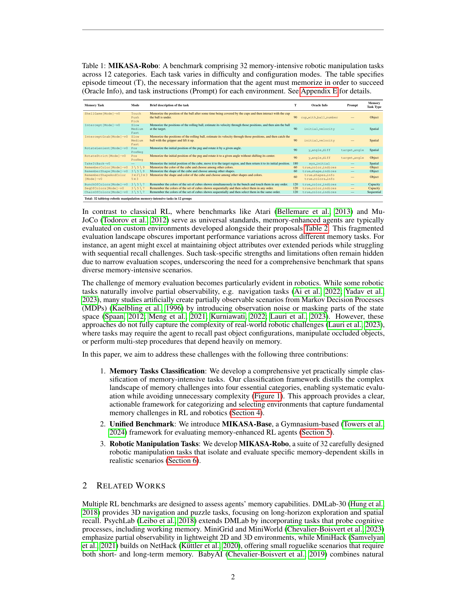

 


 2502.10550 
 Egor Cherepanov et el. 
 
 🤗 2025-02-18 
 



↗ arXiv


↗ Hugging Face


↗ Papers with Code


### TL;DR



현재 강화학습(Reinforcement Learning) 분야는 시간적, 공간적 의존성이 있는 복잡한 작업을 처리하는 데 있어 에이전트의 기억 능력을 평가하기 위한 표준화된 벤치마크가 부족합니다. 특히 로봇 조작 분야에서는 부분 관측 가능성과 견고한 성능을 보장하기 위해 기억력이 필수적이지만, 표준화된 벤치마크가 없습니다. 

본 논문에서는 이러한 문제를 해결하기 위해 MIKASA(Memory-Intensive Skills Assessment Suite for Agents)라는 종합적인 벤치마크를 제안합니다. MIKASA는 기억 집약적인 강화학습 작업에 대한 포괄적인 분류 체계, 체계적인 평가를 가능하게 하는 MIKASA-Base라는 통합 벤치마크, 그리고 테이블탑 로봇 조작에서 기억력을 평가하는 MIKASA-Robo라는 새로운 벤치마크의 세 가지 주요 기여를 합니다.



#### Key Takeaways


 강화학습에서 기억 집약적인 작업에 대한 포괄적인 분류 체계를 제시합니다. 



 다양한 시나리오에서 기억력 향상된 에이전트를 체계적으로 평가할 수 있는 MIKASA-Base라는 통합 벤치마크를 제공합니다. 



 테이블탑 로봇 조작에서 기억력을 평가하는 32가지의 세심하게 설계된 기억 집약적인 작업으로 구성된 새로운 벤치마크인 MIKASA-Robo를 개발합니다. 


#### Why does it matter?
**본 논문은 강화학습에서 기억력 평가를 위한 통합 프레임워크와 벤치마크를 제공하여 실제 로봇 애플리케이션에 대한 기억력 향상된 시스템 개발을 가속화합니다.** 이는 기억력 강화 학습 연구의 발전에 크게 기여하고, 실제 세계 문제에 대한 더욱 신뢰할 수 있는 시스템을 구축하는 데 도움이 됩니다. 특히, 제시된 분류 체계는 기억 집약적 작업의 다양한 측면을 포괄하여 다양한 에이전트의 기억 메커니즘을 객관적으로 평가할 수 있게 해줍니다.

------
#### Visual Insights

> 🔼 본 논문의 그림 1은 강화 학습(Reinforcement Learning, RL)에서 메모리를 필요로 하는 문제들을 체계적으로 분류한 그림입니다. 기존의 RL 벤치마크들은 특정한 메모리 활용 방식에만 초점을 맞춘 경우가 많아, 다양한 시나리오에서 에이전트의 메모리 능력을 종합적으로 평가하기 어려웠습니다. 그림 1은 메모리 활용 패턴을 명확히 구분하여, 서로 다른 에이전트의 메모리 메커니즘을 객관적으로 비교 평가할 수 있는 기준을 제시합니다. 이를 통해 다양한 유형의 메모리 과제에 대한 에이전트의 성능을 효과적으로 분석하고, 실제 응용 분야에 적용 가능한 더욱 신뢰할 수 있는 시스템 개발을 위한 기반을 마련합니다.
> 

> 
read the caption

> Figure 1: Systematic classification of problems with memory in RL reveals distinct memory utilization patterns and enables objective evaluation of memory mechanisms across different agents.
> 


| Memory Task | Mode | Brief description of the task | T | Oracle Info | Prompt | Memory Task Type |
|---|---|---|---|---|---|---|
| ShellGame[Mode]-v0 | Touch Push Pick | Memorize the position of the ball after some time being covered by the cups and then interact with the cup the ball is under. | 90 | cup_with_ball_number | — | Object |
| Intercept[Mode]-v0 | Slow Medium Fast | Memorize the positions of the rolling ball, estimate its velocity through those positions, and then aim the ball at the target. | 90 | initial_velocity | — | Spatial |
| InterceptGrab[Mode]-v0 | Slow Medium Fast | Memorize the positions of the rolling ball, estimate its velocity through those positions, and then catch the ball with the gripper and lift it up. | 90 | initial_velocity | — | Spatial |
| RotateLenient[Mode]-v0 | Pos PosNeg | Memorize the initial position of the peg and rotate it by a given angle. | 90 | y_angle_diff | target_angle | Spatial |
| RotateStrict[Mode]-v0 | Pos PosNeg | Memorize the initial position of the peg and rotate it to a given angle without shifting its center. | 90 | y_angle_diff | target_angle | Object |
| TakeItBack-v0 | — | Memorize the initial position of the cube, move it to the target region, and then return it to its initial position. | 180 | xyz_initial | — | Spatial |
| RememberColor[Mode]-v0 | 3  5  9 | Memorize the color of the cube and choose among other colors. | 60 | true_color_indices | — | Object |
| RememberShape[Mode]-v0 | 3  5  9 | Memorize the shape of the cube and choose among other shapes. | 60 | true_shape_indices | — | Object |
| RememberShapeAndColor | 3×2 3×3 5×3 | Memorize the shape and color of the cube and choose among other shapes and colors. | 60 | true_shapes_info true_colors_info | — | Object |
| BunchOfColors[Mode]-v0 | 3  5  7 | Remember the colors of the set of cubes shown simultaneously in the bunch and touch them in any order. | 120 | true_color_indices | — | Capacity |
| SeqOfColors[Mode]-v0 | 3  5  7 | Remember the colors of the set of cubes shown sequentially and then select them in any order. | 120 | true_color_indices | — | Capacity |
| ChainOfColors[Mode]-v0 | 3  5  7 | Remember the colors of the set of cubes shown sequentially and then select them in the same order. | 120 | true_color_indices | — | Sequential |

> 🔼 표 1은 MIKASA-Robo 벤치마크에 대한 자세한 내용을 보여줍니다. MIKASA-Robo는 12개의 범주에 걸쳐 32개의 메모리 집약적 로봇 조작 작업으로 구성된 벤치마크입니다. 각 작업은 난이도와 구성 모드가 다릅니다. 이 표에는 에피소드 제한 시간(T), 에이전트가 성공하기 위해 기억해야 하는 정보(Oracle Info), 그리고 각 환경에 대한 작업 지침(Prompt)이 명시되어 있습니다. 자세한 내용은 부록 E를 참조하십시오.
> 

> 
read the caption

> Table 1: MIKASA-Robo: A benchmark comprising 32 memory-intensive robotic manipulation tasks across 12 categories. Each task varies in difficulty and configuration modes. The table specifies episode timeout (T), the necessary information that the agent must memorize in order to succeed (Oracle Info), and task instructions (Prompt) for each environment. See Appendix E for details.
> 

### In-depth insights

#### Memory RL Tasks
본 논문에서 제시된 'Memory RL Tasks'는 **메모리 기반 강화학습 에이전트의 성능을 평가하기 위한 다양한 작업들을 포괄적으로 다루고 있습니다.** 특히, **시간적 및 공간적 의존성을 갖는 복잡한 문제 해결에 메모리가 필수적임**을 강조하며, 기존 연구들의 한계를 극복하기 위한 **표준화된 벤치마크의 부재**를 지적합니다. 이를 해결하고자 제안된  MIKASA는 **다양한 메모리 활용 패턴을 종합적으로 분류하는 체계적인 프레임워크**와 **실제 로봇 조작 환경을 반영한 벤치마크**를 제공합니다. **객체 기억, 공간 기억, 순차 기억, 메모리 용량** 등의 다양한 유형의 메모리 과제들을 포함하여 **에이전트의 메모리 능력을 포괄적으로 평가**할 수 있도록 설계되었습니다. MIKASA의 주요 목표는 **실제 세계 적용에 필요한 신뢰할 수 있는 시스템 개발을 촉진**하는 것입니다.

#### MIKASA Benchmark
MIKASA 벤치마크는 강화 학습에서 **메모리 기반 에이전트의 성능을 평가하기 위한 종합적인 벤치마크**입니다. 기존의 벤치마크들이 특정한 메모리 활용 방식이나 문제 영역에 국한된 것과 달리, MIKASA는 **다양한 유형의 메모리 집약적 과제들을 포괄적으로 다룹니다.**  **객체 기억, 공간 기억, 순차 기억, 메모리 용량** 등의 핵심적인 메모리 측면들을 평가하여 에이전트의 메모리 기능을 체계적으로 분석할 수 있도록 설계되었습니다. 특히, **로봇 조작 작업에 특화된 MIKASA-Robo**는 실제 세계의 복잡성을 반영하여 더욱 현실적인 평가 환경을 제공합니다.  **표준화된 프레임워크와 다양한 과제들을 제공**함으로써, MIKASA 벤치마크는 메모리 강화 학습 분야의 발전에 크게 기여할 것으로 기대됩니다.

#### Robotic Manipulation
본 논문에서 다룬 로봇 조작(Robotic Manipulation) 분야는 **부분적으로 관찰 가능한 환경(Partial Observability)**에서 **기억(Memory)**을 효과적으로 활용하는 강화 학습 에이전트를 평가하기 위한 벤치마크를 제시하는 데 중점을 둡니다.  기존의 로봇 조작 벤치마크들이 완전 관찰 가능한 환경에 초점을 맞추는 것과 달리, 이 연구는 **실제 세계의 복잡성**을 더 잘 반영하기 위해 부분 관찰 가능성을 도입합니다. 이는 로봇이 작업을 수행하는 동안 필요한 정보에 항상 접근할 수 없는 현실적인 상황을 시뮬레이션하는 데 중요합니다. 또한 **다양한 유형의 기억(Object Memory, Spatial Memory, Sequential Memory, Memory Capacity)**을 평가하기 위해 체계적인 분류 체계를 제시하고, 이에 따라 다양한 작업을 설계했습니다. 이를 통해 특정 유형의 기억 능력에 치우치지 않고, **균형 있는 평가**가 가능합니다.  **로봇 매니퓰레이션(Manipulation)** 작업에 초점을 맞추어, 물체의 위치, 모양, 색상을 기억하고, 순차적인 작업을 수행하며, 여러 정보를 동시에 처리하는 능력을 종합적으로 평가하는 벤치마크가 제공됩니다.  이는 **실제 로봇 시스템 개발에 직접적으로 기여**할 수 있을 것으로 기대됩니다.

#### Limitations of RL
강화학습(RL)은 많은 분야에서 잠재력을 보여주고 있지만, 여전히 극복해야 할 **중요한 한계점**들이 존재합니다. **데이터 효율성의 부족**은 RL의 가장 큰 문제 중 하나입니다. 복잡한 환경에서 성공적인 에이전트를 훈련하기 위해서는 **방대한 양의 데이터**가 필요하며, 이는 막대한 시간과 비용을 필요로 합니다. 또한, RL은 **샘플 효율성이 낮기 때문에** 훈련 과정이 매우 느리고, 특히 고차원의 상태 공간이나 복잡한 행동 공간을 다루는 경우에는 더욱 심각합니다. **과적합** 또한 RL에서 흔히 발생하는 문제입니다. 훈련 데이터에 과도하게 의존하여 새로운 상황에 제대로 적응하지 못하는 에이전트가 만들어질 수 있습니다. **보상 함수 설계** 또한 어려운 과제입니다. 잘못된 보상 함수는 에이전트가 원치 않는 행동을 하도록 유도할 수 있으며, 이는 훈련 결과에 심각한 영향을 미칩니다.  **전이 학습의 어려움** 또한 RL의 중요한 한계점입니다. 특정 환경에서 훈련된 에이전트는 다른 환경에서는 성능이 저하될 수 있으며, 새로운 환경에 적응하기 위해서는 추가적인 훈련이 필요합니다. 마지막으로, **해석성의 부족**은 RL의 발전을 저해하는 요소입니다. 복잡한 RL 모델의 내부 동작을 이해하기 어렵기 때문에 훈련 과정을 모니터링하거나 문제를 진단하기가 어렵습니다. 이러한 한계점들을 극복하기 위한 연구가 활발히 진행되고 있지만, RL의 실제 세계 적용을 위해서는 아직 많은 노력이 필요합니다.

#### Future of Memory RL
메모리 강화 학습(Memory RL)의 미래는 **더욱 복잡하고 현실적인 문제를 해결하기 위한 핵심 기술**이 될 것입니다.  **더욱 정교한 메모리 메커니즘**의 개발은 부분 관찰 환경에서의 의사결정 능력을 향상시키고, 장기적인 의존성과 지연된 보상을 가진 작업에서도 성공적인 수행을 가능하게 할 것입니다.  **로봇 제어 및 조작과 같은 실제 세계 문제**에 적용하기 위한 연구가 더욱 활발해질 것이며, **물리적 상호작용 및 시간적 제약 조건**을 고려한 새로운 벤치마크 및 평가 기준이 개발될 것입니다.  **인간의 기억 메커니즘**에 대한 연구 결과를 바탕으로 한 새로운 메모리 모델의 등장과 **다양한 유형의 메모리**를 통합하는 혼합 접근 방식이 주목받을 것입니다.  **메모리 효율성**과 **범용성**을 높이는 방향으로 연구가 진행될 것이며, **설명 가능성**과 **신뢰성**을 갖춘 시스템 개발을 위한 연구도 중요해질 것입니다.  궁극적으로 메모리 RL은 **강력하고 신뢰할 수 있는 인공지능 시스템**을 구축하는 데 중요한 역할을 할 것입니다.

### More visual insights

More on figures

> 🔼 그림 2는 제안된 MIKASA-Robo 벤치마크에서 메모리 집약적인 작업 실행을 보여줍니다. ShellGameTouch-v0 작업에서는 머그잔 아래 공의 위치를 기억하고 올바른 머그잔을 만져야 합니다. RememberColor9-v0 작업에서는 정육면체의 색상을 기억하고 나중에 일치하는 색상을 선택해야 합니다. RotateLenientPos-v0 작업에서는 이전 회전을 추적하면서 말뚝을 회전시켜야 합니다. 이 그림은 세 가지 다른 유형의 메모리 작업을 보여주며, 각 작업은 시간적 또는 공간적 의존성을 가진 복잡한 작업을 해결하기 위해 에이전트의 메모리 기능을 평가하는 데 사용될 수 있습니다.
> 

> 
read the caption

> Figure 2: Illustration of demonstrative memory-intensive tasks execution from the proposed MIKASA-Robo benchmark. The ShellGameTouch-v0 task requires the agent to memorize the ball’s location under mugs and touch the correct one. In RememberColor9-v0, the agent must memorize a cube’s color and later select the matching one. In RotateLenientPos-v0, the agent must rotate a peg while keeping track of its previous rotations.
> 

> 🔼 그림 3은 MIKASA가 사람의 기억 능력의 복잡성과 강화 학습 에이전트의 요구사항 사이의 간극을 어떻게 메우는지 보여줍니다.  사람의 기억 능력은 매우 복잡하지만, 에이전트의 과제는 그 모든 측면을 필요로 하지는 않습니다. 하지만 단순한 시공간적 의존성으로 축소될 수도 없습니다.  MIKASA는 에이전트의 과제에 필요한 필수적인 기억 측면을 포착하면서 실용적인 단순성을 유지하는 균형 잡힌 프레임워크를 제공합니다.  즉, 인간의 기억 능력의 모든 측면을 다 담을 필요는 없지만, 단순한 시공간적 요소만으로는 설명할 수 없는 수준의 기억 능력이 필요하다는 점을 강조합니다. MIKASA는 이러한 요구사항의 균형을 맞추는 프레임워크입니다.
> 

> 
read the caption

> Figure 3: MIKASA bridges the gap between human-like memory complexity and RL agents requirements. While agents tasks don’t require the full spectrum of human memory capabilities, they can’t be reduced to simple spatio-temporal dependencies. MIKASA provides a balanced framework that captures essential memory aspects for agents tasks while maintaining practical simplicity.
> 

> 🔼 그림 4는 메모리가 필요없는 MDP 모드 즉, state 모드에서 훈련된 PPO-MLP의 성능을 보여줍니다. 결과는 제안된 작업이 100%의 성공률로 본질적으로 해결 가능함을 시사합니다. 이는 모든 작업에 대해 100% 성공률을 달성한 에이전트가 있음을 의미하며, 제안된 작업이 어려운 작업을 해결하기 위한 메모리 향상 알고리즘을 평가하는 데 적합하다는 것을 보여줍니다.
> 

> 
read the caption

> Figure 4: Performance of PPO-MLP trained in state mode, i.e., in MDP mode without the need for memory. These results suggest that the proposed tasks are inherently solvable with a success rate of 100%percent\%%.
> 

> 🔼 그림 5는 RGB+joints 모드에서 학습된 MLP와 LSTM 백본을 사용하는 PPO 에이전트가 Dense reward 환경에서 RememberColor-v0 환경을 수행하는 결과를 보여줍니다.  RememberColor-v0 환경은 에이전트가 색깔을 기억해야 하는 작업입니다.  난이도가 중간 또는 높은 작업의 경우 두 아키텍처 모두 작업을 성공적으로 완료하지 못했습니다.  이 그림은 복잡한 작업에서 메모리 기반 강화학습의 어려움을 보여줍니다.
> 

> 
read the caption

> Figure 5: PPO with MLP and LSTM backbones trained in RGB+joints mode on the RememberColor-v0 environment with dense rewards. Both architectures fail to solve medium and high complexity tasks.
> 

> 🔼 그림 6은 오라클 수준의 상태 정보를 사용하여 훈련된 MIKASA-Robo 벤치마크에서 PPO-MLP의 성능을 보여줍니다. 이 학습 모드에서는 MDP 문제 공식화가 고려되므로 성공적인 문제 해결에 메모리가 필요하지 않습니다. 동시에 얻어진 결과는 이러한 문제를 해결하고 100% 성공률을 달성하는 것이 가능함을 보여줍니다. 이는 완전한 관측 환경에서 메모리 없이도 문제를 풀 수 있음을 보여주는 대조군 실험 결과입니다.  각 과제의 성공률을 훈련 단계에 따라 보여주는 그래프가 여러 개 제시되어 있습니다.
> 

> 
read the caption

> Figure 6: Demonstration of PPO-MLP performance on MIKASA-Robo benchmark when trained with oracle-level state information. In this learning mode, MDP problem formulation is considered, i.e. memory is not required for successful problem solving. At the same time, the obtained results show that it is possible to solve these problems and obtain 100% Success Rate.
> 

> 🔼 그림 7은 오라클 수준의 상태 정보를 사용하여 학습된 MIKASA-Robo 벤치마크에서 PPO-MLP의 성능을 보여줍니다. 결과는 메모리 용량(SeqOfColors[3,5,7]-v0, BunchOfColors[3,5,7]-v0)과 순차적 메모리(ChainOfColors[3,5,7]-v0)에 대한 결과를 보여줍니다.  즉, 에이전트가 완벽한 정보를 가지고 있을 때,  메모리 용량과 순차적 메모리를 필요로 하는 작업을 얼마나 잘 수행하는지 보여주는 그래프입니다.  이 그래프를 통해 각 작업 유형에 대한 에이전트의 성공률을 확인하고,  작업의 복잡도에 따른 성공률 변화를 분석할 수 있습니다.  상태 정보를 완벽하게 알고 있는 에이전트의 성능을 기준으로,  불완전한 정보 상황에서 메모리를 활용하는 에이전트의 성능을 비교 분석하는 데 도움이 됩니다.
> 

> 
read the caption

> Figure 7: Demonstration of PPO-MLP performance on MIKASA-Robo benchmark when trained with oracle-level state information. Results are shown for memory capacity (SeqOfColors[3,5,7]-v0, BunchOfColors[3,5,7]-v0) and sequential memory (ChainOfColors[3,5,7]-v0).
> 

> 🔼 그림 8은 MIKASA-Robo 벤치마크에서 PPO-MLP와 PPO-LSTM의 성능 평가를 보여줍니다. 'RGB+joints' 교육 모드와 밀집 보상 함수를 사용하여 에이전트는 카메라(위쪽과 그리퍼)에서 이미지와 관절의 상태(위치와 속도) 정보만 받습니다. 결과는 메모리가 있는 PPO-LSTM 에이전트에게도 많은 작업이 상당한 어려움을 제기함을 보여주며, 이 환경을 고급 메모리 향상 아키텍처를 평가하기 위한 효과적인 벤치마크로 확립합니다.
> 

> 
read the caption

> Figure 8: Performance evaluation of PPO-MLP and PPO-LSTM on the MIKASA-Robo benchmark using the “RGB+joints” training mode with dense reward function, where the agent only receives images from the camera (from above and from the gripper) and information about the state of the joints (position and velocity). The results demonstrate that numerous tasks pose significant challenges even for PPO-LSTM agents with memory, establishing these environments as effective benchmarks for evaluating advanced memory-enhanced architectures.
> 

> 🔼 그림 9는 MIKASA-Robo 벤치마크에서 PPO-MLP와 PPO-LSTM의 성능 평가를 보여줍니다.  'RGB+joints' 모드와 희소 보상 함수를 사용하여 훈련되었으며, 에이전트는 카메라(위쪽과 그리퍼)로부터 이미지와 관절 상태(위치 및 속도) 정보만을 받습니다. 희소 보상 함수를 사용하는 이 훈련 모드는 에이전트 학습의 난이도를 더욱 높여 메모리 향상 에이전트에게 더욱 어려운 과제를 제시합니다.  그림은 다양한 작업에서 두 알고리즘의 성공률을 보여주는 그래프로 구성되어 있습니다.  희소 보상으로 인해 에이전트가 작업을 해결하는 데 어려움을 겪는다는 것을 명확하게 보여줍니다.
> 

> 
read the caption

> Figure 9: Performance evaluation of PPO-MLP and PPO-LSTM on the MIKASA-Robo benchmark using the “RGB+joints” with sparse reward function training mode, where the agent only receives images from the camera (from above and from the gripper) and information about the state of the joints (position and velocity). This training mode with sparse reward function causes even more difficulty for the agent to learn, making this mode even more challenging for memory-enhanced agents.
> 

> 🔼 그림 10은 ShellGameTouch-v0 환경을 보여줍니다. 로봇은 처음에 공이 있는 위치를 관찰하고, 그 다음 공이 컵으로 덮입니다. 로봇의 과제는 공이 들어있는 컵을 만지는 것입니다. 이는 부분적으로 관찰 가능한 환경에서 공간 기억 능력을 평가하기 위한 것입니다.  로봇은 단순히 컵을 만지는 것만으로 성공할 수 있습니다.  (Push, Pick 모드도 존재)
> 

> 
read the caption

> Figure 10: ShellGameTouch-v0: The robot observes a ball in front of it. next, this ball is covered by a mug and then the robot has to touch the mug with the ball underneath.
> 

> 🔼 그림 11은 본 논문에서 제안하는 MIKASA-Robo 벤치마크의 RememberColor9-v0 작업을 보여줍니다. 이 작업은 로봇이 색상을 기억하고 인식하는 능력을 평가하기 위해 고안되었습니다. 먼저 로봇은 특정 색상의 정육면체를 관찰합니다. 그런 다음 정육면체가 사라지고 빈 테이블이 표시됩니다. 마지막으로 테이블에 여러 개의 정육면체가 나타나고 로봇은 에피소드 시작 시 관찰한 것과 같은 색상의 정육면체를 선택해야 합니다. 이 작업은 부분 관찰 환경에서 객체의 특성을 장기간 기억하는 로봇의 능력을 평가합니다.
> 

> 
read the caption

> Figure 11: RememberColor9-v0: The robot observes a colored cube in front of it, then this cube disappears and an empty table is shown. Then 9 cubes appear on the table, and the agent must touch a cube of the same color as the one it observed at the beginning of the episode.
> 

> 🔼 이 그림은 RememberShape9-v0 과제를 보여줍니다. 로봇은 처음에 특정 모양의 물체를 관찰합니다. 그런 다음 물체가 사라지고 빈 테이블이 나타납니다. 그 후 서로 다른 9개의 물체가 테이블에 나타나고, 에이전트는 에피소드 시작 시 관찰한 것과 동일한 모양의 물체를 만져야 합니다. 이 그림은 에이전트의 객체 지각 능력, 특히 객체의 모양을 기억하는 능력을 평가하는 과제를 시각적으로 보여줍니다.
> 

> 
read the caption

> Figure 12: RememberShape9-v0: The robot observes an object with specific shape in front of it, then the object disappears and an empty table appears. Then 9 objects of different shapes appear on the table, and the agent must touch an object of the same shape as the one it observed at the beginning of the episode.
> 

> 🔼 이 그림은 RememberShapeAndColor5x3-v0 작업을 보여줍니다. 에이전트 앞에 특정한 모양과 색상의 물체가 나타납니다. 그런 다음 물체가 사라지고 빈 테이블이 보입니다. 그 후 다양한 모양(5가지)과 색상(3가지)의 물체들이 테이블 위에 나타나고 에이전트는 에피소드 시작 시 관찰했던 물체를 만져야 합니다. 이 작업은 에이전트의 객체 인식 및 기억 능력을 평가합니다.
> 

> 
read the caption

> Figure 13: RememberShapeAndColor5x3-v0: An object of a certain shape and color appears in front of the agent. Then the object disappears and the agent sees an empty table. Then objects of 5 different shapes and 3 different colors appear on the table and the agent has to touch what it observed at the beginning of the episode.
> 

> 🔼 그림 14는 InterceptMedium-v0 환경을 보여줍니다. 이 환경에서 에이전트는 테이블 위에서 무작위 초기 속도로 움직이는 공을 가로채서 목표 구역으로 보내는 작업을 수행해야 합니다. 이는 에이전트의 운동 예측 및 공간-시간적 추론 능력을 평가하는 데 중점을 둡니다. 이러한 능력은 로봇 조작 작업에서 역동적인 조작을 수행하는 데 필수적입니다.
> 

> 
read the caption

> Figure 14: InterceptMedium-v0: A ball rolls on the table in front of the agent with a random initial velocity, and the agent’s task is to intercept this ball and direct it at the target zone.
> 

> 🔼 그림 15는 InterceptGrabMedium-v0 환경을 보여줍니다. 이 환경에서 에이전트는 테이블 위에서 무작위 초기 속도로 움직이는 공을 핸드 그리퍼로 잡아 들어 올려야 합니다.  에이전트는 공의 움직임을 예측하고, 적절한 시점에 그리퍼를 위치시켜 공을 잡고, 안정적으로 들어 올려야 성공으로 간주됩니다. 이는 로봇이 움직이는 물체를 다루는 실제 상황을 시뮬레이션한 것으로, 운동 예측 및 정밀한 조작 타이밍이 필요합니다. 성공 여부에 따라 보상을 받게 되며, 보상 함수는 스파스(성공/실패)와 밀집(공과 그리퍼의 거리, 공과 목표 영역의 거리, 로봇의 움직임 부드러움) 형태 모두 포함합니다.
> 

> 
read the caption

> Figure 15: InterceptGrabMedium-v0: A ball rolls on the table in front of the agent with a random initial velocity, and the agent’s task is to intercept this ball with a gripper and lift it up.
> 

> 🔼 그림은 RotateLenientPos-v0 작업을 보여줍니다. 이 작업에서 에이전트는 임의의 방향으로 배치된 막대를 특정 각도만큼 회전해야 합니다. 이때 막대의 중심을 이동시켜도 괜찮습니다. 이 그림은 에이전트가 작업을 수행하는 단계별 시각적 표현을 제공하여,  강화 학습 에이전트의 공간적 추론 및 정밀한 조작 능력을 평가하는 데 사용되는 방법을 보여줍니다.
> 

> 
read the caption

> Figure 16: RotateLenientPos-v0: A randomly oriented peg is placed in front of the agent. The agent’s task is to rotate this peg by a certain angle (the center of the peg can be shifted).
> 

> 🔼 그림 17은 RotateStrictPos-v0 작업을 보여줍니다. 이 작업에서 에이전트는 임의의 방향으로 배치된 핀을 특정 각도만큼 회전해야 합니다. 핀의 중심을 움직이는 것은 허용되지 않습니다. 이 작업은 에이전트의 정밀한 방향 제어 능력과 목표 각도를 기억하고 실행하는 능력을 평가합니다.  에이전트는 핀의 초기 방향을 기억하고 정확하게 목표 각도만큼 회전시켜야 성공적인 작업으로 간주됩니다.
> 

> 
read the caption

> Figure 17: RotateStrictPos-v0: A randomly oriented peg is placed in front of the agent. The agent’s task is to rotate this peg by a certain angle (it is not allowed to move the center of the peg)
> 

> 🔼 이 그림은 TakeItBack-v0 과제를 보여줍니다. 에이전트는 초록색 정육면체를 빨간색 목표 지점으로 옮겨야 합니다. 목표 지점이 보라색으로 바뀌면 에이전트는 정육면체를 원래 위치로 되돌려야 합니다. 하지만 에이전트는 원래 위치를 관찰할 수 없습니다. 이 과제는 에이전트의 순차적 기억 및 공간적 추론 능력을 평가합니다.
> 

> 
read the caption

> Figure 18: TakeItBack-v0: The agent observes a green cube in front of him. The agent’s task is to move the green cube to the red target, and as soon as it lights up violet, return the cube to its original position (the agent does not observes the original position of the cube).
> 

> 🔼 이 그림은 SeqOfColors7-v0 과제를 보여줍니다. 에이전트 앞에 7개의 서로 다른 색깔의 정육면체가 순차적으로 나타납니다. 마지막 정육면체가 보인 후, 에이전트는 빈 테이블을 관찰합니다. 그런 다음 9개의 서로 다른 색깔의 정육면체가 테이블에 나타나고, 에이전트는 에피소드 시작 시에 보였던 정육면체를 아무 순서대로나 만져야 합니다.
> 

> 
read the caption

> Figure 19: SeqOfColors7-v0: In front of the agent, 7 cubes of different colors appear sequentially. After the last cube is shown, the agent observes an empty table. Then 9 cubes of different colors appear on the table and the agent has to touch the cubes that were shown at the beginning of the episode in any order.
> 

> 🔼 이 그림은 BunchOfColors7-v0 작업에 대한 설명입니다. 이 작업에서 에이전트는 처음에 동시에 나타나는 7개의 다양한 색깔의 정육면체를 관찰합니다. 그런 다음 빈 테이블이 보이고, 마지막으로 9개의 다양한 색깔의 정육면체가 테이블에 나타납니다. 에이전트는 에피소드 시작 시 보였던 정육면체들을 순서에 상관없이 만져야 합니다. 이는 에이전트의 단기 기억과 동시에 여러 물체를 처리하는 능력을 평가하는 것을 목표로 합니다.
> 

> 
read the caption

> Figure 20: BunchOfColors7-v0: 7 cubes of different colors appear simultaneously in front of the agent. After the agent observes an empty table. Then, 9 cubes of different colors appear on the table and the agent has to touch the cubes that were shown at the beginning of the episode in any order.
> 

> 🔼 이 그림은 ChainOfColors7-v0 작업에 대한 설명입니다. 에이전트 앞에 서로 다른 색깔의 정육면체 7개가 순차적으로 나타납니다. 마지막 정육면체가 보여진 후 에이전트는 빈 테이블을 봅니다. 그런 다음, 서로 다른 색깔의 정육면체 9개가 테이블에 나타나고 에이전트는 에피소드 시작 시에 보여진 것과 동일한 엄격한 순서로 정육면체를 만져야 합니다.
> 

> 
read the caption

> Figure 21: ChainOfColors7-v0: In front of the agent, 7 cubes of different colors appear sequentially. After the last cube is shown, the agent sees an empty table. Then 9 cubes of different colors appear on the table and the agent must unmistakably touch the cubes that were shown at the beginning of the episode, in the same strict order.
> 

### Full paper



