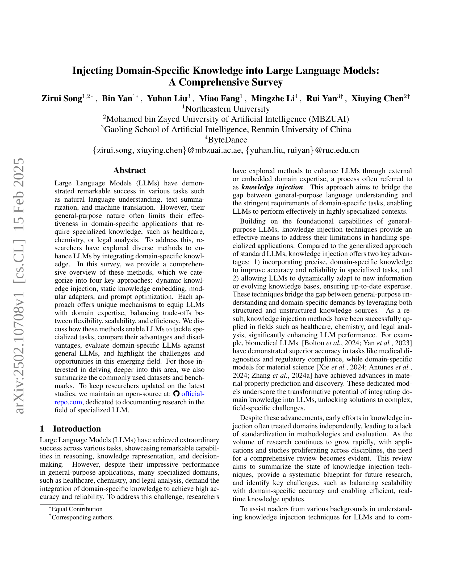
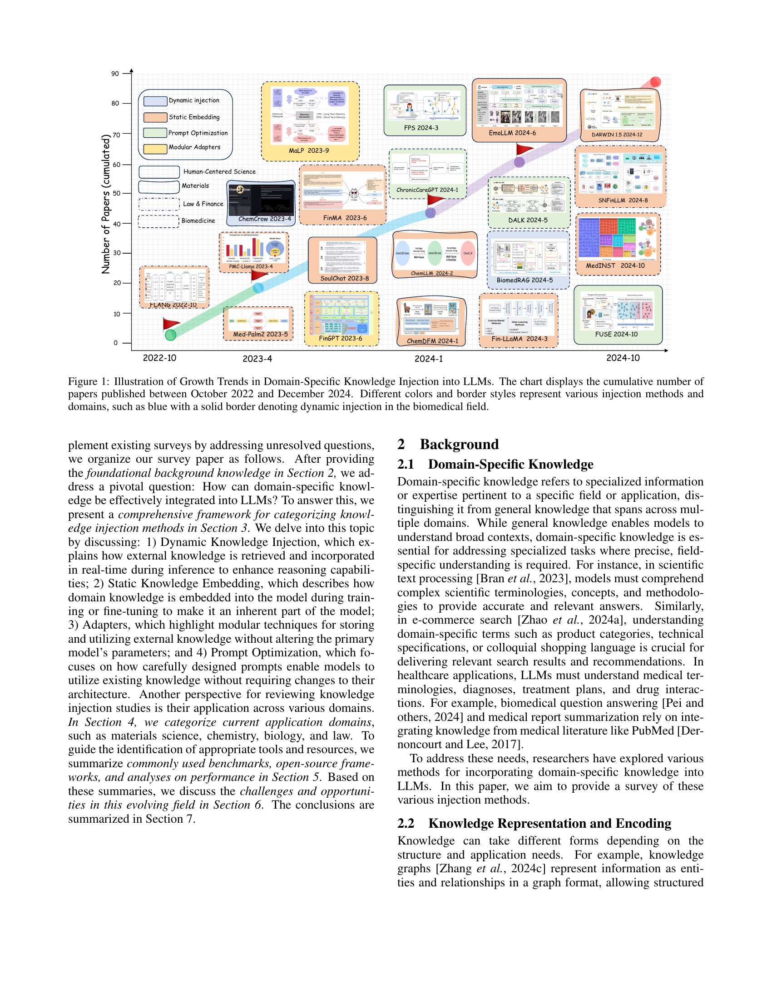
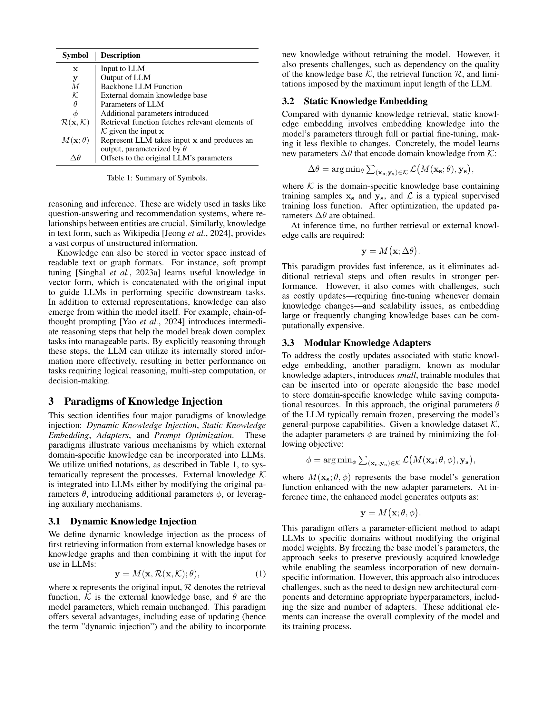
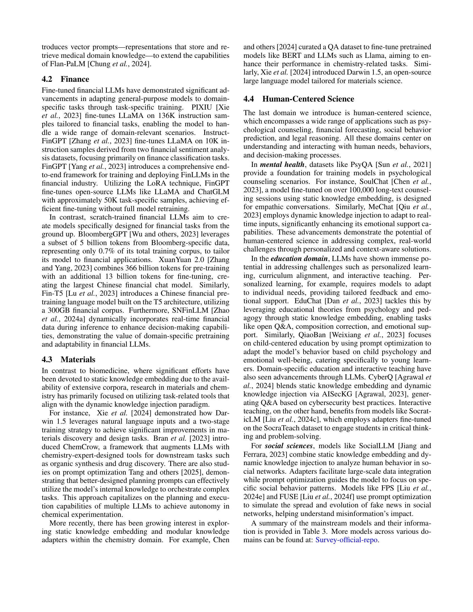
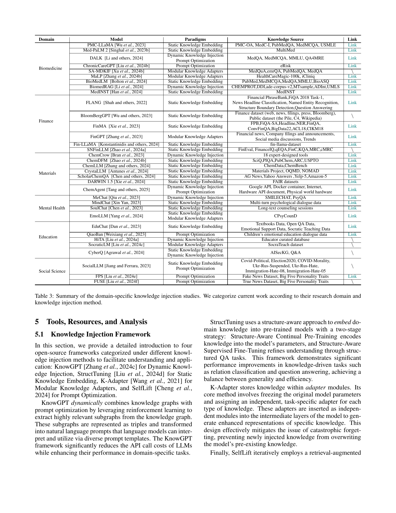
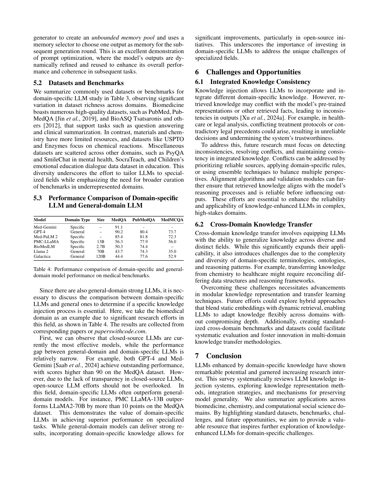
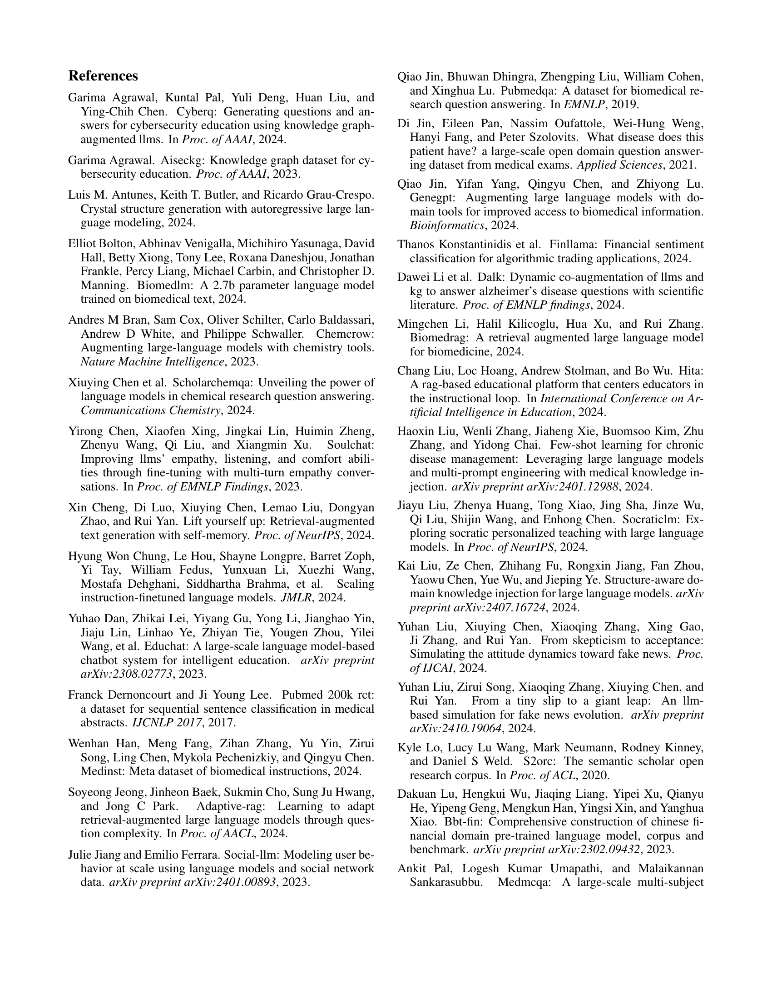
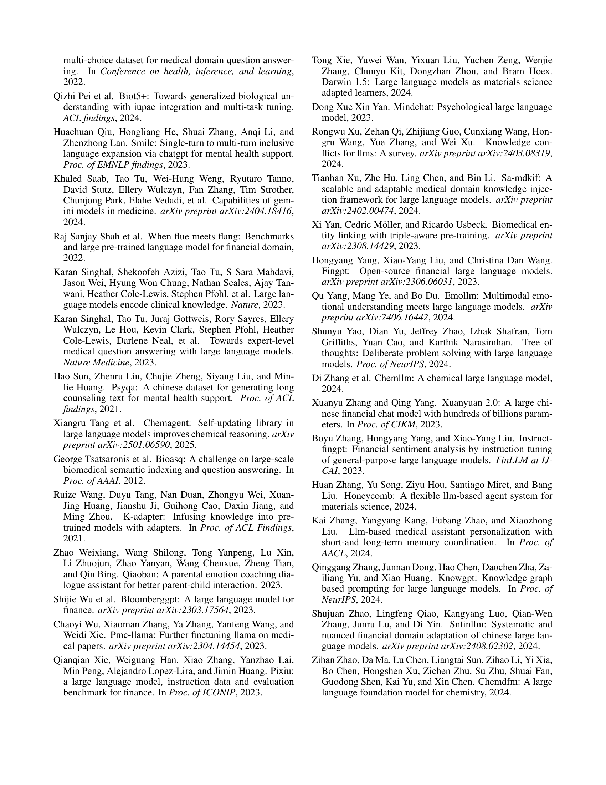

 


 2502.10708 
 Zirui Song et el. 
 
 🤗 2025-02-19 
 



↗ arXiv


↗ Hugging Face


↗ Papers with Code


### TL;DR



본 논문은 **의료, 금융, 재료과학, 인문사회과학 등 다양한 분야에서 대규모 언어 모델(LLM)의 성능을 향상시키기 위해 도메인 특화 지식을 통합하는 방법**을 심층적으로 조사합니다.  기존 LLM은 일반적인 지식에 기반하여 다양한 작업을 수행하지만, 특정 분야의 전문 지식이 필요한 작업에서는 성능이 저하되는 문제가 있습니다. 이러한 한계를 극복하기 위해, 연구자들은 다양한 지식 주입 기술을 개발해 왔습니다. 

본 논문에서는 **동적 지식 주입, 정적 지식 임베딩, 모듈형 어댑터, 프롬프트 최적화 등 네 가지 주요 지식 주입 방법**을 자세히 설명합니다. 각 방법의 장단점을 비교 분석하고, 다양한 도메인에서의 적용 사례를 소개합니다. 또한, **공개적으로 사용 가능한 데이터셋과 벤치마크, 그리고 도메인 특화 LLM 개발에 필요한 도구 및 프레임워크**를 제시합니다. 마지막으로, 향후 연구 방향과 극복해야 할 과제를 제시하여 이 분야의 발전에 기여하고자 합니다.



#### Key Takeaways


 도메인 특화 지식을 LLM에 주입하는 4가지 주요 방법(동적 지식 주입, 정적 지식 임베딩, 모듈형 어댑터, 프롬프트 최적화)이 제시됨 



 각 방법의 장단점과 효율성을 비교 분석하여, 특정 도메인과 과제에 적합한 방법 선택을 위한 지침 제공 



 도메인 특화 LLM의 성능 평가를 위한 최신 데이터셋과 벤치마크 정보, 그리고 향후 연구 방향에 대한 논의 포함 


#### Why does it matter?
본 논문은 **도메인 특화 지식을 대규모 언어 모델(LLM)에 효과적으로 통합하는 다양한 방법**을 종합적으로 조사하여, **연구자들이 특정 도메인에 맞는 최적의 방법을 선택하고 새로운 연구 방향을 모색**할 수 있도록 돕습니다.  **최신 연구 동향을 반영한 최신 데이터셋과 벤치마크 정보**를 제공하여 연구자들의 효율성을 높입니다. 또한, **통합 과정에서 발생할 수 있는 어려움과 앞으로 해결해야 할 과제**에 대해 심도 있게 논의하여 향후 연구 방향을 제시합니다. 이러한 정보는 **새로운 도메인 특화 LLM 개발** 및 **기존 모델 성능 개선**에 기여할 수 있습니다.

------
#### Visual Insights

> 🔼 그림 1은 2022년 10월부터 2024년 12월까지 발표된 논문의 누적 수를 보여주는 차트로, 특정 도메인 지식을 대규모 언어 모델(LLM)에 주입하는 연구 동향을 시각적으로 나타냅니다.  각 도메인(생의학, 재료과학, 금융, 법률 등)과 지식 주입 방법(동적 주입, 정적 임베딩, 모듈형 어댑터, 프롬프트 최적화)에 따라 색상과 테두리 스타일이 다르게 표시되어 구분됩니다. 예를 들어, 파란색 실선 테두리는 생의학 분야의 동적 주입 방법을 나타냅니다. 이 차트는 각 방법과 도메인별 연구 활동의 성장세를 한눈에 보여줍니다.
> 

> 
read the caption

> Figure 1: Illustration of Growth Trends in Domain-Specific Knowledge Injection into LLMs. The chart displays the cumulative number of papers published between October 2022 and December 2024. Different colors and border styles represent various injection methods and domains, such as blue with a solid border denoting dynamic injection in the biomedical field.
> 


| Symbol | Description |
|---|---| 
| \mathbf{x} | Input to LLM |
| \mathbf{y} | Output of LLM |
| M | Backbone LLM Function |
| \mathcal{K} | External domain knowledge base |
| \theta | Parameters of LLM |
| \phi | Additional parameters introduced |
| \mathcal{R}(\mathbf{x},\mathcal{K}) | Retrieval function fetches relevant elements of \mathcal{K} given the input \mathbf{x} |
| M(\mathbf{x};\theta) | Represent LLM takes input \mathbf{x} and produces an output, parameterized by \theta |
| \Delta\theta | Offsets to the original LLM’s parameters |

> 🔼 표 1은 논문에서 사용되는 주요 기호들의 의미를 설명하는 표입니다.  각 기호는 LLM(대규모 언어 모델)에 도메인 특정 지식을 주입하는 다양한 방법들을 설명하는 데 사용되는 변수들을 나타냅니다. 예를 들어, 'x'는 LLM에 대한 입력값을, 'y'는 출력값을 나타내며, 'K'는 외부 도메인 지식 베이스, 'θ'는 LLM의 매개변수를 의미합니다. 이 표는 이후 절에서 설명되는 지식 주입 방법을 이해하는 데 필수적인 기호들을 정의하여 독자의 이해도를 높입니다.
> 

> 
read the caption

> Table 1: Summary of Symbols.
> 

### In-depth insights

#### LLM Knowledge Infusion
LLM 지식 주입은 **대규모 언어 모델(LLM)**의 성능을 향상시키기 위해 도메인 특화 지식을 통합하는 과정을 의미합니다. 이는 **일반적인 LLM의 한계를 극복**하고 특정 분야에서의 정확성과 신뢰성을 높이는 데 중요한 역할을 합니다.  **다양한 접근 방식**이 존재하며, 각각 장단점을 가지고 있습니다.  **동적 지식 주입**은 추론 과정에서 실시간으로 외부 지식베이스를 활용하지만, 검색 기능의 질에 의존하는 한계가 있습니다. 반면 **정적 지식 임베딩**은 학습 과정에서 지식을 모델 파라미터에 통합하여 빠른 추론을 가능하게 하지만, 지식 업데이트에 비용이 많이 들 수 있습니다.  **모듈형 어댑터**는 기본 모델을 변경하지 않고 도메인 지식을 추가할 수 있는 유연성을 제공하지만, 추가적인 설계 및 최적화가 필요합니다. 마지막으로, **프롬프트 최적화**는 모델 파라미터를 변경하지 않고 프롬프트 엔지니어링을 통해 내부 지식을 활용하는 방식으로, 비용 효율적이지만, 효과적인 프롬프트 설계가 어려울 수 있습니다.  **최적의 방법은 특정 응용 분야와 요구 사항에 따라 달라지며**, 각 접근 방식의 장단점을 신중하게 고려해야 합니다.  **지속적인 연구**를 통해 더욱 효율적이고 강력한 LLM 지식 주입 기술이 개발될 것으로 예상됩니다.

#### Injection Methodologies
본 논문에서 제시된 다양한 지식 주입 방법론들은 **LLM의 특징과 한계를 고려하여 설계**되었습니다.  **동적 지식 주입**은 실시간 정보 검색 및 활용에 초점을 맞춰 유연성을 높였지만, 검색의 정확도 및 속도에 의존하는 한계가 있습니다. 반면 **정적 지식 임베딩**은 모델 매개변수에 지식을 직접 통합하여 빠른 추론 속도를 제공하지만, 지식 업데이트 비용이 높고, 학습 과정에서 기존 지식이 손실될 위험이 있습니다. **모듈식 어댑터**는 기존 모델의 성능 저하 없이 특정 도메인 지식을 추가하는 데 중점을 두지만, 추가적인 모듈 설계 및 하이퍼파라미터 조정이 필요하다는 어려움이 있습니다. 마지막으로 **프롬프트 최적화**는 모델 재학습 없이 기존 지식을 활용하는 데 초점을 맞추지만, 효과적인 프롬프트 설계에 많은 노력이 필요합니다. 각 방법론은 장단점이 존재하며, 특정 응용 분야의 요구사항과 제약 조건에 따라 적절한 방법을 선택하는 것이 중요합니다.  **최적의 방법론 선택은 목표, 데이터 가용성, 성능 요구사항 등 여러 요소를 종합적으로 고려**해야 합니다.

#### Domain-Specific LLMs
본 논문은 **도메인 특화 LLM**에 대한 심층적인 논의를 제공합니다. 일반적인 LLM의 한계를 극복하고 특정 도메인의 전문 지식을 활용하여 성능을 향상시키는 방법에 초점을 맞춥니다. **동적 지식 주입, 정적 지식 임베딩, 모듈형 어댑터, 프롬프트 최적화**와 같은 다양한 접근 방식을 제시하며 각 방법의 장단점과 적용 분야를 자세하게 비교 분석합니다. 특히, **의료, 금융, 재료 과학, 인문학 중심 과학** 등 다양한 분야에서의 적용 사례를 제시하며, 각 도메인의 특성에 맞는 최적의 지식 주입 방법을 제안합니다.  **데이터셋 및 벤치마크**에 대한 요약 정보를 제공하여 연구자들에게 유용한 지침을 제공합니다.  **데이터 불균형 및 지식 일관성 유지**와 같은 과제와 함께 **새로운 도메인에 대한 지식 전이 가능성**에 대한 미래 연구 방향을 제시하며, **도메인 특화 LLM**의 발전 가능성과 그 중요성을 강조합니다.  **오픈소스 프레임워크**를 소개하여 실제 연구에 활용할 수 있도록 지원합니다.

#### Future Research Needs
미래 연구는 **도메인 특화 지식 주입의 효율성 및 확장성을 높이는 새로운 방법론** 개발에 초점을 맞춰야 합니다.  **대규모 언어 모델의 제한된 메모리 용량 및 계산 비용** 문제를 해결하기 위한 효율적인 알고리즘과 아키텍처 개발이 필수적입니다.  또한, **다양한 도메인 간의 지식 전이**를 가능하게 하는 기술 개발을 통해 모델의 일반화 능력을 향상시키고, **지식의 일관성 및 신뢰성을 보장**하는 메커니즘 연구가 중요합니다.  **도메인 특화 LLM의 성능 평가를 위한 표준화된 벤치마크 및 평가 지표** 개발도 시급한 과제입니다.  마지막으로, **윤리적 및 사회적 책임**에 대한 고려를 통해 안전하고 책임감 있는 도메인 특화 LLM 개발을 위한 연구가 필요합니다.

#### Comparative Analysis
본 논문에서는 **다양한 도메인 특화 LLM 구축 방법**을 비교 분석하여, 각 방법의 강점과 약점을 심층적으로 살펴보았습니다. 특히, **동적 지식 주입, 정적 지식 임베딩, 모듈형 어댑터, 프롬프트 최적화** 등 네 가지 주요 접근 방식을 중점적으로 비교 분석했으며, 각 방법이 제공하는 유연성, 확장성, 효율성 측면에서의 차이점과 상호작용을 자세히 논의했습니다.  **실제 도메인 특화 과제에서의 성능 비교**를 통해 각 방법의 장단점을 명확히 제시하고, **새로운 연구 방향과 도전 과제**를 제시하여 앞으로의 연구 발전 방향을 제시했습니다.  **데이터셋 및 벤치마크**에 대한 요약 정보를 통해 연구자들이 특정 영역에 대한 심층 연구를 진행하는 데 도움을 주고자 노력했습니다.  **개방형 소스 저장소**를 활용하여 최신 연구 동향을 지속적으로 업데이트하여 연구자들에게 최신 정보를 제공하고 있습니다.

### More visual insights

More on tables


| Paradigm | Training Cost | Inference Speed | Limitations |
|---|---|---|---| 
| Dynamic Injection | None, but requires retrieval module | Slower due to retrieval latency | Relies heavily on retrieval quality |
| Static Embedding | High (requires pretraining or fine-tuning) | No extra cost | Fixed knowledge; risks catastrophic forgetting |
| Modular Adapters | Low (train small subset of parameters) | Almost unaffected | Sensitive to training data quality |
| Prompt Optimization | None | Almost unaffected | Labor-intensive; limited to pre-existing knowledge |
> 🔼 표 2는 지식 주입 방법을 선택할 때 고려해야 할 요소들을 비교 분석한 표입니다. 훈련 비용, 추론 속도, 한계점 등 세 가지 측면에서 동적 주입, 정적 임베딩, 모듈형 어댑터, 프롬프트 최적화 네 가지 방법을 비교하여 각 방법의 장단점을 명확하게 보여줍니다.  본 표를 통해 연구자들은 자신들의 연구 목표와 상황에 가장 적합한 지식 주입 방법을 선택하는데 도움을 받을 수 있습니다.
> 

> 
read the caption

> Table 2: Guidance on selecting knowledge injection paradigms based on training cost, inference speed, and limitations.
> 


| Dynamic | Injection |
|---|---|
> 🔼 표 3은 논문에서 다루는 도메인별 지식 주입 연구들을 요약한 표입니다. 각 연구는 연구 분야와 사용된 지식 주입 방법에 따라 분류되어 있습니다. 표에는 각 연구의 모델 이름, 사용된 지식 주입 방법(동적 지식 주입, 정적 지식 임베딩, 모듈형 어댑터, 프롬프트 최적화), 사용된 지식 소스, 그리고 관련 링크가 포함되어 있습니다. 이 표는 다양한 도메인에서 지식 주입 기술이 어떻게 적용되고 있는지, 그리고 각 방법의 특징과 강점을 한눈에 파악하는 데 유용합니다.
> 

> 
read the caption

> Table 3: Summary of the domain-specific knowledge injection studies. We categorize current work according to their research domain and knowledge injection method.
> 


| Feature             | Description                                  |
|----------------------|----------------------------------------------|
| None, but requires     | retrieval module                             |
> 🔼 표 4는 의료 관련 벤치마크에서 도메인 특화 모델과 일반 도메인 모델의 성능을 비교한 표입니다. 특히 MedQA, PubMedQA, MedMCQA 세 가지 벤치마크에서 도메인 특화 모델(Med-Gemini, Med-PaLM 2, PMC-LLaMA, BioMedLM)과 일반 도메인 모델(GPT-4, Llama 2, Galactica)의 성능 지표를 비교하여 도메인 특화 모델의 효과를 보여줍니다.  모델의 크기(매개변수 수) 정보도 함께 제공하여 모델 크기와 성능 간의 관계를 분석하는 데 도움을 줍니다.
> 

> 
read the caption

> Table 4: Performance comparison of domain-specific and general-domain model performance on medical benchmarks.
> 

### Full paper



