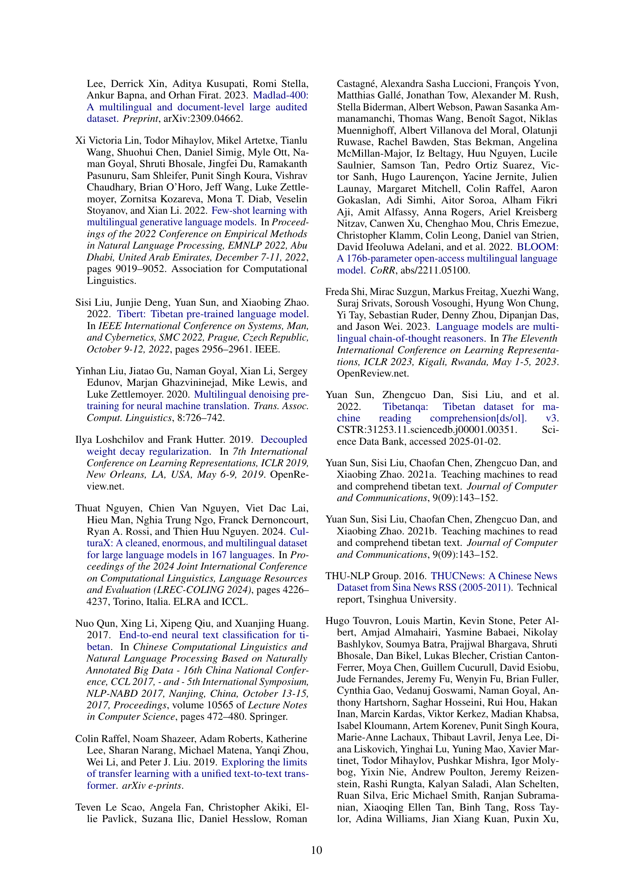

 


 2502.10852 
 Zeli Su et el. 
 
 🤗 2025-02-19 
 



↗ arXiv


↗ Hugging Face


↗ Papers with Code


### TL;DR



현대 다국어 언어 모델들은 영어와 같은 고자원 언어에 대해서는 우수한 성능을 보이지만, 티베트어, 위구르어와 같은 저자원 언어에 대해서는 성능이 현저히 떨어집니다. 이는 저자원 언어에 대한 데이터 부족과, 기존 모델들이 이러한 언어들을 충분히 고려하지 않고 학습되었기 때문입니다. 이러한 문제는 많은 저자원 언어 사용자들이 자연어 처리 기술의 혜택을 받지 못하게 하는 심각한 문제입니다.

본 논문에서는 이러한 문제를 해결하기 위해 **공유 가중치 프레임워크(Shared Weights Framework)**를 기반으로 하는 새로운 다국어 인코더-디코더 모델인 XLM-SWCM을 제시합니다. 이 모델은 인코더와 디코더 사이의 가중치를 공유하여 인코더의 학습된 의미 공간을 활용함으로써 저자원 언어에 대한 학습 효율을 높이고, 일반화 성능을 향상시킵니다. 실험 결과, XLM-SWCM은 중국 소수민족 언어에 대한 다양한 하류 작업(텍스트 요약, 기계 독해, 기계 번역)에서 기존 모델들을 능가하는 우수한 성능을 보였습니다. 이는 **극저자원 언어 처리 분야**에 대한 중요한 기여이며, **저자원 언어 모델 개발**에 새로운 가능성을 제시합니다.



#### Key Takeaways


 공유 가중치 프레임워크를 통해 저자원 언어에서 효율적인 텍스트 생성 모델을 개발할 수 있음 



 XLM-SWCM 모델이 중국 소수민족 언어의 다양한 하류 작업에서 우수한 성능을 보임 



 본 연구는 저자원 언어 처리 분야에 대한 새로운 연구 방향을 제시하며, 향후 관련 연구 발전에 중요한 기여를 할 것으로 예상됨 


#### Why does it matter?
본 논문은 **극저자원 언어**에 대한 텍스트 생성 모델 개발의 어려움을 해결하는 새로운 방법론을 제시하여, **다국어 언어 모델의 효율적인 적용** 및 **저자원 언어 처리 분야**의 발전에 크게 기여합니다. 특히, **중국 소수 민족 언어**에 대한 연구에 중요한 시사점을 제공하며, 향후 **저자원 언어 처리 기술** 발전에 대한 새로운 연구 방향을 제시합니다.

------
#### Visual Insights

> 🔼 그림 1은 OSCAR 말뭉치에서 다양한 고자원, 중자원, 저자원 언어에 대해 인구 규모와 데이터셋 크기 간의 관계를 보여줍니다.  Y축은 메가바이트(MB) 단위의 데이터셋 크기를 나타내고, X축은 백만 단위의 인구 규모를 나타냅니다.  각 언어에 대한 데이터셋 크기는 해당 언어 사용 인구에 비례하지 않음을 보여주는 산점도가 제시되어 있습니다. 특히 카자흐어와 몽골어처럼 인구는 많지만 사용 가능한 데이터가 거의 없는 저자원 언어의 상황을 강조하고 있습니다.
> 

> 
read the caption

> Figure 1: The relationship between population size and dataset size in OSCAR (y-axis, in MB) for various high-, middle-, and low-resource languages.
> 


| Model | Size | Sum F | Sum P | Sum R | MRC F | MRC P | MRC R | MT F | MT P | MT R |
|---|---|---|---|---|---|---|---|---|---|---|
| MC2-LLaMA-13B | 13B | 16.1 | 12.3 | 15.5 | 13.2 | 11.7 | 13.1 | 15.1 | 12.2 | 16.8 |
| mBART-CM | 611M | 8.6 | 11.2 | 15.2 | 7.9 | 6.1 | 5.6 | 11.5 | 7.3 | 9.3 |
| XLM-SWCM (ours) | 457M | **25.7** | **29.1** | **24.2** | **16.4** | **29.5** | **16.2** | **24.5** | **26.3** | **24.3** |

> 🔼 표 1은 세 가지 ROUGE-L 하위 지표(F1 점수, 정밀도, 재현율)를 사용하여 평가된 기준 모델의 성능 지표를 보여줍니다.  모델의 크기는 각 모델의 파라미터 수를 나타냅니다.  본 표는 다양한 크기의 언어 모델들이 저자원 언어에 대한 텍스트 생성 작업에서 어떤 성능을 보이는지 비교 분석하는 데 사용됩니다.  특히,  XLM-SWCM 모델이 기존의 대규모 모델들과 비교했을 때 파라미터 수는 적지만 성능은 우수하다는 점을 보여주는 중요한 결과를 담고 있습니다.
> 

> 
read the caption

> Table 1:  Performance metrics of the baseline models, evaluated using three ROUGE-L sub metrics: F (F1-score), P (precision), and R (recall). Size refers to the number of parameters in each model.
> 

### In-depth insights

#### Low-Resource NLP
저자원 NLP는 **데이터 부족**으로 인해 어려움을 겪는 언어 처리 분야입니다. 이는 특정 언어에 대한 학습 데이터가 제한적이거나 전혀 없어 기존의 딥러닝 모델이 제대로 작동하지 않기 때문입니다.  본 논문은 이러한 문제를 해결하기 위해 **기존 다국어 모델의 가중치를 공유하는 방법**을 제시하여 저자원 언어에 대한 성능을 향상시키고자 합니다.  **가중치 공유**를 통해 자원이 풍부한 언어에서 학습된 지식을 저자원 언어에 효율적으로 전달하고, 제한된 데이터로도 효과적인 학습을 가능하게 하는 것이 핵심입니다. 이는 **모델의 일반화 능력 향상**과 더불어 **계산 비용 절감**에도 기여할 것으로 예상됩니다. **소수 언어** 및 **멸종 위기에 처한 언어**에 대한 연구는 사회적 중요성이 높으며, 저자원 NLP 기술의 발전은 이러한 언어의 보존과 활용에 크게 기여할 수 있습니다.  하지만, 이러한 접근 방식은 **데이터의 품질** 및 **다양한 언어의 특성**을 고려한 세밀한 조정이 필요하다는 점을 고려해야 합니다.

#### Shared Weighting
공유 가중치 기법은 **매우 저자원 언어의 텍스트 생성을 위한 다국어 인코더를 효율적으로 확장하는 핵심**입니다. 인코더와 디코더 간 가중치를 재사용하여 **모델이 인코더의 학습된 의미 공간을 활용**, 효율적인 학습과 저자원 언어에서의 효과적인 일반화를 가능하게 합니다. **가중치 공유 메커니즘은 인코더의 사전 학습된 지식을 유지**하면서 모델의 안정성을 유지하는 데 중요한 역할을 합니다.  **인코더의 가중치를 디코더에 전달**하고, 일부 가중치를 인코더와 디코더 간에 연결하여 효율적인 학습을 촉진합니다. 이는 **데이터 부족 문제를 해결**하는 동시에 저자원 언어에 대한 성능을 크게 향상시킵니다.  하지만 가중치 공유 비율 조절을 통한 성능 최적화,  다양한 저자원 언어 데이터셋에 대한 추가 실험 등 더욱 심도있는 연구가 필요합니다.

#### XLM-SWCM Model
XLM-SWCM 모델은 **극저자원 언어**를 위한 텍스트 생성을 위해 **다국어 인코더를 효율적으로 확장**하는 것을 목표로 합니다.  기존의 다국어 모델들이 고자원 언어에 치우쳐 저자원 언어의 성능이 저조한 문제를 해결하고자, 인코더와 디코더 간의 **가중치 공유 메커니즘**을 도입하여 인코더의 학습된 의미 공간을 활용합니다. 이를 통해 저자원 언어에서도 효율적인 학습과 효과적인 일반화를 가능하게 합니다.  **중국 소수민족 언어 네 가지**에 적용된 결과, 기존 모델보다 우수한 성능을 보였으며, 특히 **가중치 공유**가 성능 향상에 크게 기여한 것으로 나타났습니다.  **크로스-링구얼 전이 학습**에서도 효과적임을 확인하여 다국어 처리에서의 잠재력을 보여주었습니다.  하지만, **데이터 불균형** 문제를 해결하기 위한 추가 연구가 필요하고, 더욱 다양한 저자원 언어에 대한 실험을 통해 일반화 가능성을 검증하는 것이 중요합니다.

#### Cross-lingual Transfer
본 논문에서 다루는 "Cross-lingual Transfer"는 저자원 언어 모델의 성능 향상을 위한 핵심 전략입니다. **다양한 언어 간의 지식 전이를 통해 저자원 언어 모델의 성능을 획기적으로 개선**하는 것을 목표로 합니다. 이는 고자원 언어에서 학습된 정보를 저자원 언어에 적용하여, 제한된 데이터만으로도 효과적인 모델 학습을 가능하게 합니다. 특히, 중국 소수 민족 언어와 같은 극단적인 저자원 언어에 대한 효과적인 접근법으로 제시됩니다.  **고자원 언어(예: 중국어)의 데이터를 활용하여 저자원 언어 모델의 성능을 향상**시키는 실험 결과는 **본 연구의 핵심적인 가치**를 보여줍니다.  **가중치 공유 메커니즘을 통해 효율적인 학습**을 달성하며,  **다양한 하류 작업(예: 요약, 독해, 기계 번역)에서 우수한 성능**을 입증합니다.  **다만, 제한된 데이터셋과 언어의 수는 향후 연구를 위한 과제**로 남습니다.

#### Future of LLMs
LLM의 미래는 **매우 유망하지만 동시에 도전적**입니다.  **더욱 강력한 컴퓨팅 파워**와 **방대한 데이터 세트**의 지속적인 발전은 LLM의 성능 향상을 이끌 것입니다.  하지만 이러한 발전은 **윤리적, 사회적 문제**를 수반합니다.  **데이터 편향**으로 인한 차별, **오용 가능성**, **환경적 영향** 등은 심각하게 고려해야 할 문제들입니다.  따라서 **책임감 있는 연구 개발**과 **투명성 확보**를 위한 노력이 필수적입니다. **설명 가능성**을 높이고, **인간의 개입**을 통해 부정적인 영향을 완화하는 연구가 중요해질 것입니다.  궁극적으로 LLM의 미래는 기술적 발전과 윤리적 고려사항 사이의 **균형점**을 찾는 데 달려 있습니다.  **인간 중심의 접근 방식**을 통해 기술의 혜택을 최대한으로 누리면서 위험을 최소화하는 것이 미래 LLM의 핵심 목표가 될 것입니다.

### More visual insights

More on figures

> 🔼 그림 2는 저자들이 제안한 공유 가중치 프레임워크를 개괄적으로 보여줍니다. 이 프레임워크는 저자원 언어에서의 텍스트 생성을 위해 다국어 인코더를 효율적으로 적용하는 방법을 설명합니다.  다국어 말뭉치를 사용하여 사전 훈련된 XLM-R 기반의 인코더가 중심이 되며, 이 인코더의 가중치 일부를 디코더와 공유함으로써 디코더의 학습을 효율화하고, 저자원 언어에서도 효과적인 일반화 성능을 얻을 수 있도록 합니다.  결과적으로, 제한된 데이터만으로도 효과적인 텍스트 생성 모델을 만들 수 있습니다. 그림에서는 CINO(Chinese Minority Language-enhanced XLM-R)를 기반으로 저자원 언어를 위한 XLM-SWCM(XLM-Shared Weight for Chinese Minorities) 모델을 생성하는 과정을 보여줍니다.
> 

> 
read the caption

> Figure 2: An overview of the shared weight framework for efficiently adapting multilingual encoders to text generation in low-resource languages.
> 

> 🔼 그림 3은 제안된 모델의 CustomDecoderLayer에 대한 가중치 초기화 방식을 보여줍니다.  CustomDecoderLayer는 기존의 Transformer 디코더 레이어를 수정한 것으로, 인코더로부터 사전 훈련된 가중치를 상속받습니다. 그림에서는 색상이 있는 화살표를 통해 인코더와 디코더 사이의 가중치 초기화 과정을 시각적으로 보여줍니다.  즉, 인코더의 가중치를 활용하여 디코더의 일부 가중치를 초기화함으로써, 저자원 언어에 대한 효율적인 학습을 가능하게 합니다.  이를 통해 인코더의 사전 학습된 의미 공간을 활용하여 효과적인 일반화를 달성할 수 있습니다.
> 

> 
read the caption

> Figure 3: The weight initialization schemes for the CustomDecoderLayer. The colored arrows indicate the initialization of weights between the different components.
> 

> 🔼 그림 4는 티베트 요약 작업에 대한 ROUGE-L 점수를 보여줍니다. X 값(일반 레이어 삽입 빈도)이 변화함에 따라 세 가지 다른 데이터셋 크기에 대해 ROUGE-L 점수가 어떻게 변하는지를 보여줍니다. 각 선은 데이터셋의 크기를 나타냅니다. 일반적으로 데이터셋이 클수록(50k) X가 작을 때(더 많은 일반 레이어) 성능이 더 좋으며, 데이터셋이 작을수록(10k) X가 클 때(일반 레이어가 적음) 성능이 더 좋습니다. 즉, 모델의 크기(매개변수 수)와 데이터셋 크기의 균형을 맞추는 것이 중요함을 보여줍니다.
> 

> 
read the caption

> Figure 4: ROUGE-L scores on Tibetan summarization for different X-values (insertion frequency of normal layers). The three lines correspond to different dataset sizes.
> 

More on tables


| Model | Zh Sum | Zh MRC | Bo Sum | Bo MRC | Ug Sum | Ug MRC | Mn Sum | Mn MRC | Kk Sum | Kk MRC |
|---|---|---|---|---|---|---|---|---|---|---|
| MC2-LLaMA-13B | 47.1 | 43.5 | 9.5 | 6.1 | 3.5 | 2.4 | 3.7 | 2.2 | 2.6 | 3.9 |
| MC2-LLaMA-13B* | 47.3 | 44.7 | 13.1 | 11.5 | 11.7 | 10.1 | 9.7 | 10.2 | 2.9 | 4.6 |
| mBART-CM | 32.7 | 25.6 | 6.8 | 2.1 | 2.7 | 2.2 | 3.1 | 1.7 | 0.2 | 0.1 |
| XLM-SWCM (ours) | 33.1 | 23.5 | 17.1 | 11.1 | 12.5 | 11.1 | 13.5 | 7.2 | 5.6 | 6.9 |
> 🔼 표 2는 다양한 모델의 교차 언어 전이 성능을 보여줍니다.  텍스트 요약(Sum) 및 기계 독해(MRC) 작업에 대한 ROUGE-L 평가 지표를 사용했습니다. 각 작업에 대한 최고의 결과가 강조 표시되어 있습니다.  * 표시는 평가 중 응답에 사용할 언어를 명시적으로 MC2-LLaMA-13B 모델에 지시했음을 나타냅니다.  즉, 저자들은 MC2-LLaMA-13B 모델에 대해 추가적인 조건을 주어 성능을 높이고자 했습니다.
> 

> 
read the caption

> Table 2:  Cross-lingual Transfer performance of different models on Text Summarization (Sum) and Machine Reading Comprehension (MRC) tasks, evaluated using ROUGE-L. The best results for each task are highlighted. * indicates explicitly prompting MC2-LLaMA-13B with the language to be used in the response during evaluation.
> 


| Removing Module | Sum | MRC | MT |
|---|---|---|---|
| None (XLM-SWCM) | **25.7** | **16.4** | **24.5** |
| MT | 25.6 | 15.1 | 20.3 |
| DAE | 22.4 | 12.2 | 18.7 |
| WS | 17.1 | 11.7 | 18.2 |
| MT + DAE | 22.5 | 12.3 | 17.7 |
| MT + WS | 17.5 | 11.3 | 18.4 |
| DAE + WS | 15.2 | 11.9 | 17.1 |
| MT + DAE + WS | 15.9 | 10.8 | 16.5 |
> 🔼 이 표는 ROUGE-L 점수를 사용하여 평가된 목표 제거 결과를 보여줍니다. 기계 번역(MT), DAE(Denoising Auto-Encoding), 가중치 공유(WS)와 같은 다양한 훈련 구성 요소를 제거하는 실험을 포함합니다.  각 구성 요소의 제거가 모델 성능에 미치는 영향을 분석하여 모델 성능에 가장 중요한 요소를 파악합니다.
> 

> 
read the caption

> Table 3:  Objective ablation results, evaluated using ROUGE-L. The experiments involve removing different combinations of training components, such as Machine Translation (MT), DAE (Denoising Auto-Encoding), and Weight Sharing (WS).
> 


| Model | Sum | MRC | MT |
|---|---|---|---|
| Cino-Transformer | 18.9 | 13.5 | 18.7 |
| XLM-SWCM (ours) | **25.7** | **16.4** | **24.5** |
> 🔼 표 4는 가중치 초기화 제거 실험 결과를 ROUGE-L 지표를 사용하여 평가한 결과를 보여줍니다.  Cino-Transformer 모델은 디코더가 무작위로 초기화된 반면, XLM-SWCM 모델은 인코더의 가중치를 활용하여 디코더를 초기화했습니다. 이 표는 두 모델의 성능을 비교하여 가중치 공유 메커니즘의 효과를 보여줍니다.
> 

> 
read the caption

> Table 4:  Performance metrics of the Ablation of Weight Initialization, evaluated using the ROUGE-L metric.
> 


| Model | Sum | MRC | MT |
|---|---|---|---|
| BASE-A | 13.7 | 10.3 | 15.7 |
| BASE-B | 16.3 | 14.1 | 21.1 |
| XLM-SWCM (ours) | **25.7** | **16.4** | **24.5** |
> 🔼 표 5는 ROUGE-L 지표를 사용하여 평가된 정규화 계층의 제거에 대한 성능 지표를 보여줍니다. BASE-A는 계층 수가 적고 정규화 계층이 포함되지 않은 반면, BASE-B는 XLM-SWCM과 동일한 계층 수를 유지하지만 정규화 계층 대신 가중치 복제를 사용합니다. 이 표는 정규화 계층의 존재와 가중치 초기화 전략이 모델 성능에 미치는 영향을 보여줍니다.
> 

> 
read the caption

> Table 5:  Performance metrics of the Ablation of Normal Layers, evaluated using the ROUGE-L metric. BASE-A has fewer layers and does not include any normal layers, while BASE-B maintains the same number of layers as XLM-SWCM but uses weight duplication instead of normal layers.
> 


| Language | Data Size | Number of Samples |
|---|---|---|
| Tibetan | 2.2 GB | 184,045 |
| Uyghur | 736 MB | 90,441 |
| Kazakh | 937 MB | 57,827 |
| Mongolian | 970 MB | 171,847 |
| Simplified Chinese | 2.1 GB | 836,075 |
> 🔼 표 6은 본 논문에서 사용된 사전 학습 데이터셋의 통계를 보여줍니다.  각 언어(티베트어, 위구르어, 카자흐어, 몽골어, 간체 중국어)에 대해 데이터셋 크기(GB 또는 MB)와 샘플 수를 나타냅니다.  이 표는 모델의 사전 학습에 사용된 데이터의 규모와 언어별 분포를 이해하는 데 도움이 됩니다.
> 

> 
read the caption

> Table 6:  Statistics of our pretraining dataset.
> 

### Full paper



