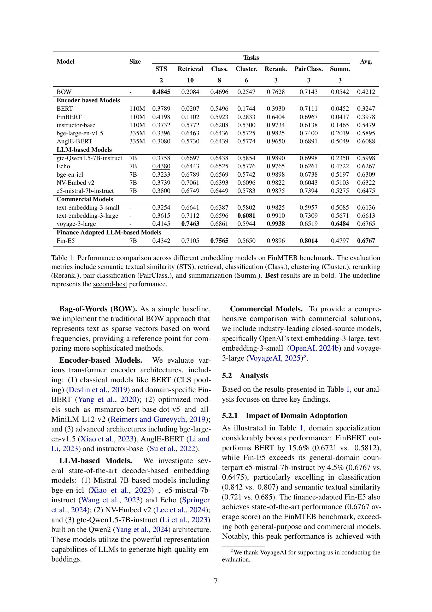

 


 2502.10990 
 Yixuan Tang et el. 
 
 🤗 2025-02-19 
 



↗ arXiv


↗ Hugging Face


↗ Papers with Code


### TL;DR



기존의 일반적인 자연어 처리(NLP) 벤치마크는 실제 금융 애플리케이션의 요구사항을 충족하지 못하는 경우가 많습니다. 금융 텍스트는 특정한 전문 용어, 시간적 민감도 및 복잡한 수치적 관계를 포함하고 있기 때문에 일반적인 모델은 금융 도메인의 특수성을 제대로 포착하지 못합니다.  따라서, 금융 도메인에 특화된 임베딩 모델과 평가 벤치마크가 필요합니다.

본 논문에서는 **금융 특화 대규모 텍스트 임베딩 벤치마크(FinMTEB)**를 제시합니다. FinMTEB는 중국어와 영어로 된 64개의 금융 도메인 특화 데이터셋과 7가지 작업을 포함합니다. 또한, **도메인 적응형 모델인 Fin-E5**를 개발하여 다양한 금융 임베딩 작업에 대한 교육을 실시했습니다.  광범위한 평가를 통해 일반적인 벤치마크의 성능이 금융 도메인 작업과의 상관관계가 제한적이며, 도메인 적응형 모델이 일반적인 모델보다 성능이 뛰어나고, 놀랍게도 단순한 BoW(Bag-of-Words) 기법이 특정 금융 의미적 텍스트 유사도(STS) 작업에서 고급 밀집 임베딩보다 성능이 우수함을 보여줍니다.



#### Key Takeaways


 FinMTEB는 금융 도메인 특화 임베딩 모델 평가를 위한 최초의 종합적인 벤치마크 



 도메인 적응형 모델이 일반 목적 모델보다 금융 작업에서 일관되게 성능이 우수 



 BoW 접근 방식이 특정 금융 작업에서 고급 밀집 임베딩보다 성능이 우수함을 발견 


#### Why does it matter?
본 논문은 **금융 특화 임베딩 모델 평가를 위한 종합적인 벤치마크인 FinMTEB**을 제시함으로써 금융 NLP 연구에 중요한 기여를 합니다. **FinMTEB는 다양한 금융 텍스트 유형과 작업을 포괄**하여 기존 벤치마크의 한계를 극복하고, **도메인 특화 모델 개발 및 평가에 대한 새로운 방향**을 제시합니다.  이를 통해 금융 분야의 자연어 처리 기술 발전에 크게 기여할 것으로 예상됩니다.

------
#### Visual Insights

> 🔼 그림 1은 Fin-E5 모델의 학습 데이터를 워드 클라우드로 시각화한 것입니다.  주요 단어의 크기는 해당 단어가 데이터셋에서 얼마나 자주 등장하는지를 나타냅니다.  이 그림을 통해 Fin-E5 모델의 학습에 사용된 데이터가 금융 관련 용어들로 구성되어 있음을 보여줍니다.  예를 들어, 'risk', 'market', 'investment', 'portfolio', 'interest', 'revenue' 와 같은 단어들이 크게 표시되어 금융 영역에 특화된 데이터임을 확인할 수 있습니다.
> 

> 
read the caption

> Figure 1: Word cloud visualization of Fin-E5’s training data, contain common financial terms.
> 


| Model | Size | STS | Retrieval | Class. | Cluster. | Rerank. | PairClass. | Summ. | Avg. |
|---|---|---|---|---|---|---|---|---|---| 
| **BOW** | - | **0.4845** | 0.2084 | 0.4696 | 0.2547 | 0.7628 | 0.7143 | 0.0542 | **0.4212** |
| **Encoder based Models** |  |  |  |  |  |  |  |  |  |
| BERT | 110M | 0.3789 | 0.0207 | 0.5496 | 0.1744 | 0.3930 | 0.7111 | 0.0452 | 0.3247 |
| FinBERT | 110M | 0.4198 | 0.1102 | 0.5923 | 0.2833 | 0.6404 | 0.6967 | 0.0417 | 0.3978 |
| instructor-base | 110M | 0.3732 | 0.5772 | 0.6208 | 0.5300 | 0.9734 | 0.6138 | 0.1465 | 0.5479 |
| bge-large-en-v1.5 | 335M | 0.3396 | 0.6463 | 0.6436 | 0.5725 | 0.9825 | 0.7400 | 0.2019 | 0.5895 |
| AnglE-BERT | 335M | 0.3080 | 0.5730 | 0.6439 | 0.5774 | 0.9650 | 0.6891 | 0.5049 | 0.6088 |
| **LLM-based Models** |  |  |  |  |  |  |  |  |  |
| gte-Qwen1.5-7B-instruct | 7B | 0.3758 | 0.6697 | 0.6438 | 0.5854 | 0.9890 | 0.6998 | 0.2350 | 0.5998 |
| Echo | 7B | **0.4380** | 0.6443 | 0.6525 | 0.5776 | 0.9765 | 0.6261 | 0.4722 | 0.6267 |
| bge-en-icl | 7B | 0.3233 | 0.6789 | 0.6569 | 0.5742 | 0.9898 | 0.6738 | 0.5197 | 0.6309 |
| NV-Embed v2 | 7B | 0.3739 | 0.7061 | 0.6393 | 0.6096 | 0.9822 | 0.6043 | 0.5103 | 0.6322 |
| e5-mistral-7b-instruct | 7B | 0.3800 | 0.6749 | 0.6449 | 0.5783 | 0.9875 | **0.7394** | 0.5275 | 0.6475 |
| **Commercial Models** |  |  |  |  |  |  |  |  |  |
| text-embedding-3-small | - | 0.3254 | 0.6641 | 0.6387 | 0.5802 | 0.9825 | 0.5957 | 0.5085 | 0.6136 |
| text-embedding-3-large | - | 0.3615 | **0.7112** | 0.6596 | **0.6081** | **0.9910** | 0.7309 | **0.5671** | 0.6613 |
| voyage-3-large | - | 0.4145 | 0.7463 | **0.6861** | 0.5944 | 0.9938 | 0.6519 | **0.6484** | **0.6765** |
| **Finance Adapted LLM-based Models** |  |  |  |  |  |  |  |  |  |
| Fin-E5 | 7B | 0.4342 | 0.7105 | 0.7565 | 0.5650 | 0.9896 | 0.8014 | 0.4797 | 0.6767 |

> 🔼 표 1은 FinMTEB 벤치마크에서 다양한 임베딩 모델의 성능을 비교한 것입니다. 평가 지표는 의미적 텍스트 유사도(STS), 검색, 분류, 군집화, 재순위 지정, 쌍 분류 및 요약을 포함합니다. 최고 성능은 굵게 표시하고, 두 번째로 좋은 성능은 밑줄로 표시했습니다. 이 표는 다양한 임베딩 모델의 상대적 강점과 약점을 보여주고, 특정 작업에 가장 적합한 모델을 선택하는 데 도움이 됩니다.
> 

> 
read the caption

> Table 1: Performance comparison across different embedding models on FinMTEB benchmark. The evaluation metrics include semantic textual similarity (STS), retrieval, classification (Class.), clustering (Cluster.), reranking (Rerank.), pair classification (PairClass.), and summarization (Summ.). Best results are in bold. The underline represents the second-best performance.
> 

### In-depth insights

#### FinMTEB: Finance Benchmark
FinMTEB 금융 벤치마크는 **금융 특화 자연어 처리(NLP)** 모델의 성능을 평가하기 위한 종합적인 평가 프레임워크입니다. **다양한 금융 관련 데이터셋**을 활용하여 **7가지 주요 과제** (의미적 유사도, 검색, 분류, 군집화, 재순위 지정, 쌍 분류, 요약)에 대한 모델 성능을 측정합니다.  특히 **중국어와 영어 두 가지 언어**를 지원하며, 기존의 일반적인 벤치마크와 달리 **금융 도메인의 특징** (전문 용어, 시간적 민감성, 복잡한 수치적 관계)을 고려하여 개발되었습니다.  **도메인 적응형 모델 Fin-E5**를 함께 제시하여, 기존 모델보다 우수한 성능을 보임을 실험적으로 증명합니다.  **단순한 Bag-of-Words(BoW)** 접근 방식이 복잡한 밀집 임베딩 기법보다 의미적 유사성 과제에서 더 나은 성능을 보이는 것은 현재 밀집 임베딩 기술의 한계를 보여줍니다.  **FinMTEB는 금융 NLP 연구의 발전**에 중요한 기여를 할 것으로 기대됩니다.

#### Domain Adaptation
본 논문에서 다룬 '도메인 적응(Domain Adaptation)'은 **금융 특화 언어 모델의 성능 향상**에 중점을 둡니다. 일반적인 자연어 처리(NLP) 모델은 금융 데이터의 특수한 어휘, 시간적 민감성, 복잡한 수치적 관계를 제대로 포착하지 못하는 한계를 지닙니다.  따라서 **금융 도메인에 특화된 모델을 개발하거나 기존 모델을 미세 조정**하여 성능을 개선하는 도메인 적응 전략이 필수적입니다. 이를 위해 **퍼소나 기반 데이터 합성 기법**을 사용하여 다양한 금융 작업을 포괄하는 풍부한 훈련 데이터셋을 구축하고, **Fin-E5라는 금융 특화 임베딩 모델**을 개발하여 평가하였습니다. 결과적으로 도메인 적응 모델이 일반 모델보다 우수한 성능을 보였으며, **단순한 Bag-of-Words(BoW) 방식이 특정 작업(STS)에서 고성능 모델보다 더 나은 결과**를 보이는 예상치 못한 결과도 확인했습니다. 이는 **현존하는 밀집 임베딩 기술의 한계**를 보여주는 중요한 발견입니다.  **FinMTEB 벤치마크**를 통해 금융 NLP 애플리케이션에 대한 견고한 평가 프레임워크를 구축하여, 도메인 특화 임베딩 모델 개발에 중요한 통찰력을 제공합니다.

#### Fin-E5 Model
본 논문에서 제시된 Fin-E5 모델은 **기존의 일반적인 텍스트 임베딩 모델의 한계를 극복하기 위해 금융 특화 데이터를 사용하여 미세 조정된 모델**입니다.  이는 기존 모델들이 금융 도메인 특유의 어휘, 시간적 민감성, 복잡한 수치적 관계를 정확하게 다루지 못하는 문제점을 해결하기 위한 시도로 볼 수 있습니다. **퍼소나 기반 데이터 합성 기법을 통해 다양한 금융 관련 작업을 위한 훈련 데이터를 확보**하여 모델의 성능을 향상시켰다는 점이 특징적입니다.  Fin-E5는 다양한 금융 관련 작업에서 **일반적인 모델보다 우수한 성능을 보였으며, 특히 의미적 유사도 측정 작업에서 눈에 띄는 성과**를 달성하였습니다.  하지만, **단어 가방(BoW) 방식보다 성능이 뛰어나지 않았다는 점은 향후 연구를 위한 중요한 시사점**으로 제시됩니다.  즉, 복잡한 금융 텍스트의 의미를 정확히 파악하는 데 있어서는 여전히 개선의 여지가 있음을 보여줍니다.  **향후 연구는 Fin-E5 모델의 한계를 극복하고, 보다 정교한 금융 텍스트 이해 능력을 갖춘 모델을 개발**하는 데 초점을 맞춰야 할 것입니다.

#### BoW Outperforms
본 논문에서 

#### Future Research
**금융 분야의 자연어 처리(NLP)**는 아직 초기 단계이며, **FinMTEB와 같은 도메인 특화 벤치마크**는 이 분야의 발전에 중요한 역할을 합니다.  향후 연구는 **다양한 금융 상품 및 서비스를 포괄하는 더욱 다양한 데이터셋**을 구축하고, **비정형 금융 데이터** (예: 소셜 미디어 게시글, 온라인 포럼)를 포함하는 연구가 필요합니다.  **다국어 지원을 강화**하여 영어 이외의 언어로 된 금융 데이터 분석의 정확성을 높이는 것도 중요합니다. 또한,  **현재 모델의 한계점을 극복하기 위한 새로운 아키텍처 및 알고리즘 개발**이 필요하며, 특히 **복잡한 금융 용어 및 수치적 관계**를 효과적으로 처리할 수 있는 모델에 대한 연구가 필수적입니다.  **설명 가능성(Explainability)**을 향상시켜 모델의 예측 결과를 해석하고 신뢰도를 높이는 연구도 중요한 방향입니다.  마지막으로, **실제 금융 애플리케이션** (예: 자동화된 투자 분석, 위험 관리)에 FinMTEB를 적용하여 모델의 실효성을 검증하고, **개선 방향을 제시**하는 연구가 필요합니다.

### More visual insights

More on figures

> 🔼 그림 2는 FinMTEB 벤치마크에 사용된 작업과 데이터셋을 보여줍니다.  FinMTEB는 금융 분야에 특화된 7가지 자연어 처리 작업(분류, 군집화, 검색, 쌍 분류, 재순위 지정, 요약, 의미적 텍스트 유사도)을 포함하며, 각 작업에 대해 다양한 유형의 금융 텍스트 데이터셋(중국어 및 영어)을 사용합니다. 그림은 각 작업에 사용된 데이터셋을 표 형태로 정리하여 한눈에 알아볼 수 있도록 보여줍니다. 자세한 데이터셋 설명과 예시는 부록 A에 나와 있습니다.
> 

> 
read the caption

> Figure 2: An overview of tasks and datasets used in FinMTEB. All the dataset descriptions and examples are provided in the Appendix A.
> 

> 🔼 그림 3은 5,000개의 무작위로 추출된 학습 데이터의 분포를 보여주는 분석 결과입니다. 왼쪽은 데이터에 포함된 다양한 직업 유형(Persona)의 분포를, 오른쪽은 과제 유형(Task)의 분포를 나타냅니다. 이를 통해 모델 학습에 사용된 데이터의 다양성과 균형을 파악할 수 있습니다.  각 직업 유형은 특정 금융 관련 업무 또는 역할을 나타내며, 각 과제 유형은 특정 금융 관련 자연어 처리 작업을 의미합니다.  이 그림은 Fin-E5 모델의 학습 데이터 구성에 대한 통찰력을 제공하며, 모델의 성능과 일반화 능력에 영향을 줄 수 있는 요소들을 이해하는 데 도움이 됩니다.
> 

> 
read the caption

> Figure 3: Distribution analysis of 5000 randomly sampled training data showing the breakdown of Tasks and Person Types. Left: Persona distribution. Right: Task distribution.
> 

> 🔼 그림 4는 FinMTEB 벤치마크에 사용된 모든 데이터셋 간의 의미적 유사성을 보여주는 그림입니다.  각 데이터셋은 다양한 유형의 금융 텍스트 (예: 재무 뉴스 기사, 기업 연례 보고서, ESG 보고서, 규제 제출 자료, 실적 발표 요약본)를 포함하며,  각 데이터셋을 벡터 표현으로 변환하여 코사인 유사도를 계산하여 의미적 유사성을 측정했습니다.  그림은 데이터셋 간의 의미적 거리(유사도)를 시각적으로 보여주어,  FinMTEB 벤치마크 내 데이터셋의 다양성과 차이점을 이해하는 데 도움이 됩니다.  색이 진할수록 유사도가 높음을 의미합니다.
> 

> 
read the caption

> Figure 4: Semantic similarity across all the datasets in FinMTEB benchmark.
> 

More on tables


| Dataset Name | Language | Description |
|---|---|---|
| FINAL (Ju et al., 2023) | English | A dataset designed for discovering financial signals in narrative financial reports. |
| FinSTS (Liu et al., 2024a) | English | A dataset focused on detecting subtle semantic shifts in financial narratives. |
| AFQMC6 | Chinese | A Chinese dataset for customer service question matching in the financial domain. |
| BQ-Corpus (Chen et al., 2018) | Chinese | A large-scale Chinese corpus for sentence semantic equivalence identification (SSEI) in the banking domain. |
6 <a href="https://tianchi.aliyun.com/dataset/106411">https://tianchi.aliyun.com/dataset/106411</a>
> 🔼 표 2는 본 논문의 FinMTEB 벤치마크 평가에 사용된 의미적 텍스트 유사도(STS) 작업에 대한 데이터셋을 요약한 표입니다.  STS 작업은 두 개의 금융 텍스트 간의 의미적 유사성을 평가하는 작업이며, 금융 분석 및 위험 관리에 중요한 역할을 합니다. 이 표에는 각 데이터셋의 이름, 언어(영어 또는 중국어), 그리고 데이터셋에 대한 간략한 설명이 포함되어 있습니다.  예를 들어, FINAL 데이터셋은 서술형 재무 보고서에서 재무 신호를 찾는 데 사용되는 영어 데이터셋이고, FinSTS는 금융 서술에서 미묘한 의미 변화를 감지하는 데 사용되는 영어 데이터셋입니다.  AFQMC는 금융 고객 서비스 질문 매칭에 사용되는 중국어 데이터셋이며, BQ-Corpus는 은행 분야의 문장 의미적 등가성 식별에 사용되는 중국어 데이터셋입니다.
> 

> 
read the caption

> Table 2: Summary of STS Datasets
> 


| Dataset Name | Language | Description |
|---|---|---|
| FiQA2018 (FiQA, 2018) | English | Financial opinion mining and question answering dataset. |
| FinanceBench (Islam et al., 2023) | English | Open book financial question answering dataset. |
| HC3(Finance) (Guo et al., 2023) | English | A human-ChatGPT comparison corpus in the finance domain. |
| Apple-10K-20227 <https://lighthouz.ai/blog/rag-benchmark-finance-apple-10K-2022/> | English | A retrieval-augmented generation (RAG) benchmark for finance applications. |
| FinQA (Chen et al., 2021) | English | Financial numerical reasoning dataset with structured and unstructured evidence. |
| TAT-QA (Zhu et al., 2021) | English | Question answering benchmark combining tabular and textual content in finance. |
| US Financial News <https://www.kaggle.com/datasets/jeet2016/us-financial-news-articles> | English | Finance news articles paired with headlines and stock ticker symbols. |
| TradeTheEvent (Trading Benchmark) (Zhou et al., 2021) | English | Finance news articles paired with headlines and stock ticker symbols. |
| TradeTheEvent (Domain Adaption) (Zhou et al., 2021) | English | Financial terms and explanations dataset. |
| TheGoldman-en | English | English version of the Goldman Sachs Financial Dictionary. |
| FinTruthQA (Xu et al., 2024) | Chinese | Dataset for evaluating the quality of financial information disclosure. |
| Fin-Eva (Retrieval task)9 <https://github.com/alipay/financial_evaluation_dataset/tree/main> | Chinese | Financial scenario QA dataset focusing on retrieval tasks. |
| AlphaFin (Li et al., 2024) | Chinese | Comprehensive financial dataset including NLI, QA, and stock trend predictions. |
| DISC-FinLLM (Retrieval Part Data) (Chen et al., 2023) | Chinese | Financial scenario QA dataset. |
| FinQA (from DuEE-fin) (Lu et al., 2023) | Chinese | Financial news bulletin event quiz dataset. |
| DISC-FinLLM (Computing) (Chen et al., 2023) | Chinese | Financial scenario QA dataset focusing on numerical tasks. |
| SmoothNLP10 <https://github.com/smoothnlp/SmoothNLP> | Chinese | Chinese finance news dataset. |
| THUCNews (Sun et al., 2016) | Chinese | Chinese finance news dataset. |
| Fin-Eva (Terminology)11 <https://github.com/alipay/financial_evaluation_dataset/tree/main> | Chinese | Financial terminology dataset used in the industry. |
| TheGoldman-cn | Chinese | Chinese version of the Goldman Sachs Financial Dictionary. |
> 🔼 표 3은 논문의 FinMTEB 벤치마크에 사용된 검색 태스크 관련 데이터셋들을 요약한 표입니다.  각 데이터셋의 이름, 언어, 그리고 간략한 설명을 제공하여 FinMTEB의 다양한 검색 과제들을 이해하는데 도움을 줍니다.  데이터셋의 출처와 특징 등을 상세히 기술하여, 금융 특화 임베딩 모델 평가의 맥락에서 해당 데이터셋들의 중요성을 강조하고 있습니다.
> 

> 
read the caption

> Table 3: Summary of Retrieval Datasets
> 


| Dataset Name | Language | Description |
|---|---|---|
| FinancialPhrasebank (Malo et al., 2014) | English | Polar sentiment dataset of sentences from financial news, categorized by sentiment into positive, negative, or neutral. |
| FinSent (Yang et al., 2023b) | English | Polar sentiment dataset of sentences from the financial domain, categorized by sentiment into positive, negative, or neutral. |
| FiQA_ABSA (FiQA, 2018) | English | Polar sentiment dataset of sentences from the financial domain, categorized by sentiment into positive, negative, or neutral. |
| SemEva2017_Headline (Cortis et al., 2017) | English | Polar sentiment dataset of sentences from the financial domain, categorized by sentiment into positive, negative, or neutral. |
| FLS (Yang et al., 2023b) | English | A finance dataset detects whether the sentence is a forward-looking statement. |
| ESG (Yang et al., 2023b) | English | A finance dataset performs sentence classification under the environmental, social, and corporate governance (ESG) framework. |
| FOMC (Shah et al., 2023) | English | A task of hawkish-dovish classification in finance domain. |
| Financial-Fraud [https://github.com/amitkedia007/Financial-Fraud-Detection-Using-LLMs/tree/main](https://github.com/amitkedia007/Financial-Fraud-Detection-Using-LLMs/tree/main) | English | This dataset was used for research in detecting financial fraud. |
| FinNSP (Lu et al., 2023) | Chinese | Financial negative news and its subject determination dataset. |
| FinChina (Lan et al., 2023) | Chinese | Polar sentiment dataset of sentences from the financial domain, categorized by sentiment into positive, negative, or neutral. |
| FinFE (Lu et al., 2023) | Chinese | Financial social media text sentiment categorization dataset. |
| OpenFinData [https://github.com/open-compass/OpenFinData?tab=readme-ov-file](https://github.com/open-compass/OpenFinData?tab=readme-ov-file) | Chinese | Financial scenario QA dataset including sentiment task. |
| MDFEND-Weibo2 (finance) (Nan et al., 2021) | Chinese | Fake news detection in the finance domain. |
> 🔼 표 4는 본 논문에서 사용된 분류 데이터셋들을 요약한 표입니다. 각 데이터셋의 이름, 언어, 그리고 간략한 설명을 보여줍니다.  자세한 내용은 본문을 참고하십시오.  데이터셋의 종류는 금융 관련 텍스트의 감성 분석, 주제 분류, 사기 탐지 등 다양한 작업에 사용됩니다.  중국어 및 영어 데이터셋이 모두 포함되어 있으며, 각 데이터셋의 특징을 파악하여 적절한 모델을 선택하는데 도움을 줄 수 있습니다.
> 

> 
read the caption

> Table 4: Summary of Classification Datasets
> 


| Dataset Name | Language | Description |
|---|---|---|
| MInDS-14-en (Gerz et al., 2021b) | English | MINDS-14 is a dataset for intent detection in e-banking, covering 14 intents across 14 languages. |
| Consumer Complaints (CFPB, 2024) | English | The Consumer Complaint Database is a collection of complaints about consumer financial products and services that sent to companies for response. |
| Synthetic PII finance (Watson et al., 2024) | English | Synthetic financial documents containing Personally Identifiable Information (PII). |
| FinanceArxiv-s2s1414Collect from the Arixv | English | Clustering of titles from arxiv (q-fin). |
| FinanceArxiv-p2p | English | Clustering of abstract from arxiv (q-fin). |
| WikiCompany2Industry-en1515Collect from the Wikipedia | English | Clustering the related industry domain according to the company description. |
| MInDS-14-zh (Gerz et al., 2021b) | Chinese | MINDS-14 is a dataset for intent detection in e-banking, covering 14 intents across 14 languages. |
| FinNL (Lu et al., 2023) | Chinese | Financial news categorization dataset. |
| CCKS2022 (CCKS, 2022) | Chinese | Clustering of financial events. |
| CCKS2020 | Chinese | Clustering of financial events. |
| CCKS2019 | Chinese | Clustering of financial events. |
> 🔼 표 5는 논문의 FinMTEB 벤치마크에서 사용된 클러스터링 데이터셋을 요약한 표입니다.  각 데이터셋의 이름, 언어(영어 또는 중국어), 그리고 데이터셋에 대한 간략한 설명을 제공합니다.  클러스터링 작업은 금융 텍스트의 의미적 유사성을 기반으로 유사한 텍스트를 그룹화하는 것을 목표로 합니다. 이 표는 다양한 소스와 특징을 가진 여러 클러스터링 데이터셋을 보여주어, FinMTEB 벤치마크의 포괄적인 성격을 강조합니다.
> 

> 
read the caption

> Table 5: Summary of Clustering Datasets
> 


| Dataset Name | Language | Description |
|---|---|---|
| Ectsum [Mukherjee et al., 2022](https://arxiv.org/html/2502.10990v1#bib.bib41) | English | A Dataset For Bullet Point Summarization of Long Earnings Call Transcripts. |
| FINDSum [Liu et al., 2022](https://arxiv.org/html/2502.10990v1#bib.bib32) | English | A Large-Scale Dataset for Long Text and Multi-Table Summarization. |
| FNS-2022 [El-Haj et al., 2022](https://arxiv.org/html/2502.10990v1#bib.bib12) | English | Financial Narrative Summarisation for 10K. |
| FiNNA [Lu et al., 2023](https://arxiv.org/html/2502.10990v1#bib.bib35) | Chinese | A financial news summarization dataset. |
| Fin-Eva (Headline) [Zhang et al., 2023](https://arxiv.org/html/2502.10990v1#bib.bib70) | Chinese | A financial summarization dataset. |
| Fin-Eva (Abstract) [Zhang et al., 2023](https://arxiv.org/html/2502.10990v1#bib.bib70) | Chinese | A financial summarization dataset. |
> 🔼 표 6은 금융 분야 자연어 처리(NLP)에서 요약 작업에 사용되는 데이터셋들을 요약한 표입니다.  각 데이터셋의 이름, 언어(영어 또는 중국어), 그리고 해당 데이터셋의 간략한 설명을 포함하고 있습니다.  본 논문에서는 금융 영역에 특화된 다양한 요약 데이터셋을 사용하여 금융 관련 텍스트 요약 모델의 성능을 평가하고 있습니다.
> 

> 
read the caption

> Table 6: Summary of Summarization Datasets
> 


| Dataset Name | Language | Description |
|---|---|---|
| Fin-Fact (Rangapur et al., 2023) | English | A Benchmark Dataset for Financial Fact Checking and Explanation Generation. |
| FiQA2018 (FiQA, 2018) | English | Financial opinion mining and question answering. |
| HC3(Finance) (Guo et al., 2023) | English | A human-ChatGPT comparison finance corpus. |
| Fin-Eva (Retrieval task) (Zhang et al., 2023) | Chinese | Financial scenario QA dataset including retrieval task. |
| DISC-FinLLM (Retrieval Part Data) (Chen et al., 2023) | Chinese | Financial scenario QA dataset. |
> 🔼 표 7은 논문의 FinMTEB 벤치마크에 사용된 재순위 지정(Reranking) 작업에 대한 데이터셋을 요약한 표입니다. 각 데이터셋의 이름, 언어, 설명이 포함되어 있습니다.  FinMTEB는 금융 특화 자연어 처리를 위한 종합적인 평가 프레임워크이며, 다양한 금융 관련 텍스트 유형과 작업을 포함하는 여러 데이터셋으로 구성됩니다. 이 표는 재순위 지정 작업에 초점을 맞춰, 해당 작업에 사용된 특정 데이터셋을 보여줍니다.  각 데이터셋에 대한 간략한 설명을 통해, 데이터셋의 특징과 내용을 이해하는 데 도움을 줍니다.
> 

> 
read the caption

> Table 7: Summary of Reranking Datasets
> 


| Dataset Name | Language | Description |
|---|---|---|
| HeadlineAC-PairClassification (Sinha and Khandait, 2021) | English | Financial text sentiment categorization dataset. |
| HeadlinePDD-PairClassification (Sinha and Khandait, 2021) | English | Financial text sentiment categorization dataset. |
| HeadlinePDU-PairClassification (Sinha and Khandait, 2021) | English | Financial text sentiment categorization dataset. |
| AFQMC | Chinese | Ant Financial Question Matching Corpus. |
> 🔼 표 8은 논문의 FinMTEB 벤치마크에 사용된 Pair Classification 작업에 대한 데이터셋을 요약한 표입니다.  각 데이터셋의 이름, 언어, 설명이 포함되어 있습니다.  본 표는 다양한 금융 텍스트 쌍 간의 의미 관계를 평가하는 데 사용된 데이터셋을 보여줍니다.  여기에는 고객 의도, 금융 뉴스 헤드라인 등 다양한 유형의 데이터가 포함됩니다.
> 

> 
read the caption

> Table 8: Summary of PairClassification Datasets
> 


| **STS** | **Class.** | **Ret.** | **Rerank.** | **Clust.** | **PairClass.** | **Summ.** |
|---|---|---|---|---|---|---|
| 0.30 | -0.80 | 0.30 | -0.10 | -0.70 | -0.30 | 0.60 |
| 0.62 | 0.10 | 0.62 | 0.87 | 0.18 | 0.62 | 0.28 |
> 🔼 표 9는 FinMTEB와 MTEB 벤치마크의 텍스트 특징을 비교 분석한 표입니다. 평균 문장 길이, 평균 토큰 길이, 토큰당 음절 수, 의존 거리 등 다양한 언어적 특성을 정량적으로 비교하여 두 벤치마크 간의 차이점을 보여줍니다. 모든 데이터셋의 모든 표본에 대한 평균 점수를 사용하여 계산된 값입니다.
> 

> 
read the caption

> Table 9: Comparison of Text Characteristics Between FinMTEB and MTEB. The numbers represent the average scores across all samples from all datasets.
> 


| Task | Factor | Sum of Squares | Degrees of Freedom | F-Statistic | p-value |
|---|---|---|---|---|---| 
| **Classification** | Model Factor | 4.17 | 6.00 | 25.55 | 3.41e-30 |
|  | Domain Factor | 56.82 | 1.00 | 2086.30 | ≈ 0 |
|  | Residual | 190.42 | 6992.00 | NA | NA |
| **Retrieval** | Model Factor | 104.25 | 6.00 | 9052.57 | ≈ 0 |
|  | Domain Factor | 6.16 | 1.00 | 3207.72 | ≈ 0 |
|  | Residual | 13.42 | 6992.00 | NA | NA |
| **STS** | Model Factor | 10.55 | 6.00 | 149.00 | 1.64e-178 |
|  | Domain Factor | 304.09 | 1.00 | 25761.71 | ≈ 0 |
|  | Residual | 82.53 | 6992.00 | NA | NA |
| **Clustering** | Model Factor | 0.29 | 6.00 | 47.60 | 1.59e-57 |
|  | Domain Factor | 32.25 | 1.00 | 32161.37 | ≈ 0 |
|  | Residual | 7.01 | 6992.00 | NA | NA |
| **Summarization** | Model Factor | 12.98 | 6.00 | 145.31 | 2.90e-174 |
|  | Domain Factor | 14.49 | 1.00 | 973.32 | 3.60e-200 |
|  | Residual | 104.07 | 6992.00 | NA | NA |
| **Reranking** | Model Factor | 5.38 | 6.00 | 489.05 | ≈ 0 |
|  | Domain Factor | 0.64 | 1.00 | 346.78 | 1.39e-75 |
|  | Residual | 12.84 | 7002.00 | NA | NA |
| **Pair Classification** | Model Factor | 0.25 | 6.00 | 1.97 | 0.07 |
|  | Domain Factor | 249.19 | 1.00 | 11989.92 | ≈ 0 |
|  | Residual | 145.31 | 6992.00 | NA | NA |
| **Average** | Model Factor | 0.00 | 6.00 | 1.34 | 0.37 |
|  | Domain Factor | 0.08 | 1.00 | 253.87 | ≈ 0 |
|  | Residual | 0.00 | 6.00 | NA | NA |
> 🔼 표 10은 다양한 임베딩 모델의 MTEB와 FinMTEB 벤치마크에 대한 성능 간의 상관관계를 보여줍니다.  각 행은 특정 임베딩 모델을 나타내고, 각 열은 특정 작업(예: 의미론적 유사성, 검색 등)을 나타냅니다. 표의 값은 스피어만 상관계수이며, 이는 두 벤치마크에서의 모델 성능 간의 순위 상관관계를 측정합니다. p-값은 모든 상관 관계가 통계적으로 유의미하지 않음을 나타내며, 이는 두 벤치마크에서의 임베딩 모델 성능 간에 관계가 없다는 것을 시사합니다. 즉, 일반 목적 벤치마크에서 좋은 성능을 보이는 모델이 특정 도메인 벤치마크에서도 좋은 성능을 보인다는 보장이 없음을 보여줍니다.
> 

> 
read the caption

> Table 10: Spearman’s correlation of embedding models’ performance on MTEB and FinMTEB across different tasks. The p-value indicates that all correlations are statistically insignificant, suggesting a lack of evidence for a relationship between embedding model performance on the two benchmarks.
> 

### Full paper



