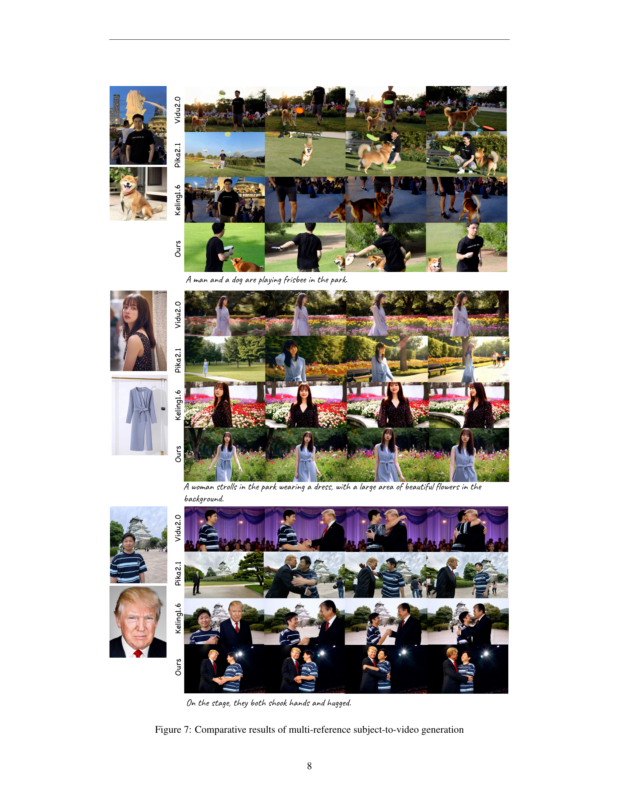

 


 2502.11079 
 Lijie Liu et el. 
 
 🤗 2025-02-19 
 



↗ arXiv


↗ Hugging Face


↗ Papers with Code


### TL;DR



기존의 비디오 생성 모델들은 텍스트나 이미지 프롬프트만을 사용하여 비디오를 생성하기 때문에, 생성되는 비디오의 주제 일관성이 부족하다는 문제점이 있었습니다. 특히, 여러 개의 참조 이미지를 사용하여 주제 일관성 있는 비디오를 생성하는 것은 더욱 어려운 과제였습니다.  

본 논문에서는 이러한 문제점을 해결하기 위해, 텍스트, 이미지, 비디오 세 가지 모달리티를 모두 활용하는 새로운 비디오 생성 프레임워크인 PHANTOM을 제안합니다. PHANTOM은 기존 모델의 아키텍처를 개선하고, 텍스트-이미지-비디오 트리플렛 데이터를 통해 교차 모달 정렬을 학습하여 주제 일관성을 높였습니다. 실험 결과, PHANTOM은 기존 모델들보다 주제 일관성이 뛰어나고, 다양한 응용 분야에 적용될 수 있는 잠재력을 가지고 있음을 보여주었습니다.



#### Key Takeaways


 PHANTOM은 참조 이미지와 텍스트 프롬프트를 활용하여 주제 일관성 있는 비디오를 생성하는 새로운 프레임워크입니다. 



 기존의 텍스트-비디오 및 이미지-비디오 생성 모델의 한계를 극복하고 주제 일관성을 향상시켰습니다. 



 다양한 응용 분야 (예: 가상 의상 시착, 영화 제작 등) 에 적용될 수 있는 잠재력을 지니고 있습니다. 


#### Why does it matter?
본 논문은 **주제 일관성 비디오 생성 분야의 새로운 방법론**인 Phantom을 제시하여, 기존의 텍스트-비디오 및 이미지-비디오 생성 모델의 한계를 극복하고 **주제 일관성을 향상**시켰다는 점에서 중요합니다. **다양한 참조 이미지와 텍스트 프롬프트를 활용**하여 보다 자연스럽고 일관성 있는 비디오 생성이 가능해짐에 따라, **AIGC(인공지능 생성 콘텐츠) 분야의 발전**에 크게 기여할 것으로 예상됩니다. 또한, 본 연구는 향후 연구를 위한 새로운 방향을 제시하며, **다양한 응용 분야** (예: 가상 의상 시착, 영화 제작 등) 에 적용될 수 있는 잠재력을 지니고 있습니다.  연구자들은 본 논문을 통해 주제 일관성 비디오 생성 기술의 최신 동향을 파악하고, 향후 연구 방향을 설정하는 데 도움을 얻을 수 있습니다.

------
#### Visual Insights

> 🔼 본 그림은 논문에서 제시된 방법을 사용하여 생성된 주제 일관성 있는 비디오 생성 예시들을 보여줍니다. 참조 이미지와 해당하는 비디오 프레임들이 함께 제시되어 있으며, 텍스트 프롬프트는 생략되어 있습니다. 마지막 세 줄은 여러 개의 참조 주제를 사용한 결과를 보여줍니다.  각각의 이미지는 특정한 주제를 나타내며, 생성된 비디오는 그 주제를 일관되게 유지하면서 다양한 동작이나 배경을 포함하고 있습니다.  이를 통해, 본 논문에서 제안하는 방법이 주제 일관성을 유지하면서도 다양한 비디오 생성이 가능함을 시각적으로 보여줍니다.
> 

> 
read the caption

> Figure 1:  Subject-consistent generation examples using our method, with reference images and corresponding video frames (text prompts omitted). The last three rows show multiple reference subjects.
> 


| Methods | FaceSim-Arc ↑ | FaceSim-Cur ↑ | FaceSim-glink ↑ | ViCLIP-T ↑ |
|---|---|---|---|---|
| ConsisID | 0.538 | 0.417 | 0.470 | 21.76 |
| Hailuo-ID | 0.542 | 0.504 | 0.557 | 23.31 |
| Phantom-ID | **0.581** | **0.529** | **0.590** | **24.12** |

> 🔼 표 1은 얼굴 일관성 및 프롬프트 준수 측면에서 다양한 방법들을 비교한 표입니다.  얼굴 일관성은 FaceSim-Arc, FaceSim-Cur, FaceSim-glink 세 가지 지표로 측정되며, 프롬프트 준수는 ViCLIP-T 지표로 측정됩니다. ConsisID, Hailuo-ID, Phantom-ID 세 가지 방법의 성능이 비교 분석됩니다. 이 표는 본 논문의 실험 결과를 보여주는 중요한 표로, 제안된 Phantom 모델이 얼굴 일관성 및 프롬프트 준수 측면에서 기존 방법들보다 우수한 성능을 보임을 보여줍니다.
> 

> 
read the caption

> Table 1: Comparison of different methods based on identity consistency and prompt following
> 

### In-depth insights

#### S2V: A New Frontier
**S2V (Subject-to-Video)**는 기존의 텍스트-비디오 생성 및 이미지-비디오 생성 방식을 넘어서는 새로운 영역으로, **참조 이미지의 주제 요소를 추출하여 텍스트 설명과 결합하여 일관성 있는 비디오를 생성하는 기술**입니다.  이는 단순히 이미지를 복사하거나 텍스트에 대한 임의의 비디오를 생성하는 것이 아니라, **텍스트와 이미지의 이중 모달 프롬프트를 균형 있게 조정하여 시각적 및 의미적 일관성을 동시에 달성**하는 것을 목표로 합니다.  이를 통해 기존의 ID 유지 비디오 생성 기술의 한계를 극복하고, 다양한 주제와 시나리오에 대한 보다 풍부하고 정교한 비디오 생성이 가능해질 것으로 예상됩니다. **기존의 모델 아키텍처를 개선하고, 텍스트-이미지-비디오 트리플릿 데이터를 통해 교차 모달 정렬을 학습**시키는 것이 S2V의 핵심 기술적 과제입니다.  **다양한 응용 분야** (가상 의상 시착, 인물 영상 생성 등)에서 활용될 가능성이 높으며, 향후 **대규모 언어 모델과의 결합**을 통해 더욱 발전된 형태로 진화할 것으로 예상됩니다.  **데이터셋 구축 및 평가 지표의 개발** 역시 S2V 연구의 중요한 부분이며,  **실제 응용 및 상용화**를 위해서는 지속적인 연구개발과 기술적 발전이 필요합니다.

#### Cross-Modal Alignment
본 논문에서 제시된 "교차 모달 정렬(Cross-Modal Alignment)" 개념은 **텍스트와 이미지의 이중 모달 프롬프트 간의 균형**에 초점을 맞춥니다.  **텍스트 기반 설명과 이미지 기반 시각 정보를 동시에 그리고 심층적으로 정렬**함으로써, 주어진 이미지의 주제와 일관된 비디오 생성을 가능하게 합니다.  이는 단순히 텍스트-비디오 또는 이미지-비디오 생성 모델의 단순한 결합을 넘어서는, **두 모달리티 간의 상호 작용과 일관성 유지를 강조**하는 접근 방식입니다.  **단일 및 다중 주제 참조** 모두를 지원하는 통합 프레임워크를 통해,  **주제 일관성을 유지하면서 다양한 시각적 요소들을 생성**할 수 있도록 합니다. 이는 기존의 ID 보존 비디오 생성 모델의 한계를 뛰어넘는 **향상된 장점**을 제공한다는 점에서 중요한 의미를 지닙니다.  결론적으로, 교차 모달 정렬은 **주제 일관성 비디오 생성의 핵심**이며,  본 논문에서 제시된 Phantom 모델은 이를 효과적으로 구현한 훌륭한 사례입니다.

#### Phantom's Architecture
Phantom의 아키텍처는 **기존의 텍스트-비디오 및 이미지-비디오 모델을 기반으로 하여 재설계된 공동 텍스트-이미지 주입 모델**을 중심으로 합니다. **트리플렛 데이터(텍스트-이미지-비디오)**를 통해 교차 모달 정렬을 학습하고, **단일 및 다중 주제 참조** 모두를 지원하는 통합된 비디오 생성 프레임워크를 제공합니다.  **MMDIT(Multimodal Diffusion Model with Transformer) 구조**를 기반으로 하여 비디오 인코더와 텍스트 인코더는 기본 모델의 가중치를 상속받아 각각 비디오와 텍스트 프롬프트를 잠재적 특징으로 인코딩합니다. 참조 이미지는 특정 비전 인코더로 인코딩되고, 비디오 및 텍스트 특징과 연결되어 DiT(Diffusion Transformer)의 비전 및 텍스트 분기에 입력됩니다. 이러한 설계는 DiT 구조 자체에는 영향을 미치지 않으면서 모델의 입력만 수정하는 방식으로, **비주얼 일관성을 유지**하면서 **텍스트 프롬프트의 중요성을 강화**합니다.  결과적으로, Phantom은 **주제 일관성**을 유지하면서 **다양한 시나리오에서 높은 품질의 비디오 생성**을 가능하게 합니다.

#### Benchmarking S2V
본 논문에서 'Benchmarking S2V' 섹션은 **Subject-to-Video (S2V)** 모델의 성능을 객관적으로 평가하기 위한 벤치마킹 결과를 제시했을 것입니다.  이는 기존의 Text-to-Video나 Image-to-Video 모델과의 비교를 통해 S2V 모델의 강점과 약점을 명확히 보여주는 데 중점을 두었을 것입니다.  **다양한 지표** (예: 비디오 품질, 일관성, 주제 유지, 텍스트-비디오 일치도 등)를 사용하여 정량적 및 정성적 분석을 수행했을 것이며, **다양한 기존 모델들과의 비교**를 통해 상대적 우위를 보여주려 했을 것입니다. 특히, **다중 참조 이미지**를 사용한 경우의 성능을 중점적으로 분석하여 **일관성 유지**에 대한 S2V 모델의 효과를 강조했을 가능성이 높습니다.  이 섹션에서는 **실험 데이터셋**에 대한 설명과 함께 **평가 방식**에 대한 자세한 설명이 포함되었을 것이고, **결과 해석**을 통해 S2V 모델의 성능을 종합적으로 평가하는 내용을 다루었을 것으로 예상됩니다.  **한계점** 또한 명시하여 향후 연구 방향을 제시했을 가능성이 큽니다.

#### Future of S2V
S2V (Subject-to-Video) 기술은 **텍스트 및 이미지 프롬프트를 동시에 활용하여 주어진 이미지의 주제를 일관되게 유지하는 비디오 생성**이라는 흥미로운 분야입니다.  미래의 S2V는 **더욱 사실적이고 다양한 비디오 생성**을 목표로 할 것입니다.  **고해상도, 고품질 비디오 생성**은 물론이고, **더욱 다양한 주제와 스타일**, 그리고 **복잡한 상호작용**을 포함하는 시나리오를 처리하는 능력이 향상될 것입니다. 또한, **실시간 처리 성능 개선**을 통한 상호작용적인 경험 제공 및 **개인화된 비디오 생성** 기능이 더욱 발전할 것으로 예상됩니다.  **다양한 모달리티(텍스트, 이미지, 오디오)**를 통합하여 더욱 풍부하고 몰입감 있는 비디오를 생성하는 방향으로 나아갈 것입니다.  이러한 발전은 **대규모 언어 모델(LLM)과 비전 모델의 발전**, 그리고 **효율적인 훈련 기법의 개발**에 크게 의존할 것입니다.  **윤리적 문제**, 특히 가짜뉴스나 딥페이크와 같은 악용 가능성에 대한 고려도 미래 S2V 기술 개발에 있어 중요한 요소가 될 것입니다.  **데이터셋의 확장과 다양화**도 미래 발전에 필수적입니다.

### More visual insights

More on figures

> 🔼 본 그림은 다양한 교차 모드 비디오 생성 작업 간의 관계를 보여줍니다.  텍스트-비디오(Text-to-video), 이미지-비디오(Image-to-video), 그리고 주제-비디오(Subject-to-video) 세 가지 주요 작업이 있습니다. 텍스트-비디오는 텍스트 설명을 바탕으로 비디오를 생성하고, 이미지-비디오는 참조 이미지와 텍스트 프롬프트를 사용하며, 주제-비디오는 참조 이미지의 주제 요소를 추출하여 텍스트 지시에 따라 일관된 비디오를 생성합니다.  그림은 각 작업 사이의 상호 작용과 조정 과정을 시각적으로 나타내어, 주제 일관성 있는 비디오 생성을 위한 모델의 통합적 접근 방식을 설명합니다.
> 

> 
read the caption

> Figure 2:  Relationship in cross-modal video generation tasks.
> 

> 🔼 본 그림은 텍스트, 이미지, 비디오 세 가지 모달리티를 결합하여 교차 모달 비디오 생성을 위한 데이터 처리 과정을 보여줍니다.  데이터 소스에서부터 시작하여, 데이터 정제, 쌍을 이루는 데이터 매칭 및 필터링, 최종 비디오 데이터 생성에 이르기까지의 각 단계를 자세히 설명합니다. 특히, 'in-paired data'와 'cross-paired data'의 생성 과정을 시각화하여 두 가지 데이터 유형의 차이점과 각각의 장단점을 명확히 보여줍니다. 또한, 사람의 개입(human)을 통해 시나리오 분류 및 품질 향상을 위한 후처리 단계가 포함되어 있습니다.
> 

> 
read the caption

> Figure 3: Data processing pipeline for cross-modal video generation
> 

> 🔼 그림 4는 논문에서 제안하는 Phantom 아키텍처의 개요를 보여줍니다.  Phantom은 미훈련 입력부(input head)와 훈련 가능한 DiT(Diffusion Transformer) 모듈로 구성됩니다. 입력부는 비디오 인코더와 텍스트 인코더를 사용하여 입력 비디오와 텍스트 프롬프트를 해당하는 잠재 특징(latent features)으로 인코딩합니다.  참고 이미지는 특정 비전 인코더에 의해 인코딩되고, 비디오 특징과 텍스트 특징과 연결됩니다.  이렇게 연결된 특징들은 DiT의 비전 브랜치와 텍스트 브랜치에 입력되어 처리됩니다. DiT의 구조 자체는 변경되지 않고 입력 부분만 수정됩니다. 비전 인코더는 VAE(Variational Autoencoder)와 CLIP(Contrastive Language-Image Pre-training)으로 구성되며,  텍스트 브랜치에 연결된 이미지 특징은 CLIP을 통해 고차원의 의미 정보를 제공하여 저차원 VAE 특징의 한계를 보완합니다.
> 

> 
read the caption

> Figure 4: Overview of the Phantom architecture
> 

> 🔼 그림 5는 논문의 실험 결과를 보여줍니다. 왼쪽 그래프는 다양한 비디오 품질 평가 지표(Video Quality Evaluation)에 대한 척도를 나타내는 레이더 차트입니다. 오른쪽 그래프는 여러 주제에 대한 일관성(Multi-subject consistency)을 평가하기 위한 사용자 연구 결과를 보여주는 막대 그래프입니다.  레이더 차트는 Phantom 모델을 포함한 여러 비디오 생성 모델들의 다양한 비디오 품질 지표(예: 명확성, 미적 품질, 이미지 품질, 동적 정도 등)에 대한 성능을 비교 분석한 결과를 보여줍니다. 막대 그래프는 사용자들이 여러 주제에 대한 일관성 측면에서 Phantom 모델을 포함한 다양한 모델들을 평가한 선호도를 보여줍니다.
> 

> 
read the caption

> Figure 5: Video quality evaluation (left) and user study results for multi-subject consistency (right).
> 

> 🔼 그림 6은 단일 참조 이미지를 기반으로 한 주제 일관성 비디오 생성 결과를 보여줍니다.  각 생성된 비디오는 첫 번째와 마지막 프레임을 포함하여 고르게 샘플링된 네 개의 프레임으로 표시됩니다.  비디오 결과는 다양한 주제(강아지, 노트북, 여성)와 다양한 시나리오를 다룹니다.  각 시나리오의 텍스트 프롬프트에 따른 비디오 생성의 정확성 및 시각적 품질을 비교하여 Phantom 모델의 성능을 보여주는 것이 목표입니다.  비교 대상으로 Vidu 2.0, Pika 2.1, Keling 1.6 모델의 결과도 함께 제시되어, Phantom 모델과 다른 모델 간의 비디오 생성 품질 차이를 직관적으로 확인할 수 있도록 합니다. 
> 

> 
read the caption

> Figure 6: Comparative results of single reference subject-to-video generation
> 

> 🔼 그림 7은 다중 참조 이미지를 사용하여 주제 일관성 있는 비디오를 생성한 결과를 보여줍니다. 각 행은 서로 다른 시나리오를 나타내며, 각 시나리오에 대해 Phantom 모델을 포함한 여러 최첨단 비디오 생성 모델의 결과가 나란히 제시되어 있습니다. 그림을 통해 다중 참조 이미지가 주제 일관성 있는 비디오 생성에 어떻게 영향을 미치는지, 그리고 각 모델의 강점과 약점을 비교 분석할 수 있습니다. 특히, 다양한 시나리오에서 주제의 일관성과 시각적 품질, 그리고 텍스트 프롬프트와의 일관성을 비교함으로써, Phantom 모델의 성능을 객관적으로 평가할 수 있습니다.
> 

> 
read the caption

> Figure 7: Comparative results of multi-reference subject-to-video generation
> 

> 🔼 그림 8은 얼굴 ID 보존을 위한 비디오 생성 결과를 비교 분석한 것입니다.  각 행은 다른 사람의 얼굴을 기준으로,  다양한 방법(Ours, Hailuo, ConsisID)을 통해 생성된 비디오의 일부 프레임을 보여줍니다.  각 방법의 성능을 시각적으로 비교하여 얼굴 특징의 유사성 및 비디오의 전반적인 품질 차이를 보여줍니다.  비디오 생성 결과의 질, 얼굴 특징의 정확한 유지 여부, 그리고 텍스트 프롬프트에 대한 충실도 등을 종합적으로 평가하여 각 방법의 강점과 약점을 파악할 수 있도록 합니다.
> 

> 
read the caption

> Figure 8: Comparative results of video generation for face ID preservation
> 

### Full paper



