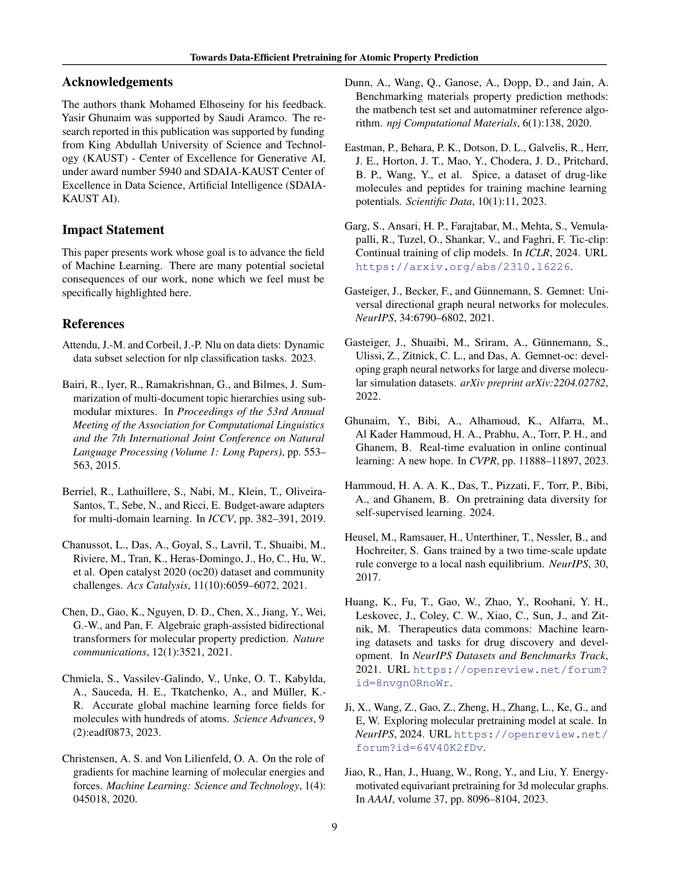

 


 2502.11085 
 Yasir Ghunaim et el. 
 
 🤗 2025-02-18 
 



↗ arXiv


↗ Hugging Face


↗ Papers with Code


### TL;DR



기존의 원자 특성 예측 연구는 대규모 데이터셋과 높은 계산 자원에 의존해 왔습니다. 이는 **계산 비용**과 **시간** 측면에서 큰 부담이 되었습니다.  본 연구는 이러한 문제를 해결하기 위해 **데이터의 질**에 초점을 맞추었습니다.  대규모 혼합 데이터셋보다 작지만 특정 과제에 적합한 데이터셋을 선택하는 것이 중요하다고 주장합니다. 

본 연구는 **화학적 유사성 지수(CSI)**라는 새로운 지표를 제안하여, 사전 훈련 데이터셋과 하위 과제 간의 정합성을 측정합니다. CSI를 활용하여 선택된 소규모 데이터셋으로 사전 훈련된 모델은,  대규모 데이터셋으로 사전 훈련된 모델과 비교하여 **동등하거나 우수한 성능**을 보였습니다.  이는 훨씬 적은 계산 자원으로도 고품질 결과를 얻을 수 있다는 것을 의미하며,  **데이터 선택**의 중요성을 강조하는 중요한 결과입니다.  또한, 연구진은 무분별한 데이터 추가가 모델 성능을 저하시킬 수 있음을 발견하여 기존 연구 패러다임에 대한 새로운 시각을 제시합니다.



#### Key Takeaways


 화학적 유사성 지수(CSI)를 이용한 관련성 높은 데이터셋 선택을 통한 효율적인 사전 훈련 방법 제시 



 소규모 고품질 데이터셋을 사용한 사전 훈련이 대규모 데이터셋 사용보다 우수한 성능을 보임 



 무분별한 데이터 추가는 오히려 성능 저하를 야기할 수 있음을 보여주는 결과 제시 


#### Why does it matter?
이 논문은 **데이터 선택**을 통해 계산 비용을 크게 줄이면서 원자 특성 예측의 성능을 향상시키는 방법을 제시합니다.  **화학적 유사성 지수(CSI)**라는 새로운 지표를 활용하여 관련성이 높은 데이터를 선택함으로써, 대규모 데이터셋을 사용하는 기존 방법보다 효율적이고 효과적인 사전 훈련 전략을 제시합니다. 이는 **계산 자원이 제한적인 연구자**들에게 매우 중요한 의미를 지닙니다. 또한, 이 연구는 **데이터 품질**이 양보다 중요하다는 점을 강조하고 있으며, 향후 연구 방향에 대한 새로운 시각을 제공합니다.

------
#### Visual Insights

> 🔼 그림 1은 고품질의 작업 관련 데이터셋으로 사전 훈련을 수행하면 모든 작업에서 비슷하거나 더 우수한 평균 절대 오차(MAE)를 달성하는 반면, 모든 상위 데이터셋으로 사전 훈련된 JMP-S와 비교하여 계산 비용을 24분의 1로 줄일 수 있음을 보여줍니다. MAE가 낮을수록 성능이 우수함을 나타냅니다. 이 그림은 고품질 데이터셋 선택의 중요성과 대규모 데이터셋을 사용하는 것보다 더 나은 결과를 얻을 수 있음을 시각적으로 보여줍니다.
> 

> 
read the caption

> Figure 1: Pretraining on a High-Quality, Task-Relevant Dataset. Pretraining on a carefully selected high-quality dataset achieves comparable or superior mean absolute error (MAE) across tasks while reducing computational cost by a factor of 24 compared to JMP-S, which is pretrained on all upstream datasets. Lower MAE indicates better performance.
> 


| **\mathcal{C}** | **Upstream Data** | **Backbone** | **rMD17 (meV/Å)** | **MD22 (meV/Å)** | **SPICE (meV/Å)** | **QM9 (meV)** |
|---|---|---|---|---|---|---|
| 240 \times 10^{6} | Mixed (Temp) | JMP-L (GemNet-OC-L) | 5.1 | 1.92 | 4.75 | 2.9 |
|  |  | JMP-S (GemNet-OC-S) | 6.7 | 2.64 | 5.71 | 3.3 |
|  |  | JMP-S* (GemNet-OC-S) | 6.8 | 3.21 | 5.60 | 3.4 |
| 10 \times 10^{6} | ANI-1x | GemNet-OC-S | **5.4** | **2.90** | **5.13** | **2.9** |
|  | Transition-1x |  | 10.1 | 3.73 | 7.55 | 3.2 |
|  | OC20 |  | 14.6 | 4.53 | 8.74 | 4.8 |
|  | OC22 |  | 16.0 | 5.20 | 10.73 | 5.7 |
| 10 \times 10^{6} | Mixed (Balanced) | GemNet-OC-S | 9.4 | 3.62 | 7.02 | 3.2 |
|  | Mixed (Temp) |  | 11.0 | 4.03 | 7.98 | 3.6 |

> 🔼 표 1은 에너지 및 힘 목표에 대한 분포 내 평가 결과를 보여줍니다. 본 논문의 4장에서 자세히 설명된 바와 같이 다운스트림 목표에 대한 미세 조정 시 테스트 MAE를 보고합니다. 상단 섹션은 대규모 JMP 예산으로 사전 훈련된 모델을 나타내고, 하단 두 섹션은 제한된 예산하에서의 결과를 보여줍니다. JMP-S*는 재현된 결과를 나타냅니다.
> 

> 
read the caption

> Table 1: In-Distribution Evaluation for energy and force targets. We report test MAE when fine-tuning on downstream targets, as detailed in Downstream Datasets (Section 4). The top section represents models pretrained with the large-scale JMP budget, while the lower two sections show results under a limited budget. JMP-S* denotes reproduced results.
> 

### In-depth insights

#### Data-Efficient Pretraining
본 논문은 **데이터 효율적인 사전 학습**을 통해 원자 특성 예측의 최근 경향에 도전합니다.  기존의 대규모 데이터셋과 많은 계산 자원에 의존하는 방식에서 벗어나, **과제와 관련된 세심하게 선택된 데이터셋**을 사용하여 대규모 사전 학습과 동등하거나 능가하는 성능을 달성할 수 있음을 보여줍니다.  **화학적 유사성 지수(CSI)**라는 새로운 지표를 도입하여 업스트림 사전 학습 데이터셋과 다운스트림 과제 간의 정렬을 정량화하고, CSI 거리가 최소인 관련성 높은 데이터셋을 선택하여 사전 학습 모델의 효율성을 높입니다.  **결과적으로, 소규모의 집중된 데이터셋**에서 사전 학습된 모델이 JMP와 같은 대규모 혼합 데이터셋에서 사전 학습된 모델보다 성능이 우수함을 보여줍니다.  이는 **데이터의 질이 양보다 중요함**을 시사합니다.  또한, 무분별하게 데이터를 추가하면 성능이 저하될 수 있음을 발견하여, **데이터 선택의 전략적 중요성**을 강조합니다.

#### CSI Metric
본 논문에서 제시된 CSI(Chemical Similarity Index) 지표는 **상류(pretraining) 데이터셋과 하류(downstream) 작업 간의 정렬을 정량화**하는 데 사용됩니다.  **FID(Fréchet Inception Distance)**에서 영감을 얻은 CSI는 분자 그래프에 적용될 수 있도록 설계되었으며, 특히 **화학적 관련성을 고려**하여 상류 데이터셋을 신중하게 선택하는 과정에 도움을 줍니다.  이는 단순히 데이터셋의 크기만을 중시하는 기존의 패러다임에서 벗어나, **작업과의 관련성이 높은 소규모 고품질 데이터셋**을 활용하는 전략을 제시합니다.  **CSI 값이 낮을수록 상류와 하류 데이터셋 간의 정렬이 높음**을 나타내며, 이는 하류 작업에서 더 나은 성능으로 이어질 수 있음을 시사합니다. 따라서 CSI 지표는 효율적인 사전 학습을 위한 데이터셋 선택 과정에서 중요한 역할을 수행하며, **계산 비용을 줄이면서 성능을 향상**시키는 데 기여할 수 있습니다.  **CSI 지표의 실험적 검증 결과는 CSI 값이 낮은 데이터셋이 하류 작업에서 우수한 성능을 달성**함을 보여주며, 이는 제안된 방법의 유효성을 뒷받침합니다.  **하지만 OOD(out-of-distribution) 작업에서는 CSI 지표의 예측 정확도가 다소 낮아짐**을 보이며, 향후 연구를 위한 과제로 남습니다.

#### Budget Impact
본 연구는 **계산 비용을 최소화하면서 원자 특성 예측의 성능을 극대화하는 방법**을 제시합니다.  기존의 대규모 데이터셋과 높은 계산 자원에 의존하는 방식에서 벗어나, **과제와 관련된 소규모 데이터셋을 신중하게 선택**하는 전략을 통해 이를 달성합니다.  **CSI(Chemical Similarity Index)라는 새로운 지표**를 도입하여 상위 과제 데이터셋과 하위 과제 간의 정합도를 측정함으로써, 관련성이 높은 데이터셋을 효율적으로 선택합니다. 이를 통해, 대규모 데이터셋을 사용하는 기존 방법 대비 **최대 24배 적은 계산 자원**으로도 경쟁력 있는 성능을 얻을 수 있음을 보여줍니다.  **데이터의 질이 양보다 중요함**을 강조하며, 관련성이 낮은 데이터를 추가하면 성능이 저하될 수 있음을 실험적으로 증명합니다. 이러한 결과는 **분자 머신러닝 분야에서 계산 비용 절감과 효율성 증대**에 크게 기여할 수 있으며,  **데이터 선택 전략의 중요성**을 다시 한번 강조합니다.

#### Architecture Effects
본 논문에서는 다양한 아키텍처의 효과에 대한 심층적인 분석이 부족하지만, **모델의 크기(GemNet-OC-S vs. GemNet-OC-L)**에 따른 성능 변화를 간략히 제시하고 있습니다.  크기가 큰 모델이 더 나은 성능을 보일 것이라는 일반적인 예상과 달리, **작은 모델(GemNet-OC-S)을 사용하더라도 CSI 지표를 통해 적절한 전이 학습 데이터셋을 선택하면 대규모 모델과 비슷하거나 더 나은 성능**을 달성할 수 있음을 보여줍니다. 이는 단순히 모델의 크기보다 **데이터 선택의 중요성**을 강조하는 결과입니다.  **더 큰 모델은 계산 비용이 증가하지만,  항상 성능 향상으로 이어지지는 않으므로, 효율적인 전이 학습을 위해서는 적절한 데이터 선택이 더 중요하다**는 점을 시사합니다.  향후 연구에서는 다양한 아키텍처(예: Transformer 기반 모델)의 효과를 체계적으로 비교 분석하여,  **아키텍처 선택과 데이터 선택 간의 상호작용**에 대한 통찰력을 얻는 것이 필요합니다. 이를 통해 **데이터 효율적인 전이 학습 전략**을 보다 정교하게 수립할 수 있을 것입니다.

#### OOD Generalization
본 논문은 **데이터 선택을 통해 계산 비용을 크게 줄이면서 원자 특성 예측에서 경쟁력 있는 성능을 달성할 수 있다는 점을 보여줍니다.**  특히, **CSI (Chemical Similarity Index)** 라는 새로운 지표를 사용하여 상류(upstream) 데이터셋과 하류(downstream) 작업 간의 정렬을 측정함으로써 하류 작업과 가장 잘 맞는 상류 데이터셋을 선택하는 전략을 제시합니다.  **OOD(Out-of-Distribution) 일반화에 대한 논의는 이러한 데이터 선택 전략의 효과를 다양한 하류 작업에 대해 평가하는 맥락에서 이루어져야 합니다.**  즉, CSI 지표를 통해 선택된 데이터셋으로 사전 훈련된 모델이 ID(In-Distribution) 작업뿐만 아니라 OOD 작업에서도 우수한 성능을 발휘하는지 검증하는 것이 중요합니다.  **OOD 일반화 능력은 모델의 일반화 능력을 평가하는 중요한 척도이기 때문에, 다양한 OOD 작업에 대한 실험 결과와 분석은 본 논문의 중요한 부분이 될 것입니다.**  또한,  **다양한 상류 데이터셋을 혼합하여 사용하는 전략과의 비교를 통해 CSI 기반 데이터 선택의 효율성을 더욱 명확하게 보여줄 수 있을 것입니다.**  마지막으로,  **다양한 모델 아키텍처 및 계산 예산 하에서도 이러한 결론이 유지되는지에 대한 추가적인 분석은 OOD 일반화에 대한 더욱 포괄적인 이해를 제공할 것입니다.**

### More visual insights

More on figures

> 🔼 그림 2는 데이터 효율적인 사전 훈련 및 미세 조정 파이프라인을 개략적으로 보여줍니다.  이 파이프라인은 두 가지 새로운 구성 요소로 이루어져 있습니다. 첫째, 거리 측정 δ를 사용하여 다운스트림 작업 데이터셋 𝒟d와 가장 유사한 데이터셋을 식별하는 데이터셋 선택 단계입니다.  여기서는 𝒟u(1) 데이터셋이 선택되었습니다. 선택된 데이터셋은 모델의 사전 훈련에 사용됩니다. 둘째, 제한된 예산 사전 훈련 단계입니다.  이 단계에서는 훈련 예산을 ℰ 에폭 동안 𝒟u(1)에서 무작위로 선택한 𝒩개의 샘플로 제한합니다. 이는 𝒞 = ℰ × 𝒩의 계산 예산으로 이어집니다.  사전 훈련된 백본 θb(1)*은 이후 다운스트림 작업 데이터셋 𝒟d에서 미세 조정되어 최종 모델 매개변수 θd*를 얻습니다.
> 

> 
read the caption

> Figure 2: Pipeline Overview. Our paradigm for pretraining and finetuning consists of two new components: (1) Dataset Selection Stage, where a distance metric δ𝛿\deltaitalic_δ is employed to identify the dataset that is most similar to our downstream task dataset 𝒟dsubscript𝒟𝑑\mathcal{D}_{d}caligraphic_D start_POSTSUBSCRIPT italic_d end_POSTSUBSCRIPT, in this case 𝒟u(1)superscriptsubscript𝒟𝑢1\mathcal{D}_{u}^{(1)}caligraphic_D start_POSTSUBSCRIPT italic_u end_POSTSUBSCRIPT start_POSTSUPERSCRIPT ( 1 ) end_POSTSUPERSCRIPT. This selected dataset is then used for pretraining the model. (2) Limited Budget Pretraining, where we impose a training budget by subsampling 𝒩𝒩\mathcal{N}caligraphic_N random samples from 𝒟u(1)superscriptsubscript𝒟𝑢1\mathcal{D}_{u}^{(1)}caligraphic_D start_POSTSUBSCRIPT italic_u end_POSTSUBSCRIPT start_POSTSUPERSCRIPT ( 1 ) end_POSTSUPERSCRIPT and training the model for ℰℰ\mathcal{E}caligraphic_E epochs. This results in a computational budget of 𝒞=ℰ×𝒩𝒞ℰ𝒩\mathcal{C}=\mathcal{E}\times\mathcal{N}caligraphic_C = caligraphic_E × caligraphic_N. The pretrained backbone θb(1)⁣∗superscriptsubscript𝜃𝑏1\theta_{b}^{(1)*}italic_θ start_POSTSUBSCRIPT italic_b end_POSTSUBSCRIPT start_POSTSUPERSCRIPT ( 1 ) ∗ end_POSTSUPERSCRIPT is subsequently finetuned on the downstream task dataset 𝒟dsubscript𝒟𝑑\mathcal{D}_{d}caligraphic_D start_POSTSUBSCRIPT italic_d end_POSTSUBSCRIPT to obtain the final model parameters θd∗superscriptsubscript𝜃𝑑\theta_{d}^{*}italic_θ start_POSTSUBSCRIPT italic_d end_POSTSUBSCRIPT start_POSTSUPERSCRIPT ∗ end_POSTSUPERSCRIPT.
> 

> 🔼 그림 3은 CSI(Chemical Similarity Index) 지표를 사용하여 업스트림(pretraining) 데이터셋의 특징 벡터가 다운스트림(downstream) 작업과 얼마나 잘 정렬되는지를 보여줍니다. CSI 값이 낮을수록 더 강한 정렬을 나타냅니다. 이 그림은 ANI-1x 데이터셋이 다운스트림 작업과 가장 유사한 특징 정렬을 보여주는 반면, OC20 및 OC22 데이터셋은 가장 유사성이 낮음을 보여줍니다. 이는 업스트림 데이터셋 선택이 다운스트림 작업 성능에 중요한 영향을 미칠 수 있음을 시사합니다.
> 

> 
read the caption

> Figure 3: Alignment Between Upstream and Downstream Using CSI. We assess how well the extracted representations from each upstream dataset align with downstream tasks using our CSI metric, where lower values indicate stronger alignment. ANI-1x demonstrates the closest feature alignment with downstream tasks, whereas OC20 and OC22 show the weakest alignment.
> 

> 🔼 그림 4는 관련성이 적은 추가적인 사전 훈련 데이터가 미치는 영향을 보여줍니다. 200만 개의 ANI-1x 샘플에 100만 개의 OC22 샘플을 추가하여 사전 훈련 데이터셋의 크기를 늘렸음에도 불구하고, 다운스트림 성능이 저하되었습니다. 이는 사전 훈련 데이터셋의 관련성이 중요하며, 효과적인 사전 훈련을 위해 CSI 지표를 활용하는 것이 중요함을 강조합니다.
> 

> 
read the caption

> Figure 4: Impact of Adding Less Relevant Pretraining Data. Adding 1⁢M1𝑀1M1 italic_M OC22 samples to a 2⁢M2𝑀2M2 italic_M-sample ANI-1x baseline worsens downstream performance despite a larger pretraining budget. This highlights the importance of dataset relevance and the CSI metric for effective pretraining.
> 

> 🔼 그림 5는 CSI(Chemical Similarity Index) 값을 사용하여 업스트림(pretraining) 데이터셋과 다운스트림(downstream) OOD(Out-of-Distribution) 작업 간의 유사성을 보여줍니다.  CSI 값은 ANI-1x 데이터셋이 QMOF 작업에 가장 적합한 pretraining 데이터셋임을 예측하며, OC20과 OC22 데이터셋은 MatBench 작업에 가장 적합함을 시사합니다. 이는 다운스트림 작업의 특성에 따라 최적의 업스트림 데이터셋이 다를 수 있음을 보여주는 시각적 증거입니다.  즉, 모든 다운스트림 작업에 대해 단일 최적의 업스트림 데이터셋이 존재하지 않을 수 있다는 점을 강조합니다.
> 

> 
read the caption

> Figure 5: CSI Between Upstream and OOD Downstream Tasks. CSI values predict that ANI-1x is the best pretraining choice for QMOF, while OC20 and OC22 are best for MatBench.
> 

> 🔼 이 그림은 CSI (Chemical Similarity Index) 계산에서 특징 벡터를 집계하는 방법으로 평균 풀링을 사용했을 때의 영향을 보여줍니다. 논문에서는 CSI를 계산할 때 노드 임베딩을 플래트닝하는 방법을 사용했는데, 이 그림에서는 비교를 위해 평균 풀링을 사용한 결과를 보여줍니다. 그림에서 확인할 수 있듯이, 평균 풀링을 사용했을 때 OC22 데이터셋의 CSI 점수가 잘못되어 과도하게 평활화되었음을 알 수 있습니다. 이는 평균 풀링이 분포의 세부적인 정보를 손실시켜 데이터셋 간의 유사성을 정확하게 반영하지 못할 수 있음을 시사합니다. 따라서 논문에서는 플래트닝 기법을 사용하여 CSI를 계산했습니다.
> 

> 
read the caption

> Figure 6: Impact of using mean aggregation instead of flattening on CSI values. We notice that the mean pooling incorrectly reduced the score for OC22 potentially due to over-smoothing.
> 

> 🔼 이 그림은 머신러닝 모델의 사전 훈련에 사용되는 데이터셋을 선택하는 방법에 대한 추가 분석을 보여줍니다.  특히, 클래스 균형 샘플링 대신 무작위 샘플링을 사용했을 때의 영향을 비교 분석합니다. 부록 C의 장기 분포 분석에서 강조된 것처럼, 무작위 샘플링은 특정 클래스의 데이터가 부족하게 되는 문제를 야기할 수 있으며, 이는 상위 데이터셋과 하위 데이터셋 간의 상관관계에 영향을 미칠 수 있습니다.  그림은 ANI-1x와 Transition-1x 데이터셋에서 무작위 샘플링을 사용했을 때, 논문의 주요 내용에서 보고된 클래스 균형 샘플링을 사용했을 때와는 다른 패턴이 나타나는 것을 보여줍니다.
> 

> 
read the caption

> Figure 7: Impact of using random sampling strategy instead of class-balanced sampling. As highlighted in the long-tail analysis in Appendix C, random sampling can lead to class underrepresentation, potentially affecting the correlation between upstream and downstream tasks. Notably, both ANI-1x and Transition-1x exhibit different patterns compared to the class-balanced values reported in the main paper.
> 

> 🔼 그림 8은 다른 백본 네트워크를 사용했을 때의 영향을 보여줍니다. 연구진은 JMP 사전 학습 모델을 사용하여 유사한 결과를 얻었으며, 그중에서도 ANI-1x 데이터셋이 가장 유사한 결과를 보여주었다는 것을 확인했습니다. 이는 데이터셋 선택의 중요성을 강조하는 추가적인 증거입니다. 다양한 백본을 사용해도 ANI-1x 데이터셋이 하위 작업에 가장 적합하다는 결과가 일관되게 나타났습니다.
> 

> 
read the caption

> Figure 8: The impact of using another backbone. We use JMP pretrained model and show that similar insights are obtained where Ani-1x is shown as the most similar.
> 

> 🔼 이 그림은 특징 추출을 위한 부분집합 구성에 대한 샘플링 전략의 영향을 보여줍니다. 각 업스트림 태스크에 대해 1만 개의 인스턴스를 샘플링하고, 무작위 샘플링과 클래스 균형 샘플링 간의 클래스 적용 범위 차이를 강조합니다. 클래스 균형 샘플링은 모든 클래스에 대한 더 넓은 적용 범위를 제공하는 반면, 무작위 샘플링은 특정 클래스의 과소 표현으로 이어질 수 있음을 보여줍니다.
> 

> 
read the caption

> Figure 9: Impact of sampling strategies on subset construction for feature extraction. We sample 10K instances for each upstream task, highlighting the differences in class coverage between random and class-balanced sampling.
> 

More on tables


|   | $
mathcal{N}=1

×10^{6}$ | $
mathcal{N}=2

×10^{6}$ | $
mathcal{N}=3

×10^{6}$ |
---|---|---|---|
Upstream | rMD17 | MD22 | SPICE | QM9 |
ANI-1x | **5.7** | **2.91** | **5.34** | **2.8** |
Transition-1x | 11.7 | 3.92 | 7.85 | 3.3 |
OC20 | 14.8 | 4.67 | 8.92 | 4.7 |
OC22 | 18.1 | 5.44 | 11.22 | 5.5 |
> 🔼 표 2는 계산 비용이 성능에 미치는 영향을 보여줍니다. 에포크 수를 5로 고정하고, 훈련 샘플 수를 100만 개에서 300만 개까지 변경하면서 다양한 예산 수준에서 실험을 수행했습니다. 결과적으로, CSI 값이 가장 낮은 상위 데이터 세트를 사용했을 때 하위 작업의 성능이 가장 우수했습니다. 이는 데이터 세트의 관련성이 성능에 중요한 영향을 미친다는 점을 보여줍니다.
> 

> 
read the caption

> Table 2: Effect of Computational Budget on Performance. While fixing the number of epochs (ℰℰ\mathcal{E}caligraphic_E) to 5, we vary the number of training samples from 𝒩=1×106𝒩1superscript106\mathcal{N}=1\times 10^{6}caligraphic_N = 1 × 10 start_POSTSUPERSCRIPT 6 end_POSTSUPERSCRIPT upto 𝒩=3×106𝒩3superscript106\mathcal{N}=3\times 10^{6}caligraphic_N = 3 × 10 start_POSTSUPERSCRIPT 6 end_POSTSUPERSCRIPT. Our findings are consistent across budget levels where the upstream dataset with the lowest CSI yields the best downstream performance.
> 


| **\mathbf{\mathcal{C}}** | **Upstream Data** | **Backbone** | **rMD17 (meV/Å)** | **MD22 (meV/Å)** | **SPICE (meV/Å)** | **QM9 (meV)** |
|---|---|---|---|---|---|---|
| <math>240 \times 10^{6}</math> | Mixed (Temp) | JMP-L (GemNet-OC-L) | 5.1 | 1.92 | 4.75 | 2.9 |
|  |  | JMP-L* (GemNet-OC-L) | 5.3 | 2.59 | 4.91 | 3.0 |
| <math>10 \times 10^{6}</math> | ANI-1x | GemNet-OC-L | **4.8** | **2.54** | **5.24** | **2.6** |
|  | Transition-1x |  | 9.7 | 3.56 | 7.42 | 3.0 |
|  | OC20 |  | 13.8 | 3.90 | 9.24 | 4.6 |
|  | OC22 |  | 12.0 | 4.14 | 10.43 | 4.0 |
> 🔼 본 표는 GemNet-OC 모델의 크기(작은 모델과 큰 모델)를 변경했을 때, 상위 데이터셋 선택의 효과를 분석한 결과를 보여줍니다.  상위 데이터셋의 선택이 대규모 데이터 믹싱보다 성능이 우수하다는 것을 보여주며, 모델 크기와 무관하게 상위 데이터셋의 관련성에 기반한 선택이 중요함을 강조합니다.  즉, 계산 비용이 많이 드는 대규모 데이터 믹싱 대신, 과제와 관련된 작은 고품질 데이터셋을 선택하는 것이 더 효과적임을 시사합니다.
> 

> 
read the caption

> Table 3: Effect of Changing the Backbone Size. We analyze the impact of using a larger variant of GemNet-OC and find that, irrespective of backbone size, relevance-based upstream dataset selection consistently outperforms costly large-scale dataset mixing.
> 


| **\mathbf{\mathcal{C}}** | **Upstream Data** | **Backbone** | **QM9** [$\Delta_{\epsilon}$] | **QMOF** | **MatBench** [fold0 / mean] |
|---|---|---|---|---|---| 
|  |  |  | (meV) | (eV) | ($cm^{-1}$) |
| 240x106 | Mixed (Temp) | JMP-S (GemNet-OC-S) | 23.1 | 0.18 | 26.60 / 22.77 |
|  |  | JMP-S* (GemNet-OC-S) | 24.0 | 0.19 | 24.77 / 21.48 |
| 10x106 | ANI-1x | GemNet-OC-S | **24.5** | 0.22 | 30.09 / 29.60 |
|  | Transition-1x |  | 25.3 | 0.22 | 52.22 / 38.56 |
|  | OC20 |  | 30.8 | 0.22 | 37.52 / 30.88 |
|  | OC22 |  | 35.6 | 0.22 | 32.78 / 27.55 |
| 10x106 | Mixed (Balanced) | GemNet-OC-S | 27.3 | **0.21** | **26.11 / 24.87** |
|  | Mixed (Temp) |  | 27.9 | **0.21** | 26.63 / 25.61 |
> 🔼 표 4는 다양한 업스트림 데이터 소스를 사용하여 사전 훈련된 모델의 OOD(Out-of-Distribution) 작업 성능을 비교한 표입니다. CSI(Chemical Similarity Index)는 업스트림 데이터와 다운스트림 작업 간의 유사성을 측정하는 지표로, 이 표에서는 CSI 값을 기반으로 예측된 최적의 업스트림 데이터 소스와 실제 다운스트림 작업 성능을 비교합니다. QMOF, MatBench, QM9의 Δϵ 와 같은 OOD 작업에서 CSI가 MatBench의 최적 소스를 잘못 예측하지만 QM9의 OOD 레이블과는 잘 일치함을 보여줍니다. 또한, 다양한 업스트림 소스를 혼합하여 사전 훈련하는 것이 OOD 일반화에 도움이 됨을 강조합니다.
> 

> 
read the caption

> Table 4: OOD Task Performance Across Upstream Sources. We compare the CSI-predicted best upstream sources with actual downstream performance on OOD tasks (QMOF, MatBench, and QM9’s ΔϵsubscriptΔitalic-ϵ\Delta_{\epsilon}roman_Δ start_POSTSUBSCRIPT italic_ϵ end_POSTSUBSCRIPT). While CSI aligns well with QM9’s OOD label, it mispredicts the best source for MatBench. Mixed pretraining generally improves performance, highlighting the benefits of diverse upstream sources for OOD generalization.
> 


| **\mathbf{\mathcal{C}}** | **\mathbf{\mathcal{N}}** | **\mathbf{\mathcal{E}}** | **Upstream Data** | **Backbone** | **rMD17 (meV/Å)** | **MD22 (meV/Å)** | **SPICE (meV/Å)** | **QM9 (meV)** |
|---|---|---|---|---|---|---|---|---|
| <math alttext="10\times 10^{6}" class="ltx_Math" display="inline" id="A1.T5.10.4.1.1.m1.1"><semantics id="A1.T5.10.4.1.1.m1.1a"><mrow id="A1.T5.10.4.1.1.m1.1.1" xref="A1.T5.10.4.1.1.m1.1.1.cmml"><mn id="A1.T5.10.4.1.1.m1.1.1.2" xref="A1.T5.10.4.1.1.m1.1.1.2.cmml">10</mn><mo id="A1.T5.10.4.1.1.m1.1.1.1" lspace="0.222em" rspace="0.222em" xref="A1.T5.10.4.1.1.m1.1.1.1.cmml">×</mo><msup id="A1.T5.10.4.1.1.m1.1.1.3" xref="A1.T5.10.4.1.1.m1.1.1.3.cmml"><mn id="A1.T5.10.4.1.1.m1.1.1.3.2" xref="A1.T5.10.4.1.1.m1.1.1.3.2.cmml">10</mn><mn id="A1.T5.10.4.1.1.m1.1.1.3.3" xref="A1.T5.10.4.1.1.m1.1.1.3.3.cmml">6</mn></msup></mrow><annotation-xml encoding="MathML-Content" id="A1.T5.10.4.1.1.m1.1b"><apply id="A1.T5.10.4.1.1.m1.1.1.cmml" xref="A1.T5.10.4.1.1.m1.1.1"><times id="A1.T5.10.4.1.1.m1.1.1.1.cmml" xref="A1.T5.10.4.1.1.m1.1.1.1"></times><cn id="A1.T5.10.4.1.1.m1.1.1.2.cmml" type="integer" xref="A1.T5.10.4.1.1.m1.1.1.2">10</cn><apply id="A1.T5.10.4.1.1.m1.1.1.3.cmml" xref="A1.T5.10.4.1.1.m1.1.1.3"><csymbol cd="ambiguous" id="A1.T5.10.4.1.1.m1.1.1.3.1.cmml" xref="A1.T5.10.4.1.1.m1.1.1.3">superscript</csymbol><cn id="A1.T5.10.4.1.1.m1.1.1.3.2.cmml" type="integer" xref="A1.T5.10.4.1.1.m1.1.1.3.2">10</cn><cn id="A1.T5.10.4.1.1.m1.1.1.3.3.cmml" type="integer" xref="A1.T5.10.4.1.1.m1.1.1.3.3">6</cn></apply></apply></annotation-xml><annotation encoding="application/x-tex" id="A1.T5.10.4.1.1.m1.1c">10\times 10^{6}</annotation><annotation encoding="application/x-llamapun" id="A1.T5.10.4.1.1.m1.1d">10 × 10 start_POSTSUPERSCRIPT 6 end_POSTSUPERSCRIPT</annotation></semantics></math> | <math alttext="2\times 10^{6}" class="ltx_Math" display="inline" id="A1.T5.11.5.2.1.m1.1"><semantics id="A1.T5.11.5.2.1.m1.1a"><mrow id="A1.T5.11.5.2.1.m1.1.1" xref="A1.T5.11.5.2.1.m1.1.1.cmml"><mn id="A1.T5.11.5.2.1.m1.1.1.2" xref="A1.T5.11.5.2.1.m1.1.1.2.cmml">2</mn><mo id="A1.T5.11.5.2.1.m1.1.1.1" lspace="0.222em" rspace="0.222em" xref="A1.T5.11.5.2.1.m1.1.1.1.cmml">×</mo><msup id="A1.T5.11.5.2.1.m1.1.1.3" xref="A1.T5.11.5.2.1.m1.1.1.3.cmml"><mn id="A1.T5.11.5.2.1.m1.1.1.3.2" xref="A1.T5.11.5.2.1.m1.1.1.3.2.cmml">10</mn><mn id="A1.T5.11.5.2.1.m1.1.1.3.3" xref="A1.T5.11.5.2.1.m1.1.1.3.3.cmml">6</mn></msup></mrow><annotation-xml encoding="MathML-Content" id="A1.T5.11.5.2.1.m1.1b"><apply id="A1.T5.11.5.2.1.m1.1.1.cmml" xref="A1.T5.11.5.2.1.m1.1.1"><times id="A1.T5.11.5.2.1.m1.1.1.1.cmml" xref="A1.T5.11.5.2.1.m1.1.1.1"></times><cn id="A1.T5.11.5.2.1.m1.1.1.2.cmml" type="integer" xref="A1.T5.11.5.2.1.m1.1.1.2">2</cn><apply id="A1.T5.11.5.2.1.m1.1.1.3.cmml" xref="A1.T5.11.5.2.1.m1.1.1.3"><csymbol cd="ambiguous" id="A1.T5.11.5.2.1.m1.1.1.3.1.cmml" xref="A1.T5.11.5.2.1.m1.1.1.3">superscript</csymbol><cn id="A1.T5.11.5.2.1.m1.1.1.3.2.cmml" type="integer" xref="A1.T5.11.5.2.1.m1.1.1.3.2">10</cn><cn id="A1.T5.11.5.2.1.m1.1.1.3.3.cmml" type="integer" xref="A1.T5.11.5.2.1.m1.1.1.3.3">6</cn></apply></apply></annotation-xml><annotation encoding="application/x-tex" id="A1.T5.11.5.2.1.m1.1c">2\times 10^{6}</annotation><annotation encoding="application/x-llamapun" id="A1.T5.11.5.2.1.m1.1d">2 × 10 start_POSTSUPERSCRIPT 6 end_POSTSUPERSCRIPT</annotation></semantics></math> | <math alttext="5" class="ltx_Math" display="inline" id="A1.T5.12.6.3.1.m1.1"><semantics id="A1.T5.12.6.3.1.m1.1a"><mn id="A1.T5.12.6.3.1.m1.1.1" xref="A1.T5.12.6.3.1.m1.1.1.cmml">5</mn><annotation-xml encoding="MathML-Content" id="A1.T5.12.6.3.1.m1.1b"><cn id="A1.T5.12.6.3.1.m1.1.1.cmml" type="integer" xref="A1.T5.12.6.3.1.m1.1.1">5</cn></annotation-xml><annotation encoding="application/x-tex" id="A1.T5.12.6.3.1.m1.1c">5</annotation><annotation encoding="application/x-llamapun" id="A1.T5.12.6.3.1.m1.1d">5</annotation></semantics></math> | ANI-1x | GemNet-OC-S | **5.4** | **2.90** | **5.13** | **2.9** |
|  |  |  | Transition-1x |  | 10.1 | 3.73 | 7.55 | 3.2 |
|  |  |  | OC20 |  | 14.6 | 4.53 | 8.74 | 4.8 |
|  |  |  | OC22 |  | 16.0 | 5.20 | 10.73 | 5.7 |
| <math alttext="10\times 10^{6}" class="ltx_Math" display="inline" id="A1.T5.13.7.1.1.m1.1"><semantics id="A1.T5.13.7.1.1.m1.1a"><mrow id="A1.T5.13.7.1.1.m1.1.1" xref="A1.T5.13.7.1.1.m1.1.1.cmml"><mn id="A1.T5.13.7.1.1.m1.1.1.2" xref="A1.T5.13.7.1.1.m1.1.1.2.cmml">10</mn><mo id="A1.T5.13.7.1.1.m1.1.1.1" lspace="0.222em" rspace="0.222em" xref="A1.T5.13.7.1.1.m1.1.1.1.cmml">×</mo><msup id="A1.T5.13.7.1.1.m1.1.1.3" xref="A1.T5.13.7.1.1.m1.1.1.3.cmml"><mn id="A1.T5.13.7.1.1.m1.1.1.3.2" xref="A1.T5.13.7.1.1.m1.1.1.3.2.cmml">10</mn><mn id="A1.T5.13.7.1.1.m1.1.1.3.3" xref="A1.T5.13.7.1.1.m1.1.1.3.3.cmml">6</mn></msup></mrow><annotation-xml encoding="MathML-Content" id="A1.T5.13.7.1.1.m1.1b"><apply id="A1.T5.13.7.1.1.m1.1.1.cmml" xref="A1.T5.13.7.1.1.m1.1.1"><times id="A1.T5.13.7.1.1.m1.1.1.1.cmml" xref="A1.T5.13.7.1.1.m1.1.1.1"></times><cn id="A1.T5.13.7.1.1.m1.1.1.2.cmml" type="integer" xref="A1.T5.13.7.1.1.m1.1.1.2">10</cn><apply id="A1.T5.13.7.1.1.m1.1.1.3.cmml" xref="A1.T5.13.7.1.1.m1.1.1.3"><csymbol cd="ambiguous" id="A1.T5.13.7.1.1.m1.1.1.3.1.cmml" xref="A1.T5.13.7.1.1.m1.1.1.3">superscript</csymbol><cn id="A1.T5.13.7.1.1.m1.1.1.3.2.cmml" type="integer" xref="A1.T5.13.7.1.1.m1.1.1.3.2">10</cn><cn id="A1.T5.13.7.1.1.m1.1.1.3.3.cmml" type="integer" xref="A1.T5.13.7.1.1.m1.1.1.3.3">6</cn></apply></apply></annotation-xml><annotation encoding="application/x-tex" id="A1.T5.13.7.1.1.m1.1c">10\times 10^{6}</annotation><annotation encoding="application/x-llamapun" id="A1.T5.13.7.1.1.m1.1d">10 × 10 start_POSTSUPERSCRIPT 6 end_POSTSUPERSCRIPT</annotation></semantics></math> | <math alttext="1\times 10^{6}" class="ltx_Math" display="inline" id="A1.T5.14.8.2.1.m1.1"><semantics id="A1.T5.14.8.2.1.m1.1a"><mrow id="A1.T5.14.8.2.1.m1.1.1" xref="A1.T5.14.8.2.1.m1.1.1.cmml"><mn id="A1.T5.14.8.2.1.m1.1.1.2" xref="A1.T5.14.8.2.1.m1.1.1.2.cmml">1</mn><mo id="A1.T5.14.8.2.1.m1.1.1.1" lspace="0.222em" rspace="0.222em" xref="A1.T5.14.8.2.1.m1.1.1.1.cmml">×</mo><msup id="A1.T5.14.8.2.1.m1.1.1.3" xref="A1.T5.14.8.2.1.m1.1.1.3.cmml"><mn id="A1.T5.14.8.2.1.m1.1.1.3.2" xref="A1.T5.14.8.2.1.m1.1.1.3.2.cmml">10</mn><mn id="A1.T5.14.8.2.1.m1.1.1.3.3" xref="A1.T5.14.8.2.1.m1.1.1.3.3.cmml">6</mn></msup></mrow><annotation-xml encoding="MathML-Content" id="A1.T5.14.8.2.1.m1.1b"><apply id="A1.T5.14.8.2.1.m1.1.1.cmml" xref="A1.T5.14.8.2.1.m1.1.1"><times id="A1.T5.14.8.2.1.m1.1.1.1.cmml" xref="A1.T5.14.8.2.1.m1.1.1.1"></times><cn id="A1.T5.14.8.2.1.m1.1.1.2.cmml" type="integer" xref="A1.T5.14.8.2.1.m1.1.1.2">1</cn><apply id="A1.T5.14.8.2.1.m1.1.1.3.cmml" xref="A1.T5.14.8.2.1.m1.1.1.3"><csymbol cd="ambiguous" id="A1.T5.14.8.2.1.m1.1.1.3.1.cmml" xref="A1.T5.14.8.2.1.m1.1.1.3">superscript</csymbol><cn id="A1.T5.14.8.2.1.m1.1.1.3.2.cmml" type="integer" xref="A1.T5.14.8.2.1.m1.1.1.3.2">10</cn><cn id="A1.T5.14.8.2.1.m1.1.1.3.3.cmml" type="integer" xref="A1.T5.14.8.2.1.m1.1.1.3.3">6</cn></apply></apply></annotation-xml><annotation encoding="application/x-tex" id="A1.T5.14.8.2.1.m1.1c">1\times 10^{6}</annotation><annotation encoding="application/x-llamapun" id="A1.T5.14.8.2.1.m1.1d">1 × 10 start_POSTSUPERSCRIPT 6 end_POSTSUPERSCRIPT</annotation></semantics></math> | <math alttext="10" class="ltx_Math" display="inline" id="A1.T5.15.9.3.1.m1.1"><semantics id="A1.T5.15.9.3.1.m1.1a"><mn id="A1.T5.15.9.3.1.m1.1.1" xref="A1.T5.15.9.3.1.m1.1.1.cmml">10</mn><annotation-xml encoding="MathML-Content" id="A1.T5.15.9.3.1.m1.1b"><cn id="A1.T5.15.9.3.1.m1.1.1.cmml" type="integer" xref="A1.T5.15.9.3.1.m1.1.1">10</cn></annotation-xml><annotation encoding="application/x-tex" id="A1.T5.15.9.3.1.m1.1c">10</annotation><annotation encoding="application/x-llamapun" id="A1.T5.15.9.3.1.m1.1d">10</annotation></semantics></math> | ANI1x | GemNet-OC-S | **5.4** | **2.88** | **5.04** | **2.9** |
|  |  |  | Transition1x |  | 10.6 | 3.79 | 7.50 | 3.1 |
|  |  |  | OC20 |  | 14.8 | 4.67 | 10.16 | 4.9 |
|  |  |  | OC22 |  | 17.3 | 5.24 | 11.06 | 5.4 |
> 🔼 표 5는 고정된 계산 비용(C) 하에서, 학습 데이터 크기(N)와 에폭 수(E)를 변경하면서 다양한 다운스트림 작업에 대한 평균 절대 오차(MAE)를 보고합니다.  이 표는 제한된 계산 자원 내에서 더 적은 데이터로 더 많은 에폭을 학습시키는 것이 더 효율적인지, 또는 더 많은 데이터로 더 적은 에폭을 학습시키는 것이 더 효율적인지를 비교 분석하기 위해 만들어졌습니다.  각 열은 특정 다운스트림 태스크(rMD17, MD22, SPICE, QM9)에 대한 MAE를 나타내고, 각 행은 다른 업스트림 데이터셋(ANI-1x, Transition-1x, OC20, OC22)과 학습 파라미터(N, E) 조합에 대한 결과를 보여줍니다.  결과적으로,  제한된 자원 내에서도 고품질의 업스트림 데이터셋을 선택하는 것이 중요함을 보여줍니다.
> 

> 
read the caption

> Table 5: Trade-off between increasing the number of samples and the number of epochs. We report the MAE for various downstream tasks while varying the pretraining sample count and epoch count simultaneously. 𝒞𝒞\mathcal{C}caligraphic_C, 𝒩𝒩\mathcal{N}caligraphic_N, and ℰℰ\mathcal{E}caligraphic_E denote the computational budget, number of samples, and number of epochs, respectively.
> 

### Full paper



