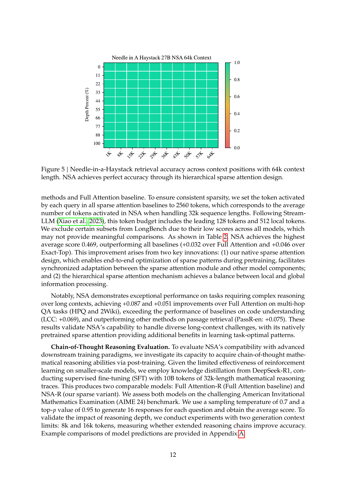

 


 2502.11089 
 Jingyang Yuan et el. 
 
 🤗 2025-02-18 
 



↗ arXiv


↗ Hugging Face


↗ Papers with Code


### TL;DR



장문 컨텍스트 모델링은 차세대 언어 모델에 필수적이나, 기존 어텐션 메커니즘의 높은 연산 비용이 문제입니다. 스파스 어텐션은 이 문제에 대한 유망한 해결책으로 떠오르고 있으며, 효율성과 모델 성능을 동시에 개선하는 방법을 모색하는 연구가 활발히 진행되고 있습니다.  하지만 기존 스파스 어텐션 기법들은 이론적인 성능 향상에도 불구하고 실제 속도 향상에는 한계가 있었고, 효과적인 학습을 위한 지원이 부족했습니다.

본 논문에서는 이러한 한계를 극복하기 위해 NSA(Natively Trainable Sparse Attention)라는 새로운 스파스 어텐션 메커니즘을 제시합니다. NSA는 알고리즘 혁신과 하드웨어 최적화를 결합하여 효율적인 장문 컨텍스트 모델링을 가능하게 합니다.  **동적 계층적 스파스 전략**을 사용하여, 토큰 압축 및 세분화된 토큰 선택을 통해 전역적 맥락 인식과 지역적 정밀도를 모두 유지합니다.  **산술 집약도 균형 알고리즘 설계**와 최신 하드웨어를 위한 최적화를 통해 속도 향상을 달성했으며, **엔드투엔드 학습**을 지원하여 사전 훈련 비용을 줄이면서 모델 성능을 유지했습니다.



#### Key Takeaways


 NSA는 하드웨어에 최적화된 알고리즘 설계를 통해 계산 속도를 대폭 향상시켰습니다. 



 NSA는 엔드투엔드 학습을 지원하여 사전 훈련 연산량을 줄이면서 모델 성능을 유지했습니다. 



 NSA는 다양한 벤치마크에서 전체 어텐션 모델을 능가하거나 그에 상응하는 성능을 보였으며, 64k 길이의 시퀀스에서 상당한 속도 향상을 달성했습니다. 


#### Why does it matter?
본 논문은 **장문 컨텍스트 모델링의 효율성을 크게 향상**시키는 새로운 스파스 어텐션 메커니즘을 제시하여, **장문 이해 및 추론 성능을 유지하면서 연산 비용을 대폭 절감**할 수 있는 가능성을 보여줍니다.  이는 **차세대 대규모 언어 모델 개발**에 큰 영향을 미칠 것으로 예상되며, 특히 **하드웨어 최적화 및 학습 효율성 개선**에 중점을 둔 연구 방향을 제시합니다.  연구 결과는 다양한 벤치마크에서 **기존 방식보다 우수한 성능**을 입증하며, 관련 분야 연구의 새로운 지평을 열었습니다.

------
#### Visual Insights

> 🔼 그림 1은 제안된 NSA(Natively trainable Sparse Attention)와 기존의 Full Attention 모델의 성능과 효율성을 비교한 것입니다. 왼쪽 그림은 일반적인 벤치마크, 장문 컨텍스트 작업 및 추론 평가에서 NSA가 Full Attention 모델을 평균적으로 능가함을 보여줍니다.  NSA는 스파스 모델임에도 불구하고 우수한 성능을 보이는 것을 알 수 있습니다. 오른쪽 그림은 64k 길이의 시퀀스 처리에서 NSA가 디코딩, 순전파 및 역전파 모든 단계에서 Full Attention 모델에 비해 상당한 계산 속도 향상을 달성했음을 보여줍니다. 이는 NSA가 모델 수명 주기 전체에서 효율성을 유지함을 나타냅니다.
> 

> 
read the caption

> Figure 1: Comparison of performance and efficiency between Full Attention model and our NSA. Left: Despite being sparse, NSA surpasses Full Attention baseline on average across general benchmarks, long-context tasks, and reasoning evaluation. Right: For 64k-length sequence processing, NSA achieves substantial computational speedup compared to Full Attention in all stages: decoding, forward propagation, and backward propagation.
> 


| Model | MMLU | MMLU-PRO | CMMLU | BBH | GSM8K | MATH | DROP | MBPP | HumanEval | Avg. |
|---|---|---|---|---|---|---|---|---|---|---|
| Full Attn | 0.567 | 0.279 | 0.576 | 0.497 | 0.486 | 0.263 | 0.503 | 0.482 | 0.335 | 0.443 |
| NSA | 0.565 | 0.286 | 0.587 | 0.521 | 0.520 | 0.264 | 0.545 | 0.466 | 0.348 | 0.456 |

> 🔼 본 표는 270억 개의 토큰으로 훈련된 270억 매개변수 모델에서 전체 어텐션 기준과 NSA 기준의 사전 훈련 성능을 비교한 것입니다. 일반적인 벤치마크, 지식(MMLU, MMLU-PRO, CMMLU), 추론(BBH, GSM8K, MATH, DROP), 코딩(MBPP, HumanEval) 작업에 대한 성능을 보여줍니다.  NSA는 높은 스파스성에도 불구하고 대부분의 벤치마크에서 우수한 평균 성능을 달성합니다.
> 

> 
read the caption

> Table 1: Pretraining performance comparison between the full attention baseline and NSA on general benchmarks, across knowledge (MMLU, MMLU-PRO, CMMLU), reasoning (BBH, GSM8K, MATH, DROP), and coding (MBPP, HumanEval) tasks. NSA achieves superior average performance on most benchmarks despite high sparsity.
> 

### In-depth insights

#### Native Sparse Attn
본 논문에서 제시된 "Native Sparse Attention"은 기존의 스파스 어텐션 방식의 한계를 극복하기 위해 **하드웨어 친화적인 알고리즘 설계와 학습 가능한 스파스 패턴을 통합**한 새로운 접근 방식입니다.  **계층적 토큰 모델링**을 통해 메모리 접근 및 연산 효율을 높이고, **전체 맥락 인식과 지역적 정확성을 동시에 유지**하며, **종단 간 학습을 가능**하게 함으로써 성능 저하 없이 효율성을 크게 향상시켰습니다.  특히, **하드웨어 가속을 위한 최적화된 커널**을 설계하여 실제 성능 향상을 이끌어냈으며, 다양한 벤치마크 결과를 통해 **기존 스파스 어텐션 기법 및 풀 어텐션 방식을 능가하는 효율성과 성능**을 입증했습니다.  **계층적 스파스 전략**은 연산 강도 균형을 통해 효율적인 처리를 가능하게 하였고, **종단 간 학습 지원**은 사전 학습 비용 절감과 모델 성능 저하 방지에 기여했습니다.  결론적으로, Native Sparse Attention은 장문 맥락 모델링의 효율성을 획기적으로 개선한 혁신적인 기법으로 평가할 수 있습니다.

#### Hardware Alignment
본 논문에서 제시된 하드웨어 정렬(Hardware Alignment) 개념은 단순히 효율적인 알고리즘 설계를 넘어, **실제 하드웨어 아키텍처에 최적화된 sparse attention 메커니즘 구현**에 초점을 맞춥니다.  이는 단순한 이론적 속도 향상이 아닌, **실제적인 연산 속도 향상**을 목표로 한다는 점에서 중요합니다.  특히, 메모리 접근 방식의 최적화를 통해 메모리 대역폭 제약을 완화하고, 병렬 처리 효율을 높이는데 중점을 둡니다. 이는 **텐서 코어 활용 최적화** 및 **메모리 접근 패턴 최적화**를 통해 구현되며, 이를 통해 계산 집약도(Arithmetic Intensity)의 균형을 맞추고, 현대 하드웨어의 성능을 극대화하는데 기여합니다.  **NSA(Natively trainable Sparse Attention)의 핵심 강점** 중 하나이며, 단순한 알고리즘 개선을 넘어, 실제 구현 및 배포 단계에서의 효율성을 크게 높일 수 있음을 시사합니다.  즉, 이론적 효율성만이 아닌, **실제적인 성능 개선**에 초점을 맞춘 접근법이라는 점에서 큰 의미를 가집니다.

#### End-to-End Training
논문에서 "End-to-End Training" 개념은 **학습 과정 전반에 걸쳐 sparse attention 메커니즘을 통합**함으로써 모델 성능 저하 없이 사전 학습 계산량을 줄이는 혁신적인 접근법을 제시합니다.  기존의 sparse attention 방법론들은 주로 추론 단계에 집중하여 사전 학습된 Full Attention 모델을 활용하는 반면, NSA는 **학습 단계부터 sparse attention 전략을 통합**하여 모델의 효율성을 극대화합니다.  이는 **하드웨어-친화적인 알고리즘 설계 및 학습 가능한 연산자**를 통해 이루어지며, 실제로 장문 컨텍스트 처리에서 Full Attention 모델과 동등하거나 우수한 성능을 유지하면서 상당한 속도 향상을 달성합니다.  **End-to-End 학습은 단순히 효율성 개선을 넘어, 모델의 전반적인 학습 과정에 sparse attention 의 패턴을 효과적으로 반영**하는 데 중요한 역할을 합니다.  이를 통해  NSA는 장문 모델링에 있어서 효율성과 성능 사이의 균형을 훌륭히 맞추는 핵심 요소가 됩니다.  **실험 결과는 NSA의 효율성을 명확히 보여주며,  실제 응용 환경에서의 효과적인 장문 모델링 구축을 위한 중요한 전략**임을 시사합니다.

#### Efficiency Analysis
본 논문의 'Efficiency Analysis' 부분은 제안된 NSA (Native Sparse Attention) 모델의 효율성을 종합적으로 평가하는 데 중점을 둡니다. **계산 효율성 분석은 주로 훈련 및 추론 속도 향상에 초점을 맞춰,  Full Attention 모델 및 기존의 Sparse Attention 방법들과의 비교를 통해 NSA의 우수성을 보여줍니다.**  특히, Triton 기반의 커널 최적화를 통해 달성한 속도 향상과 메모리 접근 최소화 전략을 자세히 설명하고, 긴 시퀀스 처리에서의 속도 향상이 더욱 두드러짐을 강조합니다.  **GPU 아키텍처 및 메모리 대역폭과의 연관성을 분석하여 NSA의 하드웨어 친화적인 설계를 뒷받침하고,**  실험 결과를 통해 훈련 및 추론 단계 모두에서 상당한 속도 향상을  **정량적으로 제시하며, 이를 통해 NSA의 실질적인 효용성을 입증합니다.**  결론적으로, 이 부분은 **NSA의  뛰어난 성능과 효율성을 다각적으로 검증하여, 실제 응용 가능성을 높이는 데 크게 기여합니다.**

#### Future Directions
미래 방향에 대한 심도있는 고찰은 **NSA의 한계점을 극복하고 성능을 더욱 개선**하는 데 초점을 맞춰야 합니다.  **하드웨어 가속화**를 위한 더욱 정교한 커널 최적화, 다양한 아키텍처와의 호환성 향상, 그리고 더욱 큰 규모의 모델에 대한 적용 가능성 검토가 중요합니다. 또한, **훈련 효율성 향상**을 위한 혁신적인 알고리즘 개발 및 **다양한 스파스 패턴**에 대한 연구는 NSA의 실용성을 높이는 데 기여할 것입니다.  **다양한 분야** (예: 코드 생성, 추론 등)에 대한 NSA 적용 및 성능 평가를 통해 실제 응용 가능성을 검증하고,  **더욱 효율적이고 견고한 스파스 어텐션 메커니즘**을 개발하는 연구가 필요합니다. 특히, **비정형 데이터 처리** 및 **다국어 지원**에 대한 연구는 NSA의 활용 범위를 넓히는 데 중요한 역할을 할 것입니다. 마지막으로,  **NSA와 다른 스파스 어텐션 기법** 간의 비교 분석을 통해 각 기법의 강점과 약점을 명확히 파악하고, 상호 보완적인 방식으로 통합하는 연구가 미래 발전 방향을 제시할 수 있을 것입니다.

### More visual insights

More on figures

> 🔼 그림 2는 NSA(Native Sparse Attention)의 아키텍처를 개괄적으로 보여줍니다. 왼쪽은 세 개의 병렬적인 어텐션 분기(compressed attention, selected attention, sliding attention)를 통해 입력 시퀀스가 처리되는 과정을 보여줍니다. 각 분기는 질의(query)에 대해 이전 키(key)와 값(value)을 처리하여,  compressed attention은 조악한 패턴을, selected attention은 중요한 토큰 블록을, 그리고 sliding attention은 지역적 맥락을 보존합니다. 오른쪽은 각 분기에서 생성된 서로 다른 어텐션 패턴을 시각화합니다. 녹색 영역은 어텐션 점수를 계산해야 하는 영역이고, 흰색 영역은 건너뛸 수 있는 영역을 나타냅니다.
> 

> 
read the caption

> Figure 2: Overview of NSA’s architecture. Left: The framework processes input sequences through three parallel attention branches: For a given query, preceding keys and values are processed into compressed attention for coarse-grained patterns, selected attention for important token blocks, and sliding attention for local context. Right: Visualization of different attention patterns produced by each branch. Green areas indicate regions where attention scores need to be computed, while white areas represent regions that can be skipped.
> 

> 🔼 그림 3은 NSA의 커널 설계를 보여줍니다.  NSA 커널은 GQA 그룹 단위로 쿼리를 로드하고(Grid Loop), 대응하는 스파스 KV 블록을 가져오며(Inner Loop), SRAM에서 어텐션 연산을 수행합니다. 초록색 블록은 SRAM에 있는 데이터를, 파란색 블록은 HBM에 있는 데이터를 나타냅니다.  Grid Loop는 GQA 그룹의 쿼리들을 동시에 처리하여 효율성을 높이고, Inner Loop는 연속적인 KV 블록을 메모리에서 가져와서 메모리 접근 횟수를 줄입니다.  이러한 설계는 메모리 대역폭을 효율적으로 사용하고,  계산 효율성을 극대화하여 처리량을 높입니다.
> 

> 
read the caption

> Figure 3: Kernel design for NSA. The kernel loads queries by GQA groups (Grid Loop), fetches corresponding sparse KV blocks (Inner Loop), and performs attention computation on SRAM. Green blocks indicate data on SRAM, while blue indicates data on HBM.
> 

> 🔼 그림 4는 270억 매개변수 모델에 대한 NSA와 전체 어텐션 방식의 사전 학습 손실 비교를 보여줍니다. 두 모델 모두 안정적인 수렴을 보이며, NSA는 더 낮은 손실 값을 달성합니다. 이는 NSA가 전체 어텐션과 동등한 성능을 유지하면서 더 효율적인 학습을 가능하게 함을 시사합니다.  그래프는 반복 횟수에 따른 손실 값의 변화를 보여주어, NSA가 전체 어텐션 방식보다 더 빠르게 수렴함을 보여줍니다. 이는 효율적인 매개변수 사용 및 최적화된 학습 전략을 통해 이뤄진 결과입니다.
> 

> 
read the caption

> Figure 4: Pretraining loss comparison between Full Attention and our NSA on 27B-parameter model. Both models exhibit stable convergence, with NSA achieving lower loss values.
> 

> 🔼 그림 5는 64k 길이의 문맥을 가진 Needle-in-a-Haystack 검색 작업에서 문맥 위치에 따른 검색 정확도를 보여줍니다. NSA(Native Sparse Attention)는 계층적 스파스 어텐션 설계를 통해 완벽한 정확도를 달성합니다. 이는 NSA가 다양한 크기의 토큰(압축 토큰, 선택적 토큰, 슬라이딩 윈도우 토큰)을 효율적으로 처리하여 전역적 문맥 인식과 지역적 정밀도를 모두 유지하기 때문입니다. 그림은 64k 길이의 문맥 내에서 모든 위치에서 NSA 모델이 완벽한 정확도를 달성했음을 시각적으로 보여줍니다.
> 

> 
read the caption

> Figure 5: Needle-in-a-Haystack retrieval accuracy across context positions with 64k context length. NSA achieves perfect accuracy through its hierarchical sparse attention design.
> 

> 🔼 그림 6은 Triton 기반의 NSA 커널과 Triton 기반의 FlashAttention-2 커널의 성능을 비교한 것입니다. NSA는 모든 문맥 길이에 걸쳐 지연 시간을 상당히 줄이며, 입력 길이가 길어질수록 성능 향상이 더욱 두드러짐을 보여줍니다. 이는 NSA의 하드웨어 최적화된 설계 덕분입니다. 특히, NSA는 메모리 액세스 패턴을 최적화하여 텐서 코어 활용도를 극대화하고, 효율적인 루프 스케줄링으로 불필요한 KV 전송을 제거함으로써 성능 향상을 달성합니다.
> 

> 
read the caption

> Figure 6: Comparison of Triton-based NSA kernel with Triton-based FlashAttention-2 kernel. Our implementation significantly reduces latency across all context lengths, with the improvement becoming more pronounced as input length increases.
> 

> 🔼 그림 7은 30억 개의 파라미터를 가진 모델을 사용하여, 전체 어텐션(Full Attention)과 다양한 토큰 선택 전략들을 비교하여 학습 손실(training loss)을 나타낸 그래프입니다.  다양한 토큰 선택 전략들은 효율적인 스파스 어텐션(sparse attention)을 구현하기 위한 여러 가지 방법들을 의미합니다. 그래프는 NSA(Native Sparse Attention) 기법이 다른 토큰 선택 전략들보다 학습 과정에서 더 낮은 손실을 달성하여, 더 나은 성능을 보임을 보여줍니다. 즉, NSA가 더 효과적으로 모델을 학습시키는 것을 시각적으로 보여주는 그림입니다.
> 

> 
read the caption

> Figure 7: Compare training loss on a 3B-parameter model with Full Attention and different token selection strategies and. Our NSA achieves better performance.
> 

> 🔼 그림 8은 완전한 어텐션 변환기(Full Attention Transformer)의 어텐션 맵을 시각화한 것입니다. 밝은 색 영역은 더 높은 어텐션 값을 나타냅니다. 그림에서 볼 수 있듯이 어텐션 점수는 블록 단위로 군집화된 분포를 보입니다. 이는 어텐션 메커니즘이 연속적인 토큰 블록 내에서 유사한 의미적 관계를 갖는 토큰들에 더 높은 어텐션 값을 할당하는 경향이 있음을 시사합니다. 이러한 블록 단위의 패턴은 NSA(Natively Sparse Attention)와 같은 희소 어텐션 방법을 설계할 때 중요한 고려 사항이 됩니다. 왜냐하면 희소 어텐션은 이러한 패턴을 활용하여 계산 비용을 줄일 수 있기 때문입니다.
> 

> 
read the caption

> Figure 8: Visualization of Attention Map on a Full Attention transformer. Light-colored regions indicate higher attention values. As shown in the figure, attention scores exhibit blockwise clustering distribution.
> 

More on tables


| Model | MFQA-en | MFQA-zh | Qasper | HPQ | 2Wiki | GovRpt | Dur | PassR-en | PassR-zh | LCC | Code | Avg. |
|---|---|---|---|---|---|---|---|---|---|---|---|---|
| H2O | 0.428 | 0.429 | 0.308 | 0.112 | 0.101 | 0.231 | 0.208 | 0.704 | 0.421 | 0.092 | 0.303 |  |
| InfLLM | 0.474 | 0.517 | 0.356 | 0.306 | 0.250 | 0.277 | 0.257 | 0.766 | 0.486 | 0.143 | 0.383 |  |
| Quest | 0.495 | 0.561 | 0.365 | 0.295 | 0.245 | 0.293 | 0.257 | 0.792 | 0.478 | 0.135 | 0.392 |  |
| Exact-Top | 0.502 | 0.605 | 0.397 | 0.321 | 0.288 | 0.316 | 0.291 | 0.810 | 0.548 | 0.156 | 0.423 |  |
| Full Attn | 0.512 | 0.623 | 0.409 | 0.350 | 0.305 | 0.324 | 0.294 | 0.830 | 0.560 | 0.163 | 0.437 |  |
| NSA | 0.503 | 0.624 | 0.432 | 0.437 | 0.356 | 0.307 | 0.341 | 0.905 | 0.550 | 0.232 | 0.469 | |
> 🔼 표 2는 LongBench라는 벤치마크 데이터셋에서 NSA(Natively Trainable Sparse Attention) 모델의 성능을 기존의 다른 스파스 어텐션 모델들과 Full Attention 모델과 비교한 결과를 보여줍니다.  LongBench는 단일 문서 질의응답, 다중 문서 질의응답, 합성 데이터, 코드 생성 등 다양한 하위 작업들을 포함하고 있습니다.  결과는 NSA 모델이 Full Attention 모델을 포함한 대부분의 기존 모델들보다 우수한 성능을 보임을 나타냅니다.
> 

> 
read the caption

> Table 2: Performance comparison between our NSA and baselines on LongBench, including subsets in single document QA, multi-document QA, synthetic and code task categories. NSA outperformed most of the baselines including Full Attention.
> 


| Generation Token Limit |    8192 |    16384 |
|---|---|---|
| Full Attention-R | 0.046 | 0.092 |
| NSA-R | **0.121** | **0.146** |
> 🔼 표 3은 지도 학습 미세 조정 후 AIME(American Invitational Mathematics Examination) 지시 기반 평가 결과를 보여줍니다.  NSA-R(Native Sparse Attention-R) 모델은 8k와 16k 시퀀스 길이 모두에서 기준 Full Attention-R 모델보다 더 나은 성능을 보입니다. 이 표는 장문 맥락(Long-Context) 문제 해결을 위한 NSA-R 모델의 효율성과 정확성을 강조합니다.
> 

> 
read the caption

> Table 3: AIME Instruction-based Evaluating after supervised fine-tuning. Our NSA-R demonstrates better performance than Full Attention-R at both 8k and 16k sequence lengths
> 


| Context Length | 8192 | 16384 | 32768 | 65536 |
|---|---|---|---|---|
| Full Attention | 8192 | 16384 | 32768 | 65536 |
| NSA | 2048 | 2560 | 3584 | 5632 |
| Expected Speedup | 4× | 6.4× | 9.1× | 11.6× |
> 🔼 표 4는 디코딩 중 어텐션 연산당 메모리 접근량(토큰 수)을 보여줍니다. 디코딩은 연산 대비 메모리 접근 비율이 낮아 메모리 제약적이기 때문에 예상되는 속도 향상은 메모리 접근량에 거의 선형적으로 비례합니다.
> 

> 
read the caption

> Table 4: Memory access volume (in equivalent number of tokens) per attention operation during decoding. Due to the low arithmetic intensity and memory-bound nature of decoding, the expected speedup is approximately linear with the volume of memory access.
> 

### Full paper



