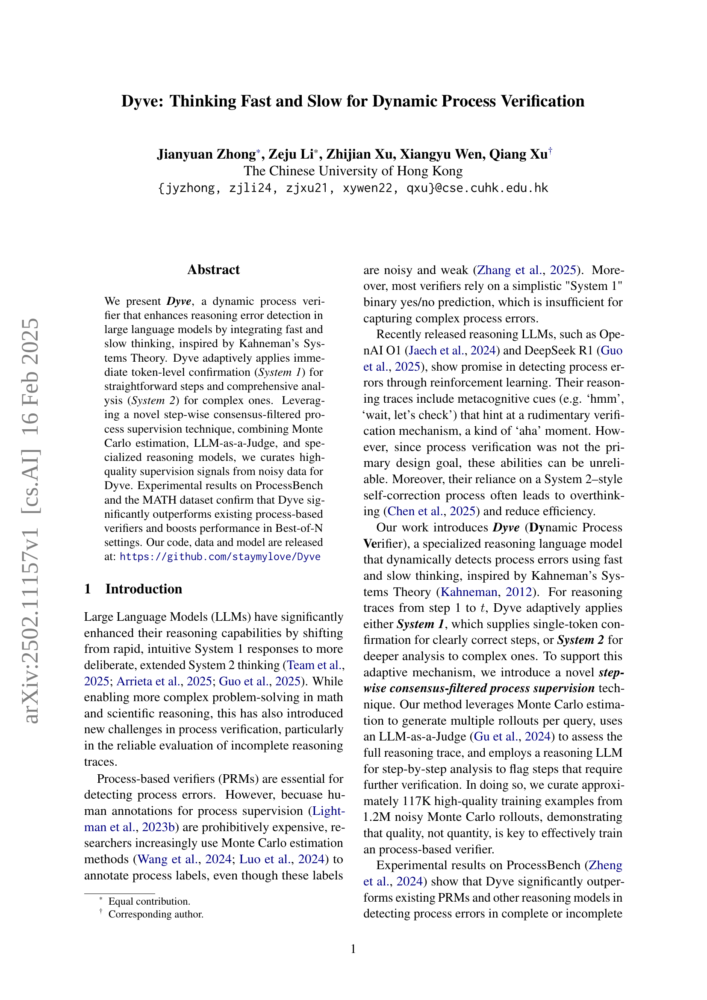
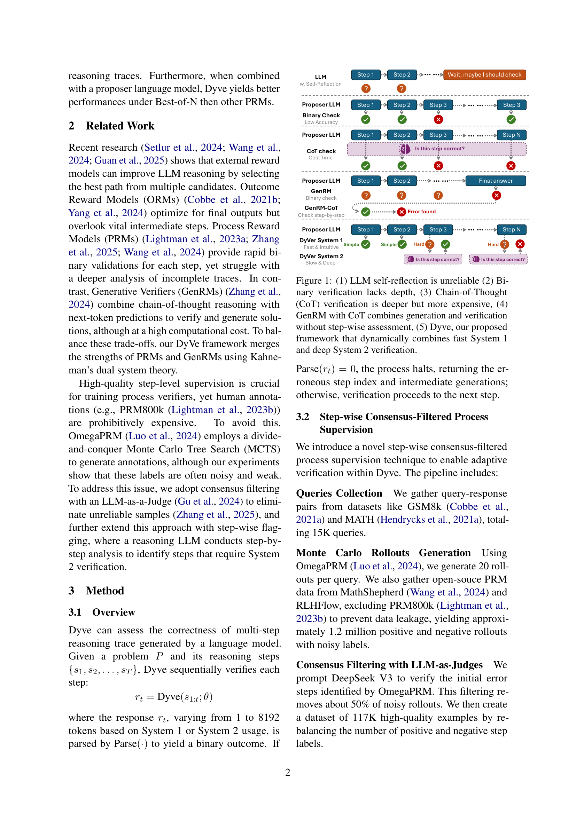
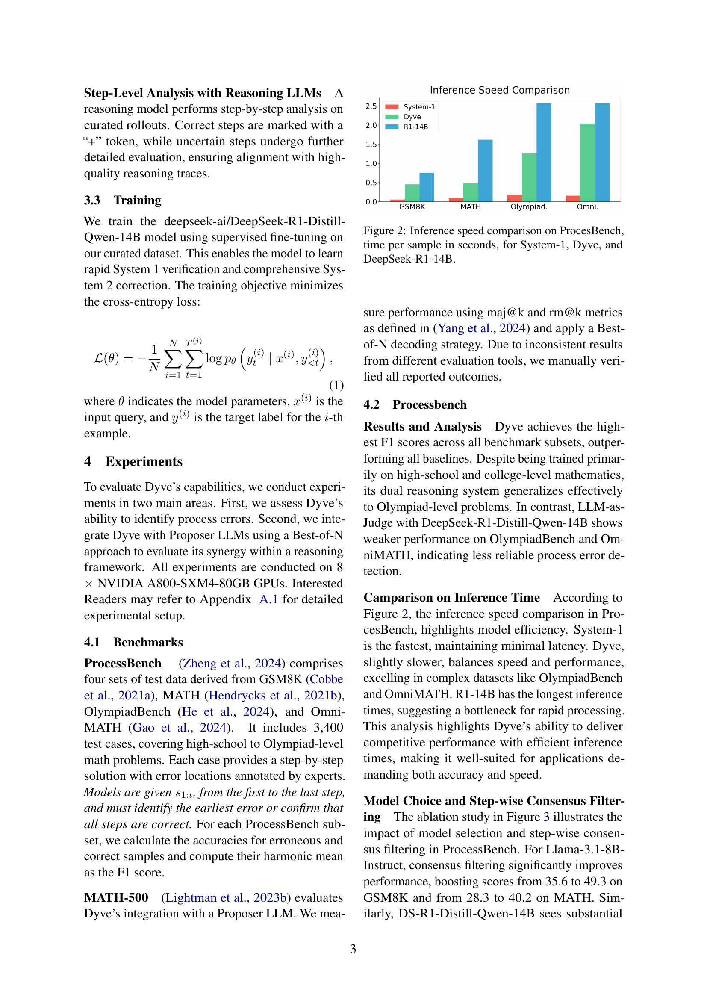
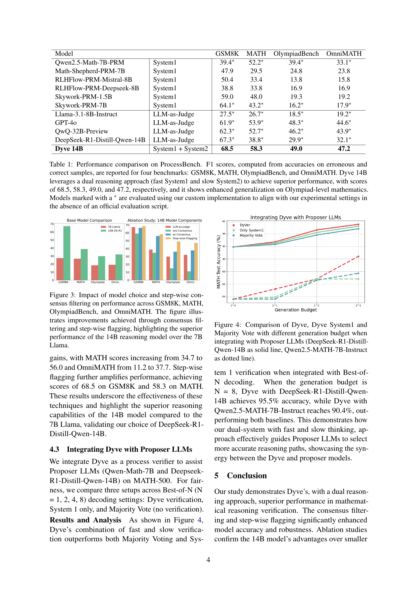
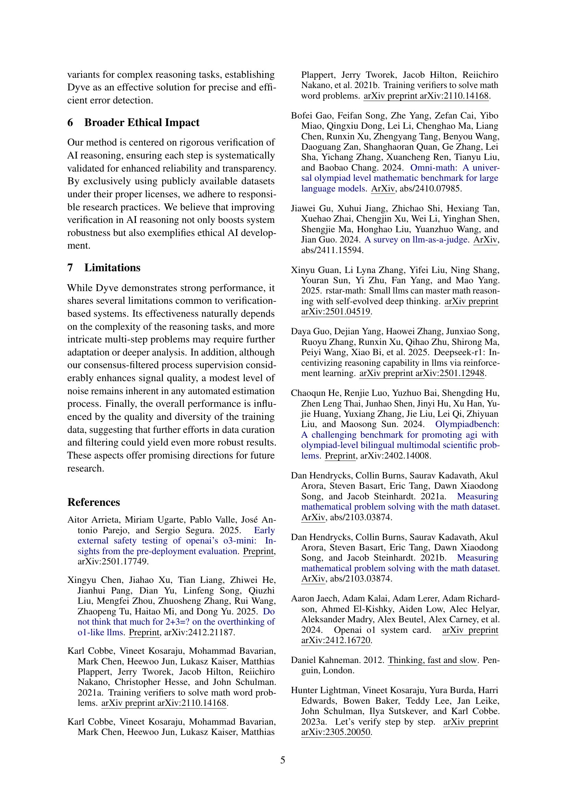
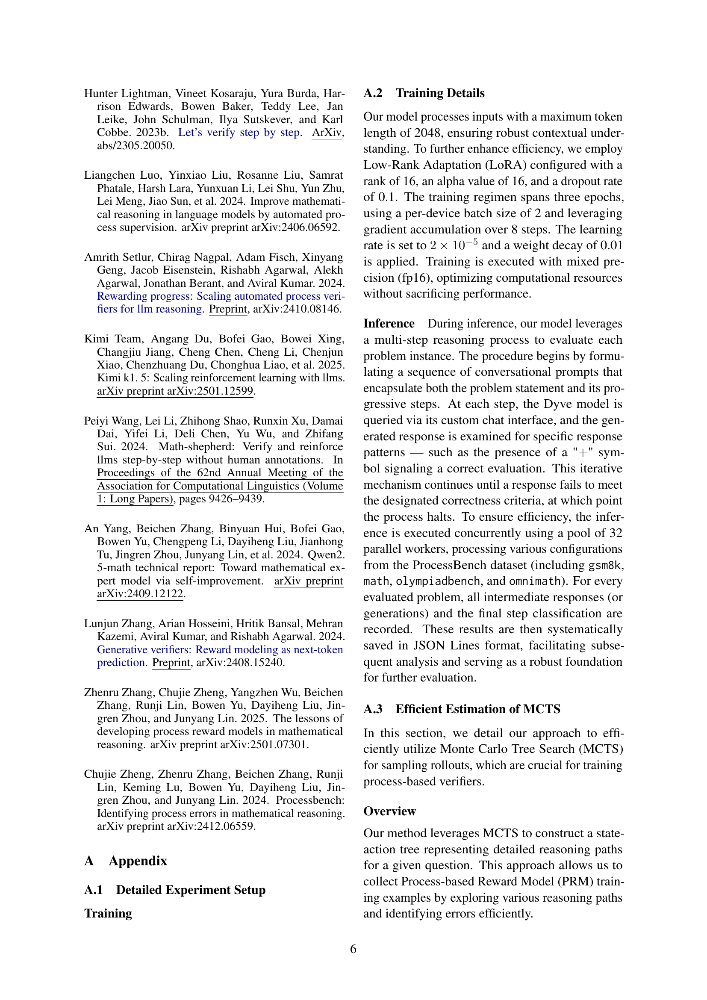
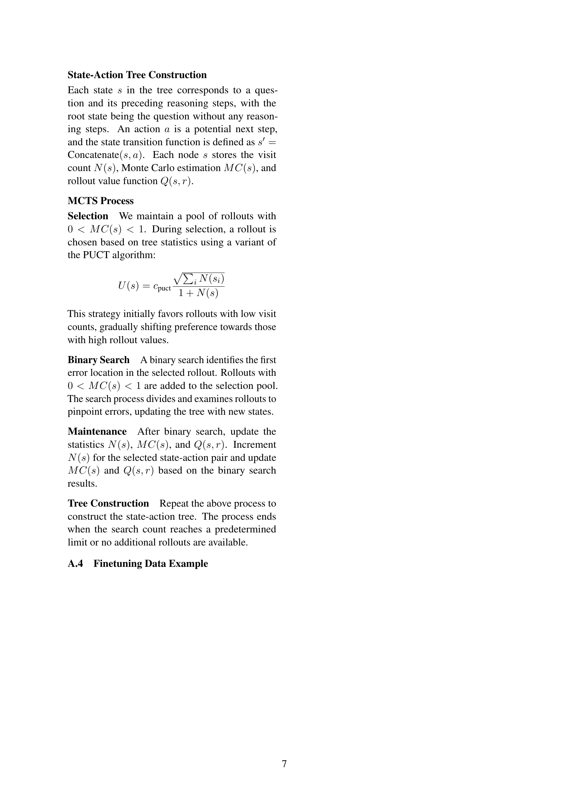
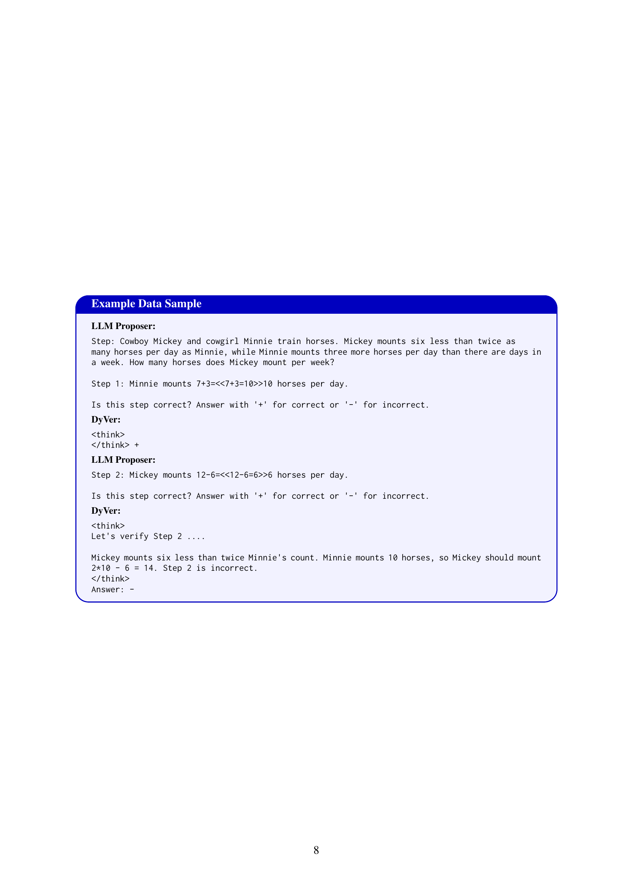

 


 2502.11157 
 Jianyuan Zhong et el. 
 
 🤗 2025-02-18 
 



↗ arXiv


↗ Hugging Face


↗ Papers with Code


### TL;DR



대규모 언어 모델(LLM)은 복잡한 추론 과제를 해결하는 데 탁월하지만, 추론 과정의 오류를 검출하고 신뢰성을 높이는 것은 여전히 어려운 문제입니다. 기존의 프로세스 기반 검증기는 단순한 이진 분류에 의존하여 복잡한 오류를 놓치거나, 고품질의 감독 데이터가 부족하여 성능이 제한적입니다.  

본 논문에서는 이러한 문제를 해결하기 위해 **빠른 사고(System 1)와 느린 사고(System 2)를 통합한 새로운 동적 프로세스 검증기인 Dyve를 제안합니다.** Dyve는 단순한 단계는 빠르게 확인하고, 복잡한 단계는 심층적으로 분석하는 적응형 방식을 사용합니다. 또한, **몬테카를로 추정, LLM-as-a-Judge, 그리고 특수 추론 모델을 결합하여 소음이 많은 데이터에서 고품질 감독 신호를 생성하는 새로운 기법**을 제시합니다. 실험 결과, Dyve는 기존 방법 대비 ProcessBench 및 MATH 데이터셋에서 우수한 성능을 보였습니다.



#### Key Takeaways


 LLM의 추론 과정에서 발생하는 오류를 효율적으로 검출하기 위해 빠른 사고(System 1)와 느린 사고(System 2)를 통합한 Dyve 모델 제안 



 소음이 많은 데이터에서 고품질 감독 신호를 생성하기 위한 혁신적인 단계별 합의 필터링 방식 제시 



 ProcessBench 및 MATH 데이터셋에서 기존 방법 대비 성능 향상을 실험적으로 검증 


#### Why does it matter?
본 논문은 **대규모 언어 모델(LLM)의 추론 과정 검증**이라는 중요한 문제에 대해 새로운 접근 방식을 제시합니다. 기존의 단순한 이진 분류 방식을 넘어, **빠른 사고(System 1)와 느린 사고(System 2)**를 결합하여 LLM의 추론 과정을 보다 정확하고 효율적으로 검증하는 Dyve 모델을 제안합니다. 이는 LLM의 추론 신뢰성 향상에 크게 기여하며, 관련 분야 연구에 새로운 방향을 제시할 수 있습니다. 또한, **소음이 많은 데이터에서 고품질 감독 신호를 생성하는 새로운 기법**을 제시하여 LLM의 추론 성능 향상을 위한 새로운 가능성을 열어줍니다.

------
#### Visual Insights

> 🔼 그림 1은 다섯 가지의 서로 다른 동적 프로세스 검증 방법을 비교 분석하여 Dyve 모델의 작동 방식을 설명합니다. (1) LLM의 자기 반성은 신뢰할 수 없고, (2) 이진 검증은 심층성이 부족하며, (3) 사고 과정(CoT) 검증은 심층적이지만 비용이 많이 들고, (4) CoT를 사용하는 GenRM은 생성과 검증을 결합하지만 단계별 평가가 없다는 한계점을 보입니다. (5) 제안된 Dyve 프레임워크는 빠른 시스템 1과 심층적인 시스템 2 검증을 동적으로 결합하여 이러한 문제점을 해결합니다.
> 

> 
read the caption

> Figure 1: (1) LLM self-reflection is unreliable (2) Binary verification lacks depth, (3) Chain-of-Thought (CoT) verification is deeper but more expensive, (4) GenRM with CoT combines generation and verification without step-wise assessment, (5) Dyve, our proposed framework that dynamically combines fast System 1 and deep System 2 verification.
> 


| Model |  | GSM8K | MATH | OlympiadBench | OmniMATH |
|---|---|---|---|---|---| 
| Qwen2.5-Math-7B-PRM | System1 | 39.4∗ | 52.2∗ | 39.4∗ | 33.1∗ |
| Math-Shepherd-PRM-7B | System1 | 47.9 | 29.5 | 24.8 | 23.8 |
| RLHFlow-PRM-Mistral-8B | System1 | 50.4 | 33.4 | 13.8 | 15.8 |
| RLHFlow-PRM-Deepseek-8B | System1 | 38.8 | 33.8 | 16.9 | 16.9 |
| Skywork-PRM-1.5B | System1 | 59.0 | 48.0 | 19.3 | 19.2 |
| Skywork-PRM-7B | System1 | 64.1∗ | 43.2∗ | 16.2∗ | 17.9∗ |
| Llama-3.1-8B-Instruct | LLM-as-Judge | 27.5∗ | 26.7∗ | 18.5∗ | 19.2∗ |
| GPT-4o | LLM-as-Judge | 61.9∗ | 53.9∗ | 48.3∗ | 44.6∗ |
| QwQ-32B-Preview | LLM-as-Judge | 62.3∗ | 52.7∗ | 46.2∗ | 43.9∗ |
| DeepSeek-R1-Distill-Qwen-14B | LLM-as-Judge | 67.3∗ | 38.8∗ | 29.9∗ | 32.1∗ |
| **Dyve 14B** | System1 + System2 | **68.5** | **58.3** | **49.0** | **47.2** |

> 🔼 표 1은 ProcessBench라는 벤치마크 데이터셋에서 다양한 모델들의 성능을 비교한 결과를 보여줍니다.  GSM8K, MATH, OlympiadBench, OmniMATH 네 가지 하위 데이터셋에서 오류가 있는 샘플과 정답 샘플에 대한 정확도를 기반으로 F1 점수를 계산하여 모델의 성능을 평가했습니다. Dyve 14B 모델은 빠른 System 1과 느린 System 2라는 이중 추론 방식을 사용하여 다른 모델들보다 월등한 성능(각각 68.5, 58.3, 49.0, 47.2 점수)을 달성했습니다. 특히, 고난이도 수학 문제를 다루는 Olympiad 수준의 데이터셋에서도 우수한 일반화 능력을 보여주었습니다.  표에 표시된 일부 모델들의 결과는 공식적인 평가 스크립트가 없어 연구진이 직접 구현한 방법을 사용하여 얻어진 결과임을 유의해야 합니다.
> 

> 
read the caption

> Table 1: Performance comparison on ProcessBench. F1 scores, computed from accuracies on erroneous and correct samples, are reported for four benchmarks: GSM8K, MATH, OlympiadBench, and OmniMATH. Dyve 14B leverages a dual reasoning approach (fast System1 and slow System2) to achieve superior performance, with scores of 68.5, 58.3, 49.0, and 47.2, respectively, and it shows enhanced generalization on Olympiad-level mathematics. Models marked with a ∗ are evaluated using our custom implementation to align with our experimental settings in the absence of an official evaluation script.
> 

### In-depth insights

#### Dyve's Dual System
Dyve는 카네만의 시스템 이론에서 영감을 받아 **빠른 사고(System 1)**와 **느린 사고(System 2)**를 통합한 동적 프로세스 검증 모델입니다. System 1은 명확한 단계에 대한 즉각적인 토큰 수준 확인을 제공하며, System 2는 복잡한 단계에 대한 포괄적인 분석을 수행합니다. 이러한 이중 시스템 접근 방식은 단순한 이진 예측을 넘어 복잡한 프로세스 오류를 포착하는 데 효과적입니다. **단계별 합의 필터링 프로세스 감독 기법**을 통해 노이즈가 많은 데이터에서 고품질 감독 신호를 생성하며, Monte Carlo 추정, LLM-as-a-Judge, 그리고 특수화된 추론 모델을 결합하여 이를 달성합니다. **품질에 대한 양보다 질을 우선시하는 전략**을 통해 효율성을 높이고 정확도를 유지합니다. 결과적으로 Dyve는 기존 프로세스 검증기보다 뛰어난 성능을 보이며, 특히 불완전한 추론 추적에서 그 효과가 두드러집니다.

#### Consensus Filtering
논문에서 제시된 '합의 필터링(Consensus Filtering)'은 잡음이 많은 데이터에서 양질의 학습 데이터를 추출하는 중요한 전처리 과정으로 보입니다. **오메가PRM(OmegaPRM)과 같은 기존 방법을 통해 생성된 라벨이 부정확할 수 있기 때문에**, LLM-as-a-Judge를 활용하여 **다수의 의견을 바탕으로 신뢰할 수 있는 라벨만을 선별**하는 전략을 사용합니다. 이는 단순히 수치적인 기준이 아닌, **LLM의 언어 이해 능력을 활용하여 품질을 판단**한다는 점에서 흥미롭습니다. 이러한 과정을 통해 노이즈를 제거하고, 실제로 모델 학습에 유용한 데이터만을 남김으로써 **모델의 성능 향상에 크게 기여**할 것으로 예상됩니다. 특히, **단순한 이진 분류(binary classification)이 아닌, 단계별(step-wise) 분석을 통해 더욱 정교한 필터링**을 수행함으로써, 오류 검출의 정확도를 높이고, 다양한 유형의 오류를 더욱 효과적으로 식별할 수 있을 것으로 기대됩니다.  이는 특히, 불완전한 추론 과정(incomplete reasoning traces)을 다룰 때 중요한 이점으로 작용할 것입니다.

#### LLM Integration
본 논문에서는 LLM 통합에 대한 심도있는 논의가 부족하지만, 맥락상 LLM이 **두 가지 방식(System 1과 System 2)**으로 동적으로 프로세스 검증에 통합되는 것을 알 수 있습니다.  **System 1은 빠르고 직관적인 토큰 수준 확인**, **System 2는 복잡한 단계에 대한 심층 분석**을 수행합니다. 이는 **인간의 사고 방식(Kahneman's Systems Theory)**을 모방한 것으로, 단순한 이진 분류를 넘어 복잡한 프로세스 오류를 포착하는 데 효과적입니다.  LLM은 **Monte Carlo 추정** 및 **LLM-as-a-Judge 기법**을 사용하여 노이즈가 많은 데이터로부터 고품질 감독 신호를 생성하는 데 활용됩니다. 또한, **단계별 합의 필터링 기법**을 통해 신뢰할 수 있는 감독 데이터를 생성하고, 이를 통해 **LLM의 추론 능력을 향상**시키는 것이 핵심입니다.  **다른 프로세스 검증 모델과의 비교 실험**을 통해 Dyve의 우수성을 확인하였으며, 특히 **Best-of-N 설정에서 프로포저 LLM과의 시너지 효과**가 탁월함을 보여줍니다.

#### Process Verification
본 논문에서 다루는 "프로세스 검증"은 **대규모 언어 모델(LLM)**의 추론 과정에서 발생하는 오류를 탐지하는 데 중점을 둡니다.  기존의 이진 분류 방식을 넘어, **속도와 정확성을 동시에 고려**하는 '빠른 사고(System 1)'와 '느린 사고(System 2)'를 결합하여 LLM의 추론 단계별로 오류를 효과적으로 검출합니다.  **단계별 합의 필터링 기법**을 통해 잡음이 많은 데이터로부터 고품질의 감독 신호를 생성하고, **LLM을 판사로 활용**, 전문적인 추론 모델을 함께 활용하여 신뢰도 높은 검증을 수행합니다.  **Monte Carlo 추정**과 같은 기법들을 활용하여 효율성을 높이면서 정확성을 유지하는 방법을 제시합니다. 결과적으로, 기존의 프로세스 검증 방식보다 뛰어난 성능을 보이며, 특히 불완전한 추론 과정에서도 효과적으로 오류를 탐지하는 강점을 가지고 있습니다.  **Best-of-N** 전략과의 결합을 통해 더욱 향상된 성능을 보이는 점도 주목할 만 합니다.

#### Future of Dyve
Dyve의 미래는 **확장성과 일반화능력** 향상에 달려 있습니다.  더욱 다양하고 복잡한 추론 문제에 적용될 수 있도록 모델의 **훈련 데이터**를 확대하고, 다양한 유형의 추론 과정을 포착할 수 있도록 **모델 아키텍처**를 개선해야 합니다.  **소음이 많은 데이터**에서 양질의 지도 신호를 추출하는 기술 또한 고도화되어야 하며,  **계산 효율성**을 높이기 위한 최적화 작업이 필요합니다.  궁극적으로는, Dyve가 **다른 추론 모델**과의 상호 작용을 통해 시너지를 창출하고,  **실제 문제 해결**에 더욱 효과적으로 활용될 수 있도록 연구가 진행되어야 합니다.  이를 통해 Dyve는 **인공지능의 신뢰성**을 높이고, **실용적인 가치**를 창출하는데 기여할 것입니다.

### More visual insights

More on figures

> 🔼 그림 2는 ProcessBench 데이터셋을 사용하여 세 가지 모델(System-1, Dyve, DeepSeek-R1-14B)의 추론 속도를 비교한 막대 그래프입니다.  각 모델별로 샘플당 처리 시간(초)을 나타내어, 모델의 효율성을 비교 분석합니다. System-1은 가장 빠른 속도를 보이는 반면, DeepSeek-R1-14B는 가장 느린 속도를 보입니다. Dyve는 속도와 정확도 간의 균형을 맞추는 성능을 보여줍니다.  이를 통해 각 모델의 처리 효율성과 실시간 응용 가능성에 대한 분석을 제공합니다.
> 

> 
read the caption

> Figure 2: Inference speed comparison on ProcesBench, time per sample in seconds, for System-1, Dyve, and DeepSeek-R1-14B.
> 

> 🔼 그림 3은 GSM8K, MATH, OlympiadBench 및 OmniMATH 데이터셋에서 모델 선택과 단계별 합의 필터링이 성능에 미치는 영향을 보여줍니다. 이 그림은 합의 필터링과 단계별 플래깅을 통해 달성된 성능 향상을 보여주며, 특히 7B Llama 모델보다 14B 추론 모델의 우수한 성능을 강조합니다.  합의 필터링은 노이즈가 많은 데이터에서 정확한 레이블을 걸러내는 데 도움이 되며, 단계별 플래깅은 모델이 각 단계의 정확성을 더욱 면밀하게 평가할 수 있도록 합니다. 결과적으로, 이러한 두 가지 기법을 적용함으로써, 특히 복잡한 수학 문제에 대한 모델의 성능이 향상되었습니다.
> 

> 
read the caption

> Figure 3: Impact of model choice and step-wise consensus filtering on performance across GSM8K, MATH, OlympiadBench, and OmniMATH. The figure illustrates improvements achieved through consensus filtering and step-wise flagging, highlighting the superior performance of the 14B reasoning model over the 7B Llama.
> 

> 🔼 그림 4는 제안된 Dyve 모델과 비교 모델(Dyve System 1, Majority Vote)의 성능을 다양한 생성 버짓(generation budget) 하에서 비교한 그래프입니다.  두 가지 다른 Proposer LLM (DeepSeek-R1-Distill-Qwen-14B 와 Qwen-2.5-MATH-7B-Instruct)을 사용하여 실험을 진행했으며,  각 LLM에 대한 결과는 실선과 점선으로 구분되어 나타납니다.  그래프는 생성 버짓이 증가함에 따라 세 가지 모델의 정확도 변화를 보여주어, Dyve 모델이 다양한 조건에서도 우수한 성능을 유지함을 시각적으로 보여줍니다.
> 

> 
read the caption

> Figure 4: Comparison of Dyve, Dyve System1 and Majority Vote with different generation budget when integrating with Proposer LLMs (DeepSeek-R1-Distill-Qwen-14B as solid line, Qwen2.5-MATH-7B-Instruct as dotted line).
> 

### Full paper



