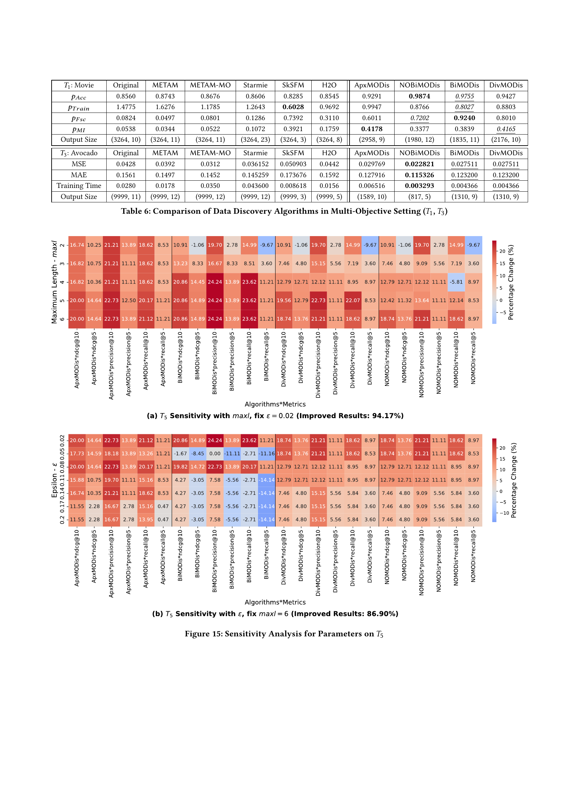

 


 2502.11262 
 Mengying Wang et el. 
 
 🤗 2025-02-21 
 



↗ arXiv


↗ Hugging Face


↗ Papers with Code


### TL;DR



많은 데이터 기반 인공지능(AI) 및 머신러닝 모델은 고품질 데이터셋에 의존합니다. 기존의 데이터 발견 방법은 단일 성능 지표에 초점을 맞춰 편향된 결과를 초래할 수 있습니다. 이 논문에서는 **여러 사용자 정의 모델 성능 지표를 최적화하여 데이터셋을 발견하는 새로운 프레임워크인 MODIs**를 제시합니다. MODIs는 skyline 데이터셋을 생성하여 모든 성능 지표에서 모델이 원하는 성능을 달성하도록 합니다.

MODIs는 유한 상태 트랜스듀서(FST)로 공식화되며, skyline 데이터셋을 생성하기 위한 세 가지 실용적인 알고리즘을 제공합니다. 첫 번째 알고리즘은 '보편적인 스키마에서 축소' 전략을 사용하고, 두 번째 알고리즘은 데이터 증강과 감소를 번갈아 적용하는 양방향 전략을 사용합니다. 세 번째 알고리즘은 skyline 데이터셋의 편향을 완화하기 위해 다양화 알고리즘을 도입합니다. 실험 결과는 MODIs 알고리즘의 효율성과 효과성을 입증하며, 데이터 과학 파이프라인 최적화에 대한 응용 사례를 보여줍니다.



#### Key Takeaways


 MODIs는 **다중 목표 최적화를 통해 여러 머신러닝 모델 성능 지표를 동시에 고려**하여 데이터셋을 생성합니다. 



 MODIs는 **효율적인 알고리즘**을 통해 다양한 크기의 데이터셋에 대해서도 실용적으로 skyline 데이터셋을 생성합니다. 



 실험 결과를 통해 MODIs가 **기존 방법론보다 우수한 성능**을 보임을 검증하고, 다양한 데이터 과학 응용 분야에서의 활용 가능성을 보여줍니다. 


#### Why does it matter?
본 논문은 **다양한 데이터 소스로부터 머신러닝 모델 성능을 향상시키는 데 필요한 최적의 데이터셋을 생성하는 새로운 프레임워크 MODIs**를 제시함으로써, 데이터 과학 분야의 연구자들에게 **중요한 데이터 발견 및 통합 방법론**을 제공합니다. 기존의 단일 목표 최적화 방식을 넘어 여러 성능 지표를 동시에 고려하여 최적의 데이터셋을 찾는 MODIs는 다양한 데이터 과학 응용 분야에서 **모델 성능 향상에 크게 기여**할 수 있습니다. 특히, 여러 성능 지표 간의 상충 관계를 고려하여 **균형 잡힌 성능 향상**을 추구하는 MODIs는 현실적인 데이터 과학 문제 해결에 효과적이며, 향후 연구의 새로운 방향을 제시할 수 있습니다.

------
#### Visual Insights


| Symbol | Notation |
|---|---| 
| <math alttext="{\
uppercal{D}}" display="inline">{\
uppercal{D}}</math>, <math alttext="D" display="inline">D</math>, <math alttext="D_{U}" display="inline">D_{U}</math> | a set of datasets, a single dataset, universal table |
| <math alttext="R_{D}" display="inline">R_{D}</math>, <math alttext="R_{U}" display="inline">R_{U}</math> | local schema of <math alttext="D" display="inline">D</math>, and universal schema |
| <math alttext="{\
uppercal{A}}" display="inline">{\
uppercal{A}}</math>, <math alttext="A" display="inline">A</math>, <math alttext="{\mathsf{adom}}(A)" display="inline">{\mathsf{adom}}(A)</math> | attribute set, attribute, and active domain |
| <math alttext="M" display="inline">M</math> | a data science model <math alttext="D\rightarrow\mathbb{R}^{d}" display="inline">D\rightarrow\mathbb{R}^{d}</math> |
| <math alttext="{\
uppercal{P}}" display="inline">{\
uppercal{P}}</math>, <math alttext="p" display="inline">p</math>, <math alttext="(p_{l},p_{u})" display="inline">(p_{l},p_{u})</math> | perform. measures, a measure, its range |
| <math alttext="T" display="inline">T</math>, <math alttext="t" display="inline">t</math> = <math alttext="(M,D,{\nuppercal{P}})" display="inline">(M,D,{\nuppercal{P}})</math>, <math alttext="t.{\nuppercal{P}}" display="inline">t.{\nuppercal{P}}</math> | test set; single test, its performance vector |
| <math alttext="{\
uppercal{T}}" display="inline">{\
uppercal{T}}</math> = <math alttext="(s_{M},{\nuppercal{S}},{\
uppercal{O}},{\
uppercal{S}}_{F},\delta)" display="inline">(s_{M},{\nuppercal{S}},{\
uppercal{O}},{\
uppercal{S}}_{F},\delta)</math> | a data discovery system |
| <math alttext="{\
uppercal{E}}" display="inline">{\
uppercal{E}}</math> | a performance estimation model |
| <math alttext="C" display="inline">C</math> = <math alttext="(s_{M},{\nuppercal{O}},M,T,{\nuppercal{E}})" display="inline">(s_{M},{\nuppercal{O}},M,T,{\nuppercal{E}})</math> | a configuration of data discovery system |
| <math alttext="G_{\nuppercal{T}}" display="inline">G_{\nuppercal{T}}</math> = <math alttext="({\nuppercal{V}},\delta)" display="inline">({\nuppercal{V}},\delta)</math> | running graph |
| <math alttext="s\prec s^{\prime}" display="inline">s\prec s^{\prime}</math>, <math alttext="D\prec D^{\prime}" display="inline">D\prec D^{\prime}</math> | state dominance, dataset dominance |

> 🔼 표 1은 논문에서 사용된 주요 기호와 약어에 대한 설명을 담고 있습니다. 각 기호는 데이터셋, 스키마, 속성, 모델, 성능 측정 지표, 테스트, 데이터 생성 시스템 등을 나타내는 데 사용됩니다. 이 표는 논문의 내용을 이해하는 데 필수적인 기호들의 정의를 제공하여 독자의 이해도를 높입니다.
> 

> 
read the caption

> Table 1. Table of notations
> 

### In-depth insights

#### Multi-objective data discovery
본 논문에서 제시된 다중 목표 데이터 발견(Multi-objective data discovery) 방법론은 기존의 단일 목표 데이터 통합 방식의 한계를 극복하기 위한 시도입니다. **여러 사용자 정의 성능 지표를 동시에 최적화**하여 데이터 소스를 선택 및 통합함으로써, 특정 모델의 성능을 다양한 측면에서 개선하는 데 중점을 둡니다.  이는 단일 성능 지표에만 초점을 맞춘 기존 방법의 편향성을 완화하고, 모델 성능 향상에 더욱 효과적인 데이터셋을 생성하는 데 도움이 될 수 있습니다.  **다양한 알고리즘**을 통해 skyline 데이터셋을 생성하고, 이를 실험적으로 검증하여 효율성과 효과성을 입증합니다.  **제약 조건을 고려한 최적화** 및 **데이터 편향 완화를 위한 다양화 알고리즘** 등의 고급 기법을 포함하여 실제 데이터 과학 파이프라인에 적용 가능성을 높였습니다.  하지만, 다중 목표 최적화의 복잡성과 계산 비용 문제는 여전히 과제로 남아 있으며,  **알고리즘의 확장성 및 다양한 데이터 유형에 대한 적용 가능성**을 더욱 연구해야 할 필요가 있습니다.

#### Skyline dataset generation
본 논문에서 제시된 'Skyline dataset generation'은 **다중 목표 데이터 발견(multi-objective data discovery)** 문제에 대한 해결책으로, 기존의 단일 목표 최적화 방식의 한계를 극복하기 위한 노력입니다.  여러 사용자 정의 성능 지표(performance measures)를 동시에 만족하는 데이터셋을 생성하는 것을 목표로 하며, **Pareto 최적성(Pareto optimality)** 개념을 도입하여 다양한 데이터셋 후보군 중에서 최적의 조합을 찾아냅니다.  이를 위해 **유한 상태 변환기(finite state transducer)** 기반의 형식적 모델을 제시하고,  **'reduce-from-universal', 'bi-directional', 'diversification' 세 가지 알고리즘**을 통해 실제 데이터셋 생성 과정을 효율적으로 구현합니다.  **각 알고리즘은 서로 다른 전략**을 사용하며, 특히 'bi-directional' 알고리즘은 양방향 탐색을 통해 계산 비용을 줄이고, 'diversification' 알고리즘은 데이터 편향(bias)을 완화하는 데 중점을 둡니다.  실험 결과는 제시된 알고리즘의 효율성과 효과성을 검증하며, 다양한 데이터 과학 파이프라인에서의 적용 가능성을 보여줍니다.

#### Approximation algorithms
연구 논문에서 '근사 알고리즘' 부분은 다양한 제약 조건 하에서 최적의 솔루션을 찾는 것이 계산적으로 불가능할 때, **근사적인 해법**을 제시하는 알고리즘에 대한 설명을 담고 있습니다. 특히, 다중 목표 데이터 생성 문제에서 최적의 데이터셋을 찾는 것이 어려운 경우, **실용적인 수준의 성능을 보장하는 근사적인 데이터셋**을 생성하는 알고리즘의 중요성을 강조합니다. 논문에서는 이러한 근사 알고리즘의 효율성과 효과성을 실험적으로 검증하고, 다양한 데이터셋과 모델에 대한 적용 가능성을 보여줍니다.  **'ε-Skyline set' 개념**을 도입하여 근사해의 품질을 정량적으로 평가하고, 이를 바탕으로 알고리즘의 근사 성능을 보장하는 분석 결과를 제시하는 것이 특징입니다.  **'Reduce-from-universal' 전략**은 전체 데이터셋에서 불필요한 부분을 제거하는 방식으로, **'Bi-directional' 전략**은 데이터 증강과 축소를 병행하여 효율성을 높이는 방식으로 제시됩니다. 이러한 다양한 근사 알고리즘을 통해 다중 목표 데이터 생성 문제에 대한 실용적인 해결책을 제시하고,  **다양한 데이터셋과 모델에 대한 실험 결과**를 통해 그 효과를 입증하는 것이 핵심입니다. 

#### Bi-directional search
양방향 검색 전략은 효율적인 스카이라인 데이터셋 생성을 위한 핵심 요소입니다. 이 전략은 **범용 데이터셋**에서 시작하는 **순방향 검색**과 **단일 데이터셋**에서 시작하는 **역방향 검색**을 동시에 수행하여 검색 공간을 효과적으로 탐색합니다.  **순방향 검색**은 데이터를 점진적으로 축소하며, **역방향 검색**은 데이터를 점진적으로 확장합니다. 이러한 상호 보완적인 접근 방식은 **중복된 계산을 최소화**하고 **최적의 데이터셋을 더 빠르게 찾을 수 있도록** 돕습니다.  또한, **상관관계 기반 가지치기**와 같은 최적화 기법과 결합하여 성능을 더욱 향상시킬 수 있습니다.  **가지치기 기법**은 상관 관계가 높은 측정값들을 이용하여 비유망한 데이터셋들을 미리 제거함으로써 연산량을 줄이는 데 도움이 됩니다.  결과적으로 양방향 검색은 다양한 성능 지표를 동시에 만족하는 스카이라인 데이터셋을 효율적으로 생성하는 데 중요한 역할을 합니다.

#### Diversification strategy
연구 논문의 다양화 전략 부분은 **데이터 편향을 완화**하고 **모델의 일반화 성능을 향상**시키기 위한 중요한 접근법을 제시합니다. 기존의 스카이라인 데이터 생성 방법은 특정 지표에 치우쳐 생성될 수 있는 한계를 가지는데, 다양화 전략은 이러한 문제를 해결하고자 다양한 데이터셋을 생성하는 알고리즘을 제시합니다. **여러 성능 지표를 동시에 고려**하여 생성된 데이터셋은 특정 지표에 대한 과적합을 방지하고, **실제 환경에서의 모델 성능을 더욱 향상**시킬 수 있습니다. 이 전략의 핵심은 다양한 데이터셋을 생성하여 모델의 견고성을 높이고, **편향된 데이터에 대한 의존성을 줄이는 것**입니다.  다양화 전략의 효과는 실험 결과를 통해 검증되어야 하며, 실제 데이터셋과 모델에 따라 다양화의 정도와 효과가 달라질 수 있습니다. 따라서 **적절한 다양화 수준을 결정**하는 것은 다양화 전략의 성공적인 적용에 있어 중요한 요소입니다. **다양성 측정 지표의 선택** 또한 중요하며, 데이터셋의 다양성을 효과적으로 반영할 수 있는 지표를 사용하는 것이 중요합니다.  마지막으로, 이러한 다양화 전략은 **데이터 과학 파이프라인의 최적화**에 기여하며, 더욱 효율적이고 견고한 모델 개발을 가능하게 합니다.

### More visual insights

More on tables


| T: (D, M, \mathcal{P}, \mathcal{E}) | RMSE | \hat{R^{2}} | T_{train} |
|---|---|---|---| 
| t_{1}:(D_{1},\mathsf{RF},\mathcal{P},\mathsf{MO-GBM}) | 0.48 | 0.33 | 0.37 |
| t_{2}:(D_{2},\mathsf{RF},\mathcal{P},\mathsf{MO-GBM}) | 0.41 | 0.24 | 0.37 |
| t_{3}:(D_{3},\mathsf{RF},\mathcal{P},\mathsf{MO-GBM}) | 0.26 | 0.15 | 0.37 |
| t_{4}:(D_{4},\mathsf{RF},\mathcal{P},\mathsf{MO-GBM}) | 0.37 | 0.22 | 0.39 |
| t_{5}:(D_{5},\mathsf{RF},\mathcal{P},\mathsf{MO-GBM}) | 0.25 | 0.18 | 0.35 |
> 🔼 이 표는 논문에서 사용된 세 가지 데이터셋(Kaggle, OpenData, HF)의 특징을 보여줍니다. 각 데이터셋에 대해 테이블의 수, 열의 수, 그리고 행의 수를 나타냅니다.  이는 데이터셋의 크기와 복잡성에 대한 개요를 제공하여 후속 실험 결과를 이해하는 데 도움이 됩니다.
> 

> 
read the caption

> Table 2. Characteristics of Datasets
> 


|   | Label   | $p_1$   | $p_2$   | $p_3$   |
|---|---|---|---|---|
| $s_U$   | (1, 1, 1, 1) | 0.42   | 0.18   | 0.9   |
| $s_1$   | (1, 1, 1, 0) | 0.4   | 0.17   | 0.1   |
| $s_2$   | (1, 0, 0, 1) | 0.5   | 0.22   | /   |
| $s_3$   | (0, 1, 0, 0) | 0.45   | /   | /   |
| $s_b$   | (0, 0, 0, 0) | 0.6   | 0.4   | 0.3   |
> 🔼 표 3은 논문에서 사용된 다양한 데이터 과학 모델 성능 측정 지표들을 보여줍니다.  각 지표는 특정 머신러닝 작업(예: 분류, 회귀) 및 모델 성능 평가 방식(예: 정확도, 오류율, 훈련 시간)에 따라 선택되었습니다.  이 표는 논문의 실험 결과를 이해하는 데 필수적인 정보를 제공합니다.
> 

> 
read the caption

> Table 3. Performance Measures
> 


| Dataset Sets | # tables | # Columns | # Rows |
|---|---|---|---|
| 𝖪𝖺𝗀𝗀𝗅𝖾 | 1943 | 33573 | 7317K |
| 𝖮𝗉𝖾𝗇𝖣𝖺𝗍𝖺 | 2457 | 71416 | 33296K |
| 𝖧𝖥 | 255 | 1395 | 10207K |
> 🔼 표 4는 다중 목표 설정(T₂ 및 T₄ 작업)에서 다양한 데이터 검색 알고리즘을 비교한 결과를 보여줍니다.  각 알고리즘의 성능 지표(예: 정확도, F1 점수, 교육 시간, 피셔 점수, 상호 정보)와 출력 데이터 크기가 제시되어 있습니다.  각 작업에 대한 원래 모델 성능을 기준으로 각 알고리즘의 성능 향상 정도를 파악할 수 있도록 설계되었습니다.
> 

> 
read the caption

> Table 4. Comparison of Data Discovery Algorithms in Multi-Objective Setting (T2subscript𝑇2T_{2}italic_T start_POSTSUBSCRIPT 2 end_POSTSUBSCRIPT, T4subscript𝑇4T_{4}italic_T start_POSTSUBSCRIPT 4 end_POSTSUBSCRIPT)
> 


| Notation | Measures | Used In |
|---|---|---|
| $p_{Acc}$ | Model Accuracy | $
mathcal{P}_1$, $
mathcal{P}_2$, $
mathcal{P}_4$ |
| $p_{Tr}$ | Training Time Cost | $
mathcal{P}_1$-$
mathcal{P}_4$ |
| $p_{F1}$ | $F_1$ score | $
mathcal{P}_2$, $
mathcal{P}_4$ |
| $p_{AUC}$ | Area under the curve | $
mathcal{P}_4$ |
| $p_{Nc(n)}$ | NDCG(@n) | $
mathcal{P}_5$ |
| $p_{MAE}$, $p_{MSE}$ | Mean Absolute / Squared Error | $
mathcal{P}_3$ |
| $p_{Pc(n)}$, $p_{Rc(n)}$ | Precision(@n), Recall(@n) | $
mathcal{P}_5$ |
| $p_{Fsc}$ | Fisher Score (Li et al., 2017) | $
mathcal{P}_1$, $
mathcal{P}_2$ |
| $p_{MI}$ | Mutual Information (Li et al., 2017; Galhotra et al., 2023) | $
mathcal{P}_1$, $
mathcal{P}_2$ |
> 🔼 표 5는 논문에서 다섯 번째 실험(T5)에 대해 제시된 다양한 MODIS 방법들을 비교 분석한 결과를 보여줍니다.  각 방법의 성능을 정확도(PAcc), 상위 5개 정밀도(PPc5), 상위 10개 정밀도(PPc10), 상위 5개 재현율(PRc5), 상위 10개 재현율(PRc10), 상위 5개 NDCG(PNc5), 상위 10개 NDCG(PNc10) 지표를 사용하여 평가했습니다.  각 방법에 따른 출력 데이터셋의 크기(Output Size)도 함께 제시되어 있습니다. 이 표는 다양한 MODIS 알고리즘의 상대적 성능을 비교하고, 각 알고리즘의 효율성과 데이터셋 생성 능력을 평가하는 데 도움이 됩니다.
> 

> 
read the caption

> Table 5. Comparison of 𝖬𝖮𝖣𝗂𝗌𝖬𝖮𝖣𝗂𝗌\mathsf{MODis}sansserif_MODis Methods on T5subscript𝑇5T_{5}italic_T start_POSTSUBSCRIPT 5 end_POSTSUBSCRIPT
> 


<table class="ltx_tabular ltx_centering ltx_align_middle" id="S6.T4.39">
<tbody class="ltx_tbody">
<tr class="ltx_tr" id="S6.T4.11.11">
<td class="ltx_td ltx_align_center ltx_border_l ltx_border_r ltx_border_t" id="S6.T4.1.1.1" style="padding-top:0.25pt;padding-bottom:0.25pt;">
<math alttext="T_{2}" class="ltx_Math" display="inline" id="S6.T4.1.1.1.m1.1"><semantics id="S6.T4.1.1.1.m1.1a"><msub id="S6.T4.1.1.1.m1.1.1" xref="S6.T4.1.1.1.m1.1.1.cmml"><mi id="S6.T4.1.1.1.m1.1.1.2" mathsize="90%" xref="S6.T4.1.1.1.m1.1.1.2.cmml">T</mi><mn id="S6.T4.1.1.1.m1.1.1.3" mathsize="90%" xref="S6.T4.1.1.1.m1.1.1.3.cmml">2</mn></msub><annotation-xml encoding="MathML-Content" id="S6.T4.1.1.1.m1.1b"><apply id="S6.T4.1.1.1.m1.1.1.cmml" xref="S6.T4.1.1.1.m1.1.1"><csymbol cd="ambiguous" id="S6.T4.1.1.1.m1.1.1.1.cmml" xref="S6.T4.1.1.1.m1.1.1">subscript</csymbol><ci id="S6.T4.1.1.1.m1.1.1.2.cmml" xref="S6.T4.1.1.1.m1.1.1.2">𝑇</ci><cn id="S6.T4.1.1.1.m1.1.1.3.cmml" type="integer" xref="S6.T4.1.1.1.m1.1.1.3">2</cn></apply></annotation-xml><annotation encoding="application/x-tex" id="S6.T4.1.1.1.m1.1c">T_{2}</annotation><annotation encoding="application/x-llamapun" id="S6.T4.1.1.1.m1.1d">italic_T start_POSTSUBSCRIPT 2 end_POSTSUBSCRIPT</annotation></semantics></math>: House
</td>
<td class="ltx_td ltx_align_center ltx_border_r ltx_border_t" id="S6.T4.11.11.12" style="padding-top:0.25pt;padding-bottom:0.25pt;">Original</td>
<td class="ltx_td ltx_align_center ltx_border_r ltx_border_t" id="S6.T4.2.2.2" style="padding-top:0.25pt;padding-bottom:0.25pt;"><math alttext="\mathsf{METAM}" class="ltx_Math" display="inline" id="S6.T4.2.2.2.m1.1"><semantics id="S6.T4.2.2.2.m1.1a"><mi id="S6.T4.2.2.2.m1.1.1" mathsize="90%" xref="S6.T4.2.2.2.m1.1.1.cmml">𝖬𝖤𝖳𝖠𝖬</mi><annotation-xml encoding="MathML-Content" id="S6.T4.2.2.2.m1.1b"><ci id="S6.T4.2.2.2.m1.1.1.cmml" xref="S6.T4.2.2.2.m1.1.1">𝖬𝖤𝖳𝖠𝖬</ci></annotation-xml><annotation encoding="application/x-tex" id="S6.T4.2.2.2.m1.1c">\mathsf{METAM}</annotation><annotation encoding="application/x-llamapun" id="S6.T4.2.2.2.m1.1d">sansserif_METAM</annotation></semantics></math></td>
<td class="ltx_td ltx_align_center ltx_border_r ltx_border_t" id="S6.T4.4.4.4" style="padding-top:0.25pt;padding-bottom:0.25pt;">
<math alttext="\mathsf{METAM}" class="ltx_Math" display="inline" id="S6.T4.3.3.3.m1.1"><semantics id="S6.T4.3.3.3.m1.1a"><mi id="S6.T4.3.3.3.m1.1.1" mathsize="90%" xref="S6.T4.3.3.3.m1.1.1.cmml">𝖬𝖤𝖳𝖠𝖬</mi><annotation-xml encoding="MathML-Content" id="S6.T4.3.3.3.m1.1b"><ci id="S6.T4.3.3.3.m1.1.1.cmml" xref="S6.T4.3.3.3.m1.1.1">𝖬𝖤𝖳𝖠𝖬</ci></annotation-xml><annotation encoding="application/x-tex" id="S6.T4.3.3.3.m1.1c">\mathsf{METAM}</annotation><annotation encoding="application/x-llamapun" id="S6.T4.3.3.3.m1.1d">sansserif_METAM</annotation></semantics></math>-<math alttext="\mathsf{MO}" class="ltx_Math" display="inline" id="S6.T4.4.4.4.m2.1"><semantics id="S6.T4.4.4.4.m2.1a"><mi id="S6.T4.4.4.4.m2.1.1" mathsize="90%" xref="S6.T4.4.4.4.m2.1.1.cmml">𝖬𝖮</mi><annotation-xml encoding="MathML-Content" id="S6.T4.4.4.4.m2.1b"><ci id="S6.T4.4.4.4.m2.1.1.cmml" xref="S6.T4.4.4.4.m2.1.1">𝖬𝖮</ci></annotation-xml><annotation encoding="application/x-tex" id="S6.T4.4.4.4.m2.1c">\mathsf{MO}</annotation><annotation encoding="application/x-llamapun" id="S6.T4.4.4.4.m2.1d">sansserif_MO</annotation></semantics></math>
</td>
<td class="ltx_td ltx_align_center ltx_border_r ltx_border_t" id="S6.T4.5.5.5" style="padding-top:0.25pt;padding-bottom:0.25pt;"><math alttext="\mathsf{Starmie}" class="ltx_Math" display="inline" id="S6.T4.5.5.5.m1.1"><semantics id="S6.T4.5.5.5.m1.1a"><mi id="S6.T4.5.5.5.m1.1.1" mathsize="90%" xref="S6.T4.5.5.5.m1.1.1.cmml">𝖲𝗍𝖺𝗋𝗆𝗂𝖾</mi><annotation-xml encoding="MathML-Content" id="S6.T4.5.5.5.m1.1b"><ci id="S6.T4.5.5.5.m1.1.1.cmml" xref="S6.T4.5.5.5.m1.1.1">𝖲𝗍𝖺𝗋𝗆𝗂𝖾</ci></annotation-xml><annotation encoding="application/x-tex" id="S6.T4.5.5.5.m1.1c">\mathsf{Starmie}</annotation><annotation encoding="application/x-llamapun" id="S6.T4.5.5.5.m1.1d">sansserif_Starmie</annotation></semantics></math></td>
<td class="ltx_td ltx_align_center ltx_border_r ltx_border_t" id="S6.T4.6.6.6" style="padding-top:0.25pt;padding-bottom:0.25pt;"><math alttext="\mathsf{SkSFM}" class="ltx_Math" display="inline" id="S6.T4.6.6.6.m1.1"><semantics id="S6.T4.6.6.6.m1.1a"><mi id="S6.T4.6.6.6.m1.1.1" mathsize="90%" xref="S6.T4.6.6.6.m1.1.1.cmml">𝖲𝗄𝖲𝖥𝖬</mi><annotation-xml encoding="MathML-Content" id="S6.T4.6.6.6.m1.1b"><ci id="S6.T4.6.6.6.m1.1.1.cmml" xref="S6.T4.6.6.6.m1.1.1">𝖲𝗄𝖲𝖥𝖬</ci></annotation-xml><annotation encoding="application/x-tex" id="S6.T4.6.6.6.m1.1c">\mathsf{SkSFM}</annotation><annotation encoding="application/x-llamapun" id="S6.T4.6.6.6.m1.1d">sansserif_SkSFM</annotation></semantics></math></td>
<td class="ltx_td ltx_align_center ltx_border_rr ltx_border_t" id="S6.T4.7.7.7" style="padding-top:0.25pt;padding-bottom:0.25pt;"><math alttext="\mathsf{H2O}" class="ltx_Math" display="inline" id="S6.T4.7.7.7.m1.1"><semantics id="S6.T4.7.7.7.m1.1a"><mi id="S6.T4.7.7.7.m1.1.1" mathsize="90%" xref="S6.T4.7.7.7.m1.1.1.cmml">𝖧𝟤𝖮</mi><annotation-xml encoding="MathML-Content" id="S6.T4.7.7.7.m1.1b"><ci id="S6.T4.7.7.7.m1.1.1.cmml" xref="S6.T4.7.7.7.m1.1.1">𝖧𝟤𝖮</ci></annotation-xml><annotation encoding="application/x-tex" id="S6.T4.7.7.7.m1.1c">\mathsf{H2O}</annotation><annotation encoding="application/x-llamapun" id="S6.T4.7.7.7.m1.1d">sansserif_H2O</annotation></semantics></math></td>
<td class="ltx_td ltx_align_center ltx_border_r ltx_border_t" id="S6.T4.8.8.8" style="padding-top:0.25pt;padding-bottom:0.25pt;"><math alttext="\mathsf{ApxMODis}" class="ltx_Math" display="inline" id="S6.T4.8.8.8.m1.1"><semantics id="S6.T4.8.8.8.m1.1a"><mi id="S6.T4.8.8.8.m1.1.1" mathsize="90%" xref="S6.T4.8.8.8.m1.1.1.cmml">𝖠𝗉𝗑𝖬𝖮𝖣𝗂𝗌</mi><annotation-xml encoding="MathML-Content" id="S6.T4.8.8.8.m1.1b"><ci id="S6.T4.8.8.8.m1.1.1.cmml" xref="S6.T4.8.8.8.m1.1.1">𝖠𝗉𝗑𝖬𝖮𝖣𝗂𝗌</ci></annotation-xml><annotation encoding="application/x-tex" id="S6.T4.8.8.8.m1.1c">\mathsf{ApxMODis}</annotation><annotation encoding="application/x-llamapun" id="S6.T4.8.8.8.m1.1d">sansserif_ApxMODis</annotation></semantics></math></td>
<td class="ltx_td ltx_align_center ltx_border_r ltx_border_t" id="S6.T4.9.9.9" style="padding-top:0.25pt;padding-bottom:0.25pt;"><math alttext="\mathsf{NOBiMODis}" class="ltx_Math" display="inline" id="S6.T4.9.9.9.m1.1"><semantics id="S6.T4.9.9.9.m1.1a"><mi id="S6.T4.9.9.9.m1.1.1" mathsize="90%" xref="S6.T4.9.9.9.m1.1.1.cmml">𝖭𝖮𝖡𝗂𝖬𝖮𝖣𝗂𝗌</mi><annotation-xml encoding="MathML-Content" id="S6.T4.9.9.9.m1.1b"><ci id="S6.T4.9.9.9.m1.1.1.cmml" xref="S6.T4.9.9.9.m1.1.1">𝖭𝖮𝖡𝗂𝖬𝖮𝖣𝗂𝗌</ci></annotation-xml><annotation encoding="application/x-tex" id="S6.T4.9.9.9.m1.1c">\mathsf{NOBiMODis}</annotation><annotation encoding="application/x-llamapun" id="S6.T4.9.9.9.m1.1d">sansserif_NOBiMODis</annotation></semantics></math></td>
<td class="ltx_td ltx_align_center ltx_border_r ltx_border_t" id="S6.T4.10.10.10" style="padding-top:0.25pt;padding-bottom:0.25pt;"><math alttext="\mathsf{BiMODis}" class="ltx_Math" display="inline" id="S6.T4.10.10.10.m1.1"><semantics id="S6.T4.10.10.10.m1.1a"><mi id="S6.T4.10.10.10.m1.1.1" mathsize="90%" xref="S6.T4.10.10.10.m1.1.1.cmml">𝖡𝗂𝖬𝖮𝖣𝗂𝗌</mi><annotation-xml encoding="MathML-Content" id="S6.T4.10.10.10.m1.1b"><ci id="S6.T4.10.10.10.m1.1.1.cmml" xref="S6.T4.10.10.10.m1.1.1">𝖡𝗂𝖬𝖮𝖣𝗂𝗌</ci></annotation-xml><annotation encoding="application/x-tex" id="S6.T4.10.10.10.m1.1c">\mathsf{BiMODis}</annotation><annotation encoding="application/x-llamapun" id="S6.T4.10.10.10.m1.1d">sansserif_BiMODis</annotation></semantics></math></td>
<td class="ltx_td ltx_align_center ltx_border_r ltx_border_t" id="S6.T4.11.11.11" style="padding-top:0.25pt;padding-bottom:0.25pt;"><math alttext="\mathsf{DivMODis}" class="ltx_Math" display="inline" id="S6.T4.11.11.11.m1.1"><semantics id="S6.T4.11.11.11.m1.1a"><mi id="S6.T4.11.11.11.m1.1.1" mathsize="90%" xref="S6.T4.11.11.11.m1.1.1.cmml">𝖣𝗂𝗏𝖬𝖮𝖣𝗂𝗌</mi><annotation-xml encoding="MathML-Content" id="S6.T4.11.11.11.m1.1b"><ci id="S6.T4.11.11.11.m1.1.1.cmml" xref="S6.T4.11.11.11.m1.1.1">𝖣𝗂𝗏𝖬𝖮𝖣𝗂𝗌</ci></annotation-xml><annotation encoding="application/x-tex" id="S6.T4.11.11.11.m1.1c">\mathsf{DivMODis}</annotation><annotation encoding="application/x-llamapun" id="S6.T4.11.11.11.m1.1d">sansserif_DivMODis</annotation></semantics></math></td>
</tr>
<tr class="ltx_tr" id="S6.T4.12.12">
<td class="ltx_td ltx_align_center ltx_border_l ltx_border_r ltx_border_t" id="S6.T4.12.12.1" style="padding-top:0.25pt;padding-bottom:0.25pt;"><math alttext="p_{F1}" class="ltx_Math" display="inline" id="S6.T4.12.12.1.m1.1"><semantics id="S6.T4.12.12.1.m1.1a"><msub id="S6.T4.12.12.1.m1.1.1" xref="S6.T4.12.12.1.m1.1.1.cmml"><mi id="S6.T4.12.12.1.m1.1.1.2" mathsize="90%" xref="S6.T4.12.12.1.m1.1.1.2.cmml">p</mi><mrow id="S6.T4.12.12.1.m1.1.1.3" xref="S6.T4.12.12.1.m1.1.1.3.cmml"><mi id="S6.T4.12.12.1.m1.1.1.3.2" mathsize="90%" xref="S6.T4.12.12.1.m1.1.1.3.2.cmml">F</mi><mo id="S6.T4.12.12.1.m1.1.1.3.1" xref="S6.T4.12.12.1.m1.1.1.3.1.cmml">⁢</mo><mn id="S6.T4.12.12.1.m1.1.1.3.3" mathsize="90%" xref="S6.T4.12.12.1.m1.1.1.3.3.cmml">1</mn></mrow></msub><annotation-xml encoding="MathML-Content" id="S6.T4.12.12.1.m1.1b"><apply id="S6.T4.12.12.1.m1.1.1.cmml" xref="S6.T4.12.12.1.m1.1.1"><csymbol cd="ambiguous" id="S6.T4.12.12.1.m1.1.1.1.cmml" xref="S6.T4.12.12.1.m1.1.1">subscript</csymbol><ci id="S6.T4.12.12.1.m1.1.1.2.cmml" xref="S6.T4.12.12.1.m1.1.1.2">𝑝</ci><apply id="S6.T4.12.12.1.m1.1.1.3.cmml" xref="S6.T4.12.12.1.m1.1.1.3"><times id="S6.T4.12.12.1.m1.1.1.3.1.cmml" xref="S6.T4.12.12.1.m1.1.1.3.1"></times><ci id="S6.T4.12.12.1.m1.1.1.3.2.cmml" xref="S6.T4.12.12.1.m1.1.1.3.2">𝐹</ci><cn id="S6.T4.12.12.1.m1.1.1.3.3.cmml" type="integer" xref="S6.T4.12.12.1.m1.1.1.3.3">1</cn></apply></apply></annotation-xml><annotation encoding="application/x-tex" id="S6.T4.12.12.1.m1.1c">p_{F1}</annotation><annotation encoding="application/x-llamapun" id="S6.T4.12.12.1.m1.1d">italic_p start_POSTSUBSCRIPT italic_F 1 end_POSTSUBSCRIPT</annotation></semantics></math></td>
<td class="ltx_td ltx_align_center ltx_border_r ltx_border_t" id="S6.T4.12.12.2" style="padding-top:0.25pt;padding-bottom:0.25pt;">0.8288</td>
<td class="ltx_td ltx_align_center ltx_border_r ltx_border_t" id="S6.T4.12.12.3" style="padding-top:0.25pt;padding-bottom:0.25pt;">0.8510</td>
<td class="ltx_td ltx_align_center ltx_border_r ltx_border_t" id="S6.T4.12.12.4" style="padding-top:0.25pt;padding-bottom:0.25pt;">0.8310</td>
<td class="ltx_td ltx_align_center ltx_border_r ltx_border_t" id="S6.T4.12.12.5" style="padding-top:0.25pt;padding-bottom:0.25pt;">0.8351</td>
<td class="ltx_td ltx_align_center ltx_border_r ltx_border_t" id="S6.T4.12.12.6" style="padding-top:0.25pt;padding-bottom:0.25pt;">0.7825</td>
<td class="ltx_td ltx_align_center ltx_border_rr ltx_border_t" id="S6.T4.12.12.7" style="padding-top:0.25pt;padding-bottom:0.25pt;">0.8333</td>
<td class="ltx_td ltx_align_center ltx_border_r ltx_border_t" id="S6.T4.12.12.8" style="padding-top:0.25pt;padding-bottom:0.25pt;">0.9044</td>
<td class="ltx_td ltx_align_center ltx_border_r ltx_border_t" id="S6.T4.12.12.9" style="padding-top:0.25pt;padding-bottom:0.25pt;">0.9125</td>
<td class="ltx_td ltx_align_center ltx_border_r ltx_border_t" id="S6.T4.12.12.10" style="padding-top:0.25pt;padding-bottom:0.25pt;">0.9125</td>
<td class="ltx_td ltx_align_center ltx_border_r ltx_border_t" id="S6.T4.12.12.11" style="padding-top:0.25pt;padding-bottom:0.25pt;">0.8732</td>
</tr>
<tr class="ltx_tr" id="S6.T4.13.13">
<td class="ltx_td ltx_align_center ltx_border_l ltx_border_r ltx_border_t" id="S6.T4.13.13.1" style="padding-top:0.25pt;padding-bottom:0.25pt;"><math alttext="p_{Acc}" class="ltx_Math" display="inline" id="S6.T4.13.13.1.m1.1"><semantics id="S6.T4.13.13.1.m1.1a"><msub id="S6.T4.13.13.1.m1.1.1" xref="S6.T4.13.13.1.m1.1.1.cmml"><mi id="S6.T4.13.13.1.m1.1.1.2" mathsize="90%" xref="S6.T4.13.13.1.m1.1.1.2.cmml">p</mi><mrow id="S6.T4.13.13.1.m1.1.1.3" xref="S6.T4.13.13.1.m1.1.1.3.cmml"><mi id="S6.T4.13.13.1.m1.1.1.3.2" mathsize="90%" xref="S6.T4.13.13.1.m1.1.1.3.2.cmml">A</mi><mo id="S6.T4.13.13.1.m1.1.1.3.1" xref="S6.T4.13.13.1.m1.1.1.3.1.cmml">⁢</mo><mi id="S6.T4.13.13.1.m1.1.1.3.3" mathsize="90%" xref="S6.T4.13.13.1.m1.1.1.3.3.cmml">c</mi><mo id="S6.T4.13.13.1.m1.1.1.3.1a" xref="S6.T4.13.13.1.m1.1.1.3.1.cmml">⁢</mo><mi id="S6.T4.13.13.1.m1.1.1.3.4" mathsize="90%" xref="S6.T4.13.13.1.m1.1.1.3.4.cmml">c</mi></mrow></msub><annotation-xml encoding="MathML-Content" id="S6.T4.13.13.1.m1.1b"><apply id="S6.T4.13.13.1.m1.1.1.cmml" xref="S6.T4.13.13.1.m1.1.1"><csymbol cd="ambiguous" id="S6.T4.13.13.1.m1.1.1.1.cmml" xref="S6.T4.13.13.1.m1.1.1">subscript</csymbol><ci id="S6.T4.13.13.1.m1.1.1.2.cmml" xref="S6.T4.13.13.1.m1.1.1.2">𝑝</ci><apply id="S6.T4.13.13.1.m1.1.1.3.cmml" xref="S6.T4.13.13.1.m1.1.1.3"><times id="S6.T4.13.13.1.m1.1.1.3.1.cmml" xref="S6.T4.13.13.1.m1.1.1.3.1"></times><ci id="S6.T4.13.13.1.m1.1.1.3.2.cmml" xref="S6.T4.13.13.1.m1.1.1.3.2">𝐴</ci><ci id="S6.T4.13.13.1.m1.1.1.3.3.cmml" xref="S6.T4.13.13.1.m1.1.1.3.3">𝑐</ci><ci id="S6.T4.13.13.1.m1.1.1.3.4.cmml" xref="S6.T4.13.13.1.m1.1.1.3.4">𝑐</ci></apply></apply></annotation-xml><annotation encoding="application/x-tex" id="S6.T4.13.13.1.m1.1c">p_{Acc}</annotation><annotation encoding="application/x-llamapun" id="S6.T4.13.13.1.m1.1d">italic_p start_POSTSUBSCRIPT italic_A italic_c italic_c end_POSTSUBSCRIPT</annotation></semantics></math></td>
<td class="ltx_td ltx_align_center ltx_border_r ltx_border_t" id="S6.T4.13.13.2" style="padding-top:0.25pt;padding-bottom:0.25pt;">0.8305</td>
<td class="ltx_td ltx_align_center ltx_border_r ltx_border_t" id="S6.T4.13.13.3" style="padding-top:0.25pt;padding-bottom:0.25pt;">0.8322</td>
<td class="ltx_td ltx_align_center ltx_border_r ltx_border_t" id="S6.T4.13.13.4" style="padding-top:0.25pt;padding-bottom:0.25pt;">0.8333</td>
<td class="ltx_td ltx_align_center ltx_border_r ltx_border_t" id="S6.T4.13.13.5" style="padding-top:0.25pt;padding-bottom:0.25pt;">0.8331</td>
<td class="ltx_td ltx_align_center ltx_border_r ltx_border_t" id="S6.T4.13.13.6" style="padding-top:0.25pt;padding-bottom:0.25pt;">0.7826</td>
<td class="ltx_td ltx_align_center ltx_border_rr ltx_border_t" id="S6.T4.13.13.7" style="padding-top:0.25pt;padding-bottom:0.25pt;">0.8305</td>
<td class="ltx_td ltx_align_center ltx_border_r ltx_border_t" id="S6.T4.13.13.8" style="padding-top:0.25pt;padding-bottom:0.25pt;">0.9050</td>
<td class="ltx_td ltx_align_center ltx_border_r ltx_border_t" id="S6.T4.13.13.9" style="padding-top:0.25pt;padding-bottom:0.25pt;">0.9121</td>
<td class="ltx_td ltx_align_center ltx_border_r ltx_border_t" id="S6.T4.13.13.10" style="padding-top:0.25pt;padding-bottom:0.25pt;">0.9121</td>
<td class="ltx_td ltx_align_center ltx_border_r ltx_border_t" id="S6.T4.13.13.11" style="padding-top:0.25pt;padding-bottom:0.25pt;">0.8729</td>
</tr>
<tr class="ltx_tr" id="S6.T4.14.14">
<td class="ltx_td ltx_align_center ltx_border_l ltx_border_r ltx_border_t" id="S6.T4.14.14.1" style="padding-top:0.25pt;padding-bottom:0.25pt;"><math alttext="p_{Train}" class="ltx_Math" display="inline" id="S6.T4.14.14.1.m1.1"><semantics id="S6.T4.14.14.1.m1.1a"><msub id="S6.T4.14.14.1.m1.1.1" xref="S6.T4.14.14.1.m1.1.1.cmml"><mi id="S6.T4.14.14.1.m1.1.1.2" mathsize="90%" xref="S6.T4.14.14.1.m1.1.1.2.cmml">p</mi><mrow id="S6.T4.14.14.1.m1.1.1.3" xref="S6.T4.14.14.1.m1.1.1.3.cmml"><mi id="S6.T4.14.14.1.m1.1.1.3.2" mathsize="90%" xref="S6.T4.14.14.1.m1.1.1.3.2.cmml">T</mi><mo id="S6.T4.14.14.1.m1.1.1.3.1" xref="S6.T4.14.14.1.m1.1.1.3.1.cmml">⁢</mo><mi id="S6.T4.14.14.1.m1.1.1.3.3" mathsize="90%" xref="S6.T4.14.14.1.m1.1.1.3.3.cmml">r</mi><mo id="S6.T4.14.14.1.m1.1.1.3.1a" xref="S6.T4.14.14.1.m1.1.1.3.1.cmml">⁢</mo><mi id="S6.T4.14.14.1.m1.1.1.3.4" mathsize="90%" xref="S6.T4.14.14.1.m1.1.1.3.4.cmml">a</mi><mo id="S6.T4.14.14.1.m1.1.1.3.1b" xref="S6.T4.14.14.1.m1.1.1.3.1.cmml">⁢</mo><mi id="S6.T4.14.14.1.m1.1.1.3.5" mathsize="90%" xref="S6.T4.14.14.1.m1.1.1.3.5.cmml">i</mi><mo id="S6.T4.14.14.1.m1.1.1.3.1c" xref="S6.T4.14.14.1.m1.1.1.3.1.cmml">⁢</mo><mi id="S6.T4.14.14.1.m1.1.1.3.6" mathsize="90%" xref="S6.T4.14.14.1.m1.1.1.3.6.cmml">n</mi></mrow></msub><annotation-xml encoding="MathML-Content" id="S6.T4.14.14.1.m1.1b"><apply id="S6.T4.14.14.1.m1.1.1.cmml" xref="S6.T4.14.14.1.m1.1.1"><csymbol cd="ambiguous" id="S6.T4.14.14.1.m1.1.1.1.cmml" xref="S6.T4.14.14.1.m1.1.1">subscript</csymbol><ci id="S6.T4.14.14.1.m1.1.1.2.cmml" xref="S6.T4.14.14.1.m1.1.1.2">𝑝</ci><apply id="S6.T4.14.14.1.m1.1.1.3.cmml" xref="S6.T4.14.14.1.m1.1.1.3"><times id="S6.T4.14.14.1.m1.1.1.3.1.cmml" xref="S6.T4.14.14.1.m1.1.1.3.1"></times><ci id="S6.T4.14.14.1.m1.1.1.3.2.cmml" xref="S6.T4.14.14.1.m1.1.1.3.2">𝑇</ci><ci id="S6.T4.14.14.1.m1.1.1.3.3.cmml" xref="S6.T4.14.14.1.m1.1.1.3.3">𝑟</ci><ci id="S6.T4.14.14.1.m1.1.1.3.4.cmml" xref="S6.T4.14.14.1.m1.1.1.3.4">𝑎</ci><ci id="S6.T4.14.14.1.m1.1.1.3.5.cmml" xref="S6.T4.14.14.1.m1.1.1.3.5">𝑖</ci><ci id="S6.T4.14.14.1.m1.1.1.3.6.cmml" xref="S6.T4.14.14.1.m1.1.1.3.6">𝑛</ci></apply></apply></annotation-xml><annotation encoding="application/x-tex" id="S6.T4.14.14.1.m1.1c">p_{Train}</annotation><annotation encoding="application/x-llamapun" id="S6.T4.14.14.1.m1.1d">italic_p start_POSTSUBSCRIPT italic_T italic_r italic_a italic_i italic_n end_POSTSUBSCRIPT</annotation></semantics></math></td>
<td class="ltx_td ltx_align_center ltx_border_r ltx_border_t" id="S6.T4.14.14.2" style="padding-top:0.25pt;padding-bottom:0.25pt;">0.2000</td>
<td class="ltx_td ltx_align_center ltx_border_r ltx_border_t" id="S6.T4.14.14.3" style="padding-top:0.25pt;padding-bottom:0.25pt;">0.21</td>
<td class="ltx_td ltx_align_center ltx_border_r ltx_border_t" id="S6.T4.14.14.4" style="padding-top:0.25pt;padding-bottom:0.25pt;">0.19</td>
<td class="ltx_td ltx_align_center ltx_border_r ltx_border_t" id="S6.T4.14.14.5" style="padding-top:0.25pt;padding-bottom:0.25pt;">0.2100</td>
<td class="ltx_td ltx_align_center ltx_border_r ltx_border_t" id="S6.T4.14.14.6" style="padding-top:0.25pt;padding-bottom:0.25pt;">0.2000</td>
<td class="ltx_td ltx_align_center ltx_border_rr ltx_border_t" id="S6.T4.14.14.7" style="padding-top:0.25pt;padding-bottom:0.25pt;">0.2000</td>
<td class="ltx_td ltx_align_center ltx_border_r ltx_border_t" id="S6.T4.14.14.8" style="padding-top:0.25pt;padding-bottom:0.25pt;">0.1533</td>
<td class="ltx_td ltx_align_center ltx_border_r ltx_border_t" id="S6.T4.14.14.9" style="padding-top:0.25pt;padding-bottom:0.25pt;">0.1519</td>
<td class="ltx_td ltx_align_center ltx_border_r ltx_border_t" id="S6.T4.14.14.10" style="padding-top:0.25pt;padding-bottom:0.25pt;">0.1519</td>
<td class="ltx_td ltx_align_center ltx_border_r ltx_border_t" id="S6.T4.14.14.11" style="padding-top:0.25pt;padding-bottom:0.25pt;">0.2128</td>
</tr>
<tr class="ltx_tr" id="S6.T4.15.15">
<td class="ltx_td ltx_align_center ltx_border_l ltx_border_r ltx_border_t" id="S6.T4.15.15.1" style="padding-top:0.25pt;padding-bottom:0.25pt;"><math alttext="p_{F_{sc}}" class="ltx_Math" display="inline" id="S6.T4.15.15.1.m1.1"><semantics id="S6.T4.15.15.1.m1.1a"><msub id="S6.T4.15.15.1.m1.1.1" xref="S6.T4.15.15.1.m1.1.1.cmml"><mi id="S6.T4.15.15.1.m1.1.1.2" mathsize="90%" xref="S6.T4.15.15.1.m1.1.1.2.cmml">p</mi><msub id="S6.T4.15.15.1.m1.1.1.3" xref="S6.T4.15.15.1.m1.1.1.3.cmml"><mi id="S6.T4.15.15.1.m1.1.1.3.2" mathsize="90%" xref="S6.T4.15.15.1.m1.1.1.3.2.cmml">F</mi><mrow id="S6.T4.15.15.1.m1.1.1.3.3" xref="S6.T4.15.15.1.m1.1.1.3.3.cmml"><mi id="S6.T4.15.15.1.m1.1.1.3.3.2" mathsize="90%" xref="S6.T4.15.15.1.m1.1.1.3.3.2.cmml">s</mi><mo id="S6.T4.15.15.1.m1.1.1.3.3.1" xref="S6.T4.15.15.1.m1.1.1.3.3.1.cmml">⁢</mo><mi id="S6.T4.15.15.1.m1.1.1.3.3.3" mathsize="90%" xref="S6.T4.15.15.1.m1.1.1.3.3.3.cmml">c</mi></mrow></msub></msub><annotation-xml encoding="MathML-Content" id="S6.T4.15.15.1.m1.1b"><apply id="S6.T4.15.15.1.m1.1.1.cmml" xref="S6.T4.15.15.1.m1.1.1"><csymbol cd="ambiguous" id="S6.T4.15.15.1.m1.1.1.1.cmml" xref="S6.T4.15.15.1.m1.1.1">subscript</csymbol><ci id="S6.T4.15.15.1.m1.1.1.2.cmml" xref="S6.T4.15.15.1.m1.1.1.2">𝑝</ci><apply id="S6.T4.15.15.1.m1.1.1.3.cmml" xref="S6.T4.15.15.1.m1.1.1.3"><csymbol cd="ambiguous" id="S6.T4.15.15.1.m1.1.1.3.1.cmml" xref="S6.T4.15.15.1.m1.1.1.3">subscript</csymbol><ci id="S6.T4.15.15.1.m1.1.1.3.2.cmml" xref="S6.T4.15.15.1.m1.1.1.3.2">𝐹</ci><apply id="S6.T4.15.15.1.m1.1.1.3.3.cmml" xref="S6.T4.15.15.1.m1.1.1.3.3"><times id="S6.T4.15.15.1.m1.1.1.3.3.1.cmml" xref="S6.T4.15.15.1.m1.1.1.3.3.1"></times><ci id="S6.T4.15.15.1.m1.1.1.3.3.2.cmml" xref="S6.T4.15.15.1.m1.1.1.3.3.2">𝑠</ci><ci id="S6.T4.15.15.1.m1.1.1.3.3.3.cmml" xref="S6.T4.15.15.1.m1.1.1.3.3.3">𝑐</ci></apply></apply></apply></annotation-xml><annotation encoding="application/x-tex" id="S6.T4.15.15.1.m1.1c">p_{F_{sc}}</annotation><annotation encoding="application/x-llamapun" id="S6.T4.15.15.1.m1.1d">italic_p start_POSTSUBSCRIPT italic_F start_POSTSUBSCRIPT italic_s italic_c end_POSTSUBSCRIPT end_POSTSUBSCRIPT</annotation></semantics></math></td>
<td class="ltx_td ltx_align_center ltx_border_r ltx_border_t" id="S6.T4.15.15.2" style="padding-top:0.25pt;padding-bottom:0.25pt;">0.0928</td>
<td class="ltx_td ltx_align_center ltx_border_r ltx_border_t" id="S6.T4.15.15.3" style="padding-top:0.25pt;padding-bottom:0.25pt;">0.0889</td>
<td class="ltx_td ltx_align_center ltx_border_r ltx_border_t" id="S6.T4.15.15.4" style="padding-top:0.25pt;padding-bottom:0.25pt;">0.0894</td>
<td class="ltx_td ltx_align_center ltx_border_r ltx_border_t" id="S6.T4.15.15.5" style="padding-top:0.25pt;padding-bottom:0.25pt;">0.0149</td>
<td class="ltx_td ltx_align_center ltx_border_r ltx_border_t" id="S6.T4.15.15.6" style="padding-top:0.25pt;padding-bottom:0.25pt;">0.2472</td>
<td class="ltx_td ltx_align_center ltx_border_rr ltx_border_t" id="S6.T4.15.15.7" style="padding-top:0.25pt;padding-bottom:0.25pt;">0.0691</td>
<td class="ltx_td ltx_align_center ltx_border_r ltx_border_t" id="S6.T4.15.15.8" style="padding-top:0.25pt;padding-bottom:0.25pt;">0.2268</td>
<td class="ltx_td ltx_align_center ltx_border_r ltx_border_t" id="S6.T4.15.15.9" style="padding-top:0.25pt;padding-bottom:0.25pt;">0.2610</td>
<td class="ltx_td ltx_align_center ltx_border_r ltx_border_t" id="S6.T4.15.15.10" style="padding-top:0.25pt;padding-bottom:0.25pt;">0.2610</td>
<td class="ltx_td ltx_align_center ltx_border_r ltx_border_t" id="S6.T4.15.15.11" style="padding-top:0.25pt;padding-bottom:0.25pt;">0.2223</td>
</tr>
<tr class="ltx_tr" id="S6.T4.16.16">
<td class="ltx_td ltx_align_center ltx_border_l ltx_border_r ltx_border_t" id="S6.T4.16.16.1" style="padding-top:0.25pt;padding-bottom:0.25pt;"><math alttext="p_{MI}" class="ltx_Math" display="inline" id="S6.T4.16.16.1.m1.1"><semantics id="S6.T4.16.16.1.m1.1a"><msub id="S6.T4.16.16.1.m1.1.1" xref="S6.T4.16.16.1.m1.1.1.cmml"><mi id="S6.T4.16.16.1.m1.1.1.2" mathsize="90%" xref="S6.T4.16.16.1.m1.1.1.2.cmml">p</mi><mrow id="S6.T4.16.16.1.m1.1.1.3" xref="S6.T4.16.16.1.m1.1.1.3.cmml"><mi id="S6.T4.16.16.1.m1.1.1.3.2" mathsize="90%" xref="S6.T4.16.16.1.m1.1.1.3.2.cmml">M</mi><mo id="S6.T4.16.16.1.m1.1.1.3.1" xref="S6.T4.16.16.1.m1.1.1.3.1.cmml">⁢</mo><mi id="S6.T4.16.16.1.m1.1.1.3.3" mathsize="90%" xref="S6.T4.16.16.1.m1.1.1.3.3.cmml">I</mi></mrow></msub><annotation-xml encoding="MathML-Content" id="S6.T4.16.16.1.m1.1b"><apply id="S6.T4.16.16.1.m1.1.1.cmml" xref="S6.T4.16.16.1.m1.1.1"><csymbol cd="ambiguous" id="S6.T4.16.16.1.m1.1.1.1.cmml" xref="S6.T4.16.16.1.m1.1.1">subscript</csymbol><ci id="S6.T4.16.16.1.m1.1.1.2.cmml" xref="S6.T4.16.16.1.m1.1.1.2">𝑝</ci><apply id="S6.T4.16.16.1.m1.1.1.3.cmml" xref="S6.T4.16.16.1.m1.1.1.3"><times id="S6.T4.16.16.1.m1.1.1.3.1.cmml" xref="S6.T4.16.16.1.m1.1.1.3.1"></times><ci id="S6.T4.16.16.1.m1.1.1.3.2.cmml" xref="S6.T4.16.16.1.m1.1.1.3.2">𝑀</ci><ci id="S6.T4.16.16.1.m1.1.1.3.3.cmml" xref="S6.T4.16.16.1.m1.1.1.3.3">𝐼</ci></apply></apply></annotation-xml><annotation encoding="application/x-tex" id="S6.T4.16.16.1.m1.1c">p_{MI}</annotation><annotation encoding="application/x-llamapun" id="S6.T4.16.16.1.m1.1d">italic_p start_POSTSUBSCRIPT italic_M italic_I end_POSTSUBSCRIPT</annotation></semantics></math></td>
<td class="ltx_td ltx_align_center ltx_border_r ltx_border_t" id="S6.T4.16.16.2" style="padding-top:0.25pt;padding-bottom:0.25pt;">0.126</td>
<td class="ltx_td ltx_align_center ltx_border_r ltx_border_t" id="S6.T4.16.16.3" style="padding-top:0.25pt;padding-bottom:0.25pt;">0.1109</td>
<td class="ltx_td ltx_align_center ltx_border_r ltx_border_t" id="S6.T4.16.16.4" style="padding-top:0.25pt;padding-bottom:0.25pt;">0.1207</td>
<td class="ltx_td ltx_align_center ltx_border_r ltx_border_t" id="S6.T4.16.16.5" style="padding-top:0.25pt;padding-bottom:0.25pt;">0.0243</td>
<td class="ltx_td ltx_align_center ltx_border_r ltx_border_t" id="S6.T4.16.16.6" style="padding-top:0.25pt;padding-bottom:0.25pt;">0.2970</td>
<td class="ltx_td ltx_align_center ltx_border_rr ltx_border_t" id="S6.T4.16.16.7" style="padding-top:0.25pt;padding-bottom:0.25pt;">0.1054</td>
<td class="ltx_td ltx_align_center ltx_border_r ltx_border_t" id="S6.T4.16.16.8" style="padding-top:0.25pt;padding-bottom:0.25pt;">0.2039</td>
<td class="ltx_td ltx_align_center ltx_border_r ltx_border_t" id="S6.T4.16.16.9" style="padding-top:0.25pt;padding-bottom:0.25pt;">0.2018</td>
<td class="ltx_td ltx_align_center ltx_border_r ltx_border_t" id="S6.T4.16.16.10" style="padding-top:0.25pt;padding-bottom:0.25pt;">0.2018</td>
<td class="ltx_td ltx_align_center ltx_border_r ltx_border_t" id="S6.T4.16.16.11" style="padding-top:0.25pt;padding-bottom:0.25pt;">0.3164</td>
</tr>
<tr class="ltx_tr" id="S6.T4.39.40.1">
<td class="ltx_td ltx_align_center ltx_border_l ltx_border_r ltx_border_t" id="S6.T4.39.40.1.1" style="padding-top:0.25pt;padding-bottom:0.25pt;">Output Size</td>
<td class="ltx_td ltx_align_center ltx_border_r ltx_border_t" id="S6.T4.39.40.1.2" style="padding-top:0.25pt;padding-bottom:0.25pt;">(1178, 27)</td>
<td class="ltx_td ltx_align_center ltx_border_r ltx_border_t" id="S6.T4.39.40.1.3" style="padding-top:0.25pt;padding-bottom:0.25pt;">(1178, 28)</td>
<td class="ltx_td ltx_align_center ltx_border_r ltx_border_t" id="S6.T4.39.40.1.4" style="padding-top:0.25pt;padding-bottom:0.25pt;">(1178, 28)</td>
<td class="ltx_td ltx_align_center ltx_border_r ltx_border_t" id="S6.T4.39.40.1.5" style="padding-top:0.25pt;padding-bottom:0.25pt;">(1178, 32)</td>
<td class="ltx_td ltx_align_center ltx_border_r ltx_border_t" id="S6.T4.39.40.1.6" style="padding-top:0.25pt;padding-bottom:0.25pt;">(1178, 4)</td>
<td class="ltx_td ltx_align_center ltx_border_rr ltx_border_t" id="S6.T4.39.40.1.7" style="padding-top:0.25pt;padding-bottom:0.25pt;">(1178, 15)</td>
<td class="ltx_td ltx_align_center ltx_border_r ltx_border_t" id="S6.T4.39.40.1.8" style="padding-top:0.25pt;padding-bottom:0.25pt;">(835, 17)</td>
<td class="ltx_td ltx_align_center ltx_border_r ltx_border_t" id="S6.T4.39.40.1.9" style="padding-top:0.25pt;padding-bottom:0.25pt;">(797, 17)</td>
<td class="ltx_td ltx_align_center ltx_border_r ltx_border_t" id="S6.T4.39.40.1.10" style="padding-top:0.25pt;padding-bottom:0.25pt;">(797, 17)</td>
<td class="ltx_td ltx_align_center ltx_border_r ltx_border_t" id="S6.T4.39.40.1.11" style="padding-top:0.25pt;padding-bottom:0.25pt;">(1129, 5)</td>
</tr>
<tr class="ltx_tr" id="S6.T4.27.27">
<td class="ltx_td ltx_align_center ltx_border_l ltx_border_r ltx_border_tt ltx_border_t" id="S6.T4.17.17.1" style="padding-top:0.25pt;padding-bottom:0.25pt;">
<math alttext="T_{4}" class="ltx_Math" display="inline" id="S6.T4.17.17.1.m1.1"><semantics id="S6.T4.17.17.1.m1.1a"><msub id="S6.T4.17.17.1.m1.1.1" xref="S6.T4.17.17.1.m1.1.1.cmml"><mi id="S6.T4.17.17.1.m1.1.1.2" mathsize="90%" xref="S6.T4.17.17.1.m1.1.1.2.cmml">T</mi><mn id="S6.T4.17.17.1.m1.1.1.3" mathsize="90%" xref="S6.T4.17.17.1.m1.1.1.3.cmml">4</mn></msub><annotation-xml encoding="MathML-Content" id="S6.T4.17.17.1.m1.1b"><apply id="S6.T4.17.17.1.m1.1.1.cmml" xref="S6.T4.17.17.1.m1.1.1"><csymbol cd="ambiguous" id="S6.T4.17.17.1.m1.1.1.1.cmml" xref="S6.T4.17.17.1.m1.1.1">subscript</csymbol><ci id="S6.T4.17.17.1.m1.1.1.2.cmml" xref="S6.T4.17.17.1.m1.1.1.2">𝑇</ci><cn id="S6.T4.17.17.1.m1.1.1.3.cmml" type="integer" xref="S6.T4.17.17.1.m1.1.1.3">4</cn></apply></annotation-xml><annotation encoding="application/x-tex" id="S6.T4.17.17.1.m1.1c">T_{4}</annotation><annotation encoding="application/x-llamapun" id="S6.T4.17.17.1.m1.1d">italic_T start_POSTSUBSCRIPT 4 end_POSTSUBSCRIPT</annotation></semantics></math>: Mental
</td>
<td class="ltx_td ltx_align_center ltx_border_r ltx_border_tt ltx_border_t" id="S6.T4.27.27.12" style="padding-top:0.25pt;padding-bottom:0.25pt;">Original</td>
<td class="ltx_td ltx_align_center ltx_border_r ltx_border_tt ltx_border_t" id="S6.T4.18.18.2" style="padding-top:0.25pt;padding-bottom:0.25pt;"><math alttext="\mathsf{METAM}" class="ltx_Math" display="inline" id="S6.T4.18.18.2.m1.1"><semantics id="S6.T4.18.18.2.m1.1a"><mi id="S6.T4.18.18.2.m1.1.1" mathsize="90%" xref="S6.T4.18.18.2.m1.1.1.cmml">𝖬𝖤𝖳𝖠𝖬</mi><annotation-xml encoding="MathML-Content" id="S6.T4.18.18.2.m1.1b"><ci id="S6.T4.18.18.2.m1.1.1.cmml" xref="S6.T4.18.18.2.m1.1.1">𝖬𝖤𝖳𝖠𝖬</ci></annotation-xml><annotation encoding="application/x-tex" id="S6.T4.18.18.2.m1.1c">\mathsf{METAM}</annotation><annotation encoding="application/x-llamapun" id="S6.T4.18.18.2.m1.1d">sansserif_METAM</annotation></semantics></math></td>
<td class="ltx_td ltx_align_center ltx_border_r ltx_border_tt ltx_border_t" id="S6.T4.20.20.4" style="padding-top:0.25pt;padding-bottom:0.25pt;">
<math alttext="\mathsf{METAM}" class="ltx_Math" display="inline" id="S6.T4.19.19.3.m1.1"><semantics id="S6.T4.19.19.3.m1.1a"><mi id="S6.T4.19.19.3.m1.1.1" mathsize="90%" xref="S6.T4.19.19.3.m1.1.1.cmml">𝖬𝖤𝖳𝖠𝖬</mi><annotation-xml encoding="MathML-Content" id="S6.T4.19.19.3.m1.1b"><ci id="S6.T4.19.19.3.m1.1.1.cmml" xref="S6.T4.19.19.3.m1.1.1">𝖬𝖤𝖳𝖠𝖬</ci></annotation-xml><annotation encoding="application/x-tex" id="S6.T4.19.19.3.m1.1c">\mathsf{METAM}</annotation><annotation encoding="application/x-llamapun" id="S6.T4.19.19.3.m1.1d">sansserif_METAM</annotation></semantics></math>-<math alttext="\mathsf{MO}" class="ltx_Math" display="inline" id="S6.T4.20.20.4.m2.1"><semantics id="S6.T4.20.20.4.m2.1a"><mi id="S6.T4.20.20.4.m2.1.1" mathsize="90%" xref="S6.T4.20.20.4.m2.1.1.cmml">𝖬𝖮</mi><annotation-xml encoding="MathML-Content" id="S6.T4.20.20.4.m2.1b"><ci id="S6.T4.20.20.4.m2.1.1.cmml" xref="S6.T4.20.20.4.m2.1.1">𝖬𝖮</ci></annotation-xml><annotation encoding="application/x-tex" id="S6.T4.20.20.4.m2.1c">\mathsf{MO}</annotation><annotation encoding="application/x-llamapun" id="S6.T4.20.20.4.m2.1d">sansserif_MO</annotation></semantics></math>
</td>
<td class="ltx_td ltx_align_center ltx_border_r ltx_border_tt ltx_border_t" id="S6.T4.21.21.5" style="padding-top:0.25pt;padding-bottom:0.25pt;"><math alttext="\mathsf{Starmie}" class="ltx_Math" display="inline" id="S6.T4.21.21.5.m1.1"><semantics id="S6.T4.21.21.5.m1.1a"><mi id="S6.T4.21.21.5.m1.1.1" mathsize="90%" xref="S6.T4.21.21.5.m1.1.1.cmml">𝖲𝗍𝖺𝗋𝗆𝗂𝖾</mi><annotation-xml encoding="MathML-Content" id="S6.T4.21.21.5.m1.1b"><ci id="S6.T4.21.21.5.m1.1.1.cmml" xref="S6.T4.21.21.5.m1.1.1">𝖲𝗍𝖺𝗋𝗆𝗂𝖾</ci></annotation-xml><annotation encoding="application/x-tex" id="S6.T4.21.21.5.m1.1c">\mathsf{Starmie}</annotation><annotation encoding="application/x-llamapun" id="S6.T4.21.21.5.m1.1d">sansserif_Starmie</annotation></semantics></math></td>
<td class="ltx_td ltx_align_center ltx_border_r ltx_border_tt ltx_border_t" id="S6.T4.22.22.6" style="padding-top:0.25pt;padding-bottom:0.25pt;"><math alttext="\mathsf{SkSFM}" class="ltx_Math" display="inline" id="S6.T4.22.22.6.m1.1"><semantics id="S6.T4.22.22.6.m1.1a"><mi id="S6.T4.22.22.6.m1.1.1" mathsize="90%" xref="S6.T4.22.22.6.m1.1.1.cmml">𝖲𝗄𝖲𝖥𝖬</mi><annotation-xml encoding="MathML-Content" id="S6.T4.22.22.6.m1.1b"><ci id="S6.T4.22.22.6.m1.1.1.cmml" xref="S6.T4.22.22.6.m1.1.1">𝖲𝗄𝖲𝖥𝖬</ci></annotation-xml><annotation encoding="application/x-tex" id="S6.T4.22.22.6.m1.1c">\mathsf{SkSFM}</annotation><annotation encoding="application/x-llamapun" id="S6.T4.22.22.6.m1.1d">sansserif_SkSFM</annotation></semantics></math></td>
<td class="ltx_td ltx_align_center ltx_border_rr ltx_border_tt ltx_border_t" id="S6.T4.23.23.7" style="padding-top:0.25pt;padding-bottom:0.25pt;"><math alttext="\mathsf{H2O}" class="ltx_Math" display="inline" id="S6.T4.23.23.7.m1.1"><semantics id="S6.T4.23.23.7.m1.1a"><mi id="S6.T4.23.23.7.m1.1.1" mathsize="90%" xref="S6.T4.23.23.7.m1.1.1.cmml">𝖧𝟤𝖮</mi><annotation-xml encoding="MathML-Content" id="S6.T4.23.23.7.m1.1b"><ci id="S6.T4.23.23.7.m1.1.1.cmml" xref="S6.T4.23.23.7.m1.1.1">𝖧𝟤𝖮</ci></annotation-xml><annotation encoding="application/x-tex" id="S6.T4.23.23.7.m1.1c">\mathsf{H2O}</annotation><annotation encoding="application/x-llamapun" id="S6.T4.23.23.7.m1.1d">sansserif_H2O</annotation></semantics></math></td>
<td class="ltx_td ltx_align_center ltx_border_r ltx_border_tt ltx_border_t" id="S6.T4.24.24.8" style="padding-top:0.25pt;padding-bottom:0.25pt;"><math alttext="\mathsf{ApxMODis}" class="ltx_Math" display="inline" id="S6.T4.24.24.8.m1.1"><semantics id="S6.T4.24.24.8.m1.1a"><mi id="S6.T4.24.24.8.m1.1.1" mathsize="90%" xref="S6.T4.24.24.8.m1.1.1.cmml">𝖠𝗉𝗑𝖬𝖮𝖣𝗂𝗌</mi><annotation-xml encoding="MathML-Content" id="S6.T4.24.24.8.m1.1b"><ci id="S6.T4.24.24.8.m1.1.1.cmml" xref="S6.T4.24.24.8.m1.1.1">𝖠𝗉𝗑𝖬𝖮𝖣𝗂𝗌</ci></annotation-xml><annotation encoding="application/x-tex" id="S6.T4.24.24.8.m1.1c">\mathsf{ApxMODis}</annotation><annotation encoding="application/x-llamapun" id="S6.T4.24.24.8.m1.1d">sansserif_ApxMODis</annotation></semantics></math></td>
<td class="ltx_td ltx_align_center ltx_border_r ltx_border_tt ltx_border_t" id="S6.T4.25.25.9" style="padding-top:0.25pt;padding-bottom:0.25pt;"><math alttext="\mathsf{NOBiMODis}" class="ltx_Math" display="inline" id="S6.T4.25.25.9.m1.1"><semantics id="S6.T4.25.25.9.m1.1a"><mi id="S6.T4.25.25.9.m1.1.1" mathsize="90%" xref="S6.T4.25.25.9.m1.1.1.cmml">𝖭𝖮𝖡𝗂𝖬𝖮𝖣𝗂𝗌</mi><annotation-xml encoding="MathML-Content" id="S6.T4.25.25.9.m1.1b"><ci id="S6.T4.25.25.9.m1.1.1.cmml" xref="S6.T4.25.25.9.m1.1.1">𝖭𝖮𝖡𝗂𝖬𝖮𝖣𝗂𝗌</ci></annotation-xml><annotation encoding="application/x-tex" id="S6.T4.25.25.9.m1.1c">\mathsf{NOBiMODis}</annotation><annotation encoding="application/x-llamapun" id="S6.T4.25.25.9.m1.1d">sansserif_NOBiMODis</annotation></semantics></math></td>
<td class="ltx_td ltx_align_center ltx_border_r ltx_border_tt ltx_border_t" id="S6.T4.26.26.10" style="padding-top:0.25pt;padding-bottom:0.25pt;"><math alttext="\mathsf{BiMODis}" class="ltx_Math" display="inline" id="S6.T4.26.26.10.m1.1"><semantics id="S6.T4.26.26.10.m1.1a"><mi id="S6.T4.26.26.10.m1.1.1" mathsize="90%" xref="S6.T4.26.26.10.m1.1.1.cmml">𝖡𝗂𝖬𝖮𝖣𝗂𝗌</mi><annotation-xml encoding="MathML-Content" id="S6.T4.26.26.10.m1.1b"><ci id="S6.T4.26.26.10.m1.1.1.cmml" xref="S6.T4.26.26.10.m1.1.1">𝖡𝗂𝖬𝖮𝖣𝗂𝗌</ci></annotation-xml><annotation encoding="application/x-tex" id="S6.T4.26.26.10.m1.1c">\mathsf{BiMODis}</annotation><annotation encoding="application/x-llamapun" id="S6.T4.26.26.10.m1.1d">sansserif_BiMODis</annotation></semantics></math></td>
<td class="ltx_td ltx_align_center ltx_border_r ltx_border_tt ltx_border_t" id="S6.T4.27.27.11" style="padding-top:0.25pt;padding-bottom:0.25pt;"><math alttext="\mathsf{DivMODis}" class="ltx_Math" display="inline" id="S6.T4.27.27.11.m1.1"><semantics id="S6.T4.27.27.11.m1.1a"><mi id="S6.T4.27.27.11.m1.1.1" mathsize="90%" xref="S6.T4.27.27.11.m1.1.1.cmml">𝖣𝗂𝗏𝖬𝖮𝖣𝗂𝗌</mi><annotation-xml encoding="MathML-Content" id="S6.T4.27.27.11.m1.1b"><ci id="S6.T4.27.27.11.m1.1.1.cmml" xref="S6.T4.27.27.11.m1.1.1">𝖣𝗂𝗏𝖬𝖮𝖣𝗂𝗌</ci></annotation-xml><annotation encoding="application/x-tex" id="S6.T4.27.27.11.m1.1c">\mathsf{DivMODis}</annotation><annotation encoding="application/x-llamapun" id="S6.T4.27.27.11.m1.1d">sansserif_DivMODis</annotation></semantics></math></td>
</tr>
<tr class="ltx_tr" id="S6.T4.28.28">
<td class="ltx_td ltx_align_center ltx_border_l ltx_border_r ltx_border_t" id="S6.T4.28.28.1" style="padding-top:0.25pt;padding-bottom:0.25pt;"><math alttext="p_{Acc}" class="ltx_Math" display="inline" id="S6.T4.28.28.1.m1.1"><semantics id="S6.T4.28.28.1.m1.1a"><msub id="S6.T4.28.28.1.m1.1.1" xref="S6.T4.28.28.1.m1.1.1.cmml"><mi id="S6.T4.28.28.1.m1.1.1.2" mathsize="90%" xref="S6.T4.28.28.1.m1.1.1.2.cmml">p</mi><mrow id="S6.T4.28.28.1.m1.1.1.3" xref="S6.T4.28.28.1.m1.1.1.3.cmml"><mi id="S6.T4.28.28.1.m1.1.1.3.2" mathsize="90%" xref="S6.T4.28.28.1.m1.1.1.3.2.cmml">A</mi><mo id="S6.T4.28.28.1.m1.1.1.3.1" xref="S6.T4.28.28.1.m1.1.1.3.1.cmml">⁢</mo><mi id="S6.T4.28.28.1.m1.1.1.3.3" mathsize="90%" xref="S6.T4.28.28.1.m1.1.1.3.3.cmml">c</mi><mo id="S6.T4.28.28.1.m1.1.1.3.1a" xref="S6.T4.28.28.1.m1.1.1.3.1.cmml">⁢</mo><mi id="S6.T4.28.28.1.m1.1.1.3.4" mathsize="90%" xref="S6.T4.28.28.1.m1.1.1.3.4.cmml">c</mi></mrow></msub><annotation-xml encoding="MathML-Content" id="S6.T4.28.28.1.m1.1b"><apply id="S6.T4.28.28.1.m1.1.1.cmml" xref="S6.T4.28.28.1.m1.1.1"><csymbol cd="ambiguous" id="S6.T4.28.28.1.m1.1.1.1.cmml" xref="S6.T4.28.28.1.m1.1.1">subscript</csymbol><ci id="S6.T4.28.28.1.m1.1.1.2.cmml" xref="S6.T4.28.28.1.m1.1.1.2">𝑝</ci><apply id="S6.T4.28.28.1.m1.1.1.3.cmml" xref="S6.T4.28.28.1.m1.1.1.3"><times id="S6.T4.28.28.1.m1.1.1.3.1.cmml" xref="S6.T4.28.28.1.m1.1.1.3.1"></times><ci id="S6.T4.28.28.1.m1.1.1.3.2.cmml" xref="S6.T4.28.28.1.m1.1.1.3.2">𝐴</ci><ci id="S6.T4.28.28.1.m1.1.1.3.3.cmml" xref="S6.T4.28.28.1.m1.1.1.3.3">𝑐</ci><ci id="S6.T4.28.28.1.m1.1.1.3.4.cmml" xref="S6.T4.28.28.1.m1.1.1.3.4">𝑐</ci></apply></apply></annotation-xml><annotation encoding="application/x-tex" id="S6.T4.28.28.1.m1.1c">p_{Acc}</annotation><annotation encoding="application/x-llamapun" id="S6.T4.28.28.1.m1.1d">italic_p start_POSTSUBSCRIPT italic_A italic_c italic_c end_POSTSUBSCRIPT</annotation></semantics></math></td>
<td class="ltx_td ltx_align_center ltx_border_r ltx_border_t" id="S6.T4.28.28.2" style="padding-top:0.25pt;padding-bottom:0.25pt;">0.9222</td>
<td class="ltx_td ltx_align_center ltx_border_r ltx_border_t" id="S6.T4.28.28.3" style="padding-top:0.25pt;padding-bottom:0.25pt;">0.9468</td>
<td class="ltx_td ltx_align_center ltx_border_r ltx_border_t" id="S6.T4.28.28.4" style="padding-top:0.25pt;padding-bottom:0.25pt;">0.9462</td>
<td class="ltx_td ltx_align_center ltx_border_r ltx_border_t" id="S6.T4.28.28.5" style="padding-top:0.25pt;padding-bottom:0.25pt;">0.9505</td>
<td class="ltx_td ltx_align_center ltx_border_r ltx_border_t" id="S6.T4.28.28.6" style="padding-top:0.25pt;padding-bottom:0.25pt;">0.8839</td>
<td class="ltx_td ltx_align_center ltx_border_rr ltx_border_t" id="S6.T4.28.28.7" style="padding-top:0.25pt;padding-bottom:0.25pt;">0.9236</td>
<td class="ltx_td ltx_align_center ltx_border_r ltx_border_t" id="S6.T4.28.28.8" style="padding-top:0.25pt;padding-bottom:0.25pt;">0.9532</td>
<td class="ltx_td ltx_align_center ltx_border_r ltx_border_t" id="S6.T4.28.28.9" style="padding-top:0.25pt;padding-bottom:0.25pt;">0.9471</td>
<td class="ltx_td ltx_align_center ltx_border_r ltx_border_t" id="S6.T4.28.28.10" style="padding-top:0.25pt;padding-bottom:0.25pt;">0.9525</td>
<td class="ltx_td ltx_align_center ltx_border_r ltx_border_t" id="S6.T4.28.28.11" style="padding-top:0.25pt;padding-bottom:0.25pt;">0.9471</td>
</tr>
<tr class="ltx_tr" id="S6.T4.29.29">
<td class="ltx_td ltx_align_center ltx_border_l ltx_border_r ltx_border_t" id="S6.T4.29.29.1" style="padding-top:0.25pt;padding-bottom:0.25pt;"><math alttext="p_{Pc}" class="ltx_Math" display="inline" id="S6.T4.29.29.1.m1.1"><semantics id="S6.T4.29.29.1.m1.1a"><msub id="S6.T4.29.29.1.m1.1.1" xref="S6.T4.29.29.1.m1.1.1.cmml"><mi id="S6.T4.29.29.1.m1.1.1.2" mathsize="90%" xref="S6.T4.29.29.1.m1.1.1.2.cmml">p</mi><mrow id="S6.T4.29.29.1.m1.1.1.3" xref="S6.T4.29.29.1.m1.1.1.3.cmml"><mi id="S6.T4.29.29.1.m1.1.1.3.2" mathsize="90%" xref="S6.T4.29.29.1.m1.1.1.3.2.cmml">P</mi><mo id="S6.T4.29.29.1.m1.1.1.3.1" xref="S6.T4.29.29.1.m1.1.1.3.1.cmml">⁢</mo><mi id="S6.T4.29.29.1.m1.1.1.3.3" mathsize="90%" xref="S6.T4.29.29.1.m1.1.1.3.3.cmml">c</mi></mrow></msub><annotation-xml encoding="MathML-Content" id="S6.T4.29.29.1.m1.1b"><apply id="S6.T4.29.29.1.m1.1.1.cmml" xref="S6.T4.29.29.1.m1.1.1"><csymbol cd="ambiguous" id="S6.T4.29.29.1.m1.1.1.1.cmml" xref="S6.T4.29.29.1.m1.1.1">subscript</csymbol><ci id="S6.T4.29.29.1.m1.1.1.2.cmml" xref="S6.T4.29.29.1.m1.1.1.2">𝑝</ci><apply id="S6.T4.29.29.1.m1.1.1.3.cmml" xref="S6.T4.29.29.1.m1.1.1.3"><times id="S6.T4.29.29.1.m1.1.1.3.1.cmml" xref="S6.T4.29.29.1.m1.1.1.3.1"></times><ci id="S6.T4.29.29.1.m1.1.1.3.2.cmml" xref="S6.T4.29.29.1.m1.1.1.3.2">𝑃</ci><ci id="S6.T4.29.29.1.m1.1.1.3.3.cmml" xref="S6.T4.29.29.1.m1.1.1.3.3">𝑐</ci></apply></apply></annotation-xml><annotation encoding="application/x-tex" id="S6.T4.29.29.1.m1.1c">p_{Pc}</annotation><annotation encoding="application/x-llamapun" id="S6.T4.29.29.1.m1.1d">italic_p start_POSTSUBSCRIPT italic_P italic_c end_POSTSUBSCRIPT</annotation></semantics></math></td>
<td class="ltx_td ltx_align_center ltx_border_r ltx_border_t" id="S6.T4.29.29.2" style="padding-top:0.25pt;padding-bottom:0.25pt;">0.7940</td>
<td class="ltx_td ltx_align_center ltx_border_r ltx_border_t" id="S6.T4.29.29.3" style="padding-top:0.25pt;padding-bottom:0.25pt;">0.7991</td>
<td class="ltx_td ltx_align_center ltx_border_r ltx_border_t" id="S6.T4.29.29.4" style="padding-top:0.25pt;padding-bottom:0.25pt;">0.8070</td>
<td class="ltx_td ltx_align_center ltx_border_r ltx_border_t" id="S6.T4.29.29.5" style="padding-top:0.25pt;padding-bottom:0.25pt;">0.8106</td>
<td class="ltx_td ltx_align_center ltx_border_r ltx_border_t" id="S6.T4.29.29.6" style="padding-top:0.25pt;padding-bottom:0.25pt;">0.6577</td>
<td class="ltx_td ltx_align_center ltx_border_rr ltx_border_t" id="S6.T4.29.29.7" style="padding-top:0.25pt;padding-bottom:0.25pt;">0.7892</td>
<td class="ltx_td ltx_align_center ltx_border_r ltx_border_t" id="S6.T4.29.29.8" style="padding-top:0.25pt;padding-bottom:0.25pt;">0.8577</td>
<td class="ltx_td ltx_align_center ltx_border_r ltx_border_t" id="S6.T4.29.29.9" style="padding-top:0.25pt;padding-bottom:0.25pt;">0.8454</td>
<td class="ltx_td ltx_align_center ltx_border_r ltx_border_t" id="S6.T4.29.29.10" style="padding-top:0.25pt;padding-bottom:0.25pt;">0.8549</td>
<td class="ltx_td ltx_align_center ltx_border_r ltx_border_t" id="S6.T4.29.29.11" style="padding-top:0.25pt;padding-bottom:0.25pt;">0.8454</td>
</tr>
<tr class="ltx_tr" id="S6.T4.30.30">
<td class="ltx_td ltx_align_center ltx_border_l ltx_border_r ltx_border_t" id="S6.T4.30.30.1" style="padding-top:0.25pt;padding-bottom:0.25pt;"><math alttext="p_{Rc}" class="ltx_Math" display="inline" id="S6.T4.30.30.1.m1.1"><semantics id="S6.T4.30.30.1.m1.1a"><msub id="S6.T4.30.30.1.m1.1.1" xref="S6.T4.30.30.1.m1.1.1.cmml"><mi id="S6.T4.30.30.1.m1.1.1.2" mathsize="90%" xref="S6.T4.30.30.1.m1.1.1.2.cmml">p</mi><mrow id="S6.T4.30.30.1.m1.1.1.3" xref="S6.T4.30.30.1.m1.1.1.3.cmml"><mi id="S6.T4.30.30.1.m1.1.1.3.2" mathsize="90%" xref="S6.T4.30.30.1.m1.1.1.3.2.cmml">R</mi><mo id="S6.T4.30.30.1.m1.1.1.3.1" xref="S6.T4.30.30.1.m1.1.1.3.1.cmml">⁢</mo><mi id="S6.T4.30.30.1.m1.1.1.3.3" mathsize="90%" xref="S6.T4.30.30.1.m1.1.1.3.3.cmml">c</mi></mrow></msub><annotation-xml encoding="MathML-Content" id="S6.T4.30.30.1.m1.1b"><apply id="S6.T4.30.30.1.m1.1.1.cmml" xref="S6.T4.30.30.1.m1.1.1"><csymbol cd="ambiguous" id="S6.T4.30.30.1.m1.1.1.1.cmml" xref="S6.T4.30.30.1.m1.1.1">subscript</csymbol><ci id="S6.T4.30.30.1.m1.1.1.2.cmml" xref="S6.T4.30.30.1.m1.1.1.2">𝑝</ci><apply id="S6.T4.30.30.1.m1.1.1.3.cmml" xref="S6.T4.30.30.1.m1.1.1.3"><times id="S6.T4.30.30.1.m1.1.1.3.1.cmml" xref="S6.T4.30.30.1.m1.1.1.3.1"></times><ci id="S6.T4.30.30.1.m1.1.1.3.2.cmml" xref="S6.T4.30.30.1.m1.1.1.3.2">𝑅</ci><ci id="S6.T4.30.30.1.m1.1.1.3.3.cmml" xref="S6.T4.30.30.1.m1.1.1.3.3">𝑐</ci></apply></apply></annotation-xml><annotation encoding="application/x-tex" id="S6.T4.30.30.1.m1.1c">p_{Rc}</annotation><annotation encoding="application/x-llamapun" id="S6.T4.30.30.1.m1.1d">italic_p start_POSTSUBSCRIPT italic_R italic_c end_POSTSUBSCRIPT</annotation></semantics></math></td>
<td class="ltx_td ltx_align_center ltx_border_r ltx_border_t" id="S6.T4.30.30.2" style="padding-top:0.25pt;padding-bottom:0.25pt;">0.7722</td>
<td class="ltx_td ltx_align_center ltx_border_r ltx_border_t" id="S6.T4.30.30.3" style="padding-top:0.25pt;padding-bottom:0.25pt;">0.7846</td>
<td class="ltx_td ltx_align_center ltx_border_r ltx_border_t" id="S6.T4.30.30.4" style="padding-top:0.25pt;padding-bottom:0.25pt;">0.7959</td>
<td class="ltx_td ltx_align_center ltx_border_r ltx_border_t" id="S6.T4.30.30.5" style="padding-top:0.25pt;padding-bottom:0.25pt;">0.8030</td>
<td class="ltx_td ltx_align_center ltx_border_r ltx_border_t" id="S6.T4.30.30.6" style="padding-top:0.25pt;padding-bottom:0.25pt;">0.7523</td>
<td class="ltx_td ltx_align_center ltx_border_rr ltx_border_t" id="S6.T4.30.30.7" style="padding-top:0.25pt;padding-bottom:0.25pt;">0.7879</td>
<td class="ltx_td ltx_align_center ltx_border_r ltx_border_t" id="S6.T4.30.30.8" style="padding-top:0.25pt;padding-bottom:0.25pt;">0.8097</td>
<td class="ltx_td ltx_align_center ltx_border_r ltx_border_t" id="S6.T4.30.30.9" style="padding-top:0.25pt;padding-bottom:0.25pt;">0.8092</td>
<td class="ltx_td ltx_align_center ltx_border_r ltx_border_t" id="S6.T4.30.30.10" style="padding-top:0.25pt;padding-bottom:0.25pt;">0.8075</td>
<td class="ltx_td ltx_align_center ltx_border_r ltx_border_t" id="S6.T4.30.30.11" style="padding-top:0.25pt;padding-bottom:0.25pt;">0.8092</td>
</tr>
<tr class="ltx_tr" id="S6.T4.31.31">
<td class="ltx_td ltx_align_center ltx_border_l ltx_border_r ltx_border_t" id="S6.T4.31.31.1" style="padding-top:0.25pt;padding-bottom:0.25pt;"><math alttext="p_{F1}" class="ltx_Math" display="inline" id="S6.T4.31.31.1.m1.1"><semantics id="S6.T4.31.31.1.m1.1a"><msub id="S6.T4.31.31.1.m1.1.1" xref="S6.T4.31.31.1.m1.1.1.cmml"><mi id="S6.T4.31.31.1.m1.1.1.2" mathsize="90%" xref="S6.T4.31.31.1.m1.1.1.2.cmml">p</mi><mrow id="S6.T4.31.31.1.m1.1.1.3" xref="S6.T4.31.31.1.m1.1.1.3.cmml"><mi id="S6.T4.31.31.1.m1.1.1.3.2" mathsize="90%" xref="S6.T4.31.31.1.m1.1.1.3.2.cmml">F</mi><mo id="S6.T4.31.31.1.m1.1.1.3.1" xref="S6.T4.31.31.1.m1.1.1.3.1.cmml">⁢</mo><mn id="S6.T4.31.31.1.m1.1.1.3.3" mathsize="90%" xref="S6.T4.31.31.1.m1.1.1.3.3.cmml">1</mn></mrow></msub><annotation-xml encoding="MathML-Content" id="S6.T4.31.31.1.m1.1b"><apply id="S6.T4.31.31.1.m1.1.1.cmml" xref="S6.T4.31.31.1.m1.1.1"><csymbol cd="ambiguous" id="S6.T4.31.31.1.m1.1.1.1.cmml" xref="S6.T4.31.31.1.m1.1.1">subscript</csymbol><ci id="S6.T4.31.31.1.m1.1.1.2.cmml" xref="S6.T4.31.31.1.m1.1.1.2">𝑝</ci><apply id="S6.T4.31.31.1.m1.1.1.3.cmml" xref="S6.T4.31.31.1.m1.1.1.3"><times id="S6.T4.31.31.1.m1.1.1.3.1.cmml" xref="S6.T4.31.31.1.m1.1.1.3.1"></times><ci id="S6.T4.31.31.1.m1.1.1.3.2.cmml" xref="S6.T4.31.31.1.m1.1.1.3.2">𝐹</ci><cn id="S6.T4.31.31.1.m1.1.1.3.3.cmml" type="integer" xref="S6.T4.31.31.1.m1.1.1.3.3">1</cn></apply></apply></annotation-xml><annotation encoding="application/x-tex" id="S6.T4.31.31.1.m1.1c">p_{F1}</annotation><annotation encoding="application/x-llamapun" id="S6.T4.31.31.1.m1.1d">italic_p start_POSTSUBSCRIPT italic_F 1 end_POSTSUBSCRIPT</annotation></semantics></math></td>
<td class="ltx_td ltx_align_center ltx_border_r ltx_border_t" id="S6.T4.31.31.2" style="padding-top:0.25pt;padding-bottom:0.25pt;">0.7829</td>
<td class="ltx_td ltx_align_center ltx_border_r ltx_border_t" id="S6.T4.31.31.3" style="padding-top:0.25pt;padding-bottom:0.25pt;">0.7918</td>
<td class="ltx_td ltx_align_center ltx_border_r ltx_border_t" id="S6.T4.31.31.4" style="padding-top:0.25pt;padding-bottom:0.25pt;">0.8014</td>
<td class="ltx_td ltx_align_center ltx_border_r ltx_border_t" id="S6.T4.31.31.5" style="padding-top:0.25pt;padding-bottom:0.25pt;">0.8068</td>
<td class="ltx_td ltx_align_center ltx_border_r ltx_border_t" id="S6.T4.31.31.6" style="padding-top:0.25pt;padding-bottom:0.25pt;">0.7018</td>
<td class="ltx_td ltx_align_center ltx_border_rr ltx_border_t" id="S6.T4.31.31.7" style="padding-top:0.25pt;padding-bottom:0.25pt;">0.7885</td>
<td class="ltx_td ltx_align_center ltx_border_r ltx_border_t" id="S6.T4.31.31.8" style="padding-top:0.25pt;padding-bottom:0.25pt;">0.8330</td>
<td class="ltx_td ltx_align_center ltx_border_r ltx_border_t" id="S6.T4.31.31.9" style="padding-top:0.25pt;padding-bottom:0.25pt;">0.8269</td>
<td class="ltx_td ltx_align_center ltx_border_r ltx_border_t" id="S6.T4.31.31.10" style="padding-top:0.25pt;padding-bottom:0.25pt;">0.8305</td>
<td class="ltx_td ltx_align_center ltx_border_r ltx_border_t" id="S6.T4.31.31.11" style="padding-top:0.25pt;padding-bottom:0.25pt;">0.8269</td>
</tr>
<tr class="ltx_tr" id="S6.T4.32.32">
<td class="ltx_td ltx_align_center ltx_border_l ltx_border_r ltx_border_t" id="S6.T4.32.32.1" style="padding-top:0.25pt;padding-bottom:0.25pt;"><math alttext="p_{AUC}" class="ltx_Math" display="inline" id="S6.T4.32.32.1.m1.1"><semantics id="S6.T4.32.32.1.m1.1a"><msub id="S6.T4.32.32.1.m1.1.1" xref="S6.T4.32.32.1.m1.1.1.cmml"><mi id="S6.T4.32.32.1.m1.1.1.2" mathsize="90%" xref="S6.T4.32.32.1.m1.1.1.2.cmml">p</mi><mrow id="S6.T4.32.32.1.m1.1.1.3" xref="S6.T4.32.32.1.m1.1.1.3.cmml"><mi id="S6.T4.32.32.1.m1.1.1.3.2" mathsize="90%" xref="S6.T4.32.32.1.m1.1.1.3.2.cmml">A</mi><mo id="S6.T4.32.32.1.m1.1.1.3.1" xref="S6.T4.32.32.1.m1.1.1.3.1.cmml">⁢</mo><mi id="S6.T4.32.32.1.m1.1.1.3.3" mathsize="90%" xref="S6.T4.32.32.1.m1.1.1.3.3.cmml">U</mi><mo id="S6.T4.32.32.1.m1.1.1.3.1a" xref="S6.T4.32.32.1.m1.1.1.3.1.cmml">⁢</mo><mi id="S6.T4.32.32.1.m1.1.1.3.4" mathsize="90%" xref="S6.T4.32.32.1.m1.1.1.3.4.cmml">C</mi></mrow></msub><annotation-xml encoding="MathML-Content" id="S6.T4.32.32.1.m1.1b"><apply id="S6.T4.32.32.1.m1.1.1.cmml" xref="S6.T4.32.32.1.m1.1.1"><csymbol cd="ambiguous" id="S6.T4.32.32.1.m1.1.1.1.cmml" xref="S6.T4.32.32.1.m1.1.1">subscript</csymbol><ci id="S6.T4.32.32.1.m1.1.1.2.cmml" xref="S6.T4.32.32.1.m1.1.1.2">𝑝</ci><apply id="S6.T4.32.32.1.m1.1.1.3.cmml" xref="S6.T4.32.32.1.m1.1.1.3"><times id="S6.T4.32.32.1.m1.1.1.3.1.cmml" xref="S6.T4.32.32.1.m1.1.1.3.1"></times><ci id="S6.T4.32.32.1.m1.1.1.3.2.cmml" xref="S6.T4.32.32.1.m1.1.1.3.2">𝐴</ci><ci id="S6.T4.32.32.1.m1.1.1.3.3.cmml" xref="S6.T4.32.32.1.m1.1.1.3.3">𝑈</ci><ci id="S6.T4.32.32.1.m1.1.1.3.4.cmml" xref="S6.T4.32.32.1.m1.1.1.3.4">𝐶</ci></apply></apply></annotation-xml><annotation encoding="application/x-tex" id="S6.T4.32.32.1.m1.1c">p_{AUC}</annotation><annotation encoding="application/x-llamapun" id="S6.T4.32.32.1.m1.1d">italic_p start_POSTSUBSCRIPT italic_A italic_U italic_C end_POSTSUBSCRIPT</annotation></semantics></math></td>
<td class="ltx_td ltx_align_center ltx_border_r ltx_border_t" id="S6.T4.32.32.2" style="padding-top:0.25pt;padding-bottom:0.25pt;">0.9618</td>
<td class="ltx_td ltx_align_center ltx_border_r ltx_border_t" id="S6.T4.32.32.3" style="padding-top:0.25pt;padding-bottom:0.25pt;">0.9757</td>
<td class="ltx_td ltx_align_center ltx_border_r ltx_border_t" id="S6.T4.32.32.4" style="padding-top:0.25pt;padding-bottom:0.25pt;">0.9774</td>
<td class="ltx_td ltx_align_center ltx_border_r ltx_border_t" id="S6.T4.32.32.5" style="padding-top:0.25pt;padding-bottom:0.25pt;">0.9784</td>
<td class="ltx_td ltx_align_center ltx_border_r ltx_border_t" id="S6.T4.32.32.6" style="padding-top:0.25pt;padding-bottom:0.25pt;">0.9326</td>
<td class="ltx_td ltx_align_center ltx_border_rr ltx_border_t" id="S6.T4.32.32.7" style="padding-top:0.25pt;padding-bottom:0.25pt;">0.9615</td>
<td class="ltx_td ltx_align_center ltx_border_r ltx_border_t" id="S6.T4.32.32.8" style="padding-top:0.25pt;padding-bottom:0.25pt;">0.9792</td>
<td class="ltx_td ltx_align_center ltx_border_r ltx_border_t" id="S6.T4.32.32.9" style="padding-top:0.25pt;padding-bottom:0.25pt;">0.9755</td>
<td class="ltx_td ltx_align_center ltx_border_r ltx_border_t" id="S6.T4.32.32.10" style="padding-top:0.25pt;padding-bottom:0.25pt;">0.9789</td>
<td class="ltx_td ltx_align_center ltx_border_r ltx_border_t" id="S6.T4.32.32.11" style="padding-top:0.25pt;padding-bottom:0.25pt;">0.9755</td>
</tr>
<tr class="ltx_tr" id="S6.T4.33.33">
<td class="ltx_td ltx_align_center ltx_border_l ltx_border_r ltx_border_t" id="S6.T4.33.33.1" style="padding-top:0.25pt;padding-bottom:0.25pt;"><math alttext="p_{Train}" class="ltx_Math" display="inline" id="S6.T4.33.33.1.m1.1"><semantics id="S6.T4.33.33.1.m1.1a"><msub id="S6.T4.33.33.1.m1.1.1" xref="S6.T4.33.33.1.m1.1.1.cmml"><mi id="S6.T4.33.33.1.m1.1.1.2" mathsize="90%" xref="S6.T4.33.33.1.m1.1.1.2.cmml">p</mi><mrow id="S6.T4.33.33.1.m1.1.1.3" xref="S6.T4.33.33.1.m1.1.1.3.cmml"><mi id="S6.T4.33.33.1.m1.1.1.3.2" mathsize="90%" xref="S6.T4.33.33.1.m1.1.1.3.2.cmml">T</mi><mo id="S6.T4.33.33.1.m1.1.1.3.1" xref="S6.T4.33.33.1.m1.1.1.3.1.cmml">⁢</mo><mi id="S6.T4.33.33.1.m1.1.1.3.3" mathsize="90%" xref="S6.T4.33.33.1.m1.1.1.3.3.cmml">r</mi><mo id="S6.T4.33.33.1.m1.1.1.3.1a" xref="S6.T4.33.33.1.m1.1.1.3.1.cmml">⁢</mo><mi id="S6.T4.33.33.1.m1.1.1.3.4" mathsize="90%" xref="S6.T4.33.33.1.m1.1.1.3.4.cmml">a</mi><mo id="S6.T4.33.33.1.m1.1.1.3.1b" xref="S6.T4.33.33.1.m1.1.1.3.1.cmml">⁢</mo><mi id="S6.T4.33.33.1.m1.1.1.3.5" mathsize="90%" xref="S6.T4.33.33.1.m1.1.1.3.5.cmml">i</mi><mo id="S6.T4.33.33.1.m1.1.1.3.1c" xref="S6.T4.33.33.1.m1.1.1.3.1.cmml">⁢</mo><mi id="S6.T4.33.33.1.m1.1.1.3.6" mathsize="90%" xref="S6.T4.33.33.1.m1.1.1.3.6.cmml">n</mi></mrow></msub><annotation-xml encoding="MathML-Content" id="S6.T4.33.33.1.m1.1b"><apply id="S6.T4.33.33.1.m1.1.1.cmml" xref="S6.T4.33.33.1.m1.1.1"><csymbol cd="ambiguous" id="S6.T4.33.33.1.m1.1.1.1.cmml" xref="S6.T4.33.33.1.m1.1.1">subscript</csymbol><ci id="S6.T4.33.33.1.m1.1.1.2.cmml" xref="S6.T4.33.33.1.m1.1.1.2">𝑝</ci><apply id="S6.T4.33.33.1.m1.1.1.3.cmml" xref="S6.T4.33.33.1.m1.1.1.3"><times id="S6.T4.33.33.1.m1.1.1.3.1.cmml" xref="S6.T4.33.33.1.m1.1.1.3.1"></times><ci id="S6.T4.33.33.1.m1.1.1.3.2.cmml" xref="S6.T4.33.33.1.m1.1.1.3.2">𝑇</ci><ci id="S6.T4.33.33.1.m1.1.1.3.3.cmml" xref="S6.T4.33.33.1.m1.1.1.3.3">𝑟</ci><ci id="S6.T4.33.33.1.m1.1.1.3.4.cmml" xref="S6.T4.33.33.1.m1.1.1.3.4">𝑎</ci><ci id="S6.T4.33.33.1.m1.1.1.3.5.cmml" xref="S6.T4.33.33.1.m1.1.1.3.5">𝑖</ci><ci id="S6.T4.33.33.1.m1.1.1.3.6.cmml" xref="S6.T4.33.33.1.m1.1.1.3.6">𝑛</ci></apply></apply></annotation-xml><annotation encoding="application/x-tex" id="S6.T4.33.33.1.m1.1c">p_{Train}</annotation><annotation encoding="application/x-llamapun" id="S6.T4.33.33.1.m1.1d">italic_p start_POSTSUBSCRIPT italic_T italic_r italic_a italic_i italic_n end_POSTSUBSCRIPT</annotation></semantics></math></td>
<td class="ltx_td ltx_align_center ltx_border_r ltx_border_t" id="S6.T4.33.33.2" style="padding-top:0.25pt;padding-bottom:0.25pt;">0.4098</td>
<td class="ltx_td ltx_align_center ltx_border_r ltx_border_t" id="S6.T4.33.33.3" style="padding-top:0.25pt;padding-bottom:0.25pt;">0.3198</td>
<td class="ltx_td ltx_align_center ltx_border_r ltx_border_t" id="S6.T4.33.33.4" style="padding-top:0.25pt;padding-bottom:0.25pt;">0.4027</td>
<td class="ltx_td ltx_align_center ltx_border_r ltx_border_t" id="S6.T4.33.33.5" style="padding-top:0.25pt;padding-bottom:0.25pt;">0.3333</td>
<td class="ltx_td ltx_align_center ltx_border_r ltx_border_t" id="S6.T4.33.33.6" style="padding-top:0.25pt;padding-bottom:0.25pt;">0.2359</td>
<td class="ltx_td ltx_align_center ltx_border_rr ltx_border_t" id="S6.T4.33.33.7" style="padding-top:0.25pt;padding-bottom:0.25pt;">0.2530</td>
<td class="ltx_td ltx_align_center ltx_border_r ltx_border_t" id="S6.T4.33.33.8" style="padding-top:0.25pt;padding-bottom:0.25pt;">0.3327</td>
<td class="ltx_td ltx_align_center ltx_border_r ltx_border_t" id="S6.T4.33.33.9" style="padding-top:0.25pt;padding-bottom:0.25pt;">0.2818</td>
<td class="ltx_td ltx_align_center ltx_border_r ltx_border_t" id="S6.T4.33.33.10" style="padding-top:0.25pt;padding-bottom:0.25pt;">0.3201</td>
<td class="ltx_td ltx_align_center ltx_border_r ltx_border_t" id="S6.T4.33.33.11" style="padding-top:0.25pt;padding-bottom:0.25pt;">0.2818</td>
</tr>
<tr class="ltx_tr" id="S6.T4.39.39">
<td class="ltx_td ltx_align_center ltx_border_b ltx_border_l ltx_border_r ltx_border_t" id="S6.T4.39.39.7" style="padding-top:0.25pt;padding-bottom:0.25pt;">Output Size</td>
<td class="ltx_td ltx_align_center ltx_border_b ltx_border_r ltx_border_t" id="S6.T4.34.34.1" style="padding-top:0.25pt;padding-bottom:0.25pt;">
(<math alttext="10^{5}" class="ltx_Math" display="inline" id="S6.T4.34.34.1.m1.1"><semantics id="S6.T4.34.34.1.m1.1a"><msup id="S6.T4.34.34.1.m1.1.1" xref="S6.T4.34.34.1.m1.1.1.cmml"><mn id="S6.T4.34.34.1.m1.1.1.2" mathsize="90%" xref="S6.T4.34.34.1.m1.1.1.2.cmml">10</mn><mn id="S6.T4.34.34.1.m1.1.1.3" mathsize="90%" xref="S6.T4.34.34.1.m1.1.1.3.cmml">5</mn></msup><annotation-xml encoding="MathML-Content" id="S6.T4.34.34.1.m1.1b"><apply id="S6.T4.34.34.1.m1.1.1.cmml" xref="S6.T4.34.34.1.m1.1.1"><csymbol cd="ambiguous" id="S6.T4.34.34.1.m1.1.1.1.cmml" xref="S6.T4.34.34.1.m1.1.1">superscript</csymbol><cn id="S6.T4.34.34.1.m1.1.1.2.cmml" type="integer" xref="S6.T4.34.34.1.m1.1.1.2">10</cn><cn id="S6.T4.34.34.1.m1.1.1.3.cmml" type="integer" xref="S6.T4.34.34.1.m1.1.1.3">5</cn></apply></annotation-xml><annotation encoding="application/x-tex" id="S6.T4.34.34.1.m1.1c">10^{5}</annotation><annotation encoding="application/x-llamapun" id="S6.T4.34.34.1.m1.1d">10 start_POSTSUPERSCRIPT 5 end_POSTSUPERSCRIPT</annotation></semantics></math>, 14)
</td>
<td class="ltx_td ltx_align_center ltx_border_b ltx_border_r ltx_border_t" id="S6.T4.35.35.2" style="padding-top:0.25pt;padding-bottom:0.25pt;">
(<math alttext="10^{5}" class="ltx_Math" display="inline" id="S6.T4.35.35.2.m1.1"><semantics id="S6.T4.35.35.2.m1.1a"><msup id="S6.T4.35.35.2.m1.1.1" xref="S6.T4.35.35.2.m1.1.1.cmml"><mn id="S6.T4.35.35.2.m1.1.1.2" mathsize="90%" xref="S6.T4.35.35.2.m1.1.1.2.cmml">10</mn><mn id="S6.T4.35.35.2.m1.1.1.3" mathsize="90%" xref="S6.T4.35.35.2.m1.1.1.3.cmml">5</mn></msup><annotation-xml encoding="MathML-Content" id="S6.T4.35.35.2.m1.1b"><apply id="S6.T4.35.35.2.m1.1.1.cmml" xref="S6.T4.35.35.2.m1.1.1"><csymbol cd="ambiguous" id="S6.T4.35.35.2.m1.1.1.1.cmml" xref="S6.T4.35.35.2.m1.1.1">superscript</csymbol><cn id="S6.T4.35.35.2.m1.1.1.2.cmml" type="integer" xref="S6.T4.35.35.2.m1.1.1.2">10</cn><cn id="S6.T4.35.35.2.m1.1.1.3.cmml" type="integer" xref="S6.T4.35.35.2.m1.1.1.3">5</cn></apply></annotation-xml><annotation encoding="application/x-tex" id="S6.T4.35.35.2.m1.1c">10^{5}</annotation><annotation encoding="application/x-llamapun" id="S6.T4.35.35.2.m1.1d">10 start_POSTSUPERSCRIPT 5 end_POSTSUPERSCRIPT</annotation></semantics></math>, 15)
</td>
<td class="ltx_td ltx_align_center ltx_border_b ltx_border_r ltx_border_t" id="S6.T4.36.36.3" style="padding-top:0.25pt;padding-bottom:0.25pt;">
(<math alttext="10^{5}" class="ltx_Math" display="inline" id="S6.T4.36.36.3.m1.1"><semantics id="S6.T4.36.36.3.m1.1a"><msup id="S6.T4.36.36.3.m1.1.1" xref="S6.T4.36.36.3.m1.1.1.cmml"><mn id="S6.T4.36.36.3.m1.1.1.2" mathsize="90%" xref="S6.T4.36.36.3.m1.1.1.2.cmml">10</mn><mn id="S6.T4.36.36.3.m1.1.1.3" mathsize="90%" xref="S6.T4.36.36.3.m1.1.1.3.cmml">5</mn></msup><annotation-xml encoding="MathML-Content" id="S6.T4.36.36.3.m1.1b"><apply id="S6.T4.36.36.3.m1.1.1.cmml" xref="S6.T4.36.36.3.m1.1.1"><csymbol cd="ambiguous" id="S6.T4.36.36.3.m1.1.1.1.cmml" xref="S6.T4.36.36.3.m1.1.1">superscript</csymbol><cn id="S6.T4.36.36.3.m1.1.1.2.cmml" type="integer" xref="S6.T4.36.36.3.m1.1.1.2">10</cn><cn id="S6.T4.36.36.3.m1.1.1.3.cmml" type="integer" xref="S6.T4.36.36.3.m1.1.1.3">5</cn></apply></annotation-xml><annotation encoding="application/x-tex" id="S6.T4.36.36.3.m1.1c">10^{5}</annotation><annotation encoding="application/x-llamapun" id="S6.T4.36.36.3.m1.1d">10 start_POSTSUPERSCRIPT 5 end_POSTSUPERSCRIPT</annotation></semantics></math>, 15)
</td>
<td class="ltx_td ltx_align_center ltx_border_b ltx_border_r ltx_border_t" id="S6.T4.37.37.4" style="padding-top:0.25pt;padding-bottom:0.25pt;">
(<math alttext="10^{5}" class="ltx_Math" display="inline" id="S6.T4.37.37.4.m1.1"><semantics id="S6.T4.37.37.4.m1.1a"><msup id="S6.T4.37.37.4.m1.1.1" xref="S6.T4.37.37.4.m1.1.1.cmml"><mn id="S6.T4.37.37.4.m1.1.1.2" mathsize="90%" xref="S6.T4.37.37.4.m1.1.1.2.cmml">10</mn><mn id="S6.T4.37.37.4.m1.1.1.3" mathsize="90%" xref="S6.T4.37.37.4.m1.1.1.3.cmml">5</mn></msup><annotation-xml encoding="MathML-Content" id="S6.T4.37.37.4.m1.1b"><apply id="S6.T4.37.37.4.m1.1.1.cmml" xref="S6.T4.37.37.4.m1.1.1"><csymbol cd="ambiguous" id="S6.T4.37.37.4.m1.1.1.1.cmml" xref="S6.T4.37.37.4.m1.1.1">superscript</csymbol><cn id="S6.T4.37.37.4.m1.1.1.2.cmml" type="integer" xref="S6.T4.37.37.4.m1.1.1.2">10</cn><cn id="S6.T4.37.37.4.m1.1.1.3.cmml" type="integer" xref="S6.T4.37.37.4.m1.1.1.3">5</cn></apply></annotation-xml><annotation encoding="application/x-tex" id="S6.T4.37.37.4.m1.1c">10^{5}</annotation><annotation encoding="application/x-llamapun" id="S6.T4.37.37.4.m1.1d">10 start_POSTSUPERSCRIPT 5 end_POSTSUPERSCRIPT</annotation></semantics></math>, 16)
</td>
<td class="ltx_td ltx_align_center ltx_border_b ltx_border_r ltx_border_t" id="S6.T4.38.38.5" style="padding-top:0.25pt;padding-bottom:0.25pt;">
(<math alttext="10^{5}" class="ltx_Math" display="inline" id="S6.T4.38.38.5.m1.1"><semantics id="S6.T4.38.38.5.m1.1a"><msup id="S6.T4.38.38.5.m1.1.1" xref="S6.T4.38.38.5.m1.1.1.cmml"><mn id="S6.T4.38.38.5.m1.1.1.2" mathsize="90%" xref="S6.T4.38.38.5.m1.1.1.2.cmml">10</mn><mn id="S6.T4.38.38.5.m1.1.1.3" mathsize="90%" xref="S6.T4.38.38.5.m1.1.1.3.cmml">5</mn></msup><annotation-xml encoding="MathML-Content" id="S6.T4.38.38.5.m1.1b"><apply id="S6.T4.38.38.5.m1.1.1.cmml" xref="S6.T4.38.38.5.m1.1.1"><csymbol cd="ambiguous" id="S6.T4.38.38.5.m1.1.1.1.cmml" xref="S6.T4.38.38.5.m1.1.1">superscript</csymbol><cn id="S6.T4.38.38.5.m1.1.1.2.cmml" type="integer" xref="S6.T4.38.38.5.m1.1.1.2">10</cn><cn id="S6.T4.38.38.5.m1.1.1.3.cmml" type="integer" xref="S6.T4.38.38.5.m1.1.1.3">5</cn></apply></annotation-xml><annotation encoding="application/x-tex" id="S6.T4.38.38.5.m1.1c">10^{5}</annotation><annotation encoding="application/x-llamapun" id="S6.T4.38.38.5.m1.1d">10 start_POSTSUPERSCRIPT 5 end_POSTSUPERSCRIPT</annotation></semantics></math> 8)
</td>
<td class="ltx_td ltx_align_center ltx_border_b ltx_border_rr ltx_border_t" id="S6.T4.39.39.6" style="padding-top:0.25pt;padding-bottom:0.25pt;">
(<math alttext="10^{5}" class="ltx_Math" display="inline" id="S6.T4.39.39.6.m1.1"><semantics id="S6.T4.39.39.6.m1.1a"><msup id="S6.T4.39.39.6.m1.1.1" xref="S6.T4.39.39.6.m1.1.1.cmml"><mn id="S6.T4.39.39.6.m1.1.1.2" mathsize="90%" xref="S6.T4.39.39.6.m1.1.1.2.cmml">10</mn><mn id="S6.T4.39.39.6.m1.1.1.3" mathsize="90%" xref="S6.T4.39.39.6.m1.1.1.3.cmml">5</mn></msup><annotation-xml encoding="MathML-Content" id="S6.T4.39.39.6.m1.1b"><apply id="S6.T4.39.39.6.m1.1.1.cmml" xref="S6.T4.39.39.6.m1.1.1"><csymbol cd="ambiguous" id="S6.T4.39.39.6.m1.1.1.1.cmml" xref="S6.T4.39.39.6.m1.1.1">superscript</csymbol><cn id="S6.T4.39.39.6.m1.1.1.2.cmml" type="integer" xref="S6.T4.39.39.6.m1.1.1.2">10</cn><cn id="S6.T4.39.39.6.m1.1.1.3.cmml" type="integer" xref="S6.T4.39.39.6.m1.1.1.3">5</cn></apply></annotation-xml><annotation encoding="application/x-tex" id="S6.T4.39.39.6.m1.1c">10^{5}</annotation><annotation encoding="application/x-llamapun" id="S6.T4.39.39.6.m1.1d">10 start_POSTSUPERSCRIPT 5 end_POSTSUPERSCRIPT</annotation></semantics></math>, 8)
</td>
<td class="ltx_td ltx_align_center ltx_border_b ltx_border_r ltx_border_t" id="S6.T4.39.39.8" style="padding-top:0.25pt;padding-bottom:0.25pt;">(128332, 16)</td>
<td class="ltx_td ltx_align_center ltx_border_b ltx_border_r ltx_border_t" id="S6.T4.39.39.9" style="padding-top:0.25pt;padding-bottom:0.25pt;">(116048, 16)</td>
<td class="ltx_td ltx_align_center ltx_border_b ltx_border_r ltx_border_t" id="S6.T4.39.39.10" style="padding-top:0.25pt;padding-bottom:0.25pt;">(128332, 17)</td>
<td class="ltx_td ltx_align_center ltx_border_b ltx_border_r ltx_border_t" id="S6.T4.39.39.11" style="padding-top:0.25pt;padding-bottom:0.25pt;">(116048, 16)</td>
</tr>
</tbody>
</table>
> 🔼 표 6은 T1(영화 매출액 예측)과 T3(아보카도 가격 예측) 작업에 대해 다양한 데이터 발견 알고리즘의 성능을 비교한 표입니다.  각 알고리즘의 정확도(PAcc), 훈련 시간(PTrain), 피셔 점수(PFsc), 상호 정보(PMI), 출력 데이터 크기(Output Size), 평균 절대 오차(MAE), 평균 제곱 오차(MSE) 등 여러 가지 지표를 사용하여 비교 분석했습니다.  이 표는 제안된 MODIS 알고리즘의 효율성과 효과성을 보여주는 실험 결과를 제시합니다.
> 

> 
read the caption

> Table 6. Comparison of Data Discovery Algorithms in Multi-Objective Setting (T1subscript𝑇1T_{1}italic_T start_POSTSUBSCRIPT 1 end_POSTSUBSCRIPT, T3subscript𝑇3T_{3}italic_T start_POSTSUBSCRIPT 3 end_POSTSUBSCRIPT)
> 

### Full paper



