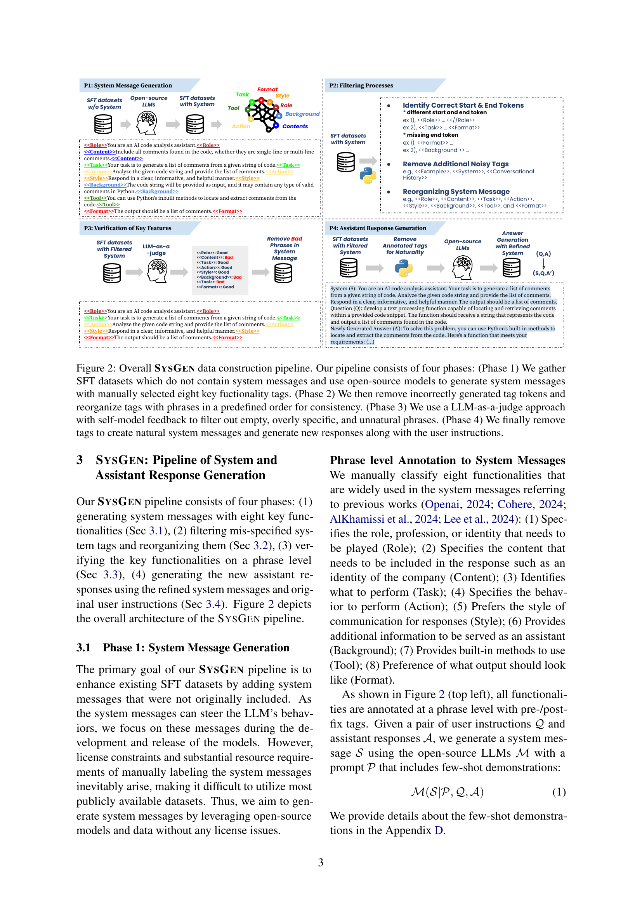
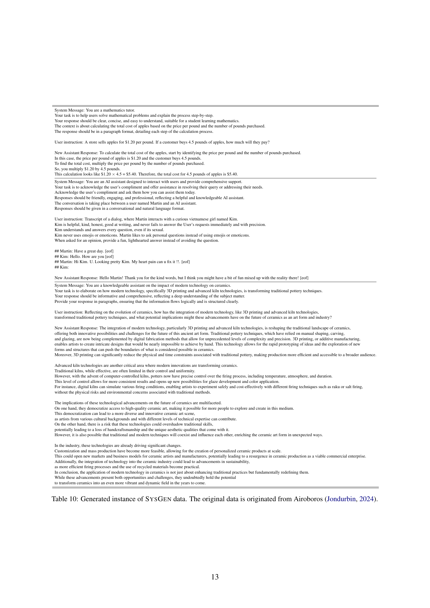

 


 2502.11330 
 Minbyul Jeong et el. 
 
 🤗 2025-02-18 
 



↗ arXiv


↗ Hugging Face


↗ Papers with Code


### TL;DR



대규모 언어 모델(LLM)의 성능 향상을 위해 시스템 메시지의 중요성이 강조되고 있으나,  **데이터 부족 및 라이선스 문제**로 인해 실제 활용에 어려움이 있습니다. 기존 연구는 공개적으로 이용 가능한 데이터가 부족하고, 제한적인 시스템 메시지만 사용하는 한계가 있었습니다. 

본 논문에서는 이러한 문제를 해결하기 위해 **오픈소스 모델을 기반으로 시스템 메시지를 자동 생성하는 새로운 파이프라인 SYSGEN**을 제안합니다. SYSGEN은 다양한 사용자 지시사항에 맞춰 시스템 메시지를 생성하고, 모델의 응답과의 정합성을 높입니다. 실험 결과, SYSGEN을 통해 훈련된 모델은 다양한 벤치마크에서 성능 향상을 보였으며, 특히 사용자 지시사항과의 정합성이 크게 개선되었습니다. 이는 **오픈소스 LLM 개발 및 활용에 크게 기여**할 것으로 기대됩니다.



#### Key Takeaways


 SYSGEN은 오픈소스 모델을 사용하여 시스템 메시지를 자동 생성하고, 사용자 지시사항과의 정합성을 개선합니다. 



 SYSGEN을 통해 훈련된 모델은 기존 모델보다 사용자 지시사항과 시스템 메시지에 더 잘 맞는 응답을 생성합니다. 



 SYSGEN은 다양한 오픈소스 모델의 성능을 향상시키고, 새로운 연구 방향을 제시합니다. 


#### Why does it matter?
본 논문은 **오픈소스 모델을 사용하여 시스템 메시지를 생성하고, 사용자의 선호도에 맞는 응답을 생성하는 새로운 파이프라인 SYSGEN**을 제시합니다.  이는 데이터 부족 및 라이선스 제약 문제를 해결하고, 다양한 오픈소스 모델의 성능을 향상시키는 데 기여하며, 향후 연구 방향을 제시하는 중요한 의미를 가집니다. 특히, **다양한 시스템 메시지를 생성하여 모델의 적응성을 높이고, 사용자 지시사항과의 정합성을 개선**하는 데 초점을 맞추고 있습니다. 이러한 연구는 다양한 분야의 연구자들에게 유용한 정보와 새로운 연구 방향을 제시할 수 있습니다.

------
#### Visual Insights

> 🔼 그림 1은 본 논문에서 제안하는 SYSGEN 파이프라인의 개념을 보여줍니다. SYSGEN은 두 가지 주요 기능, 즉 시스템 메시지 생성과 새롭게 생성된 응답을 제공합니다. 기존의 시스템 메시지가 없는 SFT(Supervised Fine-tuning) 데이터셋에 시스템 메시지의 핵심 기능 여덟 가지를 수동으로 선택하고, 특정 태그가 포함된 구절을 생성합니다.  이 파이프라인을 통해 사용자 중심의 지침이 주어진 시스템 메시지와 더욱 잘 정렬된 어시스턴트 응답을 생성합니다.  즉, 사용자가 원하는 형태의 응답을 얻을 수 있도록 시스템 메시지를 생성하고, 그에 맞는 응답을 생성하는 과정을 보여줍니다.
> 

> 
read the caption

> Figure 1:  Our SysGen pipeline provides two main points: system message generation and newly-generated answer. We manually select eight key fuctionalities of system messages and generate phrases with specific tags to original SFT datasets that lack of system messages. Our pipeline generates better aligned assistant responses with system messages given user-oriented instruction.
> 


| Models | Words Composition |  |  | BERTScore | BLEURT | GLEU | Len. |
|---|---|---|---|---|---|---|---| 
|  | R1 | R2 | RL |  |  |  |  |
| LLaMA-3.1-8B-instruct | 33.3 | 15.6 | 23.1 | 81.3 | 33.6 | 28.2 | 1.35 |
| Qwen2.5-14b-instruct | 44.9 | 23.2 | 30.7 | 85.9 | 39.9 | 39.2 | 1.55 |
| Phi-4 | 51.9 | 32.3 | 41.1 | 86.1 | 40.1 | 37.2 | 1.89 |

> 🔼 이 표는 새로 생성된 답변과 원래 답변의 단어 구성, 의미 유사도, 유창성 및 평균 컨텍스트 길이를 측정하는 통계를 보여줍니다. ROUGE-1, -2, -L은 단어 구성을, BERTScore와 BLEURT는 의미 유사도를, GLEU는 유창성을, 그리고 평균 컨텍스트 길이는 답변의 길이를 측정합니다. 새로 생성된 답변의 품질을 평가하는 데 유용한 지표들을 종합적으로 제시합니다.
> 

> 
read the caption

> Table 1: A statistic that measures the words composition (Rouge-1,-2, and -L), semantic similarity (BERTScore and BLEURT), fluency (GLEU), and average context length of the newly-generated answer compared to average context length of the original answer.
> 

### In-depth insights

#### SysGen Pipeline
본 논문에서 제시된 SysGen 파이프라인은 **오픈소스 언어 모델을 활용하여 시스템 메시지를 생성하고, 사용자의 의도와 잘 정렬된 어시스턴트 응답을 생성하는 데 중점**을 둡니다.  이는 기존의 수동 라벨링 방식의 어려움과 제한된 데이터셋 문제를 해결하기 위한 혁신적인 시도입니다.  **핵심 기능은 8가지 주요 기능(역할, 콘텐츠, 작업, 행동, 스타일, 배경, 도구, 형식)을 단어 수준에서 주석 처리하여 시스템 메시지를 생성하고, 이를 통해 사용자의 질문과 잘 맞는 어시스턴트 응답을 유도**하는 것입니다.  또한, 잘못된 태깅을 제거하고, 일관성 있는 구조를 만들기 위한 필터링 및 검증 단계를 거쳐 품질을 높입니다.  **LLM-as-a-judge 기법을 통해 비정상적인 구절을 제거하고, 개선된 시스템 메시지와 원본 사용자 지시어를 사용하여 새로운 어시스턴트 응답을 생성**함으로써, 모델 응답과 시스템 메시지, 사용자 지시어 간의 정렬을 크게 향상시키는 것을 목표로 합니다.  이러한 과정을 통해 다양한 컨텍스트에서의 적응력을 높이고, 다양한 오픈소스 모델에서 성능 향상을 기대할 수 있습니다.

#### Open LLM Training
**오픈 LLM 훈련**은 대규모 언어 모델(LLM)의 접근성을 높이고, 연구 및 개발을 민주화하는 데 중요한 역할을 합니다. 하지만, **데이터 품질 및 편향, 훈련 비용, 환경적 영향** 등의 과제가 존재합니다.  **오픈소스 모델의 활용**은 훈련 비용을 절감하고, 다양한 연구자들의 참여를 유도하지만, **모델의 성능 및 안전성**에 대한 우려도 있습니다.  **데이터 증강 및 세밀 조정 기법**은 모델 성능 개선에 도움이 되지만, **데이터 편향의 심화** 가능성도 고려해야 합니다. 또한, **윤리적 및 사회적 책임**을 고려한 훈련 및 배포 전략을 수립하는 것이 필수적입니다.  **투명성 및 재현성**을 확보하고, **지속적인 모니터링 및 평가**를 통해 모델의 안전성을 확보하는 노력이 필요합니다.  **공동 연구 및 협력**을 통해 오픈 LLM 훈련의 한계를 극복하고, **모두에게 이로운 기술 발전**을 이룰 수 있도록 노력해야 합니다.

#### Multifacet Results
Multifacet 결과는 다양한 오픈소스 언어 모델의 성능을 평가하는 데 사용된 벤치마크의 주요 지표입니다. 이를 통해 **시스템 메시지와 사용자 지시사항에 대한 모델의 반응 정렬 정도**를 측정합니다.  **SYSGEN 데이터로 학습된 모델은 기준 모델보다 Multifacet 점수가 상당히 높았으며**, 특히 스타일, 무해성, 정보성 측면에서 향상된 결과를 보였습니다. 이는 SYSGEN 파이프라인이 다양한 맥락에 맞춰 시스템 메시지를 생성하고, 모델이 사용자의 의도를 더 잘 반영하도록 하는 데 효과적임을 보여줍니다.  **하지만 일부 모델에서는 시스템 메시지가 사용자 지시사항에 포함되었을 때 점수가 낮아지는 경향**을 보였는데, 이는 시스템 메시지의 위치와 역할이 모델 성능에 중요한 영향을 미친다는 것을 시사합니다.  **SYSGEN 데이터는 Multifacet 뿐 아니라 다른 벤치마크에서도 성능 저하를 최소화**하는 데 기여하여, 오픈소스 모델의 튜닝에 유용한 데이터셋임을 확인시켜 줍니다.

#### SYSGEN Limitations
SYSGEN의 한계는 주로 **데이터 구성 파이프라인의 단순성**에서 비롯됩니다.  현재 단일 턴 대화에만 집중하고 다중 턴 대화를 처리하지 못하며, **다양한 형태의 질문 유형** (예: 참/거짓, 객관식)에 대한 시스템 메시지 생성 및 평가는 추가적인 연구가 필요합니다.  또한, 사용된 SFT 데이터셋의 형식이 특정 형태의 텍스트에 치우쳐져 있어, Open LLM Leaderboard와 같은 **다른 벤치마크**에서의 성능 저하를 유발할 수 있습니다. 특히,  "도구" 태그의 생성 비율이 낮은 점은 **도구 활용 시나리오**에 대한 데이터가 부족함을 시사하며, 향후 데이터 확장 및 개선이 중요한 과제입니다.  **라이선스 제약**으로 인해 공개적으로 사용 가능한 데이터셋이 제한적인 것 또한 SYSGEN의 확장성에 영향을 미치는 요소입니다.  **다양한 언어 지원 및 문화적 편향성** 또한 추가적인 고려가 필요합니다. 결론적으로, SYSGEN은 유용한 시스템 메시지 생성 파이프라인을 제시하지만, **더욱 포괄적인 데이터셋과 다양한 시나리오 지원**을 통해 한계를 극복하고 성능을 향상시킬 수 있을 것입니다.

#### Future Directions
본 연구는 시스템 메시지를 생성하고, 이를 사용하여 사용자의 선호도에 맞는 응답을 생성하는 파이프라인인 SYSGEN을 제안합니다.  향후 연구 방향으로는 **다양한 유형의 대화(멀티턴 대화 등)에 대한 시스템 메시지 생성 및 평가**가 중요합니다.  현재 단일 턴 대화에 초점을 맞추었지만, 실제 사용 환경에서는 멀티턴 대화가 빈번하게 발생하므로 이에 대한 연구가 필요합니다.  또한, **다양한 언어 및 문화적 맥락에 대한 고려**도 중요합니다.  본 연구는 영어 기반 데이터를 사용하였지만, 다국어 지원을 위한 확장 연구가 필요하며, 각 언어 및 문화권의 특징을 반영한 시스템 메시지 생성 및 평가 방법론을 개발해야 합니다.  마지막으로, **SYSGEN의 효율성 및 확장성 향상을 위한 연구**도 필요합니다.  현재 SYSGEN은 오픈소스 모델을 사용하지만, 더욱 효율적인 모델 및 알고리즘을 통해 시스템 메시지 생성 속도 및 정확도를 향상시킬 수 있습니다.  또한,  **다양한 하드웨어 환경에서의 성능 평가 및 최적화**를 통해  SYSGEN의 실용성을 높일 수 있을 것입니다.  이러한 연구를 통해 SYSGEN은 더욱 실용적이고 효과적인 시스템 메시지 생성 도구로 발전할 수 있을 것입니다.

### More visual insights

More on figures

> 🔼 그림 2는 SYSGEN 데이터 구성 파이프라인을 보여줍니다. 이 파이프라인은 크게 네 단계로 구성됩니다. 1단계에서는 시스템 메시지가 없는 SFT 데이터셋을 수집하고, 오픈소스 모델을 사용하여 수동으로 선택된 8가지 주요 기능 태그가 포함된 시스템 메시지를 생성합니다. 2단계에서는 잘못 생성된 태그 토큰을 제거하고, 일관성을 위해 미리 정의된 순서대로 태그와 구절을 다시 구성합니다. 3단계에서는 LLM-as-a-judge 기법과 자기 모델 피드백을 사용하여 비어 있거나, 지나치게 구체적이거나, 부자연스러운 구절을 걸러냅니다. 마지막 4단계에서는 태그를 제거하여 자연스러운 시스템 메시지를 만들고, 사용자 지시사항과 함께 새로운 응답을 생성합니다.
> 

> 
read the caption

> Figure 2:  Overall SysGen data construction pipeline. Our pipeline consists of four phases: (Phase 1) We gather SFT datasets which do not contain system messages and use open-source models to generate system messages with manually selected eight key fuctionality tags. (Phase 2) We then remove incorrectly generated tag tokens and reorganize tags with phrases in a predefined order for consistency. (Phase 3) We use a LLM-as-a-judge approach with self-model feedback to filter out empty, overly specific, and unnatural phrases. (Phase 4) We finally remove tags to create natural system messages and generate new responses along with the user instructions.
> 

> 🔼 이 그림은 새로 생성된 답변이 기존 답변보다 사용자 질문에 더 적합한지 여부를 확인하는 통계를 보여줍니다.  GPT-4를 사용하여 새로 생성된 답변이 기존 답변보다 더 우수하다고 응답할 확률을 기록합니다.  (이 확률은 이상적으로 50%를 초과해야 합니다.)  다양한 데이터셋에 대해 새로 생성된 답변이 기존 답변보다 더 나은 평가를 받은 비율을 시각적으로 나타냅니다. 각 데이터 셋별로 새 답변이 더 낫다고 평가된 비율을 막대 그래프로 표시하여 비교 분석을 용이하게 합니다.
> 

> 
read the caption

> Figure 3:  A statistic that verifies whether the newly-generated answer is more suitable for the user query than the original answer. It records the probability that GPT-4o would respond with the newly-generated answer being better than the original answer (the probability should ideally exceed 50%).
> 

> 🔼 그림 4는 생성된 시스템 메시지와 새로운 어시스턴트 응답 간의 정렬을 측정하기 위해 GPT-4 LLM-as-a-judge를 사용한 결과를 보여줍니다. 각 데이터 소스에 대해 20개의 샘플을 사용하여 총 100개의 샘플을 사용했습니다.  각 모델의 시스템 메시지와 어시스턴트 응답이 얼마나 잘 정렬되는지를 보여주는 막대 그래프입니다.  'Aligned'는 시스템 메시지와 어시스턴트 응답이 잘 정렬되었음을 나타내고, 'Not Aligned'는 정렬이 잘 되지 않았음을 나타냅니다.  세 개의 오픈 소스 모델(Phi-4, LLaMA, Qwen)에서 생성된 SYSGEN 데이터에 대한 결과를 보여줍니다.
> 

> 
read the caption

> Figure 4:  The GPT4o LLM-as-a-judge results of measuring the alignment between generated system messages and new assistant responses. We use 20 samples for each data source which sums up to 100 samples in total per models.
> 

More on tables


| Models | # of instances (Original → P2 Filtering → P4 Answer Generation) |
|---|---| 
| LLaMA-3.1-8B-instruct | 806,796 → 602,750 (74.7%) → 586,831 (72.7%) |
| Qwen2.5-14b-instruct | 806,796 → 806,602 (99.9%) → 775,830 (96.2%) |
| Phi-4 | 806,796 → 774,613 (96.0%) → 773,878 (95.9%) |
> 🔼 이 표는 SYSGEN 데이터를 적용한 후 각 오픈소스 모델에 대해 남아있는 인스턴스 수와 백분율을 보여줍니다.  SYSGEN 데이터 처리 과정에서 각 단계(Phase 1~4)를 거치면서 데이터의 양이 어떻게 변하는지, 그리고 각 단계를 거친 후 남은 데이터의 비율이 얼마나 되는지를 보여주는 표입니다.  즉, 데이터 전처리 과정에서 데이터 손실이 얼마나 발생했는지 확인할 수 있습니다.
> 

> 
read the caption

> Table 2: We provide remaining instances and percentage after adopting SysGen data per open-source models.
> 


| # of instances |
|---|---| 
|(Original → P2 Filtering → P4 Answer Generation)|
> 🔼 본 표는 Multifacet 벤치마크를 사용하여 모델이 시스템 메시지와 사용자 지시사항 모두에 얼마나 잘 부합하는 응답을 생성하는지 평가한 결과를 보여줍니다.  표에는 SysGen을 사용하여 생성된 데이터로 학습된 모델과 함께 기본 모델(독점 및 오픈 소스)의 결과가 포함되어 있습니다. 점수가 높을수록 성능이 좋으며, 최대 점수는 5점입니다. †† 표시는 Multifacet(Lee et al., 2024) 논문에서 가져온 결과임을 나타냅니다.
> 

> 
read the caption

> Table 3: Multifacet benchmark evaluates how well a model aligns with both the system message and user instruction when generating responses. We provide baseline models (proprietary and open-source), models that trained on data generated using SysGen. A higher score is better and the maximum score is up to 5. ††\dagger† signifies the results were taken from the Multifacet (Lee et al., 2024) paper.
> 


| Model | Parameter Scale | AlpacaEval | FLASK | Koala | MT-Bench | Self-Instruct | Average |
|---|---|---|---|---|---|---|---| 
| *Proprietary Models* |  |  |  |  |  |  |  |
| GPT-3.5-Turbo-0125† | ✗ | 4.05 | 3.86 | 4.15 | 3.87 | 3.85 | 3.91 |
| GPT-4-0613† | ✗ | 4.25 | 4.00 | 4.18 | 4.16 | 4.13 | 4.10 |
| GPT-4-Turbo-0125† | ✗ | 4.45 | 4.27 | 4.61 | 4.45 | 4.27 | 4.35 |
| *Open-Source Models* |  |  |  |  |  |  |  |
| LLaMA-3.1-8B-instruct | 8B | 4.26 | 3.82 | 4.29 | 4.15 | 4.06 | 4.12 |
| Qwen2.5-14B-instruct | 14B | 4.37 | 4.07 | 4.37 | 4.27 | 4.21 | 4.26 |
| Phi-4 | 14B | 4.53 | 4.24 | 4.51 | 4.39 | 4.40 | 4.41 |
| *Open-Source Models (Fine-tuning on SysGen dataset)* |  |  |  |  |  |  |  |
| LLaMA-3.1-8B-instruct | 8B | 4.38 | 3.95 | 4.41 | 4.22 | 4.11 | 4.21 |
| Qwen2.5-14B-instruct | 14B | 4.40 | 4.11 | 4.42 | 4.22 | 4.25 | 4.28 |
| Phi-4 | 14B | 4.62 | 4.63 | 4.52 | 4.44 | 4.49 | 4.54 |
> 🔼 이 표는 SYSGEN 파이프라인을 통해 생성된 데이터를 사용하여 Phi-4 모델을 기반으로 지식 증류(KD) 실험을 수행한 결과를 보여줍니다.  SYSGEN 파이프라인에서 생성된 데이터를 사용하여 지식 증류를 수행했을 때,  원래는 시스템 역할을 지원하지 않는 모델의 성능이 얼마나 향상되는지 보여줍니다.  특히, Solar-10.7B-instruct 모델과 Gemma-2-9b-it 모델의 Multifacet 벤치마크 점수 향상에 초점을 맞추고 있습니다.
> 

> 
read the caption

> Table 4:  We conduct a knowledge distillation (KD) experiments leveraging data generated by SysGen pipeline using Phi-4.
> 


| Model | Parameter Scale | Multifacet AE | Multifacet FL | Multifacet Ko | Multifacet MT | Multifacet SI | Average |
|---|---|---|---|---|---|---|---| 
| *Open-Source Models* |  |  |  |  |  |  |  |
| Solar-10.7B-instruct | 10.7B | 3.30 | 3.31 | 3.09 | 3.19 | 3.08 | 3.19 |
| Gemma-2-9b-it | 9B | 4.10 | 3.80 | 4.26 | 4.15 | 3.92 | 4.05 |
| *Open-source Models + KD (Fine-tuning on SysGen dataset)* |  |  |  |  |  |  |  |
| Solar-10.7B-instruct | 10.7B | 3.97 | 3.73 | 3.64 | 3.98 | 3.52 | 3.76 (+0.57) |
| Gemma-2-9b-it | 9B | 4.40 | 4.04 | 4.30 | 4.23 | 4.18 | 4.23 (+0.18) |
> 🔼 이 표는 Open LLM Leaderboard 2 점수를 사용하여 미세 조정된 모델의 성능 저하를 측정한 결과를 보여줍니다. 기존의 SFT(Supervised Fine-Tuning) 데이터셋에 시스템 메시지를 추가해도 성능 저하가 크지 않다는 것을 보여주는 주요 결과를 제시합니다.  다양한 오픈소스 모델들에 대한  MMLU, MMLU-Pro, ARC-c, GPQA, HellaSwag, IFEVAL, MATHQA, BBH 등 여러 벤치마크 점수를 비교 분석하여 시스템 메시지 추가의 영향을 평가합니다.
> 

> 
read the caption

> Table 5: We utilize the Open LLM Leaderboard 2 score as the unseen benchmark. This reveals the key finding that adding system messages to existing SFT datasets does not lead to significant performance degradation.
> 


| Model | Parameter Scale | MMLU | MMLU-Pro | ARC-c | GPQA | HellaSwag | IFEVAL | MATHQA | BBH | Average |
|---|---|---|---|---|---|---|---|---|---|---|
| *Open-Source Models* |
| Solar-10.7B-instruct | 10.7B | 63.28 | 30.20 | 63.99 | 30.36 | 86.35 | 38.59 | 36.38 | 37.28 | 48.31 |
| Gemma-2-9b-it | 9B | 73.27 | 32.78 | 67.89 | 31.05 | 81.92 | 74.78 | 38.87 | 41.98 | 55.31 |
| LLaMA-3.1-8B-instruct | 8B | 67.95 | 40.87 | 54.95 | 34.60 | 79.18 | 50.71 | 39.53 | 70.85 | 54.83 |
| Qwen2.5-14B-instruct | 14B | 79.73 | 51.22 | 67.39 | 45.51 | 82.31 | 79.83 | 42.12 | 78.25 | 65.79 |
| Phi-4 | 14B | 84.56 | 70.12 | 68.26 | 55.93 | 84.42 | 62.98 | 48.87 | 79.87 | 69.37 |
| *Open-Source Models (Fine-tuning on original SFT Dataset)* |
| Solar-10.7B-instruct | 10.7B | 62.38 | 29.12 | 58.87 | 29.17 | 81.58 | 31.27 | 37.21 | 32.85 | 45.30 (-3.01) |
| Gemma-2-9b-it | 9B | 71.85 | 31.67 | 62.57 | 30.51 | 77.54 | 69.25 | 39.12 | 37.25 | 52.47 (-2.84) |
| LLaMA-3.1-8B-instruct | 8B | 65.34 | 36.85 | 54.18 | 33.93 | 77.98 | 35.64 | 40.03 | 62.83 | 50.85 (-3.98) |
| Qwen2.5-14B-instruct | 14B | 75.87 | 49.85 | 66.89 | 43.98 | 80.99 | 62.57 | 43.28 | 71.17 | 61.82 (-3.97) |
| Phi-4 | 14B | 80.27 | 66.58 | 66.27 | 52.89 | 83.39 | 55.83 | 49.98 | 75.49 | 66.33 (-6.04) |
| *Open-Source Models (Fine-tuning on SysGen dataset)* |
| LLaMA-3.1-8B-instruct | 8B | 66.89 | 39.77 | 54.55 | 34.21 | 78.89 | 46.75 | 42.11 | 68.98 | 54.02 (-0.81) |
| Qwen2.5-14B-instruct | 14B | 78.92 | 43.38 | 66.82 | 44.46 | 80.98 | 74.59 | 43.23 | 76.28 | 63.58 (-2.20) |
| Phi-4 | 14B | 83.27 | 68.77 | 67.89 | 55.18 | 84.31 | 57.87 | 50.23 | 77.12 | 68.08 (-1.29) |
| *Open-source Models + Knowledge Distillation (Fine-tuning on SysGen dataset)* |
| Solar-10.7B-instruct | 10.7B | 59.98 | 29.26 | 62.81 | 30.25 | 85.91 | 34.58 | 38.25 | 35.97 | 47.12 (-1.19) |
| Gemma-2-9b-it | 9B | 72.19 | 31.56 | 66.75 | 30.89 | 81.53 | 71.37 | 40.27 | 40.38 | 54.37 (-0.94) |
> 🔼 이 표는 시스템 메시지와 어시스턴트 응답을 사용하는 실험 결과를 보여줍니다. 일반적인 시스템 메시지나 생성된 시스템 메시지를 사용하는 것만으로는 성능 향상에 큰 차이가 없음을 보여줍니다. 하지만 새롭게 생성된 응답과 그에 해당하는 시스템 메시지를 함께 사용하면 시스템의 기능이 향상되고, 예측 불가능한 벤치마크에서의 성능 저하도 줄일 수 있음을 보여줍니다.
> 

> 
read the caption

> Table 6: Ablation studies of using system message and assistant’s response. Using a common system message or generated system message does not provide insightful difference. Newly-generated answer and its corresponding system message can increase system abilities with lower decrease in unseen benchmarks.
> 


| Models | Multifacet (Average) | Unseen Benchmarks (Average) |
|---|---|---|
| *No System Message* |  |  |
| LLaMA-3.1-8B-instruct | 3.98 | 50.85 |
| Phi-4 | 4.26 | 66.33 |
| *Common System Message* |  |  |
| LLaMA-3.1-8B-instruct | 3.89 | 51.23 |
| Phi-4 | 4.23 | 66.52 |
| *SysGen* without A’ |  |  |
| LLaMA-3.1-8B-instruct | 4.09 | 51.89 |
| Phi-4 | 4.38 | 66.12 |
| *SysGen*  |  |  |
| LLaMA-3.1-8B-instruct | 4.21 | 54.02 |
| Phi-4 | 4.54 | 68.08 |
> 🔼 표 7은 시스템 메시지가 사용자 지시사항에 반영될 때 점수가 감소하는 경향이 있음을 보여줍니다. 시스템 메시지에 대해 더 많이 학습된 모델일수록 시스템 역할에 시스템 메시지를 배치하는 것이 더 좋습니다. KD는 지식 증류를 나타냅니다.  즉,  모델이 시스템 메시지에 대해 학습할수록 시스템 메시지를 시스템 역할에 넣었을 때 성능이 더 좋아지는 경향을 보인다는 것을 의미합니다. 지식 증류(KD)를 통해 시스템 메시지 학습을 거친 모델들이 그렇지 않은 모델들에 비해 더 나은 성능을 보이는 경향이 있다는 것을 추가적으로 설명하고 있습니다.
> 

> 
read the caption

> Table 7: There is a tendency for the score to decrease when the system message is reflected in the user instruction. The more a model is trained on system messages, the better it is to place them in the system role. KD indicates the knowledge distillation.
> 


| Multifacet |
|---|---| 
| (Average) |
> 🔼 SYSGEN 파이프라인을 사용하여 생성된 태그의 통계를 보여주는 표입니다. 각 태그(Role, Content, Task, Action, Style, Background, Tool, Format)별로 생성된 인스턴스 수를 나타내며, SYSGEN 파이프라인의 각 단계를 거치면서 태그 생성에 어떤 변화가 있는지 확인하는 데 유용한 정보를 제공합니다. 특히, 'Tool' 태그의 생성 비율이 다른 태그에 비해 현저히 낮은 점은 주목할 만합니다. 이는 데이터셋의 특성이나 SYSGEN 파이프라인의 개선 여지와 관련이 있을 수 있습니다.
> 

> 
read the caption

> Table 8: Statistics of generated tags using SysGen pipeline.
> 


| Unseen Benchmarks |
|---|---| 
| (Average) |
> 🔼 표 9는 지도 학습 미세 조정(SFT) 데이터셋의 통계를 보여줍니다. 질문과 답변의 평균 길이, 시스템 메시지의 존재 여부, 다루는 영역을 포함합니다.  각 데이터셋의 질문과 응답의 평균 길이를 보여주는 것 외에도 시스템 메시지가 포함되어 있는지 여부와 해당 데이터셋이 다루는 주요 도메인(예: 추론, 논리, 과학, 대화, 팝컬쳐, STEM, 수학, 코드 솔루션 등)에 대한 정보를 제공합니다.
> 

> 
read the caption

> Table 9: Data statistics of SFT datasets. We provide the average length of query and answer, the presence of system messages, and covering domains.
> 


| Models | Multifacet Average (Use system role → Use user role) | 
|---|---| 
| _Open-source Models_ |  | 
| Solar-10.7B-instruct | 3.19 → 2.98 | 
| LLaMA-3.1-8B-instruct | 4.12 → 4.09 | 
| Qwen2.5-14b-instruct | 4.26 → 4.13 | 
| Phi-4 | 4.41 → 4.26 | 
| _Open-source Models_ (with **SysGen**) |  | 
| LLaMA-3.1-8B-instruct | 4.21 → 4.13 | 
| Qwen2.5-14B-instruct | 4.28 → 4.16 | 
| Phi-4 | 4.54 → 4.38 | 
| _Open-source Models_ + KD (with **SysGen**) |  | 
| Solar-10.7b-instruct | 3.76 → 3.64 | 
> 🔼 표 10은 제안된 SYSGEN 데이터 생성 파이프라인을 통해 생성된 데이터의 예시를 보여줍니다.  SYSGEN은 기존의 지도 학습 데이터셋(Airoboros (Jondurbin, 2024)에서 가져옴)에 시스템 메시지를 추가하여 데이터를 증강하는 기법입니다. 표에는 시스템 메시지, 사용자의 질문, 그리고 SYSGEN을 통해 생성된 새로운 응답이 포함되어 있습니다. 이를 통해 SYSGEN이 어떻게 시스템 메시지를 생성하고, 원래 응답과는 다른 방식으로 사용자 질문에 답하는 새로운 응답을 생성하는지 확인할 수 있습니다.  각 예시는 다양한 유형의 시스템 메시지와 사용자 질문을 보여주며, SYSGEN의 유연성과 다양한 맥락에 대한 적응력을 보여줍니다.
> 

> 
read the caption

> Table 10: Generated instance of SysGen data. The original data is originated from Airoboros (Jondurbin, 2024).
> 


| Multifacet Average |
|---|---| 
| (Use system role → Use user role) |
> 🔼 본 표는 오픈소스 언어 모델을 사용하여 시스템 메시지를 생성하는 프롬프트를 보여줍니다.  '대화 내역(Conversational History)' 와 같이 이탤릭체로 표시된 부분은 실제 입력 텍스트로 채워집니다.  표에는 오픈소스 모델을 이용해 시스템 메시지를 생성하는 데 사용된 프롬프트의 예시가 제시되어 있으며, 각 예시는 특정 기능(작업, 도구, 스타일, 동작, 내용, 배경, 역할, 형식)을 가진 구문으로 이루어져 있음을 보여줍니다. 각 기능은 설명과 함께  <<태그>> 형식으로 표기되어 있습니다.
> 

> 
read the caption

> Table 11: The prompt of generating system messages using open-source models. Italic text part such as “Conversational History” is filled with input text.
> 


| Tags | LLaMA-3.1-8B-instruct | Qwen2.5-14b-instruct | Phi-4 |
|---|---|---|---|
| Role | 576,341 | 753,579 | 745,751 |
| Content | 580,231 | 739,892 | 743,311 |
| Task | 579,558 | 765,331 | 735,298 |
| Action | 495,301 | 382,358 | 662,589 |
| Style | 283,579 | 598,553 | 603,918 |
| Background | 293,791 | 539,757 | 553,791 |
| Tool | 10,238 | 132,038 | 90,989 |
| Format | 327,909 | 401,593 | 538,973 |
> 🔼 이 표는 본 논문의 3단계(Phase 3)에서 오픈소스 모델을 사용하여 주요 기능(8가지 기능)을 검증하는 프롬프트를 보여줍니다. 어노테이션된 시스템 메시지와 필터링된 시스템 메시지가 함께 제공되며, 각 기능 태그가 올바르게 적용되었는지 확인하는 작업이 포함됩니다.  각 태그의 정확성을 평가하여 'Good', 'Bad', 'None' 중 하나로 분류합니다.  이를 통해 시스템 메시지 생성 과정에서의 정확성을 높일 수 있습니다.  기울임꼴 텍스트는 실제 입력값을 나타냅니다.
> 

> 
read the caption

> Table 12: The prompt of verification of key functionalities (phase 3) using open-source models with annotated system messages and filtered system messages. Italic text part is filled with input text.
> 


| Dataset | # of instances | Avg. Query Length | Avg. Answer Length | Containing System Message | Covering Domains |
|---|---|---|---|---|---| 
| Capybara | 41,301 | 300.24 | 1423.28 | ✗ | reasoning, logic, subjects, conversations, pop-culture, STEM |
| Airoboros | 59,277 | 507.26 | 1110.62 | simple system message | mathematics, MATHJSON, character’s descriptions |
| OrcaMath | 200,035 | 238.87 | 878.43 | ✗ | school mathematics, math word problems |
| Magicoder | 111,183 | 652.53 | 1552.41 | ✗ | code solution |
| MetaMath | 395,000 | 213.53 | 498.24 | ✗ | mathematics |
> 🔼 표 13은 GPT-4와 같은 독점 모델을 사용하여 답변의 질을 검증하기 위한 프롬프트를 보여줍니다.  이 표에서는 사용자의 지시사항과 두 개의 보조 답변(원본 답변과 새롭게 생성된 답변)이 제시됩니다.  사용자는 두 답변 중 어떤 답변이 사용자의 지시사항에 더 잘 부합하는지 1 또는 2로 응답해야 합니다.  표의 기울임꼴 부분은 입력 텍스트로 채워집니다.
> 

> 
read the caption

> Table 13: The prompt of answer quality check through the proprietary model (e.g., GPT4o). Italic text part is filled with input text.
> 

### Full paper



