 


 2502.11336 
 Ryuto Koike et el. 
 
 🤗 2025-02-18 
 



↗ arXiv


↗ Hugging Face


↗ Papers with Code


### TL;DR



대규모 언어 모델(LLM)이 생성한 텍스트를 인간이 작성한 텍스트와 구별하는 것은 학계와 산업계 모두에서 중요한 문제입니다. 잘못된 판별은 학생의 학업적 명예 실추, 작가의 직업 상실 등 심각한 결과를 초래할 수 있습니다. 기존의 탐지기는 이진 분류 결과만을 제공하여 판단 근거를 이해하기 어렵다는 한계가 있습니다. 

본 논문에서는 이러한 문제를 해결하기 위해 ExaGPT라는 새로운 탐지기를 제시합니다.  ExaGPT는 인간이 텍스트의 출처를 판별하는 방식을 모방하여, **데이터 저장소에 있는 인간이 작성한 텍스트와 LLM이 생성한 텍스트 중 어느 쪽과 더 유사한 구간을 많이 공유하는지**를 확인합니다.  이를 통해 텍스트의 각 구간에 대한 증거로 유사한 구간을 제시하여, 사용자가 판단의 신뢰성을 쉽게 평가할 수 있도록 합니다.  **동적 계획법(Dynamic Programming)**을 사용하여 최적의 구간 분할을 수행하여 사용자 이해도를 높였습니다.



#### Key Takeaways


 ExaGPT는 인간의 의사결정 과정을 기반으로 LLM 생성 텍스트를 감지하는 새로운 해석 가능한 방법을 제시합니다. 



 ExaGPT는 기존 방법보다 최대 40.9% 향상된 정확도를 달성했습니다. 



 사용자 평가 결과, ExaGPT는 기존 해석 가능한 방법보다 판단 정확도 향상에 더 효과적임을 보였습니다. 


#### Why does it matter?
본 논문은 **LLM이 생성한 텍스트를 사람이 이해할 수 있도록 판별하는 새로운 방법**을 제시하여, 기존 방법의 해석성 문제를 해결하고 정확도를 높였습니다.  이는 **LLM의 오용 방지 및 신뢰도 향상**에 크게 기여하며, 관련 분야 연구에 중요한 발전을 가져올 것입니다.  특히 **설명 가능한 AI** 및 **인간-컴퓨터 상호 작용** 연구에 시사하는 바가 큽니다.

------
#### Visual Insights

> 🔼 이 그림은 사람이 쓴 텍스트와 LLM이 생성한 텍스트를 구별하는 방법을 보여줍니다.  핵심 아이디어는 분석 대상 텍스트가 어떤 종류의 텍스트와 더 유사한 구간(verbatim overlaps 및 의미상 유사한 구간 포함)을 더 많이 공유하는지 조사하는 것입니다.  만약 분석 대상 텍스트가 사람이 쓴 텍스트와 더 유사한 구간을 많이 공유한다면 사람이 작성한 것으로 판단하고, LLM이 생성한 텍스트와 더 유사한 구간을 많이 공유한다면 LLM이 생성한 것으로 판단합니다. 그림에서는 질문표시(?)를 통해 어떤 종류의 텍스트인지 확인하는 과정을 시각적으로 표현하고 있습니다.
> 

> 
read the caption

> Figure 1: Identifying the author of a text (human vs. LLM) by examining if it shares more similar spans, including verbatim overlaps and semantically similar spans, with human-written vs. LLM-generated texts.
> 


| Detector | ACC. of Human Judgements (%) ↑ | 
|---|---| 
| RoBERTa | 47.9 | 
| LR-GLTR | 57.3 | 
| DNA-GPT | 53.1 | 
| ExaGPT | **61.5** |

> 🔼 이 표는 기존의 탐지기와 ExaGPT를 비교하여 증거에 기반한 탐지 정확성에 대한 사람의 판단 정확도(ACC.)를 보여줍니다.  더 높은 정확도는 탐지기가 사용자에게 더 해석 가능한 증거를 제공함을 의미합니다.  즉, 사람들이 제시된 증거를 보고 탐지 결과의 정확성을 판단하는 데 있어 ExaGPT가 얼마나 효과적인지를 보여주는 지표입니다.
> 

> 
read the caption

> Table 1: Comparison of the accuracy (ACC.) of human judgments on the correctness of detections based on evidence across baseline detectors and ExaGPT. Higher accuracy implies that the detector provides more interpretable evidence to users.
> 

### In-depth insights

#### Interpretable LLM Detect
**해석 가능한 LLM 탐지는 LLM이 생성한 텍스트를 인간이 이해할 수 있는 방식으로 식별하는 기술**입니다. 이는 단순히 텍스트의 기원을 분류하는 것 이상으로, 그 결정의 이유를 설명하고 사용자가 신뢰도를 판단할 수 있도록 증거를 제공하는 것을 의미합니다. 기존의 LLM 탐지기는 이러한 해석 가능성이 부족하여 오류 발생 시 사용자의 신뢰도 저하 및 잘못된 판단으로 이어질 수 있습니다. 따라서 **해석 가능한 LLM 탐지는 AI 기술의 윤리적 사용과 신뢰도 향상에 필수적**입니다.  **유사한 구절 비교를 통한 탐지 방식**은 해석 가능성을 높이는 유용한 방법으로, 인간의 판단 과정을 모방하여 신뢰도 높은 결과를 제공할 수 있습니다.  하지만, 이는 컴퓨팅 자원 소모가 크고, 데이터 셋의 편향성 문제 해결 등 추가적인 연구가 필요합니다.  **데이터셋의 품질과 균형, 탐지 알고리즘의 정확성과 효율성**을 높이는 연구는 해석 가능한 LLM 탐지 기술의 발전에 중요한 역할을 할 것입니다.

#### ExaGPT Methodology
ExaGPT의 방법론은 **인간의 의사결정 과정을 모방**하여 텍스트의 출처를 확인하는 데 중점을 둡니다.  핵심은 인간 작성 텍스트와 LLM 생성 텍스트 데이터 저장소를 이용하여, **대상 텍스트와 유사한 구간(span)을 찾고 비교**하는 것입니다.  **동적 계획법(dynamic programming)**을 통해 최적의 구간 분할을 수행하고, 각 구간에 대한 유사 구간 예시를 증거로 제시하여 사용자의 판단을 돕는 것이 특징입니다.  **k-NN 검색**을 활용한 유사 구간 탐색, **길이 점수(length score)와 신뢰도 점수(reliability score)**를 결합한 예측 점수 산정 등이 포함되며, 이를 통해 기존 방법론보다 **해석 가능성과 정확도를 향상**시키는 것을 목표로 합니다.  본 방법론은 인간의 직관적인 판단 과정과 잘 맞아떨어지도록 설계되어 있으며, 이는 사용자가 AI 생성 텍스트 여부에 대한 판단 근거를 쉽게 이해하고 신뢰도를 평가하는 데 큰 도움을 줄 것으로 예상됩니다.

#### Human Evaluation
본 논문에서 인간 평가는 **LLM 탐지기의 해석 가능성을 측정**하기 위해 사용되었습니다.  참가자들은 탐지기가 제공하는 증거를 바탕으로 탐지 결과의 정확성을 판단했습니다.  **ExaGPT는 기존 방법보다 더 높은 정확도**를 보였는데, 이는 ExaGPT가 사용자에게 더 나은 해석 가능한 증거를 제공한다는 것을 의미합니다.  **인간 평가의 결과는 ExaGPT의 주요 강점 중 하나**이며, LLM 탐지 분야에서 해석 가능성의 중요성을 강조합니다.  **실제 사용 환경에서의 오류 최소화**에 중요한 역할을 하며, **사용자 신뢰도 향상**에 기여할 수 있다는 점을 시사합니다.  하지만, **인간의 주관적인 판단이 개입**되었다는 점과 **전문가 집단에 국한**된 평가라는 점은 한계로 지적될 수 있습니다.

#### ExaGPT Limitations
ExaGPT는 훌륭한 성능을 보이지만, 몇 가지 제한점이 있습니다. **계산 비용**이 높은데, 이는 대용량 데이터 저장소에서 유사한 구절을 검색하는 데 많은 연산 자원이 필요하기 때문입니다.  **데이터 편향** 또한 문제입니다. 학습 데이터의 편향성으로 인해 특정 유형의 텍스트에 대해서는 성능이 저하될 수 있습니다.  **인간 판단의 주관성**도 고려해야 할 요소입니다.  ExaGPT의 해석 가능성 평가에 사용된 인간 평가는 주관적일 수 있으며, 전문가가 아닌 사용자의 판단과는 다를 수 있습니다. 따라서 이러한 제한점들을 고려하여 ExaGPT를 사용하고 해석하는 것이 중요합니다.  **데이터 크기의 영향** 또한 간과할 수 없습니다. 데이터 크기가 성능에 영향을 미치는 것으로 나타났기 때문에,  **최적의 데이터 크기**를 찾는 것은 앞으로의 연구 과제입니다.  향후 연구에서는 이러한 제한점들을 보완하고, 더욱 효율적이고 견고하며, 일반화된 모델을 개발하는 데 집중해야 합니다.

#### Future Research
본 논문에서 제시된 ExaGPT는 LLM 생성 텍스트 탐지를 위한 해석 가능하고 성능이 우수한 접근 방식이지만, **향후 연구는 몇 가지 중요한 방향**으로 나아갈 수 있습니다. 첫째, **다양한 도메인과 생성기**에 대한 ExaGPT의 **범용성을 더욱 높이는 연구**가 필요합니다. 현재 연구는 특정 도메인과 생성기에 국한되어 있으므로, 더욱 광범위한 데이터셋을 사용하여 모델의 견고성을 강화하는 것이 중요합니다. 둘째, **계산 비용을 줄이기 위한 효율적인 알고리즘** 개발이 필요합니다. ExaGPT는 유사한 구절을 검색하는 과정에서 상당한 계산 비용이 발생하므로, 더욱 효율적인 검색 및 비교 알고리즘을 개발하여 실용성을 높여야 합니다. 셋째, **인간 평가자의 주관성을 최소화**하기 위한 더욱 엄밀한 평가 기준을 마련해야 합니다. 현재 연구는 소수의 인간 평가자에 의존하고 있으므로, 더욱 신뢰할 수 있는 평가 결과를 얻기 위한 노력이 필요합니다. 넷째, **ExaGPT의 설명 가능성을 더욱 향상**시키는 연구가 필요합니다. 현재 ExaGPT는 유사한 구절을 제시하여 설명 가능성을 높였지만, 더욱 직관적이고 이해하기 쉬운 설명 방식을 개발하는 것이 중요합니다. 마지막으로, **다국어 지원**을 위한 확장 연구가 필요합니다. ExaGPT의 다국어 지원을 통해 더욱 광범위한 사용자에게 유용한 도구가 될 수 있을 것입니다.

### More visual insights

More on figures

> 🔼 그림 2는 ExaGPT의 개요를 보여줍니다. ExaGPT는 데이터 저장소에 있는 사람이 작성한 텍스트와 LLM이 생성한 텍스트 중 어느 쪽과 더 유사한 구간을 공유하는지 검사하여 텍스트의 작성자를 식별합니다.  이 과정에서 텍스트의 각 구간에 대한 유사 구간 예시를 제공하여 사용자가 결정의 정확성을 판단하는 데 도움을 줍니다.  데이터 저장소는 인간이 작성한 텍스트와 LLM이 생성한 텍스트의 n-gram 구간으로 구성되며,  ExaGPT는 이러한 구간들을 임베딩 공간에 매핑하고 유사도를 계산하여 가장 유사한 k개의 구간을 찾습니다. 이러한 유사 구간들은 해당 텍스트 구간의 작성자를 예측하는 데 사용되며,  최종적인 작성자 예측(인간 또는 LLM)은 모든 구간의 예측 결과를 종합하여 결정됩니다.
> 

> 
read the caption

> Figure 2: Overview of ExaGPT. It detects the author of a text by examining whether the text shares more similar spans with human-written texts vs. with LLM-generated texts from a datastore.
> 

> 🔼 그림 3은 ExaGPT의 사용자 인터페이스를 보여줍니다. 텍스트 구간 위에 마우스를 올리면 해당 구간과 유사한 구간들을 보여주는 툴팁이 나타납니다. 툴팁에는 각 유사 구간의 유사도 점수와 원래 레이블 분포가 함께 표시됩니다.  사용자는 이 정보를 통해 ExaGPT의 판단 근거를 이해하고 판단의 신뢰성을 평가할 수 있습니다.
> 

> 
read the caption

> Figure 3: User interface of ExaGPT. Hovering over a text span displays the tooltip about the retrieved similar spans each with the similarity to the span and the original label distribution.
> 

> 🔼 그림 4는 ExaGPT의 정확한 예측과 잘못된 예측에서 각각 길이가 10 토큰 이상인 긴 구간(n ≥ 10)의 신뢰도 점수 분포를 보여줍니다.  정확한 예측의 경우 잘못된 예측보다 신뢰도 점수가 높은 긴 구간이 더 많이 포함되어 있음을 시각적으로 보여줍니다. 이는 ExaGPT가 긴 구간과 높은 신뢰도 점수를 사용하여 예측의 정확도를 높이는 데 기여함을 시사합니다.
> 

> 
read the caption

> Figure 4: Reliability score distributions of long spans (n ≥\geq≥ 10) in correct and incorrect samples of ExaGPT, respectively.
> 

> 🔼 그림 5는 ExaGPT의 검출 성능에 대한 α(알파) 매개변수의 영향을 보여줍니다.  α는 동적 계획법 알고리즘에서 길이 점수와 신뢰도 점수 사이의 상대적 기여도를 결정하는 보간 계수입니다. 이 그림은 ChatGPT 생성기를 사용하여 네 가지 도메인(위키피디아, 레딧, 위키하우, 아카이브)에서 AUROC(수신기 조작 특성 곡선 아래 면적)와 1% FPR(위양성률)에서의 정확도를 포함한 ExaGPT의 검출 성능을 보여줍니다.  다양한 α 값에 따른 AUROC와 1% FPR에서의 정확도 변화를 통해 α 매개변수가 ExaGPT의 성능에 미치는 영향을 분석하고 최적의 α 값을 결정하는 데 도움이 됩니다.
> 

> 
read the caption

> Figure 5: Impact of α𝛼\alphaitalic_α on the detection performance of ExaGPT, including the AUROC and the accuracy at 1% FPR, across four domains using ChatGPT as a generator.
> 

> 🔼 그림 6은 ExaGPT의 성능에 미치는 데이터 저장소 크기의 영향을 보여줍니다.  ChatGPT를 생성기로 사용하여 네 가지 도메인에서 AUROC와 1% FPR에서의 정확도를 포함하여 측정했습니다. 데이터 저장소의 크기가 커짐에 따라 ExaGPT의 AUROC와 1% FPR에서의 정확도가 향상되는 것을 보여줍니다. 이는 더 많은 데이터가 모델의 성능 향상에 도움이 된다는 것을 시사합니다.
> 

> 
read the caption

> Figure 6: Effect of the datastore size on the detection performance of ExaGPT, including the AUROC and the accuracy at 1% FPR, across four domains using ChatGPT as a generator.
> 

> 🔼 그림 7은 SHAP(SHapley Additive exPlanations)을 사용하여 RoBERTa 모델의 예측 결과를 설명하는 방법을 보여줍니다. 그림은 텍스트의 각 단어 또는 구절이 모델의 최종 예측에 얼마나 기여하는지 시각적으로 보여줍니다. 빨간색으로 표시된 부분은 모델이 LLM(Large Language Model)이 생성한 텍스트라고 예측하는 데 기여한 부분이고, 파란색은 사람이 작성한 텍스트라고 예측하는 데 기여한 부분을 나타냅니다. 각 색상의 진하기는 기여도의 크기를 나타냅니다. 마우스를 색상이 있는 부분 위에 올려놓으면 해당 부분이 예측에 얼마나 기여했는지 수치로 확인할 수 있습니다.  이를 통해 사용자는 모델의 예측 결과에 대한 근거를 이해하고 신뢰도를 판단하는 데 도움을 받을 수 있습니다.
> 

> 
read the caption

> Figure 7: Example of evidence by RoBERTa with SHAP.
> 

> 🔼 그림 8은 LR-GLTR이 제시하는 검출 결과에 대한 증거의 예시를 보여줍니다. LR-GLTR은 LLM이 토큰을 생성할 가능성을 기반으로 색상을 다르게 표시하는 GLTR의 데모 앱을 활용합니다. 녹색 부분은 LLM이 생성할 가능성이 가장 높은 구간을 나타내고, 그 정도는 녹색, 노란색, 빨간색, 보라색 순서대로 감소합니다. 색상이 진할수록 LLM이 해당 토큰을 생성할 가능성이 높습니다. 마우스를 색상 부분에 올리면 LLM의 예측 토큰 분포를 확인할 수 있습니다.
> 

> 
read the caption

> Figure 8: Example of evidence by LR-GLTR.
> 

> 🔼 그림 9는 DNA-GPT의 판별 근거를 보여줍니다. DNA-GPT는 잘린 대상 텍스트와 여러 개의 LLM 생성 연속 사이의 겹치는 n-gram 스팬의 평균 비율을 검사하여 텍스트를 분류합니다. 파란색 스팬이 많을수록 텍스트가 LLM에 의해 생성되었을 가능성이 높습니다. 이 그림은 잘린 대상 텍스트와 여러 LLM 생성 연속 사이의 토큰 수준 일치를 보여주는 DNA-GPT의 작동 방식을 시각적으로 보여줍니다.
> 

> 
read the caption

> Figure 9: Example of evidence by DNA-GPT.
> 

> 🔼 그림 10은 ExaGPT의 검출 성능에 대한 α (알파) 매개변수의 영향을 보여줍니다.  α는 동적 프로그래밍 알고리즘에서 길이 점수와 신뢰도 점수 간의 상대적 기여를 결정하는 보간 계수입니다.  이 그림은 네 가지 도메인(위키피디아, 레딧, 위키하우, 아카이브)과 세 가지 생성기(챗GPT, GPT-4, 돌리-v2)에 걸쳐 AUROC(수신기 조작 특성 곡선 아래 면적)와 1% FPR(거짓 양성률)에서의 정확도를 포함하여 α가 변화함에 따라 ExaGPT의 검출 성능이 어떻게 변하는지를 보여줍니다.  다양한 α 값에 따른 성능 변화를 통해 최적의 α 값을 찾고,  ExaGPT 모델의 안정성과 강건성을 평가할 수 있습니다.
> 

> 
read the caption

> Figure 10: Impoact of α𝛼\alphaitalic_α on the detection performance of ExaGPT, including the AUROC and the accuracy at 1% FPR, across four domains and three generators.
> 

> 🔼 그림 11은 ExaGPT의 성능에 대한 데이터 저장소 크기의 영향을 보여줍니다.  AUROC와 1% FPR에서의 정확도를 네 가지 도메인과 세 가지 생성기에 걸쳐 보여줍니다. 데이터 저장소 크기가 증가함에 따라 ExaGPT의 AUROC와 정확도가 전반적으로 향상되는 것을 알 수 있습니다.  특히, 데이터 저장소 크기가 작더라도 여전히 높은 성능을 유지하는 것을 확인할 수 있습니다. 이는 ExaGPT의 강건성을 보여주는 것입니다.
> 

> 
read the caption

> Figure 11: Impact of the datastore size on the detection performance of ExaGPT, including the AUROC and the accuracy at 1% FPR, across four domains and three generators.
> 

More on tables


| Generator | Detector | Wikipedia AUROC | Wikipedia ACC. | Reddit AUROC | Reddit ACC. | WikiHow AUROC | WikiHow ACC. | arXiv AUROC | arXiv ACC. | Avg. AUROC | Avg. ACC. |
|---|---|---|---|---|---|---|---|---|---|---|---| 
| ChatGPT | RoBERTa | **100.0** | 50.0 | **100.0** | 50.0 | **100.0** | 75.3 | **100.0** | 60.9 | **100.0** | 59.1 |
|  | LR-GLTR | 99.6 | **96.5** | 99.4 | 93.1 | 97.0 | 75.6 | 99.6 | 96.5 | 98.9 | 90.4 |
|  | DNA-GPT | 84.8 | 49.4 | 92.3 | 62.9 | 99.4 | 93.5 | 89.0 | 59.9 | 91.4 | 66.4 |
|  | ExaGPT | 98.8 | 95.0 | 99.0 | **95.0** | 99.5 | **96.8** | 99.6 | **98.2** | 99.2 | **96.2** |
| GPT-4 | RoBERTa | **100.0** | 77.7 | **100.0** | 76.9 | **100.0** | 57.9 | **100.0** | 65.7 | **100.0** | 69.6 |
|  | LR-GLTR | 99.6 | 94.7 | 99.4 | 93.2 | 95.7 | 65.3 | **100.0** | 97.1 | 98.7 | 87.6 |
|  | DNA-GPT | 40.3 | 48.1 | 71.9 | 68.6 | 44.6 | 49.9 | 72.2 | 54.4 | 57.3 | 55.3 |
|  | ExaGPT | 98.8 | **94.9** | 99.3 | **96.1** | 98.8 | **94.9** | 99.8 | **99.0** | 99.2 | **96.2** |
| Dolly-v2 | RoBERTa | **100.0** | **86.9** | **100.0** | 50.0 | **100.0** | 57.4 | **100.0** | 50.0 | **100.0** | 61.1 |
|  | LR-GLTR | 90.5 | 70.5 | 94.5 | 69.1 | 89.8 | 64.5 | 90.4 | 66.5 | 91.3 | 67.7 |
|  | DNA-GPT | 68.0 | 61.5 | 67.5 | 66.1 | 87.7 | 82.3 | 64.9 | 57.7 | 72.0 | 66.9 |
|  | ExaGPT | 85.8 | 78.4 | 96.2 | **90.8** | 94.4 | **87.0** | 85.2 | **76.9** | 90.4 | **83.3** |
> 🔼 표 2는 다양한 도메인과 생성기에서 가져온 텍스트에 대한 ExaGPT와 기준 검출기의 검출 성능 비교를 보여줍니다. ACC는 1% FPR에서의 검출 정확도를 나타내고, Avg는 각 행의 도메인 평균 성능을 나타내며, 굵은 글씨는 각 도메인과 생성기 조합에서 각 열의 최고 성능을 나타냅니다.  이 표는 위키피디아, 레딧, 위키하우, 아카이브 네 개 도메인과 ChatGPT, GPT-4, Dolly-v2 세 가지 생성기를 사용하여 AUROC와 1% FPR에서의 정확도를 비교 분석합니다.
> 

> 
read the caption

> Table 2: Comparison of detection performances of ExaGPT and baseline detectors on texts from various domains and generators. ACC. indicates the detection accuracy at 1% FPR. Avg. indicates the average performance within each row across domains. Bold indicates the best performance within each column for each combination of domains and generators.
> 


| Target Span | LLM |  published in 1993. The novel tells the story of a young Jewish slave, Hadassah, |
|---|---|---|
| **k-NN Spans** | LLM (0.92) | and was first published in 1936. The book tells the story of three orphaned sisters, |
|  | LLM (0.92) | published in 2012. The novel revolves around the story of a young woman |
|  | LLM (0.90) | and published in 2010. The novel tells the story of Michael Beard, a |
|  | LLM (0.90) | ling of the biblical book, Song of Solomon, and is considered one of the |
|  | LLM (0.90) | man and published in 1963. The book was later adapted into a Disney film of the |
|  | LLM (0.90) | . The film tells the story of a young |
|  | Human (0.89) | the Xanth series. It is the second book of a trilogy beginning with Vale of the |
|  | LLM (0.89) | published in 1959. The novel is set in the Arctic region and follows the story of Dr. |
|  | Human (0.89) | . It is the third novel in the Dahak trilogy, after the de |
|  | LLM (0.89) | for his semi-autobiographical novel, “The Watch that Ends the Night”. Born in |
> 🔼 표 3은 ExaGPT가 검색한 대상 구간에 대한 k-NN 구간의 예시를 보여줍니다. 색상이 있는 부분은 각 구간의 원래 레이블(LLM은 파란색, Human은 빨간색)을 나타냅니다. k-NN 구간 부분에는 대상 구간과 각 k-NN 구간 간의 유사도가 추가됩니다.  이 표는 ExaGPT가 어떻게 유사한 구간들을 찾아 대상 구간의 작성자(사람 또는 LLM)를 판별하는지 보여주는 구체적인 예시를 제공합니다.  색상 구분과 유사도 점수는 사용자가 ExaGPT의 판단 근거를 이해하는 데 도움을 줍니다.
> 

> 
read the caption

> Table 3: Examples of k𝑘kitalic_k-NN spans for a target span retrieved by ExaGPT. The colored part represents the original label for each span (LLM in blue and Human in red, respectively). In the part of k𝑘kitalic_k-NN spans, the similarity between the target span and each k𝑘kitalic_k-NN span is added.
> 

### Full paper


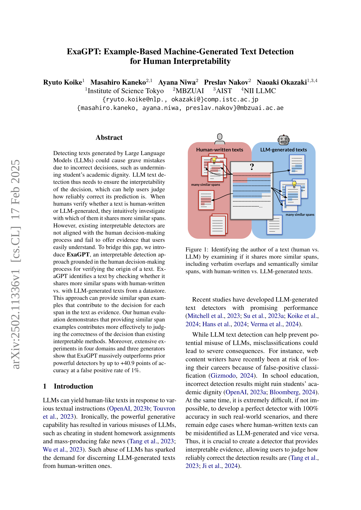
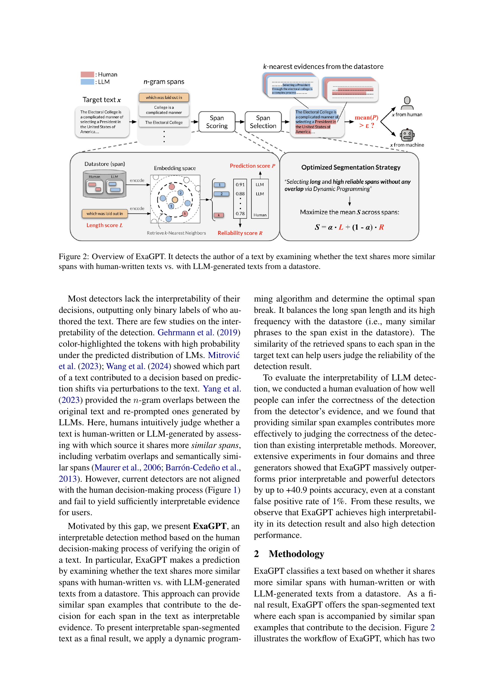
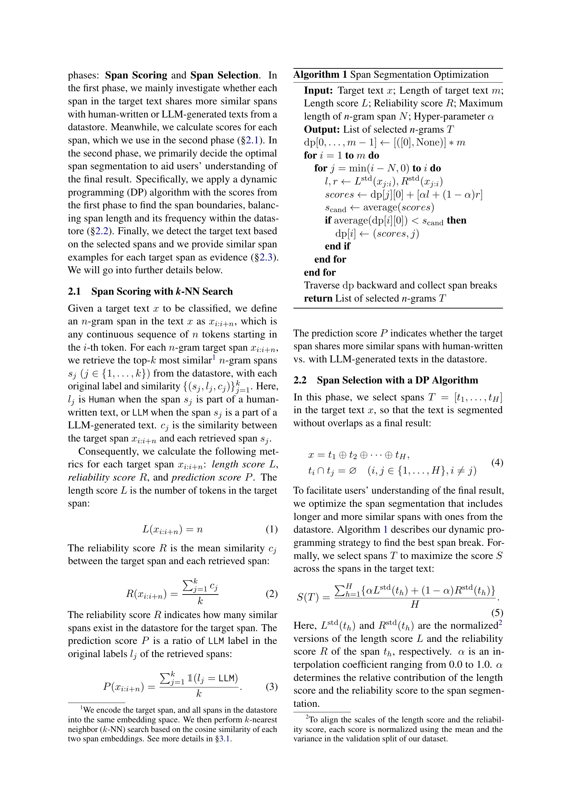
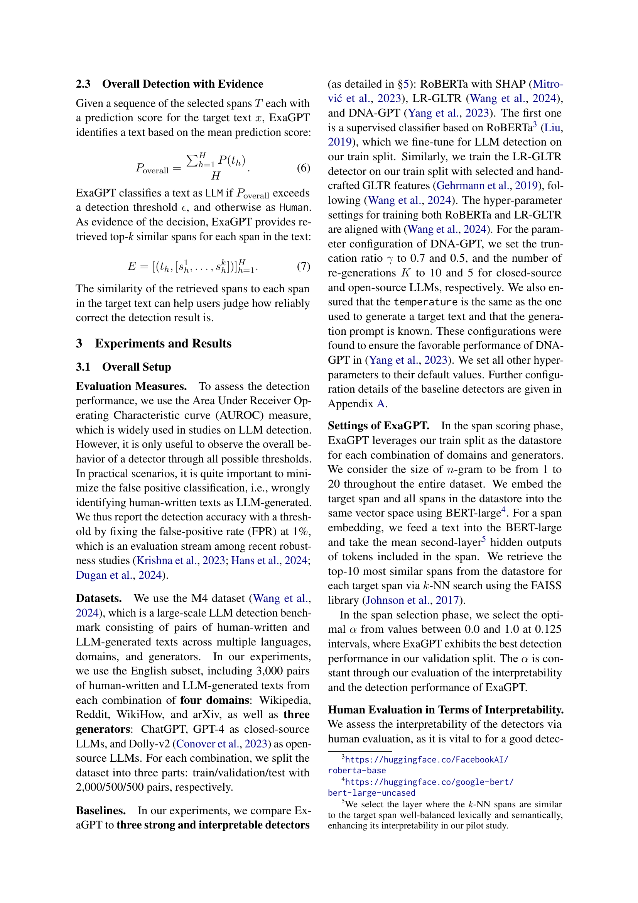
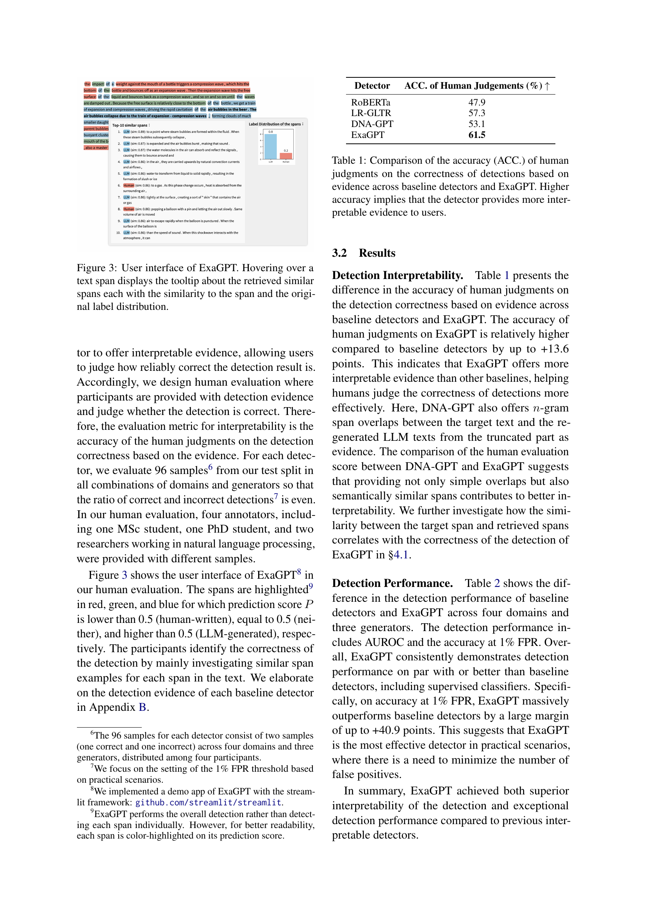
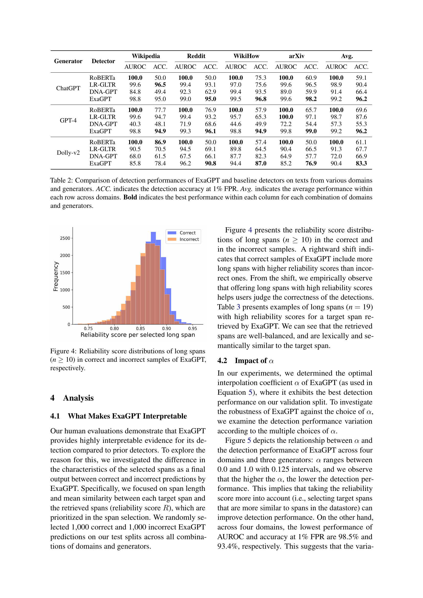
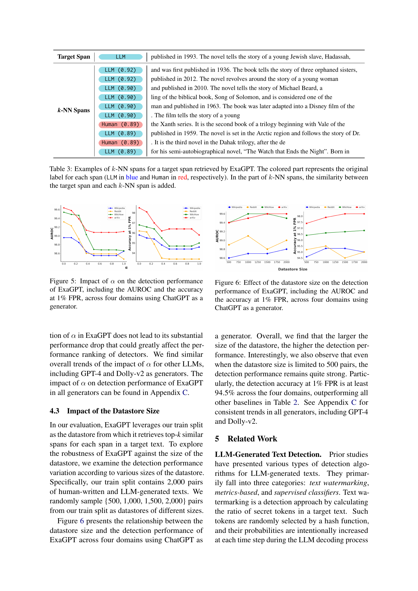
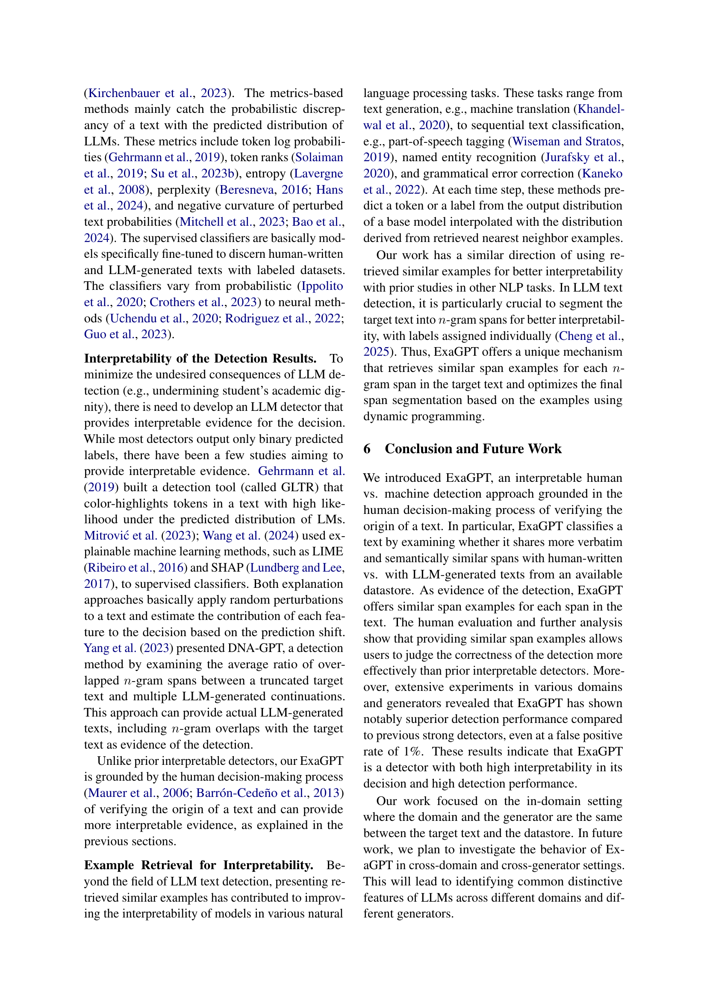
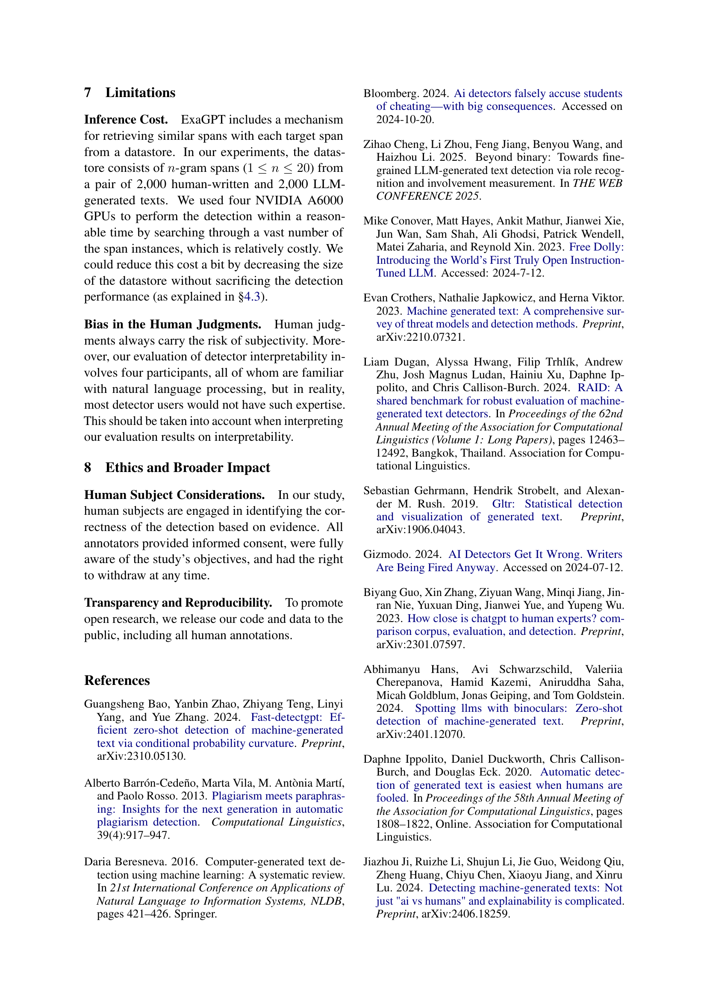
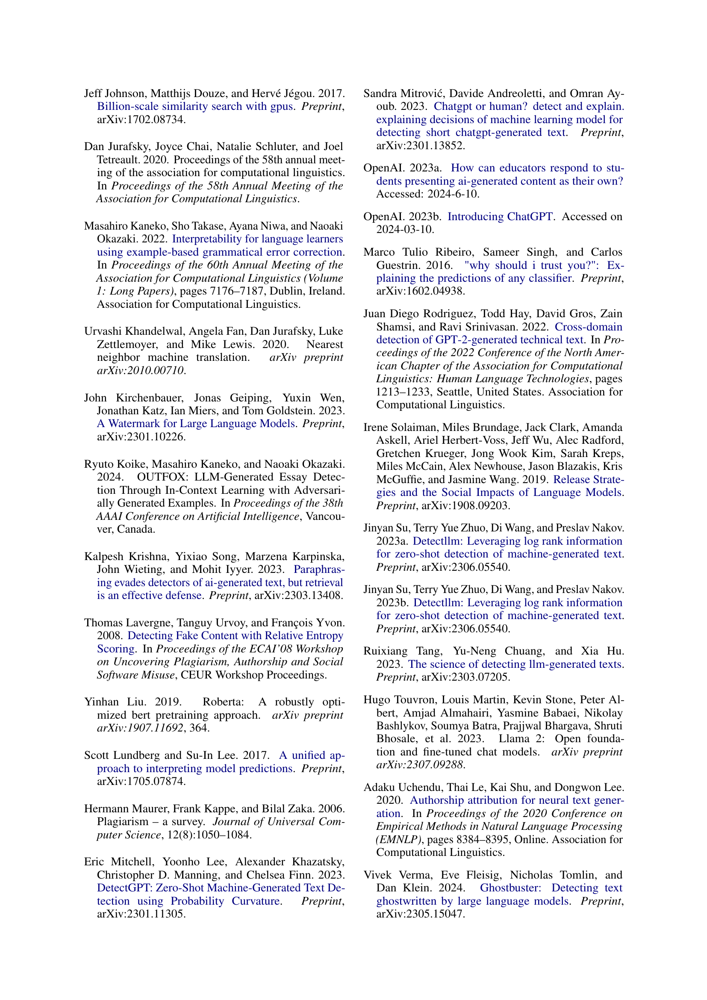
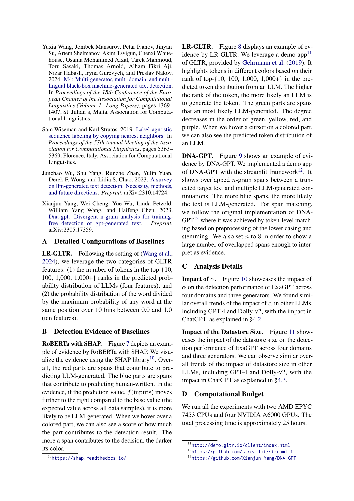
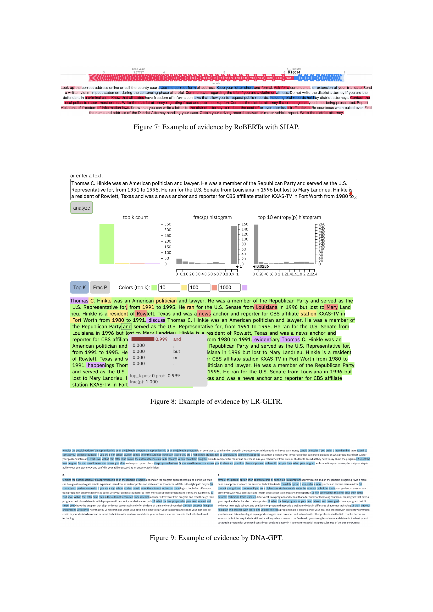
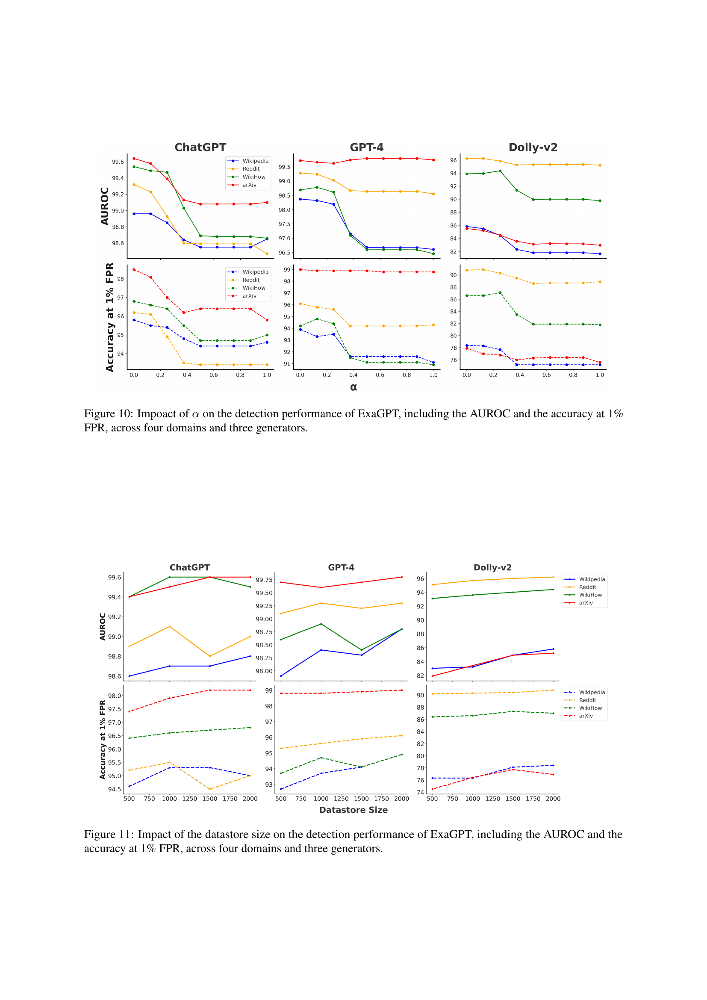
